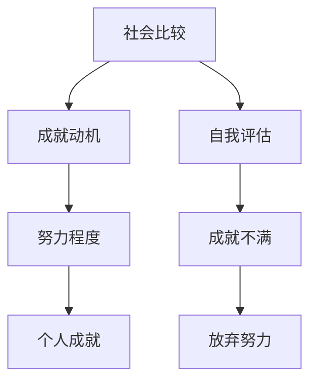

                 

# 引言

在当今社会，个人成就和成功常常被看作是一个人在社会竞争中脱颖而出的关键。然而，随着社交媒体的普及和社会信息的透明化，人们不可避免地陷入了一种比较的泥沼。这种社会比较不仅给人们带来了巨大的心理压力，还可能扭曲他们对个人成就的认知。为了重新审视并重新定义个人成就，我们需要从心理、行为和思维等多个角度来探讨如何摆脱社会比较的束缚。

本文将分为以下几个部分：

1. **核心概念与联系**：介绍社会比较、个人成就等核心概念，并探讨它们之间的联系。
2. **摆脱社会比较的策略**：从心理、行为和思维三个方面，提供一些具体的策略来帮助人们摆脱社会比较的束缚。
3. **重新定义个人成就的方法**：分享一些方法，帮助读者重新定义自己的个人成就。
4. **实际案例分析**：通过一些成功案例，展示如何将这些方法和策略应用于实践中。
5. **个人成长与提升**：探讨如何通过自我提升来实现个人成就的重新定义。

## 核心概念与联系

### 社会比较

社会比较是指个体通过将自己的行为、态度、观点或成就与他人进行比较，以评估自己的位置和价值的心理过程。这种比较可以是直接的，也可以是间接的。例如，一个人可能会通过观察他人的成功来衡量自己的失败，或者通过自己的成功来衡量他人的失败。

### 个人成就

个人成就通常指的是个体在某一领域内通过努力所取得的成功或进步。它可以是一个职业上的成就，也可以是一个个人目标，如完成一次马拉松比赛或学习一门新的语言。个人成就的定义因人而异，但通常与个体的努力、才能和决心有关。

### 社会比较与个人成就的关系

社会比较和个人成就之间存在着复杂的关系。一方面，社会比较可以激发个体的成就动机，促使他们追求更高的目标。例如，当一个人看到他的朋友在某个领域取得了显著成就时，他可能会被激发去努力工作，以追求类似的成功。

另一方面，社会比较也可能导致个体对个人成就的不满和焦虑。当一个人发现自己的成就远远落后于他人时，他可能会感到自卑或失落。这种负面情绪可能会抑制个体的成就动机，导致他们放弃努力或降低对成功的期望。

### Mermaid流程图

下面是一个简单的Mermaid流程图，展示了社会比较与个人成就之间的关系：

在社会比较的过程中，个体可能会感受到成就动机，促使他们更加努力。然而，如果这种比较导致自我评估不佳，可能会产生成就不满，进而导致放弃努力。相反，如果个体能够正确处理社会比较，他们将更有可能实现个人成就。

## 摆脱社会比较的策略

### 心理层面的策略

**自我接纳**：自我接纳是指个体接受自己的优点和缺点，认识到每个人都有自己的独特价值。通过自我接纳，个体可以减少对外界评价的依赖，更加关注自己的内在需求。

**情绪管理**：情绪管理是指个体学会识别、理解和处理自己的情绪。通过情绪管理，个体可以更好地应对社会比较带来的负面情绪，如焦虑、自卑或嫉妒。

### 行为层面的策略

**社交选择**：社交选择是指个体选择与那些能够带来积极影响的人为伍。通过选择与那些专注于个人成长的人交往，个体可以减少负面社会比较的机会。

**媒体消费习惯**：媒体消费习惯是指个体对媒体信息的消费方式。通过减少对负面信息的消费，如社交媒体上的攀比内容，个体可以减少社会比较的影响。

### 思维层面的策略

**正念练习**：正念练习是指个体通过专注于当前时刻，减少对过去或未来的担忧。通过正念练习，个体可以更好地专注于自己的内心世界，减少社会比较的干扰。

**接受不完美**：接受不完美是指个体认识到每个人都有自己的局限性和不完美之处。通过接受不完美，个体可以减少对自己和他人的过高期望，从而减少社会比较的负面影响。

### 跨文化比较的挑战与应对

**文化差异的影响**：不同文化对个人成就的看法和评价标准可能存在差异。例如，一些文化可能更注重集体荣誉，而另一些文化可能更注重个人成就。这种文化差异可能会影响个体对社会比较的反应。

**跨文化沟通技巧**：为了应对跨文化比较的挑战，个体需要学会跨文化沟通技巧，如尊重不同的价值观和期望，避免过度比较。

## 重新定义个人成就

### 成就的重新定义

重新定义个人成就意味着超越传统的成功标准，认识到每个人的价值和成就都是独特的。这种重新定义可以帮助个体减少对他人成就的过度比较，更加专注于自己的成长和进步。

### 目标设定的艺术

**SMART目标设定法则**：SMART目标是一种明确、具体、可实现、相关和有时限的目标设定方法。通过使用SMART目标，个体可以更加清晰地定义自己的成就目标，从而减少模糊和不确定性。

**目标调整的策略**：在实现个人成就的过程中，个体可能会遇到各种挑战和障碍。通过灵活调整目标，个体可以更好地应对这些挑战，并保持前进的动力。

### 成长与自我提升

**学习习惯的培养**：通过培养良好的学习习惯，个体可以持续提升自己的能力和知识，从而实现个人成就的不断提升。

**自我提升的路径**：不同的个体可能有不同的自我提升路径。通过探索和尝试，个体可以找到最适合自己的成长路径，从而实现个人成就的重新定义。

### 成就的评估与反思

**成就的可持续性**：个体需要定期评估自己的成就，确保它们是可持续的，并且与自己的长期目标相符。

**反思与调整**：通过反思个人成就的过程，个体可以识别出哪些策略和方法是有效的，哪些需要调整或改进。这种反思与调整有助于个体不断优化自己的成长路径。

## 实际案例分析

### 案例一：从竞争者到合作者

张三是一位软件工程师，他一直以同事李四的成功为标准来衡量自己的职业成就。然而，这种比较让他感到越来越焦虑和失落。在一次团队项目中，张三决定尝试一个新的策略——与李四合作，而不是与他竞争。通过合作，张三不仅学到了很多新的技能，还发现自己的能力和潜力远远超过了之前的认知。最终，他不仅实现了个人成就，还帮助团队取得了显著的成功。

### 案例二：突破自我限制，实现自我价值

李四是张三的同事，她在职业生涯初期因为一次失败的项目而感到自卑。然而，她并没有放弃，而是通过反思和自我提升，逐渐突破了自我限制。她开始接受更多的挑战，并积极参与各种培训和项目。最终，她不仅成功完成了多个重要的项目，还成为公司的一名重要领导人。她的经历证明了通过自我提升，个体可以实现自我价值的重新定义。

### 案例三：跨领域学习，拓宽成就边界

王五是一位软件工程师，他对编程有着浓厚的兴趣。然而，他意识到仅仅在技术领域取得成就是不够的。于是，他开始学习其他领域的知识，如商业管理、市场营销等。通过跨领域学习，王五不仅拓宽了自己的知识边界，还找到了新的职业机会。他的经历表明，通过跨领域学习，个体可以重新定义自己的个人成就。

## 个人成长与提升

### 自我认知与定位

自我认知是指个体了解自己的兴趣、优势和价值观。通过自我认知，个体可以明确自己的定位，并找到最适合自己的成长路径。

### 制定个人成长计划

个人成长计划是指个体根据自我认知，制定出具体的学习和实践目标。通过制定个人成长计划，个体可以更加系统地提升自己的能力和知识。

### 持续反思与调整

持续反思是指个体在成长过程中不断回顾和评估自己的表现，识别出需要改进的地方。通过持续反思，个体可以不断调整自己的成长策略，以实现个人成就的不断提升。

## 结论

社会比较和个人成就之间的关系是复杂而微妙的。通过本文的讨论，我们认识到社会比较可能会对个人成就产生积极或消极的影响。为了摆脱社会比较的束缚，我们需要从心理、行为和思维等多个角度来采取策略，并重新定义个人成就。通过自我提升和持续反思，我们可以实现个人成就的重新定义，并在实现个人价值的同时，为社会做出更大的贡献。

### 附录

#### 延伸阅读

- Duckworth, A. L., & Seligman, M. E. P. (2005). Self-discipline outdoes IQ in predicting academic performance of adolescents. Psychological Science, 16(12), 939-944.
- Heath, C., & Heath, D. (2010). Switch: How to Change Things When Change Is Hard. Crown Business.

#### 相关资源与工具

- **正念练习应用**：Headspace, Calm
- **情绪管理工具**：Moodfit, Moodpath
- **个人成长计划工具**：Asana, Trello

---

# 重新定义个人成就：摆脱社会比较的束缚

> 关键词：个人成就，社会比较，自我提升，心理策略，行为策略，思维策略

> 摘要：本文探讨了社会比较对个人成就的负面影响，并提出了心理、行为和思维层面的策略，帮助读者摆脱社会比较的束缚，重新定义个人成就。通过实际案例分析和个人成长与提升的方法，本文提供了实用的指导，帮助读者实现自我价值的提升。

作者：AI天才研究院/AI Genius Institute & 禅与计算机程序设计艺术 /Zen And The Art of Computer Programming

---

## 引言

在当今社会，个人成就和成功常常被看作是一个人在社会竞争中脱颖而出的关键。然而，随着社交媒体的普及和社会信息的透明化，人们不可避免地陷入了一种比较的泥沼。这种社会比较不仅给人们带来了巨大的心理压力，还可能扭曲他们对个人成就的认知。为了重新审视并重新定义个人成就，我们需要从心理、行为和思维等多个角度来探讨如何摆脱社会比较的束缚。

本文将分为以下几个部分：

1. **核心概念与联系**：介绍社会比较、个人成就等核心概念，并探讨它们之间的联系。
2. **摆脱社会比较的策略**：从心理、行为和思维三个方面，提供一些具体的策略来帮助人们摆脱社会比较的束缚。
3. **重新定义个人成就的方法**：分享一些方法，帮助读者重新定义自己的个人成就。
4. **实际案例分析**：通过一些成功案例，展示如何将这些方法和策略应用于实践中。
5. **个人成长与提升**：探讨如何通过自我提升来实现个人成就的重新定义。

## 核心概念与联系

### 社会比较

社会比较是指个体通过将自己的行为、态度、观点或成就与他人进行比较，以评估自己的位置和价值的心理过程。这种比较可以是直接的，例如与他人面对面交流；也可以是间接的，例如通过社交媒体平台观察他人的生活。社会比较是人们日常生活中不可避免的一部分，它有助于个体了解自己的位置，但同时也可能带来负面影响。

### 个人成就

个人成就通常指的是个体在某一领域内通过努力所取得的成功或进步。它可以是一个职业上的成就，如获得晋升或项目成功；也可以是一个个人目标，如完成马拉松或学习一门新技能。个人成就的定义因人而异，但通常与个体的努力、才能和决心有关。

### 社会比较与个人成就的关系

社会比较和个人成就之间存在着复杂的关系。一方面，社会比较可以激发个体的成就动机，促使他们追求更高的目标。例如，当一个人看到他的朋友在某个领域取得了显著成就时，他可能会被激发去努力工作，以追求类似的成功。

另一方面，社会比较也可能导致个体对个人成就的不满和焦虑。当一个人发现自己的成就远远落后于他人时，他可能会感到自卑或失落。这种负面情绪可能会抑制个体的成就动机，导致他们放弃努力或降低对成功的期望。

### Mermaid流程图

下面是一个简单的Mermaid流程图，展示了社会比较与个人成就之间的关系：

在社会比较的过程中，个体可能会感受到成就动机，促使他们更加努力。然而，如果这种比较导致自我评估不佳，可能会产生成就不满，进而导致放弃努力。相反，如果个体能够正确处理社会比较，他们将更有可能实现个人成就。

## 摆脱社会比较的策略

### 心理层面的策略

**自我接纳**：自我接纳是指个体接受自己的优点和缺点，认识到每个人都有自己的独特价值。通过自我接纳，个体可以减少对外界评价的依赖，更加关注自己的内在需求。

**情绪管理**：情绪管理是指个体学会识别、理解和处理自己的情绪。通过情绪管理，个体可以更好地应对社会比较带来的负面情绪，如焦虑、自卑或嫉妒。

### 行为层面的策略

**社交选择**：社交选择是指个体选择与那些能够带来积极影响的人为伍。通过选择与那些专注于个人成长的人交往，个体可以减少负面社会比较的机会。

**媒体消费习惯**：媒体消费习惯是指个体对媒体信息的消费方式。通过减少对负面信息的消费，如社交媒体上的攀比内容，个体可以减少社会比较的影响。

### 思维层面的策略

**正念练习**：正念练习是指个体通过专注于当前时刻，减少对过去或未来的担忧。通过正念练习，个体可以更好地专注于自己的内心世界，减少社会比较的干扰。

**接受不完美**：接受不完美是指个体认识到每个人都有自己的局限性和不完美之处。通过接受不完美，个体可以减少对自己和他人的过高期望，从而减少社会比较的负面影响。

### 跨文化比较的挑战与应对

**文化差异的影响**：不同文化对个人成就的看法和评价标准可能存在差异。例如，一些文化可能更注重集体荣誉，而另一些文化可能更注重个人成就。这种文化差异可能会影响个体对社会比较的反应。

**跨文化沟通技巧**：为了应对跨文化比较的挑战，个体需要学会跨文化沟通技巧，如尊重不同的价值观和期望，避免过度比较。

## 重新定义个人成就

### 成就的重新定义

重新定义个人成就意味着超越传统的成功标准，认识到每个人的价值和成就都是独特的。这种重新定义可以帮助个体减少对他人成就的过度比较，更加专注于自己的成长和进步。

### 目标设定的艺术

**SMART目标设定法则**：SMART目标是一种明确、具体、可实现、相关和有时限的目标设定方法。通过使用SMART目标，个体可以更加清晰地定义自己的成就目标，从而减少模糊和不确定性。

**目标调整的策略**：在实现个人成就的过程中，个体可能会遇到各种挑战和障碍。通过灵活调整目标，个体可以更好地应对这些挑战，并保持前进的动力。

### 成长与自我提升

**学习习惯的培养**：通过培养良好的学习习惯，个体可以持续提升自己的能力和知识，从而实现个人成就的不断提升。

**自我提升的路径**：不同的个体可能有不同的自我提升路径。通过探索和尝试，个体可以找到最适合自己的成长路径，从而实现个人成就的重新定义。

### 成就的评估与反思

**成就的可持续性**：个体需要定期评估自己的成就，确保它们是可持续的，并且与自己的长期目标相符。

**反思与调整**：通过反思个人成就的过程，个体可以识别出哪些策略和方法是有效的，哪些需要调整或改进。这种反思与调整有助于个体不断优化自己的成长路径。

## 实际案例分析

### 案例一：从竞争者到合作者

张三是一位软件工程师，他一直以同事李四的成功为标准来衡量自己的职业成就。然而，这种比较让他感到越来越焦虑和失落。在一次团队项目中，张三决定尝试一个新的策略——与李四合作，而不是与他竞争。通过合作，张三不仅学到了很多新的技能，还发现自己的能力和潜力远远超过了之前的认知。最终，他不仅实现了个人成就，还帮助团队取得了显著的成功。

### 案例二：突破自我限制，实现自我价值

李四是张三的同事，她在职业生涯初期因为一次失败的项目而感到自卑。然而，她并没有放弃，而是通过反思和自我提升，逐渐突破了自我限制。她开始接受更多的挑战，并积极参与各种培训和项目。最终，她不仅成功完成了多个重要的项目，还成为公司的一名重要领导人。她的经历证明了通过自我提升，个体可以实现自我价值的重新定义。

### 案例三：跨领域学习，拓宽成就边界

王五是一位软件工程师，他对编程有着浓厚的兴趣。然而，他意识到仅仅在技术领域取得成就是不够的。于是，他开始学习其他领域的知识，如商业管理、市场营销等。通过跨领域学习，王五不仅拓宽了自己的知识边界，还找到了新的职业机会。他的经历表明，通过跨领域学习，个体可以重新定义自己的个人成就。

## 个人成长与提升

### 自我认知与定位

自我认知是指个体了解自己的兴趣、优势和价值观。通过自我认知，个体可以明确自己的定位，并找到最适合自己的成长路径。

### 制定个人成长计划

个人成长计划是指个体根据自我认知，制定出具体的学习和实践目标。通过制定个人成长计划，个体可以更加系统地提升自己的能力和知识。

### 持续反思与调整

持续反思是指个体在成长过程中不断回顾和评估自己的表现，识别出需要改进的地方。通过持续反思，个体可以不断调整自己的成长策略，以实现个人成就的不断提升。

## 结论

社会比较和个人成就之间的关系是复杂而微妙的。通过本文的讨论，我们认识到社会比较可能会对个人成就产生积极或消极的影响。为了摆脱社会比较的束缚，我们需要从心理、行为和思维等多个角度来采取策略，并重新定义个人成就。通过自我提升和持续反思，我们可以实现个人成就的重新定义，并在实现个人价值的同时，为社会做出更大的贡献。

### 附录

#### 延伸阅读

- Duckworth, A. L., & Seligman, M. E. P. (2005). Self-discipline outdoes IQ in predicting academic performance of adolescents. Psychological Science, 16(12), 939-944.
- Heath, C., & Heath, D. (2010). Switch: How to Change Things When Change Is Hard. Crown Business.

#### 相关资源与工具

- **正念练习应用**：Headspace, Calm
- **情绪管理工具**：Moodfit, Moodpath
- **个人成长计划工具**：Asana, Trello

---

本文通过介绍社会比较和个人成就的概念，探讨了社会比较对个人成就的负面影响，并提出了一系列心理、行为和思维层面的策略来帮助读者摆脱社会比较的束缚。通过重新定义个人成就，读者可以更专注于自己的成长和进步，实现自我价值的提升。同时，通过实际案例分析和个人成长与提升的方法，本文为读者提供了实用的指导。希望本文能帮助读者摆脱社会比较的困扰，重新定义个人成就，实现更加有意义和满足的生活。作者：AI天才研究院/AI Genius Institute & 禅与计算机程序设计艺术 /Zen And The Art of Computer Programming。如果您对本文有任何反馈或建议，欢迎在评论区留言。让我们共同努力，摆脱社会比较的束缚，追求真正的个人成就。

