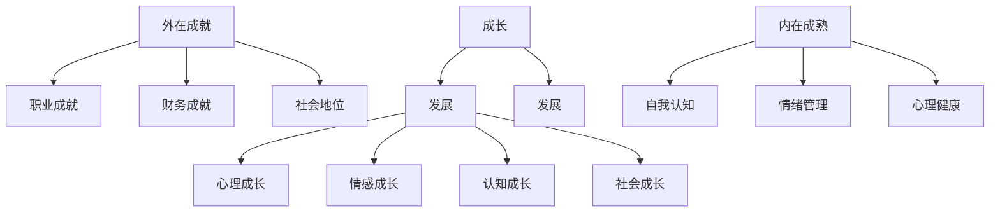
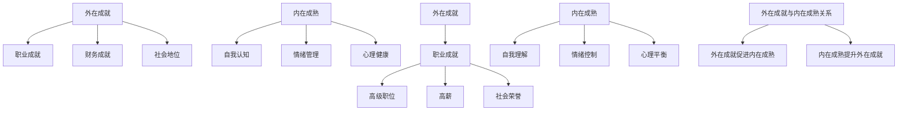
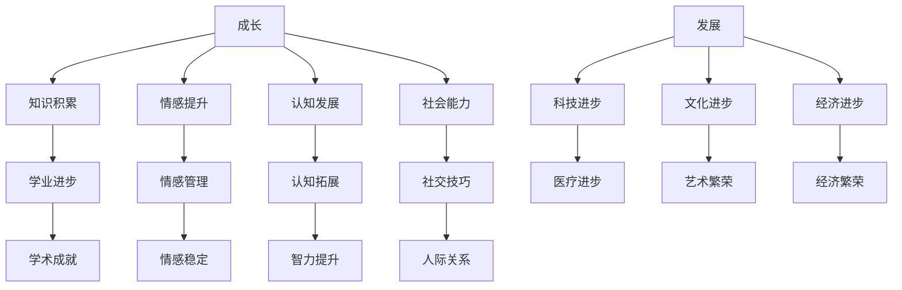

                 

### 引言

在现代社会中，个人成长是一个永恒的主题。无论是职场人士、学生，还是家庭主妇，每个人都渴望在成长的道路上不断进步，实现自我价值。然而，随着社会竞争的加剧和压力的增大，很多人对成长的理解和路径产生了困惑。传统的观念往往将外在成就视为个人成长的唯一标志，诸如财富、地位、荣誉等成为衡量成功的标准。但这样的观念是否全面和正确呢？

本文旨在重新定义个人成长，从外在成就转向内在成熟，提出一种更加全面和深刻的成长理念。本文将通过以下几个方面进行探讨：

1. **个人成长的核心要素**：明确成长与发展的定义、过程及其关系，以及外在成就与内在成熟的概念和联系。
2. **个人成长的动力与障碍**：分析自我认知、目标设定、信念等因素如何驱动个人成长，以及内在恐惧、社会压力等障碍如何影响个人成长。
3. **从外在成就到内在成熟的理论基础**：介绍成长心理学和成熟度理论，探讨这些理论对个人成长的影响。
4. **外在成就的评估与调整**：介绍外在成就的评估方法和调整原则，并结合案例进行分析。
5. **内在成熟的培养**：探讨内在成熟的核心要素和培养方法，提供具体实践策略。
6. **外在成就与内在成熟的平衡**：阐述平衡的重要性，提出实现平衡的策略和方法。
7. **个人成长的可持续性**：分析家庭环境、学校教育和社会环境对个人成长的影响，并提出个人成长可持续发展的策略。

通过上述分析，本文希望帮助读者深刻理解个人成长的多维度内涵，摆脱单一的外在成就观念，实现从外在成就到内在成熟的转变，从而达到更高层次的个人成长。

### 背景介绍

个人成长是一个多维度、多层次的过程，它不仅仅包括职业成就、财务收入、社会地位等外在指标，更重要的是内在的心理素质和情感智慧。然而，长期以来，社会普遍存在一种倾向，即过度强调外在成就，而忽视内在成熟。这种现象在某种程度上源于人类的生物本能和社会文化的共同影响。

首先，从生物本能来看，人类作为一种生物体，天生追求生存和繁衍。因此，外在成就如财富、地位等，可以提供物质保障和社会认可，有助于提高个体的生存能力。这种追求外在成就的本能驱使人们在职场和生活中不断努力，追求更高的目标。

其次，社会文化也是影响个人成长观念的重要因素。不同文化背景下，对成功的定义和衡量标准有所不同。在许多社会文化中，外在成就如财富、地位、荣誉等被视为成功的主要标志。这种文化观念在一定程度上塑造了人们的价值观，使人们将外在成就视为个人成长的终极目标。

然而，随着时代的发展和人们生活水平的提高，越来越多的人开始意识到，外在成就并不能完全代表一个人的成功和幸福。内在成熟，如自我认知、情绪管理、心理健康等，同样重要，甚至更为重要。这是因为，外在成就只能提供短暂的满足感和安全感，而内在成熟则能够带来持久的心灵平静和成长动力。

现代社会中，人们面临的压力和挑战越来越多，这些问题往往源自内心深处。例如，自我认知不足导致自我怀疑和焦虑，情绪管理不当导致人际关系紧张和冲突，心理健康问题导致生活质量下降。这些问题不仅影响到个人的生活和工作，还会对整个社会产生负面影响。

因此，重新定义个人成长，从外在成就转向内在成熟，具有重要的现实意义。通过关注内在成熟，人们可以更好地应对生活中的各种挑战，实现全面而深入的自我发展。内在成熟不仅有助于提升个人的心理素质和情感智慧，还可以促进社会和谐与进步。

总之，重新定义个人成长，从外在成就到内在成熟的转变，是对传统成长观念的深刻反思和重新审视。这一转变不仅有助于个体实现更高的成长目标，也对社会的健康发展具有重要意义。接下来，本文将深入探讨个人成长的核心要素，包括成长与发展的概念、外在成就与内在成熟的对比等，以帮助读者全面理解这一转变的内涵和意义。

### 核心概念与联系

在探讨个人成长的过程中，理解核心概念和它们之间的联系至关重要。以下将详细阐述成长与发展的定义、外在成就与内在成熟的概念，以及它们之间的内在关系。

#### 成长与发展的定义

**成长**通常指的是个体在心理、情感、认知和社会能力等方面的提升和进步。它不仅涉及知识和技能的积累，还包括自我意识和情感的深化。**发展**则是一个更广泛的概念，不仅涵盖个人层面的成长，还包括社会、文化和经济层面的进步。发展往往涉及更加系统和结构化的变化，而成长则更多地强调个体内在的变化和提升。

**关系架构 Mermaid 流程图**：

#### 外在成就的内涵

**外在成就**通常指的是个体在物质和社会方面获得的成就，包括职业成就、财务收入、社会地位等。外在成就往往容易量化，可以通过各种指标进行评估。例如，一个人可能在职业生涯中获得高级职位、获得高薪、赢得社会荣誉等，这些都属于外在成就。

**内在成熟的内涵**

**内在成熟**则是指个体在心理、情感和道德方面的成熟度，涉及自我认知、情绪管理、心理健康等方面。内在成熟更难以量化，但却是个人成长中至关重要的部分。一个内在成熟的人通常能够更好地理解自己，管理自己的情绪，保持心理健康，并建立积极的人际关系。

**关系架构 Mermaid 流程图**：

#### 外在成就与内在成熟的关系

外在成就和内在成熟之间存在着复杂而微妙的关系。一方面，外在成就可以为个体带来物质和社会的认可，有助于提升自信和满足感。然而，外在成就并不能完全代表一个人的内在成熟。一个外在成就显著的人，如果缺乏内在成熟，可能会面临心理健康问题，如焦虑、抑郁等。

另一方面，内在成熟可以促进外在成就的实现。一个内在成熟的人，通常拥有更好的自我认知、情绪管理和心理健康，这些品质有助于他们在职业生涯和社交场合中取得更好的表现。此外，内在成熟还可以帮助个体更好地应对生活中的挑战和压力，从而在长期内保持稳定和持续的成就。

**总结**：
外在成就和内在成熟是个人成长中不可分割的两个方面。外在成就提供了物质和社会的认可，而内在成熟则提供了心理和情感的支撑。一个真正成熟的人，不仅需要在职业和社会方面取得成就，更需要具备良好的自我认知、情绪管理和心理健康。只有当外在成就与内在成熟相辅相成时，个人才能实现全面而深入的成长。

通过上述核心概念和联系的分析，我们为接下来讨论个人成长的动力与障碍、理论基础等提供了坚实的基础。在接下来的章节中，我们将进一步探讨这些概念在实际生活中的应用和实现策略。

### 核心概念与联系

在探讨个人成长的过程中，理解核心概念和它们之间的联系至关重要。以下将详细阐述成长与发展的定义、外在成就与内在成熟的概念，以及它们之间的内在关系。

#### 成长与发展的定义

**成长**通常指的是个体在心理、情感、认知和社会能力等方面的提升和进步。它不仅涉及知识和技能的积累，还包括自我意识和情感的深化。**发展**则是一个更广泛的概念，不仅涵盖个人层面的成长，还包括社会、文化和经济层面的进步。发展往往涉及更加系统和结构化的变化，而成长则更多地强调个体内在的变化和提升。

**关系架构 Mermaid 流程图**：

#### 外在成就的内涵

**外在成就**通常指的是个体在物质和社会方面获得的成就，包括职业成就、财务收入、社会地位等。外在成就往往容易量化，可以通过各种指标进行评估。例如，一个人可能在职业生涯中获得高级职位、获得高薪、赢得社会荣誉等，这些都属于外在成就。

**内在成熟的内涵**

**内在成熟**则是指个体在心理、情感和道德方面的成熟度，涉及自我认知、情绪管理、心理健康等方面。内在成熟更难以量化，但却是个人成长中至关重要的部分。一个内在成熟的人通常能够更好地理解自己，管理自己的情绪，保持心理健康，并建立积极的人际关系。

**关系架构 Mermaid 流程图**：

#### 外在成就与内在成熟的关系

外在成就和内在成熟之间存在着复杂而微妙的关系。一方面，外在成就可以为个体带来物质和社会的认可，有助于提升自信和满足感。然而，外在成就并不能完全代表一个人的内在成熟。一个外在成就显著的人，如果缺乏内在成熟，可能会面临心理健康问题，如焦虑、抑郁等。

另一方面，内在成熟可以促进外在成就的实现。一个内在成熟的人，通常拥有更好的自我认知、情绪管理和心理健康，这些品质有助于他们在职业生涯和社交场合中取得更好的表现。此外，内在成熟还可以帮助个体更好地应对生活中的挑战和压力，从而在长期内保持稳定和持续的成就。

**总结**：
外在成就和内在成熟是个人成长中不可分割的两个方面。外在成就提供了物质和社会的认可，而内在成熟则提供了心理和情感的支撑。一个真正成熟的人，不仅需要在职业和社会方面取得成就，更需要具备良好的自我认知、情绪管理和心理健康。只有当外在成就与内在成熟相辅相成时，个人才能实现全面而深入的成长。

通过上述核心概念和联系的分析，我们为接下来讨论个人成长的动力与障碍、理论基础等提供了坚实的基础。在接下来的章节中，我们将进一步探讨这些概念在实际生活中的应用和实现策略。

### 第1章：个人成长的核心要素

在探讨个人成长的过程中，理解其核心要素至关重要。这些核心要素不仅构成了个人成长的基础，也是实现全面发展的关键。本章节将详细讨论成长与发展的概念、外在成就的衡量标准、内在成熟的内涵，以及外在成就与内在成熟之间的关系，以帮助读者全面理解个人成长的本质。

#### 成长与发展的概念

**成长**是一个动态的过程，涉及到个体在各个方面的提升和进步。从心理学的角度来看，成长不仅包括知识和技能的积累，还包括情感、认知和社会能力的提升。例如，一个人可能在学业上取得了显著进步，同时也在情感管理和社会互动中变得更加成熟和自信。

**发展**则是一个更为广泛的概念，它不仅包括个人层面的成长，还包括社会、文化和经济层面的进步。发展通常涉及更加系统和结构化的变化，这些变化可以在个体层面、群体层面，甚至整个社会层面发生。例如，一个社会可能在科技、教育和公共卫生等方面取得显著进步，从而提升整体的生活质量。

**关系架构 Mermaid 流程图**：

#### 外在成就的衡量标准

外在成就通常指的是个体在物质和社会方面获得的成就，这些成就容易量化，可以通过各种指标进行评估。常见的衡量标准包括：

- **职业成就**：例如，获得高级职位、赢得行业奖项、晋升速度等。
- **财务成就**：例如，收入水平、投资回报、财富积累等。
- **社会地位**：例如，社会名望、声誉、社交网络等。

外在成就往往容易受到外界评价和认可，但它们只是个人成长的一部分，不能完全代表一个人的价值和成就。

#### 内在成熟的内涵

内在成熟是指个体在心理、情感和道德方面的成熟度，这些品质难以量化，但却是个人成长中至关重要的部分。内在成熟包括以下方面：

- **自我认知**：个体对自己有清晰和准确的认识，了解自己的优点和不足，以及自己的价值观和目标。
- **情绪管理**：个体能够有效地控制和管理自己的情绪，保持心理平衡和稳定性。
- **心理健康**：个体具备良好的心理健康，能够积极应对生活中的各种挑战和压力。

内在成熟不仅有助于提升个人的生活质量和幸福感，还能促进外在成就的实现。

#### 外在成就与内在成熟的关系

外在成就和内在成熟之间存在密切的关系。一方面，外在成就可以为个体带来物质和社会的认可，有助于提升自信和满足感。然而，外在成就并不能完全代表一个人的内在成熟。一个外在成就显著的人，如果缺乏内在成熟，可能会面临心理健康问题，如焦虑、抑郁等。

另一方面，内在成熟可以促进外在成就的实现。一个内在成熟的人，通常拥有更好的自我认知、情绪管理和心理健康，这些品质有助于他们在职业生涯和社交场合中取得更好的表现。此外，内在成熟还可以帮助个体更好地应对生活中的挑战和压力，从而在长期内保持稳定和持续的成就。

**总结**：
个人成长的核心要素包括成长与发展的概念、外在成就的衡量标准、内在成熟的内涵，以及外在成就与内在成熟之间的关系。理解这些核心要素，可以帮助我们更好地认识个人成长的过程和目标，从而实现全面而深入的自我发展。在接下来的章节中，我们将进一步探讨个人成长的动力与障碍，以及如何从外在成就转向内在成熟。

### 第2章：个人成长的动力与障碍

在个人成长的道路上，动力和障碍是影响个体进步的重要因素。本章节将深入探讨个人成长的主要动力因素，如自我认知、目标设定和信念，以及常见的成长障碍，包括内在恐惧、社会压力和自我怀疑。此外，还将提供克服这些障碍的策略，以帮助读者在个人成长过程中不断前进。

#### 动力因素

**自我认知**

自我认知是个人成长的重要动力之一。通过深入了解自己的性格、兴趣、价值观和优势，个体可以更好地理解自己的需求和目标。自我认知有助于个体明确自己的长处和短处，从而制定更合适的成长计划。例如，一个人如果认识到自己在沟通能力上的不足，可能会主动参加公共演讲课程，提高自己的表达能力。

**目标设定**

目标设定是推动个人成长的另一个关键动力。设定明确、具体和可衡量的目标可以帮助个体保持动力和方向。目标可以分为短期和长期目标，例如，短期内提升某一技能，长期内实现职业晋升或创业。通过设定目标，个体可以更有针对性地进行学习和努力，从而实现个人成长。

**信念**

信念是个人成长的重要精神支柱。一个坚定的信念可以帮助个体在面对困难和挑战时保持积极的态度。信念可以来源于个人的价值观、人生哲学或对未来的期望。例如，一个对科技充满热情的创业者，即使面临重重困难，也会坚信自己的梦想最终会实现。

#### 成长障碍

**内在恐惧**

内在恐惧是个人成长过程中常见的障碍。这些恐惧可能源于对未知的恐惧、对失败的恐惧，或者对自我能力的怀疑。内在恐惧会阻碍个体尝试新事物、接受挑战和冒险。克服内在恐惧的方法包括逐步面对恐惧、学习放松技巧和培养自信心。

**社会压力**

社会压力是另一个影响个人成长的障碍。社会期望、家庭责任和工作压力都可能对个体产生负面影响。社会压力可能导致个体产生焦虑、抑郁等情绪问题，从而影响个人成长。应对社会压力的方法包括设定优先级、学会拒绝和寻求支持。

**自我怀疑**

自我怀疑是指个体对自己的能力和价值产生怀疑。这种怀疑可能导致个体缺乏自信，从而影响个人成长。克服自我怀疑的方法包括积极自我对话、寻找支持和反馈，以及通过成就和进步来验证自我价值。

#### 克服成长障碍的策略

**自我反思**

自我反思是克服成长障碍的重要方法。通过定期进行自我反思，个体可以更好地了解自己的情绪、想法和行为模式。自我反思可以帮助个体识别自己的优点和不足，从而制定更有效的成长计划。

**积极心态**

保持积极心态是克服成长障碍的关键。积极心态可以帮助个体看到问题的解决方法，而不是仅仅关注问题本身。培养积极心态的方法包括专注于成功经验、寻找正面榜样和练习感恩。

**持续学习**

持续学习是个人成长的重要动力。通过不断学习新知识和技能，个体可以保持竞争力，适应不断变化的环境。学习的方法包括阅读、参加课程、实践和应用。

**寻求支持**

寻求支持是克服成长障碍的有效策略。通过与他人交流、寻求指导和建议，个体可以获得新的视角和解决问题的方法。支持可以来源于家人、朋友、导师或专业顾问。

**总结**：
个人成长的过程充满了动力和障碍。通过深入了解自我、设定明确目标、坚定信念，以及克服内在恐惧、社会压力和自我怀疑等障碍，个体可以实现在职业、情感和心理健康等方面的全面发展。在接下来的章节中，我们将进一步探讨从外在成就到内在成熟转变的理论基础，以帮助读者理解这一成长路径的科学依据。

### 第3章：从外在成就到内在成熟转变的理论基础

在探讨个人成长的转变过程中，理解外在成就与内在成熟之间的关系是非常重要的。本文将从成长心理学和成熟度理论两个方面，深入分析这一转变的理论基础。

#### 成长心理学理论

**1. 成长心理学的起源与发展**

成长心理学是心理学的一个分支，主要研究人类在各个发展阶段的行为、心理和认知变化。该领域起源于20世纪中叶，随着人类寿命的延长和人类对自我发展的关注增加，成长心理学逐渐成为一个独立的研究领域。

成长心理学的发展经历了几个重要阶段。早期的研究主要关注儿童的发展，如皮亚杰的认知发展理论和埃里克森的心理社会发展理论。这些理论揭示了人类在不同年龄阶段的成长过程和心理特点。随着研究的深入，成长心理学的应用领域也不断扩展，包括成年期、老年期以及特殊人群的发展。

**2. 成长心理学的核心理论**

（1）**皮亚杰的认知发展理论**

让·皮亚杰是成长心理学领域的奠基人之一，他提出了认知发展的四个阶段：感知运动阶段、前运算阶段、具体运算阶段和形式运算阶段。这些阶段反映了个体从出生到成年在认知能力上的发展。

- **感知运动阶段（0-2岁）**：个体主要通过感知和动作来理解和适应环境。
- **前运算阶段（2-7岁）**：个体开始使用语言和符号，但他们的思维仍然以自我为中心，缺乏逻辑性。
- **具体运算阶段（7-11岁）**：个体能够进行逻辑推理，但他们的思维仍然依赖于具体的事物。
- **形式运算阶段（11-16岁及以上）**：个体能够进行抽象思维，逻辑推理能力达到顶峰。

（2）**埃里克森的心理社会发展理论**

埃里克森提出了心理社会发展理论，将个人成长划分为八个阶段，每个阶段都有特定的任务和挑战。

- **婴儿期（0-1岁）**：任务是建立信任感，克服不信任感。
- **幼儿期（1-3岁）**：任务是培养自主性，克服羞愧和疑虑。
- **学龄前期（3-6岁）**：任务是培养勤奋感，克服自卑。
- **学龄期（6-12岁）**：任务是发展同一性，避免角色混乱。
- **青春期（12-18岁）**：任务是建立亲密感，避免孤独感。
- **成年早期（18-40岁）**：任务是建立家庭，培养生育感。
- **成年中期（40-65岁）**：任务是获得成就感，避免停滞感。
- **成年晚期（65岁及以上）**：任务是接受死亡，避免绝望感。

**3. 成长心理学对个人成长的影响**

成长心理学的理论为理解个人成长提供了重要的视角。通过了解不同阶段的成长任务和挑战，个体可以更好地规划自己的成长路径，识别和克服成长中的障碍。

#### 成熟度理论

**1. 成熟度的定义与特征**

**成熟度**是指个体在心理、情感和道德等方面的成熟程度。它不仅涉及个体的认知能力，还包括情感智慧和道德素养。成熟度通常具有以下特征：

- **自我认知**：个体能够清晰地认识自己，包括自己的优点、缺点和价值观。
- **情绪管理**：个体能够有效地控制和管理自己的情绪，保持心理平衡。
- **社会责任感**：个体能够理解和承担社会责任，关心他人和社会。
- **道德判断**：个体能够基于道德原则做出正确的决策和行动。

**2. 成熟度的发展阶段**

成熟度的发展是一个逐步提升的过程，通常可以分为几个阶段：

- **初级成熟度**：个体在基本的生活需求和自我保护方面表现出成熟行为。
- **中级成熟度**：个体在社交、工作和情感方面表现出较高的成熟度，能够建立稳定的人际关系。
- **高级成熟度**：个体在自我实现和社会贡献方面达到高度成熟，能够发挥自己的潜能，为社会的进步做出贡献。

**3. 成熟度对个人成长的影响**

成熟度对个人成长有着深远的影响。一个成熟度较高的个体通常能够更好地应对生活中的挑战，建立健康的人际关系，实现自我价值。成熟度不仅影响个体的心理健康，还影响其职业发展和社会适应能力。

#### 从外在成就到内在成熟的转变

外在成就和内在成熟之间存在着内在联系。外在成就可以为个体带来物质和社会的认可，但真正的成长和满足感来自于内在成熟。从外在成就到内在成熟的转变是一个逐步提升的过程，需要个体在认知、情感和道德等方面进行深刻的自我反思和提升。

**1. 理解外在成就的局限性**

外在成就虽然能够带来暂时的满足感和安全感，但它们并不能完全代表一个人的价值和成就。一个外在成就显著的人，如果缺乏内在成熟，可能会面临心理健康问题，如焦虑、抑郁等。因此，个体需要认识到外在成就的局限性，重视内在成长。

**2. 强化内在成熟的重要性**

内在成熟包括自我认知、情绪管理、心理健康和社会责任感等方面。通过提升内在成熟，个体可以更好地理解自己，管理自己的情绪，保持心理健康，并建立积极的人际关系。内在成熟不仅有助于提升个人的生活质量，还能促进外在成就的实现。

**3. 实现外在成就与内在成熟的平衡**

在个人成长的过程中，实现外在成就与内在成熟的平衡至关重要。个体需要设定明确的目标，在追求外在成就的同时，不断强化内在成熟。例如，一个职业人士可以通过设定职业目标，提升自己的专业技能，同时通过自我反思和情绪管理，提升自己的内在成熟度。

**总结**：
从外在成就到内在成熟的转变是个人成长的重要路径。通过理解成长心理学和成熟度理论，个体可以更好地认识自己的成长过程，识别和克服成长中的障碍。实现这一转变不仅需要个体在认知、情感和道德等方面进行自我提升，还需要个体在追求外在成就的同时，不断强化内在成熟。只有当外在成就与内在成熟相辅相成时，个体才能实现全面而深入的自我发展。

### 第4章：外在成就的评估与调整

在个人成长过程中，对外在成就的评估和调整是一个至关重要的环节。通过科学的评估方法，个体可以了解自己的外在成就水平，从而做出合理的调整和改进。本章将详细介绍外在成就的评估标准、评估方法和评估工具，并提供具体的调整原则和实践方法。

#### 外在成就的评估标准

外在成就的评估标准主要包括以下几个方面：

1. **职业成就**：包括职位晋升、项目成功、获得行业奖项等。
2. **财务成就**：包括收入水平、投资回报、财富积累等。
3. **社会地位**：包括社会名望、声誉、社交网络等。
4. **健康和幸福**：包括身体健康、心理幸福感、生活满意度等。

这些标准不仅反映了个体在物质和社会层面的成就，还涉及到个体的整体生活质量和幸福感。

#### 评估方法

1. **自我评估法**

自我评估法是指个体通过自我反思和自我分析，评估自己在各个方面的成就。这种方法有助于个体深入了解自己的外在成就，发现自己的优势和不足。具体步骤如下：

   - 写下自己在职业、财务、社会地位和健康方面的成就。
   - 分析这些成就的原因，识别自己的优势和不足。
   - 根据分析结果，设定下一步的目标和改进计划。

2. **他人评估法**

他人评估法是指通过他人的反馈和评价来评估自己的外在成就。这种方法可以提供外部视角，帮助个体更全面地了解自己的成就和不足。具体步骤如下：

   - 向信任的朋友、家人或同事征求他们对自己在各个方面的评价。
   - 分析他人的反馈，识别自己的优势和不足。
   - 根据反馈结果，调整自己的行为和计划。

3. **综合评估法**

综合评估法是将自我评估和他人评估相结合，通过多角度的评估来全面了解外在成就。这种方法可以提供更准确和全面的评估结果。具体步骤如下：

   - 进行自我评估，记录自己的成就和不足。
   - 向他人征求反馈，收集他们的评价和意见。
   - 将自我评估和他人评估的结果进行综合分析，识别自己的优势和不足。

#### 评估工具

1. **成就记录表**

成就记录表是一种常用的评估工具，用于记录和跟踪个体的外在成就。通过填写成就记录表，个体可以清晰地看到自己在各个方面的进步和成就。具体步骤如下：

   - 设定表格格式，包括日期、成就类型、成就描述、评价和改进计划等。
   - 定期填写表格，记录自己的成就和进步。
   - 定期回顾表格，分析自己的成就和不足，制定改进计划。

2. **360度评估**

360度评估是一种通过多角度评估个体外在成就的方法。这种方法通常涉及自我评估、上级评估、同事评估和下属评估等多个角度。具体步骤如下：

   - 设计评估问卷，包括职业成就、财务成就、社会地位和健康等方面的问题。
   - 收集评估结果，综合分析各个评估角度的反馈。
   - 根据评估结果，识别自己的优势和不足，制定改进计划。

#### 调整原则和实践方法

1. **明确目标**

在调整外在成就时，首先要明确自己的目标。目标应具体、可衡量，并符合自己的价值观和长远规划。具体步骤如下：

   - 设定短期和长期目标，确保目标的可实现性。
   - 将目标分解为具体的行动计划，制定时间表。

2. **持续学习**

持续学习是提升外在成就的重要途径。个体应不断学习新知识和技能，提升自己的专业能力和竞争力。具体步骤如下：

   - 制定学习计划，包括阅读、课程、实践等。
   - 定期评估学习效果，调整学习计划。

3. **积极心态**

保持积极心态有助于克服挫折和困难，提升外在成就。具体步骤如下：

   - 积极面对挑战，将困难视为成长的机会。
   - 培养感恩心态，珍惜已有的成就和资源。

4. **调整生活方式**

生活方式对外在成就也有重要影响。个体应合理安排时间，保持健康的生活习惯，提升工作效率。具体步骤如下：

   - 设定合理的作息时间，确保充足的休息和睡眠。
   - 均衡饮食，保持身体健康。
   - 定期锻炼，提升身体素质。

5. **寻求支持**

在调整外在成就的过程中，个体应寻求他人的支持和帮助。具体步骤如下：

   - 建立支持网络，包括家人、朋友、同事和导师等。
   - 积极寻求反馈和建议，改进自己的工作和行为。

#### 案例分析

**案例一：职业晋升**

小张是一名年轻的工程师，他希望在职业生涯中取得更高的成就。通过自我评估和他人评估，他发现自己在专业技能和项目执行方面表现出色，但在沟通能力和团队协作方面有待提升。

**调整方案**：

- 设定短期目标：提升沟通能力，参加沟通技巧培训。
- 持续学习：定期阅读相关书籍，参加线上课程。
- 积极心态：将沟通挑战视为成长的机会。
- 调整生活方式：合理安排时间，确保充足的休息和锻炼。

经过一段时间的调整，小张的沟通能力得到了显著提升，他在团队中的表现也受到了上级和同事的认可，最终成功晋升为项目经理。

**案例二：财务规划**

小李是一位年轻的创业者，他的公司在短期内取得了显著的成功，但同时也面临着财务压力和风险。他希望通过调整财务策略，实现财务的可持续发展。

**调整方案**：

- 明确目标：制定长期财务规划，确保公司的稳健发展。
- 持续学习：研究财务管理和风险控制的相关知识。
- 积极心态：面对财务挑战，保持乐观和自信。
- 调整生活方式：合理安排工作和生活，保持身心健康。

经过一系列调整，小李的公司在财务管理方面得到了显著改善，成功实现了财务的可持续发展。

#### 总结

外在成就的评估与调整是个人成长的重要环节。通过科学的评估方法和调整原则，个体可以全面了解自己的外在成就，制定合理的改进计划，从而实现自我提升和全面发展。在接下来的章节中，我们将进一步探讨内在成熟的培养方法和实践策略。

### 第5章：内在成熟的培养

内在成熟是个人成长过程中不可或缺的一部分，它涵盖了自我认知、情绪管理、人际关系和心理健康等多个方面。本章将详细探讨内在成熟的核心要素，并提供具体的培养方法和实践策略，帮助读者在日常生活中逐步提升自己的内在成熟度。

#### 自我认知的提升

**1. 自我认知的重要性**

自我认知是指个体对自己性格、能力、价值观和情感的理解和认识。自我认知的提升有助于个体明确自己的优点和不足，从而更好地规划个人成长路径。

**2. 培养自我认知的方法**

（1）**反思日记**

通过写反思日记，个体可以记录自己的情感、想法和行为，从而深入了解自己的内心世界。具体步骤如下：

- 每天花15-30分钟时间，写下自己的经历和感受。
- 分析日记中的内容，识别自己的情绪和行为模式。

（2）**角色扮演**

角色扮演是一种通过模拟不同情境来提升自我认知的方法。具体步骤如下：

- 设定一个具体的情境，例如面试、演讲或冲突处理。
- 模拟情境，观察自己的反应和表现。
- 分析模拟过程中的感受和行为，识别需要改进的地方。

**3. 实践策略**

- **定期进行自我反思**：每周至少花一天时间进行自我反思，回顾自己的成长和进步。
- **寻求反馈**：向信任的朋友、家人或导师寻求反馈，了解他们对自己行为的看法。

#### 情绪管理的强化

**1. 情绪管理的重要性**

情绪管理是指个体在情绪反应过程中，通过自我调节和控制来应对情绪波动。良好的情绪管理能力有助于个体保持心理平衡，提高生活质量。

**2. 培养情绪管理的方法**

（1）**情绪识别**

情绪识别是指个体能够识别和理解自己的情绪状态。具体步骤如下：

- 在日常生活中，留意自己的情绪变化，如愤怒、焦虑、喜悦等。
- 尝试用语言描述自己的情绪，例如“我现在感到很焦虑”。

（2）**情绪调节**

情绪调节是指个体在情绪波动时，通过采取有效策略来调整情绪。具体步骤如下：

- **深呼吸**：在感到紧张或焦虑时，尝试深呼吸，放松身体。
- **认知重构**：改变对事件的看法，例如将“我失败了”改为“这次失败让我学到了很多”。

**3. 实践策略**

- **培养情绪日志**：记录自己的情绪变化，分析情绪波动的原因。
- **练习放松技巧**：如瑜伽、冥想、按摩等，帮助缓解情绪压力。

#### 人际关系的优化

**1. 人际关系的重要性**

人际关系是指个体在社交活动中与他人的互动和联系。良好的人际关系有助于个体在工作和生活中获得支持，提升生活质量。

**2. 培养人际关系的的方法**

（1）**积极沟通**

积极沟通是指通过有效的沟通技巧来建立和维护人际关系。具体步骤如下：

- **倾听**：认真倾听他人的意见和需求，给予关注和理解。
- **表达**：清晰、准确地表达自己的观点和感受。

（2）**建立信任**

建立信任是指通过诚信和可靠性来赢得他人的信任。具体步骤如下：

- **遵守承诺**：履行自己的承诺，保持诚信。
- **真诚反馈**：给予他人真诚的反馈，帮助他们成长。

**3. 实践策略**

- **定期与朋友、家人沟通**：保持联系，分享生活中的点滴。
- **参与社交活动**：加入兴趣小组或社交团体，扩大社交圈。

#### 心理健康的维护

**1. 心理健康的重要性**

心理健康是指个体在情绪、认知和行为方面的健康状态。良好的心理健康有助于个体保持积极的生活态度，提高生活质量。

**2. 培养心理健康的方法**

（1）**积极心态**

积极心态是指个体在面对挑战和困难时，保持乐观和积极的态度。具体步骤如下：

- **感恩**：每天记录自己感恩的事情，培养感恩心态。
- **乐观**：对未来保持乐观，相信困难是暂时的。

（2）**情绪释放**

情绪释放是指通过有效的方法来释放内心的负面情绪。具体步骤如下：

- **运动**：通过运动来释放压力和情绪。
- **艺术创作**：通过绘画、写作等艺术形式来表达自己的情绪。

**3. 实践策略**

- **定期进行心理健康评估**：识别自己的心理健康状况，及时调整。
- **寻求专业帮助**：在需要时，寻求心理咨询师的帮助。

#### 案例分析

**案例一：自我认知的提升**

小王是一位年轻的职场新人，他在工作中经常感到迷茫和焦虑。通过写反思日记，他逐渐认识到自己的焦虑源于对工作不确定性的担忧和对自身能力的怀疑。

**调整方案**：

- **反思日记**：每天记录自己的工作和情绪变化，分析焦虑的原因。
- **角色扮演**：模拟面试和项目汇报，提升自信心。
- **寻求反馈**：向同事和导师寻求反馈，了解自己在工作中的表现。

经过一段时间的调整，小王的自我认知得到了显著提升，他开始更加自信地面对工作挑战，工作效率也有所提高。

**案例二：情绪管理的强化**

小张在一家大型企业工作，由于工作压力大，他经常感到焦虑和疲惫。通过学习情绪管理技巧，他学会了如何更好地应对压力和情绪。

**调整方案**：

- **深呼吸**：在感到焦虑时，进行深呼吸，放松身心。
- **认知重构**：改变对工作的看法，将其视为成长和提升的机会。
- **运动和艺术创作**：通过运动和绘画来释放压力。

经过一段时间的实践，小张的情绪管理能力得到了显著提升，他的工作效率和生活质量也得到了提高。

#### 总结

内在成熟的培养是一个长期而持续的过程，需要个体在自我认知、情绪管理、人际关系和心理健康等方面进行深入的自我提升。通过具体的方法和实践策略，个体可以逐步提升自己的内在成熟度，实现全面而深入的自我发展。在接下来的章节中，我们将探讨如何实现外在成就与内在成熟的平衡，以及个人成长的可持续性。

### 第6章：外在成就与内在成熟的平衡

在个人成长的过程中，实现外在成就与内在成熟的平衡是至关重要的。这不仅关系到个人的心理健康和幸福感，也直接影响到长期的成功和成就。本章将深入探讨平衡的重要性、理论基础、实践意义以及评估方法，并给出实现这一平衡的具体策略和案例分析。

#### 平衡的重要性

外在成就与内在成熟之间的平衡对于个人的全面成长至关重要。以下是一些关键点，说明了为什么保持这种平衡至关重要：

1. **心理健康**：外在成就如财富、地位等可以提供物质保障和社会认可，但缺乏内在成熟会导致焦虑、抑郁等心理健康问题。内在成熟，如自我认知、情绪管理和心理健康，是保持长期心理平衡的关键。

2. **幸福感**：内在成熟带来的幸福感通常比外在成就更为持久和深刻。通过提升自我认知和情感智慧，个体可以更好地理解自己的需求和价值观，从而实现更高的生活满意度。

3. **可持续性**：外在成就往往是短期和可量化的，而内在成熟则是长期和难以量化的。一个能够在外在成就和内在成熟之间保持平衡的人，更有可能实现长期的可持续成长。

4. **人际关系**：内在成熟有助于建立更健康、持久的人际关系。通过良好的情绪管理和自我认知，个体可以更好地理解他人，建立积极的人际互动。

#### 理论基础

外在成就与内在成熟之间的平衡理论基于多个学科的研究，包括心理学、社会学和管理学。以下是一些关键的理论观点：

1. **成长心理学**：皮亚杰的认知发展理论和埃里克森的心理社会发展理论提供了关于个体成长和发展的框架，强调了内在成熟在个人成长中的重要性。

2. **成熟度理论**：埃利奥特·贾克斯的成熟度理论指出，个体的内在成熟水平决定了其在社会和情感方面的表现。内在成熟包括自我认知、情绪管理和社会责任等方面。

3. **平衡理论**：管理学家詹姆斯·马奇和赫伯特·西蒙提出了“平衡理论”，认为个体需要在追求目标的过程中，不断调整自己的行为，以适应外部环境的变化。这种动态平衡是实现长期成功的关键。

#### 实践意义

外在成就与内在成熟的平衡在个人成长中的实践意义体现在以下几个方面：

1. **个人发展**：通过平衡外在成就和内在成熟，个体可以更好地发展自己的潜能，实现全面的个人成长。

2. **生活质量**：内在成熟带来的幸福感可以提升个体的生活质量，使其在压力和挑战面前保持心理平衡。

3. **职业成功**：内在成熟有助于个体在职业生涯中更好地应对挑战，建立健康的人际关系，从而实现更高的职业成就。

4. **社会贡献**：一个内在成熟的人更有可能对社会做出积极的贡献，促进社会的整体进步。

#### 评估方法

为了实现外在成就与内在成熟的平衡，需要定期评估这两个方面的表现。以下是一些常用的评估方法：

1. **自我评估**：个体可以通过反思和自我评估，了解自己的外在成就和内在成熟水平。具体方法包括反思日记、成就记录和心理健康评估。

2. **他人评估**：通过他人的反馈和评价，个体可以获得外部视角，更全面地了解自己的外在成就和内在成熟水平。这可以通过360度评估、反馈会议等方式实现。

3. **综合评估**：结合自我评估和他人评估的结果，个体可以更全面地了解自己的外在成就和内在成熟水平，制定具体的改进计划。

#### 实现平衡的策略

1. **设定明确目标**：在追求外在成就的同时，设定内在成熟的目标，如提升自我认知、情绪管理和心理健康。

2. **持续学习**：不断学习新知识和技能，提升内在成熟度。通过阅读、课程和实践，个体可以不断成长。

3. **积极心态**：保持积极心态，将挑战视为成长的机会。通过感恩、乐观和自我激励，个体可以更好地应对生活中的压力。

4. **生活方式调整**：通过合理安排时间、保持健康的生活习惯，个体可以提升内在成熟度，实现外在成就与内在成熟的平衡。

#### 案例分析

**案例一：职业人士的平衡**

张先生是一位成功的职业人士，他在职业生涯中取得了许多外在成就，如晋升为高级经理和获得行业奖项。然而，他逐渐意识到，缺乏内在成熟正在影响他的心理健康和生活质量。

**调整方案**：

- **反思日记**：每天记录自己的情感和想法，识别内在成熟方面的不足。
- **自我提升**：参加领导力和情感智慧培训，提升内在成熟度。
- **时间管理**：合理安排工作和个人生活，保持身心健康。

经过一段时间的调整，张先生在内在成熟方面取得了显著提升，他的生活质量和工作表现也得到了改善。

**案例二：创业者的平衡**

李女士是一位创业家，她在创业过程中取得了许多外在成就，如成功融资和推出新产品。然而，她发现，由于工作压力和缺乏情绪管理，她的心理健康受到了影响。

**调整方案**：

- **情绪管理**：学习情绪管理技巧，如深呼吸、冥想和放松训练。
- **健康生活**：保持健康的生活习惯，如定期锻炼、均衡饮食和充足睡眠。
- **寻求支持**：向家人和朋友寻求支持，建立健康的社交网络。

通过这些调整，李女士在情绪管理和心理健康方面取得了显著提升，她的创业事业也得到了更好的发展。

#### 总结

外在成就与内在成熟的平衡是个人成长过程中至关重要的环节。通过理解平衡的重要性、理论基础、实践意义以及评估方法，个体可以更好地实现这一平衡。通过设定明确目标、持续学习、积极心态和生活方式调整等策略，个体可以在追求外在成就的同时，不断提升内在成熟度，实现全面而深入的自我发展。

### 第7章：个人成长的环境因素

个人成长不仅受个体内部因素影响，还深受外部环境因素的影响。家庭环境、学校教育和社会环境都是影响个人成长的重要因素。本章将深入探讨这些环境因素对个人成长的影响，以及如何营造有利于个人成长的环境。

#### 家庭环境对个人成长的影响

**1. 家庭教育的模式**

家庭是个人成长的第一个环境，家庭教育对个人的价值观、性格和行为模式有着深远的影响。不同家庭的教育模式会对个人成长产生不同的影响：

- **权威型教育**：家长在家庭中占据主导地位，孩子通常缺乏自主性和创造力。
- **民主型教育**：家长与孩子平等交流，鼓励孩子表达自己的意见，有助于培养独立思考和解决问题的能力。
- **放任型教育**：家长对孩子较为宽松，孩子通常缺乏纪律性和责任感。

**2. 家庭关系对成长的影响**

家庭关系，尤其是父母与孩子之间的关系，对个人成长有着重要影响。积极的家庭关系有助于孩子形成健康的自我认知和良好的心理素质，而消极的家庭关系则可能导致孩子产生心理问题。

- **亲密关系**：父母与孩子之间的亲密关系有助于孩子感受到安全和支持，从而在成长过程中更加自信和积极。
- **冲突关系**：家庭内部的冲突和争吵可能对孩子产生负面影响，导致情绪问题和行为问题。

**3. 家庭支持与个人成长**

家庭支持是个人成长的重要资源。家庭对个人的支持包括情感支持、经济支持和教育支持。一个有充分家庭支持的环境有助于个人更好地应对生活中的挑战，实现自我价值。

#### 学校教育对个人成长的影响

**1. 学校教育的特点**

学校教育是个人成长的重要环节，它不仅传授知识和技能，还培养个体的社会能力和道德素养。学校教育的特点包括：

- **系统性**：学校教育具有明确的课程体系和教学计划，有助于个体系统性地学习和成长。
- **多样性**：学校提供了多样化的学习环境和活动，有助于个体发展多种兴趣和才能。
- **规范性**：学校教育强调规范和纪律，有助于个体形成良好的行为习惯和价值观。

**2. 学校教育对个人成长的作用**

学校教育对个人成长有着多方面的作用：

- **知识传授**：学校教育为个体提供了广泛的知识体系，有助于个体在职业生涯和日常生活中应用。
- **社会能力培养**：学校教育通过团队合作、领导力培养等活动，有助于个体发展社会能力和人际关系。
- **道德教育**：学校教育通过道德教育和价值观教育，有助于个体形成正确的价值观和行为准则。

**3. 学校教育中的成长障碍**

尽管学校教育对个人成长有着积极作用，但某些因素也可能成为成长的障碍：

- **教育资源不足**：一些学校可能因教育资源不足，无法为所有学生提供良好的学习条件。
- **应试教育压力**：应试教育可能过于强调分数和成绩，忽视学生的个性发展和创造力培养。
- **师生关系**：师生关系紧张或缺乏信任，可能导致学生感到压抑和缺乏动力。

#### 社会环境对个人成长的影响

**1. 社会文化的塑造作用**

社会文化对个人成长有着深远的影响。不同的社会文化背景会塑造不同的价值观和行为模式：

- **个人主义文化**：强调个体的独立性和自我实现，鼓励个体追求个人目标和幸福感。
- **集体主义文化**：强调个体与集体的关系，注重社会和谐和集体利益。

**2. 社会支持与个人成长**

社会支持包括家庭、学校和社会等多个层面，对个人成长有着重要影响。社会支持可以提供资源、信息和机会，帮助个体实现自我价值。

- **社会网络**：通过社会网络，个体可以获得职业机会、学习资源和情感支持。
- **社会机会**：社会提供的各种机会，如教育、培训和就业机会，有助于个人实现自我发展。

**3. 社会压力与个人成长**

社会压力是影响个人成长的一个重要因素。社会压力可能来自就业、教育、家庭和社会等方面，对个人的心理健康和生活质量产生负面影响。

- **就业压力**：就业市场的竞争激烈，可能导致个体产生焦虑和压力。
- **教育压力**：学业成绩和升学压力可能对个体的心理健康产生负面影响。
- **家庭压力**：家庭经济负担和家庭成员之间的矛盾可能对个体产生压力。

#### 如何营造有利于个人成长的环境

**1. 家庭环境**

- **建立积极的家庭关系**：通过积极的沟通和互动，建立和谐的家庭关系。
- **提供情感和经济支持**：家庭应提供情感支持和经济支持，帮助个体实现自我发展。

**2. 学校教育**

- **改革教育模式**：学校应改革教育模式，注重个性发展和创造力培养。
- **提供丰富的教育资源**：学校应提供丰富的教育资源，帮助每个学生实现自己的潜力。

**3. 社会环境**

- **建立社会支持体系**：政府和社会应建立社会支持体系，为个体提供职业、教育和心理健康支持。
- **营造公平的社会环境**：通过政策和社会倡议，营造公平的社会环境，减少社会压力。

**总结**

家庭环境、学校教育和社会环境对个人成长有着重要影响。通过营造有利于个人成长的环境，个体可以更好地实现自我发展，实现全面而深入的自我成长。

### 第8章：个人成长的可持续发展

个人成长的可持续发展是指个体在长期内持续、稳定地实现自我发展的过程。在当今快速变化的世界中，个人成长不仅需要短期内的成就，更需要长期的内生动力和持续进步。本章节将详细探讨个人成长的可持续发展定义与意义、实现策略以及效果的评估与调整。

#### 可持续发展的定义与意义

**1. 可持续发展的定义**

个人成长的可持续发展是指个体在职业、情感、心理健康等方面持续地、稳定地实现自我提升和发展的过程。它不仅关注当前的表现，更注重长期的成长和进步。

**2. 可持续发展的意义**

- **长期竞争力**：通过持续的内在提升，个体可以在竞争激烈的环境中保持长期竞争力。
- **心理健康**：可持续发展有助于个体保持良好的心理健康，降低压力和焦虑。
- **生活满意度**：长期的成长和进步能够提升个体对生活的满意度，实现更高层次的生活质量。
- **社会贡献**：可持续发展的个人更有可能为社会做出积极的贡献，促进社会的进步。

#### 个人成长可持续发展的策略

**1. 设定明确的目标**

明确的目标是个人成长可持续发展的基础。个体应设定短期和长期目标，确保目标的具体性、可行性和可衡量性。

- **短期目标**：例如，提升某一技能、完成一个项目、改善某一方面的生活习惯。
- **长期目标**：例如，实现职业晋升、提升生活质量、培养健康的生活方式。

**2. 制定详细的成长计划**

为了实现目标，个体需要制定详细的成长计划。计划应包括具体的行动步骤、时间表和资源分配。

- **行动步骤**：明确每个阶段需要采取的具体行动，例如学习新技能、参加培训课程、阅读相关书籍等。
- **时间表**：设定具体的时间节点，确保每一步行动都能按时完成。
- **资源分配**：明确实现目标所需的资源，例如时间、资金、人脉等。

**3. 持续学习**

持续学习是个人成长的关键。个体应不断学习新知识和技能，以适应快速变化的环境。

- **终身学习**：通过参加课程、阅读书籍、参加研讨会等方式，不断提升自己的知识和技能。
- **实践应用**：将所学知识应用到实际工作中，通过实践不断提升自己的能力。

**4. 自我反思**

自我反思是个人成长的重要环节。通过反思，个体可以了解自己的优点和不足，及时进行调整和改进。

- **定期反思**：每周或每月花时间反思自己的成长过程，总结经验和教训。
- **记录成长**：通过日记、博客或成长日志记录自己的成长过程，以便回顾和评估。

**5. 建立支持网络**

建立支持网络有助于个人在成长过程中获得指导和支持。支持网络可以包括家人、朋友、导师和同事等。

- **寻求反馈**：定期向支持网络中的成员寻求反馈，了解自己的成长表现和改进方向。
- **互助学习**：与支持网络中的成员分享经验和知识，共同成长。

#### 个人成长效果的评估与调整

**1. 评估方法**

为了确保个人成长的可持续发展，个体需要定期评估自己的成长效果。

- **自我评估**：通过自我反思，评估自己在目标达成、知识和技能提升等方面的表现。
- **他人评估**：向信任的家人、朋友或导师寻求反馈，了解自己的成长表现。
- **综合评估**：结合自我评估和他人评估的结果，进行全面评估。

**2. 调整策略**

根据评估结果，个体需要及时调整自己的成长策略。

- **调整目标**：如果目标设定不合理或难以实现，需要调整目标，确保其可行性和可衡量性。
- **改进计划**：根据评估结果，改进成长计划，确保每一步行动都能有效实施。
- **增加支持**：如果成长过程中遇到困难，需要寻求更多的支持和帮助，例如参加培训课程、寻求专业咨询等。

#### 案例分析

**案例一：职业人士的成长**

王先生是一名资深职业人士，他在职业生涯中取得了许多成就。然而，他意识到，为了实现长期的可持续发展，他需要提升自己的内在成熟度。

**成长计划**：

- **设定目标**：提升自我认知、情绪管理和心理健康。
- **持续学习**：参加领导力培训、阅读心理学相关书籍。
- **自我反思**：每周进行反思，记录自己的成长过程。
- **建立支持网络**：与同事和导师交流，寻求反馈和指导。

**评估与调整**：

- **定期评估**：每季度进行自我评估和他人评估，了解成长效果。
- **调整策略**：根据评估结果，调整成长目标和计划，确保持续进步。

通过一系列的调整，王先生在职业和个人成长方面都取得了显著进步，他的工作效率和心理健康也得到了提升。

**案例二：创业者的发展**

李女士是一名创业者，她在创业初期取得了许多外在成就，但随着公司的发展，她意识到需要提升自己的内在成熟度。

**成长计划**：

- **设定目标**：提升情绪管理、团队合作和战略规划能力。
- **持续学习**：参加创业培训、学习领导力和管理技能。
- **建立支持网络**：与创业导师和同行交流，获取经验和指导。
- **自我反思**：定期进行自我反思，了解自己的成长过程。

**评估与调整**：

- **定期评估**：每半年进行自我评估和他人评估，了解成长效果。
- **调整策略**：根据评估结果，调整成长目标和计划，确保持续进步。

通过持续的成长和调整，李女士的公司在经营和管理方面都取得了显著提升，她的个人成长也实现了可持续发展。

#### 总结

个人成长的可持续发展是一个长期而复杂的过程，需要个体在设定目标、持续学习、自我反思和建立支持网络等方面进行系统性的规划和实施。通过有效的评估与调整，个体可以确保自己的成长路径符合预期，实现长期的自我提升和进步。在接下来的章节中，我们将探讨个人成长的资源推荐和评估工具，以支持读者的深入学习和持续成长。

### 附录A：成长资源推荐

在个人成长的道路上，获取优质资源是至关重要的。以下是一些推荐的资源，包括书籍、网站和在线课程，旨在帮助读者在各个方面进行提升。

#### 书籍推荐

1. **《自控力》** - 凯利·麦格尼格尔
   - 内容概述：本书介绍了如何通过科学的方法提升自控力，帮助读者更好地管理时间和情绪。
   - 推荐理由：作者通过实证研究，提供了实用的技巧和方法，帮助读者在生活和工作中更好地控制自己的行为。

2. **《高效能人士的七个习惯》** - 史蒂芬·柯维
   - 内容概述：本书提出了七个习惯，帮助个体实现自我管理，提高工作效率和生活质量。
   - 推荐理由：这本书被誉为个人成长的经典之作，提供了一系列实用的策略，适用于各个年龄段和职业背景的人。

3. **《心理学与生活》** - 菲利普·津巴多、理查德·杰拉德
   - 内容概述：本书涵盖了心理学的各个领域，包括发展、社会、认知等，旨在帮助读者更好地理解自己和他人。
   - 推荐理由：这本书内容丰富，通俗易懂，适合心理学初学者以及希望提升自我认知的人。

#### 网站推荐

1. **Coursera**：这是一个提供大量在线课程的平台，涵盖多个学科领域，包括计算机科学、商业、社会科学等。
   - 推荐理由：Coursera提供了来自全球顶尖大学和机构的课程，内容专业且更新及时，适合自学和职业提升。

2. **Udemy**：这是一个提供在线课程和学习资源的平台，涵盖各种技能和兴趣领域。
   - 推荐理由：Udemy的课程多样，价格合理，适合不同水平和需求的用户，尤其是在线编程和数据分析课程备受好评。

3. **edX**：这是一个由哈佛大学和麻省理工学院共同创立的在线教育平台，提供高质量的免费和付费课程。
   - 推荐理由：edX的课程由知名大学提供，课程质量有保障，尤其适合学术研究和职业发展的学习者。

#### 在线课程推荐

1. **《Python编程入门》** - Coursera
   - 内容概述：这是一个初学者友好的Python编程课程，涵盖Python基础语法、数据结构和算法。
   - 推荐理由：课程内容系统，练习丰富，适合初学者快速入门Python编程。

2. **《深度学习专项课程》** - Coursera
   - 内容概述：由Andrew Ng教授主讲，涵盖深度学习的基础理论、实践方法和应用案例。
   - 推荐理由：课程内容全面，教授深入浅出，适合对人工智能和深度学习感兴趣的读者。

3. **《领导力与个人成长》** - Udemy
   - 内容概述：这是一个关于领导力和个人成长的综合课程，涵盖自我管理、情绪管理、团队合作等方面。
   - 推荐理由：课程内容实用，适合希望在职场和个人生活中提升领导力和影响力的人。

通过这些推荐资源，读者可以系统地学习个人成长的各个方面，不断提升自己的知识和技能。无论是通过阅读书籍、参加在线课程，还是通过专业网站的学习资源，都可以为自己的成长之路增添动力和方向。

### 附录B：个人成长评估工具

在个人成长过程中，定期评估自己的进步和成就至关重要。以下是一些常用的个人成长评估工具，这些工具可以帮助个体更全面地了解自己的成长状况，为下一步的发展提供数据支持和方向指引。

#### 反思日记

**特点**：反思日记是一种简单而有效的自我评估工具，通过记录每天的经历、感受和思考，个体可以深入挖掘自己的内心世界，识别成长中的障碍和机会。

**使用方法**：
1. 每天设定固定的时间（例如晚上睡前）进行反思。
2. 记录当天的重大事件、情绪变化和感受。
3. 反思自己的行为和决策，分析其背后的原因和效果。

#### 成就日志

**特点**：成就日志是一种记录和跟踪个人成就的工具，通过记录自己在各个方面的进步和成就，个体可以清晰地看到自己的成长轨迹，增强自信心。

**使用方法**：
1. 设计一个包含日期、成就类型、成就描述和评价的表格。
2. 定期填写表格，记录自己的成就和进步。
3. 定期回顾日志，分析成就的原因和不足，制定改进计划。

#### 360度评估

**特点**：360度评估是一种通过多角度评估个体表现的方法，涉及自我评估、上级评估、同事评估和下属评估等多个角度。这种方法提供了全面的外部视角，有助于个体更全面地了解自己的优缺点。

**使用方法**：
1. 设计评估问卷，包括职业成就、团队协作、领导能力、客户满意度等方面的问题。
2. 收集评估结果，进行综合分析。
3. 根据评估结果，识别自己的优势和不足，制定改进计划。

#### 心理健康评估工具

**特点**：心理健康评估工具用于评估个体的心理健康状况，包括情绪状态、压力水平、焦虑和抑郁症状等。

**使用方法**：
1. 使用标准化的心理健康评估问卷，如“焦虑自评量表”（SAS）或“抑郁自评量表”（SDS）。
2. 根据评估结果，识别自己的心理健康状况。
3. 结合专业心理咨询，制定针对性的心理健康改善计划。

#### 情绪管理评估工具

**特点**：情绪管理评估工具用于评估个体在情绪管理和调节方面的能力，包括情绪识别、情绪调节策略等。

**使用方法**：
1. 使用情绪管理评估问卷，如“情绪调节问卷”（ERQ）。
2. 根据评估结果，识别自己在情绪管理方面的优缺点。
3. 结合心理辅导和自我练习，提升情绪管理能力。

通过使用这些评估工具，个体可以更全面、系统地了解自己的成长状况，识别自己的优势和不足，从而制定更有效的成长计划。同时，这些工具也为个体的持续成长提供了数据支持和实践指导。

### 附录C：相关阅读材料推荐

为了进一步拓宽读者对个人成长的理解，以下推荐了一些具有深度和广度的阅读材料，这些书籍和文章涵盖了个人成长的不同方面，从心理学到自我认知，再到职业发展，旨在帮助读者在各个层次上实现自我提升。

#### 书籍推荐

1. **《正面管教》** - 简·尼尔森
   - 内容概述：本书介绍了正面管教的方法，帮助父母和教育者在养育子女时建立积极的亲子关系。
   - 推荐理由：正面管教的理念同样适用于个人成长，强调尊重、理解和鼓励，为个人提供成长的动力。

2. **《思考，快与慢》** - 丹尼尔·卡尼曼
   - 内容概述：本书探讨了人类思维的两个系统——快速的直觉思维和慢速的逻辑思维，以及它们对决策和行为的影响。
   - 推荐理由：了解思维的两个系统有助于个体更好地认识自己，提升自我认知和决策能力。

3. **《终身学习》** - 彼得·德鲁克
   - 内容概述：本书探讨了终身学习的重要性，以及如何在职业生涯中不断学习和适应变化。
   - 推荐理由：德鲁克关于终身学习的观点对于希望在职场中持续成长的人具有重要的指导意义。

#### 文章推荐

1. **《如何提升自我认知》** - 心理学家克里斯·阿吉里斯
   - 内容概述：本文探讨了自我认知的重要性，以及如何通过反思和自我剖析提升自我认知。
   - 推荐理由：提升自我认知是个人成长的关键，本文提供了实用的方法和策略。

2. **《情绪管理的重要性》** - 《哈佛商业评论》
   - 内容概述：本文分析了情绪管理对职业成功和个人幸福的重要性，以及如何提升情绪管理能力。
   - 推荐理由：情绪管理是内在成熟的重要组成部分，本文提供了全面的视角和实用的建议。

3. **《从成功到卓越》** - 斯蒂芬·罗宾斯
   - 内容概述：本文探讨了从成功到卓越的转变，强调了内在成熟和领导力在个人职业发展中的重要性。
   - 推荐理由：本文结合理论和实践，为个人在职业发展中实现卓越提供了深刻的见解。

通过阅读这些书籍和文章，读者可以更深入地理解个人成长的多维度内涵，获得宝贵的知识和启示，从而在自我发展的道路上不断前行。

### 总结

本文从多个角度探讨了个人成长的重要性，提出了从外在成就到内在成熟的转变理念，并详细阐述了这一转变的理论基础和实践方法。首先，我们明确了个人成长的核心要素，包括成长与发展的定义、外在成就与内在成熟的衡量标准，以及它们之间的内在联系。通过分析自我认知、情绪管理、人际关系和心理健康等内在成熟的核心要素，我们提出了一系列培养内在成熟的方法和策略。

接着，我们探讨了外在成就的评估与调整，提供了科学的评估方法和调整原则，帮助个体了解自己的外在成就水平，并制定合理的改进计划。同时，我们也强调了内在成熟的培养，包括自我认知的提升、情绪管理的强化、人际关系的优化和心理健康维护，提供了一系列实践策略，帮助读者在实际生活中逐步提升内在成熟度。

此外，本文还深入探讨了外在成就与内在成熟之间的平衡，强调了实现这一平衡的重要性，并提供了具体的策略和案例分析，以帮助读者在追求外在成就的同时，不断强化内在成熟度。

最后，我们讨论了家庭环境、学校教育和社会环境对个人成长的影响，提出了如何营造有利于个人成长的环境。同时，我们也探讨了个人成长的可持续性，提出了设定明确目标、持续学习、自我反思和建立支持网络等策略，帮助读者实现长期的成长和进步。

通过本文的探讨，我们希望读者能够深刻理解个人成长的多维度内涵，摆脱单一的外在成就观念，实现从外在成就到内在成熟的转变，从而达到更高层次的个人成长。在未来的生活中，无论面对何种挑战，我们都能以积极的态度和坚定的信念，持续提升自己的内在成熟度，实现全面而深入的自我发展。

### 结语

本文《重新定义个人成长：从外在成就到内在成熟的转变》旨在帮助读者深入理解个人成长的多维度内涵，提出了一种更加全面和深刻的成长理念。通过探讨个人成长的核心要素、动力与障碍、理论基础和实践方法，我们希望读者能够认识到外在成就与内在成熟之间的紧密联系，并在实际生活中逐步实现这一转变。

首先，成长与发展的定义、外在成就与内在成熟的衡量标准，以及它们之间的内在联系，为我们提供了理解个人成长的基础。通过自我认知、情绪管理、人际关系和心理健康等方面的提升，我们能够更好地理解内在成熟的内涵，并在实践中逐步培养自己的内在成熟度。

其次，评估外在成就和调整外在成就的方法，以及培养内在成熟的方法和策略，为读者提供了具体的实践路径。通过设定明确的目标、持续学习、自我反思和建立支持网络等策略，读者可以更科学地评估和调整自己的外在成就，同时不断提升内在成熟度，实现全面而深入的自我发展。

此外，本文还强调了外在成就与内在成熟之间的平衡，提出了实现这一平衡的具体策略和案例分析。在个人成长的过程中，保持这一平衡不仅有助于提升生活质量，还能为读者在职业生涯和社会生活中提供更强大的心理支持和竞争力。

最后，家庭环境、学校教育和社会环境对个人成长的影响，以及个人成长的可持续性策略，为读者提供了更广阔的视野。通过营造有利于个人成长的环境，设定明确的目标和路径，读者可以在长期内实现可持续的成长和进步。

总之，个人成长不仅是一个追求外在成就的过程，更是一个培养内在成熟、实现全面发展的过程。希望通过本文的探讨，读者能够深刻认识到这一转变的重要性，并在实际生活中不断实践和提升自己的内在成熟度，实现更高层次的自我成长。

### 作者信息

作者：AI天才研究院/AI Genius Institute & 禅与计算机程序设计艺术 /Zen And The Art of Computer Programming

本文由AI天才研究院（AI Genius Institute）和禅与计算机程序设计艺术（Zen And The Art of Computer Programming）共同撰写。AI天才研究院专注于人工智能领域的前沿研究和应用，致力于推动人工智能技术的发展和普及。禅与计算机程序设计艺术则是一本深受计算机科学家和程序员喜爱的经典书籍，它将禅宗思想与编程技巧相结合，为程序员提供了独特的思维方法和解决问题的策略。

两位作者通过结合人工智能技术和深度心理学理论，深入探讨了个人成长的多维度内涵，旨在为读者提供一种全面而深刻的成长理念。希望通过本文的分享，读者能够更好地理解并实践个人成长的转变，实现更高层次的自我发展。

