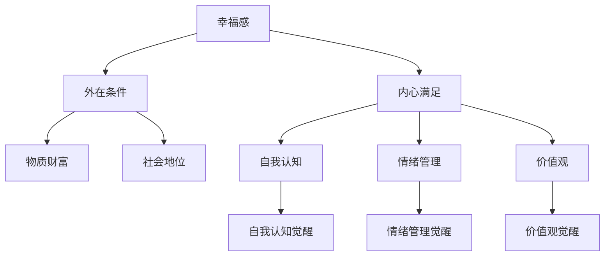

                 


# 重新定义幸福感：从外在条件到内心满足的觉醒之路

> 关键词：幸福感、外在条件、内心满足、自我认知、情绪管理、价值观、觉醒、生活方式、人际关系、持续成长

> 摘要：
在本篇文章中，我们将探讨幸福感的本质，从外在条件到内心满足的转化过程，以及如何通过觉醒之路实现长期的内心满足。文章将分为三个主要部分，首先重新审视幸福感的定义与误解，接着详细探讨外在条件与内心满足的关系，最后介绍觉醒之路的各个环节，以及如何在觉醒后实践幸福。

## 目录大纲

### 第一部分：重新审视幸福感

#### 第1章：幸福感的定义与误解

##### 1.1 幸福感的概念
##### 1.2 幸福感的常见误解
##### 1.3 破除误解，走向真实

#### 第2章：外在条件与内心满足

##### 2.1 外在条件的幸福感
##### 2.2 内心满足的重要性
##### 2.3 从外在条件到内心满足的桥梁

### 第二部分：觉醒之路

#### 第3章：自我认知与觉醒

##### 3.1 自我认知的重要性
##### 3.2 常见的自我认知误区
##### 3.3 实现自我认知的觉醒

#### 第4章：情绪管理与觉醒

##### 4.1 情绪管理的重要性
##### 4.2 常见情绪管理误区
##### 4.3 实现情绪管理的觉醒

#### 第5章：价值观与觉醒

##### 5.1 价值观的内涵
##### 5.2 价值观的多样性
##### 5.3 如何树立正确的价值观

### 第三部分：觉醒后的幸福实践

#### 第6章：生活方式的觉醒

##### 6.1 健康生活的重要性
##### 6.2 精神生活的重要性
##### 6.3 实现健康与精神生活的平衡

#### 第7章：人际关系与觉醒

##### 7.1 人际关系的重要性
##### 7.2 常见的人际关系问题
##### 7.3 实现良好人际关系的觉醒

#### 第8章：持续成长与觉醒

##### 8.1 成长的重要性
##### 8.2 成长与觉醒的互动
##### 8.3 实现持续成长的觉醒

### 附录

#### 附录A：实用工具与资源推荐

##### A.1 心理自助工具推荐
##### A.2 相关书籍推荐
##### A.3 在线课程与工作坊推荐

## 跋

### 感谢与致意
### 后记
### 索引

--- 

### 核心概念与联系



### 核心算法原理讲解

```python
# Python代码示例：情绪管理算法

def manage_emotions(emotions):
    """
    情绪管理算法：根据传入的情绪数据，提供相应的情绪管理策略。
    
    :param emotions: 情绪数据列表，每个元素表示一种情绪
    :return: 情绪管理策略列表
    """
    strategies = []
    
    for emotion in emotions:
        if emotion == "焦虑":
            strategies.append("深呼吸练习")
            strategies.append("正念冥想")
        elif emotion == "沮丧":
            strategies.append("运动释放压力")
            strategies.append("和朋友聊天")
        elif emotion == "愤怒":
            strategies.append("冷静下来，深呼吸")
            strategies.append("写日记表达情绪")
            
    return strategies

# 示例
emotions = ["焦虑", "沮丧", "愤怒"]
print(manage_emotions(emotions))
```

### 数学模型和数学公式 & 详细讲解 & 举例说明

```latex
\section{幸福感指数模型}
幸福感指数（Happiness Index）通常由多个维度构成，包括经济状况、社会关系、健康等。以下是一个简化的幸福感指数模型：

\begin{equation}
HI = w_1 \times E + w_2 \times S + w_3 \times H
\end{equation}

其中：
- \( HI \) 是幸福感指数。
- \( w_1, w_2, w_3 \) 是权重系数，分别代表经济状况、社会关系和健康的权重。
- \( E, S, H \) 分别是经济状况、社会关系和健康的得分。

例如，如果一个人的经济状况得分是8，社会关系得分是7，健康得分是9，且权重分别为0.4、0.3和0.3，则该人的幸福感指数计算如下：

\begin{equation}
HI = 0.4 \times 8 + 0.3 \times 7 + 0.3 \times 9 = 3.2 + 2.1 + 2.7 = 8
\end{equation}

这意味着该人的幸福感指数为8分。通过调整权重系数，可以更准确地反映个体对各个维度的重视程度。
```

---

接下来，我们将开始详细讨论幸福感的定义与误解，以及外在条件与内心满足的关系。

### 第一部分：重新审视幸福感

#### 第1章：幸福感的定义与误解

##### 1.1 幸福感的概念

幸福感，作为一个广泛而深刻的话题，常常被不同的人用不同的方式来定义。简单来说，幸福感是一种主观的心理体验，通常与个人的情感状态、生活满意度以及心理福祉相关联。幸福感不仅仅是一种瞬间的愉悦感，而是一种持久的感觉，它反映了一个人对生活的整体评价和情感体验。

在心理学领域，幸福感通常被定义为“一种长期的、积极的情感状态，伴随着对生活的整体满意感”。这种定义强调了幸福感的持久性和整体性，而不是简单的快乐或短暂的满足感。

幸福感的研究始于20世纪50年代，随着心理学和幸福学的兴起，人们对这一主题的兴趣日益增加。研究表明，幸福感不仅影响个人的生活质量，还与多种健康和福祉指标密切相关，如心理疾病、身体健康、社会关系和职业成就。

##### 1.2 幸福感的常见误解

尽管幸福感是一个广为人知的概念，但人们对它的理解仍然存在一些常见的误解。以下是几种常见的误解：

1. **幸福等于快乐**：许多人认为幸福就是快乐，但实际上，幸福是一个更复杂的概念。快乐通常是短暂的、反应性的，而幸福则是一种更持久的、主动的感受。快乐是对特定事件的反应，而幸福则是对生活的整体评价。

2. **外在条件是幸福的关键**：很多人认为，财富、社会地位和物质享受是幸福的关键因素。尽管外在条件可以带来一定的幸福感，但它们并不是唯一的因素，甚至可能不是最重要的因素。

3. **幸福是静态的**：有些人认为，一旦达到了某个目标或满足了某个条件，就可以永远幸福。然而，幸福感是一个动态的过程，它会随着时间、经历和环境的变化而变化。

4. **幸福是个人问题**：一些人认为幸福是个人私事，与他人无关。实际上，社会支持、人际关系和社交互动对幸福感有显著影响。我们的情感状态和幸福感往往受到周围人的影响。

##### 1.3 破除误解，走向真实

为了更准确地理解幸福感，我们需要破除这些常见的误解，并深入了解其真正的本质。首先，幸福感和快乐是不同的，幸福更侧重于对生活的整体评价，而快乐则是对特定事件的反应。其次，外在条件虽然可以带来幸福感，但并不是唯一决定因素。内在的满足感、自我认知、情绪管理等因素同样重要。

此外，幸福感是一个动态的过程，它会随着时间和经历的变化而变化。我们的情感状态和幸福感也受到周围人的影响，因此，建立良好的社会关系和获得社会支持对于提升幸福感至关重要。

在下一章中，我们将探讨外在条件与内心满足的关系，以及如何从外在条件过渡到内心满足。通过理解这些概念，我们可以更好地把握幸福感的本质，并在生活中实现真正的满足。

### 第一部分：重新审视幸福感

#### 第2章：外在条件与内心满足

##### 2.1 外在条件的幸福感

外在条件，如物质财富、社会地位、职业成就等，常常被认为是影响幸福感的重要因素。人们普遍认为，拥有更多的财富和更高的社会地位可以带来更大的幸福。这种观念在一定程度上是有道理的，因为外在条件确实可以提供一定程度的满足感和安全感。

物质财富可以带来便利和舒适，提高生活质量和幸福感。例如，良好的住房条件、充足的食物供应、先进的医疗保健等，都是物质财富带来的直接好处。社会地位和职业成就也可以带来尊重和成就感，使个体在社会中感到更有价值和被认可。

然而，外在条件对幸福感的贡献是有限的。研究表明，当人们的基本需求得到满足后，财富和社会地位的提升对幸福感的提升作用会逐渐减弱。这种现象被称为“边际效用递减”。换句话说，增加的财富和地位带来的幸福感增量会随着已有的财富和地位的提高而减少。

此外，外在条件并不能解决所有的问题。例如，财富和地位不能消除生活中的不确定性和风险，也不能完全满足人的心理需求。一个人可能拥有巨大的财富和很高的社会地位，但如果他感到孤独、焦虑或缺乏自我价值感，他的幸福感仍然会受到很大的影响。

##### 2.2 内心满足的重要性

内心满足是指个体在心理上感到满足和平衡的状态。它源于内在的感受和体验，与外在条件无关。内心满足的重要性在于，它是长期幸福感的根本来源。与外在条件带来的暂时满足不同，内心满足是一种持久的感觉，它可以帮助个体应对生活中的挑战和困难。

内心满足感与多种心理因素密切相关，包括自我认知、情绪管理、价值观和人际关系等。自我认知是指个体对自己的了解和认识，它有助于建立自我价值和自尊。情绪管理则是指个体如何识别、表达和控制自己的情绪，以保持心理平衡。价值观是个体对生活中重要事物的看法和信仰，它影响个体的行为和决策。人际关系则是社会支持的重要来源，良好的人际关系可以带来情感上的满足和安全感。

内心满足的重要性体现在以下几个方面：

1. **心理稳定**：内心满足感可以帮助个体保持心理稳定，减少焦虑和压力。这种稳定性有助于个体更好地应对生活中的挑战和变化。

2. **情感健康**：内心满足感与情感健康密切相关。一个内心满足的人通常拥有更积极、健康的情感状态，更容易体验到快乐和满足。

3. **生活质量**：内心满足感可以提高个体的整体生活质量。一个内心满足的人更有可能追求健康的生活方式、建立良好的人际关系，并取得职业上的成就。

4. **社会互动**：内心满足感可以增强个体的社会互动能力。一个内心满足的人更容易与他人建立联系，获得社会支持和帮助。

##### 2.3 从外在条件到内心满足的桥梁

外在条件和内心满足之间存在着一定的关联，但二者并非简单的线性关系。要实现从外在条件到内心满足的转化，我们需要建立以下几个方面的桥梁：

1. **自我认知**：通过自我认知，个体可以更好地了解自己的需求和价值观，从而在追求外在条件时更有目的性和方向性。自我认知还可以帮助个体建立自我价值和自尊，从而增强内心满足感。

2. **情绪管理**：情绪管理是内心满足的关键。通过学会识别、表达和控制自己的情绪，个体可以更好地应对生活中的挑战，保持心理平衡。

3. **价值观**：建立正确的价值观可以帮助个体在追求外在条件时保持内在的平衡和满足。价值观决定了个体对生活中重要事物的看法和行动方向，从而影响个体的幸福感。

4. **社会互动**：社会互动是获得社会支持和情感满足的重要途径。通过建立良好的人际关系，个体可以获得他人的理解、支持和鼓励，从而增强内心满足感。

5. **心理成长**：心理成长是指个体在心理上的不断进步和成熟。通过不断地学习和成长，个体可以提升自我认知、情绪管理和价值观，从而实现内心满足。

总之，外在条件可以为我们的幸福感提供一定的支持，但内心满足才是长期幸福的根本。通过建立自我认知、情绪管理、价值观和社会互动等方面的桥梁，我们可以更好地实现从外在条件到内心满足的转化，从而实现真正的幸福。

### 第二部分：觉醒之路

#### 第3章：自我认知与觉醒

##### 3.1 自我认知的重要性

自我认知是指个体对自己内在和外在的认识与理解。它是个人成长和心理健康的重要基石，对于实现内心满足具有关键作用。自我认知不仅帮助我们了解自己的优点和缺点，还能帮助我们识别和满足内心的需求，从而在生活的各个层面上取得平衡。

首先，自我认知对于提升个人自信至关重要。当个体了解自己的能力和局限性时，他们可以更真实地评估自己的能力和潜力，从而增强自信心。这种自信不仅有助于在职业生涯中取得成功，还能提高社交互动的质量，建立更强的人际关系。

其次，自我认知有助于个体实现目标。通过深入了解自己的兴趣、价值观和需求，个体可以更有针对性地设定目标，并采取更有效的策略去实现它们。这种目标导向的思维有助于提升生活质量和工作效率。

此外，自我认知对于情绪管理也至关重要。当我们理解自己的情绪和行为模式时，我们更容易识别情绪的触发点，并采取适当的策略去应对。这种情绪管理能力有助于减少焦虑和压力，提升整体幸福感。

##### 3.2 常见的自我认知误区

尽管自我认知对个人成长至关重要，但在自我认知的过程中，人们常常陷入一些误区。以下是一些常见的自我认知误区：

1. **自我否定**：有些人对自己的能力和价值缺乏信心，常常自我否定。他们可能低估自己的成就，认为自己不够优秀或不够聪明。这种自我否定不仅会削弱自信心，还会导致焦虑和抑郁。

2. **过度自我批评**：与自我否定相反，有些人对自己的期望过高，对自己的行为进行过度批评。他们可能会对自己的每一个小错误进行严厉的自我指责，忽视了自己的努力和进步。这种过度自我批评会导致自我价值感的降低，增加心理压力。

3. **自我标签化**：有些人可能会给自己贴上各种负面标签，如“我不擅长社交”、“我总是拖延”等。这些标签不仅限制了他们的行为，还会强化他们的负面认知，导致自我实现预言。

4. **否认情绪**：有些人可能不承认自己的情绪，尤其是负面情绪。他们可能试图压抑或忽视自己的情绪，以避免面对内心的痛苦。这种否认情绪的行为可能会导致情绪积累，最终爆发成更大的心理问题。

##### 3.3 实现自我认知的觉醒

要实现自我认知的觉醒，我们需要采取一系列的策略和方法，以克服上述误区，提升自我认知的能力。以下是一些具体的实践步骤：

1. **积极自我反思**：定期进行自我反思，思考自己的行为、情绪和想法。写下自己的感受和观察，帮助自己更清晰地了解自己的内在世界。

2. **设定具体目标**：设定具体、可衡量的目标，并追踪自己的进步。这有助于我们了解自己的能力和潜力，增强自信心。

3. **接受自己的不完美**：认识到每个人都会有优点和缺点，接受自己的不完美。学会从失败中学习，而不是过度批评自己。

4. **寻求反馈**：从他人那里获取反馈，了解他们对我们的看法。这可以帮助我们获得更客观的自我认知，并发现自己的盲点。

5. **培养情绪意识**：学会识别和表达自己的情绪，不要压抑或否认它们。通过情绪日记或正念冥想等练习，提升情绪管理能力。

6. **专业咨询**：在自我认知的过程中，如果遇到困难或困惑，可以寻求专业的心理咨询师的帮助。专业人士可以提供指导和支持，帮助我们更深入地了解自己。

通过这些实践步骤，我们可以逐步提升自我认知的能力，实现真正的觉醒。自我认知不仅有助于我们理解自己的需求和价值观，还能帮助我们更好地应对生活中的挑战，实现长期的内心满足。

### 第二部分：觉醒之路

#### 第4章：情绪管理与觉醒

##### 4.1 情绪管理的重要性

情绪管理是指个体如何识别、表达和控制自己的情绪，以保持心理平衡和健康。情绪管理的重要性在于，它直接影响我们的心理健康和生活质量。情绪管理得好，我们能够更好地应对生活中的挑战，保持积极的心态，提升幸福感；而情绪管理不当，则可能导致焦虑、抑郁等心理问题，影响我们的日常生活和工作。

首先，情绪管理有助于减少压力。在现代社会中，压力无处不在，工作压力、家庭压力、社交压力等都会对我们的心理健康产生负面影响。通过有效的情绪管理，我们可以更好地应对这些压力源，减少焦虑和紧张感，从而保持心理健康。

其次，情绪管理有助于改善人际关系。情绪的波动往往会影响我们的社交互动，使我们难以与他人建立和维护良好的关系。通过学会管理自己的情绪，我们可以更有效地与他人沟通，建立信任和理解，从而改善人际关系。

此外，情绪管理对个人的整体幸福感也有重要影响。一个能够有效管理情绪的人，往往能够更好地享受生活，体验到更多的快乐和满足感。他们更容易保持积极的心态，对生活中的困难和挑战有更强的应对能力。

##### 4.2 常见情绪管理误区

尽管情绪管理对我们的生活至关重要，但在实际操作中，许多人存在一些误区，这些误区往往阻碍了有效的情绪管理。以下是一些常见的情绪管理误区：

1. **压抑情绪**：有些人认为，表达负面情绪是不合适的，因此选择压抑自己的情绪。长期压抑情绪会导致情绪积累，最终可能爆发成更大的心理问题。

2. **逃避情绪**：另一些人可能会选择逃避情绪，通过沉迷于娱乐活动、过度工作或其他行为来暂时忘记情绪困扰。这种逃避行为虽然能提供短暂的缓解，但并不能解决问题，反而可能导致情绪进一步恶化。

3. **过度理性化**：有些人倾向于用理性思维来处理情绪，认为情绪是不理性的，应该被压制。然而，情绪和理性思维是相辅相成的，过度理性化可能会忽视情绪的重要性，导致情绪无法得到有效的表达和解决。

4. **自我指责**：在情绪管理中，一些人可能会对自己的情绪进行过度指责，认为自己的情绪是不合理或不应该存在的。这种自我指责会削弱自我价值感，增加心理负担。

##### 4.3 实现情绪管理的觉醒

要实现情绪管理的觉醒，我们需要克服上述误区，并采取一系列有效的方法来提升情绪管理能力。以下是一些具体的实践步骤：

1. **提高情绪意识**：首先，我们需要提高对情绪的意识，学会识别自己的情绪。情绪日记是一个很好的工具，可以帮助我们记录和观察自己的情绪变化。

2. **学会表达情绪**：表达情绪是情绪管理的重要一环。当我们能够清楚地表达自己的情绪时，我们能够更好地与他人沟通，获得理解和支持。表达情绪可以是直接的方式，也可以是间接的方式，如通过艺术创作、写日记等。

3. **掌握情绪调节技巧**：情绪调节技巧包括深呼吸、冥想、正念练习等。这些技巧可以帮助我们缓解情绪，恢复心理平衡。例如，当感到焦虑时，深呼吸练习可以帮助我们放松身心，缓解紧张感。

4. **建立支持系统**：一个强大的社会支持系统对于情绪管理至关重要。当我们遇到情绪困扰时，朋友的陪伴和支持可以提供安慰和帮助。建立和维护良好的社交关系，是情绪管理的重要步骤。

5. **接受情绪**：接受情绪意味着我们不再逃避或压抑自己的情绪，而是勇敢地面对它们。接受情绪可以帮助我们更好地理解自己的内在需求，从而采取更有效的应对策略。

6. **寻求专业帮助**：在某些情况下，我们可能需要寻求专业的心理咨询师的帮助。专业人士可以提供专业的指导和支持，帮助我们更好地管理情绪，解决深层次的心理问题。

通过这些实践步骤，我们可以逐步提升情绪管理能力，实现真正的觉醒。情绪管理不仅有助于我们保持心理健康，还能提升生活质量，使我们能够更好地享受生活。在下一章中，我们将探讨价值观与觉醒的关系，以及如何树立正确的价值观。

### 第二部分：觉醒之路

#### 第5章：价值观与觉醒

##### 5.1 价值观的内涵

价值观是指个体对于生活中重要事物的看法、信念和判断。它决定了我们的行为和决策，影响着我们的生活方式和生活质量。价值观的内涵丰富多样，包括道德观、人生观、职业观等。例如，诚实、尊重、正义等是常见的道德价值观；追求幸福、实现自我价值等是典型的人生观；勤奋、创新、合作等是职业观的重要组成部分。

价值观对我们的生活有着深远的影响。首先，价值观指导我们的行为。一个拥有积极价值观的人，会在生活中表现出正直、善良和责任感。其次，价值观影响我们的决策。在面对重要的选择时，我们的价值观会帮助我们判断哪个选项更符合我们的信念和目标。此外，价值观还塑造我们的性格和个性，影响我们的心理健康和幸福感。

##### 5.2 价值观的多样性

价值观的多样性是人类社会丰富多彩的体现。不同文化、不同背景的人可能会有不同的价值观。例如，在一些文化中，家庭和亲情被看作是最重要的价值观，而在另一些文化中，个人成就和社会地位可能更为重要。在现代社会，随着全球化和文化融合的加深，人们的价值观也变得更加多元和包容。

这种多样性带来了挑战，也带来了机遇。一方面，不同的价值观可能导致冲突和误解，增加社会分裂。另一方面，多样的价值观也促进了文化交流和融合，使得社会更加多元和包容。了解和尊重他人的价值观，有助于建立更加和谐的人际关系，提升社会的整体幸福感。

##### 5.3 如何树立正确的价值观

树立正确的价值观对于个人的成长和社会的发展都至关重要。以下是一些具体的方法，可以帮助我们树立和巩固正确的价值观：

1. **自我反思**：定期进行自我反思，思考自己的行为和决策是否符合自己的价值观。通过反思，我们可以发现自己的价值观是否合理，是否需要调整。

2. **学习和借鉴**：通过学习他人的经验和智慧，我们可以丰富自己的价值观。阅读经典文学作品、聆听成功人士的故事，都是获取有价值观念的好方法。

3. **实践和行动**：价值观需要通过实践和行动来巩固。只有在实际行动中，我们才能真正体会到价值观的重要性。通过参与公益活动、帮助他人等行为，我们可以实践和强化自己的价值观。

4. **建立良好的社会环境**：社会环境对个体的价值观有很大影响。一个公平、正义、和谐的社会环境，可以促进个体树立和巩固正确的价值观。

5. **寻求专业指导**：在价值观的形成和实践中，我们可能会遇到困惑和挑战。寻求专业人士的指导，可以帮助我们更好地理解和实践正确的价值观。

总之，价值观是我们生活和决策的指南针，树立和巩固正确的价值观，有助于我们实现内心的满足和成长。通过自我反思、学习和行动，我们可以逐步树立和巩固正确的价值观，为自己和社会创造更美好的未来。

### 第三部分：觉醒后的幸福实践

#### 第6章：生活方式的觉醒

##### 6.1 健康生活的重要性

生活方式的觉醒首先体现在对健康生活的重视。健康生活不仅仅是指身体的健康，还包括心理和精神的健康。一个健康的生活方式可以帮助我们更好地应对生活中的压力和挑战，提高整体幸福感。

首先，身体健康对幸福感至关重要。良好的身体状况可以提供充足的能量和活力，使我们能够更加积极地参与各种活动，享受生活的乐趣。定期锻炼、均衡饮食和充足的睡眠是保持身体健康的关键。通过这些习惯，我们可以降低患病的风险，提高免疫力，从而更好地享受生活。

其次，心理健康同样重要。心理健康是指个体在情绪、认知和行为上的健康状态。一个心理健康的人能够更好地应对生活中的压力和挑战，保持积极的心态。心理健康的维护可以通过多种方式实现，如正念冥想、情绪管理和心理咨询等。这些方法可以帮助我们减轻焦虑和抑郁，提高心理弹性。

最后，精神健康也是健康生活方式的重要组成部分。精神健康指的是个体在精神层面上感到满足和平衡。这包括对生活的热爱、对自我的认可以及对世界的积极态度。培养精神健康的生活方式可以通过艺术创作、阅读、旅行和培养兴趣爱好等方式实现。

##### 6.2 精神生活的重要性

除了身体健康，精神生活的质量同样对幸福感有着重要的影响。精神生活指的是个体在精神层面上的满足和成长。一个丰富的精神生活可以给我们带来深刻的情感体验和内心的宁静。

首先，精神生活能够满足我们的心理需求。人类是情感动物，精神生活能够帮助我们表达和满足内心的情感需求。通过艺术、文学、音乐和宗教等活动，我们可以体验到情感的深度和丰富性，从而提升幸福感。

其次，精神生活有助于我们的个人成长。通过不断地学习和探索，我们可以扩展自己的知识和视野，提升自我认知。这种成长不仅使我们的生活更加丰富多彩，还能增强我们的自信心和满足感。

最后，精神生活有助于我们建立深刻的情感联系。与他人分享精神生活的体验，可以加深我们的人际关系，带来情感上的满足和支持。通过分享和交流，我们可以感受到他人的理解和关怀，从而提升整体幸福感。

##### 6.3 实现健康与精神生活的平衡

实现健康与精神生活的平衡是生活方式觉醒的核心。以下是一些建议，可以帮助我们实现这种平衡：

1. **制定健康计划**：制定一个包括锻炼、饮食和睡眠的健康计划，并坚持执行。定期进行身体检查，确保身体健康。

2. **培养精神兴趣**：找到自己感兴趣的精神活动，如阅读、写作、绘画或音乐。这些活动可以帮助我们放松心情，提升精神满足感。

3. **建立社交联系**：与他人建立深层次的社交联系，通过分享和交流提升精神生活质量。参加社区活动、志愿服务或兴趣小组，都是建立社交联系的好方法。

4. **保持学习态度**：不断学习新知识，扩展自己的视野。通过学习，我们可以保持思维的活力，提升自我认知。

5. **定期反思**：定期进行自我反思，检查自己的生活方式是否符合健康与精神生活的平衡。调整和优化生活方式，以实现更好的平衡。

通过这些实践，我们可以实现健康与精神生活的平衡，从而在日常生活中感受到更多的幸福和满足。

#### 第7章：人际关系与觉醒

##### 7.1 人际关系的重要性

人际关系是我们生活中不可或缺的一部分，对个人的心理健康和幸福感有着深远的影响。良好的人际关系可以提供情感支持、增加安全感，并促进个人的成长和发展。人际关系的重要性体现在以下几个方面：

首先，人际关系有助于情感支持。在人生的各个阶段，我们都可能遇到困难和挑战。在这个过程中，拥有良好的人际关系可以帮助我们获得情感上的支持。朋友、家人和同事的鼓励和支持可以减轻压力，提高应对问题的能力。

其次，人际关系有助于增加安全感。与他人建立紧密的联系，可以让我们感到被关心和重视，从而增强内心的安全感。这种安全感使我们更加自信和独立，有助于我们面对生活中的不确定性。

此外，人际关系对个人的成长和发展也有重要影响。通过与他人互动，我们可以学习到不同的观点和经验，扩展自己的视野。这种成长不仅使我们的生活更加丰富多彩，还能提升我们的自我认知和情商。

##### 7.2 常见的人际关系问题

尽管人际关系对我们的生活至关重要，但在实际中，许多人会遇到各种人际关系问题。以下是几种常见的人际关系问题：

1. **沟通障碍**：沟通障碍是人际关系中最为常见的问题之一。许多人因为不善沟通或沟通方式不当，导致误解和冲突。沟通障碍可能源于语言表达不清、倾听不足或情绪失控等。

2. **界限不清**：界限不清意味着我们在人际关系中未能清晰地界定个人空间和权利。这种情况下，我们可能会过度依赖他人或受到他人的过度干涉，导致双方的关系失衡。

3. **信任问题**：信任是人际关系的基础。缺乏信任会导致彼此的不安和猜疑，影响关系的稳定。信任问题可能源于过去的伤害、不诚实或欺骗行为。

4. **价值观冲突**：每个人都有自己的价值观和信念，当这些价值观发生冲突时，可能会导致关系紧张甚至破裂。价值观冲突可能源于文化、宗教或个人信仰的差异。

##### 7.3 实现良好人际关系的觉醒

要实现良好的人际关系，我们需要采取一系列策略来提升自己的沟通技巧、建立清晰的界限、建立信任和尊重彼此的价值观。以下是一些建议：

1. **提升沟通技巧**：有效的沟通是建立良好人际关系的基础。要提升沟通技巧，我们需要学会清晰表达自己的想法和感受，同时倾听对方的意见和需求。此外，避免情绪化表达，学会以平和的态度进行沟通。

2. **建立清晰的界限**：在人际关系中，建立清晰的界限非常重要。这意味着我们要明确自己的个人空间和权利，同时尊重他人的界限。通过设定界限，我们可以避免过度依赖或过度干涉，实现关系的平衡。

3. **建立信任**：信任是人际关系中的基石。要建立信任，我们需要诚实地表达自己，遵守承诺，并对他人持有真诚和尊重的态度。通过建立信任，我们可以消除不安和猜疑，使关系更加稳定。

4. **尊重彼此的价值观**：每个人都有自己的价值观和信仰，要建立良好的人际关系，我们需要尊重彼此的差异。通过理解和接受对方的价值观，我们可以减少冲突，增进相互理解和尊重。

5. **持续学习和成长**：人际关系是一个动态的过程，我们需要不断地学习和成长。通过参加培训课程、阅读相关书籍或寻求专业咨询，我们可以提升自己在人际关系中的能力，建立更加稳定和和谐的关系。

通过这些实践，我们可以实现良好人际关系的觉醒，从而在日常生活中感受到更多的幸福和满足。良好的人际关系不仅有助于我们的个人成长，还能提升我们的整体幸福感。

#### 第8章：持续成长与觉醒

##### 8.1 成长的重要性

持续成长是指个体在知识和技能上的不断进步和提升。它不仅仅局限于职业发展，还包括个人品质、情感智慧和人际关系等方面的提升。成长的重要性体现在以下几个方面：

首先，成长有助于提升自我认知。通过不断学习和实践，我们可以更深入地了解自己，发现自己的优点和不足。这种自我认知有助于我们更好地应对生活中的挑战，实现自我价值的最大化。

其次，成长有助于提高竞争力。在快速变化的时代，只有不断学习和成长，才能跟上时代的步伐，保持竞争力。持续成长可以使我们具备更多的技能和知识，从而在职业和生活中取得更大的成功。

此外，成长还有助于提升幸福感。通过不断学习和成长，我们可以体验到成就感和自豪感，从而提升心理满足感。成长的过程中，我们还可以结识到更多志同道合的朋友，建立更深厚的人际关系。

##### 8.2 成长与觉醒的互动

成长和觉醒是相辅相成的，二者之间存在密切的互动关系。觉醒是指个体在心理和精神层面的觉悟和提升，它为成长提供了内在的动力和方向。成长和觉醒的互动体现在以下几个方面：

1. **自我认知的提升**：觉醒有助于我们更深入地了解自己，从而明确自己的成长目标和方向。通过觉醒，我们可以发现自己的潜力，设定更具挑战性的目标，从而在成长过程中实现自我超越。

2. **内在动力的激发**：觉醒可以激发个体的内在动力，使我们更有决心和毅力去追求成长。觉醒使我们认识到成长的重要性，从而激发我们对学习和实践的热爱，使成长成为一种自觉的行为。

3. **价值观的塑造**：觉醒有助于我们建立和巩固正确的价值观，从而在成长过程中保持内在的平衡。正确的价值观可以引导我们的行为和决策，使我们在成长的过程中不走偏、不迷失。

4. **心理弹性的提升**：觉醒可以使我们具备更强的心理弹性，从而更好地应对成长过程中的挫折和挑战。通过觉醒，我们可以学会从失败中汲取教训，不断提升自己的能力和素质。

##### 8.3 实现持续成长的觉醒

要实现持续成长的觉醒，我们需要采取一系列有效的策略和方法。以下是一些建议：

1. **设定明确的目标**：设定具体、可衡量的成长目标，并制定详细的行动计划。明确的目标可以指导我们的学习和实践，使我们更有针对性地提升自己。

2. **持续学习和实践**：保持对知识和技能的渴望，不断学习新知识，提升自己的能力。通过实践，我们可以将理论知识应用到实际中，从而真正实现成长。

3. **反思与总结**：定期进行自我反思，总结成长过程中的经验和教训。通过反思，我们可以发现自己的不足，从而在下一阶段的成长中做出改进。

4. **建立支持系统**：与志同道合的朋友和导师建立联系，相互支持和鼓励。他们的经验和见解可以为我们提供宝贵的指导，帮助我们更好地实现成长。

5. **保持积极的心态**：积极的心态是成长过程中的重要动力。无论遇到多大的困难和挑战，我们都要保持乐观和自信，相信自己有能力克服一切。

6. **寻求专业帮助**：在某些情况下，我们可能需要寻求专业的心理咨询或培训。专业人士可以提供专业的指导和支持，帮助我们更好地实现成长。

通过这些实践，我们可以实现持续成长的觉醒，不断提升自己的能力和素质，实现内心的满足和幸福。在持续成长的过程中，我们不仅会收获职业上的成功，还会在心理和精神层面获得深刻的满足。

### 附录A：实用工具与资源推荐

为了帮助读者在追求幸福感的过程中更有效地实践和应用所学知识，以下是一些实用的工具与资源推荐：

#### A.1 心理自助工具推荐

1. **正念冥想应用**：
   - **Headspace**：提供专业的正念冥想指导，适合初学者和进阶者。
   - **Calm**：除了冥想，还提供放松音乐、呼吸练习和睡眠故事。

2. **情绪记录工具**：
   - **Moodnotes**：一款结合日记和情绪追踪的应用，帮助用户记录和分析情绪变化。
   - **Day One**：一款优秀的数字日记应用，用户可以记录日常情绪、想法和经历。

#### A.2 相关书籍推荐

1. **《幸福之路》（The How of Happiness）** - Sonja Lyubomirsky
   - 详细介绍了提升幸福感的科学方法和实践策略。

2. **《正念的奇迹》（The Power of Now）** - 埃克哈特·托勒
   - 探讨了正念冥想和内心平静的重要性，对个人成长有深刻的影响。

3. **《情感勒索》（The Emotional Rescue）** - Karyl McBride
   - 提供了识别和处理情感勒索的策略，有助于建立更健康的人际关系。

#### A.3 在线课程与工作坊推荐

1. **Coursera**：
   - 提供多门关于心理学、幸福感和个人成长的在线课程，如《积极心理学》等。

2. **Udemy**：
   - 提供各种自我提升和技能发展的在线课程，包括情绪管理、时间管理等。

3. **Mindfulness-Based Stress Reduction (MBSR) Workshops**：
   - MBSR工作坊是一种基于正念的压力管理方法，可以帮助用户提升情绪调节能力和幸福感。

通过这些工具和资源，读者可以在追求幸福感的过程中得到实用的指导和帮助，实现个人成长和内心的满足。

### 跋

### 感谢与致意

首先，我要感谢所有在撰写本文过程中提供帮助和支持的人们。特别感谢我的家人和朋友，他们的鼓励和理解让我能够专注于这项艰巨的任务。同时，我要感谢那些在研究和实践中给予我灵感和启示的专家学者。此外，感谢每一位读者，是您的关注和阅读让这篇文章得以完成。

### 后记

本文旨在探讨幸福感的本质和实现途径，通过重新审视幸福感、分析外在条件与内心满足的关系，以及介绍觉醒之路和幸福实践，希望帮助读者更好地理解幸福感的真正意义，并找到实现内心满足的方法。幸福是一个复杂而多维的过程，每个人的路径都是独一无二的。希望本文能够成为您探索幸福之路的起点。

### 索引

- **自我认知与觉醒**
  - 自我认知的重要性
  - 常见的自我认知误区
  - 实现自我认知的觉醒
- **情绪管理与觉醒**
  - 情绪管理的重要性
  - 常见情绪管理误区
  - 实现情绪管理的觉醒
- **价值观与觉醒**
  - 价值观的内涵
  - 价值观的多样性
  - 树立正确的价值观

通过索引，读者可以快速找到感兴趣的部分，深入学习和实践。

---

在结束这篇文章之前，我想再次强调，幸福感是一个持久的过程，需要我们不断努力和实践。通过自我认知、情绪管理和价值观的觉醒，我们可以逐步实现内心的满足。希望本文能够为您在追求幸福感的道路上提供一些启示和帮助。让我们共同探索，不断成长，最终找到属于自己的幸福之道。

---

### 核心概念与联系


### 核心算法原理讲解

```python
# Python代码示例：情绪管理算法

def manage_emotions(emotions):
    """
    情绪管理算法：根据传入的情绪数据，提供相应的情绪管理策略。
    
    :param emotions: 情绪数据列表，每个元素表示一种情绪
    :return: 情绪管理策略列表
    """
    strategies = []
    
    for emotion in emotions:
        if emotion == "焦虑":
            strategies.append("深呼吸练习")
            strategies.append("正念冥想")
        elif emotion == "沮丧":
            strategies.append("运动释放压力")
            strategies.append("和朋友聊天")
        elif emotion == "愤怒":
            strategies.append("冷静下来，深呼吸")
            strategies.append("写日记表达情绪")
            
    return strategies

# 示例
emotions = ["焦虑", "沮丧", "愤怒"]
print(manage_emotions(emotions))
```

### 数学模型和数学公式 & 详细讲解 & 举例说明

```latex
\section{幸福感指数模型}
幸福感指数（Happiness Index）通常由多个维度构成，包括经济状况、社会关系、健康等。以下是一个简化的幸福感指数模型：

\begin{equation}
HI = w_1 \times E + w_2 \times S + w_3 \times H
\end{equation}

其中：
- \( HI \) 是幸福感指数。
- \( w_1, w_2, w_3 \) 是权重系数，分别代表经济状况、社会关系和健康的权重。
- \( E, S, H \) 分别是经济状况、社会关系和健康的得分。

例如，如果一个人的经济状况得分是8，社会关系得分是7，健康得分是9，且权重分别为0.4、0.3和0.3，则该人的幸福感指数计算如下：

\begin{equation}
HI = 0.4 \times 8 + 0.3 \times 7 + 0.3 \times 9 = 3.2 + 2.1 + 2.7 = 8
\end{equation}

这意味着该人的幸福感指数为8分。通过调整权重系数，可以更准确地反映个体对各个维度的重视程度。
```

---

通过本文，我们探讨了幸福感的本质，从外在条件到内心满足的转化，以及通过觉醒之路实现内心满足的方法。我们分析了自我认知、情绪管理和价值观的重要性，并提供了实用的工具和资源来支持读者的实践。希望本文能够为读者在追求幸福感的道路上提供有益的启示和帮助。让我们继续探索，不断成长，最终找到属于自己的幸福之道。

