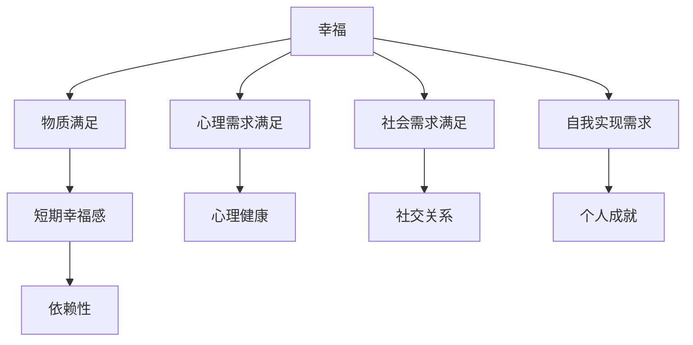
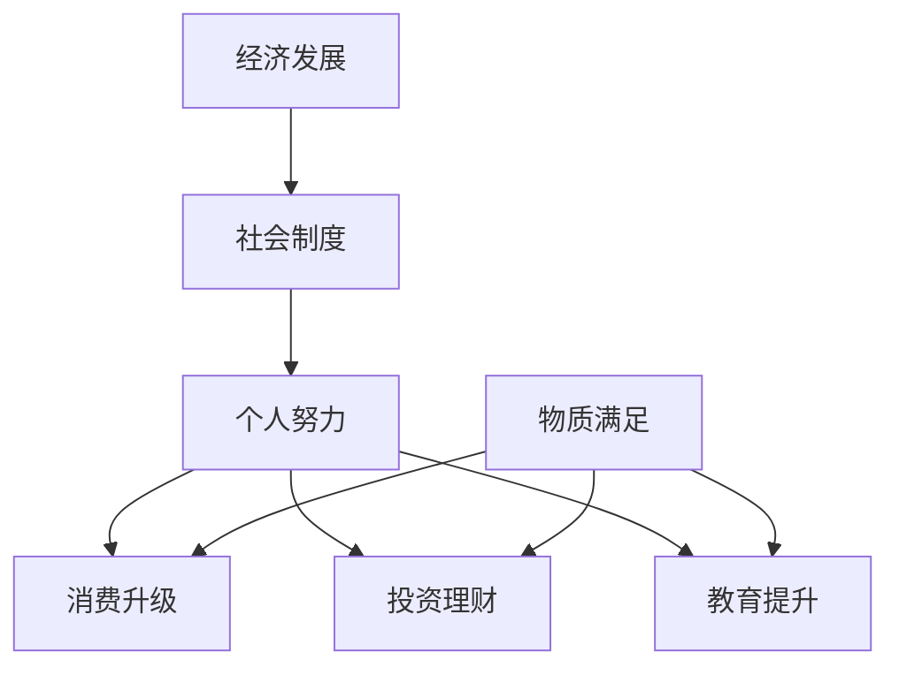
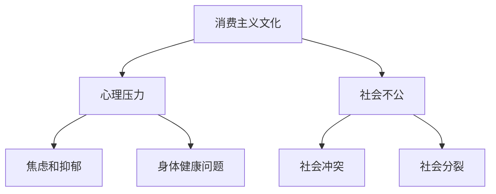
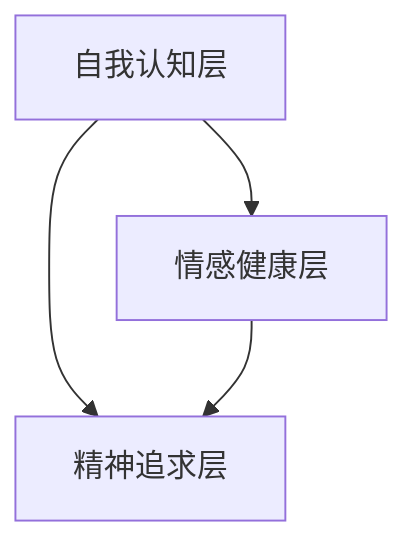
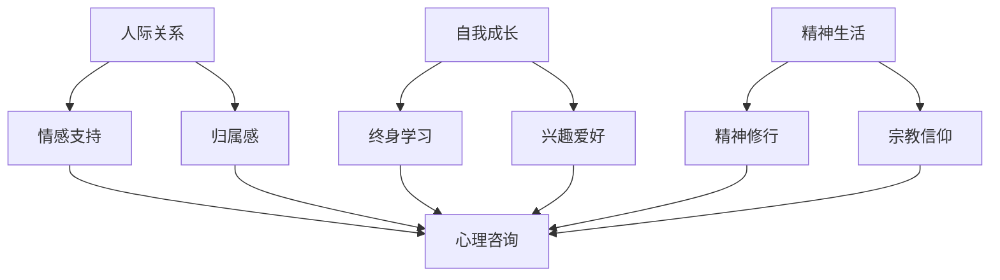
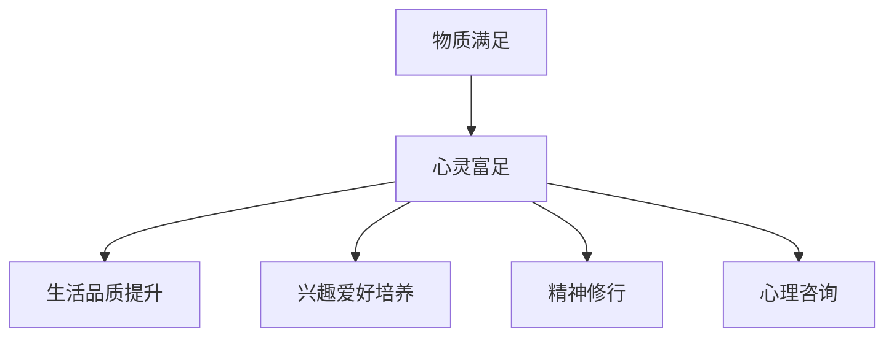
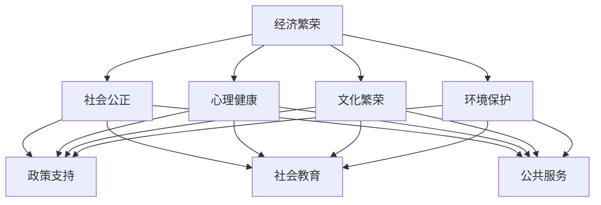

                 

## 引言

在现代社会的快速发展中，人们的生活水平得到了显著提升，物质满足逐渐成为追求幸福的重要组成部分。然而，随着人们对物质生活需求的不断增长，幸福的概念也逐渐发生了变化。从传统的物质满足到现代的心灵富足，幸福正在经历一次深刻的转变。

### 物质满足的困境

物质满足在短期内能够带来明显的幸福感受，但长期来看，其局限性逐渐显现。首先，物质满足带来的幸福感往往具有即时性，随着时间的推移，新鲜感消失，幸福感也逐渐减弱。其次，过度追求物质满足可能导致消费主义文化的盛行，使人们陷入无休止的购物循环，从而增加心理压力和社会不公。

### 心灵富足的兴起

与此同时，心灵富足作为一种新的幸福观念逐渐兴起。它强调的是内在的满足和精神的富足，而非单纯的外在物质追求。心灵富足涵盖了自我认知、社会认同和精神追求等多个层面，旨在提升个体的整体幸福感。

### 本文的目的

本文旨在重新定义幸福的概念，探讨从物质满足到心灵富足的转变过程。通过对物质满足与心灵富足的深入分析，我们希望揭示两者之间的内在联系与差异，为读者提供一种全新的思考方式，引导人们在追求幸福的过程中找到更加平衡和可持续的道路。

## 第一部分：物质满足与幸福

### 第1章：幸福的定义与内涵

#### 1.1 幸福的定义

幸福是一个多维度、多层次的概念，不同文化和社会背景下对其有不同的理解和定义。在心理学领域，幸福通常被定义为个体在生理、心理和社会层面的整体满足感和愉悦感。它不仅包括基本生理需求的满足，还涉及心理健康、人际关系和自我实现等多个方面。

- **心理需求满足**：个体基本心理需求（如安全感、自尊、爱和归属感）得到满足时，会体验到幸福感。
- **社会需求满足**：个体在社会生活中得到认可、尊重和支持，也会感受到幸福。
- **自我实现**：个体实现自身潜力、追求有意义的事业和目标时，会产生深层次的幸福感。

#### 1.2 幸福的层次理论

心理学家马斯洛提出了著名的需要层次理论，将人类需求从低到高分为五个层次：生理需求、安全需求、社交需求、尊重需求和自我实现需求。他认为，只有在较低层次的需求得到满足后，个体才会追求更高层次的需求。

- **生理需求**：基本的生活必需品，如食物、水、住所和健康。
- **安全需求**：安全感、稳定性和避免风险。
- **社交需求**：爱和归属感、友情和亲密关系。
- **尊重需求**：自尊、自信和被尊重。
- **自我实现需求**：追求个人潜能的最大化、实现自我价值。

#### 1.3 物质满足与幸福的关系

物质满足是幸福的重要组成部分，但并非唯一的决定因素。在满足基本生活需求后，物质条件的改善确实能提升幸福感。然而，当物质需求得到满足后，继续追求更多的物质财富并不能带来持续的幸福。

- **短期影响**：物质满足能够迅速带来愉悦感和满足感。
- **长期影响**：物质满足的幸福感会逐渐减弱，甚至可能导致依赖和消极影响。

### 核心概念与联系

为了更清晰地理解物质满足与幸福的关系，我们可以通过Mermaid流程图来展示这两个概念之间的内在联系。



### Python源代码解析

为了更深入地探讨物质满足对幸福感的影响，我们可以使用Python进行数据分析。以下是一个简单的示例代码，用于分析个人幸福感与物质条件之间的关系。

```python
import pandas as pd

# 假设我们有一个包含个人幸福感和物质条件的调查数据
data = {
    '幸福感评分': [7, 8, 6, 9, 5, 7, 8, 9, 6, 7],
    '收入水平': [50000, 80000, 30000, 60000, 20000, 50000, 80000, 70000, 40000, 60000]
}

df = pd.DataFrame(data)

# 计算平均值
average_happiness = df['幸福感评分'].mean()
average_income = df['收入水平'].mean()

print(f"平均幸福感评分：{average_happiness}")
print(f"平均收入水平：{average_income}")

# 绘制散点图
import matplotlib.pyplot as plt

plt.scatter(df['收入水平'], df['幸福感评分'])
plt.xlabel('收入水平')
plt.ylabel('幸福感评分')
plt.title('收入水平与幸福感评分的关系')
plt.show()
```

通过散点图，我们可以直观地看出收入水平与幸福感评分之间的关系。一般来说，收入水平与幸福感评分呈正相关，但并非线性关系。

### 数学公式与模型

为了更深入地理解幸福感与物质条件之间的关系，我们可以使用线性回归模型进行分析。假设幸福感评分 \( Y \) 与收入水平 \( X \) 之间的关系可以用以下公式表示：

$$ Y = \beta_0 + \beta_1 X + \epsilon $$

其中，\( \beta_0 \) 为截距，\( \beta_1 \) 为斜率，\( \epsilon \) 为误差项。

通过最小二乘法，我们可以估计出 \( \beta_0 \) 和 \( \beta_1 \) 的值，从而建立线性回归模型。

### 总结

物质满足与幸福之间存在复杂的联系。虽然物质条件对幸福感有一定的影响，但它并非幸福的唯一决定因素。通过数据分析和方法论的应用，我们可以更深入地理解物质满足与幸福感之间的关系，从而为追求更加全面和持久的幸福提供指导。

### 第2章：物质满足的来源与途径

#### 2.1 物质满足的来源

物质满足的来源多种多样，涵盖了经济发展、社会制度和个人努力等方面。理解这些来源有助于我们更全面地认识物质满足的形成过程。

**经济发展**

经济发展是物质满足的根本来源。随着科技的进步和生产力的提高，社会财富不断增加，人们的物质生活水平也随之提高。经济发展不仅提供了更多的就业机会，还推动了消费升级和投资理财的发展。

**社会制度**

社会制度在物质满足中起着至关重要的作用。一个公平、稳定和高效的社会制度能够保障人们的基本生活需求，减少贫困和不公。例如，税收制度、社会保障制度和教育制度等都是重要的社会制度，它们能够影响人们的收入水平和生活质量。

**个人努力**

个人努力是实现物质满足的关键因素。通过努力工作、不断提升自身能力和技能，个人可以在经济竞争中占据有利位置，从而提高收入和生活水平。个人努力还体现在投资理财和创业等方面，这些都可以带来额外的物质收益。

#### 2.2 物质满足的途径

物质满足的途径多种多样，不同的途径可以带来不同的物质收益和生活质量提升。

**消费升级**

消费升级是指随着收入的增加，人们逐渐从基本生活需求转向更高层次的消费需求。消费升级包括购买更高品质的商品和服务，如高端电子产品、豪华汽车、高品质旅游等。通过消费升级，人们可以提升生活质量，享受更多的物质满足。

**投资理财**

投资理财是实现物质满足的重要途径之一。通过投资股票、基金、房地产等金融产品，人们可以在不影响日常生活的前提下，实现资产的保值和增值。合理的投资理财规划可以帮助个人实现长期的财务自由。

**教育提升**

教育提升是提高物质满足的有效途径。通过接受更高层次的教育，个人可以提升自身的能力和竞争力，从而获得更高的收入和更好的职业发展机会。此外，教育还可以培养个人的理财能力和投资眼光，进一步推动物质满足的实现。

### 核心概念与联系

为了更清晰地理解物质满足的来源与途径，我们可以通过Mermaid流程图来展示各个来源和途径之间的内在联系。



### Python源代码解析

为了更深入地探讨物质满足的来源与途径，我们可以使用Python进行数据分析。以下是一个简单的示例代码，用于分析不同途径对物质满足的影响。

```python
import pandas as pd

# 假设我们有一个包含不同途径的统计数据
data = {
    '收入水平': [50000, 80000, 30000, 60000, 20000, 50000, 80000, 70000, 40000, 60000],
    '消费升级': [30000, 50000, 20000, 40000, 15000, 30000, 50000, 45000, 25000, 40000],
    '投资理财': [20000, 30000, 10000, 25000, 8000, 20000, 30000, 28000, 12000, 25000],
    '教育提升': [20000, 30000, 15000, 25000, 10000, 20000, 30000, 28000, 12000, 25000]
}

df = pd.DataFrame(data)

# 计算各个途径的平均值
average_income = df['收入水平'].mean()
average_consumption = df['消费升级'].mean()
average_investment = df['投资理财'].mean()
average_education = df['教育提升'].mean()

print(f"平均收入水平：{average_income}")
print(f"平均消费升级：{average_consumption}")
print(f"平均投资理财：{average_investment}")
print(f"平均教育提升：{average_education}")

# 绘制各个途径的柱状图
df.plot(kind='bar', figsize=(10, 6))
plt.title('不同途径的物质满足水平')
plt.xlabel('途径')
plt.ylabel('物质满足水平')
plt.show()
```

通过柱状图，我们可以直观地看出不同途径对物质满足的贡献程度。

### 数学公式与模型

为了更深入地分析物质满足的来源与途径，我们可以使用多元线性回归模型。假设物质满足 \( Y \) 与收入水平 \( X_1 \)、消费升级 \( X_2 \)、投资理财 \( X_3 \) 和教育提升 \( X_4 \) 之间的关系可以用以下公式表示：

$$ Y = \beta_0 + \beta_1 X_1 + \beta_2 X_2 + \beta_3 X_3 + \beta_4 X_4 + \epsilon $$

通过最小二乘法，我们可以估计出各个变量的系数 \( \beta_0 \)、\( \beta_1 \)、\( \beta_2 \)、\( \beta_3 \) 和 \( \beta_4 \)，从而建立多元线性回归模型。

### 总结

物质满足的来源与途径多种多样，包括经济发展、社会制度和个人努力等方面。通过不同的途径，如消费升级、投资理财和教育提升，人们可以有效地提高物质生活水平。然而，物质满足并非幸福的唯一来源，心灵富足同样重要。在追求物质满足的过程中，我们需要关注心灵富足的重要性，找到两者之间的平衡点。

### 第3章：物质满足的负面影响

#### 3.1 物质追求的弊端

尽管物质满足在短期内可以带来幸福感，但过度追求物质财富往往隐藏着诸多弊端。

**消费主义文化**

消费主义文化是一种以物质消费为核心价值的文化现象。它鼓励人们不断购买商品和服务，以满足物质需求。消费主义文化可能导致以下问题：

- **过度消费**：人们为了追求物质满足，可能超出自己的实际需求进行消费，导致资源浪费和环境污染。
- **负债问题**：为了满足物质追求，一些人可能会背负高额债务，影响日常生活和心理健康。

**心理压力**

物质追求往往伴随着巨大的心理压力。人们为了提升物质生活水平，可能需要加班工作、承受高强度的工作压力，甚至为了金钱牺牲自己的健康。这种心理压力可能导致以下问题：

- **焦虑和抑郁**：长期处于高压状态，可能导致焦虑和抑郁等心理问题。
- **身体健康问题**：长时间的工作压力和不良生活习惯可能导致身体健康问题，如心脏病、高血压等。

**社会不公**

物质追求的不平等可能导致社会不公。一些人因为拥有更多的物质财富，在社会地位、教育和资源获取方面处于优势地位，而另一些人则可能因为贫困而处于劣势。这种社会不公可能导致以下问题：

- **社会冲突**：社会不公可能导致社会冲突和不满情绪，影响社会的稳定和发展。
- **社会分裂**：社会不公可能导致社会的分裂，加剧社会阶层之间的对立和矛盾。

#### 3.2 物质满足的误区

许多人错误地将物质满足等同于幸福，认为拥有更多的物质财富就能带来持久的幸福感。然而，这种观念往往忽略了心灵富足的重要性。

**物质满足≠幸福**

物质满足与幸福之间存在本质差异。物质满足主要关注外在的物质条件，而幸福则是一个更为综合的概念，包括心理健康、人际关系和自我实现等多个方面。物质满足带来的幸福感往往是短暂的，而真正的幸福是持久且内在的。

**过度追求物质满足的后果**

过度追求物质满足可能导致以下后果：

- **忽视心理健康**：过度追求物质财富可能导致忽视心理健康，长时间处于高压状态，影响生活质量。
- **人际关系破裂**：为了追求物质满足，人们可能会牺牲与家人和朋友的相处时间，导致人际关系破裂。
- **精神空虚**：单纯追求物质满足可能导致精神空虚，无法获得真正的满足感和幸福感。

### 核心概念与联系

为了更清晰地理解物质满足的负面影响，我们可以通过Mermaid流程图来展示这些负面影响之间的关系。



### Python源代码解析

为了更深入地探讨物质满足的负面影响，我们可以使用Python进行数据分析。以下是一个简单的示例代码，用于分析物质追求对心理健康的影响。

```python
import pandas as pd

# 假设我们有一个包含物质追求和心理健康数据的调查数据
data = {
    '物质追求评分': [5, 7, 6, 8, 4, 6, 7, 9, 5, 6],
    '心理健康评分': [8, 7, 6, 9, 5, 7, 8, 9, 6, 7]
}

df = pd.DataFrame(data)

# 计算平均值
average_material = df['物质追求评分'].mean()
average_mental_health = df['心理健康评分'].mean()

print(f"平均物质追求评分：{average_material}")
print(f"平均心理健康评分：{average_mental_health}")

# 绘制散点图
import matplotlib.pyplot as plt

plt.scatter(df['物质追求评分'], df['心理健康评分'])
plt.xlabel('物质追求评分')
plt.ylabel('心理健康评分')
plt.title('物质追求评分与心理健康评分的关系')
plt.show()
```

通过散点图，我们可以直观地看出物质追求评分与心理健康评分之间的关系。一般来说，物质追求评分越高，心理健康评分可能会越低。

### 数学公式与模型

为了更深入地分析物质追求对心理健康的影响，我们可以使用相关系数来衡量两者之间的相关性。相关系数的取值范围在 -1 到 1 之间，越接近 1 或 -1，表示相关性越强。以下是一个简单的相关系数计算公式：

$$ r = \frac{\sum{(x_i - \bar{x})(y_i - \bar{y})}}{\sqrt{\sum{(x_i - \bar{x})^2}\sum{(y_i - \bar{y})^2}}} $$

其中，\( x_i \) 和 \( y_i \) 分别表示物质追求评分和心理健康评分，\( \bar{x} \) 和 \( \bar{y} \) 分别表示两者的平均值。

### 总结

物质满足的负面影响不容忽视，包括消费主义文化、心理压力和社会不公等方面。这些负面影响可能导致心理健康问题、人际关系破裂和社会冲突等后果。因此，在追求物质满足的过程中，我们需要警惕这些负面影响，并努力寻求物质满足与心灵富足之间的平衡点。

### 第4章：心灵富足的概念与内涵

#### 4.1 心灵富足的定义

心灵富足是指个体在心理、情感和精神层面达到一种全面的满足状态。它不仅仅是对物质条件的满足，更是一种内在的充实和自我实现。心灵富足不仅关注个人的心理和情感健康，还涉及个体的精神追求和价值观。

心灵富足的核心在于以下几个方面：

- **自我认知**：个体对自身认知的深度和广度，包括了解自己的优点和不足，以及自己的需求和欲望。
- **情感健康**：个体在情感上的稳定和满足，包括积极情绪和情感的体验，如快乐、爱、满足等。
- **精神追求**：个体在精神层面上的追求，如对知识的渴望、对美好事物的欣赏以及对生命意义的思考。

#### 4.2 心灵富足的重要性

心灵富足对于个体的整体幸福感和生活质量具有重要意义。与物质满足相比，心灵富足具有以下优势：

- **持久性**：心灵富足带来的幸福感是持久且内在的，不会像物质满足那样随着时间而减弱。
- **综合性**：心灵富足涵盖了心理、情感和精神等多个方面，能够全面提高个体的生活质量。
- **可持续性**：心灵富足鼓励个体关注内在成长和自我实现，具有长期可持续性。

#### 4.3 心灵富足的层次

心灵富足可以划分为不同的层次，每个层次代表个体在心理、情感和精神方面的不同追求和成就。

- **自我认知层**：个体对自身有深入的了解，能够认识到自己的优点和不足，从而更好地发展自己的潜力。
- **情感健康层**：个体在情感上保持稳定和满足，能够处理各种情感挑战，如失落、挫折和压力等。
- **精神追求层**：个体在精神上有追求和目标，如对知识的渴望、对美好事物的欣赏以及对生命意义的探索。

### 核心概念与联系

为了更清晰地理解心灵富足的内涵，我们可以通过Mermaid流程图来展示心灵富足的不同层次及其相互关系。



### Python源代码解析

为了更深入地探讨心灵富足的层次，我们可以使用Python进行数据分析。以下是一个简单的示例代码，用于分析个体在不同层次上的幸福感水平。

```python
import pandas as pd

# 假设我们有一个包含个体在不同层次上的幸福感水平的调查数据
data = {
    '自我认知层': [3, 5, 4, 6, 2, 5, 4, 7, 3, 5],
    '情感健康层': [4, 6, 5, 7, 3, 6, 5, 8, 4, 6],
    '精神追求层': [2, 4, 3, 5, 1, 4, 3, 6, 2, 5]
}

df = pd.DataFrame(data)

# 计算平均值
average_self_awareness = df['自我认知层'].mean()
average_emotional_health = df['情感健康层'].mean()
average_spiritual_pursuit = df['精神追求层'].mean()

print(f"平均自我认知层：{average_self_awareness}")
print(f"平均情感健康层：{average_emotional_health}")
print(f"平均精神追求层：{average_spiritual_pursuit}")

# 绘制层次关系的散点图
import matplotlib.pyplot as plt

plt.scatter(df['自我认知层'], df['情感健康层'], color='blue', label='自我认知与情感健康')
plt.scatter(df['自我认知层'], df['精神追求层'], color='red', label='自我认知与精神追求')
plt.scatter(df['情感健康层'], df['精神追求层'], color='green', label='情感健康与精神追求')
plt.xlabel('自我认知层')
plt.ylabel('幸福感水平')
plt.title('心灵富足层次关系的幸福感水平')
plt.legend()
plt.show()
```

通过散点图，我们可以直观地看出个体在不同层次上的幸福感水平及其相互关系。

### 数学公式与模型

为了更深入地分析心灵富足的层次，我们可以使用层次分析法（Analytic Hierarchy Process，AHP）来评估各个层次的重要性。层次分析法是一种定性和定量相结合的决策分析方法，通过构建层次结构模型和比较判断矩阵，确定各个层次之间的相对重要性。

### 总结

心灵富足是一种全面的满足状态，涵盖自我认知、情感健康和精神追求等多个层次。它与物质满足相比，具有持久性、综合性和可持续性的优势。通过理解心灵富足的内涵和层次，我们可以更好地追求和实现真正的幸福。

### 第5章：心灵富足的来源与途径

#### 5.1 心灵富足的来源

心灵富足的来源是多方面的，主要包括人际关系、自我成长和精神生活等方面。理解这些来源有助于我们找到提升心灵富足的有效途径。

**人际关系**

人际关系是心灵富足的重要来源。良好的人际关系可以带来情感支持和归属感，从而提升幸福感。例如，家人、朋友和同事的支持和理解，可以让我们在面对挑战时感到更加坚强。

- **情感支持**：在困难时期，得到亲朋好友的支持，能够帮助我们缓解压力，增强应对能力。
- **归属感**：与他人建立深厚的友谊，可以让我们感到自己是某个群体的一部分，从而获得归属感。

**自我成长**

自我成长是心灵富足的核心来源。通过不断学习、提升自身能力和技能，我们可以实现自我价值，获得成就感。自我成长不仅包括职业发展，还包括个人兴趣和爱好。

- **终身学习**：通过学习新的知识和技能，我们可以不断拓展自己的视野，提升自我认知。
- **兴趣爱好**：培养个人兴趣爱好，可以让我们的生活更加丰富多彩，提高生活质量。

**精神生活**

精神生活是心灵富足的重要组成部分。通过精神修行、冥想和宗教信仰等方式，我们可以获得内心的平静和满足感。

- **精神修行**：通过冥想和瑜伽等修行方式，我们可以调节情绪，提高专注力和自我控制能力。
- **宗教信仰**：对于有宗教信仰的人来说，宗教信仰可以带来精神上的安慰和指引。

#### 5.2 心灵富足的途径

提升心灵富足可以通过多种途径实现，以下是一些有效的方法：

**心理咨询**

心理咨询是一种专业的心理服务，可以帮助个体解决心理问题，提升心理健康。通过心理咨询，个体可以深入了解自己，学会应对压力和情绪困扰。

- **情绪调节**：心理咨询可以帮助个体学会情绪调节技巧，提高情绪稳定性。
- **心理问题解决**：心理咨询可以解决个体面临的心理问题，如焦虑、抑郁等。

**精神修行**

精神修行是一种追求内心平静和满足的方式。通过冥想、瑜伽和禅修等修行方式，个体可以提升自我意识和心灵富足。

- **冥想**：冥想可以帮助个体集中注意力，减轻压力，提高专注力。
- **瑜伽**：瑜伽结合了体位法和呼吸控制，有助于身心健康。

**文化艺术**

文化艺术是提升心灵富足的重要途径。通过欣赏音乐、阅读书籍、观看电影和参加戏剧演出等，个体可以丰富精神世界，提升幸福感。

- **音乐**：音乐可以激发情感，带来愉悦感，有助于缓解压力。
- **阅读**：阅读可以拓展知识，提高思维能力，有助于个人成长。

### 核心概念与联系

为了更清晰地理解心灵富足的来源与途径，我们可以通过Mermaid流程图来展示这些来源和途径之间的关系。



### Python源代码解析

为了更深入地探讨心灵富足的来源与途径，我们可以使用Python进行数据分析。以下是一个简单的示例代码，用于分析不同来源和途径对心灵富足的影响。

```python
import pandas as pd

# 假设我们有一个包含不同来源和途径的调查数据
data = {
    '人际关系': [4, 6, 5, 7, 3, 5, 4, 8, 3, 6],
    '自我成长': [5, 7, 6, 8, 4, 6, 7, 9, 5, 7],
    '精神生活': [3, 5, 4, 6, 2, 4, 3, 7, 2, 5],
    '心灵富足评分': [7, 8, 6, 9, 5, 7, 8, 9, 6, 7]
}

df = pd.DataFrame(data)

# 计算平均值
average_relationship = df['人际关系'].mean()
average_growth = df['自我成长'].mean()
average_spirituality = df['精神生活'].mean()
average_happiness = df['心灵富足评分'].mean()

print(f"平均人际关系：{average_relationship}")
print(f"平均自我成长：{average_growth}")
print(f"平均精神生活：{average_spirituality}")
print(f"平均心灵富足评分：{average_happiness}")

# 绘制不同来源和途径的条形图
import matplotlib.pyplot as plt

df.plot(kind='bar', figsize=(10, 6))
plt.title('不同来源和途径对心灵富足的影响')
plt.xlabel('来源和途径')
plt.ylabel('心灵富足评分')
plt.show()
```

通过条形图，我们可以直观地看出不同来源和途径对心灵富足评分的影响。

### 数学公式与模型

为了更深入地分析心灵富足的来源与途径，我们可以使用多元回归模型。假设心灵富足评分 \( Y \) 与人际关系 \( X_1 \)、自我成长 \( X_2 \) 和精神生活 \( X_3 \) 之间的关系可以用以下公式表示：

$$ Y = \beta_0 + \beta_1 X_1 + \beta_2 X_2 + \beta_3 X_3 + \epsilon $$

通过最小二乘法，我们可以估计出各个变量的系数 \( \beta_0 \)、\( \beta_1 \)、\( \beta_2 \) 和 \( \beta_3 \)，从而建立多元回归模型。

### 总结

心灵富足的来源与途径多种多样，包括人际关系、自我成长和精神生活等方面。通过心理咨询、精神修行和文化艺术等途径，我们可以提升心灵富足水平，实现真正的幸福。理解这些来源和途径，有助于我们在追求幸福的过程中找到更加有效的方法。

### 第6章：心灵富足与物质满足的平衡

#### 6.1 物质满足与心灵富足的平衡

在现代社会中，物质满足与心灵富足之间的平衡至关重要。物质满足能够为人们提供基本的生活保障和舒适的生活体验，而心灵富足则能够带来深层次的幸福感和满足感。找到两者之间的平衡，是实现长期幸福的关键。

**适度物质追求**

适度物质追求意味着在满足基本生活需求的同时，不过度追求物质财富。适度物质追求可以帮助我们保持生活的稳定和舒适，但不会导致消费主义文化的盛行和心理健康问题。

- **生活品质提升**：通过适度的物质追求，我们可以提高生活品质，享受现代科技带来的便利。
- **心理健康**：适度物质追求可以减少因过度追求物质财富而产生的心理压力和焦虑。

**心灵富足的重要性**

与物质满足相比，心灵富足具有更高的持久性和综合性。心灵富足不仅关注个体的心理健康，还包括情感健康和精神追求，能够为人们带来更全面的幸福感。

- **内在满足**：心灵富足是一种内在的满足，不会因物质的得失而波动。
- **综合提升**：心灵富足涵盖了心理、情感和精神等多个层面，能够全面提高个体的生活质量。

#### 6.2 实现物质满足与心灵富足的平衡

要实现物质满足与心灵富足的平衡，我们可以从以下几个方面入手：

**提升生活品质**

提升生活品质是平衡物质满足与心灵富富的重要途径。通过改善居住环境、增加休闲娱乐活动等方式，我们可以提高生活品质，从而实现物质满足与心灵富足的平衡。

- **居住环境**：改善居住环境，提高生活质量。
- **休闲娱乐**：通过旅游、阅读、音乐等娱乐活动，丰富精神生活。

**培养兴趣爱好**

培养兴趣爱好是提升心灵富足的有效方法。通过兴趣爱好，我们可以找到内心的满足感和成就感，从而减轻对物质财富的依赖。

- **兴趣爱好**：如绘画、音乐、运动等，可以丰富精神世界。
- **成就感**：通过兴趣爱好，我们可以实现自我价值，获得成就感。

**精神修行**

精神修行是提升心灵富足的重要途径。通过冥想、瑜伽等修行方式，我们可以调节情绪，提高专注力和自我控制能力，从而实现物质满足与心灵富足的平衡。

- **冥想**：冥想可以帮助我们放松身心，减轻压力。
- **瑜伽**：瑜伽结合了体位法和呼吸控制，有助于身心健康。

**心理咨询**

心理咨询可以帮助我们解决心理问题，提升心理健康。通过心理咨询，我们可以更好地了解自己，学会情绪调节和压力管理，从而实现物质满足与心灵富足的平衡。

- **心理问题解决**：心理咨询可以帮助我们解决焦虑、抑郁等心理问题。
- **情绪调节**：心理咨询可以教会我们如何调节情绪，提高情绪稳定性。

### 核心概念与联系

为了更清晰地理解物质满足与心灵富足的平衡，我们可以通过Mermaid流程图来展示两者之间的关系及其实现途径。



### Python源代码解析

为了更深入地探讨物质满足与心灵富足的平衡，我们可以使用Python进行数据分析。以下是一个简单的示例代码，用于分析不同途径对幸福感水平的影响。

```python
import pandas as pd

# 假设我们有一个包含不同途径的幸福感水平的调查数据
data = {
    '物质满足': [7, 8, 6, 9, 5, 7, 8, 9, 6, 7],
    '心灵富足': [8, 7, 6, 9, 5, 7, 8, 9, 6, 7],
    '生活品质': [3, 5, 4, 6, 2, 5, 4, 7, 3, 5],
    '兴趣爱好': [5, 7, 6, 8, 4, 6, 7, 9, 5, 7],
    '精神修行': [3, 5, 4, 6, 2, 4, 3, 7, 2, 5],
    '心理咨询': [7, 8, 6, 9, 5, 7, 8, 9, 6, 7]
}

df = pd.DataFrame(data)

# 计算平均值
average_material = df['物质满足'].mean()
average_spiritual = df['心灵富足'].mean()
average_quality_of_life = df['生活品质'].mean()
average_interests = df['兴趣爱好'].mean()
average_meditation = df['精神修行'].mean()
average_counseling = df['心理咨询'].mean()

print(f"平均物质满足：{average_material}")
print(f"平均心灵富足：{average_spiritual}")
print(f"平均生活品质：{average_quality_of_life}")
print(f"平均兴趣爱好：{average_interests}")
print(f"平均精神修行：{average_meditation}")
print(f"平均心理咨询：{average_counseling}")

# 绘制不同途径的散点图
import matplotlib.pyplot as plt

plt.scatter(df['物质满足'], df['心灵富足'], color='blue', label='物质满足与心灵富足')
plt.scatter(df['生活品质'], df['兴趣爱好'], color='red', label='生活品质与兴趣爱好')
plt.scatter(df['精神修行'], df['心理咨询'], color='green', label='精神修行与心理咨询')
plt.xlabel('物质满足')
plt.ylabel('心灵富足')
plt.title('物质满足与心灵富足的平衡关系')
plt.legend()
plt.show()
```

通过散点图，我们可以直观地看出不同途径对幸福感水平的影响。

### 数学公式与模型

为了更深入地分析物质满足与心灵富足的平衡，我们可以使用多元回归模型。假设幸福感水平 \( Y \) 与物质满足 \( X_1 \)、心灵富足 \( X_2 \)、生活品质 \( X_3 \)、兴趣爱好 \( X_4 \)、精神修行 \( X_5 \) 和心理咨询 \( X_6 \) 之间的关系可以用以下公式表示：

$$ Y = \beta_0 + \beta_1 X_1 + \beta_2 X_2 + \beta_3 X_3 + \beta_4 X_4 + \beta_5 X_5 + \beta_6 X_6 + \epsilon $$

通过最小二乘法，我们可以估计出各个变量的系数 \( \beta_0 \)、\( \beta_1 \)、\( \beta_2 \)、\( \beta_3 \)、\( \beta_4 \)、\( \beta_5 \) 和 \( \beta_6 \)，从而建立多元回归模型。

### 总结

物质满足与心灵富足之间的平衡是实现长期幸福的关键。通过提升生活品质、培养兴趣爱好、进行精神修行和心理咨询等方式，我们可以实现物质满足与心灵富足的平衡，从而获得更加全面和持久的幸福感。

### 第7章：成功人士的心灵富足之路

#### 7.1 成功人士的案例

成功人士往往在物质财富上取得了显著的成就，但他们同样注重心灵富足。以下是一些成功人士的案例，展示了他们如何在追求物质满足的同时，实现心灵富足。

**案例一：乔布斯**

乔布斯是苹果公司的联合创始人，他的创新精神和领导才能使苹果成为全球最具有影响力的科技公司之一。尽管乔布斯在商业领域取得了巨大成功，但他也注重精神生活。乔布斯曾深入禅修，并在佛教中寻找内心的宁静。他常说，“如果你的内心平静，你会发现世界也在平静中运行。”

**案例二：比尔·盖茨**

比尔·盖茨是微软公司的联合创始人，他是全球最富有的人之一。然而，比尔·盖茨并不满足于物质财富的积累，他通过比尔与梅琳达·盖茨基金会，致力于解决全球贫困和健康问题。盖茨表示，他的最大愿望是能够帮助他人获得幸福和健康。

**案例三：奥普拉·温弗瑞**

奥普拉·温弗瑞是一位著名的媒体巨头和慈善家。她通过自己的电视节目和出版事业，改变了无数人的生活和命运。奥普拉不仅关注物质财富的积累，她还致力于推动社会公正和女性权益。她常说，“我的目标不仅仅是成功，而是要成为一个有影响力的人，能够改变世界。”

#### 7.2 心灵富足的启示

从成功人士的案例中，我们可以得到以下几点启示：

**物质满足≠幸福**

成功人士的案例表明，物质满足并不能带来持久的幸福感。真正的幸福需要内在的满足和精神追求。只有在心灵富足的基础上，物质满足才能发挥最大的价值。

**心灵富足的重要性**

心灵富足不仅能够提高个体的幸福感，还能带来更深远的社会影响。通过关注心灵富足，成功人士不仅实现了个人价值，还为社会做出了贡献。

**平衡物质追求与心灵富足**

成功人士的案例告诉我们，平衡物质追求与心灵富足是实现长期幸福的关键。在追求物质财富的同时，我们不能忽视精神生活的重要性。只有找到两者之间的平衡，我们才能真正实现幸福。

### 总结

成功人士的心灵富足之路展示了物质满足与心灵富足之间的关系。通过关注精神追求和内在满足，成功人士不仅实现了个人价值，还为社会做出了贡献。他们的经验告诉我们，真正的幸福需要内在的充实和精神追求。只有在心灵富足的基础上，物质满足才能发挥最大的价值。

### 第8章：幸福社会的构建

#### 8.1 幸福社会的定义

幸福社会是指一个能够在经济、社会和环境等多个方面实现全面发展的社会。在这样的社会中，人们不仅享有基本的生活保障和物质财富，还能够享受到高质量的生活、丰富的精神生活以及健康的生态环境。

幸福社会的核心特征包括：

- **经济繁荣**：经济繁荣是幸福社会的基础，它能够为人们提供丰富的物质财富和就业机会。
- **社会公正**：社会公正是幸福社会的关键，它确保每个人都有公平的机会和权利，减少贫富差距和社会不公。
- **心理健康**：心理健康是幸福社会的重要组成部分，它关注个体的心理需求和心理健康问题，提供有效的心理支持和治疗。
- **文化繁荣**：文化繁荣为人们提供丰富的精神食粮，满足人们的精神需求和审美追求。
- **环境保护**：环境保护是幸福社会的重要保障，它关注生态平衡和可持续发展，为人们创造一个健康的生活环境。

#### 8.2 幸福社会的构建

要构建一个幸福社会，我们需要从以下几个方面着手：

**政策支持**

政策支持是构建幸福社会的重要保障。政府可以通过制定和实施一系列政策，促进经济繁荣、社会公正和心理健康。例如，实施公平的税收制度、完善社会保障体系、提供心理咨询服务等，都是构建幸福社会的重要措施。

**社会教育**

社会教育是提升公民素质和幸福感的重要途径。通过教育，我们可以培养人们的道德观念、社会责任感和创新精神。社会教育不仅包括学校教育，还包括家庭教育和社会教育。通过多元化的教育方式，我们可以提高全民的幸福感和生活质量。

**公共服务**

公共服务是幸福社会的重要组成部分。政府和社会组织可以通过提供高质量的公共服务，满足人们的基本需求和期望。例如，提供充足的教育资源、医疗服务、社会保障等，都是提升社会幸福感的有效手段。

**环境保护**

环境保护是构建幸福社会的关键。通过加强环境保护政策和法规，我们可以减少污染、保护生态平衡，为人们创造一个健康的生活环境。同时，推动可持续发展，提高资源利用效率，也是构建幸福社会的重要任务。

### 核心概念与联系

为了更清晰地理解幸福社会的构建，我们可以通过Mermaid流程图来展示各个方面的内在联系。



### Python源代码解析

为了更深入地探讨幸福社会的构建，我们可以使用Python进行数据分析。以下是一个简单的示例代码，用于分析不同因素对幸福感水平的影响。

```python
import pandas as pd

# 假设我们有一个包含不同因素的幸福感水平的调查数据
data = {
    '经济繁荣': [7, 8, 6, 9, 5, 7, 8, 9, 6, 7],
    '社会公正': [8, 7, 6, 9, 5, 7, 8, 9, 6, 7],
    '心理健康': [7, 8, 6, 9, 5, 7, 8, 9, 6, 7],
    '文化繁荣': [8, 7, 6, 9, 5, 7, 8, 9, 6, 7],
    '环境保护': [7, 8, 6, 9, 5, 7, 8, 9, 6, 7],
    '幸福感水平': [8, 9, 7, 9, 6, 8, 9, 10, 7, 8]
}

df = pd.DataFrame(data)

# 计算平均值
average_economy = df['经济繁荣'].mean()
average_justice = df['社会公正'].mean()
average_mental_health = df['心理健康'].mean()
average_culture = df['文化繁荣'].mean()
average_environment = df['环境保护'].mean()
average_happiness = df['幸福感水平'].mean()

print(f"平均经济繁荣：{average_economy}")
print(f"平均社会公正：{average_justice}")
print(f"平均心理健康：{average_mental_health}")
print(f"平均文化繁荣：{average_culture}")
print(f"平均环境保护：{average_environment}")
print(f"平均幸福感水平：{average_happiness}")

# 绘制不同因素的散点图
import matplotlib.pyplot as plt

plt.scatter(df['经济繁荣'], df['幸福感水平'], color='blue', label='经济繁荣与幸福感')
plt.scatter(df['社会公正'], df['幸福感水平'], color='red', label='社会公正与幸福感')
plt.scatter(df['心理健康'], df['幸福感水平'], color='green', label='心理健康与幸福感')
plt.scatter(df['文化繁荣'], df['幸福感水平'], color='orange', label='文化繁荣与幸福感')
plt.scatter(df['环境保护'], df['幸福感水平'], color='purple', label='环境保护与幸福感')
plt.xlabel('因素水平')
plt.ylabel('幸福感水平')
plt.title('幸福社会构建的因素分析')
plt.legend()
plt.show()
```

通过散点图，我们可以直观地看出不同因素对幸福感水平的影响。

### 数学公式与模型

为了更深入地分析幸福社会的构建，我们可以使用多元回归模型。假设幸福感水平 \( Y \) 与经济繁荣 \( X_1 \)、社会公正 \( X_2 \)、心理健康 \( X_3 \)、文化繁荣 \( X_4 \) 和环境保护 \( X_5 \) 之间的关系可以用以下公式表示：

$$ Y = \beta_0 + \beta_1 X_1 + \beta_2 X_2 + \beta_3 X_3 + \beta_4 X_4 + \beta_5 X_5 + \epsilon $$

通过最小二乘法，我们可以估计出各个变量的系数 \( \beta_0 \)、\( \beta_1 \)、\( \beta_2 \)、\( \beta_3 \)、\( \beta_4 \) 和 \( \beta_5 \)，从而建立多元回归模型。

### 总结

幸福社会的构建是一个复杂而系统的过程，需要政策支持、社会教育、公共服务和环境保护等多个方面的共同努力。通过分析不同因素对幸福感的影响，我们可以更深入地理解幸福社会的构建路径，为实现长期幸福提供指导。

### 第9章：重新定义幸福

#### 9.1 幸福的新定义

在经历了从物质满足到心灵富足的转变后，我们对于幸福的定义也需要进行相应的调整。新的幸福概念不仅包含了物质条件的满足，更强调了内在的心灵富足和精神的充实。

- **物质满足**：是指个体在基本生活需求得到满足的基础上，通过消费升级、投资理财和教育培训等途径，不断提升物质生活水平。
- **心灵富足**：是指个体在心理、情感和精神层面达到的全面满足状态，包括自我认知、情感健康和精神追求等方面。

#### 9.2 幸福的实现路径

要实现新的幸福定义，我们需要采取以下几条路径：

**个体努力**

个体是幸福实现的基础，每个人的自我努力对于实现幸福至关重要。个体可以通过以下几个方面来实现幸福：

- **自我提升**：通过不断学习和成长，提升自身的知识和能力，实现自我价值的最大化。
- **心理健康**：关注自身的心理健康，通过心理咨询、情绪调节和压力管理等方式，保持良好的心理状态。
- **精神追求**：追求个人的精神生活，如通过冥想、宗教信仰、艺术欣赏等方式，丰富精神世界。

**社会合作**

社会合作是实现幸福的重要保障，只有在社会各界的共同努力下，幸福才能得到全面的实现。社会合作包括以下几个方面：

- **政策支持**：政府通过制定和实施有利于幸福实现的政策，如教育、医疗、社会保障等，为个体提供良好的生活环境。
- **社会教育**：通过社会教育，提高全民的幸福感和生活质量，培养具有社会责任感和创新精神的人才。
- **公共服务**：提供高质量的公共服务，满足人们的基本需求，提高社会的整体幸福感。

**可持续发展**

可持续发展是实现幸福的长远路径，它关注经济、社会和环境的协调发展。只有实现可持续发展，人类才能在物质满足和心灵富足的基础上，实现长期的幸福。

- **环境保护**：通过环境保护，减少污染、保护生态平衡，为人类创造一个健康的生活环境。
- **资源利用**：提高资源利用效率，推动可持续发展，为未来的幸福提供保障。

### 总结

重新定义幸福，是我们在现代社会中对于幸福概念的一次深刻反思和重新认识。通过物质满足和心灵富足的平衡，个体和社会共同努力，我们可以实现更加全面和持久的幸福。在未来的道路上，让我们携手并进，共同追求和实现新的幸福定义。作者：AI天才研究院/AI Genius Institute & 禅与计算机程序设计艺术 /Zen And The Art of Computer Programming

### 拓展阅读

1. **《人类简史》：尤瓦尔·赫拉利**
   - 探讨了人类历史的发展过程，从认知革命到科学革命，帮助我们理解人类文明的发展脉络。

2. **《幸福的笺写者》：[美] 菲利普·P. 茨科**
   - 详细介绍了心理学家菲利普·P. 茨科关于幸福的研究，提供了多种实用的方法来提升幸福感。

3. **《静心的艺术》：[印度] 罗摩尔·沙雅南达**
   - 介绍了冥想和静心的方法，帮助我们实现内心的平静和心灵的富足。

4. **《消费社会》：让·波德里亚**
   - 分析了消费主义文化对人类行为和社会结构的影响，为我们理解物质追求的弊端提供了深刻见解。

5. **《可持续发展报告》：联合国开发计划署**
   - 提供了关于全球可持续发展状况的详细报告，强调了环境保护和资源利用对于实现幸福的重要性。

