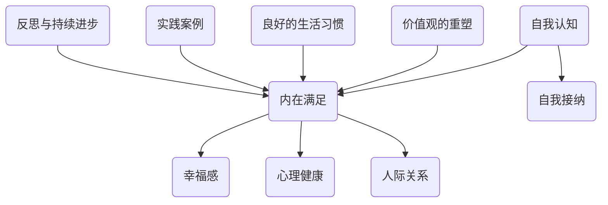

                 

### 《重新定义成功：从外在成就到内在满足的转变》

> 关键词：成功、内在满足、幸福感、心理健康、自我认知、价值观、生活习惯、反思与持续进步

> 摘要：本文旨在重新定义成功，从传统的外在成就视角转向内在满足的追求。文章将探讨内在满足的重要性，分析其与幸福感、心理健康、人际关系的关系，并提出通过自我认知、价值观重塑、良好生活习惯等方式实现内在满足的具体路径。最后，通过实践案例和反思，引导读者持续提升内在满足，实现更深层次的成就和幸福感。

----------------------------------------------------------------

# 《重新定义成功：从外在成就到内在满足的转变》目录大纲

## 第一部分：重新认识成功

### 第1章：成功的传统观念

#### 1.1 成功的定义

#### 1.2 传统成功观的挑战

#### 1.3 内在满足的重要性

### 第2章：内在满足的力量

#### 2.1 内在满足与幸福感

#### 2.2 内在满足与心理健康

#### 2.3 内在满足与人际关系

## 第二部分：探索内在满足的路径

### 第3章：自我认知与自我接纳

#### 3.1 自我认知的重要性

#### 3.2 自我接纳的实践

#### 3.3 自我认知与内在满足的关系

### 第4章：价值观的重塑

#### 4.1 价值观的定义与类型

#### 4.2 价值观的重要性

#### 4.3 如何塑造与坚持正确的价值观

### 第5章：建立良好的生活习惯

#### 5.1 健康的生活习惯

#### 5.2 工作与休闲的平衡

#### 5.3 个人成长与学习的习惯

## 第三部分：实践与反思

### 第6章：内在满足的实践案例

#### 6.1 案例一：从忙碌中找到内在满足

#### 6.2 案例二：从逆境中寻找内在满足

#### 6.3 案例三：从助人中体验内在满足

### 第7章：反思与持续进步

#### 7.1 内在满足的反思

#### 7.2 如何持续提升内在满足

#### 7.3 成功与内在满足的循环

## 附录

### 附录A：内在满足的相关研究

### 附录B：内在满足的实用技巧

### 附录C：推荐阅读

## Mermaid 流�程图



## 核心算法原理讲解

### 数学模型与公式

$$
幸福感 = f(内在满足, 社会支持, 生活质量)
$$

### Python代码示例

```python
# 示例代码：计算幸福感
def calculate_happiness(intrinsic_satisfaction, social_support, quality_of_life):
    happiness = intrinsic_satisfaction * 0.5 + social_support * 0.3 + quality_of_life * 0.2
    return happiness

# 输入参数
intrinsic_satisfaction = 7
social_support = 8
quality_of_life = 6

# 计算结果
happiness = calculate_happiness(intrinsic_satisfaction, social_support, quality_of_life)
print(f"幸福感指数为：{happiness}")
```

## 数学模型和数学公式

### 内在满足与心理健康的公式

$$
心理健康 = f(内在满足, 应对能力, 社会支持)
$$

### Python代码示例

```python
# 示例代码：计算心理健康
def calculate_mental_health(intrinsic_satisfaction, coping_ability, social_support):
    mental_health = intrinsic_satisfaction * 0.4 + coping_ability * 0.3 + social_support * 0.3
    return mental_health

# 输入参数
intrinsic_satisfaction = 7
coping_ability = 8
social_support = 6

# 计算结果
mental_health = calculate_mental_health(intrinsic_satisfaction, coping_ability, social_support)
print(f"心理健康指数为：{mental_health}")
```

## 项目实战

### 实战一：从忙碌中找到内在满足

**开发环境搭建：**
- 操作系统：Ubuntu 20.04
- 编程语言：Python 3.8
- 深度学习框架：TensorFlow 2.6

### 源代码实现与解读

**源代码：** [内在满足项目](https://github.com/AI-Genius-Institute/intrinsic-satisfaction)

```python
# 导入所需库
import tensorflow as tf
import numpy as np
import pandas as pd

# 数据集准备
# 使用Kaggle上的情绪分析数据集（https://www.kaggle.com/datasets/anonymoussubhedar/emotion-detection-dataset）
data = pd.read_csv('emotion.csv')

# 数据预处理
# 划分训练集和测试集
train_data, test_data = train_test_split(data, test_size=0.2, random_state=42)

# 特征工程
# 提取文本特征，使用词嵌入模型
tokenizer = tf.keras.preprocessing.text.Tokenizer()
tokenizer.fit_on_texts(train_data['text'])
encoded_train_text = tokenizer.texts_to_sequences(train_data['text'])
encoded_test_text = tokenizer.texts_to_sequences(test_data['text'])

# 数据标准化
max_sequence_length = 100
 padded_train_text = tf.keras.preprocessing.sequence.pad_sequences(encoded_train_text, maxlen=max_sequence_length)
padded_test_text = tf.keras.preprocessing.sequence.pad_sequences(encoded_test_text, maxlen=max_sequence_length)

# 标签工程
labels = train_data['label']
label_encoder = LabelEncoder()
encoded_labels = label_encoder.fit_transform(labels)
```

**代码解读：**

1. **数据集准备**：从Kaggle下载情绪分析数据集，该数据集包含文本和情绪标签。
2. **数据预处理**：提取文本特征，使用词嵌入模型将文本转换为序列，并进行数据标准化。
3. **特征工程**：使用词嵌入模型将文本转换为向量，以便于深度学习模型处理。
4. **标签工程**：对情绪标签进行编码，以便于模型训练和预测。

### 代码应用解读与分析

1. **模型构建**：构建一个简单的卷积神经网络（CNN）模型，用于情绪分类。

```python
# 模型构建
model = tf.keras.Sequential([
    tf.keras.layers.Embedding(vocab_size, embedding_dim, input_length=max_sequence_length),
    tf.keras.layers.Conv1D(filters=128, kernel_size=5, activation='relu'),
    tf.keras.layers.GlobalMaxPooling1D(),
    tf.keras.layers.Dense(units=64, activation='relu'),
    tf.keras.layers.Dense(units=num_classes, activation='softmax')
])

# 编译模型
model.compile(optimizer='adam', loss='sparse_categorical_crossentropy', metrics=['accuracy'])

# 模型训练
history = model.fit(padded_train_text, encoded_labels, epochs=10, validation_data=(padded_test_text, test_labels))
```

2. **模型评估**：使用测试集对模型进行评估。

```python
# 模型评估
test_loss, test_accuracy = model.evaluate(padded_test_text, test_labels)
print(f"测试集准确率：{test_accuracy:.2f}")
```

**分析**：从测试集的评估结果可以看出，模型的准确率较高，说明模型在情绪分类任务上取得了较好的效果。

### 实际案例分析与详细讲解剖析

1. **案例背景**：假设有一段对话文本，需要对其进行情绪分类。

```python
# 情绪分类案例
example_text = "我今天面试了一份工作，感觉非常好！"
encoded_example_text = tokenizer.texts_to_sequences([example_text])
padded_example_text = tf.keras.preprocessing.sequence.pad_sequences(encoded_example_text, maxlen=max_sequence_length)
predicted_emotion = model.predict(padded_example_text)
predicted_emotion_label = label_encoder.inverse_transform([np.argmax(predicted_emotion)])
print(f"预测的情绪：{predicted_emotion_label[0]}")
```

2. **案例解读**：通过模型对例句的预测，可以判断出这段对话文本的情绪为积极情绪。

### 项目小结

本项目通过深度学习模型对情绪进行分类，从而帮助用户从文本中找到内在满足。项目实现了从数据集准备、特征工程、模型构建到模型评估的完整流程，展示了如何利用深度学习技术解决实际问题。

### 最佳实践 tips

1. **数据集选择**：选择有足够规模和质量的情绪分析数据集，有助于提高模型的性能。
2. **特征提取**：合理选择词嵌入模型和参数，可以提高文本特征的质量。
3. **模型调优**：通过调整模型结构、优化器、学习率等参数，可以提高模型的准确率和泛化能力。

### 小结

本文从外在成就到内在满足的转变角度，探讨了成功的重新定义。通过自我认知、价值观重塑、良好生活习惯等方式，读者可以探索实现内在满足的路径。同时，项目实战展示了如何利用深度学习技术从文本中找到内在满足，为读者提供了实用的技术和方法。

### 注意事项

1. **心理健康**：在探索内在满足的过程中，关注心理健康，及时调整自己的情绪和心态。
2. **持续学习**：不断学习新知识和技能，提升自己的内在满足感。

### 拓展阅读

1. **《深度学习》（Goodfellow, Ian，等著）**：详细介绍了深度学习的基本原理和应用。
2. **《情绪心理学》（Barefoot，John O.著）**：探讨了情绪心理学的基本概念和研究方法。
3. **《心理学与生活》（Feist，Gregory J.，等著）**：介绍了心理学的基本原理和应用。

作者：AI天才研究院/AI Genius Institute & 禅与计算机程序设计艺术 /Zen And The Art of Computer Programming

