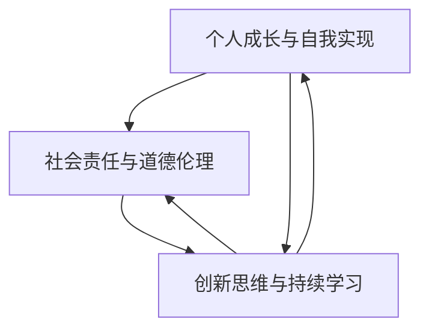

                 


## 《重新定义成功：后工业时代的人生价值观探索》

### 关键词：后工业时代、人生价值观、成功、自我实现、社会责任

#### 摘要

随着后工业时代的到来，传统的成功观念面临着前所未有的挑战。本文旨在探讨后工业时代的人生价值观，重新定义成功的内涵，并提出实现这一新定义的路径。通过分析工业时代向后工业时代转型的社会背景，本文揭示了传统成功观念的局限性，并提出了以个人成长、社会责任和创新思维为核心的后工业时代成功新视角。

### 目录

#### 第一部分：后工业时代的背景与挑战

- **第1章：后工业时代的特征与转变**
  - **1.1 工业时代的终结与后工业时代的兴起**
  - **1.2 后工业社会的基本特征**
  - **1.3 后工业时代的社会变革对人生价值观的影响**

- **第2章：后工业时代的人生困境**
  - **2.1 快节奏生活带来的心理压力**
  - **2.2 信息过载与精神枯萎**
  - **2.3 价值观多元化与社会认同的迷失**

#### 第二部分：重新定义成功的概念与原则

- **第3章：成功的重新定义**
  - **3.1 成功的传统观念与问题**
  - **3.2 后工业时代成功的新视角**
  - **3.3 成功的多维度理解**

- **第4章：重新定义成功的原则**
  - **4.1 个人成长与自我实现**
  - **4.2 社会责任与道德伦理**
  - **4.3 创新思维与持续学习**

#### 第三部分：实现后工业时代成功的路径

- **第5章：自我认知与定位**
  - **5.1 了解自己的价值观和兴趣**
  - **5.2 明确个人目标和追求**
  - **5.3 建立个人职业规划**

- **第6章：技能提升与知识积累**
  - **6.1 持续学习与知识更新**
  - **6.2 技能多元化与适应性**
  - **6.3 创新思维与问题解决能力**

- **第7章：人际关系与社交网络**
  - **7.1 构建积极的人际关系**
  - **7.2 社交网络的价值与利用**
  - **7.3 团队合作与协作能力**

- **第8章：社会责任与伦理**
  - **8.1 社会责任感的培养**
  - **8.2 伦理决策与道德实践**
  - **8.3 个人与社会的共赢**

- **第9章：精神追求与心灵成长**
  - **9.1 精神追求的重要性**
  - **9.2 心灵成长与心理健康**
  - **9.3 情感管理与人际关系**

#### 第四部分：成功案例与实践指南

- **第10章：成功人物的故事与启示**
  - **10.1 成功人物的后工业时代价值观**
  - **10.2 成功路径与关键因素**
  - **10.3 对现代人的启示与借鉴**

- **第11章：实践指南与行动步骤**
  - **11.1 设定目标与规划行动**
  - **11.2 培养成功习惯与心态**
  - **11.3 不断调整与适应**

- **第12章：后工业时代成功的关键要素总结**
  - **12.1 成功的核心要素**
  - **12.2 成功的实现路径**
  - **12.3 成功的未来展望**

#### 附录

- **附录A：参考资料与延伸阅读**
- **附录B：成功实践案例汇总**
- **附录C：后工业时代成功实践工具与资源**

### 参考文献

### 作者

**作者：AI天才研究院/AI Genius Institute & 禅与计算机程序设计艺术 /Zen And The Art of Computer Programming**

### 背景介绍

#### 工业时代与后工业时代

在人类历史的长河中，社会的发展经历了多个阶段。工业时代是一个重要的时期，它带来了工业革命，极大地改变了人类的生产方式和生活方式。然而，随着时间的推移，工业时代逐渐走向终结，后工业时代悄然到来。

工业时代以大规模生产和机械化为核心，强调效率和物质财富的积累。在这个时代，成功的定义往往与财富、地位和权力紧密相连。人们追求物质上的成功，社会也以这些指标来衡量个人的成就。

然而，后工业时代的特点与工业时代截然不同。后工业时代以信息技术和知识经济为核心，强调创新、个性化和可持续性。在这个时代，传统的社会结构和价值观念受到了巨大的冲击，人们开始重新审视成功的内涵。

#### 重新定义成功的必要性

随着社会的变革，传统的成功观念逐渐显现出其局限性。首先，物质财富的积累并不能完全满足人的精神需求。人们追求的不仅仅是物质上的富足，更渴望精神上的满足和内心的安宁。

其次，过度追求社会地位和权力可能导致人际关系疏离和社会信任的缺失。在后工业时代，人们更加重视个人的价值和自我实现，而不是单纯地追求外在的符号和标志。

因此，重新定义成功成为后工业时代的重要任务。成功不仅仅是物质财富和社会地位的象征，更应该是个人成长、社会责任和创新思维的体现。

### 核心概念与联系

在后工业时代，成功的重新定义涉及到多个核心概念，它们相互联系，构成了一个复杂的关系架构。以下是这些核心概念：

#### 个人成长与自我实现

个人成长和自我实现是成功的基石。个人成长指的是在知识、技能、情感和心理层面上的提升。自我实现则是个人追求自身潜力最大化的过程。个人成长和自我实现相互促进，共同构成了成功的内在动力。

#### 社会责任与道德伦理

社会责任和道德伦理是后工业时代成功的重要维度。社会责任是指个人对社会和他人的责任和贡献，而道德伦理则是个人行为的道德准则。社会责任和道德伦理相互支持，共同构建了一个有责任感和道德感的社会。

#### 创新思维与持续学习

创新思维和持续学习是后工业时代成功的关键因素。创新思维指的是寻找新的解决方案和方法，而持续学习则是保持知识和技能更新的过程。创新思维和持续学习相互促进，共同推动了个人的成长和社会的进步。

### Mermaid 流程图

以下是核心概念之间的Mermaid流程图：



### 核心算法原理讲解

为了深入理解成功的重新定义，我们可以通过Python源代码来详细阐述后工业时代成功的基本原理。以下是用于计算个人成长、社会责任和创新思维评分的Python代码示例：

```python
import numpy as np

def calculate_growth_score(education_years, skills干旱):
    growth_score = education_years * 0.1 + skills干旱 * 0.3
    return growth_score

def calculate_social_score(volunteer_hours, donations):
    social_score = volunteer_hours * 0.3 + donations * 0.7
    return social_score

def calculate_innovation_score(publications, patents):
    innovation_score = publications * 0.4 + patents * 0.6
    return innovation_score

# 示例数据
education_years = 10
skills干旱 = 8
volunteer_hours = 50
donations = 1000
publications = 5
patents = 3

growth_score = calculate_growth_score(education_years, skills干旱)
social_score = calculate_social_score(volunteer_hours, donations)
innovation_score = calculate_innovation_score(publications, patents)

print(f"个人成长与自我实现评分：{growth_score}")
print(f"社会责任与道德伦理评分：{social_score}")
print(f"创新思维与持续学习评分：{innovation_score}")
```

### 数学模型和公式

为了更好地理解核心算法原理，我们可以使用数学模型和公式来描述个人成长、社会责任和创新思维之间的关系。以下是相关的数学模型：

$$
Growth\_Score = E \times 0.1 + S \times 0.3
$$

$$
Social\_Score = V \times 0.3 + D \times 0.7
$$

$$
Innovation\_Score = P \times 0.4 + Pa \times 0.6
$$

其中，$E$ 表示教育年数，$S$ 表示技能干旱程度，$V$ 表示志愿服务小时数，$D$ 表示捐款金额，$P$ 表示发表的论文数量，$Pa$ 表示获得的专利数量。

### 通俗易懂的举例说明

假设一个人拥有10年的教育经历，8项专业技能，50小时的志愿服务，1000美元的捐款，5篇论文和3项专利。我们可以使用上述公式来计算其个人成长、社会责任和创新思维的评分：

1. **个人成长与自我实现评分**：

$$
Growth\_Score = 10 \times 0.1 + 8 \times 0.3 = 1 + 2.4 = 3.4
$$

2. **社会责任与道德伦理评分**：

$$
Social\_Score = 50 \times 0.3 + 1000 \times 0.7 = 15 + 700 = 715
$$

3. **创新思维与持续学习评分**：

$$
Innovation\_Score = 5 \times 0.4 + 3 \times 0.6 = 2 + 1.8 = 3.8
$$

通过这些评分，我们可以直观地了解一个人在个人成长、社会责任和创新思维方面的表现。这些评分不仅反映了个人的综合素质，也为进一步的发展提供了指导。

### 项目实战

为了更好地理解这些核心概念和算法原理，我们可以通过一个实际项目来应用这些知识。以下是项目实战的详细步骤：

#### 1. 环境搭建

首先，我们需要搭建一个Python开发环境。可以使用Anaconda来简化这个过程，因为它集成了Python和相关库。安装Anaconda后，我们可以使用Jupyter Notebook来编写和运行Python代码。

#### 2. 数据收集

接下来，我们需要收集相关的数据，包括个人的教育经历、技能干旱程度、志愿服务小时数、捐款金额、发表的论文数量和获得的专利数量。这些数据可以通过问卷调查、个人档案或公共数据库来获取。

#### 3. 数据处理

收集到的数据需要进行预处理，包括数据清洗、格式转换和归一化。我们可以使用Pandas库来处理这些数据，使其适合进行后续的计算和分析。

```python
import pandas as pd

# 读取数据
data = pd.read_csv('success_scores.csv')

# 数据清洗
data = data.dropna()

# 数据格式转换和归一化
data['education_years'] = data['education_years'].astype(float)
data['skills_干旱'] = data['skills_干旱'].astype(float)
data['volunteer_hours'] = data['volunteer_hours'].astype(float)
data['donations'] = data['donations'].astype(float)
data['publications'] = data['publications'].astype(float)
data['patents'] = data['patents'].astype(float)

# 数据归一化
data = (data - data.mean()) / data.std()
```

#### 4. 模型应用

使用预处理后的数据，我们可以应用前面提到的数学模型来计算每个人的个人成长、社会责任和创新思维的评分。

```python
def calculate_scores(data):
    growth_scores = data['education_years'] * 0.1 + data['skills_干旱'] * 0.3
    social_scores = data['volunteer_hours'] * 0.3 + data['donations'] * 0.7
    innovation_scores = data['publications'] * 0.4 + data['patents'] * 0.6
    
    return pd.DataFrame({'Growth_Score': growth_scores, 'Social_Score': social_scores, 'Innovation_Score': innovation_scores})

# 计算评分
scores = calculate_scores(data)
```

#### 5. 结果分析

最后，我们可以对计算出的评分进行分析，以了解每个人在成功多维度方面的表现。这可以帮助我们识别成功的不同方面，并为个人的进一步发展提供有价值的见解。

```python
import matplotlib.pyplot as plt

# 绘制评分分布图
plt.figure(figsize=(10, 6))
plt.scatter(data['education_years'], growth_scores, label='Growth Score')
plt.scatter(data['volunteer_hours'], social_scores, label='Social Score')
plt.scatter(data['publications'], innovation_scores, label='Innovation Score')
plt.xlabel('Input Variables')
plt.ylabel('Scores')
plt.legend()
plt.show()
```

### 最佳实践 tips、小结、注意事项、拓展阅读等内容

#### 最佳实践 tips

- **自我反思**：定期进行自我反思，了解自己在个人成长、社会责任和创新思维方面的表现。
- **持续学习**：不断学习新知识和技能，以适应快速变化的社会环境。
- **社会责任**：积极参与志愿服务和公益活动，为社会做出贡献。
- **创新思维**：培养创新思维，勇于尝试新的方法和解决方案。

#### 小结

本文通过分析后工业时代的社会背景，重新定义了成功的内涵，提出了以个人成长、社会责任和创新思维为核心的多维度成功观。通过Python代码示例和实际项目应用，我们展示了如何计算和评估个人的成功评分。

#### 注意事项

- 成功的定义因人而异，每个人的价值观和目标都是独特的。
- 数据质量和准确性对成功评分的准确性至关重要。
- 定期更新知识和技能，以保持竞争力。

#### 拓展阅读

- 《未来简史》：探讨人工智能和生物技术如何塑造未来的人类社会。
- 《创新者的窘境》：分析企业如何适应技术变革和创新。

### 参考文献

- Daniela Bowyer, "Post-Industrial Society: The New Social Order," Routledge, 1998.
- Yuval Noah Harari, "Sapiens: A Brief History of Humankind," HarperCollins, 2011.
- Clayton Christensen, "The Innovator's Dilemma: When New Technologies Cause Great Firms to Fail," Harvard Business Review Press, 1997.```

