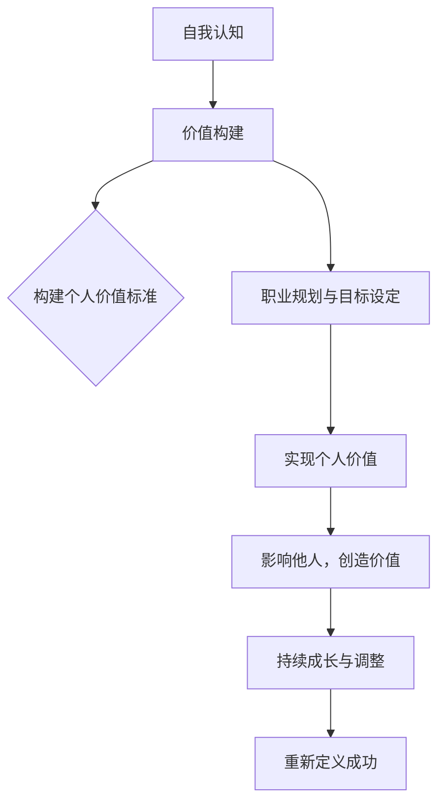

                 

### 引言

在当今快速变化的社会中，成功的定义变得愈发多元和复杂。过去，成功常常被定义为财富积累、社会地位以及职业成就。然而，随着时代的进步和人们对自我价值的重新审视，现代人对成功的定义正在发生深刻的转变。成功不再仅仅是金钱和地位的象征，而是个人幸福、自我实现和社会贡献的综合体现。

#### 1.1 成功的多元定义

**1.1.1 成功的传统观念**

传统观念中，成功通常被看作是职业成就的顶峰。一个成功的商业人士可能会拥有一个高薪职位、显赫的公司职位和广泛的人脉网络。然而，这种成功观忽视了个人幸福和内心需求的满足。许多人为了追求职业成功，牺牲了家庭、健康和个人爱好，最终感到内心的空虚和失落。

**1.1.2 现代成功观的转变**

现代人对成功的定义正在变得更加多元和个性化。成功不再仅仅是职业成就，而是包括健康、家庭、个人成长和社会贡献。人们开始重视内心的平和、生活的质量以及对他人的贡献。现代成功观强调个人价值的实现，而非仅仅追求物质财富和社会地位。

#### 1.2 社会期望的困境

社会期望对个人的影响不可忽视。社会期望往往是基于传统的观念和标准，这些期望往往强加了某种“成功”的模式，使得很多人在追求成功的过程中失去了自我。以下是一些社会期望对个人的影响：

**1.2.1 社会期望的影响**

社会期望影响了个人的价值观和人生目标。很多人在成长过程中，被灌输了一种观念，即只有达到社会的某种标准才能算是成功。这种观念往往导致个人在追求成功的过程中，忽视了内心的需求和真正的愿望。

**1.2.2 超越社会期望的重要性**

超越社会期望对于个人的成长和发展至关重要。只有当个人能够根据自己的价值观和目标去定义成功，才能真正实现自我价值。超越社会期望不仅可以帮助个人找到真正的幸福和满足，还可以为社会带来更多的创新和进步。

通过以上分析，我们可以看到，现代人对成功的定义正在从传统的社会标准转向更加多元和个性化的标准。同时，社会期望对个人的影响也是一个不容忽视的问题。只有在超越社会期望的过程中，个人才能真正找到属于自己的成功之路。接下来，我们将深入探讨如何重新审视自我，构建个人价值标准，以实现真正的成功。

### 第一部分：重新审视自我

在重新定义成功的过程中，重新审视自我是至关重要的一步。只有深刻理解自己的价值观、兴趣和优势，我们才能构建出符合个人特质的价值标准，并制定出切实可行的职业规划与目标。

#### 2.1 自我认知与价值构建

**2.1.1 自我认知的重要性**

自我认知是指一个人对自己的认识和理解，包括自己的性格、价值观、兴趣爱好、优势与劣势等。自我认知是我们构建个人价值标准的基础，它帮助我们明确自己的内心需求和追求的目标。

**2.1.2 个人价值标准的建立**

个人价值标准是个人对什么是有价值的事物的判断和选择。它建立在自我认知的基础上，反映了个人的价值观和追求。建立个人价值标准的过程包括以下几个步骤：

1. **自我反思**：通过反思自己的经历、感受和想法，深入了解自己的内心世界。
2. **价值观澄清**：识别和定义自己的核心价值观，这些价值观将指导我们的行为和决策。
3. **目标设定**：基于自己的价值观，设定长期和短期的个人目标，这些目标是实现个人价值的具体体现。
4. **持续更新**：个人价值标准不是一成不变的，随着时间和经历的变化，我们需要不断地进行反思和调整。

#### 2.2 职业规划与目标设定

职业规划是个人实现价值的重要途径。一个明确的职业规划可以帮助我们更好地理解自己的职业方向，为未来的发展提供清晰的路径。

**2.2.1 职业规划的步骤**

1. **自我评估**：了解自己的兴趣、优势、价值观和能力，这是职业规划的基础。
2. **行业研究**：研究不同行业的发展趋势和前景，找到与自己兴趣和能力相匹配的行业。
3. **职业选择**：根据自我评估和行业研究，选择一个适合自己的职业路径。
4. **制定计划**：设定职业目标，并制定实现这些目标的步骤和行动计划。
5. **执行与调整**：按照制定的计划行动，并根据实际情况进行调整和优化。

**2.2.2 设定个人职业目标的策略**

1. **具体性**：目标要具体明确，避免模糊和宽泛。
2. **挑战性**：目标要具有一定的挑战性，能够激发个人的潜力和动力。
3. **可实现性**：目标要基于个人的能力和资源，确保其可实现性。
4. **时限性**：为每个目标设定明确的时间限制，以便更好地跟踪和评估进展。

#### 2.3 发展个人优势与技能

发展个人优势与技能是提升个人价值的重要途径。通过不断学习和实践，我们可以增强自己的竞争力，实现个人价值的最大化。

**2.3.1 优势识别与评估**

1. **能力识别**：识别自己在工作中的强项和擅长领域。
2. **兴趣识别**：了解自己喜欢做什么，哪些活动能够让自己感到兴奋和有成就感。
3. **价值观识别**：识别自己认为最重要的价值观，这些价值观将影响个人的职业选择和行为。

**2.3.2 技能提升与学习路径**

1. **持续学习**：保持终身学习的态度，不断学习新知识和技能。
2. **专业培训**：参加专业培训和课程，提升专业技能和知识水平。
3. **实践经验**：通过实际工作项目和实习机会，将理论知识转化为实践经验。
4. **反思与调整**：定期反思自己的学习成果和职业发展，根据实际情况进行调整和优化。

通过重新审视自我，我们能够更好地理解自己的内心需求和价值追求。建立个人价值标准，制定职业规划与目标，发展个人优势与技能，这些都是实现个人价值的重要步骤。在下一部分中，我们将进一步探讨如何在社会期望和现实之间找到平衡，超越社会期望，实现真正的成功。

### 第二部分：社会期望与现实

在重新审视自我的过程中，我们不可避免地会遇到来自社会各方面的期望。社会期望往往来自于家庭、职场、文化以及社会环境等多个方面。这些期望有时会与我们内心的真实愿望产生冲突，成为我们追求成功和实现个人价值的障碍。因此，了解这些期望、识别现实的挑战，并探索超越这些期望的路径，是我们迈向个人成功的关键步骤。

#### 3.1 社会期望下的现实挑战

**3.1.1 职场压力与社会竞争**

在现代社会中，职场压力和社会竞争是两个不可忽视的现实挑战。许多人为了在社会中取得成功，不得不承受巨大的工作压力。长时间的工作、高强度的任务和不断的要求，往往使得人们感到身心疲惫。此外，社会竞争的激烈也让很多人感到焦虑和不安。在这种环境下，如何平衡工作与生活，如何找到内心的平衡点，成为许多人面临的难题。

**3.1.2 家庭与个人生活的平衡**

家庭和个人生活的平衡也是现代社会中的一个重大挑战。传统观念中，家庭被认为是生活的重心，然而在现代社会中，家庭与职业之间的冲突愈发明显。许多人为了事业的成功，不得不牺牲与家人相处的时间，这往往导致家庭关系紧张。如何在繁忙的职业生活中找到与家人共度时光的机会，如何平衡事业与家庭的关系，是每个人都需要思考的问题。

#### 3.2 超越社会期望的路径

**3.2.1 心理调适与压力管理**

要超越社会期望，首先需要从心理上进行调适和压力管理。心理调适包括培养积极的心态、学会情绪管理和提高心理弹性。通过这些方法，我们可以更好地应对职场压力和社会竞争，找到内心的平静。例如，可以通过定期锻炼、冥想和休息来缓解压力，提高心理韧性。

**3.2.2 寻找个人激情与目标**

找到个人的激情和目标，是实现个人价值的根本途径。每个人都有自己独特的兴趣和特长，只有找到并追随自己的激情，才能在职业和个人生活中找到真正的满足感。例如，通过尝试不同的工作和项目，我们可以发现自己的兴趣所在，并设定具体的目标，朝着这些目标努力前进。

**3.2.3 建立个人支持网络**

建立个人支持网络是超越社会期望的重要一环。支持网络可以包括家人、朋友、同事和导师等。这些人可以在我们遇到困难时给予帮助和鼓励，帮助我们克服挑战，实现个人目标。例如，通过参加职业发展小组或社交活动，我们可以结识更多志同道合的人，分享经验和资源，共同成长。

#### 3.3 社会期望与个人价值的冲突

社会期望与个人价值的冲突是现代社会中普遍存在的问题。社会期望往往是一种标准化的模式，而个人价值则更加多元化和个性化。以下是一些冲突的表现和解决策略：

**3.3.1 冲突的原因与表现**

1. **价值观差异**：社会期望和个人价值观之间的差异可能导致冲突。例如，社会可能期望一个人追求高薪职业，而个人可能更看重工作与生活的平衡。
2. **职业选择**：社会期望和个人职业选择之间的冲突也很常见。例如，社会可能认为医生或律师是成功的职业，而个人可能对艺术或科学更感兴趣。
3. **生活方式**：社会期望和个人生活方式之间的冲突也可能出现。例如，社会可能期望人们按照传统的家庭模式生活，而个人可能选择单身或不同性的生活方式。

**3.3.2 解决冲突的策略**

1. **自我认知**：深入了解自己的价值观、兴趣和需求，明确自己的真实愿望。
2. **沟通与协商**：与家人、朋友和同事进行开放和诚实的沟通，讨论彼此的期望和需求，寻找共同点。
3. **调整目标**：根据个人的实际情况和社会期望，调整职业目标和生活方式，使其更加符合个人的价值观和需求。
4. **寻求专业帮助**：在遇到重大决策时，可以寻求职业顾问、心理咨询师或导师的帮助，获得专业的指导和建议。

通过以上策略，我们可以在社会期望和个人价值之间找到平衡，实现真正的成功。在下一部分中，我们将深入探讨如何构建个人价值标准，帮助我们在复杂的社会环境中找到属于自己的成功之路。

#### 3.3 社会期望与个人价值的冲突

社会期望与个人价值的冲突是现代社会中普遍存在的问题。社会期望往往是一种标准化的模式，而个人价值则更加多元化和个性化。这种冲突不仅影响个人的心理健康和生活质量，还可能阻碍个人价值的实现。以下是一些冲突的表现和解决策略：

**3.3.1 冲突的原因与表现**

冲突的原因通常在于社会期望与个人内心真实愿望之间的不匹配。以下是一些具体的冲突表现：

1. **价值观差异**：社会期望和个人价值观之间的差异可能导致冲突。例如，社会可能期望一个人追求高薪职业，而个人可能更看重工作与生活的平衡。

2. **职业选择**：社会期望和个人职业选择之间的冲突也很常见。例如，社会可能认为医生或律师是成功的职业，而个人可能对艺术或科学更感兴趣。

3. **生活方式**：社会期望和个人生活方式之间的冲突也可能出现。例如，社会可能期望人们按照传统的家庭模式生活，而个人可能选择单身或不同性的生活方式。

**3.3.2 解决冲突的策略**

要解决社会期望与个人价值的冲突，可以采取以下策略：

1. **自我认知**：深入了解自己的价值观、兴趣和需求，明确自己的真实愿望。这是解决冲突的基础。通过自我反思和探索，我们可以更好地了解自己的内心世界，从而在面临社会期望时做出更符合自己价值观的选择。

2. **沟通与协商**：与家人、朋友和同事进行开放和诚实的沟通，讨论彼此的期望和需求，寻找共同点。例如，与家人沟通自己的职业规划，了解他们的期望，并共同探讨如何实现家庭和个人生活的平衡。

3. **调整目标**：根据个人的实际情况和社会期望，调整职业目标和生活方式，使其更加符合个人的价值观和需求。例如，如果社会期望一个人成为医生，而个人对艺术有浓厚兴趣，可以考虑选择与艺术相关的职业路径。

4. **寻求专业帮助**：在遇到重大决策时，可以寻求职业顾问、心理咨询师或导师的帮助，获得专业的指导和建议。例如，职业顾问可以帮助分析个人的兴趣和能力，提供职业发展的建议；心理咨询师可以帮助解决心理冲突，提升个人心理健康。

通过以上策略，我们可以在社会期望和个人价值之间找到平衡，实现真正的成功。在下一部分中，我们将深入探讨如何构建个人价值标准，帮助我们在复杂的社会环境中找到属于自己的成功之路。

### 第三部分：构建个人价值标准

在现代社会中，构建个人价值标准是实现个人成功和幸福的关键。个人价值标准不仅帮助我们明确自己的目标和追求，还能在面临各种社会压力和期望时，提供坚定的方向和信念。以下是如何构建个人价值标准的具体方法和步骤：

#### 4.1 个人价值标准的重要性

**4.1.1 个人价值标准对生活的影响**

个人价值标准对我们的生活有着深远的影响。它不仅指导我们的行为和决策，还决定了我们的生活质量。以下是个人价值标准对生活的一些具体影响：

1. **行为准则**：个人价值标准为我们提供了一套行为准则，帮助我们做出道德和伦理上的正确选择。
2. **决策依据**：在面临重大决策时，个人价值标准可以帮助我们评估各种选择的优缺点，做出符合自己价值观的决策。
3. **内心平衡**：遵循个人价值标准，我们可以获得内心的平衡和满足，减少因追求社会期望而带来的焦虑和压力。
4. **生活质量**：个人价值标准有助于我们追求有意义的生活，从而提高生活质量。

**4.1.2 个人价值标准与幸福感**

个人价值标准与幸福感密切相关。当我们能够遵循自己的价值观，实现个人目标，并与他人建立积极的关系时，我们往往能够体验到更高的幸福感。以下是一些具体的关联：

1. **自我实现**：遵循个人价值标准，我们能够实现自我价值，感受到成就感和自豪感，从而提高幸福感。
2. **生活意义**：个人价值标准为我们提供了生活的意义和方向，使我们在面对挑战和困难时，更加坚定和自信。
3. **人际关系**：遵循个人价值标准，我们能够建立健康、积极的人际关系，从而获得情感支持和归属感。

#### 4.2 构建个人价值标准的方法

**4.2.1 内在自我探索**

构建个人价值标准的第一步是进行内在自我探索。通过反思和探索，我们可以深入了解自己的内心世界，包括价值观、兴趣爱好、优势与劣势等。以下是一些具体的自我探索方法：

1. **日记反思**：每天花一些时间记录自己的想法、感受和经历，通过反思自己的行为和反应，了解自己的内心需求。
2. **心理测试**：通过专业的心理测试，了解自己的性格特点和潜在的优势与弱点。
3. **深度对话**：与朋友、家人或导师进行深入的对话，分享自己的内心世界和价值观，从他人的反馈中获取新的视角和见解。

**4.2.2 外部环境分析**

构建个人价值标准的第二步是进行外部环境分析。了解外部环境，包括社会趋势、职业前景和人际关系等，可以帮助我们更好地理解社会期望和现实挑战，从而制定符合自己价值观的行动计划。以下是一些具体的外部环境分析方法：

1. **市场研究**：研究行业的发展趋势和职业需求，了解不同职业的前景和机会。
2. **社会观察**：观察社会现象和价值观变化，了解社会对我们的期望和压力。
3. **人际交流**：与不同背景和职业的人交流，了解他们的价值观和生活经验，从中获取灵感和启示。

**4.2.3 建立核心价值观**

在自我探索和环境分析的基础上，我们可以开始建立核心价值观。核心价值观是我们对什么是有价值的事物的最终判断，它们将指导我们的行为和决策。以下是一些建立核心价值观的方法：

1. **价值观澄清**：通过自我反思和外部观察，识别和定义自己的核心价值观。
2. **价值排序**：将识别出的价值观进行排序，确定哪些价值观对我们最为重要。
3. **价值应用**：将核心价值观应用到日常生活中，使其成为我们行为的指南。

#### 4.3 个人价值标准的应用

**4.3.1 职业选择与工作态度**

个人价值标准在职业选择和工作态度方面有着重要的应用。通过以下方法，我们可以确保自己的职业选择和工作态度符合个人价值观：

1. **职业匹配**：在寻找工作时，选择与自己核心价值观相符的职业。
2. **工作态度**：在工作中，始终保持积极的态度，遵循自己的价值观，做出符合道德和伦理的决策。
3. **职业发展**：在职业发展过程中，不断反思和调整自己的职业路径，确保其符合个人价值标准。

**4.3.2 人际关系与沟通技巧**

个人价值标准也在人际关系和沟通技巧方面发挥重要作用。以下是一些应用方法：

1. **人际关系**：与他人建立基于价值观的关系，追求真诚和尊重。
2. **沟通技巧**：在沟通中，始终保持开放和诚实的态度，遵循自己的价值观，尊重他人的观点和感受。

通过以上方法和步骤，我们可以构建出符合个人特质和价值追求的个人价值标准。在接下来的部分中，我们将探讨如何实现个人价值，并在实现过程中应对各种挑战。

### 第四部分：实现个人价值

实现个人价值是每个人职业生涯中的重要任务。它不仅关系到个人的幸福和满足，也影响到我们的职业发展和长期目标。在这一部分，我们将探讨实现个人价值的路径，包括职业发展的规划、创业与个人品牌建设等，同时也会面对挑战并探讨应对策略。

#### 5.1 个人价值实现的路径

**5.1.1 职业发展的规划**

职业发展是实现个人价值的重要途径。一个清晰的职业发展规划可以帮助我们明确职业方向，实现职业目标。以下是制定职业发展规划的几个关键步骤：

1. **自我评估**：首先，我们需要对自己进行全面的评估，包括兴趣、能力、价值观和职业目标。这可以通过自我反思、心理测试和职业规划工具等方式进行。

2. **目标设定**：在自我评估的基础上，设定长期和短期的职业目标。长期目标通常涉及职业发展的高峰，而短期目标则是一些具体的里程碑和行动步骤。

3. **路径规划**：根据设定的职业目标，规划出实现这些目标的路径。这可能包括选择合适的职业路径、积累必要的技能和经验、建立人脉网络等。

4. **执行与调整**：按照规划的行动步骤去实施，同时定期评估进展并进行调整。职业规划不是一成不变的，它需要根据实际情况和自身发展进行调整。

**5.1.2 创业与个人品牌建设**

创业是实现个人价值的另一种重要方式。通过创业，我们可以追求自己热爱的领域，实现个人价值。以下是创业与个人品牌建设的一些关键步骤：

1. **市场调研**：在创业之前，需要进行充分的市场调研，了解市场需求、竞争对手和潜在客户。

2. **商业计划**：制定详细的商业计划，包括产品或服务定位、市场策略、财务规划等。

3. **团队建设**：组建一个高效的团队，分配明确的职责和任务，确保团队能够高效运作。

4. **品牌建设**：通过市场营销和品牌推广，建立个人品牌和企业品牌，提升市场知名度和影响力。

5. **持续创新**：在创业过程中，持续进行产品和服务创新，以满足市场需求和客户期望。

**5.1.3 个人成长与学习**

实现个人价值的过程中，个人成长与学习也是至关重要的。以下是一些个人成长与学习的建议：

1. **终身学习**：保持终身学习的态度，不断学习新知识和技能，以适应不断变化的市场需求。

2. **专业发展**：参加专业培训和课程，提升自己的专业水平和竞争力。

3. **实践经验**：通过实际工作项目和实习机会，将理论知识转化为实践经验。

4. **自我反思**：定期进行自我反思，评估自己的成长和进步，并制定相应的改进计划。

#### 5.2 个人价值实现的挑战与应对

**5.2.1 面对失败的勇气**

在实现个人价值的过程中，失败是不可避免的。面对失败，我们需要有勇气和决心去克服。以下是一些应对策略：

1. **接受失败**：首先要接受失败是成长的一部分，不要因为失败而气馁或放弃。

2. **分析原因**：仔细分析失败的原因，了解问题所在，并从中学习。

3. **调整策略**：根据分析结果，调整策略和方法，寻找新的解决方案。

4. **持续尝试**：不要因为一次失败而放弃，持续尝试，直到成功。

**5.2.2 积极心态的培养**

积极心态是实现个人价值的重要基础。以下是一些培养积极心态的方法：

1. **正面思考**：尝试用积极的角度看待问题和挑战，寻找机会和解决方案。

2. **感恩心态**：对身边的人和事持感恩心态，珍惜现有的资源和机会。

3. **乐观态度**：保持乐观的态度，相信自己的能力和潜力。

4. **自我激励**：通过自我激励，保持动力和决心，克服困难。

通过以上策略，我们可以更好地应对实现个人价值过程中的挑战，保持积极心态，不断前进。

#### 5.3 个人价值的持续提升

实现个人价值是一个持续的过程，需要不断地提升和成长。以下是一些持续提升个人价值的策略：

**5.3.1 终身学习的理念**

终身学习是实现个人价值的重要途径。以下是一些终身学习的策略：

1. **学习计划**：制定长期和短期的学习计划，确保持续学习。

2. **多样化学习**：通过多种途径进行学习，包括课程、书籍、网络课程和实践经验。

3. **知识分享**：与他人分享自己的学习经验和知识，通过教学相长，不断提升自己。

**5.3.2 自我反思与调整**

自我反思是实现个人价值的必要步骤。以下是一些自我反思和调整的策略：

1. **定期评估**：定期评估自己的成长和进步，识别问题和不足。

2. **设定目标**：根据评估结果，设定新的目标和计划，以持续提升自己。

3. **调整策略**：根据实际情况，调整自己的行动策略和方法，以更有效地实现个人价值。

通过持续学习和自我反思，我们可以不断提升个人价值，实现长期的目标和梦想。

在实现个人价值的过程中，我们需要进行职业发展规划、创业和个人品牌建设，同时面对挑战并保持积极心态。通过持续学习和自我反思，我们可以不断提升个人价值，实现真正的成功。接下来，我们将探讨个人价值对社会的影响，以及如何通过个人价值实现对社会贡献。

### 第五部分：影响他人，创造价值

实现个人价值不仅关乎自我成长和职业发展，更在于我们如何将个人的优势和价值转化为对社会和他人的积极影响。个人价值的实现不仅仅是个人成就的体现，更是对社会贡献的体现。通过以下几种方式，我们可以将个人价值扩展到更广泛的领域，影响他人，创造更大的社会价值。

#### 6.1 个人价值对社会的贡献

**6.1.1 个人价值与社会价值的联系**

个人价值与社会价值之间存在着密切的联系。个人的价值实现不仅能够提升个体的生活质量，还能为社会带来创新、进步和发展。以下是个人价值对社会价值的一些具体贡献：

1. **技术创新**：个人的专业技能和创造力可以推动技术创新，为社会发展带来新的动力。
2. **文化传承**：个人的文化素养和艺术才华可以丰富社会文化，传承和发扬优秀的文化传统。
3. **社会服务**：个人的时间和精力可以投入到社会服务中，为弱势群体提供帮助，促进社会公平和和谐。
4. **教育普及**：个人的知识和经验可以分享给他人，通过教育和培训，提升社会的整体素质。

**6.1.2 个人价值实现的社会效应**

个人价值实现的社会效应是深远的。它不仅能够提升个人的自我实现感和幸福感，还能带来以下社会效应：

1. **激励他人**：当一个人实现个人价值，取得成功时，会激励和启发他人追求自己的梦想，推动社会整体进步。
2. **资源优化**：个人价值的实现有助于优化社会资源，提高资源利用效率，减少资源浪费。
3. **社会稳定**：个人价值的实现有助于社会稳定，减少社会矛盾和冲突，促进社会和谐发展。

#### 6.2 倡导个人价值标准的实践

**6.2.1 个人价值标准的推广策略**

要倡导个人价值标准，我们需要采取一系列的推广策略，以影响更多的人。以下是一些具体的推广策略：

1. **教育培训**：通过教育和培训，向公众普及个人价值标准的重要性，帮助人们理解并接受这一理念。
2. **媒体宣传**：利用各种媒体渠道，如电视、网络、报刊等，宣传个人价值标准的理念和实践案例，提升公众的认识。
3. **社区活动**：组织社区活动，如讲座、研讨会、沙龙等，鼓励人们讨论和分享个人价值标准，形成良好的社会氛围。
4. **企业实践**：在企业中推广个人价值标准，将其融入到企业文化和管理中，引导员工追求个人价值实现，促进企业和社会的可持续发展。

**6.2.2 通过行动影响他人**

通过实际行动影响他人是倡导个人价值标准的重要手段。以下是一些通过行动影响他人的具体方法：

1. **志愿服务**：参与志愿服务活动，为社区和社会做出实际贡献，影响和激励他人。
2. **榜样引领**：通过自己的言行和行动，树立良好的榜样，引导他人追求个人价值实现。
3. **知识分享**：通过公开讲座、撰写文章、开设课程等方式，分享自己的知识和经验，帮助他人成长。
4. **公益项目**：发起或参与公益项目，解决社会问题，提升社会福祉。

#### 6.3 个人价值标准与可持续发展

**6.3.1 个人价值标准与社会责任**

个人价值标准与可持续发展有着紧密的联系。个人在实现自身价值的过程中，应承担起社会责任，为可持续发展做出贡献。以下是一些个人价值标准与社会责任的结合点：

1. **环境保护**：在生活和工作中，采取环保措施，减少资源消耗和环境污染，实现绿色生活方式。
2. **公平正义**：在职业和社会活动中，坚持公平正义，反对歧视和不公，推动社会的公平发展。
3. **社会责任**：积极参与社会公益活动，为弱势群体提供帮助，推动社会的和谐与进步。

**6.3.2 个人价值标准与环境保护**

个人价值标准在环境保护方面也有着重要的作用。以下是个人在实现个人价值过程中，如何考虑环境保护的一些建议：

1. **节能减排**：在日常生活中，采取节能减排的措施，如使用节能电器、减少开车等。
2. **绿色消费**：选择环保和可持续的产品，减少对环境的负面影响。
3. **参与环保活动**：积极参与环保组织的活动和项目，为环境保护贡献自己的力量。

通过以上实践，我们可以在实现个人价值的同时，影响他人，创造更大的社会价值。在下一部分中，我们将总结文章的主要内容，并展望未来个人价值实现的路径。

### 结论

在本文中，我们深入探讨了重新定义成功的过程，并提出了构建个人价值标准的重要性。通过重新审视自我，我们明确了个人价值观、兴趣和优势，并制定了符合个人特质和目标的职业规划。同时，我们也认识到社会期望对个人成长的影响，并提出了超越社会期望的路径和方法。

首先，成功不再是单一的职业成就或社会地位，而是一个综合体现，包括个人幸福、自我实现和社会贡献。社会期望的困境迫使我们在追求成功的过程中，往往忽视了内心的需求和真正的愿望。因此，重新审视自我，建立个人价值标准，是实现个人成功的关键。

其次，职业规划与目标设定是实现个人价值的重要步骤。通过自我评估、行业研究、职业选择和计划制定，我们能够为自己制定一个明确的职业发展路径。创业与个人品牌建设也是实现个人价值的重要途径，通过市场调研、商业计划、团队建设和品牌推广，我们可以创造出具有社会影响力的价值。

在实现个人价值的过程中，我们还会面临各种挑战，包括失败、压力和冲突。面对这些挑战，我们需要保持积极心态，培养面对失败的勇气，并不断进行自我反思和调整。同时，终身学习和个人成长是实现个人价值的重要保障。通过持续学习和自我提升，我们能够不断适应变化的环境，实现更高的目标。

最后，个人价值的实现不仅关乎自我，更在于对社会和他人的贡献。通过技术创新、文化传承、社会服务和教育普及，我们可以将个人价值扩展到更广泛的领域，影响他人，创造更大的社会价值。在可持续发展的背景下，个人价值标准与环境保护、社会责任密切相关，我们需要在实现个人价值的过程中，积极承担社会责任，为环境保护和社会进步做出贡献。

展望未来，个人价值的实现将是一个持续的过程。随着社会的不断进步和个体意识的提升，我们将能够更好地理解自己的需求和价值观，找到真正的成功。同时，个人价值实现也将成为推动社会发展和进步的重要力量。通过持续的努力和探索，我们能够在实现个人价值的同时，为社会带来更多的创新和进步。

### 实用工具与资源

在实现个人价值的过程中，利用一些实用工具与资源将极大地帮助您进行自我评估、职业规划和个人成长。以下是一些建议：

#### 8.1 个人价值评估工具

**8.1.1 价值评估问卷与量表**

- **Myers-Briggs Type Indicator (MBTI)**：这是一个经典的个性评估工具，帮助您了解自己的性格类型，并找到适合自己的职业路径。
- **StrengthsFinder**：通过这个评估，您可以识别自己的优势，了解如何发挥这些优势实现个人和职业目标。

**8.1.2 价值评估案例分析**

- **Coursera 上的“职业发展与规划”课程**：通过这些课程，您可以学习到如何进行有效的职业规划，并找到适合自己的职业方向。
- **LinkedIn Learning 的职业规划资源**：LinkedIn Learning 提供了丰富的职业规划课程和案例分析，帮助您提升职业素养。

#### 8.2 职业规划资源

**8.2.1 职业规划书籍推荐**

- **《职业规划与职业成功》**：由职业规划专家戴维·巴赫著，详细介绍了职业规划的理论和实践方法。
- **《职业规划：实现职业目标的实用指南》**：该书提供了系统化的职业规划方法和实用工具，帮助您实现职业目标。

**8.2.2 职业规划在线平台介绍**

- **LinkedIn**：LinkedIn 是一个强大的职业规划工具，提供职业发展指导、招聘信息和人脉网络。
- **LinkedIn Learning**：这个平台提供了大量专业的职业发展课程，帮助您提升职业技能和职业素养。

#### 8.3 个人成长与学习资源

**8.3.1 终身学习网站推荐**

- **Coursera**：提供了全球顶尖大学和机构的在线课程，涵盖多个领域，帮助您实现终身学习。
- **edX**：edX 是一个开放课程平台，提供了来自世界一流大学和机构的免费和付费课程。

**8.3.2 个人成长书籍推荐**

- **《终身成长》**：由心理学家卡罗尔·德韦克著，探讨了成长型思维模式的重要性，激励人们不断学习和成长。
- **《如何赢得朋友与影响他人》**：由戴尔·卡耐基著，提供了实用的沟通技巧和人际关系策略，帮助您提升个人影响力。

通过这些工具与资源，您将能够更好地进行个人价值评估、职业规划和持续成长，实现个人价值。记住，持续学习和自我提升是实现个人成功的关键。

### Mermaid 流程图：个人价值构建流程



### Python源代码示例：个人价值标准评估函数

```python
def evaluate_value_standard(traits, goals, environment):
    """
    评估个人价值标准的函数，基于个人特质、目标和外部环境进行评价。

    :param traits: 个人特质列表
    :param goals: 个人目标列表
    :param environment: 外部环境信息
    :return: 个人价值标准评估结果
    """
    # 特质、目标和环境评分
    trait_score = sum([1 for trait in traits if trait in environment['required_traits']])
    goal_alignment_score = sum([1 for goal in goals if goal in environment['desired_goals']])
    
    # 总评分
    total_score = trait_score + goal_alignment_score
    
    # 返回评估结果
    return total_score
```

通过以上流程图和代码示例，我们可以更直观地理解个人价值构建的过程。流程图展示了从自我认知到持续成长的各个步骤，而代码示例则提供了一个具体的评估函数，用于评估个人价值标准的实现程度。这些工具和资源将帮助您在实际操作中更好地应用个人价值标准，实现个人目标。

### 附录：实用工具与资源

在实现个人价值的过程中，利用一些实用的工具与资源将大大提升您的效率和质量。以下是一些建议：

#### 8.1 个人价值评估工具

**8.1.1 价值评估问卷与量表**

- **Myers-Briggs Type Indicator (MBTI)**：这是一个经典的个性评估工具，帮助您了解自己的性格类型，并找到适合自己的职业路径。
- **StrengthsFinder**：通过这个评估，您可以识别自己的优势，了解如何发挥这些优势实现个人和职业目标。

**8.1.2 价值评估案例分析**

- **Coursera 上的“职业发展与规划”课程**：通过这些课程，您可以学习到如何进行有效的职业规划，并找到适合自己的职业方向。
- **LinkedIn Learning 的职业规划资源**：LinkedIn Learning 提供了丰富的职业规划课程和案例分析，帮助您提升职业素养。

#### 8.2 职业规划资源

**8.2.1 职业规划书籍推荐**

- **《职业规划与职业成功》**：由职业规划专家戴维·巴赫著，详细介绍了职业规划的理论和实践方法。
- **《职业规划：实现职业目标的实用指南》**：该书提供了系统化的职业规划方法和实用工具，帮助您实现职业目标。

**8.2.2 职业规划在线平台介绍**

- **LinkedIn**：LinkedIn 是一个强大的职业规划工具，提供职业发展指导、招聘信息和人脉网络。
- **LinkedIn Learning**：这个平台提供了大量专业的职业发展课程，帮助您提升职业技能和职业素养。

#### 8.3 个人成长与学习资源

**8.3.1 终身学习网站推荐**

- **Coursera**：提供了全球顶尖大学和机构的在线课程，涵盖多个领域，帮助您实现终身学习。
- **edX**：edX 是一个开放课程平台，提供了来自世界一流大学和机构的免费和付费课程。

**8.3.2 个人成长书籍推荐**

- **《终身成长》**：由心理学家卡罗尔·德韦克著，探讨了成长型思维模式的重要性，激励人们不断学习和成长。
- **《如何赢得朋友与影响他人》**：由戴尔·卡耐基著，提供了实用的沟通技巧和人际关系策略，帮助您提升个人影响力。

通过这些工具与资源，您将能够更好地进行个人价值评估、职业规划和持续成长，实现个人价值。记住，持续学习和自我提升是实现个人成功的关键。希望这些建议能够帮助您在追求个人价值的道路上更加顺利和高效。

