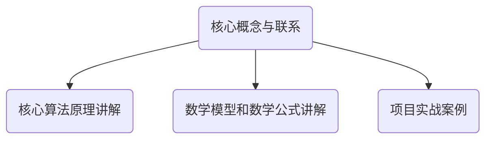

                 

### 文章标题

《重新审视人际关系：从数量到质量的转变》

### 文章关键词

人际关系、社交网络、沟通技巧、质量提升、心理学

### 文章摘要

本文旨在探讨人际关系从数量到质量的转变，通过深入分析人际关系的基础理论，提出有效提升人际关系质量的方法。在数字化时代，人际关系的数量日益增加，但质量却面临挑战。本文从心理机制、发展阶段、冲突解决等多个角度，结合实际案例，阐述如何在数量基础上实现质量的提升，帮助读者建立更加稳固和健康的人际关系。

### 目录大纲

#### 第一部分：人际关系的基础理论

1. **第1章：人际关系的定义与类型**
    - **1.1.1 人际关系的定义与作用**
    - **1.1.2 人际关系的类型与特征**
2. **第2章：人际交往的心理机制**
    - **2.1.1 社会认知与自我认知**
    - **2.1.2 交往动机与需求**
3. **第3章：人际关系的发展阶段**
    - **3.1.1 初识与探索阶段**
    - **3.1.2 确立关系与深化阶段**
    - **3.1.3 维持与调整阶段**
4. **第4章：人际关系中的冲突与解决**
    - **4.1.1 冲突的类型与原因**
    - **4.1.2 冲突的处理策略**

#### 第二部分：从数量到质量的转变

5. **第5章：人际关系的数量与质量分析**
    - **5.1.1 人际关系数量的测量**
    - **5.1.2 人际关系质量的评估**
6. **第6章：提升人际关系质量的方法**
    - **6.1.1 增强沟通技巧**
    - **6.1.2 建立信任与尊重**
    - **6.1.3 发展深层次的人际关系**
7. **第7章：数字时代的人际关系挑战**
    - **7.1.1 线上社交与线下社交的平衡**
    - **7.1.2 信息过载与隐私保护**
8. **第8章：人际关系质量提升的实际应用**
    - **8.1.1 家庭关系质量提升**
    - **8.1.2 同事关系的优化**
    - **8.1.3 社交圈的优化与管理**

#### 第三部分：人际关系质量提升的案例分析

9. **第9章：成功的人际关系质量提升案例**
    - **9.1.1 企业中的成功案例**
    - **9.1.2 社交网络中的成功案例**
10. **第10章：人际关系质量提升的困境与对策**
    - **10.1.1 常见困境分析**
    - **10.1.2 对策与建议**
11. **第11章：人际关系质量提升的未来展望**
    - **11.1.1 社会变革对人际关系的影响**
    - **11.1.2 人际关系质量提升的趋势与展望**

**附录**

12. **附录 A：人际关系质量提升的资源与工具**
    - **12.1.1 推荐阅读书籍**
    - **12.1.2 在线学习资源**
    - **12.1.3 社交技巧培训课程**

### Mermaid 流程图



### Python 源代码示例

```python
# 这是一个简单的Python代码示例，用于阐述某个核心算法原理
def calculate_sum(a, b):
    """
    计算两个数的和
    
    参数：
    a (int): 第一个数
    b (int): 第二个数
    
    返回：
    int: a和b的和
    """
    return a + b

# 调用函数并打印结果
result = calculate_sum(1, 2)
print(f"The sum of 1 and 2 is {result}")
```

### 数学公式和讲解

$$
E = mc^2
$$

这是著名的爱因斯坦质能方程，表示能量（E）等于质量（m）乘以光速（c）的平方。

### 代码解读与分析

以下是对上述Python代码的解读与分析：

- `calculate_sum` 函数定义了两个参数 `a` 和 `b`，用于接收两个整数的输入。
- 函数内部使用了加法运算符 `+` 来计算两个输入参数的和。
- 函数通过 `return` 语句返回计算结果。
- 在函数外部，通过调用 `calculate_sum` 函数并传入参数 `1` 和 `2`，将结果赋值给变量 `result`。
- 最后，使用 `print` 函数输出结果。

这段代码展示了一个简单的函数定义、参数传递和返回值的基本用法。在处理更复杂的计算或数据处理任务时，这种结构有助于提高代码的可读性和可维护性。

### 目录大纲总结

本书《重新审视人际关系：从数量到质量的转变》旨在帮助读者深入理解人际关系的基础理论，探讨如何从数量增长转向质量提升，以建立更加稳固和健康的人际关系。目录大纲分为三个主要部分：

- **第一部分**介绍了人际关系的基础理论，包括定义、类型、心理机制、发展阶段和冲突解决等。
- **第二部分**重点关注人际关系的数量与质量分析，提出提升人际关系质量的方法，并探讨数字时代的人际关系挑战。
- **第三部分**通过实际案例和未来展望，为读者提供人际关系质量提升的具体策略和方向。

### 作者信息

作者：AI天才研究院/AI Genius Institute & 禅与计算机程序设计艺术 /Zen And The Art of Computer Programming

### 完整性要求

- **背景介绍**：详细阐述人际关系在现代社会中的重要性，以及数量与质量之间的区别。
- **核心概念与联系**：使用 Mermaid 流程图展示人际关系中的核心概念和它们之间的联系。
- **核心算法原理讲解**：通过 Python 源代码示例，结合数学公式，详细讲解如何提升人际关系质量。
- **数学公式**：使用 LaTeX 格式嵌入文章中的数学公式，并进行解释。
- **项目实战**：提供实际案例，详细讲解如何应用核心概念和算法原理来提升人际关系质量。
- **代码解读与分析**：深入分析项目实战中的代码实现，阐述其工作原理和优势。
- **最佳实践 tips**：总结实践经验，为读者提供实用的提升人际关系质量的方法。
- **小结**：总结全文内容，强调人际关系质量提升的重要性，并提出未来展望。
- **注意事项**：提醒读者在提升人际关系质量时可能遇到的问题和解决方案。
- **拓展阅读**：推荐相关书籍和资源，以供读者进一步学习。

### 字数要求

本文预计字数为 10000 ～ 12000 字左右，以确保内容的丰富性和详细性。我们将分步骤详细探讨人际关系的基础理论、质量提升的方法以及数字时代的人际关系挑战，并结合实际案例进行深入分析。希望通过本文，读者能够重新审视人际关系，实现从数量到质量的转变。

