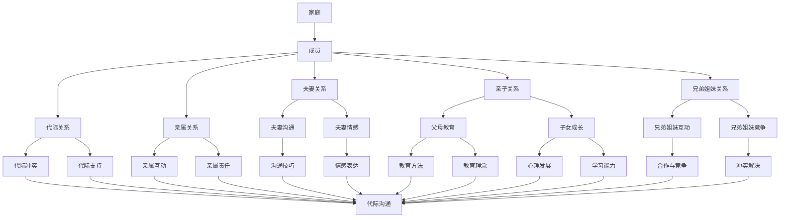

                 

### 重新审视家庭的意义：在现代社会中重建亲密关系

**关键词**：家庭、亲密关系、现代社会、沟通、问题分析、重建策略

**摘要**：在快速发展的现代社会，家庭的意义与亲密关系的质量面临前所未有的挑战。本文首先回顾了家庭的历史变迁，探讨了家庭的核心概念与关系架构，然后分析了现代家庭面临的诸多问题，如婚姻问题、子女教育问题、代际沟通问题等。最后，本文提出了重建亲密关系的策略，包括提升家庭沟通技巧、策划家庭活动以及婚姻咨询等。通过这些策略的实施，我们有望在现代社会中重建健康、和谐的亲密关系。

## 目录

1. **重新审视家庭的意义：在现代社会中重建亲密关系**
    1.1. **关键词**
    1.2. **摘要**
2. **引言**
    2.1. **家庭在现代社会中的地位**
    2.2. **家庭意义的变迁**
3. **家庭的意义探讨**
    3.1. **家庭的定义与变迁**
    3.2. **家庭的核心概念与联系**
    3.3. **家庭价值观的多样性**
4. **现代家庭问题分析**
    4.1. **婚姻问题**
    4.2. **子女教育问题**
    4.3. **代际沟通问题**
    4.4. **家庭情感问题**
5. **亲密关系重建策略**
    5.1. **家庭沟通技巧提升**
    5.2. **家庭活动的策划与执行**
    5.3. **婚姻咨询与情感辅导**
    5.4. **重建亲密关系的综合策略**
6. **结论**
7. **作者信息**

### 引言

在现代社会的快节奏中，家庭逐渐成为了人们最为重要的情感栖息地。然而，随着社会结构的变迁和生活方式的多元化，家庭的意义和亲密关系的质量面临着前所未有的挑战。传统的家庭模式正逐渐被打破，取而代之的是更加复杂多样的家庭结构，如单亲家庭、再婚家庭、多代同堂家庭等。这些变化不仅带来了新的家庭问题，也提出了重新审视家庭意义和重建亲密关系的紧迫需求。

**家庭在现代社会中的地位**：
家庭是社会的细胞，承担着培养下一代、维持社会秩序、传承文化等基本功能。然而，在现代社会，家庭的功能和地位受到了前所未有的挑战。城市化进程的加快、工作压力的增大、社交方式的多元化等因素，使得家庭成员之间的互动减少，家庭关系变得疏离。与此同时，家庭结构和功能的多样性也使得家庭在社会中的角色和地位更加复杂和多变。

**家庭意义的变迁**：
家庭的意义不仅仅是提供生活空间和繁衍后代，更是情感的寄托、精神的支持和共同成长的舞台。在传统的农业社会，家庭的主要功能是生产和生活，而在现代工业社会，家庭的功能逐渐转向情感和心理的支持。家庭关系也从以权威和服从为主，转变为更加平等和民主的关系。这种变迁反映了社会的进步，但也带来了新的挑战。如何在现代社会中重建健康、和谐的亲密关系，成为了我们必须面对的重要课题。

### 家庭的意义探讨

家庭，作为社会的基本单位，承载了丰富的社会文化意义和个人情感价值。在历史的长河中，家庭的意义经历了从生存到情感、从封闭到开放的变迁。

#### 家庭的定义与变迁

家庭，最初被视为一个经济单位，承担着生产、消费和繁衍后代的基本职能。在农业社会，家庭是生活和经济活动的基本单位，家庭成员之间依靠合作和互助来维持生计。然而，随着社会的发展，家庭的定义逐渐超越了经济层面的功能，开始承载更多的情感和心理需求。

在现代社会，家庭的结构和功能发生了显著变化。传统的核心家庭模式（由父母和子女组成）逐渐被多样化家庭模式所替代，如单亲家庭、再婚家庭、多代同堂家庭等。这些家庭模式反映了社会价值观的多元化，也带来了新的家庭问题。

**家庭定义的演变**：

1. **经济单位**：传统家庭以农业生产为主，家庭成员之间通过合作来满足基本生活需求。
2. **情感支持系统**：现代家庭不仅是生活的共同体，更是情感和心理的支持系统，成员之间需要更多的理解和沟通。
3. **社会化单位**：家庭在现代社会中扮演着重要的社会化角色，儿童在家庭中学习社会规范和文化价值观。

#### 家庭在现代社会中的重要性

在现代社会，家庭的重要性体现在以下几个方面：

1. **情感支持**：家庭是人们情感栖息地，提供安全感和归属感。
2. **社会化**：家庭是儿童学习社会规范和文化价值观的重要场所。
3. **经济保障**：家庭在提供经济支持方面仍然发挥着重要作用，尤其是在教育、医疗和养老等领域。
4. **文化传承**：家庭是文化传承的重要载体，通过传统习俗和价值观的传递，维持社会文化的连续性。

#### 家庭结构的变迁

家庭结构的变迁是现代社会发展的一个重要特征。传统的核心家庭模式正在被多样化的家庭结构所取代，这反映了社会价值观的多元化和个体选择的自由度。

1. **家庭规模缩小**：随着城市化进程的加快，家庭规模逐渐缩小，核心家庭成为主流。
2. **家庭形式的多样化**：单亲家庭、再婚家庭、多代同堂家庭等多样化家庭形式逐渐增多，反映了社会对个体选择的包容。
3. **家庭功能转变**：家庭从传统的生产单位转变为以情感支持为主的社会化单位，家庭功能逐渐从单一向多元化转变。

#### 家庭意义的演变

家庭意义的演变反映了社会价值观的变迁。从生存到情感、从封闭到开放，家庭的意义在不断拓展和深化。

1. **从生存到情感**：传统家庭以生存为主要目的，而现代家庭则更加注重情感和心理需求的满足。
2. **从封闭到开放**：传统家庭相对封闭，成员之间的互动有限，现代家庭则更加开放，鼓励家庭成员之间的沟通和互动。
3. **从权威到民主**：传统家庭中的权威关系逐渐被平等和民主的关系所取代，家庭成员之间的权力和责任更加平等。

### 家庭的核心概念与联系

家庭作为一个复杂的社会单位，包含了多种核心概念，这些概念相互联系，共同构成了家庭的基本结构。为了更好地理解家庭的核心概念，我们可以借助 Mermaid 流程图来展示这些概念之间的关系。

#### 家庭关系图谱

#### 家庭结构与家庭功能

家庭结构决定了家庭的功能，而家庭功能又反过来影响家庭结构。家庭结构主要包括家庭关系、家庭组织和家庭角色三个方面。

1. **家庭关系**：家庭关系是指家庭成员之间的相互作用和交往方式，包括夫妻关系、亲子关系、兄弟姐妹关系等。这些关系构成了家庭的基本框架，决定了家庭成员之间的互动模式。

2. **家庭组织**：家庭组织是指家庭成员如何分配时间和资源，以实现家庭的目标。家庭组织包括家庭管理、家务分工、财务规划等，这些组织形式直接影响到家庭的运行效率和家庭成员的满意度。

3. **家庭角色**：家庭角色是指家庭成员在家庭中的特定职责和功能。例如，父亲通常扮演供养者和保护者的角色，母亲则扮演照顾者和教育者的角色。家庭角色的分配和履行影响着家庭的功能和家庭关系的质量。

#### 家庭与个体发展的关系

家庭对个体发展具有重要影响，个体发展也反过来影响家庭。家庭与个体发展的关系可以从以下几个方面进行阐述：

1. **情感发展**：家庭是情感发展的基础，家庭成员之间的情感互动对个体的情感健康具有重要影响。积极的情感互动能够促进个体的情感发展，而消极的情感互动则可能导致情感问题。

2. **社会性发展**：家庭是社会化过程的重要场所，个体在家庭中学习社会规范、价值观和行为准则。家庭的社会性发展对个体的社会适应能力和人际关系具有重要影响。

3. **认知发展**：家庭环境对个体的认知发展具有重要作用。家庭的教育资源、学习氛围和家庭支持水平直接影响个体的认知能力和学习能力。

4. **心理发展**：家庭是心理发展的基础，个体的心理问题很大程度上与家庭环境有关。家庭的支持和关爱能够促进个体的心理健康，而家庭冲突和压力则可能导致心理问题。

#### 家庭与社会的关系

家庭不仅是个体的情感栖息地，也是社会的基本单位。家庭与社会的关系可以从以下几个方面进行阐述：

1. **家庭与社会秩序**：家庭是社会秩序的重要维护者，通过传递社会规范和文化价值观，培养下一代的公民意识和责任感。

2. **家庭与社会稳定**：家庭是社会稳定的基石，家庭的和谐与稳定对社会的和谐与稳定具有重要影响。

3. **家庭与社会变迁**：家庭是社会变迁的反映和推动者，家庭结构和功能的变迁反映了社会价值观的变迁，同时也推动了社会的进步和发展。

### 家庭价值观的多样性

家庭价值观是家庭成员共同认可和遵循的行为准则和价值观体系，它对家庭关系和家庭功能具有重要影响。家庭价值观的多样性反映了社会文化的多元化和个体选择的自由度。

#### 传统的家庭价值观

传统的家庭价值观强调权威和服从，家庭中的权力和责任通常由男性承担，女性则扮演照顾者和教育者的角色。传统的家庭价值观注重家庭的完整性和稳定性，强调家庭责任和孝道。

1. **权威和服从**：在传统的家庭中，父亲通常担任家庭的权威角色，家庭成员需要服从父亲的决策和安排。
2. **家庭完整**：传统的家庭价值观强调家庭的完整性和稳定性，认为离婚和分居是不道德的。
3. **孝道**：传统家庭价值观强调孝顺长辈，认为孝顺是家庭成员应尽的责任。

#### 现代的家庭价值观

随着社会的发展和观念的变革，现代家庭价值观逐渐从权威和服从转向平等和民主。现代家庭价值观强调个体权利和选择，尊重家庭成员的个性差异，鼓励家庭成员之间的沟通和互动。

1. **平等和民主**：现代家庭价值观强调家庭成员之间的平等地位和民主决策，家庭成员有权表达自己的意见和需求。
2. **个性尊重**：现代家庭价值观尊重家庭成员的个性和选择，鼓励个体追求自我实现和自我发展。
3. **沟通和互动**：现代家庭价值观强调家庭成员之间的沟通和互动，认为良好的沟通是维持家庭和谐的关键。

#### 家庭价值观的冲突与融合

在现代社会，传统家庭价值观和现代家庭价值观之间的冲突日益明显。这种冲突不仅存在于不同家庭之间，也存在于家庭内部的代际关系和家庭成员之间。

1. **权威与平等**：在家庭内部，长辈可能希望维持传统的权威地位，而年轻一代则希望实现平等和民主的家庭关系。
2. **传统与现代**：家庭中的传统观念和现代观念之间的冲突，可能导致家庭成员之间的矛盾和不满。
3. **冲突与融合**：面对这些冲突，家庭成员需要通过沟通和理解，寻求传统与现代家庭价值观的融合。例如，可以通过家庭成员之间的对话，共同探讨如何在传统家庭价值观的基础上，实现现代家庭价值观的体现。

通过这种冲突与融合的过程，家庭能够更好地适应社会的变迁，维护家庭的和谐与稳定。

### 现代家庭问题分析

在现代社会，家庭面临着诸多挑战，这些挑战不仅影响家庭的稳定性，也影响家庭成员的心理健康和幸福感。以下将深入探讨现代家庭中常见的几种问题，包括婚姻问题、子女教育问题、代际沟通问题以及家庭情感问题。

#### 婚姻问题

婚姻问题在现代家庭中日益突出，成为影响家庭稳定的重要因素。婚姻问题主要包括婚姻沟通问题、婚姻不忠问题以及婚姻危机等。

1. **婚姻沟通问题**：
    - **原因**：现代社会中，工作压力、生活节奏快、社交方式多样化等因素，导致夫妻之间的沟通减少。此外，文化背景、价值观念的差异也会影响夫妻之间的沟通。
    - **影响**：沟通不畅可能导致夫妻之间的误解和矛盾，影响婚姻的稳定性和幸福感。
    - **对策**：为了改善婚姻沟通，夫妻双方可以通过定期约会、共同活动、表达情感和需求等方式，增强沟通和理解。

2. **婚姻不忠问题**：
    - **原因**：婚姻不忠可能是由于一方在情感或心理上对婚姻感到不满，也可能是由于外部诱惑的影响。
    - **影响**：婚姻不忠破坏了夫妻之间的信任，可能导致婚姻破裂，影响家庭成员的心理健康。
    - **对策**：预防和处理婚姻不忠问题，需要夫妻双方建立良好的沟通和信任，同时加强婚姻教育和心理辅导。

3. **婚姻危机**：
    - **原因**：婚姻危机可能是由于夫妻之间的矛盾、误解、不忠等问题引发的。
    - **影响**：婚姻危机可能导致夫妻关系破裂，影响家庭成员的心理健康和生活质量。
    - **对策**：面对婚姻危机，夫妻双方可以通过婚姻咨询、心理辅导等方式，寻求专业帮助，共同解决问题。

#### 子女教育问题

子女教育问题也是现代家庭面临的重要问题，主要包括教育理念的差异、教育方式的冲突、子女行为问题的处理等。

1. **教育理念的差异**：
    - **原因**：父母与子女在成长环境、教育背景、价值观念等方面可能存在差异，导致教育理念的不同。
    - **影响**：教育理念的差异可能导致子女教育中的矛盾和冲突，影响子女的成长和发展。
    - **对策**：为了解决教育理念的差异，父母可以通过家庭沟通、教育辅导等方式，共同探讨和确定适合子女的教育方法。

2. **教育方式的冲突**：
    - **原因**：父母在教育子女时，可能由于个人教育观念的不同，采取不同的教育方式，导致冲突。
    - **影响**：教育方式的冲突可能导致子女产生逆反心理，影响子女的学习兴趣和成长。
    - **对策**：为了解决教育方式的冲突，父母可以通过相互尊重、沟通协商等方式，寻求共同的教育方法。

3. **子女行为问题的处理**：
    - **原因**：子女行为问题的产生可能是由于家庭教育环境、家庭教育方式等因素的影响。
    - **影响**：子女行为问题可能影响子女的心理健康和成长，也可能影响家庭关系的稳定性。
    - **对策**：面对子女行为问题，父母可以通过教育辅导、心理辅导等方式，帮助子女解决问题，促进其健康成长。

#### 代际沟通问题

代际沟通问题是现代家庭中常见的矛盾之一，主要包括代沟的本质、代际沟通的障碍、代际沟通的策略等。

1. **代沟的本质**：
    - **原因**：代沟主要是由于不同代际在价值观念、行为习惯、生活方式等方面的差异导致的。
    - **影响**：代沟可能导致家庭成员之间的误解和矛盾，影响家庭关系的和谐。
    - **对策**：为了解决代沟问题，家庭成员可以通过相互理解、尊重、沟通等方式，减少代沟的影响。

2. **代际沟通的障碍**：
    - **原因**：代际沟通的障碍可能来自于代际之间的文化差异、沟通技巧不足、情感障碍等。
    - **影响**：沟通障碍可能导致家庭成员之间的矛盾和冲突，影响家庭关系的稳定。
    - **对策**：为了克服沟通障碍，家庭成员可以通过提高沟通技巧、增进相互理解等方式，改善代际沟通。

3. **代际沟通的策略**：
    - **原因**：代际沟通的策略是为了解决代际沟通中的问题，提高沟通效果。
    - **影响**：有效的代际沟通策略可以增进家庭成员之间的理解和信任，促进家庭关系的和谐。
    - **对策**：家庭成员可以通过制定沟通计划、开展家庭活动、共同解决问题等方式，改善代际沟通。

#### 家庭情感问题

家庭情感问题是指家庭成员在情感互动中遇到的问题，主要包括家庭情感支持的重要性、情感表达的障碍、情感冲突的处理等。

1. **家庭情感支持的重要性**：
    - **原因**：家庭情感支持是家庭成员心理健康的保障，对于应对生活中的压力和挑战具有重要影响。
    - **影响**：缺乏家庭情感支持可能导致家庭成员产生孤独感、焦虑感等心理问题。
    - **对策**：家庭成员可以通过增进情感交流、提供情感支持等方式，提高家庭情感支持的水平。

2. **情感表达的障碍**：
    - **原因**：情感表达的障碍可能来自于家庭成员的沟通技巧不足、情感压抑等。
    - **影响**：情感表达的障碍可能导致家庭成员之间的误解和矛盾，影响家庭关系的和谐。
    - **对策**：为了克服情感表达的障碍，家庭成员可以通过学习沟通技巧、增进情感交流等方式，提高情感表达的效率。

3. **情感冲突的处理**：
    - **原因**：情感冲突是由于家庭成员在情感表达和互动中产生的矛盾和分歧。
    - **影响**：情感冲突可能导致家庭关系紧张，影响家庭成员的心理健康。
    - **对策**：面对情感冲突，家庭成员可以通过沟通协商、寻求专业帮助等方式，共同解决冲突，维护家庭关系的和谐。

通过以上对现代家庭中常见问题的深入分析，我们可以更好地理解这些问题的本质和影响，从而采取有效的策略来应对这些问题，促进家庭关系的和谐与稳定。

### 亲密关系重建策略

在现代社会，重建亲密关系已经成为家庭和谐的关键。以下将详细探讨几种有效的亲密关系重建策略，包括提升家庭沟通技巧、策划家庭活动、婚姻咨询与情感辅导等。

#### 家庭沟通技巧提升

沟通是家庭关系中最重要的桥梁，良好的沟通技巧能够有效减少误解和矛盾，增强家庭成员之间的情感联系。以下是一些提升家庭沟通技巧的方法：

1. **有效沟通的要素**：
   - **倾听**：倾听是有效沟通的第一步，要求我们全身心地关注对方，理解对方的观点和情感。
   - **表达**：表达是沟通的第二个步骤，要求我们清晰、明确地表达自己的观点和情感，避免使用指责和批评的语言。
   - **共情**：共情是指站在对方的角度理解对方的感受，通过表达理解来增强沟通的深度和效果。

2. **沟通障碍的克服**：
   - **时间管理**：合理安排时间，确保家庭成员有足够的沟通时间。
   - **减少干扰**：在沟通时尽量减少外界干扰，如关闭电子设备，专注于对方的谈话。
   - **建立信任**：建立信任是有效沟通的基础，通过诚实和开放的交流，增强家庭成员之间的信任感。

3. **沟通技巧的实际应用**：
   - **日常对话**：在日常生活中，通过简短的对话和互动，增强家庭成员之间的沟通。
   - **家庭会议**：定期举行家庭会议，让每个家庭成员都有机会表达自己的意见和需求。
   - **情感交流**：通过分享个人的感受和经历，增进家庭成员之间的情感交流。

4. **案例分享与反思**：
   - **案例一**：一对夫妻通过定期约会和共同活动，有效改善了他们的婚姻关系，增进了彼此的了解和信任。
   - **案例反思**：这个案例表明，良好的沟通技巧对于家庭关系的维护和改善具有重要价值。

#### 家庭活动的策划与执行

家庭活动是增强家庭成员之间情感联系和亲密关系的重要方式。以下是一些策划家庭活动的建议：

1. **家庭活动的意义**：
   - **增强情感联系**：通过共同参与活动，家庭成员能够更好地理解彼此，增强情感联系。
   - **促进身心健康**：家庭活动可以减轻压力，增强身心健康，提高生活质量。
   - **培养家庭文化**：家庭活动是传承家庭文化和价值观的重要方式。

2. **家庭活动的设计与组织**：
   - **多样化活动**：设计多种类型的活动，如户外运动、游戏、烹饪、艺术创作等，满足不同家庭成员的兴趣和需求。
   - **共同参与**：确保每个家庭成员都能参与到活动中，增强集体感和归属感。
   - **活动计划**：提前制定活动计划，包括活动内容、时间和地点，确保活动的顺利进行。

3. **家庭活动的实施与评估**：
   - **活动实施**：按照计划进行活动，确保活动按照预定目标和流程进行。
   - **活动评估**：活动结束后，对活动效果进行评估，收集家庭成员的反馈，为下一次活动提供参考。

4. **家庭活动的创新与变化**：
   - **创新活动**：定期引入新的活动形式和内容，保持家庭活动的多样性和新鲜感。
   - **适应变化**：根据家庭成员的兴趣和需求，灵活调整活动内容和形式，确保活动的适应性和持续性。

#### 婚姻咨询与情感辅导

婚姻咨询和情感辅导是解决家庭情感问题的重要途径。以下是一些婚姻咨询和情感辅导的建议：

1. **婚姻咨询的服务内容**：
   - **婚姻沟通辅导**：帮助夫妻改善沟通技巧，增强沟通效果。
   - **情感问题咨询**：解决夫妻之间的情感矛盾和冲突，增强夫妻之间的情感联系。
   - **婚姻危机干预**：在婚姻出现危机时，提供专业帮助，帮助夫妻共同度过难关。

2. **婚姻咨询的流程**：
   - **预约咨询**：夫妻双方预约咨询时间，与咨询师建立联系。
   - **初诊评估**：咨询师通过面谈或问卷调查，了解夫妻的问题和需求。
   - **制定方案**：根据初诊评估结果，制定个性化的咨询方案。
   - **咨询实施**：按照咨询方案，逐步解决夫妻问题，增强夫妻关系。

3. **情感辅导的技术与方法**：
   - **情感表达训练**：通过角色扮演、情感分享等方式，帮助家庭成员学会表达情感。
   - **情感调节技术**：通过放松训练、认知重构等方法，帮助家庭成员调节情绪，增强情感稳定性。
   - **情感冲突解决**：通过有效沟通和协商，帮助家庭成员解决情感冲突，增进情感和谐。

4. **情感辅导的案例分析**：
   - **案例一**：一对夫妻因长期沟通不畅而出现婚姻危机，通过婚姻咨询，他们学会了有效的沟通技巧，改善了婚姻关系。
   - **案例反思**：这个案例表明，婚姻咨询和情感辅导对于维护婚姻关系具有重要价值，能够帮助夫妻共同度过困难时期。

#### 重建亲密关系的综合策略

重建亲密关系需要综合运用多种策略，包括家庭沟通技巧提升、家庭活动策划与执行、婚姻咨询与情感辅导等。以下是一些综合策略：

1. **亲密关系的重要性**：
   - **情感支持**：亲密关系为家庭成员提供情感支持，增强心理安全感。
   - **生活动力**：亲密关系为家庭成员提供生活动力，增强家庭凝聚力。
   - **共同成长**：亲密关系促进家庭成员的共同成长，实现个人和家庭的共同发展。

2. **亲密关系的评估**：
   - **自我评估**：家庭成员可以定期进行自我评估，了解自己在亲密关系中的表现和需求。
   - **夫妻评估**：夫妻双方可以共同进行亲密关系评估，了解彼此的需求和期望。
   - **专业评估**：寻求专业咨询师的帮助，进行全面的亲密关系评估。

3. **亲密关系的重建步骤**：
   - **沟通协商**：通过有效沟通，解决亲密关系中的矛盾和问题。
   - **情感支持**：提供情感支持，增强家庭成员之间的情感联系。
   - **共同活动**：通过共同参与活动，增强家庭成员之间的亲密关系。

4. **亲密关系的长期维护**：
   - **持续沟通**：保持持续有效的沟通，增进彼此了解。
   - **定期评估**：定期评估亲密关系，及时调整维护策略。
   - **共同成长**：通过共同学习和成长，维持亲密关系的活力。

通过以上策略的实施，我们有望在现代社会中重建健康、和谐的亲密关系，为家庭成员提供安全、温暖、支持的栖息地。

### 结论

在现代社会，家庭的意义与亲密关系的质量面临着前所未有的挑战。通过本文的探讨，我们重新审视了家庭的意义，分析了现代家庭面临的诸多问题，并提出了重建亲密关系的策略。家庭不仅是情感的支持系统，也是社会的基本单位，其稳定与和谐对个体和社会的发展至关重要。

家庭的意义经历了从生存到情感、从封闭到开放的变迁。现代家庭面临着婚姻问题、子女教育问题、代际沟通问题以及家庭情感问题等多种挑战。为了应对这些挑战，我们提出了一系列亲密关系重建策略，包括提升家庭沟通技巧、策划家庭活动、婚姻咨询与情感辅导等。

重建亲密关系需要家庭成员共同努力，通过有效的沟通、共同活动和情感支持，增强家庭成员之间的情感联系。同时，婚姻咨询和情感辅导等专业服务也为家庭提供了有力的支持。

我们呼吁社会各界关注家庭建设，支持家庭教育和家庭服务，共同营造和谐、健康的家庭环境。通过不断努力，我们有望在现代社会中重建健康、和谐的亲密关系，为家庭成员提供安全、温暖、支持的栖息地。

### 作者信息

**作者：AI天才研究院/AI Genius Institute & 禅与计算机程序设计艺术 /Zen And The Art of Computer Programming**

AI天才研究院致力于推动人工智能技术的发展和应用，为现代社会提供创新解决方案。同时，作者也深入探讨了家庭、亲密关系等社会问题，希望通过技术手段和人文思考，为家庭建设提供有益的指导。

