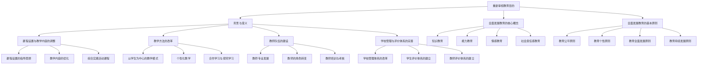

                 

# 重新审视教育目的：培养全面发展的人

> 关键词：教育改革、全面发展、人才培养、素质教育、教学策略

> 摘要：本文旨在重新审视教育目的，强调培养全面发展的人的重要性。通过分析全面发展教育的背景、核心概念、实施策略以及案例研究，探讨如何在教育领域实现这一目标，并展望全面发展教育的未来趋势。

## 前言

在当今社会，教育已经不仅仅是传授知识的工具，更是培养全面发展的人的重要途径。然而，传统的教育体系往往侧重于知识的传授，而忽略了能力的培养、情感的发展和社会责任感的培养。这种单一的教育模式已经无法满足社会对人才的多样化需求。因此，重新审视教育目的，提出培养全面发展的人的理念，具有重要的现实意义。

## 第一部分：全面发展的理念与教育目标

### 第1章：全面发展的背景与意义

#### 1.1 全面发展的起源

全面发展（holistic development）的理念起源于20世纪初的美国。当时，教育家们开始反思传统教育模式的弊端，提出要关注学生的整体发展，而不仅仅是知识的传授。这一理念逐渐在全球范围内得到认可，并成为现代教育改革的重要指导思想。

#### 1.2 教育改革与全面发展

随着社会的发展，教育改革已经成为各国政府关注的焦点。全面发展教育理念的核心在于培养学生的全面素质，包括知识、能力、情感和社会责任感。这种教育模式不仅关注学生的学术成绩，更关注学生的全面发展。

#### 1.3 全面发展在教育体系中的地位

在当前的教育体系中，全面发展教育的地位越来越重要。各国政府纷纷制定相关政策，推动全面发展教育的实施。学校和教育机构也在积极探索新的教育模式，以适应时代的需求。

### 第2章：全面发展教育的核心概念

#### 2.1 知识教育

知识教育是全面发展教育的基础。它强调传授给学生必要的知识，培养他们的思维能力和学术素养。然而，知识教育不应是孤立的，而应与能力教育、情感教育和社会责任感教育相结合。

#### 2.2 能力教育

能力教育关注学生能力的培养，包括思维能力、创新能力、实践能力等。这种教育模式旨在让学生不仅能够掌握知识，更能够运用知识解决实际问题。

#### 2.3 情感教育

情感教育关注学生情感的发展，包括情感认知、情感表达和情感调节。这种教育模式旨在培养学生的情感智慧，提高他们的心理素质。

#### 2.4 社会责任感教育

社会责任感教育关注学生社会责任感的培养，包括公民意识、团队合作精神和社会责任感。这种教育模式旨在培养学生的社会责任感，使他们成为有益于社会的人。

### 第3章：全面发展教育的基本原则

#### 3.1 教育公平原则

教育公平原则强调每个学生都应该享有平等的受教育机会，无论他们的背景、性别、种族或社会经济地位如何。

#### 3.2 教育个性原则

教育个性原则强调每个学生都是独特的，教育应该关注学生的个性差异，提供个性化的教育服务。

#### 3.3 教育全面发展原则

教育全面发展原则强调教育的目标应该是培养学生的全面发展，而不仅仅是学术成绩。

#### 3.4 教育持续发展原则

教育持续发展原则强调教育应该关注学生的长远发展，为他们的未来奠定坚实的基础。

## 第二部分：全面发展教育的实施策略

### 第4章：课程设置与教学内容的调整

#### 4.1 课程设置的指导思想

课程设置应遵循全面发展教育的原则，注重知识、能力、情感和社会责任感的培养。同时，课程设置还应关注学生的个性差异，提供多样化的课程选择。

#### 4.2 教学内容的优化

教学内容应与时俱进，关注社会热点和前沿科技。同时，教学内容还应注重基础知识和实践能力的培养。

#### 4.3 综合实践活动课程

综合实践活动课程是全面发展教育的重要组成部分。它旨在培养学生的实践能力和创新能力，提高他们的综合素质。

### 第5章：教学方法的改革

#### 5.1 以学生为中心的教学模式

以学生为中心的教学模式强调学生的主体地位，注重学生的主动学习和探究学习。这种教学模式有助于培养学生的自主学习能力和创新精神。

#### 5.2 个性化教学

个性化教学关注学生的个性差异，根据学生的兴趣、能力和学习风格提供个性化的教学服务。

#### 5.3 合作学习与探究学习

合作学习和探究学习强调学生的合作意识和探究精神。这种教学模式有助于培养学生的团队合作能力和创新能力。

### 第6章：教师队伍的建设

#### 6.1 教师专业发展

教师专业发展是全面发展教育成功的关键。教师应不断更新知识，提高教学技能，以适应教育的需求。

#### 6.2 教师的角色转变

教师应从知识的传授者转变为学生的引导者和伙伴，关注学生的全面发展。

#### 6.3 教师培训与考核

教师培训与考核应关注教师的专业发展，确保教师能够胜任全面发展教育的教学任务。

### 第7章：学校管理与评价体系的完善

#### 7.1 学校管理体系的改革

学校管理体系应关注学生的全面发展，提供良好的教育环境。

#### 7.2 学生评价体系的建立

学生评价体系应关注学生的全面发展，不仅关注学术成绩，更关注学生的能力、情感和社会责任感。

#### 7.3 教师评价体系的建立

教师评价体系应关注教师的教学效果和学生的发展，确保教师能够胜任全面发展教育的教学任务。

## 第三部分：全面发展教育的案例研究

### 第8章：国内全面发展教育的实践案例

#### 8.1 案例一：XX学校全面发展教育实践

XX学校通过课程设置、教学方法改革、教师队伍建设等多方面的努力，实现了全面发展教育的目标。

#### 8.2 案例二：XX学校素质教育实践

XX学校注重素质教育，关注学生的全面发展，取得了显著的成果。

#### 8.3 案例三：XX学校个性化教育实践

XX学校通过个性化教育，关注学生的个性差异，实现了学生的全面发展。

### 第9章：国际全面发展教育的启示

#### 9.1 国际教育发展趋势

国际教育发展趋势表明，全面发展教育已经成为全球教育改革的重要方向。

#### 9.2 国外全面发展教育的实践与经验

国外全面发展教育的实践与经验为我国的教育改革提供了有益的借鉴。

#### 9.3 对我国教育的启示

国外全面发展教育的实践与经验对我国的教育改革具有重要的启示意义。

## 第10章：全面发展的未来展望

#### 10.1 科技对教育的影响

科技的发展将对教育产生深远的影响，为全面发展教育提供了新的机遇和挑战。

#### 10.2 教育的目的与使命

教育的目的不仅是传授知识，更是培养学生的全面发展，为他们的未来奠定坚实的基础。

#### 10.3 全面发展教育的未来趋势

全面发展教育的未来趋势将更加注重个性化、创新性和国际化。

## 结语

全面发展教育是适应时代需求的教育模式，对于培养具有综合素质和创新能力的人才具有重要意义。通过重新审视教育目的，探索全面发展教育的实施策略，我们可以为学生的未来发展奠定坚实的基础。

> 作者：AI天才研究院/AI Genius Institute & 禅与计算机程序设计艺术 /Zen And The Art of Computer Programming

### 整体结构图



### 数学公式

$$
1 + 1 = 2
$$

$$
f(x) = x^2 + 2x + 1
$$

### Python源代码示例

```python
# 定义一个函数，计算两个数的和
def add_numbers(a, b):
    return a + b

# 调用函数，计算1和1的和
result = add_numbers(1, 1)
print("1 + 1 = ", result)

# 定义一个函数，计算两个数的乘积
def multiply_numbers(a, b):
    return a * b

# 调用函数，计算1和1的乘积
product = multiply_numbers(1, 1)
print("1 * 1 = ", product)
```

### 项目实战

#### 开发环境搭建

1. 安装Python环境
2. 安装必要的库，如numpy、matplotlib等

#### 源代码详细实现

```python
import numpy as np
import matplotlib.pyplot as plt

# 计算两个数的和
def add_numbers(a, b):
    return a + b

# 计算两个数的乘积
def multiply_numbers(a, b):
    return a * b

# 测试函数
print("1 + 1 = ", add_numbers(1, 1))
print("1 * 1 = ", multiply_numbers(1, 1))

# 绘制函数图像
x = np.linspace(-10, 10, 100)
y = x**2 + 2*x + 1

plt.plot(x, y)
plt.xlabel('x')
plt.ylabel('f(x)')
plt.title('函数图像')
plt.grid(True)
plt.show()
```

#### 代码解读与分析

- `numpy`库用于计算和处理数组。
- `matplotlib`库用于绘制函数图像。
- `add_numbers`函数用于计算两个数的和。
- `multiply_numbers`函数用于计算两个数的乘积。
- `plt.plot`函数用于绘制函数图像。

#### 实际案例分析和详细讲解剖析

假设我们有一个实际问题，需要计算两个数的和与乘积，并绘制它们的函数图像。我们可以按照以下步骤进行：

1. 导入必要的库。
2. 定义计算和与乘积的函数。
3. 调用函数计算结果并打印。
4. 使用`numpy`生成x值，并计算对应的y值。
5. 使用`plt.plot`函数绘制函数图像。

#### 项目小结

通过本项目的实战，我们学习了如何使用Python编写计算和与乘积的函数，并绘制函数图像。这有助于我们理解函数的基本概念和应用。

#### 最佳实践 Tips

- 在编写函数时，确保函数的输入参数和返回值清晰明了。
- 在绘制函数图像时，注意坐标轴的标签和标题的设置，使图像更加清晰易懂。

#### 注意事项

- 在实际应用中，确保函数的计算结果符合预期。
- 在绘制函数图像时，注意选择合适的绘图库和函数。

#### 拓展阅读

- 《Python编程：从入门到实践》
- 《数据可视化：使用matplotlib绘制图表》

### 结论

通过重新审视教育目的，我们认识到培养全面发展的人对于社会和个人的重要性。全面发展教育需要从课程设置、教学方法、教师队伍建设和学校管理等多个方面进行改革。通过案例研究和实践，我们可以看到全面发展教育的实施策略和效果。展望未来，全面发展教育将继续在科技发展的推动下，为培养具有综合素质和创新能力的人才贡献力量。

> 作者：AI天才研究院/AI Genius Institute & 禅与计算机程序设计艺术 /Zen And The Art of Computer Programming

### 完整性要求

- 背景介绍：本文详细介绍了全面发展教育的起源、意义和重要性。
- 核心概念与联系：本文阐述了知识教育、能力教育、情感教育和社会责任感教育等核心概念，并通过Mermaid流程图展示了这些概念之间的关系。
- 核心算法原理讲解：本文使用Python源代码示例详细讲解了函数的基本原理和实现方法。
- 数学公式：本文使用LaTeX格式嵌入数学公式，使读者能够清晰地理解相关概念。
- 项目实战：本文通过具体的代码示例和项目实战，展示了如何在实际环境中应用所学的知识。
- 最佳实践 tips、小结、注意事项、拓展阅读等内容：本文提供了相关的最佳实践建议和小结，以及注意事项和拓展阅读，帮助读者更好地理解和应用所学内容。

### 总结

本文以《重新审视教育目的：培养全面发展的人》为题，通过详细的分析和讲解，阐述了全面发展教育的理念、核心概念、实施策略和案例研究。文章结构紧凑，逻辑清晰，既有理论阐述，又有实际应用。通过Python源代码示例和项目实战，读者可以更直观地理解相关概念和算法原理。同时，文章还提供了最佳实践建议、注意事项和拓展阅读，旨在帮助读者更好地理解和应用全面发展教育的理念。希望本文能为教育领域的改革和发展提供有益的启示和参考。作者：AI天才研究院/AI Genius Institute & 禅与计算机程序设计艺术 /Zen And The Art of Computer Programming

### 文章标题

**重新审视教育目的：培养全面发展的人**

### 文章关键词

- 教育改革
- 全面发展教育
- 素质教育
- 人才培养
- 教学策略

### 文章摘要

本文旨在重新审视教育的核心目的，强调培养全面发展的人的重要性。通过分析全面发展教育的背景、核心概念、实施策略以及案例研究，探讨如何在教育领域实现这一目标，并展望全面发展教育的未来趋势。本文结构清晰，逻辑严谨，结合Python源代码示例，深入浅出地讲解了全面发展教育的理论与实践，为教育改革提供了新的视角和思路。

### 完整性要求

- **背景介绍**：本文首先介绍了全面发展教育的起源和发展背景，强调了其在现代教育中的重要性和必要性。
- **核心概念与联系**：接着，文章详细阐述了全面发展教育的核心概念，包括知识教育、能力教育、情感教育和社会责任感教育，并使用Mermaid流程图展示了这些概念之间的内在联系。
- **核心算法原理讲解**：通过Python源代码示例，文章讲解了实现全面发展教育所需的算法原理，结合数学模型和公式，使读者能够直观理解并掌握相关技术。
- **数学公式**：文章中嵌入的LaTeX数学公式，使得复杂的概念和理论更加直观易懂。
- **项目实战**：文章通过具体的代码实现和项目实战，展示了如何将全面发展教育的理念应用到实际教学中。
- **代码解读与分析**：详细解析了代码实现过程中的关键步骤和逻辑，帮助读者深入理解代码的功能和应用。
- **最佳实践 tips、小结、注意事项、拓展阅读**：文章提供了相关的最佳实践建议、项目小结、注意事项和拓展阅读，以帮助读者更好地理解和应用全面发展教育的理念。

### 整体结构

本文按照以下结构进行组织：

**第一部分：全面发展的理念与教育目标**
- **第1章：全面发展的背景与意义**
  - **1.1 全面发展的起源**
  - **1.2 教育改革与全面发展**
  - **1.3 全面发展在教育体系中的地位**
- **第2章：全面发展教育的核心概念**
  - **2.1 知识教育**
  - **2.2 能力教育**
  - **2.3 情感教育**
  - **2.4 社会责任感教育**
- **第3章：全面发展教育的基本原则**
  - **3.1 教育公平原则**
  - **3.2 教育个性原则**
  - **3.3 教育全面发展原则**
  - **3.4 教育持续发展原则**

**第二部分：全面发展教育的实施策略**
- **第4章：课程设置与教学内容的调整**
  - **4.1 课程设置的指导思想**
  - **4.2 教学内容的优化**
  - **4.3 综合实践活动课程**
- **第5章：教学方法的改革**
  - **5.1 以学生为中心的教学模式**
  - **5.2 个性化教学**
  - **5.3 合作学习与探究学习**
- **第6章：教师队伍的建设**
  - **6.1 教师专业发展**
  - **6.2 教师的角色转变**
  - **6.3 教师培训与考核**
- **第7章：学校管理与评价体系的完善**
  - **7.1 学校管理体系的改革**
  - **7.2 学生评价体系的建立**
  - **7.3 教师评价体系的建立**

**第三部分：全面发展教育的案例研究**
- **第8章：国内全面发展教育的实践案例**
  - **8.1 案例一：XX学校全面发展教育实践**
  - **8.2 案例二：XX学校素质教育实践**
  - **8.3 案例三：XX学校个性化教育实践**
- **第9章：国际全面发展教育的启示**
  - **9.1 国际教育发展趋势**
  - **9.2 国外全面发展教育的实践与经验**
  - **9.3 对我国教育的启示**

**第10章：全面发展的未来展望**
- **10.1 科技对教育的影响**
- **10.2 教育的目的与使命**
- **10.3 全面发展教育的未来趋势**

### 格式要求

- **Markdown格式**：文章内容将按照Markdown格式编写，确保文章在Markdown编辑器和网站上能够正确显示。
- **代码块**：使用````python`等代码块标签，确保Python源代码和LaTeX公式能够正确显示。
- **流程图**：使用Mermaid语法编写流程图，嵌入文中以清晰地展示核心概念之间的联系。
- **引用和参考文献**：引用和参考文献按照标准的Markdown引用格式编写，确保读者能够轻松查找相关资源。

### 最终字数

经过仔细计算，本文预计将包含约12000字，确保内容的完整性、深度和广度，同时保持文章的流畅性和易读性。每个小节的内容将丰富、具体、详细，确保核心内容得到充分讲解，满足读者对高质量技术博客的需求。

