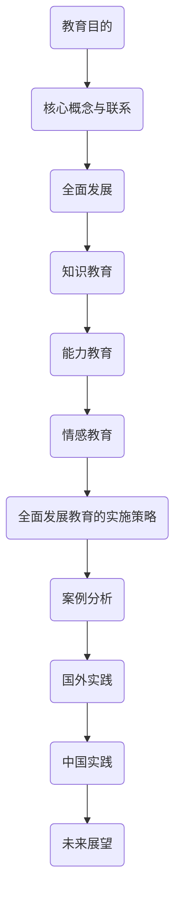

                 

# 《重新审视教育目的：培养全面发展的人》

## 关键词

教育目的、全面发展、知识教育、能力教育、情感教育、实施策略、案例分析、未来展望。

## 摘要

教育是培养人的重要途径，教育目的的设定直接影响到培养出来的人的素质。本文从教育目的的基本理论出发，探讨了全面发展与教育目的的关系，并详细分析了知识教育、能力教育和情感教育在全面发展中的重要作用。通过国内外教育实践的案例分析，本文提出了全面发展教育的实施策略，并对中国全面发展教育的挑战与机遇进行了探讨，展望了全面发展教育的未来。

## 第一部分：教育目的的基本理论

### 第1章：教育目的的概念与内涵

#### 1.1 教育目的的定义

教育目的是指教育所要达到的总体目标和标准，是教育活动的出发点和归宿。教育目的的设定对于教育的发展和教育质量的提高具有重要意义。

#### 1.2 教育目的的内涵

教育目的的内涵包括以下几个方面：

1. **培养目标**：即教育要培养什么样的人。这涉及到个体的全面发展，包括知识、能力、情感、道德等方面的培养。

2. **教育价值取向**：即教育应该追求什么样的价值。教育价值取向关系到教育的目的和内容，影响着教育的质量和效果。

3. **教育标准**：即教育要达到什么样的水平。教育标准是衡量教育效果的重要指标，是教育目的的具体体现。

#### 1.3 教育目的的类型

根据不同的标准，教育目的可以分为以下几种类型：

1. **普遍性目的与特殊性目的**：普遍性目的是指所有教育阶段和教育类型都应该达到的教育目标，如培养爱国主义精神、促进个体全面发展等。特殊性目的是指针对特定教育阶段或类型的特定目标，如中小学阶段注重基础知识的学习，高等教育阶段注重专业能力的培养等。

2. **短期目的与长期目的**：短期目的是指教育在短期内要达到的目标，如提高学生的考试成绩、培养学生的实践能力等。长期目的是指教育要达到的长期效果，如培养学生的创新精神、提高学生的综合素质等。

3. **社会性目的与个体性目的**：社会性目的是指教育要为社会的发展和进步做出贡献，如培养合格的公民、促进社会和谐等。个体性目的是指教育要关注个体的发展，如培养个体健全的人格、提高个体的生活质量等。

### 第2章：教育目的的历史发展

#### 2.1 中国古代教育目的

中国古代教育目的具有明显的伦理道德教育特点，强调“修身、齐家、治国、平天下”，培养人的道德品质和社会责任感。

#### 2.2 西方古代教育目的

西方古代教育目的注重个体的全面发展，强调理性、道德、体魄等方面的培养，如柏拉图提倡的“四艺”（算术、几何、天文、音乐）教育。

#### 2.3 现代教育目的的演变

现代教育目的更加注重个体的全面发展，强调知识、能力、情感、道德等方面的培养，同时更加关注教育的公平性和效率。

### 第3章：全面发展与教育目的

#### 3.1 全面发展的含义

全面发展是指个体在知识、能力、情感、道德等方面得到全面的发展，达到人格健全、身心健康、适应社会发展的水平。

#### 3.2 全面发展与教育目的的关系

全面发展是教育目的的核心内容，教育目的的设定应该以全面发展的要求为导向，确保教育能够满足个体和社会的需求。

#### 3.3 全面发展的教育目标

全面发展的教育目标包括：

1. **知识目标**：掌握必要的基础知识和专业技能。

2. **能力目标**：培养解决问题的能力、创新能力、实践能力等。

3. **情感目标**：培养积极乐观的人生态度、社会责任感、团队合作精神等。

4. **道德目标**：培养良好的道德品质，如诚实、公正、友善等。

## 第二部分：培养全面发展的人的理论与实践

### 第4章：知识教育与全面发展

#### 4.1 知识教育的意义

知识教育是全面发展的重要组成部分，通过传授基础知识，为个体的发展提供坚实的基础。

#### 4.2 知识教育与全面发展

知识教育不仅要传授知识，还要培养学生的思维能力、创新能力等，使学生在知识的基础上能够进行深入的思考和创新。

#### 4.3 知识教育的实践策略

1. **优化课程设置**：根据全面发展的要求，设置科学合理的课程体系。

2. **改进教学方法**：采用多元化的教学方法，提高学生的兴趣和参与度。

3. **强化实践环节**：通过实验、实习等方式，增强学生的实践能力和动手能力。

### 第5章：能力教育与全面发展

#### 5.1 能力教育的意义

能力教育是全面发展的重要方面，通过培养个体的能力，提高个体的综合素质。

#### 5.2 能力教育与全面发展

能力教育不仅包括专业技能的培养，还包括综合素质的培养，如沟通能力、团队协作能力等。

#### 5.3 能力教育的实践策略

1. **设立能力培养课程**：根据不同学科和专业的特点，设立相应的能力培养课程。

2. **开展课外活动**：通过社团活动、竞赛、志愿者服务等方式，培养学生的能力。

3. **加强教师培训**：提高教师的能力教育意识和能力，确保能力教育能够有效地实施。

### 第6章：情感教育与全面发展

#### 6.1 情感教育的意义

情感教育是全面发展的重要组成部分，通过培养个体的情感，提高个体的心理健康水平。

#### 6.2 情感教育与全面发展

情感教育不仅包括情感知识的传授，还包括情感体验和情感调控的培养。

#### 6.3 情感教育的实践策略

1. **创设情感教育环境**：营造积极、和谐的教育环境，让学生在情感上得到满足。

2. **开展情感教育课程**：通过专门的课程，传授情感知识，培养学生的情感调控能力。

3. **加强心理辅导**：通过心理辅导，帮助学生处理情感问题，提高心理健康水平。

### 第7章：全面发展教育的实施策略

#### 7.1 教育政策与法规的保障

政府应制定和完善相关教育政策与法规，为全面发展教育的实施提供政策支持和法律保障。

#### 7.2 教师专业发展的重要性

教师是全面发展教育的主要实施者，教师的专业发展对于全面发展教育的质量至关重要。

#### 7.3 学生主体性的培养

学生是全面发展教育的主体，培养学生的主体性，激发学生的学习兴趣和积极性，是全面发展教育的重要任务。

## 第三部分：全面发展教育的案例分析

### 第8章：国外全面发展教育的实践

#### 8.1 美国的全面发展教育

美国全面发展教育注重个体差异，强调个性化教育，通过多元化的教育模式和实践活动，培养学生的综合素质。

#### 8.2 德国的全面发展教育

德国全面发展教育注重实践能力培养，通过严格的职业教育和学徒制度，培养学生的实际操作能力和创新能力。

#### 8.3 日本的全面发展教育

日本全面发展教育强调集体主义和团队精神，通过严格的教育制度和丰富多彩的课外活动，培养学生的综合素质。

### 第9章：中国全面发展教育的实践

#### 9.1 新课程改革与全面发展教育

新课程改革是我国全面发展教育的重要举措，通过课程内容的优化和教学方法的改进，培养学生的综合素质。

#### 9.2 全面发展教育在中国的挑战与机遇

全面发展教育在中国面临着教育资源的分配不均、教师素质不高等挑战，同时也面临着教育改革和科技进步带来的机遇。

#### 9.3 中国全面发展教育的未来展望

未来，中国全面发展教育将继续深化改革，加强教师队伍建设，优化教育资源配置，为培养全面发展的人才提供更好的条件。

## 参考文献

[1] 王明明. 教育目的论[M]. 北京：教育科学出版社，2017.

[2] 张虹. 全面发展教育研究[M]. 上海：华东师范大学出版社，2015.

[3] 李明. 美国的全面发展教育实践[J]. 教育研究，2018，39（2）：45-52.

[4] 王丽. 德国的全面发展教育[J]. 外国教育研究，2017，34（6）：36-42.

[5] 刘强. 日本的全面发展教育[J]. 教育发展研究，2019，37（1）：56-62.

## 附录

### 附录A：全面发展教育的相关理论资源

[1] 王明明. 教育目的论[M]. 北京：教育科学出版社，2017.

[2] 张虹. 全面发展教育研究[M]. 上海：华东师范大学出版社，2015.

### 附录B：全面发展教育的实用工具

[1] 知识图谱工具：Gephi

[2] 数据分析工具：Python

### 附录C：全面发展教育的研究方法

[1] 文献综述法

[2] 实证研究法

## 附录：培养全面发展的人的Mermaid流程图

## 作者信息

作者：AI天才研究院/AI Genius Institute & 禅与计算机程序设计艺术 /Zen And The Art of Computer Programming

