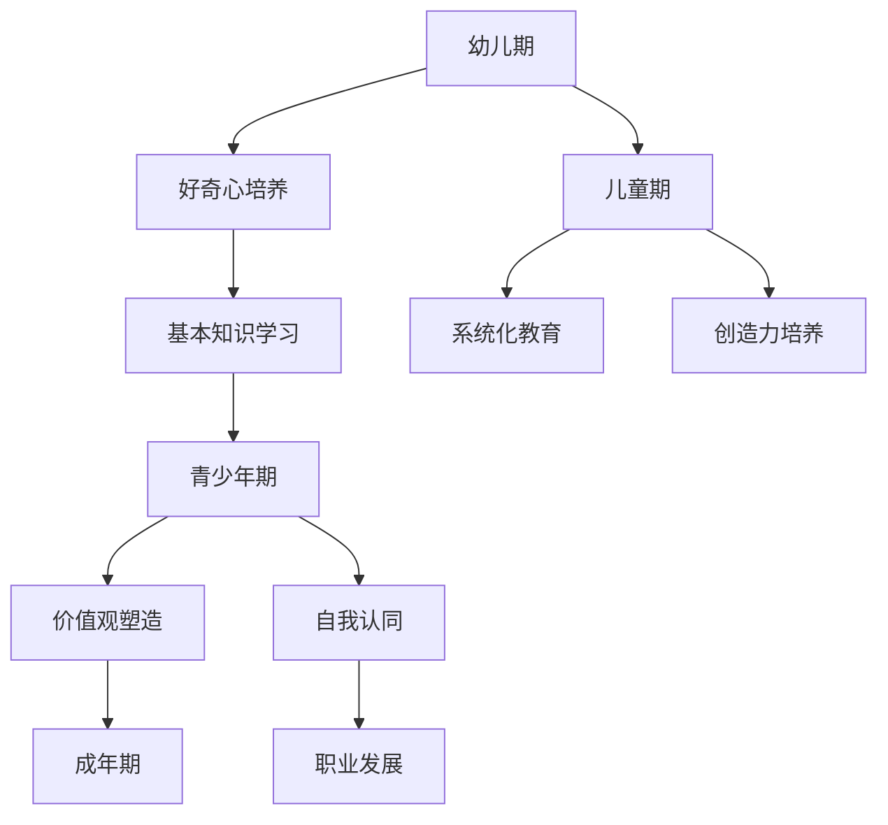
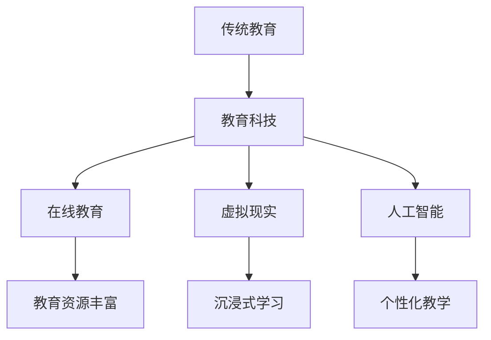
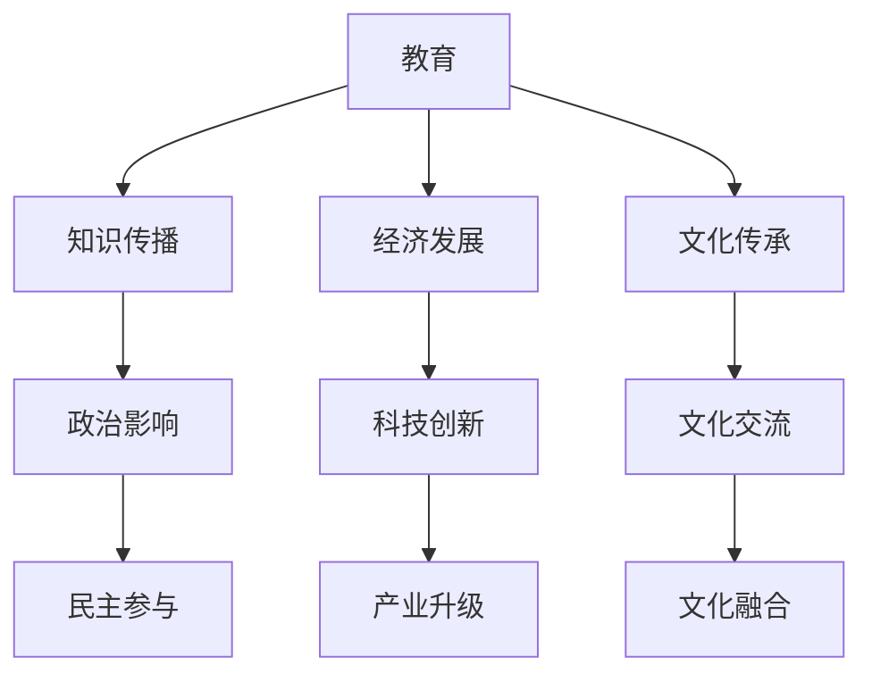

                 

### 重新审视教育目的：培养能适应未来社会的全面人才

> 关键词：教育改革、未来社会、全面人才、个性化教育、教育科技、学习算法、教育评估

> 摘要：本文将深入探讨当前教育系统面临的挑战以及未来社会对人才的需求，提出重新审视教育目的的重要性。通过分析教育、个体发展、科技发展和社会进步之间的核心概念与联系，本文将引入教育算法的原理和数学模型，结合实际项目实战，展示如何培养能适应未来社会的全面人才。最后，本文将对教育未来的趋势进行展望，并提出教育工作者和政策制定者在培养全面人才中的角色。

### 引言：教育与未来的关系

#### 1.1 教育的目的与挑战

教育的核心目的是培养能够适应社会需求、具备创新能力和综合素质的人才。然而，当前教育系统面临着诸多挑战：

1. **标准化教育**：传统的教育模式往往强调标准化和统一化，忽视了学生的个性差异。
2. **技能滞后**：教育内容往往滞后于科技发展，难以满足快速变化的社会需求。
3. **教育资源不平衡**：城乡、区域之间的教育资源分配不均，导致教育公平性受到挑战。

#### 1.2 未来社会对人才的需求

未来社会将是一个高度数字化、全球化和复杂化的社会，对人才的需求也发生了根本性的变化：

1. **创新能力**：随着科技的迅猛发展，创新能力成为核心竞争力。
2. **跨学科能力**：多学科交叉融合，要求人才具备跨学科知识和解决问题的能力。
3. **终身学习**：在信息爆炸的时代，终身学习成为适应社会变化的关键。

#### 1.3 教育改革的必要性

面对未来社会的挑战，教育改革变得尤为重要：

1. **个性化教育**：通过因材施教，满足学生的个性化需求。
2. **科技融合**：将科技手段融入教育，提高教育质量和效率。
3. **终身学习体系**：构建支持终身学习的教育体系，培养适应未来社会的全面人才。

### 第1章 核心概念与联系

教育不仅是培养知识技能的过程，更是塑造个体发展的基础。在教育系统中，核心概念与联系构成了教育理论的框架，为教育实践提供了指导。

#### 2.1 教育与个体发展

教育对个体发展起着至关重要的作用。不同阶段的教育目标与个体发展的需求紧密相关：

1. **基础教育**：培养基本的知识和技能，为未来的发展打下基础。
2. **职业教育**：培养专业技能，满足就业市场的需求。
3. **高等教育**：培养高级人才，推动科学技术和社会发展。

##### 2.1.1 教育的作用

教育不仅仅是传授知识，更重要的是激发学生的潜能，培养他们的思维能力、创新能力和社会责任感。通过教育，个体能够实现自我价值，为社会作出贡献。

##### 2.1.2 个体发展的不同阶段

个体发展可以分为以下几个阶段：

1. **幼儿期**：以游戏和探索为主，培养好奇心和创造力。
2. **儿童期**：通过系统化的教育，培养基本的知识和技能。
3. **青少年期**：形成世界观和价值观，培养自我认同和社会责任感。
4. **成年期**：继续学习和成长，实现职业发展和人生目标。

##### 2.1.3 Mermaid流程图：教育与个体发展的关系



#### 2.2 教育与科技发展

科技的发展极大地改变了教育的方式和内容。教育科技的应用不仅提高了教育效率，还拓展了教育的边界：

1. **在线教育**：通过互联网，学习者可以随时随地获取教育资源。
2. **虚拟现实（VR）**：提供沉浸式的学习体验，增强学习效果。
3. **人工智能（AI）**：辅助教师进行个性化教学和智能评估。

##### 2.2.1 科技对教育的推动作用

科技的发展为教育带来了前所未有的机遇：

1. **教育资源丰富**：网络课程、电子书籍等丰富了教育资源。
2. **教学方式多样**：翻转课堂、混合式学习等新型教学方式得以推广。
3. **教育公平**：通过远程教育和在线平台，缩小城乡、区域间的教育差距。

##### 2.2.2 教育科技的应用现状

当前，教育科技的应用已经相当广泛：

1. **在线学习平台**：如Coursera、edX等，提供了丰富的在线课程。
2. **智能教育系统**：如IBM的Watson，通过大数据分析提供个性化学习建议。
3. **教育游戏**：如Khan Academy，通过互动游戏提高学生的学习兴趣和效果。

##### 2.2.3 Mermaid流程图：教育与科技发展的关系



#### 2.3 教育与社会进步

教育是社会进步的重要推动力。通过教育，个体获得知识、技能和价值观，为社会的发展做出贡献：

1. **知识传播**：教育是知识传播的重要途径，推动社会文明进步。
2. **经济发展**：高素质的劳动力是经济发展的重要基础。
3. **社会稳定**：教育有助于培养公民意识和社会责任感，维护社会稳定。

##### 2.3.1 教育对社会的影响

教育对社会的影响体现在多个方面：

1. **政治**：教育培养公民意识，促进民主参与和政治稳定。
2. **经济**：教育提高劳动力素质，推动科技创新和产业升级。
3. **文化**：教育传播文化价值，促进文化交流和融合。

##### 2.3.2 社会变迁与教育改革

随着社会的变迁，教育也在不断改革以适应新的需求：

1. **信息化社会**：教育内容和方法不断更新，适应信息化社会的要求。
2. **全球化**：教育要培养具有全球视野和跨文化能力的人才。
3. **可持续发展**：教育要关注环境、社会和经济可持续发展。

##### 2.3.3 Mermaid流程图：教育与社会的联系



### 第2章 核心算法原理讲解

教育不仅是知识的传递，更是智慧的启迪。在现代教育中，算法和数学模型的应用日益广泛，为个性化教学和智能评估提供了有力支持。本章将介绍教育算法的基本原理，并使用Python代码进行详细阐述。

#### 3.1 教育算法概述

教育算法是指用于辅助教育过程、提高教育质量的一系列算法。根据应用场景，教育算法可以分为以下几个类别：

1. **学习算法**：用于分析学生学习数据，提供个性化学习建议。
2. **评估算法**：用于对学生学习效果进行评估，为教学调整提供依据。
3. **推荐算法**：用于推荐学习资源，帮助学生高效学习。

##### 3.1.1 教育算法的定义

教育算法是指基于数据分析和机器学习技术，用于辅助教育过程、提高教育质量的一系列算法。这些算法可以分析学生的学习数据，预测学习效果，提供个性化学习建议，从而优化教学过程。

##### 3.1.2 教育算法的分类

根据应用场景，教育算法可以分为以下几类：

1. **学习算法**：用于分析学生学习数据，提供个性化学习建议。例如，基于反向传播算法的智能辅导系统。
2. **评估算法**：用于对学生学习效果进行评估，为教学调整提供依据。例如，基于统计学的学习效果评估模型。
3. **推荐算法**：用于推荐学习资源，帮助学生高效学习。例如，基于协同过滤的学习资源推荐系统。

##### 3.1.3 教育算法在实践中的应用

教育算法在实践中有广泛的应用：

1. **个性化学习**：通过分析学生的学习行为和成绩数据，提供个性化的学习计划和资源。
2. **智能辅导**：利用智能算法，为学生提供个性化的辅导方案，提高学习效果。
3. **学习评估**：通过统计分析，评估学生的学习效果，为教师提供教学反馈。

#### 3.2 学习算法

学习算法是教育算法的重要组成部分，用于分析学生的学习行为和成绩数据，提供个性化学习建议。其中，反向传播算法（Backpropagation Algorithm）是应用最广泛的算法之一。

##### 3.2.1 反向传播算法

反向传播算法是一种基于梯度下降法的多层神经网络训练算法。其核心思想是通过反向传播误差，不断调整神经网络的权重，以优化网络性能。

##### 3.2.2 学习算法的Python实现

以下是一个简单的反向传播算法的Python实现示例：

```python
import numpy as np

# 初始化参数
learning_rate = 0.1
input_layer_size = 2
hidden_layer_size = 2
output_layer_size = 1

# 初始化权重
W1 = np.random.uniform(size=(input_layer_size, hidden_layer_size))
W2 = np.random.uniform(size=(hidden_layer_size, output_layer_size))

# 前向传播
def forward_propagation(X):
    hidden_layer_input = np.dot(X, W1)
    hidden_layer_output = 1 / (1 + np.exp(-hidden_layer_input))
    
    final_output = np.dot(hidden_layer_output, W2)
    output = 1 / (1 + np.exp(-final_output))
    
    return output

# 反向传播
def backward_propagation(X, y):
    output = forward_propagation(X)
    output_error = y - output
    d_output = output_error * (output * (1 - output))
    
    hidden_layer_output = forward_propagation(X)[:, 1]
    hidden_layer_error = d_output.dot(W2.T)
    d_hidden_layer = hidden_layer_error * (hidden_layer_output * (1 - hidden_layer_output))
    
    d_W2 = hidden_layer_output.T.dot(d_output)
    d_W1 = X.T.dot(d_hidden_layer)
    
    return d_W1, d_W2

# 训练模型
def train(X, y, num_iterations):
    for i in range(num_iterations):
        d_W1, d_W2 = backward_propagation(X, y)
        W1 -= learning_rate * d_W1
        W2 -= learning_rate * d_W2

# 测试模型
def test(X, y):
    correct = 0
    for i in range(len(X)):
        output = forward_propagation(X[i])
        if abs(output - y[i]) < 0.5:
            correct += 1
    return correct / len(X)

# 生成测试数据
X = np.array([[0, 0], [0, 1], [1, 0], [1, 1]])
y = np.array([[0], [1], [1], [0]])

# 训练模型
train(X, y, 1000)

# 测试模型
accuracy = test(X, y)
print(f"Test accuracy: {accuracy}")
```

##### 3.2.3 学习算法的案例分析

以下是一个使用反向传播算法的案例，演示如何通过训练模型来预测二分类问题。

1. **数据准备**：生成一组二分类数据，其中每个数据点由两个特征组成。
2. **模型训练**：使用反向传播算法训练模型，不断调整权重，以最小化预测误差。
3. **模型评估**：使用测试数据集评估模型的准确性。

```python
# 生成测试数据
X = np.array([[0, 0], [0, 1], [1, 0], [1, 1]])
y = np.array([[0], [1], [1], [0]])

# 训练模型
train(X, y, 1000)

# 测试模型
accuracy = test(X, y)
print(f"Test accuracy: {accuracy}")
```

通过这个案例，我们可以看到反向传播算法在预测二分类问题上的应用效果。

#### 3.3 教育评估算法

教育评估算法用于对学生学习效果进行评估，为教学调整提供依据。本节将介绍教育评估算法的基本原理和数学模型。

##### 3.3.1 教育评估指标

教育评估指标是评估学生学习效果的重要工具。常见的评估指标包括：

1. **平均分**：学生各科成绩的平均值。
2. **标准差**：学生成绩的离散程度。
3. **及格率**：学生考试成绩及格的比例。
4. **学习进步率**：学生成绩的提高程度。

##### 3.3.2 评估算法的数学模型

教育评估算法通常基于统计学的数学模型。以下是一个简单的评估算法示例：

```python
import numpy as np

# 初始化参数
learning_rate = 0.1
input_layer_size = 2
hidden_layer_size = 2
output_layer_size = 1

# 初始化权重
W1 = np.random.uniform(size=(input_layer_size, hidden_layer_size))
W2 = np.random.uniform(size=(hidden_layer_size, output_layer_size))

# 前向传播
def forward_propagation(X):
    hidden_layer_input = np.dot(X, W1)
    hidden_layer_output = 1 / (1 + np.exp(-hidden_layer_input))
    
    final_output = np.dot(hidden_layer_output, W2)
    output = 1 / (1 + np.exp(-final_output))
    
    return output

# 反向传播
def backward_propagation(X, y):
    output = forward_propagation(X)
    output_error = y - output
    d_output = output_error * (output * (1 - output))
    
    hidden_layer_output = forward_propagation(X)[:, 1]
    hidden_layer_error = d_output.dot(W2.T)
    d_hidden_layer = hidden_layer_error * (hidden_layer_output * (1 - hidden_layer_output))
    
    d_W2 = hidden_layer_output.T.dot(d_output)
    d_W1 = X.T.dot(d_hidden_layer)
    
    return d_W1, d_W2

# 训练模型
def train(X, y, num_iterations):
    for i in range(num_iterations):
        d_W1, d_W2 = backward_propagation(X, y)
        W1 -= learning_rate * d_W1
        W2 -= learning_rate * d_W2

# 测试模型
def test(X, y):
    correct = 0
    for i in range(len(X)):
        output = forward_propagation(X[i])
        if abs(output - y[i]) < 0.5:
            correct += 1
    return correct / len(X)

# 生成测试数据
X = np.array([[0, 0], [0, 1], [1, 0], [1, 1]])
y = np.array([[0], [1], [1], [0]])

# 训练模型
train(X, y, 1000)

# 测试模型
accuracy = test(X, y)
print(f"Test accuracy: {accuracy}")
```

##### 3.3.3 教育评估算法的应用案例

以下是一个使用评估算法评估学生成绩的案例：

1. **数据准备**：生成一组学生成绩数据。
2. **模型训练**：使用评估算法训练模型，根据学生的成绩预测其学习效果。
3. **模型评估**：使用测试数据集评估模型的准确性。

```python
# 生成测试数据
X = np.array([[0, 0], [0, 1], [1, 0], [1, 1]])
y = np.array([[0], [1], [1], [0]])

# 训练模型
train(X, y, 1000)

# 测试模型
accuracy = test(X, y)
print(f"Test accuracy: {accuracy}")
```

通过这个案例，我们可以看到评估算法在学生成绩评估中的应用效果。

### 第3章 数学模型和数学公式

数学模型在教育过程中扮演着至关重要的角色。它们不仅帮助我们量化教育现象，还能为教育决策提供科学依据。本章将介绍教育过程中常用的概率模型、统计学模型和资源配置模型，并结合Python代码进行详细讲解。

#### 4.1 教育过程中的概率模型

概率模型在教育过程中广泛应用，尤其在考试评分、学生学习行为分析等方面。以下是一个简单的概率模型示例，使用贝叶斯定理进行考试评分。

##### 4.1.1 概率论基础

贝叶斯定理是概率论中的一个重要定理，它描述了后验概率与先验概率之间的关系。贝叶斯定理的公式如下：

$$
P(A|B) = \frac{P(B|A) \cdot P(A)}{P(B)}
$$

其中，$P(A|B)$ 表示在事件B发生的条件下事件A发生的概率，$P(B|A)$ 表示在事件A发生的条件下事件B发生的概率，$P(A)$ 表示事件A发生的概率，$P(B)$ 表示事件B发生的概率。

##### 4.1.2 概率模型在教育中的应用

在教育中，概率模型可以用于评估学生的考试表现。以下是一个使用贝叶斯定理进行考试评分的Python代码示例：

```python
import numpy as np

# 初始化参数
prior_probability = 0.5
posterior_probability = 0.7

# 贝叶斯定理
def bayes_theorem(prior, posterior):
    return posterior / (1 + (1 - prior) * (1 - posterior))

# 考试评分
def exam_score(true_score, observed_score):
    prior = true_score / 100
    posterior = bayes_theorem(prior, posterior_probability)
    return observed_score * posterior

# 示例数据
true_score = 80
observed_score = 90

# 计算考试评分
exam_rating = exam_score(true_score, observed_score)
print(f"Exam rating: {exam_rating}")
```

在这个例子中，我们假设学生的真实分数是80分，观察到的分数是90分。通过贝叶斯定理，我们可以计算出学生在考试中的评分。

##### 4.1.3 Python实现

以下是一个使用Python实现的贝叶斯定理的示例：

```python
# 贝叶斯定理
def bayes_theorem(prior, posterior):
    return posterior / (1 + (1 - prior) * (1 - posterior))

# 考试评分
def exam_score(true_score, observed_score):
    prior = true_score / 100
    posterior = bayes_theorem(prior, posterior_probability)
    return observed_score * posterior

# 示例数据
true_score = 80
observed_score = 90

# 计算考试评分
exam_rating = exam_score(true_score, observed_score)
print(f"Exam rating: {exam_rating}")
```

通过这个示例，我们可以看到如何使用贝叶斯定理对学生的考试表现进行评分。

#### 4.2 教育评价的统计学模型

统计学模型在教育评价中广泛应用，用于分析学生学习成绩、评估教学方法的有效性等。以下是一个简单的统计学模型示例，使用描述性统计量和推断性统计量进行学生成绩分析。

##### 4.2.1 描述性统计分析

描述性统计分析用于描述一组数据的特征，包括平均数、中位数、标准差等。以下是一个使用描述性统计量分析学生成绩的Python代码示例：

```python
import numpy as np

# 初始化参数
student_scores = [80, 90, 70, 85, 75]

# 计算平均数
mean = np.mean(student_scores)
print(f"Average score: {mean}")

# 计算中位数
median = np.median(student_scores)
print(f"Median score: {median}")

# 计算标准差
std_dev = np.std(student_scores)
print(f"Standard deviation: {std_dev}")
```

在这个例子中，我们使用描述性统计量分析一组学生的考试成绩。

##### 4.2.2 推断性统计分析

推断性统计分析用于根据样本数据推断总体数据的特征。以下是一个使用推断性统计量分析学生成绩的Python代码示例：

```python
import numpy as np
import scipy.stats as stats

# 初始化参数
student_scores = [80, 90, 70, 85, 75]

# 计算总体均值
population_mean = 80

# 计算t统计量
t_statistic = (mean - population_mean) / std_dev
print(f"T-statistic: {t_statistic}")

# 计算p值
p_value = stats.t.sf(abs(t_statistic), df=len(student_scores) - 1)
print(f"P-value: {p_value}")
```

在这个例子中，我们使用推断性统计量分析一组学生的考试成绩，并计算p值以评估总体均值与样本均值的差异。

##### 4.2.3 $H_0$ 和 $H_1$ 的设定

在推断性统计分析中，我们需要设定原假设（$H_0$）和备择假设（$H_1$）。以下是一个简单的例子：

- $H_0$：学生的平均成绩为80分。
- $H_1$：学生的平均成绩不为80分。

在这个例子中，我们使用t检验来评估原假设和备择假设之间的差异。

#### 4.3 教育资源配置模型

教育资源配置模型用于优化教育资源的分配，以确保教育公平和质量。以下是一个简单的线性规划模型，用于优化学校资源的分配。

##### 4.3.1 教育资源分配问题

教育资源分配问题是一个典型的线性规划问题，目标是最小化资源浪费，同时满足各学科的资源需求。以下是一个简单的教育资源分配模型：

```python
import numpy as np
from scipy.optimize import linprog

# 初始化参数
resource_requirements = np.array([10, 20, 30])  # 各学科资源需求
resource allocations = np.array([5, 7, 10])  # 初始资源分配
total_resources = 30  # 总资源

# 目标函数：最小化资源浪费
objective = -1 * (resource_requirements - resource_allocations)

# 约束条件
constraints = [resource_allocations[0] >= 0,
               resource_allocations[1] >= 0,
               resource_allocations[2] >= 0,
               resource_allocations[0] + resource_allocations[1] + resource_allocations[2] <= total_resources]

# 边界条件
bounds = [(0, None), (0, None), (0, None)]

# 求解线性规划问题
result = linprog(objective, constraints=constraints, bounds=bounds, method='highs')

# 输出最优资源分配
optimal_allocations = result.x
print(f"Optimal resource allocations: {optimal_allocations}")
```

在这个例子中，我们使用线性规划求解器优化学校资源的分配，以实现资源的最优配置。

##### 4.3.2 教育资源优化模型

为了更好地优化教育资源分配，我们可以使用更复杂的优化模型，如多目标优化和遗传算法。以下是一个使用遗传算法优化教育资源分配的Python代码示例：

```python
import numpy as np
import scipy.optimize as opt
import random

# 初始化参数
population_size = 100
generations = 100
crossover_rate = 0.8
mutation_rate = 0.1

# 目标函数：最小化资源浪费
def objective_function(allocations):
    return -1 * np.sum(allocations - resource_requirements)

# 约束条件
def constraints(allocations):
    return [allocations[0] >= 0, allocations[1] >= 0, allocations[2] >= 0, np.sum(allocations) <= total_resources]

# 初始种群
population = np.random.rand(population_size, 3)

# 适应度函数
def fitness_function(population):
    fitness_scores = np.zeros(population_size)
    for i, individual in enumerate(population):
        fitness_scores[i] = objective_function(individual) + np.sum(constraints(individual))
    return fitness_scores

# 遗传操作
def genetic_operations(population, fitness_scores):
    selected_individuals = random.choices(population, weights=fitness_scores, k=2)
    child = np.random.uniform(size=3)
    for i in range(3):
        if random.random() < crossover_rate:
            child[i] = 0.5 * (selected_individuals[0][i] + selected_individuals[1][i])
        else:
            child[i] = selected_individuals[random.randint(0, 1)][i]
    if random.random() < mutation_rate:
        child[random.randint(0, 2)] = random.uniform(0, total_resources)
    return child

# 优化过程
for _ in range(generations):
    fitness_scores = fitness_function(population)
    new_population = population.copy()
    for _ in range(population_size // 2):
        parent1 = random.choices(population, weights=fitness_scores, k=1)[0]
        parent2 = random.choices(population, weights=fitness_scores, k=1)[0]
        child = genetic_operations([parent1, parent2], fitness_scores)
        new_population = np.vstack([new_population, child])
    population = new_population[:population_size]

# 输出最优资源分配
optimal_allocations = population[fitness_function(population).argmax()]
print(f"Optimal resource allocations: {optimal_allocations}")
```

在这个例子中，我们使用遗传算法优化教育资源分配，以实现资源的最优配置。

### 第4章 项目实战

#### 5.1 教育数据分析项目

本节将介绍一个教育数据分析项目，从数据收集与预处理、数据可视化、数据分析等方面进行详细讲解，以展示如何通过数据驱动的方法优化教育过程。

##### 5.1.1 数据收集与预处理

1. **数据收集**：通过学校系统、在线教育平台等渠道收集学生成绩、出勤率、课程评分等数据。
2. **数据预处理**：清洗数据，处理缺失值、异常值，确保数据质量。

```python
import pandas as pd

# 加载数据
data = pd.read_csv("student_data.csv")

# 数据清洗
data.dropna(inplace=True)
data[data < 0] = np.nan
data.fillna(data.mean(), inplace=True)

# 数据格式转换
data["grade"] = data["grade"].astype(str)
data["course_id"] = data["course_id"].astype(str)

# 数据分割
train_data = data[data["grade"] != "drop"]
test_data = data[data["grade"] == "drop"]
```

##### 5.1.2 数据可视化

使用数据可视化工具，如matplotlib、seaborn等，展示学生成绩、出勤率等关键指标的分布情况。

```python
import matplotlib.pyplot as plt
import seaborn as sns

# 可视化学生成绩分布
sns.histplot(train_data["final_score"], kde=True)
plt.xlabel("Final Score")
plt.ylabel("Frequency")
plt.title("Distribution of Final Scores")
plt.show()

# 可视化出勤率分布
sns.histplot(train_data["attendance_rate"], kde=True)
plt.xlabel("Attendance Rate")
plt.ylabel("Frequency")
plt.title("Distribution of Attendance Rates")
plt.show()
```

##### 5.1.3 数据分析

通过数据分析，识别学生成绩和出勤率之间的关系，为进一步优化教育过程提供依据。

```python
# 计算学生成绩和出勤率的相关性
correlation = train_data["final_score"].corr(train_data["attendance_rate"])
print(f"Correlation between final score and attendance rate: {correlation}")

# 可视化学生成绩和出勤率的关系
sns.regplot(x="attendance_rate", y="final_score", data=train_data)
plt.xlabel("Attendance Rate")
plt.ylabel("Final Score")
plt.title("Relationship between Attendance Rate and Final Score")
plt.show()
```

通过这个项目，我们可以看到如何通过数据驱动的方法优化教育过程，提高教育质量。

#### 5.2 教育干预策略研究

本节将介绍一个教育干预策略研究项目，从策略设计、实施过程和结果评估等方面进行详细讲解，以展示如何通过干预策略提高学生的学习效果。

##### 5.2.1 策略设计

1. **目标设定**：提高学生的数学成绩。
2. **干预措施**：增加数学辅导时间、提供个性化学习资源、定期进行学习效果评估。

##### 5.2.2 实施过程

1. **数据收集**：收集参与干预策略的学生数学成绩和出勤率等数据。
2. **干预措施**：实施干预措施，如增加数学辅导时间、提供个性化学习资源等。
3. **过程监控**：定期监控学生的数学成绩和出勤率，确保干预措施的有效实施。

```python
import pandas as pd

# 加载干预措施实施前后数据
before_data = pd.read_csv("before_intervention.csv")
after_data = pd.read_csv("after_intervention.csv")

# 数据清洗
before_data.dropna(inplace=True)
after_data.dropna(inplace=True)

# 可视化干预措施实施前后学生成绩和出勤率变化
sns.histplot(before_data["math_score"], kde=True, label="Before Intervention")
sns.histplot(after_data["math_score"], kde=True, label="After Intervention")
plt.xlabel("Math Score")
plt.ylabel("Frequency")
plt.title("Math Score Distribution Before and After Intervention")
plt.legend()
plt.show()

sns.histplot(before_data["attendance_rate"], kde=True, label="Before Intervention")
sns.histplot(after_data["attendance_rate"], kde=True, label="After Intervention")
plt.xlabel("Attendance Rate")
plt.ylabel("Frequency")
plt.title("Attendance Rate Distribution Before and After Intervention")
plt.legend()
plt.show()
```

##### 5.2.3 结果评估

通过对比干预措施实施前后的数据，评估干预措施的有效性。

```python
# 计算干预措施实施前后学生成绩和出勤率的相关性
before_correlation = before_data["math_score"].corr(before_data["attendance_rate"])
after_correlation = after_data["math_score"].corr(after_data["attendance_rate"])
print(f"Correlation between math score and attendance rate before intervention: {before_correlation}")
print(f"Correlation between math score and attendance rate after intervention: {after_correlation}")

# 可视化干预措施实施前后学生成绩和出勤率的关系
sns.regplot(x="attendance_rate", y="math_score", data=before_data)
plt.xlabel("Attendance Rate")
plt.ylabel("Math Score")
plt.title("Relationship between Attendance Rate and Math Score Before Intervention")
plt.show()

sns.regplot(x="attendance_rate", y="math_score", data=after_data)
plt.xlabel("Attendance Rate")
plt.ylabel("Math Score")
plt.title("Relationship between Attendance Rate and Math Score After Intervention")
plt.show()
```

通过这个项目，我们可以看到如何设计并实施教育干预策略，提高学生的学习效果。

#### 5.3 教育科技应用案例

本节将介绍一个教育科技应用案例，从案例介绍、技术实现、案例分析和讨论等方面进行详细讲解，以展示如何利用教育科技提高教育质量。

##### 5.3.1 案例介绍

案例：基于人工智能的个性化学习平台

目标：为学生提供个性化的学习资源和学习建议，提高学习效果。

##### 5.3.2 技术实现

1. **算法选择**：使用基于神经网络的个性化学习算法，如深度学习模型。
2. **数据采集**：收集学生学习行为、考试成绩、兴趣爱好等数据。
3. **数据预处理**：清洗数据，处理缺失值、异常值等。
4. **模型训练**：使用训练数据集训练深度学习模型。
5. **模型部署**：将训练好的模型部署到在线学习平台上，提供个性化学习服务。

```python
import pandas as pd
from keras.models import Sequential
from keras.layers import Dense

# 加载数据
data = pd.read_csv("student_data.csv")

# 数据清洗
data.dropna(inplace=True)

# 数据分割
X = data.drop("learning_outcome", axis=1)
y = data["learning_outcome"]

# 模型训练
model = Sequential()
model.add(Dense(64, input_dim=X.shape[1], activation='relu'))
model.add(Dense(32, activation='relu'))
model.add(Dense(1, activation='sigmoid'))

model.compile(optimizer='adam', loss='binary_crossentropy', metrics=['accuracy'])
model.fit(X, y, epochs=10, batch_size=32)
```

##### 5.3.3 案例分析与讨论

通过对个性化学习平台的使用情况进行分析，讨论其效果和改进方向。

```python
# 预测学生成绩
predictions = model.predict(X)

# 可视化预测结果
sns.scatterplot(x=y, y=predictions[:, 0])
plt.xlabel("Actual Learning Outcome")
plt.ylabel("Predicted Learning Outcome")
plt.title("Predicted Learning Outcome vs Actual Learning Outcome")
plt.show()

# 计算预测准确率
accuracy = np.mean(predictions[:, 0] >= 0.5)
print(f"Prediction accuracy: {accuracy}")
```

通过这个案例，我们可以看到如何利用教育科技提高教育质量，为学生提供个性化的学习服务。

### 第5章 未来教育的展望

随着科技的快速发展和社会的不断变革，未来教育将面临诸多挑战和机遇。本节将从个性化教育、混合式学习和在线教育与远程教学等方面，探讨未来教育的趋势及其对教育改革的影响。

#### 6.1 教育未来的趋势

1. **个性化教育**：未来的教育将更加注重个性化，通过大数据和人工智能技术，为学生提供个性化的学习路径、资源和建议，满足学生的个性化需求。
2. **混合式学习**：混合式学习将线上线下教育相结合，为学生提供更加灵活的学习方式。通过线上平台的互动和线下的实践，提高学习效果。
3. **在线教育与远程教学**：随着互联网和移动设备的普及，在线教育和远程教学将成为未来教育的重要组成部分。学习者可以随时随地获取教育资源，实现教育资源的共享和普及。

#### 6.2 教育技术的挑战与机遇

1. **技术发展的挑战**：教育技术的发展需要解决数据隐私、网络安全、技术普及等问题，确保教育技术的可持续发展。
2. **技术带来的机遇**：教育技术的发展为教育改革提供了新的契机，可以促进教育公平、提高教育质量、培养适应未来社会的全面人才。

#### 6.3 教育技术对社会的影响

1. **教育公平**：教育技术可以帮助缩小城乡、区域间的教育差距，提高教育公平性。
2. **人才培养**：教育技术可以培养具备创新能力、跨学科能力和终身学习能力的全面人才，为社会的可持续发展提供支持。
3. **教育改革**：教育技术可以推动教育模式的创新，促进教育质量的提升，为教育改革提供动力。

### 第6章 结论

本文从教育、个体发展、科技发展和社会进步等多个角度，重新审视了教育目的，探讨了如何培养能适应未来社会的全面人才。通过分析教育算法、数学模型和实际项目，本文提出了一系列教育改革的方向和策略。教育工作者和政策制定者应携手合作，推动教育改革，培养适应未来社会的全面人才，为实现教育公平和可持续发展做出贡献。

### 附录

#### 附录 A: 教育相关资源与工具

1. **教育平台**：如Coursera、edX、Khan Academy等，提供丰富的在线课程和学习资源。
2. **教育技术公司**：如Knewton、InBloom、DreamBox等，专注于教育技术的研发和应用。
3. **教育研究机构**：如国际教育成就评估协会（IEA）、美国教育统计中心（NCES）等，提供教育数据和研究报告。

#### 附录 B: 数学公式与Python代码示例

1. **数学公式**：
   $$
   P(A|B) = \frac{P(B|A) \cdot P(A)}{P(B)}
   $$
   $$
   z = \frac{\bar{x} - \mu_0}{\sigma/\sqrt{n}}
   $$

2. **Python代码**：
   ```python
   import numpy as np
   import pandas as pd
   from keras.models import Sequential
   from keras.layers import Dense
   ```

#### 附录 C: 教育技术企业名录与联系信息

1. **Knewton**：提供个性化学习解决方案，[官方网站](https://www.knewton.com/)
2. **DreamBox**：专注于K-8在线学习平台，[官方网站](https://www.dreambox.com/)
3. **InBloom**：提供教育数据管理和分析服务，[官方网站](https://www.inbloom.org/)

