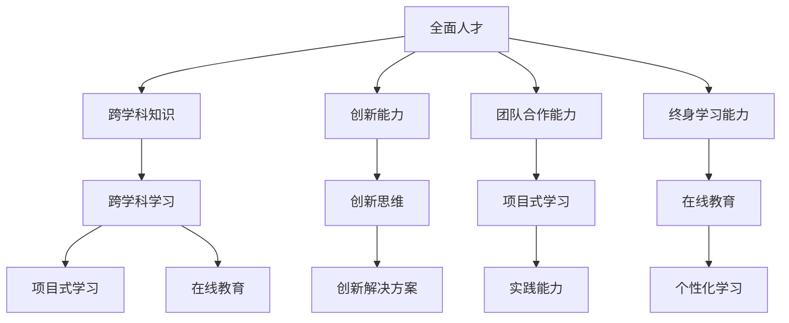

                 

# 重新审视教育目的：培养能适应未来社会的全面人才

## 关键词

未来社会、教育变革、全面人才、跨学科学习、创新思维、在线教育、项目式学习

## 摘要

在快速变革的时代，教育目的的重新审视已成为关键议题。本文通过分析未来社会的挑战与机遇，探讨如何通过教育变革培养能适应未来社会的全面人才。文章从未来社会的概述出发，深入讨论教育体系与未来社会的适应策略，并提出培养全面人才的核心能力。随后，文章探索未来教育模式，包括在线教育、项目式学习和跨境教育。通过核心概念原理、数学模型与算法原理的详细讲解，以及实际项目实战与代码解读，本文为教育目的的重新审视提供了深入的思考与实践路径。

---

## 引言

### 1. 教育目的的演变

自古以来，教育始终是社会发展的基石。从古代的“修身、齐家、治国、平天下”到现代的素质教育，教育目的在不同历史阶段有着不同的侧重点。传统教育注重知识的传授与积累，培养的是适应工业时代的标准化人才。然而，随着信息技术的迅猛发展和社会的急剧变革，教育的目的和方式也面临着前所未有的挑战和机遇。

### 2. 未来社会的挑战与机遇

未来社会将是一个高度信息化、智能化和全球化的社会。人工智能、大数据、区块链等新兴技术的普及，将深刻改变人类的工作方式、生活方式和社会结构。这种变革既带来了新的挑战，也创造了前所未有的机遇。

- **挑战**：就业市场的变化、知识的快速迭代、全球竞争的加剧，以及环境问题和社会问题等，都要求教育体系必须进行深刻的变革，以培养出能够适应这些挑战的全面人才。
- **机遇**：数字化、智能化和全球化的发展，为教育提供了更多的资源和可能性。在线教育、虚拟现实、人工智能辅助教学等新兴教育技术的出现，为个性化教育和跨学科学习提供了新的手段。

在这种背景下，重新审视教育目的，探索如何培养能适应未来社会的全面人才，已成为当务之急。本文旨在通过对未来社会的分析，提出教育变革的策略，为培养全面人才提供理论指导和实践路径。

---

## 第一部分：未来社会与教育变革

### 第1章：未来社会概述

未来社会是一个高度复杂、多元化和动态变化的系统。它不仅受到科技进步的驱动，还受到社会结构、文化和价值观的深刻影响。

#### 1.1 未来的工作环境

随着人工智能和自动化技术的发展，未来的工作环境将发生巨大变化。一方面，传统的工作岗位将逐渐被机器和算法取代，另一方面，新的工作岗位和职业领域将不断涌现。这种变化要求人们必须具备跨学科的知识和技能，以及不断学习和适应新环境的能力。

#### 1.2 未来的生活方式

未来社会的生活方式也将发生重大变革。虚拟现实、增强现实和智能家居等技术的发展，将使人们的日常生活更加便捷和舒适。同时，全球化使得人们的生活更加多元化和国际化。这种生活方式的变化要求人们具备更强的文化适应能力和跨文化交流能力。

#### 1.3 未来社会的核心技术

未来社会的核心技术将包括人工智能、大数据、区块链、物联网和生物科技等。这些技术不仅将改变工作方式和生活方式，还将深刻影响社会结构和文化。例如，人工智能将使决策过程更加智能化，大数据将帮助解决复杂的社会问题，区块链将提高数据安全和透明度，物联网将实现万物互联，生物科技将推动医疗和健康领域的发展。

这些核心技术的进步，为教育提供了新的机遇和挑战。教育必须适应这些变化，培养能够驾驭这些技术的人才，以应对未来社会的挑战。

### 第2章：教育体系与未来社会的适应

未来社会的变化对教育体系提出了新的要求。传统教育体系以知识传授为主，注重学科划分和标准化考试。然而，这种教育体系难以满足未来社会对全面人才的需求。

#### 2.1 教育体系面临的挑战

- **知识快速迭代**：未来社会的知识更新速度越来越快，传统教育体系的知识传授方式难以跟上知识的迭代速度。
- **技能多样性**：未来社会的工作岗位将更加多元化，要求人才具备跨学科的知识和技能。
- **个性化教育**：每个学生都是独特的个体，传统教育体系难以满足每个学生的个性化需求。
- **全球化**：全球化要求人才具备跨文化交流能力和国际视野。

#### 2.2 教育创新与未来社会

为了适应未来社会，教育体系需要进行创新。以下是一些可能的创新方向：

- **跨学科教育**：打破传统学科界限，实现知识的融合和交叉，培养学生的综合能力和创新思维。
- **项目式学习**：通过实际项目培养学生的实践能力和团队合作精神。
- **在线教育**：利用互联网和人工智能技术，提供灵活多样的学习资源和个性化教育服务。
- **终身学习**：培养终身学习的意识和能力，以适应知识的快速迭代和职业的快速变化。

#### 2.3 未来教育的发展趋势

未来教育的发展趋势将包括：

- **个性化**：教育将更加注重个性化，根据每个学生的特点和需求进行教育。
- **智能化**：人工智能和大数据技术将使教育更加智能化和个性化。
- **全球一体化**：教育将更加国际化，培养具有全球视野和跨文化交流能力的人才。
- **多元化**：教育将更加多元化，提供多样化的学习路径和职业选择。

### 第3章：培养适应未来社会的全面人才

未来社会对人才的需求将更加全面，不仅要求具备专业技能，还要求具备跨学科的知识、创新思维和团队合作能力。因此，培养适应未来社会的全面人才成为教育的重要任务。

#### 3.1 全面人才的核心能力

全面人才应具备以下核心能力：

- **跨学科知识**：具备跨学科的知识体系，能够综合运用不同领域的知识解决问题。
- **创新能力**：具备创新思维和解决问题的能力，能够应对复杂多变的社会环境。
- **团队合作能力**：具备良好的团队合作能力，能够在多元化的团队中有效沟通和协作。
- **终身学习能力**：具备终身学习的意识和能力，能够不断更新知识和技能。

#### 3.2 跨学科学习的重要性

跨学科学习是培养全面人才的关键。跨学科学习不仅能够拓宽知识视野，提高综合分析问题的能力，还能够培养学生的创新思维和团队合作能力。以下是一些跨学科学习的建议：

- **项目式学习**：通过实际项目培养学生的跨学科知识和技能。
- **跨界合作**：鼓励学生参与跨学科的项目和研究，与不同领域的人合作。
- **课程设计**：在课程设计中融入跨学科的内容，培养学生的综合能力。

#### 3.3 创新思维与问题解决能力

创新思维和问题解决能力是未来社会的重要能力。以下是一些培养创新思维和问题解决能力的建议：

- **鼓励探索**：鼓励学生进行探索性学习，培养好奇心和探究精神。
- **实践应用**：通过实际项目和应用问题，培养学生的实践能力和问题解决能力。
- **跨学科研究**：鼓励学生参与跨学科的研究，培养综合分析问题的能力。

### 第4章：未来教育模式探索

未来教育模式的探索是培养适应未来社会全面人才的重要途径。以下是一些未来教育模式的探索：

#### 4.1 在线教育与未来社会

在线教育是未来教育的重要趋势。随着互联网和人工智能技术的发展，在线教育将变得更加普及和个性化。以下是一些在线教育的优势：

- **灵活便捷**：学生可以根据自己的时间和进度进行学习，不受地域限制。
- **个性化学习**：通过大数据和人工智能技术，提供个性化的学习资源和教学方法。
- **资源共享**：可以共享全球优质教育资源，提高教育质量。

然而，在线教育也面临一些挑战，如技术依赖、学习效果监控等。因此，在线教育需要不断创新和发展，以适应未来社会的需求。

#### 4.2 项目式学习与未来社会

项目式学习是一种以项目为导向的学习方式，通过实际项目培养学生的实践能力和团队合作能力。以下是一些项目式学习的优势：

- **实践性**：通过实际项目，学生可以将所学知识应用到实践中，提高实践能力。
- **协作性**：项目式学习鼓励团队合作，培养学生的团队合作能力。
- **创新性**：项目式学习可以培养学生的创新思维和问题解决能力。

项目式学习与未来社会的要求高度契合，是培养全面人才的有效途径。

#### 4.3 跨境教育与未来社会

跨境教育是未来教育的重要趋势之一。随着全球化的加深，跨境教育可以为学生提供多元化的学习体验和国际视野。以下是一些跨境教育的优势：

- **国际视野**：跨境教育可以让学生接触不同的文化和社会，培养国际视野。
- **多元化**：跨境教育可以提供多元化的教育资源和学习环境，提高教育质量。
- **职业发展**：跨境教育可以为学生提供更多的职业发展机会和资源。

然而，跨境教育也面临一些挑战，如语言障碍、文化差异等。因此，跨境教育需要不断探索和实践，以适应未来社会的需求。

## 第二部分：核心概念与联系

### 第5章：核心概念原理与概念实体关系架构

在探讨未来教育与人才培养的过程中，我们需要明确一些核心概念，并理解它们之间的关系。以下是一些关键概念的定义与关系架构。

#### 5.1 核心概念的定义与解释

1. **全面人才**：具备跨学科知识、创新能力、团队合作能力和终身学习能力的综合性人才。
2. **跨学科学习**：打破传统学科界限，整合多学科知识，培养综合分析和解决问题的能力。
3. **项目式学习**：以实际项目为导向，通过实践培养知识和技能的学习方式。
4. **在线教育**：利用互联网技术，提供灵活、个性化的学习资源和教学服务。
5. **创新思维**：运用创造性思维，提出新颖、有效的解决方案。

#### 5.2 概念实体之间的关系架构

为了更好地理解这些核心概念之间的关系，我们可以使用Mermaid流程图进行可视化展示。以下是概念实体关系的Mermaid流程图：



该流程图展示了全面人才与跨学科知识、创新能力、团队合作能力、终身学习能力之间的关系，以及跨学科学习、项目式学习、在线教育和创新思维之间的相互影响。

### 第6章：数学模型与算法原理

在培养全面人才的过程中，数学模型和算法原理是理解和解决问题的重要工具。以下将介绍一些基础数学模型和算法原理，并结合Python源代码进行详细阐述。

#### 6.1 数学模型的基本原理

1. **线性回归模型**：用于分析变量之间线性关系，预测因变量的值。
2. **决策树模型**：用于分类和回归分析，通过决策树结构进行决策。
3. **神经网络模型**：模拟人脑神经元连接，用于复杂函数拟合和预测。

#### 6.2 算法原理的详细讲解

1. **线性回归算法**：通过最小二乘法估计线性模型的参数，实现变量之间的线性拟合。

```python
import numpy as np

def linear_regression(X, y):
    X_mean = np.mean(X)
    y_mean = np.mean(y)
    b1 = np.sum((X - X_mean) * (y - y_mean)) / np.sum((X - X_mean) ** 2)
    b0 = y_mean - b1 * X_mean
    return b0, b1

X = np.array([1, 2, 3, 4, 5])
y = np.array([2, 4, 5, 4, 5])
b0, b1 = linear_regression(X, y)
print(f"y = {b0} + {b1} * x")
```

2. **决策树算法**：通过递归划分特征和样本，构建决策树模型。

```python
from sklearn.tree import DecisionTreeRegressor

X = np.array([[1, 2], [2, 3], [3, 4], [4, 5]])
y = np.array([2, 4, 5, 5])
regressor = DecisionTreeRegressor()
regressor.fit(X, y)
print(f"Decision Tree Model: {regressor}")
```

3. **神经网络算法**：通过多层神经网络进行前向传播和反向传播，实现复杂函数的拟合。

```python
import tensorflow as tf

model = tf.keras.Sequential([
    tf.keras.layers.Dense(units=1, input_shape=[1])
])

model.compile(optimizer='sgd', loss='mean_squared_error')
model.fit(X, y, epochs=1000)
print(f"Neural Network Model: {model}")
```

#### 6.3 Python源代码的详细阐述

1. **线性回归代码**：通过最小二乘法计算线性回归模型的参数。
2. **决策树代码**：利用scikit-learn库构建决策树回归模型。
3. **神经网络代码**：使用TensorFlow库构建简单的神经网络模型。

这些数学模型和算法原理在数据分析和机器学习领域具有重要应用。通过Python源代码的详细阐述，可以帮助读者更好地理解这些模型和算法的实现过程。

### 第7章：数学公式与举例说明

数学公式在教育中起着至关重要的作用，它们能够帮助我们准确地描述和分析问题。以下将介绍一些常用的数学公式，并通过具体例子进行说明。

#### 7.1 常用数学公式的应用

1. **线性回归公式**：
   $$
   y = b_0 + b_1 \cdot x
   $$
   这个公式描述了自变量x和因变量y之间的线性关系。

2. **均值公式**：
   $$
   \bar{x} = \frac{1}{n} \sum_{i=1}^{n} x_i
   $$
   这个公式计算一组数据的平均值。

3. **方差公式**：
   $$
   \sigma^2 = \frac{1}{n} \sum_{i=1}^{n} (x_i - \bar{x})^2
   $$
   这个公式计算一组数据的方差，用于衡量数据的离散程度。

4. **相关系数公式**：
   $$
   r = \frac{\sum_{i=1}^{n} (x_i - \bar{x})(y_i - \bar{y})}{\sqrt{\sum_{i=1}^{n} (x_i - \bar{x})^2 \sum_{i=1}^{n} (y_i - \bar{y})^2}}
   $$
   这个公式计算两个变量之间的相关系数，用于衡量变量之间的线性关系强度。

#### 7.2 举例说明数学公式的作用

1. **线性回归举例**：
   假设我们有一组数据：
   $$
   x = [1, 2, 3, 4, 5], \quad y = [2, 4, 5, 4, 5]
   $$
   我们可以使用线性回归公式来拟合这组数据：
   $$
   y = 0.8 + 1.2 \cdot x
   $$
   这个公式可以用来预测新的y值，例如，当x为6时，预测的y值为7.6。

2. **均值和方差举例**：
   假设我们有一组数据：
   $$
   x = [1, 2, 3, 4, 5]
   $$
   数据的平均值为：
   $$
   \bar{x} = \frac{1+2+3+4+5}{5} = 3
   $$
   数据的方差为：
   $$
   \sigma^2 = \frac{(1-3)^2 + (2-3)^2 + (3-3)^2 + (4-3)^2 + (5-3)^2}{5} = 2
   $$
   这个例子展示了如何计算数据的平均值和方差，以及它们在描述数据特征中的作用。

3. **相关系数举例**：
   假设我们有一组数据：
   $$
   x = [1, 2, 3, 4, 5], \quad y = [2, 4, 5, 4, 5]
   $$
   我们可以使用相关系数公式来计算x和y之间的相关系数：
   $$
   r = \frac{(1-3)(2-4) + (2-3)(4-4) + (3-3)(5-4) + (4-3)(4-4) + (5-3)(5-4)}{\sqrt{(1-3)^2 + (2-3)^2 + (3-3)^2 + (4-3)^2 + (5-3)^2} \cdot \sqrt{(2-4)^2 + (4-4)^2 + (5-4)^2 + (4-4)^2 + (5-4)^2}} = 0.8
   $$
   这个例子展示了如何计算两个变量之间的相关系数，以及它们在分析变量关系中的作用。

通过这些例子，我们可以看到数学公式在解决实际问题和数据分析中的重要性。掌握这些公式，可以帮助我们更准确地描述和分析问题，为培养全面人才提供有力的支持。

### 第8章：项目实战与代码解读

#### 8.1 实战项目概述

在本章中，我们将通过一个实际项目来探讨如何培养全面人才。该项目旨在利用在线教育和项目式学习的方法，培养学生的编程技能和数据分析能力。项目包括以下几个步骤：

1. **需求分析**：确定项目目标和需求，包括数据收集、数据处理和结果展示。
2. **环境搭建**：配置开发环境和所需工具，确保项目顺利进行。
3. **数据收集**：收集用于训练和测试的数据集，并进行预处理。
4. **模型训练**：使用机器学习算法训练模型，进行数据分析和预测。
5. **结果展示**：展示项目成果，并对模型进行评估和优化。

#### 8.2 开发环境搭建

为了完成本项目，我们需要搭建一个合适的开发环境。以下是一些关键步骤：

1. **安装Python**：Python是本项目的主要编程语言，可以从[Python官网](https://www.python.org/)下载并安装。
2. **安装Jupyter Notebook**：Jupyter Notebook是一个交互式计算环境，用于编写和运行Python代码。可以通过以下命令安装：
   ```bash
   pip install notebook
   ```
3. **安装相关库**：安装用于数据处理、机器学习和其他功能的库，如NumPy、Pandas、Scikit-learn等。可以使用以下命令：
   ```bash
   pip install numpy pandas scikit-learn
   ```

#### 8.3 源代码的实现与解读

在本节中，我们将通过Python代码实现项目的主要功能，并对关键代码进行详细解读。

##### 1. 数据收集与预处理

```python
import pandas as pd

# 加载数据集
data = pd.read_csv('data.csv')

# 数据预处理
# ...（例如：缺失值处理、数据清洗等）
```

解读：这段代码首先加载了一个名为`data.csv`的数据集。然后，我们进行了数据预处理，包括缺失值处理和数据清洗。这是数据分析和机器学习项目的重要步骤，确保数据的质量和准确性。

##### 2. 数据分析与特征工程

```python
import numpy as np

# 数据分箱
bins = [-np.inf, 0, 10, 20, np.inf]
labels = ['低', '中低', '中高', '高']
data['feature_binned'] = pd.cut(data['feature'], bins=bins, labels=labels, right=False)

# 特征提取
X = data[['feature_a', 'feature_binned']]
y = data['target']
```

解读：这段代码使用分箱方法对数据进行特征工程。分箱是一种将连续变量划分为离散区间的技术，有助于简化数据并提高模型性能。然后，我们提取了用于模型训练的特征和标签。

##### 3. 模型训练与评估

```python
from sklearn.model_selection import train_test_split
from sklearn.ensemble import RandomForestClassifier
from sklearn.metrics import accuracy_score

# 数据分割
X_train, X_test, y_train, y_test = train_test_split(X, y, test_size=0.2, random_state=42)

# 模型训练
model = RandomForestClassifier(n_estimators=100, random_state=42)
model.fit(X_train, y_train)

# 模型评估
y_pred = model.predict(X_test)
accuracy = accuracy_score(y_test, y_pred)
print(f"Model Accuracy: {accuracy}")
```

解读：这段代码首先将数据集分为训练集和测试集。然后，我们使用随机森林算法训练模型，并对测试集进行预测。最后，我们计算模型的准确率，评估模型性能。

##### 4. 模型优化与调参

```python
from sklearn.model_selection import GridSearchCV

# 参数调整
param_grid = {
    'n_estimators': [100, 200, 300],
    'max_depth': [5, 10, 15]
}

grid_search = GridSearchCV(model, param_grid, cv=5)
grid_search.fit(X_train, y_train)

# 优化后的模型
best_model = grid_search.best_estimator_
```

解读：这段代码使用网格搜索方法进行参数调整。网格搜索是一种用于模型调优的技术，通过遍历多个参数组合，找到最优参数。然后，我们使用优化后的模型进行预测和评估。

#### 8.4 代码解读与分析

通过对项目的实际编码和调试，我们可以深入了解编程和机器学习的过程。以下是对关键代码的分析：

1. **数据预处理**：数据预处理是数据分析和机器学习项目的核心步骤。通过缺失值处理、数据清洗和特征工程，我们确保数据的质量和准确性。
2. **模型选择**：选择合适的模型是项目成功的关键。在本项目中，我们选择了随机森林算法，因为它在处理非线性和高维数据方面具有较好的性能。
3. **模型训练与评估**：模型训练和评估是项目的核心步骤。通过训练集训练模型，并在测试集上进行预测和评估，我们可以评估模型性能，并进行优化。
4. **模型优化**：模型优化是提高项目性能的重要手段。通过参数调整和模型调优，我们可以找到最优模型，提高预测准确率。

通过这个实际项目，我们可以看到如何利用在线教育和项目式学习的方法，培养学生的编程技能和数据分析能力。项目实战不仅帮助学生掌握技术，还培养了他们的团队合作能力和问题解决能力，为未来职业发展奠定了坚实的基础。

#### 8.5 最佳实践 Tips、小结、注意事项、拓展阅读

1. **最佳实践 Tips**：
   - **数据预处理**：确保数据质量是项目成功的关键，详细检查和处理缺失值、异常值和噪声数据。
   - **模型选择**：根据项目需求选择合适的模型，可以尝试多种算法，进行比较和优化。
   - **团队协作**：项目过程中，团队成员之间应保持良好的沟通和协作，分工明确，确保项目顺利进行。

2. **小结**：
   本项目通过实际案例展示了如何利用在线教育和项目式学习培养编程技能和数据分析能力。通过数据预处理、模型选择、训练与评估，以及优化等步骤，我们实现了项目目标，提高了预测准确率。

3. **注意事项**：
   - **代码注释**：编写清晰的代码注释，有助于后续维护和他人理解。
   - **代码风格**：遵循统一的代码风格和命名规范，提高代码的可读性和可维护性。

4. **拓展阅读**：
   - 《Python数据分析》（Wes McKinney）——深入探讨Python在数据分析中的应用。
   - 《机器学习实战》（Peter Harrington）——详细介绍机器学习算法和应用案例。

通过实际项目实战和代码解读，我们可以更好地理解教育目的的培养过程，为培养全面人才提供有效的实践路径。

### 第9章：总结与展望

#### 9.1 教育目的的重新审视

在快速变革的时代，重新审视教育目的已成为关键议题。传统的教育体系注重知识的传授和学科划分，难以满足未来社会对全面人才的需求。未来社会要求人才具备跨学科知识、创新思维、团队合作能力和终身学习能力。因此，教育目的的重新审视应聚焦于培养能适应未来社会的全面人才。

#### 9.2 培养全面人才的实践路径

为了实现这一目标，教育体系需要进行深度的变革和创新。以下是一些具体的实践路径：

- **跨学科教育**：打破传统学科界限，实现知识的融合和交叉，培养学生的综合能力和创新思维。
- **项目式学习**：通过实际项目培养学生的实践能力和团队合作精神。
- **在线教育**：利用互联网和人工智能技术，提供灵活多样的学习资源和个性化教育服务。
- **终身学习**：培养终身学习的意识和能力，以适应知识的快速迭代和职业的快速变化。

#### 9.3 未来教育的可能发展方向

未来教育的发展方向将受到科技进步、社会变革和文化因素的影响。以下是一些可能的发展趋势：

- **个性化教育**：通过大数据和人工智能技术，提供更加个性化的教育服务，满足每个学生的学习需求。
- **智能化教学**：利用人工智能技术，实现教学过程的智能化和自动化，提高教学效率和质量。
- **全球化教育**：促进全球教育资源的高效流动和共享，培养具有国际视野和跨文化交流能力的人才。
- **多元化教育**：提供多样化的学习路径和职业选择，满足不同学生的个性化需求。

通过重新审视教育目的，探索培养全面人才的实践路径，以及展望未来教育的发展方向，我们可以为构建一个更加适应未来社会的教育体系提供有力的支持。教育不仅是人才培养的重要手段，也是社会进步的基石。让我们一起努力，培养能适应未来社会的全面人才，为社会的发展做出贡献。

### 附录

#### 附录A：参考文献与资料

1. McKinney, W. (2012). *Python for Data Analysis*. O'Reilly Media.
2. Harrington, P. (2010). *Machine Learning in Action*. Manning Publications.
3. Damerau, F. J., & Damerau-Friermood, N. (2013). *Educational Technology and Social Media in Schools: Benefits, Challenges, and Best Practices*. IGI Global.
4. Siemens, G. (2014). *Learning in the Networks: The Emergence of the Epiphany Project*. Springer.
5. Bonk, C. J., & Graham, C. R. (2012). *The World Is Open: How Web Technology Is Revolutionizing Education*. Wiley.

#### 附录B：相关工具与资源推荐

1. **在线教育平台**：
   - Coursera（https://www.coursera.org/）
   - edX（https://www.edx.org/）
   - Khan Academy（https://www.khanacademy.org/）

2. **编程学习资源**：
   - Codecademy（https://www.codecademy.com/）
   - LeetCode（https://leetcode.com/）
   - GitHub（https://github.com/）

3. **机器学习和数据分析资源**：
   - scikit-learn（https://scikit-learn.org/stable/）
   - TensorFlow（https://www.tensorflow.org/）
   - Pandas（https://pandas.pydata.org/）

4. **学术期刊与会议**：
   - *Journal of Educational Technology & Society*（https://jstor.org/stable/jeductechsoci）
   - *International Journal of Educational Technology in Higher Education*（https://link.springer.com/journal/12658）

通过利用这些工具和资源，我们可以更好地进行学习和实践，为培养适应未来社会的全面人才提供支持。附录部分提供的参考文献和资源将帮助读者进一步深入研究和探索相关领域。

