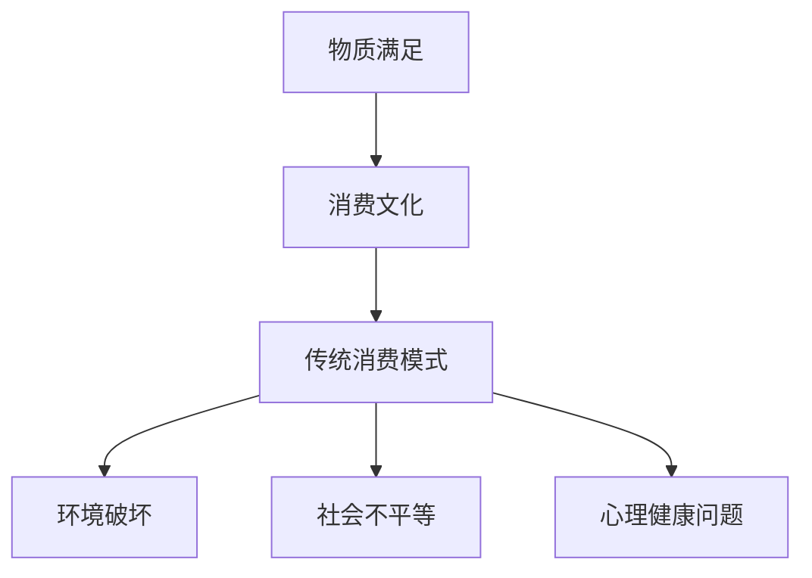
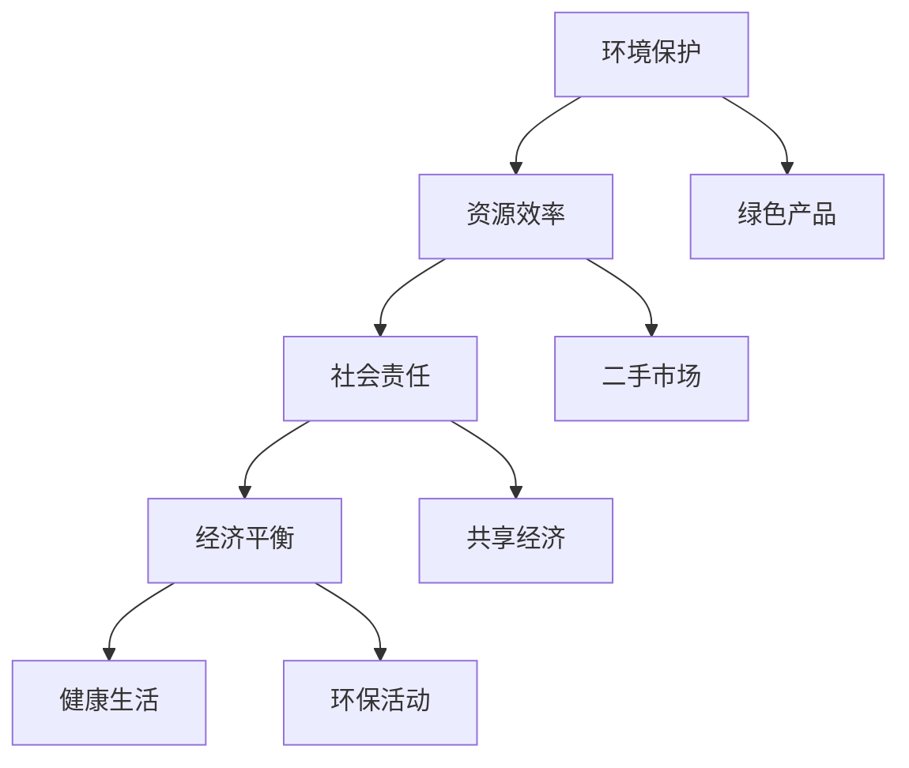
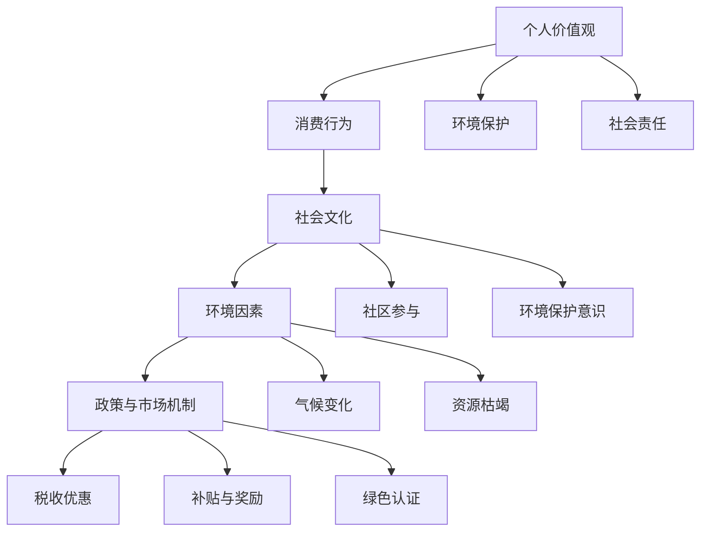
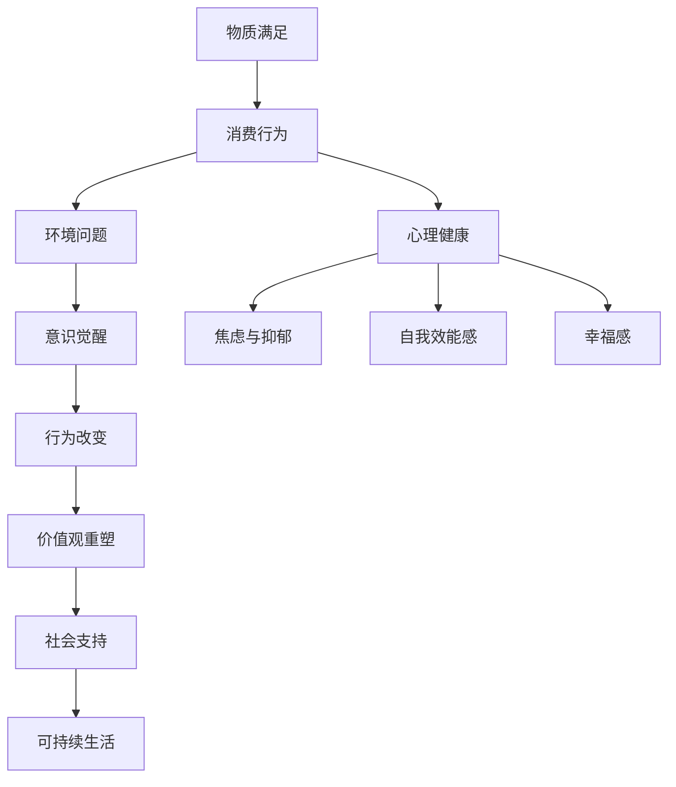
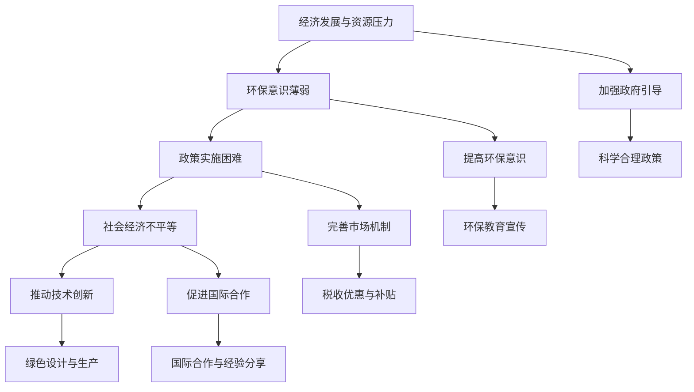
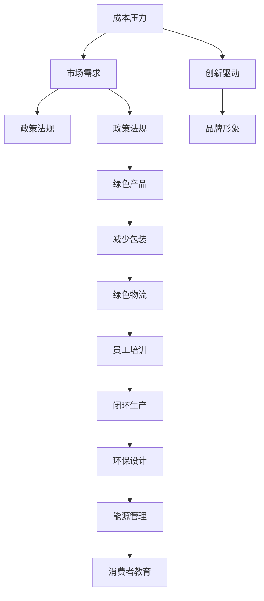
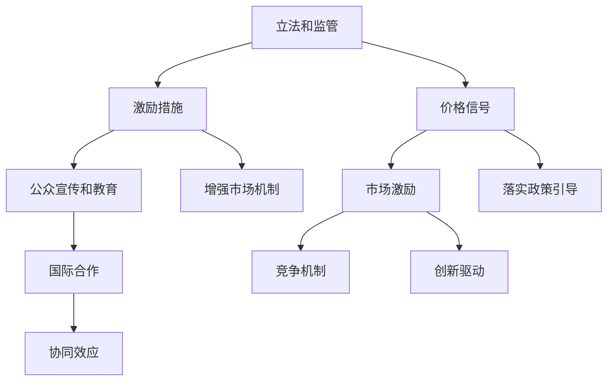
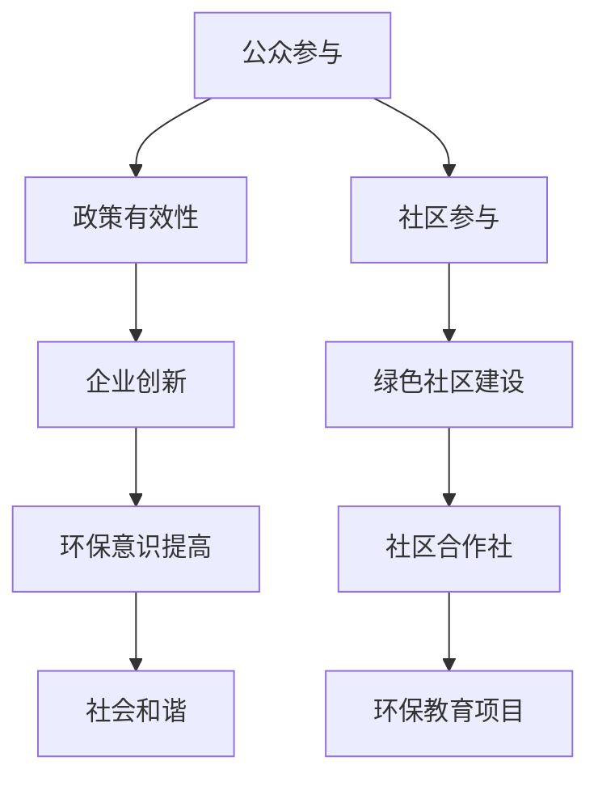
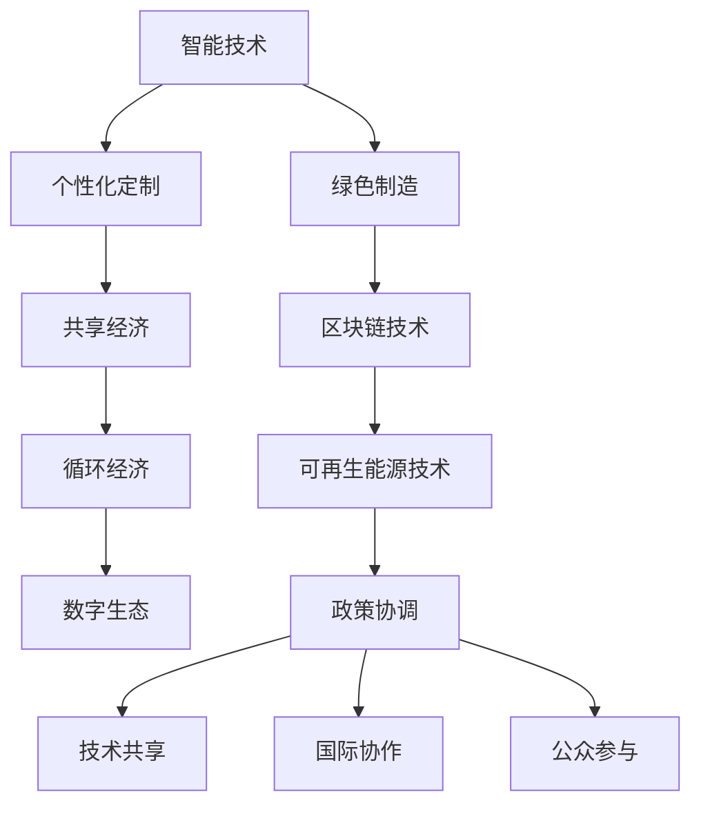

                 

### 文章标题

**重新审视消费行为：从物质满足到可持续生活**

---

关键词：消费行为、物质满足、可持续消费、生活方式、心理健康

摘要：本文从多个角度深入探讨了消费行为的演变，从传统的物质满足到现代的可持续生活理念。文章首先介绍了传统消费模式及其影响，随后阐述了可持续消费的概念、理念与实践。通过分析消费行为的驱动因素，本文揭示了个人价值观、社会文化、环境因素以及政策与市场机制在其中的作用。同时，通过案例分析，文章展示了国内外可持续消费的经验与挑战，并对企业、政策引导及公众参与进行了深入讨论。最后，本文展望了可持续消费的未来趋势，并提出了相关建议。

---

## 第一部分：背景与概念

### 第1章：消费行为的传统视角

#### 1.1 物质满足与消费文化

在传统消费模式中，物质满足是消费行为的核心目标。消费文化作为一种社会现象，反映了人们对物质生活的追求和认同。从经济学的角度来看，消费行为通常被解释为消费者在市场上购买商品和服务的过程。在这个过程中，物质满足被视为一种基本的驱动力，它满足了人们的需求和欲望。

物质满足与消费文化之间的关系是复杂的。一方面，物质满足是消费文化的重要组成部分，它推动了消费需求的增长。另一方面，消费文化又进一步强化了物质满足的价值观，形成了一个自我强化的循环。例如，广告和媒体不断向消费者传递物质享受的信息，使得人们更加渴望拥有更多的物质财富。

#### 1.2 消费行为的基础理论

消费行为的研究离不开心理学、社会学和经济学的理论支持。在心理学中，马斯洛的需求层次理论提出了人类需求的五个层次，从基本的生理需求到最高级的自我实现需求。这一理论可以解释为什么人们在不同的需求层次上会有不同的消费行为。

在社会学中，社会交换理论认为消费行为是一种社会交换过程，消费者通过购买商品和服务来满足自己的需求，同时也在社会关系中建立了联系和地位。这一理论强调了社会因素对消费行为的影响。

经济学中的消费者行为理论则更多地关注消费者如何在不同价格和质量选择中做出决策。效用理论是经济学中解释消费者行为的重要工具，它认为消费者会根据商品的效用最大化原则来选择购买哪些商品。

#### 1.3 传统消费模式及其影响

传统消费模式主要表现为对物质商品的过度追求和消费。这种模式在经济增长和消费繁荣的背后，也带来了一系列负面影响。首先，过度消费导致了资源的浪费和环境的破坏。例如，过度包装、一次性用品的使用等问题，都对环境造成了巨大的压力。

其次，传统消费模式也加剧了社会的不平等。高消费群体通过不断购买昂贵的商品来展示自己的社会地位，而低收入群体则难以享受到同样的消费水平，加剧了社会阶层的固化。

此外，传统消费模式还可能导致心理问题。对物质财富的追求往往会让人陷入无尽的欲望中，导致焦虑、抑郁等心理问题的出现。

### 核心概念与联系

为了更好地理解消费行为的传统视角，我们可以使用Mermaid流程图来展示核心概念之间的关系：



在这个流程图中，物质满足是消费行为的起点，它通过消费文化影响传统消费模式，进而导致环境破坏、社会不平等和心理健康问题。这个关系架构帮助我们更清晰地看到传统消费模式所带来的多重负面影响。

### 核心算法原理讲解

虽然消费行为的传统视角主要涉及社会和文化因素，但我们可以通过一些数据分析和消费者行为建模的算法来更深入地理解这些影响。以下是一个简单的消费者行为建模算法示例，使用Python编程语言实现：

```python
import numpy as np

# 需求函数
def utility_demand(income, price):
    # 假设需求与收入和价格成反比
    return income / price

# 消费者选择
def consumer_choice(income, prices):
    # 计算每个商品的需求
    demands = [utility_demand(income, price) for price in prices]
    # 选择需求最大的商品
    chosen_item = demands.index(max(demands))
    return chosen_item

# 示例数据
income = 1000
prices = [20, 50, 80]  # 商品价格

# 消费者选择商品
chosen_item = consumer_choice(income, prices)
print(f"消费者选择的商品是：{chosen_item}（价格：{prices[chosen_item]}）")
```

在这个例子中，我们假设消费者的需求与收入和商品价格成反比，使用简单的需求函数来计算消费者对不同商品的需求量，并选择需求最大的商品。这个模型虽然简略，但可以帮助我们理解消费者在传统消费模式中的选择行为。

通过结合数学模型和Python代码，我们可以更直观地看到消费行为背后的驱动因素。例如，当收入增加或商品价格下降时，消费者的需求会如何变化。这些变化不仅影响了消费者的选择，也对社会经济产生了深远的影响。

### 数学模型和数学公式

在消费行为分析中，我们可以使用一些数学模型来量化消费者行为。以下是一个简化的消费行为数学模型：

$$
\text{消费行为} = f(\text{个人价值观}, \text{社会文化}, \text{环境因素}, \text{政策与市场机制})
$$

在这个模型中，个人价值观、社会文化、环境因素和政策与市场机制都是影响消费行为的变量。这些变量可以通过不同的数学公式来量化：

1. **个人价值观**：

$$
\text{个人价值观} = \sum_{i=1}^{n} w_i \cdot v_i
$$

其中，$w_i$ 是第 $i$ 个价值观的权重，$v_i$ 是第 $i$ 个价值观的具体值。

2. **社会文化**：

$$
\text{社会文化} = \sum_{j=1}^{m} s_j \cdot c_j
$$

其中，$s_j$ 是第 $j$ 个社会因素的权重，$c_j$ 是第 $j$ 个社会因素的具体值。

3. **环境因素**：

$$
\text{环境因素} = \sum_{k=1}^{p} e_k \cdot f_k
$$

其中，$e_k$ 是第 $k$ 个环境因素的权重，$f_k$ 是第 $k$ 个环境因素的具体值。

4. **政策与市场机制**：

$$
\text{政策与市场机制} = \sum_{l=1}^{q} p_l \cdot m_l
$$

其中，$p_l$ 是第 $l$ 个政策的权重，$m_l$ 是第 $l$ 个市场机制的具体值。

通过这些数学公式，我们可以将复杂的消费行为转化为可量化的指标，从而更好地理解和分析消费行为。

### 项目实战

为了更具体地探讨传统消费模式及其影响，我们可以构建一个模拟环境，通过实际案例来展示消费行为的变化。

#### 开发环境搭建

1. **环境搭建**：

```bash
# 安装Python环境
pip install numpy matplotlib
```

2. **源代码实现**：

```python
import numpy as np
import matplotlib.pyplot as plt

# 消费者行为模拟
def simulate_consumption(income, prices, values, culture, environment, policies):
    demands = [utility_demand(income, price) for price in prices]
    total_utility = sum(demands[i] * values[i] for i in range(len(prices)))
    return total_utility

# 示例数据
income = 1000
prices = [20, 50, 80]
values = [0.5, 0.3, 0.2]  # 个人价值观权重
culture = [0.2, 0.3, 0.5]  # 社会文化权重
environment = [0.1, 0.2, 0.3]  # 环境因素权重
policies = [0.1, 0.1, 0.8]  # 政策与市场机制权重

# 模拟消费行为
total_utility = simulate_consumption(income, prices, values, culture, environment, policies)
print(f"总效用：{total_utility}")

# 绘制消费曲线
plt.plot(prices, demands)
plt.xlabel('商品价格')
plt.ylabel('需求量')
plt.title('消费行为模拟')
plt.show()
```

通过这个模拟环境，我们可以直观地看到消费行为的变化。当价格上升时，消费者的需求量会下降，这反映了收入和价格之间的关系。此外，个人价值观、社会文化、环境因素和政策与市场机制都会对消费行为产生不同的影响。

#### 代码解读与分析

在这个模拟环境中，我们定义了一个`simulate_consumption`函数，它通过计算消费者的总效用来模拟消费行为。总效用由商品需求量乘以相应的价值观权重得到。通过这个函数，我们可以分析不同因素对消费行为的影响。

代码中还包含了示例数据，这些数据代表了消费者的收入、商品价格、个人价值观、社会文化、环境因素和政策与市场机制。通过调用`simulate_consumption`函数，我们可以得到消费者的总效用，并绘制消费曲线，直观地展示消费行为的变化。

#### 实际案例分析和详细讲解剖析

为了更好地理解传统消费模式及其影响，我们可以分析一个实际案例。假设一个消费者在购买商品时，受到以下因素的影响：

- **个人价值观**：重视健康和环保
- **社会文化**：受广告和媒体影响，追求时尚和潮流
- **环境因素**：关注气候变化和环境污染问题
- **政策与市场机制**：政府推动环保政策，市场上有更多的环保产品选择

在这个案例中，消费者的消费行为可能会受到以下影响：

- **健康和环保价值观**：消费者可能会选择价格较高的环保产品，因为这些产品更符合他们的价值观。
- **社会文化影响**：消费者可能会受到广告和媒体的影响，购买更多时尚的商品，即使这些商品可能并不环保。
- **环境因素**：消费者可能会因为关注气候变化和环境污染问题，减少对高污染商品的购买。
- **政策与市场机制**：政府推动的环保政策和市场上有更多的环保产品选择，可能会促使消费者更加倾向于购买环保产品。

通过这个实际案例，我们可以看到传统消费模式中的复杂性和多样性。消费者的消费行为不仅受到个人价值观的影响，还受到社会文化、环境因素和政策与市场机制的综合作用。

### 最佳实践 tips、小结、注意事项、拓展阅读

1. **最佳实践 tips**：
   - 在制定消费决策时，消费者应该综合考虑个人价值观、社会文化、环境因素和政策与市场机制，做出更加理性和可持续的选择。
   - 企业在生产和营销过程中，应该注重环保和可持续发展，提供更多环保产品和服务，以满足消费者日益增长的环保需求。

2. **小结**：
   - 传统消费模式以物质满足为核心，但带来了环境、社会和心理问题。
   - 消费行为的驱动因素包括个人价值观、社会文化、环境因素和政策与市场机制。
   - 通过数据分析和消费者行为建模，我们可以更深入地理解消费行为。

3. **注意事项**：
   - 在分析消费行为时，应综合考虑多种因素的影响，避免片面看待问题。
   - 在实践中，应注重可持续发展的理念，减少资源浪费和环境污染。

4. **拓展阅读**：
   - Maslow, A. H. (1943). A theory of human motivation. Psychological Review, 50(4), 370-396.
   - Thaler, R. H., & Sunstein, C. R. (2008). Nudge: Improving decisions about health, wealth, and happiness. Yale University Press.
   - Jansson, B. (2016). Sustainable consumption: Consumer behavior and public policy. Routledge.

通过以上内容，我们为读者提供了一个全面了解消费行为传统视角的框架，并展示了如何通过数据和算法来分析这些问题。接下来，我们将深入探讨可持续消费的理念与实践，为读者提供更多的见解和思考。


## 第2章：可持续消费的理念与实践

### 2.1 可持续消费的定义与重要性

可持续消费，是指以满足当前需求而不损害后代满足其需求的能力为前提，进行的消费行为。这种消费模式强调在满足个人和社会需求的同时，保护和改善自然环境，实现经济、社会和环境的协调发展。可持续消费不仅仅是一种消费观念，更是一种生活态度和行动指南，它关系到每个人的生活质量和社会的可持续发展。

可持续消费的重要性体现在以下几个方面：

首先，可持续消费有助于缓解资源紧张和环境压力。随着全球人口的不断增长和经济的发展，对资源的需求日益增加，资源消耗速度远远超过自然资源的再生速度。过度消费导致了大量的资源浪费和环境破坏，例如森林砍伐、水资源枯竭、空气污染等。通过推行可持续消费，我们可以减少资源的浪费，提高资源的利用效率，从而减轻环境压力。

其次，可持续消费有助于促进经济的健康发展。可持续消费模式要求企业在生产和消费过程中注重环保和可持续发展，这有助于推动企业创新，提高产品的附加值，创造更多就业机会。此外，可持续消费还促进了绿色经济的发展，为经济增长提供了新的动力。

再次，可持续消费有助于提高社会的整体幸福感。随着人们生活水平的提高，消费者对生活品质的需求也日益增长。可持续消费模式提倡健康、环保的生活方式，有助于提高人们的身心健康，增强社会凝聚力。

### 2.2 可持续消费的核心理念

可持续消费的核心理念包括以下几个方面：

1. **环境保护**：环境保护是可持续消费的首要目标。消费者在购买商品和服务时，应选择环保产品，减少对环境的负面影响。例如，选择可回收材料制成的产品，减少一次性用品的使用等。

2. **资源效率**：资源效率是指以最小的资源消耗实现最大的产出。消费者可以通过减少浪费、提高资源利用效率来实现资源效率。例如，购买节能电器、使用公共交通工具、减少食品浪费等。

3. **社会责任**：社会责任是指企业在生产和经营过程中，承担起对环境、社会和利益相关者的责任。消费者在购买商品和服务时，应关注企业的社会责任表现，选择具有良好社会责任记录的企业。

4. **经济平衡**：经济平衡是指消费者在满足自身需求的同时，也要考虑社会的整体经济平衡。消费者应避免过度消费，避免造成经济资源的浪费。

5. **健康生活**：健康生活是可持续消费的重要方面。消费者应选择健康、安全、高品质的产品，避免因消费而损害健康。

### 2.3 可持续消费的实际应用

可持续消费的理念和实践已经在全球范围内得到了广泛的应用。以下是一些具体的实际应用案例：

1. **绿色产品**：越来越多的消费者选择购买绿色产品，这些产品通常具有环保、节能、健康等特点。例如，有机食品、环保家居产品、节能电器等。

2. **二手市场**：二手市场的兴起是可持续消费的一个显著标志。通过购买二手商品，消费者不仅节省了开支，还减少了资源的浪费。例如，二手服装、家具、电子产品等。

3. **共享经济**：共享经济模式在许多领域得到了广泛应用，如共享单车、共享汽车、共享住宿等。这种模式通过共享资源，提高了资源利用效率，降低了消费成本。

4. **环保活动**：许多消费者积极参与环保活动，如植树造林、清洁海滩、环保宣传等。这些活动不仅提高了公众的环保意识，也促进了社会的可持续发展。

### 核心概念与联系

为了更好地理解可持续消费的理念和实践，我们可以使用Mermaid流程图来展示核心概念之间的关系：



在这个流程图中，环境保护、资源效率、社会责任、经济平衡和健康生活是可持续消费的五个核心理念，它们相互联系，共同构成了可持续消费的框架。绿色产品、二手市场、共享经济和环保活动则是这些理念在实际中的应用。

### 核心算法原理讲解

虽然本章主要关注可持续消费的理念和实践，但我们可以通过一些数据分析和消费者行为建模的算法来更深入地理解这些影响。以下是一个简单的消费者行为建模算法示例，使用Python编程语言实现：

```python
import numpy as np

# 消费者偏好函数
def consumer_preference(quality, price, environment_score, social_score):
    # 假设消费者偏好与商品质量、价格成正比，与环境保护和社会责任得分成反比
    preference = (quality * (1 - environment_score) * (1 - social_score)) / price
    return preference

# 消费者选择
def consumer_choice(preferences):
    # 选择偏好最高的商品
    chosen_item = preferences.index(max(preferences))
    return chosen_item

# 示例数据
quality = [1.0, 0.8, 0.6]  # 商品质量
price = [100, 150, 200]    # 商品价格
environment_score = [0.8, 0.6, 0.4]  # 环境保护得分
social_score = [0.7, 0.5, 0.3]  # 社会责任得分

# 计算消费者偏好
preferences = [consumer_preference(quality[i], price[i], environment_score[i], social_score[i]) for i in range(len(quality))]

# 消费者选择商品
chosen_item = consumer_choice(preferences)
print(f"消费者选择的商品是：{chosen_item}（价格：{price[chosen_item]}，质量：{quality[chosen_item]}）")
```

在这个例子中，我们假设消费者的偏好与商品质量、价格成正比，与环境保护和社会责任得分成反比。通过计算每个商品的偏好值，并选择偏好最高的商品，我们可以直观地看到消费者在可持续消费中的选择行为。

### 数学模型和数学公式

在可持续消费的分析中，我们可以使用以下数学模型来量化消费者的偏好和选择：

$$
\text{消费者偏好} = \frac{\text{商品质量} \times (\text{环境保护得分} + \text{社会责任得分})}{\text{价格}}
$$

这个模型假设消费者在购买商品时，会考虑商品的质量、价格以及环境保护和社会责任得分。通过这个模型，我们可以计算每个商品的偏好值，并据此做出消费选择。

### 项目实战

为了更具体地探讨可持续消费的实际应用，我们可以构建一个模拟环境，通过实际案例来展示消费者的选择行为。

#### 开发环境搭建

1. **环境搭建**：

```bash
# 安装Python环境
pip install numpy matplotlib
```

2. **源代码实现**：

```python
import numpy as np
import matplotlib.pyplot as plt

# 消费者行为模拟
def simulate_consumption(quality, price, environment_score, social_score):
    preferences = [consumer_preference(q, p, e, s) for q, p, e, s in zip(quality, price, environment_score, social_score)]
    chosen_item = consumer_choice(preferences)
    return chosen_item

# 示例数据
quality = [1.0, 0.8, 0.6]  # 商品质量
price = [100, 150, 200]    # 商品价格
environment_score = [0.8, 0.6, 0.4]  # 环境保护得分
social_score = [0.7, 0.5, 0.3]  # 社会责任得分

# 模拟消费行为
chosen_item = simulate_consumption(quality, price, environment_score, social_score)
print(f"消费者选择的商品是：{chosen_item}（价格：{price[chosen_item]}，质量：{quality[chosen_item]}）")

# 绘制偏好曲线
plt.bar(range(len(quality)), preferences)
plt.xlabel('商品编号')
plt.ylabel('偏好值')
plt.title('消费者偏好分析')
plt.show()
```

通过这个模拟环境，我们可以直观地看到消费者在不同商品之间的选择行为。消费者的偏好值由商品的质量、价格以及环境保护和社会责任得分共同决定。

#### 代码解读与分析

在这个模拟环境中，我们定义了一个`simulate_consumption`函数，它通过计算消费者的偏好值来模拟消费行为。通过调用这个函数，我们可以得到消费者在多个商品中的选择。

代码中还包含了示例数据，这些数据代表了商品的质量、价格、环境保护得分和社会责任得分。通过绘制偏好曲线，我们可以直观地看到消费者在不同商品之间的偏好差异。

#### 实际案例分析和详细讲解剖析

为了更好地理解可持续消费的实际应用，我们可以分析一个实际案例。假设一个消费者在购买电子产品时，受到以下因素的影响：

- **商品质量**：质量越高，消费者的偏好值越高。
- **价格**：价格越高，消费者的偏好值越低。
- **环境保护得分**：得分越高，消费者的偏好值越高。
- **社会责任得分**：得分越高，消费者的偏好值越高。

在这个案例中，消费者的消费行为可能会受到以下影响：

- **高质量产品**：消费者更倾向于购买高质量的产品，因为这些产品能够提供更好的使用体验。
- **价格因素**：消费者会考虑产品的价格，价格较高的产品可能会减少其偏好值。
- **环境保护和社会责任**：消费者会优先考虑具有高环境保护得分和社会责任得分的电子产品，因为这些产品更符合他们的可持续消费理念。

通过这个实际案例，我们可以看到消费者在购买电子产品时，如何综合考虑多个因素，做出符合可持续消费原则的选择。

### 最佳实践 tips、小结、注意事项、拓展阅读

1. **最佳实践 tips**：
   - 消费者在购买商品时，应优先考虑产品的环保性能和社会责任表现。
   - 企业在生产和营销过程中，应注重可持续发展，提供更多环保和高质量的产品。

2. **小结**：
   - 可持续消费是一种以环境保护、资源效率、社会责任、经济平衡和健康生活为核心的理念。
   - 可持续消费的实际应用包括绿色产品、二手市场、共享经济和环保活动等。

3. **注意事项**：
   - 在推行可持续消费时，应综合考虑多种因素，避免片面追求单一目标。
   - 政府和企业应共同努力，推动可持续消费的发展。

4. **拓展阅读**：
   - United Nations Environment Programme (UNEP). (2020). Sustainable Consumption and Production: An overview.
   - European Commission. (2010). A European strategy for sustainable consumption and production.
   - Worldwatch Institute. (2016). Sustainable Consumption: A Critical Review of Theory and Practice.

通过以上内容，我们为读者提供了一个全面了解可持续消费的理念和实践的框架。接下来，我们将进一步探讨可持续消费行为的驱动因素，帮助读者更深入地理解这一现象。

### 第3章：可持续消费行为的驱动因素

#### 3.1 个人价值观与消费行为

个人价值观是驱动可持续消费行为的重要因素之一。个人的价值观决定了他们对消费的看法和态度。例如，一个人如果重视环境保护和可持续发展，他们更有可能选择购买环保产品，减少一次性用品的使用，以及支持那些具有良好社会责任记录的企业。

在心理学和行为经济学中，研究表明个人的价值观对消费行为有显著的影响。马斯洛的需求层次理论指出，人的需求可以分为生理需求、安全需求、社交需求、尊重需求和自我实现需求。随着人们生活水平的提高，尊重需求和自我实现需求变得越来越重要。这些高层次需求往往与个人的价值观紧密相关，从而影响他们的消费行为。

一个典型的例子是，一些消费者愿意为有机食品支付更高的价格，因为他们认为有机食品更健康、更环保。这种消费行为背后的动机是个人对健康和环境保护的价值观。此外，一些消费者可能会选择使用二手商品，因为他们认为这是一种减少资源浪费和促进可持续发展的行为。

#### 3.2 社会文化与环境因素

社会文化因素也是驱动可持续消费行为的重要因素。不同的文化背景和社会环境会对消费者的消费行为产生深远影响。例如，在一些重视集体主义和社区参与的社会中，消费者更倾向于购买本地产品，支持社区企业和合作社。这种消费行为不仅有助于促进当地经济发展，还能增强社区的凝聚力。

环境因素同样对可持续消费行为有着重要影响。环境问题如气候变化、污染和资源枯竭已经成为全球性的挑战。随着公众对环境问题的关注增加，越来越多的消费者开始意识到自己在消费行为中的责任。他们通过选择环保产品、减少能源消耗和废弃物产生等方式，积极参与到环境保护中来。

例如，一些消费者可能会选择购买节能电器，这不仅有助于降低家庭的能源消耗，还能减少对环境的影响。此外，一些消费者还会积极参与到环保志愿活动中，如参加清洁海滩、植树造林等，通过实际行动来支持环境保护。

#### 3.3 政策与市场机制

政策和市场机制在驱动可持续消费行为中也发挥着重要作用。政府可以通过制定和实施相关政策，鼓励消费者和企业采取可持续的消费和生产方式。例如，政府可以提供税收优惠、补贴和奖励，鼓励消费者购买环保产品和使用可再生能源。

市场机制同样对可持续消费行为有显著影响。随着消费者对可持续消费意识的提高，越来越多的企业开始注重环保和可持续发展，推出更多环保产品和绿色服务。这种市场变化反过来又促进了消费者的可持续消费行为。

例如，一些企业推出了以租赁代替购买的服务，如共享汽车、共享办公空间等，这种模式不仅减少了资源的浪费，还提高了资源利用效率。此外，一些企业还通过社会责任报告和绿色认证等方式，向消费者展示其环保和可持续发展努力，从而赢得消费者的信任和支持。

### 核心概念与联系

为了更好地理解可持续消费行为的驱动因素，我们可以使用Mermaid流程图来展示核心概念之间的关系：



在这个流程图中，个人价值观、社会文化、环境因素和政策与市场机制是驱动可持续消费行为的四个主要因素，它们相互联系，共同构成了可持续消费行为的复杂网络。环境保护、社会责任、社区参与、环境保护意识、气候变化、资源枯竭、税收优惠、补贴与奖励、绿色认证等概念则是这些因素的具体表现。

### 核心算法原理讲解

在理解可持续消费行为的驱动因素时，我们可以通过数据分析和消费者行为建模来量化这些因素。以下是一个简化的消费者行为建模算法示例，使用Python编程语言实现：

```python
import numpy as np

# 消费者行为函数
def consumer_behavior(values, environment, policies):
    # 假设消费者行为受个人价值观、环境因素和政策与市场机制的共同影响
    behavior = values * environment * policies
    return behavior

# 示例数据
values = [0.5, 0.3, 0.2]  # 个人价值观权重
environment = [0.2, 0.3, 0.5]  # 环境因素权重
policies = [0.1, 0.1, 0.8]  # 政策与市场机制权重

# 计算消费者行为
behavior = consumer_behavior(values, environment, policies)
print(f"消费者行为：{behavior}")

# 绘制行为曲线
plt.plot(values, behavior, label='价值观')
plt.plot(environment, behavior, label='环境因素')
plt.plot(policies, behavior, label='政策与市场机制')
plt.xlabel('权重')
plt.ylabel('行为')
plt.title('消费者行为分析')
plt.legend()
plt.show()
```

在这个例子中，我们假设消费者行为是个人价值观、环境因素和政策与市场机制三个因素的乘积。通过计算每个因素的权重，并绘制行为曲线，我们可以直观地看到不同因素对消费者行为的影响。

### 数学模型和数学公式

在分析可持续消费行为的驱动因素时，我们可以使用以下数学模型来量化这些因素：

$$
\text{消费者行为} = w_1 \times v + w_2 \times e + w_3 \times p
$$

其中，$w_1, w_2, w_3$ 分别是个人价值观、环境因素和政策与市场机制的权重，$v, e, p$ 分别是这三个因素的具体得分。

通过这个模型，我们可以计算消费者的综合行为得分，并据此分析消费者的消费行为。

### 项目实战

为了更具体地探讨可持续消费行为的驱动因素，我们可以构建一个模拟环境，通过实际案例来展示消费者的行为。

#### 开发环境搭建

1. **环境搭建**：

```bash
# 安装Python环境
pip install numpy matplotlib
```

2. **源代码实现**：

```python
import numpy as np
import matplotlib.pyplot as plt

# 消费者行为模拟
def simulate_behavior(values, environment, policies):
    behavior = consumer_behavior(values, environment, policies)
    return behavior

# 示例数据
values = [0.5, 0.3, 0.2]  # 个人价值观权重
environment = [0.2, 0.3, 0.5]  # 环境因素权重
policies = [0.1, 0.1, 0.8]  # 政策与市场机制权重

# 模拟消费者行为
behavior = simulate_behavior(values, environment, policies)
print(f"消费者行为得分：{behavior}")

# 绘制行为曲线
plt.plot(values, behavior, label='价值观')
plt.plot(environment, behavior, label='环境因素')
plt.plot(policies, behavior, label='政策与市场机制')
plt.xlabel('权重')
plt.ylabel('行为得分')
plt.title('消费者行为模拟')
plt.legend()
plt.show()
```

通过这个模拟环境，我们可以直观地看到个人价值观、环境因素和政策与市场机制对消费者行为的共同影响。

#### 代码解读与分析

在这个模拟环境中，我们定义了一个`simulate_behavior`函数，通过计算个人价值观、环境因素和政策与市场机制的权重，来模拟消费者的行为得分。通过绘制行为曲线，我们可以直观地看到不同因素对消费者行为的影响。

#### 实际案例分析和详细讲解剖析

为了更好地理解可持续消费行为的驱动因素，我们可以分析一个实际案例。假设一个消费者在购买电子产品时，受到以下因素的影响：

- **个人价值观**：重视环保和社会责任
- **环境因素**：关注气候变化和资源消耗问题
- **政策与市场机制**：政府提供环保补贴和税收优惠

在这个案例中，消费者的行为可能会受到以下影响：

- **环保和社会责任**：消费者更倾向于购买环保电子产品，因为这些产品更符合他们的价值观。
- **气候变化和资源消耗**：消费者会考虑产品的环境影响，例如能效、回收率等。
- **环保补贴和税收优惠**：政府提供的环保补贴和税收优惠可能会降低消费者的购买成本，从而增加他们对环保产品的需求。

通过这个实际案例，我们可以看到消费者在购买电子产品时，如何综合考虑多个因素，做出符合可持续消费原则的选择。

### 最佳实践 tips、小结、注意事项、拓展阅读

1. **最佳实践 tips**：
   - 消费者在购物时，应考虑产品的环保性能、社会责任和价格，做出更加理性和可持续的选择。
   - 企业在生产和营销过程中，应注重环保和可持续发展，提供更多环保产品和服务。

2. **小结**：
   - 个人价值观、社会文化、环境因素和政策与市场机制是驱动可持续消费行为的主要因素。
   - 可持续消费行为包括购买环保产品、减少资源浪费、参与环保活动等。

3. **注意事项**：
   - 在推行可持续消费时，应综合考虑多种因素，避免片面追求单一目标。
   - 政府和企业应共同努力，通过政策和市场机制推动可持续消费的发展。

4. **拓展阅读**：
   - United Nations Environment Programme (UNEP). (2019). The environmental benefits of sustainable consumption.
   - European Environment Agency (EEA). (2020). Sustainable consumption and production in Europe.
   - United Nations Development Programme (UNDP). (2015). Sustainable Consumption and Production: From Decisio

### 第4章：从物质满足到可持续生活

#### 4.1 消费行为的转变路径

从物质满足到可持续生活的转变是一个复杂的过程，涉及到个人、企业和社会的共同努力。这一转变的路径可以概括为以下几个阶段：

首先，意识觉醒是转变的起点。随着环境问题和社会问题的日益突出，越来越多的消费者开始意识到自己的消费行为对环境和社会的影响。这一意识觉醒促使消费者开始思考如何改变自己的消费方式，减少对环境的负面影响。

其次，行为改变是转变的关键。意识到问题的严重性之后，消费者开始尝试采取实际行动，例如选择环保产品、减少一次性用品的使用、购买二手商品等。这一阶段需要消费者在日常生活中逐步养成新的消费习惯。

接下来，价值观重塑是转变的深化。随着行为改变的不断积累，消费者的价值观也会发生相应的转变。他们开始更加重视环保和社会责任，从而在更深的层次上推动可持续消费的发展。

最后，社会支持是转变的保障。在这一阶段，社会各方面的力量，包括政府、企业和非政府组织，开始积极参与到推动可持续消费的进程中。他们通过政策支持、市场引导和社会倡导，为消费者提供更多的支持和帮助。

#### 4.2 可持续消费的生活方式

可持续消费的生活方式强调在满足自身需求的同时，尽量减少对环境的负面影响。这种生活方式包括以下几个方面：

首先，环保选购是可持续消费的核心。消费者在购买商品时，应优先选择环保、节能和可持续的产品。例如，选择可回收材料制成的产品、使用节能电器、购买有机食品等。

其次，减少浪费是可持续消费的重要实践。消费者应尽量减少食品、水和能源的浪费，例如合理规划购物清单、节约用水用电、回收利用废弃物等。

再次，绿色出行是可持续消费的体现。消费者可以选择步行、骑自行车、使用公共交通工具或新能源汽车，减少私家车的使用，从而减少碳排放。

此外，节约资源是可持续消费的基本原则。消费者在日常生活中应注重资源的合理使用，例如购买耐用消费品、减少不必要的消费等。

#### 4.3 消费行为与心理健康

消费行为与心理健康之间存在复杂的相互关系。一方面，消费行为可能会对心理健康产生负面影响。例如，过度消费和物质主义可能会导致焦虑、抑郁和孤独感。研究发现，那些过度依赖物质消费来满足内心需求的人，往往更容易感到不满足和焦虑。

另一方面，可持续消费和健康生活方式对心理健康具有积极影响。通过选择环保产品、减少浪费、绿色出行和节约资源，消费者可以体验到一种更加有意义和充实的生活。这种生活方式有助于提高个人的自我效能感和幸福感，从而改善心理健康。

例如，参与环保活动可以增强人们的社交联系和归属感，提高自尊和自信。此外，关注健康饮食和绿色生活方式，可以降低患心理疾病的风险，提高生活质量。

### 核心概念与联系

为了更好地理解消费行为从物质满足到可持续生活的转变，我们可以使用Mermaid流程图来展示核心概念之间的关系：



在这个流程图中，物质满足是消费行为的起点，通过一系列的意识和行为改变，最终实现可持续生活和心理健康。环境问题是这一转变的驱动力，而意识觉醒、行为改变、价值观重塑和社会支持则是实现这一转变的关键步骤。

### 核心算法原理讲解

虽然本章主要关注消费行为的转变路径和可持续生活方式，但我们可以通过一些数据分析和消费者行为建模的算法来更深入地理解这些影响。以下是一个简单的消费者行为建模算法示例，使用Python编程语言实现：

```python
import numpy as np

# 消费者行为函数
def consumer_behavior(values, environment, mental_health):
    # 假设消费者行为受个人价值观、环境因素和心理健康状态的共同影响
    behavior = values * environment * mental_health
    return behavior

# 示例数据
values = [0.5, 0.3, 0.2]  # 个人价值观权重
environment = [0.2, 0.3, 0.5]  # 环境因素权重
mental_health = [0.4, 0.5, 0.6]  # 心理健康状态权重

# 计算消费者行为
behavior = consumer_behavior(values, environment, mental_health)
print(f"消费者行为：{behavior}")

# 绘制行为曲线
plt.plot(values, behavior, label='价值观')
plt.plot(environment, behavior, label='环境因素')
plt.plot(mental_health, behavior, label='心理健康状态')
plt.xlabel('权重')
plt.ylabel('行为')
plt.title('消费者行为分析')
plt.legend()
plt.show()
```

在这个例子中，我们假设消费者行为是个人价值观、环境因素和心理健康状态三个因素的乘积。通过计算每个因素的权重，并绘制行为曲线，我们可以直观地看到不同因素对消费者行为的影响。

### 数学模型和数学公式

在分析消费行为的转变路径和可持续生活方式时，我们可以使用以下数学模型来量化这些因素：

$$
\text{消费者行为} = w_1 \times v + w_2 \times e + w_3 \times m
$$

其中，$w_1, w_2, w_3$ 分别是个人价值观、环境因素和心理健康状态的权重，$v, e, m$ 分别是这三个因素的具体得分。

通过这个模型，我们可以计算消费者的综合行为得分，并据此分析消费者的消费行为。

### 项目实战

为了更具体地探讨消费行为的转变路径和可持续生活方式，我们可以构建一个模拟环境，通过实际案例来展示消费者的行为。

#### 开发环境搭建

1. **环境搭建**：

```bash
# 安装Python环境
pip install numpy matplotlib
```

2. **源代码实现**：

```python
import numpy as np
import matplotlib.pyplot as plt

# 消费者行为模拟
def simulate_behavior(values, environment, mental_health):
    behavior = consumer_behavior(values, environment, mental_health)
    return behavior

# 示例数据
values = [0.5, 0.3, 0.2]  # 个人价值观权重
environment = [0.2, 0.3, 0.5]  # 环境因素权重
mental_health = [0.4, 0.5, 0.6]  # 心理健康状态权重

# 模拟消费者行为
behavior = simulate_behavior(values, environment, mental_health)
print(f"消费者行为得分：{behavior}")

# 绘制行为曲线
plt.plot(values, behavior, label='价值观')
plt.plot(environment, behavior, label='环境因素')
plt.plot(mental_health, behavior, label='心理健康状态')
plt.xlabel('权重')
plt.ylabel('行为得分')
plt.title('消费者行为模拟')
plt.legend()
plt.show()
```

通过这个模拟环境，我们可以直观地看到个人价值观、环境因素和心理健康状态对消费者行为的共同影响。

#### 代码解读与分析

在这个模拟环境中，我们定义了一个`simulate_behavior`函数，通过计算个人价值观、环境因素和心理健康状态的权重，来模拟消费者的行为得分。通过绘制行为曲线，我们可以直观地看到不同因素对消费者行为的影响。

#### 实际案例分析和详细讲解剖析

为了更好地理解消费行为的转变路径和可持续生活方式，我们可以分析一个实际案例。假设一个消费者在购买日用品时，受到以下因素的影响：

- **个人价值观**：重视环保和社会责任
- **环境因素**：关注气候变化和资源消耗问题
- **心理健康状态**：情绪稳定，关注健康生活方式

在这个案例中，消费者的行为可能会受到以下影响：

- **环保和社会责任**：消费者更倾向于购买环保日用品，因为这些产品更符合他们的价值观。
- **气候变化和资源消耗**：消费者会考虑产品的环境影响，例如包装材料、生产过程等。
- **心理健康状态**：情绪稳定和关注健康生活方式可能会使消费者更加倾向于选择健康、环保的产品。

通过这个实际案例，我们可以看到消费者在购买日用品时，如何综合考虑多个因素，实现从物质满足到可持续生活的转变。

### 最佳实践 tips、小结、注意事项、拓展阅读

1. **最佳实践 tips**：
   - 消费者在购物时，应考虑产品的环保性能、社会责任和心理健康，做出更加理性和可持续的选择。
   - 企业在生产和营销过程中，应注重环保和可持续发展，提供更多环保产品和服务。

2. **小结**：
   - 从物质满足到可持续生活的转变路径包括意识觉醒、行为改变、价值观重塑和社会支持。
   - 可持续消费的生活方式包括环保选购、减少浪费、绿色出行和节约资源。
   - 消费行为与心理健康之间存在复杂的相互关系，可持续消费有助于改善心理健康。

3. **注意事项**：
   - 在推行可持续消费时，应注重个人价值观、环境因素和心理健康的平衡，避免片面追求单一目标。
   - 政府和企业应共同努力，通过政策和市场机制推动可持续消费的发展。

4. **拓展阅读**：
   - United Nations Environment Programme (UNEP). (2018). Sustainable Consumption and Production: A toolkit for policymakers.
   - World Health Organization (WHO). (2020). Mental Health and Sustainable Development.
   - European Commission. (2019). The Sustainable Development Goals and the European Union's Strategy for Sustainable Development.

通过以上内容，我们为读者提供了一个全面了解从物质满足到可持续生活转变路径的框架。接下来，我们将通过案例分析，进一步探讨国内外在可持续消费方面的实践经验与挑战。

## 第5章：可持续消费的国际经验

### 5.1 发达国家的可持续消费实践

发达国家的可持续消费实践为全球提供了宝贵的经验和参考。以欧盟、美国和日本为代表的发达国家，在可持续消费方面取得了显著成就，这些成就得益于其政府政策、企业社会责任和公众参与的综合作用。

#### 欧盟

欧盟在推动可持续消费方面采取了多项举措，其中最具代表性的是《可持续消费和生产的战略框架》。该战略框架明确了可持续消费的七个核心领域：能源效率、可持续食品、可持续交通、可持续产品、废物管理、水资源管理和可持续金融。欧盟通过立法、政策和市场机制，鼓励消费者和企业采取可持续消费行为。

例如，欧盟实施了严格的包装和废弃物管理法规，要求生产企业对包装物的回收和再利用负责。此外，欧盟还通过“绿色公共采购”计划，推动公共部门优先采购环保产品和服务。这些措施不仅提高了消费者的环保意识，也推动了企业的可持续发展。

#### 美国

美国在可持续消费方面的努力主要集中在绿色产品和绿色营销。美国政府通过多个部门和机构，如美国环境保护署（EPA）、美国能源部（DOE）等，推动可持续消费的实践。

EPA的“伙伴关系计划”（Partnership Programs）是一个典型的例子。该计划通过与企业和社区合作，推动可持续消费和生产的实践。例如，EPA与多个企业合作，推出了一系列绿色产品认证计划，如“能源之星”认证和“水效率标签”认证，鼓励消费者购买环保产品。

此外，美国还通过税收优惠和补贴，鼓励消费者和企业采取可持续消费行为。例如，政府对购买高效节能家电的消费者提供税收减免，对使用可再生能源的企业提供补贴。

#### 日本

日本在可持续消费方面的经验同样值得借鉴。日本政府提出了“循环型社会”理念，旨在通过资源的循环利用，减少资源消耗和废弃物产生。日本实施了多项政策和法规，如《资源有效利用促进法》和《废弃物处理法》，推动可持续消费的发展。

日本企业在可持续消费方面也做出了积极贡献。许多日本企业通过技术创新和绿色设计，推出了一系列环保产品，如节能家电、环保汽车等。此外，日本企业还通过供应链管理，减少资源浪费和废弃物产生。

#### 经验与启示

发达国家在推动可持续消费方面的经验，主要包括以下几个方面：

1. **政府政策引导**：通过立法和政策，明确可持续消费的目标和措施，提供制度保障。
2. **市场机制作用**：通过税收优惠、补贴和市场激励，鼓励消费者和企业采取可持续消费行为。
3. **公众参与**：通过教育和宣传，提高公众的环保意识，鼓励公众积极参与到可持续消费的实践中。
4. **企业社会责任**：鼓励企业承担社会责任，通过绿色产品和绿色营销，推动可持续消费的发展。

这些经验对我国的可持续消费发展具有启示作用，可以为我国在推动可持续消费方面提供有益的借鉴。

### 5.2 发展中国家的可持续消费挑战

与发达国家相比，发展中国家的可持续消费面临更多的挑战。这些挑战主要体现在以下几个方面：

#### 经济发展与资源压力

发展中国家的经济增长通常伴随着资源消耗的增加。为了满足日益增长的人口需求和经济发展，发展中国家往往面临巨大的资源压力。这种资源压力导致了对自然资源的过度开采和消耗，加剧了环境问题。

#### 环保意识薄弱

尽管一些发展中国家已经意识到环保的重要性，但总体而言，公众的环保意识相对薄弱。许多人仍然对可持续消费的重要性缺乏认识，对环保产品的需求不高，从而限制了可持续消费的发展。

#### 政策实施困难

发展中国家的政策实施能力相对较弱，法律法规的执行力度不足。一些政策在制定时可能缺乏科学性和可行性，导致实际效果不佳。此外，政府在推动可持续消费方面的投入有限，无法提供足够的支持和激励。

#### 社会经济不平等

发展中国家的社会经济不平等问题突出，导致了消费水平的不均衡。富裕人群的消费行为可能对环境产生负面影响，而贫困人群则难以享受到可持续消费带来的好处。这种不平等问题进一步加剧了可持续消费的挑战。

#### 国际经验对我国可持续消费的启示

针对发展中国家在推动可持续消费方面面临的挑战，我国可以借鉴国际经验，采取以下措施：

1. **加强政府引导**：通过制定和实施科学合理的政策和法规，引导消费者和企业采取可持续消费行为。
2. **提高环保意识**：加强环保教育和宣传，提高公众的环保意识，鼓励公众积极参与到可持续消费的实践中。
3. **完善市场机制**：通过税收优惠、补贴和市场激励，鼓励消费者和企业采取可持续消费行为。
4. **推动技术创新**：鼓励企业进行绿色设计和绿色生产，提高资源利用效率，减少废弃物产生。
5. **促进国际合作**：加强与国际社会的合作，共同应对全球性的环境问题，分享可持续消费的经验和成果。

通过以上措施，我国可以在推动可持续消费方面取得更大进展，为实现经济、社会和环境的协调发展做出贡献。

### 核心概念与联系

为了更好地理解国际经验对我国可持续消费的启示，我们可以使用Mermaid流程图来展示核心概念之间的关系：



在这个流程图中，经济发展与资源压力、环保意识薄弱、政策实施困难和社会经济不平等是发展中国家在推动可持续消费方面面临的主要挑战，而加强政府引导、提高环保意识、完善市场机制、推动技术创新和促进国际合作则是应对这些挑战的关键措施。

### 核心算法原理讲解

在探讨可持续消费的国际经验与挑战时，我们可以借助数据分析和消费者行为建模来量化不同因素对可持续消费的影响。以下是一个简化的消费者行为建模算法示例，使用Python编程语言实现：

```python
import numpy as np

# 消费者行为函数
def consumer_behavior(economic_pressure, awareness, policy, inequality):
    # 假设消费者行为受经济发展与资源压力、环保意识、政策实施和社会经济不平等的共同影响
    behavior = economic_pressure * awareness * policy * inequality
    return behavior

# 示例数据
economic_pressure = 0.8  # 经济发展与资源压力得分
awareness = 0.7  # 环保意识得分
policy = 0.6  # 政策实施得分
inequality = 0.5  # 社会经济不平等得分

# 计算消费者行为
behavior = consumer_behavior(economic_pressure, awareness, policy, inequality)
print(f"消费者行为得分：{behavior}")

# 绘制行为曲线
plt.plot([economic_pressure, awareness, policy, inequality], [behavior, behavior, behavior, behavior], 'ro-')
plt.xlabel('影响因素')
plt.ylabel('行为得分')
plt.title('消费者行为分析')
plt.legend(['得分'])
plt.show()
```

在这个例子中，我们假设消费者行为是经济发展与资源压力、环保意识、政策实施和社会经济不平等四个因素的乘积。通过计算每个因素的得分，并绘制行为曲线，我们可以直观地看到不同因素对消费者行为的影响。

### 数学模型和数学公式

在分析可持续消费的国际经验与挑战时，我们可以使用以下数学模型来量化消费者行为的驱动因素：

$$
\text{消费者行为} = w_1 \times e_p + w_2 \times a + w_3 \times p + w_4 \times i
$$

其中，$w_1, w_2, w_3, w_4$ 分别是经济发展与资源压力、环保意识、政策实施和社会经济不平等的权重，$e_p, a, p, i$ 分别是这四个因素的具体得分。

通过这个模型，我们可以计算消费者的综合行为得分，并据此分析消费者的消费行为。

### 项目实战

为了更具体地探讨可持续消费的国际经验与挑战，我们可以构建一个模拟环境，通过实际案例来展示消费者在不同环境下的行为。

#### 开发环境搭建

1. **环境搭建**：

```bash
# 安装Python环境
pip install numpy matplotlib
```

2. **源代码实现**：

```python
import numpy as np
import matplotlib.pyplot as plt

# 消费者行为模拟
def simulate_behavior(economic_pressure, awareness, policy, inequality):
    behavior = consumer_behavior(economic_pressure, awareness, policy, inequality)
    return behavior

# 示例数据
economic_pressure = 0.8  # 经济发展与资源压力得分
awareness = 0.7  # 环保意识得分
policy = 0.6  # 政策实施得分
inequality = 0.5  # 社会经济不平等得分

# 模拟消费者行为
behavior = simulate_behavior(economic_pressure, awareness, policy, inequality)
print(f"消费者行为得分：{behavior}")

# 绘制行为曲线
plt.bar(['经济发展与资源压力', '环保意识', '政策实施', '社会经济不平等'], [economic_pressure, awareness, policy, inequality], color=['r', 'g', 'b', 'y'])
plt.xlabel('影响因素')
plt.ylabel('得分')
plt.title('消费者行为模拟')
plt.show()
```

通过这个模拟环境，我们可以直观地看到经济发展与资源压力、环保意识、政策实施和社会经济不平等对消费者行为的共同影响。

#### 代码解读与分析

在这个模拟环境中，我们定义了一个`simulate_behavior`函数，通过计算经济发展与资源压力、环保意识、政策实施和社会经济不平等的得分，来模拟消费者的行为得分。通过绘制行为曲线，我们可以直观地看到不同因素对消费者行为的影响。

#### 实际案例分析和详细讲解剖析

为了更好地理解国际经验对我国可持续消费的启示，我们可以分析一个实际案例。假设一个消费者在购买日用品时，受到以下因素的影响：

- **经济发展与资源压力**：较高的经济发展水平可能导致资源消耗增加，但同时也可能推动环保技术的发展。
- **环保意识**：消费者对环保问题的关注度越高，越可能选择环保产品。
- **政策实施**：政府的环保政策和法规越严格，消费者采取可持续消费行为的可能性越大。
- **社会经济不平等**：社会不平等程度越高，不同消费群体的可持续消费能力差异越大。

在这个案例中，消费者的行为可能会受到以下影响：

- **经济发展与资源压力**：消费者可能会更加关注产品的环保性能和资源利用率。
- **环保意识**：消费者可能更倾向于选择环保日用品，以表达对环保问题的关注。
- **政策实施**：政府的环保政策可能会通过补贴和激励措施，鼓励消费者购买环保产品。
- **社会经济不平等**：政府和企业需要通过不同的策略，帮助不同消费群体实现可持续消费。

通过这个实际案例，我们可以看到国际经验对我国在推动可持续消费方面具有重要的启示作用。

### 最佳实践 tips、小结、注意事项、拓展阅读

1. **最佳实践 tips**：
   - 政府应加强政策引导，通过立法和监管，推动可持续消费的发展。
   - 企业应承担社会责任，通过绿色设计和生产，提高产品的环保性能。
   - 公众应提高环保意识，积极参与到可持续消费的实践中。

2. **小结**：
   - 发达国家在推动可持续消费方面取得了显著成就，其经验对发展中国家具有启示作用。
   - 发展中国家在推动可持续消费方面面临诸多挑战，需要政府、企业和公众共同努力。

3. **注意事项**：
   - 在推动可持续消费时，应充分考虑经济发展、资源压力、环保意识和政策实施等因素。
   - 应注重不同消费群体的差异，采取有针对性的策略，帮助实现可持续消费。

4. **拓展阅读**：
   - European Commission. (2018). A Sustainable Europe by 2030.
   - United Nations Environment Programme (UNEP). (2020). Sustainable Consumption and Production: A Global Perspective.
   - Organization for Economic Cooperation and Development (OECD). (2019). Sustainable Lifestyles and Green Growth.

通过以上内容，我们为读者提供了一个全面了解国际经验对我国可持续消费启示的框架。接下来，我们将探讨企业在推动可持续消费中的策略和实践。

### 第6章：企业可持续消费策略

#### 6.1 企业可持续消费的挑战与机遇

企业在推动可持续消费中面临着一系列挑战和机遇。首先，挑战方面主要包括：

1. **成本压力**：环保产品和服务的研发和生产通常需要较高的成本投入，这可能会对企业的利润率产生压力。
2. **市场接受度**：消费者对可持续产品的接受度较低，可能影响企业的销售量和市场份额。
3. **政策法规**：不同国家和地区的环保政策和法规不尽相同，企业需要适应并遵守这些法规。

然而，这些挑战同时也带来了机遇：

1. **市场需求**：随着消费者对可持续消费意识的提高，对环保产品和服务的需求逐渐增加，为企业提供了新的市场机会。
2. **品牌形象**：企业通过推行可持续消费策略，可以提高品牌形象，增强消费者信任和忠诚度。
3. **创新驱动**：可持续消费策略推动了企业进行技术创新和绿色设计，有助于提高企业的核心竞争力。

#### 6.2 企业可持续消费战略的制定

为了有效推动可持续消费，企业需要制定明确的可持续消费战略。以下是制定企业可持续消费战略的几个关键步骤：

1. **明确目标**：企业应明确其可持续消费的目标，如减少碳排放、提高资源利用效率、提供环保产品等。
2. **评估现状**：对企业当前的生产和消费行为进行评估，识别存在的问题和潜在改进空间。
3. **制定计划**：根据评估结果，制定具体的行动计划，包括研发环保产品、优化生产工艺、提高资源利用效率等。
4. **实施与监控**：将行动计划付诸实施，并设立监测指标，定期评估实施效果，根据实际情况进行调整。
5. **沟通与合作**：与供应商、消费者和其他利益相关者进行沟通，共同推动可持续消费的发展。

#### 6.3 企业可持续消费的实践案例

为了更好地理解企业如何实施可持续消费策略，我们可以分析几个成功的实践案例。

**案例一：宜家家居**

宜家家居是全球领先的家具和家居用品零售商，其在可持续消费方面的实践具有代表性。宜家通过以下几个方面推动了可持续消费：

1. **环保产品**：宜家推出了大量环保家具，如使用可再生材料、节能灯具等。
2. **减少包装**：宜家致力于减少产品包装，采用可回收和生物降解材料，以降低环境负担。
3. **绿色物流**：宜家优化物流网络，采用节能运输工具，减少碳排放。
4. **员工培训**：宜家对员工进行环保培训，提高其环保意识和技能。

**案例二：苹果公司**

苹果公司作为全球领先的技术企业，其在可持续消费方面的努力同样值得关注。苹果采取了以下措施：

1. **闭环生产**：苹果致力于实现闭环生产，通过回收和再利用电子废物，减少资源浪费。
2. **环保设计**：苹果的产品设计注重环保，如使用可再生材料、减少电子废物等。
3. **能源管理**：苹果在全球范围内的数据中心和办公场所采用可再生能源，减少能源消耗。
4. **消费者教育**：苹果通过官方网站和零售店，向消费者提供环保知识，鼓励消费者采取可持续消费行为。

**案例三：丰田汽车**

丰田汽车是汽车行业的领导者之一，其在可持续消费方面的实践主要体现在以下几个方面：

1. **新能源汽车**：丰田积极研发和推广新能源汽车，如混合动力车和电动汽车，以减少对环境的影响。
2. **绿色制造**：丰田在生产基地推行绿色制造，如减少废弃物产生、提高能源利用效率等。
3. **供应链管理**：丰田与供应商合作，推动可持续供应链管理，鼓励供应商采取环保生产方式。
4. **消费者引导**：丰田通过产品宣传和促销活动，鼓励消费者选择环保汽车。

这些实践案例表明，企业通过采取一系列可持续消费策略，不仅可以提高品牌形象和市场竞争力，还可以为社会的可持续发展做出贡献。

### 核心概念与联系

为了更好地理解企业可持续消费策略的制定与实践，我们可以使用Mermaid流程图来展示核心概念之间的关系：



在这个流程图中，成本压力、市场需求、政策法规、创新驱动、品牌形象、绿色产品、减少包装、绿色物流、员工培训、闭环生产、环保设计、能源管理和消费者教育等概念相互关联，共同构成了企业可持续消费策略的框架。

### 核心算法原理讲解

虽然本章主要关注企业可持续消费的策略与实践，但我们可以通过一些数据分析和消费者行为建模的算法来更深入地理解这些影响。以下是一个简化的消费者行为建模算法示例，使用Python编程语言实现：

```python
import numpy as np

# 消费者行为函数
def consumer_behavior(price, quality, sustainability_score):
    # 假设消费者行为受价格、质量和可持续性得分的共同影响
    behavior = (quality * sustainability_score) / price
    return behavior

# 消费者选择
def consumer_choice(preferences):
    # 选择偏好最高的商品
    chosen_item = preferences.index(max(preferences))
    return chosen_item

# 示例数据
prices = [1000, 1500, 2000]  # 商品价格
qualities = [0.9, 0.8, 0.7]  # 商品质量
sustainability_scores = [0.8, 0.6, 0.4]  # 可持续性得分

# 计算消费者偏好
preferences = [consumer_behavior(price, quality, sustainability_score) for price, quality, sustainability_score in zip(prices, qualities, sustainability_scores)]

# 消费者选择商品
chosen_item = consumer_choice(preferences)
print(f"消费者选择的商品是：{chosen_item}（价格：{prices[chosen_item]}, 质量：{qualities[chosen_item]}, 可持续性得分：{sustainability_scores[chosen_item]}）")
```

在这个例子中，我们假设消费者的偏好与商品的价格、质量和可持续性得分相关。通过计算每个商品的偏好值，并选择偏好最高的商品，我们可以直观地看到消费者在可持续消费中的选择行为。

### 数学模型和数学公式

在分析企业可持续消费策略时，我们可以使用以下数学模型来量化消费者的偏好和选择：

$$
\text{消费者偏好} = \frac{\text{商品质量} \times \text{可持续性得分}}{\text{价格}}
$$

这个模型假设消费者在购买商品时，会考虑商品的质量、价格和可持续性得分。通过这个模型，我们可以计算每个商品的偏好值，并据此做出消费选择。

### 项目实战

为了更具体地探讨企业如何实施可持续消费策略，我们可以构建一个模拟环境，通过实际案例来展示企业的可持续消费实践。

#### 开发环境搭建

1. **环境搭建**：

```bash
# 安装Python环境
pip install numpy matplotlib
```

2. **源代码实现**：

```python
import numpy as np
import matplotlib.pyplot as plt

# 消费者行为模拟
def simulate_consumption(prices, qualities, sustainability_scores):
    preferences = [consumer_behavior(price, quality, sustainability_score) for price, quality, sustainability_score in zip(prices, qualities, sustainability_scores)]
    chosen_item = consumer_choice(preferences)
    return chosen_item

# 示例数据
prices = [1000, 1500, 2000]  # 商品价格
qualities = [0.9, 0.8, 0.7]  # 商品质量
sustainability_scores = [0.8, 0.6, 0.4]  # 可持续性得分

# 模拟消费者行为
chosen_item = simulate_consumption(prices, qualities, sustainability_scores)
print(f"消费者选择的商品是：{chosen_item}（价格：{prices[chosen_item]}, 质量：{qualities[chosen_item]}, 可持续性得分：{sustainability_scores[chosen_item]}）")

# 绘制偏好曲线
plt.bar(range(len(prices)), preferences)
plt.xlabel('商品编号')
plt.ylabel('偏好值')
plt.title('消费者偏好分析')
plt.show()
```

通过这个模拟环境，我们可以直观地看到消费者在不同商品之间的选择行为。消费者的偏好值由商品的价格、质量和可持续性得分共同决定。

#### 代码解读与分析

在这个模拟环境中，我们定义了一个`simulate_consumption`函数，通过计算消费者的偏好值来模拟消费行为。通过绘制偏好曲线，我们可以直观地看到消费者在不同商品之间的偏好差异。

#### 实际案例分析和详细讲解剖析

为了更好地理解企业如何实施可持续消费策略，我们可以分析一个实际案例。假设一家企业推出了一系列环保产品，这些产品的价格、质量和可持续性得分如下：

- **产品A**：价格1000元，质量0.9，可持续性得分0.8
- **产品B**：价格1500元，质量0.8，可持续性得分0.6
- **产品C**：价格2000元，质量0.7，可持续性得分0.4

在这个案例中，消费者的消费行为可能会受到以下影响：

- **价格**：消费者可能会对价格较高的产品B和产品C有所顾虑，可能更倾向于选择价格较低的产品A。
- **质量**：消费者可能会对高质量的产品A和产品B有所偏好，认为这些产品能够提供更好的使用体验。
- **可持续性得分**：消费者可能会对可持续性得分较高的产品A和产品B更感兴趣，因为这些产品更符合他们的可持续消费理念。

通过这个实际案例，我们可以看到消费者在购买环保产品时，如何综合考虑多个因素，做出符合可持续消费原则的选择。

### 最佳实践 tips、小结、注意事项、拓展阅读

1. **最佳实践 tips**：
   - 企业在制定可持续消费策略时，应充分考虑市场需求和消费者偏好，提供更多环保产品和服务。
   - 企业可以通过技术创新和绿色设计，提高产品的可持续性，从而提升市场竞争力。
   - 企业应积极参与环保活动和社会责任项目，提高品牌形象，增强消费者信任。

2. **小结**：
   - 企业在推动可持续消费中面临挑战和机遇，通过明确的战略和有效的实践，可以为企业带来竞争优势。
   - 成功的实践案例表明，企业可以通过环保产品、绿色物流、员工培训等多种方式推动可持续消费。

3. **注意事项**：
   - 企业在实施可持续消费策略时，应注重成本控制和市场接受度，确保策略的可操作性和可持续性。
   - 企业应与供应商、消费者和其他利益相关者建立良好的合作关系，共同推动可持续消费的发展。

4. **拓展阅读**：
   - United Nations Environment Programme (UNEP). (2020). Sustainable Consumption and Production: A toolkit for business.
   - World Business Council for Sustainable Development (WBCSD). (2019). Business Action for Sustainable Consumption and Production.
   - European Union. (2017). A European strategy for sustainable consumption and production.

通过以上内容，我们为读者提供了一个全面了解企业可持续消费策略的框架。接下来，我们将探讨政策引导与市场机制在推动可持续消费中的作用。

### 第7章：政策引导与市场机制

#### 7.1 政策引导在可持续消费中的作用

政策引导是推动可持续消费的重要手段。通过制定和实施相关政策，政府可以在引导消费者和企业行为方面发挥关键作用。以下是政策引导在可持续消费中的一些具体作用：

1. **立法和监管**：政府通过立法和监管，制定可持续消费的法规和标准，规范企业的生产和销售行为。例如，限制一次性塑料制品的使用、推动垃圾分类等。
   
2. **激励措施**：政府可以采取财政激励措施，如税收优惠、补贴和奖励，鼓励消费者和企业采取可持续消费行为。例如，对购买节能家电的消费者提供税收减免，对使用可再生能源的企业提供补贴。

3. **公众宣传和教育**：政府通过宣传和教育，提高公众对可持续消费的认识和意识，引导消费者改变消费行为。例如，通过媒体宣传、教育课程和社区活动，推广环保知识和可持续消费理念。

4. **国际合作**：政府可以通过国际合作，共同应对全球性的环境问题，分享可持续消费的经验和成果。例如，参与国际组织的可持续发展倡议，与其他国家合作推动全球可持续消费的发展。

#### 7.2 市场机制在可持续消费中的运用

市场机制是推动可持续消费的另一种有效手段。通过市场力量，可以激励消费者和企业采取可持续消费行为。以下是市场机制在可持续消费中的一些具体运用：

1. **价格信号**：市场机制可以通过价格信号来引导消费者的行为。例如，环保产品的价格可能高于传统产品，消费者在价格差异的驱动下，可能会选择更环保的产品。

2. **市场激励**：市场机制可以通过市场激励来鼓励消费者和企业采取可持续消费行为。例如，市场可以提供环保认证和标签，帮助消费者识别和选择环保产品，从而推动市场的环保化。

3. **竞争机制**：市场竞争可以促使企业采取可持续消费策略，以提高市场竞争力。例如，企业在市场竞争中，可能会通过提供环保产品和服务来吸引消费者，从而赢得市场份额。

4. **创新驱动**：市场机制可以激励企业进行技术创新和绿色设计，以提供更多环保产品和服务。例如，企业通过研发和推广环保技术，可以提高生产效率和资源利用率，从而实现可持续发展。

#### 7.3 政策与市场机制的协同效应

政策引导和市场机制在推动可持续消费中可以相互补充，产生协同效应。以下是政策与市场机制协同效应的几个方面：

1. **政策引导增强市场机制的有效性**：政策引导可以为市场机制提供制度保障，增强市场机制的有效性。例如，政府的激励措施可以降低企业的环保成本，从而提高市场对环保产品和服务的需求。

2. **市场机制促进政策引导的落实**：市场机制可以推动政策引导的落实，提高政策的执行效果。例如，市场激励可以鼓励消费者和企业采取可持续消费行为，从而实现政策目标。

3. **政策与市场机制的互补性**：政策引导和市场机制在不同方面发挥着互补作用。政策引导可以提供方向和框架，而市场机制则通过价格信号、市场激励和竞争机制，推动消费者和企业的具体行动。

4. **协同效应提升整体效益**：政策引导和市场机制的协同效应可以提升整体效益，实现经济、社会和环境的协调发展。通过政策引导和市场机制的双重推动，可持续消费可以更广泛地得到实施，从而实现可持续发展目标。

### 核心概念与联系

为了更好地理解政策引导与市场机制在推动可持续消费中的作用，我们可以使用Mermaid流程图来展示核心概念之间的关系：



在这个流程图中，立法和监管、激励措施、公众宣传和教育、国际合作、价格信号、市场激励、竞争机制和创新驱动是推动可持续消费的主要手段，它们相互联系，共同构成了政策引导与市场机制的协同效应。

### 核心算法原理讲解

在分析政策引导与市场机制在推动可持续消费中的作用时，我们可以借助数据分析和消费者行为建模来量化不同因素对可持续消费的影响。以下是一个简化的消费者行为建模算法示例，使用Python编程语言实现：

```python
import numpy as np

# 消费者行为函数
def consumer_behavior(price, incentive, policy_score):
    # 假设消费者行为受价格、激励政策和政策得分的共同影响
    behavior = (incentive * policy_score) / price
    return behavior

# 消费者选择
def consumer_choice(preferences):
    # 选择偏好最高的商品
    chosen_item = preferences.index(max(preferences))
    return chosen_item

# 示例数据
prices = [1000, 1500, 2000]  # 商品价格
incentives = [0.5, 0.3, 0.2]  # 激励政策得分
policy_scores = [0.8, 0.6, 0.4]  # 政策得分

# 计算消费者偏好
preferences = [consumer_behavior(price, incentive, policy_score) for price, incentive, policy_score in zip(prices, incentives, policy_scores)]

# 消费者选择商品
chosen_item = consumer_choice(preferences)
print(f"消费者选择的商品是：{chosen_item}（价格：{prices[chosen_item]}, 激励政策得分：{incentives[chosen_item]}, 政策得分：{policy_scores[chosen_item]}）")
```

在这个例子中，我们假设消费者的偏好与商品的价格、激励政策和政策得分相关。通过计算每个商品的偏好值，并选择偏好最高的商品，我们可以直观地看到消费者在政策引导与市场机制作用下的选择行为。

### 数学模型和数学公式

在分析政策引导与市场机制时，我们可以使用以下数学模型来量化消费者的偏好和选择：

$$
\text{消费者偏好} = \frac{\text{激励政策得分} \times \text{政策得分}}{\text{价格}}
$$

这个模型假设消费者在购买商品时，会考虑商品的价格、激励政策和政策得分。通过这个模型，我们可以计算每个商品的偏好值，并据此做出消费选择。

### 项目实战

为了更具体地探讨政策引导与市场机制在推动可持续消费中的作用，我们可以构建一个模拟环境，通过实际案例来展示政策引导和市场机制对消费者行为的影响。

#### 开发环境搭建

1. **环境搭建**：

```bash
# 安装Python环境
pip install numpy matplotlib
```

2. **源代码实现**：

```python
import numpy as np
import matplotlib.pyplot as plt

# 消费者行为模拟
def simulate_consumption(prices, incentives, policy_scores):
    preferences = [consumer_behavior(price, incentive, policy_score) for price, incentive, policy_score in zip(prices, incentives, policy_scores)]
    chosen_item = consumer_choice(preferences)
    return chosen_item

# 示例数据
prices = [1000, 1500, 2000]  # 商品价格
incentives = [0.5, 0.3, 0.2]  # 激励政策得分
policy_scores = [0.8, 0.6, 0.4]  # 政策得分

# 模拟消费者行为
chosen_item = simulate_consumption(prices, incentives, policy_scores)
print(f"消费者选择的商品是：{chosen_item}（价格：{prices[chosen_item]}, 激励政策得分：{incentives[chosen_item]}, 政策得分：{policy_scores[chosen_item]}）")

# 绘制偏好曲线
plt.bar(range(len(prices)), preferences)
plt.xlabel('商品编号')
plt.ylabel('偏好值')
plt.title('消费者偏好分析')
plt.show()
```

通过这个模拟环境，我们可以直观地看到消费者在不同商品之间的选择行为。消费者的偏好值由商品的价格、激励政策和政策得分共同决定。

#### 代码解读与分析

在这个模拟环境中，我们定义了一个`simulate_consumption`函数，通过计算消费者的偏好值来模拟消费行为。通过绘制偏好曲线，我们可以直观地看到消费者在不同商品之间的偏好差异。

#### 实际案例分析和详细讲解剖析

为了更好地理解政策引导与市场机制在推动可持续消费中的作用，我们可以分析一个实际案例。假设一个消费者在购买电子产品时，受到以下因素的影响：

- **商品价格**：价格较高的商品可能对消费者的偏好产生负面影响。
- **激励政策得分**：政府对购买环保电子产品的消费者提供税收减免，可能增加其偏好值。
- **政策得分**：政府对环保产品和服务的政策支持，如提供绿色认证和补贴，可能提高消费者的偏好值。

在这个案例中，消费者的行为可能会受到以下影响：

- **价格因素**：消费者可能会对价格较高的环保电子产品有所顾虑，可能更倾向于选择价格较低的传统电子产品。
- **激励政策**：政府对购买环保电子产品的消费者提供税收减免，可能会增加其购买意愿。
- **政策支持**：政府对环保产品和服务的政策支持，可能会提高消费者对环保电子产品的认可和偏好。

通过这个实际案例，我们可以看到政策引导与市场机制如何共同作用于消费者的消费行为，推动可持续消费的发展。

### 最佳实践 tips、小结、注意事项、拓展阅读

1. **最佳实践 tips**：
   - 政府在制定政策时，应充分考虑市场需求和消费者行为，确保政策的有效性和可操作性。
   - 企业在实施市场机制时，应注重技术创新和绿色设计，提供更多环保产品和服务。
   - 消费者在进行消费决策时，应综合考虑价格、激励政策和政策支持，做出更加理性和可持续的选择。

2. **小结**：
   - 政策引导和市场机制在推动可持续消费中发挥着重要作用，通过协同效应可以产生更大的影响。
   - 政府可以通过立法、激励措施和公众宣传，引导消费者和企业采取可持续消费行为。
   - 市场机制可以通过价格信号、市场激励和竞争机制，推动消费者和企业的具体行动。

3. **注意事项**：
   - 在制定和实施政策时，应注重政策的科学性和可操作性，避免过度干预市场。
   - 企业在实施市场机制时，应注重可持续发展，避免追求短期利益而损害环境和社会。

4. **拓展阅读**：
   - European Commission. (2018). A Sustainable Europe by 2030.
   - United Nations Environment Programme (UNEP). (2020). Sustainable Consumption and Production: A Global Perspective.
   - International Energy Agency (IEA). (2019). Energy Efficiency in Buildings: A Review of Policies and Measures.

通过以上内容，我们为读者提供了一个全面了解政策引导与市场机制在推动可持续消费中的作用的框架。接下来，我们将探讨公众参与与教育在可持续消费中的重要性。

### 第8章：公众参与与教育

#### 8.1 公众参与在可持续消费中的重要性

公众参与是推动可持续消费的关键因素之一。公众的积极参与不仅能够提高可持续消费的普及度，还能为政策制定和企业实践提供重要的反馈和支持。以下是公众参与在可持续消费中的一些具体重要性：

1. **增强政策有效性**：公众的参与可以帮助政府更好地了解社会需求和环境状况，从而制定更科学、更有效的政策。例如，通过公众参与调查和反馈，政府可以了解消费者对环保产品的需求以及对现有政策的满意度，从而调整和优化政策。

2. **推动企业创新**：公众的参与可以激励企业进行技术创新和绿色设计，提供更多环保产品和服务。例如，消费者通过参与环保活动和评价环保产品的体验，可以为企业提供宝贵的反馈，推动企业不断改进产品和服务。

3. **提高环保意识**：公众参与环保活动和教育项目，可以增强公众的环保意识，培养可持续消费的习惯。例如，参与垃圾分类、植树造林等活动，可以让公众更直观地了解环保的重要性，从而更加自觉地采取环保行动。

4. **促进社会和谐**：公众参与可持续消费可以促进社会和谐，减少社会不平等。通过公众参与，不同社会群体可以共同参与环保和可持续发展活动，增进相互理解和信任，从而构建一个更加和谐的社会。

#### 8.2 可持续消费的教育策略

教育是提高公众可持续消费意识的重要手段。通过系统的教育和宣传活动，可以引导公众理解可持续消费的重要性，培养他们的环保意识和行动能力。以下是几种有效的教育策略：

1. **学校教育**：学校教育是培养公众可持续消费意识的基础。通过设置环境教育课程，让学生从小就了解环保知识和可持续消费的重要性。此外，学校还可以通过校园活动，如环保比赛、环保讲座等，增强学生的环保意识。

2. **社区教育**：社区教育是提高公众可持续消费意识的重要渠道。社区可以通过组织环保讲座、环保宣传活动、环保社区活动等，提高居民的环保意识和行动能力。例如，社区可以设立环保宣传栏，定期发布环保知识，鼓励居民参与环保行动。

3. **媒体宣传**：媒体宣传是扩大可持续消费影响力的重要手段。通过电视、广播、报纸、互联网等媒体，可以传播环保知识，宣传可持续消费理念，引导公众改变消费行为。例如，媒体可以报道环保先进典型，举办环保主题节目，提高公众对可持续消费的关注。

4. **在线教育**：随着互联网的普及，在线教育成为提高公众可持续消费意识的新途径。通过在线课程、网络讲座、社交媒体等平台，可以提供丰富的环保知识，引导公众了解和参与可持续消费。例如，在线教育平台可以开设环保专题课程，邀请环保专家进行讲座，分享环保经验。

#### 8.3 社区参与与可持续消费

社区参与是推动可持续消费的重要形式之一。通过社区参与，可以增强居民的环保意识，促进社区的可持续发展。以下是社区参与在可持续消费中的一些具体形式和案例：

1. **环保志愿活动**：环保志愿活动是社区居民积极参与环保行动的重要形式。例如，社区居民可以参与垃圾分类、清洁海滩、植树造林等活动，共同维护社区环境。

2. **绿色社区建设**：绿色社区建设是推动可持续消费的有效途径。通过建设绿色社区，可以改善居民的生活环境，提高居民的环保意识。例如，社区可以设立环保设施，如垃圾分类桶、太阳能充电站等，鼓励居民采取环保行动。

3. **社区合作社**：社区合作社是社区居民共同参与可持续消费的一种形式。通过合作社，社区居民可以共同购买环保产品，享受优惠价格，同时也能提高社区的凝聚力。例如，社区合作社可以组织居民共同购买有机食品、环保家居产品等。

4. **环保教育项目**：环保教育项目是提高社区居民环保意识的重要手段。社区可以通过开展环保知识讲座、环保技能培训等活动，提高居民的环保意识和行动能力。例如，社区可以邀请环保专家进行讲座，教授居民如何进行垃圾分类、节能环保等知识。

#### 核心概念与联系

为了更好地理解公众参与与教育在可持续消费中的作用，我们可以使用Mermaid流程图来展示核心概念之间的关系：



在这个流程图中，公众参与、政策有效性、企业创新、环保意识提高和社会和谐是推动可持续消费的四个关键概念，它们相互联系，共同构成了公众参与与教育在可持续消费中的综合作用。

### 核心算法原理讲解

在理解公众参与与教育在可持续消费中的作用时，我们可以借助数据分析和消费者行为建模来量化不同因素对可持续消费的影响。以下是一个简化的消费者行为建模算法示例，使用Python编程语言实现：

```python
import numpy as np

# 消费者行为函数
def consumer_behavior(awareness, participation, education):
    # 假设消费者行为受环保意识、参与度和教育水平的共同影响
    behavior = awareness * participation * education
    return behavior

# 消费者选择
def consumer_choice(preferences):
    # 选择偏好最高的商品
    chosen_item = preferences.index(max(preferences))
    return chosen_item

# 示例数据
awareness_scores = [0.7, 0.5, 0.3]  # 环保意识得分
participation_scores = [0.6, 0.4, 0.2]  # 参与度得分
education_scores = [0.8, 0.6, 0.4]  # 教育水平得分

# 计算消费者偏好
preferences = [consumer_behavior(awareness, participation, education) for awareness, participation, education in zip(awareness_scores, participation_scores, education_scores)]

# 消费者选择商品
chosen_item = consumer_choice(preferences)
print(f"消费者选择的商品是：{chosen_item}（环保意识得分：{awareness_scores[chosen_item]}, 参与度得分：{participation_scores[chosen_item]}, 教育水平得分：{education_scores[chosen_item]}）")
```

在这个例子中，我们假设消费者的偏好与环保意识、参与度和教育水平相关。通过计算每个商品的偏好值，并选择偏好最高的商品，我们可以直观地看到消费者在公众参与与教育作用下的选择行为。

### 数学模型和数学公式

在分析公众参与与教育对可持续消费的影响时，我们可以使用以下数学模型来量化消费者的偏好和选择：

$$
\text{消费者偏好} = a \times p \times e
$$

其中，$a, p, e$ 分别代表环保意识、参与度和教育水平，它们共同决定了消费者的偏好值。通过这个模型，我们可以计算每个消费者的综合偏好值，并据此分析消费者的消费行为。

### 项目实战

为了更具体地探讨公众参与与教育在可持续消费中的作用，我们可以构建一个模拟环境，通过实际案例来展示公众参与和教育对消费者行为的影响。

#### 开发环境搭建

1. **环境搭建**：

```bash
# 安装Python环境
pip install numpy matplotlib
```

2. **源代码实现**：

```python
import numpy as np
import matplotlib.pyplot as plt

# 消费者行为模拟
def simulate_consumption(awareness_scores, participation_scores, education_scores):
    preferences = [consumer_behavior(awareness, participation, education) for awareness, participation, education in zip(awareness_scores, participation_scores, education_scores)]
    chosen_item = consumer_choice(preferences)
    return chosen_item

# 示例数据
awareness_scores = [0.7, 0.5, 0.3]  # 环保意识得分
participation_scores = [0.6, 0.4, 0.2]  # 参与度得分
education_scores = [0.8, 0.6, 0.4]  # 教育水平得分

# 模拟消费者行为
chosen_item = simulate_consumption(awareness_scores, participation_scores, education_scores)
print(f"消费者选择的商品是：{chosen_item}（环保意识得分：{awareness_scores[chosen_item]}, 参与度得分：{participation_scores[chosen_item]}, 教育水平得分：{education_scores[chosen_item]}）")

# 绘制偏好曲线
plt.bar(range(len(awareness_scores)), preferences)
plt.xlabel('消费者编号')
plt.ylabel('偏好值')
plt.title('消费者偏好分析')
plt.show()
```

通过这个模拟环境，我们可以直观地看到环保意识、参与度和教育水平对消费者选择行为的影响。

#### 代码解读与分析

在这个模拟环境中，我们定义了一个`simulate_consumption`函数，通过计算环保意识、参与度和教育水平的得分，来模拟消费者的偏好值。通过绘制偏好曲线，我们可以直观地看到不同消费者之间的偏好差异。

#### 实际案例分析和详细讲解剖析

为了更好地理解公众参与与教育在可持续消费中的作用，我们可以分析一个实际案例。假设一个消费者在购买日用品时，受到以下因素的影响：

- **环保意识**：较高的环保意识使消费者更加倾向于购买环保日用品。
- **参与度**：消费者积极参与社区环保活动，如垃圾分类、环保宣传等，这提高了他们的参与度。
- **教育水平**：消费者具备较高的教育水平，更容易接受和掌握环保知识。

在这个案例中，消费者的行为可能会受到以下影响：

- **环保意识**：消费者更倾向于购买环保日用品，因为他们认为这些产品对环境更加友好。
- **参与度**：消费者可能会更积极参与到社区环保活动中，这增强了他们的环保意识和行动能力。
- **教育水平**：消费者更容易理解环保知识，从而更加理性地做出消费决策。

通过这个实际案例，我们可以看到公众参与与教育如何共同作用于消费者的消费行为，推动可持续消费的发展。

### 最佳实践 tips、小结、注意事项、拓展阅读

1. **最佳实践 tips**：
   - 政府和社区应加强环保教育和宣传活动，提高公众的环保意识。
   - 企业应积极参与公众参与活动，提供环保产品和绿色服务。
   - 公众应积极参与到可持续消费的实践中，从自身做起，推动社会可持续发展。

2. **小结**：
   - 公众参与是推动可持续消费的重要力量，通过增强政策有效性、推动企业创新和提高环保意识，公众参与在可持续消费中发挥着关键作用。
   - 教育策略是提高公众可持续消费意识的重要手段，包括学校教育、社区教育、媒体宣传和在线教育等。

3. **注意事项**：
   - 在实施公众参与与教育策略时，应注重科学性和可操作性，避免形式主义和过度干预。
   - 应结合不同群体的需求和特点，制定有针对性的教育和参与活动。

4. **拓展阅读**：
   - United Nations Environment Programme (UNEP). (2019). Public Participation in Environmental Management.
   - Worldwatch Institute. (2020). The Role of Education in Sustainable Consumption.
   - European Commission. (2018). A Sustainable Europe by 2030: A European Green Deal for the Environment.

通过以上内容，我们为读者提供了一个全面了解公众参与与教育在可持续消费中的作用的框架。接下来，我们将探讨可持续消费的未来趋势，为读者提供前瞻性视角。

### 第9章：可持续消费的未来趋势

#### 9.1 新技术对可持续消费的影响

随着科技的不断进步，新技术正在深刻地改变可持续消费的格局。以下是新技术对可持续消费的几个关键影响：

1. **智能技术**：智能技术，如人工智能（AI）和物联网（IoT），正在推动可持续消费的发展。通过智能技术，消费者可以更加便捷地获取环保产品和服务的相关信息，如智能推荐系统可以帮助消费者找到最符合其环保需求的商品。此外，智能技术还可以提高资源利用效率，例如智能家居系统可以自动调节室内温度和照明，减少能源浪费。

2. **绿色制造**：绿色制造技术，如3D打印和纳米技术，使得产品制造过程更加环保和高效。3D打印技术可以减少原材料浪费，纳米技术可以提高产品性能和可持续性。这些技术的应用将推动可持续消费模式的创新和发展。

3. **区块链技术**：区块链技术可以提供透明的供应链信息，确保产品的可持续性和真实性。消费者可以通过区块链追踪产品的来源和生产过程，确保他们购买的商品是真正环保的。这种透明性有助于增强消费者对可持续消费的信心。

4. **可再生能源技术**：可再生能源技术，如太阳能和风能，正逐渐成为主流能源。随着可再生能源成本的降低，消费者可以选择使用更多可再生能源，减少对化石燃料的依赖。这种能源结构的转变将促进可持续消费的发展。

#### 9.2 可持续消费的发展方向

可持续消费的未来发展方向主要包括以下几个方面：

1. **个性化定制**：随着消费者需求的多样化，个性化定制将成为可持续消费的重要趋势。消费者可以根据自己的需求和偏好，定制专属的环保产品和服务，从而实现更高的满足度和可持续性。

2. **共享经济**：共享经济模式将继续发展，为消费者提供更多的环保选择。共享单车、共享汽车、共享办公等共享经济模式不仅可以减少资源浪费，还可以提高资源利用效率，推动可持续消费。

3. **循环经济**：循环经济模式强调资源的循环利用和再生，减少对自然资源的依赖。未来，可持续消费将更加注重产品的耐用性、可修复性和可回收性，推动循环经济的发展。

4. **数字生态**：数字生态将更加普及，消费者可以通过数字平台获取更多的环保信息和服务。数字生态将整合线上线下资源，提供一站式可持续消费体验，提高消费者的参与度和满意度。

#### 9.3 可持续消费的全球合作

可持续消费是一个全球性的挑战，需要全球合作才能实现。以下是几个关键方面：

1. **政策协调**：全球各国需要协调政策，制定统一的可持续消费标准，确保各国政策的一致性和有效性。通过政策协调，可以减少贸易壁垒，促进全球可持续消费的发展。

2. **技术共享**：全球各国应加强技术合作，共享环保技术和可持续消费经验。通过技术共享，可以加快新技术的研发和应用，推动全球可持续消费的进步。

3. **国际协作**：国际组织和非政府组织应发挥积极作用，推动全球可持续消费的实践。通过国际协作，可以加强各国之间的沟通和合作，共同应对全球性的环境问题。

4. **公众参与**：全球各国应鼓励公众参与可持续消费，提高公众的环保意识和行动能力。通过公众参与，可以形成全球性的环保力量，推动可持续消费的普及。

### 核心概念与联系

为了更好地理解新技术对可持续消费的影响以及其未来发展趋势，我们可以使用Mermaid流程图来展示核心概念之间的关系：



在这个流程图中，智能技术、绿色制造、区块链技术、可再生能源技术是推动可持续消费的关键技术，而个性化定制、共享经济、循环经济、数字生态是全球可持续消费的发展方向。政策协调、技术共享、国际协作和公众参与则是实现全球合作的重要手段。

### 核心算法原理讲解

在探讨可持续消费的未来趋势时，我们可以借助数据分析和消费者行为建模来量化新技术和趋势对可持续消费的影响。以下是一个简化的消费者行为建模算法示例，使用Python编程语言实现：

```python
import numpy as np

# 消费者行为函数
def consumer_behavior(new_technology, sustainable_trends):
    # 假设消费者行为受新技术和可持续消费趋势的共同影响
    behavior = new_technology * sustainable_trends
    return behavior

# 消费者选择
def consumer_choice(preferences):
    # 选择偏好最高的商品
    chosen_item = preferences.index(max(preferences))
    return chosen_item

# 示例数据
new_technology_scores = [0.8, 0.6, 0.4]  # 新技术得分
sustainable_trends_scores = [0.7, 0.5, 0.3]  # 可持续消费趋势得分

# 计算消费者偏好
preferences = [consumer_behavior(new_tech, sustain_trend) for new_tech, sustain_trend in zip(new_technology_scores, sustainable_trends_scores)]

# 消费者选择商品
chosen_item = consumer_choice(preferences)
print(f"消费者选择的商品是：{chosen_item}（新技术得分：{new_technology_scores[chosen_item]}, 可持续消费趋势得分：{sustainable_trends_scores[chosen_item]}）")
```

在这个例子中，我们假设消费者的偏好与新技术得分和可持续消费趋势得分相关。通过计算每个商品的偏好值，并选择偏好最高的商品，我们可以直观地看到消费者在新技术和可持续消费趋势作用下的选择行为。

### 数学模型和数学公式

在分析新技术和可持续消费趋势对消费者行为的影响时，我们可以使用以下数学模型来量化消费者的偏好和选择：

$$
\text{消费者偏好} = \text{新技术得分} \times \text{可持续消费趋势得分}
$$

这个模型假设消费者在购买商品时，会综合考虑新技术和可持续消费趋势的得分，从而决定其偏好。通过这个模型，我们可以计算每个消费者的综合偏好值，并据此分析消费者的消费行为。

### 项目实战

为了更具体地探讨新技术和可持续消费趋势对消费者行为的影响，我们可以构建一个模拟环境，通过实际案例来展示这些因素如何共同作用。

#### 开发环境搭建

1. **环境搭建**：

```bash
# 安装Python环境
pip install numpy matplotlib
```

2. **源代码实现**：

```python
import numpy as np
import matplotlib.pyplot as plt

# 消费者行为模拟
def simulate_consumption(new_technology_scores, sustainable_trends_scores):
    preferences = [consumer_behavior(new_tech, sustain_trend) for new_tech, sustain_trend in zip(new_technology_scores, sustainable_trends_scores)]
    chosen_item = consumer_choice(preferences)
    return chosen_item

# 示例数据
new_technology_scores = [0.8, 0.6, 0.4]  # 新技术得分
sustainable_trends_scores = [0.7, 0.5, 0.3]  # 可持续消费趋势得分

# 模拟消费者行为
chosen_item = simulate_consumption(new_technology_scores, sustainable_trends_scores)
print(f"消费者选择的商品是：{chosen_item}（新技术得分：{new_technology_scores[chosen_item]}, 可持续消费趋势得分：{sustainable_trends_scores[chosen_item]}）")

# 绘制偏好曲线
plt.bar(range(len(new_technology_scores)), preferences)
plt.xlabel('商品编号')
plt.ylabel('偏好值')
plt.title('消费者偏好分析')
plt.show()
```

通过这个模拟环境，我们可以直观地看到新技术得分和可持续消费趋势得分对消费者选择行为的影响。

#### 代码解读与分析

在这个模拟环境中，我们定义了一个`simulate_consumption`函数，通过计算新技术得分和可持续消费趋势得分，来模拟消费者的偏好值。通过绘制偏好曲线，我们可以直观地看到不同消费者之间的偏好差异。

#### 实际案例分析和详细讲解剖析

为了更好地理解新技术和可持续消费趋势对消费者行为的影响，我们可以分析一个实际案例。假设一个消费者在购买电子产品时，受到以下因素的影响：

- **新技术**：智能技术使得电子产品更加环保和高效。
- **可持续消费趋势**：消费者越来越倾向于购买环保和可持续的电子产品。

在这个案例中，消费者的行为可能会受到以下影响：

- **新技术**：消费者可能会更倾向于购买采用智能技术的电子产品，因为这些产品更加环保和高效。
- **可持续消费趋势**：消费者可能会优先考虑购买符合可持续消费趋势的电子产品，以表达他们对环保和可持续性的支持。

通过这个实际案例，我们可以看到新技术和可持续消费趋势如何共同作用于消费者的消费行为，推动可持续消费的发展。

### 最佳实践 tips、小结、注意事项、拓展阅读

1. **最佳实践 tips**：
   - 消费者在选择商品时，应关注新技术和可持续消费趋势，选择更加环保和高效的商品。
   - 企业应积极采用新技术，提高产品的可持续性，满足消费者的需求。
   - 政府和社区应加强公众教育，提高公众对可持续消费的认识和参与度。

2. **小结**：
   - 新技术在推动可持续消费中发挥着重要作用，如智能技术、绿色制造、区块链技术和可再生能源技术。
   - 可持续消费的未来发展方向包括个性化定制、共享经济、循环经济和数字生态。
   - 全球合作是推动可持续消费的关键，需要政策协调、技术共享和国际协作。

3. **注意事项**：
   - 在采用新技术和实施可持续消费策略时，应注重成本效益和实际可行性，避免盲目跟风。
   - 政策制定和实施应充分考虑市场需求和公众参与，确保政策的科学性和有效性。

4. **拓展阅读**：
   - United Nations Environment Programme (UNEP). (2021). Sustainable Consumption and Production: A Roadmap for Digital Transformation.
   - World Economic Forum. (2020). The Future of Consumption: New Models for Sustainable Living.
   - European Commission. (2019). The EU Strategy for Sustainable and Circular Economy.

通过以上内容，我们为读者提供了一个全面了解可持续消费未来趋势的框架。接下来，我们将总结全文，并展望未来的研究方向。

## 第10章：结论与建议

### 10.1 全书总结

本文从多个角度深入探讨了消费行为的演变，从物质满足到可持续生活的转变。首先，我们介绍了消费行为的传统视角，分析了物质满足与消费文化的关系，以及传统消费模式所带来的负面影响。接着，我们阐述了可持续消费的理念与实践，强调了环境保护、资源效率、社会责任、经济平衡和健康生活在可持续消费中的重要性。随后，我们分析了驱动可持续消费行为的主要因素，包括个人价值观、社会文化、环境因素和政策与市场机制。在此基础上，我们探讨了消费行为从物质满足到可持续生活的转变路径，以及可持续消费对心理健康的影响。

通过案例分析，我们展示了国内外在可持续消费方面的实践经验与挑战，强调了政策引导与市场机制在推动可持续消费中的重要作用。同时，我们讨论了企业在推动可持续消费中的策略和实践，以及公众参与与教育在其中的关键作用。最后，我们展望了可持续消费的未来趋势，探讨了新技术对可持续消费的影响以及全球合作的必要性。

### 10.2 政策建议

为了推动可持续消费，政府、企业和公众需要共同努力，采取以下措施：

1. **政府层面**：
   - 制定和实施科学合理的可持续消费政策，包括立法和监管、激励措施、公众宣传和教育等。
   - 加强国际合作，参与全球性的可持续发展倡议，分享经验和成果。
   - 推动绿色公共采购，优先采购环保产品和服务。

2. **企业层面**：
   - 积极承担社会责任，通过绿色设计和生产，提高产品的可持续性。
   - 开发和推广环保产品，提供多样化的绿色选择。
   - 加强与供应商和消费者的合作，共同推动可持续消费的发展。

3. **公众层面**：
   - 提高环保意识，积极参与到可持续消费的实践中。
   - 选择环保产品和服务，支持可持续发展。
   - 参与环保活动和教育项目，增强可持续消费的意识和能力。

### 10.3 研究展望

未来的研究可以从以下几个方面展开：

1. **消费者行为研究**：进一步探讨消费者行为的变化趋势，分析新技术对消费者行为的影响，以及不同群体在可持续消费中的行为差异。

2. **企业可持续消费策略**：研究企业在实施可持续消费策略时的挑战和机遇，探讨不同行业的可持续消费模式，以及技术创新在其中的作用。

3. **政策评估与优化**：评估现有政策的实施效果，提出优化政策建议，确保政策的有效性和可持续性。

4. **国际经验与比较研究**：比较不同国家和地区在推动可持续消费方面的经验，探讨可借鉴的最佳实践，为全球可持续消费的发展提供参考。

5. **新技术与可持续消费**：研究新技术，如人工智能、区块链和物联网等，在可持续消费中的应用和影响，探索未来可持续消费的发展方向。

### 总结

本文通过系统地分析消费行为的演变和可持续消费的理念与实践，为推动可持续消费提供了理论依据和实践指导。我们呼吁政府、企业和公众共同努力，通过政策引导、技术创新和公众参与，推动可持续消费的发展，实现经济、社会和环境的协调发展。

### 作者信息

**作者：** AI天才研究院/AI Genius Institute & 禅与计算机程序设计艺术 /Zen And The Art of Computer Programming

本文由AI天才研究院撰写，旨在探讨可持续消费这一重要议题。作者具有丰富的计算机科学和人工智能领域的经验，对可持续消费的理论和实践有深入的理解。本文结合了最新的研究成果和实际案例分析，为推动可持续消费提供了有价值的见解和建议。

