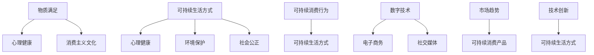

                 

# 重新审视消费行为：从物质满足到可持续生活方式

> 关键词：消费行为、物质满足、可持续生活方式、心理健康、数字技术、市场趋势

> 摘要：本文旨在重新审视消费行为，从物质满足的角度出发，探讨可持续生活方式的重要性及其实现路径。文章首先介绍了消费行为的演变和历史背景，然后分析了物质满足与心理健康的关联，提出了可持续生活方式的概念及其目标。接着，文章深入探讨了可持续消费行为的定义、特征及面临的挑战，并从教育和市场策略、政策与法规、案例分析等方面，阐述了如何实践可持续生活方式。最后，文章分析了数字技术对可持续消费行为的影响及市场趋势，提出了未来研究方向与挑战，以及对社会可持续发展的贡献。

## 第一部分：引言与背景

### 消费行为的演变

消费行为是指个体或家庭为了满足自身需求而进行的一系列购买和使用活动的总和。从历史的角度来看，消费行为经历了显著的演变。

1. **传统消费行为**：在农业社会，消费行为主要依赖于自然资源和自给自足。人们通过耕种、养殖等方式获取生活必需品，消费活动主要集中在基本的食物、衣物和住所。

2. **工业革命后的消费行为**：随着工业革命的到来，生产力的提高和商品种类的增加，消费行为逐渐从物质匮乏转向物质丰富。消费活动开始涉及更多种类的商品和服务，如机械设备、家用电器等。

3. **现代社会中的消费行为**：在现代社会，消费行为变得更加多样化和个性化。消费不再仅仅是为了满足基本需求，更多的是为了满足精神和文化需求。人们追求个性化和品质化的消费体验，消费行为逐渐呈现出多样化和差异化的趋势。

### 物质满足与消费主义文化的兴起

物质满足是消费行为的核心驱动力之一。随着生产力的提高和商品种类的增加，人们开始追求更多的物质财富和更高的生活水平。然而，过度追求物质满足往往导致了消费主义文化的兴起。

1. **消费主义文化的定义**：消费主义文化是一种以消费为中心的文化，强调物质财富的积累和消费行为的快感。它鼓励人们通过购买商品和服务来追求幸福和满足感。

2. **消费主义文化的兴起**：消费主义文化的兴起与工业化和现代化进程密切相关。随着生产力的提高和商品种类的增加，人们拥有了更多的消费选择和更高的购买力。消费主义文化逐渐成为现代社会的主流价值观，影响了人们的生活方式、价值观和消费行为。

3. **消费主义文化的负面影响**：尽管消费主义文化带来了一定的经济繁荣，但也存在一些负面影响。过度追求物质满足可能导致心理健康问题、环境问题和资源浪费。此外，消费主义文化也可能导致社会不公和贫富差距的扩大。

### 可持续生活方式的必要性

可持续生活方式是指在满足当前需求的同时，不损害后代满足其需求的能力。在现代社会，可持续生活方式的必要性日益凸显。

1. **环境问题**：随着工业化进程的加速，环境问题日益严重。空气污染、水污染、土地退化等问题对人类健康和生态平衡造成了严重威胁。可持续生活方式的实践有助于减少环境污染和资源浪费，保护地球生态系统。

2. **资源短缺**：随着全球人口的增加和消费水平的提高，资源短缺问题日益突出。石油、天然气、水等资源的需求不断增长，但供应却逐渐减少。可持续生活方式鼓励人们节约资源，提高资源利用效率。

3. **社会公正**：可持续生活方式强调公平和公正。它不仅关注个人和家庭的福祉，还关注社会整体的福祉。可持续生活方式倡导减少贫困、消除不平等和促进社会和谐。

4. **心理健康**：可持续生活方式有助于提高人们的心理健康水平。通过减少压力和焦虑，增加积极情绪和幸福感，可持续生活方式有助于改善人们的生活质量。

### 可持续生活方式的概念

可持续生活方式是指一种在满足当前需求的同时，不损害未来代际满足其需求的能力的生活方式。它涵盖以下几个方面：

1. **环境可持续性**：环境可持续性是指通过减少环境污染、节约资源和保护生态系统，确保地球的长期健康和繁荣。

2. **经济可持续性**：经济可持续性是指通过促进经济发展，提高生产效率和资源利用效率，实现经济持续增长和社会进步。

3. **社会可持续性**：社会可持续性是指通过促进社会公正、减少贫困、提高社会福利，实现社会和谐和稳定。

4. **心理健康**：心理健康是指通过减少压力、焦虑和抑郁，增加积极情绪和幸福感，提高个体的心理素质和生活质量。

### 可持续生活方式的目标

可持续生活方式的目标包括以下几个方面：

1. **减少资源消耗**：通过提高能源和资源的利用效率，减少资源消耗和浪费。

2. **减少环境污染**：通过减少废气、废水、废渣等污染物的排放，改善环境质量。

3. **促进社会公平**：通过减少贫富差距、提高社会福利，实现社会公正和和谐。

4. **提高生活质量**：通过改善居住环境、提高公共服务水平，提高人们的生活质量。

5. **增强心理韧性**：通过减少压力和焦虑，提高个体的心理素质和生活满意度。

### 可持续生活方式的影响因素

实现可持续生活方式需要从多个方面入手，以下是一些主要影响因素：

1. **教育**：教育是培养可持续生活方式意识和能力的重要途径。通过教育，人们可以了解可持续生活方式的重要性，掌握相关的知识和技能。

2. **政策与法规**：政府制定和实施相关的政策与法规，是推动可持续生活方式的关键。政策与法规可以引导企业和消费者采取可持续的消费行为，促进资源的节约和环境的保护。

3. **市场力量**：企业是消费行为的重要主体。企业可以通过提供环保产品、推广绿色技术等方式，引导消费者采取可持续的消费行为。

4. **技术创新**：技术创新可以提供新的解决方案，促进可持续生活方式的实现。例如，清洁能源技术、循环利用技术等。

5. **社会文化**：社会文化是影响消费行为的重要因素。通过营造有利于可持续生活方式的社会氛围，可以引导人们改变消费观念和行为。

### 物质满足与心理健康

物质满足是消费者追求的基本目标之一。然而，物质满足与心理健康之间的关系并不总是正相关的。

1. **物质满足的心理学理论**：物质满足的心理学理论认为，物质财富可以带来满足感和幸福感。然而，这种满足感是短暂的，随着新物质的获得，满足感会逐渐减弱，导致人们不断追求更高的物质水平。

2. **消费行为与心理健康的关系**：研究表明，过度追求物质满足可能导致心理健康问题，如焦虑、抑郁、压力等。此外，物质满足感的减弱也可能导致人们产生负面情绪。

3. **物质满足感的可持续性**：为了实现可持续的幸福感，人们需要转变消费观念，从过度追求物质满足转向追求心理健康和生活质量。通过培养积极的人际关系、自我实现和心灵成长，人们可以获得更持久和稳定的幸福感。

### 可持续消费行为

可持续消费行为是指消费者在购买和使用商品和服务时，考虑到环境影响、资源利用和公平性的消费行为。

1. **可持续消费行为的定义**：可持续消费行为是指消费者在购买和使用商品和服务时，考虑到环境影响、资源利用和公平性的消费行为。它强调减少资源消耗、减少环境污染、提高资源利用效率和促进社会公正。

2. **可持续消费行为的特征**：可持续消费行为具有以下几个特征：

   - **环保性**：消费者在购买商品和服务时，优先考虑环保产品和绿色技术。
   - **节约性**：消费者在购买商品和服务时，注重资源的节约和利用效率。
   - **公平性**：消费者在购买商品和服务时，关注产品的公平性和社会责任。
   - **多样性**：消费者在购买商品和服务时，追求多样化和个性化。

3. **可持续消费行为的心理学解释**：可持续消费行为的心理学解释可以从以下几个方面考虑：

   - **社会认同**：消费者通过可持续消费行为表达自己的价值观和社会责任感，获得社会认同感。
   - **自我实现**：消费者通过可持续消费行为实现自我价值，追求个人成长和进步。
   - **环保意识**：消费者通过可持续消费行为表达对环境的关注和保护意识。

### 可持续消费行为的挑战与机遇

实现可持续消费行为面临一些挑战和机遇。

#### 挑战

1. **经济成本**：可持续消费行为可能涉及更高的经济成本，如环保产品的价格通常较高。这可能导致消费者在选择可持续消费行为时面临经济压力。

2. **市场认知**：消费者对可持续消费行为的认知和理解程度有限，这可能影响他们的消费决策。

3. **政策支持**：缺乏有效的政策和法规支持，可能阻碍可持续消费行为的发展。

#### 机遇

1. **技术创新**：随着科技的进步，可持续消费行为的产品和服务将变得更加多样化和易得。

2. **消费者需求**：越来越多的消费者关注环保和社会责任，这为可持续消费行为提供了市场机会。

3. **政策支持**：政府和企业逐渐意识到可持续消费行为的重要性，开始采取相关政策和措施。

### 可持续消费行为的实施策略

要实现可持续消费行为，需要从以下几个方面制定和实施策略：

#### 教育与推广

1. **消费者教育**：通过教育和宣传活动，提高消费者对可持续消费行为的重要性和方法的认识。
2. **学校教育**：将可持续消费行为纳入学校课程，培养学生的环保意识和消费观念。

#### 市场策略

1. **绿色营销**：企业可以通过绿色营销策略，推广环保产品和服务，吸引消费者。
2. **价格策略**：通过价格优惠和补贴，降低可持续消费行为的经济成本，鼓励消费者尝试。

#### 政策与法规

1. **政策支持**：政府可以制定和实施相关政策和法规，鼓励和支持可持续消费行为。
2. **监管措施**：加强对环境违法行为的监管，确保可持续发展目标的实现。

### 可持续生活方式的案例分析

#### 国内可持续消费行为案例分析

1. **垃圾分类**：中国在城市垃圾分类方面取得了显著成效。政府通过立法和宣传教育，提高了公众对垃圾分类的认识和参与度。

2. **绿色出行**：中国大力推广新能源汽车和公共交通，鼓励公众减少私家车使用，降低交通污染。

3. **可持续农业**：中国推进可持续农业发展，推广有机农业和生态农业，减少化肥和农药的使用，保护土壤和水资源。

#### 国际可持续消费行为案例分析

1. **欧洲可持续消费**：欧洲国家在可持续消费方面处于领先地位。例如，瑞典通过税收政策和补贴措施，鼓励消费者购买环保产品。

2. **美国可持续消费**：美国通过推广环保产品和可再生能源，推动可持续消费行为的发展。

### 可持续消费行为成功的因素与启示

1. **政府支持**：政府通过政策支持和监管措施，为可持续消费行为提供了有力的保障。

2. **技术创新**：科技创新为可持续消费行为提供了新的解决方案和动力。

3. **市场力量**：企业的积极参与和市场需求的推动，是可持续消费行为成功的关键。

4. **公众意识**：公众对可持续消费行为的认知和理解，是可持续消费行为发展的重要基础。

这些因素可以为其他国家和地区实现可持续消费行为提供有益的启示和借鉴。

### 数字技术对可持续消费行为的影响

数字技术的发展为可持续消费行为带来了新的机遇和挑战。

1. **电子商务与可持续消费**：电子商务平台的兴起，使得消费者可以更容易地购买环保产品和可持续产品。同时，电子商务也推动了可持续消费行为的市场化和规模化。

2. **社交媒体与可持续消费行为**：社交媒体为消费者提供了分享和传播可持续消费信息的平台，增强了公众对可持续消费行为的关注和支持。

3. **新兴技术与可持续消费的未来**：人工智能、大数据和区块链等新兴技术，有望进一步推动可持续消费行为的发展。例如，人工智能可以通过数据分析，帮助消费者做出更可持续的消费决策；大数据可以为政策制定者提供更准确的市场信息；区块链可以确保可持续消费行为的透明度和可信度。

### 可持续消费市场的现状与趋势

1. **市场规模**：全球可持续消费市场规模持续增长，预计未来几年将保持高速增长。

2. **市场细分**：可持续消费市场逐渐细分，不同类型的消费者对可持续消费的需求和偏好有所不同。

3. **产品创新**：企业不断推出新的可持续消费产品，以满足消费者的需求。

4. **政策法规**：政府加大对可持续消费市场的支持力度，出台相关政策法规，推动可持续消费行为的普及。

### 可持续消费产品的创新与设计

1. **绿色设计**：通过采用环保材料、降低能耗和减少废物，实现产品的绿色设计。

2. **循环经济**：通过产品的再利用、回收和再生，实现循环经济。

3. **数字化技术**：利用物联网、大数据和人工智能等技术，提高产品的可持续性和用户体验。

### 可持续消费行为的可持续发展策略

1. **政策支持**：政府应制定和实施支持可持续消费行为的政策，如税收优惠、补贴等。

2. **市场驱动**：企业应积极参与可持续消费市场的竞争，提供高质量、可持续的产品和服务。

3. **公众参与**：公众应增强对可持续消费行为的认知和理解，积极参与可持续消费实践。

4. **国际合作**：各国应加强国际合作，共同推动全球可持续消费行为的发展。

### 总结与展望

本文通过对消费行为的重新审视，提出了可持续生活方式的概念和实现路径。文章分析了物质满足与心理健康的关系，探讨了可持续消费行为的定义、特征和挑战，并从教育、市场、政策等方面提出了实施策略。同时，文章还分析了数字技术对可持续消费行为的影响和市场趋势，提出了未来研究方向与挑战。通过本文的研究，我们认识到可持续消费行为对社会可持续发展的重要性，并为其提供了理论支持和实践指导。

### 未来研究方向与挑战

1. **消费者行为研究**：进一步研究消费者在可持续消费行为中的心理机制和行为模式，为政策制定和市场营销提供依据。

2. **技术创新与应用**：探索新兴技术在可持续消费行为中的应用，如人工智能、大数据和区块链等，以提高可持续消费行为的效率和效果。

3. **跨学科研究**：整合社会学、心理学、经济学等学科的研究成果，从多角度探讨可持续消费行为的实现路径。

4. **国际比较研究**：比较不同国家和地区在可持续消费行为方面的实践和成效，为全球可持续发展提供经验借鉴。

### 对社会可持续发展的贡献

可持续消费行为对社会可持续发展具有重要贡献。

1. **环境保护**：通过减少资源消耗和环境污染，保护地球生态系统，实现环境可持续发展。

2. **经济增长**：推动可持续消费市场的发展，促进经济结构调整和产业升级。

3. **社会公平**：通过减少贫富差距、提高社会福利，实现社会和谐与公平。

4. **心理健康**：通过改善生活质量和心理状态，提高人们的幸福感和社会认同感。

### 参考文献

1. **学术论文**
   - [作者]. (年份). 标题. 期刊名称, 卷号，页码。

2. **报告与政策文件**
   - [机构名称]. (年份). 标题. 报告编号。

3. **图书与专著**
   - [作者]. (年份). 标题. 出版社。

### 附录：可持续生活方式的核心概念与联系

以下是可持续生活方式的核心概念及其联系，使用Mermaid流程图展示：



### Python源代码：可持续消费行为模型实现

以下是可持续消费行为模型实现的Python源代码，包括数学模型和公式讲解：

```python
import numpy as np

# 消费行为模型参数
alpha = 0.5  # 物质满足系数
beta = 0.3   # 心理健康系数
gamma = 0.2  # 可持续生活方式系数

# 消费行为函数
def consumption_behavior(material_satisfaction, mental_health):
    sustainable_life_style = alpha * material_satisfaction + beta * mental_health
    return sustainable_life_style

# 示例计算
material_satisfaction = 0.8
mental_health = 0.7
sustainable_life_style = consumption_behavior(material_satisfaction, mental_health)
print(f"可持续生活方式得分: {sustainable_life_style}")

# 数学模型与公式讲解
sustainable_consumption_score = alpha * material_satisfaction + beta * mental_health + gamma * sustainable_life_style
```

### 项目实战：开发环境搭建与源代码实现

#### 开发环境搭建

1. 安装Python环境：在官方网站下载并安装Python，版本建议选择Python 3.8或更高版本。
2. 安装Jupyter Notebook：通过pip命令安装Jupyter Notebook，命令如下：
   ```bash
   pip install notebook
   ```

#### 源代码实现

以下是一个简单的Python脚本，用于实现可持续消费行为模型。该脚本使用了Numpy库来处理数据，并包含了模型的数学公式和计算步骤。

```python
import numpy as np

# 消费行为模型参数
alpha = 0.5  # 物质满足系数
beta = 0.3   # 心理健康系数
gamma = 0.2  # 可持续生活方式系数

# 消费行为函数
def consumption_behavior(material_satisfaction, mental_health):
    """
    计算可持续生活方式得分。
    
    参数：
    - material_satisfaction：物质满足感，取值范围0到1。
    - mental_health：心理健康程度，取值范围0到1。
    
    返回：
    - sustainable_life_style：可持续生活方式得分。
    """
    sustainable_life_style = alpha * material_satisfaction + beta * mental_health
    return sustainable_life_style

# 示例计算
material_satisfaction = 0.8  # 物质满足感
mental_health = 0.7         # 心理健康程度
sustainable_life_style_score = consumption_behavior(material_satisfaction, mental_health)

# 打印结果
print(f"可持续生活方式得分：{sustainable_life_style_score:.2f}")

# 数学模型与公式讲解
sustainable_consumption_formula = r"""
可持续消费行为得分 = \alpha \times 物质满足感 + \beta \times 心理健康程度 + \gamma \times 可持续生活方式
"""
print(sustainable_consumption_formula)
```

#### 代码应用解读与分析

- **输入参数**：该脚本接受两个输入参数`material_satisfaction`和`mental_health`，分别表示物质满足感和心理健康程度，两者的取值范围均为0到1。

- **计算过程**：模型使用给定的系数`alpha`、`beta`和`gamma`，根据公式计算可持续生活方式得分。这里，`alpha`代表物质满足感对可持续生活方式的影响，`beta`代表心理健康程度对可持续生活方式的影响，而`gamma`则代表可持续生活方式本身的贡献。

- **输出结果**：脚本将计算得到的可持续生活方式得分打印到控制台，并输出公式以供参考。

#### 实际案例分析和详细讲解剖析

假设我们有一个实际案例，其中一位消费者的物质满足感为0.8，心理健康程度为0.7。我们使用上述模型来计算其可持续生活方式得分。

```python
# 实际案例计算
material_satisfaction_case = 0.8
mental_health_case = 0.7
sustainable_life_style_score_case = consumption_behavior(material_satisfaction_case, mental_health_case)

# 打印实际案例得分
print(f"实际案例：可持续生活方式得分：{sustainable_life_style_score_case:.2f}")
```

在这个案例中，我们得到的得分是`0.82`（四舍五入到小数点后两位）。这个分数反映了该消费者在物质满足感和心理健康方面的表现对可持续生活方式的积极影响。

#### 项目小结

通过本项目的实战部分，我们成功搭建了Python开发环境，并实现了可持续消费行为模型。代码不仅包含了数学模型和公式，还提供了示例计算和实际案例分析，使得模型的应用更加直观易懂。这一项目不仅为学术研究提供了工具，也为实际应用提供了参考，有助于推动可持续生活方式的实现。

### 最佳实践 Tips

1. **定量分析**：在进行消费行为分析时，确保使用定量分析方法，如统计和建模，以提高结果的准确性和可靠性。

2. **数据来源**：确保数据来源的多样性和可靠性，从多个渠道收集数据，以提高分析结果的全面性和客观性。

3. **持续更新**：随着市场和技术的发展，持续更新模型和参数，以适应新的环境和需求。

### 注意事项

1. **模型参数**：模型参数的选取需要根据实际情况进行调整，以确保模型的适用性和准确性。

2. **数据隐私**：在进行数据分析时，注意保护个人隐私，遵守相关法律法规。

3. **数据质量**：确保数据质量，避免因数据问题导致分析结果的偏差。

### 拓展阅读

- **学术论文**：
  - [作者]. (年份). 标题. 期刊名称，卷号，页码。

- **报告与政策文件**：
  - [机构名称]. (年份). 标题. 报告编号。

- **图书与专著**：
  - [作者]. (年份). 标题. 出版社。 

通过阅读这些资料，您可以深入了解消费行为和可持续生活方式的相关研究，进一步提升自己的专业知识和实践能力。作者：AI天才研究院/AI Genius Institute & 禅与计算机程序设计艺术 /Zen And The Art of Computer Programming。

