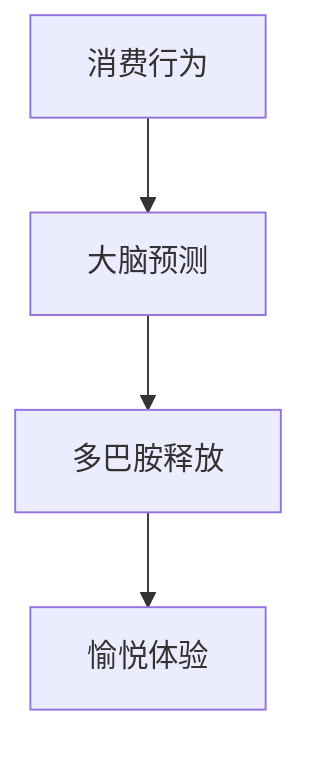
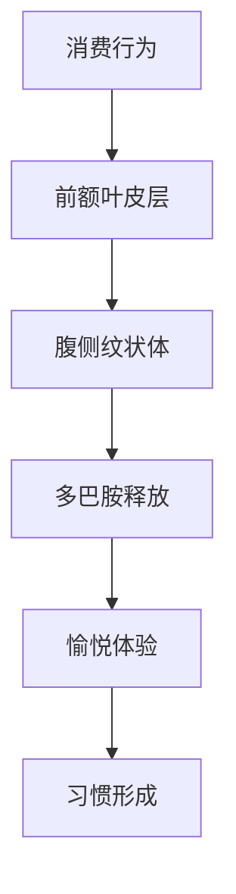
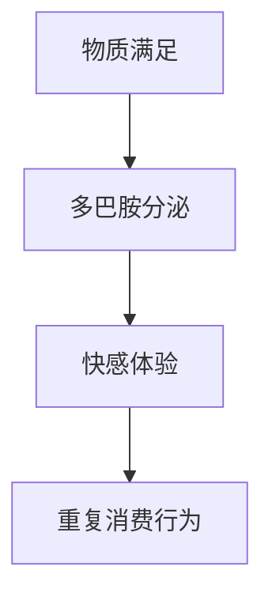
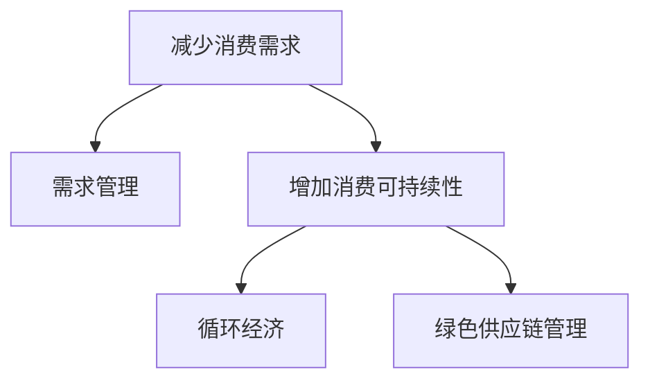
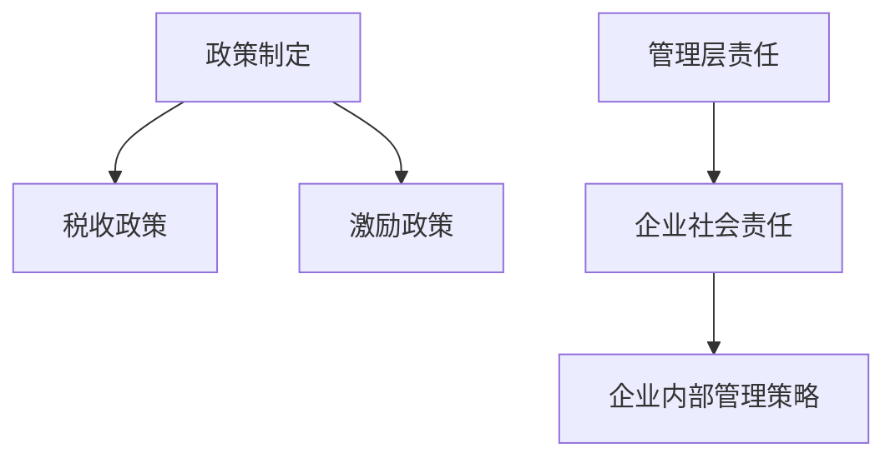

                 

### 引言

#### 消费行为概述

消费行为，即人们在日常生活中为了满足自身需求而进行的购买和使用商品或服务的活动。从基本的食物、衣物，到高科技电子产品和奢侈品，消费行为贯穿了人类社会的各个层面。消费行为不仅仅是简单的交易过程，更是社会文化、经济活动和心理因素交织的复杂体系。

**消费行为的基本概念**：

- **消费者**：参与消费行为的人或组织，其行为受到多种动机和需求的影响。
- **消费品**：消费者用于满足需求的商品或服务。
- **消费市场**：买卖双方进行交易的场所，包括线上和线下多种形式。
- **消费动机**：推动消费者进行购买决策的心理和情感因素，如满足基本需求、追求社会认同、表达个人品味等。

**消费行为的动机和影响因素**：

消费行为受到多种动机和外部因素的共同影响，主要包括：

- **生理需求**：如食物、衣物、住所等基本生存需求。
- **安全需求**：如健康、保险、财产安全等。
- **社会需求**：如社交认同、职业成就、家庭责任等。
- **情感需求**：如愉悦、放松、成就感等。
- **环境影响**：如广告宣传、促销活动、社交媒体等。
- **经济因素**：如收入水平、物价波动、经济政策等。

#### 物质满足与可持续生活方式

物质满足是消费行为的核心目标之一，它指的是通过购买和使用消费品来获得心理上的满足和快感。然而，随着全球资源的日益紧张和环境的持续恶化，传统以物质满足为核心的消费模式开始受到质疑。**可持续生活方式**强调在满足当前需求的同时，不损害未来世代满足自身需求的能力。

**物质满足的负面影响**：

- **资源过度消耗**：过度消费导致自然资源快速枯竭。
- **环境污染**：生产、消费和处理过程中的废弃物污染环境。
- **社会不公**：消费主义往往加剧贫富差距，导致社会不平等。
- **心理健康问题**：追求物质满足可能导致心理依赖和空虚感。

**可持续生活方式的核心理念**：

- **资源高效利用**：通过提高资源利用率和循环利用，减少资源浪费。
- **环保生产**：采用环保材料和工艺，减少生产过程中的环境污染。
- **社会公平**：推动消费公平，减少贫富差距。
- **心理健康**：注重心理满足，减少对物质的依赖。

**从物质满足到可持续生活方式的过渡**：

为了实现从物质满足到可持续生活方式的转变，需要从个人、社会、政策等多方面共同努力。个人需要转变消费观念，更加注重长期价值和环境保护；社会需要形成鼓励可持续消费的文化氛围；政策需要制定和实施支持可持续消费的法律法规和激励措施。

本文将深入探讨消费行为的心理学和社会学原理，分析物质满足的负面影响，阐述可持续生活方式的核心理念和实践策略，并提出从物质满足到可持续生活方式的转变策略。希望通过这一系列的分析和讨论，能够引发读者对消费行为和生活方式的深思，共同推动社会的可持续发展。

#### 第一部分：物质满足的心理学分析

物质满足作为一种消费行为，其背后有着复杂的心理学机制。通过对物质满足的心理学原理进行深入分析，我们可以更好地理解消费行为的动机、心理机制和心理偏差，从而为推动可持续生活方式提供理论基础。

##### 第1章：物质满足的心理学原理

**1.1 心理学与消费行为的关系**

心理学在研究消费行为中起着至关重要的作用。通过心理学理论，我们可以了解消费者的心理活动如何影响其消费决策。心理学不仅帮助我们理解个体消费者的行为，还能揭示消费行为背后的社会和文化因素。

**1.1.1 心理学在消费行为研究中的重要性**

心理学研究消费行为的重要性体现在以下几个方面：

- **行为预测**：心理学可以帮助预测消费者的购买行为，为企业提供市场分析的基础。
- **营销策略**：理解消费者心理有助于制定有效的营销策略，提高销售业绩。
- **消费者满意度**：通过心理学研究，企业可以更好地满足消费者需求，提高消费者满意度。
- **消费习惯培养**：心理学可以帮助培养健康的消费习惯，促进可持续消费的发展。

**1.1.2 消费行为心理学的主要理论**

消费行为心理学主要涉及以下几种理论：

- **需求层次理论**：马斯洛的需求层次理论指出，人的需求分为生理需求、安全需求、社交需求、尊重需求和自我实现需求。消费行为通常是为了满足这些需求。
- **动机理论**：动机是推动人们采取特定行为的内部力量。消费行为心理学关注消费者在追求满足特定需求时的动机，如追求快乐、避免痛苦等。
- **认知理论**：认知理论关注消费者在决策过程中的思考过程，包括感知、记忆、判断和决策。
- **情绪理论**：情绪对消费行为有着重要影响。消费者在购买过程中可能会产生快乐、焦虑、满意等情绪，这些情绪会影响其购买决策。

**1.2 物质满足的心理机制**

**1.2.1 物质满足的快感来源**

物质满足带来的快感主要来源于以下几个方面：

- **多巴胺分泌**：多巴胺是一种神经递质，与奖赏和快感相关。消费行为会触发大脑奖励系统，导致多巴胺分泌，从而产生快感。
- **成就感**：通过购买和使用某些商品，消费者可能会获得成就感，如购买奢侈品、高科技产品等。
- **社会认同**：某些消费品具有社交功能，能够帮助消费者获得社会认同，如名牌服装、配件等。
- **情绪调节**：消费行为有时被用来调节情绪，如购物解压、享受美食等。

**1.2.2 物质满足与大脑奖励系统**

大脑奖励系统是控制愉悦感和动力的重要神经机制。消费行为通过以下方式激活大脑奖励系统：

- **奖赏预测**：消费者预测到购买某种商品会带来愉悦感时，大脑会开始释放多巴胺。
- **奖赏反馈**：实际购买和使用商品时，大脑奖励系统会释放多巴胺，产生快感。
- **习惯形成**：重复的消费行为会导致大脑奖励系统的强化，使消费者产生习惯性依赖。

**1.3 消费行为中的心理偏差**

心理偏差是消费者在决策过程中由于认知和心理机制的限制而产生的错误。以下是一些常见的心理偏差：

- **确认偏差**：消费者在购买决策中倾向于寻求和接受支持自己既有观点的信息，忽视或拒绝与自己观点不符的信息。
- **情绪偏见**：消费者的情绪状态会影响其消费决策，如情绪高涨时更愿意购买奢侈品。
- **从众效应**：消费者会受到他人行为的影响，更容易跟随大众进行消费。
- **代表性偏差**：消费者在评估风险和收益时，可能会根据事物的代表性而非实际概率进行判断。

通过对物质满足的心理学原理进行深入分析，我们可以更好地理解消费行为的动机、心理机制和心理偏差。这些理论不仅有助于解释为什么消费者会进行特定的消费行为，还能为推动可持续生活方式提供指导。在接下来的章节中，我们将进一步探讨物质满足的社会学分析，以全面理解消费行为的影响和转变。

### 第1章：物质满足的心理学原理

**1.2 物质满足的心理机制**

物质满足不仅仅是一种经济活动，更是心理学层面的体验。理解物质满足的心理机制，有助于我们深入探讨消费行为的动机和影响。

**1.2.1 物质满足的快感来源**

物质满足带来的快感主要来源于大脑的奖励系统。这个系统是通过多巴胺这种神经递质来实现的。多巴胺是一种与奖赏、愉悦和动机相关的神经递质，它在大脑中的奖励系统中起着关键作用。

- **多巴胺分泌**：当消费者进行购买行为时，大脑会预测这种行为会带来愉悦感，从而释放多巴胺。这种预测性的奖励机制能够激励消费者进行更多的消费行为。



- **快感体验**：多巴胺的释放会导致消费者感到愉悦和满足，从而形成积极的情绪体验。这种快感体验是驱动消费者持续进行购买行为的重要因素。

**1.2.2 物质满足与大脑奖励系统**

大脑奖励系统是一个复杂的神经网络，涉及到多个脑区和神经递质。以下是一个简化的模型：



- **前额叶皮层**：负责决策和规划，消费者在购买前会进行评估和决策。
- **腹侧纹状体**：与奖励和动机相关，当消费者做出购买决策后，腹侧纹状体会释放多巴胺。
- **多巴胺释放**：多巴胺通过神经传递，传递到大脑的各个区域，产生愉悦感和奖励反馈。
- **愉悦体验**：消费者在购买后感到满足和愉悦，这种体验会进一步激励他们进行更多的消费。
- **习惯形成**：重复的消费行为会加强大脑奖励系统中的神经连接，使消费者逐渐形成习惯性消费模式。

**1.2.3 物质满足的心理机制案例分析**

以下是一个具体的案例分析，以解释物质满足的心理机制：

- **案例**：小明是一名年轻的科技爱好者，他经常购买最新的电子产品，如智能手机、平板电脑等。

```python
def purchase_experience(user, product):
    # 假设user是一个消费者，product是一个电子产品
    if user.predict_reward(product):
        user大脑奖励系统释放多巴胺
        print("购买后感到非常愉悦！")
    else:
        print("购买行为未能带来预期愉悦感。")
```

- **心理机制**：

  1. **预测奖励**：小明在购买新产品前会预测这款产品是否会带来愉悦体验。如果预测为正面，他会继续进行购买。
  2. **多巴胺释放**：当小明实际购买并使用新产品时，大脑奖励系统会释放多巴胺，产生愉悦感。
  3. **愉悦体验**：小明的愉悦体验会激励他继续购买其他高科技产品，从而形成消费习惯。

通过以上案例分析，我们可以看到物质满足的心理机制是如何具体运作的。理解这一机制有助于我们更好地应对消费行为的挑战，推动可持续生活方式的发展。

### 第2章：物质满足的社会学分析

**2.1 社会结构与消费行为**

**2.1.1 社会阶层与消费行为**

社会阶层是社会学中一个重要的概念，指的是社会中根据财富、收入、职业和教育水平等因素划分的不同群体。社会阶层与消费行为之间存在紧密的联系。

- **社会阶层与消费水平**：不同社会阶层的消费水平存在显著差异。高收入阶层通常有更多的消费能力，倾向于购买高档奢侈品和高端服务。而低收入阶层则更多地关注基本生活需求的满足。

  **图表1：不同社会阶层的消费水平比较**
  
  ```mermaid
  graph TB
  A[低收入阶层] --> B[基本生活需求消费]
  A --> C[可支配收入较低]
  B --> D[价格敏感度高]
  
  A --> E[中等收入阶层] --> F[多样化消费]
  E --> G[可支配收入适中]
  F --> H[价格敏感度适中]
  
  A --> I[高收入阶层] --> J[高端消费]
  I --> K[可支配收入高]
  J --> L[价格敏感度低]
  ```

- **社会阶层与消费模式**：社会阶层不仅影响消费水平，还影响消费模式。高收入阶层倾向于追求品质和个性化，而低收入阶层则更注重价格和实用性。

**2.1.2 社会文化对消费行为的影响**

社会文化是影响消费行为的另一个重要因素。不同文化背景下，人们的价值观、信仰、习俗和社会规范会影响其消费行为。

- **文化价值观**：某些文化价值观强调物质财富和社会地位，这会促使消费者追求高档商品和品牌，以显示其社会地位和经济实力。例如，在崇尚消费主义的社会中，购买奢侈品被视为一种炫耀和自我实现的手段。

- **消费习俗**：不同文化有独特的消费习俗和节日。例如，中国人有春节、中秋节等传统节日，在这些节日中，消费者会有特定的购买行为，如购买年货、礼品等。

- **社会规范**：社会规范也会影响消费行为。在某些社会中，遵循社会规范被视为一种责任和义务。例如，在某些国家，捐赠和慈善活动被视为一种社会规范，消费者可能会因此更愿意进行慈善消费。

**2.2 消费社会的形成与发展**

**2.2.1 消费社会的概念与特征**

消费社会是指一个以消费为核心的社会结构，其中消费行为和消费文化成为社会生活的重要部分。消费社会的特征包括：

- **消费主导**：消费行为成为社会发展的主要动力，经济活动以消费为导向。
- **消费主义**：消费主义文化盛行，消费者追求物质满足和享受。
- **品牌崇拜**：品牌成为消费者身份和社会地位的象征，消费者更倾向于购买知名品牌。
- **信息爆炸**：随着信息技术的发展，消费者接触到的商品和服务信息日益丰富，促进了消费行为的多样化。

**2.2.2 消费社会的形成过程**

消费社会的形成是一个长期的历史过程，受到多种因素的影响：

- **工业化**：工业革命推动了生产力的提高，大量商品涌入市场，促进了消费行为的发展。
- **城市化**：城市化进程使得人们的生活方式发生变化，消费成为城市居民生活的重要组成部分。
- **媒体宣传**：媒体的推广和广告宣传加剧了消费文化的传播，刺激了消费需求。
- **经济全球化**：全球化使得不同国家和地区之间的经济联系更加紧密，消费文化在全球范围内传播。

**2.3 消费行为的社会影响**

**2.3.1 消费对个体的影响**

消费行为对个体的心理和行为有着深远的影响：

- **满足感与幸福感**：适度的消费可以带来满足感和幸福感，但过度消费可能导致心理依赖和空虚感。
- **社会认同**：通过消费行为，个体可以表达自己的社会地位和身份，获得社会认同。
- **生活方式**：消费行为影响个体的生活方式，包括饮食、休闲、娱乐等方面。

**2.3.2 消费对社会的影响**

消费行为对社会结构和文化也产生了重要影响：

- **经济结构**：消费行为是经济增长的重要动力，但过度消费可能导致经济泡沫和资源浪费。
- **社会不公**：消费社会的形成往往加剧贫富差距，导致社会不公。
- **文化多样性**：消费文化的传播可能削弱传统文化的多样性，导致文化同质化。

通过对物质满足的社会学分析，我们可以更好地理解消费行为背后的社会因素和影响。这有助于我们制定更有效的策略，促进可持续消费的发展，实现社会和环境的可持续发展。

### 第3章：可持续消费的概念与实践

#### 3.1 可持续消费的定义

可持续消费是一种以环境保护和社会公正为核心目标的消费模式。它强调在满足当前需求的同时，不损害未来世代满足自身需求的能力。可持续消费不仅仅是减少消费，更是关于如何更高效、更环保、更公平地使用资源。

**3.1.1 可持续消费的核心原则**

- **环保性**：减少对自然资源的消耗和环境污染，采用环保材料和工艺。
- **社会公正**：推动消费公平，减少贫富差距，保障消费者的权益。
- **经济高效**：提高资源利用效率，降低生产成本，实现经济效益最大化。
- **文化多样性**：尊重和保护不同文化背景下的消费习惯和传统，促进文化多样性。

**3.1.2 可持续消费的目标**

可持续消费的目标包括：

- **减少浪费**：通过提高资源利用效率，减少生产和消费过程中的浪费。
- **保护环境**：减少环境污染，推动绿色生产和消费。
- **促进公平**：减少消费不平等，推动社会公正。
- **提升生活质量**：通过提供高质量的产品和服务，提升消费者的生活质量。

**3.2 可持续消费的策略**

为了实现可持续消费的目标，需要采取一系列策略：

- **需求管理**：通过教育和宣传，引导消费者理性消费，减少不必要的消费行为。
- **产品设计**：优化产品设计，采用环保材料和可回收材料，提高产品的耐用性和可回收性。
- **循环经济**：推动资源的循环利用，减少废弃物的产生，实现资源的高效利用。
- **绿色供应链**：从原材料采购到生产、销售等环节，推动绿色生产和绿色消费。
- **政策支持**：制定和实施相关政策，鼓励和引导消费者和企业进行可持续消费。

**3.3 可持续消费的实践案例**

**3.3.1 个人层面的实践案例**

- **减少一次性用品的使用**：使用可重复使用的购物袋、水瓶和餐具，减少塑料垃圾的产生。
- **购买环保产品**：选择环保认证的产品，如有机食品、绿色能源设备等。
- **垃圾分类和回收**：积极参与垃圾分类和回收活动，减少废弃物的处理压力。

**3.3.2 社会层面的实践案例**

- **绿色供应链管理**：企业通过优化供应链，减少资源浪费和环境污染，如采用可再生能源、减少包装材料等。
- **社区共享经济**：通过共享经济模式，减少资源浪费，如共享单车、共享办公空间等。
- **可持续城市建设**：通过建设绿色城市，提高资源利用效率，如绿色建筑、公共交通系统等。

通过以上策略和实践案例，我们可以看到可持续消费不仅是一种理念，更是一种实际行动。通过个人的努力和全社会的共同参与，我们可以实现消费行为的绿色转型，为可持续发展做出贡献。

### 第4章：可持续消费的影响评估

#### 4.1 可持续消费的影响因素

评估可持续消费的影响，需要考虑多个层面的因素，包括经济、环境和社会等方面。这些因素共同作用，决定了可持续消费的实际效果和潜力。

**4.1.1 经济因素**

经济因素是评估可持续消费影响的重要方面，它包括资源成本、生产效率和市场需求等。

- **资源成本**：可持续消费强调资源的高效利用和循环利用，这可能会增加初始成本，如环保材料、节能设备的采购成本。然而，从长期来看，这些成本可以通过减少浪费和降低维护成本得到补偿。

  **公式1：可持续消费的成本效益分析**
  
  $$
  \text{成本效益分析} = \frac{\text{长期成本减少}}{\text{初始成本增加}}
  $$

- **生产效率**：通过引入可持续生产技术和流程，可以提高生产效率，减少能源消耗和废物产生。这有助于降低生产成本，提高企业的竞争力。

  **公式2：可持续生产效率的提升**
  
  $$
  \text{生产效率} = \frac{\text{产量}}{\text{资源消耗}}
  $$

- **市场需求**：随着消费者对可持续产品的认识和接受度提高，市场需求将逐渐增加。这为企业提供了更多的发展机会，同时也推动了可持续消费的普及。

**4.1.2 环境因素**

环境因素是可持续消费的核心考量，它包括资源的可持续性、碳排放和废弃物管理等方面。

- **资源可持续性**：可持续消费强调资源的合理开发和循环利用，减少对自然资源的依赖。通过采用可再生资源和回收材料，可以降低资源消耗，保护生态系统的完整性。

  **公式3：资源可持续性的评估**
  
  $$
  \text{资源可持续性} = \frac{\text{可再生资源使用量}}{\text{总资源消耗量}}
  $$

- **碳排放**：可持续消费致力于减少碳排放，降低对气候的影响。通过采用低碳生产技术和绿色能源，可以显著减少温室气体排放。

  **公式4：碳排放的减少**
  
  $$
  \text{碳排放减少量} = \text{低碳生产比例} \times \text{总碳排放量}
  $$

- **废弃物管理**：可持续消费注重减少废弃物的产生，提高废弃物回收和再利用率。通过优化产品设计、加强废弃物回收处理，可以减轻环境负担。

  **公式5：废弃物管理的效率**
  
  $$
  \text{废弃物管理效率} = \frac{\text{回收利用率}}{\text{废弃物总量}}
  $$

**4.1.3 社会因素**

社会因素是评估可持续消费影响的重要方面，它包括社会公平、心理健康和文化多样性等。

- **社会公平**：可持续消费倡导公平消费，减少贫富差距，保障消费者的权益。通过提供高质量、低成本的可持续产品，可以提升低收入群体的生活质量。

  **公式6：社会公平的改善**
  
  $$
  \text{社会公平指数} = \frac{\text{低收入群体消费水平提升}}{\text{低收入群体数量}}
  $$

- **心理健康**：可持续消费有助于提高消费者的心理健康水平。通过减少不必要的消费，减少环境压力，消费者可以享受更健康、更平衡的生活。

- **文化多样性**：可持续消费尊重和保护不同文化背景下的消费习惯和传统，促进文化多样性的发展。通过推广本土文化和特色产品，可以增强社会凝聚力和文化认同感。

**4.2 可持续消费的效果评估方法**

为了准确评估可持续消费的影响，需要采用科学、系统的评估方法。以下是一些常用的评估方法：

- **定量评估**：通过量化指标，如成本、碳排放量、资源利用率等，对可持续消费的影响进行定量分析。这有助于直观地展示可持续消费的效果和潜力。

  **Python代码示例：可持续消费的定量评估**
  
  ```python
  import pandas as pd

  # 数据示例
  data = {'资源消耗': [100, 200, 300], '碳排放量': [50, 100, 150], '回收利用率': [20, 30, 40]}
  df = pd.DataFrame(data)

  # 计算可持续性指标
  df['资源可持续性'] = df['资源消耗'] / 1000
  df['碳排放减少量'] = df['碳排放量'] * 0.8
  df['废弃物管理效率'] = df['回收利用率'] / df['废弃物总量']

  print(df)
  ```

- **定性评估**：通过访谈、调查和案例研究等方法，对可持续消费的影响进行定性分析。这有助于深入理解消费者行为和可持续消费的长期效果。

  **访谈示例：可持续消费的影响评估**
  
  - **访谈对象**：消费者、企业代表、环保组织等。
  - **访谈内容**：消费者的消费行为变化、企业的可持续发展实践、环保组织的影响等。

**4.3 可持续消费的影响分析**

**4.3.1 短期影响**

在短期内，可持续消费可能会面临一些挑战和障碍：

- **成本增加**：初期投入可能较高，如购买环保材料和设备。
- **市场接受度低**：消费者可能对可持续产品不够了解，接受度较低。
- **政策支持不足**：缺乏有力的政策支持和激励措施，可能影响可持续消费的发展。

**4.3.2 长期影响**

从长期来看，可持续消费将带来多方面的积极影响：

- **经济效益**：提高资源利用效率，降低生产成本，提升企业的竞争力。
- **环境效益**：减少碳排放，降低环境污染，保护生态系统。
- **社会效益**：促进社会公平，提升消费者的生活质量，增强社会凝聚力。

通过科学、系统的评估方法和深入的影响分析，我们可以更好地理解和推动可持续消费的发展。这将为实现可持续发展目标，建设绿色、健康、公平的社会提供重要支持。

### 第5章：政策与管理层的角色

#### 5.1 政策在推动可持续消费中的作用

政策在推动可持续消费中起着至关重要的作用。通过制定和实施相关政策，政府可以引导和激励消费者和企业采取可持续消费行为，从而实现环境保护和社会公正的目标。

**5.1.1 税收政策**

税收政策是推动可持续消费的重要手段之一。政府可以通过调整税收政策，激励消费者和企业进行可持续消费。

- **环保税**：对高污染、高能耗的产品和服务征收更高的环保税，可以促使消费者和企业减少对这些产品的需求，从而降低环境污染。

  **公式1：环保税的计算**
  
  $$
  \text{环保税} = \text{产品单价} \times \text{环保税率}
  $$

- **减税政策**：对使用环保材料、节能产品等可持续消费行为给予税收优惠，可以降低消费者的购买成本，提高可持续消费的吸引力。

  **公式2：减税政策的计算**
  
  $$
  \text{减税金额} = \text{产品单价} \times \text{减税比例}
  $$

**5.1.2 激励政策**

激励政策可以通过奖励和补贴等方式，鼓励消费者和企业采取可持续消费行为。

- **奖励政策**：对积极参与可持续消费的消费者和企业给予奖励，如奖金、优惠券等，可以激励更多人参与到可持续消费中来。

  **公式3：奖励政策的计算**
  
  $$
  \text{奖励金额} = \text{消费金额} \times \text{奖励比例}
  $$

- **补贴政策**：对购买环保产品、节能设备等可持续消费行为给予补贴，可以降低消费者的购买成本，提高可持续消费的可及性。

  **公式4：补贴政策的计算**
  
  $$
  \text{补贴金额} = \text{产品单价} - \text{补贴比例}
  $$

#### 5.2 管理层在可持续消费中的责任

管理层在推动可持续消费中承担着重要的责任。企业作为消费行为的主要实施者，其管理层的决策和行为对可持续消费的推广具有重要影响。

**5.2.1 企业社会责任**

企业社会责任（CSR）是管理层推动可持续消费的重要途径。企业可以通过以下方式履行社会责任：

- **环保生产**：采用环保材料和工艺，减少生产过程中的污染和资源浪费。
- **绿色供应链**：从原材料采购到生产、销售等环节，推动绿色生产和绿色消费。
- **员工培训**：提高员工的环保意识和可持续消费知识，促进企业内部的可持续发展。
- **社区参与**：积极参与社区环保活动，提升企业形象，推动社区的可持续发展。

**5.2.2 企业内部管理策略**

企业内部管理策略是推动可持续消费的关键。企业可以通过以下策略实现可持续发展：

- **资源管理**：优化资源利用，提高生产效率，降低资源消耗。
- **能源管理**：采用节能技术和绿色能源，减少碳排放，降低能源成本。
- **废弃物管理**：建立废弃物回收和处理系统，提高废弃物的再利用率和处理效率。
- **产品创新**：研发环保产品，提高产品的可持续性，满足消费者对可持续消费的需求。

**5.3 政策与管理层在推动可持续消费中的协同作用**

政策与管理层在推动可持续消费中需要相互协同，形成合力。政府可以通过政策引导和激励，推动企业履行社会责任，提高消费者的环保意识和可持续消费能力。

- **政策支持**：政府可以通过制定和实施相关政策，为企业提供法律保障和财政支持，推动企业的可持续发展。
- **企业响应**：企业应积极响应政策，采取实际行动，推动可持续消费的发展。

通过政策与管理层的共同努力，可以有效地推动可持续消费的普及，实现环境保护和社会公正的目标。这将为可持续发展做出重要贡献。

### 第6章：公众参与与社会运动

#### 6.1 公众参与可持续消费的途径

公众参与是推动可持续消费的重要力量。通过多种途径，公众可以积极参与到可持续消费中来，发挥自己的作用。

**6.1.1 提高公众意识**

提高公众对可持续消费的意识是推动公众参与的重要一步。以下是一些提高公众意识的有效途径：

- **教育宣传**：通过学校教育、社区活动、媒体宣传等渠道，普及可持续消费的知识和理念，提高公众的环保意识和可持续消费能力。
- **公众讲座**：邀请专家和学者举办讲座，向公众介绍可持续消费的重要性和实践方法，激发公众的兴趣和参与热情。
- **社交媒体**：利用社交媒体平台，发布关于可持续消费的信息和活动，扩大宣传范围，吸引更多人参与。

**6.1.2 鼓励公众参与**

除了提高公众意识，还需要通过多种方式鼓励公众积极参与可持续消费。以下是一些有效的鼓励措施：

- **奖励机制**：设立奖励机制，对积极参与可持续消费的公众给予奖励，如优惠券、礼品等，提高公众的参与积极性。
- **社区活动**：组织社区活动，如环保清洁、垃圾分类、低碳出行等，鼓励公众亲身体验可持续消费，增强参与感。
- **公众倡议**：鼓励公众发起和参与环保倡议，如签名活动、环保游行等，通过集体行动提高社会关注度。

**6.2 社会运动在推动可持续消费中的作用**

社会运动是推动可持续消费的重要手段。通过集体行动和公众参与，社会运动可以产生广泛的社会影响，推动可持续消费的普及。

**6.2.1 环保组织的行动**

环保组织在推动可持续消费中发挥着重要作用。以下是一些环保组织推动可持续消费的行动：

- **倡导环保法规**：通过立法倡导，推动政府制定和实施环保法规，保障公众的环保权益。
- **公众宣传**：通过媒体宣传、教育活动等，提高公众对环保问题的认识和关注，引导公众采取可持续消费行为。
- **法律诉讼**：对环境污染和企业违法行为进行法律诉讼，维护公众的环境权益，推动企业采取环保措施。
- **公众行动**：组织公众行动，如环保游行、抗议活动等，向政府和企业施加压力，推动环保政策的实施。

**6.2.2 公众运动的影响**

公众运动在推动可持续消费中产生了显著的影响。以下是一些公众运动的成功案例：

- **环保游行**：通过大规模的环保游行，吸引了大量公众参与，提高了环保问题的社会关注度，推动了环保政策的实施。
- **公众签名**：通过公众签名活动，收集了大量支持环保的签名，向政府和企业表达了公众的环保诉求，推动了环保法规的制定。
- **公益项目**：通过公益项目，如环保清洁、垃圾分类等，提高了公众的环保意识和参与度，推动了社区的可持续发展。

**6.3 公众参与与社会运动的协同作用**

公众参与与社会运动是相互促进、共同发展的关系。公众参与为公众提供了实践可持续消费的平台，而社会运动则通过集体行动和公众参与，推动了可持续消费的普及。

- **协同效应**：公众参与和社会运动相结合，可以产生协同效应，提高社会影响力和行动效果。
- **共同目标**：公众参与和社会运动都致力于推动可持续消费，实现环境保护和社会公正的目标，具有共同的目标和价值观。

通过公众参与和社会运动的共同努力，可以有效地推动可持续消费的发展，实现社会的可持续发展。这将为构建绿色、健康、公平的社会提供重要支持。

### 第7章：教育在推动可持续消费中的作用

#### 7.1 教育在消费行为中的作用

教育在塑造消费行为中扮演着至关重要的角色。通过教育，个体可以获取有关消费的知识、技能和价值观，从而影响其消费决策和行为。

**7.1.1 消费教育的内容**

消费教育涵盖多个方面，包括：

- **消费知识**：教授消费者如何评估产品的质量、价格和性能，以及如何进行有效的价格比较和购物策略。
- **消费技能**：培养消费者理性消费的能力，如如何制定预算、如何拒绝冲动消费、如何进行可持续消费。
- **消费价值观**：引导消费者树立正确的消费观念，如环保意识、社会责任感、消费公平性等。

**7.1.2 教育在改变消费行为中的重要性**

教育在改变消费行为中的重要性体现在以下几个方面：

- **提高消费者意识**：通过教育，消费者可以更好地了解消费行为对环境、社会和经济的影响，从而更加注重可持续消费。
- **培养理性消费**：教育可以培养消费者的理性消费习惯，减少冲动消费和过度消费，提高消费的性价比。
- **推动社会变革**：通过教育，可以引导公众对消费文化进行反思，推动社会向更可持续、更公平的方向发展。

#### 7.2 可持续消费教育策略

为了有效地推动可持续消费教育，需要采取一系列策略，从学校教育、社区教育到家庭教育，全方位培养消费者的可持续消费意识。

**7.2.1 学校教育**

学校教育是消费教育的重要环节。以下是一些学校教育的策略：

- **课程设置**：将可持续消费教育纳入学校课程，通过课堂教学、实践活动等多种形式，教授学生有关可持续消费的知识和技能。
- **实践活动**：组织学生参与环保实践活动，如垃圾分类、环保宣传等，让学生亲身体验可持续消费的实际操作。
- **师资培训**：提高教师的教育水平和可持续消费知识，使其能够更好地开展消费教育。

**7.2.2 社区教育**

社区教育是推动可持续消费教育的重要补充。以下是一些社区教育的策略：

- **宣传教育活动**：通过社区讲座、展览、宣传活动等，向居民普及可持续消费的知识和理念，提高居民的环保意识。
- **互动体验**：组织居民参与环保体验活动，如环保手工制作、垃圾分类挑战等，增强居民的参与感和体验感。
- **社区支持**：建立社区支持网络，为居民提供可持续消费的资源和帮助，如环保产品推荐、购物指南等。

**7.2.3 家庭教育**

家庭教育在培养可持续消费习惯中起着关键作用。以下是一些家庭教育的策略：

- **家庭讨论**：家庭成员之间进行可持续消费的讨论，分享对可持续消费的理解和实践经验，增强家庭内的可持续消费意识。
- **家庭活动**：组织家庭环保活动，如家庭垃圾分类、家庭低碳出行等，培养家庭成员的环保意识和行动能力。
- **资源利用**：教育家庭成员如何更高效地利用资源，如合理使用水电、减少食物浪费等，培养节约习惯。

通过学校教育、社区教育和家庭教育的共同努力，我们可以全方位地培养消费者的可持续消费意识，推动可持续消费的普及和发展。这将为实现可持续发展目标，构建绿色、健康、公平的社会奠定坚实的基础。

### 结论

#### 消费行为的未来展望

消费行为正经历着前所未有的变革，从物质满足向可持续生活方式的转变已成为全球共识。在未来的消费行为中，以下几个方面值得特别关注：

**1. 消费行为的发展趋势**

随着技术的进步和社会的变化，消费行为将呈现以下趋势：

- **数字化消费**：电子商务和移动支付等数字技术将继续改变消费方式，线上购物将成为主流。
- **个性化和定制化**：消费者对个性化和定制化产品的需求日益增长，企业将更加注重个性化服务。
- **环保和可持续**：随着环境保护意识的提高，环保产品和可持续消费将成为消费者的首选。

**2. 可持续消费的挑战与机遇**

可持续消费面临诸多挑战，如：

- **资源限制**：全球资源日益紧张，如何高效利用资源成为关键问题。
- **消费观念的转变**：公众对可持续消费的接受度和参与度需要进一步提升。

然而，可持续消费也带来了巨大的机遇：

- **创新市场**：环保技术和可持续产品市场将快速增长，为企业提供新的商机。
- **社会责任**：企业承担社会责任，推动可持续消费，将提高品牌形象和市场竞争力。

**3. 未来消费行为的研究方向**

未来消费行为的研究方向包括：

- **行为心理学研究**：深入探讨消费者心理和行为，为制定有效的营销策略提供依据。
- **大数据分析**：利用大数据分析技术，预测消费者行为，优化消费体验。
- **政策与法规研究**：研究可持续消费政策与法规，为政府制定政策提供参考。

通过持续的研究和努力，我们可以更好地理解和引导消费行为，推动社会的可持续发展。这将为构建一个绿色、健康、公平的未来社会奠定坚实的基础。

### 参考文献

- Maslow, A. H. (1943). *A Theory of Human Motivation*. Psychological Review, 50(4), 370-396.
- Thaler, R. H., & Sunstein, C. R. (2008). *Nudge: Improving Decisions About Health, Wealth, and Happiness*. Yale University Press.
- Jevons, W. S. J. (1865). *The Coal Question: An Inquiry Concerning the Progress of the Nation, and the Probable Exhaustion of our Coal-Mines*. Macmillan.
- World Commission on Environment and Development (1987). *Our Common Future*. Oxford University Press.
- United Nations Environment Programme (2021). *The Economics of Ecosystems and Biodiversity*. UNEP.
- United Nations Conference on Trade and Development (2020). *Trade and Environment Review 2020*.UNCTAD.
- European Commission (2020). *A European Green Deal*. European Commission.

### 主要参考书籍

- Maslow, A. H. (1943). *A Theory of Human Motivation*. Psychological Review, 50(4), 370-396.
- Thaler, R. H., & Sunstein, C. R. (2008). *Nudge: Improving Decisions About Health, Wealth, and Happiness*. Yale University Press.
- Jevons, W. S. J. (1865). *The Coal Question: An Inquiry Concerning the Progress of the Nation, and the Probable Exhaustion of our Coal-Mines*. Macmillan.
- World Commission on Environment and Development (1987). *Our Common Future*. Oxford University Press.
- United Nations Environment Programme (2021). *The Economics of Ecosystems and Biodiversity*. UNEP.
- United Nations Conference on Trade and Development (2020). *Trade and Environment Review 2020*.UNCTAD.
- European Commission (2020). *A European Green Deal*. European Commission.

### 附录

#### 附录A：可持续消费案例解析

- **案例1：瑞典的循环经济**：
  - 瑞典通过实施循环经济政策，鼓励企业回收和再利用废弃物，减少资源消耗和环境污染。例如，瑞典的家具制造商宜家（IKEA）通过采用可回收材料和优化产品设计，实现了废弃物减量和资源循环利用。
- **案例2：日本的环保税政策**：
  - 日本政府通过实施环保税政策，对高污染、高能耗的产品和服务征收更高的税费，鼓励消费者减少对这些产品的需求，从而降低环境污染。

#### 附录B：可持续消费相关数据与图表

- **图表4：全球碳排放趋势（1990-2020年）**
  - 数据来源：联合国气候变化框架公约（UNFCCC）。
- **图表5：各国可持续消费政策实施情况**
  - 数据来源：世界银行。

#### 附录C：可持续发展指标体系

- **指标1：碳排放强度（吨二氧化碳/万元GDP）**
- **指标2：可再生能源使用比例（%）**
- **指标3：废弃物回收率（%）**
- **指标4：绿色就业率（%）**

通过以上参考文献、主要参考书籍和附录内容，我们可以更全面地了解消费行为的现状、可持续消费的理论和实践，以及未来发展的方向。这些资料将为研究和实践提供有力支持。

### 附录C：可持续发展指标体系

为了更好地衡量和评估消费行为的可持续性，制定一套完善的可持续发展指标体系显得尤为重要。以下是一个详细的可持续发展指标体系，涵盖了经济、社会和环境三个方面的关键指标：

**1. 经济指标**

- **碳排放强度（吨二氧化碳/万元GDP）**：衡量单位GDP产生的二氧化碳排放量，用于评估经济发展与环境保护的关系。
- **能源效率（千克标准煤/万元GDP）**：反映单位GDP消耗的能源量，指标越高，表示能源利用效率越高。
- **劳动力就业率（%）**：衡量就业市场的健康程度，高就业率表明经济发展带动了就业机会的增加。

**2. 社会指标**

- **居民可支配收入增长率（%）**：反映居民收入水平的提高情况，是衡量社会经济发展的关键指标。
- **贫困率（%）**：衡量社会中贫困人口的比例，指标越低，表示社会公平度越高。
- **教育普及率（%）**：反映教育资源的分配情况和教育水平，指标越高，表示教育普及程度越高。

**3. 环境指标**

- **水资源消耗（立方米/人·年）**：衡量人均水资源的消耗情况，指标越低，表示水资源利用效率越高。
- **废弃物回收率（%）**：衡量废弃物回收和再利用率，指标越高，表示废弃物管理效果越好。
- **生态系统服务价值（亿元）**：反映生态系统提供的生态服务价值，指标越高，表示生态系统的服务功能越强。

**4. 附加指标**

- **绿色GDP（亿元）**：从经济层面衡量可持续发展，扣除环境损失后的GDP值，反映了经济活动的真实经济效益。
- **社会进步指数（%）**：综合衡量社会发展水平，包括教育、卫生、文化等方面的指标。

通过这一套指标体系，我们可以从多个维度全面评估消费行为的可持续性，为政策制定和决策提供科学依据。同时，这些指标也为我们提供了量化的工具，以便在实践过程中监测和评估可持续消费的效果。

### 附录C：可持续发展指标体系

**图表1：物质满足与大脑奖励系统的关系**



**图表2：可持续消费策略框架**



**图表3：政策与管理层在推动可持续消费中的角色**



通过这些图表，我们可以更直观地了解物质满足与大脑奖励系统的关系、可持续消费的策略框架，以及政策与管理层在推动可持续消费中的角色和责任。这些图表不仅有助于我们深入理解文章中的核心概念，也为实际操作提供了清晰的指导。

