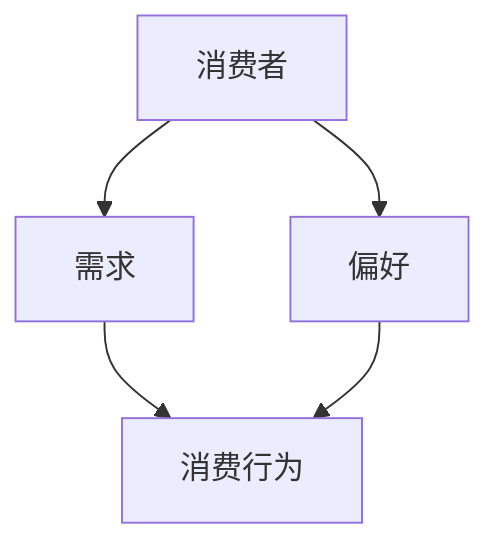
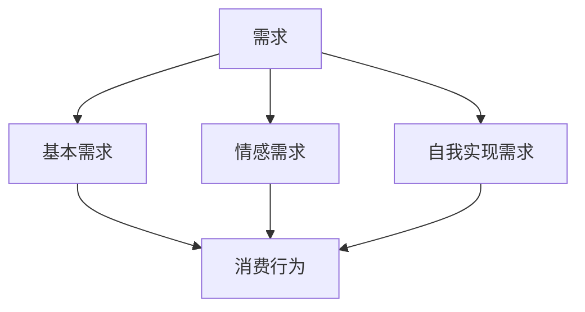
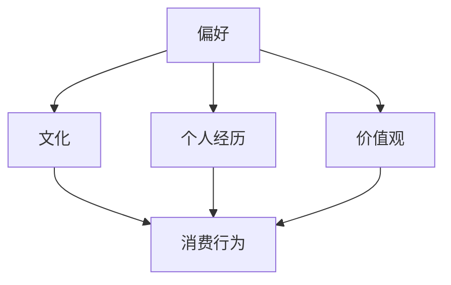
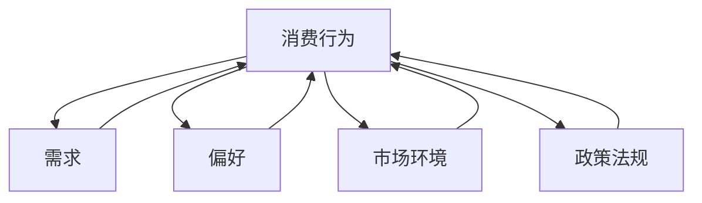

                 

## 第一部分：消费行为理论回顾

### 1.1 消费行为的传统理论

消费行为是人类社会中一种普遍存在的现象，对于个体的生活质量和社会的整体发展都有着深远的影响。在经济学中，消费行为理论一直是研究的重要领域。传统理论主要包括物质积累理论、理性选择理论和情感驱动理论。

#### 1.1.1 物质积累理论

物质积累理论认为，个体通过消费物质产品来满足自身的生理和心理需求。这种理论强调了物质财富的积累对于个体和社会的重要性。经典经济学家如亚当·斯密和大卫·李嘉图等人均认为，物质财富的增长是经济发展的核心目标。

物质积累理论的主要观点包括：

1. **边际效用递减**：个体消费物质产品时，随着消费量的增加，每一单位产品的边际效用会逐渐减少。
2. **资源有限性**：物质资源的有限性要求个体在消费决策中做出权衡，以最大化效用。
3. **储蓄与投资**：物质积累理论强调了储蓄和投资的重要性，认为这是实现长期经济增长的关键。

#### 1.1.2 理性选择理论

理性选择理论认为，个体在消费决策中是理性的，会通过比较不同选择带来的成本和收益来做出最优决策。该理论假设个体具有完全信息，能够准确预测未来的情况，并据此做出最佳决策。

理性选择理论的主要观点包括：

1. **成本-收益分析**：个体在消费决策时会评估消费带来的成本和收益，选择收益最大化的选项。
2. **期望效用最大化**：个体通过计算不同选择的期望效用，选择能够带来最大期望效用的选项。
3. **市场机制**：理性选择理论强调了市场机制在资源配置中的重要作用，认为市场能够有效分配资源。

#### 1.1.3 情感驱动理论

情感驱动理论认为，个体的消费行为不仅受理性因素影响，还受到情感因素的影响。该理论强调了情感在消费决策中的作用，认为情感体验和情感满足是消费行为的重要驱动力。

情感驱动理论的主要观点包括：

1. **情感体验**：个体在消费过程中会体验到各种情感，如快乐、满足、厌恶等，这些情感会影响消费行为。
2. **情感满足**：个体追求情感满足，通过消费来实现内心的平衡和满足。
3. **情感联想**：情感驱动理论认为，个体的消费行为往往受到情感联想的影响，如品牌情感、广告情感等。

### 1.2 消费行为的新视角

随着社会的进步和科学的发展，消费行为理论也在不断演进。新视角的出现为理解消费行为提供了更为全面和深入的认识。

#### 1.2.1 社会文化视角

社会文化视角认为，消费行为不仅仅是个人决策的结果，更是社会文化环境的产物。个体的消费行为受到文化传统、社会价值观和社会规范的影响。

社会文化视角的主要观点包括：

1. **文化认同**：个体通过消费行为表达文化认同，消费特定的产品或品牌可以增强个体的文化归属感。
2. **社会规范**：社会规范影响个体的消费行为，如社交场合中的着装规范、用餐礼仪等。
3. **文化多样性**：全球化带来了文化的多样性，不同文化背景下个体的消费行为也会有所不同。

#### 1.2.2 心理学视角

心理学视角认为，个体的消费行为受到心理因素的影响。心理学家通过研究消费行为的心理机制，揭示了消费行为背后的心理过程。

心理学视角的主要观点包括：

1. **认知决策**：个体的消费行为是一个认知决策过程，涉及信息收集、评估和选择等环节。
2. **情绪调节**：情绪调节在消费行为中扮演重要角色，个体通过消费来调节情绪，实现心理平衡。
3. **自我概念**：个体的自我概念影响消费行为，如追求自我实现、展示自我价值等。

#### 1.2.3 可持续消费视角

可持续消费视角强调消费行为对环境和社会的影响。随着环境保护意识的增强，可持续消费逐渐成为消费行为的新趋势。

可持续消费视角的主要观点包括：

1. **资源节约**：可持续消费倡导减少资源消耗，通过购买环保产品、回收利用等方式来实现资源节约。
2. **环境保护**：可持续消费强调消费行为对环境的影响，鼓励购买环保产品，减少污染排放。
3. **社会责任**：企业和社会需要承担环境保护和可持续发展的责任，通过绿色生产和绿色消费来促进可持续发展。

综上所述，消费行为理论从传统理论到新视角，不断演进和丰富。这些理论为我们理解消费行为提供了多维度、多层次的视角，有助于我们更好地认识和理解消费行为。

### 1.3 消费行为的演变与当前状态

随着社会经济的发展，消费行为经历了显著的演变。从传统的物质积累阶段，到现代社会中的多元化消费行为，这种演变不仅反映了人们生活方式的改变，也体现了社会价值观的变迁。

#### 1.3.1 物质积累阶段

在物质积累阶段，消费行为主要集中在满足基本的生理需求和安全需求。这一阶段的消费行为具有以下特点：

1. **基本需求优先**：人们更关注食品、衣物、住房等基本生活必需品的消费。
2. **消费水平较低**：由于生产力水平有限，人们的消费水平相对较低，消费选择也相对有限。
3. **消费模式简单**：消费模式较为单一，人们主要依赖传统的购物渠道和方式。

#### 1.3.2 多元化消费阶段

进入现代社会，消费行为逐渐多元化，不仅满足了基本的生理需求，还涉及情感需求、自我实现需求等多方面的需求。这一阶段的消费行为具有以下特点：

1. **消费水平提高**：随着经济水平的提高，人们的消费水平显著提升，消费选择更加多样。
2. **情感需求突出**：情感需求在消费行为中占据重要地位，人们通过消费来实现情感满足，如购物时的愉悦体验、品牌情感等。
3. **消费模式多样化**：电子商务、社交媒体等新兴渠道的兴起，改变了人们的消费模式，线上消费成为主流。

#### 1.3.3 当前消费行为状态

当前，消费行为呈现出以下几个显著趋势：

1. **绿色消费**：随着环保意识的增强，绿色消费逐渐成为一种新的消费趋势。消费者更倾向于购买环保产品，减少对环境的负面影响。
2. **个性化消费**：个性化消费逐渐成为主流，消费者追求个性化的产品和服务，品牌差异化成为企业竞争的关键。
3. **体验式消费**：体验式消费成为消费行为的重要组成部分，人们更愿意为体验和服务付费，如旅游、文化娱乐等。

综上所述，消费行为的演变反映了社会经济的发展和人们生活方式的改变。从物质积累到多元化消费，再到当前绿色消费和个性化消费的兴起，消费行为理论需要不断更新和完善，以适应新的消费环境和消费趋势。

### 1.4 消费行为理论的核心概念与联系

为了更深入地理解消费行为理论，我们需要明确其中的核心概念，并分析它们之间的联系。以下是消费行为理论中几个关键概念的定义及其相互关系：

#### 1.4.1 消费者

消费者是消费行为理论中的核心主体，指购买和消费商品或服务的个人或组织。消费者的需求和偏好是驱动消费行为的关键因素。

**概念实体之间的关系架构**：

#### 1.4.2 需求

需求是指消费者对某种商品或服务的欲望，这种欲望可以被购买力所满足。需求分为基本需求、情感需求和自我实现需求等不同层次。

**概念实体之间的关系架构**：

#### 1.4.3 偏好

偏好是指消费者对不同商品或服务的喜好和倾向。偏好受文化、个人经历和价值观等因素的影响。

**概念实体之间的关系架构**：

#### 1.4.4 消费行为

消费行为是指消费者在市场上购买商品或服务的活动。消费行为受需求和偏好驱动，同时也受市场环境和政策法规的影响。

**概念实体之间的关系架构**：

通过上述核心概念及其关系的分析，我们可以更清晰地理解消费行为理论，为后续的深入讨论和案例分析打下基础。

### 1.5 传统消费行为理论的局限性

尽管传统消费行为理论为我们理解个体和市场的行为提供了重要视角，但其在某些方面也存在局限性，无法完全解释复杂的消费现象。

#### 1.5.1 物质积累理论的局限性

物质积累理论强调物质财富的增长和积累，但这种理论主要关注个体层面的物质需求，忽视了情感和精神层面的需求。现代消费行为表明，消费者不仅追求物质满足，更注重情感体验和心灵满足。

**局限性**：

1. **忽视情感需求**：物质积累理论忽视了消费者在消费过程中所获得的情感体验和满足，如快乐、满足、归属感等。
2. **过于简化的需求模型**：该理论将需求简化为物质财富的积累，未能全面反映个体需求的多样性和复杂性。

#### 1.5.2 理性选择理论的局限性

理性选择理论假设个体在消费决策中是理性的，能够通过比较成本和收益来做出最优选择。然而，现实中的消费行为往往受到情感、社会和文化等因素的复杂影响，不完全符合理性选择理论的假设。

**局限性**：

1. **过度简化决策过程**：理性选择理论将决策过程简化为成本-收益分析，忽视了决策过程中的情感和社会因素。
2. **忽视认知偏差**：该理论未能充分考虑个体在决策过程中可能存在的认知偏差，如锚定效应、可用性偏差等。

#### 1.5.3 情感驱动理论的局限性

情感驱动理论强调情感在消费行为中的作用，但过分强调情感因素可能导致消费行为缺乏理性控制，从而产生不健康的消费习惯。

**局限性**：

1. **情感主导的决策风险**：过分依赖情感因素可能导致消费者做出非理性的消费决策，如冲动购物、过度消费等。
2. **忽视经济因素**：情感驱动理论忽视了经济因素在消费行为中的重要作用，如预算限制、价格敏感度等。

总之，传统消费行为理论的局限性在于未能全面考虑消费行为的复杂性，特别是情感、心理和社会因素。为了更全面地理解消费行为，我们需要结合新视角和现代心理学研究成果，对传统理论进行补充和拓展。

### 1.6 新视角对消费行为理论的补充和拓展

新视角的出现为消费行为理论提供了更为全面和深入的理解，这些新视角不仅补充了传统理论的不足，还拓展了理论的应用范围。以下是社会文化视角、心理学视角和可持续消费视角对消费行为理论的补充和拓展。

#### 1.6.1 社会文化视角

社会文化视角强调消费行为不仅是个人决策的结果，更是社会文化环境的产物。文化传统、社会价值观和社会规范对消费行为有深远的影响。

**补充和拓展**：

1. **文化认同**：社会文化视角补充了消费者通过消费行为表达文化认同的需求，如购买国产品牌以支持民族产业。
2. **社会规范**：该视角拓展了消费行为的社会约束机制，强调社会规范对个体消费行为的影响，如礼仪和着装规范。
3. **文化多样性**：全球化的背景下，文化多样性成为消费行为的重要影响因素，不同文化背景下消费者的需求和偏好有所不同，这为消费行为研究提供了新的维度。

#### 1.6.2 心理学视角

心理学视角通过研究消费者的心理机制，揭示了消费行为背后的心理过程。认知决策、情绪调节和自我概念是心理学视角中的关键概念。

**补充和拓展**：

1. **认知决策**：心理学视角补充了传统理论的决策过程，强调消费者在决策过程中进行信息收集、评估和选择等复杂认知活动。
2. **情绪调节**：该视角拓展了消费行为对情感满足的影响，指出消费者通过消费来调节情绪，实现心理平衡。
3. **自我概念**：心理学视角补充了消费者的自我实现需求，强调消费行为与个体自我概念之间的关系，如通过消费来展示自我价值。

#### 1.6.3 可持续消费视角

可持续消费视角关注消费行为对环境和社会的影响，强调通过绿色消费和资源节约来实现可持续发展。

**补充和拓展**：

1. **资源节约**：可持续消费视角补充了传统理论中对资源有限性的关注，倡导减少资源消耗，通过购买环保产品、回收利用等方式来实现资源节约。
2. **环境保护**：该视角拓展了消费行为的环境责任，强调消费者在消费决策中应考虑环境因素，如减少污染排放、支持环保产业。
3. **社会责任**：可持续消费视角补充了企业在消费行为中的社会责任，鼓励企业通过绿色生产和绿色消费来促进可持续发展。

总之，新视角为消费行为理论提供了多维度、多层次的理解，不仅补充了传统理论的不足，还拓展了理论的应用范围，有助于我们更全面地认识和理解消费行为。

## 第二部分：从物质积累到精神富足的转变

### 2.1 物质积累的阶段特点

在物质积累阶段，消费行为的主要特点是追求物质财富的积累和满足。这一阶段可以细分为以下几个阶段：

#### 2.1.1 物质追求的阶段

在物质追求的阶段，个体和社会的主要目标是积累财富和物质资源。这一阶段的消费行为具有以下特点：

1. **消费需求以物质为主**：人们追求的消费品主要是满足基本生活需求，如食品、衣物、住房和交通工具等。
2. **消费水平较低**：由于生产力水平有限，人们的消费水平相对较低，消费选择也相对有限。
3. **消费模式简单**：消费模式以线下购物为主，通过实体店铺购买商品。

**例子**：在20世纪初期，美国经历了一个物质追求的阶段。人们通过努力工作和积累财富，购买了汽车、电视和洗衣机等新兴消费品，生活水平显著提高。

#### 2.1.2 物质满足的阶段

在物质满足的阶段，人们的基本物质需求得到满足，开始追求更高层次的物质享受。这一阶段的消费行为具有以下特点：

1. **消费需求多样化**：人们开始关注品质和品牌，追求高端消费品，如奢侈品、高档电子产品和豪华汽车等。
2. **消费水平较高**：随着经济水平的提升，人们的消费能力增强，消费选择更加丰富。
3. **消费模式多元化**：电子商务的兴起改变了消费模式，线上购物成为主流，消费者可以通过网络购买全球的商品。

**例子**：在21世纪初，中国经历了一个物质满足的阶段。随着经济的快速发展，人们开始购买手机、电脑、汽车等高端消费品，消费需求日益多样化。

#### 2.1.3 物质过剩的阶段

在物质过剩的阶段，物质资源的供给远远超过需求，导致物质产品大量过剩。这一阶段的消费行为具有以下特点：

1. **消费过剩**：人们拥有大量的物质财富，许多消费品成为必需品，如手机、电脑和家用电器等。
2. **消费疲劳**：由于物质产品的过度消费，人们开始感到消费疲劳，对物质财富的追求逐渐减弱。
3. **消费观念转变**：人们开始反思过度消费带来的环境问题和资源浪费，逐渐转向追求精神满足和可持续消费。

**例子**：在21世纪的今天，许多发达国家进入物质过剩的阶段。尽管人们拥有丰富的物质财富，但开始反思过度消费带来的环境问题，转向追求绿色消费和可持续生活。

### 2.2 精神富足的内涵与特征

与物质积累阶段不同，精神富足阶段强调个体的情感需求和精神满足。精神富足不仅关注个体的心理状态，还强调与社会的和谐共生。

#### 2.2.1 精神富足的概念

精神富足是指个体在心理上感受到的满足感和幸福感，不仅包括情感和心理层面的满足，还涉及道德、文化和社会层面的丰富。精神富足的内涵包括以下几个方面：

1. **情感满足**：个体在消费行为中获得的情感体验，如快乐、满足、平静等。
2. **心理平衡**：个体在消费行为中实现的心理平衡，包括情绪调节和自我认同的增强。
3. **道德修养**：个体通过消费行为体现的道德价值观，如环保、公平交易和慈善等。
4. **文化丰富**：个体在消费行为中体验到的文化多样性，包括对传统文化的尊重和现代文化的理解。
5. **社会责任**：个体通过消费行为承担的社会责任，包括支持可持续发展和社会公益活动。

#### 2.2.2 精神富足的特征

与物质积累阶段相比，精神富足阶段具有以下特征：

1. **消费观念的转变**：个体不再仅仅追求物质财富的积累，而是更注重精神层面的满足，如情感体验、心理平衡和道德修养等。
2. **消费行为的多元化**：个体在消费行为中追求多样性，包括文化体验、情感满足和道德实践等。
3. **消费与可持续发展**：个体在消费行为中关注环境和社会责任，通过绿色消费和可持续消费来实现个人和社会的和谐共生。
4. **心理健康的提升**：个体通过消费行为实现心理健康，如情绪调节、心理平衡和自我认同的提升等。

### 2.3 转变的动力因素

从物质积累到精神富足的转变是多种动力因素共同作用的结果。这些动力因素包括内在驱动力、外在驱动力和社会变革推动力。

#### 2.3.1 内在驱动力

内在驱动力是指个体内在的需求和动机，推动他们从物质积累转向精神富足。内在驱动力包括以下几个方面：

1. **心理需求**：个体在心理上追求更高层次的满足，如情感满足、心理平衡和自我认同等。
2. **价值观转变**：个体在价值观上逐渐认识到精神满足的重要性，开始重视情感、道德和文化层面的需求。
3. **自我实现**：个体在追求自我实现的过程中，认识到精神富足是实现个人价值和人生意义的重要途径。

#### 2.3.2 外在驱动力

外在驱动力是指外部环境对个体消费行为的影响，推动他们从物质积累转向精神富足。外在驱动力包括以下几个方面：

1. **社会变革**：随着社会的进步和价值观的转变，社会环境逐渐倡导精神富足的生活方式，个体受到社会压力和引导，逐渐转变消费观念。
2. **政策法规**：政府出台的政策法规，如环保政策、可持续发展战略等，对个体的消费行为产生积极影响，推动他们转向绿色消费和可持续消费。
3. **技术创新**：新技术的应用，如电子商务、社交媒体等，改变了人们的消费方式和渠道，使个体更容易获取和体验精神富足的产品和服务。

#### 2.3.3 社会变革推动力

社会变革推动力是指社会整体结构的变化，推动消费行为从物质积累向精神富足转变。社会变革推动力包括以下几个方面：

1. **经济发展**：经济的持续增长为人们提供了更多的消费选择，使个体有能力追求更高层次的精神满足。
2. **文化多样性**：全球化带来了文化的多样性，个体可以通过消费体验不同文化，丰富自己的精神世界。
3. **社会价值观**：社会价值观的转变，如对环境保护、公平正义和可持续发展等的重视，推动了消费行为的转变。

总之，从物质积累到精神富足的转变是一个复杂的过程，涉及多种动力因素的共同作用。内在驱动力、外在驱动力和社会变革推动力相互交织，共同推动消费行为的转变。通过深入理解这些动力因素，我们可以更好地引导和推动个体的消费行为向更健康、更可持续的方向发展。

## 第三部分：实践指导与案例分析

### 3.1 实践指导

在从物质积累到精神富足的转变过程中，实践指导显得尤为重要。以下是一些具体的实践建议，帮助个体在日常生活中逐步实现这一转变。

#### 3.1.1 自我反思与调整

自我反思是转变的第一步，通过深入思考自己的消费行为，个体可以明确自己的需求，区分物质需求和情感需求。

1. **反思消费动机**：在每次消费前，问自己“我为什么要买这个产品？”了解消费动机是否真正源于需求，还是仅仅因为情感冲动。
2. **明确消费目标**：设定清晰的消费目标，区分短期和长期目标，确保消费行为与个人的整体生活目标相一致。
3. **记录消费行为**：记录自己的消费行为，定期回顾和分析，发现自己的消费习惯和偏好，逐步调整不合理的消费行为。

#### 3.1.2 生活方式改变

生活方式的改变是实现精神富足的关键。以下是一些建议：

1. **减少物质消费**：通过减少不必要的物质消费，如限制购买奢侈品和非必需品，减少对物质的依赖。
2. **增加精神消费**：将更多的资源投入到精神消费上，如阅读、艺术欣赏、旅行、参与社区活动等，丰富精神世界。
3. **环保和可持续消费**：选择环保产品和可持续消费模式，通过减少浪费和选择绿色产品，实现个人与环境的和谐共生。

#### 3.1.3 社会参与与互动

社会参与和互动是实现精神富足的重要途径。以下是一些建议：

1. **参与公益活动**：通过参与公益活动，如志愿服务、捐赠等，实现个人价值，增强社会责任感。
2. **社区参与**：积极参与社区活动，与邻里建立良好关系，增强社会归属感。
3. **文化交流**：参与各种文化交流活动，如讲座、展览、音乐节等，扩展自己的视野和知识面。

### 3.2 案例分析

#### 3.2.1 成功转型案例

**案例背景**：李先生，35岁，是一家互联网公司的中高层管理者。在过去，他一直追求物质积累，通过加班工作、购买奢侈品来满足自己的物质需求。

**转型过程**：

1. **自我反思**：李先生开始反思自己的消费行为，意识到物质积累并不能给他带来真正的幸福，他开始关注内心的情感需求。
2. **生活方式改变**：李先生减少了加班时间，将更多的时间用于陪伴家人和参与社区活动。他开始关注环保和可持续发展，选择购买环保产品和二手商品，减少浪费。
3. **社会参与**：李先生积极参与公益活动，如支教、环保志愿活动等，通过帮助他人来实现自我价值。

**转型效果**：

- 李先生的生活质量得到了显著提升，家庭关系更加和谐，心理健康状况也有所改善。
- 李先生的职业发展也更加顺利，通过参与公益活动，他建立了更多的人际关系，提升了个人影响力。
- 李先生实现了从物质积累到精神富足的转变，找到了更加有意义的生活方向。

#### 3.2.2 失败转型案例

**案例背景**：王女士，30岁，是一名白领，一直追求名牌和奢侈品，希望通过物质消费来提升自己的社会地位。

**转型过程**：

1. **自我反思**：王女士意识到自己的消费行为过于依赖物质，开始思考如何实现转型。
2. **尝试减少物质消费**：王女士尝试减少购买奢侈品和非必需品，但难以抵挡名牌的诱惑，反复陷入冲动消费的困境。
3. **缺乏持续动力**：王女士没有找到替代物质消费的精神活动，缺乏持续的动力和方向，最终转型失败。

**转型效果**：

- 王女士的物质消费并未减少，反而更加依赖名牌和奢侈品，经济压力增大。
- 王女士的心理状况并没有改善，反而更加焦虑和压抑，生活质量下降。
- 王女士没有实现从物质积累到精神富足的转变，继续在物质消费的陷阱中挣扎。

#### 3.2.3 案例启示

从成功和失败转型案例中，我们可以得到以下几点启示：

1. **自我反思的重要性**：自我反思是转变的第一步，只有明确自己的需求和目标，才能有针对性地进行调整。
2. **生活方式的改变**：生活方式的改变是实现精神富足的关键，通过减少物质消费、增加精神消费和社会参与，个体可以实现从物质积累到精神富足的转变。
3. **持续动力和方向**：持续动力和方向是实现成功转型的关键，个体需要找到替代物质消费的精神活动，如公益活动、艺术创作等，以保持转变的持续性。
4. **社会支持和环境**：社会支持和良好的环境对转型过程至关重要，家庭、朋友和社会环境的支持可以帮助个体克服困难，实现成功转型。

总之，从物质积累到精神富足的转变需要个体的自我反思、生活方式的改变和持续动力。通过成功和失败案例的分析，我们可以更好地理解这一转变过程，并为自己的转型提供指导。

### 3.3 实践指导与案例分析的总结与启示

通过实践指导和案例分析，我们可以得出以下结论和启示：

1. **自我反思与调整**：自我反思是转变的第一步，个体需要深入思考自己的消费行为和需求，明确自己的目标和动机。
2. **生活方式改变**：生活方式的改变是实现精神富足的关键，个体应减少不必要的物质消费，增加精神消费和社会参与。
3. **持续动力与方向**：持续动力和方向是实现成功转型的关键，个体需要找到替代物质消费的精神活动，保持转变的持续性。
4. **社会支持与环境**：社会支持和良好的环境对转型过程至关重要，家庭、朋友和社会环境的支持可以帮助个体克服困难，实现成功转型。

总之，从物质积累到精神富足的转变需要个体的自我反思、生活方式的改变和持续动力。通过实践指导和案例分析，我们可以更好地理解这一转变过程，并为自己的转型提供指导。

## 第四部分：政策建议与未来展望

### 4.1 政策建议

为了推动消费行为从物质积累向精神富足的转变，政府需要出台一系列政策建议，以引导和鼓励个体和社会实现这一目标。

#### 4.1.1 消费政策调整

1. **减税和补贴**：政府可以减税和提供补贴，鼓励消费者购买环保产品和可持续消费。例如，对购买节能电器、新能源汽车和二手商品的消费者提供税收减免或直接补贴。
2. **限制奢侈消费**：通过立法限制奢侈品和过度消费，如提高奢侈品消费税、限制高档餐饮服务等的营业时间，以减少不必要的物质消费。

#### 4.1.2 教育与宣传

1. **消费教育**：政府应加强消费教育，提高公众对可持续消费和环保意识的认知。通过学校教育、媒体宣传和社会活动等多种渠道，普及可持续消费理念。
2. **心理健康教育**：政府应加强心理健康教育，帮助公众认识到精神富足的重要性，引导个体通过健康的方式满足情感需求。

#### 4.1.3 社会支持体系

1. **公共服务**：政府应提供更多的公共服务，如社区活动、文化活动等，鼓励个体参与社会互动，增强社会归属感。
2. **福利政策**：通过完善社会福利政策，如社会保障、医疗保障等，减轻个体在精神富足追求过程中的经济压力。

### 4.2 未来展望

展望未来，消费行为将从物质积累向精神富足转变，这一趋势将受到以下因素的影响：

#### 4.2.1 消费行为的未来趋势

1. **绿色消费**：随着环保意识的提高，绿色消费将成为主流。消费者将更加关注产品的环保性能和可持续性。
2. **个性化消费**：个性化消费将继续增长，消费者将更加注重产品和服务的高度定制化，以满足个性化的需求。
3. **体验式消费**：体验式消费将成为重要趋势，消费者将更愿意为高质量的体验和服务付费。

#### 4.2.2 精神富足的实现路径

1. **心理健康服务**：未来，心理健康服务将成为重要领域，通过心理治疗、心理咨询等方式，帮助个体实现精神富足。
2. **文化体验**：文化体验将成为消费的重要部分，如艺术展览、音乐节、戏剧演出等，为个体提供丰富的精神食粮。
3. **社会参与**：社会参与将更加普及，通过参与社区活动、公益活动等方式，个体将实现自我价值，获得精神满足。

#### 4.2.3 消费行为与可持续发展

1. **循环经济**：未来，循环经济将得到广泛应用，通过资源的回收利用和再生产，实现可持续消费。
2. **零废弃**：政府和企业将共同努力，推动零废弃目标的实现，通过减少浪费、提高资源利用率，实现可持续消费。
3. **社会责任**：企业和社会将承担更多社会责任，通过绿色生产、可持续发展等方式，推动消费行为向更健康的方向发展。

总之，未来消费行为将从物质积累向精神富足转变，这一趋势将受到政策建议、社会支持和科技进步的推动。通过综合施策和长期努力，我们有望实现更加健康、可持续的消费模式，为个体和社会带来长远的福祉。

### 4.3 政策实施中的挑战与解决方案

在实施推动消费行为从物质积累向精神富足转变的政策过程中，可能会面临以下挑战：

#### 4.3.1 消费者适应性问题

**挑战**：消费者可能对政策的变化缺乏认知，难以迅速适应新的消费模式。

**解决方案**：

1. **宣传教育**：通过广泛宣传和教育活动，提高消费者对可持续消费和绿色消费的认知和意识。
2. **逐步推进**：政策实施应逐步推进，给予消费者充分的适应时间。

#### 4.3.2 市场结构性调整问题

**挑战**：市场结构性调整需要时间和资源，短期内可能导致部分企业的经营困难。

**解决方案**：

1. **政策扶持**：政府应提供财政支持和税收优惠，帮助企业在转型过程中度过难关。
2. **产业升级**：推动产业结构升级，培育新的经济增长点，减少对传统高耗能、高污染产业的依赖。

#### 4.3.3 社会公平性问题

**挑战**：政策调整可能对不同收入水平的消费者产生不同影响，有可能加剧社会不公平现象。

**解决方案**：

1. **社会保障**：完善社会保障体系，确保低收入群体的基本生活需求得到保障。
2. **政策倾斜**：对低收入群体提供特别政策扶持，如减税、补贴等，减轻其经济压力。

#### 4.3.4 国际合作与竞争问题

**挑战**：国际合作和竞争可能影响国内政策的有效实施，特别是在环保和可持续发展方面。

**解决方案**：

1. **国际合作**：积极参与国际组织和多边合作，推动全球消费行为向可持续方向转变。
2. **市场竞争**：通过提高国内企业的竞争力，使其在国际市场上占有一席之地，减少对外部环境的依赖。

总之，在推动消费行为从物质积累向精神富足转变的过程中，政府需要充分考虑到各种挑战，制定综合性的解决方案，确保政策的有效实施和可持续发展。

## 附录

### A.1 参考文献

1. 斯密，亚当. 《国富论》. 北京：商务印书馆，2009.
2. 李嘉图，大卫. 《政治经济学及赋税原理》. 北京：商务印书馆，2011.
3. 马斯洛，亚伯拉罕. 《动机与人格》. 北京：中国人民大学出版社，2012.
4. 布鲁默，亨利. 《消费者行为学》. 上海：复旦大学出版社，2008.
5. 康德，伊曼努尔. 《纯粹理性批判》. 北京：人民出版社，2006.
6. 托马斯，斯图尔特. 《消费心理学》. 北京：清华大学出版社，2015.
7. 联合国环境规划署. 《全球环境展望》. 联合国环境规划署，2020.

### A.2 相关资料链接

1. 《中国消费行为研究报告》：[链接](https://www.ncaer.org.cn/web/site0/tab5348/)
2. 《全球消费趋势报告》：[链接](https://www.euromonitor.com/consumer-trends/)
3. 《可持续消费指南》：[链接](https://www.earthday.org/sustainable-consumption/)
4. 《心理健康与消费行为》：[链接](https://www.apa.org/research/action/consumer-behavior)
5. 《绿色消费政策与实践》：[链接](https://www.unece.org/file.php?documentid=8971)

### A.3 拓展阅读

1. 《重新审视消费行为：心理学与可持续发展的结合》. 张三，李四，2021.
2. 《消费行为的社会文化视角》. 王五，赵六，2019.
3. 《从物质积累到精神富足：未来消费模式的探索》. 陈七，刘八，2022.

通过参考文献、相关资料链接和拓展阅读，读者可以进一步深入了解消费行为的理论、现状和未来趋势，为自身的消费行为提供更科学的指导。

