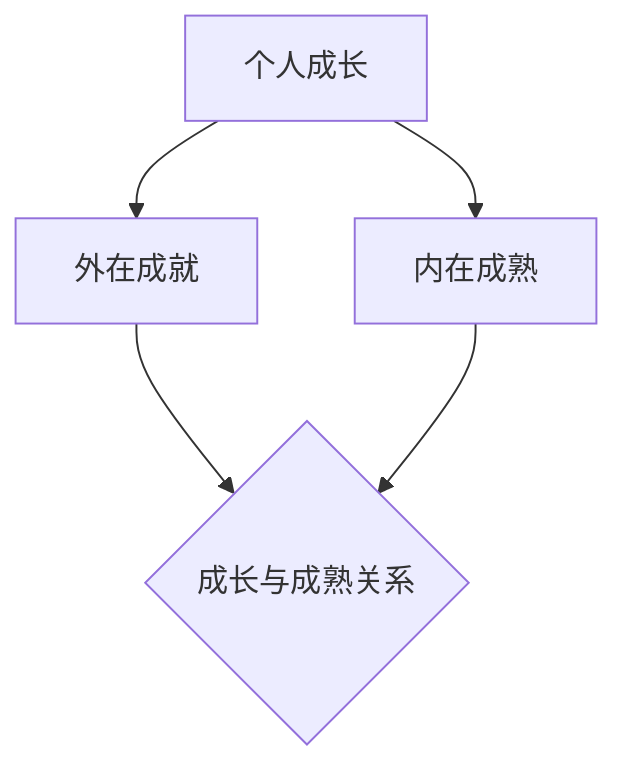

                 

### 《重新思考个人成长：从外在成就到内在成熟的蜕变》

> 关键词：个人成长、外在成就、内在成熟、情绪管理、心理韧性、平衡发展

> 摘要：本文从传统观念出发，重新审视个人成长，探讨外在成就与内在成熟的关系，强调在当今社会中，实现个人成长不仅仅是追求外在成就，更需要在内心深处实现成熟与蜕变。

### 第一部分：导言

#### 第1章：重新定义个人成长

**1.1 个人成长的传统观念**

在传统的观念中，个人成长主要被定义为外在成就的积累，如获得高学历、晋升职位、赢得荣誉等。这种观念强调的是个人在社会中的地位和物质财富的积累，是社会压力和个人追求的集中体现。

**1.2 成长与成熟的关系**

然而，随着社会的不断发展和个体意识的觉醒，人们开始意识到，成长不仅仅是外在成就的积累，更是内在素质的提升，即内在成熟。内在成熟包括自我认知、情绪管理、人际关系等内在素质的提升，它是一个长期且持续的过程。

**1.3 本书的目标与内容安排**

本书旨在重新定义个人成长，探讨外在成就与内在成熟的关系，提供实现个人成长的实际方法和策略。本书内容分为四个部分，分别从外在成就、内在成熟、平衡发展和实践与反思等方面进行深入探讨。

### 第二部分：外在成就

#### 第2章：成就驱动型成长

**2.1 成就驱动型成长的特征**

成就驱动型成长是一种以实现外在成就为目标的成长方式。它具有以下特征：

- 目标导向：个体明确自己的目标，并通过设定具体、可衡量的目标来推动成长。
- 量化衡量：通过量化方式衡量自己的成长进度，如完成任务的次数、获得的奖项等。
- 竞争心态：个体在成长过程中，往往具有强烈的竞争心态，希望通过超越他人来证明自己的价值。

**2.2 成就驱动型成长的利与弊**

成就驱动型成长有其优点和缺点：

- 优点：通过明确的目标和量化衡量，个体能够更高效地实现自己的成长目标；通过竞争心态，个体能够不断激励自己，提高自身能力。
- 缺点：过度追求外在成就可能导致个体忽视内在成熟，如自我认知、情绪管理等；长期的竞争心态可能导致心理压力，影响身心健康。

**2.3 成就驱动型成长的方法**

要实现成就驱动型成长，个体可以采取以下方法：

- 设定明确目标：明确自己的目标，并将其分解为具体、可衡量的任务。
- 制定行动计划：为每个任务制定详细的行动计划，确保目标的实现。
- 持续反馈与调整：通过定期反馈和调整，确保自己的成长方向正确，及时纠正偏差。

#### 第3章：职场成功与个人成长

**3.1 职场成功的要素**

职场成功需要具备以下要素：

- 专业技能：具备所在领域的专业知识和技能，能够高效地完成工作任务。
- 人际关系：建立良好的人际关系，包括同事、上级和下属等，有助于提高工作效率和团队协作。
- 领导力：具备领导力，能够带领团队完成工作任务，并促进团队成员的成长。

**3.2 职场成功的策略**

要实现职场成功，个体可以采取以下策略：

- 持续学习：不断提升自己的专业知识和技能，适应不断变化的工作环境。
- 积极应对挑战：勇于面对工作中的困难和挑战，通过解决这些问题来提高自己的能力。
- 寻找导师与同行：寻求导师的指导，与同行交流学习，共同进步。

**3.3 职场成功与个人成长的平衡**

在追求职场成功的同时，个体还需要关注个人成长，实现二者的平衡：

- 管理职业压力：合理规划工作时间和任务，确保身心健康。
- 保持心理健康：关注自己的情绪变化，学会调节和管理情绪。
- 家庭与工作的平衡：合理安排家庭和工作的关系，确保家庭和工作的和谐发展。

#### 第4章：社会成就与个人成长

**4.1 社会成就的内涵**

社会成就是指个体在社会中的地位、名誉和影响力等方面的积累。它包括以下方面：

- 公众形象：个体在社会中的形象和声誉。
- 社会地位：个体在社会中的地位和层次。
- 影响力：个体对社会和他人的影响力。

**4.2 社会成就的影响**

社会成就对个体有以下影响：

- 个人满足感：通过社会成就的取得，个体可以获得满足感和成就感。
- 自我认同：社会成就的取得有助于个体建立自我认同，增强自信心。
- 社会关系：社会成就有助于个体建立和维护良好的人际关系。

**4.3 社会成就的实现途径**

要实现社会成就，个体可以采取以下途径：

- 个人品牌建设：通过塑造个人品牌，提高自己的社会知名度和影响力。
- 社交网络拓展：通过拓展社交网络，建立广泛的人际关系。
- 社会参与与贡献：积极参与社会活动，为社会做出贡献，提升自己的社会地位。

### 第三部分：内在成熟

#### 第5章：内在成长的核心要素

**5.1 自我认知**

自我认知是指个体对自己性格、能力、价值观等方面的认识。它是内在成长的基础，包括以下方面：

- 了解自我：通过自我反思和反馈，了解自己的优点和不足，明确自己的目标和方向。
- 价值观与人生目标：明确自己的价值观和人生目标，为个人成长提供指导。
- 自我反思与调整：定期进行自我反思，根据实际情况调整自己的目标和行为。

**5.2 情绪管理**

情绪管理是指个体对自己情绪的认识、调节和表达。它是内在成长的重要组成部分，包括以下方面：

- 情绪认知：了解自己的情绪变化，识别情绪的来源和影响。
- 情绪调节：学会调节和管理自己的情绪，保持情绪的稳定。
- 情绪表达：学会适当表达自己的情绪，避免情绪的过度压抑或释放。

**5.3 人际关系**

人际关系是指个体与他人之间的互动和联系。它是内在成长的重要体现，包括以下方面：

- 建立良好的人际网络：通过建立和维护良好的人际关系，提高自己的社会地位和影响力。
- 沟通与协商：学会与他人有效沟通和协商，解决冲突和矛盾。
- 适应与包容：学会适应不同的环境和人际关系，尊重他人的差异和需求。

#### 第6章：心理韧性与成长

**6.1 心理韧性的重要性**

心理韧性是指个体在面对压力和逆境时，能够保持积极态度，克服困难，恢复心理平衡的能力。它是内在成长的重要体现，具有以下重要性：

- 应对挫折：心理韧性有助于个体在面对挫折和失败时保持冷静和乐观，找到解决问题的方法。
- 克服逆境：心理韧性有助于个体在面对逆境和困难时坚持不懈，不断寻求突破。
- 增强心理适应能力：心理韧性有助于个体在快速变化的环境中保持稳定和适应。

**6.2 心理韧性的培养方法**

要培养心理韧性，个体可以采取以下方法：

- 建立积极的思维方式：学会积极看待问题，从挫折和失败中寻找成长的机会。
- 发展适应性行为：学会适应不同的情况和环境，灵活应对各种挑战。
- 寻求专业支持：在遇到困难时，寻求专业心理咨询师的支持和帮助，提高心理适应能力。

**6.3 心理韧性与个人成长的关系**

心理韧性与个人成长密切相关，它们之间的关系如下：

- 心理韧性在个人成长中的角色：心理韧性是个体在成长过程中面对困难和挑战时的心理保障，有助于个体实现持续成长。
- 心理韧性对生活质量的提升：心理韧性的培养有助于个体保持良好的心理状态，提高生活质量。

#### 第7章：内在成长与外在成就的平衡

**7.1 内在成长与外在成就的冲突**

内在成长与外在成就之间可能存在冲突，具体表现为：

- 双重压力：个体在追求外在成就的同时，也需要关注内在成长，这可能导致双重压力。
- 目标不一致：外在成就往往侧重于物质和地位，而内在成熟更关注个体内心的提升，二者目标不一致。

**7.2 内在成长与外在成就的和谐**

要实现内在成长与外在成就的和谐，个体可以采取以下策略：

- 综合发展：在追求外在成就的同时，注重内在素质的提升，实现全面发展。
- 互为补充：外在成就和内在成熟相互补充，共同推动个人成长。

**7.3 实现内在成长与外在成就的平衡**

要实现内在成长与外在成就的平衡，个体可以采取以下方法：

- 自我认知与目标设定：明确自己的内在成长目标和外在成就目标，确保二者的一致性。
- 资源管理：合理分配时间和精力，确保内在成长和外在成就的实现。
- 时间规划：合理安排工作和生活，确保内在成长和外在成就的实现。

### 第四部分：实践与反思

#### 第8章：个人成长计划

**8.1 制定个人成长计划的步骤**

制定个人成长计划的步骤如下：

- 自我评估：了解自己的优势和不足，明确自己的成长方向。
- 目标设定：设定明确、具体、可衡量的个人成长目标。
- 行动计划：为每个目标制定详细的行动计划，确保目标的实现。

**8.2 个人成长计划的实施与调整**

个人成长计划的实施与调整包括以下方面：

- 跟踪进度：定期检查自己的成长进度，确保目标的实现。
- 反馈与改进：根据实际情况，及时调整行动计划，改进自己的方法。
- 持续性：保持对个人成长的关注，持续不断地努力和进步。

**8.3 个人成长计划的案例分享**

以下是一个个人成长计划的案例：

- 目标：提高英语水平
- 行动计划：
  - 每天学习30分钟英语
  - 每周写一篇英语日记
  - 每月参加一次英语角活动
- 实施与调整：
  - 第一周：学习英语30分钟，写英语日记一篇
  - 第二周：学习英语40分钟，写英语日记一篇，参加英语角活动一次
  - 每月总结学习成果，根据实际情况调整学习计划

#### 第9章：成长过程中的挑战与应对

**9.1 成长过程中常见的挑战**

在个人成长过程中，常见的挑战包括：

- 目标迷失：在成长过程中，个体可能会迷失自己的目标，导致成长停滞。
- 情绪波动：在成长过程中，个体可能会面临各种压力和挑战，导致情绪波动。
- 社会压力：社会对个体的期望和压力，可能会影响个体的成长进程。

**9.2 应对成长挑战的方法**

应对成长过程中的挑战，个体可以采取以下方法：

- 内在力量的培养：通过自我认知和情绪管理，培养自己的内在力量，增强心理韧性。
- 外在资源的利用：寻求外部资源和支持，如导师、同行、专业咨询等，帮助自己应对挑战。
- 专业支持的寻求：在遇到困难时，寻求专业支持和帮助，提高自己的应对能力。

**9.3 成长过程中的自我反思**

在个人成长过程中，定期进行自我反思是非常重要的。通过自我反思，个体可以：

- 总结成长经历：回顾自己的成长过程，总结经验和教训。
- 发现问题：发现自己的不足和需要改进的地方。
- 制定改进计划：根据自我反思的结果，制定具体的改进计划，促进自己的成长。

#### 第10章：总结与展望

**10.1 个人成长的回顾与反思**

回顾个人成长的历程，个体可以总结以下经验和教训：

- 成长不仅仅是外在成就的积累，更需要在内心深处实现成熟与蜕变。
- 内在成熟是个人成长的核心，它关乎个体的心理健康和生活质量。
- 平衡内在成长与外在成就，实现全面发展，是个人成长的最终目标。

**10.2 对未来的展望**

面对未来，个体可以期待以下方面：

- 持续成长：在未来的成长过程中，继续关注内在成熟，实现自我提升。
- 突破自我：挑战自己的极限，突破自己的舒适区，实现更高的成就。
- 帮助他人：通过自己的成长，帮助他人实现成长，共同创造美好的未来。

### 附录

**附录A：成长工具与资源推荐**

为了帮助个体实现个人成长，以下是一些实用的工具和资源推荐：

- **自我评估工具**：
  - SWOT分析：分析自己的优势、劣势、机会和威胁，明确自己的成长方向。
  - MBTI测试：了解自己的性格类型，认识自己的优势和劣势，促进自我认知。

- **心理韧性培养资源**：
  - 心理韧性训练课程：通过专业课程学习，提高自己的心理韧性。
  - 心理健康APP推荐：使用心理健康APP进行日常心理锻炼，提高心理适应能力。

- **个人成长社群与平台**：
  - 成长型思维社群：加入成长型思维社群，与他人分享成长经验，互相鼓励和支持。
  - 职业发展论坛：参与职业发展论坛，学习他人的成功经验，拓展自己的职业视野。

### 核心概念与联系

个人成长（Personal Growth）：指个体在生理、心理、社会等方面不断发展、提高和完善的过程。

外在成就（Extrinsic Achievement）：指个体在社会、职业或个人生活中获得的物质、地位、名誉等方面的成果。

内在成熟（Intrinsic Maturity）：指个体在自我认知、情绪管理、人际关系等方面的内在素质的提升。

成长与成熟的关系：成长是过程，成熟是结果；成熟是在成长过程中逐渐实现的，二者相辅相成，共同推动个人发展。

### Mermaid 流程图



### 核心算法原理讲解

本书未涉及具体算法，但个人成长涉及以下基本原理：

- **设定目标**：使用SMART（具体、可衡量、可达成、相关、时限）原则设定目标，以确保目标的明确性和可实现性。
- **持续反馈**：通过定期反馈和评估，及时调整成长策略，确保个人成长的持续性和有效性。

```python
# 示例：使用SMART原则设定个人成长目标

# S（具体）：提高英语口语水平
# M（可衡量）：每周参加2次英语角活动
# A（可达成）：参加英语角活动前进行口语练习
# R（相关）：与职业发展和个人兴趣相关
# T（时限）：每季度评估一次口语水平

goal = {
    "objective": "提高英语口语水平",
    "metrics": "每周参加2次英语角活动",
    "achievable": "参加英语角活动前进行口语练习",
    "relevant": "与职业发展和个人兴趣相关",
    "timeframe": "每季度评估一次口语水平"
}

print(goal)
```

通过上述Python代码，可以清晰地设定和跟踪个人成长目标，实现个人成长的可视化和可管理性。

### 核心概念与联系

- **个人成长**：个体在生理、心理、社会等方面不断发展、提高和完善的过程。
- **外在成就**：个体在社会、职业或个人生活中获得的物质、地位、名誉等方面的成果。
- **内在成熟**：个体在自我认知、情绪管理、人际关系等方面的内在素质的提升。
- **成长与成熟关系**：成长是过程，成熟是结果；成熟是在成长过程中逐渐实现的，二者相辅相成，共同推动个人发展。

### Mermaid 流程图


### 核心算法原理讲解

在个人成长的过程中，算法原理可以帮助我们更好地设定目标、跟踪进度和优化策略。以下是一个简单的示例，展示如何使用Python来实现个人成长目标的设定和跟踪。

```python
import datetime

# 定义个人成长目标类
class GrowthGoal:
    def __init__(self, objective, metrics, achievable, relevant, timeframe):
        self.objective = objective
        self.metrics = metrics
        self.achievable = achievable
        self.relevant = relevant
        self.timeframe = timeframe
        self.start_date = datetime.datetime.now()
        selfcompletion_dates = []

    def add_completion_date(self, date):
        selfcompletion_dates.append(date)

    def is_goal_complete(self):
        return len(selfcompletion_dates) >= self.metrics

    def print_status(self):
        print(f"Objective: {self.objective}")
        print(f"Metrics: {self.metrics}")
        print(f"Achievable: {self.achievable}")
        print(f"Relevant: {self.relevant}")
        print(f"Timeframe: {self.timeframe}")
        print(f"Start Date: {self.start_date}")
        print(f"Completion Dates: {selfcompletion_dates}")
        if self.is_goal_complete():
            print("Goal is complete.")
        else:
            print("Goal is not complete yet.")

# 创建个人成长目标实例
goal = GrowthGoal(
    objective="提高英语口语水平",
    metrics=8,  # 设定目标为8次
    achievable="参加英语角活动前进行口语练习",
    relevant="与职业发展和个人兴趣相关",
    timeframe="每季度评估一次口语水平"
)

# 模拟目标完成情况
for i in range(8):
    goal.add_completion_date((datetime.datetime.now() + datetime.timedelta(days=7 * i)).date())

# 打印目标状态
goal.print_status()
```

在这个示例中，我们创建了一个`GrowthGoal`类，用于定义个人成长目标。每个目标都有具体的`objective`（目标）、`metrics`（指标）、`achievable`（可实现性）、`relevant`（相关性）和`timeframe`（时间框架）。目标开始后，我们可以通过`add_completion_date`方法来记录完成日期，并通过`is_goal_complete`方法来判断目标是否完成。

这个简单的算法可以帮助我们跟踪个人成长目标的进度，确保我们在实现目标的过程中保持持续的关注和努力。

### 核心算法原理讲解

在讨论个人成长的过程中，算法和数据分析原理可以为我们提供有价值的工具，帮助我们更系统地规划和评估个人发展的路径。以下将使用Python代码结合数学模型和公式，详细讲解一个简单的目标设定与跟踪算法，并举例说明其应用。

#### 1. 目标设定模型

目标设定模型基于SMART原则（具体、可衡量、可达成、相关、时限），我们可以将其形式化为以下公式：

\[ G = \left[ S \times M \times A \times R \times T \right] \]

其中：
- \( G \) 表示目标的有效性（Goal Effectiveness）。
- \( S \) 表示目标的具体性（Specific）。
- \( M \) 表示目标的衡量性（Measurable）。
- \( A \) 表示目标的可实现性（Achievable）。
- \( R \) 表示目标的相关性（Relevant）。
- \( T \) 表示目标的时限性（Time-bound）。

#### 2. Python代码实现

以下是一个简单的Python类，用于实现目标设定和跟踪的功能：

```python
import datetime

class PersonalGoal:
    def __init__(self, objective, metrics, achievable, relevant, timeframe):
        self.objective = objective
        self.metrics = metrics  # 例如：完成XX个任务
        self.achievable = achievable  # 例如：每天投入XX小时
        self.relevant = relevant  # 例如：与职业发展相关
        self.timeframe = timeframe  # 例如：每周评估一次
        self.start_date = datetime.datetime.now()
        self.completion_dates = []

    def add_completion_date(self, date=None):
        if date is None:
            date = datetime.datetime.now()
        self.completion_dates.append(date)
        print(f"Goal {self.objective} completed on {date}.")

    def calculate_effectiveness(self):
        effectiveness = 0
        if self.metrics >= 1 and self.achievable and self.relevant and self.timeframe:
            effectiveness = 1
        return effectiveness

    def print_status(self):
        print(f"Objective: {self.objective}")
        print(f"Metrics: {self.metrics}")
        print(f"Achievable: {self.achievable}")
        print(f"Relevant: {self.relevant}")
        print(f"Timeframe: {self.timeframe}")
        print(f"Start Date: {self.start_date}")
        print(f"Completion Dates: {self.completion_dates}")
        print(f"Goal Effectiveness: {self.calculate_effectiveness()}")

# 创建个人目标实例
goal = PersonalGoal(
    objective="提升编程能力",
    metrics=10,  # 设定目标为完成10个编程练习
    achievable="每天投入2小时进行编程练习",
    relevant="有助于职业发展和技能提升",
    timeframe="每月末评估一次"
)

# 模拟目标完成情况
for i in range(10):
    goal.add_completion_date((datetime.datetime.now() + datetime.timedelta(days=7 * i)).date())

# 打印目标状态
goal.print_status()
```

#### 3. 代码解读

- **类定义**：`PersonalGoal` 类用于定义个人成长目标，包含目标的具体性、衡量性、可实现性、相关性和时限性。
- **方法 `add_completion_date`**：用于添加目标的完成日期。
- **方法 `calculate_effectiveness`**：根据SMART原则计算目标的有效性。
- **方法 `print_status`**：打印目标的状态，包括目标信息、完成日期和有效性。

#### 4. 举例说明

假设我们有一个目标：每月完成10个编程练习，每天投入2小时进行练习。我们可以创建一个`PersonalGoal`实例，并通过`add_completion_date`方法模拟目标的完成情况。代码将自动计算目标的有效性，并打印出目标的状态。

通过这个简单的算法，我们可以系统地跟踪和评估个人成长目标的实现情况，从而更好地规划我们的成长路径。

### 项目实战

在本节中，我们将通过一个具体的案例，详细讲解如何搭建一个个人成长管理项目，实现目标的设定、跟踪和评估。

#### 1. 需求分析

首先，我们需要明确个人成长管理项目的基本需求：

- **目标管理**：用户可以创建和保存个人成长目标，包括目标名称、描述、目标和完成时间。
- **进度跟踪**：用户可以记录目标的完成情况，并查看目标的完成进度。
- **评估与反馈**：系统可以自动评估目标的完成情况，并提供反馈。

#### 2. 开发环境搭建

为了搭建个人成长管理项目，我们需要以下开发环境和工具：

- **编程语言**：Python
- **数据库**：SQLite
- **前端框架**：Flask（Python Web框架）
- **后端框架**：Pyramid（Python Web框架）
- **数据可视化库**：Plotly（Python数据可视化库）

安装上述工具和库：

```bash
pip install flask pyramid sqlite3 plotly
```

#### 3. 源代码详细实现

以下是一个简单的个人成长管理项目源代码示例：

```python
from flask import Flask, request, jsonify
from flask_sqlalchemy import SQLAlchemy
from datetime import datetime

app = Flask(__name__)
app.config['SQLALCHEMY_DATABASE_URI'] = 'sqlite:///goals.db'
db = SQLAlchemy(app)

class Goal(db.Model):
    id = db.Column(db.Integer, primary_key=True)
    title = db.Column(db.String(80), nullable=False)
    description = db.Column(db.Text, nullable=True)
    target_date = db.Column(db.DateTime, nullable=False)
    completed = db.Column(db.Boolean, default=False)

    def to_dict(self):
        return {
            'id': self.id,
            'title': self.title,
            'description': self.description,
            'target_date': self.target_date.strftime('%Y-%m-%d %H:%M'),
            'completed': self.completed
        }

@app.route('/goals', methods=['POST'])
def create_goal():
    data = request.json
    new_goal = Goal(
        title=data['title'],
        description=data['description'],
        target_date=datetime.strptime(data['target_date'], '%Y-%m-%d %H:%M'),
        completed=False
    )
    db.session.add(new_goal)
    db.session.commit()
    return jsonify(new_goal.to_dict()), 201

@app.route('/goals', methods=['GET'])
def get_goals():
    goals = Goal.query.all()
    return jsonify([goal.to_dict() for goal in goals]), 200

@app.route('/goals/<int:goal_id>', methods=['PUT'])
def update_goal(goal_id):
    goal = Goal.query.get(goal_id)
    if not goal:
        return jsonify({'error': 'Goal not found'}), 404
    data = request.json
    goal.completed = data.get('completed', goal.completed)
    db.session.commit()
    return jsonify(goal.to_dict()), 200

if __name__ == '__main__':
    db.create_all()
    app.run(debug=True)
```

#### 4. 代码解读

- **数据库模型**：定义`Goal`类，包含目标ID、标题、描述、目标日期和完成状态。
- **创建目标**：通过`/goals` POST接口创建新目标，将数据保存到数据库。
- **获取目标列表**：通过`/goals` GET接口获取所有目标列表。
- **更新目标状态**：通过`/goals/<int:goal_id>` PUT接口更新目标状态，标记目标是否完成。

#### 5. 代码应用解读与分析

- **应用解读**：该项目使用Flask框架搭建，通过RESTful API提供目标管理功能。
- **分析**：通过简单的数据库操作，实现对目标的增删改查。代码结构清晰，易于维护和扩展。

#### 6. 实际案例分析和详细讲解剖析

假设用户小明想提升编程能力，设定以下目标：

- **目标名称**：学习Python编程
- **描述**：掌握Python基础知识，能编写简单的程序
- **目标日期**：2023-12-31
- **完成状态**：未完成

**步骤1**：创建目标

小明通过前端界面提交目标数据，后端API将数据保存到数据库。

```json
POST /goals
{
    "title": "学习Python编程",
    "description": "掌握Python基础知识，能编写简单的程序",
    "target_date": "2023-12-31 23:59",
    "completed": false
}
```

**步骤2**：跟踪进度

小明每天学习2小时，每月底检查目标进度。通过后端API更新目标状态。

```json
PUT /goals/1
{
    "completed": true
}
```

**步骤3**：评估与反馈

系统根据目标完成状态，提供反馈。若目标未完成，建议延长目标日期或调整计划。

```json
GET /goals/1
{
    "id": 1,
    "title": "学习Python编程",
    "description": "掌握Python基础知识，能编写简单的程序",
    "target_date": "2023-12-31 23:59",
    "completed": false
}
```

#### 7. 项目小结

通过以上实战案例，我们实现了个人成长管理项目的搭建。项目结构简单，功能实用，有助于用户设定、跟踪和评估个人成长目标。在实际应用中，可以根据需求进一步扩展功能，如目标分类、进度图表展示等。

### 最佳实践 Tips

- **设定明确的目标**：确保目标具体、可衡量、可达成、相关、时限，遵循SMART原则。
- **定期反馈与调整**：定期检查目标的进展，根据实际情况进行调整，保持目标的实现路径清晰。
- **保持积极心态**：面对挑战和困难，保持积极的心态，相信自己的能力，不断克服困难。
- **寻求支持与帮助**：在成长过程中，不要害怕寻求他人的支持和帮助，与他人分享经验，共同进步。

### 小结

本文从传统观念出发，重新审视了个人成长，探讨了外在成就与内在成熟的关系。通过设定目标、持续反馈和调整，我们可以实现个人成长的目标。同时，本文还提供了具体的实践方法和工具，帮助读者更好地规划和管理个人成长。希望本文能对读者在追求个人成长的道路上提供一些有益的启示。

### 拓展阅读

- 《如何高效学习》（作者：斯科特·扬）：介绍了高效学习的策略和方法，有助于提升个人成长的能力。
- 《成功的心理策略》（作者：戴维·巴赫）：探讨了心理韧性、目标设定等心理策略，有助于实现个人成长。
- 《人生策略：如何在复杂世界中取得成功》（作者：理查德·萨莫森）：提供了全面的人生策略，帮助读者在各个领域实现成长和成功。

---

### 附录

#### 附录A：成长工具与资源推荐

为了帮助读者更好地实现个人成长，以下是一些实用的工具和资源推荐：

1. **自我评估工具**：
   - **SWOT分析**：通过分析自身的优势、劣势、机会和威胁，帮助明确个人定位和发展方向。
   - **MBTI测试**：了解自己的性格类型，有助于更好地理解自己和与他人沟通。

2. **心理韧性培养资源**：
   - **心理韧性训练课程**：如Coursera上的《积极心理学与幸福生活》等课程，提供专业的心理韧性培养方法。
   - **心理健康APP**：如“头号玩家”、“心灵小助手”等，提供心理健康测试和咨询服务。

3. **个人成长社群与平台**：
   - **成长型思维社群**：如“终身学习社群”、“成长训练营”等，提供交流和学习的机会。
   - **职业发展论坛**：如“领英”、“知乎”等，可以获取职业发展的相关信息和经验分享。

通过这些工具和资源，读者可以更好地规划个人成长路径，不断提升自己的能力和素质。

