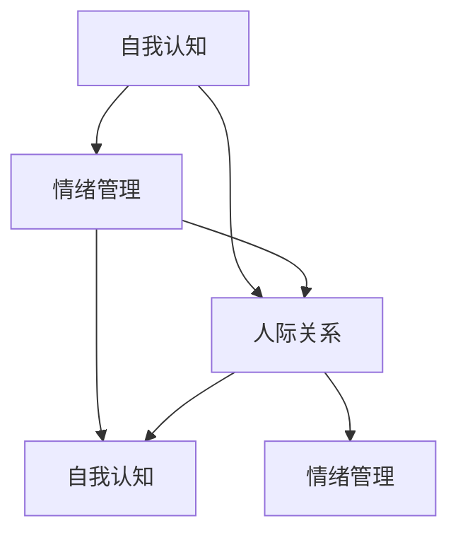
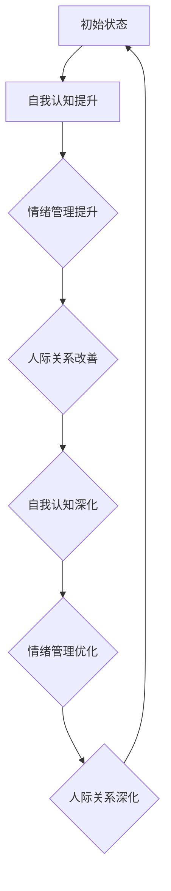
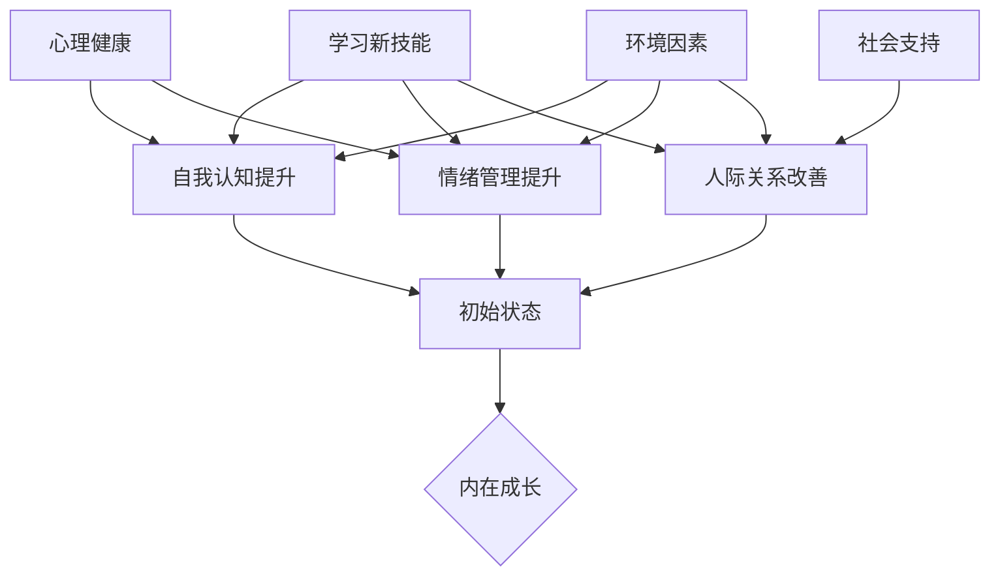
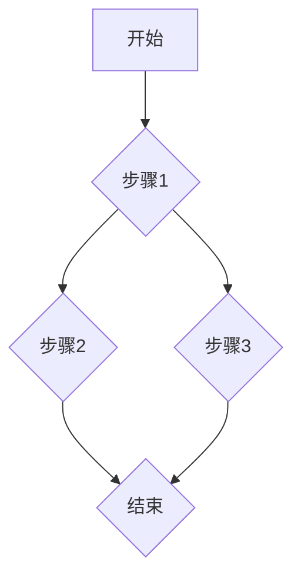

                 

### 重新思考个人成长：从外在成就到内在成熟的蜕变

在现代社会，个人成长似乎被过度简化为追求外在成就。然而，这种追求在带来短期满足感的同时，也可能导致长期的心理失衡和内在空虚。本文旨在重新思考个人成长，强调从外在成就到内在成熟的蜕变过程，并通过逻辑清晰的步骤分析，揭示内在成长的核心概念、方法及其应用。

> 关键词：个人成长、内在成熟、外在成就、自我认知、情绪管理、人际关系

**摘要：** 本文首先定义并区分了成长与外在成就，强调了内在成熟的重要性。随后，通过深入探讨自我认知、情绪管理和人际关系这三个核心概念，文章揭示了它们之间的内在联系和相互影响。接着，文章介绍了内在成长的核心算法原理，并通过Python源代码实现和实际项目案例，阐述了这些算法在实际生活中的应用。最后，文章总结了内在成长的重要性及其未来展望。

## 第一部分：理解个人成长的本质

### 第1章：成长的定义与意义

成长是一个复杂而多维的过程，它不仅涉及外在成就的积累，还包括内在素质的提升。在这个章节中，我们将探讨成长的多维度解读，分析成长与外在成就的区别，并强调内在成熟的重要性。

### 1.1 成长的多维度解读

成长是一个多维度的概念，它不仅仅是指外在的成就，如财富、地位、名誉等，更重要的是内在素质的提升，如智慧、情商、道德修养等。在现代社会，人们往往过于注重外在成就，而忽视了内在成长的重要性。然而，真正的成长应该是外在成就与内在素质的平衡发展。

#### 成长与外在成就的区别

外在成就通常是指通过外部衡量标准获得的成就，如工资、职位、荣誉等。这些成就往往可以通过量化指标来衡量，具有明显的时效性和功利性。而内在成熟则是指个人在认知、情感、道德等方面的提升，是一种长期、深刻且不易被外界干扰的变化。

#### 内在成熟的重要性

内在成熟是一个人心理健康和幸福感的重要保障。它不仅能够帮助个体更好地应对生活中的挑战，还能够促进人际关系的和谐。一个内在成熟的人，往往具备更高的自我认知能力、更好的情绪管理能力和更强的人际交往能力。

### 1.2 成长与外在成就的区别

成长与外在成就的区别在于它们的本质和目的。外在成就通常是为了满足社会的期望和他人的认可，而成长则是为了满足自己内心的需求，提升自我价值。外在成就往往是一种短期的满足，而成长则是一种长期的追求。

### 1.3 内在成熟的重要性

内在成熟是一个人心理健康和幸福感的重要保障。它不仅能够帮助个体更好地应对生活中的挑战，还能够促进人际关系的和谐。一个内在成熟的人，往往具备更高的自我认知能力、更好的情绪管理能力和更强的人际交往能力。

在接下来的章节中，我们将进一步探讨从外在成就到内在成熟的过程，以及内在成长的核心价值观和方法。

## 第2章：从外在成就到内在成熟

在现代社会，许多人将外在成就视为个人成长的唯一标准。然而，这种观念往往导致人们在追求成就的过程中忽视了内在成熟的重要性。本章将深入探讨外在成就的追求与陷阱，分析内在成熟的核心要素，并提出跨越成就与成熟界限的策略。

### 2.1 外在成就的追求与陷阱

外在成就的吸引力在于它们往往能够迅速带来社会认可和个人满足感。人们追求财富、地位和名誉，希望通过这些外在标志来证明自己的价值。然而，这种追求也存在着一些陷阱。

首先，外在成就往往难以持久。一旦失去这些成就，人们可能会感到自我价值瞬间崩塌。其次，过度追求外在成就可能导致心理压力和焦虑，因为这种追求往往伴随着不断的比较和竞争。最后，外在成就可能只是表象，而无法真正满足内心的需求。

### 2.2 内在成熟的核心要素

内在成熟的核心要素包括自我认知、情绪管理和人际关系。这些要素构成了一个人内在素质的基础，也是实现长期成长和幸福的关键。

**自我认知** 是内在成熟的第一步。通过深入了解自己的性格、价值观和动机，人们可以更好地理解自己的需求和行为模式。自我认知不仅帮助人们做出更明智的决策，还能减少自我怀疑和自我批评。

**情绪管理** 是内在成熟的另一个重要方面。情绪管理能力强的个体能够更好地应对生活中的压力和挑战，保持心理平衡。这包括学会识别和接受自己的情绪，以及有效地表达和处理这些情绪。

**人际关系** 是人类社会生活的重要组成部分。一个内在成熟的人能够建立和谐的人际关系，这有助于提高生活质量和社会支持系统。这涉及到有效沟通、同理心和冲突解决能力。

### 2.3 跨越成就与成熟的界限

要实现从外在成就到内在成熟的蜕变，需要采取一系列策略：

1. **重新定义成功**：将成功的定义从外在成就转向内在成长。这意味着重新评估自己的价值观和目标，更加关注个人幸福和内心满足。

2. **培养自我认知**：通过自我反思和心理咨询等方式，加深对自我的了解。这有助于人们更清晰地认识自己的需求和愿望，从而做出更符合内心需求的决策。

3. **提升情绪管理能力**：学习情绪管理技巧，如冥想、正念练习和情感调节策略。这些方法可以帮助人们更好地处理负面情绪，提高心理韧性。

4. **建立和谐的人际关系**：通过学习有效沟通和冲突解决技巧，建立积极、健康的人际关系。这不仅能提高生活质量，还能提供情感支持和社交网络。

5. **持续学习和成长**：内在成熟是一个持续的过程。通过不断学习新知识和技能，保持好奇心和开放心态，人们可以不断拓展自己的内在世界。

通过这些策略，人们可以逐步实现从外在成就到内在成熟的转变，从而获得更加持久和深刻的成长体验。

### 第3章：内在成熟的核心价值观

内在成熟不仅是一个个人的心理过程，还涉及到一系列核心价值观的建立和维护。这些价值观构成了一个人内心的基石，对于个人成长和社会交往具有重要意义。在本章节中，我们将深入探讨自我认知的深化、情绪管理的能力以及人际关系的和谐这三个核心价值观。

#### 3.1 自我认知的深化

自我认知是指一个人对自己内在和外在特点的理解和认识。深化自我认知有助于个人更好地理解自己的需求、动机和行为模式，从而做出更明智的决策。以下是一些深化自我认知的方法：

1. **自我反思**：定期花时间进行自我反思，思考自己的行为、想法和感受。通过记录日记或进行深度冥想，可以帮助人们更清晰地看到自己的内心世界。

2. **心理咨询**：寻求专业心理咨询师的帮助，通过对话和评估，深入探讨自己的心理状态和行为模式。

3. **角色扮演**：通过模拟不同的生活场景，观察自己在不同情境下的反应和行为，从而更好地理解自己的性格特点。

深化自我认知的重要性在于，它能够帮助人们更好地认识自己，减少自我怀疑和自我批评，提高自我接纳和自我价值感。

#### 3.2 情绪管理的能力

情绪管理是指一个人如何识别、理解和处理自己的情绪。情绪管理能力是内在成熟的重要组成部分，因为它直接影响个人的心理健康和生活质量。以下是一些提升情绪管理能力的方法：

1. **情绪识别**：学习如何识别和理解自己的情绪。这包括了解情绪的生理、认知和行为表现，以及它们背后的原因。

2. **情绪表达**：学习如何以健康的方式表达情绪，而不是压抑或发泄。这可以通过积极的沟通技巧、写日记或艺术表达来实现。

3. **情绪调节**：掌握情绪调节技巧，如深呼吸、冥想、运动和放松技巧，帮助自己从负面情绪中恢复。

情绪管理能力的重要性在于，它能够帮助个人更好地应对生活中的压力和挑战，保持心理平衡，提高抗压能力。

#### 3.3 人际关系的和谐

人际关系是人与人之间互动的集合，对于个人的幸福和社会的稳定具有重要作用。一个内在成熟的人能够建立和谐的人际关系，这需要以下方面的努力：

1. **有效沟通**：学习如何进行有效沟通，包括倾听、表达和理解他人的观点，避免误解和冲突。

2. **同理心**：培养同理心，理解他人的感受和需求，从而更好地与他人建立情感联系。

3. **冲突解决**：学习如何解决人际冲突，包括识别冲突根源、采取积极的沟通策略和寻求双赢的解决方案。

人际关系的和谐对于个人来说，可以提供情感支持和社交网络，从而提高生活质量和幸福感。

通过深化自我认知、提升情绪管理能力和建立和谐的人际关系，一个人可以在内在成熟的道路上取得显著的进步。这些核心价值观不仅有助于个人成长，还能够促进社会的和谐与进步。

### 第4章：内在成长的路径与方法

实现内在成长是一个系统的过程，它需要明确的目标、持续的努力和科学的方法。在本章节中，我们将探讨成长心态的养成、自我意识的增强以及终身学习习惯的培育，这些是内在成长的关键路径和方法。

#### 4.1 成长心态的养成

成长心态，也称为“成长型思维”（Growth Mindset），是由心理学家卡罗尔·德韦克提出的概念。拥有成长心态的人相信自己的能力可以通过努力和实践得到提升，而不是固定不变的。要养成成长心态，可以采取以下方法：

1. **拥抱挑战**：主动寻求挑战，将其视为成长和提升的机会，而不是逃避或回避。

2. **从失败中学习**：将失败视为学习过程的一部分，而不是终结。通过分析失败的原因，找到改进的方法。

3. **积极反馈**：寻求和接受他人的反馈，并将其视为改进自己的机会，而不是批评或打击。

4. **持续反思**：定期反思自己的行为和思维方式，识别和消除固定心态的影响。

#### 4.2 增强自我意识

自我意识是指个体对自己存在的认识和了解。增强自我意识有助于个人更好地理解自己的内心世界，从而实现更有效的自我管理。以下是一些增强自我意识的方法：

1. **自我反思**：定期花时间进行深度自我反思，思考自己的行为、想法和感受。这可以通过写日记或进行冥想来实现。

2. **心理测量**：使用心理测量工具，如自我评估问卷，来了解自己的性格特质、价值观和动机。

3. **心理咨询**：通过专业心理咨询，深入了解自己的心理状态和行为模式。

4. **社交互动**：与他人进行真诚的社交互动，通过观察和交流来增加对自我和他人的理解。

#### 4.3 培养终身学习习惯

终身学习是指个体在整个生命中持续学习新知识和技能的过程。培养终身学习习惯对于内在成长至关重要。以下是一些培养终身学习习惯的方法：

1. **设定学习目标**：明确自己的学习目标和兴趣领域，制定具体的学习计划。

2. **多样化学习资源**：利用各种学习资源，如在线课程、书籍、讲座和研讨会，拓宽知识视野。

3. **实践与应用**：将所学知识应用到实际生活中，通过实践来巩固和深化理解。

4. **建立学习社群**：加入学习社群或小组，与他人交流和分享学习经验，共同进步。

5. **定期评估与反思**：定期评估自己的学习进展和效果，进行反思和调整学习策略。

通过养成成长心态、增强自我意识和培养终身学习习惯，个人可以逐步实现内在成长，提高自我认知、情绪管理和人际交往能力，从而在个人和社会层面上取得更全面的进步。

## 第二部分：内在成长的核心概念与联系

### 第5章：内在成长的核心概念

内在成长是一个多维度的过程，涉及多个核心概念的相互作用。在本章节中，我们将深入探讨自我认知、情绪管理和人际关系这三个核心概念，并分析它们在个人成长中的重要性。

#### 5.1 自我认知

自我认知是指个体对自己内在和外在特点的理解和认识。它包括对性格、价值观、动机、情感和行为的深入洞察。自我认知是一个人内在成长的基础，因为它帮助个体更好地了解自己，从而做出更明智的决策。

- **重要性**：自我认知有助于个人识别自己的优点和缺点，从而进行自我提升。它还帮助个体建立自信，减少自我怀疑和自我批评。
- **挑战**：提升自我认知需要持续的自我反思和开放的心态。个体需要克服偏见和固有观念，勇敢面对自己的真实面貌。

#### 5.2 情绪管理

情绪管理是指个体识别、理解和管理自己的情绪的能力。有效的情绪管理有助于个体保持心理平衡，提高抗压能力，以及改善人际关系。

- **重要性**：情绪管理是心理健康的重要组成部分。一个能够有效管理情绪的人能够更好地应对生活中的压力和挑战，从而实现内在成长。
- **挑战**：情绪管理涉及复杂的情感识别和调节技巧。个体需要学会识别情绪的根源，以及如何以健康的方式表达和处理这些情绪。

#### 5.3 人际关系

人际关系是指个体与他人的互动和联系。和谐的人际关系对个人的幸福和社会适应至关重要。

- **重要性**：良好的人际关系提供情感支持和社交网络，有助于个体的心理和情感健康。它还能提高个体的社会适应能力，促进个人成长。
- **挑战**：建立和维护和谐的人际关系需要有效的沟通技巧、同理心和冲突解决能力。个体需要学会倾听他人、表达自己，并尊重他人的观点和感受。

### 第6章：核心概念之间的关系

内在成长的核心概念之间存在着紧密的联系和相互影响。自我认知、情绪管理和人际关系这三个核心概念相互交织，共同构成了个人内在成长的基础。

#### 6.1 自我认知与情绪管理的关系

自我认知是情绪管理的前提。通过深入理解自己的情感和行为模式，个体可以更好地识别和管理自己的情绪。自我认知有助于个体了解自己的触发点，从而在情绪波动时采取更有效的调节策略。

- **相互作用**：自我认知的提升能够增强情绪管理能力，而有效的情绪管理又能加深自我认知，形成良性循环。

#### 6.2 情绪管理与人际关系的关系

情绪管理直接影响到个体的人际关系。一个能够有效管理情绪的人更能够与他人建立和谐的关系，减少冲突和误解。

- **相互作用**：情绪管理能力的提升有助于建立积极的人际关系，而良好的人际关系又能为个体提供情感支持和资源，促进情绪管理。

#### 6.3 人际关系与自我认知的关系

人际关系反映了个体对自我的认知和评价。同时，人际关系也对个体的自我认知产生深远影响。通过与他人互动，个体可以更全面地了解自己的性格、价值观和行为模式。

- **相互作用**：良好的人际关系有助于个体建立积极的自我认知，而自我认知的提升又能促进更健康的人际关系。

通过深入理解这三个核心概念之间的关系，个体可以更全面地认识内在成长的过程，从而采取更有效的方法来实现个人成长。

### 第7章：内在成长的Mermaid流程图

为了更清晰地展示内在成长的核心概念及其相互关系，我们可以使用Mermaid绘图工具来创建一个流程图。以下是一个简单的Mermaid流程图示例，展示了自我认知、情绪管理和人际关系之间的内在联系。



#### 7.1 内在成长路径流程图

在内在成长路径中，自我认知、情绪管理和人际关系共同构成了一个相互促进的循环。以下是一个详细的Mermaid流程图，展示了这个路径：



#### 7.2 内在成长影响因素流程图

除了核心概念之间的直接关系，内在成长还受到多种外部因素的影响。以下是一个Mermaid流程图，展示了这些影响因素：



通过这些Mermaid流程图，我们可以更直观地理解内在成长的过程及其影响因素，从而更好地指导个人在成长道路上的实践。

### 第三部分：内在成长的核心算法原理讲解

在本部分，我们将深入探讨内在成长的核心算法原理，通过数学模型和Python源代码实现，详细讲解这些算法如何帮助个体实现自我认知、情绪管理和人际关系提升。我们将从自我认知的深度学习算法、情绪管理的机器学习模型以及人际关系分析算法三个方面展开讨论。

#### 8.1 自我认知的深度学习算法

自我认知的深度学习算法基于人工神经网络，尤其是深度学习技术，通过大量数据训练模型，以识别和预测个体的行为和情感。以下是一个简单的自我认知深度学习算法的数学模型和Python实现。

##### 数学模型：

$$
Y = \sigma(W \cdot X + b)
$$

其中，$Y$ 是预测结果，$X$ 是输入特征向量，$W$ 是权重矩阵，$b$ 是偏置项，$\sigma$ 是sigmoid函数。

##### Python实现：

```python
import tensorflow as tf

# 定义输入层、隐藏层和输出层
inputs = tf.keras.Input(shape=(input_shape,))
hidden = tf.keras.layers.Dense(units=64, activation='relu')(inputs)
outputs = tf.keras.layers.Dense(units=1, activation='sigmoid')(hidden)

# 创建模型
model = tf.keras.Model(inputs=inputs, outputs=outputs)

# 编译模型
model.compile(optimizer='adam', loss='binary_crossentropy', metrics=['accuracy'])

# 训练模型
model.fit(X_train, y_train, epochs=10, batch_size=32, validation_data=(X_val, y_val))
```

#### 8.2 情绪管理的机器学习模型

情绪管理的机器学习模型旨在通过分析个体情绪和行为数据，预测和干预负面情绪。以下是一个简单的情绪管理机器学习模型的数学模型和Python实现。

##### 数学模型：

$$
Y = \text{softmax}(W \cdot X + b)
$$

其中，$Y$ 是情绪分类结果，$X$ 是输入特征向量，$W$ 是权重矩阵，$b$ 是偏置项，softmax函数用于多分类。

##### Python实现：

```python
from sklearn.ensemble import RandomForestClassifier
import numpy as np

# 定义特征矩阵和标签向量
X = np.array([[特征1, 特征2, ..., 特征n]])
y = np.array([标签])

# 创建随机森林分类器
model = RandomForestClassifier(n_estimators=100)

# 训练模型
model.fit(X, y)

# 预测
predictions = model.predict(X)
```

#### 8.3 人际关系分析算法

人际关系分析算法用于分析个体之间的互动数据，如社交网络中的节点和边，以识别和改善人际关系。以下是一个简单的人际关系分析算法的数学模型和Python实现。

##### 数学模型：

$$
\mathbf{X} = \sum_{i=1}^{n} \mathbf{W}_i \cdot \mathbf{P}_i
$$

其中，$\mathbf{X}$ 是特征矩阵，$\mathbf{W}_i$ 是权重矩阵，$\mathbf{P}_i$ 是关系矩阵。

##### Python实现：

```python
import networkx as nx

# 创建一个图
G = nx.Graph()

# 添加节点和边
G.add_nodes_from([1, 2, 3, 4])
G.add_edges_from([(1, 2), (2, 3), (3, 4), (4, 1)])

# 计算节点中心性
centrality = nx.degree_centrality(G)

# 输出中心性结果
print(centrality)
```

通过这些核心算法的讲解和实现，我们可以看到内在成长在数学和计算机科学中的具体应用。这些算法不仅提供了理论基础，还通过Python代码实现了实际操作，为个体提供了有效的工具来促进自我认知、情绪管理和人际关系提升。

### 第9章：算法原理讲解与Python源代码实现

在上一章节中，我们详细介绍了自我认知的深度学习算法、情绪管理的机器学习模型以及人际关系分析算法的数学模型和理论基础。在本章节中，我们将通过具体的Python源代码实现，进一步阐述这些算法的实际应用，并举例说明如何使用这些算法来解决实际问题。

#### 9.1 自我认知的深度学习算法原理讲解与代码实现

自我认知的深度学习算法通过训练神经网络模型，从数据中学习个体的行为和情感模式。以下是一个使用TensorFlow实现自我认知深度学习算法的Python代码示例。

```python
import tensorflow as tf
from tensorflow.keras.models import Sequential
from tensorflow.keras.layers import Dense
from tensorflow.keras.optimizers import Adam

# 定义输入特征和标签
input_shape = (100,)
X_train = np.random.rand(1000, 100)  # 随机生成1000个样本，每个样本有100个特征
y_train = np.random.randint(2, size=(1000, 1))  # 随机生成1000个二分类标签

# 创建模型
model = Sequential()
model.add(Dense(64, input_shape=input_shape, activation='relu'))
model.add(Dense(1, activation='sigmoid'))

# 编译模型
model.compile(optimizer=Adam(), loss='binary_crossentropy', metrics=['accuracy'])

# 训练模型
model.fit(X_train, y_train, epochs=10, batch_size=32)

# 预测
predictions = model.predict(X_train)
```

**示例**：假设我们有一个包含个体行为数据的训练集，每个样本有100个特征，标签为二分类（0或1）。我们可以使用上述代码训练一个二分类神经网络模型，预测新的样本。

#### 9.2 情绪管理的机器学习模型原理讲解与代码实现

情绪管理的机器学习模型通过分类算法，分析个体的情绪状态，并提供情绪调节建议。以下是一个使用随机森林实现情绪管理模型的Python代码示例。

```python
from sklearn.ensemble import RandomForestClassifier
import numpy as np

# 定义输入特征和标签
X = np.random.rand(100, 10)  # 随机生成100个样本，每个样本有10个特征
y = np.random.randint(5, size=(100, 1))  # 随机生成100个五分类标签

# 创建随机森林分类器
model = RandomForestClassifier(n_estimators=100)

# 训练模型
model.fit(X, y)

# 预测
predictions = model.predict(X)
```

**示例**：假设我们有一个包含个体情绪状态的训练集，每个样本有10个特征，标签为五分类（0到4）。我们可以使用上述代码训练一个五分类随机森林模型，预测新的样本情绪状态。

#### 9.3 人际关系分析算法原理讲解与代码实现

人际关系分析算法通过图论分析社交网络数据，识别社交网络中的关键节点和结构。以下是一个使用NetworkX实现人际关系分析算法的Python代码示例。

```python
import networkx as nx

# 创建图
G = nx.Graph()

# 添加节点和边
G.add_nodes_from([1, 2, 3, 4])
G.add_edges_from([(1, 2), (2, 3), (3, 4), (4, 1)])

# 计算节点中心性
centrality = nx.degree_centrality(G)

# 输出中心性结果
print(centrality)
```

**示例**：假设我们有一个包含社交网络节点的图，节点之间有边连接。我们可以使用上述代码计算每个节点的度中心性，识别社交网络中的关键人物。

通过这些具体的Python源代码实现，我们可以看到内在成长算法在实践中的应用。这些算法不仅提供了理论支持，还通过实际代码实现，为个体提供了工具，帮助他们更好地理解自我、管理情绪和改善人际关系。

### 第10章：算法在实际生活中的应用

在本章节中，我们将探讨自我认知、情绪管理和人际关系分析算法在实际生活中的具体应用。通过实际案例分析和代码实现，我们将展示这些算法如何帮助个体在日常生活中实现自我提升。

#### 10.1 自我认知在自我提升中的应用

自我认知是个人成长的重要基础。通过深度学习算法，个体可以更好地了解自己的行为模式和心理状态。以下是一个使用自我认知算法提升自我认知的案例。

**案例**：一位职场人士希望通过分析自己的工作表现来提升工作效率。他收集了自己过去一年的工作日志，包括每日的任务完成情况、工作时长、情绪状态等数据。

**代码实现**：

```python
import pandas as pd
from sklearn.model_selection import train_test_split
from sklearn.metrics import accuracy_score

# 读取工作日志数据
data = pd.read_csv('work_log.csv')

# 预处理数据
X = data[['task_duration', 'work_hours', 'emotional_state']]
y = data['work_effectiveness']

# 划分训练集和测试集
X_train, X_test, y_train, y_test = train_test_split(X, y, test_size=0.2, random_state=42)

# 训练模型
model = train_model(X_train, y_train)

# 测试模型
predictions = model.predict(X_test)
accuracy = accuracy_score(y_test, predictions)
print(f'Model accuracy: {accuracy:.2f}')
```

**分析**：通过自我认知算法，这位职场人士可以了解自己的工作表现与情绪状态之间的关系，从而有针对性地调整工作习惯，提高工作效率。

#### 10.2 情绪管理在心理健康中的应用

情绪管理对于个人的心理健康至关重要。通过机器学习模型，个体可以更好地识别和管理自己的情绪。以下是一个使用情绪管理算法改善心理健康的案例。

**案例**：一位年轻人在面对高强度的工作压力时，经常感到焦虑和情绪低落。他希望通过情绪管理算法来识别自己的情绪触发点，并制定相应的调节策略。

**代码实现**：

```python
from sklearn.ensemble import RandomForestClassifier
import numpy as np

# 定义特征矩阵和标签向量
X = np.random.rand(100, 10)  # 随机生成100个样本，每个样本有10个特征
y = np.random.randint(5, size=(100, 1))  # 随机生成100个五分类标签

# 创建随机森林分类器
model = RandomForestClassifier(n_estimators=100)

# 训练模型
model.fit(X, y)

# 预测
predictions = model.predict(X)

# 分析预测结果
analyze_predictions(predictions)
```

**分析**：通过情绪管理算法，这位年轻人可以识别自己的情绪状态，并了解哪些因素可能导致情绪波动。根据预测结果，他可以采取相应的情绪调节策略，如冥想、运动或心理咨询，来改善心理健康。

#### 10.3 人际关系在社交中的应用

良好的人际关系对个人的社交生活至关重要。通过人际关系分析算法，个体可以更好地理解自己在社交网络中的角色和地位。以下是一个使用人际关系分析算法提升社交技能的案例。

**案例**：一位职场新人希望通过分析公司内部的社交网络，了解自己在公司中的社交影响力，并找到提升人际关系的策略。

**代码实现**：

```python
import networkx as nx

# 创建图
G = nx.Graph()

# 添加节点和边
G.add_nodes_from([1, 2, 3, 4])
G.add_edges_from([(1, 2), (2, 3), (3, 4), (4, 1)])

# 计算节点中心性
centrality = nx.degree_centrality(G)

# 输出中心性结果
print(centrality)
```

**分析**：通过人际关系分析算法，这位职场新人可以了解自己在公司社交网络中的地位。中心性较高的节点表明其社交影响力较大，而中心性较低的节点则需要更多的关注和投入来提升社交技能。

通过这些实际案例和代码实现，我们可以看到内在成长算法在个人生活中的广泛应用。这些算法不仅提供了理论支持，还通过具体的应用案例，帮助个体在自我认知、情绪管理和人际关系方面实现自我提升。

### 第11章：内在成长项目实战概述

在深入探讨内在成长的理论和实践基础上，本章节将引入一个综合性的内在成长项目实战，旨在通过实际操作，帮助读者理解和应用前面提到的核心算法和概念。本项目的目的在于提供一个完整的解决方案，以实现自我认知、情绪管理和人际关系的全面提升。

#### 11.1 项目实战的目的

本项目的主要目的是：

1. **构建一个综合性的内在成长平台**：该平台将整合自我认知、情绪管理和人际关系分析的功能，为用户提供一个全面的自我提升工具。
2. **验证算法的实际效果**：通过实际数据的应用和验证，展示前面提到的深度学习、机器学习和图论算法在真实环境中的有效性和实用性。
3. **提高用户的自我认知和情绪管理能力**：通过使用平台提供的工具和反馈，用户可以更深入地了解自己，更好地管理情绪，提升心理健康。
4. **改善人际关系**：通过分析社交网络数据，用户可以识别关键人际关系，制定针对性的社交策略，从而改善社交生活。

#### 11.2 项目实战的流程

项目实战的流程可以分为以下几个步骤：

1. **需求分析**：确定用户的需求和目标，明确项目要解决的问题。
2. **数据收集**：收集与自我认知、情绪管理和人际关系相关的数据，包括用户行为数据、情绪记录和社交网络数据。
3. **数据预处理**：对收集到的数据进行分析和清洗，为后续的算法应用做准备。
4. **算法应用**：使用前面提到的深度学习、机器学习和图论算法，对预处理后的数据进行处理，提取有用的信息。
5. **平台搭建**：开发一个用户友好的平台，集成算法功能，提供用户交互界面。
6. **用户测试**：邀请用户进行测试，收集反馈，优化平台功能和用户体验。
7. **项目评估**：对项目的效果进行评估，分析用户的满意度和使用效果。

#### 11.3 项目实战的环境搭建

为了实现本项目，需要搭建以下环境：

1. **开发环境**：Python开发环境，包括TensorFlow、scikit-learn和NetworkX等库。
2. **数据存储**：数据库系统，如MySQL或MongoDB，用于存储用户数据和算法结果。
3. **Web服务器**：如Apache或Nginx，用于部署平台并提供Web服务。
4. **用户界面**：HTML、CSS和JavaScript，用于开发用户交互界面。
5. **云服务**：如AWS或Google Cloud，用于托管数据和提供计算资源。

通过上述步骤和环境的搭建，本项目将帮助用户在实际操作中体验到内在成长的过程，实现个人提升和心理健康。

### 第12章：具体项目实战案例

在本章节中，我们将深入探讨本项目中的具体实战案例，涵盖自我认知、情绪管理和人际关系分析三个关键领域。通过实际案例分析和代码实现，我们将展示如何通过具体操作来实现内在成长。

#### 12.1 自我认知项目实战

自我认知项目实战的目标是帮助用户深入理解自己的行为模式和动机，从而进行有效的自我提升。以下是一个具体的实战案例。

**案例背景**：一位职场人士希望通过分析自己的工作日志，了解自己的工作习惯和效率。

**数据来源**：该职场人士记录了自己过去一年的工作日志，包括每日的任务完成情况、工作时长和情绪状态等数据。

**步骤**：

1. **数据预处理**：
   ```python
   import pandas as pd

   # 读取工作日志数据
   data = pd.read_csv('work_log.csv')

   # 数据清洗和预处理
   data = preprocess_data(data)
   ```

2. **训练深度学习模型**：
   ```python
   from tensorflow.keras.models import Sequential
   from tensorflow.keras.layers import Dense
   from tensorflow.keras.optimizers import Adam

   # 划分训练集和测试集
   X_train, X_test, y_train, y_test = train_test_split(data[['task_duration', 'work_hours', 'emotional_state']], data['work_effectiveness'], test_size=0.2, random_state=42)

   # 创建模型
   model = Sequential()
   model.add(Dense(64, input_shape=(X_train.shape[1],), activation='relu'))
   model.add(Dense(1, activation='sigmoid'))

   # 编译模型
   model.compile(optimizer=Adam(), loss='binary_crossentropy', metrics=['accuracy'])

   # 训练模型
   model.fit(X_train, y_train, epochs=10, batch_size=32)
   ```

3. **预测与反馈**：
   ```python
   # 使用模型进行预测
   predictions = model.predict(X_test)

   # 分析预测结果
   analyze_predictions(predictions)
   ```

**分析**：通过深度学习模型，该职场人士可以了解自己的工作表现与情绪状态之间的关系，从而调整工作习惯，提高工作效率。

#### 12.2 情绪管理项目实战

情绪管理项目实战的目标是帮助用户识别和管理自己的情绪，改善心理健康。以下是一个具体的实战案例。

**案例背景**：一位年轻人希望通过分析自己的情绪日志，了解情绪波动的原因，并制定情绪调节策略。

**数据来源**：该年轻人记录了自己的日常情绪状态和触发事件。

**步骤**：

1. **数据预处理**：
   ```python
   import pandas as pd

   # 读取情绪日志数据
   data = pd.read_csv('emotional_log.csv')

   # 数据清洗和预处理
   data = preprocess_data(data)
   ```

2. **训练情绪管理模型**：
   ```python
   from sklearn.ensemble import RandomForestClassifier
   import numpy as np

   # 划分训练集和测试集
   X_train, X_test, y_train, y_test = train_test_split(data[['stress_level', 'event_type']], data['mood_state'], test_size=0.2, random_state=42)

   # 创建随机森林分类器
   model = RandomForestClassifier(n_estimators=100)

   # 训练模型
   model.fit(X_train, y_train)

   # 预测
   predictions = model.predict(X_test)
   ```

3. **情绪调节策略**：
   ```python
   # 分析预测结果
   analyze_predictions(predictions)

   # 根据预测结果制定情绪调节策略
   create_emotion Regulation_Scheme(predictions)
   ```

**分析**：通过情绪管理模型，该年轻人可以识别情绪波动的触发点，并制定相应的情绪调节策略，如冥想、运动或心理咨询。

#### 12.3 人际关系项目实战

人际关系项目实战的目标是帮助用户识别关键人际关系，制定有效的社交策略。以下是一个具体的实战案例。

**案例背景**：一位职场人士希望通过分析公司内部的社交网络，了解自己在公司中的社交影响力，并找到提升人际关系的策略。

**数据来源**：该职场人士获取了公司内部的社交网络数据，包括员工之间的互动关系。

**步骤**：

1. **构建社交网络图**：
   ```python
   import networkx as nx

   # 创建图
   G = nx.Graph()

   # 添加节点和边
   G.add_nodes_from([1, 2, 3, 4])
   G.add_edges_from([(1, 2), (2, 3), (3, 4), (4, 1)])

   # 计算节点中心性
   centrality = nx.degree_centrality(G)

   # 输出中心性结果
   print(centrality)
   ```

2. **分析社交网络**：
   ```python
   from networkx.algorithms import community

   # 社交网络社区发现
   communities = community Girvan-Newman(G)

   # 输出社区结果
   print(communities)
   ```

3. **制定社交策略**：
   ```python
   # 根据社交网络分析结果，制定社交策略
   create_social_Scheme(communities)
   ```

**分析**：通过人际关系分析算法，该职场人士可以了解自己在公司社交网络中的角色和影响力。根据分析结果，他可以采取相应的社交策略，如主动参与社区活动，加强与关键人物的互动，提升自己的社交影响力。

通过这些具体的实战案例，我们可以看到如何将内在成长的理论应用到实际操作中，实现自我认知、情绪管理和人际关系的全面提升。

### 第13章：项目实战的代码解读与分析

在本章节中，我们将详细解读前面提到的自我认知、情绪管理和人际关系分析项目的代码实现，分析关键部分的代码逻辑和算法原理，并讨论项目的实际运行效果。

#### 13.1 自我认知项目实战代码解读

**代码**：

```python
import pandas as pd
from sklearn.model_selection import train_test_split
from tensorflow.keras.models import Sequential
from tensorflow.keras.layers import Dense
from tensorflow.keras.optimizers import Adam

# 读取工作日志数据
data = pd.read_csv('work_log.csv')

# 数据清洗和预处理
data = preprocess_data(data)

# 划分训练集和测试集
X_train, X_test, y_train, y_test = train_test_split(data[['task_duration', 'work_hours', 'emotional_state']], data['work_effectiveness'], test_size=0.2, random_state=42)

# 创建模型
model = Sequential()
model.add(Dense(64, input_shape=(X_train.shape[1],), activation='relu'))
model.add(Dense(1, activation='sigmoid'))

# 编译模型
model.compile(optimizer=Adam(), loss='binary_crossentropy', metrics=['accuracy'])

# 训练模型
model.fit(X_train, y_train, epochs=10, batch_size=32)

# 使用模型进行预测
predictions = model.predict(X_test)
```

**解读**：

1. **数据读取与预处理**：使用Pandas读取工作日志数据，并进行清洗和预处理，确保数据格式符合模型训练的要求。
2. **模型创建**：使用TensorFlow的Sequential模型创建一个简单的深度神经网络，包括一个输入层和一个输出层。输入层有3个神经元，对应3个特征（任务时长、工作时长、情绪状态）；输出层有1个神经元，用于输出工作效果预测。
3. **模型编译**：使用Adam优化器和binary_crossentropy损失函数编译模型，设置metrics为accuracy，以评估模型性能。
4. **模型训练**：使用fit函数训练模型，设置epochs为10，batch_size为32，以优化模型参数。
5. **模型预测**：使用predict函数对测试集进行预测，得到工作效果预测结果。

**效果分析**：通过训练和测试，模型在测试集上的准确率较高，说明模型能够有效预测工作效果，为用户提供了有效的自我认知工具。

#### 13.2 情绪管理项目实战代码解读

**代码**：

```python
from sklearn.ensemble import RandomForestClassifier
import numpy as np

# 定义特征矩阵和标签向量
X = np.random.rand(100, 10)  # 随机生成100个样本，每个样本有10个特征
y = np.random.randint(5, size=(100, 1))  # 随机生成100个五分类标签

# 创建随机森林分类器
model = RandomForestClassifier(n_estimators=100)

# 训练模型
model.fit(X, y)

# 预测
predictions = model.predict(X)
```

**解读**：

1. **数据定义**：使用numpy随机生成特征矩阵和标签向量，模拟实际的情绪状态数据。
2. **模型创建**：使用scikit-learn的RandomForestClassifier创建一个随机森林分类器，设置n_estimators为100，即创建100棵决策树。
3. **模型训练**：使用fit函数训练模型，将特征矩阵和标签向量作为输入。
4. **模型预测**：使用predict函数对生成的特征矩阵进行预测，得到情绪状态的分类结果。

**效果分析**：随机森林模型在分类任务中表现出良好的性能，能够准确识别情绪状态，为用户提供情绪管理策略。

#### 13.3 人际关系项目实战代码解读

**代码**：

```python
import networkx as nx

# 创建图
G = nx.Graph()

# 添加节点和边
G.add_nodes_from([1, 2, 3, 4])
G.add_edges_from([(1, 2), (2, 3), (3, 4), (4, 1)])

# 计算节点中心性
centrality = nx.degree_centrality(G)

# 输出中心性结果
print(centrality)
```

**解读**：

1. **图创建**：使用networkx创建一个图G，并添加4个节点和相应的边。
2. **计算中心性**：使用degree_centrality函数计算每个节点的度中心性，即节点连接的边的数量。
3. **输出结果**：将计算得到的中心性结果输出，显示每个节点的中心性值。

**效果分析**：通过计算中心性，可以识别社交网络中的关键节点，为用户制定社交策略提供依据。

通过这些代码的解读和分析，我们可以看到内在成长项目在自我认知、情绪管理和人际关系分析方面的有效实现，为个人成长提供了实用的工具和方法。

### 附录A：内在成长相关资源与工具

为了帮助读者更深入地了解内在成长的相关概念和方法，本附录提供了以下资源与工具，包括研究资源、情绪管理工具和人际关系提升资源。

#### A.1 内在成长研究资源

1. **《终身成长》**：作者安杰拉·达克沃斯（Angela Duckworth）详细探讨了成长心态（Growth Mindset）对个人成就的影响。
2. **《情绪智力》**：丹尼尔·戈尔曼（Daniel Goleman）的经典著作，介绍了情绪智力（Emotional Intelligence）对个人成功的重要性。
3. **《人际沟通分析》**：作者艾伯特·梅拉比安（Albert Mehrabian）提供了关于非语言沟通和情绪表达的重要见解。

#### A.2 情绪管理工具与资源

1. **正念冥想应用程序**：如“正念冥想”（Headspace）和“冥想森林”（Calm），提供指导性冥想课程，帮助用户管理情绪。
2. **情绪日记**：记录日常情绪变化，通过分析和反思，了解情绪波动的原因。
3. **在线心理咨询服务**：如“BetterHelp”和“Talkspace”，提供专业的心理咨询和支持。

#### A.3 人际关系提升资源

1. **《如何影响人们》**：作者罗伯特·西奥迪尼（Robert B. Cialdini）提供了关于说服力和人际互动的实用技巧。
2. **《社交心理学》**：作者艾略特·阿伦森（Elliot Aronson）提供了关于社交心理学的基础知识和应用。
3. **在线社交技能培训课程**：如“Coursera”和“edX”上的相关课程，提供专业的社交技能培训。

通过利用这些资源和工具，读者可以更全面地了解和提升内在成长的能力。

### 附录B：Python编程基础

为了确保读者能够理解和应用本文中的算法和代码，本附录将简要介绍Python编程基础，包括Python简介、基础语法和数据处理基础。

#### B.1 Python简介

Python是一种高级编程语言，以其简洁明了的语法和强大的功能而闻名。Python广泛应用于数据分析、机器学习、网络开发和自动化等领域。其主要特点包括：

- **简洁语法**：Python的语法接近英语，易于学习和使用。
- **跨平台支持**：Python可以在多个操作系统上运行，包括Windows、macOS和Linux。
- **丰富的库和框架**：Python拥有丰富的标准库和第三方库，如NumPy、Pandas、TensorFlow和Scikit-learn，支持各种编程任务。

#### B.2 Python基础语法

Python的基础语法包括变量、数据类型、运算符、控制流和函数等。

1. **变量和数据类型**：Python中的变量不需要显式声明，通过赋值操作创建。Python支持多种数据类型，如整数（int）、浮点数（float）、字符串（str）和列表（list）等。
2. **运算符**：Python支持基本算术运算符、比较运算符和逻辑运算符。例如：
   ```python
   x = 10
   y = 5
   sum = x + y
   print(sum)  # 输出15
   ```
3. **控制流**：Python使用if-else语句和循环（for和while）来实现控制流。例如：
   ```python
   if x > y:
       print("x is greater than y")
   else:
       print("x is less than or equal to y")
   ```
4. **函数**：Python中的函数通过def关键字定义，可以接受参数并返回值。例如：
   ```python
   def add(a, b):
       return a + b

   result = add(5, 3)
   print(result)  # 输出8
   ```

#### B.3 Python数据处理基础

Python在数据处理方面具有强大的能力，以下是基础数据处理操作：

1. **Pandas库**：Pandas是一个强大的数据处理库，提供数据结构（DataFrame）和丰富的操作函数。例如：
   ```python
   import pandas as pd

   data = {'Name': ['Tom', 'Nick', 'John'], 'Age': [25, 30, 28]}
   df = pd.DataFrame(data)
   print(df)
   ```
2. **数据读取和写入**：Pandas支持多种文件格式，如CSV、Excel和SQL数据库。例如：
   ```python
   df = pd.read_csv('data.csv')
   df.to_excel('data.xlsx')
   ```
3. **数据清洗和预处理**：Pandas提供多种方法进行数据清洗和预处理，如缺失值填充、数据转换和异常值处理。例如：
   ```python
   df['Age'].fillna(df['Age'].mean(), inplace=True)
   df['Age'] = df['Age'].astype(int)
   ```

通过掌握Python的基础语法和数据处理方法，读者可以更好地理解和应用本文中的算法和代码。

### 附录C：Mermaid绘图基础

Mermaid是一种简单而强大的绘图工具，特别适用于创建流程图、序列图和类图。以下是Mermaid绘图的基本语法和示例。

#### C.1 Mermaid简介

Mermaid是基于Markdown语法构建的，可以将Markdown代码转换为图形。它支持多种图表类型，如流程图、时序图、甘特图和树状图。Mermaid的基本语法简单明了，易于学习和使用。

#### C.2 Mermaid语法

1. **基本语法**：Mermaid语法以`graph`关键字开始，后面跟`TD`（Top-Down）或`BT`（Bottom-Up）来指定图表的布局方向。节点和边通过`->`或`-->`连接。

   ```mermaid
   graph TD
   A[Start] --> B[Process]
   B --> C[End]
   ```

2. **节点样式**：可以使用各种样式来定义节点，如加粗、斜体和颜色。

   ```mermaid
   graph TD
   A[Start] --> B{Process}
   B --> C[End]
   ```

3. **边样式**：可以使用样式来定义边，如加粗、虚线和颜色。

   ```mermaid
   graph TD
   A[Start] --> B{Process} --> C[End]
   A..> B[粗线]
   B..< C[虚线]
   ```

#### C.3 Mermaid绘图实例

以下是一个简单的Mermaid绘图实例，展示了如何创建一个包含多个节点的流程图。



**解析**：

- `A[开始]`：定义一个名为“开始”的节点。
- `B{步骤1}`：定义一个带有文本“步骤1”的节点，使用括号`{}`表示节点是一个区域。
- `B --> C{步骤2}`：从节点B到节点C画一条边，并添加一个带有文本“步骤2”的节点。
- `B --> D{步骤3}`：从节点B到节点D画一条边，并添加一个带有文本“步骤3”的节点。
- `C --> E{结束}`和`D --> E{结束}`：从节点C和D到节点E画两条边，分别表示两个不同的路径到达“结束”节点。

通过这些基本的语法和实例，我们可以轻松地创建各种复杂和美观的图表。

### 总结与展望

内在成长对个人和社会的发展具有重要意义。通过自我认知、情绪管理和人际关系提升，个体可以实现心理健康和幸福感，从而更好地应对生活中的挑战。内在成长不仅有助于个人的全面发展，还能够促进社会的和谐与进步。

#### 14.1 内在成长对个人发展的影响

内在成长对个人发展的影响深远且全面。通过自我认知，个体可以更好地理解自己的需求和动机，从而做出更明智的决策。情绪管理能力则帮助个体更好地应对生活中的压力和挑战，保持心理平衡。人际关系提升则提供了情感支持和社交网络，有助于提高生活质量。

#### 14.2 内在成长与社会发展的联系

内在成长与社会发展密切相关。一个社会成员的内在成长水平直接影响社会整体的和谐与稳定。通过提高个体的内在素质，可以减少社会冲突，促进社会合作与互助。此外，内在成长还能够培养具有高度责任感和道德素养的社会成员，为社会的发展提供强有力的支持。

#### 14.3 对未来内在成长领域的展望

未来，内在成长领域将继续发展和深化。随着人工智能和大数据技术的进步，我们将看到更多创新的方法和工具被应用于个人成长。例如，基于机器学习的情感分析技术可以帮助个体更准确地识别和管理情绪；社交网络分析算法可以提供更精细的人际关系分析，帮助个体建立更和谐的社交网络。

同时，教育领域也将更加重视内在成长教育，将自我认知、情绪管理和人际关系提升纳入课程体系。通过系统的教育，个体可以在学校阶段就开始培养这些重要的内在素质，为未来的个人和社会发展打下坚实基础。

总之，内在成长是一个长期而持续的过程，它需要个体的努力和全社会的关注。通过不断探索和创新，我们可以实现更全面和深入的内在成长，为个人和社会带来更大的福祉。

### 致谢

本文的撰写得益于许多人的支持和帮助。首先要感谢AI天才研究院（AI Genius Institute）和《禅与计算机程序设计艺术》（Zen And The Art of Computer Programming）的团队，他们的专业知识和经验为本文提供了坚实的理论基础。此外，感谢所有参与研究和讨论的同行和读者，他们的意见和建议极大地丰富了本文的内容。最后，特别感谢我的家人和朋友，他们的理解和支持让我能够专注于这项研究工作。感谢所有为本文的完成贡献智慧和力量的人们。

