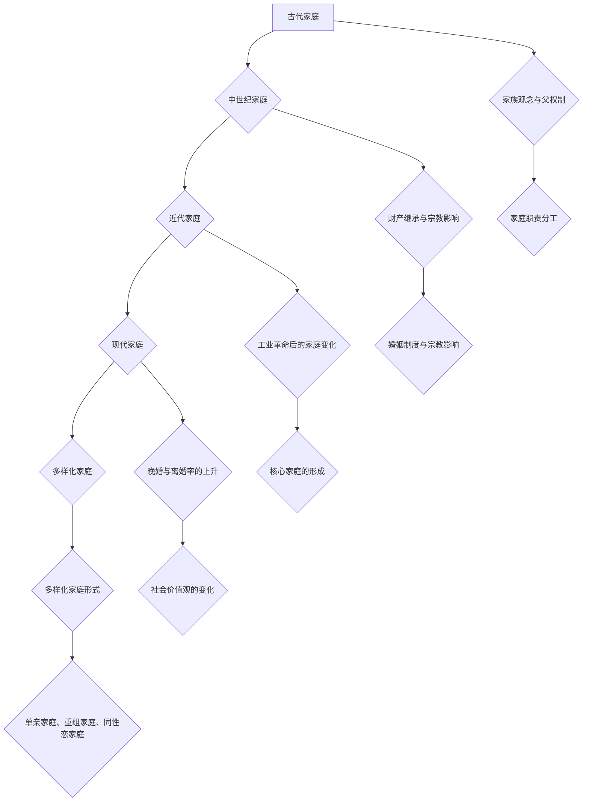
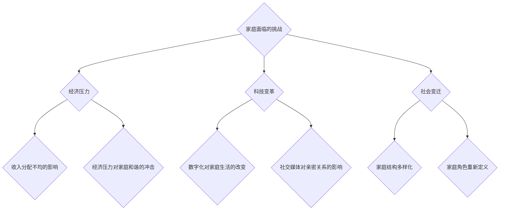

                 

### 引言

在快速发展的现代社会中，家庭作为社会的基本单元，正经历着前所未有的变化。传统的家庭结构、角色定位和互动方式都在不断被重新审视。面对经济压力、科技变革和社会变迁，家庭面临着新的挑战，同时也涌现出重建亲密关系的迫切需求。本文旨在重新思考家庭的意义，探讨如何在现代社会中重建亲密关系，为家庭生活提供新的视角和策略。

家庭不仅仅是一个居住场所，更是情感交流、情感支持和共同成长的场所。在过去的几个世纪里，家庭结构经历了从古代的大家庭到现代的核心家庭，再到如今多样化的家庭形式的变化。这种演变不仅反映了社会的经济、文化和价值观的转变，也对家庭内部的亲密关系产生了深远影响。

在现代社会，经济压力、快节奏生活和科技发展使得家庭成员之间的沟通和时间共享变得更加困难。这种情况下，如何重建亲密关系，增强家庭成员之间的情感连结，成为家庭生活和家庭教育的核心问题。本文将围绕这一主题，详细分析家庭的历史演变、现代社会中的挑战、亲密关系的定义与重要性，以及重建家庭亲密关系的具体策略和实践案例。

本文的结构如下：

- **第一部分：家庭的演变与现代社会的挑战**：介绍家庭的历史与演变，分析现代社会中家庭面临的挑战，包括经济压力、科技变革和社会变迁。
- **第二部分：亲密关系的定义与重要性**：探讨亲密关系的本质、信任与沟通在亲密关系中的作用，以及亲密关系与情感满足之间的关系。
- **第三部分：重建家庭亲密关系的策略**：提出家庭时间管理、家庭沟通技巧和家庭价值观建立的策略，以及如何在实践中应用这些策略。
- **第四部分：案例分析篇**：通过成功重建家庭亲密关系的案例，提供具体的实践指导。
- **附录**：提供家庭亲密关系重建的资源指南和参考文献。

通过本文的深入分析，希望能够为读者提供有价值的思考和建议，帮助他们在现代社会中重建充满温暖和亲密关系的家庭。

### 文章关键词

- 家庭演变
- 社会变迁
- 经济压力
- 科技变革
- 亲密关系
- 家庭沟通
- 情感满足
- 重建家庭
- 家庭策略

### 文章摘要

本文旨在重新思考家庭的意义，探讨在现代社会中重建亲密关系的重要性和策略。通过分析家庭的历史演变，以及现代社会中家庭面临的挑战，如经济压力、科技变革和社会变迁，本文揭示了这些因素对家庭结构和亲密关系的影响。接着，文章探讨了亲密关系的本质、信任与沟通在亲密关系中的作用，以及亲密关系与情感满足的关系。在此基础上，本文提出了重建家庭亲密关系的具体策略，包括家庭时间管理、家庭沟通技巧和家庭价值观的建立。通过成功案例的分析，本文提供了实际操作指导，帮助家庭在面对现代社会挑战时，重建亲密关系，提升家庭生活质量。

### 家庭的历史与演变

家庭作为社会的基本单元，其结构和功能随着历史的发展经历了多次重大的变革。了解家庭的历史演变，有助于我们更好地理解现代社会中家庭的现状和面临的挑战。

#### 1.1.1 古代家庭结构

在古代社会，家庭通常是以家族为基础的，家族成员之间通过血缘关系紧密联系。古代家庭结构的特点是：

- **家族观念与父权制**：在古代，家庭被视为家族的延伸，家族观念非常强烈。父权制是家庭结构的核心，父亲在家庭中拥有绝对的权威，负责家庭的财产管理和决策。

- **家庭职责分工**：古代家庭内部有明确的职责分工。男性负责劳动和家族传承，女性则负责家务和抚养子女。这种分工不仅在经济上，也在社会地位上反映了明显的性别差异。

- **大家庭结构**：古代家庭往往规模较大，不仅包括直系亲属，还可能包括远亲和其他家庭成员。大家庭结构有助于家族在经济和社会上的互助和支持。

#### 1.1.2 中世纪家庭模式

中世纪时期，家庭模式发生了显著变化，主要体现在以下几个方面：

- **财产继承与宗教影响**：中世纪家庭中的财产继承成为重要问题，家族财富通常通过长子继承制传承。同时，宗教对家庭生活产生了深远影响，家庭成为宗教生活和道德教育的重要场所。

- **家庭结构与婚姻制度**：中世纪家庭结构更加注重家庭的稳定和传统，婚姻制度也更加严格。婚姻通常是基于经济利益和家族联姻，而非个人情感。

- **家庭责任与义务**：中世纪家庭中，家庭成员之间的责任和义务更加明确。家庭成员不仅要相互照顾，还要履行对长辈和下一代的职责。

#### 1.1.3 近代家庭的变革

近代家庭模式的变革主要体现在工业革命后，尤其是在20世纪以来：

- **工业革命后的家庭变化**：工业革命的到来改变了社会的经济结构，也影响了家庭生活。城市化进程加速，家庭结构由农村的大家庭向城市的核心家庭转变。家庭成员的工作时间变得更加灵活，家庭内部的生活模式也随之改变。

- **晚婚与离婚率的上升**：20世纪中后期，晚婚现象逐渐增多，离婚率也显著上升。这一变化反映了社会价值观的变化，个人自由和独立性的重视程度增加，婚姻不再被视为生活的唯一选择。

- **多样化家庭形式**：随着社会的发展，家庭形式变得更加多样化。单亲家庭、重组家庭、同性恋家庭等不同类型的家庭逐渐被社会所接受，家庭结构不再单一。

#### 家庭演变的影响

家庭的历史与演变不仅反映了社会的经济、文化和价值观的转变，也对家庭内部的亲密关系产生了深远影响：

- **角色转变**：随着家庭结构的变革，家庭成员的角色和责任也在不断变化。传统的性别角色分工逐渐模糊，家庭成员需要适应新的角色定位。

- **沟通方式**：科技的发展改变了家庭成员之间的沟通方式。虽然沟通变得更加便捷，但同时也带来了新的挑战，如数字鸿沟和虚拟沟通的局限性。

- **情感连结**：在快节奏的现代社会中，家庭成员之间的情感连结变得更加重要。重建亲密关系，增强情感连结，成为家庭生活中的核心问题。

综上所述，家庭的历史与演变是理解现代社会家庭现状的重要途径。通过回顾家庭的历史，我们可以更好地应对现代社会中家庭面临的挑战，并寻找重建亲密关系的有效策略。

### 现代社会中家庭面临的挑战

在现代社会中，家庭面临着诸多挑战，这些挑战不仅影响了家庭的结构，也对家庭成员的亲密关系产生了深远的影响。以下是现代社会中家庭面临的主要挑战及其对家庭关系的影响：

#### 2.1.1 经济压力与家庭关系

经济压力是现代家庭面临的首要挑战之一。随着生活成本的上升，家庭成员常常需要付出更多的时间和精力来维持家庭的财务稳定。以下是一些具体的影响：

- **收入分配不均的影响**：在经济不平等加剧的今天，家庭收入分配不均可能导致家庭成员之间的矛盾。收入较低的一方可能会感到不公平和压力，进而影响家庭和谐。

- **经济压力对家庭和谐的冲击**：经济压力可能导致家庭成员之间的沟通减少，信任度下降。在面对经济困难时，家庭成员可能会变得情绪化，甚至发生争吵，这会影响家庭关系的稳定性。

#### 2.1.2 科技变革与家庭互动

科技的发展极大地改变了人们的日常生活，同时也影响了家庭互动。以下是一些具体的影响：

- **数字化对家庭生活的改变**：互联网和社交媒体的普及使得家庭成员之间的交流更加便捷，但也可能导致面对面沟通的减少。虚拟沟通虽然提供了便利，但无法替代面对面的互动，这可能导致亲密关系的疏离。

- **社交媒体对亲密关系的影响**：社交媒体的过度使用可能导致家庭成员沉迷于虚拟世界，忽视现实生活中的亲密关系。此外，社交媒体上的比较心理也可能导致家庭成员产生负面情绪，影响亲密关系的质量。

#### 2.1.3 社会变迁与家庭角色的转变

随着社会变迁，家庭角色的转变也在不断进行，这给家庭关系带来了新的挑战：

- **家庭结构多样化**：现代社会中，传统的核心家庭模式已经不再是唯一的家庭结构。单亲家庭、重组家庭、同性恋家庭等形式日益普遍。这些多样化的家庭结构要求家庭成员重新适应和定义彼此的角色。

- **家庭角色重新定义**：在社会变迁的过程中，家庭成员的角色和责任也在不断重新定义。例如，父母不再仅仅是抚养孩子的角色，还需要承担更多的教育和陪伴责任。这种角色的转变要求家庭成员具备更高的适应能力和沟通技巧。

#### 2.1.4 情感需求与压力

现代社会的快节奏和高压力环境使得家庭成员的情感需求更加迫切。然而，在忙碌的生活中，情感需求往往被忽视：

- **情感需求的满足**：家庭成员之间的情感连结是亲密关系的基础。在高压环境下，家庭成员可能感到孤独和无助，情感需求难以得到满足。

- **压力管理**：压力是现代社会普遍存在的问题，对于家庭来说，压力管理尤为重要。家庭成员需要学会共同应对压力，寻找合适的压力释放途径，以维护家庭关系的稳定性。

综上所述，现代社会中家庭面临的挑战是多方面的，这些挑战不仅影响了家庭的结构，也对家庭成员的亲密关系产生了深远的影响。为了应对这些挑战，家庭需要寻找新的策略和方法，以重建和巩固亲密关系。

### 亲密关系的定义与重要性

在探讨家庭的意义时，亲密关系无疑是一个核心概念。亲密关系不仅仅是一种情感体验，更是一种深刻的心理连接，它对家庭生活的质量有着至关重要的影响。

#### 3.1.1 亲密关系的本质

亲密关系是一种复杂的情感和社交联结，它包含多个层次和维度。从心理学角度来看，亲密关系的本质可以从以下几个方面来理解：

- **情感连结**：亲密关系的基础是情感上的连结。这种连结不仅包括积极情感的共享，如爱、关怀和支持，还涵盖情感上的共鸣和理解。

- **信任与支持**：信任是亲密关系的核心要素之一。家庭成员之间的信任意味着他们可以依赖对方，相信对方会在需要时提供支持。这种信任关系能够增强家庭的稳定性。

- **沟通**：有效的沟通是亲密关系的保障。家庭成员之间需要通过开放和诚实的交流来分享彼此的想法、感受和需求。沟通不仅有助于解决问题，还能加深彼此的理解和情感联系。

- **共同目标和价值观**：亲密关系中的家庭成员通常拥有共同的目标和价值观，这有助于他们形成一致的行动方向，共同面对生活中的挑战。

#### 3.1.2 亲密关系中的信任与沟通

信任和沟通是亲密关系的两个重要支柱。以下是它们在亲密关系中的作用和重要性：

- **信任在亲密关系中的作用**：信任是亲密关系的基石，没有信任，亲密关系很难维持。信任意味着家庭成员可以放心地分享自己的内心世界，不用担心被误解或背叛。信任能够减少冲突，增强亲密关系的稳定性。

- **有效沟通的技巧**：沟通是建立和维护亲密关系的关键。有效的沟通包括倾听、表达和回应。家庭成员需要学会倾听对方的意见和感受，尊重对方的观点，并通过恰当的表达来传递自己的想法。通过沟通，家庭成员能够更好地理解彼此，减少误解和矛盾。

#### 3.1.3 亲密关系与情感满足

亲密关系不仅影响家庭关系的稳定性，还对成员的情感满足有着重要影响。以下是亲密关系与情感满足之间的关系：

- **情感需求与满足**：每个人都需要情感上的满足，这种满足来自于亲密关系中的支持和理解。在亲密关系中，家庭成员能够获得情感上的安慰和支持，这种情感满足有助于提高生活质量。

- **情感连结的力量**：亲密关系中的情感连结能够增强家庭成员的心理韧性，使他们更能应对生活中的压力和挑战。情感连结还能够提供一种安全感，使家庭成员在面对不确定性时感到更加安心。

通过理解亲密关系的本质、信任和沟通的重要性，以及它对情感满足的影响，我们可以更好地认识亲密关系在家庭中的核心地位。重建亲密关系，不仅是家庭和谐的关键，也是提升家庭成员生活质量的重要途径。

### 重建家庭亲密关系的策略

在现代社会中，重建家庭亲密关系需要家庭成员共同努力，通过具体策略和方法来增强情感连结、改善沟通质量，并建立共同的目标和价值观。以下是一些有效的策略：

#### 4.1.1 家庭时间管理

家庭时间管理是重建亲密关系的重要策略之一。合理安排家庭时间，确保家庭成员有足够的时间进行互动和沟通。以下是一些具体方法：

- **制定家庭时间表**：家庭成员可以共同制定一个时间表，安排每周的固定时间和活动，如家庭晚餐、共同游戏或看电影等。这样不仅有助于增强家庭成员之间的联系，还可以减少不必要的冲突。

- **共享的家庭时间**：家庭时间应尽量安排在家庭成员都能参与的活动中，如一起做饭、散步或参加社区活动。这种共享时间有助于家庭成员建立共同的经历和回忆，增强情感连结。

#### 4.1.2 家庭沟通技巧

有效的沟通是亲密关系的重要保障。以下是一些提升家庭沟通技巧的方法：

- **倾听与表达**：家庭成员需要学会倾听对方的意见和感受，尊重对方的观点。在表达自己的想法时，应避免指责和批评，而是采用描述感受和需要的方式，如“我感到...，因为...”，这有助于减少误解和冲突。

- **开放和诚实的交流**：家庭成员应鼓励开放和诚实的交流，共享内心的想法和感受。在交流中，应保持尊重和理解，避免情绪化的争吵。通过开放交流，家庭成员能够更好地理解彼此，增进亲密关系。

#### 4.1.3 家庭价值观的建立

共同的家庭价值观有助于家庭成员在生活和决策中保持一致，增强家庭的凝聚力。以下是一些建立家庭价值观的方法：

- **共同讨论**：家庭成员可以定期举行家庭会议，讨论家庭的价值观和目标。通过共同讨论，家庭成员能够达成共识，明确家庭的核心价值观。

- **制定家庭规则**：家庭成员可以一起制定一些家庭规则，如尊重他人、诚实守信、努力学习和帮助他人等。这些规则有助于家庭成员在日常生活中践行共同价值观，增强家庭的凝聚力。

通过以上策略，家庭成员可以逐步重建亲密关系，增强情感连结，提升家庭生活质量。这些策略不仅适用于传统家庭，也适用于多样化的家庭形式，如单亲家庭、重组家庭和同性恋家庭等。在现代社会中，重建家庭亲密关系不仅是一种情感需求，更是家庭稳定和发展的基础。

### 营造和谐家庭环境

营造和谐的家庭环境对于重建家庭亲密关系至关重要。一个和谐的家庭环境不仅有助于增强家庭成员之间的情感连结，还能够提升家庭整体的生活质量。以下是一些关键策略和实践方法：

#### 5.1.1 家庭氛围的重要性

家庭氛围是指家庭成员在家庭中所感受到的情绪和心理状态。一个和谐的家庭氛围能够带来以下好处：

- **增进情感连结**：和谐的家庭氛围使家庭成员感到安心和放松，有助于增进彼此的情感连结。在积极的家庭氛围中，成员更容易分享内心的感受，建立深厚的信任关系。
- **减少冲突**：和谐的家庭氛围有助于减少家庭成员之间的冲突。当家庭氛围积极时，成员更有耐心和同理心，能够以更理性的方式解决分歧。
- **提高幸福感**：和谐的家庭氛围有助于提升家庭成员的幸福感。在温馨、支持性的环境中，成员能够更好地享受家庭生活，减轻生活压力。

#### 5.1.2 家庭活动的设计与实施

设计并实施有意义的家庭活动是营造和谐家庭环境的有效途径。以下是一些具体的建议：

- **共同兴趣的活动**：找到家庭成员都感兴趣的活动，如一起做运动、烹饪或参与艺术创作等。这些活动不仅能够增进彼此的互动，还能为家庭带来乐趣和成就感。
- **家庭旅行和外出**：定期安排家庭旅行或外出活动，如短途旅行、郊游或参观博物馆等。这些活动能够为家庭提供新的体验，增进家庭成员之间的情感联系。
- **节日庆祝**：在重要的节日和纪念日举行庆祝活动，如圣诞聚会、生日派对等。这些活动不仅能够增强家庭凝聚力，还能为家庭创造美好的回忆。

#### 5.1.3 处理家庭冲突的策略

家庭冲突是不可避免的，但如何处理这些冲突对于维护和谐家庭环境至关重要。以下是一些有效的处理策略：

- **积极倾听**：在处理冲突时，家庭成员应学会积极倾听对方的观点和感受。通过倾听，成员能够理解对方的立场，减少误解和情绪化。
- **有效沟通**：家庭成员应通过开放和诚实的沟通来解决问题。在表达自己的观点时，应避免指责和攻击，而是采用描述感受和需要的方式。
- **求同存异**：在冲突中，家庭成员应学会接受彼此的不同观点和意见。通过求同存异，家庭成员能够找到共同点，避免不必要的矛盾。
- **专业帮助**：当家庭冲突难以自行解决时，寻求专业的心理咨询或家庭治疗是一个明智的选择。专业人士能够提供有效的策略和方法，帮助家庭成员改善沟通和处理冲突。

通过营造和谐的家庭氛围、设计有意义的家庭活动，以及采取有效的冲突处理策略，家庭成员可以共同创造一个温馨、支持性的家庭环境。这样的环境不仅有助于重建家庭亲密关系，还能提升家庭成员的整体幸福感。

### 亲子关系的培养

亲子关系是家庭中最为重要的关系之一，它不仅影响着孩子的成长和幸福感，也直接关系到家庭和谐。以下是一些关键策略和方法，用于培养良好的亲子关系：

#### 6.1.1 理解孩子的需求

理解孩子的需求是建立良好亲子关系的基石。家长需要从孩子的角度去思考，关注他们的情感、心理和生理需求。以下是一些建议：

- **情感需求**：孩子需要得到关爱、关注和认可。家长应定期花时间陪伴孩子，倾听他们的心声，了解他们的情感状态，并在适当的时候给予安慰和支持。
- **心理需求**：孩子需要建立自信和自尊。家长应通过积极的反馈和鼓励来帮助孩子建立自信，同时教育他们尊重他人，培养良好的社交能力。
- **生理需求**：孩子的生理需求包括健康饮食、适量运动和充足睡眠。家长应关注孩子的饮食和作息，确保他们保持健康的生活方式。

#### 6.1.2 建立有效的亲子沟通

有效的亲子沟通是培养良好亲子关系的关键。以下是一些沟通技巧：

- **倾听**：家长应学会倾听孩子的心声，给予他们表达意见和感受的机会。在倾听时，家长应保持开放和耐心，不打断孩子的话，不打压他们的情绪。
- **表达**：家长在表达自己的观点和需求时，应使用积极和建设性的语言。避免指责和批评，而是采用描述感受和需要的方式，如“我感到...，因为我希望...”，这样可以减少孩子的抵触情绪。
- **共鸣**：家长应努力理解孩子的感受，与他们建立情感共鸣。通过共情，家长能够更好地帮助孩子解决问题，增强亲子之间的信任和亲密感。

#### 6.1.3 亲子教育的方法与实践

亲子教育不仅包括知识传授，更包括情感、行为和价值观的培养。以下是一些有效的亲子教育方法：

- **共同学习**：家长可以与孩子共同参与学习活动，如阅读、游戏和科学实验等。这种共同学习不仅能够增进亲子互动，还能激发孩子的学习兴趣。
- **榜样作用**：家长是孩子的第一任老师，他们的行为对孩子有着深远的影响。家长应通过自己的言行，为孩子树立良好的榜样，培养他们的道德观念和社会责任感。
- **鼓励和奖励**：家长应适时给予孩子鼓励和奖励，以增强他们的自信心和动力。鼓励和奖励可以是口头的赞美，也可以是物质的奖励，但应注重适度，避免过度依赖物质激励。

通过理解孩子的需求、建立有效的亲子沟通和采取科学的亲子教育方法，家长可以培养出健康、快乐、有责任心的孩子，从而促进家庭和谐与亲密关系的建设。

### 夫妻关系的维护

在家庭中，夫妻关系是维持家庭和谐与稳定的核心。夫妻之间的情感支持、有效沟通和长期维护策略对于家庭生活的质量至关重要。以下是一些关键要素和具体方法：

#### 7.1.1 夫妻间的情感支持

情感支持是夫妻关系中最为重要的一环。以下是一些建议，帮助夫妻之间提供情感支持：

- **倾听与理解**：夫妻双方应学会倾听对方的意见和感受，给予足够的关注和理解。通过倾听，夫妻能够更好地理解彼此的需求，减少误解和冲突。
- **情感分享**：夫妻应定期分享彼此的日常生活、情感体验和未来规划。这种分享有助于增强夫妻之间的情感连结，提升亲密感。
- **共情与同情**：在对方遇到困难或情绪低落时，夫妻应表现出共情与同情，提供情感上的安慰和支持。这种情感支持能够增强夫妻之间的信任和依赖。

#### 7.1.2 夫妻沟通与解决问题的技巧

有效的沟通是夫妻关系稳定的关键。以下是一些提升夫妻沟通技巧的方法：

- **积极倾听**：夫妻双方应学会积极倾听对方的意见和感受，不打断、不评判，给予对方充分的表达机会。通过积极倾听，夫妻能够更好地理解彼此，减少误解。
- **建设性表达**：在表达自己的观点和需求时，夫妻应使用建设性的语言，避免指责和批评。例如，使用“I”语言来表达感受，如“我感到...，因为我希望...”，而不是使用“你”语言，如“你总是...”。
- **共同解决问题**：在遇到问题时，夫妻应共同探讨解决方案，而不是单方面做出决策。通过共同解决问题，夫妻能够增强彼此的合作和信任。

#### 7.1.3 夫妻关系的长期维护策略

为了确保夫妻关系能够长期稳定，以下是一些长期维护策略：

- **定期约会**：夫妻应定期安排约会时间，如每周一次或每月一次，专注于彼此的陪伴和交流。这种约会时间有助于保持夫妻之间的新鲜感和亲密感。
- **共同兴趣和活动**：夫妻可以共同参与兴趣爱好和活动，如一起运动、旅行或学习新技能等。这种共同兴趣和活动能够增强夫妻之间的互动和情感连结。
- **家庭时间管理**：夫妻应共同管理家庭时间，确保有足够的时间用于家庭活动和亲子互动。通过合理安排时间，夫妻能够平衡工作、家庭和个人生活，减少因忙碌而导致的疏离感。

通过提供情感支持、有效沟通和采取长期维护策略，夫妻可以建立和维护稳定而和谐的夫妻关系，为家庭创造一个温馨和支持性的环境。

### 跨文化家庭的亲密关系建设

在全球化日益深入的今天，跨文化家庭越来越常见。这些家庭面临着独特的挑战，同时也拥有丰富的文化资源和经验。以下是跨文化家庭在建设亲密关系时需要考虑的几个关键方面：

#### 8.1.1 跨文化冲突与理解

跨文化冲突是跨文化家庭面临的首要挑战。不同文化背景的家庭成员可能在价值观、生活习惯和沟通方式上存在差异，这可能导致误解和冲突。以下是一些解决策略：

- **文化敏感性教育**：家庭成员应主动学习彼此的文化背景，了解文化差异，并培养文化敏感性。这种教育有助于减少误解和冲突，增强相互理解。
- **尊重与包容**：家庭成员应尊重彼此的文化差异，包容对方的行为习惯。通过尊重和包容，家庭成员能够建立更加和谐的关系。
- **开放对话**：家庭成员应鼓励开放对话，分享彼此的观点和感受。在对话中，应保持尊重和理解，避免指责和批评。

#### 8.1.2 跨文化家庭中的沟通与适应

有效的沟通是跨文化家庭维持亲密关系的关键。以下是一些提升跨文化家庭沟通技巧的方法：

- **积极倾听**：家庭成员应学会积极倾听，关注对方的意见和感受。在倾听时，应避免打断和评判，给予对方充分表达的机会。
- **共同语言**：在跨文化家庭中，共同语言对于沟通至关重要。家庭成员应努力学习和使用共同的语言，这有助于减少沟通障碍。
- **文化适应**：家庭成员应适应彼此的文化习惯，如饮食、节日庆祝等。这种适应不仅有助于增进家庭成员之间的互动，还能增强家庭的凝聚力。

#### 8.1.3 跨文化家庭的教育与成长

跨文化家庭的教育与成长是一个复杂而重要的过程。以下是一些建议：

- **多元文化教育**：家庭成员应共同参与多元文化教育，了解和尊重不同文化。这种教育不仅有助于孩子全面发展，还能增强家庭成员的文化自信心。
- **家庭价值观的建立**：家庭成员应共同探讨和建立家庭的价值观，这有助于家庭成员在文化差异中保持一致。家庭价值观应融合不同文化的优点，形成独特的家庭文化。
- **情感支持**：家庭成员应提供情感支持，共同面对文化适应中的挑战。这种支持有助于增强家庭成员之间的情感连结，提升家庭生活质量。

通过解决跨文化冲突、提升沟通技巧和建立多元文化教育，跨文化家庭可以有效地建设亲密关系，增强家庭成员之间的情感连结，实现家庭的和谐与成长。

### 案例分析篇

在现代社会中，重建家庭亲密关系并非易事，但通过具体的案例和实践，我们可以看到，许多家庭成功地克服了挑战，建立了更加和谐的亲密关系。以下是三个成功案例的详细分析：

#### 9.1.1 案例一：重新找回家庭温暖

这是一个典型的现代核心家庭，由父母和孩子组成。在案例开始时，家庭成员之间的互动较少，情感连结薄弱，主要原因是父母因工作繁忙而很少陪伴孩子，家庭氛围冷淡。

**解决方案：**

- **共同时间管理**：家庭决定每周安排固定的“家庭时间”，如周日晚上，全家人一起共进晚餐，并进行游戏或其他活动。
- **有效沟通**：家庭成员通过家庭会议的形式，分享彼此的感受和需求，学会倾听和理解。
- **情感表达**：父母和孩子通过写信或绘画的方式，表达对彼此的感激和爱意，增强情感连结。

**结果：** 经过一段时间的努力，家庭成员之间的互动明显增加，家庭氛围变得温暖，亲密关系得到了重建。

#### 9.1.2 案例二：通过沟通缓解家庭压力

这是一个重组家庭，由前配偶的孩子和新配偶的孩子组成。家庭成员之间的关系紧张，主要原因是有时候孩子们会因性格差异而发生冲突，导致家庭气氛紧张。

**解决方案：**

- **沟通技巧培训**：家庭决定参加沟通技巧培训课程，学习如何有效表达意见和解决冲突。
- **情感支持**：家庭成员互相提供情感支持，特别是在对方遇到困难时，给予关心和理解。
- **共同目标**：家庭共同设定家庭目标和计划，如一起完成某个项目，增强团队合作和凝聚力。

**结果：** 通过沟通技巧的培训和情感支持，家庭成员学会了更好地理解彼此，冲突减少了，家庭氛围变得和谐。

#### 9.1.3 案例三：跨文化家庭和谐之路

这是一个由来自不同文化背景的夫妇组成的核心家庭，孩子也拥有不同的文化背景。家庭成员在文化差异上存在一些冲突，例如饮食、节日庆祝方式等。

**解决方案：**

- **文化敏感性教育**：家庭成员共同学习彼此的文化背景，尊重和理解文化差异。
- **共同活动**：家庭安排一些庆祝不同文化的活动，如中西方节日庆祝，增进家庭成员对彼此文化的了解和尊重。
- **开放对话**：家庭成员鼓励开放对话，分享彼此的观点和感受，避免指责和批评。

**结果：** 通过文化敏感性和教育、共同活动和开放对话，家庭成员逐渐理解和接纳彼此的文化差异，家庭关系变得更加和谐。

通过以上案例，我们可以看到，重建家庭亲密关系需要家庭成员共同努力，通过有效的沟通、时间管理、文化敏感性和情感支持等方法，家庭可以克服挑战，建立更加和谐的亲密关系。

### 附录 A：家庭亲密关系重建资源指南

为了帮助读者更好地理解和实践家庭亲密关系的重建，以下是一些有用的资源和建议：

#### 1. 心理学与关系建设书籍

- 《爱的五种语言》（Gary Chapman）：探讨如何通过五种爱的语言来增进夫妻和家庭成员之间的亲密感。
- 《家庭系统治疗》（Salvador Minuchin）：介绍家庭系统治疗的方法，帮助家庭解决内部冲突和重建和谐关系。
- 《家庭治疗与系统理论》（Michael P. Nichols）：详细讲解家庭治疗的理论和实践，适用于不同类型的家庭。

#### 2. 家庭亲密关系重建课程与工作坊

- Coursera和edX等在线学习平台提供许多关于家庭关系建设的免费和付费课程。
- 许多心理健康机构和心理咨询中心提供家庭关系工作坊，帮助家庭成员学习沟通技巧和解决冲突的方法。

#### 3. 社交媒体与在线社区

- 参加社交媒体群组和论坛，如Facebook、Reddit上的家庭关系板块，与其他家庭成员分享经验和建议。
- 关注心理健康博主和专家的微博、微信公众号，获取最新的关系建设和心理健康资讯。

#### 4. 资源网站与工具

- *Psychology Today*：提供丰富的心理健康和关系建设文章、专家访谈和实用工具。
- *关系研究所*：提供关于亲密关系建设的研究和资源，包括书籍、文章和在线课程。

#### 5. 咨询与支持服务

- 如果家庭关系复杂或存在严重问题，可以考虑寻求专业心理咨询师或家庭治疗师的帮助。许多城市提供免费或低收费的心理健康服务。

通过利用这些资源和工具，家庭可以更好地理解和应对亲密关系中的挑战，从而重建和谐的家庭生活。

### 附录 B：参考文献

1. **Chapman, Gary. "The Five Love Languages." Northfield Publishing, 1995.**
2. **Minuchin, Salvador. "Family Therapy and Systems Theory." Jason Aronson, 1985.**
3. **Nichols, Michael P. "Family Therapy and System Theory." Basic Books, 2004.**
4. **Psychology Today. "Building Stronger Family Relationships." Available at: <https://www.psychologytoday.com/>**
5. **关系研究所. "亲密关系的建设与维护." Available at: <https://www.relationresearch.com/>**
6. **Coursera. "Family and Relationship Skills." Available at: <https://www.coursera.org/>**
7. **edX. "Family Dynamics and Communication." Available at: <https://www.edx.org/>**
8. **Salvador Minuchin Training Institute. "Family Therapy Training." Available at: <https://smti.info/>**

通过上述参考文献，读者可以进一步深入了解家庭亲密关系的建设方法和实践技巧。

## 图表和公式

### 图表

### 1.1 家庭演变的时间线



### 1.2 家庭面临的挑战分类图



### 公式

### 1.1 家庭互动质量评估公式

```latex
$$ FIM = \frac{C \times T + E \times R}{S + U} $$
```

其中：
- \( FIM \)：家庭互动质量（Family Interaction Quality）
- \( C \)：沟通（Communication）
- \( T \)：信任（Trust）
- \( E \)：情感表达（Emotional Expression）
- \( R \)：相互尊重（Respect）
- \( S \)：压力（Stress）
- \( U \)：不确定性（Uncertainty）

通过以上图表和公式，我们可以更直观地理解家庭的历史演变、面临的挑战以及如何评估家庭互动质量，从而为家庭亲密关系的重建提供有针对性的指导。

