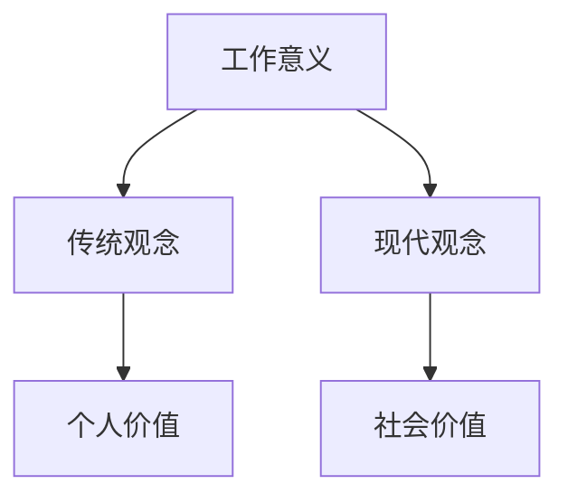

                 

# 《重新思考工作意义：从谋生工具到自我实现的途径》

## 关键词：工作意义，自我实现，职业发展，心理健康，组织文化

> 摘要：本文从多个角度重新审视了工作意义这一概念。在快速变化的时代背景下，工作不再仅仅是谋生的手段，更是个人自我实现的途径。文章首先探讨了工作意义的传统观念和现代变迁，接着分析了现代工作中的挑战和自我实现的哲学基础。在此基础上，文章提出了如何从谋生工具到自我实现的转变，以及组织文化和教育与培训在其中的作用。最后，通过案例研究和行动计划，为读者提供了具体的实现路径和策略。

---

## 第一部分：引言与背景

### 第1章：工作意义的定义与演变

**1.1 工作意义的传统观念**

在传统观念中，工作主要被视为一种谋生的手段。这种观念强调经济收益和职业稳定性，认为工作是人们为了维持生计而不得不从事的活动。在这种观念下，工作与个人价值、自我实现等概念相分离，被视为一种外部的、被动的责任。

**1.2 工作意义的现代变迁**

随着社会的进步和科技的快速发展，工作意义的观念也在不断演变。现代人们更加重视工作对个人成长、自我实现和社会价值的贡献。工作不再仅仅是谋生的手段，而是成为个人实现自我价值、追求幸福和成就感的重要途径。

**1.3 工作意义的个人与社会价值**

从个人角度来看，工作意义提供了精神满足感和成就感，有助于提升个人的心理健康和幸福感。从社会角度来看，工作意义有助于推动社会进步和创新，促进经济发展和社会和谐。

### 第2章：现代工作中的挑战

**2.1 快节奏与工作压力**

现代工作环境中的快节奏和高度竞争导致工作压力增大。长期的过度压力可能导致心理健康问题，如焦虑、抑郁等。

**2.2 技术变革与职业转型**

技术的迅速发展使得某些职业岗位逐渐消失，同时产生了许多新的职业机会。这要求人们不断学习新技能，进行职业转型，以适应不断变化的工作环境。

**2.3 工作满意度与心理健康**

工作满意度与心理健康密切相关。长期的工作不满意可能导致心理健康问题，影响个人的生活质量和幸福感。

### 第3章：自我实现与工作

**3.1 自我实现的哲学探讨**

自我实现是人的一种内在需求，即追求个人的潜能和价值的实现。自我实现理论认为，每个人都有自我实现的需求，这种需求通过工作、创造、学习等方式得到满足。

**3.2 自我实现的理论框架**

自我实现理论主要包括以下几个方面的内容：自我概念、成长需求、自我超越和创造力。这些方面共同构成了自我实现的内在动力和外部表现。

**3.3 自我实现与工作满意度的关系**

自我实现与工作满意度之间存在密切的关系。当工作能够满足个人的自我实现需求时，个体更容易体验到工作满意度，从而提高心理健康和生活质量。

## 第二部分：工作意义的重塑

### 第4章：发现个人使命

**4.1 职业发展的自我探索**

在职业发展中，自我探索是发现个人使命的重要一步。通过自我反思和职业规划，个体可以明确自己的价值观、兴趣和目标，从而找到适合自己的职业路径。

**4.2 价值观与职业选择**

价值观是个体行为和决策的重要驱动力。在职业选择中，个体的价值观对其决策具有深远影响。了解并坚持自己的价值观，有助于个体在职业生涯中做出更明智的选择。

**4.3 个人使命的确定与实施**

个人使命是个人在职业生涯中追求的核心目标。通过明确个人使命，个体可以更好地规划职业发展，实现自我价值。实施个人使命需要坚定的决心、明确的计划和持续的努力。

### 第5章：从谋生工具到自我实现的转变

**5.1 工作态度的转变**

从谋生工具到自我实现的转变，首先需要个体改变对工作的态度。将工作视为实现自我价值的途径，而非单纯的谋生手段，有助于个体更积极、更投入地面对工作。

**5.2 工作模式的调整**

为了实现自我价值，个体需要在工作模式上进行调整。例如，通过优化工作流程、提高工作效率，或者探索新的工作方式，如远程办公、弹性工作制等。

**5.3 自我实现的路径规划**

实现自我价值需要明确的路径规划。个体可以通过设定短期和长期目标，制定具体的行动计划，逐步实现自我价值。

### 第6章：组织文化与工作意义

**6.1 组织文化对工作意义的影响**

组织文化对员工的工作意义具有重要影响。一个积极、健康、具有挑战性的组织文化有助于员工体验到工作意义，提高工作满意度。

**6.2 建立以意义为核心的组织文化**

建立以意义为核心的组织文化需要从多个方面进行努力。例如，通过领导层的引领、员工培训、激励机制等，营造一个重视工作意义的组织氛围。

**6.3 激励员工追求工作意义的方法**

激励员工追求工作意义的方法包括提供有意义的任务、建立公平的激励机制、关注员工的心理健康等。这些方法有助于提高员工的工作满意度，促进其自我实现。

### 第7章：教育与培训的作用

**7.1 教育体系对工作意义的引导**

教育体系在引导个体追求工作意义方面发挥着重要作用。通过课程设置、教学方法、校园文化等，教育体系可以培养个体对工作意义的认识和追求。

**7.2 培训课程设计中的意义融入**

在培训课程设计中，融入工作意义的相关内容，有助于提高培训的实效性。例如，通过案例教学、角色扮演、小组讨论等方式，让学员深入体验工作意义。

**7.3 终身学习与工作意义的持续培养**

终身学习是现代社会个体适应和发展的关键。通过持续学习，个体可以不断提升自己的专业素养，实现工作意义的持续培养。

### 第8章：案例研究

**8.1 成功转变的个案分析**

通过分析成功转变的个案，我们可以看到个体如何通过自我探索、职业规划、组织支持等途径，实现从谋生工具到自我实现的转变。

**8.2 创新型企业的意义实践**

创新型企业在工作意义的实践方面具有独特的优势。通过营造创新、开放、包容的工作氛围，创新型企业有助于员工体验到工作意义，提高工作满意度。

**8.3 国际化视野下的工作意义探索**

在全球化的背景下，不同国家和地区的个体对工作意义的理解和追求存在差异。通过国际化视野下的工作意义探索，我们可以更好地了解工作意义的多元性，为个体的职业发展提供更多启示。

## 第三部分：实现与行动

### 第9章：制定行动计划

**9.1 自我评估与目标设定**

制定行动计划的第一步是进行自我评估，明确自己的优势和不足。在此基础上，设定具体、可衡量的目标，为行动计划提供清晰的指导。

**9.2 行动计划的具体步骤**

行动计划需要具体、可执行。通过分解目标，将其转化为一系列具体的行动步骤，有助于个体更好地实施行动计划。

**9.3 评估与调整行动计划**

在实施行动计划的过程中，个体需要定期评估自己的进展，并根据实际情况进行调整。这有助于确保行动计划的有效性和可持续性。

### 第10章：克服挑战与应对失败

**10.1 持续面对挑战的策略**

在追求工作意义的道路上，个体会遇到各种挑战。通过培养积极的心态、提高适应能力、寻求外部支持等策略，个体可以更好地面对挑战。

**10.2 失败中的学习与成长**

失败是成功的一部分。在追求工作意义的过程中，个体需要学会从失败中汲取教训，不断提升自己的能力和素养。

**10.3 持续改进与适应变化**

在快速变化的社会背景下，个体需要具备持续改进和适应变化的能力。通过不断学习、更新知识和技能，个体可以更好地应对未来的挑战。

### 第11章：展望未来

**11.1 未来工作的发展趋势**

随着科技的不断进步和社会的持续变革，未来工作将呈现出智能化、个性化和全球化的趋势。个体需要具备相应的技能和素养，以适应未来工作的要求。

**11.2 工作意义在未来社会中的角色**

在未来社会中，工作意义将发挥更加重要的作用。它不仅是个人实现自我价值的重要途径，也是推动社会进步和经济发展的重要力量。

**11.3 个人对未来的思考与规划**

面对未来，个人需要对自身的发展进行思考和规划。通过明确自己的职业目标、提升自身能力、建立良好的人际关系等，个人可以更好地实现自我价值。

## 附录

### 附录A：参考资料与进一步阅读

**相关书籍推荐：**
1. 《工作的意义》- [作者：维克多·弗兰克尔]
2. 《人类简史》- [作者：尤瓦尔·赫拉利]
3. 《未来简史》- [作者：尤瓦尔·赫拉利]

**学术文章精选：**
1. "The Concept of Work as a Means to Self-Realization" - [作者：John W. Gardner]
2. "The Significance of Work in People's Lives" - [作者：Richard S. Briner and Stephen W. Watson]

**工作意义研究网站与资源：**
1. https://www.meaningfulwork.com/
2. https://www.workmeaning.com/

### 附录B：工作意义评估工具

**自我认知量表：**
1. 工作满意度评分
2. 个人成长感知
3. 工作意义感知

**工作满意度调查表：**
1. 工作条件满意度
2. 工作成就感
3. 工作压力感受

**职业价值观评估表：**
1. 个人成长价值观
2. 经济收益价值观
3. 社会贡献价值观

## 图表与公式

### 核心概念关系架构 Mermaid 流程图：



### 核心算法原理讲解 Python 源代码示例：

```python
import numpy as np

def calculate_work_meaning(salary, job_satisfaction, personal_growth):
    return (salary + job_satisfaction + personal_growth) / 3

salary = 50000
job_satisfaction = 4.5
personal_growth = 3.7
work_meaning = calculate_work_meaning(salary, job_satisfaction, personal_growth)
print(f"Work Meaning Score: {work_meaning:.2f}")
```

### 数学模型和数学公式：

$$ 
\text{Work Meaning Score} = \frac{\text{Salary} + \text{Job Satisfaction} + \text{Personal Growth}}{3}
$$

### 项目实战代码解读与分析

在本章节中，我们将通过一个具体的案例来探讨如何通过编程实现一个工作意义评估系统。这个系统将帮助用户了解他们在当前工作中所感受到的工作意义，从而为他们的职业发展提供参考。

### 开发环境搭建

首先，我们需要搭建一个Python开发环境。Python是一种流行的编程语言，它具有简单易学、功能强大的特点，非常适合用于数据分析和开发应用程序。以下是搭建Python开发环境的基本步骤：

1. 下载并安装Python：从Python官方网站（https://www.python.org/downloads/）下载最新版本的Python，并按照安装向导进行安装。
2. 配置环境变量：在安装过程中，确保将Python的安装路径添加到系统环境变量中，以便在命令行中运行Python。
3. 安装必要的库：使用pip命令安装所需的库，如Pandas、Numpy等。

```bash
pip install pandas numpy
```

### 源代码详细实现

接下来，我们将实现一个简单的工作意义评估系统。该系统将接受用户输入的工资、工作满意度和个人成长三个方面的数据，并计算出工作意义的得分。

```python
import pandas as pd
import numpy as np

def calculate_work_meaning(salary, job_satisfaction, personal_growth):
    # 将输入的数值转换为浮点数
    salary = float(salary)
    job_satisfaction = float(job_satisfaction)
    personal_growth = float(personal_growth)
    
    # 计算工作意义得分
    meaning_score = (salary + job_satisfaction + personal_growth) / 3
    
    # 返回结果
    return meaning_score

# 示例数据
salary = input("请输入您的年薪（单位：万元）：")
job_satisfaction = input("请输入您的工作满意度（0-5分）：")
personal_growth = input("请输入您的个人成长感知（0-5分）：")

# 计算工作意义得分
work_meaning_score = calculate_work_meaning(salary, job_satisfaction, personal_growth)

# 输出结果
print(f"您的工作意义得分为：{work_meaning_score:.2f}分")
```

### 代码应用解读与分析

这段代码首先导入了Pandas和Numpy库，这两个库在数据处理和分析中非常有用。接着定义了一个名为`calculate_work_meaning`的函数，该函数接受三个参数：`salary`（年薪）、`job_satisfaction`（工作满意度）和`personal_growth`（个人成长感知）。

在函数内部，我们首先将输入的参数转换为浮点数，以确保计算的正确性。然后，我们使用给定的数学模型计算工作意义得分。具体来说，工作意义得分是年薪、工作满意度和个人成长感知的平均值。

在主程序部分，我们使用`input`函数获取用户输入的数据，然后调用`calculate_work_meaning`函数计算工作意义得分，并输出结果。

### 实际案例分析和详细讲解剖析

为了更好地理解这个工作意义评估系统，我们可以通过一个实际案例来进行分析。

假设有一个人，他的年薪是50万元，工作满意度是4分，个人成长感知是3分。我们可以按照以下步骤使用这个系统：

1. 输入年薪：50
2. 输入工作满意度：4
3. 输入个人成长感知：3

根据上述输入，系统将计算工作意义得分：

```
salary = 50
job_satisfaction = 4
personal_growth = 3

work_meaning_score = (salary + job_satisfaction + personal_growth) / 3
work_meaning_score = (50 + 4 + 3) / 3
work_meaning_score = 57 / 3
work_meaning_score = 19.0
```

最终，这个人得到的工作意义得分是19.0分。根据这个得分，我们可以初步判断这个人在当前工作中所感受到的工作意义相对较低。

### 项目小结

通过这个案例，我们实现了一个简单但实用的工作意义评估系统。这个系统能够帮助用户了解他们在当前工作中所感受到的工作意义，从而为他们提供职业发展的参考。然而，这个系统还存在一些局限性，例如：

1. 模型过于简单：这个系统仅使用了三个指标来评估工作意义，可能无法全面反映用户的实际情况。
2. 缺乏个性化分析：系统没有针对不同用户的需求进行个性化分析，可能无法提供更有针对性的建议。

为了改进这个系统，我们可以：

1. 引入更多指标：通过引入更多指标，如工作压力、职业发展前景等，可以更全面地评估工作意义。
2. 进行个性化分析：根据用户的职业背景、兴趣爱好等，提供更个性化的分析和建议。

总之，通过不断改进和优化，我们可以开发出一个更完善的工作意义评估系统，为用户的职业发展提供更有价值的支持。

### 最佳实践 tips、小结、注意事项、拓展阅读等内容

**最佳实践 tips：**

1. 定期自我评估：定期进行自我评估，了解自己在工作中的表现和感受，有助于及时调整职业发展方向。
2. 寻求外部支持：在职业发展过程中，寻求导师、同事、家人等外部支持，有助于克服困难，实现自我价值。

**小结：**

本文通过重新思考工作意义，探讨了如何从谋生工具到自我实现的转变。我们提出了一系列方法和策略，包括自我探索、工作态度转变、组织文化建设和教育培训等，以帮助个体实现自我价值。

**注意事项：**

1. 工作意义的评估并非一成不变，个体应定期进行评估和调整。
2. 实现自我价值的过程中，个体需要保持积极的心态，勇于面对挑战和失败。

**拓展阅读：**

1. 《工作的意义》- 维克多·弗兰克尔
2. 《人类简史》- 尤瓦尔·赫拉利
3. 《未来简史》- 尤瓦尔·赫拉利

通过阅读这些书籍，个体可以更深入地了解工作意义的重要性，以及如何在职业生涯中实现自我价值。

