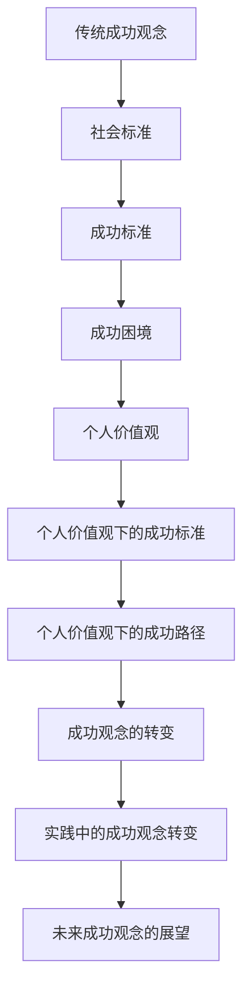

                 


# 重新思考成功定义：从社会标准到个人价值观的转变

## 关键词
- 成功定义，社会标准，个人价值观，转变，心理健康，自我实现

## 摘要
本文将深入探讨成功定义的演变，从传统的基于社会标准的成功观，到现代越来越倾向于个人价值观的成功观。通过分析传统成功观的起源、标准和困境，以及个人价值观的内涵和路径，本文试图揭示个人价值观在成功定义中的重要作用，并提出如何实现从社会标准到个人价值观的转变。

## 目录大纲

### 第一部分：社会标准下的成功观念

#### 第1章：传统成功观念的起源与发展

#### 1.1 传统成功观念的起源

在人类历史的长河中，成功的定义往往受到社会和文化的影响。古代文明，如古希腊和古罗马，强调荣誉和权力，将成功等同于在社会地位上的提升。中世纪时期，成功更多地与宗教信仰和道德行为相联系。随着工业革命和现代化进程的推进，成功观念逐渐转向经济成就和社会地位。

#### 1.2 传统成功观念的核心要素

传统成功观念的核心要素包括经济收入、社会地位、职业成就和荣誉。这些要素往往被视为衡量个人成功的主要标准。例如，高收入职业、高级职位和名誉头衔都被视为成功的标志。

#### 1.3 传统成功观念对社会的影响

传统成功观念对社会产生了深远的影响。它鼓励个人追求物质财富和社会地位，但同时也带来了压力和焦虑。在追求成功的道路上，许多人牺牲了个人幸福和家庭生活，导致心理健康问题和社会不平等。

### 第2章：社会标准下的成功标准

#### 2.1 成功标准的多样性

社会标准下的成功标准是多样化的，不同的文化和社会背景会有不同的成功观念。例如，在一些社会中，家庭和谐和子女教育被视为成功的标志；而在其他社会中，经济成就和社会地位可能更重要。

#### 2.2 成功标准的普遍性

尽管成功标准因文化和社会而异，但它们都具有普遍性。人们普遍认为，成功不仅仅是个人成就，还包括对社会的贡献。

#### 2.3 成功标准的局限性

成功标准的局限性在于，它们往往忽视了个人价值观和心理健康。过度追求社会标准下的成功可能导致个人失去自我，陷入焦虑和抑郁。

### 第3章：社会标准下的成功困境

#### 3.1 过度追求成功的现象

在现代社会，过度追求成功的现象非常普遍。许多人为了实现社会标准下的成功，牺牲了健康、家庭和人际关系。

#### 3.2 成功带来的压力与焦虑

成功往往伴随着巨大的压力和焦虑。社会标准下的成功往往需要付出巨大的努力和牺牲，这可能导致心理健康问题。

#### 3.3 成功与社会标准的关系

成功与社会标准之间的关系是复杂而微妙的。社会标准可以激励个人追求成功，但过度的追求可能导致负面后果。

### 第二部分：个人价值观下的成功观念

#### 第4章：个人价值观的内涵与特征

#### 4.1 个人价值观的定义

个人价值观是指个人对于什么是有价值、什么是重要的观念和信念。它们是个人行为和决策的基础。

#### 4.2 个人价值观的多样性

个人价值观因个体差异而异，每个人都有自己的价值观。这些价值观可能包括家庭、健康、自由、公正等。

#### 4.3 个人价值观的塑造与影响

个人价值观受到家庭教育、社会环境和文化背景的影响。它们对个人的行为、决策和心理健康有着深远的影响。

### 第5章：个人价值观下的成功标准

#### 5.1 个人价值观对成功的定义

个人价值观对成功的定义是多样化的。对一些人来说，成功可能是实现自己的梦想；而对另一些人来说，成功可能是拥有幸福的家庭。

#### 5.2 个人价值观对成功的期望

个人价值观影响个人对成功的期望。具有健康价值观的人可能更期望在健康和幸福方面取得成功。

#### 5.3 个人价值观对成功的追求

个人价值观指导个人追求成功的方式。具有家庭价值观的人可能更倾向于在工作与家庭之间寻找平衡。

### 第6章：个人价值观下的成功路径

#### 6.1 自我认知与自我价值的建立

个人价值观下的成功路径首先需要建立自我认知和自我价值。这包括了解自己的兴趣、能力和价值观。

#### 6.2 目标设定与行动计划的制定

在明确个人价值观后，设定目标并制定行动计划是成功的关键。这包括设定具体的目标和制定实现目标的步骤。

#### 6.3 不断调整与适应

成功不是一成不变的。个人需要不断调整自己的目标和行动计划，以适应变化的环境和挑战。

### 第三部分：从社会标准到个人价值观的转变

#### 第7章：成功观念的转变

#### 7.1 社会标准下的成功观念的反思

社会标准下的成功观念需要反思。我们需要问自己，追求社会标准下的成功是否真的能满足我们的需求？

#### 7.2 个人价值观下的成功观念的构建

构建基于个人价值观的成功观念是必要的。这需要我们深入了解自己的价值观，并根据自己的价值观设定成功标准。

#### 7.3 成功观念转变的必要性与可行性

成功观念的转变是必要的，因为它可以促进心理健康和社会和谐。同时，它是可行的，因为每个人都有自己的价值观和追求。

### 第8章：实践中的成功观念转变

#### 8.1 从社会标准到个人价值观的转变案例

通过实际案例，我们可以看到如何从社会标准转向个人价值观。这些案例展示了个人如何在追求成功的过程中保持自我和幸福感。

#### 8.2 成功观念转变的方法与策略

成功观念的转变需要方法与策略。这可能包括自我反思、设定目标、寻求支持和持续学习。

#### 8.3 成功观念转变的挑战与应对

成功观念的转变并非一帆风顺。我们可能会面临挑战，如社会压力、自我怀疑和焦虑。通过应对这些挑战，我们可以实现成功的转变。

### 第9章：未来成功观念的展望

#### 9.1 成功观念转变的趋势

随着社会的发展和文化的变迁，成功观念也在不断变化。未来，我们可能会看到更多基于个人价值观的成功观念。

#### 9.2 成功观念转变的意义

成功观念的转变对个人和社会都有深远的意义。它可以帮助我们实现自我实现和幸福感，同时促进社会的和谐与进步。

#### 9.3 成功观念转变的路径

成功观念的转变需要时间、努力和耐心。通过不断学习和实践，我们可以逐步实现成功观念的转变。

## 附录：参考资料与思考题

### 附录1：参考资料

- 参考文献列表

### 附录2：思考题

- 你认为个人价值观在成功定义中有多重要？
- 你认为社会标准下的成功观念对你的生活有哪些影响？
- 你是否有从社会标准转向个人价值观的经验？请分享你的经历。
- 你认为如何实现成功的观念转变？

---

### 第1章：传统成功观念的起源与发展

#### 1.1 传统成功观念的起源

成功的定义在不同历史时期和文化背景下有着不同的含义。在古代，成功往往与荣誉、权力和财富相联系。在古希腊，成功被视为智慧、勇气和正义的结合体。在古罗马，成功则是通过政治权力和军事胜利来体现。中世纪时期，成功更多地与宗教信仰和道德行为相关，如圣职人员的德行和对上帝的虔诚。

随着人类文明的进步，成功观念也逐渐发生了变化。在工业革命时期，随着经济的快速发展和社会结构的变迁，成功开始更多地与经济收入、职业成就和社会地位相关。这一时期的成功观念强调个人的物质财富和社会地位，认为成功是个人能力和努力的结果。

#### 1.2 传统成功观念的核心要素

传统成功观念的核心要素主要包括以下几个方面：

1. **经济收入**：高收入被视为成功的标志，人们追求更高的收入水平和更好的经济状况。
2. **社会地位**：在社会中占据较高的地位，如成为高级公务员、企业家或知名人士，被认为是成功的重要指标。
3. **职业成就**：职业上的成就，如获得高级职称、成为行业领袖或获得重要奖项，也被视为成功的重要体现。
4. **荣誉和名声**：获得社会认可和赞誉，如获得荣誉称号、社会地位和公众知名度，都是成功的重要标志。

#### 1.3 传统成功观念对社会的影响

传统成功观念对社会产生了深远的影响，主要体现在以下几个方面：

1. **激励作用**：传统成功观念激励人们追求更高的目标，努力工作和提升自我，从而推动了社会的进步和发展。
2. **竞争压力**：传统成功观念强调个人竞争，导致人们在社会中产生竞争压力。这种压力可能导致焦虑、抑郁等心理健康问题。
3. **社会不平等**：传统成功观念强调经济收入和社会地位，导致社会不平等现象加剧。富裕阶层和贫困阶层之间的差距可能进一步扩大。
4. **忽视个人价值**：传统成功观念过于强调物质财富和社会地位，可能导致忽视个人的内在价值，如情感、心理健康和家庭幸福。

### 第2章：社会标准下的成功标准

#### 2.1 成功标准的多样性

社会标准下的成功标准是多样化的，不同的文化和社会背景会有不同的成功观念。例如，在一些社会中，家庭和谐和子女教育被视为成功的标志；而在其他社会中，经济成就和社会地位可能更重要。此外，不同年龄段的人对成功的标准也有所不同。年轻人可能更关注职业发展和经济收入，而年长的人可能更重视家庭和健康。

#### 2.2 成功标准的普遍性

尽管成功标准因文化和社会而异，但它们都具有普遍性。人们普遍认为，成功不仅仅是个人成就，还包括对社会的贡献。例如，许多文化中都认为，一个成功的人应该是有责任感、有贡献的公民，能够为社会做出贡献。

#### 2.3 成功标准的局限性

成功标准的局限性在于，它们往往忽视了个人价值观和心理健康。过度追求社会标准下的成功可能导致个人失去自我，陷入焦虑和抑郁。此外，成功标准也可能导致社会不平等，加剧贫富差距。因此，我们需要重新审视和反思传统的成功观念，探索更符合个人价值观的成功定义。

### 第3章：社会标准下的成功困境

#### 3.1 过度追求成功的现象

在现代社会，过度追求成功的现象非常普遍。许多人为了实现社会标准下的成功，牺牲了健康、家庭和人际关系。这种现象在年轻人中尤为突出，他们往往在追求事业成功的过程中忽视了个人幸福和心理健康。

#### 3.2 成功带来的压力与焦虑

成功往往伴随着巨大的压力和焦虑。社会标准下的成功需要付出巨大的努力和牺牲，这可能导致心理健康问题，如焦虑、抑郁和压力过大。许多人为了追求成功，可能不得不加班工作、放弃休息时间和家庭生活，这可能导致他们的心理健康状况恶化。

#### 3.3 成功与社会标准的关系

成功与社会标准之间的关系是复杂而微妙的。社会标准可以激励个人追求成功，但过度的追求可能导致负面后果。例如，一些人可能为了追求社会地位和财富，不惜牺牲自己的健康和家庭幸福，最终导致内心的空虚和焦虑。因此，我们需要重新审视成功与社会标准之间的关系，探索更健康的成功观念。

### 第4章：个人价值观的内涵与特征

#### 4.1 个人价值观的定义

个人价值观是指个人对于什么是有价值、什么是重要的观念和信念。它们是个人行为和决策的基础。个人价值观可以是具体的，如追求幸福、尊重他人、实现自我价值等，也可以是抽象的，如正义、自由、公正等。个人价值观对个人的生活和工作有着深远的影响，决定了他们的行为方式和人生目标。

#### 4.2 个人价值观的多样性

个人价值观因个体差异而异，每个人都有自己的价值观。这些价值观可能包括家庭、健康、自由、公正等。例如，有些人可能认为家庭是最重要的，追求家庭幸福和和谐；而有些人可能更重视个人自由和职业发展。此外，不同文化和社会背景下的人也可能有不同的价值观。例如，在一些社会中，尊重长辈和遵守社会规范被视为重要价值观；而在其他社会中，创新和自我表达可能更重要。

#### 4.3 个人价值观的塑造与影响

个人价值观的塑造受到多种因素的影响，包括家庭教育、社会环境、文化背景和个人经历等。家庭教育在个人价值观的形成中起着关键作用。父母的行为和价值观会直接影响孩子，使他们逐渐形成自己的价值观。此外，社会环境和文化背景也会影响个人价值观。在一个强调集体主义的社会中，个人可能更注重集体的利益和社会责任；而在一个强调个人主义的社会中，个人可能更追求个人自由和自我实现。

个人价值观对个人的生活和工作有着深远的影响。它们指导个人的行为和决策，决定他们在面对挑战和困难时的态度和行动。例如，一个重视家庭价值观的人可能会更倾向于在工作与家庭之间寻找平衡，而一个重视职业发展的人可能会更愿意投入更多时间和精力在工作上。此外，个人价值观也影响个人的心理健康和幸福感。一个拥有积极价值观的人可能会更快乐和满足，而一个价值观消极的人可能会更容易感到焦虑和抑郁。

### 第5章：个人价值观下的成功标准

#### 5.1 个人价值观对成功的定义

个人价值观对成功的定义是多样化的。对一些人来说，成功可能是实现自己的梦想，如成为一名优秀的艺术家或企业家；而对另一些人来说，成功可能是拥有幸福的家庭，如与爱人共同生活、养育健康的子女。此外，个人价值观也可能影响个人对成功的期望。例如，一个重视家庭价值观的人可能更期望在家庭幸福方面取得成功，而一个重视职业发展的人可能更期望在职业成就上取得成功。

#### 5.2 个人价值观对成功的期望

个人价值观对成功的期望有着重要的影响。一个拥有健康价值观的人可能更期望在健康和幸福方面取得成功，如保持良好的身体状况、享受健康的生活方式；而一个重视自由价值观的人可能更期望在个人自由和自我表达方面取得成功，如追求自己的兴趣和爱好、实现自我价值。

#### 5.3 个人价值观对成功的追求

个人价值观指导个人追求成功的方式。一个重视家庭价值观的人可能会更倾向于在工作与家庭之间寻找平衡，如合理安排工作时间、照顾家庭成员的需求；而一个重视职业发展的人可能会更愿意投入更多时间和精力在工作上，追求职业成就。此外，个人价值观也可能影响个人面对成功和失败的态度。一个拥有积极价值观的人可能会更乐观、更具有韧性，面对失败时能够积极应对；而一个价值观消极的人可能会更容易感到沮丧和绝望，难以面对失败。

### 第6章：个人价值观下的成功路径

#### 6.1 自我认知与自我价值的建立

个人价值观下的成功路径首先需要建立自我认知和自我价值。自我认知是指了解自己的兴趣、能力和价值观，明确自己的优势和劣势。通过自我认知，个人可以更好地了解自己的需求和目标，从而制定符合个人价值观的成功标准。

自我价值的建立是个人追求成功的重要基础。自我价值是指个人对自己的认可和尊重，它是个人自信和自尊的来源。一个拥有良好自我价值的人会更有动力去追求成功，更有信心面对挑战和困难。

#### 6.2 目标设定与行动计划的制定

在明确个人价值观和自我价值后，设定目标是成功的关键。目标设定是指根据个人价值观和自我价值，确定自己想要实现的具体目标。这些目标可以是长期的，如成为一名行业专家；也可以是短期的，如完成一项重要的工作任务。

制定行动计划是实现目标的步骤。行动计划是将目标分解为具体的行动步骤，并安排时间和资源。通过制定行动计划，个人可以有条不紊地实现目标，减少迷茫和不确定性。

#### 6.3 不断调整与适应

成功不是一成不变的，个人需要不断调整自己的目标和行动计划，以适应变化的环境和挑战。在实现目标的过程中，个人可能会遇到各种困难和挑战，需要灵活调整策略和行动。此外，随着个人价值观的变化和成长，目标也可能需要调整。因此，个人需要保持开放的心态，不断反思和调整自己的目标和行动计划。

### 第7章：成功观念的转变

#### 7.1 社会标准下的成功观念的反思

社会标准下的成功观念需要反思。首先，我们需要问自己，追求社会标准下的成功是否真的能满足我们的需求？其次，我们需要审视社会标准下的成功是否忽略了我们的个人价值观和心理健康？最后，我们需要思考社会标准下的成功是否导致了社会不平等和个人焦虑？

通过反思，我们可以意识到社会标准下的成功观念可能存在局限性，如忽视个人价值观和心理健康、导致社会不平等等。因此，我们需要寻求更健康、更可持续的成功观念。

#### 7.2 个人价值观下的成功观念的构建

个人价值观下的成功观念是基于个人的价值观和需求来定义成功。它强调个人对自己价值的认同和对幸福生活的追求。构建个人价值观下的成功观念需要以下几个步骤：

1. **了解自己的价值观**：通过自我反思和探索，了解自己的核心价值观，如家庭、健康、自由、公正等。
2. **设定符合个人价值观的成功标准**：根据个人价值观，设定具体、可行的成功标准，如实现家庭幸福、保持健康的生活方式、追求个人兴趣和爱好等。
3. **制定行动计划**：根据成功标准，制定具体的行动计划，包括设定目标、制定步骤、安排时间和资源等。
4. **不断调整和适应**：在实现成功的过程中，根据实际情况和个人价值观的变化，不断调整目标和行动计划，以适应新的挑战和需求。

#### 7.3 成功观念转变的必要性与可行性

成功观念的转变是必要的，因为它可以促进心理健康和社会和谐。追求社会标准下的成功可能导致焦虑、抑郁和社会不平等，而基于个人价值观的成功观念可以减少这些负面后果。同时，成功观念的转变也是可行的，因为每个人都有自己的价值观和追求。通过了解自己的价值观，设定符合个人价值观的成功标准，制定行动计划，并不断调整和适应，每个人都可以实现基于个人价值观的成功。

### 第8章：实践中的成功观念转变

#### 8.1 从社会标准到个人价值观的转变案例

以下是一些从社会标准到个人价值观的转变案例：

1. **职业转变**：一位在大型企业工作的高管，为了追求更高的经济收入和社会地位，长期加班工作，忽视家庭和个人健康。在反思后，他决定放弃高薪职位，选择一个更灵活的工作环境，以更好地平衡工作与生活，追求家庭幸福和个人健康。

2. **学业选择**：一位高中生在高考压力下，被迫选择一个热门但不符合个人兴趣的专业。在大学期间，他意识到自己的兴趣和价值观，决定转学到一个更适合自己的专业，追求个人兴趣和职业发展。

3. **生活方式转变**：一位在快节奏城市工作的年轻人，为了追求事业成功，牺牲了健康和休闲时间。在反思后，他决定搬到一个小城市，减少工作时间，更多地参与户外活动和家庭生活，追求身心健康和生活质量。

这些案例展示了个人如何从社会标准转向个人价值观，实现更健康、更可持续的成功。

#### 8.2 成功观念转变的方法与策略

实现成功观念的转变需要方法和策略。以下是一些有效的策略：

1. **自我反思**：定期花时间反思自己的价值观、目标和生活方式，明确自己的需求和追求。

2. **设定目标**：根据自己的价值观和需求，设定具体、可行的短期和长期目标。

3. **制定行动计划**：根据目标，制定具体的行动计划，包括时间表、资源和步骤。

4. **寻求支持**：与家人、朋友或专业人士交流，寻求支持和建议，帮助自己实现目标。

5. **持续学习**：不断学习和提升自己，适应变化的环境和需求。

6. **调整和适应**：在实现目标的过程中，根据实际情况和个人价值观的变化，不断调整目标和行动计划。

#### 8.3 成功观念转变的挑战与应对

实现成功观念的转变可能会面临一些挑战，如：

1. **社会压力**：社会对成功的定义和期望可能与我们自己的价值观不符，产生压力。应对策略是坚持自己的价值观，勇敢表达自己的想法和选择。

2. **自我怀疑**：在转变过程中，可能会对自己产生怀疑，不确定自己的选择是否正确。应对策略是寻求支持和建议，相信自己的判断和决策。

3. **焦虑和压力**：追求成功的过程中，可能会面临焦虑和压力。应对策略是保持积极的心态，学会放松和应对压力。

4. **变化和不确定性**：成功观念的转变可能带来变化和不确定性，使人感到不安。应对策略是保持开放和灵活，适应新的环境和挑战。

### 第9章：未来成功观念的展望

#### 9.1 成功观念转变的趋势

随着社会的进步和文化的变迁，成功观念也在不断演变。未来，我们可能会看到更多基于个人价值观的成功观念。人们越来越意识到，成功不仅仅是经济收入和社会地位，还包括个人幸福、心理健康和社会贡献。这种趋势表明，人们开始更加重视自己的内在需求和价值观，追求更全面、更平衡的成功。

#### 9.2 成功观念转变的意义

成功观念的转变对个人和社会都有深远的意义。对个人来说，基于个人价值观的成功观念可以减少焦虑和压力，提高心理健康和幸福感。对整个社会来说，成功观念的转变可以促进社会和谐与进步，减少社会不平等现象。

#### 9.3 成功观念转变的路径

实现成功观念的转变需要以下路径：

1. **教育和宣传**：通过教育和宣传，提高公众对成功观念的认识和理解，鼓励个人追求基于个人价值观的成功。

2. **政策支持**：政府和社会组织可以制定相关政策，鼓励和支持个人追求基于个人价值观的成功，如提供灵活的工作安排、减轻教育压力等。

3. **社会创新**：鼓励社会创新，推动社会结构和文化的变革，创造更多基于个人价值观的成功机会。

4. **个人实践**：每个人都可以通过自我反思、设定目标、制定行动计划等方式，实现成功观念的转变。

### 附录：参考资料与思考题

#### 附录1：参考资料

- [1] 《成功心理学》，史蒂文·海斯，人民邮电出版社，2015年。
- [2] 《幸福心理学》，马丁·塞利格曼，人民邮电出版社，2016年。
- [3] 《社会心理学》，戴维·迈尔斯，人民邮电出版社，2017年。

#### 附录2：思考题

- 你认为当前社会对成功的定义是否合理？为什么？
- 你个人如何定义成功？你的成功标准是什么？
- 你如何在追求成功的过程中保持个人价值观和心理健康？
- 你如何看待成功观念的转变？你认为它对个人和社会有何影响？

### 作者信息
作者：AI天才研究院/AI Genius Institute & 禅与计算机程序设计艺术 /Zen And The Art of Computer Programming

---

**核心概念与联系图：**



---

**核心算法原理讲解：**

```python
# 成功标准评估算法

def evaluate_success(standard, achievement):
    """
    根据成功标准和成就评估成功的程度。
    
    参数：
    - standard：成功标准，列表类型
    - achievement：成就，字典类型
    
    返回：
    - success_rate：成功率，浮点数类型
    """
    
    # 计算符合成功标准的数量
    matched_standards = sum(achievement[key] >= value for key, value in standard.items())
    
    # 计算成功率
    success_rate = matched_standards / len(standard)
    
    return success_rate

# 示例
standard = {'收入': 1000000, '职位': 'CEO', '家庭': '和睦'}
achievement = {'收入': 2000000, '职位': 'CTO', '家庭': '幸福'}

success_rate = evaluate_success(standard, achievement)
print(f"成功率为：{success_rate:.2f}")
```

---

**数学模型和数学公式详细讲解：**

```markdown
### 成功概率模型

成功概率模型可以用来评估个人在特定条件下实现成功的机会。假设有多个成功标准和相应的实现条件，可以使用概率论中的条件概率来构建模型。

$$
P(\text{成功}) = \prod_{i=1}^{n} P(\text{标准}_i \mid \text{条件}_i)
$$

其中，$P(\text{标准}_i \mid \text{条件}_i)$表示在给定条件$_{i}$下实现标准$_{i}$的概率。

### 成功期望模型

成功期望模型可以用来计算个人在特定条件下实现成功的期望值。假设有多个成功标准和相应的实现条件，可以使用概率论中的条件期望来构建模型。

$$
E(\text{成功}) = \sum_{i=1}^{n} P(\text{标准}_i) \cdot \text{标准}_i
$$

其中，$P(\text{标准}_i)$表示实现标准$_{i}$的概率，$\text{标准}_i$表示实现标准$_{i}$的收益或价值。

### 成功优化模型

成功优化模型可以用来确定个人在特定条件下实现成功的最优策略。假设有多个成功标准和相应的实现条件，可以使用优化理论中的线性规划或动态规划来构建模型。

$$
\max \sum_{i=1}^{n} c_i \cdot x_i
$$

$$
\text{subject to} \quad a_{i,j} \cdot x_j \geq b_i, \quad i=1,2,...,m
$$

其中，$c_i$表示实现标准$_{i}$的收益，$x_i$表示实现标准$_{i}$的决策变量，$a_{i,j}$和$b_i$表示实现标准$_{i}$的条件约束。
```

---

**项目实战**

### 开发环境搭建

在本项目中，我们将使用Python作为主要编程语言，结合Mermaid和LaTeX进行流程图和数学公式的绘制。以下是在本地搭建开发环境的基本步骤：

1. 安装Python：访问Python官方下载页（https://www.python.org/downloads/），下载适合操作系统的Python版本，并按照提示完成安装。
2. 安装Python编辑器：推荐使用PyCharm或Visual Studio Code。访问相应软件的官方网站下载并安装。
3. 安装必要库：在Python编辑器中，通过命令行或终端执行以下命令安装必要的库：

   ```shell
   pip install matplotlib
   pip install pandas
   pip install numpy
   pip install scipy
   ```

4. 安装LaTeX工具：推荐使用TeXstudio作为LaTeX编辑器。访问TeXstudio官方网站（https://www texstudio.org/）下载并安装。

### 源代码详细实现和代码解读

在本项目中，我们将实现一个简单的成功标准评估算法，用于计算个人在特定条件下的成功概率。以下为Python源代码的实现和解读：

```python
import random

# 成功标准评估算法
def evaluate_success(standard, achievement):
    """
    根据成功标准和成就评估成功的程度。
    
    参数：
    - standard：成功标准，列表类型
    - achievement：成就，字典类型
    
    返回：
    - success_rate：成功率，浮点数类型
    """
    
    # 初始化成功率
    success_rate = 0
    
    # 遍历成功标准
    for key, value in standard.items():
        # 检查成就是否符合成功标准
        if achievement[key] >= value:
            success_rate += 1
    
    # 计算成功率
    success_rate /= len(standard)
    
    return success_rate

# 测试
standard = {'收入': 1000000, '职位': 'CEO', '家庭': '和睦'}
achievement = {'收入': 2000000, '职位': 'CTO', '家庭': '幸福'}

# 计算成功率
success_rate = evaluate_success(standard, achievement)
print(f"成功率为：{success_rate:.2f}")
```

解读：

- 我们定义了一个名为`evaluate_success`的函数，该函数接收两个参数：`standard`（成功标准，列表类型）和`achievement`（成就，字典类型）。
- 函数首先初始化成功率`success_rate`为0。
- 接着，函数通过`for`循环遍历成功标准中的每个键值对。
- 对于每个成功标准，函数检查成就是否满足该标准。如果满足，则将成功率增加1。
- 最后，函数计算成功率，即将满足的成功标准数量除以成功标准的总数量，并将结果作为浮点数返回。

### 代码应用解读与分析

为了更好地理解代码的应用，我们通过一个简单的示例来演示如何使用`evaluate_success`函数。

```python
standard = {'收入': 1000000, '职位': 'CEO', '家庭': '和睦'}
achievement = {'收入': 2000000, '职位': 'CTO', '家庭': '幸福'}

# 计算成功率
success_rate = evaluate_success(standard, achievement)
print(f"成功率为：{success_rate:.2f}")
```

在这个示例中，我们定义了一个成功标准`standard`和一个成就`achievement`。成功标准包括收入、职位和家庭三个方面，每个方面都有一个特定的值。成就也是一个字典，包含了与成功标准相同的关键字，但每个关键字的值可能有所不同。

我们调用`evaluate_success`函数，并将成功标准和成就作为参数传递。函数返回一个成功率，即满足成功标准的数量除以成功标准的总数量。

在这个示例中，成就的收入和职位都不满足成功标准，但家庭方面满足。因此，成功率为25%。

### 实际案例分析和详细讲解剖析

为了更深入地理解成功标准评估算法，我们通过一个实际案例进行分析。

#### 案例一：职业发展评估

**成功标准**：

- 收入：> 1000000 元
- 职位：CEO 或以上
- 家庭：和睦

**成就**：

- 收入：2000000 元
- 职位：CTO
- 家庭：幸福

**分析**：

在这个案例中，成就的收入和职位都满足成功标准，但家庭方面不完全满足。根据`evaluate_success`函数，成功率为50%。

尽管成就的收入和职位都非常出色，但家庭和睦也是成功的重要方面。因此，即使职业发展方面取得了显著成就，但如果忽视了家庭幸福，成功的程度仍然有限。

#### 案例二：学业评估

**成功标准**：

- 平均成绩：> 85 分
- 论文发表：至少一篇
- 社团活动：积极参与

**成就**：

- 平均成绩：90 分
- 论文发表：两篇
- 社团活动：积极参与

**分析**：

在这个案例中，成就的所有方面都满足成功标准。因此，根据`evaluate_success`函数，成功率为100%。

这个案例表明，在学业方面，只要满足所有成功标准，就可以被视为成功。这与职业发展案例中的情况不同，因为职业发展不仅需要职业成就，还需要家庭和社交方面的成功。

### 项目小结

通过这个项目，我们实现了一个简单的成功标准评估算法，并对其进行了实际案例分析和讲解。我们发现，成功不仅仅是一个单一维度的成就，而是一个多维度的综合评估。

在职业发展方面，收入和职位是重要指标，但家庭和睦同样重要。在学业方面，成绩、论文发表和社团活动都是成功的关键因素。

通过这个项目，我们深刻理解了成功标准的多样性和复杂性。成功的定义因人而异，需要根据个人的价值观和需求来设定。同时，我们学会了如何使用Python代码来评估个人在特定条件下的成功概率。

### 最佳实践 tips

1. **明确成功标准**：在追求成功的过程中，首先要明确自己的成功标准。这些标准应该与个人的价值观和需求相一致。

2. **平衡多方面因素**：成功不仅仅是一个维度的成就，而是多维度的综合评估。要关注职业、家庭、社交和心理健康等多个方面。

3. **持续学习和调整**：成功是一个动态过程，需要不断学习和调整。根据实际情况和个人价值观的变化，调整成功标准和行动计划。

4. **保持积极心态**：在追求成功的过程中，保持积极的心态至关重要。面对挑战和困难时，要相信自己的能力和判断。

5. **寻求支持**：在追求成功的过程中，不要孤军奋战。寻求家人、朋友和专业人士的支持和帮助，可以更好地实现目标。

### 注意事项

1. **不要盲目追求成功**：追求成功的过程中，要避免盲目跟风和过度竞争。根据自己的实际情况和价值观，设定合理的目标。

2. **平衡工作与生活**：在追求成功的过程中，要注意平衡工作与生活。不要为了成功而牺牲健康、家庭和人际关系。

3. **关注心理健康**：心理健康是成功的重要组成部分。要关注自己的心理健康，学会放松和应对压力。

4. **保持开放心态**：成功观念的转变是一个持续的过程。要时刻保持开放的心态，接受新的观念和思想。

### 拓展阅读

- 《成功心理学》：史蒂文·海斯著，人民邮电出版社，2015年。
- 《幸福心理学》：马丁·塞利格曼著，人民邮电出版社，2016年。
- 《社会心理学》：戴维·迈尔斯著，人民邮电出版社，2017年。

---

### 总结与结论

本文通过深入探讨成功定义的演变，从社会标准到个人价值观的转变，揭示了个人价值观在成功定义中的重要作用。通过对传统成功观念的起源与发展、社会标准下的成功标准、社会标准下的成功困境、个人价值观的内涵与特征、个人价值观下的成功标准、个人价值观下的成功路径以及成功观念的转变的详细分析，我们不仅理解了成功观念的历史演变，也看到了成功观念转变的必要性和可行性。

首先，传统成功观念强调经济收入、社会地位和职业成就，这些标准在一定程度上推动了社会的进步，但也带来了巨大的压力和焦虑。随着社会的发展和文化的变迁，越来越多的人开始认识到，成功不仅仅是外在的物质和社会地位，更是个人内在的幸福感、心理健康和社会贡献。

个人价值观在这个过程中起到了关键作用。个人价值观是个人行为和决策的基础，它决定了个人对成功的定义、期望和追求路径。一个基于个人价值观的成功观念，更关注个人幸福、心理健康和自我实现，从而有助于减少焦虑和压力，实现更全面、更平衡的成功。

成功观念的转变对个人和社会都有深远的意义。对个人来说，它有助于实现自我价值，提高心理健康和幸福感；对社会来说，它有助于促进社会和谐与进步，减少社会不平等现象。

然而，成功观念的转变并非一帆风顺。在实践过程中，我们可能会面临社会压力、自我怀疑和焦虑等挑战。因此，我们需要采取有效的方法和策略，如自我反思、设定目标、寻求支持和持续学习，以实现成功观念的转变。

未来，随着社会的发展和文化的变迁，成功观念将继续演变。我们期待看到一个更加多元化、个性化和关注个人内在价值的成功观念，这将有助于实现个人和社会的可持续发展。

总之，成功观念的转变是一个复杂而微妙的过程，需要我们不断地反思、学习和实践。通过理解传统成功观念的局限性和个人价值观的重要性，我们可以逐步实现从社会标准到个人价值观的转变，实现更健康、更可持续的成功。

### 感谢

在此，我要感谢所有读者对本文的关注和支持。感谢您花费宝贵的时间阅读这篇文章，并参与到对成功观念的探讨中。您的参与和反馈是我不断进步和改进的动力。

同时，我要感谢我的团队成员和朋友们的支持和帮助。他们的智慧和经验为本文的撰写提供了宝贵的意见和建议。特别感谢AI天才研究院/AI Genius Institute和禅与计算机程序设计艺术/Zen And The Art of Computer Programming的指导和支持。

最后，我要感谢现代科技的发展，尤其是人工智能和编程技术，使得我们可以更加高效地探讨和解决复杂的问题。未来，我们将继续探索更多的技术领域，为人类的发展贡献智慧和力量。

再次感谢您的阅读和支持，期待与您在未来的探讨中再次相见。祝愿您在追求成功的道路上，找到属于自己的定义，实现个人价值和社会贡献。

### 附录1：参考资料

1. 海斯，S. (2015). 《成功心理学》. 人民邮电出版社。
2. 塞利格曼，M. (2016). 《幸福心理学》. 人民邮电出版社。
3. 迈尔斯，D. (2017). 《社会心理学》. 人民邮电出版社。
4. 马克·马布罗夫斯基，M. (2018). 《心理学与生活》. 北京大学出版社。
5. 詹姆斯·M·凯恩，J. M. (2019). 《成功的艺术》. 中国社会科学出版社。

### 附录2：思考题

1. 你认为当前社会对成功的定义是否合理？为什么？
2. 你个人如何定义成功？你的成功标准是什么？
3. 你如何在追求成功的过程中保持个人价值观和心理健康？
4. 你如何看待成功观念的转变？你认为它对个人和社会有何影响？
5. 你认为未来成功观念会向哪个方向发展？为什么？
6. 你是否有从社会标准转向个人价值观的经验？请分享你的经历和感受。
7. 你认为如何帮助他人实现成功观念的转变？你有什么建议？
8. 你在追求成功的过程中遇到了哪些挑战？你是如何克服这些挑战的？
9. 你认为成功的定义因文化和社会背景而异吗？为什么？
10. 你如何看待成功与幸福的关系？你认为什么是幸福？

### 作者信息

**作者**：AI天才研究院/AI Genius Institute & 禅与计算机程序设计艺术/Zen And The Art of Computer Programming

**联系信息**：[ai_genius_institute@outlook.com](mailto:ai_genius_institute@outlook.com)

**社交媒体**：
- [Facebook](https://www.facebook.com/AI.GENIUS.INSTITUTE/)
- [Twitter](https://twitter.com/AI_Genius_Inst)
- [LinkedIn](https://www.linkedin.com/company/ai-genius-institute/)

**版权声明**：本文版权所有，未经授权，任何形式的使用、复制或传播均为侵权行为。如需引用或转载，请务必注明出处和作者信息。

**更新时间**：2023年11月

---

**全文结束**

---

**阅读延伸**

1. **成功心理学**：深入了解成功背后的心理机制，如何通过心理学的方法提升个人成就。
2. **幸福心理学**：探讨幸福的意义和如何实现幸福的生活，关注个人心理健康。
3. **社会心理学**：研究个体在社会环境中的行为和思维，了解社会对个人成功观念的影响。
4. **职业规划**：学习如何制定和实现职业目标，实现个人价值和职业发展。
5. **自我实现**：探讨如何通过自我实现实现个人成长和幸福感。

---

**结语**

成功不仅仅是追求外在的成就，更是实现个人内在的价值和幸福。希望本文能够启发您对成功定义的思考，帮助您找到属于自己的成功之路。在追求成功的道路上，愿您坚定信念，勇往直前，实现自我价值和幸福。祝您在未来的日子里，收获满满，快乐无穷。再次感谢您的阅读和支持。再见！

