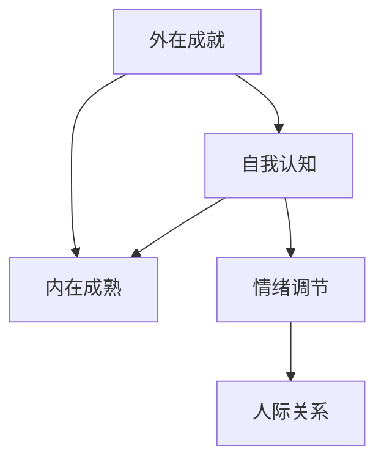

                 

```markdown
## 第1章 引言

### 1.1 成长的重新定义

在当今社会，成长通常被理解为外在成就的积累，比如财富的增值、职位的升迁、社会地位的提高等。这种定义往往忽略了个体内在的成熟，而将成长简化为外在结果的追求。然而，重新定义成长的意义，将视角从外在成就转向内在成熟，可能带来更为深远的影响。

**新视角：** 从内在成熟的角度来看，成长不仅仅是个体在物质层面的积累，更是心理素质、情感智慧和生活态度等方面的提升。这种成长更加关注个体的全面发展和心理健康。

**自我认知：** 成长的过程中，自我认知是一个关键因素。通过深入理解自己的内在需求、价值观和兴趣爱好，个体能够更明确自己的成长方向，从而实现更加有意义的成长。

### 1.2 外在成就与内在成熟的关系

外在成就与内在成熟之间的关系并非简单的线性关系，而是相互作用、相互影响的过程。

**成就驱动与成长误区：** 外在成就往往容易成为个体成长的驱动力，但过度追求外在成就可能导致个体陷入误区，忽视内在的成熟。例如，过分追求名利可能导致心理健康问题，甚至引发道德和伦理的挑战。

**内在成熟的重要性：** 内在成熟是个体可持续成长的基础。一个内心成熟的人能够更好地应对生活中的各种挑战，保持心理健康，建立良好的人际关系，从而实现更为全面和持久的成长。

### 小结

重新思考成长的意义，从外在成就转向内在成熟，有助于个体实现更加全面和深层次的成长。在接下来的章节中，我们将进一步探讨外在成就的探索、内在成熟的内涵、成长的障碍与挑战以及实现成长的具体策略和实践。
```

**摘要：**

在当今社会，成长通常被理解为外在成就的积累。然而，本文重新定义了成长的意义，将视角从外在成就转向内在成熟。内在成熟关注个体心理素质、情感智慧和生活态度的提升，是实现全面和持久成长的关键。本文探讨了外在成就与内在成熟之间的关系，以及如何在成长过程中克服障碍和挑战。通过重新思考成长的意义，个体能够实现更加有意义的成长，提升心理健康，建立良好的人际关系，从而实现更加全面和持久的发展。

---

## 第2章 外在成就的探索

### 2.1 成就的社会定义

外在成就的社会定义通常涉及多个维度，包括财富、地位、名誉、职业成就等。这些维度反映了社会对个体成功的标准，同时也受到文化背景和价值观的影响。

**社会标准：** 社会标准是外在成就的衡量依据。不同社会和文化背景下的标准可能有所不同。例如，在西方文化中，财富和地位常常被看作是成功的标志，而在某些东方文化中，道德和家庭的贡献也可能被视为重要的成功指标。

**多维度的成就：** 成就不仅仅是单一维度的表现，而是一个综合性的评估。一个人的成就可能包括职业上的成功、学术上的成就、社会贡献、家庭生活的幸福等多个方面。这种多维度的成就评估有助于我们更全面地理解外在成就的内涵。

### 2.2 外在成就的驱动因素

外在成就的驱动因素可以分为个体目标与动机、社会期望与压力等。

**个体目标与动机：** 个体对外在成就的追求往往源于内在的目标和动机。这些目标和动机可能包括实现自我价值、获得社会认可、满足物质需求等。个体目标的不同决定了他们在追求外在成就过程中的选择和努力程度。

**社会期望与压力：** 社会对个体的期望和压力也是外在成就驱动的重要因素。社会对成功的标准往往形成了一种无形的压力，迫使个体不断努力以追求更高的外在成就。例如，在竞争激烈的职场环境中，晋升和加薪可能成为员工追求的目标，而社会对名利的推崇也会影响个体对外在成就的追求。

### 2.3 外在成就的利弊分析

外在成就的利弊需要从多个角度进行分析。

**正面效应：** 外在成就可以带来一系列正面效应。首先，它能够提升个体的社会地位，增强自信心和自我价值感。其次，外在成就可以为个体带来物质财富，改善生活质量。此外，追求外在成就的过程本身也可以培养个体的毅力、决心和执行力。

**负面影响：** 然而，过度追求外在成就也可能带来负面影响。首先，过度追求外在成就可能导致心理健康问题，如焦虑、抑郁等。其次，外在成就的追求可能会导致个体忽视内在的成熟和心理健康，影响个人幸福感和人际关系。此外，过分追求外在成就还可能引发道德和伦理上的挑战，如腐败、不公正行为等。

### 小结

外在成就的社会定义和驱动因素决定了个体在追求外在成就时的选择和行为。外在成就既可以带来积极的影响，如提升社会地位、增强自信心，也可能导致心理健康问题和道德伦理挑战。因此，在追求外在成就的过程中，个体需要平衡外在成就和内在成熟之间的关系，以实现全面和可持续的成长。

---

## 第3章 内在成熟的内涵

### 3.1 内在成熟的定义

内在成熟是指个体在心理素质、情感智慧和生活态度等方面的提升。它不仅关注个体的外在成就，更关注个体的内在心理健康和情感智慧。

**核心要素：** 内在成熟的核心要素包括自我认知、情绪调节、人际关系管理、价值观和道德观等。这些要素共同构成了个体内在成熟的基石。

**心理素质：** 心理素质是内在成熟的重要组成部分。它包括情绪管理能力、自我控制和应对压力的能力。一个拥有良好心理素质的个体能够更好地应对生活中的挑战，保持心理健康。

**情感智慧：** 情感智慧是指个体理解和管理自己及他人情感的能力。它包括自我意识、同理心、情感表达和情绪调节等。情感智慧有助于个体建立良好的人际关系，提高生活质量。

**生活态度：** 生活态度是指个体对待生活和问题的态度。一个成熟的人通常具有积极的生活态度，能够从困难和挫折中找到成长的机会，保持乐观和进取的心态。

### 3.2 内在成熟的培养

**自我认知的发展：** 自我认知是内在成熟的基础。通过自我反思和认知心理学的方法，个体可以更好地了解自己的内心世界，明确自己的优势和不足，从而有针对性地提升自我认知。

**情绪调节与应对策略：** 情绪调节是内在成熟的重要方面。个体需要学会识别、理解和调节自己的情绪，以适应不同情境和挑战。心理治疗、冥想和运动等方法可以帮助个体提升情绪调节能力。

**人际关系管理：** 人际关系管理是内在成熟的重要组成部分。通过学习沟通技巧、建立同理心和解决冲突的策略，个体可以建立和维护良好的人际关系，提高生活质量。

### 3.3 内在成熟的价值体现

**个人幸福感：** 内在成熟有助于提升个人的幸福感。一个内心成熟的人能够更好地管理自己的情绪，处理人际关系，从而享受更高质量的生活。

**人际关系的改善：** 内在成熟有助于改善人际关系。通过提升情感智慧和沟通能力，个体可以建立更加和谐的人际关系，获得更多的社会支持和帮助。

**社会贡献：** 内在成熟不仅对个人有益，也对社会有积极的影响。一个内心成熟的人能够更好地理解和解决社会问题，为社会做出更大的贡献。

### 小结

内在成熟是全面和可持续成长的关键。通过提升自我认知、情绪调节和人际关系管理，个体可以实现内在的成熟，从而提升个人幸福感，改善人际关系，并为社会做出贡献。在接下来的章节中，我们将进一步探讨成长的障碍与挑战，以及实现成长的具体策略和实践。

---

## 第4章 成长的障碍与挑战

### 4.1 成长过程中的常见障碍

成长过程中，个体常常会遇到各种障碍和挑战，这些障碍可能会阻碍个人的进步和发展。

**恐惧与不安：** 恐惧是成长过程中最常见的障碍之一。个体可能害怕失败、害怕被拒绝、害怕改变，这些恐惧往往导致个体不愿意尝试新的事物，从而限制成长的可能性。

**习惯与惯性：** 习惯和惯性是另一种常见的成长障碍。个体可能会陷入舒适区，依赖习惯性的思维和行为模式，不愿意改变和尝试新的事物。这种惯性会使个体难以适应新的环境和挑战，阻碍成长。

**社会压力：** 社会压力也是成长过程中的一个重要障碍。社会对成功的标准、对个体的期望和压力，可能会使个体感到焦虑和不安，从而影响成长。

**资源限制：** 资源限制也是个体成长中的一个障碍。个体可能面临时间、金钱、知识等资源的限制，这些限制会影响到个人的学习和成长。

### 4.2 成长挑战的应对策略

**接受不完美：** 成长过程中，个体需要接受自己的不完美，认识到成长是一个不断尝试和错误的过程。接受不完美可以减轻焦虑和恐惧，使个体更加从容地面对挑战。

**不断试错与学习：** 成长需要不断地试错和学习。个体应该勇于尝试新的事物，从失败中学习经验，不断提升自己的能力。通过不断试错，个体可以找到最适合自己的成长路径。

**建立支持系统：** 建立支持系统是应对成长挑战的重要策略。支持系统可以包括家人、朋友、导师等，这些人可以提供情感支持、建议和帮助，帮助个体克服成长中的障碍。

**积极心态：** 保持积极的心态是成长的关键。一个积极的心态可以帮助个体更好地应对挑战，保持对未来的信心和希望。

**设定目标：** 设定明确的目标是成长的重要步骤。通过设定目标，个体可以明确自己的方向和努力的方向，从而更有针对性地进行成长。

### 4.3 成长过程中的人际关系

**支持与反对：** 在成长过程中，人际关系中的支持与反对也会对个体产生影响。支持可以帮助个体克服挑战，增强信心；而反对可能会带来挫败感和压力，阻碍成长。个体需要学会辨别和支持性的人际关系，同时也要学会应对反对。

**理解与沟通：** 成长过程中的理解和沟通也是至关重要的。个体需要学会倾听和理解他人的观点和需求，同时也要有效地表达自己的想法和感受。通过理解和沟通，个体可以建立更加和谐的人际关系，从而在成长过程中获得更多的支持和帮助。

### 小结

成长过程中的障碍与挑战是不可避免的，但通过接受不完美、不断试错与学习、建立支持系统和保持积极心态，个体可以克服这些障碍，实现持续的成长。在接下来的章节中，我们将进一步探讨成长的策略与实践，帮助个体实现全面的成长。

---

## 第5章 成长的策略与实践

### 5.1 成长目标设定

设定成长目标是实现个人发展的第一步。一个明确、可行的目标可以帮助个体聚焦努力，提高成长效率。

**SMART原则：** 为了确保目标的明确性和可行性，我们可以遵循SMART原则，即目标应该是具体的（Specific）、可衡量的（Measurable）、可实现的（Achievable）、相关的（Relevant）和有时间的限制（Time-bound）。

- **具体（Specific）：** 目标应明确具体，而不是模糊的。例如，"提高编程技能"不如"学习并掌握Python数据分析库Pandas和NumPy"具体。
- **可衡量（Measurable）：** 目标应该有具体的衡量标准，以便评估进展。例如，"提高编程速度"可以具体化为"每天编写并提交20行有效的代码"。
- **可实现（Achievable）：** 目标应该在实际能力范围内，避免不切实际的目标导致挫败感。例如，"在一个月内学会一门新语言"可能比"在一年内掌握五门新语言"更加实际。
- **相关（Relevant）：** 目标应该与个人的长期目标和价值观相符。例如，如果个人兴趣在于数据科学，那么学习相关技能比学习无关的技术更加相关。
- **有时间限制（Time-bound）：** 目标应设定明确的时间限制，有助于保持动力和紧迫感。例如，"在本季度末前完成数据分析项目的第一部分"比"尽早完成"更加明确。

### 5.2 成长路径规划

在设定目标后，成长路径的规划同样重要。一个有效的成长路径应包括以下要素：

**时间管理：** 合理安排时间，确保在完成日常工作的同时，有足够的时间进行学习和提升。使用时间管理工具，如番茄钟或时间表，可以帮助个体优化时间，提高效率。

**资源整合：** 整合各种资源，包括书籍、在线课程、研讨会、工作坊等，以获取必要的知识和技能。此外，还可以寻求导师或同行指导，以获得实践经验和反馈。

**持续反馈：** 定期评估成长进度，获取反馈，并根据反馈调整成长路径。这可以帮助个体及时发现问题，调整策略，确保成长目标的实现。

### 5.3 成长习惯的养成

习惯的力量在成长过程中不容忽视。养成良好习惯可以帮助个体在成长的道路上更加稳固和持久。

**好奇心驱动：** 保持好奇心是养成良好习惯的重要动力。对未知领域的好奇心可以激发个体的学习兴趣，推动不断探索和进步。

**自我激励：** 自我激励是养成良好习惯的关键。个体可以通过设定小目标、奖励自己、记录进步等方式，增强自我激励，保持成长的动力。

**坚持与纪律：** 成功的养成良好习惯需要坚持和纪律。个体应培养自律能力，坚持每天进行学习和实践，即使在面临困难或诱惑时也不轻易放弃。

### 小结

通过设定明确的目标、规划成长路径和养成良好习惯，个体可以有效地实现个人成长。在实现外在成就的同时，注重内在成熟，个体将能够实现更加全面和持久的成长。

---

## 第6章 成长的社会环境

### 6.1 家庭与成长

家庭是个人成长的重要环境，对个体的成长产生深远影响。

**家庭教育的影响：** 家庭教育对个体的价值观、行为习惯和心理素质等方面产生重要影响。一个温馨、支持性的家庭环境可以培养个体的自信心和独立性，促进其健康成长。

**家庭支持的重要性：** 家庭的支持是个人成长的重要保障。家庭成员的理解、鼓励和帮助可以缓解个体在成长过程中遇到的压力，增强其应对挑战的信心和能力。

**家庭教育资源的利用：** 家庭可以利用各种教育资源，如书籍、网络课程、实践活动等，为个体提供丰富的学习机会，助力其成长。

### 6.2 学校与成长

学校是个人成长的重要场所，对个体的全面发展起到关键作用。

**学校教育的角色：** 学校教育通过提供知识、技能和价值观，帮助个体建立基础，为其成长奠定坚实基础。教师和同伴的互动也为个体提供了丰富的社交经验和人际关系。

**学校文化的塑造：** 学校文化对个体成长具有深远影响。一个积极、包容、创新的文化氛围可以激发个体的潜能，促进其全面发展。

**校园活动的参与：** 学校组织的学生活动，如竞赛、社团、志愿服务等，为个体提供了实践和锻炼的机会，有助于培养其领导力、团队合作能力和责任感。

### 6.3 社会文化对成长的影响

社会文化对个体成长具有重要影响，不同文化背景下的个体成长经历各不相同。

**文化价值观：** 文化价值观是影响个体成长的重要因素。例如，在强调集体主义的文化中，个体往往更加注重团队合作和社会责任；而在强调个人主义的文化中，个体则更加注重自我实现和个人自由。

**社会变迁与成长挑战：** 社会变迁带来新的成长挑战。随着科技的发展和全球化的进程，个体需要不断适应新的环境和变化，这对个体的成长提出了更高的要求。

**多元文化的融合：** 多元文化的融合为个体提供了更多的成长机会和资源。通过了解和尊重不同文化，个体可以拓宽视野，增强跨文化交流能力，为未来的发展奠定基础。

### 小结

家庭、学校和整个社会文化环境对个人成长产生深远影响。一个支持性、积极和包容的环境有助于个体实现全面和可持续的成长。在未来的成长过程中，个体应充分利用这些资源，不断适应和应对新的挑战。

---

## 第7章 内在成熟与外在成就的平衡

### 7.1 平衡的哲学思考

内在成熟与外在成就的平衡是一个复杂而微妙的议题，涉及到个体与社会、内在与外在等多重关系的平衡。

**矛盾与统一：** 内在成熟与外在成就之间存在一定的矛盾。外在成就往往强调物质层面的成功和社会地位的提升，而内在成熟则关注个体的心理健康和情感智慧。然而，这两者并非完全对立，而是可以在矛盾中找到统一。

**权衡利弊：** 在追求外在成就时，个体需要不断权衡利弊。过度追求外在成就可能导致心理健康问题，而忽视内在成熟则可能影响个人幸福感和生活质量。因此，个体需要在追求外在成就的过程中，保持对内在成熟的关注，实现二者的平衡。

### 7.2 实现平衡的策略

**自我意识的提升：** 提升自我意识是实现内在成熟与外在成就平衡的关键。通过自我反思和认知，个体可以更清晰地认识到自己的内在需求和外在目标，从而更好地调整自己的行为和决策。

**生活质量的关注：** 关注生活质量是实现平衡的重要策略。个体应注重身心健康，合理安排工作和生活，确保在追求外在成就的同时，不忽视内在的成熟。

**持续学习与成长：** 持续学习和成长有助于个体在追求外在成就的过程中，不断提升内在成熟。通过不断学习新知识和技能，个体可以拓宽视野，增强自信心和自我价值感。

**时间管理与资源优化：** 合理的时间管理和资源优化有助于个体在有限的时间内，同时追求外在成就和内在成熟。通过优先处理重要任务，合理分配时间和精力，个体可以实现二者的平衡。

### 7.3 平衡的意义与价值

**个人发展：** 平衡内在成熟与外在成就有助于个人全面发展。一个内心成熟的人能够更好地应对生活中的挑战，保持心理健康，建立良好的人际关系，从而实现更为全面的发展。

**社会贡献：** 平衡内在成熟与外在成就也有助于个体为社会做出更大的贡献。一个内心成熟且具备外在成就的人，能够更好地理解社会问题，积极参与社会事务，推动社会的进步和发展。

### 小结

内在成熟与外在成就的平衡是个人成长的重要课题。通过提升自我意识、关注生活质量、持续学习和优化时间管理，个体可以实现二者的平衡，实现全面和可持续的成长。

---

## 第8章 成长的持续与展望

### 8.1 成长是一个过程

成长并非一蹴而就，而是一个持续不断的过程。它包括阶段性和连续性两个方面。

**阶段性：** 成长过程中，个体会经历不同的阶段，如青春期、成年期、中年期和老年期。每个阶段都有其特定的任务和发展重点。例如，青春期是个体形成自我认同和价值观的关键时期，而中年期则可能更加注重职业成就和家庭生活。

**连续性：** 成长是一个连续的过程，每个阶段都是前一个阶段的延续和深化。个体的成长不是孤立的，而是通过不断的反思、学习和调整来实现的。例如，一个人在职业发展中可能会经历从初级职位到中级职位再到高级职位的连续成长。

**长期视角：** 成长需要从长期视角进行规划。个体应明确自己的长期目标和愿景，并根据这些目标进行持续的努力和调整。长期视角有助于个体在面对短期挫折和困难时，保持坚定的信念和决心。

### 8.2 成长的未来展望

未来，科技的发展和社会变迁将对成长产生深远影响。

**科技进步的影响：** 科技进步将提供更多的学习资源和工具，如在线教育、虚拟现实、人工智能等。这些技术将改变传统教育模式，为个体提供更加灵活和个性化的学习体验。同时，科技进步也将带来新的职业机会和挑战，个体需要不断更新知识和技能，以适应不断变化的工作环境。

**社会变迁的挑战：** 社会变迁，如全球化、人口老龄化、经济结构调整等，也将对成长带来新的挑战。个体需要具备跨文化交流能力、适应能力和创新能力，以应对这些挑战。此外，社会变迁还可能带来新的社会问题和伦理问题，如隐私保护、数字鸿沟等，这些问题需要个体和社会共同关注和解决。

**未来成长的方向：** 未来成长的方向可能包括以下几个方面：

1. **终身学习：** 在知识更新速度加快的今天，终身学习将成为个体成长的重要方向。个体需要具备持续学习和自我更新能力，以适应不断变化的社会环境。

2. **跨文化交流：** 全球化的趋势要求个体具备跨文化交流能力，能够理解并尊重不同文化，有效沟通和合作。

3. **创新思维：** 创新思维将成为个体成长的重要素质。个体需要培养创新意识和创造力，以应对未来社会的复杂性和不确定性。

4. **心理健康：** 随着生活节奏的加快和社会压力的增大，心理健康将成为个体成长的重要关注点。个体需要学会管理自己的情绪和心理状态，保持心理健康。

### 8.3 成长的个人责任

**自我成长的重要性：** 自我成长不仅关乎个人的发展，也关系到社会的进步。一个内心成熟、具备专业技能和良好价值观的个体，能够为社会做出更大的贡献。

**成长与社会的共同进步：** 成长不仅仅是个人追求，也是社会发展的需要。个体成长与社会的进步相互依存，共同推动社会的进步和发展。个体应积极参与社会事务，为社会的繁荣和进步贡献自己的力量。

### 小结

成长是一个持续不断的过程，需要个体具备阶段性和连续性的认识，以及长期视角的规划。未来，科技的发展和社会变迁将为成长带来新的机遇和挑战。个体应积极适应这些变化，不断学习和成长，以实现自我价值和为社会做出贡献。

---

## 附录A：成长相关的阅读资源

### 推荐书籍

1. **《终身学习：如何成为一个持续进步的人》** - 作者：（美）詹姆斯·凯利
2. **《心智成长：如何培养更好的自己》** - 作者：（美）马丁·塞利格曼
3. **《智慧成长：如何在复杂世界中做出明智的选择》** - 作者：（美）理查德·塞勒

### 在线课程

1. **Coursera上的《心理学与情绪管理》** - 提供心理学基础知识，帮助个体更好地管理自己的情绪。
2. **edX上的《数据科学基础》** - 适合对数据科学感兴趣的读者，涵盖数据科学的基础知识和技能。
3. **Udemy上的《职业发展与个人品牌建设》** - 提供职业发展的实用技巧，帮助个体在职业生涯中取得成功。

### 学术论文

1. **“The Role of Emotional Intelligence in Career Success”** - 作者：Daniel Goleman
2. **“The Dynamics of Personal Growth: A Theoretical Perspective”** - 作者：Charles B. Stangor
3. **“The Impact of Lifelong Learning on Professional Development”** - 作者：Michael J. Lambert

---

## 附录B：成长工具与方法

### 心理测评工具

1. **Myers-Briggs Type Indicator (MBTI)** - 用于了解个体的性格类型，帮助个人和团队更好地理解和协作。
2. **The Emotional Intelligence Test** - 评估个体的情感智力水平，为提升情感管理能力提供指导。
3. **The Big Five Personality Test** - 分析个体的人格特质，帮助了解自己在人际关系中的优势和挑战。

### 时间管理工具

1. **Trello** - 一个可视化的任务管理工具，帮助个体和团队有效地组织和管理项目。
2. **Asana** - 提供详细的任务分配和进度追踪功能，适合团队合作。
3. **Google Calendar** - 简便的日程安排工具，帮助个体合理规划时间。

### 自我提升技巧

1. **冥想** - 通过冥想练习，个体可以提升专注力、减少压力、增强心理健康。
2. **阅读** - 定期阅读有助于扩展知识面、提高思维能力和语言表达能力。
3. **反思日志** - 每日或每周记录自己的思考和感受，有助于自我认知和成长。

---

## 附录C：案例研究

### 成功人士的成长故事

1. **比尔·盖茨** - 从高中时期就对计算机充满热情，通过自学和不断尝试，最终创立了微软公司，成为全球科技界的领袖。
2. **伊丽莎白·霍姆斯** - 从哈佛大学退学后，创立了Theranos，致力于通过创新技术改善医疗诊断，虽然后来公司遭遇困境，但她坚持创新和成长的精神值得学习。

### 企业文化对员工成长的影响

1. **谷歌** - 著名的“20%时间政策”允许员工将20%的工作时间用于探索自己的兴趣项目，这种文化鼓励员工创新和成长。
2. **宝洁公司** - 宝洁公司通过提供丰富的培训和职业发展机会，帮助员工不断提升自己的技能和职业素养。

### 社会环境对个人成长的支持

1. **硅谷** - 硅谷作为一个科技创新的中心，为个人提供了丰富的资源和机会，吸引了众多有志于科技创业的人才。
2. **城市创新社区** - 许多城市创新社区通过提供孵化器、加速器和创业资源，为创业者提供了良好的成长环境。

这些案例展示了不同背景和环境下个人成长的多样性，同时也说明了外部环境和企业文化对个人成长的重要影响。通过借鉴这些经验和策略，个体可以更好地实现自己的成长目标。

---

### 核心概念与联系

在本文中，我们探讨了成长的意义，从外在成就到内在成熟的不同层面。核心概念包括外在成就、内在成熟、自我认知、情绪调节、人际关系等。这些概念相互关联，共同构成了个体成长的理论框架。

**核心概念关系图：**

```
外在成就
|
自我认知 --> 内在成熟
|
情绪调节 --> 人际关系
```

通过Mermaid流程图，我们可以更直观地展示这些概念之间的关系：



**核心算法原理讲解：**

在实现自我认知和情绪调节的过程中，可以类比于机器学习中的监督学习和情感分析技术。

**自我认知算法原理：**

1. **数据收集**：收集个人的生活经历、行为数据和心理健康指标。
2. **特征提取**：从数据中提取反映个人特质和心理状态的特征。
3. **模型训练**：使用监督学习模型（如决策树、支持向量机等）对特征进行分类和预测，以识别个人的优势和不足。
4. **模型优化**：通过交叉验证和调整模型参数，提高自我认知的准确性。

以下是一个简化的Python代码示例，用于实现自我认知算法的基本结构：

```python
from sklearn.datasets import load_iris
from sklearn.model_selection import train_test_split
from sklearn.tree import DecisionTreeClassifier
from sklearn.metrics import accuracy_score

# 加载示例数据
data = load_iris()
X = data.data
y = data.target

# 数据划分
X_train, X_test, y_train, y_test = train_test_split(X, y, test_size=0.2, random_state=42)

# 构建决策树模型
model = DecisionTreeClassifier()

# 训练模型
model.fit(X_train, y_train)

# 预测测试数据
predictions = model.predict(X_test)

# 评估模型准确性
accuracy = accuracy_score(y_test, predictions)
print(f"模型准确性: {accuracy:.2f}")
```

**情绪调节算法原理：**

情绪调节可以类比于情感分析，通过文本挖掘和情感分类技术，分析个体的情感状态并给出调节建议。

1. **数据预处理**：清洗和预处理文本数据，如去除停用词、词干提取等。
2. **特征提取**：使用词袋模型或词嵌入技术提取文本特征。
3. **情感分类**：使用机器学习模型（如朴素贝叶斯、卷积神经网络等）对情感进行分类。
4. **情绪调节建议**：根据情感分类结果，给出情绪调节的建议。

以下是一个简化的Python代码示例，用于实现情感调节算法的基本结构：

```python
from sklearn.feature_extraction.text import TfidfVectorizer
from sklearn.naive_bayes import MultinomialNB
from sklearn.pipeline import make_pipeline

# 示例文本数据
texts = ["我很开心今天完成了任务", "我感到很沮丧，工作压力太大了"]

# 构建文本分类器
pipeline = make_pipeline(
    TfidfVectorizer(),
    MultinomialNB()
)

# 训练模型
pipeline.fit(texts, ["positive", "negative"])

# 预测文本情感
predictions = pipeline.predict(["我很焦虑，明天有重要会议"])

# 输出预测结果
print(predictions)
```

通过这些算法原理和代码示例，我们可以更好地理解如何通过技术手段实现自我认知和情绪调节，从而支持个体的内在成熟和全面成长。

