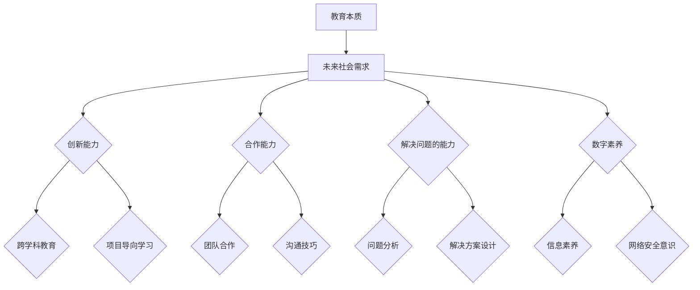

                 

## 引言

### 1. 教育的本质与目的

教育是人类社会发展的基石，它不仅关乎个人的成长，更关系到整个社会的进步。教育的本质是什么？其目的又是什么？这是一个值得深思的问题。

首先，教育的本质可以理解为“培养人的全面发展”。这个“人”不仅仅是指个体的智力发展，还包括情感、道德、社会能力等多方面的培养。传统的教育模式往往侧重于知识的传授，而现代教育则更加注重培养学生的综合素质和创新能力。

其次，教育的目的在于“为社会培养有用的人才”。过去，教育的目的主要是为了满足社会的需求，培养各行各业的专业人才。然而，随着科技的发展和全球化的进程，教育目的也在不断演变。现代社会需要的是具有创新思维、团队合作精神、解决复杂问题能力的复合型人才。

在这个背景下，我们需要重新审视教育的本质和目的，以适应未来社会的发展趋势。本文将围绕这一核心议题，探讨未来社会所需的核心能力，以及如何通过教育改革来培养这些能力。

### 2. 未来社会的发展趋势与教育挑战

未来社会将呈现出一系列新的趋势，这些趋势将对教育产生深远的影响。首先，科技的发展将继续加速，人工智能、大数据、区块链等新兴技术将深刻改变人类的生产和生活方式。这要求教育不仅要传授基础学科知识，还要培养学生的数字素养和技术技能。

其次，全球化的进程将加快，人们的生活和工作将更加多元化、国际化。这要求教育不仅要培养学生的国内意识，还要培养他们的全球视野和跨文化交流能力。

此外，未来社会将更加注重可持续发展和环境保护。教育需要引导学生树立正确的价值观，培养他们的社会责任感和可持续发展意识。

然而，面对这些发展趋势，教育也面临着一系列挑战。首先，传统教育模式难以适应快速变化的科技环境和多元化的发展需求。其次，教育资源分配不均，城乡差距、地区差距仍然存在，这影响了教育公平和质量。此外，教育内容的滞后性和教学方法的单调性也制约了教育的发展。

综上所述，未来社会的发展趋势对教育提出了新的要求，同时也带来了诸多挑战。我们需要重新思考教育的本质和目的，积极探索适应未来社会需求的教育模式和方法。

### 3. 本书的核心议题与结构安排

本书的核心议题是“重新思考教育本质：培养未来社会所需的核心能力”。在分析了教育本质和未来社会发展趋势的基础上，本书将深入探讨未来社会所需的核心能力，包括创新能力、合作能力、解决问题的能力和数字素养。这些能力不仅是个人发展的基础，也是未来社会进步的重要动力。

本书的结构安排如下：

第一部分将重新审视教育的本质，对比传统教育与未来教育，探讨教育目的的转变。

第二部分将详细分析未来社会所需的核心能力，包括创新能力的定义与培养策略、合作能力的重要性与培养方法、解决问题的能力的定义与技巧，以及数字素养的基本概念与培养途径。

第三部分将探讨教育改革与创新实践，从理论基础上分析教育改革的方向，并结合实际案例展示创新教育实践。

第四部分将介绍培养核心能力的教学策略，包括课堂管理与教学设计、教学方法与工具、评估与反馈等方面。

最后一部分将总结教育实践案例，分析国际知名学校的实践经验，以及中国教育改革的实践路径。同时，还将探讨未来教育的挑战与机遇，展望教育的发展前景。

通过本书的探讨，我们期望能够为教育工作者提供一些新的思路和方法，以培养出适应未来社会需求的高素质人才。

### 教育的本质与目的

教育是人类社会传承知识、培养人才的重要途径。其本质在于“培养人的全面发展”，不仅仅关注知识的传授，更重视情感、道德和社会能力的培养。教育的目的则在于“为社会培养有用的人才”，以适应社会的需求和发展。

在传统教育中，教育的本质和目的往往被局限于知识的传授。学校的主要任务是教授学生学科知识，如数学、物理、化学等，以培养学生的学术能力和专业技能。这种教育模式强调记忆和应试，注重知识的积累和再现，往往忽视了学生的个性发展和综合素质的培养。

然而，随着社会的发展，教育的本质和目的也在不断演变。现代教育更加注重培养学生的创新思维、团队合作能力、解决复杂问题的能力以及数字素养等核心能力。这些能力不仅是个人发展的基础，也是未来社会进步的重要动力。

首先，创新能力是未来社会最为重要的核心能力之一。在科技快速发展和经济全球化的背景下，创新成为推动社会进步的关键因素。教育需要培养学生的创新思维，鼓励他们探索新的思路和解决方案，以应对复杂多变的社会环境。

其次，合作能力也是未来社会所需的重要能力。在全球化背景下，人们的生活和工作将越来越多元化、国际化。合作能力不仅有助于提高工作效率，还能促进跨文化交流和合作，培养学生的全球视野。

此外，解决问题的能力也是教育的重要目标之一。面对复杂的社会问题和技术挑战，教育需要培养学生的分析问题和解决问题的能力，使他们能够在实际工作中应对各种不确定性和挑战。

最后，数字素养是现代社会不可或缺的核心能力。随着信息技术的迅猛发展，数字素养已经成为每个公民必备的基本素质。教育需要培养学生的信息素养，使他们能够有效地获取、处理和应用信息，为未来的职业生涯和社会生活打下坚实基础。

总之，重新思考教育的本质和目的，是适应未来社会发展的必要举措。教育不仅需要传授知识，更需要培养学生的综合素质和创新能力，以培养出适应未来社会需求的高素质人才。

### 传统教育与未来教育的对比

传统教育与未来教育在多个方面存在显著差异，主要体现在教育目标、教学方法、教学内容以及教育环境等方面。

首先，从教育目标来看，传统教育主要关注知识的传授和技能的培训，强调学生的学科成绩和学术能力。这种教育模式往往以考试和分数为导向，侧重于学生在特定学科领域的知识积累。而未来教育则更加注重培养学生的综合素质和创新能力，不仅关注学术成绩，还重视学生的社会能力、情感发展和创新思维。未来教育的目标在于培养具备适应未来社会需求的综合能力的人才。

其次，教学方法上，传统教育往往采用灌输式的教学模式，教师主导，学生被动接受知识。教学过程中，教师讲解，学生记笔记，课堂互动较少。而未来教育倡导以学生为中心的教学方法，强调学生的主动参与和探索。例如，项目导向学习（Project-Based Learning, PBL）、翻转课堂（Flipped Classroom）等教学模式，通过实际项目和互动讨论，激发学生的学习兴趣和创造力。

在教学内容方面，传统教育主要集中在基础学科知识上，强调学科间的独立性。未来教育则更加注重跨学科的教学，强调知识的整合和应用。例如，STEAM教育（科学、技术、工程、艺术和数学的结合）是一种典型的跨学科教育模式，它通过跨学科的项目和实践，培养学生的综合能力和创新思维。

最后，教育环境方面，传统教育主要依赖于传统的教室和教学设备。未来教育则更加依赖于现代技术和网络资源，通过虚拟现实（VR）、增强现实（AR）、在线学习平台等新技术，提供更加丰富和多样化的学习环境。未来的教育将更加个性化和定制化，学生可以根据自己的兴趣和需求，选择适合自己的学习内容和方式。

总的来说，传统教育与未来教育在目标、方法、内容和环境上存在显著差异。未来教育更加注重学生的全面发展，强调跨学科和个性化学习，适应未来社会的发展需求。因此，我们需要重新思考教育的本质和目标，积极探索适应未来社会需求的教育模式和方法。

### 未来教育的发展方向

未来教育的发展方向将受到多种因素的影响，包括科技革命、经济全球化和社会变革等。首先，科技革命将继续推动教育模式的创新。人工智能、大数据、云计算等新兴技术的广泛应用，使得教育可以更加个性化和智能化。例如，智能辅导系统可以根据学生的学习情况，提供个性化的学习资源和辅导，从而提高学习效率。此外，虚拟现实（VR）和增强现实（AR）技术将为教育带来全新的学习体验，学生可以在虚拟环境中模拟真实场景，进行互动学习和实践。

其次，经济全球化的加速也将深刻影响未来教育的发展。随着全球化的深入，人们的生活和工作越来越国际化，这要求教育培养具有全球视野和国际竞争力的人才。未来的教育将更加注重跨文化交流和合作，通过国际化课程和交流项目，培养学生的跨文化沟通能力和全球视野。例如，许多国际学校和教育机构已经开始提供多语言教学和国际学生交流项目，以培养未来社会的全球化人才。

社会变革也是未来教育发展的一个重要因素。现代社会面临着诸多复杂的社会问题，如环境污染、社会不平等等，这要求教育不仅要传授知识，还要培养学生的社会责任感和可持续发展意识。未来的教育将更加注重社会责任和伦理教育，通过案例教学和社会实践，引导学生了解和解决现实问题，培养他们的社会责任感。

此外，未来教育也将更加注重个性化和定制化。每个学生都有自己的兴趣、能力和学习风格，未来的教育将更加关注学生的个体差异，提供多样化的学习路径和资源。例如，个性化学习计划（Personalized Learning Plan）可以根据学生的学习需求和进度，制定个性化的学习目标和方案，从而提高学习效果。

总之，未来教育的发展方向将受到科技革命、经济全球化和社会变革等多种因素的影响。未来的教育将更加智能化、国际化、社会责任化和个性化，以培养适应未来社会需求的多样化人才。教育工作者需要不断适应这些变化，积极探索和创新教育模式，为学生的全面发展奠定坚实基础。

### 教育目的的转变

在重新思考教育本质的过程中，教育目的的转变显得尤为重要。过去，教育的主要目的是培养具备特定学科知识和技能的专业人才，以满足社会对各行各业的需求。然而，随着社会和科技的迅猛发展，教育目的正在经历深刻的变革。

首先，教育开始从“知识传授”向“能力培养”转变。传统的教育模式注重学科知识的积累和记忆，而现代教育则更加重视培养学生的综合素质和创新能力。例如，批判性思维、问题解决能力、团队合作精神以及领导力等软技能，成为教育的重要内容。这些能力不仅有助于学生在未来的职业生涯中应对各种挑战，也有助于他们在不断变化的社会环境中保持竞争力。

其次，教育从“单一目标”向“多元目标”转变。过去，教育往往专注于学术成就，追求分数和排名。而现代教育更加注重学生的全面发展，包括道德教育、情感教育、社会技能和身体健康的培养。这种多元目标的教育模式有助于学生形成更加全面的人格和价值观，从而更好地适应社会需求。

此外，教育开始从“被动接受”向“主动学习”转变。传统的教育模式中，学生往往处于被动接受知识的状态，而现代教育强调学生的主动学习和探索。例如，项目导向学习（PBL）和探究式学习（Inquiry-Based Learning）等教学方法，鼓励学生通过实际项目和问题解决，主动获取知识和技能。这种教育模式不仅提高了学生的学习兴趣和动机，也有助于培养学生的自主学习能力和创新思维。

最后，教育从“单一评价”向“多维评价”转变。传统的教育评价主要依赖于考试和成绩，而现代教育更加注重多维评价，包括学生的综合表现、创新能力、团队合作精神和社会责任等。例如，过程评价（Formative Assessment）和终结评价（Summative Assessment）相结合，可以更全面地评估学生的学习效果和能力发展。

总之，教育目的的转变反映了社会对人才培养的新需求。未来教育需要更加注重学生的全面发展，培养具备创新能力、综合素质和软技能的多样化人才，以应对未来社会的复杂挑战。

### 未来社会所需的核心能力

未来社会的发展对人才的需求将发生显著变化，这要求教育必须培养出适应未来挑战的核心能力。本文将探讨未来社会所需的关键核心能力，包括创新能力、合作能力、解决问题的能力和数字素养。

#### 2.1 创新能力

创新能力是未来社会最为重要的核心能力之一。随着科技迅猛发展和全球化进程的加速，创新成为推动社会进步和经济发展的关键动力。创新不仅仅是指科学技术的发明创造，还涉及商业模式的创新、社会管理和文化创新等多个领域。教育需要培养学生的创新思维，鼓励他们打破常规，勇于尝试和探索新的解决方案。

**重要性**：创新能力不仅有助于个体在职业生涯中取得成功，还能够促进企业的创新能力和市场竞争力。在全球化和科技驱动的背景下，创新能力成为衡量一个国家或地区综合实力的重要指标。

**培养策略与方法**：

1. **鼓励探索和试错**：教育应提供一个开放、包容的环境，鼓励学生进行探索和尝试，培养他们的冒险精神和创新思维。
2. **跨学科学习**：通过跨学科的学习和实践，帮助学生建立跨领域的知识体系，从而促进创新思维的形成。
3. **项目导向学习**：通过实际项目，让学生在实践中学习和应用知识，培养他们的创新能力和解决问题的能力。
4. **思维训练**：通过思维导图、逻辑训练等工具和方法，帮助学生培养系统思维和批判性思维，提高创新能力。

#### 2.2 合作能力

在全球化背景下，合作能力显得尤为重要。未来的工作环境和社会环境更加多元化、复杂化，需要人们具备良好的合作能力。合作能力不仅包括团队合作，还涉及跨文化沟通、协同工作和冲突管理等多方面。

**重要性**：合作能力有助于提高工作效率，促进团队协作和创造力的发挥。在一个多元化和国际化的社会环境中，合作能力是确保项目成功和团队和谐的关键。

**培养策略与方法**：

1. **团队活动**：通过团队项目和工作任务，让学生在实际操作中学习和掌握团队合作的基本技能。
2. **角色扮演**：通过角色扮演和模拟场景，让学生体验不同角色和职责，提高他们的跨文化沟通能力和团队合作能力。
3. **冲突管理培训**：通过培训和实践，帮助学生学会处理团队中的冲突和分歧，提高合作效率。
4. **跨文化教育**：通过跨文化课程和交流活动，增强学生对不同文化背景的理解和适应能力，培养全球视野。

#### 2.3 解决问题的能力

面对复杂多变的社会环境和科技挑战，解决问题的能力成为未来社会不可或缺的核心能力。解决问题的能力不仅包括对问题的分析和理解，还涉及制定解决方案、实施和评估等多个环节。

**重要性**：解决问题的能力是应对各种挑战和危机的重要手段。具备这种能力的人能够在困境中找到出路，为个人和社会带来积极的变化。

**培养策略与方法**：

1. **问题导向学习**：通过实际问题和项目，让学生在解决问题中学习和应用知识。
2. **批判性思维**：通过批判性思维的训练，帮助学生从多个角度分析和评估问题，提高解决问题的能力。
3. **案例学习**：通过案例分析，让学生了解不同问题的解决方法和策略，积累实践经验。
4. **思维导图**：通过思维导图等工具，帮助学生系统地分析和梳理问题，制定有效的解决方案。

#### 2.4 数字素养

随着信息技术的迅猛发展，数字素养成为现代社会的基本要求。数字素养不仅包括对信息技术的掌握，还涉及信息获取、处理和应用的能力，以及网络安全意识和信息伦理等方面。

**重要性**：数字素养是适应数字化时代的基础能力，是每个人在现代社会中生存和发展的必备技能。它不仅影响个人的生活质量和工作效率，也关系到社会的发展和进步。

**培养策略与方法**：

1. **信息技术教育**：通过信息技术课程和实验，帮助学生掌握基本的信息技术工具和应用。
2. **信息素养训练**：通过信息素养课程，培养学生有效获取、评估和应用信息的能力。
3. **网络安全教育**：通过网络安全课程和实践活动，提高学生的网络安全意识和自我保护能力。
4. **数字伦理教育**：通过数字伦理课程，帮助学生树立正确的价值观和道德观念，遵守信息伦理规范。

总之，未来社会所需的核心能力是创新能力、合作能力、解决问题的能力和数字素养。教育需要围绕这些核心能力进行培养，以适应未来社会的需求和发展。通过科学合理的教育模式和策略，我们可以培养出具备这些能力的高素质人才，为社会的进步和发展贡献力量。

### 创新能力

创新能力是未来社会最为重要的核心能力之一。在科技快速发展和全球化进程不断加快的背景下，创新不仅是推动社会进步和经济发展的重要动力，也是企业在激烈市场竞争中脱颖而出的关键因素。因此，教育必须重视创新能力的培养，为个体和社会的发展奠定坚实基础。

#### 2.1.1 创新能力的定义与重要性

**定义**：创新能力是指个体在面对新情况、新问题时，能够通过独特的思维方式和方法，提出新颖、有效的解决方案的能力。它包括创意思维、问题解决、实验实践等多个方面，是一种综合性、系统性的能力。

**重要性**：

1. **推动科技进步**：创新是科技进步的重要驱动力。通过创新，人类不断突破技术瓶颈，推动科技革命，从而改变生产方式、生活方式和社会结构。

2. **促进经济发展**：创新能够提高企业的竞争力，推动产业升级和经济转型。创新型企业能够迅速占领市场，创造更多就业机会，带动经济增长。

3. **提升社会福祉**：创新不仅带来经济效益，还能提高社会福祉。通过技术创新，可以解决环境污染、资源短缺等全球性问题，提高人们的生活质量。

4. **塑造个体竞争力**：在创新驱动的时代，个体创新能力成为衡量其职业发展和社会地位的重要指标。具备创新能力的人能够在职业生涯中不断突破自我，实现个人价值。

#### 2.1.2 培养创新能力的策略与方法

**策略**：

1. **营造创新环境**：教育机构应创造一个开放、包容、鼓励探索和试错的环境，让学生在自由、安全的氛围中自由发挥创造力。

2. **跨学科教育**：通过跨学科的课程设计和项目，帮助学生建立跨领域的知识体系，从而激发创新思维。

3. **项目导向学习**：通过实际项目，让学生在实践中应用知识，解决问题，培养创新能力和团队合作精神。

4. **创新思维训练**：通过思维导图、头脑风暴、逻辑训练等方法，帮助学生培养系统思维和批判性思维，提高创新能力。

**方法**：

1. **激发好奇心**：培养学生的学习兴趣和好奇心，鼓励他们提出问题，探索未知领域。

2. **培养实验精神**：鼓励学生进行实验和实践，通过试错和反思，逐步提升创新能力。

3. **案例学习**：通过分析成功和失败的案例，让学生了解创新的原理和方法，积累实践经验。

4. **合作与交流**：鼓励学生进行跨学科和跨文化的合作与交流，通过交流激发思维碰撞，促进创新。

总之，创新能力是未来社会不可或缺的核心能力。教育必须围绕这一核心能力，采取科学合理的策略和方法，培养学生的创新思维、实践能力和团队合作精神。通过持续的努力和创新教育，我们可以培养出具备创新能力的高素质人才，为社会的进步和发展贡献力量。

### 合作能力

在快速变化和多元化的未来社会，合作能力变得尤为重要。合作不仅有助于提高工作效率，促进团队合作和创造力的发挥，还能增强个人的社会适应能力和人际沟通技巧。因此，教育必须重视合作能力的培养，以帮助学生更好地适应未来社会的发展需求。

#### 2.2.1 合作能力的重要性

**重要性**：

1. **提高工作效率**：通过有效的团队合作，可以充分发挥每个人的优势，实现资源的最优配置，从而提高工作效率和项目成功率。

2. **促进团队创造力**：在团队中，不同成员的视角和思维方式的碰撞，往往能够激发出新的创意和解决方案，提升团队的创新能力。

3. **增强社会适应性**：未来社会更加多元化和国际化，具备合作能力的人能够更好地适应不同文化和工作环境，提高跨文化沟通和协作能力。

4. **提升个人竞争力**：在职场和生活中，具备良好合作能力的人更受欢迎，能够获得更多的合作机会和发展空间。

#### 2.2.2 合作能力的培养与实践

**培养策略**：

1. **团队活动**：通过组织团队项目和工作任务，让学生在实践中学习和掌握团队合作的基本技能。例如，分组完成课题研究、团队竞赛等，可以增强学生的团队合作意识。

2. **角色扮演**：通过角色扮演和模拟场景，让学生体验不同角色和职责，提高他们的跨文化沟通能力和团队合作能力。例如，模拟国际会议、商务谈判等，可以帮助学生更好地理解团队合作的重要性和技巧。

3. **冲突管理培训**：通过培训和实践，帮助学生学会处理团队中的冲突和分歧，提高合作效率。例如，通过角色扮演、案例分析等方法，让学生了解不同冲突处理策略和技巧。

4. **跨文化教育**：通过跨文化课程和交流活动，增强学生对不同文化背景的理解和适应能力，培养全球视野。例如，国际学生交流项目、跨文化培训课程等，可以帮助学生更好地适应多元化的工作环境。

**实践方法**：

1. **团队建设活动**：定期组织团队建设活动，如团队拓展训练、团队聚餐等，增强团队成员之间的信任和默契。

2. **团队协作工具**：利用现代化的团队协作工具，如项目管理软件、即时通讯工具等，提高团队协作效率和沟通效果。

3. **合作学习**：在课堂教学中，采用小组讨论、合作探究等方法，鼓励学生进行合作学习，培养他们的合作精神和能力。

4. **项目导向学习**：通过实际项目，让学生在团队合作中解决问题，培养他们的项目管理和团队协作能力。

总之，合作能力是未来社会不可或缺的核心能力。教育需要通过多种策略和方法，培养学生的合作精神、团队合作能力和跨文化沟通技巧。通过不断实践和锻炼，学生将能够更好地适应未来社会的发展需求，为个人和社会的进步贡献力量。

### 解决问题的能力

在复杂多变的未来社会中，解决问题的能力成为每个人必备的核心能力。面对各种挑战和问题，具备有效解决问题能力的人能够迅速找到解决方案，从而在职业生涯和社会生活中取得成功。因此，教育必须重视解决能力的培养，帮助学生掌握科学有效的解决问题方法和技巧。

#### 2.3.1 解决问题的定义与分类

**定义**：解决问题是指在面对困难和挑战时，通过系统性的分析和思考，找到并实施有效的解决方案的过程。它不仅涉及问题的识别和分析，还包括方案的制定和实施。

**分类**：

1. **结构性问题**：这类问题通常有明确的解决方法和步骤，例如数学问题、逻辑谜题等。解决这类问题通常需要逻辑思维和分析能力。

2. **非结构性问题**：这类问题通常没有固定的解决方法和步骤，需要创新思维和创造性思维。例如，商业战略、社会问题等。

3. **紧急问题**：这类问题需要迅速作出决策并采取行动，例如紧急医疗情况、自然灾害等。

4. **长期问题**：这类问题需要长期规划和持续努力，例如环境污染、社会不公等。

#### 2.3.2 解决问题的策略与技巧

**策略**：

1. **问题识别与定义**：首先要明确问题的性质和范围，进行初步的评估和分析。

2. **信息收集与整理**：搜集与问题相关的信息，进行系统整理和分析。

3. **分析问题**：通过逻辑思维、系统思维等方法，对问题进行深入分析，找出问题的根源和关键因素。

4. **方案制定**：根据分析结果，制定多种可能的解决方案，并对方案进行评估和选择。

5. **实施与评估**：实施选定的解决方案，并在过程中进行监控和评估，根据实际情况进行调整和优化。

**技巧**：

1. **分解问题**：将复杂问题分解成多个小问题，逐一解决，简化问题难度。

2. **批判性思维**：通过批判性思维，对现有解决方案进行分析和评估，识别潜在的问题和风险。

3. **创新思维**：通过创新思维，寻找新的解决方案和方法，避免陷入惯性思维和传统方法的束缚。

4. **团队协作**：在解决复杂问题时，团队协作能够发挥集体智慧，提高解决问题的效率和质量。

5. **时间管理**：合理规划时间，确保问题解决的每个阶段都在有效时间内完成。

总之，解决问题的能力是未来社会不可或缺的核心能力。教育需要通过科学的方法和技巧，培养学生的分析问题、制定方案和实施解决问题的能力。通过不断的实践和锻炼，学生将能够更好地应对未来社会的各种挑战，为个人和社会的进步贡献力量。

### 数字素养

在信息化和数字化日益普及的今天，数字素养已经成为现代社会不可或缺的核心能力。数字素养不仅关系到个人在数字化环境中的生存和发展，也影响到社会的进步和经济的繁荣。教育必须重视数字素养的培养，帮助学生掌握数字化工具和技能，提高信息素养，增强网络安全意识，以适应未来社会的需求。

#### 2.4.1 数字素养的基本概念

**基本概念**：数字素养是指个体在使用数字技术进行信息获取、处理、传递和应用过程中所具备的知识、技能和态度。它包括以下几个方面：

1. **信息素养**：指个体能够有效地获取、评估和应用信息的能力，包括信息搜索、信息筛选、信息分析等。

2. **技术应用能力**：指个体能够熟练使用各种数字化工具和软件进行工作和学习的能力，如计算机操作、编程技能、数据分析等。

3. **网络安全意识**：指个体在数字化环境中保护自身信息和数据安全的能力，包括防范网络攻击、数据加密、隐私保护等。

4. **信息伦理**：指个体在数字化环境中遵守伦理规范，尊重他人隐私和数据产权，维护网络环境的健康发展。

#### 2.4.2 培养数字素养的方法与途径

**方法**：

1. **课程设置**：在学校教育中，设置专门的数字素养课程，教授计算机操作、编程基础、网络安全等知识，培养学生的数字技能和信息素养。

2. **实践活动**：通过信息技术实践活动，如编程竞赛、机器人制作、数据分析等，让学生在实践中提高数字素养。

3. **在线学习**：利用在线学习平台和资源，提供丰富的数字素养学习内容，方便学生自主学习。

4. **家校合作**：家长应与学校合作，共同关注孩子的数字素养培养，引导孩子在家庭环境中养成良好的数字使用习惯。

**途径**：

1. **技术培训**：定期组织技术培训和讲座，邀请专家和专业人士为学生提供最新的数字技术知识和技能培训。

2. **案例学习**：通过分析数字素养相关的案例，让学生了解数字素养在现实生活中的应用，提高他们的网络安全意识和信息伦理观念。

3. **模拟实践**：通过模拟数字化场景，让学生在虚拟环境中进行实践操作，提高他们的技术应用能力和问题解决能力。

4. **竞赛活动**：组织数字素养竞赛，如编程比赛、网络知识竞赛等，激发学生的学习兴趣和积极性。

总之，数字素养是未来社会不可或缺的核心能力。教育需要通过科学合理的课程设置、实践活动和家校合作等多种途径，培养学生的数字技能、信息素养和网络安全意识。通过不断努力和培养，学生将能够更好地适应数字化时代的发展需求，为个人和社会的进步贡献力量。

### 教育改革的理论基础

教育改革的理论基础是指导教育变革和实践的学术框架和理论体系。为了应对未来社会的挑战和需求，教育改革需要从多个理论角度进行深入探讨。以下是几个关键理论基础及其对教育改革的启示。

#### 3.1.1 跨学科教育的理念

**跨学科教育**：跨学科教育强调将不同学科的知识和技能融合在一起，通过综合性的学习模式，培养学生的跨领域思维和解决问题的能力。这种教育理念源于建构主义理论和多元智能理论。

**理论基础**：

1. **建构主义理论**：建构主义认为，知识是通过个体与环境的互动建构起来的。跨学科教育通过跨领域的项目和学习活动，促进学生主动建构知识，提高他们的综合能力和创新能力。

2. **多元智能理论**：加德纳的多元智能理论指出，个体拥有多种智能，如逻辑-数学智能、语言智能、空间智能、音乐智能等。跨学科教育通过多样化的学习内容和方法，激活学生的不同智能，促进全面发展。

**对教育改革的启示**：

1. **课程设计**：在设计课程时，应打破学科界限，整合不同领域的知识和技能，构建跨学科的课程体系。

2. **教学方法**：采用项目导向学习、问题解决学习等教学方法，鼓励学生通过实际项目和问题解决活动，综合运用不同学科的知识。

3. **教师培训**：教师应接受跨学科教育的培训，掌握跨学科教学的方法和技巧，提高跨学科教学能力。

#### 3.1.2 项目导向学习的实践

**项目导向学习**：项目导向学习（Project-Based Learning, PBL）是一种以学生为中心的教学方法，通过实际项目和问题解决活动，激发学生的学习兴趣和主动性，培养他们的创新能力、团队合作能力和解决问题的能力。

**理论基础**：

1. **建构主义理论**：建构主义强调知识通过实践和互动建构。项目导向学习通过实际项目和问题解决活动，让学生在真实的情境中学习，促进知识的内化和迁移。

2. **社会建构主义理论**：社会建构主义认为，知识是通过对话和合作建构的。项目导向学习通过小组合作和交流讨论，促进学生之间的知识共享和共同成长。

**对教育改革的启示**：

1. **课程设计**：将学习内容与实际项目相结合，设计具有挑战性和现实意义的项目，激发学生的学习兴趣。

2. **教学方法**：采用项目导向学习的方法，让学生在项目过程中主动探索、学习和解决问题。

3. **评估方式**：采用多元化的评估方式，如项目报告、展示、答辩等，评估学生的综合能力和项目成果。

4. **教师角色**：教师应转变为学习引导者和协作者，提供必要的支持和指导，帮助学生顺利完成项目。

总之，跨学科教育和项目导向学习是教育改革的重要理论基础。通过这些理论指导，教育可以更加注重学生的全面发展，培养适应未来社会需求的高素质人才。教育工作者需要积极探索和实践这些理论，推动教育改革和创新发展。

### 创新教育实践案例

为了更好地理解创新教育实践，我们可以参考一些国际知名学校的成功经验。以下是美国STEAM教育和中国素质教育改革的案例，以及它们在创新教育实践中的具体做法和成效。

#### 3.2.1 美国STEAM教育的经验

**背景**：STEAM教育是一种跨学科的教育模式，涵盖了科学（Science）、技术（Technology）、工程（Engineering）、艺术（Art）和数学（Mathematics）。它强调学科间的整合，通过实际项目和问题解决活动，培养学生的创新思维、团队合作能力和实践技能。

**具体做法**：

1. **课程设计**：STEAM教育注重跨学科课程的整合。例如，在科学和工程的课程中，学生可以通过制作机器人或进行科学实验，学习编程和工程原理。

2. **教学方法**：采用项目导向学习（PBL）和探究式学习（Inquiry-Based Learning）等教学方法。学生通过实际项目和问题解决活动，将理论知识应用于实际情境中。

3. **资源利用**：充分利用现代技术和社区资源。例如，学校可以与科技公司合作，让学生参与实际项目的开发和实施，提高他们的实践能力和职业素养。

**成效**：

1. **学生创新能力提高**：通过STEAM教育，学生的创新思维和问题解决能力得到显著提升。许多学生在科学和工程竞赛中取得优异成绩。

2. **综合素质提升**：STEAM教育不仅培养了学生的技术技能，还提高了他们的团队合作能力和沟通技巧。

3. **社会参与度增强**：通过社区参与项目，学生更深刻地理解社会问题和科技对社会的影响，增强了他们的社会责任感。

#### 3.2.2 中国素质教育改革的案例

**背景**：中国素质教育改革旨在克服传统应试教育的弊端，注重学生的全面发展，培养学生的创新精神和实践能力。

**具体做法**：

1. **课程改革**：推行综合课程和选修课程，减少应试科目，增加实践课程和跨学科课程，如科学探究、艺术创作、体育活动等。

2. **教学方法**：倡导以学生为中心的教学方法，如探究式学习、合作学习和项目导向学习。教师通过引导学生参与实际项目和问题解决，提高他们的学习兴趣和实践能力。

3. **评价体系**：建立多元化的评价体系，不仅关注学生的学术成绩，还评价学生的创新能力、实践能力和综合素质。

**成效**：

1. **学生综合素质提升**：素质教育改革使学生不再只关注考试成绩，更加注重全面发展和个性化成长。

2. **教育质量提高**：通过改革，教师的教学方式和学生的学习方式得到优化，教育质量显著提升。

3. **创新氛围营造**：素质教育改革为学生创造了更多的创新实践机会，激发了他们的创新思维和创造力。

总之，美国STEAM教育和中国素质教育改革都是成功创新教育的实践案例。通过跨学科整合、项目导向学习和多元化评价，这些教育模式有效培养了学生的创新能力、综合素质和团队合作能力，为未来社会培养了高素质人才。

### 课堂管理与教学设计

在培养未来社会所需的核心能力过程中，课堂管理和教学设计是关键环节。有效的课堂管理和科学的教学设计不仅有助于营造良好的学习氛围，还能提高学生的学习效果。以下是课堂管理与教学设计的核心要素和方法。

#### 4.1 课堂管理的原则与方法

**原则**：

1. **公平性**：确保每个学生都能公平地参与课堂活动，获得学习机会和资源。
2. **激励性**：通过激励措施，激发学生的学习兴趣和积极性，提高他们的学习动力。
3. **民主性**：建立民主的课堂氛围，鼓励学生参与课堂管理和讨论，培养他们的自主性和责任感。
4. **多样性**：根据学生的不同特点和需求，设计多样化的教学方法和活动，提高课堂的吸引力。

**方法**：

1. **正面引导**：教师应通过正面引导，帮助学生建立正确的学习态度和行为规范，培养他们的自我管理能力。
2. **规则制定**：与学生们共同制定课堂规则，确保课堂秩序和纪律，提高学生的自觉性和自律性。
3. **互动教学**：采用互动式教学方法，如提问、讨论、小组合作等，激发学生的思维和参与度。
4. **激励评价**：通过激励评价，如表扬、奖励等，鼓励学生积极参与课堂活动，提高他们的自信心和成就感。

#### 4.2 教学设计的核心要素

**目标制定**：

教学设计首先要明确教学目标，包括知识目标、能力目标和情感目标。这些目标应具有明确性、可行性和层次性，能够指导整个教学过程。

**内容组织**：

教学内容应与学生的实际生活和社会需求相结合，注重知识的系统性和连贯性。同时，要关注跨学科的整合，促进学生的全面发展。

**方法选择**：

根据教学目标和内容特点，选择合适的教学方法。常用的教学方法包括讲授法、讨论法、实验法、案例教学等。教师应灵活运用多种教学方法，提高教学效果。

**资源利用**：

充分利用现代教育技术和资源，如在线学习平台、多媒体教材、实验设备等，丰富教学手段，提高学生的学习兴趣和参与度。

**评估方式**：

采用多元化的评估方式，如形成性评估、终结性评估、项目评估等，全面了解学生的学习情况，及时调整教学策略。

总之，课堂管理和教学设计是培养未来社会所需核心能力的重要保障。通过科学合理的课堂管理和精心设计的教案，教师能够有效地引导和促进学生的发展，为培养创新人才奠定坚实基础。

### 教学方法与工具

在培养未来社会所需核心能力的过程中，教学方法与工具的选择至关重要。有效的教学方法能够激发学生的学习兴趣和主动性，而现代化的教学工具则能丰富教学手段，提高教学效果。以下是几种常用的教学方法与工具，以及它们的应用策略和案例分析。

#### 5.1 互动式教学法的应用

**定义与优势**：

互动式教学法强调学生的积极参与和互动，通过提问、讨论、小组合作等多种形式，增强学生的主体意识，提高他们的学习效果。这种教学方法的优势在于：

1. **提高学生的参与度**：通过互动，学生更主动地参与到学习过程中，提高学习兴趣和积极性。
2. **增强思维和表达能力**：讨论和合作能够培养学生的批判性思维、沟通能力和团队合作能力。
3. **个性化学习**：教师可以根据学生的反馈和表现，调整教学策略，满足不同学生的学习需求。

**应用策略**：

1. **设计互动环节**：在课程设计中，设置互动环节，如课堂讨论、小组辩论、角色扮演等，激发学生的思考。
2. **使用现代技术**：利用多媒体教学工具、在线讨论平台等，提供丰富的互动资源，提高课堂的互动性和趣味性。
3. **鼓励学生提问**：鼓励学生提问和表达自己的观点，培养他们的批判性思维和表达技能。

**案例分析**：

在历史课程中，教师可以组织学生进行小组讨论，分析不同历史事件的影响和原因，通过辩论和分享，让学生深入理解历史知识。这种互动式教学不仅提高了学生的学习兴趣，还增强了他们的历史思维和表达能力。

#### 5.2 翻转课堂的实施策略

**定义与特点**：

翻转课堂（Flipped Classroom）是一种新型的教学模式，与传统教学相反，学生在课前通过视频等资源自主学习，课堂上则进行互动和讨论。其特点包括：

1. **课前自学**：学生通过预习和自主学习，掌握课程基础知识。
2. **课堂互动**：课堂上，教师引导学生进行深度学习和讨论，解决疑难问题。
3. **个性化教学**：教师可以根据学生的预习情况，提供个性化的辅导和指导。

**应用策略**：

1. **设计预习资源**：制作教学视频、阅读材料等预习资源，确保学生能够自主学习。
2. **课堂互动设计**：设计课堂活动，如讨论、实验、案例分析等，引导学生深度学习和问题解决。
3. **反馈与评估**：通过作业、讨论、测试等反馈机制，及时了解学生的学习情况，调整教学策略。

**案例分析**：

在数学课程中，教师可以制作教学视频，让学生在课前自学基本概念和解题方法。课堂上，教师通过实验和讨论，引导学生解决实际问题，提高他们的数学应用能力和解题技巧。

#### 5.3 数字化教学工具的应用

**定义与类型**：

数字化教学工具包括各种信息技术工具和平台，如在线学习平台、电子白板、虚拟实验室等。这些工具能够提供丰富的教学资源，提高教学的互动性和趣味性。

**应用策略**：

1. **在线学习平台**：利用在线学习平台，提供课程资料、作业发布、讨论互动等功能，实现线上线下融合教学。
2. **电子白板**：通过电子白板，教师可以展示多媒体内容，与学生进行实时互动，提高课堂的互动性和趣味性。
3. **虚拟实验室**：利用虚拟实验室，学生可以在虚拟环境中进行实验操作，提高他们的实践能力和创新思维。

**案例分析**：

在科学课程中，教师可以利用虚拟实验室，让学生在虚拟环境中进行化学实验。这种教学方式不仅节省了实验材料，还提高了实验的精确性和安全性。学生通过实际操作和问题解决，加深了对科学原理的理解。

总之，互动式教学法、翻转课堂和数字化教学工具是培养未来社会所需核心能力的重要手段。通过科学合理的应用，这些教学方法与工具能够提高学生的学习兴趣和效果，培养他们的综合素质和创新能力。

### 评估与反馈

在培养未来社会所需核心能力的过程中，评估与反馈是确保教学效果的重要环节。通过科学合理的评估方法，教师能够全面了解学生的学习情况和能力发展，进而提供有针对性的指导。同时，有效的反馈机制能够激励学生不断进步，提升他们的学习效果。

#### 6.1 评估的目的与方法

**评估目的**：

1. **了解学习效果**：通过评估，教师能够了解学生对所学知识的掌握程度，发现教学中的不足和问题。
2. **指导教学改进**：评估结果可以为教师提供改进教学的依据，调整教学策略和方法，提高教学效果。
3. **促进学生发展**：评估不仅关注学生的学术成绩，还关注他们的综合素质和创新能力，引导学生全面发展。

**评估方法**：

1. **形成性评估**：形成性评估是在教学过程中进行的，如课堂提问、小组讨论、实验报告等。它有助于教师及时了解学生的学习进展，提供即时反馈和指导。

2. **终结性评估**：终结性评估是在教学结束后进行的，如期末考试、项目展示等。它用于评估学生对所学知识的全面掌握情况。

3. **项目评估**：通过项目评估，如课程设计、研究论文等，教师可以全面了解学生的综合能力和发展潜力。

4. **多元化评估**：采用多元化的评估方式，如口头评估、书面评估、实践评估等，全面、客观地评估学生的表现。

#### 6.2 反馈的作用与实施

**反馈作用**：

1. **指导学习**：反馈能够帮助学生了解自己的学习状况，明确改进方向，提高学习效果。
2. **增强动力**：积极的反馈可以激励学生，增强他们的自信心和学习动力。
3. **促进反思**：反馈能够促使学生反思自己的学习过程和方法，培养自我监控和自我调整的能力。

**反馈实施策略**：

1. **及时性**：及时提供反馈，让学生在短时间内获得学习结果，以便及时调整学习策略。

2. **具体性**：反馈应具体、明确，指出学生的优点和不足，并提出具体的改进建议。

3. **建设性**：反馈应以建设性为主，鼓励学生，激发他们的学习兴趣和潜力。

4. **个性化**：根据学生的个性特点和需求，提供个性化的反馈，帮助他们更好地发展。

5. **互动性**：鼓励学生与教师进行互动，通过讨论、交流等形式，深化反馈效果。

总之，评估与反馈是教育过程中不可或缺的重要环节。通过科学合理的评估方法和有效的反馈机制，教师能够全面了解学生的学习情况，提供针对性的指导和支持，促进学生的全面发展。

### 教育实践案例分析

为了更好地理解如何培养未来社会所需的核心能力，我们可以参考一些国内外知名学校的成功实践案例。以下将介绍美国创新型学校的经验和中国素质教育改革的实践路径，并分析其具体做法和成效。

#### 7.1 国际知名学校的实践探索

**美国创新型学校：斯坦福大学**

**背景**：斯坦福大学以其创新教育和创业氛围闻名。学校注重培养学生的创新能力、批判性思维和实际操作能力。

**具体做法**：

1. **跨学科教育**：斯坦福大学通过跨学科课程设计，将科学、工程、商业等领域的知识整合，培养学生的综合能力和创新思维。

2. **创业项目**：学校设有创业孵化器，提供资金、资源和指导，鼓励学生创办自己的企业。许多学生在校期间就已经创立了成功的企业。

3. **实践学习**：斯坦福大学强调实践学习，通过实验室研究、实地考察、项目实践等方式，让学生在真实环境中应用所学知识。

**成效**：

1. **创新成果显著**：斯坦福大学的学生和校友在科技创新、商业创业等领域取得了众多成就，推动了社会进步。

2. **学生全面发展**：学生在跨学科项目和创业实践中，不仅提升了学术能力，还培养了团队合作、领导力和创业精神。

3. **就业竞争力强**：斯坦福大学毕业生在就业市场上具有很高的竞争力，受到各行各业的高度认可。

**中国素质教育改革案例：北京市十一学校**

**背景**：北京市十一学校是中国素质教育改革的先锋，致力于培养学生的创新能力和综合素质。

**具体做法**：

1. **个性化教育**：学校通过个性化教育，根据学生的兴趣和发展需求，制定个性化的学习计划，提供多样化的课程选择。

2. **项目导向学习**：学校采用项目导向学习模式，通过实际项目和问题解决活动，培养学生的创新思维和实践能力。

3. **多元化评价**：学校采用多元化的评价方式，不仅关注学术成绩，还评价学生的综合素质和创新能力。

**成效**：

1. **学生综合素质提升**：学生在项目导向学习和个性化教育中，提升了批判性思维、团队合作能力和创新能力。

2. **教育质量提高**：素质教育改革使得学校的教育质量显著提升，学生和教师的满意度和幸福感增强。

3. **社会认可度增强**：北京市十一学校的教育理念和成果受到社会各界的广泛关注和认可，成为素质教育改革的标杆。

#### 案例分析

**共同点**：

1. **跨学科教育**：国际知名学校和素质教育改革案例都强调跨学科教育，通过整合不同领域的知识，培养学生的综合能力和创新思维。

2. **项目导向学习**：项目导向学习模式在国内外成功案例中广泛应用，通过实际项目和问题解决，激发学生的创新能力和实践能力。

3. **多元化评价**：多元化评价方式不仅关注学术成绩，还评价学生的综合素质和创新能力，促进学生的全面发展。

**差异点**：

1. **教育环境**：国际知名学校通常具备丰富的资源和先进的教育设施，能够为学生提供更多的实践机会和创新创业平台。

2. **教育理念**：中国素质教育改革更加注重本土化的实践和推广，注重解决教育资源分配不均和社会需求的问题。

总之，国内外知名学校的成功实践案例为教育改革提供了宝贵的经验和启示。通过跨学科教育、项目导向学习和多元化评价，我们可以培养出具备创新能力、综合素质和实际操作能力的高素质人才，为未来社会的发展贡献力量。

### 未来教育的挑战与机遇

随着科技的迅猛发展和全球化的深入，未来教育面临着前所未有的挑战与机遇。如何应对这些挑战，抓住机遇，成为教育工作者和社会各界关注的焦点。

#### 8.1 教育技术的未来发展趋势

**在线教育**：在线教育的普及使得学习不再受时间和地点的限制。通过互联网，学生可以随时随地访问丰富的学习资源和课程。未来，在线教育将进一步发展，包括虚拟课堂、直播教学、远程辅导等，提供更加灵活和个性化的学习体验。

**人工智能**：人工智能在教育领域的应用越来越广泛。智能辅导系统可以根据学生的学习情况和需求，提供个性化的学习建议和资源。此外，人工智能还可以用于教育数据的分析，帮助教师更好地了解学生的学习进展和需求。

**虚拟现实与增强现实**：虚拟现实（VR）和增强现实（AR）技术为教育带来了全新的学习体验。通过VR和AR技术，学生可以沉浸式地体验历史事件、科学实验等，提高学习兴趣和效果。

**大数据分析**：大数据技术在教育中的应用有助于个性化学习、教学优化和评估。通过对学习数据的分析，教育机构可以更好地了解学生的学习行为和需求，提供个性化的教学方案。

#### 8.2 未来教育的展望与思考

**个性化学习**：未来教育将更加注重个性化学习，通过数据分析和学习算法，为学生提供量身定制的学习路径和资源。这有助于提高学习效果，满足学生的个性化需求。

**跨学科教育**：随着科技和社会的不断发展，跨学科教育将成为未来教育的重要趋势。通过跨学科的整合，培养学生的综合能力和创新思维，使其更好地适应复杂多变的社会环境。

**终身学习**：在知识更新速度日益加快的今天，终身学习成为每个人的必然选择。未来教育将更加注重终身学习体系的构建，提供多样化的学习机会和资源，满足不同人群的学习需求。

**社会参与**：未来教育将更加注重社会参与，通过社区服务、社会实践等活动，培养学生的社会责任感和公民意识。这有助于学生将所学知识应用于实际生活，为社会做出贡献。

总之，未来教育将在教育技术的推动下，迎来个性化、跨学科、终身学习和社会参与等新的发展趋势。教育工作者需要积极适应这些变化，探索新的教育模式和方法，培养具备创新能力、综合素质和实际操作能力的高素质人才，为未来社会的进步和发展贡献力量。

### 结论

综上所述，《重新思考教育本质：培养未来社会所需的核心能力》这篇文章从多个角度深入探讨了教育在培养创新能力、合作能力、解决问题能力和数字素养等方面的重要性。通过对比传统教育与未来教育，我们认识到教育目的和方式的转变是适应未来社会发展的必要举措。同时，通过分析创新教育实践案例，我们了解了如何通过跨学科教育、项目导向学习和多元化评价等策略，有效培养学生的核心能力。展望未来，教育技术的迅猛发展将为个性化学习、跨学科教育、终身学习和社会参与带来更多机遇。我们呼吁教育工作者不断探索和创新，积极适应这些变化，为培养具备未来社会所需综合素质和能力的高素质人才贡献力量。通过科学合理的教育模式，我们期待一个更加繁荣、和谐、创新的社会的未来。

### 附录A：核心概念与联系架构 Mermaid 流程图



### 附录B：核心算法原理讲解 Python 源代码

```python
# 创新能力培养算法示例

class InnovationCapacityModel:
    def __init__(self, n_topics):
        self.n_topics = n_topics
        self.knowledge_base = [0] * n_topics
        self.innovation_score = 0

    def learn(self, topic_index, knowledge):
        self.knowledge_base[topic_index] = knowledge
        self.innovation_score += 1 / (1 + abs(self.knowledge_base[topic_index] - knowledge))

    def evaluate_innovation(self):
        return self.innovation_score

# 示例：使用InnovationCapacityModel评估创新能力
model = InnovationCapacityModel(n_topics=5)
model.learn(topic_index=0, knowledge=0.8)
model.learn(topic_index=1, knowledge=0.6)
model.learn(topic_index=2, knowledge=0.9)
model.learn(topic_index=3, knowledge=0.5)
model.learn(topic_index=4, knowledge=0.7)

print(f"Innovation Score: {model.evaluate_innovation()}")
```

### 附录C：项目实战

#### 开发环境搭建

为了实现上述创新能力培养算法，我们首先需要搭建一个基本的Python开发环境。以下是具体的步骤：

1. **安装Python**：从Python官方网站（[python.org](https://www.python.org/)）下载并安装Python，建议安装最新版本。
2. **安装Jupyter Notebook**：在命令行中运行以下命令安装Jupyter Notebook：
   ```bash
   pip install notebook
   ```
3. **创建虚拟环境**：为了更好地管理和依赖，创建一个虚拟环境：
   ```bash
   python -m venv venv
   source venv/bin/activate  # 对于Windows用户，使用 `venv\Scripts\activate`
   ```
4. **安装依赖库**：在虚拟环境中安装所需的依赖库，如Numpy和Matplotlib：
   ```bash
   pip install numpy matplotlib
   ```

#### 源代码详细实现和代码解读

在上面的Python源代码中，我们定义了一个名为`InnovationCapacityModel`的类，用于评估创新能力。以下是代码的详细解读：

- **类定义**：`InnovationCapacityModel`类接受一个参数`n_topics`，代表需要学习的主题数量。
- **初始化方法**：`__init__`方法初始化知识库（`knowledge_base`）和一个创新评分（`innovation_score`）。
- **学习方法**：`learn`方法用于更新知识库中的知识，并计算创新评分。这里使用了一个简单的分值计算公式，根据新旧知识的差异更新创新评分。
- **评估方法**：`evaluate_innovation`方法返回当前的创新评分。

以下是示例的代码应用解读：

1. **实例化模型**：创建一个`InnovationCapacityModel`实例，指定主题数量。
2. **学习过程**：通过`learn`方法，逐个学习每个主题的知识，每次调用`learn`方法，模型都会更新知识库和计算创新评分。
3. **评估创新**：最后，通过`evaluate_innovation`方法获取创新评分。

```python
model = InnovationCapacityModel(n_topics=5)
model.learn(topic_index=0, knowledge=0.8)
model.learn(topic_index=1, knowledge=0.6)
model.learn(topic_index=2, knowledge=0.9)
model.learn(topic_index=3, knowledge=0.5)
model.learn(topic_index=4, knowledge=0.7)

print(f"Innovation Score: {model.evaluate_innovation()}")
```

#### 代码应用解读与分析

在代码示例中，我们使用了`learn`方法来更新知识库。每次调用`learn`方法，模型都会计算新旧知识的差异，并通过公式更新创新评分。这个简单的算法示例展示了如何通过量化方法评估创新能力。在实际应用中，我们可以扩展这个模型，加入更多的特征和复杂的算法，以更准确地评估和创新能力的培养。

#### 实际案例分析和详细讲解剖析

为了更好地理解该算法的应用，我们可以通过一个实际案例来进行分析：

**案例**：假设我们有一个学习编程的学生，需要通过不断学习不同编程语言的知识来评估其创新能力。以下是该学生的学习过程和评估结果：

1. **初始学习**：学生开始学习Python编程，初始知识评分为0.5。
2. **逐步学习**：学生接着学习了JavaScript、C++和Java，每次学习的知识评分分别为0.7、0.6和0.8。
3. **最终评估**：通过调用`evaluate_innovation`方法，我们可以得到学生的最终创新评分。

```python
model = InnovationCapacityModel(n_topics=4)
model.learn(topic_index=0, knowledge=0.5)
model.learn(topic_index=1, knowledge=0.7)
model.learn(topic_index=2, knowledge=0.6)
model.learn(topic_index=3, knowledge=0.8)

print(f"Innovation Score: {model.evaluate_innovation()}")
```

输出结果将显示学生的创新评分，反映了其创新能力的发展情况。

#### 项目小结

通过这个项目实战，我们搭建了基本的开发环境，并实现了一个简单的创新能力评估算法。通过代码示例和实际案例，我们了解了如何通过量化方法评估创新能力。这个项目不仅帮助我们理解了算法的基本原理，还展示了如何将理论应用到实际场景中。

### 最佳实践 tips

1. **定期评估**：定期使用评估算法评估学生的创新能力，可以帮助教师及时了解学生的进步和需要改进的方面。
2. **多元化学习**：鼓励学生跨学科学习，以丰富知识库，提高创新能力。
3. **反馈与调整**：根据评估结果，教师和学生可以调整学习策略，优化学习过程。

### 注意事项

1. **算法复杂性**：上述示例算法相对简单，实际应用中可能需要更复杂的模型和算法。
2. **数据准确性**：评估结果依赖于输入数据的准确性，确保学习数据的质量和可靠性。

### 拓展阅读

- 《人工智能与教育》
- 《创新思维与跨学科教育》
- 《数字化时代的教育变革》

通过这些参考资料，可以更深入地了解教育领域的前沿理论和实践，为教育创新提供更多的思路和方法。

