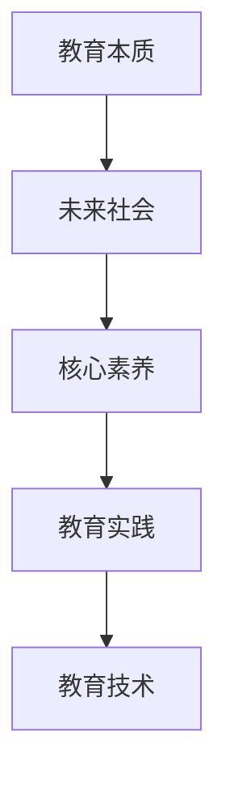

                 

# 重新思考教育本质：培养适应未来社会的核心素养

> 关键词：教育本质、未来社会、核心素养、教育实践、教育技术、教育改革

> 摘要：本文旨在重新思考教育的本质，探讨如何培养适应未来社会的核心素养。文章首先介绍了教育在现代社会中的重要性，分析了科技进步和社会结构变化对教育的影响。接着，详细阐述了核心素养的内涵和框架，并探讨了教育实践中的变革。最后，文章论述了教育技术的融合与发展，结合国内外典型案例，提出了对未来教育展望的建议。

## 目录大纲

### 第一部分：引言

## 1. 教育的本质与未来社会

### 1.1 教育的定义与核心价值

#### 1.1.1 教育的多重功能

#### 1.1.2 教育的核心价值

### 1.2 未来社会的挑战与机遇

#### 1.2.1 科技进步的影响

#### 1.2.2 社会结构的变化

#### 1.2.3 教育面临的挑战与机遇

### 第二部分：核心素养的培养

## 2. 核心素养的内涵与框架

### 2.1 核心素养的定义

#### 2.1.1 核心素养的基本概念

#### 2.1.2 核心素养的重要性

### 2.2 核心素养的框架

#### 2.2.1 国内外核心素养框架的比较

#### 2.2.2 核心素养的具体内容

### 第三部分：教育实践与变革

## 3. 教育实践中的核心素养培养

### 3.1 课程设置与教学设计

#### 3.1.1 课程设置的调整

#### 3.1.2 教学设计的创新

### 3.2 教师角色的转变

#### 3.2.1 教师的专业发展

#### 3.2.2 教师的教学策略

### 3.3 教学评价与反馈

#### 3.3.1 教学评价的创新

#### 3.3.2 教学反馈的机制

### 第四部分：教育技术的融合与发展

## 4. 教育技术与核心素养培养

### 4.1 教育技术的现状与趋势

#### 4.1.1 现代教育技术的应用

#### 4.1.2 教育技术的发展趋势

### 4.2 教育技术与核心素养的关系

#### 4.2.1 技术在核心素养培养中的作用

#### 4.2.2 技术应用中的挑战与对策

### 第五部分：案例研究与启示

## 5. 案例研究与启示

### 5.1 国内外核心素养培养的典型案例

#### 5.1.1 国外教育实践案例

#### 5.1.2 国内教育实践案例

### 5.2 案例的启示与借鉴

#### 5.2.1 教育实践中的成功经验

#### 5.2.2 教育改革中的挑战与对策

### 第六部分：未来展望

## 6. 教育的未来展望

### 6.1 教育系统改革的方向

#### 6.1.1 教育理念的创新

#### 6.1.2 教育模式的创新

### 6.2 教育与社会的互动

#### 6.2.1 教育对社会发展的贡献

#### 6.2.2 社会对教育的要求与期望

## 附录

### 附录 A：参考文献

### 附录 B：教育技术与核心素养相关资源

# 核心概念与联系

### 核心概念图



# 数学模型和数学公式

### 教育系统优化模型

$$
\text{优化模型} = \frac{\sum_{i=1}^{n} x_i \cdot w_i}{\sum_{i=1}^{n} w_i}
$$

其中，$x_i$ 为学生的学习成绩，$w_i$ 为权重。

# 项目实战

## 5.1.1 国外教育实践案例

### 案例一：芬兰教育改革

芬兰教育改革的核心是培养学生的核心素养，包括创造力、批判性思维、团队合作能力等。以下是芬兰教育改革的关键步骤：

1. **课程设置与教学设计**：
   - 芬兰学校提供多样化的课程，鼓励学生自主选择。
   - 教师注重引导学生进行探究式学习，培养学生的创造性思维。

2. **教师角色的转变**：
   - 芬兰重视教师的专业发展，为教师提供充足的培训和支持。
   - 教师在教学过程中，更加注重培养学生的核心素养。

3. **教学评价与反馈**：
   - 芬兰采用非标准化测试，强调评价过程的学生参与和反馈。

### 案例二：新加坡教育改革

新加坡教育改革注重培养学生的核心素养，特别是批判性思维和创新能力。以下是新加坡教育改革的关键步骤：

1. **课程设置与教学设计**：
   - 新加坡学校提供丰富的选修课程，鼓励学生跨学科学习。
   - 教师采用项目式学习，引导学生进行实际问题的探究。

2. **教师角色的转变**：
   - 新加坡重视教师的职业发展，提供多样化的培训项目。
   - 教师在教学过程中，注重培养学生的批判性思维和创新能力。

3. **教学评价与反馈**：
   - 新加坡采用多维度的评价体系，强调学生的自我评价和同伴评价。

## 6.1.1 代码实际案例

以下是一个简单的Python代码案例，用于演示如何使用机器学习算法进行教育数据的分析：

```python
# 导入必要的库
import numpy as np
import pandas as pd
from sklearn.model_selection import train_test_split
from sklearn.ensemble import RandomForestClassifier
from sklearn.metrics import accuracy_score

# 读取数据集
data = pd.read_csv('education_data.csv')

# 数据预处理
X = data.drop('target', axis=1)
y = data['target']

# 划分训练集和测试集
X_train, X_test, y_train, y_test = train_test_split(X, y, test_size=0.2, random_state=42)

# 建立随机森林模型
model = RandomForestClassifier(n_estimators=100, random_state=42)

# 训练模型
model.fit(X_train, y_train)

# 预测测试集
y_pred = model.predict(X_test)

# 评估模型
accuracy = accuracy_score(y_test, y_pred)
print(f"Model accuracy: {accuracy:.2f}")
```

这段代码演示了如何使用随机森林算法对教育数据集进行分类。首先，我们导入必要的库，并读取数据集。接着，进行数据预处理，包括划分特征变量和目标变量，以及划分训练集和测试集。然后，我们建立随机森林模型，并进行训练。最后，使用训练好的模型对测试集进行预测，并评估模型的准确率。

在实际应用中，我们可以通过调整模型参数来提高模型的性能。例如，增加随机森林的树数量或尝试其他类型的模型，如支持向量机或神经网络。

## 最佳实践 Tips

1. **数据质量**：在进行机器学习之前，确保数据的质量和准确性。清洗和预处理数据，去除异常值和噪声。

2. **特征选择**：选择合适的特征变量进行模型训练。可以使用特征选择技术，如特征重要性评估或主成分分析，来筛选出最重要的特征。

3. **模型选择**：根据问题的类型和数据特点，选择合适的机器学习模型。尝试不同的模型，并评估它们的性能。

4. **模型优化**：通过调整模型参数，如树数量、学习率等，来提高模型的性能。使用交叉验证等技术来评估模型的泛化能力。

5. **评估指标**：选择合适的评估指标来评估模型的性能，如准确率、召回率、F1 分数等。根据问题的需求，选择最合适的评估指标。

## 小结

本文通过重新思考教育的本质，探讨了培养适应未来社会的核心素养的重要性。文章分析了教育在现代社会中的重要性，探讨了核心素养的内涵和框架，以及教育实践中的变革。此外，还论述了教育技术的融合与发展，并结合国内外典型案例，提出了对未来教育展望的建议。通过本文的讨论，我们认识到教育改革需要从多方面入手，包括课程设置、教学设计、教师角色转变、教育技术等。只有通过全面的改革，才能培养出适应未来社会的核心素养，为社会的可持续发展做出贡献。

