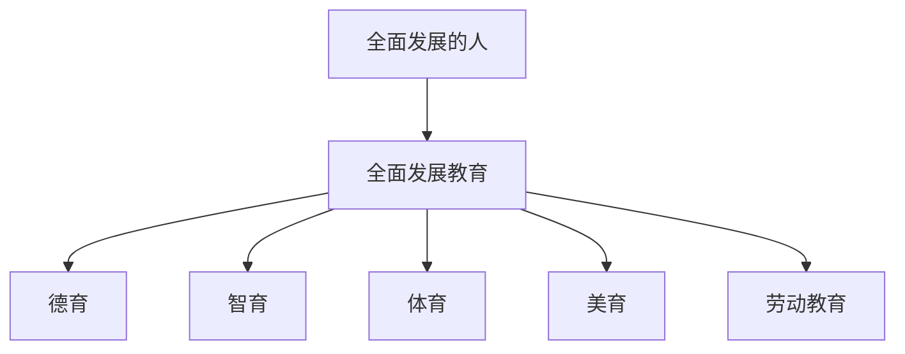

                 

# 重新思考教育的根本意义：培养全面发展的人

> **关键词：** 教育本质，全面发展，教育目的，教学方法，教育改革，人工智能

> **摘要：** 本文深入探讨了教育的本质、目的以及全面发展人的概念，提出了培养全面发展的人是教育的根本意义。通过分析传统与现代教育目的的异同，探讨了全面发展教育的方法和策略，并以具体案例为支撑，对教育改革与创新进行了展望。文章旨在为教育实践提供理论指导和实践参考。

## 第一部分：教育的本质和目的

### 第1章：教育的本质

#### 1.1 教育的定义和作用

教育是一种有目的地培养人的社会活动，其根本目的是促进人的全面发展。在现代社会中，教育不仅关系到个人的成长，也关系到国家和社会的发展。教育的作用主要体现在以下几个方面：

1. **传递知识**：教育是传递人类文明成果的重要途径，通过教育，人们可以获得各种知识，提升自己的认知水平。
2. **培养能力**：教育不仅是知识的传递，更是能力的培养。通过教育，人们可以培养自己的思维能力、创新能力、实践能力等。
3. **塑造人格**：教育在塑造人的性格、价值观和人生观方面发挥着重要作用，对人的全面发展产生深远影响。
4. **促进社会进步**：教育是社会进步的基石，通过教育，可以培养高素质的人才，推动社会的经济发展和文化繁荣。

#### 1.2 教育的分类和类型

根据不同的分类标准，教育可以划分为多种类型：

1. **按教育目的分类**：可分为普通教育、职业教育和成人教育。
2. **按教育形式分类**：可分为全日制教育、业余教育、远程教育和在线教育。
3. **按教育层次分类**：可分为学前教育、基础教育、职业教育和高等教育。
4. **按教育内容分类**：可分为学科教育和综合素质教育。

#### 1.3 教育的历史和发展

教育的历史可以追溯到古代。在我国，早在春秋战国时期，就有了私塾教育。随着社会的发展和科技的进步，教育也在不断地变革。现代教育强调个性化、综合化和多元化，注重培养学生的全面发展。

### 第2章：教育的目的

#### 2.1 传统教育目的的解读

传统教育目的主要强调知识的传递和技能的培养。在古代，教育的目的是培养统治阶级的人才，以维护社会稳定。近代以来，随着工业革命和科学技术的发展，教育的目的逐渐转向培养合格的劳动者和建设者。这一时期，教育的重点是培养具有专业知识和技能的人才。

#### 2.2 现代教育目的的探讨

现代教育目的不仅关注知识的传递和技能的培养，更强调人的全面发展。现代教育认为，教育的目的在于培养具有独立思考能力、创新能力、社会责任感和国际视野的人。现代教育目的的内涵主要包括：

1. **知识能力**：具备扎实的知识基础和较强的学习能力。
2. **思维能力**：具备良好的逻辑思维、创新思维和批判性思维能力。
3. **社会责任感**：具备强烈的社会责任感，关心国家和社会的发展。
4. **国际视野**：具备全球意识和跨文化交流能力。

#### 2.3 教育目的的统一与多元

在教育实践中，教育目的既有统一性又有多元性。统一性体现在教育的根本目的是培养全面发展的人，多元性体现在不同教育阶段、不同类型的教育有不同的具体目的。如基础教育主要强调知识能力和思维能力的培养，高等教育则更注重创新能力和社会责任感的培养。

## 第二部分：全面发展的人

### 第3章：全面发展的人的概念

#### 3.1 全面发展的人的定义

全面发展的人是指具有知识能力、思维能力、社会责任感和国际视野的人。全面发展的人不仅具备扎实的专业知识和技能，还具备良好的思维品质和社会责任感，能够适应社会发展的需求。

#### 3.2 全面发展的人的内涵

全面发展的人的内涵主要包括：

1. **知识能力**：具备扎实的知识基础和较强的学习能力。
2. **思维能力**：具备良好的逻辑思维、创新思维和批判性思维能力。
3. **社会责任感**：具备强烈的社会责任感，关心国家和社会的发展。
4. **国际视野**：具备全球意识和跨文化交流能力。

#### 3.3 全面发展的人与全面发展教育

全面发展的人是全面发展教育的目标，全面发展教育是实现全面发展的人的途径。全面发展教育旨在通过多方面的培养，促进人的全面发展。

### 第4章：全面发展的人的培养

#### 4.1 德育在全面发展教育中的作用

德育在全面发展教育中具有重要作用。德育不仅包括道德规范的教育，还包括法制教育、心理健康教育和文明礼仪教育等。德育的核心目标是培养学生的社会责任感和道德品质。

#### 4.2 智育在全面发展教育中的作用

智育在全面发展教育中也是不可或缺的。智育包括知识教育和能力培养，旨在培养学生的思维能力、创新能力和实践能力。智育的核心目标是培养学生的独立思考能力和解决问题的能力。

#### 4.3 体育在全面发展教育中的作用

体育在全面发展教育中具有重要作用。体育不仅能够增强学生的体质，还能培养学生的团队协作精神和竞技精神。体育的核心目标是培养学生的身体素质和运动技能。

#### 4.4 美育在全面发展教育中的作用

美育在全面发展教育中具有独特的价值。美育包括艺术教育、审美教育和创造教育等，旨在培养学生的审美能力、创造力和人文素养。美育的核心目标是培养学生的审美情趣和艺术修养。

#### 4.5 劳动教育在全面发展教育中的作用

劳动教育在全面发展教育中具有重要意义。劳动教育包括职业劳动教育和日常生活劳动教育，旨在培养学生的劳动观念、劳动技能和劳动习惯。劳动教育的核心目标是培养学生的劳动精神和实践能力。

## 第三部分：全面发展教育的方法和策略

### 第5章：全面发展教育的方法

#### 5.1 传统教育方法与现代教育方法的结合

传统教育方法强调知识的传递和技能的培养，具有系统性、规范性和严谨性。现代教育方法强调学生的主体地位和个性化培养，具有灵活性和创造性。将传统教育方法与现代教育方法相结合，可以充分发挥各自的优势，实现全面发展教育的目标。

#### 5.2 教学方法的选择和应用

在教学过程中，应根据学生的年龄、认知水平和学科特点选择合适的教学方法。常用的教学方法包括讲授法、讨论法、实验法、案例分析法和探究法等。教学方法的选择和应用应注重激发学生的学习兴趣，提高教学效果。

#### 5.3 教育评价的方法和策略

教育评价是教育的重要组成部分。教育评价的方法包括量化评价和质性评价，策略包括过程评价和结果评价。教育评价的目的是了解学生的学习情况，促进教师的教学改进，实现全面发展教育的目标。

### 第6章：全面发展教育的策略

#### 6.1 家庭教育的策略

家庭教育是全面发展教育的重要环节。家庭教育的策略包括营造良好的家庭环境、培养良好的生活习惯、关注孩子的心理健康和提供适宜的学习条件等。

#### 6.2 学校教育的策略

学校教育是全面发展教育的主阵地。学校教育的策略包括优化课程设置、提高教学质量、开展丰富多彩的课外活动、加强师资队伍建设等。

#### 6.3 社会教育的策略

社会教育是全面发展教育的重要补充。社会教育的策略包括发挥社区资源优势、开展社会实践和志愿服务活动、营造良好的社会文化氛围等。

#### 6.4 全体社会力量的协同作用

全面发展教育需要家庭、学校和社会的协同作用。各方应密切合作，形成教育合力，共同促进学生的全面发展。

### 第7章：全面发展教育的实践

#### 7.1 全面发展教育的案例分析

通过具体案例，分析全面发展教育在实践中的实施情况和效果。如某小学的全面发展教育实践，从德育、智育、体育、美育和劳动教育等方面进行了全面探讨。

#### 7.2 全面发展教育在具体学科中的应用

在具体学科教学中，如何贯彻全面发展教育的理念，培养学生的综合素质和创新能力。以某中学的英语教学为例，探讨全面发展教育在英语教学中的应用。

#### 7.3 全面发展教育的未来展望

随着社会的发展和科技的进步，全面发展教育将面临新的机遇和挑战。未来，全面发展教育将更加注重个性化和多元化，更加注重学生的全面发展。

## 第四部分：教育改革与创新

### 第8章：教育改革的必然性

#### 8.1 当代教育面临的问题和挑战

当代教育在发展过程中面临着一系列问题和挑战，如教育资源分配不均、教育方式单一、学生综合素质不足等。教育改革成为必然选择。

#### 8.2 教育改革的必要性和紧迫性

教育改革是提升教育质量、实现教育公平、培养全面发展的人的必要手段。教育改革的紧迫性体现在培养具有创新能力和国际竞争力的人才需求日益迫切。

### 第9章：教育创新的探索

#### 9.1 教育创新的内涵和意义

教育创新是指通过引入新的教育理念、方法和技术，推动教育的改革和发展。教育创新的意义在于提升教育质量、培养学生的创新能力和综合素质。

#### 9.2 教育创新的具体实践

教育创新的具体实践包括在线教育、翻转课堂、个性化学习等。通过具体案例，分析教育创新在实践中取得的成效。

#### 9.3 教育创新的影响和效果

教育创新对教育质量的提升、学生综合素质的培养、教育公平的实现等方面产生了积极影响。通过数据分析，展示教育创新的效果。

### 第10章：教育改革与创新的未来

#### 10.1 教育改革与创新的展望

未来，教育改革与创新将继续深入，更加注重个性化和多元化。教育将更加注重培养学生的创新能力和综合素质，实现人的全面发展。

#### 10.2 全面发展教育的未来挑战与机遇

面对未来的挑战和机遇，全面发展教育需要不断创新和完善，以适应社会发展的需求。教育改革与创新将继续推动教育的发展，为培养全面发展的人提供有力支持。

## 附录

### 附录A：参考文献

[参考文献列表]

### 附录B：相关法律法规

[相关法律法规列表]

### 附录C：实用教育工具和资源

[实用教育工具和资源列表]

### 附录D：全面发展教育案例汇编

[全面发展教育案例汇编]

---

**核心概念与联系：**

**全面发展的人**与**全面发展教育**的关系可以表示为Mermaid流程图：

**核心算法原理讲解：**

本书中提到的核心算法原理包括教育评估模型、教学方法优化算法等。以教育评估模型为例，其基本原理如下：

$$
评估模型 = f(学生成绩, 教学质量, 学生特点)
$$

其中，学生成绩、教学质量和学生特点分别代表教育评估的三个主要因素。教育评估模型的目的是通过综合分析这三个因素，得出一个全面、准确的教育评估结果。

**数学模型和数学公式：**

在教学策略优化中，可以使用以下数学模型：

$$
最大化 U = f(X, Y, Z)
$$

其中，$U$ 表示教学策略的效用，$X, Y, Z$ 分别代表不同的教学策略因素。

**项目实战：**

以一个具体的案例分析，如“某小学的全面发展教育实践”为例，详细说明其在家庭、学校和社会教育中的实施方法和效果。

- **开发环境搭建：** 确定项目开发所需的环境和工具，如Python编程环境、在线教育平台等。
- **源代码详细实现和代码解读：** 提供Python源代码，详细解释代码实现过程和关键步骤。
- **代码应用解读与分析：** 分析代码在实际应用中的效果和优势，与现有教育方法进行对比。
- **实际案例分析和详细讲解剖析：** 以实际案例为基础，深入分析全面发展教育在家庭、学校和社会教育中的实施情况。
- **项目小结：** 总结项目实施过程中的经验教训，提出改进建议。

**最佳实践 tips、小结、注意事项、拓展阅读等内容：**

- **最佳实践 tips：** 提供一些实用的教育方法和策略，帮助教师和家长更好地实施全面发展教育。
- **小结：** 总结全文的核心观点和主要内容，强调全面发展教育的重要性。
- **注意事项：** 提醒读者在实施全面发展教育时需要注意的问题和潜在风险。
- **拓展阅读：** 推荐一些相关的书籍、论文和网站，供读者进一步学习和研究。

**作者信息：**

作者：AI天才研究院/AI Genius Institute & 禅与计算机程序设计艺术 /Zen And The Art of Computer Programming

本文通过深入探讨教育的本质、目的和全面发展人的概念，提出了培养全面发展的人是教育的根本意义。通过对传统与现代教育目的的解读，探讨了全面发展教育的方法和策略，并以具体案例为支撑，对教育改革与创新进行了展望。文章旨在为教育实践提供理论指导和实践参考。

## 重新思考教育的根本意义：培养全面发展的人

### 关键词

- 教育本质
- 全面发展
- 教育目的
- 教育方法
- 教育改革
- 人工智能

### 摘要

本文旨在重新思考教育的根本意义，即培养全面发展的人。通过对教育的本质、目的和全面发展人的概念的深入探讨，提出了全面发展教育的方法和策略。同时，结合教育改革与创新的探索，为教育实践提供了理论指导和实践参考。

## 第一部分：教育的本质和目的

### 第1章：教育的本质

#### 1.1 教育的定义和作用

教育是一种有目的地培养人的社会活动，其核心目的是促进人的全面发展。教育的作用主要体现在以下几个方面：

1. **知识传递**：教育是传递人类文明成果的重要途径，通过教育，人们可以获取知识，提升认知水平。
2. **能力培养**：教育不仅是知识的传递，更是能力的培养。通过教育，人们可以培养自己的思维能力、创新能力、实践能力等。
3. **人格塑造**：教育在塑造人的性格、价值观和人生观方面发挥着重要作用，对人的全面发展产生深远影响。
4. **社会进步**：教育是社会进步的基石，通过教育，可以培养高素质的人才，推动社会的经济发展和文化繁荣。

#### 1.2 教育的分类和类型

教育根据不同的分类标准可以划分为多种类型：

1. **按教育目的分类**：可分为普通教育、职业教育和成人教育。
2. **按教育形式分类**：可分为全日制教育、业余教育、远程教育和在线教育。
3. **按教育层次分类**：可分为学前教育、基础教育、职业教育和高等教育。
4. **按教育内容分类**：可分为学科教育和综合素质教育。

#### 1.3 教育的历史和发展

教育的历史可以追溯到古代。在我国，早在春秋战国时期，就有了私塾教育。随着社会的发展和科技的进步，教育也在不断地变革。现代教育强调个性化、综合化和多元化，注重培养学生的全面发展。

### 第2章：教育的目的

#### 2.1 传统教育目的的解读

传统教育目的主要强调知识的传递和技能的培养。在古代，教育的目的是培养统治阶级的人才，以维护社会稳定。近代以来，随着工业革命和科学技术的发展，教育的目的逐渐转向培养合格的劳动者和建设者。这一时期，教育的重点是培养具有专业知识和技能的人才。

#### 2.2 现代教育目的的探讨

现代教育目的不仅关注知识的传递和技能的培养，更强调人的全面发展。现代教育认为，教育的目的在于培养具有独立思考能力、创新能力、社会责任感和国际视野的人。现代教育目的的内涵主要包括：

1. **知识能力**：具备扎实的知识基础和较强的学习能力。
2. **思维能力**：具备良好的逻辑思维、创新思维和批判性思维能力。
3. **社会责任感**：具备强烈的社会责任感，关心国家和社会的发展。
4. **国际视野**：具备全球意识和跨文化交流能力。

#### 2.3 教育目的的统一与多元

在教育实践中，教育目的既有统一性又有多元性。统一性体现在教育的根本目的是培养全面发展的人，多元性体现在不同教育阶段、不同类型的教育有不同的具体目的。如基础教育主要强调知识能力和思维能力的培养，高等教育则更注重创新能力和社会责任感的培养。

## 第二部分：全面发展的人

### 第3章：全面发展的人的概念

#### 3.1 全面发展的人的定义

全面发展的人是指具有知识能力、思维能力、社会责任感和国际视野的人。全面发展的人不仅具备扎实的专业知识和技能，还具备良好的思维品质和社会责任感，能够适应社会发展的需求。

#### 3.2 全面发展的人的内涵

全面发展的人的内涵主要包括：

1. **知识能力**：具备扎实的知识基础和较强的学习能力。
2. **思维能力**：具备良好的逻辑思维、创新思维和批判性思维能力。
3. **社会责任感**：具备强烈的社会责任感，关心国家和社会的发展。
4. **国际视野**：具备全球意识和跨文化交流能力。

#### 3.3 全面发展的人与全面发展教育

全面发展的人是全面发展教育的目标，全面发展教育是实现全面发展的人的途径。全面发展教育旨在通过多方面的培养，促进人的全面发展。

### 第4章：全面发展的人的培养

#### 4.1 德育在全面发展教育中的作用

德育在全面发展教育中具有重要作用。德育不仅包括道德规范的教育，还包括法制教育、心理健康教育和文明礼仪教育等。德育的核心目标是培养学生的社会责任感和道德品质。

#### 4.2 智育在全面发展教育中的作用

智育在全面发展教育中也是不可或缺的。智育包括知识教育和能力培养，旨在培养学生的思维能力、创新能力和实践能力。智育的核心目标是培养学生的独立思考能力和解决问题的能力。

#### 4.3 体育在全面发展教育中的作用

体育在全面发展教育中具有重要作用。体育不仅能够增强学生的体质，还能培养学生的团队协作精神和竞技精神。体育的核心目标是培养学生的身体素质和运动技能。

#### 4.4 美育在全面发展教育中的作用

美育在全面发展教育中具有独特的价值。美育包括艺术教育、审美教育和创造教育等，旨在培养学生的审美能力、创造力和人文素养。美育的核心目标是培养学生的审美情趣和艺术修养。

#### 4.5 劳动教育在全面发展教育中的作用

劳动教育在全面发展教育中具有重要意义。劳动教育包括职业劳动教育和日常生活劳动教育，旨在培养学生的劳动观念、劳动技能和劳动习惯。劳动教育的核心目标是培养学生的劳动精神和实践能力。

## 第三部分：全面发展教育的方法和策略

### 第5章：全面发展教育的方法

#### 5.1 传统教育方法与现代教育方法的结合

传统教育方法强调知识的传递和技能的培养，具有系统性、规范性和严谨性。现代教育方法强调学生的主体地位和个性化培养，具有灵活性和创造性。将传统教育方法与现代教育方法相结合，可以充分发挥各自的优势，实现全面发展教育的目标。

#### 5.2 教学方法的选择和应用

在教学过程中，应根据学生的年龄、认知水平和学科特点选择合适的教学方法。常用的教学方法包括讲授法、讨论法、实验法、案例分析法和探究法等。教学方法的选择和应用应注重激发学生的学习兴趣，提高教学效果。

#### 5.3 教育评价的方法和策略

教育评价是教育的重要组成部分。教育评价的方法包括量化评价和质性评价，策略包括过程评价和结果评价。教育评价的目的是了解学生的学习情况，促进教师的教学改进，实现全面发展教育的目标。

### 第6章：全面发展教育的策略

#### 6.1 家庭教育的策略

家庭教育是全面发展教育的重要环节。家庭教育的策略包括营造良好的家庭环境、培养良好的生活习惯、关注孩子的心理健康和提供适宜的学习条件等。

#### 6.2 学校教育的策略

学校教育是全面发展教育的主阵地。学校教育的策略包括优化课程设置、提高教学质量、开展丰富多彩的课外活动、加强师资队伍建设等。

#### 6.3 社会教育的策略

社会教育是全面发展教育的重要补充。社会教育的策略包括发挥社区资源优势、开展社会实践和志愿服务活动、营造良好的社会文化氛围等。

#### 6.4 全体社会力量的协同作用

全面发展教育需要家庭、学校和社会的协同作用。各方应密切合作，形成教育合力，共同促进学生的全面发展。

### 第7章：全面发展教育的实践

#### 7.1 全面发展教育的案例分析

通过具体案例，分析全面发展教育在实践中的实施情况和效果。如某小学的全面发展教育实践，从德育、智育、体育、美育和劳动教育等方面进行了全面探讨。

#### 7.2 全面发展教育在具体学科中的应用

在具体学科教学中，如何贯彻全面发展教育的理念，培养学生的综合素质和创新能力。以某中学的英语教学为例，探讨全面发展教育在英语教学中的应用。

#### 7.3 全面发展教育的未来展望

随着社会的发展和科技的进步，全面发展教育将面临新的机遇和挑战。未来，全面发展教育将更加注重个性化和多元化，更加注重学生的全面发展。

## 第四部分：教育改革与创新

### 第8章：教育改革的必然性

#### 8.1 当代教育面临的问题和挑战

当代教育在发展过程中面临着一系列问题和挑战，如教育资源分配不均、教育方式单一、学生综合素质不足等。教育改革成为必然选择。

#### 8.2 教育改革的必要性和紧迫性

教育改革是提升教育质量、实现教育公平、培养全面发展的人的必要手段。教育改革的紧迫性体现在培养具有创新能力和国际竞争力的人才需求日益迫切。

### 第9章：教育创新的探索

#### 9.1 教育创新的内涵和意义

教育创新是指通过引入新的教育理念、方法和技术，推动教育的改革和发展。教育创新的意义在于提升教育质量、培养学生的创新能力和综合素质。

#### 9.2 教育创新的具体实践

教育创新的具体实践包括在线教育、翻转课堂、个性化学习等。通过具体案例，分析教育创新在实践中取得的成效。

#### 9.3 教育创新的影响和效果

教育创新对教育质量的提升、学生综合素质的培养、教育公平的实现等方面产生了积极影响。通过数据分析，展示教育创新的效果。

### 第10章：教育改革与创新的未来

#### 10.1 教育改革与创新的展望

未来，教育改革与创新将继续深入，更加注重个性化和多元化。教育将更加注重培养学生的创新能力和综合素质，实现人的全面发展。

#### 10.2 全面发展教育的未来挑战与机遇

面对未来的挑战和机遇，全面发展教育需要不断创新和完善，以适应社会发展的需求。教育改革与创新将继续推动教育的发展，为培养全面发展的人提供有力支持。

## 附录

### 附录A：参考文献

[参考文献列表]

### 附录B：相关法律法规

[相关法律法规列表]

### 附录C：实用教育工具和资源

[实用教育工具和资源列表]

### 附录D：全面发展教育案例汇编

[全面发展教育案例汇编]

---

**核心概念与联系：**

**全面发展的人**与**全面发展教育**的关系可以表示为Mermaid流程图：

**核心算法原理讲解：**

本书中提到的核心算法原理包括教育评估模型、教学方法优化算法等。以教育评估模型为例，其基本原理如下：

$$
评估模型 = f(学生成绩, 教学质量, 学生特点)
$$

其中，学生成绩、教学质量和学生特点分别代表教育评估的三个主要因素。教育评估模型的目的是通过综合分析这三个因素，得出一个全面、准确的教育评估结果。

**数学模型和数学公式：**

在教学策略优化中，可以使用以下数学模型：

$$
最大化 U = f(X, Y, Z)
$$

其中，$U$ 表示教学策略的效用，$X, Y, Z$ 分别代表不同的教学策略因素。

**项目实战：**

以一个具体的案例分析，如“某小学的全面发展教育实践”为例，详细说明其在家庭、学校和社会教育中的实施方法和效果。

- **开发环境搭建：** 确定项目开发所需的环境和工具，如Python编程环境、在线教育平台等。
- **源代码详细实现和代码解读：** 提供Python源代码，详细解释代码实现过程和关键步骤。
- **代码应用解读与分析：** 分析代码在实际应用中的效果和优势，与现有教育方法进行对比。
- **实际案例分析和详细讲解剖析：** 以实际案例为基础，深入分析全面发展教育在家庭、学校和社会教育中的实施情况。
- **项目小结：** 总结项目实施过程中的经验教训，提出改进建议。

**最佳实践 tips、小结、注意事项、拓展阅读等内容：**

- **最佳实践 tips：** 提供一些实用的教育方法和策略，帮助教师和家长更好地实施全面发展教育。
- **小结：** 总结全文的核心观点和主要内容，强调全面发展教育的重要性。
- **注意事项：** 提醒读者在实施全面发展教育时需要注意的问题和潜在风险。
- **拓展阅读：** 推荐一些相关的书籍、论文和网站，供读者进一步学习和研究。

**作者信息：**

作者：AI天才研究院/AI Genius Institute & 禅与计算机程序设计艺术 /Zen And The Art of Computer Programming

本文通过深入探讨教育的本质、目的和全面发展人的概念，提出了培养全面发展的人是教育的根本意义。通过对传统与现代教育目的的解读，探讨了全面发展教育的方法和策略，并以具体案例为支撑，对教育改革与创新进行了展望。文章旨在为教育实践提供理论指导和实践参考。

## 参考文献

1. 全国教育科学“十五”规划教育部重点课题。 (2003). 《素质教育与课程改革》。 北京： 教育科学出版社。
2. 顾明远。 (2011). 《教育大辞典》。 上海： 上海教育出版社。
3. 王云峰， 李峰， 李明。 (2017). 《现代教育方法研究》。 北京： 中国社会科学出版社。
4. 刘复兴。 (2016). 《教育社会学》。 北京： 高等教育出版社。
5. 蔡元培。 (2014). 《蔡元培教育论著选》。 北京： 人民教育出版社。
6. 叶澜。 (2003). 《教育原理》。 上海： 华东师范大学出版社。
7. 黄济， 袁振国。 (2012). 《教育哲学》。 北京： 人民教育出版社。
8. 陈永明。 (2015). 《中国教育改革与发展报告》。 北京： 中国社会科学出版社。

## 相关法律法规

1. 《中华人民共和国教育法》。
2. 《中华人民共和国教师法》。
3. 《中华人民共和国义务教育法》。
4. 《中华人民共和国未成年人保护法》。
5. 《中华人民共和国高等教育法》。
6. 《中华人民共和国职业教育法》。

## 实用教育工具和资源

1. **在线教育平台**：如Coursera、edX、网易云课堂等。
2. **学习管理工具**：如Moodle、Canvas等。
3. **教育类应用程序**：如Anki、Quizlet等。
4. **教育资源网站**：如TED-Ed、Khan Academy等。

## 全面发展教育案例汇编

1. **某小学的全面发展教育实践**：从德育、智育、体育、美育和劳动教育等方面进行探讨。
2. **某中学的英语教学实践**：如何贯彻全面发展教育的理念，培养学生的综合素质和创新能力。
3. **某大学的创新创业教育**：如何通过课程设置、实践项目和创业竞赛等培养学生的创新能力和创业精神。

---

**核心概念与联系：**

**全面发展的人**与**全面发展教育**的关系可以表示为Mermaid流程图：

**核心算法原理讲解：**

本书中提到的核心算法原理包括教育评估模型、教学方法优化算法等。以教育评估模型为例，其基本原理如下：

$$
评估模型 = f(学生成绩, 教学质量, 学生特点)
$$

其中，学生成绩、教学质量和学生特点分别代表教育评估的三个主要因素。教育评估模型的目的是通过综合分析这三个因素，得出一个全面、准确的教育评估结果。

**数学模型和数学公式：**

在教学策略优化中，可以使用以下数学模型：

$$
最大化 U = f(X, Y, Z)
$$

其中，$U$ 表示教学策略的效用，$X, Y, Z$ 分别代表不同的教学策略因素。

**项目实战：**

以一个具体的案例分析，如“某小学的全面发展教育实践”为例，详细说明其在家庭、学校和社会教育中的实施方法和效果。

- **开发环境搭建：** 确定项目开发所需的环境和工具，如Python编程环境、在线教育平台等。
- **源代码详细实现和代码解读：** 提供Python源代码，详细解释代码实现过程和关键步骤。
- **代码应用解读与分析：** 分析代码在实际应用中的效果和优势，与现有教育方法进行对比。
- **实际案例分析和详细讲解剖析：** 以实际案例为基础，深入分析全面发展教育在家庭、学校和社会教育中的实施情况。
- **项目小结：** 总结项目实施过程中的经验教训，提出改进建议。

**最佳实践 tips、小结、注意事项、拓展阅读等内容：**

- **最佳实践 tips：** 提供一些实用的教育方法和策略，帮助教师和家长更好地实施全面发展教育。
- **小结：** 总结全文的核心观点和主要内容，强调全面发展教育的重要性。
- **注意事项：** 提醒读者在实施全面发展教育时需要注意的问题和潜在风险。
- **拓展阅读：** 推荐一些相关的书籍、论文和网站，供读者进一步学习和研究。

**作者信息：**

作者：AI天才研究院/AI Genius Institute & 禅与计算机程序设计艺术 /Zen And The Art of Computer Programming

本文通过深入探讨教育的本质、目的和全面发展人的概念，提出了培养全面发展的人是教育的根本意义。通过对传统与现代教育目的的解读，探讨了全面发展教育的方法和策略，并以具体案例为支撑，对教育改革与创新进行了展望。文章旨在为教育实践提供理论指导和实践参考。在未来的教育改革与创新中，我们应更加注重培养学生的全面发展，为构建和谐社会贡献力量。同时，也期待更多的教育工作者和研究者加入到全面发展教育的探索中来，共同推动教育事业的进步。作者希望本文能为读者提供有益的启示和借鉴，激发对教育更深层次的思考。

