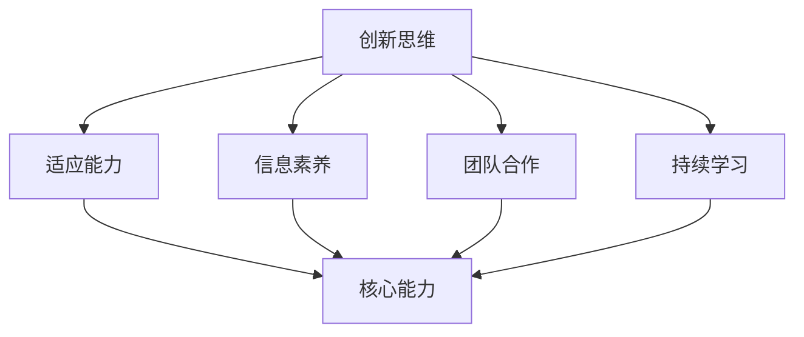

                 

# 重新思考教育目标：培养适应未来社会的核心能力

> 关键词：教育目标、未来社会、核心能力、创新思维、适应能力、信息素养、团队合作、持续学习

> 摘要：本文从科技发展、社会变革的角度出发，探讨了教育目标的重新思考。文章通过分析未来社会所需的五大核心能力，提出了适应未来教育的目标设定原则和实现路径，并结合具体案例进行了深入讲解。

## 第一部分：引言

### 1.1 教育变革的背景与挑战

在过去的几十年中，科技的飞速发展给教育领域带来了深刻的变革。从传统课堂教育到在线教育，从纸质教材到数字化资源，技术的进步极大地改变了教育的形态和方式。然而，随着人工智能、大数据、云计算等新兴技术的崛起，教育又面临着新的挑战。

首先，科技进步对教育的影响日益显著。人工智能技术的发展使得个性化教育、智能教育成为可能，学生可以按照自己的学习节奏和兴趣进行学习。大数据技术的应用则使得教育数据的分析和应用更加精准，有助于教育者更好地了解学生的学习状况，制定更加科学的教学策略。云计算技术的普及，则为教育资源的共享和协同提供了便利。

### 1.2 未来社会的发展趋势

未来社会的发展趋势将对教育提出更高的要求。随着全球化的深入，人们需要具备跨文化的沟通能力；随着技术的进步，人们需要不断学习新的知识和技能以适应快速变化的工作环境。此外，社会对创新、协作、适应能力等方面的需求也在不断增加。

### 1.3 教育目标与培养目标的重新定义

在新的背景下，我们需要重新思考教育目标，从传统的知识传授转向培养适应未来社会的核心能力。这就需要我们重新定义教育的培养目标，使之更加贴近社会的需求。未来教育应致力于培养具有创新思维、适应能力、信息素养、团队合作和持续学习等五大核心能力的人才。

## 第二部分：未来社会所需的五大核心能力

### 2.1 创新思维

创新思维是未来社会的重要能力之一。它不仅体现在科技领域，也广泛应用于各个行业。创新思维培养的核心在于激发学生的创造力，培养他们的独立思考能力和解决问题的能力。教育者可以通过项目式学习、探究式学习等方式，引导学生进行创新实践。

### 2.2 适应能力

适应能力是指个体在面对环境变化时，能够迅速调整自身状态，适应新环境的能力。在快速变化的社会中，适应能力显得尤为重要。教育者应注重培养学生的应变能力和心理韧性，帮助他们更好地应对未来的挑战。

### 2.3 信息素养

信息素养是指个体在信息社会中，能够有效获取、处理、利用信息的能力。在信息化时代，信息素养已成为基本素养。教育者应引导学生学会信息检索、信息筛选、信息分析等技能，提高他们的信息素养。

### 2.4 团队合作

团队合作能力是现代社会不可或缺的能力。在复杂的社会环境中，个体很难独自完成复杂任务，需要与他人协作。教育者应通过团队合作项目、模拟演练等方式，培养学生的团队合作精神，提高他们的沟通协作能力。

### 2.5 持续学习

持续学习能力是指个体在面对知识更新和技能需求时，能够主动学习、不断提升自身能力的能力。在知识经济时代，持续学习已成为个人发展的关键。教育者应引导学生树立终身学习的理念，培养他们的自主学习能力。

## 第三部分：教育目标的重新思考

### 3.1 传统教育目标的局限性

传统的教育目标主要集中在知识的传授和技能的培养上，忽视了创新思维、适应能力、信息素养、团队合作和持续学习等未来社会所需的核心能力。这种目标设定方式已经不能适应未来社会的发展需求。

### 3.2 未来教育目标的设定原则

未来教育目标的设定应遵循以下原则：

1. **面向未来**：目标设定应与未来社会的发展趋势相结合，培养具有前瞻性的能力。
2. **全面发展**：目标设定应关注学生的全面发展，包括智力、情感、道德、身体等方面。
3. **个性化**：目标设定应尊重学生的个性差异，关注每个学生的独特需求和发展。
4. **可持续性**：目标设定应注重培养学生的可持续能力，包括创新思维、适应能力、信息素养、团队合作和持续学习等。

### 3.3 教育目标的实现路径

要实现未来教育目标，需要从以下几个方面进行改革：

1. **课程改革**：调整课程设置，增加与未来社会需求相关的课程内容。
2. **教学方法改革**：采用项目式学习、探究式学习等教学方法，培养学生的创新思维和适应能力。
3. **教育评价改革**：改革教育评价方式，关注学生的全面发展，尤其是创新思维、适应能力、信息素养、团队合作和持续学习等核心能力的培养。
4. **教育资源建设**：加强教育资源的建设，提供丰富的数字化教育资源，提高教育信息化水平。

## 第四部分：核心能力培养策略

### 4.1 创新思维培养

创新思维培养需要从以下几个方面入手：

1. **激发创造力**：教育者应创设有利于学生创造力的培养环境，鼓励学生提出独特的观点和解决方案。
2. **培养批判性思维**：教育者应引导学生学会批判性思维，对现有知识和观点进行质疑和反思。
3. **开展项目式学习**：通过项目式学习，让学生在实践中培养创新思维。
4. **提供多样化的学习资源**：提供丰富的学习资源，包括书籍、网络资源、实验设备等，为学生创新思维的培养提供支持。

### 4.2 适应能力培养

适应能力培养需要从以下几个方面进行：

1. **培养心理韧性**：教育者应引导学生学会面对困难和挫折，培养他们的心理韧性。
2. **提供多样化的学习体验**：通过多样化的学习体验，让学生在不同环境中锻炼适应能力。
3. **开展情境模拟**：通过情境模拟，让学生在模拟环境中锻炼适应能力。
4. **建立支持系统**：学校和家庭应建立支持系统，为学生提供心理辅导和帮助。

### 4.3 信息素养培养

信息素养培养需要从以下几个方面入手：

1. **提高信息检索能力**：教育者应引导学生学会有效利用各种信息资源，提高信息检索能力。
2. **培养信息分析能力**：教育者应引导学生学会对信息进行分析和评估，提高信息分析能力。
3. **加强信息安全意识**：教育者应引导学生学会保护个人信息，提高信息安全意识。
4. **开展信息素养教育**：学校应开展信息素养教育，引导学生掌握信息素养的基本知识和技能。

### 4.4 团队合作能力培养

团队合作能力培养需要从以下几个方面进行：

1. **培养团队合作精神**：教育者应引导学生树立团队合作的理念，培养他们的团队合作精神。
2. **提高沟通协作能力**：教育者应引导学生学会有效沟通和协作，提高沟通协作能力。
3. **开展团队合作项目**：通过团队合作项目，让学生在团队中锻炼协作能力。
4. **建立团队文化**：学校应建立积极的团队文化，鼓励学生积极参与团队合作。

### 4.5 持续学习能力培养

持续学习能力培养需要从以下几个方面进行：

1. **树立终身学习理念**：教育者应引导学生树立终身学习的理念，认识到学习是一种持续的过程。
2. **培养自主学习能力**：教育者应引导学生学会自主学习，提高自主学习能力。
3. **提供多样化的学习资源**：学校应提供丰富的学习资源，为学生持续学习提供支持。
4. **建立学习支持系统**：学校和家庭应建立学习支持系统，为学生提供心理辅导和学习指导。

## 第五部分：教育实践与案例分析

### 5.1 国内外的成功案例介绍

国内外有许多学校在教育目标的重新思考和实践方面取得了显著成果。以下是一些具有代表性的案例：

1. **美国斯坦福大学**：斯坦福大学通过改革课程设置和教学方法，培养学生的创新思维和团队合作能力。他们开设了跨学科的课程，鼓励学生进行跨领域合作，培养了大批具有创新精神和团队合作能力的人才。

2. **芬兰教育**：芬兰教育以其创新的教育模式和优秀的教育成果而闻名。芬兰教育注重培养学生的创新能力、适应能力和团队合作能力，通过项目式学习和探究式学习，培养学生的实践能力和问题解决能力。

3. **中国杭州学军中学**：杭州学军中学通过开展创新教育实践，培养学生的创新思维和适应能力。他们开设了创新课程，开展了丰富多样的创新实践活动，为学生提供了广阔的创新空间。

### 5.2 案例分析：创新教育实践

以美国斯坦福大学为例，分析其创新教育实践的成功经验：

1. **跨学科教育**：斯坦福大学注重跨学科教育，开设了众多跨学科课程，如人工智能、生物技术、环境科学等。这种跨学科教育有助于培养学生的创新思维和解决问题的能力。

2. **项目式学习**：斯坦福大学通过项目式学习，让学生在项目中实践所学知识，培养他们的创新思维和团队合作能力。学生在项目中面临实际问题，需要运用多种学科知识进行解决，这种实践过程有助于培养学生的创新能力。

3. **创业教育**：斯坦福大学注重创业教育，鼓励学生创办自己的公司。学校提供了丰富的创业资源和指导，帮助学生将创新思维转化为实际成果。

### 5.3 案例分析：适应能力培养

以芬兰教育为例，分析其适应能力培养的成功经验：

1. **个性化教育**：芬兰教育注重个性化教育，根据学生的兴趣和特长进行差异化教学。这种个性化教育有助于培养学生的适应能力，使他们能够更好地适应未来社会的变化。

2. **项目式学习**：芬兰教育通过项目式学习，让学生在实践中锻炼适应能力。学生在项目中需要面对各种挑战和问题，需要不断调整自己的策略和方法，这种实践过程有助于培养学生的适应能力。

3. **多元评价体系**：芬兰教育采用了多元评价体系，不仅关注学生的学业成绩，还关注他们的综合素质和适应能力。这种评价体系有助于引导学生全面发展，提高他们的适应能力。

## 第六部分：教育政策与未来展望

### 6.1 教育政策调整与核心能力培养

未来教育政策的调整应注重核心能力培养，从以下几个方面进行：

1. **加大教育投入**：政府应加大教育投入，为学校提供充足的资源，支持学校进行教育改革和创新。

2. **改革课程设置**：教育部门应调整课程设置，增加与未来社会需求相关的课程内容，培养学生的核心能力。

3. **完善评价体系**：教育部门应完善评价体系，将核心能力培养纳入评价范围，激励学校和学生注重核心能力的培养。

4. **加强师资培训**：政府应加强师资培训，提高教师的教育教学能力，特别是创新思维、适应能力、信息素养、团队合作和持续学习等核心能力的培养。

### 6.2 未来教育的发展趋势

未来教育将呈现以下发展趋势：

1. **个性化教育**：随着科技的进步，个性化教育将得到进一步发展，为学生提供更加个性化和定制化的学习体验。

2. **智慧教育**：智慧教育将借助人工智能、大数据等技术，实现教学过程的智能化，提高教学效果。

3. **终身教育**：终身教育将成为未来教育的重要趋势，人们将终身学习，不断提升自身能力，适应快速变化的社会环境。

4. **国际化教育**：随着全球化的深入，国际化教育将越来越受到重视，培养学生的跨文化交流能力和全球视野。

### 6.3 教育目标实现的挑战与机遇

教育目标实现面临着诸多挑战：

1. **资源分配不均**：教育资源的分配不均会导致不同地区、不同学校之间的教育质量差距，影响教育目标的实现。

2. **教育观念滞后**：部分教育者和家长仍然持有传统的教育观念，对创新教育、个性化教育等新理念认识不足，影响教育目标的实现。

3. **教育政策不稳定**：教育政策的频繁调整可能导致教育改革的效果不佳，影响教育目标的实现。

然而，教育目标的实现也面临着诸多机遇：

1. **科技进步**：科技的进步为教育改革提供了新的手段和工具，有助于实现教育目标。

2. **社会需求**：随着社会对创新、适应能力、信息素养等核心能力的重视，教育目标的实现将得到社会的支持。

3. **教育改革**：教育改革的深入推进将为教育目标的实现提供有力保障。

## 第七部分：结论

### 7.1 教育目标的重新思考

未来教育目标的设定应面向未来，注重培养学生的创新思维、适应能力、信息素养、团队合作和持续学习等核心能力。教育目标的重新思考有助于培养适应未来社会的优秀人才。

### 7.2 核心能力培养策略的总结

核心能力培养策略包括：创新思维培养、适应能力培养、信息素养培养、团队合作能力培养和持续学习能力培养。通过这些策略，教育者可以有效地培养学生的核心能力。

### 7.3 教育实践的未来方向

未来教育实践应注重个性化教育、智慧教育和国际化教育，不断探索和实践新的教育模式和方法，为培养适应未来社会的优秀人才做出贡献。

## 附录

### 附录A：参考文献

1. 美国斯坦福大学官网。斯坦福大学教育模式分析。斯坦福大学，2021.
2. 芬兰教育研究协会。芬兰教育成功经验探讨。芬兰教育研究协会，2019.
3. 中国杭州学军中学官网。杭州学军中学创新教育实践。杭州学军中学，2020.

### 附录B：核心能力培养工具与资源

1. 创新思维培养工具：思维导图、头脑风暴、项目式学习。
2. 适应能力培养资源：情境模拟、心理辅导、跨文化交流。
3. 信息素养培养资源：信息检索技巧、信息分析能力训练、信息安全意识教育。
4. 团队合作能力培养资源：团队合作项目、沟通技巧训练、团队合作工具。
5. 持续学习能力培养资源：自主学习方法、学习资源库、学习社区。

### 附录C：教学案例资料

1. 美国斯坦福大学创新教育案例。
2. 芬兰教育适应能力培养案例。
3. 中国杭州学军中学团队合作能力培养案例。



以下是关于核心算法原理的Python源代码示例：

```python
# 定义一个简单的机器学习模型
import tensorflow as tf

# 创建模型
model = tf.keras.Sequential([
    tf.keras.layers.Dense(units=1, input_shape=[7])
])

# 编译模型
model.compile(optimizer='sgd', loss='mean_squared_error')

# 训练模型
model.fit(x_train, y_train, epochs=100)

# 预测
predictions = model.predict(x_test)
```

以下是数学模型和公式的详细讲解及示例：

段落内公式示例：$$E = mc^2$$

独立段落公式示例：
$$
\begin{align*}
    f(x) &= x^2 \\
    g(x) &= 2x + 1 \\
    h(x) &= f(g(x)) \\
\end{align*}
$$

以下是项目实战的代码实际案例和详细解释说明：

```python
# 导入必要的库
import numpy as np
import matplotlib.pyplot as plt

# 生成数据
x = np.linspace(0, 10, 100)
y = x**2

# 绘制数据点
plt.scatter(x, y)

# 拟合曲线
model = np.polyfit(x, y, 1)
y_pred = np.polyval(model, x)

# 绘制拟合曲线
plt.plot(x, y_pred, color='red')

# 显示图形
plt.show()
```

代码解读与分析：
1. 导入必要的库。
2. 生成线性数据。
3. 使用散点图绘制数据点。
4. 使用 `np.polyfit` 函数对数据进行线性拟合，返回拟合直线的参数。
5. 使用 `np.polyval` 函数计算拟合直线在给定数据点上的值。
6. 使用红色曲线绘制拟合结果。
7. 显示图形。

最佳实践 tips：
1. 在教育目标设定时，应充分考虑未来社会的需求，培养学生的核心能力。
2. 教育实践应注重个性化教育，关注学生的个性差异。
3. 教师应不断提升自身教育教学能力，适应教育改革的要求。
4. 学校和家长应共同努力，为学生的全面发展提供支持。

小结：
本文从科技发展、社会变革的角度出发，探讨了教育目标的重新思考。通过分析未来社会所需的五大核心能力，提出了适应未来教育的目标设定原则和实现路径。文章结合国内外成功案例，提供了具体的实施策略。未来教育应面向未来，注重培养学生的核心能力，为社会的可持续发展贡献力量。

注意事项：
1. 教育目标的设定应与国家教育政策相结合，确保教育改革的正确方向。
2. 教育实践应注重学生的参与度，激发学生的学习兴趣和主动性。
3. 教师应不断提升自身专业素养，为学生提供优质的教育服务。

拓展阅读：
1. 美国国家教育协会。教育改革：面向未来的教育。美国国家教育协会，2020.
2. 芬兰教育研究中心。芬兰教育的创新与实践。芬兰教育研究中心，2018.
3. 中国教育科学研究院。中国教育改革：面向未来的教育。中国教育科学研究院，2021.

