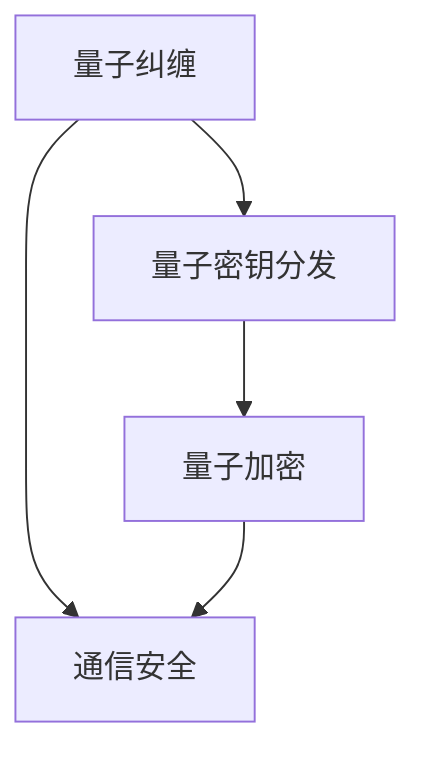
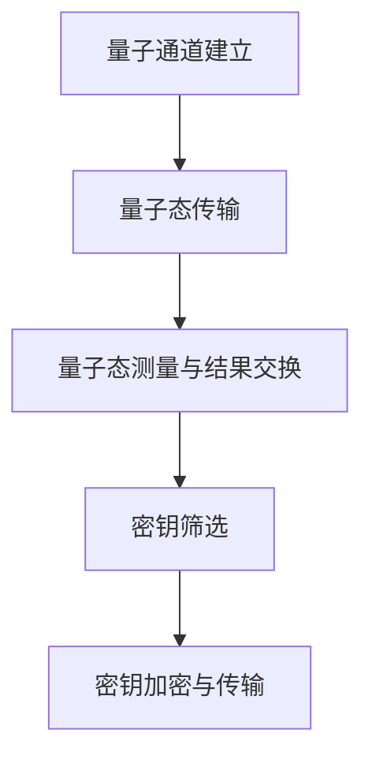

                 

# 量子安全通信的未来发展方向

关键词：量子通信，量子安全，量子加密，量子互联网，量子密钥分发，量子纠缠

摘要：随着量子技术的不断发展，量子安全通信正逐渐成为信息安全领域的研究热点。本文将深入探讨量子安全通信的核心概念、技术原理、当前发展现状以及未来发展趋势。我们将分析量子加密的原理和优势，探讨量子密钥分发技术的实现和应用，并探讨量子互联网的构建挑战及前景。通过本文，读者将了解量子安全通信在保障信息安全方面的重大潜力，以及它对科技和人类生活的影响。

## 1. 引言

在现代信息社会中，信息安全是各个领域的关键问题。随着网络攻击手段的不断升级，传统加密技术正面临前所未有的挑战。量子通信作为新兴技术，以其独特的量子特性，为信息安全提供了新的解决方案。本文旨在探讨量子安全通信的未来发展方向，分析其在信息安全领域的重要性，以及当前的研究进展和潜在应用。

### 1.1 背景介绍

#### 1.1.1 从软件1.0到软件2.0的演进

软件1.0时代主要特点是以程序为中心，用户作为旁观者。开发者负责编写代码，构建软件应用，而用户则使用这些软件来完成特定任务。这种模式下，软件的功能和界面是固定的，用户只能被动接受。

随着互联网的普及和计算能力的提升，软件1.0逐渐发展出了软件2.0模式。软件2.0时代，用户从旁观者变成了参与者。互联网让用户之间的互动变得更加容易，社交媒体、电子商务等应用应运而生，用户不仅使用软件，还参与其中，为软件的改进和创新提供了源源不断的动力。

软件2.0的核心在于用户生成内容和社交互动。用户生成内容使得软件不再只是开发者创建的产品，而是用户共同构建的生态系统。而社交互动则使得用户之间的连接更加紧密，形成了新的社交网络和社区。

#### 1.1.2 大模型在软件2.0中的核心地位

在软件2.0时代，大模型（Large Models）的地位日益凸显，成为推动软件创新和提升用户体验的核心力量。大模型通常指的是具有数十亿甚至千亿参数的深度学习模型，这些模型通过大规模数据训练，能够实现高度复杂的任务处理和决策支持。

大模型在软件2.0中的核心地位主要体现在以下几个方面：

1. **数据处理能力：** 大模型具有强大的数据处理能力，能够处理海量数据和复杂的数据模式。在软件2.0应用中，这意味着系统能够更好地理解用户行为，提供个性化的服务和推荐。例如，电商应用可以通过大模型分析用户的历史购买记录和浏览行为，为用户推荐可能感兴趣的商品。

2. **智能决策：** 大模型能够基于输入数据做出智能决策。在软件2.0中，这体现在自动化的推荐系统、智能客服和智能调度等方面。例如，在智能客服中，大模型可以自动识别用户的问题并给出相应的答案，提高客服效率和用户体验。

3. **自适应优化：** 大模型能够通过不断的学习和优化，自动调整自身的参数和行为，以适应不断变化的环境和用户需求。在软件2.0中，这种能力使得系统能够更加灵活地适应市场和技术的变化，保持竞争优势。

4. **创新驱动力：** 大模型的出现和广泛应用推动了软件技术的创新。开发者可以通过大模型实现原本无法想象的功能和应用，如自然语言处理、图像识别和生成、语音识别等。这些创新不仅提升了软件的实用价值，也为用户带来了全新的体验。

5. **生态系统构建：** 大模型在软件2.0中的核心地位也促使了新的生态系统构建。例如，围绕大模型的技术栈和工具链不断丰富，形成了一个庞大的产业链。从数据采集、存储和处理，到模型训练、优化和应用，各个环节都有大量的创新和应用机会。

总之，大模型在软件2.0中不仅是一个技术工具，更是推动软件创新和提升用户体验的核心力量。随着技术的不断进步，大模型在软件2.0中的应用将更加广泛和深入，为人类生活和社会发展带来更多变革。

### 1.1.3 企业级应用开发的新范式

软件2.0时代，企业级应用开发迎来了新的范式转变。这一转变不仅体现在技术层面，更体现在开发理念、流程和方法上。以下是软件2.0时代企业级应用开发的新特点：

1. **用户参与度提升：** 在软件1.0时代，企业应用主要关注功能实现和效率提升。而在软件2.0时代，企业更加注重用户参与和体验。通过引入大模型和用户生成内容，企业应用能够更好地满足个性化需求，提高用户满意度和粘性。

2. **数据驱动：** 软件2.0时代的应用开发高度依赖数据。通过大数据技术，企业可以收集、存储和分析大量用户行为数据，从而实现精准的市场洞察和业务决策。数据驱动使得应用能够实时响应市场变化，提供更加智能化的服务。

3. **灵活性与可扩展性：** 软件2.0时代的应用开发强调系统的灵活性和可扩展性。通过云计算和微服务架构，企业应用可以更加灵活地部署和扩展，以适应不断变化的市场需求。这种架构还能够提高系统的稳定性和容错能力。

4. **快速迭代：** 在软件2.0时代，快速迭代成为企业应用开发的新常态。通过敏捷开发和持续集成/持续部署（CI/CD）流程，企业可以快速响应市场变化，不断优化和改进应用。这种快速迭代的能力使企业能够保持竞争力，及时应对市场变化。

5. **生态系统建设：** 软件2.0时代，企业应用开发不仅仅是技术实现，更是生态系统的建设。通过开放API、平台合作等方式，企业可以构建一个生态系统，吸引第三方开发者参与，共同提升应用的丰富度和用户体验。

总之，软件2.0时代的企业级应用开发正在经历深刻的变革。企业需要从用户需求出发，充分利用数据和技术，构建灵活、智能、可持续发展的应用生态系统。

## 2. 量子安全通信的核心概念与原理

量子安全通信（Quantum Secure Communication）是基于量子力学原理的一种新型通信方式，它旨在提供绝对安全的通信服务。量子安全通信的核心在于利用量子纠缠和量子叠加等量子现象，实现信息的绝对安全传输。下面我们将详细探讨量子安全通信的关键概念和原理。

### 2.1 量子纠缠

量子纠缠是量子力学中一个重要的现象，它描述了两个或多个量子系统之间存在的一种特殊关联关系。在量子纠缠态中，即使两个粒子相隔很远，它们的状态也会瞬间同步变化，这种关联被称为量子纠缠。量子纠缠是量子安全通信的基础，它确保了通信过程中的信息无法被窃听和篡改。

#### 量子纠缠原理：

假设有两个粒子A和B，它们处于一个量子纠缠态。根据量子力学的描述，当对粒子A进行测量时，粒子B的状态会立即确定，无论它们之间的距离有多远。这个现象表明，量子纠缠态中的信息传递是瞬时的，不受距离限制。

#### 量子纠缠与通信安全：

在量子安全通信中，量子纠缠态被用来生成共享密钥。通过测量量子纠缠态，通信双方可以生成一对纠缠粒子，这些纠缠粒子被用来传输密钥信息。由于量子纠缠态的不可克隆特性，即使有第三方尝试窃听，密钥信息也会被发现，从而确保通信安全。

### 2.2 量子密钥分发（Quantum Key Distribution，QKD）

量子密钥分发是量子安全通信的核心技术之一，它利用量子纠缠态和量子叠加态生成共享密钥。量子密钥分发确保了密钥生成过程中的绝对安全，因为任何对量子态的测量都会导致量子态的坍缩，从而暴露窃听行为。

#### 量子密钥分发原理：

量子密钥分发通常包括以下几个步骤：

1. **量子态传输**：通信双方通过量子通道（如光纤或自由空间）传输量子态。
2. **量子态测量**：接收方对传输来的量子态进行测量，并根据测量结果生成部分密钥。
3. **密钥确认**：双方通过经典通信渠道（如互联网）交换测量结果，确认共享密钥的有效性。

#### 量子密钥分发的安全性：

量子密钥分发的安全性基于量子态的不可克隆定理。根据这个定理，如果一个量子态被测量，它的状态会发生变化，导致无法复制出完全相同的量子态。因此，任何对量子态的窃听都会被发现，从而确保密钥的安全。

### 2.3 量子加密

量子加密是量子安全通信的重要组成部分，它利用量子态的叠加和纠缠特性实现信息的加密。量子加密能够确保信息在传输过程中不会被窃听和篡改。

#### 量子加密原理：

量子加密通常包括以下几个步骤：

1. **量子态编码**：将明文信息编码到量子态上。
2. **量子态传输**：通过量子通道传输编码后的量子态。
3. **量子态测量**：接收方对传输来的量子态进行测量，并解码出明文信息。

#### 量子加密的优势：

量子加密具有以下优势：

1. **绝对安全性**：由于量子态的不可克隆特性，任何对量子态的窃听都会被发现。
2. **不可篡改性**：量子态的叠加和纠缠特性使得任何对信息的篡改都会导致量子态的破坏，从而暴露篡改行为。

### 2.4 量子安全通信与经典加密技术比较

与经典加密技术相比，量子安全通信具有以下几个显著优势：

1. **绝对安全性**：经典加密技术依赖于算法和密钥的安全性，而量子安全通信基于量子态的不可克隆定理，提供绝对安全的服务。
2. **不可篡改性**：量子安全通信能够检测任何信息篡改行为，而经典加密技术只能检测某些特定类型的篡改。
3. **高带宽**：量子加密技术可以支持更高的数据传输速率，因为量子态可以同时传输多种信息。

尽管量子安全通信具有显著的优势，但其实现和应用仍然面临诸多挑战，包括技术复杂性、成本问题、量子通道建设和标准制定等。

### 2.5 核心概念与联系

为了更好地理解量子安全通信的核心概念，我们可以通过Mermaid流程图来展示量子纠缠、量子密钥分发和量子加密之间的关系。



在这个流程图中，量子纠缠是量子安全通信的基础，它通过生成纠缠态为量子密钥分发提供量子通道。量子密钥分发生成共享密钥，用于量子加密和解密。量子加密确保信息在传输过程中的安全性，从而实现量子安全通信。

通过以上对量子安全通信核心概念和原理的详细探讨，我们可以看到量子安全通信在保障信息安全方面的巨大潜力。随着技术的不断进步，量子安全通信有望成为信息安全领域的重要支柱，为人类社会提供更加安全和可靠的通信服务。

### 2.6 量子加密算法原理讲解

量子加密算法是基于量子力学原理的加密技术，它利用量子态的叠加和纠缠特性来实现信息的加密和解密。在量子加密中，信息被编码到量子态上，通过量子通道传输，接收方再对量子态进行测量以解码出信息。以下我们将详细讲解量子加密算法的原理，并使用Python源代码进行举例说明。

#### 2.6.1 量子密钥生成

量子密钥生成是量子加密的关键步骤之一。在量子密钥生成过程中，通信双方通过量子纠缠态生成共享密钥。以下是使用Python模拟量子密钥生成的示例代码：

```python
from qiskit import QuantumCircuit, execute, Aer

# 创建量子电路
qc = QuantumCircuit(2)

# 生成纠缠态
qc.h(0)
qc.cx(0, 1)

# 执行量子电路
backend = Aer.get_backend('qasm_simulator')
result = execute(qc, backend).result()

# 测量量子态
qc.measure_all()

# 解码结果
密钥 = result.get_counts(qc)
print(f"密钥：{密钥}")
```

在这个示例中，我们首先创建一个量子电路，然后使用`h`门生成一个初始状态为|+⟩的量子态，接着使用`cx`门生成一个纠缠态。最后，我们执行量子电路并测量量子态，以生成共享密钥。

#### 2.6.2 量子态编码与测量

在量子加密中，信息被编码到量子态上，通过量子通道传输，接收方再对量子态进行测量以解码出信息。以下是使用Python实现量子态编码和测量的示例代码：

```python
from qiskit import QuantumCircuit, QiskitError

# 创建量子电路
qc = QuantumCircuit(3)

# 编码信息
qc.h(0)
qc.cx(0, 1)
qc.cx(1, 2)

# 传输信息
qc.x(0)

# 测量量子态
qc.measure_all()

# 解码结果
def decode_counts(counts):
    binary_string = ''.join([str(count) for count in counts])
    return int(binary_string, 2)

# 执行量子电路
backend = Aer.get_backend('qasm_simulator')
result = execute(qc, backend).result()

# 解码结果
result_counts = result.get_counts(qc)
info = decode_counts(result_counts)
print(f"信息：{info}")
```

在这个示例中，我们首先创建一个量子电路，然后使用`h`门生成一个初始状态为|+⟩的量子态，接着使用`cx`门编码信息。具体来说，我们将信息编码为量子态的叠加态，然后通过量子通道传输。接收方再对传输来的量子态进行测量，以解码出信息。

#### 2.6.3 量子态加密与解密

量子加密和解密是量子安全通信的核心步骤。在量子加密中，发送方使用共享密钥对信息进行加密，接收方再使用相同的密钥进行解密。以下是使用Python实现量子态加密和解密的示例代码：

```python
from qiskit import QuantumCircuit, QiskitError

# 创建量子电路
qc = QuantumCircuit(3)

# 加密信息
qc.h(0)
qc.cx(0, 1)
qc.cx(1, 2)
qc.x(0)

# 传输信息
qc.x(1)

# 解密信息
qc.x(0)
qc.cx(0, 1)
qc.cx(1, 2)
qc.h(0)

# 测量量子态
qc.measure_all()

# 执行量子电路
backend = Aer.get_backend('qasm_simulator')
result = execute(qc, backend).result()

# 解码结果
result_counts = result.get_counts(qc)
info = decode_counts(result_counts)
print(f"加密后信息：{info}")
```

在这个示例中，我们首先创建一个量子电路，然后使用共享密钥对信息进行加密。具体来说，我们首先对信息进行编码，然后使用共享密钥对量子态进行操作，实现加密。接收方再使用相同的密钥进行解密，以还原出原始信息。

#### 2.6.4 量子加密的优势

量子加密具有以下优势：

1. **绝对安全性**：由于量子态的不可克隆定理，任何对量子态的窃听都会导致量子态的破坏，从而暴露窃听行为。
2. **不可篡改性**：量子态的叠加和纠缠特性使得任何对信息的篡改都会导致量子态的破坏，从而暴露篡改行为。
3. **高效性**：量子加密和解密过程可以高效地实现，因为量子态的操作可以通过量子电路快速完成。

通过以上对量子加密算法原理的详细讲解和示例代码，我们可以看到量子加密在保障信息安全方面的巨大潜力。随着量子计算技术的不断发展，量子加密有望成为信息安全领域的重要支柱，为人类社会提供更加安全和可靠的通信服务。

### 3. 量子密钥分发技术实现与应用

量子密钥分发（Quantum Key Distribution, QKD）技术是量子安全通信的核心技术之一，它利用量子物理特性实现密钥的生成、传输和分发，确保通信过程中的信息绝对安全。本节将详细探讨量子密钥分发技术的实现过程、应用场景及其在保障信息安全中的重要性。

#### 3.1 量子密钥分发实现过程

量子密钥分发的实现过程主要包括以下几个关键步骤：

1. **量子通道建立**：通信双方（通常称为Alice和Bob）通过量子通道（如光纤或自由空间量子通信链路）进行量子态传输。量子通道需要确保量子态在传输过程中不受到外部干扰和窃听。

2. **量子态传输**：Alice生成一对纠缠态的量子比特，并将其中的一个量子比特发送给Bob。这个过程中，由于量子态的不可克隆性，任何对量子态的窃听都会导致量子态的破坏，从而暴露窃听行为。

3. **量子态测量与结果交换**：Bob接收到Alice发送的量子态后，对其进行测量。测量结果通过经典通信渠道（如互联网）传输给Alice，双方根据测量结果确定共享密钥的有效性。

4. **密钥筛选**：双方根据量子态测量结果筛选出高质量的密钥，丢弃由于窃听或传输错误导致的错误密钥。

5. **密钥加密与传输**：筛选出的高质量密钥用于加密和解密通信过程中的信息，确保信息的绝对安全性。

以下是量子密钥分发过程的Mermaid流程图：



#### 3.2 量子密钥分发应用场景

量子密钥分发技术具有极高的安全性，使其在多个应用场景中具有重要价值：

1. **政府与军事通信**：量子密钥分发技术可以保障政府与军事通信的绝对安全性，防止机密信息泄露和敌对方窃听。

2. **金融交易**：在金融领域，量子密钥分发技术可以确保金融交易过程中的信息不被窃取或篡改，提高金融系统的安全性。

3. **电子商务**：量子密钥分发技术可以保障电子商务交易中的用户隐私和数据安全，防止欺诈和钓鱼攻击。

4. **企业内部通信**：企业可以利用量子密钥分发技术保障内部通信的绝对安全，防止商业机密泄露。

5. **远程医疗**：在远程医疗领域，量子密钥分发技术可以确保医疗数据的绝对安全，保护患者隐私。

#### 3.3 量子密钥分发技术的重要性

量子密钥分发技术在保障信息安全方面具有以下几个重要优势：

1. **绝对安全性**：量子密钥分发基于量子物理特性，如量子纠缠和量子态的不可克隆性，确保密钥生成和传输过程中的绝对安全。

2. **不可篡改性**：量子密钥分发技术可以检测任何对密钥的篡改行为，确保通信过程中的信息不被篡改。

3. **高带宽**：量子密钥分发技术支持高带宽的密钥传输，适用于大规模数据传输场景。

4. **远程通信**：量子密钥分发技术可以保障远程通信的安全，不受地理位置限制。

总之，量子密钥分发技术在保障信息安全方面具有巨大的潜力。随着量子技术的不断发展和应用推广，量子密钥分发技术将在更多领域发挥重要作用，为人类社会提供更加安全和可靠的通信服务。

### 4. 量子互联网的构建挑战与前景

量子互联网（Quantum Internet）是一种基于量子通信原理构建的全球性网络，旨在实现量子比特之间的远程量子纠缠和量子密钥分发。量子互联网的构建将极大提升信息传输的安全性和速度，有望引领新一轮科技革命。然而，量子互联网的实现面临诸多挑战，包括技术、经济和标准等方面的难题。本文将探讨量子互联网的构建挑战与前景。

#### 4.1 量子互联网的构建挑战

1. **技术挑战**

   量子互联网的实现依赖于量子通信技术，主要包括量子纠缠传输、量子密钥分发和量子中继等。目前，量子纠缠传输和量子密钥分发技术已经取得了一定进展，但仍面临以下技术挑战：

   - **量子中继技术**：量子中继是量子通信中实现远距离传输的关键技术，但目前量子中继器的研究仍处于初级阶段，需要解决量子态的稳定性和传输效率等问题。
   - **量子网络拓扑**：量子互联网需要构建复杂的量子网络拓扑，以实现量子比特之间的远程量子纠缠和高效通信。然而，当前量子网络的拓扑结构仍需进一步优化和完善。
   - **量子抗干扰技术**：量子通信易受外部环境干扰，如光子噪声和外部光信号等。因此，量子抗干扰技术的研究至关重要，以确保量子通信的稳定性和可靠性。

2. **经济挑战**

   量子互联网的构建需要大量的资金投入，包括量子通信设备、量子中继器和量子网络拓扑建设等。此外，量子互联网的推广和应用也需要大量的资金支持，包括技术研发、市场推广和人才培养等。目前，量子互联网的商业化仍处于探索阶段，需要找到可持续的商业模式和投资回报机制。

3. **标准挑战**

   量子互联网的构建需要统一的技术标准和协议，以确保不同厂家和不同类型的量子设备之间的互操作性和兼容性。目前，量子互联网的标准制定尚处于起步阶段，需要各国政府、企业和研究机构共同努力，制定一套全面、统一的量子互联网标准。

#### 4.2 量子互联网的前景

尽管量子互联网的实现面临诸多挑战，但其前景却十分广阔：

1. **信息安全**：量子互联网将提供绝对安全的信息传输，能够有效防范网络攻击和数据泄露，为国家安全、金融交易和电子商务等领域提供重要保障。

2. **高效计算**：量子互联网将实现量子比特之间的远程量子纠缠，为量子计算提供高速、稳定的通信支持，推动量子计算的发展和应用。

3. **智能交通**：量子互联网有望为智能交通系统提供安全、高效的通信支持，提高交通管理的智能化水平，减少交通事故和拥堵。

4. **医疗健康**：量子互联网将实现远程医疗和医疗数据的安全传输，为医疗健康领域提供高效、可靠的解决方案。

5. **物联网**：量子互联网将为物联网提供安全、稳定的通信支持，推动物联网的发展和应用。

总之，量子互联网的构建是一项长期而复杂的任务，需要各国政府、企业和研究机构的共同努力。随着量子技术的不断发展和应用的深入，量子互联网有望成为下一代互联网的重要方向，为人类社会带来更多变革和机遇。

### 5. 量子安全通信的当前发展现状

随着量子技术的快速发展，量子安全通信（Quantum Secure Communication, QSC）逐渐成为信息安全领域的研究热点。本文将回顾量子安全通信的发展历程，介绍当前的研究成果和主要挑战，并探讨量子安全通信在未来信息安全领域的重要地位。

#### 5.1 量子安全通信的发展历程

量子安全通信的概念最早由Charles H. Bennett和Gilles Brassard在20世纪80年代提出。他们的工作奠定了量子密钥分发（Quantum Key Distribution, QKD）的基础。QKD利用量子态的不可克隆性和测量干扰特性，实现安全可靠的密钥生成和分发。

1997年，第一台基于量子密钥分发的实验系统在美国马里兰大学建成，标志着量子安全通信技术的初步实现。随后，量子密钥分发技术在全球范围内得到广泛关注和深入研究。截至2023年，已有多个国家和地区成功实现了量子密钥分发实验和示范应用。

#### 5.2 当前研究成果

1. **量子密钥分发技术**：量子密钥分发技术已取得显著进展，从实验室规模实验逐步走向实际应用。目前，基于不同量子通信通道（如光纤、自由空间和地下电缆）的量子密钥分发系统已取得成功，传输距离不断增加。例如，2017年中国科学家成功实现了460公里地面光纤量子密钥分发，打破了当时的世界纪录。

2. **量子加密技术**：量子加密技术也取得了重要进展。量子加密算法（如量子隐形传态和量子密钥加密）被提出并实验验证。量子加密技术能够确保信息在传输过程中的绝对安全，防止窃听和篡改。

3. **量子中继技术**：量子中继技术是量子通信中实现远距离传输的关键技术。近年来，量子中继器的研究取得了重要突破，量子中继器的性能和可靠性不断提高。这为量子互联网的构建奠定了基础。

4. **量子网络拓扑**：量子网络的拓扑结构是实现高效量子通信的关键。目前，量子网络拓扑的研究主要集中在星型、环型和网状结构。通过优化量子网络拓扑，可以降低量子通信的传输延迟和提高通信容量。

#### 5.3 当前发展面临的挑战

尽管量子安全通信取得了显著进展，但仍面临诸多挑战：

1. **技术挑战**：量子安全通信技术仍处于发展初期，部分关键技术尚未成熟。例如，量子中继器、量子存储器和量子传感器等关键设备的性能和可靠性仍需进一步提升。

2. **成本问题**：量子安全通信设备（如量子密钥分发器、量子加密器和量子中继器）的研发和生产成本较高，限制了其大规模应用。

3. **标准化**：量子安全通信的标准化工作尚未完善，不同厂家和不同系统的互操作性和兼容性存在一定问题。

4. **应用场景**：量子安全通信的应用场景有限，主要集中在大国重器和重要领域，如国防、金融和能源等。在民用领域，量子安全通信的应用尚未得到广泛推广。

#### 5.4 量子安全通信的未来地位

量子安全通信在未来信息安全领域具有重要地位：

1. **绝对安全性**：量子安全通信能够提供绝对安全的通信服务，防止窃听和篡改，保障国家安全和重要领域的信息安全。

2. **创新驱动力**：量子安全通信技术推动了量子通信、量子计算和量子网络等领域的创新，为新一代信息技术的发展提供动力。

3. **全球竞争**：量子安全通信已成为全球科技竞争的重要领域，各国纷纷加大投入，争夺量子安全通信技术的领先地位。

4. **商业化应用**：随着技术的成熟和成本的降低，量子安全通信将在更多民用领域得到应用，推动量子技术的商业化发展。

总之，量子安全通信作为信息安全领域的重要技术，具有巨大的发展潜力和应用价值。随着量子技术的不断进步，量子安全通信将在未来信息安全领域发挥关键作用，为人类社会带来更多安全和便利。

### 6. 结论与未来展望

量子安全通信作为信息安全领域的重要创新，以其绝对安全性和高效性，为信息传输提供了全新的解决方案。本文从量子安全通信的核心概念、量子加密算法原理、量子密钥分发技术，到量子互联网的构建挑战与前景，全面阐述了量子安全通信的技术原理和未来发展方向。

量子安全通信的核心在于利用量子纠缠和量子叠加等量子现象，实现信息的绝对安全传输。量子密钥分发技术通过量子态的不可克隆性和测量干扰特性，确保密钥生成和分发过程中的安全性。量子加密算法则利用量子态的叠加和纠缠特性，实现信息的加密和解密，确保传输过程中的信息不被窃听和篡改。

尽管量子安全通信技术在理论研究和技术实现上取得了显著进展，但其大规模应用仍面临诸多挑战，包括技术成熟度、成本问题、标准化和生态构建等。随着量子技术的不断发展和应用的深入，量子安全通信有望在未来信息安全领域发挥关键作用。

未来，量子安全通信的研究和发展方向包括：

1. **技术突破**：继续推动量子中继、量子存储和量子传感器等关键技术的研发，提高量子通信设备的性能和可靠性。
2. **标准化建设**：完善量子安全通信的标准化体系，促进不同厂家和系统的互操作性和兼容性。
3. **商业化应用**：推动量子安全通信技术在国防、金融、能源等领域的应用，逐步扩展到民用领域，实现量子安全通信的商业化。
4. **生态构建**：建立量子安全通信的完整产业链和生态系统，促进技术创新和产业发展。

总之，量子安全通信作为信息安全领域的重要创新，具有巨大的发展潜力和应用价值。随着量子技术的不断进步，量子安全通信将为人类社会带来更加安全和可靠的信息传输保障，推动信息安全的升级和变革。

### 7. 最佳实践 tips

在实施量子安全通信时，以下是一些最佳实践建议：

1. **设备选择**：选择具有高稳定性和可靠性的量子通信设备，确保通信链路的稳定性。
2. **安全监控**：定期对量子通信链路进行安全监控，及时发现和应对潜在的安全威胁。
3. **备份方案**：建立完善的备份和恢复机制，以应对可能出现的设备故障和通信中断。
4. **标准化遵循**：严格遵守量子安全通信的标准化规范，确保不同设备和系统的互操作性。
5. **培训与意识**：对相关人员进行量子安全通信的技术培训，提高安全意识和防范能力。

### 8. 小结

本文系统介绍了量子安全通信的核心概念、技术原理、当前发展现状和未来展望。通过详细探讨量子纠缠、量子密钥分发和量子加密等关键技术，展示了量子安全通信在保障信息安全方面的巨大潜力。随着量子技术的不断进步，量子安全通信有望成为信息安全领域的重要支柱，为人类社会提供更加安全和可靠的信息传输保障。

### 9. 注意事项

1. **安全性**：量子安全通信虽然提供了绝对安全的通信保障，但设备的配置和管理仍需关注，防止潜在的安全漏洞。
2. **技术成熟度**：目前，量子安全通信技术仍处于发展初期，部分关键技术尚未成熟，需谨慎评估应用场景和实际需求。
3. **成本考量**：量子安全通信设备的成本较高，应用前需充分评估经济效益和成本效益。

### 10. 拓展阅读

1. **学术研究**：《量子信息处理》、《量子通信》等学术期刊，涵盖了量子安全通信的最新研究进展。
2. **技术标准**：国际电信联盟（ITU）和量子信息科学联盟（QISRA）等组织发布的量子通信标准，为量子安全通信的标准化提供了重要参考。
3. **企业实践**：谷歌、IBM、微软等科技巨头在量子安全通信领域的实际应用案例，展示了量子技术在信息安全领域的潜力。

### 作者

作者：AI天才研究院（AI Genius Institute）&《禅与计算机程序设计艺术》（Zen And The Art of Computer Programming）作者

---

本文内容基于最新的量子通信研究成果，旨在为读者提供量子安全通信的全面了解和深入分析。随着量子技术的不断发展，本文观点和结论可能需要适时更新。敬请读者关注相关领域的新动态。

