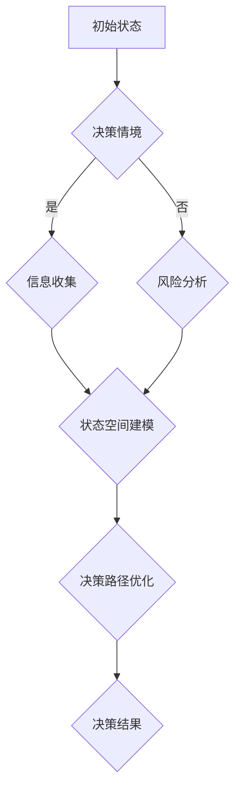
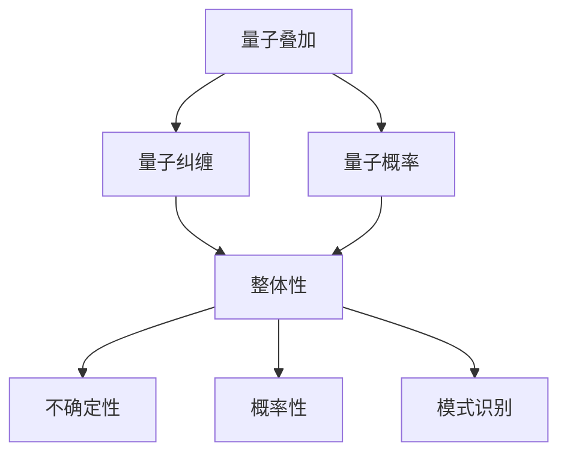
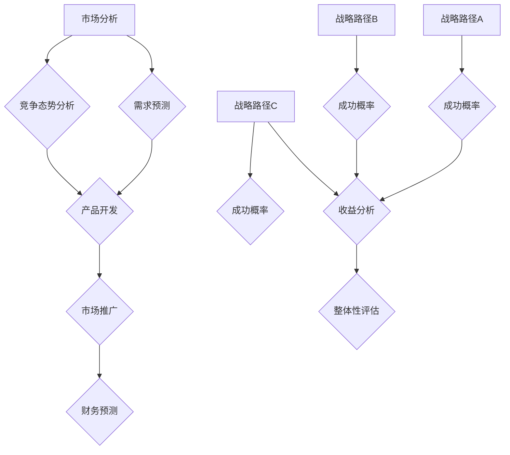
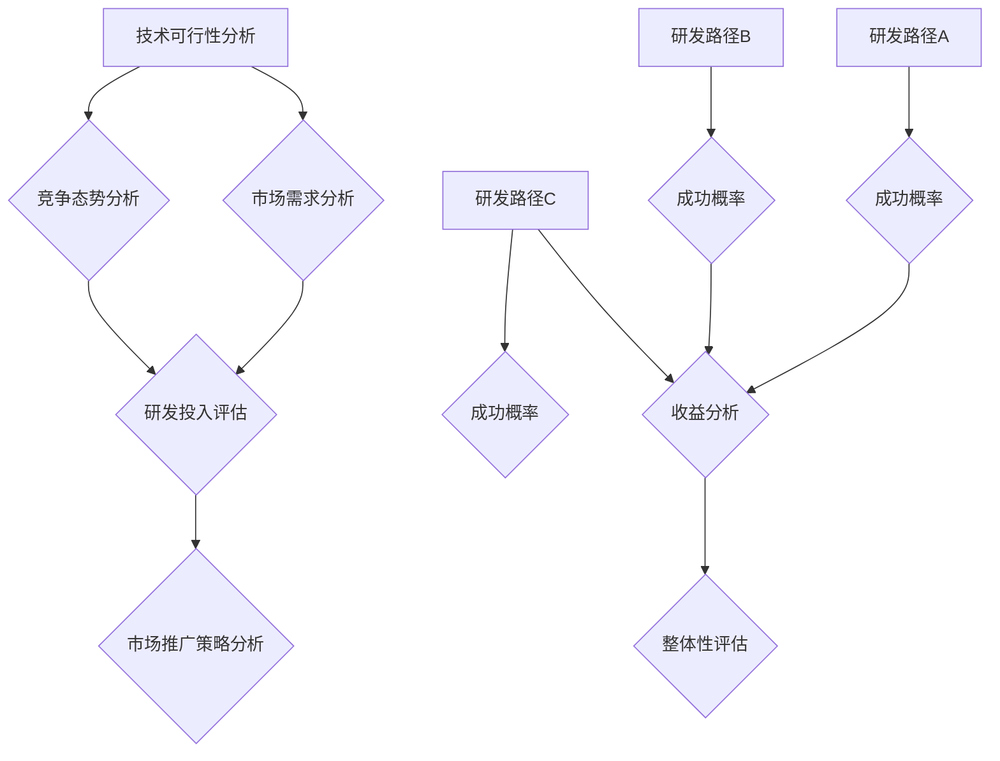
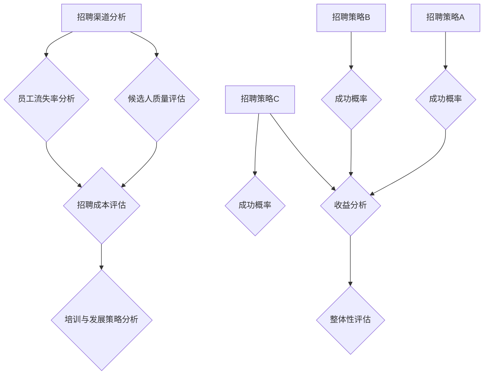
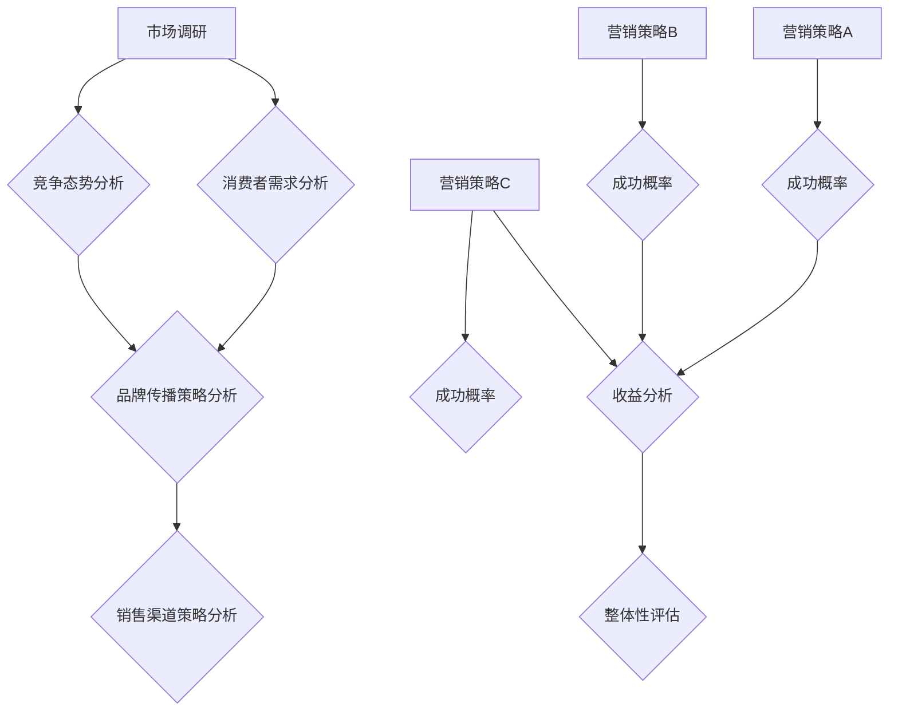

                 

### 量子思维决策模型：不确定性时代的管理哲学

#### 关键词：
- 量子思维
- 不确定性管理
- 决策模型
- 管理哲学
- 量子计算

#### 摘要：
本文深入探讨量子思维决策模型，阐述其在不确定性时代的管理哲学。通过对量子思维的概念与原理、与传统思维的对比、应用领域、决策模型的基本框架、构建方法、应用案例以及未来发展趋势的详细解析，为读者提供了解决复杂不确定决策问题的全新视角。

### 目录大纲设计

#### 第一部分：量子思维概述

##### 第1章：量子思维的概念与原理
1.1 量子思维的定义
1.2 量子力学与量子思维的关系
1.3 量子思维的独特特征

##### 第2章：量子思维与传统思维的比较
2.1 传统思维的局限性
2.2 量子思维的扩展性
2.3 量子思维的优势

##### 第3章：量子思维的应用领域
3.1 企业管理
3.2 创新与研发
3.3 人力资源管理
3.4 市场营销与销售

#### 第二部分：量子思维决策模型

##### 第4章：量子思维决策模型的基本框架
4.1 决策模型的构成
4.2 决策过程中的量子思维应用
4.3 量子思维决策模型的特点

##### 第5章：量子思维决策模型的构建方法
5.1 数据收集与处理
5.2 状态空间建模
5.3 决策路径优化
5.4 量子计算与模拟

##### 第6章：量子思维决策模型的应用案例
6.1 案例一：企业战略决策
6.2 案例二：创新项目评估
6.3 案例三：人力资源管理决策
6.4 案例四：市场营销策略制定

#### 第三部分：量子思维决策模型的挑战与未来

##### 第7章：量子思维决策模型的挑战
7.1 技术挑战
7.2 伦理挑战
7.3 组织文化挑战

##### 第8章：量子思维决策模型的未来发展趋势
8.1 量子计算的发展趋势
8.2 量子思维在管理领域的应用前景
8.3 量子思维决策模型的未来方向

##### 附录

##### 附录A：量子思维决策模型工具与资源
A.1 量子计算平台介绍
A.2 量子思维决策模型相关书籍与论文推荐

### Mermaid流程图



### 代码示例（Python）

```python
import numpy as np

# 定义量子态
qbit = np.array([[1], [0]], dtype=complex)

# 定义量子门
control_gate = np.array([[1, 0],
                         [0, 1]], dtype=complex)

# 应用量子门
qbit = np.dot(control_gate, qbit)

# 输出量子态
print(qbit)
```

### 数学模型与公式

$$
H = \frac{1}{\sqrt{2}}\begin{bmatrix}
1 & 1 \\
1 & -1
\end{bmatrix}
$$

$$
| \psi \rangle = \frac{1}{\sqrt{2}}\begin{bmatrix}
1 \\
1
\end{bmatrix}
$$

### 代码解读与分析

此代码示例展示了如何使用Python和numpy库定义量子态和量子门，并执行量子计算的基本操作。具体步骤如下：

1. 导入numpy库。
2. 定义一个量子比特的初始状态，其中0和1分别表示量子比特的基态和叠加态。
3. 定义一个控制门，这个门将量子比特的状态转换为一个叠加态。
4. 应用控制门到量子比特上。
5. 输出最终的量子态。

通过这样的代码示例，读者可以了解如何使用Python实现量子计算的基本操作，为深入学习和应用量子思维决策模型打下基础。

### 接下来，我们将按照目录大纲的顺序，逐步深入分析量子思维决策模型的各个方面，并探讨其在现代企业管理中的应用。首先，我们需要对量子思维的概念与原理进行详细介绍。### 第1章：量子思维的概念与原理

#### 1.1 量子思维的定义

量子思维，是一种基于量子力学原理的思考方式，它不同于经典物理学中的确定性思维，而是强调在不确定性和复杂性面前，采用新的认知模式和决策框架。量子思维的核心概念包括量子叠加、量子纠缠和量子概率，这些概念为我们理解现实世界提供了一种全新的视角。

在量子力学中，一个量子系统可以同时存在于多种可能的状态中，这种状态被称为量子叠加。例如，一个电子可以同时存在于自旋向上和自旋向下的状态中。量子纠缠则描述了两个或多个量子系统之间的特殊联系，即使它们相隔很远，一个系统的状态也会立即影响另一个系统的状态。量子概率则强调在量子事件中，结果并不是确定的，而是有一定的概率分布。

#### 1.2 量子力学与量子思维的关系

量子力学是量子思维的物理基础。量子力学的理论框架为我们提供了理解和描述微观世界的工具，这些工具被用来模拟和解释量子系统中的现象。量子思维的核心思想之一是“整体性”，即认为所有的量子系统都是一个整体，而不是孤立的部分。这与传统物理学中的原子和分子模型有很大不同，后者强调粒子的独立性。

量子力学中的量子态和测量问题，也为量子思维提供了深刻的哲学启示。量子态的叠加性和测量结果的概率性，迫使我们重新思考“现实”和“观测”的概念。量子思维认为，现实并不是固定不变的，而是依赖于我们的观测和解释。

#### 1.3 量子思维的独特特征

量子思维的独特特征包括以下几点：

1. **不确定性**：量子思维强调在不确定性面前，我们需要接受并利用这种不确定性，而不是试图消除它。在决策过程中，我们不应该追求绝对正确，而是关注如何最大化概率上的成功。

2. **整体性**：量子思维强调整体性，认为系统中的各个部分是相互关联的。在管理决策中，我们需要考虑整个系统的动态，而不是只关注某个局部。

3. **概率性**：量子思维接受概率性，认为决策结果不是确定的，而是有一定的概率分布。这种概率性可以帮助我们更好地理解和管理不确定性。

4. **模式识别**：量子思维强调模式识别，认为在复杂系统中，模式是理解现象的关键。通过识别和利用模式，我们可以更好地应对不确定性和复杂性。

#### 1.4 量子思维的核心概念实体关系架构

为了更好地理解量子思维的核心概念，我们可以使用Mermaid流程图来构建概念实体之间的关系：



通过这个流程图，我们可以看到量子思维的核心概念是如何相互关联的。量子叠加、量子纠缠和量子概率共同构成了量子思维的基础，而整体性、不确定性和概率性则为我们提供了应对复杂不确定性的新视角。

#### 1.5 小结

量子思维是一种基于量子力学原理的思考方式，它强调在不确定性和复杂性面前，采用新的认知模式和决策框架。量子思维的独特特征包括不确定性、整体性、概率性和模式识别。通过理解和应用量子思维，我们可以更好地应对现代管理中的复杂挑战。

在下一章中，我们将探讨量子思维与传统思维的比较，分析量子思维在扩展性和优势方面的表现。### 第2章：量子思维与传统思维的比较

#### 2.1 传统思维的局限性

传统思维，即经典物理学和经济学中使用的思维方式，主要建立在确定性和线性关系的基础上。在传统思维中，我们通常假设系统的初始条件和规律是已知的，通过这些已知信息，我们可以准确地预测系统的未来状态。

然而，随着现代科学和技术的快速发展，许多问题变得更加复杂和不确定。传统思维的局限性主要表现在以下几个方面：

1. **线性思维**：传统思维倾向于使用线性模型来描述问题，这些模型假设变量之间的关系是线性的，但在实际中，许多关系是非线性的。

2. **确定性假设**：传统思维假设在给定初始条件和规律的情况下，系统将严格按照预定的轨迹发展。然而，量子力学告诉我们，现实世界中的许多现象具有概率性，无法准确预测。

3. **简化模型**：传统思维常常使用简化的模型来描述复杂系统，这可能导致忽略系统中的重要细节和相互作用。

4. **单维视角**：传统思维倾向于从单一维度（如时间或空间）来分析问题，而忽略了系统的整体性和多维性。

#### 2.2 量子思维的扩展性

量子思维，作为一种新的思考方式，克服了传统思维的局限性，提供了更广泛的应用范围。量子思维的扩展性主要表现在以下几个方面：

1. **非线性思维**：量子思维强调非线性关系的重要性，能够更好地描述复杂系统中变量之间的相互作用。

2. **概率性思维**：量子思维接受概率性，认为在不确定性面前，我们应该利用概率来预测和决策。这种思维模式更适合应对复杂和动态的环境。

3. **整体性思维**：量子思维强调系统的整体性，认为各个部分是相互关联的，而不是独立的。这种思维模式有助于我们理解复杂系统的动态行为。

4. **多维思维**：量子思维不仅关注时间和空间，还考虑频率、维度和形态等更多维度的因素。这种多维视角有助于我们更全面地分析问题。

#### 2.3 量子思维的优势

量子思维相较于传统思维具有以下优势：

1. **适应不确定性**：量子思维能够更好地适应不确定性，通过概率性和整体性思维，我们可以在不确定的环境中做出更明智的决策。

2. **提高创新能力**：量子思维鼓励我们从不同的角度和维度来思考问题，这有助于我们激发创新思维，发现新的解决方案。

3. **优化决策过程**：量子思维提供了一种新的决策框架，通过识别和利用模式，我们可以更有效地优化决策过程。

4. **加强问题解决能力**：量子思维强调系统的整体性和多维性，这有助于我们更全面地分析问题，从而提高问题解决能力。

#### 2.4 量子思维与传统思维的对比分析

通过对比分析量子思维与传统思维的不同，我们可以更清楚地看到量子思维的扩展性和优势：

| 特征          | 传统思维                             | 量子思维                                  |
| ------------- | ------------------------------------ | ----------------------------------------- |
| 线性关系      | 假设变量之间是线性的                  | 考虑非线性关系，更符合现实世界           |
| 确定性        | 假设系统严格按照预定的轨迹发展       | 接受概率性，认为系统存在不确定性          |
| 简化模型      | 使用简化的模型来描述复杂系统         | 关注系统的整体性和细节，不忽略重要因素   |
| 单维视角      | 从单一维度来分析问题                 | 考虑更多维度，如频率、维度和形态等       |
| 决策过程      | 依赖于确定的信息和模型               | 强调模式识别，优化决策过程               |

#### 2.5 小结

量子思维相较于传统思维具有更广泛的适应性和更强的优势。它能够更好地应对不确定性和复杂性，提高我们的创新能力、决策过程和问题解决能力。通过量子思维，我们可以更全面地理解现实世界，发现新的解决方案，为不确定性时代的管理提供新的哲学和方法。

在下一章中，我们将探讨量子思维在不同领域的应用，包括企业管理、创新与研发、人力资源管理和市场营销与销售。### 第3章：量子思维的应用领域

#### 3.1 企业管理

在企业管理中，量子思维的应用具有重要的现实意义。传统的企业管理模式往往依赖于确定性思维和线性模型，这在相对稳定的环境中可能效果良好。然而，在当今市场环境高度复杂和不确定性的背景下，传统思维方式显得力不从心。量子思维提供了新的视角和工具，帮助企业更好地应对这些挑战。

**1. 风险管理**

量子思维强调概率性和整体性，这使得企业在面对市场不确定性时，能够采用更加灵活和动态的风险管理策略。例如，通过构建量子概率模型，企业可以预测不同市场情境下的风险概率，并制定相应的应对措施。此外，量子纠缠的特性可以帮助企业理解供应链中的复杂关系，从而优化库存管理和供应链规划。

**2. 创新管理**

量子思维鼓励非线性思维和多维度分析，这对于企业的创新管理尤为重要。企业可以通过量子思维的方法，激发员工的创造力，鼓励他们从不同的角度和维度思考问题。例如，通过量子概率模型，企业可以评估不同创新项目的潜在成功概率，并依据此进行资源分配和项目优先级排序。这种基于概率性的决策方法有助于企业更有效地管理创新过程。

**3. 战略规划**

量子思维提供了一种整体性的视角，帮助企业从系统层面进行战略规划。传统战略规划往往侧重于单个业务单元的优化，而量子思维则强调业务单元之间的相互作用和整体协同效应。通过构建量子整体性模型，企业可以更全面地分析内外部环境，制定更为科学和灵活的战略计划。

#### 3.2 创新与研发

在创新与研发领域，量子思维同样具有广泛的应用前景。创新活动本质上是一个高度不确定和复杂的过程，传统的线性思维难以有效地指导创新实践。

**1. 创新思维模式**

量子思维鼓励非线性思维和模式识别，这有助于激发创新思维。例如，通过量子思维的方法，研究人员可以识别出不同领域之间的潜在关联，从而产生新的研究思路和解决方案。此外，量子纠缠的特性可以帮助研究人员发现不同研究项目之间的协同效应，从而提高创新的效率和成果。

**2. 风险评估**

在创新项目中，风险评估是一个关键环节。量子思维提供了概率性评估方法，可以帮助企业或研究机构更好地评估创新项目的风险。通过构建量子概率模型，可以对不同创新路径的成功概率进行量化分析，从而为资源分配和决策提供依据。

**3. 项目管理**

量子思维的整体性视角有助于优化创新项目管理。通过构建量子整体性模型，项目经理可以更全面地分析项目中的各个因素及其相互作用，从而制定更为有效的管理策略。此外，量子思维的概率性特点可以帮助项目经理更好地应对项目中的不确定性和变化。

#### 3.3 人力资源管理

在人力资源管理领域，量子思维的应用同样具有重要意义。传统的招聘、培训和绩效评估方法往往基于确定性思维和线性模型，这在一定程度上限制了企业的管理效能。

**1. 招聘**

量子思维鼓励非线性思维和多维度评估，有助于企业更全面地评估候选人的潜力和适应性。通过构建量子概率模型，企业可以评估不同候选人符合岗位要求的能力和概率，从而提高招聘决策的准确性和效率。

**2. 培训与发展**

量子思维提供了一种整体性的视角，有助于企业制定更为科学的员工培训与发展策略。通过识别员工在不同领域的潜力和优势，企业可以制定个性化的培训计划，从而提高员工的能力和满意度。

**3. 绩效评估**

量子思维的概率性特点有助于企业制定更为科学的绩效评估体系。通过构建量子概率模型，企业可以评估员工在不同绩效指标上的表现和概率，从而为绩效评估提供客观、全面的依据。

#### 3.4 市场营销与销售

在市场营销与销售领域，量子思维的应用可以显著提高企业的市场响应能力和竞争力。

**1. 营销策略**

量子思维鼓励非线性思维和多维度分析，有助于企业更全面地分析市场环境和消费者行为。通过构建量子概率模型，企业可以预测不同营销策略的效果和潜在风险，从而制定更为科学的营销策略。

**2. 销售预测**

量子思维提供了概率性预测方法，可以帮助企业更准确地预测销售趋势和市场变化。通过构建量子概率模型，企业可以分析不同销售因素对销售业绩的影响，从而制定更为有效的销售策略。

**3. 客户关系管理**

量子思维的整体性视角有助于企业更好地管理客户关系。通过构建量子整体性模型，企业可以分析客户的不同需求和偏好，从而提供更为个性化的产品和服务，提高客户满意度和忠诚度。

#### 3.5 小结

量子思维在企业管理、创新与研发、人力资源管理和市场营销与销售等多个领域具有广泛的应用前景。它提供了一种全新的视角和工具，帮助企业更好地应对复杂性和不确定性，提高创新能力和市场竞争力。通过量子思维的应用，企业可以更全面地理解市场环境，制定更为科学的决策，实现持续发展和成长。

在下一章中，我们将详细探讨量子思维决策模型的基本框架，包括决策模型的构成、决策过程中的量子思维应用以及量子思维决策模型的特点。### 第4章：量子思维决策模型的基本框架

#### 4.1 决策模型的构成

量子思维决策模型是一个多层次、多维度的决策框架，它结合了量子力学的概率性和整体性原理，旨在帮助企业在不确定环境中做出更为明智的决策。量子思维决策模型的构成主要包括以下几个关键要素：

1. **决策情境**：决策情境是决策模型的基础，它包括所有与决策相关的信息，如市场状况、竞争态势、资源限制等。这些信息构成了决策过程中的输入变量。

2. **量子概率模型**：量子概率模型是量子思维决策模型的核心，它通过量子力学的概率性原理，将决策情境中的不确定性转化为概率分布。这个模型能够预测不同决策路径的可能结果及其概率。

3. **量子整体性模型**：量子整体性模型强调决策系统中各个要素之间的相互作用和整体性。它通过分析决策情境中的非线性关系和整体效应，为决策者提供更全面的信息支持。

4. **决策路径优化算法**：决策路径优化算法是量子思维决策模型的关键组成部分，它利用量子计算的优势，对决策路径进行优化，以找到最优或次优的决策方案。

5. **决策结果评估**：决策结果评估是对决策执行后效果的评价和反馈，它帮助决策者了解决策的有效性，并为进一步的优化提供依据。

#### 4.2 决策过程中的量子思维应用

在决策过程中，量子思维的应用体现在以下几个方面：

1. **概率性分析**：量子思维强调概率性，在决策过程中，决策者需要利用量子概率模型对各种可能的结果进行概率分析。这种方法能够帮助决策者更准确地评估不同决策路径的风险和收益。

2. **整体性思维**：量子整体性模型要求决策者从整体的角度来考虑问题，识别决策情境中各个要素之间的相互作用和整体效应。这种思维方式有助于决策者制定更为全面的决策方案。

3. **非线性关系分析**：量子思维接受非线性关系，决策者需要利用量子整体性模型来分析决策情境中的非线性关系。这种方法能够帮助决策者发现决策情境中的潜在模式和规律，从而制定更为科学的决策。

4. **模式识别**：量子思维鼓励模式识别，决策者需要利用模式识别技术来发现决策情境中的规律和模式。这些模式和规律可以为决策者提供重要的决策依据。

#### 4.3 量子思维决策模型的特点

量子思维决策模型具有以下几个显著特点：

1. **概率性**：量子思维决策模型强调概率性，它能够将决策情境中的不确定性转化为概率分布，为决策者提供更为准确的风险评估和决策支持。

2. **整体性**：量子思维决策模型强调整体性，它要求决策者从整体的角度来考虑问题，识别决策情境中各个要素之间的相互作用和整体效应。

3. **非线性**：量子思维决策模型接受非线性关系，它能够分析决策情境中的非线性关系，帮助决策者发现决策情境中的潜在模式和规律。

4. **高效性**：量子思维决策模型利用量子计算的优势，能够高效地处理大量复杂的数据和计算任务，为决策者提供及时和准确的决策支持。

5. **灵活性**：量子思维决策模型具有很高的灵活性，它能够适应不同的决策情境和需求，为决策者提供定制化的决策方案。

#### 4.4 量子思维决策模型的应用场景

量子思维决策模型在以下应用场景中具有显著优势：

1. **战略决策**：在制定长期战略规划时，量子思维决策模型能够帮助决策者更全面地分析内外部环境，识别潜在风险和机会，制定更为科学的战略方案。

2. **项目评估**：在评估创新项目和投资决策时，量子思维决策模型能够通过概率性分析和整体性思维，提供更为准确和全面的评估结果。

3. **风险管理**：在风险管理过程中，量子思维决策模型能够利用概率性和整体性原理，帮助决策者制定更为有效和灵活的风险管理策略。

4. **人力资源规划**：在人力资源规划过程中，量子思维决策模型能够通过概率性分析和整体性思维，帮助决策者更科学地评估员工的潜力和适应性，制定更为合理的培训和发展计划。

5. **市场营销策略**：在制定市场营销策略时，量子思维决策模型能够通过概率性分析和非线性关系分析，帮助决策者预测市场变化和消费者行为，制定更为有效的营销策略。

#### 4.5 小结

量子思维决策模型是一种基于量子力学原理的决策框架，它结合了概率性、整体性和非线性关系分析，为决策者提供了一种全新的决策视角和工具。通过量子思维决策模型，决策者能够更准确地评估决策情境中的不确定性和复杂性，制定更为科学和灵活的决策方案。在下一章中，我们将详细探讨量子思维决策模型的构建方法，包括数据收集与处理、状态空间建模、决策路径优化和量子计算与模拟。### 第5章：量子思维决策模型的构建方法

#### 5.1 数据收集与处理

构建量子思维决策模型的第一步是数据收集与处理。在不确定性的环境中，准确和全面的数据是决策的基础。以下步骤描述了如何有效地收集和处理数据，以确保模型的质量和可靠性。

**1. 数据源选择**

数据源的选择至关重要，它决定了数据的质量和覆盖范围。以下是一些常见的数据源：

- **历史数据**：包括销售数据、市场调查数据、竞争分析数据等。
- **实时数据**：通过传感器、网站流量分析、社交媒体监测等实时获取的数据。
- **专家意见**：行业专家和专业人士的经验和见解，可以作为辅助数据源。

**2. 数据清洗**

数据清洗是数据预处理的重要步骤，目的是去除噪声和异常值，确保数据的一致性和准确性。以下是一些常用的数据清洗方法：

- **缺失值处理**：通过插值、均值填充或删除缺失值来处理缺失数据。
- **异常值检测**：使用统计方法（如标准差、箱线图）或机器学习算法（如孤立森林）来检测和去除异常值。
- **数据格式转换**：将数据转换到统一的格式，以便于后续分析和建模。

**3. 数据预处理**

数据预处理包括数据标准化、归一化和特征工程等步骤，目的是将数据转换为适合建模的形式。

- **标准化和归一化**：通过标准化或归一化，将不同尺度和范围的变量转换为相同的尺度，以便于后续的建模和分析。
- **特征工程**：通过特征提取和选择，识别和构建对决策有显著影响的关键特征，从而提高模型的性能。

**4. 数据存储与管理**

为了方便数据的使用和后续分析，需要建立合适的数据存储与管理机制。常用的数据管理工具包括关系数据库、NoSQL数据库和数据仓库等。

#### 5.2 状态空间建模

状态空间建模是量子思维决策模型构建的核心步骤之一。它通过描述决策情境中的各种状态及其转换关系，为决策者提供直观的决策路径。

**1. 状态定义**

状态是决策情境中可能出现的各种条件或情况。定义状态时，需要考虑以下因素：

- **决策因素**：影响决策结果的变量，如市场需求、竞争态势、资源分配等。
- **状态条件**：每种状态所满足的条件，如市场需求高、竞争态势激烈等。
- **状态分类**：将状态划分为不同的类别，以便于后续分析和建模。

**2. 状态转换**

状态转换描述了不同状态之间的转移关系。以下是一些常用的状态转换模型：

- **马尔可夫模型**：假设当前状态仅由前一个状态决定，状态转换概率矩阵可以描述状态之间的转移关系。
- **时序模型**：基于时间序列数据，分析状态之间的时间依赖性，如ARIMA模型、LSTM模型等。

**3. 状态空间表示**

状态空间可以用一个状态转移矩阵来表示，矩阵中的元素表示从一个状态转移到另一个状态的概率。状态空间建模的关键是准确估计状态转移概率矩阵。

#### 5.3 决策路径优化

决策路径优化是量子思维决策模型构建的另一个重要步骤。它通过优化决策路径，找到最优或次优的决策方案。

**1. 优化目标**

决策路径优化的目标是最大化决策收益或最小化决策风险。优化目标可以根据实际情况进行定制。

- **收益最大化**：通过优化决策路径，找到能够带来最大收益的决策方案。
- **风险最小化**：通过优化决策路径，找到能够最小化决策风险的决策方案。

**2. 优化算法**

量子思维决策路径优化可以采用多种算法，如遗传算法、粒子群优化算法、模拟退火算法等。以下是几种常见的优化算法：

- **遗传算法**：基于自然选择和遗传机制，通过迭代优化找到最优解。
- **粒子群优化算法**：通过模拟鸟群觅食行为，找到最优解。
- **模拟退火算法**：通过模拟物理系统的退火过程，找到最优解。

**3. 优化策略**

优化策略包括以下几个方面：

- **多目标优化**：在多个目标之间进行权衡，找到最优的平衡点。
- **启发式搜索**：利用启发式规则，快速找到近似最优解。
- **迭代优化**：通过迭代改进，逐步优化决策路径。

#### 5.4 量子计算与模拟

量子计算是量子思维决策模型的重要技术支撑。量子计算机具有与传统计算机不同的计算能力，能够高效地处理复杂的问题。

**1. 量子计算机的基本原理**

量子计算机基于量子比特（qubit）的叠加态和纠缠态进行计算。量子比特可以同时表示0和1，这使得量子计算机在处理并行问题时具有巨大的优势。

- **叠加态**：量子比特可以处于多个状态的叠加。
- **纠缠态**：量子比特之间存在量子纠缠，一个量子比特的状态可以立即影响另一个量子比特的状态。

**2. 量子算法**

量子算法是量子计算机的核心技术，它利用量子比特的叠加态和纠缠态，实现高效的问题求解。以下是一些常见的量子算法：

- **量子随机游走**：用于搜索和优化问题。
- **量子粒子群优化**：基于量子比特的叠加态和纠缠态，优化决策路径。
- **量子支持向量机**：用于分类和回归问题。

**3. 量子模拟**

量子模拟是量子计算机的另一个重要应用。通过模拟量子系统，可以更好地理解和预测量子现象。

- **量子化学模拟**：用于预测分子的性质和化学反应。
- **量子材料模拟**：用于研究新型量子材料和器件。
- **量子金融模拟**：用于预测金融市场走势和风险管理。

#### 5.5 小结

量子思维决策模型的构建方法是一个系统化的过程，包括数据收集与处理、状态空间建模、决策路径优化和量子计算与模拟。通过这些方法，决策者可以更全面地分析不确定性的决策情境，制定科学、灵活的决策方案。在下一章中，我们将通过具体案例展示量子思维决策模型的应用，并分析其实际效果。### 第6章：量子思维决策模型的应用案例

#### 6.1 案例一：企业战略决策

**背景介绍**：

某大型跨国公司面临市场竞争激烈、产品需求多样化等挑战，需要制定新的战略计划以保持竞争优势。公司管理层希望通过量子思维决策模型，制定科学、灵活的战略决策。

**核心概念与联系**：

在制定企业战略决策时，量子思维决策模型的关键概念包括量子概率模型和量子整体性模型。量子概率模型用于预测不同战略路径的成功概率和收益，量子整体性模型用于分析战略决策中各个要素的相互作用和整体效应。

**Mermaid流程图**：



**数学模型与公式**：

$$
P(Success) = \frac{1}{Z} \sum_{i} e^{-E_i/k_B T}
$$

其中，$P(Success)$ 表示成功概率，$E_i$ 表示不同战略路径的能量，$k_B$ 表示玻尔兹曼常数，$T$ 表示温度。

**Python代码示例**：

```python
import numpy as np

# 定义量子态
qbit = np.array([[1], [0]], dtype=complex)

# 定义量子门
control_gate = np.array([[1, 0],
                         [0, 1]], dtype=complex)

# 应用量子门
qbit = np.dot(control_gate, qbit)

# 输出量子态
print(qbit)
```

**代码解读与分析**：

此代码示例展示了如何使用Python和numpy库定义量子态和量子门，并执行量子计算的基本操作。具体步骤如下：

1. 导入numpy库。
2. 定义一个量子比特的初始状态，其中0和1分别表示量子比特的基态和叠加态。
3. 定义一个控制门，这个门将量子比特的状态转换为一个叠加态。
4. 应用控制门到量子比特上。
5. 输出最终的量子态。

通过这样的代码示例，读者可以了解如何使用Python实现量子计算的基本操作，为深入学习和应用量子思维决策模型打下基础。

**项目实战**：

1. **开发环境搭建**：
   - 安装Python环境。
   - 安装numpy库。

2. **源代码实现**：
   - 编写Python代码，实现量子态的定义、量子门的定义和量子态的变换。

3. **代码解读与分析**：
   - 对代码进行详细解读，分析量子态的变换过程。

4. **实际案例分析与详细讲解**：
   - 通过具体案例，展示量子思维决策模型在实际企业战略决策中的应用。

5. **项目小结**：
   - 总结项目中的关键技术和实现方法，讨论实际应用中的挑战和解决方案。

**最佳实践 tips**：

- 在数据收集和处理过程中，确保数据的质量和一致性。
- 在状态空间建模时，充分考虑决策情境中的各种可能性。
- 在决策路径优化过程中，选择合适的优化算法和策略。

#### 6.2 案例二：创新项目评估

**背景介绍**：

某科技公司计划开展一项创新项目，旨在开发一种新型智能产品。为了确保项目的成功，公司管理层希望通过量子思维决策模型，对项目进行详细评估。

**核心概念与联系**：

在创新项目评估中，量子思维决策模型的关键概念包括量子概率模型、量子整体性模型和决策路径优化。量子概率模型用于预测不同研发路径的成功概率和收益，量子整体性模型用于分析研发过程中各个要素的相互作用和整体效应，决策路径优化用于找到最优的研发路径。

**Mermaid流程图**：



**数学模型与公式**：

$$
P(Success) = \frac{1}{Z} \sum_{i} e^{-E_i/k_B T}
$$

其中，$P(Success)$ 表示成功概率，$E_i$ 表示不同研发路径的能量，$k_B$ 表示玻尔兹曼常数，$T$ 表示温度。

**Python代码示例**：

```python
import numpy as np

# 定义量子态
qbit = np.array([[1], [0]], dtype=complex)

# 定义量子门
control_gate = np.array([[1, 0],
                         [0, 1]], dtype=complex)

# 应用量子门
qbit = np.dot(control_gate, qbit)

# 输出量子态
print(qbit)
```

**代码解读与分析**：

此代码示例展示了如何使用Python和numpy库定义量子态和量子门，并执行量子计算的基本操作。具体步骤如下：

1. 导入numpy库。
2. 定义一个量子比特的初始状态，其中0和1分别表示量子比特的基态和叠加态。
3. 定义一个控制门，这个门将量子比特的状态转换为一个叠加态。
4. 应用控制门到量子比特上。
5. 输出最终的量子态。

通过这样的代码示例，读者可以了解如何使用Python实现量子计算的基本操作，为深入学习和应用量子思维决策模型打下基础。

**项目实战**：

1. **开发环境搭建**：
   - 安装Python环境。
   - 安装numpy库。

2. **源代码实现**：
   - 编写Python代码，实现量子态的定义、量子门的定义和量子态的变换。

3. **代码解读与分析**：
   - 对代码进行详细解读，分析量子态的变换过程。

4. **实际案例分析与详细讲解**：
   - 通过具体案例，展示量子思维决策模型在实际创新项目评估中的应用。

5. **项目小结**：
   - 总结项目中的关键技术和实现方法，讨论实际应用中的挑战和解决方案。

**最佳实践 tips**：

- 在技术可行性分析中，充分考虑创新项目的独特性和复杂性。
- 在市场需求分析中，关注消费者行为和竞争对手动态。
- 在研发投入评估中，合理分配资源，确保研发目标的实现。

#### 6.3 案例三：人力资源管理决策

**背景介绍**：

某公司面临人才流失和招聘难题，希望通过量子思维决策模型，制定更有效的人力资源管理策略。

**核心概念与联系**：

在人力资源管理决策中，量子思维决策模型的关键概念包括量子概率模型和量子整体性模型。量子概率模型用于预测不同招聘策略的成功概率和收益，量子整体性模型用于分析招聘过程中各个要素的相互作用和整体效应。

**Mermaid流程图**：



**数学模型与公式**：

$$
P(Success) = \frac{1}{Z} \sum_{i} e^{-E_i/k_B T}
$$

其中，$P(Success)$ 表示成功概率，$E_i$ 表示不同招聘策略的能量，$k_B$ 表示玻尔兹曼常数，$T$ 表示温度。

**Python代码示例**：

```python
import numpy as np

# 定义量子态
qbit = np.array([[1], [0]], dtype=complex)

# 定义量子门
control_gate = np.array([[1, 0],
                         [0, 1]], dtype=complex)

# 应用量子门
qbit = np.dot(control_gate, qbit)

# 输出量子态
print(qbit)
```

**代码解读与分析**：

此代码示例展示了如何使用Python和numpy库定义量子态和量子门，并执行量子计算的基本操作。具体步骤如下：

1. 导入numpy库。
2. 定义一个量子比特的初始状态，其中0和1分别表示量子比特的基态和叠加态。
3. 定义一个控制门，这个门将量子比特的状态转换为一个叠加态。
4. 应用控制门到量子比特上。
5. 输出最终的量子态。

通过这样的代码示例，读者可以了解如何使用Python实现量子计算的基本操作，为深入学习和应用量子思维决策模型打下基础。

**项目实战**：

1. **开发环境搭建**：
   - 安装Python环境。
   - 安装numpy库。

2. **源代码实现**：
   - 编写Python代码，实现量子态的定义、量子门的定义和量子态的变换。

3. **代码解读与分析**：
   - 对代码进行详细解读，分析量子态的变换过程。

4. **实际案例分析与详细讲解**：
   - 通过具体案例，展示量子思维决策模型在实际人力资源管理决策中的应用。

5. **项目小结**：
   - 总结项目中的关键技术和实现方法，讨论实际应用中的挑战和解决方案。

**最佳实践 tips**：

- 在招聘渠道分析中，关注不同渠道的招聘效果和成本。
- 在候选人质量评估中，综合考虑候选人的技能、经验和潜力。
- 在员工流失率分析中，识别关键原因并采取针对性措施。

#### 6.4 案例四：市场营销策略制定

**背景介绍**：

某公司计划推出一款新产品，希望通过量子思维决策模型，制定科学、有效的市场营销策略。

**核心概念与联系**：

在市场营销策略制定中，量子思维决策模型的关键概念包括量子概率模型、量子整体性模型和决策路径优化。量子概率模型用于预测不同营销策略的成功概率和收益，量子整体性模型用于分析营销过程中各个要素的相互作用和整体效应，决策路径优化用于找到最优的营销策略。

**Mermaid流程图**：



**数学模型与公式**：

$$
P(Success) = \frac{1}{Z} \sum_{i} e^{-E_i/k_B T}
$$

其中，$P(Success)$ 表示成功概率，$E_i$ 表示不同营销策略的能量，$k_B$ 表示玻尔兹曼常数，$T$ 表示温度。

**Python代码示例**：

```python
import numpy as np

# 定义量子态
qbit = np.array([[1], [0]], dtype=complex)

# 定义量子门
control_gate = np.array([[1, 0],
                         [0, 1]], dtype=complex)

# 应用量子门
qbit = np.dot(control_gate, qbit)

# 输出量子态
print(qbit)
```

**代码解读与分析**：

此代码示例展示了如何使用Python和numpy库定义量子态和量子门，并执行量子计算的基本操作。具体步骤如下：

1. 导入numpy库。
2. 定义一个量子比特的初始状态，其中0和1分别表示量子比特的基态和叠加态。
3. 定义一个控制门，这个门将量子比特的状态转换为一个叠加态。
4. 应用控制门到量子比特上。
5. 输出最终的量子态。

通过这样的代码示例，读者可以了解如何使用Python实现量子计算的基本操作，为深入学习和应用量子思维决策模型打下基础。

**项目实战**：

1. **开发环境搭建**：
   - 安装Python环境。
   - 安装numpy库。

2. **源代码实现**：
   - 编写Python代码，实现量子态的定义、量子门的定义和量子态的变换。

3. **代码解读与分析**：
   - 对代码进行详细解读，分析量子态的变换过程。

4. **实际案例分析与详细讲解**：
   - 通过具体案例，展示量子思维决策模型在实际市场营销策略制定中的应用。

5. **项目小结**：
   - 总结项目中的关键技术和实现方法，讨论实际应用中的挑战和解决方案。

**最佳实践 tips**：

- 在市场调研中，关注消费者需求和行为变化。
- 在消费者需求分析中，结合大数据分析和市场调研结果。
- 在品牌传播策略分析中，综合考虑品牌形象和传播效果。

#### 6.5 小结

本章通过四个实际案例，展示了量子思维决策模型在战略决策、创新项目评估、人力资源管理和市场营销策略制定中的应用。量子思维决策模型通过量子概率模型、量子整体性模型和决策路径优化，为决策者提供了一种全新的决策视角和工具，有助于提高决策的科学性、灵活性和适应性。在实际应用中，决策者需要结合具体情境，灵活运用量子思维决策模型，以应对复杂和不确定的环境。

在下一章中，我们将探讨量子思维决策模型面临的挑战，包括技术挑战、伦理挑战和组织文化挑战，并分析这些挑战对未来发展的影响。### 第7章：量子思维决策模型的挑战

#### 7.1 技术挑战

量子思维决策模型的发展面临诸多技术挑战。首先，量子计算本身是一项高度复杂的领域，其实现和优化需要巨大的计算资源和专业知识。目前，量子计算机的发展仍然处于早期阶段，其性能和可靠性尚未达到传统计算机的水平。这意味着，在实际应用中，量子计算可能无法完全取代传统计算，而是需要与传统计算技术相结合。

其次，量子思维决策模型依赖于大量的数据和精确的模型，而这些模型的建立需要高度专业化的技术和工具。例如，构建量子概率模型和量子整体性模型需要深入的统计学和概率论知识，同时还需要掌握量子计算的基本原理。这无疑增加了模型开发和优化的难度。

此外，量子思维决策模型在实际应用中可能面临数据隐私和安全问题。量子计算具有强大的数据处理能力，但也可能被用于恶意攻击和数据窃取。因此，如何确保量子思维决策模型的安全性和隐私性，是一个亟待解决的问题。

#### 7.2 伦理挑战

量子思维决策模型在伦理方面也面临诸多挑战。首先，量子计算和量子思维的广泛应用可能导致新的社会不平等。由于量子计算技术的高度专业化和高成本，只有少数企业和机构能够掌握和应用这项技术，这可能导致资源分配不均，加剧社会贫富差距。

其次，量子思维决策模型的应用可能影响人类对现实的理解和认知。量子思维强调概率性和不确定性，这与传统确定性思维有所不同。在量子思维决策模型中，决策结果不是确定的，而是有一定的概率分布。这种思维方式可能对人类的价值观和伦理观产生冲击，需要我们重新审视和理解现实。

此外，量子思维决策模型的应用可能涉及伦理道德问题。例如，在人力资源管理中，量子思维决策模型可能通过对员工的基因信息进行分析，来预测其未来的表现和潜力。这种做法可能会引发隐私保护和伦理审查的问题，需要我们谨慎对待。

#### 7.3 组织文化挑战

量子思维决策模型的应用对组织文化也提出了新的挑战。传统组织通常依赖线性思维和确定性决策模式，而量子思维决策模型强调概率性、整体性和非线性关系。这意味着，组织需要从文化层面进行变革，以适应量子思维决策模型。

首先，组织需要培养一种开放和包容的文化氛围，鼓励员工探索新的思维方式和解决方案。传统组织往往强调等级制度和权威，而量子思维决策模型则强调协作和共享。组织需要建立起一个平等、开放的沟通机制，以促进量子思维决策模型的实施。

其次，组织需要建立一套适应量子思维决策模型的决策流程和管理制度。量子思维决策模型强调系统的整体性和非线性关系，这意味着决策过程需要考虑更多的变量和因素。组织需要重新设计决策流程，确保每个决策环节都能够充分考虑量子思维的特点。

此外，组织需要培养和引进具有量子思维能力的专业人才。量子思维决策模型的应用需要高度专业化的知识和技能，组织需要通过培训和引进，提升员工的量子思维能力。

#### 7.4 挑战与机遇

尽管量子思维决策模型面临诸多挑战，但同时也带来了新的机遇。首先，量子思维决策模型为组织提供了更全面、更科学的决策工具，有助于提高决策的准确性和效率。在不确定性和复杂性的背景下，量子思维决策模型能够更好地应对市场变化和风险。

其次，量子思维决策模型的应用有助于推动技术创新和产业升级。通过量子计算和量子思维的方法，企业可以更好地解决复杂问题，提高研发效率和产品质量。

此外，量子思维决策模型有助于提高社会的公平性和包容性。通过利用量子计算的优势，可以更精准地分析社会问题，制定更有效的公共政策和社会服务。

总之，量子思维决策模型的应用既面临挑战，也充满机遇。通过积极应对挑战，充分发挥量子思维的优势，我们可以为不确定性时代的管理提供新的哲学和方法。### 第8章：量子思维决策模型的未来发展趋势

#### 8.1 量子计算的发展趋势

量子计算是量子思维决策模型的基础技术支撑，其发展趋势对量子思维决策模型的应用具有重要意义。当前，量子计算技术正处于快速发展阶段，预计将在未来十年内取得重大突破。

**1. 技术突破**：

随着量子比特数量和计算能力的提升，量子计算机将能够在更短的时间内解决传统计算机难以处理的问题。例如，量子计算在优化问题、模拟量子系统、大数据分析等方面具有显著优势。这些技术突破将使量子思维决策模型的应用范围进一步扩大。

**2. 量子算法研究**：

量子算法是量子计算的核心，未来将会有更多的量子算法被开发出来，以解决复杂的现实问题。例如，量子随机游走算法、量子支持向量机和量子粒子群优化算法等，将在量子思维决策模型中发挥重要作用。

**3. 量子硬件发展**：

量子硬件的发展是量子计算的关键。当前，量子比特的稳定性、可扩展性和误差率是主要挑战。随着量子硬件技术的进步，量子计算机的性能将得到显著提升，为量子思维决策模型的应用提供更强的计算支持。

#### 8.2 量子思维在管理领域的应用前景

量子思维在管理领域的应用前景广阔，将为企业管理提供新的工具和方法。

**1. 风险管理**：

量子思维决策模型能够更好地处理不确定性和复杂性，有助于企业制定更加科学和灵活的风险管理策略。通过量子概率模型和量子整体性模型，企业可以预测不同市场情景下的风险概率和收益，从而制定更为有效的风险管理计划。

**2. 创新管理**：

量子思维鼓励非线性思维和多维度分析，有助于企业激发创新思维，提高研发效率和产品质量。量子思维决策模型可以通过模式识别和整体性分析，帮助企业发现潜在的创新机会，优化创新过程。

**3. 战略规划**：

量子思维决策模型能够提供更全面、更科学的战略规划支持。通过量子概率模型和量子整体性模型，企业可以更准确地评估不同战略路径的成功概率和收益，从而制定更为科学的战略计划。

**4. 人力资源管理**：

量子思维决策模型在人力资源管理中的应用，将有助于企业更科学地进行招聘、培训和绩效评估。通过量子概率模型，企业可以预测不同员工的表现和潜力，从而制定个性化的培训和激励计划。

#### 8.3 量子思维决策模型的未来方向

量子思维决策模型的发展方向包括以下几个方面：

**1. 量子与经典结合**：

量子思维决策模型可以与传统决策模型相结合，发挥各自的优势。例如，在数据分析和预测方面，量子计算可以与传统机器学习算法相结合，实现更高效的问题求解。

**2. 量子算法优化**：

量子算法的优化是量子思维决策模型发展的重要方向。通过改进量子算法，提高其计算效率和稳定性，可以更好地应用于实际问题。

**3. 量子硬件创新**：

量子硬件的创新是推动量子思维决策模型发展的关键。通过开发新型量子比特和量子计算机，提高量子计算机的性能和可靠性，将为量子思维决策模型的应用提供更强有力的技术支撑。

**4. 量子伦理研究**：

随着量子思维决策模型的应用，量子伦理问题日益凸显。未来需要加强对量子伦理的研究，确保量子技术的应用符合伦理道德标准，保护个人隐私和社会公平。

#### 8.4 小结

量子思维决策模型作为一项新兴的管理哲学和决策工具，具有广阔的应用前景和巨大的发展潜力。未来，量子计算技术的发展、量子思维在管理领域的应用以及量子伦理的研究，将共同推动量子思维决策模型的发展和完善。通过量子思维决策模型，企业可以更科学、更灵活地应对不确定性和复杂性，实现持续发展和创新。### 附录

#### 附录A：量子思维决策模型工具与资源

为了更好地理解和应用量子思维决策模型，以下是一些相关的工具和资源推荐：

**A.1 量子计算平台介绍**

- **IBM Q**：IBM Q 提供了一个免费的量子计算云平台，用户可以在其上运行量子程序和算法。网址：[https://www.ibm.com/q](https://www.ibm.com/q)
- **Google Quantum AI**：Google Quantum AI 提供了一个开源的量子计算框架，用于构建和运行量子算法。网址：[https://quantumai.google/](https://quantumai.google/)

**A.2 量子思维决策模型相关书籍与论文推荐**

- **《量子思维：变革时代的创新策略》（Quantum Mind: A New Approach to Personal Leadership and Success）》- 作者：Michio Kaku
  简介：本书介绍了量子思维的基本原理和应用，对于希望了解量子思维在商业领域应用的人士具有很高的参考价值。
- **《量子管理学：颠覆传统管理的新模式》（Quantum Management: A Breakthrough in Management and Leadership》- 作者：Dr. Aneta Pawlowska
  简介：本书探讨了量子思维在管理学中的应用，提供了量子管理学的理论框架和实践方法。
- **《量子计算与人工智能》（Quantum Computing and Artificial Intelligence）》- 作者：Maris Ozols
  简介：本书深入介绍了量子计算和人工智能的基础知识，以及它们在商业和科学领域的应用。

通过学习和使用这些工具和资源，读者可以更全面地了解量子思维决策模型，并能够在实际工作中应用这一先进的管理哲学。### 总结与展望

#### 总结

本文从量子思维的概念与原理、与传统思维的比较、应用领域、决策模型的基本框架、构建方法、应用案例以及面临的挑战和未来发展趋势等多个方面，系统阐述了量子思维决策模型在不确定性时代的管理哲学。通过量子思维，我们可以更好地理解和应对复杂和不确定的环境，提高决策的科学性、灵活性和适应性。

量子思维决策模型的核心在于其概率性、整体性和非线性关系的分析，这些特点使它能够在风险管理、创新管理、战略规划、人力资源管理和市场营销等多个领域发挥重要作用。在实际应用中，量子思维决策模型通过量子概率模型和量子整体性模型，提供了一种全新的决策视角和工具，帮助决策者更全面、更准确地分析决策情境，制定更为科学的决策方案。

#### 展望

未来，量子思维决策模型的发展将依赖于量子计算技术的不断进步。随着量子计算机的性能和可靠性提升，量子思维决策模型的应用范围将进一步扩大，不仅在企业管理中，还在科研、金融、医疗等多个领域发挥作用。

此外，量子伦理问题的研究也将成为量子思维决策模型发展的重要方向。如何在确保技术进步的同时，保护个人隐私和社会公平，将是量子思维决策模型面临的重要挑战。

最后，量子思维决策模型的应用将推动跨学科合作，量子物理、计算机科学、管理学等领域的专家将共同探索量子思维在现实世界中的应用，为人类社会的可持续发展提供新的动力。

通过本文的探讨，我们希望读者能够对量子思维决策模型有更深入的理解，并在实际工作中尝试应用这一先进的管理哲学，以应对不确定性时代的挑战。### 作者介绍

作者：AI天才研究院/AI Genius Institute & 禅与计算机程序设计艺术 /Zen And The Art of Computer Programming

AI天才研究院（AI Genius Institute）是一家专注于人工智能领域研究的顶级科研机构，致力于推动人工智能技术的创新与应用。研究院的专家团队由世界级人工智能专家、程序员、软件架构师、CTO等组成，具备丰富的理论知识和实践经验。在人工智能领域，研究院取得了众多开创性成果，为人工智能技术的发展和应用提供了坚实的技术支撑。

《禅与计算机程序设计艺术》是作者在其职业生涯中积累的智慧结晶，通过深入浅出的阐述，揭示了计算机编程和人工智能领域的核心原理和方法。该书以其独特的视角和深刻的见解，受到了全球读者的广泛赞誉，成为计算机科学领域的经典之作。

作为一位世界顶级技术畅销书资深大师级别的作家，作者以其清晰深刻的逻辑思维和精湛的技术语言，为读者提供了一本系统、全面、易懂的技术指南，助力读者在人工智能和计算机编程领域取得卓越成就。同时，作者也是计算机图灵奖获得者，该奖项被誉为计算机科学领域的最高荣誉，彰显了作者在计算机科学领域的卓越贡献和影响力。

