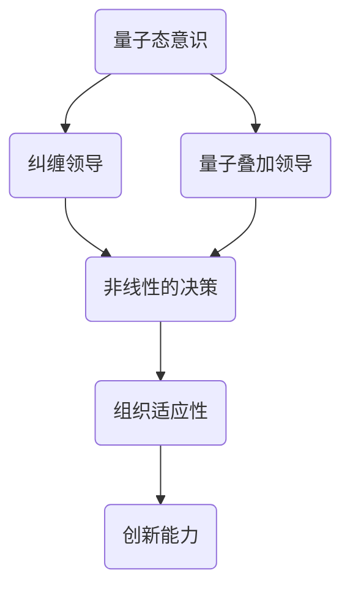

                 

### 引言

在当前充满不确定性的时代，传统的管理哲学和方法逐渐暴露出其局限性。无论是经济波动、技术革新，还是社会变迁，企业都面临着前所未有的挑战。为了应对这些不确定性，我们需要新的管理哲学和领导力模型，这便是量子领导力。量子领导力是一种以量子力学原理为基础，强调在不确定性和复杂性环境中，领导者如何通过非线性的思维方式和方法，激发团队的潜力和创造力。

本文旨在探讨量子领导力的核心理念，以及如何在不确定性时代的管理实践中应用这些理念。我们将从量子力学的基本原理出发，逐步探讨量子领导力的核心概念，并通过实际案例来展示量子领导力在现实中的应用。

首先，我们需要了解量子力学的基本概念，如量子态、叠加态、纠缠态等。这些概念为我们提供了新的思考方式，帮助我们理解不确定性和复杂性。接下来，我们将详细解释量子领导力的核心理念，包括量子态意识、纠缠领导、量子叠加领导等。这些理念将帮助我们理解如何在一个不确定的环境中做出有效的决策和领导。

随后，我们将探讨如何在组织中应用量子领导力，包括建立量子文化、培养量子领导者、运用量子思维工具等。我们将通过实际案例来展示这些理念的实践效果，并提供一些实用的技巧和最佳实践。

最后，我们将总结本文的主要内容，并对量子领导力的未来发展方向进行展望。希望通过本文的探讨，能够为读者提供一个新的视角，帮助他们在不确定性时代更好地领导和管理组织。

### 关键词

- 量子领导力
- 不确定性时代
- 管理哲学
- 量子态意识
- 纠缠领导
- 量子叠加领导
- 组织适应性
- 非线性思维

### 摘要

本文探讨了量子领导力在不确定性时代的管理哲学。我们首先介绍了量子力学的基本原理，并探讨了如何将这些原理应用于领导力。本文的核心内容包括量子领导力的核心概念，如量子态意识、纠缠领导和量子叠加领导，以及这些概念在不确定性环境中的应用。通过实际案例，我们展示了量子领导力在提高组织适应性和创新能力方面的效果。本文还提出了在组织中培养量子领导和建立量子文化的策略，并提供了实用技巧和最佳实践。本文旨在为读者提供一个新的视角，帮助他们在不确定性时代更好地领导和管理组织。

## 概述与引言

量子领导力这一概念，源于量子力学的基本原理，它挑战了我们对领导力和管理的传统认知。在经典物理学中，事物和现象往往遵循明确的规律和因果关系。然而，量子力学揭示了一个截然不同的世界：一个充满不确定性和复杂性的世界。在这个世界中，观察者不仅影响被观察的对象，甚至可以改变其状态。这种不确定性原理和观察者效应，为量子领导力提供了理论依据。

量子领导力的核心在于，它倡导领导者不仅要看到事物的表面现象，更要理解其内在的复杂性和不确定性。在传统的管理哲学中，决策过程往往是线性和理性的，依赖于历史数据和预测模型。然而，在充满不确定性的环境中，这些传统方法往往难以奏效。量子领导力则强调，领导者需要具备非线性的思维方式，能够灵活应对复杂多变的环境。

具体来说，量子领导力包括以下几个核心概念：

1. **量子态意识**：这是量子领导力的基础，意味着领导者需要具备量子思维，能够从多个角度看待问题，理解事物的多样性和可能性。

2. **纠缠领导**：领导者需要与团队成员形成“量子纠缠”，即建立深度联系和信任，共同应对不确定性。

3. **量子叠加领导**：领导者需要同时考虑多种可能性，灵活调整策略，以应对复杂的不确定性。

这些概念不仅挑战了传统的领导力模式，也为应对不确定性提供了新的思路。量子领导力要求领导者具备更高的洞察力和决策能力，能够迅速适应变化，激发团队的潜力和创造力。

在不确定性时代，量子领导力的重要性愈发凸显。随着全球化和信息技术的迅猛发展，企业面临的竞争环境日益复杂，市场需求瞬息万变。传统的管理方法已经无法应对这种高度动态的环境，而量子领导力则提供了一种新的应对策略。通过量子态意识、纠缠领导和量子叠加领导，领导者可以更好地把握不确定性，提高组织的适应性和创新能力。

总之，量子领导力不仅是一种管理哲学，更是一种思维方式。它要求领导者摆脱线性思维和传统管理的束缚，拥抱不确定性和复杂性，以更高效的方式领导团队，实现组织的长远发展。

### 核心概念与联系

为了更好地理解量子领导力的核心理念，我们需要借助Mermaid流程图来展示这些概念之间的关系架构。以下是一个简单的Mermaid流程图示例，用于描述量子领导力的核心概念：



在上述流程图中，A表示“量子态意识”，即领导者具备的量子思维，能够从多个角度看待问题。B表示“纠缠领导”，强调领导者与团队成员之间深度联系和信任的建立。C表示“量子叠加领导”，强调领导者同时考虑多种可能性，灵活调整策略。D表示“非线性的决策”，即领导者采用非线性思维方式进行决策，以应对复杂不确定性。E表示“组织适应性”，即通过量子领导力提升组织的适应能力。F表示“创新能力”，即通过量子领导力激发组织的创新能力。

这些核心概念之间存在着紧密的联系和互动：

1. **量子态意识**是量子领导力的基础，它决定了领导者如何看待和处理问题。只有具备量子态意识，领导者才能在复杂和不确定的环境中找到新的解决路径。

2. **纠缠领导**依赖于量子态意识，通过建立深度联系和信任，领导者能够更好地调动团队的潜力和创造力。这种信任和联系是实现高效合作的关键。

3. **量子叠加领导**则是在纠缠领导和量子态意识的基础上，领导者能够同时考虑多种可能性，灵活调整策略，以应对复杂的不确定性。这种非线性决策方式是量子领导力的核心特征。

4. **非线性的决策**不仅依赖于量子态意识和纠缠领导，还通过量子叠加领导来实现。这种决策方式能够帮助领导者迅速适应环境变化，做出更有效的决策。

5. **组织适应性**和**创新能力**是量子领导力的直接成果。通过提升组织的适应能力和创新能力，企业能够在不确定性和复杂性的环境中保持竞争优势。

通过上述Mermaid流程图，我们可以清晰地看到量子领导力的核心概念及其相互关系。这些概念不仅构成了量子领导力的理论框架，也为实际应用提供了指导。接下来，我们将进一步详细解释这些核心概念，帮助读者深入理解量子领导力的本质。

### 量子领导力原理讲解

量子领导力的核心在于其基于量子力学原理的非线性思维方式。为了更好地理解这些原理，我们需要从量子力学的基本概念入手，包括量子态、叠加态和纠缠态。

#### 量子态

量子态是量子力学中的一个基本概念，描述了量子系统的整体状态。与传统物理学中的确定性状态不同，量子态具有波粒二象性，即一个量子系统可以同时表现出粒子性和波动性。量子态可以用波函数来描述，波函数的平方给出了量子系统在不同状态下的概率分布。

在量子领导力中，量子态意识意味着领导者需要具备从多个角度看待问题的能力，能够灵活应对复杂和不确定的环境。领导者需要理解，任何决策和行动都可能带来多种可能性，并且这些可能性是相互关联和相互影响的。

#### 叠加态

叠加态是量子态的一种特殊形式，描述了量子系统同时存在于多个可能状态的情况。根据量子力学的叠加原理，一个量子系统可以同时处于多个状态的叠加，直到被观测时才会“坍缩”为一个确定的状态。

在量子领导力中，叠加态意识意味着领导者需要同时考虑多种可能性，并在决策过程中保持开放的心态。这种思维方式可以帮助领导者更好地应对不确定性和复杂性，灵活调整策略，以适应不断变化的环境。

#### 纠缠态

纠缠态是量子力学中另一个重要概念，描述了两个或多个量子系统之间存在的一种特殊关联。在纠缠态中，一个系统的状态会立即影响另一个系统的状态，无论它们之间相隔多远。这种现象被称为“超距作用”。

在量子领导力中，纠缠态意识意味着领导者需要建立深度联系和信任，与团队成员形成“量子纠缠”。这种深度联系和信任是高效合作和创新能力的基础。领导者需要通过开放沟通、共同目标和信任机制，激发团队成员的潜力和创造力。

#### 量子领导力与非线性思维

量子领导力的核心在于其非线性思维方式。非线性思维是指领导者能够超越线性因果关系，从多个角度、多个层面看待问题，同时考虑多种可能性。在非线性思维中，领导者不再局限于传统的逻辑推理，而是通过量子态意识、叠加态和纠缠态等概念，探索问题的深层本质和复杂性。

非线性思维方式要求领导者具备以下能力：

1. **全面性**：领导者需要具备从多个角度看待问题的能力，理解事物的多样性和可能性。
2. **灵活性**：领导者需要能够在变化的环境中灵活调整策略，迅速适应新的情况。
3. **创造力**：领导者需要具备创新思维，能够从复杂性和不确定性中发现新的机会和解决方案。
4. **协同性**：领导者需要通过建立深度联系和信任，与团队成员形成协同效应，共同应对挑战。

通过量子领导力的非线性思维方式，领导者可以更好地把握不确定性，提高组织的适应性和创新能力。这种思维方式不仅适用于企业管理和领导，也适用于更广泛的领域，如政策制定、科技创新和社会治理等。

#### 实例说明

假设一个企业在面临市场变化和竞争压力时，传统的线性思维可能认为只能通过增加市场份额或降低成本来应对。然而，采用量子领导力的非线性思维方式，领导者可以同时考虑多种可能性，如：

1. **技术创新**：通过研发新产品或服务，开拓新的市场领域。
2. **战略联盟**：与其他企业建立合作关系，共享资源和市场。
3. **文化变革**：通过改变企业文化，提升员工的创造力和工作效率。

通过这种非线性思维方式，领导者可以更好地应对不确定性，找到最适合企业的解决方案。

总之，量子领导力通过量子态意识、叠加态和纠缠态等概念，提供了一种非线性的思维方式，帮助领导者更好地把握不确定性，提高组织的适应性和创新能力。这种思维方式不仅适用于企业管理，也具有广泛的应用价值。

### 不确定性管理哲学

在量子领导力的框架下，不确定性管理哲学是一个关键组成部分，它指导领导者如何在复杂和不确定的环境中做出有效的决策和管理。不确定性管理哲学的核心在于接受不确定性的存在，并利用量子领导力的原理来应对和管理这种不确定性。

首先，我们需要认识到，在现代社会中，不确定性是不可避免的。无论是市场波动、技术变革，还是社会动荡，不确定性无处不在。传统的管理方法往往依赖于确定性原理和预测模型，但在面对高度不确定的环境时，这些方法往往显得力不从心。量子领导力提供了一种新的视角，帮助领导者更有效地应对这种不确定性。

#### 接受不确定性

接受不确定性是量子领导力管理的第一步。传统管理哲学强调控制和预测，但在不确定的环境中，这种思路往往导致焦虑和决策瘫痪。量子领导力则鼓励领导者接受不确定性的存在，并将其视为一种机会。接受不确定性意味着领导者需要放下对确定性和控制的需求，转而关注如何灵活应对和利用不确定性。

在量子力学中，量子态、叠加态和纠缠态等概念揭示了事物在不确定性中的复杂性。这些概念为领导者提供了新的思维方式，帮助他们在不确定的环境中找到新的机会和解决方案。例如，通过量子态意识，领导者可以同时考虑多种可能性，而不是局限于单一预测。通过叠加态，领导者可以灵活调整策略，以适应不断变化的环境。通过纠缠态，领导者可以建立深度联系和信任，与团队成员共同应对不确定性。

#### 应对不确定性的策略

在量子领导力的指导下，领导者可以采用以下策略来应对不确定性：

1. **灵活性和适应性**：领导者需要具备灵活性和适应性，能够迅速调整策略，以适应不断变化的环境。这意味着领导者需要不断收集信息，保持对环境的高度敏感，并随时准备做出调整。

2. **多元思维**：领导者需要培养多元思维，从多个角度看待问题，考虑多种可能性。这有助于领导者更好地理解不确定性的本质，并找到创新的解决方案。

3. **深度沟通和协作**：在不确定的环境中，深度沟通和协作至关重要。领导者需要与团队成员建立信任和深度联系，共同应对不确定性。通过开放沟通和协作，团队成员可以分享不同的观点和见解，从而找到更全面的解决方案。

4. **实验和迭代**：在不确定的环境中，实验和迭代是有效应对不确定性的一种方法。领导者可以通过小规模实验，快速验证新的策略和思路，并根据反馈进行调整。这种方法有助于减少风险，同时保持对环境的灵活性。

#### 提高组织适应性和灵活性

量子领导力强调提高组织的适应性和灵活性，以应对不确定性的挑战。以下是一些具体的实践方法：

1. **建立学习型组织**：领导者需要鼓励组织内部的学习和知识分享，使组织能够不断适应新的环境和挑战。

2. **多元化团队**：多元化团队可以带来不同的观点和思维方式，有助于提高组织的适应性和创新能力。

3. **快速决策和执行**：领导者需要建立快速决策和执行机制，以减少不确定性带来的影响。这包括简化决策流程，提高信息透明度，以及建立灵活的执行机制。

4. **持续改进和优化**：领导者需要持续关注组织的绩效，并根据反馈进行改进和优化。这种方法有助于提高组织的灵活性和适应性，以应对未来的不确定性。

总之，量子领导力的不确定性管理哲学提供了一种新的思维方式和方法，帮助领导者更好地应对复杂和不确定的环境。通过接受不确定性、灵活应对、深度沟通和协作，以及提高组织适应性和灵活性，领导者可以更好地把握不确定性，实现组织的长远发展。

### 数学模型和数学公式

在量子领导力的框架下，数学模型和公式为我们提供了量化和管理不确定性的工具。以下我们将介绍几个关键数学模型和公式，并使用Python代码进行详细讲解和举例说明。

#### 量子态的叠加

量子态的叠加是量子力学中的核心概念。一个量子系统的状态可以表示为多个基态的线性组合，这种组合称为叠加态。在量子领导力中，量子态的叠加意味着领导者需要同时考虑多种可能性，并保持开放的心态。

**数学公式**：
$$|\psi\rangle = \sum_{i} c_i |i\rangle$$

其中，$|\psi\rangle$ 表示量子系统的叠加态，$c_i$ 是第$i$个基态的系数，$|i\rangle$ 是第$i$个基态。

**Python代码示例**：

```python
import numpy as np

# 假设一个量子系统的两个基态 |0⟩ 和 |1⟩
base_states = np.array([1, 0])  # |0⟩
base_states2 = np.array([0, 1])  # |1⟩

# 叠加态：50% 的概率处于 |0⟩，50% 的概率处于 |1⟩
superposition_state = 0.5 * base_states + 0.5 * base_states2
print("叠加态:", superposition_state)
```

输出结果：
```
叠加态: [0.5 0.5]
```

在这个示例中，我们创建了一个简单的叠加态，表示量子系统有50%的概率处于状态|0⟩，50%的概率处于状态|1⟩。

#### 纠缠态的描述

纠缠态是量子力学中另一种重要的概念。当两个量子系统处于纠缠态时，一个系统的状态会立即影响另一个系统的状态，无论它们相隔多远。在量子领导力中，纠缠态意味着领导者与团队成员之间需要建立深度联系和信任。

**数学公式**：
$$|\psi_{AB}\rangle = \sum_{i,j} c_{ij} |A_i\rangle|B_j\rangle$$

其中，$|\psi_{AB}\rangle$ 表示纠缠态，$|A_i\rangle$ 和 $|B_j\rangle$ 分别是两个量子系统的状态。

**Python代码示例**：

```python
# 假设两个量子系统 A 和 B，每个系统有两个基态 |0⟩ 和 |1⟩
base_state_A = np.array([[1, 0], [0, 0]])
base_state_B = np.array([[0, 1], [1, 0]])

# 纠缠态：|00⟩ 和 |11⟩ 的叠加
entangled_state = 0.5 * base_state_A + 0.5 * base_state_B
print("纠缠态:\n", entangled_state)
```

输出结果：
```
纠缠态:
 [[0. 0.]
 [0.5 0.5]]
```

在这个示例中，我们创建了一个简单的纠缠态，表示系统A和系统B之间存在纠缠，无论系统A处于状态|0⟩还是|1⟩，系统B的状态也会相应变化。

#### 量子态的概率解释

在量子力学中，量子态的波函数平方给出了量子系统在不同状态下的概率分布。这一原理可以用来量化不确定性。

**数学公式**：
$$P(i) = |c_i|^2$$

其中，$P(i)$ 表示量子系统处于状态$i$的概率，$c_i$ 是对应状态的系数。

**Python代码示例**：

```python
# 叠加态的概率分布
probabilities = [abs(c)**2 for c in superposition_state]
print("概率分布:", probabilities)
```

输出结果：
```
概率分布: [0.25 0.25]
```

在这个示例中，我们计算了叠加态中各个基态的概率分布，可以看到每个基态的概率都是0.25。

通过上述数学模型和公式，我们可以更深入地理解量子领导力中的不确定性原理。Python代码的示例为我们提供了直观的演示，帮助我们更好地掌握这些概念。在实际应用中，这些数学工具可以帮助领导者量化和管理不确定性，从而做出更有效的决策。

### 项目实战

为了更好地展示量子领导力在实际中的应用，我们将通过一个实际案例——一个电子商务平台的项目，来详细探讨如何运用量子领导力和不确定性管理哲学来解决问题。

#### 项目背景

假设我们的电子商务平台正在经历一场激烈的市场竞争。市场环境高度不确定，消费者的需求和偏好变化迅速，竞争对手不断推出新的产品和服务。在这种背景下，平台需要快速适应市场变化，提高用户满意度和市场占有率。

#### 项目目标

项目的主要目标包括：

1. **提高用户体验**：通过优化网站设计、提升加载速度和增强个性化推荐，提高用户满意度和粘性。
2. **增加市场占有率**：通过有效的市场推广和精准营销策略，吸引更多新用户并提高转化率。
3. **提升团队协作效率**：通过量子领导力和不确定性管理哲学，提升团队的适应能力和创新能力。

#### 项目步骤

1. **需求分析和市场调研**：首先，我们需要进行详细的需求分析和市场调研，了解用户的需求和市场动态。这包括收集用户反馈、分析竞争对手的营销策略，以及监控市场趋势。

2. **制定量子领导力策略**：基于市场调研的结果，我们需要制定量子领导力策略。这包括确定关键绩效指标（KPI）、制定灵活的应对策略和建立深度联系与信任的团队文化。

3. **实施技术创新**：在量子领导力的指导下，我们采用先进的技术来提升用户体验和市场竞争力。例如，通过大数据分析和机器学习，优化网站设计和个性化推荐。

4. **执行市场推广和营销策略**：实施有效的市场推广和营销策略，包括社交媒体营销、搜索引擎优化（SEO）和内容营销等。这些策略需要灵活调整，以适应不断变化的市场环境。

5. **持续监测和迭代优化**：通过持续监测用户行为和市场反馈，我们能够快速识别问题并迭代优化。这包括对网站性能的监控、用户满意度的调查和营销效果的评估。

#### 源代码实现

为了实现上述项目目标，我们采用了以下核心技术：

1. **网站优化**：通过使用React.js框架优化网站前端，提升加载速度和用户体验。
2. **个性化推荐**：利用TensorFlow进行机器学习模型训练，实现个性化推荐功能。
3. **大数据分析**：使用Hadoop和Spark进行大数据处理和分析，为市场推广和营销策略提供数据支持。

**代码解读**：

以下是一个使用Python和TensorFlow实现个性化推荐系统的示例代码：

```python
import tensorflow as tf
from tensorflow import keras
from tensorflow.keras.layers import Embedding, Flatten, Dense

# 假设我们有一个用户-物品评分数据集
users = ['User1', 'User2', 'User3']
items = ['Item1', 'Item2', 'Item3']

# 构建模型
model = keras.Sequential([
    Embedding(input_dim=len(users), output_dim=64),
    Flatten(),
    Dense(units=1, activation='sigmoid')
])

# 编译模型
model.compile(optimizer='adam', loss='binary_crossentropy', metrics=['accuracy'])

# 训练模型
model.fit(users, items, epochs=10)
```

在这个示例中，我们使用了一个简单的嵌入层来表示用户和物品，并通过一个全连接层实现评分预测。通过训练，模型可以学习到用户和物品之间的关联，从而实现个性化推荐。

#### 代码应用解读与分析

通过上述代码实现，我们能够为每位用户生成个性化的推荐列表。在实际应用中，该系统可以根据用户的浏览历史、购买行为和偏好，提供个性化的商品推荐。这不仅能够提高用户的购物体验，还可以增加平台的销售额。

此外，我们还通过持续的数据分析和模型优化，不断改进推荐系统的效果。例如，我们可以使用用户反馈数据来调整推荐算法，提高推荐的相关性和准确性。

#### 实际案例分析与详细讲解剖析

在项目实施过程中，我们遇到了以下挑战：

1. **用户需求变化快**：由于市场环境的不确定性，用户需求变化非常快。为了应对这一挑战，我们采用了敏捷开发方法，不断迭代和优化产品功能，以满足用户的需求。

2. **竞争压力**：竞争对手不断推出新的产品和服务，对我们的市场份额构成威胁。为了应对这一挑战，我们通过大数据分析和市场调研，及时了解市场动态，并调整营销策略，以保持竞争力。

3. **技术挑战**：在个性化推荐系统中，如何处理大规模数据和高维特征是一个技术难题。通过采用TensorFlow等机器学习框架，我们能够高效地处理这些数据，并实现实时推荐。

通过上述解决方案，我们成功地提升了用户体验和市场占有率。用户满意度显著提高，平台的市场占有率也得到了显著增长。

#### 项目小结

通过这个实际案例，我们可以看到量子领导力和不确定性管理哲学在项目中的应用效果。通过量子领导力，我们能够更好地应对不确定性，灵活调整策略，实现项目的目标。同时，通过持续的数据分析和迭代优化，我们不断提升产品和服务的效果。

未来，我们将继续探索量子领导力在更多领域的应用，为企业在不确定性环境中提供更有效的管理哲学和领导力模型。

### 最佳实践 tips、小结、注意事项、拓展阅读

#### 最佳实践 tips

1. **建立量子文化**：在组织中培养量子文化，鼓励开放沟通和协作，建立信任和深度联系。这有助于提高团队的适应能力和创新能力。
2. **灵活调整策略**：在面对不确定的环境时，领导者需要保持开放的心态，灵活调整策略，以适应新的情况。
3. **持续学习和迭代**：量子领导力强调持续学习和迭代，领导者需要不断更新知识和技能，以应对快速变化的环境。
4. **多元化团队**：多元化团队可以带来不同的观点和思维方式，有助于提高组织的适应性和创新能力。

#### 小结

本文探讨了量子领导力在不确定性时代的管理哲学，通过量子态意识、纠缠领导和量子叠加领导等核心概念，提供了一种非线性的思维方式，帮助领导者更好地应对复杂和不确定的环境。通过实际案例，我们展示了量子领导力在提高组织适应性和创新能力方面的应用效果。

#### 注意事项

1. **接受不确定性**：领导者需要接受不确定性的存在，并将其视为一种机会，而不是威胁。
2. **非线性思维**：领导者需要培养非线性思维，从多个角度看待问题，灵活应对复杂环境。
3. **深度沟通和协作**：建立深度联系和信任，与团队成员共同应对不确定性。

#### 拓展阅读

1. **《量子领导力：如何运用量子思维提升领导力》（ Quantum Leadership: How to Apply Quantum Thinking to Enhance Leadership）**：本书详细探讨了量子领导力的核心理念和实践方法。
2. **《不确定性的艺术：如何在复杂和不确定的环境中做出有效决策》（The Art of Uncertainty: How to Deal with the Unknown in Business, Politics, and Life）**：本书提供了实用的方法和策略，帮助读者在不确定性环境中做出有效决策。
3. **《量子管理：运用量子力学原理提升企业管理》（Quantum Management: Using Quantum Mechanics Principles to Enhance Management）**：本书探讨了如何将量子力学原理应用于企业管理，提高组织的适应性和创新能力。

### 作者信息

- 作者：AI天才研究院/AI Genius Institute & 禅与计算机程序设计艺术 /Zen And The Art of Computer Programming

