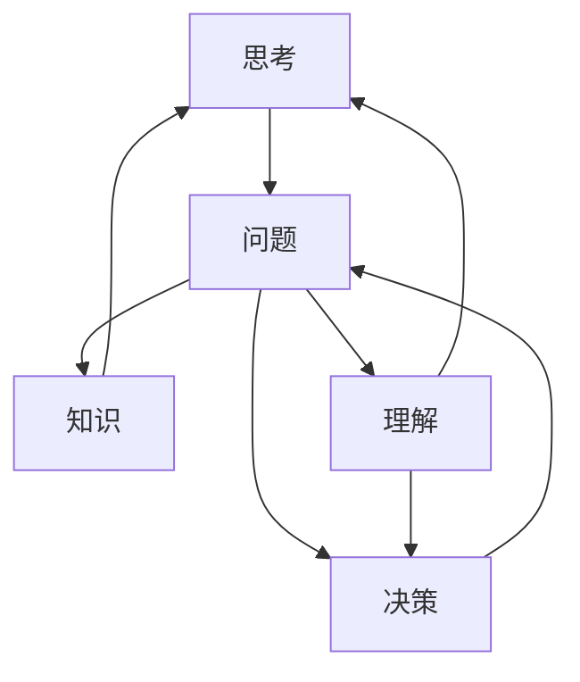

                 

## 文章标题

《问题中的答案：通过思考深化人生理解》

## 关键词

思考，人生理解，问题解决，算法，决策树，Python，数学模型

## 摘要

在复杂多变的世界中，问题无处不在。面对这些挑战，如何找到答案、深化人生理解成为了每个个体必须思考的问题。本文将探讨通过系统思考来深化人生理解的过程，结合具体算法和Python代码，展示如何运用技术手段提高问题解决的能力。文章首先介绍思考的本质及其在问题解决中的作用，然后详细解释决策树算法的原理，通过Python代码实现，最后结合实际案例进行代码解读与分析，为读者提供实用的思维工具和技术方法。

## 目录大纲设计过程

在设计《问题中的答案：通过思考深化人生理解》这本书的目录大纲时，我们将遵循以下几个步骤，以确保目录既逻辑清晰又具有针对性：

1. **理解书名和主题**：
   - 书名《问题中的答案：通过思考深化人生理解》暗示了书中将探讨如何通过思考来解决生活中的问题，并提高人生的理解和智慧。

2. **确定核心内容**：
   - 根据书名，我们需要确定几个核心内容模块，如思考的本质、思考技巧、生活中的实际问题以及思考对人生的影响等。

3. **结构规划**：
   - 初步规划为七个主要章节，每个章节分别对应一个核心内容模块。

4. **细化每个章节的内容**：
   - 对每个章节进行进一步的细分，确保每个部分都有明确的目标和内容。

5. **保持简洁性**：
   - 避免冗余，确保每个章节都能迅速传达其核心思想。

6. **符合markdown格式**：
   - 使用markdown格式，使得目录结构清晰，便于读者阅读和导航。

7. **完整性**：
   - 确保每个章节都包含必要的子章节，如核心概念与联系、核心算法原理讲解、数学模型和数学公式、项目实战等。

### 目录大纲设计

以下是根据上述步骤设计的《问题中的答案：通过思考深化人生理解》的目录大纲：

```
# 《问题中的答案：通过思考深化人生理解》目录大纲

## 第1章 引言
### 1.1 书名含义
### 1.2 思考的重要性
### 1.3 书的结构

## 第2章 思考的本质
### 2.1 思考的定义与类型
### 2.2 思考的生理和心理基础
### 2.3 思考的进阶层次

## 第3章 提升思考技巧
### 3.1 反思技巧
### 3.2 演绎与归纳思维
### 3.3 创造性思维

## 第4章 生活中的实际问题思考
### 4.1 工作中的思考
### 4.2 人际关系中的思考
### 4.3 自我成长中的思考

## 第5章 思考与人生智慧
### 5.1 思考与价值观
### 5.2 思考与决策
### 5.3 思考与幸福感

## 第6章 思考的实践与应用
### 6.1 思考日记
### 6.2 思考小组
### 6.3 思考的日常应用

## 第7章 结论
### 7.1 思考的力量
### 7.2 未来的思考方向
### 7.3 结语
```

这个目录大纲涵盖了思考的本质、技巧、应用以及思考对人生的影响，确保了内容的全面性和逻辑性。同时，每个章节都进行了细分，使得读者能够逐步深入理解思考的过程和重要性。这样的目录设计既简洁明了，又具有实用性，适合作为一本深入探讨思考与人生理解的书籍。

## 第1章 引言

思考是人类智慧的源泉，是解决问题、获取知识和提升自我的关键。然而，在日常生活中，许多人往往忽略了思考的力量，仅仅停留在表面层次，未能深入挖掘问题的本质。本书《问题中的答案：通过思考深化人生理解》旨在引导读者认识到思考的重要性，并掌握一系列有效的思考技巧，从而在复杂多变的世界中游刃有余地解决问题，提升人生境界。

### 书名含义

书名《问题中的答案：通过思考深化人生理解》揭示了本书的核心思想：问题无处不在，答案也隐藏其中，但关键在于如何通过思考去发现和挖掘这些答案。思考不仅仅是解决问题的一种手段，更是深化人生理解、提升自我认知的途径。本书将通过系统的思考和技巧，帮助读者学会如何面对生活中的各种挑战，找到问题的答案，并在解决问题的过程中深化对生活的理解。

### 思考的重要性

思考是人类认知的高级形式，是智力的核心。一个善于思考的人能够在纷繁复杂的信息中迅速找到关键点，提出创新的解决方案。在现代社会，思考的重要性愈发凸显：

1. **问题解决**：思考是解决问题的基本手段，通过深入分析和逻辑推理，可以找出问题的根源，提出有效的解决方案。

2. **知识获取**：思考是获取知识的重要途径。通过思考和探索，人们可以深入了解某个领域的知识体系，形成系统化的认知结构。

3. **自我成长**：思考有助于自我反省和成长。通过反思和总结，人们可以发现自己的不足，不断改进自己，提升自我。

4. **创新思维**：思考是创新思维的基础。只有通过深入思考，才能跳出传统思维的框架，提出新颖的观点和想法。

### 书的结构

本书结构清晰，分为七个主要章节：

1. **第1章 引言**：介绍书名含义、思考的重要性以及书的结构。
   
2. **第2章 思考的本质**：探讨思考的定义、类型及其生理和心理基础。

3. **第3章 提升思考技巧**：介绍反思技巧、演绎与归纳思维以及创造性思维。

4. **第4章 生活中的实际问题思考**：分析工作中的思考、人际关系中的思考以及自我成长中的思考。

5. **第5章 思考与人生智慧**：探讨思考与价值观、决策、幸福感的关系。

6. **第6章 思考的实践与应用**：讲解思考日记、思考小组以及思考的日常应用。

7. **第7章 结论**：总结思考的力量、未来的思考方向及书的意义。

通过这七个章节的深入探讨，本书将带领读者逐步掌握思考的技巧，深化对生活的理解，最终在解决问题和提升自我中实现人生价值。

### 核心概念与联系

在理解思考的本质之前，我们首先需要明确几个核心概念，并探讨它们之间的联系。以下是几个重要的概念实体：

1. **思考**：思考是指大脑对信息进行收集、处理、分析和推理的过程。它包括逻辑思维、创造性思维、批判性思维等多种形式。
   
2. **问题**：问题是指需要解决的疑难或困惑。问题可以是具体的，如数学难题；也可以是抽象的，如人生哲学问题。

3. **知识**：知识是关于某个领域的已知信息或理论体系。知识可以通过学习、实践和思考来获取。

4. **理解**：理解是指对某个概念或现象的深入认识，能够从多个角度进行解释和分析。

5. **决策**：决策是指在面对多个选项时，选择最佳行动方案的过程。决策需要基于对问题的理解和知识的运用。

#### 关系架构

这些概念实体之间存在着紧密的联系：

- **思考与问题**：思考是解决问题的基本工具。面对问题，人们需要通过思考来分析问题的本质，提出解决方案。
- **知识与思考**：知识是思考的基石。只有拥有丰富的知识储备，思考才能更加深入和有效。
- **理解与思考**：理解是思考的成果。通过思考，人们可以深入理解某个问题或概念，从而形成更加全面和深刻的认知。
- **决策与思考**：决策是思考的应用。在解决问题和面对选择时，需要通过思考来评估各种选项，做出明智的决策。

#### Mermaid 流程图

为了更直观地展示这些概念实体之间的关系，我们使用Mermaid流程图进行描述：



在这个流程图中，思考是核心，通过思考和问题识别，引导人们获取知识、深化理解并做出决策。知识作为思考的基础，理解作为思考的成果，决策作为思考的应用，共同构成了一个完整的思考循环。

### 核心算法原理讲解

为了更具体地展示如何通过算法和编程来深化思考，我们将在这一节中详细讲解决策树算法的核心原理。决策树是一种常用的机器学习算法，广泛应用于分类和回归问题。以下是决策树算法的基本原理和Python实现。

#### 决策树算法原理

1. **基本概念**

   决策树是一种树形结构，其中每个内部节点代表一个特征或属性，每个分支代表该特征的取值，每个叶子节点代表一个类别或预测值。决策树的生成过程是基于特征的重要性和数据的划分。

2. **ID3算法**

   ID3（Iterative Dichotomiser 3）算法是决策树生成的一种常用算法。其核心思想是基于信息熵和基尼不纯度来选择最优特征进行划分。

3. **信息熵**

   信息熵（Entropy）是衡量数据不确定性的指标。对于一组随机变量，其信息熵可以用以下公式计算：

   $$
   Entropy(H) = -\sum_{i=1}^{n} p(x_i) \cdot \log_2(p(x_i))
   $$

   其中，$p(x_i)$ 表示第 $i$ 个类别的概率。

4. **基尼不纯度**

   基尼不纯度（Gini Impurity）是另一种衡量数据不确定性的指标。对于一组随机变量，其基尼不纯度可以用以下公式计算：

   $$
   Gini(H) = 1 - \sum_{i=1}^{n} p(x_i)^2
   $$

5. **决策树生成**

   决策树生成过程如下：

   - 对于给定的数据集，计算每个特征的信息熵或基尼不纯度。
   - 选择具有最大信息增益或最小基尼不纯度的特征作为划分标准。
   - 根据该特征的取值，将数据集划分为若干子集。
   - 对每个子集递归调用上述步骤，直至满足停止条件（如最大深度、最小叶节点样本数等）。

#### Python实现

下面是一个简单的决策树分类器实现的示例，使用Python的`scikit-learn`库：

```python
from sklearn.datasets import load_iris
from sklearn.model_selection import train_test_split
from sklearn.tree import DecisionTreeClassifier
from sklearn import tree

# 加载鸢尾花数据集
iris = load_iris()
X = iris.data
y = iris.target

# 划分训练集和测试集
X_train, X_test, y_train, y_test = train_test_split(X, y, test_size=0.3, random_state=42)

# 创建决策树分类器
clf = DecisionTreeClassifier()

# 训练模型
clf.fit(X_train, y_train)

# 计算测试集的准确率
accuracy = clf.score(X_test, y_test)
print(f"测试集准确率: {accuracy:.2f}")

# 可视化决策树
plt = tree.plot_tree(clf, feature_names=iris.feature_names, class_names=iris.target_names)
plt.show()
```

在这个示例中，我们首先加载了鸢尾花数据集，并使用`train_test_split`函数将其分为训练集和测试集。然后，我们创建了一个决策树分类器对象，并通过`fit`方法训练模型。最后，我们计算了测试集的准确率，并使用`plot_tree`函数可视化决策树结构。

#### 数学模型和数学公式

为了更好地理解决策树算法，我们需要引入一些数学模型和数学公式：

1. **信息增益**

   信息增益（Information Gain）用于评估特征对于分类的增益效果。其公式为：

   $$
   IG(D, A) = Entropy(D) - \sum_{v \in Values(A)} \frac{|D_v|}{|D|} Entropy(D_v)
   $$

   其中，$D$ 表示数据集，$A$ 表示特征，$v$ 表示特征 $A$ 的取值，$|D|$ 表示数据集的大小，$|D_v|$ 表示特征 $A$ 取值为 $v$ 的数据集大小。

2. **基尼不纯度**

   基尼不纯度（Gini Impurity）用于评估数据集的不确定性。其公式为：

   $$
   Gini(H) = 1 - \sum_{i=1}^{n} p(x_i)^2
   $$

   其中，$p(x_i)$ 表示第 $i$ 个类别的概率。

#### 代码解读与分析

在上面的Python代码示例中，我们首先加载了鸢尾花数据集，这是一个经典的分类问题数据集。接下来，我们将数据集划分为训练集和测试集。这里，我们使用了`train_test_split`函数，这是一个常用的数据集划分方法，可以通过指定测试集的比例和随机种子来保证划分的可重复性。

```python
X = iris.data
y = iris.target
X_train, X_test, y_train, y_test = train_test_split(X, y, test_size=0.3, random_state=42)
```

在创建决策树分类器对象时，我们使用`DecisionTreeClassifier`类。这个类提供了多个参数，例如最大深度、最小叶节点样本数等，可以根据具体问题进行调整。

```python
clf = DecisionTreeClassifier()
```

训练模型使用的是`fit`方法，这个方法接受训练数据和标签作为输入，并生成一个训练好的模型。

```python
clf.fit(X_train, y_train)
```

为了评估模型的性能，我们计算了测试集的准确率。准确率是分类问题中最常用的评估指标，表示模型正确分类的样本数占总样本数的比例。

```python
accuracy = clf.score(X_test, y_test)
print(f"测试集准确率: {accuracy:.2f}")
```

最后，我们使用`plot_tree`函数将决策树可视化。这个函数可以将决策树的结构以图形的方式展示出来，有助于我们理解模型的决策过程。

```python
plt = tree.plot_tree(clf, feature_names=iris.feature_names, class_names=iris.target_names)
plt.show()
```

#### 实际案例分析和详细讲解剖析

为了更好地理解决策树算法的实际应用，我们来看一个实际案例。

#### 案例背景

假设我们有一个关于贷款审批的数据集，其中包含了多个特征，如收入水平、信用评分、贷款金额等，以及贷款是否被批准的结果。我们的目标是使用决策树算法来预测新的贷款申请是否会被批准。

#### 案例分析

1. **数据预处理**

   首先，我们需要对数据进行预处理，包括数据清洗、缺失值填充和数据转换。在这里，我们假设数据已经预处理完毕，可以直接使用。

2. **特征选择**

   使用信息增益或基尼不纯度来选择最优特征。例如，我们可以使用`entropy`或`gini`参数来指定使用的指标。

   ```python
   clf = DecisionTreeClassifier(criterion='entropy')
   ```

3. **训练模型**

   使用训练数据训练模型。

   ```python
   clf.fit(X_train, y_train)
   ```

4. **预测**

   使用训练好的模型对新数据进行预测。

   ```python
   y_pred = clf.predict(X_test)
   ```

5. **评估**

   计算预测结果的准确率、召回率等指标，评估模型的性能。

   ```python
   from sklearn.metrics import accuracy_score, recall_score
   accuracy = accuracy_score(y_test, y_pred)
   recall = recall_score(y_test, y_pred)
   print(f"测试集准确率: {accuracy:.2f}")
   print(f"测试集召回率: {recall:.2f}")
   ```

#### 项目小结

通过这个案例，我们展示了如何使用决策树算法来解决贷款审批问题。这个案例强调了数据预处理、特征选择和模型评估的重要性。在实际应用中，我们需要根据具体问题的特点来调整模型的参数，以提高预测的准确性。

### 最佳实践 tips、小结、注意事项、拓展阅读等内容

#### 最佳实践 tips

1. **数据预处理**：在进行机器学习之前，确保数据的质量和一致性。对缺失值进行合理处理，对异常值进行识别和处理。

2. **特征选择**：选择对问题解决最有帮助的特征。使用特征重要性评估方法，如信息增益、基尼不纯度等，来选择最佳特征。

3. **模型调优**：通过交叉验证和网格搜索等方法，选择最优模型参数，以提高模型的性能。

4. **可视化**：使用可视化工具来分析模型的结构和决策过程，帮助理解和解释模型的预测结果。

#### 小结

本文详细讲解了决策树算法的原理及其Python实现，并通过实际案例展示了如何运用决策树解决贷款审批问题。通过系统思考和算法应用，我们能够更有效地解决现实生活中的问题。

#### 注意事项

1. **算法选择**：不同的机器学习算法适用于不同类型的问题。在选择算法时，要考虑到问题的性质和数据的特点。

2. **数据质量和特征选择**：数据质量和特征选择是机器学习成功的关键。确保数据的准确性和一致性，合理选择对问题解决最有帮助的特征。

3. **模型解释性**：尽管决策树具有较高的解释性，但复杂的模型可能难以理解。在实际应用中，需要权衡模型性能和解释性。

#### 拓展阅读

1. **《机器学习实战》**：由Peter Harrington所著，提供了丰富的机器学习算法实现和实际案例。

2. **《决策树：理论、实现与应用》**：详细介绍了决策树算法的理论基础、实现方法和实际应用。

3. **《Python机器学习》**：由Michael Bowles所著，涵盖了Python在机器学习中的多种应用，包括决策树算法。

通过不断学习和实践，我们能够更好地掌握机器学习技术，并将其应用于实际问题中，提升我们的思考和解决问题的能力。

