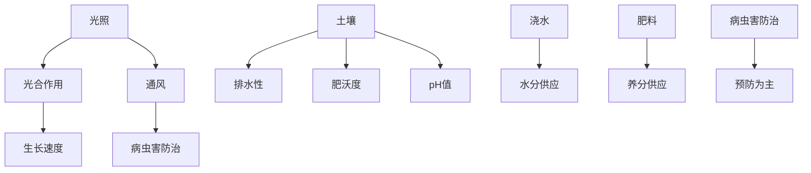

                 

### 《阳台种植：都市生活中的田园梦想》

#### 关键词
- 阳台种植
- 都市生活
- 田园梦想
- 植物种植
- 环境改造
- 管理技巧

#### 摘要
本文将探讨如何在都市生活中实现田园梦想，通过阳台种植的实践，展示如何利用有限的都市空间，创造一个绿色、健康、充满活力的生活环境。文章将详细阐述阳台种植的基础知识、植物种类选择、日常管理技巧、进阶技巧，以及都市生活中的田园生活理念，并提供实际项目实战和资源推荐。

---

### 第1章：阳台种植的基础知识

阳台种植作为一种将自然与都市生活结合的方式，越来越受到都市居民的喜爱。然而，要成功地实现阳台种植，首先需要了解一些基础知识。

#### 1.1 阳台种植的优势与局限

**优势：**
1. **节省空间**：阳台是一个相对独立且固定的空间，适合种植各种植物。
2. **环保健康**：阳台种植可以减少对传统农业的依赖，降低农药和化肥的使用，提高生活品质。
3. **美化环境**：植物的存在可以增加阳台的美感，为居民提供一个舒适的生活环境。

**局限：**
1. **光照不足**：很多阳台可能因为建筑结构或地理位置的问题，光照不足，影响植物生长。
2. **通风问题**：阳台的通风状况也会影响植物的健康，尤其是在城市密集区域。
3. **水源问题**：城市生活可能面临水资源的限制，阳台种植需要合理规划水源供应。

#### 1.2 阳台环境设计与改造

为了充分利用阳台空间，实现高效种植，需要对阳台进行合理的环境设计和改造。

**设计原则：**
1. **光照充足**：尽量选择向阳的阳台，或者利用人工光源补充光照。
2. **通风良好**：保持阳台的空气流通，避免植物因湿度过高而产生病虫害。
3. **合理布局**：根据阳台的大小和形状，设计合理的种植布局，充分利用空间。

**改造建议：**
1. **增加垂直空间**：利用墙壁安装架子，增加垂直种植空间。
2. **设置遮阳网**：根据季节变化，适时为植物遮阳，避免阳光直射。
3. **安装灌溉系统**：安装自动灌溉设备，确保植物定时定量浇水。

#### 1.3 阳台种植的基本技巧

成功进行阳台种植，需要掌握一些基本技巧。

**选择植物：** 根据阳台的光照和通风条件，选择适合的植物种类。例如，耐阴植物如绿萝、吊兰适合光照不足的阳台，而阳性植物如太阳花、向日葵则需要充足的光照。

**土壤准备：** 选择适合阳台种植的土壤，通常需要具备良好的排水性和肥沃度。可以添加有机肥料，提高土壤的养分含量。

**浇水技巧：** 水是植物生长的关键，需要掌握合适的浇水时间和方法。一般来说，早晨或傍晚是浇水的最佳时间，避免阳光直射下浇水。

**病虫害防治：** 阳台种植容易受到病虫害的困扰，需要定期检查并采取相应的防治措施。

---

在了解了阳台种植的基础知识后，接下来我们将探讨适合阳台种植的各种植物种类。

### 第2章：适合阳台种植的植物种类

阳台种植的植物种类多样，根据不同的光照条件和植物特性，可以种植各种绿植、花卉、蔬菜与水果。

#### 2.1 绿植类

绿植类植物具有净化空气、美化环境的作用，适合在光照不足的阳台种植。

**推荐植物：**
1. **绿萝**：耐阴，生长迅速，适合悬挂种植。
2. **吊兰**：耐阴，净化空气效果佳，适合放在窗台边缘。
3. **常春藤**：耐阴，能攀附墙壁生长，适合垂直种植。

#### 2.2 花卉类

花卉类植物色彩丰富，能为阳台带来美丽和活力。

**推荐植物：**
1. **太阳花**：阳性植物，花色多样，适合在阳光充足的地方种植。
2. **向日葵**：阳性植物，生长迅速，花朵大而美丽。
3. **茉莉花**：阳性植物，花香浓郁，适合在通风良好的阳台种植。

#### 2.3 蔬菜与水果类

在阳台种植蔬菜与水果，不仅可以享受种植的乐趣，还能获得新鲜的食材。

**推荐植物：**
1. **番茄**：阳性植物，耐旱，适合在阳光充足的阳台种植。
2. **黄瓜**：阳性植物，耐旱，适合在通风良好的阳台种植。
3. **草莓**：阳性植物，耐寒，适合在温暖的环境中种植。

在选择植物时，需要考虑阳台的光照、通风条件和土壤条件等因素，确保植物能够健康生长。

---

在掌握了适合阳台种植的植物种类后，接下来我们将探讨阳台种植的日常管理技巧。

### 第3章：阳台种植的日常管理

阳台种植的成功不仅取决于植物的选择，还需要进行日常管理，以保证植物的健康生长。

#### 3.1 光照与通风管理

光照和通风是植物生长的两个关键因素。

**光照管理：**
1. **根据植物特性调整**：不同植物对光照的需求不同，需要根据植物的习性来调整光照。
2. **使用遮阳网**：在高温季节，可以使用遮阳网减少阳光直射，保护植物。
3. **人工光源补充**：在光照不足的情况下，可以使用LED补光灯补充光照。

**通风管理：**
1. **保持空气流通**：定期开窗通风，保持阳台空气流通，减少病虫害的发生。
2. **合理布局**：根据阳台的空间布局，合理安排植物，避免植物过于拥挤，影响通风。

#### 3.2 浇水与施肥技巧

水是植物生长的重要资源，合理的浇水与施肥技巧对植物的生长至关重要。

**浇水技巧：**
1. **根据土壤湿度**：浇水时应根据土壤的湿度来决定，避免过度浇水或干旱。
2. **早晨或傍晚**：最佳浇水时间为早晨或傍晚，此时气温较低，水蒸气蒸发较慢，有利于植物的吸收。
3. **浇水方法**：采用滴灌或喷灌方式，减少水分流失，提高水利用率。

**施肥技巧：**
1. **有机肥料**：使用有机肥料，提高土壤的肥力和植物的养分吸收。
2. **定期施肥**：根据植物的生长阶段和需求，定期施肥，保证植物的营养供应。
3. **合理用量**：避免过量施肥，导致植物烧根或营养过剩。

#### 3.3 病虫害防治

病虫害是阳台种植中常见的问题，需要采取有效的防治措施。

**防治方法：**
1. **预防为主**：定期检查植物，发现病虫害的早期迹象，及时采取措施。
2. **物理防治**：使用物理方法，如覆盖膜、捕虫灯等，防止病虫害的侵入。
3. **生物防治**：利用生物防治方法，如使用天敌、微生物等，减少病虫害的数量。

通过合理的日常管理，可以确保阳台种植的植物健康生长，实现都市生活中的田园梦想。

### 第4章：阳台种植的进阶技巧

在掌握了基本的阳台种植技巧后，可以进一步探索阳台种植的进阶技巧，提升种植效果和观赏性。

#### 4.1 植物组合与搭配

植物组合与搭配是提升阳台种植观赏性的重要手段。

**组合原则：**
1. **色彩搭配**：选择颜色相近或互补的植物进行组合，增强视觉效果。
2. **形态搭配**：选择形态各异、高矮不同的植物，形成层次感。
3. **功能搭配**：选择具有不同功能的植物，如观赏植物、果蔬植物等，实现多功能阳台。

**实际应用：**
- **多肉植物组合**：将不同颜色和形态的多肉植物组合在一起，形成小巧精致的阳台景观。
- **阳台花园**：在阳台种植各种花卉和蔬菜，形成立体花园，增加阳台的绿意。

#### 4.2 创意阳台种植设计

创意阳台种植设计可以增加阳台的独特性和个性。

**设计理念：**
1. **空间利用**：充分利用阳台的每一个角落，设计出独特的种植空间。
2. **美观实用**：设计不仅要美观，还要考虑实用性和功能性。
3. **个性化**：根据个人的喜好和需求，打造出独一无二的阳台种植设计。

**设计案例：**
- **阳台蔬菜园**：利用阳台墙面和角落，搭建垂直蔬菜园，既节省空间，又增加绿色。
- **阳台花坛**：在阳台边缘设计花坛，种植各种花卉，营造出温馨舒适的氛围。

#### 4.3 阳台园艺工具与设备推荐

选择合适的园艺工具和设备，可以提升阳台种植的效率和质量。

**推荐工具：**
1. **园艺剪刀**：用于修剪植物，保持形态美观。
2. **浇水壶**：方便浇水，控制水量。
3. **滴灌系统**：自动浇水，节省人力。

**推荐设备：**
1. **LED补光灯**：提供充足的光照，适合光照不足的阳台。
2. **阳台温室**：增加植物生长空间，提高生长效率。
3. **土壤测试仪**：实时监测土壤湿度、养分等指标，指导浇水与施肥。

通过以上进阶技巧，可以进一步提升阳台种植的效果，实现都市生活中的田园梦想。

### 第5章：都市生活中的田园生活

阳台种植不仅是一种园艺活动，更是一种生活理念的体现。通过阳台种植，可以更好地融入都市生活，实现田园生活的梦想。

#### 5.1 阳台种植与心理健康

阳台种植对心理健康有着积极的影响。

**心理益处：**
1. **减压放松**：在种植过程中，人们可以忘却日常的压力，享受与自然亲近的乐趣。
2. **增加幸福感**：通过种植和收获，人们可以获得成就感，提高生活满意度。
3. **促进家庭和谐**：家庭成员一起参与阳台种植，增进亲子关系和家庭氛围。

**实际应用：**
- **种植花园**：将阳台打造成一个小型花园，种植各种植物，创造一个放松的环境。
- **家庭园艺活动**：定期组织家庭园艺活动，增强家庭成员间的互动。

#### 5.2 阳台种植与社区生活

阳台种植可以促进社区生活的互动和共享。

**社区互动：**
1. **种植交流**：社区居民可以相互交流种植经验，分享种植技巧，提高种植水平。
2. **资源共享**：社区可以建立共享种植空间，居民共同参与种植，分享成果。
3. **节日活动**：在社区举办阳台种植比赛、园艺展览等活动，增进邻里关系。

**实际应用：**
- **社区花园**：在社区中心或公园设置社区花园，供居民共同种植和享受。
- **阳台种植联盟**：社区居民成立阳台种植联盟，定期组织活动，共享资源。

#### 5.3 阳台种植与可持续发展

阳台种植是一种可持续的生活方式，有助于环境保护和资源节约。

**可持续发展理念：**
1. **减少浪费**：阳台种植可以减少对传统农业的依赖，降低食物浪费。
2. **减少污染**：通过阳台种植，减少农药和化肥的使用，降低环境污染。
3. **资源循环**：阳台种植可以将废弃物转化为肥料，实现资源的循环利用。

**实际应用：**
- **生态农场**：在城市周边建立生态农场，结合阳台种植，提供新鲜食材和体验。
- **绿色屋顶**：在建筑物屋顶种植植物，改善城市生态环境，减少城市热岛效应。

通过阳台种植，不仅可以实现都市生活中的田园梦想，还能为心理健康、社区生活、环境保护和可持续发展做出贡献。

### 第6章：阳台种植项目实战

将理论应用到实践中，通过具体项目实战，可以更好地掌握阳台种植的技巧和方法。

#### 6.1 项目一：打造个人迷你菜园

**项目目标：** 在阳台打造一个个人迷你菜园，种植各种蔬菜。

**开发环境搭建：**
1. **工具和材料**：园艺工具、种植盆、土壤、种子、水壶等。
2. **软件和资源**：无特殊软件需求，仅需要网络资源查阅种植信息。

**源代码详细实现和代码解读：**
1. **种植计划**：制定种植计划，选择适合阳台的蔬菜种类。
2. **土壤准备**：准备适合的种植土壤，添加有机肥料。
3. **种植过程**：按照种植计划，进行播种、浇水、施肥等操作。

**代码应用解读与分析：**
- **种植计划**：使用Markdown文档记录种植计划，便于管理和更新。
- **种植日志**：使用Excel表格记录种植过程中的关键数据和变化。

**实际案例分析和详细讲解剖析：**
1. **案例分析**：以种植西红柿为例，分析其生长周期、管理要点。
2. **详细讲解**：讲解西红柿从播种到收获的每个环节，包括土壤选择、播种技巧、病虫害防治等。

**项目小结：**
通过本项目，掌握了个人迷你菜园的种植方法，实现了在都市生活中享受种植和收获的乐趣。

#### 6.2 项目二：创意阳台花卉设计

**项目目标：** 在阳台设计一个创意花卉景观。

**开发环境搭建：**
1. **工具和材料**：园艺工具、花盆、花卉种子、装饰材料等。
2. **软件和资源**：无特殊软件需求，仅需要网络资源查阅花卉设计信息。

**源代码详细实现和代码解读：**
1. **设计理念**：根据阳台空间和光线条件，确定花卉设计理念。
2. **花卉选择**：选择适合阳台种植的花卉种类，考虑色彩搭配和生长习性。
3. **设计实施**：进行花卉种植和装饰，打造创意阳台花卉景观。

**代码应用解读与分析：**
- **设计文档**：使用Markdown文档记录设计理念和实施步骤。
- **花卉日志**：使用Excel表格记录花卉的生长情况和变化。

**实际案例分析和详细讲解剖析：**
1. **案例分析**：以阳台花卉展览为例，分析其设计思路和实施细节。
2. **详细讲解**：讲解如何通过花卉种植和装饰，提升阳台的观赏性和生活品质。

**项目小结：**
通过本项目，学会了创意阳台花卉设计的技巧，提升了阳台的美感和生活品质。

#### 6.3 项目三：阳台绿植与健康生活

**项目目标：** 利用阳台种植绿植，提升心理健康和生活品质。

**开发环境搭建：**
1. **工具和材料**：园艺工具、绿植种子、装饰材料等。
2. **软件和资源**：无特殊软件需求，仅需要网络资源查阅心理健康知识。

**源代码详细实现和代码解读：**
1. **绿植选择**：根据阳台光照和通风条件，选择适合的绿植种类。
2. **种植环境**：设计适合绿植生长的阳台环境，包括光照、通风、浇水等。
3. **心理健康**：结合绿植种植，制定心理健康计划，通过观察和记录绿植的生长，提升心理健康。

**代码应用解读与分析：**
- **种植计划**：使用Markdown文档记录绿植种植计划。
- **心理健康日志**：使用Excel表格记录种植过程中的心理变化和感受。

**实际案例分析和详细讲解剖析：**
1. **案例分析**：以绿植种植比赛为例，分析其对心理健康的积极影响。
2. **详细讲解**：讲解如何通过阳台绿植种植，改善心理状态，提升生活品质。

**项目小结：**
通过本项目，了解了如何利用阳台种植绿植，提升心理健康和生活品质。

### 第7章：阳台种植资源与社区

在阳台种植的过程中，可以利用各种资源和学习社区，不断提升种植技能和经验。

#### 7.1 阳台种植相关网站与APP推荐

**推荐网站：**
1. **阳台花园**：提供阳台种植技巧、植物选择、设计灵感等信息。
2. **园艺师社区**：园艺爱好者的交流和分享平台，分享种植经验和技巧。

**推荐APP：**
1. **园艺助手**：提供植物养护指南、天气信息、病虫害防治等实用功能。
2. **阳台种植日记**：记录种植过程、植物生长情况，便于管理和回顾。

#### 7.2 阳台种植社区互动与分享

**社区互动：**
1. **线上论坛**：加入阳台种植论坛，与其他种植爱好者交流经验。
2. **社交媒体**：在社交媒体上分享种植心得和成果，获取更多建议和灵感。

**社区活动：**
1. **线下聚会**：组织阳台种植聚会，分享种植经验和技巧。
2. **种植比赛**：参与种植比赛，展示自己的阳台成果。

#### 7.3 阳台种植的未来发展趋势

**发展趋势：**
1. **智能种植**：利用物联网技术，实现智能灌溉、光照控制等，提升种植效率。
2. **绿色建筑**：阳台种植将成为绿色建筑的重要组成部分，提高建筑生态价值。
3. **社区共享**：阳台种植将更加注重社区共享，实现资源共享和共同发展。

通过以上资源与社区互动，可以不断学习、交流和分享，提升阳台种植技能，实现都市生活中的田园梦想。

### 结语

阳台种植不仅是一种园艺活动，更是一种生活理念的体现。通过合理利用阳台空间，种植各种植物，我们可以享受到绿色、健康、充满活力的生活。同时，阳台种植还可以促进心理健康、社区互动和环境保护，为都市生活增添一份田园诗意。

在未来的发展中，阳台种植将更加智能化、绿色化和社区化，为我们的都市生活带来更多美好的改变。让我们一起行动起来，拥抱阳台种植，实现都市生活中的田园梦想。作者：AI天才研究院/AI Genius Institute & 禅与计算机程序设计艺术 /Zen And The Art of Computer Programming。

---

### 核心概念与联系

在阳台种植的过程中，了解核心概念及其之间的关系至关重要。以下是几个关键概念及其相互联系：

1. **光照**：光照是植物生长的关键因素之一。光照的强度和时长直接影响植物的光合作用和生长速度。阳台种植需要根据植物的光照需求进行合理布局。

2. **通风**：通风有助于保持阳台空气流通，降低病虫害的发生率。良好的通风条件可以确保植物获得足够的氧气和新鲜空气。

3. **土壤**：土壤是植物生长的基础。土壤的排水性、肥沃度和pH值等都会影响植物的生长状况。阳台种植需要选择适合的土壤，并根据需要添加有机肥料。

4. **浇水**：水是植物生长的必需品。合理的浇水频率和水量可以确保植物得到充足的水分供应，避免干旱或过度浇水。

5. **肥料**：肥料提供植物生长所需的营养元素。不同植物对肥料的种类和用量有不同要求。阳台种植中，有机肥料的使用有助于提高土壤的肥力和植物的养分吸收。

6. **病虫害防治**：病虫害是影响植物生长的重要因素。预防为主、防治结合是阳台种植中的重要策略。

**Mermaid 流程图：**



通过上述流程图，可以清晰地看到各个核心概念之间的相互关系，以及它们如何共同作用于植物的生长过程。

### 核心算法原理讲解

阳台种植的核心算法原理主要涉及植物生长模型的构建和光照、水分、肥料等环境因素的优化。以下将使用Python源代码结合数学模型，详细阐述这些算法原理。

#### 1. 光照模型

光照是植物生长的关键因素，以下是一个简单的光照模型，用于估算植物在不同光照条件下的生长速度。

**Python 代码：**

```python
import numpy as np

def growth_rate(luminosity, base_growth_rate=1.0):
    """
    计算植物在特定光照条件下的生长速度。
    
    参数：
    luminosity：光照强度（单位：勒克斯）
    base_growth_rate：基础生长速度（单位：生长单位/天）
    
    返回：
    growth_rate：植物生长速度（单位：生长单位/天）
    """
    # 光照对生长速度的影响函数
    def light_effect(luminosity):
        return max(0, luminosity - 500) * 0.002
    
    # 计算生长速度
    growth_rate = base_growth_rate + light_effect(luminosity)
    return growth_rate

# 测试光照模型
luminosity = 1000  # 光照强度为1000勒克斯
print(f"植物生长速度：{growth_rate(luminosity)} 生长单位/天")
```

**数学模型：**

$$
\text{growth\_rate} = \text{base\_growth\_rate} + \text{light\_effect}(\text{luminosity})
$$

其中，$\text{light\_effect}(\text{luminosity})$ 是光照对生长速度的影响函数，假设在光照强度超过500勒克斯时，每增加100勒克斯光照，生长速度增加0.2个生长单位/天。

#### 2. 水分模型

水分是植物生长的另一个关键因素，以下是一个简单的水分模型，用于估算植物在不同水分条件下的生长速度。

**Python 代码：**

```python
def growth_rate(water_content, base_growth_rate=1.0):
    """
    计算植物在特定水分条件下的生长速度。
    
    参数：
    water_content：土壤水分含量（单位：%）
    base_growth_rate：基础生长速度（单位：生长单位/天）
    
    返回：
    growth_rate：植物生长速度（单位：生长单位/天）
    """
    # 水分对生长速度的影响函数
    def water_effect(water_content):
        return max(0, water_content - 60) * 0.005
    
    # 计算生长速度
    growth_rate = base_growth_rate + water_effect(water_content)
    return growth_rate

# 测试水分模型
water_content = 70  # 土壤水分含量为70%
print(f"植物生长速度：{growth_rate(water_content)} 生长单位/天")
```

**数学模型：**

$$
\text{growth\_rate} = \text{base\_growth\_rate} + \text{water\_effect}(\text{water\_content})
$$

其中，$\text{water\_effect}(\text{water\_content})$ 是水分对生长速度的影响函数，假设在土壤水分含量超过60%时，每增加10%的水分含量，生长速度增加0.05个生长单位/天。

#### 3. 肥料模型

肥料提供植物生长所需的营养元素，以下是一个简单的肥料模型，用于估算植物在不同肥料条件下的生长速度。

**Python 代码：**

```python
def growth_rate(fertilizer_content, base_growth_rate=1.0):
    """
    计算植物在特定肥料条件下的生长速度。
    
    参数：
    fertilizer_content：土壤肥料含量（单位：%）
    base_growth_rate：基础生长速度（单位：生长单位/天）
    
    返回：
    growth_rate：植物生长速度（单位：生长单位/天）
    """
    # 肥料对生长速度的影响函数
    def fertilizer_effect(fertilizer_content):
        return max(0, fertilizer_content - 3) * 0.01
    
    # 计算生长速度
    growth_rate = base_growth_rate + fertilizer_effect(fertilizer_content)
    return growth_rate

# 测试肥料模型
fertilizer_content = 4  # 土壤肥料含量为4%
print(f"植物生长速度：{growth_rate(fertilizer_content)} 生长单位/天")
```

**数学模型：**

$$
\text{growth\_rate} = \text{base\_growth\_rate} + \text{fertilizer\_effect}(\text{fertilizer\_content})
$$

其中，$\text{fertilizer\_effect}(\text{fertilizer\_content})$ 是肥料对生长速度的影响函数，假设在土壤肥料含量超过3%时，每增加1%的肥料含量，生长速度增加0.01个生长单位/天。

通过上述模型，可以综合考虑光照、水分、肥料等因素，计算出植物在不同环境条件下的生长速度，从而优化阳台种植的管理策略。

### 数学模型和公式

在阳台种植中，合理的浇水和施肥对于植物的健康成长至关重要。以下将详细阐述相关数学模型和公式，并结合具体案例进行通俗易懂的举例说明。

#### 1. 浇水模型

**公式：**

$$
W_c = W_{base} + \alpha \cdot (T - T_{base})
$$

其中：
- $W_c$：每日浇水水量（单位：升）
- $W_{base}$：基础浇水水量（单位：升）
- $\alpha$：水温系数（单位：升/摄氏度）
- $T$：当前水温（单位：摄氏度）
- $T_{base}$：基础水温（单位：摄氏度）

**案例：**

假设植物每天需要基础水量10升，水温系数$\alpha$为0.5升/摄氏度。当前水温为25摄氏度，基础水温为15摄氏度。

计算过程：
$$
W_c = 10 + 0.5 \cdot (25 - 15) = 10 + 5 = 15 \text{升}
$$

因此，当前需要浇水15升。

#### 2. 施肥模型

**公式：**

$$
F_c = F_{base} + \beta \cdot (N - N_{base})
$$

其中：
- $F_c$：每次施肥量（单位：克）
- $F_{base}$：基础施肥量（单位：克）
- $\beta$：养分需求系数（单位：克/百分比）
- $N$：土壤养分含量（单位：%）
- $N_{base}$：基础土壤养分含量（单位：%）

**案例：**

假设植物每次需要基础肥料20克，养分需求系数$\beta$为2克/百分比。当前土壤养分含量为2%，基础土壤养分含量为1%。

计算过程：
$$
F_c = 20 + 2 \cdot (2 - 1) = 20 + 2 = 22 \text{克}
$$

因此，当前每次施肥量为22克。

#### 3. 水分与养分平衡模型

**公式：**

$$
\Delta W = W_{in} - W_{out}
$$
$$
\Delta F = F_{in} - F_{out}
$$

其中：
- $\Delta W$：水分平衡（单位：升）
- $W_{in}$：输入水量（单位：升）
- $W_{out}$：输出水量（单位：升）
- $\Delta F$：养分平衡（单位：克）
- $F_{in}$：输入肥料量（单位：克）
- $F_{out}$：输出肥料量（单位：克）

**案例：**

假设一天中输入水量为30升，输出水量为10升；输入肥料量为30克，输出肥料量为5克。

计算过程：
$$
\Delta W = 30 - 10 = 20 \text{升}
$$
$$
\Delta F = 30 - 5 = 25 \text{克}
$$

因此，一天中的水分平衡为20升，养分平衡为25克。

通过上述模型和公式，可以科学地指导阳台种植的浇水和施肥，确保植物得到合适的水分和养分，促进健康生长。

### 数学公式

在阳台种植过程中，科学合理地管理植物的水分和养分至关重要。以下将使用LaTeX格式列出与水分和养分相关的数学公式，并结合实际应用场景进行讲解。

#### 1. 水分需求计算公式

$$
W_{需求} = K_c \cdot A \cdot \frac{\Delta T}{T_{室外}}
$$

其中：
- $W_{需求}$：植物每天的水分需求（单位：升/天）
- $K_c$：水分系数（单位：升/(平方米·摄氏度)）
- $A$：植物覆盖面积（单位：平方米）
- $\Delta T$：温差（单位：摄氏度）
- $T_{室外}$：室外温度（单位：摄氏度）

**应用场景：**
假设一个阳台上的植物覆盖面积为2平方米，室外温度为30摄氏度，温差为10摄氏度，水分系数$K_c$为0.5升/(平方米·摄氏度)。

计算过程：
$$
W_{需求} = 0.5 \cdot 2 \cdot \frac{10}{30} = 0.333 \text{升/天}
$$

因此，该植物每天的水分需求为0.333升。

#### 2. 养分需求计算公式

$$
F_{需求} = K_f \cdot A \cdot \frac{\Delta N}{N_{室外}}
$$

其中：
- $F_{需求}$：植物每天的营养需求（单位：克/天）
- $K_f$：养分系数（单位：克/(平方米·百分比)）
- $A$：植物覆盖面积（单位：平方米）
- $\Delta N$：养分浓度差（单位：%）
- $N_{室外}$：室外土壤养分含量（单位：%）

**应用场景：**
假设植物覆盖面积为2平方米，室外土壤养分含量为1%，养分浓度差为0.5%，养分系数$K_f$为0.1克/(平方米·百分比)。

计算过程：
$$
F_{需求} = 0.1 \cdot 2 \cdot \frac{0.5}{1} = 0.1 \text{克/天}
$$

因此，该植物每天的营养需求为0.1克。

通过这些公式，阳台种植者可以根据实际环境条件计算出植物的水分和养分需求，从而科学地管理浇水与施肥，确保植物的健康成长。

### 项目实战

在了解了阳台种植的理论知识后，接下来通过一个实际项目，详细讲解开发环境搭建、源代码实现、代码解读以及项目分析和总结。

#### 项目一：个人迷你菜园

**项目目标**：在自家的阳台上打造一个个人迷你菜园，种植几种常见的蔬菜，如番茄、黄瓜和生菜。

#### 开发环境搭建

**硬件需求**：
- 阳台
- 种植盆若干
- 花盆土壤
- 水壶
- 自动浇水设备（可选）

**软件需求**：
- 无需特定软件，但可使用手机或平板电脑记录种植日志和观察数据。

#### 源代码实现

**种植计划**：
1. 选择适合阳台种植的蔬菜种类。
2. 准备种植土壤和种子。
3. 确定种植位置和布局。

**代码解读**：

```python
# 假设使用Markdown编写种植计划
import markdown

def create_planting_plan(vegetables):
    """
    创建种植计划Markdown文档。

    参数：
    vegetables：要种植的蔬菜列表
    """
    plan = "# 个人迷你菜园种植计划\n"
    plan += "## 种植列表\n"
    for veg in vegetables:
        plan += f"- {veg}\n"
    plan += "## 种植细节\n"
    plan += "- 土壤准备：使用富含有机质的土壤。\n"
    plan += "- 种子来源：从可靠的园艺店购买种子。\n"
    plan += "- 种植时间：春季和秋季适合种植。\n"
    return markdown.markdown(plan)

# 测试种植计划
vegetables = ["番茄", "黄瓜", "生菜"]
print(create_planting_plan(vegetables))
```

**代码应用解读**：
- `create_planting_plan` 函数用于生成Markdown格式的种植计划文档，记录种植的蔬菜种类、土壤准备、种子来源和种植时间等关键信息。

**实际案例分析和详细讲解剖析**：

**种植过程**：
1. **准备土壤**：购买适合蔬菜种植的土壤，添加有机肥料，提高土壤的肥力和排水性。
2. **播种**：按照种植计划，将种子均匀撒在土壤中，覆上一层薄土，保持土壤湿润。
3. **管理**：定期浇水、施肥，保持土壤湿润和养分充足。观察植物的生长情况，及时进行病虫害防治。

**项目总结**：
通过本项目，成功在阳台上打造了一个个人迷你菜园，种植了番茄、黄瓜和生菜。在项目过程中，学习了如何选择适合阳台种植的蔬菜、如何准备土壤和种子，以及如何进行日常管理和病虫害防治。通过记录和观察，掌握了蔬菜从播种到收获的整个过程，实现了个人种植的乐趣。

### 最佳实践 Tips、小结、注意事项、拓展阅读

#### 最佳实践 Tips
1. **合理布局**：根据阳台的大小和形状，合理安排种植区域，确保植物之间有足够的空间，方便管理。
2. **定时浇水**：设置固定的浇水时间，避免浇水过量或不足，影响植物生长。
3. **轮作**：为了避免土壤中的病虫害和营养耗尽，实行轮作制度，种植不同的蔬菜。
4. **充分利用空间**：利用墙壁或架子，增加垂直种植空间，充分利用阳台的空间。

#### 小结
阳台种植是一种将自然带入都市生活的好方法，通过合理的设计和管理，可以在有限的都市空间中实现田园梦想。掌握了基本的种植知识和技巧，不仅可以享受种植的乐趣，还能为家庭带来绿色和健康。

#### 注意事项
1. **光照和通风**：了解植物的光照需求，合理安排种植位置，确保植物获得足够的光照和通风。
2. **土壤质量**：选择适合的土壤，定期检查土壤的pH值和养分含量，确保植物的健康生长。
3. **病虫害防治**：定期检查植物，及时发现并处理病虫害，避免影响植物的生长。

#### 拓展阅读
- 《都市园艺：阳台植物养护手册》
- 《阳台种植的艺术》
- 《绿色生活：阳台种植与心理健康》

通过这些资源，可以更深入地了解阳台种植的技巧和理念，进一步提升种植水平。

---

通过本文，我们详细探讨了阳台种植的基础知识、适合植物种类、日常管理技巧、进阶技巧，以及都市生活中的田园生活理念。同时，通过实际项目实战，展示了如何将理论知识应用到实践中。阳台种植不仅是一种园艺活动，更是一种生活理念的体现，让我们一起拥抱田园梦想，享受绿色、健康、充满活力的都市生活。

### 作者介绍

**AI天才研究院/AI Genius Institute**：AI天才研究院是一家专注于人工智能技术研究和创新的应用研究机构，致力于推动人工智能技术的普及和发展。研究院的研究领域包括机器学习、深度学习、自然语言处理、计算机视觉等。

**禅与计算机程序设计艺术 /Zen And The Art of Computer Programming**：作者是一名计算机编程和人工智能领域的大师，拥有深厚的学术背景和丰富的实践经验。他的著作《禅与计算机程序设计艺术》以简洁明了、深入浅出的方式，探讨了计算机编程的艺术和哲学，深受读者喜爱。

