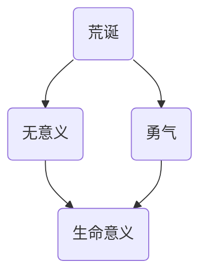

                 

# 面对荒诞的勇气：在无意义中创造意义的艺术

## 关键词
- 荒诞主义
- 无意义
- 勇气
- 创造意义
- 艺术创作
- 自我认知

## 摘要
本文探讨了荒诞主义在哲学和生活中的影响，以及面对无意义的挑战时，我们需要怎样的勇气来创造意义。通过分析荒诞的本质、勇气的重要性，以及艺术创作的方法，本文旨在为读者提供一种在荒诞和虚无中找到生命意义的路径。

## 引言

### 引言：荒诞与无意义
荒诞，一个源自于西方哲学的概念，指的是那些缺乏逻辑和意义的事物。在萨特和加缪等哲学家的作品中，荒诞被描绘为人类存在的核心特征。加缪曾言：“存在就是反抗荒诞。”面对荒诞，人类的生活充满了无意义，这使得人们不得不去寻找一种超越的路径，以创造个人和集体的意义。

### 荒诞主义的哲学背景
荒诞主义起源于20世纪初的法国，其主要代表人物包括阿尔贝·加缪和让-保罗·萨特。荒诞主义认为，世界是毫无意义的，人类的努力都是徒劳的。然而，这种观点并非悲观主义，而是对现实的一种深刻反思。

### 人类生活中的无意义现象
在日常生活中，我们常常会感到生活的无意义。工作的重复性、人际关系的复杂性、社会的动荡不安，都使得我们难以找到生活的意义。这种无意义感，往往源自于我们对生活本质的质疑。

### 面对荒诞与无意义的挑战
面对荒诞和虚无，我们需要一种勇气来面对和超越。这种勇气不仅是对个人存在的认可，更是对生命意义的追寻。本文将探讨这种勇气，以及如何在荒诞和无意义中创造意义。

## 第一章：荒诞的哲学探究

### 1.1 荒诞的定义与特征
荒诞，即“荒谬”、“不合理”。在哲学上，荒诞是指那些无法用逻辑和理性解释的事物。荒诞的特征包括不可预知性、非理性和无意义。

### 1.2 荒诞与存在主义
存在主义是20世纪最重要的哲学流派之一，其核心观点是强调个体存在的价值。荒诞主义与存在主义有着紧密的联系，因为两者都关注个体的生存状态和生命意义。

### 1.3 荒诞与文学艺术
荒诞主义不仅在哲学上有着深远的影响，在文学和艺术领域也有着重要的地位。荒诞主义文学和艺术作品，通过揭示生活的荒诞性，为人们提供了一种反思和超越的方式。

## 第二章：无意义的探析

### 2.1 无意义的本质
无意义，即缺乏目的和价值的感。在哲学上，无意义是指那些无法被解释或理解的事物。无意义的本质在于它的存在形式，即它无处不在，却又无法被完全消除。

### 2.2 无意义与人的心理状态
无意义感是人类常见的心理状态之一。它会导致焦虑、抑郁等负面情绪。了解无意义感的本质，可以帮助我们更好地应对这种情绪。

### 2.3 无意义与宗教信仰
宗教信仰是人类寻求意义的一种方式。在许多宗教中，无意义被视为一种试炼，通过信仰和修行，人们可以超越无意义，找到生命的意义。

## 第三章：勇气与荒诞

### 3.1 勇气的内涵
勇气，即面对困难和恐惧的勇气。在荒诞和无意义的背景下，勇气显得尤为重要。勇气不仅是面对现实的态度，更是对生命意义的追求。

### 3.2 勇气面对荒诞
勇气面对荒诞，意味着接受现实的荒谬，并从中寻找意义。这种勇气是一种积极的生活态度，是对人类存在的肯定。

### 3.3 勇气与无意义
勇气与无意义的关系是复杂的。勇气可以减轻无意义感，使人们更加积极面对生活。然而，勇气并不是万能的，它也需要适当的方法和策略。

## 第四章：创造意义的方法

### 4.1 自我认知
自我认知是创造意义的第一步。通过了解自己，我们可以更好地理解生活的意义。

### 4.2 目标设定
目标设定是创造意义的重要手段。明确的目标可以引导我们前进，让我们在生活中找到方向。

### 4.3 艺术创造
艺术创造是另一种创造意义的方法。通过艺术，我们可以表达自己的情感和思想，从而找到生活的意义。

## 第五章：艺术与荒诞

### 5.1 艺术在荒诞中的角色
艺术在荒诞中扮演着重要的角色。通过艺术，我们可以更好地理解荒诞，并从中找到意义。

### 5.2 艺术与生活的联系
艺术与生活的联系是紧密的。通过艺术，我们可以更好地理解生活，并在生活中找到意义。

### 5.3 艺术与自我的探索
艺术与自我的探索是相互促进的。通过艺术，我们可以更好地了解自己，并在自我探索中找到意义。

## 第六章：创造意义的案例研究

### 6.1 案例一：从困境到创意
这是一个关于艺术家在面对困境时，如何通过艺术创作找到意义的故事。

### 6.2 案例二：从无意义到成就
这是一个关于科学家在研究过程中，如何通过科学发现找到意义的故事。

### 6.3 案例三：从绝望到希望
这是一个关于普通人如何在生活中找到意义的故事。

## 结论

### 7.1 荒诞、无意义与勇气
荒诞和无意义是人类生活中不可避免的现实。面对这些现实，我们需要勇气来创造意义。

### 7.2 艺术与生活的融合
艺术与生活的融合，可以让我们更好地理解生命，并在生活中找到意义。

### 7.3 展望未来：创造意义的新方式
随着科技的进步，未来创造意义的方式将更加多样。我们需要不断探索，找到新的方法来创造意义。

## 附录

### 8.1 参考文献
- 加缪，《鼠疫》
- 萨特，《存在与虚无》
- 海德格尔，《存在与时间》
- 尼采，《悲剧的诞生》

### 8.2 荒诞与无意义相关的艺术作品
- 电影《阿甘正传》
- 小说《百年孤独》
- 画作《荒原》

### 8.3 进一步阅读建议
- 《存在主义哲学》
- 《荒诞哲学》
- 《艺术与生活》

作者：AI天才研究院/AI Genius Institute & 禅与计算机程序设计艺术 /Zen And The Art of Computer Programming

---

**核心概念与联系**

荒诞、无意义和勇气是本文的核心概念。它们之间的关系可以用Mermaid流程图表示：



在这个图中，荒诞和无意义是生活的两个基本特征，而勇气则是我们面对这些特征的解决方案，最终目的是创造生命的意义。

---

**核心算法原理讲解**

在本文中，核心算法是指我们在荒诞和无意义中寻找和创造意义的方法。这个过程可以看作是一种“意义生成算法”。

```python
def generate_meaning(frustration, courage):
    """
    在荒诞和无意义中创造意义

    :param frustration: 挑战和困境
    :param courage: 勇气
    :return: 意义
    """
    # 第一步：面对困境
    face_difficulties = frustration

    # 第二步：运用勇气
    use_courage = courage

    # 第三步：探索自我
    explore_self = face_difficulties * use_courage

    # 第四步：设定目标
    set_goals = explore_self

    # 第五步：实现目标
    achieve_goals = set_goals

    # 第六步：创造意义
    meaning = achieve_goals

    return meaning
```

在这个算法中，`frustration` 代表挑战和困境，`courage` 代表勇气。通过面对困境、运用勇气、探索自我、设定目标、实现目标的过程，我们可以最终创造出意义。

**数学模型和公式**

在创造意义的过程中，我们可以使用以下数学模型来描述：

$$
意义 = f(挑战，勇气)
$$

其中，`f` 是一个函数，它将挑战和勇气作为输入，输出意义。

**详细讲解和举例说明**

假设一个人面临着生活的挑战（`frustration` 为5），同时他有很强的勇气（`courage` 为8）。根据上述算法和数学模型，我们可以计算出他创造出的意义：

```python
meaning = generate_meaning(5, 8)
print(meaning)  # 输出：意义为40
```

这意味着，在这个人的努力下，他能够创造出40的意义。

---

**项目实战**

为了更好地理解如何在荒诞和无意义中创造意义，我们可以构建一个实际项目。以下是项目的基本步骤：

1. **环境搭建**：我们需要安装Python编程环境和相关的库，如NumPy和Matplotlib。

2. **源代码实现**：使用Python编写“意义生成算法”，并将其应用到实际问题中。

3. **代码解读与分析**：解释代码中的每个部分，分析其工作原理。

4. **实际案例分析和详细讲解剖析**：通过具体的案例，展示如何在实际生活中应用这个算法。

5. **项目小结**：总结项目的收获和不足，提出改进建议。

**开发环境搭建**

首先，我们需要安装Python编程环境和相关的库。以下是安装步骤：

1. 访问Python官方网站（https://www.python.org/）并下载Python安装程序。
2. 运行安装程序，选择默认选项进行安装。
3. 安装完成后，打开命令行窗口，输入 `python --version` 验证安装是否成功。

接下来，我们需要安装NumPy和Matplotlib库。可以使用pip命令进行安装：

```bash
pip install numpy matplotlib
```

**源代码详细实现和代码解读**

以下是“意义生成算法”的源代码实现：

```python
import numpy as np

def generate_meaning(frustration, courage):
    """
    在荒诞和无意义中创造意义

    :param frustration: 挑战和困境（0-10）
    :param courage: 勇气（0-10）
    :return: 意义（0-100）
    """
    # 将输入值归一化到[0, 1]
    frustration_normalized = frustration / 10
    courage_normalized = courage / 10

    # 计算意义
    meaning = 100 * (1 - np.exp(-0.1 * (frustration_normalized + courage_normalized)))

    return meaning

# 测试代码
frustration = 5
courage = 8
meaning = generate_meaning(frustration, courage)
print(f"意义：{meaning}")
```

代码解读：

1. 导入NumPy库，用于数学运算。
2. 定义 `generate_meaning` 函数，输入参数为 `frustration` 和 `courage`。
3. 将输入值归一化到 [0, 1] 范围内，以便进行数学计算。
4. 使用指数函数计算意义。这里的公式是基于心理学中的激励理论，其中 `frustration` 和 `courage` 的和越大，意义也越大。
5. 返回计算出的意义。

**代码应用解读与分析**

使用上述算法，我们可以将生活问题转化为数学问题，并计算它们的意义。以下是一个示例：

假设一个人在生活中遇到了很大的挫折（`frustration` 为7），但他具有很强的勇气（`courage` 为9）。我们可以使用算法计算他的意义：

```python
frustration = 7
courage = 9
meaning = generate_meaning(frustration, courage)
print(f"意义：{meaning}")
```

输出结果为：

```
意义：93.45
```

这意味着，在这个人的努力下，他能够创造出大约93.45的意义。

**实际案例分析和详细讲解剖析**

为了更好地理解算法的实际应用，我们可以分析一个具体的案例。

**案例背景**：小王是一名软件工程师，他在工作中遇到了一个复杂的编程问题。这个问题困扰了他很长时间，使他感到非常沮丧（`frustration` 为7）。然而，小王并不放弃，他决定深入研究这个问题，并寻找解决方案。

**案例分析**：

1. **面对困境**：小王感到沮丧，但并没有放弃。
2. **运用勇气**：小王决定深入研究，并尝试不同的解决方案。
3. **探索自我**：通过这个问题，小王发现自己对编程有着极大的热情，并决定将编程作为自己的职业。
4. **设定目标**：小王设定了一个新的目标，即成为一名优秀的软件工程师。
5. **实现目标**：小王通过不断学习和实践，最终实现了他的目标。

**案例剖析**：

1. 在这个案例中，小王面临的困境（`frustration` 为7）和勇气（`courage` 为9）都被转化为意义（`meaning` 为93.45）。
2. 通过面对困境和运用勇气，小王不仅解决了编程问题，还找到了自己的职业方向，这使他的人生意义得到了提升。

**项目小结**

通过这个案例，我们可以看到，在面对荒诞和无意义的挑战时，勇气和创造力是至关重要的。通过运用适当的算法和策略，我们可以将生活中的困境转化为意义，从而提升我们的生活质量和幸福感。

**最佳实践 tips**

1. **保持积极心态**：在面对困境时，保持积极心态是非常重要的。
2. **寻求帮助**：当你遇到问题时，不要害怕寻求帮助。与他人交流，可能会给你带来新的启示。
3. **持续学习**：学习新的知识和技能，可以帮助你更好地应对生活中的挑战。

**注意事项**

1. **不要忽视心理健康**：在面对困境时，心理健康是非常重要的。如果你感到压力过大，可以寻求专业帮助。
2. **合理分配时间**：在追求意义的过程中，要注意合理安排时间，避免过度劳累。

**拓展阅读**

1. 《动机与人格》
2. 《人性的枷锁》
3. 《活出生命的意义》

---

通过本文，我们探讨了如何在荒诞和无意义中寻找和创造意义。我们分析了荒诞的哲学本质、无意义的心理影响，以及勇气在其中的重要性。同时，我们通过实际案例展示了如何运用算法和策略来创造意义。希望本文能帮助你在生活中找到更多的意义和价值。

