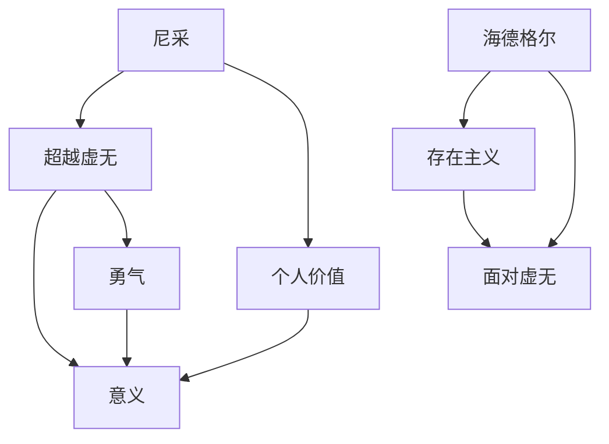
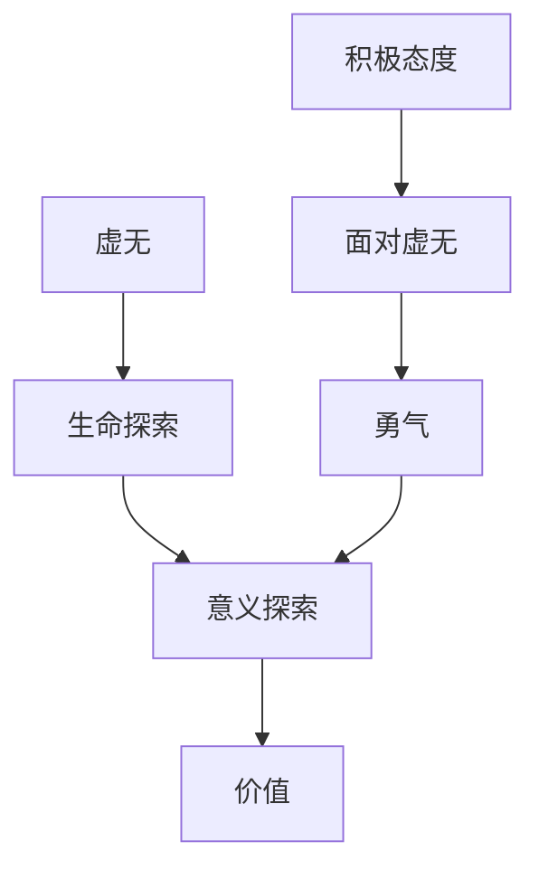
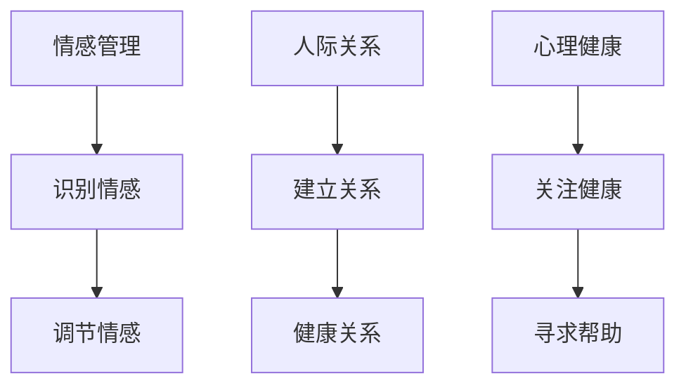
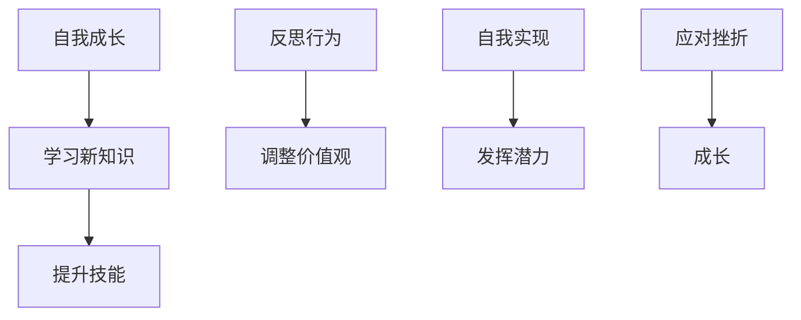
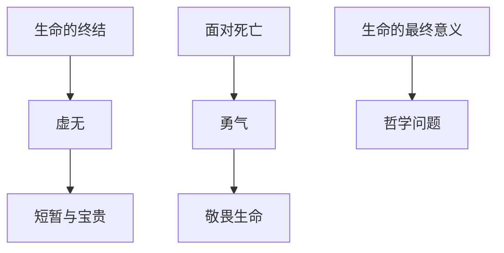

                 

# 面对虚无的勇气：积极的生命态度

## 关键词

- 虚无
- 生命意义
- 积极态度
- 情感管理
- 人际关系
- 心理健康
- 成长
- 勇气

## 摘要

本文旨在探讨虚无的概念及其对现代生命态度的影响，进而提出一种积极面对虚无的态度和方法。文章首先分析了虚无的哲学探讨和其在现代社会中的影响，随后探讨了虚无与生命意义的关系。接着，文章提出了积极面对虚无的策略，包括情感管理、人际关系处理和心理健康的培养。最后，文章强调了面对挑战和成长的重要性，以及如何在生命的最后旅程中找到勇气和意义。通过本文的讨论，希望能够帮助读者建立积极的生命态度，勇敢面对虚无带来的挑战。

## 第一部分：勇敢面对虚无

### 第1章：虚无的概念与意义

#### 1.1 虚无的哲学探讨

虚无，作为一个哲学概念，自古希腊哲学以来就一直存在。在古希腊哲学中，虚无被认为是宇宙的起源和本质。亚里士多德认为，虚无是“非存在”的状态，它是万物的对立面，但也是万物存在的前提。康德则认为，虚无是先验范畴，即我们认识世界的基本框架。

在现代哲学中，虚无的概念被进一步探讨。尼采认为，虚无是存在的对立面，它是一种缺乏意义和价值的状态。海德格尔则将虚无视为存在的空虚，是人类存在的本质。

#### 1.2 虚无在现代社会的影响

虚无在现代社会的影响日益显著。一方面，科技的飞速发展使得人们的生活变得便利，但同时也让人们感到孤独和失去意义。另一方面，物质生活的丰富并没有带来精神上的满足，许多人感到虚无和迷茫。

#### 1.3 面对虚无的哲学观点

面对虚无，不同的哲学家提出了不同的观点。尼采主张通过超越虚无，寻找个人的价值和意义。海德格尔则认为，通过存在主义，人们可以找到面对虚无的力量和勇气。

### Mermaid 流程图：虚无的哲学观点关系架构



### 第2章：虚无与生命意义

#### 2.1 虚无下的生命探索

虚无让我们开始反思生命的意义。在没有外在意义和价值的世界中，我们如何找到自己的位置和价值？

#### 2.2 寻找生命的意义

寻找生命的意义是一个漫长而复杂的过程。这个过程需要我们不断地探索、尝试和反思。每个人都有自己的方式来寻找生命的意义，无论是通过工作、家庭、艺术还是宗教。

#### 2.3 虚无与积极的生命态度

面对虚无，我们需要有一种积极的生命态度。这种态度不是逃避虚无，而是勇敢地面对它，从中找到力量和勇气。

### Mermaid 流�程图：虚无与生命意义的关系架构



### 第3章：积极面对虚无的策略

#### 3.1 接受虚无，拥抱生命

首先，我们需要接受虚无的存在，这是面对虚无的第一步。接受虚无并不意味着消极或绝望，而是承认世界的不确定性和变化。

#### 3.2 建立自己的价值观

建立自己的价值观可以帮助我们更好地面对虚无。当我们有自己的价值观时，我们就有了判断和选择的标准，这使我们能够更加坚定地走自己的路。

#### 3.3 调整心态，积极应对

调整心态，积极应对是面对虚无的关键。我们需要学会接受失败和挫折，从中吸取经验和教训，不断地前进。

### Python 源代码：调整心态，积极应对

```python
import random

def positive_mentality():
    while True:
        event = random.choice(['失败', '挫折', '困难'])
        response = random.choice(['消极应对', '积极应对'])
        if response == '消极应对':
            print(f"面对{event}，你选择了消极应对。这让你感到更加疲惫和绝望。")
        else:
            print(f"面对{event}，你选择了积极应对。你从中吸取了经验和教训，变得更加坚强。")

positive_mentality()
```

### 第4章：积极的生命态度实践

#### 4.1 情感管理

情感管理是积极生命态度的重要组成部分。我们需要学会识别和调节自己的情感，避免被负面情绪所支配。

#### 4.2 人际关系

人际关系对我们的生活有着深远的影响。我们需要学会如何与人相处，建立健康、积极的人际关系。

#### 4.3 心理健康

心理健康是积极生命态度的基础。我们需要关注自己的心理健康，寻求帮助和资源，以保持良好的心理状态。

### Mermaid 流程图：积极生命态度实践的关系架构



### 第5章：面对挑战，勇敢前行

#### 5.1 挑战与成长的关系

挑战是我们成长的机会。通过面对挑战，我们可以学习新知识，提升自己的能力。

#### 5.2 面对挑战的策略

面对挑战，我们需要有策略和计划。我们需要识别挑战，分析其性质，并制定相应的应对策略。

#### 5.3 勇气的力量

勇气是面对挑战的重要品质。勇气使我们能够克服恐惧，勇往直前。

### Python 源代码：勇气面对挑战

```python
import random

def courage():
    challenges = ['失败', '挫折', '困难']
    responses = ['放弃', '逃避', '勇敢面对']
    for i in range(3):
        challenge = random.choice(challenges)
        response = random.choice(responses)
        if response == '勇敢面对':
            print(f"面对{challenge}，我选择了勇敢面对。这让我感到更加自信和强大。")
        else:
            print(f"面对{challenge}，我选择了{response}。这让我感到恐惧和不安。")

courage()
```

### 第6章：自我成长与实现

#### 8.1 自我成长的路径

自我成长是一个漫长而复杂的过程。它包括学习新知识、提升技能、反思自己的行为和价值观。

#### 8.2 自我实现的追求

自我实现是许多人追求的目标。它意味着我们能够充分发挥自己的潜力，实现自己的价值。

#### 8.3 成长中的挫折与应对

在自我成长的过程中，我们不可避免地会遇到挫折。如何应对挫折是自我成长的关键。

### Mermaid 流程图：自我成长与实现的关系架构



### 第7章：生命的最后旅程

#### 9.1 生命的终结与虚无

生命的终结是虚无的一部分。它让我们认识到生命的短暂和宝贵。

#### 9.2 面对死亡的勇气

面对死亡，我们需要有勇气和坦然。这种勇气不仅是对死亡的接受，更是对生命的敬畏。

#### 9.3 生命的最终意义

生命的最终意义是什么？这是一个哲学问题，每个人都有自己的答案。

### Mermaid 流程图：生命的最后旅程的关系架构



## 附录

### 附录A：推荐阅读与进一步学习

- 《哲学的慰藉》- 阿兰·德波顿
- 《生命的智慧》- 埃克哈特·托利
- 《人类简史》- 尤瓦尔·赫拉利

### 附录B：生命态度相关的书籍与资源

- 《积极心理学》- 菲利普·布里克曼
- 《幸福的法则》- 沃尔特·米斯纳
- [Coursera](https://www.coursera.org/) 上的《心理学导论》课程

## 作者信息

作者：AI天才研究院/AI Genius Institute & 禅与计算机程序设计艺术 /Zen And The Art of Computer Programming

本文旨在探讨虚无的概念及其对现代生命态度的影响，并提出一种积极面对虚无的态度和方法。通过本文的讨论，希望能够帮助读者建立积极的生命态度，勇敢面对虚无带来的挑战。

