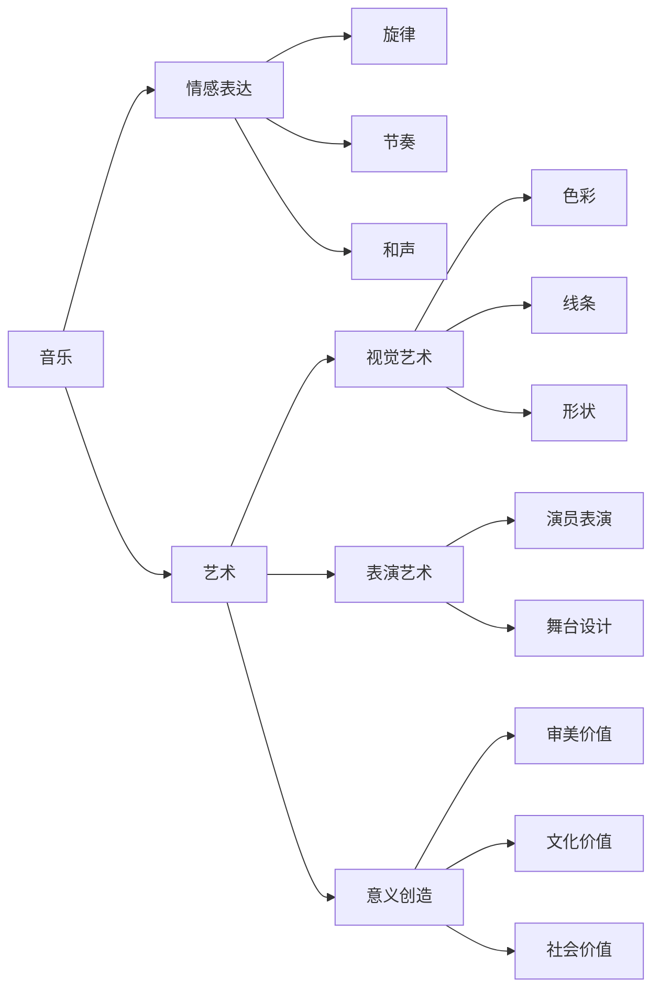
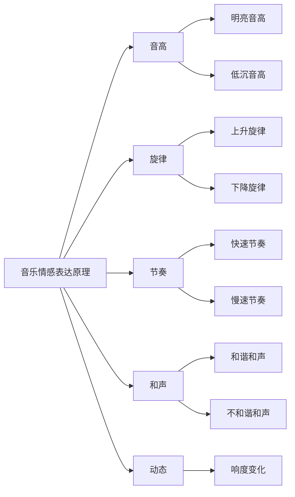
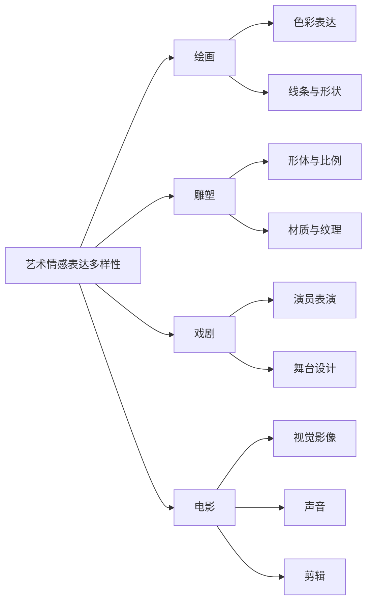
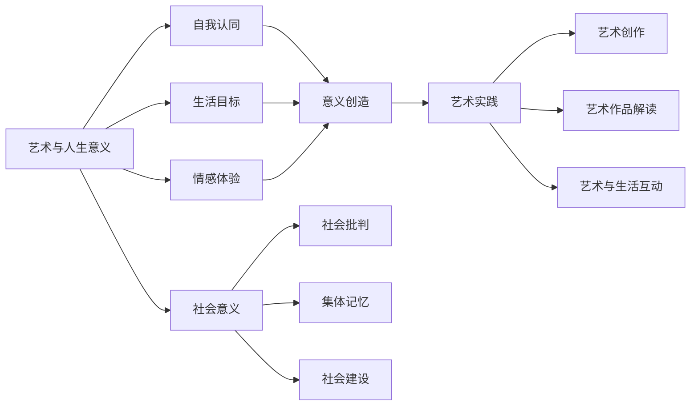
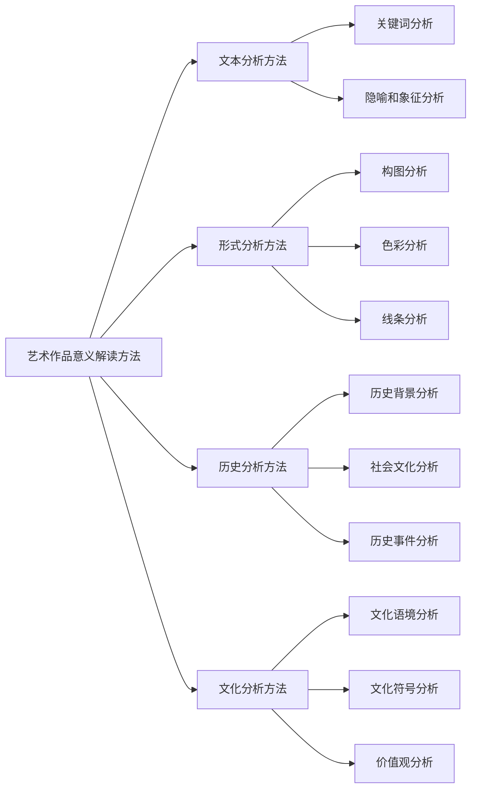
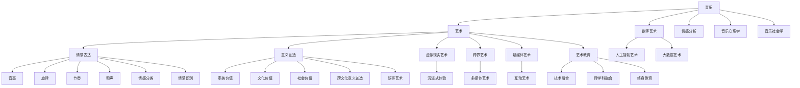

                 

# 第1章：引言

## 1.1 音乐与艺术的关系

### 1.1.1 音乐的定义与特点

音乐是一种通过声音和节奏来表现情感和思想的艺术形式。它具有抽象性、情感性和时间性三大特点。抽象性表现在音乐不直接描绘具体事物，而是通过音符、旋律和节奏等元素来表达抽象的情感和概念。情感性则是音乐最显著的特点之一，它能够引起听众的情感共鸣，传递快乐、悲伤、愤怒等情绪。时间性意味着音乐是一种动态的艺术形式，它的表现是连续的、流动的，与空间性的视觉艺术有所不同。

### 1.1.2 艺术的定义与特点

艺术是一种通过视觉、听觉、触觉等感官来传达思想、情感和审美体验的形式。艺术具有创造性、表现性和多样性。创造性指的是艺术家通过创新思维和独特视角来创作作品。表现性是指艺术作品能够表达艺术家的思想、情感和意图。多样性则体现在艺术的形式和媒介上，包括绘画、雕塑、建筑、音乐、舞蹈、戏剧、电影等。

### 1.1.3 音乐与艺术的联系

音乐与艺术之间的关系是复杂而紧密的。首先，它们都能引起人们的情感共鸣，激发内心深处的感受。其次，音乐和艺术在表现形式上具有互补性。音乐可以通过声音和节奏来表达情感，而艺术则可以通过视觉元素如色彩、线条和形状来实现同样的效果。此外，音乐和艺术常常相互融合，创造出独特的艺术作品。例如，许多电影和戏剧都依赖于背景音乐来增强情感表达和氛围营造。

## 1.2 情感表达在音乐与艺术中的重要性

### 1.2.1 情感表达的概念与作用

情感表达是通过艺术作品传达作者情感和思想的过程。在音乐和艺术中，情感表达具有以下几个作用：

1. **增强感染力**：艺术作品通过情感表达，能够更深刻地感染观众，使观众产生共鸣。
2. **提高艺术价值**：情感表达是艺术作品的重要组成部分，它能够提升作品的艺术价值。
3. **促进文化交流**：情感表达有助于跨越文化和语言的障碍，促进不同文化之间的交流和理解。

### 1.2.2 音乐中的情感表达

音乐通过旋律、节奏、和声等元素来表达情感。例如，旋律可以表达旋律线的起伏来传达快乐或悲伤的情感；节奏可以增强音乐的情感表达，使音乐更加有力和激动；和声则可以通过不同音高的结合来传达复杂的情感。

### 1.2.3 艺术中的情感表达

艺术中的情感表达形式多样，包括视觉艺术、表演艺术等。视觉艺术通过色彩、线条和形状来表达情感，如梵高的《向日葵》通过明亮的色彩表达对生活的热爱。表演艺术则通过演员的表演、舞台设计等来传达情感，如莎士比亚的《哈姆雷特》通过演员的表演传达人物的内心挣扎和痛苦。

## 1.3 意义创造与艺术价值的理解

### 1.3.1 意义创造的概念与作用

意义创造是通过艺术作品传达作者对社会、人生等方面的理解和思考。它在艺术创作中具有以下作用：

1. **提高思想深度**：意义创造能够使艺术作品具有更深远的思想意义，提升作品的思想深度。
2. **丰富文化内涵**：意义创造有助于艺术作品传达丰富的文化内涵，增进人们对文化价值的理解。
3. **促进社会进步**：艺术作品通过意义创造，可以启发人们的思考，推动社会进步。

### 1.3.2 艺术价值的理解

艺术价值包括审美价值、文化价值和社会价值。审美价值是指艺术作品的美学品质，如色彩搭配、构图和谐等。文化价值是指艺术作品所传达的思想和文化内涵。社会价值是指艺术作品对社会的影响和贡献，如启迪人们的思想、提高道德素养等。

### 1.4 音乐与艺术的互动与影响

#### 1.4.1 音乐对艺术的影响

音乐对艺术的影响主要体现在以下几个方面：

1. **音乐与绘画**：19世纪印象派绘画受到音乐的影响，注重色彩和光影的变化。
2. **音乐与雕塑**：现代雕塑常常融入音乐元素，创造出独特的视觉和听觉体验。

#### 1.4.2 艺术对音乐的影响

艺术对音乐的影响同样不可忽视：

1. **艺术对音乐创作的启发**：艺术家们的作品常常为音乐家提供创作灵感。
2. **艺术对音乐欣赏的影响**：艺术作品能够丰富人们对音乐的理解和欣赏。

## 概念关系架构图



----------------------------------------------------------------

# 第2章：音乐的情感表达

## 2.1 音乐的情感表达原理

音乐的情感表达原理源于人类对声音和节奏的自然反应。音乐中的情感表达可以通过以下几个核心元素来实现：

### 2.1.1 音高

音高是音乐的基本元素之一，它决定了音乐的音调。高音通常给人以轻盈、愉悦的感觉，而低音则带有沉重、严肃的气氛。音高的变化和对比可以产生紧张和松弛的效果，从而影响听众的情感体验。

### 2.1.2 旋律

旋律是由一系列音高按照一定的顺序和模式排列而成的，它赋予音乐以结构和情感。旋律的起伏、跳跃和流畅性可以表达不同的情感。例如，上升的旋律通常传达希望和喜悦，而下降的旋律则表达忧郁和悲伤。

### 2.1.3 节奏

节奏是音乐的时间结构，它决定了音乐的速度、强弱和拍子。节奏的快慢、强弱和规律性可以影响听众的情感体验。快速的节奏通常传达活力和激动，而慢节奏则传达宁静和沉思。

### 2.1.4 和声

和声是由多个音同时演奏或演唱而产生的，它为音乐提供了色彩和深度。和声的选择和组合可以表达复杂和多样的情感。例如，大三和弦通常传达和谐和稳定的情感，而小三和弦则传达悲伤和不安。

### 2.1.5 动态

动态是指音乐中的响度变化，它通过音量的大小来传达情感。动态的对比和变化可以使音乐更加生动和感人。例如，从弱音到强音的过渡可以表达情感的激增和爆发。

## 2.2 音乐的情感分类与识别

音乐的情感分类与识别是音乐心理学和音乐理论的重要研究领域。根据音乐的情感特征，可以将音乐分为以下几种基本情感：

### 2.2.1 快乐

快乐是音乐中最常见的情感之一，它通过明亮的音高、快速的节奏和强烈的动态变化来表达。例如，一首欢快的舞曲通常会使听众感到愉悦和兴奋。

### 2.2.2 悲伤

悲伤是另一种常见的音乐情感，它通过较低的音高、缓慢的节奏和柔和的动态变化来表达。例如，一首悲伤的民谣或古典音乐作品可以唤起听众的同情和共鸣。

### 2.2.3 愤怒

愤怒是音乐中较为激烈的情感，它通过强烈的音高对比、快速的节奏和突兀的动态变化来表达。例如，一首摇滚乐或重金属音乐可以传达愤怒和反抗的情绪。

### 2.2.4 恐惧

恐惧是音乐中传达紧张和不安情感的一种方式，它通常通过不和谐的音高、不规律的节奏和急促的动态变化来实现。例如，一首惊悚音乐或恐怖音乐可以引发听众的恐惧感。

### 2.2.5 其他情感

除了上述基本情感，音乐还可以传达诸如爱、希望、平静、厌恶等多种复杂的情感。这些情感往往通过更细腻的音乐元素和复杂的情感变化来实现。

## 2.3 音乐创作中的情感运用

音乐创作中的情感运用是音乐家的核心技能之一。音乐家通过以下几种方式来运用情感创作音乐：

### 2.3.1 情感主题的构建

音乐家在创作时，通常会构建一个情感主题，并通过一系列音乐元素来表现和深化这一主题。例如，一首歌可能以快乐为主题，通过旋律、节奏和和声等元素来传达这一情感。

### 2.3.2 情感对比和变化

音乐家通过对比和变化情感来表达复杂的情感体验。例如，一首歌可能在开头传达快乐和希望，而在结尾传达悲伤和失望，从而表达人生中的起伏和变化。

### 2.3.3 情感暗示和象征

音乐家还可以通过暗示和象征来传达情感。例如，一首歌的旋律可能暗示了爱情的甜蜜，而和声的变化可能象征了爱情的痛苦。

### 2.3.4 情感共鸣

音乐家通过创作具有普遍情感共鸣的音乐，使听众能够在音乐中找到情感共鸣。例如，一首流行的情歌能够唤起听众对爱情的思考和回忆。

## 2.4 情感音乐分析案例

为了更好地理解音乐的情感表达，我们可以通过分析一些经典的音乐作品来探讨它们是如何表达情感的。

### 2.4.1 案例一：《欢乐颂》（Beethoven's Symphony No. 9）

贝多芬的《第九交响曲》中的《欢乐颂》是一首著名的乐章，它传达了希望、喜悦和团结的情感。通过明亮的音高、强烈的节奏和宏伟的和声，贝多芬成功地表达了这些情感。

- **音高**：整部乐章的音高明亮而高亢，给人以希望和喜悦的感觉。
- **旋律**：旋律线条起伏较大，充满了激情和活力。
- **节奏**：节奏强劲而有力，增强了音乐的感染力。
- **和声**：和声丰富而宏伟，展现了团结和力量的情感。

### 2.4.2 案例二：《月光奏鸣曲》（Moonlight Sonata）

贝多芬的《月光奏鸣曲》传达了忧郁和沉思的情感。通过较低的音高、缓慢的节奏和柔和的动态变化，贝多芬成功地表达了这些情感。

- **音高**：乐章的音高较低，给人以忧郁和沉思的感觉。
- **旋律**：旋律线条较为平稳，带有一些转折和起伏，传达了内心的挣扎。
- **节奏**：节奏缓慢而稳定，增强了音乐的宁静感。
- **动态**：动态变化较小，保持了音乐的柔和和静谧。

### 2.4.3 案例三：《Yesterday》（The Beatles）

甲壳虫乐队的《Yesterday》传达了悲伤和怀旧的情感。通过较低的音高、缓慢的节奏和柔和的动态变化，这首歌成功地表达了这些情感。

- **音高**：音高较低，传达了悲伤和忧郁的情感。
- **旋律**：旋律线条平稳，带有一些转折和起伏，传达了内心的挣扎。
- **节奏**：节奏缓慢而稳定，增强了音乐的宁静感。
- **动态**：动态变化较小，保持了音乐的柔和和静谧。

通过以上案例分析，我们可以看到音乐家如何通过不同的音乐元素来表达情感，从而创造出动人的音乐作品。

## 概念关系架构图



----------------------------------------------------------------

# 第3章：艺术情感表达的多样性

艺术情感表达是艺术家通过创作媒介传达情感和思想的过程。不同的艺术形式具有独特的情感表达方式和技巧，本章将探讨绘画、雕塑、戏剧和电影中情感表达的多样性。

## 3.1 绘画中的情感表达

绘画是艺术中最古老和最直观的形式之一，它通过色彩、线条和形状来传达情感。

### 3.1.1 色彩表达情感

色彩在绘画中是表达情感的重要手段。不同的色彩可以传达不同的情感。例如，暖色调（如红色、黄色和橙色）通常传达快乐、温暖和激情，而冷色调（如蓝色、绿色和紫色）则传达忧郁、冷静和宁静。

- **红色**：强烈的色彩，可以表达愤怒、热情或激情。
- **黄色**：明亮且具有活力，传达快乐、希望和活力。
- **蓝色**：通常传达宁静、冷静和忧郁。

### 3.1.2 线条与形状

线条和形状也是绘画中表达情感的关键元素。硬线条和锐利的形状通常传达力量和决心，而柔和的线条和圆形的形状则传达温柔和和谐。

- **硬线条**：传达力量和决心，如荷兰画家伦勃朗的作品。
- **柔和线条**：传达温柔和和谐，如印象派画家的作品。

### 3.1.3 情感案例

- **米开朗基罗的《大卫》**：通过简洁的线条和动态的姿态，表达了大卫的坚定和力量。
- **莫奈的《睡莲》**：通过鲜艳的色彩和细腻的笔触，表达了自然的宁静和和谐。

## 3.2 雕塑中的情感表达

雕塑是三维艺术形式，它通过体积、形态和细节来表达情感。

### 3.2.1 形体与比例

雕塑的形体和比例是表达情感的关键。形态的夸张和比例的失衡可以传达强烈的情感。

- **夸张的形态**：如米开朗基罗的《大卫》，通过夸张的形态表达了大卫的坚定和力量。
- **平衡的形态**：如罗丹的《思想者》，通过平衡的形态表达了沉思和内在的冲突。

### 3.2.2 材质与纹理

雕塑的材质和纹理也可以表达情感。不同的材质可以传达不同的情感，如石头的沉重、金属的坚硬和陶瓷的细腻。

- **石头**：传达沉重和稳定，如古希腊的雕塑。
- **金属**：传达坚硬和力量，如文艺复兴时期的雕塑。

### 3.2.3 情感案例

- **罗丹的《思想者》**：通过紧张的形态和细腻的纹理，表达了沉思和内在的冲突。
- **贝多芬的《庄严的死亡》**：通过沉重的形态和冷静的纹理，表达了死亡和庄严。

## 3.3 戏剧中的情感表达

戏剧是表演艺术的一种，它通过演员的表演、舞台设计和剧本来传达情感。

### 3.3.1 演员的表演

演员的表演是戏剧中情感表达的核心。通过身体语言、面部表情和声音，演员可以传达角色的情感。

- **身体语言**：如手势、姿态和动作，可以表达情感和角色的性格。
- **面部表情**：如微笑、哭泣和愤怒，可以传达内心的情感。

### 3.3.2 舞台设计

舞台设计可以通过灯光、布景和道具来增强情感表达。

- **灯光**：可以增强情感的氛围，如明亮的灯光传达喜悦，暗淡的灯光传达忧郁。
- **布景**：可以设定故事背景，增强情感的真实感。
- **道具**：如家具、武器和服装，可以表达角色的性格和情感。

### 3.3.3 情感案例

- **莎士比亚的《哈姆雷特》**：通过演员的表演和舞台设计，表达了复杂的人物情感和心理冲突。
- **贝克特的《等待戈多》**：通过简约的舞台设计和平淡的表演，传达了荒诞性和无奈的情感。

## 3.4 电影中的情感表达

电影是视听艺术的一种，它通过影像、声音和剪辑来传达情感。

### 3.4.1 视觉影像

视觉影像是电影情感表达的重要手段。通过色彩、构图和镜头运动，电影可以传达情感。

- **色彩**：如鲜艳的色彩传达快乐，暗淡的色彩传达悲伤。
- **构图**：如对称的构图传达稳定，不对称的构图传达不安。
- **镜头运动**：如缓慢的镜头运动传达平静，快速的镜头运动传达紧张。

### 3.4.2 声音

声音在电影中可以增强情感表达。通过音乐、对话和环境声音，电影可以传达情感。

- **音乐**：如欢快的音乐传达喜悦，悲伤的音乐传达悲伤。
- **对话**：如语气和语调的变化，可以表达角色的情感。
- **环境声音**：如风雨声、脚步声和关门声，可以增强情境的真实感。

### 3.4.3 剪辑

剪辑是电影叙事和情感表达的重要手段。通过不同的剪辑技巧，电影可以创造情感高潮和情感转折。

- **快速剪辑**：如闪回和闪前，可以创造紧张和不确定的氛围。
- **慢动作**：如慢动作镜头，可以强调角色的情感和动作。
- **平行剪辑**：如交叉剪辑，可以创造复杂的情感关系和叙事结构。

### 3.4.4 情感案例

- **《泰坦尼克号》**：通过视觉影像、音乐和剪辑，传达了爱情和悲剧的情感。
- **《肖申克的救赎》**：通过视觉影像、对话和剪辑，传达了希望和自由的情感。

## 概念关系架构图



通过以上对不同艺术形式的情感表达方式的探讨，我们可以看到艺术如何通过多样的手段来传达情感和思想。无论是绘画中的色彩和线条，雕塑中的形态和材质，戏剧中的表演和舞台设计，还是电影中的视觉影像、声音和剪辑，它们都是艺术家表达情感的重要工具。艺术不仅能够传达情感，还能够激发观众的思考和共鸣，这是艺术永恒的魅力所在。

----------------------------------------------------------------

# 第4章：意义创造的哲学思考

## 4.1 艺术与人生意义的联系

艺术与人生意义的联系是深刻且复杂的。艺术家通过作品传达对生活的理解、对社会的批判以及对人性的探索，这些作品不仅反映了艺术家的内心世界，也触动了观众的心灵。从哲学的角度来看，艺术的意义创造与人生的探索有着紧密的联系。

### 4.1.1 艺术的镜子与现实的反照

艺术被视为现实的镜子，它能够揭示人类的本质和社会的真相。艺术家通过创作，将内心的感悟和对现实的观察转化为视觉或听觉的形式，从而让观众在欣赏艺术作品时，不仅仅是享受美感，还能反思和思考生活。

### 4.1.2 艺术作为意义的载体

艺术作为一种独特的语言，能够超越文字和语言的限制，直接触及人心。它不仅仅是美的展现，更是意义的传递。艺术家通过艺术创作，探索和传达人生的意义，使观众在艺术体验中找到共鸣和启示。

### 4.1.3 艺术与人生意义的互动

艺术与人生意义之间存在互动关系。艺术家的创作灵感往往来源于生活，而艺术作品又会影响人们对生活的理解和态度。例如，一部深刻反映社会问题的电影，可能会引发观众对社会现象的反思，进而促进社会的进步。

## 4.2 意义创造的心理学基础

意义创造是心理学研究的一个重要领域。从心理学的角度来看，意义创造是人类心理活动的一个重要方面，它关乎个体的自我认同、生活目标和情感体验。

### 4.2.1 自我认同与意义创造

自我认同是意义创造的基础。个体通过理解自我，赋予生活意义，从而建立自我认同。艺术作品通过描绘人性的复杂性和多样性，帮助观众理解自己，找到自我认同。

### 4.2.2 生活目标与意义创造

生活目标是意义创造的驱动力。艺术家通过作品传达对生活的目标和价值观念，激发观众对生活的思考和追求。例如，一幅描绘幸福生活的画作，可能会激励观众追求自己的幸福。

### 4.2.3 情感体验与意义创造

情感体验是意义创造的重要途径。艺术作品通过情感表达，激发观众的情感共鸣，使观众在情感体验中找到生活的意义。例如，一首动人的音乐，可以唤起观众对美好回忆的怀念，从而赋予生活意义。

## 4.3 意义创造的艺术实践

意义创造不仅仅是哲学和心理学的研究领域，也是艺术实践的核心理念。艺术家通过创作，不断探索和实现意义创造。

### 4.3.1 艺术创作的意义追求

艺术家在创作过程中，往往追求作品的意义和价值。他们通过探索不同的主题、形式和技巧，试图传达深刻的情感和思想，使作品具有持久的生命力。

### 4.3.2 艺术作品的意义解读

观众在欣赏艺术作品时，也需要进行意义解读。他们通过自己的经验和知识，理解和解读作品的内涵，从而找到与作品的情感共鸣和思想启示。

### 4.3.3 艺术与生活的意义互动

艺术不仅存在于博物馆和画廊中，也存在于日常生活中。艺术作品的意义创造，不仅影响个体的内心世界，也影响社会和文化的发展。例如，街头艺术可以激发社区活力，公共艺术可以提升城市文化品质。

## 4.4 艺术与社会意义的关联

艺术与社会意义之间存在紧密的关联。艺术作品可以反映社会现实，批判社会问题，推动社会变革。

### 4.4.1 艺术的社会批判功能

艺术作为一种批判性工具，可以揭示社会的不公和弊端。例如，一些社会现实题材的绘画和文学作品，通过揭露社会问题，引发公众的关注和反思。

### 4.4.2 艺术的集体记忆功能

艺术作品可以作为集体记忆的载体，传承历史和文化。例如，雕塑和历史遗迹，既是历史的见证，也是文化的象征。

### 4.4.3 艺术的社会建设功能

艺术可以促进社会的和谐与进步。通过艺术教育和文化活动，人们可以增强文化自信，提升生活品质，促进社会和谐。

### 概念关系架构图



通过以上对艺术与人生意义、心理学基础和艺术实践的分析，我们可以看到，艺术不仅是一种美的表达，更是一种意义的创造。它通过哲学思考、心理学研究和艺术实践，不断探索和传达人生的意义，影响个体的生活和社会的发展。艺术的意义创造，使我们在纷繁复杂的世界中找到方向，赋予生活更深层次的意义和价值。

----------------------------------------------------------------

# 第5章：艺术作品的意义分析

## 5.1 艺术作品意义解读的方法

艺术作品的意义解读是一个复杂而多层次的过程，涉及到心理学、哲学、历史和文化等多个领域。以下是一些常用的方法：

### 5.1.1 文本分析方法

文本分析方法是一种基于文本内容来解读艺术作品意义的方法。它主要关注艺术作品的文字描述、图像和符号，通过分析文本的语言、隐喻和象征来解读作品的深层含义。

- **步骤**：
  1. 阅读艺术作品的文本描述。
  2. 分析文本中的关键词和短语。
  3. 研究文本中的隐喻和象征。
  4. 将文本内容与作品的形式和风格联系起来。

### 5.1.2 形式分析方法

形式分析方法是一种基于艺术作品的形式特征来解读意义的方法。它关注艺术作品的视觉、听觉、触觉等感官特征，通过分析作品的构图、色彩、线条、音调等来解读作品的情感和意义。

- **步骤**：
  1. 观察艺术作品的形式特征。
  2. 分析作品的构图和布局。
  3. 研究作品的色彩和光线效果。
  4. 探索作品的音调和节奏。

### 5.1.3 历史分析方法

历史分析方法是一种基于艺术作品的历史背景和文化背景来解读意义的方法。它关注艺术作品产生的时代背景、历史事件和社会环境，通过分析这些因素来解读作品的意义。

- **步骤**：
  1. 研究艺术作品的创作时期和历史背景。
  2. 分析艺术作品与当时社会文化的联系。
  3. 考察艺术作品对历史事件的反映。
  4. 探索艺术作品的历史意义。

### 5.1.4 文化分析方法

文化分析方法是一种基于艺术作品的文化语境来解读意义的方法。它关注艺术作品的文化特征、价值观和信仰体系，通过分析这些因素来解读作品的意义。

- **步骤**：
  1. 研究艺术作品的文化背景和语境。
  2. 分析作品中的文化符号和象征。
  3. 探索作品中的文化价值观和信仰。
  4. 解读作品的文化意义。

## 5.2 代表性艺术作品的意义分析

为了更好地理解艺术作品的意义分析方法，以下分析一些具有代表性的艺术作品：

### 5.2.1 米开朗基罗的《大卫》

《大卫》是文艺复兴时期的一件杰作，它展示了米开朗基罗对人体结构和动态姿态的精湛掌握。

- **文本分析**：
  - 作品描述：大卫是一个年轻而勇敢的战士，他手持投石器，准备迎接敌人。
  - 深层含义：大卫象征着人类的力量和勇气，同时也反映了米开朗基罗对古典艺术的热爱和对人性的赞美。

- **形式分析**：
  - 形式特征：作品采用大理石雕刻，大卫的形态充满力量和动态感。
  - 深层含义：雕塑的立体感和细节处理，传达了大卫的坚定和力量。

- **历史分析**：
  - 创作时期：15世纪末至16世纪初，文艺复兴时期。
  - 深层含义：这一时期正是欧洲文艺复兴的巅峰时期，作品反映了当时的艺术思潮和社会价值观。

- **文化分析**：
  - 文化背景：大卫是《旧约圣经》中的英雄，他的形象在西方文化中具有深远的影响力。
  - 深层含义：作品传达了对英雄主义和道德价值观的尊重。

### 5.2.2 莫奈的《睡莲》

《睡莲》是印象派画家莫奈的代表作之一，它展示了艺术家对光影和色彩的独特见解。

- **文本分析**：
  - 作品描述：一系列描绘池塘中睡莲的画作。
  - 深层含义：作品传达了对自然美的赞美和对生活的热爱。

- **形式分析**：
  - 形式特征：画作中的色彩鲜艳而细腻，光影变化丰富。
  - 深层含义：色彩和光影的处理，传达了莫奈对自然的敏锐感知和艺术创造力。

- **历史分析**：
  - 创作时期：19世纪末至20世纪初，印象派绘画的兴盛时期。
  - 深层含义：作品反映了当时艺术界对光影和色彩的新探索。

- **文化分析**：
  - 文化背景：印象派绘画在欧洲艺术史上具有重要的地位，对后世的绘画艺术产生了深远的影响。
  - 深层含义：作品传达了对现代生活的感悟和对艺术的创新精神。

### 5.2.3 贝多芬的《第九交响曲》

《第九交响曲》是贝多芬的代表作之一，它以其宏大的规模和深刻的情感表达而著称。

- **文本分析**：
  - 作品描述：一部四个乐章的大型交响曲。
  - 深层含义：作品传达了对人类尊严、自由和团结的赞美。

- **形式分析**：
  - 形式特征：音乐结构复杂，情感表达强烈。
  - 深层含义：音乐的旋律和和声处理，传达了深刻的情感和思想。

- **历史分析**：
  - 创作时期：19世纪初，欧洲浪漫主义时期的巅峰时期。
  - 深层含义：作品反映了当时社会的变革和人们对自由和理想的追求。

- **文化分析**：
  - 文化背景：第九交响曲在西方音乐史上具有重要地位，被广泛认为是人类文化遗产的瑰宝。
  - 深层含义：作品传达了对人类进步和未来的希望。

通过以上对代表性艺术作品的意义分析，我们可以看到，艺术作品的意义解读是一个多层次、多角度的过程。通过文本分析、形式分析、历史分析和文化分析，我们可以更深入地理解艺术作品的内涵和意义。

### 概念关系架构图



通过以上的分析和解读方法，我们可以更全面地理解艺术作品的意义，从而更深入地欣赏和领悟艺术作品的魅力。

----------------------------------------------------------------

# 第6章：音乐与艺术的现代趋势

## 6.1 数字艺术与音乐融合

随着数字技术的飞速发展，音乐与艺术的融合变得越来越紧密。数字艺术与音乐的结合不仅创造了新的艺术形式，也拓展了艺术创作的可能性。

### 6.1.1 数字艺术的定义与特点

数字艺术是一种使用计算机技术创作和展示的艺术形式。它包括数字绘画、数字雕塑、虚拟现实艺术和动画等。数字艺术的特点是：

- **互动性**：数字艺术作品可以与观众互动，提供个性化的体验。
- **多样性**：数字艺术创作使用多种媒介和技术，具有极高的多样性。
- **可变性**：数字艺术作品可以通过编程和算法进行实时修改和演变。

### 6.1.2 音乐与数字艺术的融合

数字艺术与音乐的融合体现在多个方面：

- **视觉音乐**：通过计算机生成的图形和动画与音乐同步，创造出视觉音乐作品。例如，艺术家使用的软件如Max/MSP和Processing，可以让音乐家和视觉艺术家实时同步创作。
- **交互式音乐装置**：利用传感器和计算机技术，观众可以通过身体动作或声音与音乐装置互动，创造出独特的音乐体验。
- **虚拟现实音乐表演**：通过虚拟现实技术，观众可以沉浸在一个虚拟的音乐表演空间中，体验前所未有的音乐现场感。

### 6.1.3 案例分析

- **Ultrasound.Sonic Sculpture**：这是一个由 musicians Markus Pter and Ji?í Matou?ek 创作的互动式音乐装置。观众通过移动自己的身体，可以改变音乐的节奏和旋律。
- **Alvin Lucier's "Music for Solo Performer (1970)"**：这是一个使用音频反馈技术的实验性作品，表演者通过一个麦克风和扩音器创建一个持续的声音循环，声音的微妙变化可以创造出独特的音乐效果。

## 6.2 跨界艺术的发展

跨界艺术是近年来艺术界的一个重要趋势，它打破了传统艺术的界限，融合了不同艺术形式和媒介。

### 6.2.1 跨界艺术的定义与特点

跨界艺术是指将两种或多种不同的艺术形式相结合，创造出全新的艺术体验。跨界艺术的特点包括：

- **融合性**：跨界艺术通过融合不同的艺术形式，创造出独特的艺术表达方式。
- **创新性**：跨界艺术鼓励艺术家尝试新的创作方法和媒介，推动艺术创新。
- **多样性**：跨界艺术涵盖了绘画、雕塑、音乐、戏剧、舞蹈等多种艺术形式，提供了多样化的艺术体验。

### 6.2.2 跨界艺术的案例

- **多媒体艺术**：例如，融合了绘画、摄影和数字艺术的综合媒介作品，如日本艺术家村上隆的“超级 flat”系列。
- **多媒体剧场**：如《天鹅湖》的现代改编版，结合了舞蹈、音乐、影像和灯光，创造出全新的艺术形式。

### 6.2.3 案例分析

- **朱利安·奥珀的《行星剧场》**：这是一个结合音乐、光影和舞蹈的跨媒介表演，观众在剧场中感受到音乐的节奏和空间的流动性。
- **彼得·席林的音乐绘画**：通过在钢琴演奏时，同时用彩色墨水在画布上绘制图案，创造出独特的音乐与视觉艺术融合的作品。

## 6.3 新媒体艺术的情感表达与意义创造

新媒体艺术是21世纪的一个重要艺术形式，它利用数字技术和网络平台，表达情感和创造意义。

### 6.3.1 新媒体艺术的定义与特点

新媒体艺术是指使用数字技术、网络和移动设备创作和展示的艺术。它的特点包括：

- **即时性**：新媒体艺术作品可以通过网络实时传播，观众可以即时参与和互动。
- **互动性**：新媒体艺术鼓励观众参与创作和展示过程，创造出个性化的艺术体验。
- **虚拟性**：新媒体艺术作品可以在虚拟空间中展示，突破了传统艺术展示的物理限制。

### 6.3.2 新媒体艺术的情感表达与意义创造

新媒体艺术通过以下方式表达情感和创造意义：

- **虚拟现实**：通过虚拟现实技术，观众可以进入一个完全沉浸式的艺术体验，感受艺术的情感和意义。
- **网络互动**：通过网络平台，艺术家和观众可以实时互动，分享情感和观点。
- **数字叙事**：通过数字技术，艺术家可以创作出复杂的叙事作品，表达深刻的情感和思想。

### 6.3.3 案例分析

- **Olafur Eliasson的《太阳光方舟》**：这是一个利用虚拟现实技术创作的艺术项目，观众可以通过虚拟现实头盔体验太阳光在地球上的流动，感受到自然的魅力和环保的重要性。
- **UVA Media Lab的《数字叙事实验室》**：这是一个利用数字技术和互动媒体创作的叙事艺术项目，通过互动装置和数字叙事，观众可以参与到故事中，感受故事的情感和意义。

通过以上对数字艺术与音乐融合、跨界艺术和新媒体艺术的探讨，我们可以看到现代艺术在技术和形式上的不断创新，这些趋势不仅丰富了艺术的表现形式，也拓展了艺术的边界。艺术与技术的结合，为人们提供了更多元化的艺术体验，同时也激发了艺术家们的创作灵感。

### 概念关系架构图

```mermaid
graph TB
    A[数字艺术与音乐融合] --> B[视觉音乐]
    A --> C[交互式音乐装置]
    A --> D[虚拟现实音乐表演]
    B --> E[Max/MSP]
    B --> F[Processing]
    C --> G[Ultrasound.Sonic Sculpture]
    D --> H[Alvin Lucier's "Music for Solo Performer (1970)"]
    E --> I[互动式创作]
    F --> I
    G --> J[互动式音乐]
    H --> J

    K[跨界艺术的发展] --> L[多媒体艺术]
    K --> M[多媒体剧场]
    L --> N[村上隆的“超级 flat”系列]
    M --> O[《天鹅湖》的现代改编版]
    N --> P[融合性]
    O --> P

    Q[新媒体艺术的情感表达与意义创造] --> R[虚拟现实]
    Q --> S[网络互动]
    Q --> T[数字叙事]
    R --> U[Olafur Eliasson的《太阳光方舟》]
    S --> U
    T --> U
    U --> V[沉浸式体验]
    V --> W[个性化艺术体验]
```

通过以上的概念关系架构图，我们可以清晰地看到音乐与艺术在数字时代的新趋势和新形式。这些趋势不仅丰富了艺术的表现形式，也为观众提供了更多样化的艺术体验。

----------------------------------------------------------------

# 第7章：音乐与艺术的未来展望

## 7.1 艺术与技术融合的未来

随着技术的不断发展，艺术与技术的融合趋势愈发显著。这种融合不仅改变了艺术创作的形式，也影响了艺术的传播和体验方式。未来，艺术与技术将在以下几个方面进一步融合：

### 7.1.1 虚拟现实与增强现实的广泛应用

虚拟现实（VR）和增强现实（AR）技术的成熟，将为艺术创作和欣赏提供全新的体验。艺术家可以利用VR技术创造沉浸式的艺术空间，观众可以在虚拟世界中自由探索艺术作品。同样，AR技术可以将艺术作品与现实世界相结合，使艺术作品在现实生活中展现出更多元化的面貌。

### 7.1.2 人工智能与机器学习在艺术创作中的应用

人工智能（AI）和机器学习（ML）技术将在艺术创作中扮演越来越重要的角色。艺术家可以利用这些技术进行自动创作，生成独特的艺术作品。例如，AI可以分析大量的艺术作品，学习艺术风格和技巧，然后创造出风格独特的艺术作品。此外，AI还可以帮助艺术家优化创作过程，提高创作效率。

### 7.1.3 大数据与艺术表现的结合

大数据技术的应用，将使艺术创作更加个性化和精准化。艺术家可以通过分析观众的行为数据和偏好，了解他们的需求，从而创作出更符合观众口味的作品。同时，大数据技术还可以用于艺术作品的推广和营销，使艺术作品能够更有效地传播。

## 7.2 情感表达与意义创造的持续发展

情感表达和意义创造是艺术的核心价值，未来这一领域将继续发展，并在以下几个方面有所突破：

### 7.2.1 新的情感表达形式

随着技术的进步，艺术家将探索新的情感表达形式。例如，利用生物反馈技术，艺术家可以创作出与观众生理状态互动的艺术作品，使观众在情感上更加投入。此外，虚拟现实和增强现实技术将提供更加丰富和深刻的情感体验，使艺术作品更具感染力。

### 7.2.2 跨文化的意义创造

全球化使得不同文化之间的交流日益频繁，艺术家将在跨文化的背景下进行意义创造。他们将通过艺术作品传达对多元文化的理解和尊重，促进文化的融合和发展。同时，跨文化的意义创造也将推动艺术作品的传播和接受，扩大艺术的影响范围。

### 7.2.3 新的叙事形式

随着数字技术的发展，叙事形式将变得更加多样化和互动化。艺术家可以利用虚拟现实和增强现实技术，创作出沉浸式和互动式的叙事作品，使观众成为故事的一部分。这种新的叙事形式将激发观众的想象力和创造力，提供更加丰富和深刻的艺术体验。

## 7.3 艺术教育的重要性与未来挑战

艺术教育在培养创造力、批判思维和情感表达能力方面具有重要作用。未来，艺术教育将面临以下几个挑战：

### 7.3.1 技术与教育的融合

随着技术的快速发展，艺术教育需要与时俱进，将新兴技术融入教育过程中。例如，利用虚拟现实和增强现实技术，可以让学生更加直观地理解和体验艺术作品，提高学习效果。

### 7.3.2 跨学科的融合

艺术教育应注重跨学科的融合，培养学生的综合素质。例如，将艺术与科技、工程、数学等领域的知识相结合，培养具有创新思维和实践能力的复合型人才。

### 7.3.3 持续的学习与终身教育

艺术教育应鼓励持续学习和终身教育，使学生在艺术领域不断进步和成长。通过提供多样化的学习资源和机会，让学生在不同的学习阶段都能够获得艺术教育。

### 结论

音乐与艺术的未来发展充满无限可能。艺术与技术、情感表达与意义创造、艺术教育等方面的发展，将为艺术创作和欣赏带来新的机遇和挑战。艺术家和教育工作者的创新与实践，将推动艺术不断进步，为人类带来更加丰富和深刻的艺术体验。

----------------------------------------------------------------

## 概念关系架构图

为了更好地理解音乐与艺术的核心概念及其关系，以下是一个概念关系架构图，它展示了音乐、艺术、情感表达、意义创造以及技术与艺术融合等关键概念之间的联系。



通过这个架构图，我们可以清晰地看到音乐、艺术、情感表达和意义创造等核心概念之间的相互关系，以及它们如何与技术融合，共同推动艺术的发展。这个图为我们提供了一个全面的视角，帮助我们理解音乐与艺术在不同领域的复杂互动和相互影响。

----------------------------------------------------------------

## 附录：参考资料与延伸阅读

### 附录A：音乐与艺术相关的理论书籍

1. **《艺术心理学》** - 作者：鲁道夫·阿恩海姆
   - 简介：本书深入探讨了艺术创作的心理机制，以及观众如何通过视觉和听觉艺术作品感知和解读情感。

2. **《音乐心理学》** - 作者：戴维·安格
   - 简介：本书从心理学的角度研究了音乐感知、情感表达和音乐学习的过程。

3. **《艺术社会学》** - 作者：理查德·舒斯特曼
   - 简介：本书探讨了艺术在社会中的作用，以及艺术如何影响社会结构和价值观。

### 附录B：音乐与艺术相关的艺术家与作品

1. **巴洛克时期的作曲家：巴赫**
   - 代表作品：《小提琴协奏曲》
   - 简介：巴赫是巴洛克音乐的代表人物，他的作品以复杂的结构和深刻的情感表达著称。

2. **文艺复兴时期的雕塑家：米开朗基罗**
   - 代表作品：《大卫》
   - 简介：米开朗基罗是文艺复兴时期的巨匠，他的雕塑作品具有极高的艺术价值和历史意义。

3. **印象派画家：莫奈**
   - 代表作品：《睡莲》
   - 简介：莫奈是印象派的代表人物，他的作品以其对光影和色彩的独特处理而闻名。

4. **古典主义作曲家：贝多芬**
   - 代表作品：《第九交响曲》
   - 简介：贝多芬是古典音乐的代表人物，他的《第九交响曲》被认为是人类文化遗产的瑰宝。

### 附录C：音乐与艺术教育资源

1. **《音乐理论课程》** - 提供了音乐基础理论和实践技能的学习，适合音乐爱好者和专业音乐人士。

2. **《艺术创作实践课程》** - 专注于艺术创作技巧和创意思维的培养，适合不同艺术形式的学习者。

3. **《跨学科艺术教育项目》** - 结合了艺术、科技、工程和数学等多学科知识，培养学生的创新能力和综合素质。

通过这些参考资料和延伸阅读，读者可以更深入地了解音乐与艺术的深厚理论背景和实践成果，进一步探索这一领域的无限魅力。同时，这些资源也为那些希望在音乐与艺术领域深入学习和发展的读者提供了宝贵的指导和灵感。

