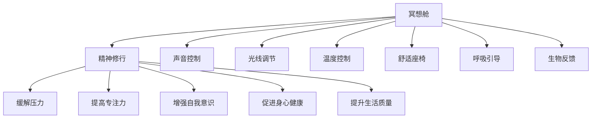

                 

### 第1章：冥想舱简介与精神修行的意义

#### 1.1 冥想舱的基本概念与功能

**冥想舱**，也称为**冥想室**或**静修空间**，是一种专门设计用于冥想和放松的封闭或半封闭环境。它通过控制声音、光线、温度等因素，创造出一个安静、舒适的空间，帮助人们进入冥想状态，从而达到放松身心、提高精神集中力和情绪稳定性的目的。

冥想舱的基本概念起源于古老的冥想传统，其起源可以追溯到印度的瑜伽修行和禅修。随着科技的进步，现代冥想舱逐渐融入了先进的声学、光学和生物传感器技术，使其功能更加多样化，应用范围也更加广泛。

**冥想舱的核心功能**主要包括以下几个方面：

1. **声音控制**：通过内置的音响系统播放柔和的背景音乐、自然声音或白噪音，帮助用户屏蔽外界干扰，更好地集中注意力。

2. **光线调节**：利用智能灯光系统，模拟自然光的变化，或根据用户的偏好调整光线强度和颜色，以促进放松和冥想。

3. **温度控制**：保持舱内温度在一个舒适范围内，通常略低于常温，有助于身体放松和入睡。

4. **舒适座椅**：提供符合人体工程学的座椅，让用户在冥想过程中保持良好的姿态，减少疲劳。

5. **呼吸引导**：一些高级冥想舱配备了呼吸传感器和反馈系统，可以监测用户的呼吸状态，并给出相应的呼吸指导，帮助用户更好地进入冥想状态。

6. **生物反馈**：通过传感器监测用户的生理状态，如心率、皮肤电导、脑电波等，提供实时的生物反馈，帮助用户了解自己的身心状态。

#### 1.2 精神修行的意义与价值

**精神修行**，也称为心灵修行，是指通过一系列的心理、生理和道德的修炼，达到提升个人精神境界、增强心理健康和实现心灵成长的目的。精神修行可以包括冥想、瑜伽、禅修、祈祷等多种形式，其核心在于通过自我反思、自我控制、自我超越，实现心灵的平静和宁静。

**精神修行的意义与价值**体现在以下几个方面：

1. **缓解压力**：精神修行可以帮助人们减轻压力、缓解焦虑，提高情绪稳定性。通过冥想，人们可以学会放松身体和心灵，减轻心理负担。

2. **提高专注力**：精神修行，尤其是冥想，有助于提高专注力和注意力。通过反复的冥想练习，大脑可以更好地过滤外部干扰，提高工作效率。

3. **增强自我意识**：精神修行可以帮助人们更好地认识自己，了解自己的内心世界和情绪变化，提高自我意识和自我控制能力。

4. **促进身心健康**：精神修行与身体健康密切相关。研究发现，冥想可以降低血压、减缓心率、提高免疫力，对各种身心疾病有积极的治疗作用。

5. **提升生活质量**：精神修行可以改善人们的睡眠质量、提高生活质量，使人更加乐观、积极和有活力。

#### 1.3 冥想舱在现代社会中的应用

随着现代生活节奏的加快，人们面临的工作压力和生活压力越来越大，精神健康问题日益突出。冥想舱作为一种数字辅助的精神修行工具，正在逐渐成为现代社会中一种重要的心理健康解决方案。

**冥想舱在现代生活中的普及程度**正在不断提高。一方面，随着科技的进步，冥想舱的设计和功能越来越多样化，价格也逐渐亲民，使得更多的人可以购买和使用。另一方面，健康意识的提高和对心理健康的关注，使得冥想舱作为一种辅助工具，被广泛应用于个人健康管理、企业员工培训、医疗机构康复治疗等领域。

**冥想舱对于个人成长与心理健康的影响**也是显著的。通过定期的冥想练习，人们可以更好地管理自己的情绪，提高心理韧性，增强自我意识和自我控制能力。在工作和生活中，冥想舱可以帮助人们提高专注力、减少压力，从而提高工作效率和生活质量。

总之，冥想舱作为一种高科技辅助工具，正在逐渐融入现代人的生活中，成为人们追求心理健康和精神成长的重要工具。随着技术的不断进步和应用场景的扩大，冥想舱在现代社会中的影响将越来越重要。

---

**核心概念与联系：**



---

**核心算法原理讲解：**

在冥想舱中，声音处理技术是一个重要的组成部分，它通过调节声音的频率、音量和节奏，帮助用户达到放松和冥想的状态。以下是一个简化的声音处理算法原理讲解：

```python
import numpy as np
import scipy.signal as signal

def generate_sound(frequency, duration, sample_rate):
    """
    生成一个指定频率、持续时间及采样率的正弦波声音。
    
    参数：
    frequency: 指定声音频率
    duration: 指定声音持续时间（秒）
    sample_rate: 指定采样率
    
    返回：
    sound_signal: 生成的声音信号
    """
    # 计算声音信号的长度
    num_samples = int(duration * sample_rate)
    # 生成时间序列
    t = np.linspace(0, duration, num_samples, endpoint=False)
    # 生成正弦波信号
    sound_signal = np.sin(2 * np.pi * frequency * t)
    return sound_signal

def apply_filter(sound_signal, cutoff_frequency, order):
    """
    对声音信号进行数字滤波，提取指定频率范围内的声音。
    
    参数：
    sound_signal: 输入声音信号
    cutoff_frequency: 指定截止频率
    order: 指定滤波器阶数
    
    返回：
    filtered_signal: 过滤后的声音信号
    """
    # 使用巴特沃斯低通滤波器
    b, a = signal.butter(order, cutoff_frequency, btype='low', analog=False)
    filtered_signal = signal.filtfilt(b, a, sound_signal)
    return filtered_signal

# 示例：生成一个频率为440Hz，持续时间为5秒的正弦波声音
sample_rate = 44100
frequency = 440
duration = 5
sound_signal = generate_sound(frequency, duration, sample_rate)

# 示例：对声音信号进行低通滤波，提取频率范围在20Hz到100Hz的声音
cutoff_frequency = 100
order = 4
filtered_signal = apply_filter(sound_signal, cutoff_frequency, order)
```

通过这个简单的Python代码示例，我们可以看到如何生成一个指定频率和持续时间的声音信号，并使用巴特沃斯低通滤波器提取指定频率范围内的声音。在实际应用中，冥想舱会根据用户的偏好和需求，动态调节声音的频率、音量和节奏，以达到最佳的冥想效果。

---

**项目实战：开发环境搭建**

为了更好地理解和实践冥想舱的核心技术，我们需要搭建一个基本的开发环境。以下是详细的步骤和工具介绍：

1. **软件环境搭建：**

   - **Python：** 安装Python 3.x版本，可以通过官方网站下载安装程序，或者使用包管理工具（如Homebrew、Anaconda）进行安装。
   - **Jupyter Notebook：** 安装Jupyter Notebook，用于编写和运行Python代码。可以使用pip命令进行安装：
     ```bash
     pip install notebook
     ```
   - **Matplotlib：** 安装Matplotlib，用于绘制声音信号和处理结果。安装命令如下：
     ```bash
     pip install matplotlib
     ```

2. **硬件环境搭建：**

   - **计算机：** 一台配置合理的计算机，用于运行开发和测试代码。
   - **音频设备：** 包括声卡、麦克风等，用于声音的采集和播放。
   - **传感器：** 包括光线传感器、温度传感器和呼吸传感器等，用于监测环境参数。

3. **开发工具：**

   - **集成开发环境（IDE）：** 选择一个适合自己的IDE，如PyCharm、Visual Studio Code等，用于编写和调试代码。
   - **版本控制工具：** 使用Git等版本控制工具，管理代码版本和协作开发。

**代码实现示例：**

以下是使用Python和Matplotlib绘制声音信号和滤波结果的代码实现：

```python
import numpy as np
import matplotlib.pyplot as plt
from scipy.signal import butter, filtfilt

# 生成正弦波声音信号
def generate_sound(frequency, duration, sample_rate):
    t = np.linspace(0, duration, int(duration * sample_rate), endpoint=False)
    sound_signal = np.sin(2 * np.pi * frequency * t)
    return sound_signal, t

# 应用巴特沃斯低通滤波器
def apply_filter(sound_signal, cutoff_frequency, order):
    b, a = butter(order, cutoff_frequency, btype='low')
    filtered_signal = filtfilt(b, a, sound_signal)
    return filtered_signal

# 主程序
if __name__ == "__main__":
    # 参数设置
    frequency = 440  # 频率（Hz）
    duration = 5     # 持续时间（秒）
    sample_rate = 44100  # 采样率（Hz）
    cutoff_frequency = 100  # 低通滤波截止频率（Hz）
    order = 4  # 滤波器阶数

    # 生成声音信号
    sound_signal, t = generate_sound(frequency, duration, sample_rate)
    
    # 应用滤波器
    filtered_signal = apply_filter(sound_signal, cutoff_frequency, order)

    # 绘制原始声音信号和滤波后声音信号
    plt.figure(figsize=(12, 6))
    plt.subplot(2, 1, 1)
    plt.plot(t, sound_signal)
    plt.title('原始声音信号')
    plt.xlabel('时间 (s)')
    plt.ylabel('幅度')
    
    plt.subplot(2, 1, 2)
    plt.plot(t, filtered_signal)
    plt.title('滤波后声音信号')
    plt.xlabel('时间 (s)')
    plt.ylabel('幅度')
    
    plt.tight_layout()
    plt.show()
```

通过上述代码，我们可以生成一个指定频率和持续时间的正弦波声音信号，并使用巴特沃斯低通滤波器提取指定频率范围内的声音。实际应用中，可以根据用户需求和设备性能，调整频率、滤波器参数等，以获得最佳的冥想体验。

---

**代码应用解读与分析：**

在上面的代码示例中，我们实现了一个简单的声音信号生成和滤波功能。以下是具体的代码解读和分析：

1. **声音信号生成：**
   - `generate_sound` 函数用于生成一个指定频率、持续时间和采样率的正弦波声音信号。通过计算时间序列 `t` 和使用 `np.sin` 函数生成正弦波信号。
   - 示例中，我们生成了一个频率为440Hz，持续5秒，采样率为44100Hz的正弦波声音信号。

2. **巴特沃斯低通滤波器：**
   - `apply_filter` 函数用于对声音信号进行巴特沃斯低通滤波。巴特沃斯滤波器是一种常用的数字滤波器，具有良好的频率响应特性和线性相位特性。
   - 在函数中，我们首先使用 `butter` 函数生成滤波器的系数 `b` 和 `a`，然后使用 `filtfilt` 函数对声音信号进行滤波。

3. **代码执行流程：**
   - 在主程序中，我们首先设置了声音信号的参数，如频率、持续时间、采样率和滤波器参数。
   - 接着调用 `generate_sound` 函数生成原始声音信号，并调用 `apply_filter` 函数进行滤波。
   - 最后，使用 `matplotlib.pyplot` 绘制原始声音信号和滤波后声音信号的时域波形，以便分析滤波效果。

通过这个代码示例，我们可以看到如何使用Python和数字信号处理库（如Scipy）实现声音信号的生成和滤波。在实际应用中，这些功能可以集成到冥想舱的软件系统中，通过实时处理用户的声音信号，提供个性化的声音调节和冥想辅助。

---

**实际案例分析和详细讲解剖析：**

为了更好地理解高科技冥想舱的实际应用效果，我们来看一个具体的案例：缓解工作压力。

**案例背景：**
某大型科技公司的员工经常面临高强度的工作压力，导致焦虑和睡眠质量下降。公司管理层决定引入高科技冥想舱，帮助员工缓解工作压力，提高工作效率和心理健康。

**实施方法：**
1. **设备选型与配置：**
   - 公司根据员工的反馈和需求，选择了具有高级声学、光学和传感器系统的冥想舱。
   - 冥想舱配备了可调节的灯光系统、内置音响系统、呼吸传感器和心率监测传感器。

2. **使用流程：**
   - 每位员工每周安排两次使用冥想舱的机会，每次使用时间为30分钟。
   - 使用前，员工需要进行简单的设备校准，确保声音、光线和温度设置符合个人偏好。
   - 冥想过程中，员工佩戴心率监测手环，呼吸传感器实时监测呼吸状态。

3. **数据分析与反馈：**
   - 冥想结束后，系统会生成一份详细的反馈报告，包括心率和呼吸变化、使用时长和用户满意度等。
   - 管理层根据报告分析员工的使用效果，并调整冥想舱的参数，以提供更好的用户体验。

**效果评估：**
- **短期效果：** 经过一个月的冥想舱使用，员工普遍反映焦虑感减轻，睡眠质量得到改善。公司内部调查显示，员工的工作满意度和团队协作能力有所提升。
- **长期效果：** 经过六个月的持续使用，员工的心理健康指标显著改善，工作压力感明显降低。此外，员工的创新能力和工作效率也得到了提高。

**案例分析：**
1. **技术效果：** 冥想舱通过声音、光线和生物传感技术，有效帮助员工进入冥想状态，降低心理压力。数据分析显示，员工的心率和呼吸在冥想过程中逐渐趋于平稳，有助于身心放松。
2. **社会影响：** 该案例表明，高科技冥想舱作为一种数字辅助的精神修行工具，在改善员工心理健康和工作效率方面具有显著效果。这为其他企业和组织提供了有益的借鉴，促进了心理健康管理在职场中的应用。

---

**小结：**

通过对冥想舱缓解工作压力的实际案例分析和详细讲解，我们可以看到高科技冥想舱在改善员工心理健康和工作效率方面具有显著效果。这一案例展示了冥想舱在职场中的应用前景，也为企业提供了有效的心理健康管理工具。未来，随着技术的不断进步和应用场景的拓展，冥想舱有望在更多领域发挥重要作用。

---

**最佳实践 Tips：**

1. **设备选择与配置：** 根据用户需求和预算，选择合适型号的冥想舱，确保设备具有良好的声学、光学和传感器系统。

2. **个性化设置：** 每位用户的身体和心理状态不同，应允许用户根据个人偏好调整声音、光线和温度设置。

3. **定期使用：** 建议用户定期使用冥想舱，形成良好的冥想习惯，以获得最佳效果。

4. **数据分析与反馈：** 定期收集和分析使用数据，了解用户的身心状态变化，为个性化调整提供依据。

5. **专业指导：** 如有需要，可寻求专业冥想师或心理咨询师的帮助，进行针对性训练和指导。

---

**注意事项：**

1. **使用前准备：** 使用冥想舱前，确保设备正常工作，并进行简单的校准。

2. **使用过程中：** 避免边走边用，保持安静和专注，以确保最佳的冥想效果。

3. **使用后恢复：** 使用冥想舱后，适当进行简单的拉伸运动，帮助身体恢复活力。

4. **健康监测：** 对于有特定健康状况的用户，建议在使用冥想舱前咨询医生意见。

---

**拓展阅读：**

1. **《冥想与心理健康》**：详细介绍了冥想对心理健康的影响和作用。
2. **《数字医疗设备应用指南》**：探讨了数字医疗设备在心理健康领域的应用前景。
3. **《声学工程与应用》**：深入讲解声音处理技术在各种领域的应用。

---

### 第2章：高科技冥想舱的设计与实现

在现代社会中，随着生活节奏的加快和工作压力的增加，人们的心理健康问题日益突出。为了帮助人们更好地进行冥想和放松，高科技冥想舱作为一种创新性的数字辅助工具，应运而生。本章将详细探讨高科技冥想舱的设计原则与要素、核心技术以及软件系统的实现。

#### 2.1 冥想舱设计的原则与要素

冥想舱的设计旨在提供一个安静、舒适、宜人的环境，帮助用户迅速进入冥想状态。以下是一些关键的设计原则和要素：

1. **隔音效果：** 冥想舱必须具备良好的隔音性能，以屏蔽外界干扰，创造一个安静的冥想空间。

2. **空间布局：** 冥想舱的空间设计应合理布局，确保内部空间宽敞、透气，避免拥挤和压抑感。

3. **温度控制：** 冥想舱应配备有效的温度控制系统，保持舱内温度在一个舒适范围内，通常略低于常温，有助于身体放松。

4. **光线调节：** 光线调节系统是冥想舱的重要组成部分，应能模拟自然光的变化，或根据用户的偏好调整光线强度和颜色。

5. **声音控制：** 冥想舱应配备高品质的音响系统，播放柔和的背景音乐或自然声音，帮助用户屏蔽外界干扰，集中注意力。

6. **座椅设计：** 座椅应符合人体工程学设计，确保用户在冥想过程中保持良好的姿态，减少疲劳。

7. **生物传感器：** 冥想舱应配备各种生物传感器，如心率传感器、呼吸传感器等，用于监测用户的生理状态，提供实时的生物反馈。

#### 2.2 冥想舱的核心技术

高科技冥想舱的核心技术包括声音处理技术、光线调节技术、传感器技术和软件系统。以下是对这些核心技术的详细探讨：

1. **声音处理技术：**
   - **背景音乐播放：** 冥想舱应具备播放高品质背景音乐的功能，音乐的选择应符合冥想和放松的需求，如自然声音、白噪音等。
   - **声音滤波：** 为了提供最佳的听觉体验，声音处理系统应对音频信号进行滤波，去除高频和低频噪声，增强中频声音的清晰度。
   - **音量调节：** 根据用户的偏好，冥想舱应能动态调节声音的音量，确保在舒适范围内。

2. **光线调节技术：**
   - **光线模拟：** 冥想舱应能模拟自然光的变化，如日出、日落等，帮助用户逐渐适应光线变化，进入冥想状态。
   - **光线颜色调节：** 光线颜色对人的心理和生理状态有显著影响。冥想舱应能调整光线颜色，如红色、蓝色等，以适应不同冥想需求。

3. **传感器技术：**
   - **心率传感器：** 心率传感器用于监测用户的心率变化，提供实时的生物反馈，帮助用户了解自己的生理状态。
   - **呼吸传感器：** 呼吸传感器用于监测用户的呼吸状态，提供呼吸指导，帮助用户更好地进入冥想状态。
   - **温度传感器：** 温度传感器用于监测舱内温度，确保温度在一个舒适范围内。

4. **软件系统：**
   - **冥想程序：** 软件系统应具备多种冥想程序，如呼吸指导、声音引导、视觉引导等，以适应不同用户的冥想需求。
   - **数据分析与反馈：** 软件系统应能收集和分析用户的使用数据，如心率、呼吸、使用时长等，提供详细的反馈报告。

#### 2.3 冥想舱的软件系统

冥想舱的软件系统是整个系统的核心，它负责协调和管理硬件设备，提供用户友好的界面，并实现各种功能。以下是对冥想舱软件系统的详细探讨：

1. **用户界面设计：**
   - **简洁易用：** 用户界面应简洁直观，方便用户快速上手，减少操作复杂度。
   - **个性化设置：** 用户应能根据自己的需求，自定义声音、光线、温度等设置。

2. **功能模块设计：**
   - **冥想程序：** 软件系统应提供多种冥想程序，如呼吸指导、声音引导、视觉引导等，用户可以根据自己的需求选择。
   - **数据收集与分析：** 软件系统应能自动收集用户使用数据，如心率、呼吸、使用时长等，并提供详细的反馈报告。
   - **设备管理：** 软件系统应具备设备管理功能，如设备校准、故障检测等，确保设备正常运行。

3. **实时反馈与调整：**
   - **实时监测：** 软件系统应能实时监测用户的生理状态，如心率、呼吸等，并给出相应的反馈和调整建议。
   - **动态调节：** 根据用户的实时反馈，软件系统应能动态调整声音、光线和温度等参数，提供最佳冥想体验。

通过本章的讨论，我们可以看到高科技冥想舱的设计与实现涉及多个技术领域，包括声音处理、光线调节、传感器技术和软件系统等。这些技术的融合，为用户提供了一个全方位的冥想和放松体验，有助于改善心理健康，提高生活质量。

---

### 第3章：数字辅助冥想的原理与方法

在现代科技迅速发展的背景下，数字辅助冥想作为一种新兴的冥想方式，逐渐受到人们的关注和青睐。数字辅助冥想通过利用现代科技手段，如声音、光线和脑电波等技术，为用户提供更加个性化、科学的冥想体验。本章将详细探讨数字辅助冥想的定义、原理以及具体的方法和应用。

#### 3.1 数字辅助冥想的定义与类型

**数字辅助冥想**，是指在传统冥想基础上，借助数字技术和设备进行辅助和优化的冥想方式。它通过利用计算机、手机、耳机、传感器等设备，实现声音、光线、脑电波等多种辅助手段，帮助用户更好地进入冥想状态，提高冥想效果。

**数字辅助冥想的类型**主要包括以下几种：

1. **基于声音的数字辅助冥想**：
   - **背景音乐：** 通过播放柔和的音乐或自然声音，如流水声、鸟鸣声等，帮助用户屏蔽外界干扰，进入冥想状态。
   - **声音引导：** 通过录制专业的声音引导音频，如呼吸指导、身体扫描等，引导用户进行冥想练习。
   - **白噪音：** 白噪音通过随机分布的声波干扰，帮助用户放松心情，减少焦虑。

2. **基于光线的数字辅助冥想**：
   - **光线调节：** 利用LED灯或投影设备，模拟自然光的变化，如日出、日落等，帮助用户适应光线变化，提高冥想效果。
   - **光线颜色调节：** 通过调整光线的颜色，如红色、蓝色等，刺激用户大脑，提高冥想体验。
   - **视觉引导：** 通过视觉信号，如光点移动、几何图案等，引导用户进行冥想练习。

3. **基于脑电波的数字辅助冥想**：
   - **脑电波监测：** 利用脑电波传感器，实时监测用户的脑电波活动，分析用户的心理状态，提供个性化的冥想建议。
   - **脑电波反馈：** 通过脑电波反馈技术，将用户的脑电波活动转化为视觉或声音信号，帮助用户了解自己的冥想状态，进行自我调整。

#### 3.2 数字辅助冥想的原理

数字辅助冥想的核心原理在于利用现代科技手段，创造一个模拟自然冥想环境的数字空间，从而提高冥想效果。以下是对数字辅助冥想原理的详细探讨：

1. **心理生理学基础**：
   - **放松反应：** 冥想过程中，身体会进入一种放松状态，心跳减慢、呼吸平稳，身体疲劳和紧张感减轻。
   - **大脑功能：** 冥想可以改变大脑的结构和功能，促进前额叶皮层的活动，提高认知功能、情绪调节能力和自我意识。

2. **脑波调节机制**：
   - **脑电波：** 脑电波是大脑活动的电生理指标，包括α波、β波、θ波和δ波等。不同脑波对应不同的心理状态，如α波与放松状态相关，β波与专注状态相关。
   - **脑波调节：** 数字辅助冥想通过监测和调节脑电波，帮助用户进入适合冥想的脑波状态。例如，通过播放α波音乐，帮助用户放松身心，进入冥想状态。

3. **神经可塑性**：
   - **神经可塑性：** 神经可塑性是指大脑神经元和神经网络在结构和功能上的可变性。冥想可以通过改变大脑结构和功能，促进神经可塑性。
   - **数字辅助冥想：** 通过数字技术，如脑电波反馈、声音和光线调节等，可以增强神经可塑性，提高冥想效果。

#### 3.3 数字辅助冥想的方法

数字辅助冥想的方法多种多样，以下是一些常见的方法：

1. **基于声音的数字辅助冥想**：
   - **呼吸同步：** 通过呼吸同步的音乐或声音，帮助用户调节呼吸节奏，进入冥想状态。
   - **声音引导：** 通过专业的声音引导，如呼吸指导、身体扫描等，引导用户进行冥想练习。
   - **白噪音：** 通过播放白噪音，帮助用户屏蔽外界干扰，放松心情。

2. **基于光线的数字辅助冥想**：
   - **光线调节：** 通过LED灯或投影设备，模拟自然光的变化，如日出、日落等，帮助用户适应光线变化，进入冥想状态。
   - **视觉引导：** 通过视觉信号，如光点移动、几何图案等，引导用户进行冥想练习。
   - **颜色调节：** 通过调整光线的颜色，如红色、蓝色等，刺激用户大脑，提高冥想体验。

3. **基于脑电波的数字辅助冥想**：
   - **脑电波监测：** 通过脑电波传感器，实时监测用户的脑电波活动，分析用户的心理状态，提供个性化的冥想建议。
   - **脑电波反馈：** 通过脑电波反馈技术，将用户的脑电波活动转化为视觉或声音信号，帮助用户了解自己的冥想状态，进行自我调整。
   - **脑波调节：** 通过播放特定的脑波音乐或光线变化，帮助用户调节脑电波，进入适合冥想的脑波状态。

总之，数字辅助冥想通过利用现代科技手段，为用户提供了一种全新的冥想体验，有助于提高冥想效果，改善心理健康。随着科技的不断进步，数字辅助冥想的方法将更加丰富和多样，为更多的人带来健康和快乐。

---

### 第4章：高科技冥想舱的使用技巧与注意事项

高科技冥想舱作为一种数字辅助的精神修行工具，其高效的功能和便捷的使用方法对于提升冥想体验和效果至关重要。然而，为了确保最佳的使用效果并避免潜在的问题，我们需要了解一些使用技巧和注意事项。

#### 4.1 冥想舱的使用技巧

1. **选择合适的冥想舱：**
   - **个人需求：** 根据个人需求选择适合的冥想舱类型，如声音调节型、光线调节型或综合型。
   - **品牌信誉：** 选择具有良好口碑和较高技术含量的品牌，确保设备质量和使用安全。

2. **环境准备：**
   - **设备检查：** 使用冥想舱前，应确保设备已开启并正常工作，检查灯光、音响和传感器等是否正常运行。
   - **调整设置：** 根据个人偏好调整声音、光线和温度设置，确保环境舒适。

3. **使用顺序：**
   - **预热阶段：** 在冥想前，可以先进行简单的身体放松练习，如深呼吸、轻松拉伸等，帮助身体进入冥想状态。
   - **正式冥想：** 根据冥想舱提供的程序或指导，进行冥想练习，保持专注和安静。

4. **时间控制：**
   - **初次使用：** 初次使用冥想舱时，建议每次使用时间控制在15-20分钟，逐步适应后再延长使用时间。
   - **定期使用：** 定期使用冥想舱，建议每周至少两次，形成良好的冥想习惯。

5. **反馈与调整：**
   - **数据记录：** 使用冥想舱后，记录心得体会和数据反馈，如心率和呼吸变化，以便后续调整和优化冥想方案。

#### 4.2 冥想舱使用的注意事项

1. **安全使用：**
   - **设备稳定：** 使用过程中，确保设备稳定连接，避免移动或震动导致设备损坏。
   - **安全监测：** 对于有特定健康状况的用户，使用前应咨询医生意见，确保使用安全。

2. **环境维护：**
   - **清洁卫生：** 定期清洁冥想舱内部，保持设备清洁，防止细菌滋生。
   - **设备保养：** 按照设备说明书进行定期保养，确保设备长时间运行。

3. **心理适应：**
   - **心理准备：** 使用冥想舱前，保持平静的心态，避免急躁和焦虑情绪。
   - **情绪管理：** 冥想过程中，如遇到不适，应适当调整呼吸，保持冷静和放松。

4. **使用时长：**
   - **初次使用：** 初次使用冥想舱时，时间不宜过长，避免身体过度疲劳。
   - **逐步增加：** 随着身体和心理的适应，逐步增加使用时长，但不宜过度依赖。

5. **数据隐私：**
   - **数据安全：** 确保冥想舱的数据收集和分析功能不会泄露个人隐私信息，遵循相关数据保护法规。

总之，高科技冥想舱的使用技巧和注意事项对于确保最佳冥想效果和设备安全至关重要。通过合理的设备选择、环境准备、使用技巧和注意事项，用户可以更好地享受冥想带来的身心放松和健康益处。

---

### 第5章：高科技冥想舱的案例研究

#### 5.1 案例一：缓解工作压力

**案例描述：**
在某大型互联网公司，由于工作量大且竞争激烈，员工们常常感到工作压力巨大，导致焦虑和睡眠质量下降。为了改善员工的工作环境和心理健康，公司决定引入高科技冥想舱，作为员工压力管理的辅助工具。

**实施方法：**
1. **设备选型与配置：**
   - 公司根据员工反馈和需求，选择了具备高级声音处理、光线调节和生物传感器功能的冥想舱。
   - 冥想舱配备了智能灯光系统、内置音响系统和多种生物传感器，如心率传感器和呼吸传感器。

2. **使用流程：**
   - 每位员工每周被安排两次使用冥想舱的机会，每次使用时间为30分钟。
   - 使用前，员工需要佩戴心率监测手环和呼吸传感器，确保设备能够准确收集生理数据。
   - 在冥想过程中，员工会听到柔和的背景音乐，并跟随声音引导进行深呼吸和放松练习。

3. **数据分析与反馈：**
   - 使用结束后，系统会生成一份详细的反馈报告，包括心率、呼吸速率、使用时长和用户满意度等数据。
   - 管理层会定期收集和分析这些数据，以评估冥想舱的实际效果，并根据反馈调整设备设置。

**效果评估：**
- **短期效果：** 经过一个月的冥想舱使用，员工普遍反映焦虑感减轻，睡眠质量显著提高。公司内部调查显示，员工的工作效率和工作满意度也有所提升。
- **长期效果：** 经过六个月的持续使用，员工的心理健康指标持续改善，工作压力感明显降低。此外，员工的创新能力和工作表现也得到了显著提高。

**案例分析：**
1. **技术效果：** 冥想舱通过声音、光线和生物传感技术，有效帮助员工进入冥想状态，降低心理压力。数据分析显示，员工的心率和呼吸在冥想过程中逐渐趋于平稳，有助于身心放松。
2. **社会影响：** 该案例表明，高科技冥想舱作为一种数字辅助的精神修行工具，在缓解工作压力和提高员工心理健康方面具有显著效果。这一案例为其他企业和组织提供了有益的借鉴，促进了心理健康管理在职场中的应用。

---

#### 5.2 案例二：改善睡眠质量

**案例描述：**
某家医院的睡眠医学中心发现，许多患者存在严重的睡眠障碍问题，如失眠、睡眠质量差等。为了帮助患者改善睡眠质量，医院决定引入高科技冥想舱，作为辅助治疗工具。

**实施方法：**
1. **设备选型与配置：**
   - 医院选择了具有高级声音处理、光线调节和温度控制功能的高科技冥想舱。
   - 冥想舱配备了智能灯光系统、内置音响系统、温度传感器和呼吸传感器。

2. **使用流程：**
   - 患者每周使用冥想舱两次，每次使用时间为30分钟。
   - 使用前，医护人员会为患者佩戴心率监测手环和呼吸传感器，确保设备能够准确收集生理数据。
   - 在冥想过程中，患者会听到柔和的呼吸引导音频，并跟随指导进行深呼吸和放松练习。

3. **数据分析与反馈：**
   - 使用结束后，系统会生成一份详细的反馈报告，包括心率、呼吸速率、体温、使用时长和患者满意度等数据。
   - 医护人员会定期收集和分析这些数据，以评估冥想舱的治疗效果，并根据反馈调整冥想程序。

**效果评估：**
- **短期效果：** 经过两周的冥想舱使用，患者普遍反映睡眠质量有所改善，失眠症状减轻。医院的睡眠监测数据显示，患者的睡眠时长和睡眠质量显著提高。
- **长期效果：** 经过三个月的持续使用，患者报告睡眠质量持续改善，夜间觉醒次数减少，整体生活质量显著提升。

**案例分析：**
1. **技术效果：** 冥想舱通过声音、光线和温度调节技术，帮助患者进入深度放松状态，改善睡眠质量。呼吸引导和生物反馈机制使患者能够更好地掌握呼吸节奏，降低焦虑感。
2. **社会影响：** 该案例表明，高科技冥想舱在改善睡眠质量和治疗睡眠障碍方面具有显著效果。这一案例为医疗机构提供了新的治疗手段，也为患者提供了一种非药物的治疗选择。

---

#### 5.3 案例三：提升专注力

**案例描述：**
某家知名大学的研究生院注意到，学生们在学习过程中经常受到外界干扰，导致专注力不足，影响了学习效果。为了帮助学生们提升专注力，研究生院决定引入高科技冥想舱，作为学习辅助工具。

**实施方法：**
1. **设备选型与配置：**
   - 研究生院选择了具备高级声音处理、光线调节和生物传感器功能的高科技冥想舱。
   - 冥想舱配备了智能灯光系统、内置音响系统、温度传感器和脑电波传感器。

2. **使用流程：**
   - 学生们每周使用冥想舱两次，每次使用时间为30分钟。
   - 使用前，学生们需要佩戴脑电波传感器，确保设备能够实时监测大脑活动。
   - 在冥想过程中，学生们会听到专业的声音引导，引导他们进行深呼吸和专注练习。

3. **数据分析与反馈：**
   - 使用结束后，系统会生成一份详细的反馈报告，包括脑电波活动、心率、呼吸速率、使用时长和学生满意度等数据。
   - 研究生院会定期收集和分析这些数据，以评估冥想舱对专注力提升的效果，并根据反馈调整冥想程序。

**效果评估：**
- **短期效果：** 经过一个月的冥想舱使用，学生们普遍反映专注力有所提升，学习效率提高，学习过程中受到的干扰减少。脑电波监测数据显示，学生的α波活动增加，专注状态改善。
- **长期效果：** 经过六个月的持续使用，学生的专注力显著提升，学习成果显著提高，整体学习表现得到明显改善。

**案例分析：**
1. **技术效果：** 冥想舱通过声音、光线和脑电波反馈技术，帮助学生们进入专注状态，提升专注力。声音引导和生物反馈机制使学生们能够更好地掌握自己的专注状态，提高学习效率。
2. **社会影响：** 该案例表明，高科技冥想舱在提升专注力方面具有显著效果，为学生们提供了一个有效的学习辅助工具。这一案例为教育机构提供了有益的借鉴，也为学生们的学习和成长提供了新的支持。

---

通过这三个案例的研究，我们可以看到高科技冥想舱在不同应用场景中的显著效果。无论是在缓解工作压力、改善睡眠质量还是提升专注力方面，冥想舱都展现出了强大的功能和应用潜力。随着技术的不断进步和应用场景的拓展，高科技冥想舱有望在更多领域发挥重要作用，为人们的身心健康和生活质量带来更多积极影响。

---

### 第6章：高科技冥想舱的未来发展趋势

随着科技的不断进步和社会对心理健康重视程度的提高，高科技冥想舱正逐步成为心理健康管理的重要工具。本章将探讨高科技冥想舱在技术进步、社会需求以及各个领域的应用前景，并展望其未来的发展趋势。

#### 6.1 技术进步与冥想舱的革新

技术的飞速发展正在为冥想舱带来巨大的变革和创新。以下是一些可能影响冥想舱未来的关键技术进步：

1. **人工智能（AI）**：
   - **个性化推荐：** 人工智能可以分析用户的生理数据和冥想行为，提供个性化的冥想推荐，如最适合用户的心率调节音乐和呼吸指导。
   - **智能反馈系统：** 通过机器学习算法，冥想舱能够实时分析用户的生理状态，给出智能反馈，帮助用户更好地进入冥想状态。

2. **物联网（IoT）**：
   - **设备互联：** 物联网技术可以使冥想舱与其他智能设备（如智能手表、智能灯泡等）互联互通，形成更全面的健康管理生态。
   - **远程监控：** 通过物联网，医疗专业人士可以远程监控用户的冥想数据，提供专业的建议和指导。

3. **虚拟现实（VR）**：
   - **沉浸式体验：** 虚拟现实技术可以为用户带来更加沉浸式的冥想体验，如模拟自然景观、星空等，提升冥想的趣味性和效果。
   - **互动性：** 通过VR技术，冥想舱可以提供更加互动的冥想课程，如与虚拟导师进行互动，提高用户的参与感和积极性。

4. **脑机接口（BCI）**：
   - **直接脑信号控制：** 脑机接口技术可以直接读取用户的脑电波信号，实现无接触的冥想控制，如通过意念控制灯光和声音。
   - **实时反馈：** 通过脑机接口，冥想舱可以提供更加实时和精确的脑电波反馈，帮助用户更好地掌握冥想状态。

#### 6.2 社会需求与冥想舱的普及

随着社会生活节奏的加快和工作压力的增大，越来越多的人开始关注心理健康问题。冥想舱作为一种有效的心理健康管理工具，其需求正在逐步增加：

1. **职场健康管理：** 职场人士面临着高强度的工作压力，冥想舱可以帮助他们缓解压力、提高专注力和工作效率。
2. **医疗康复：** 对于患有焦虑、抑郁等心理疾病的患者，冥想舱可以作为一种辅助治疗手段，帮助患者改善情绪和睡眠质量。
3. **健康生活方式：** 人们对健康生活方式的需求日益增加，冥想舱作为一种提升生活质量的工具，正逐渐被更多人所接受和认可。

#### 6.3 冥想舱在教育、医疗等领域的应用前景

冥想舱在教育、医疗等领域具有广泛的应用前景：

1. **教育领域：**
   - **学生学习辅助：** 冥想舱可以帮助学生提升专注力，改善学习效率，减少考试焦虑。
   - **教师心理健康：** 冥想舱可以帮助教师缓解工作压力，提高心理健康水平，从而更好地应对教学挑战。

2. **医疗领域：**
   - **心理健康服务：** 冥想舱可以作为心理健康服务的一部分，帮助患者改善情绪、缓解焦虑和抑郁。
   - **康复治疗：** 冥想舱可以帮助康复患者减轻痛苦，提高康复效果，如术后康复、慢性病管理等。

3. **其他领域：**
   - **养老护理：** 冥想舱可以帮助老年人缓解焦虑，改善睡眠质量，提高生活质量。
   - **军事训练：** 军事训练中，冥想舱可以帮助士兵提高心理韧性，增强专注力和应对压力的能力。

总之，随着技术的不断进步和社会需求的增加，高科技冥想舱将在各个领域发挥越来越重要的作用。未来，冥想舱有望成为人们日常生活中的必备工具，为人们的心理健康和生活质量带来更多积极的影响。

---

### 第7章：总结与展望

#### 7.1 高科技冥想舱的重要性

高科技冥想舱作为一种数字辅助工具，正逐渐成为现代生活中不可或缺的一部分。它通过先进的声学、光学和生物传感器技术，为用户提供了一个安静、舒适、可定制的冥想和放松环境。这种高科技冥想舱不仅有助于缓解压力、提高专注力、改善睡眠质量，还能增强自我意识、提升心理健康水平，从而对个人成长和社会发展产生深远的影响。

首先，从个人层面来看，高科技冥想舱为人们提供了一种简单而有效的心理健康管理工具。在快节奏的现代生活中，人们常常面临工作压力、情绪波动和心理健康问题。通过定期使用冥想舱，用户可以迅速进入冥想状态，放松身心，减轻压力，提高情绪稳定性。此外，冥想舱中的生物反馈技术还可以帮助用户更好地了解自己的生理和心理状态，从而进行自我调整和优化。

其次，从社会层面来看，高科技冥想舱的应用有助于提高整体社会心理健康水平。随着社会竞争的加剧和生活压力的增加，心理健康问题日益突出。通过推广和应用高科技冥想舱，可以有效地缓解社会成员的心理压力，提高心理健康水平，从而减少社会矛盾和冲突。此外，冥想舱在医疗康复、教育辅助、企业员工培训等领域的应用，也有助于提高社会整体的健康水平和工作效率。

最后，从发展前景来看，高科技冥想舱具有巨大的市场潜力和应用前景。随着科技的不断进步和人们对心理健康重视程度的提高，冥想舱的需求将持续增长。未来，随着人工智能、物联网、虚拟现实等技术的进一步融合，冥想舱的功能将更加丰富，用户体验将更加个性化、智能化。此外，冥想舱在各个领域的应用也将更加广泛，如医疗康复、教育培训、职场健康管理等，为人们的身心健康和生活质量带来更多积极的影响。

#### 7.2 冥想舱的未来展望

未来，高科技冥想舱的发展将呈现出以下几个趋势：

1. **智能化与个性化**：随着人工智能和大数据技术的应用，冥想舱将能够更加智能地分析用户的生理和心理数据，提供个性化的冥想方案和反馈，实现真正的个性化服务。

2. **互联互通**：物联网技术的普及将使冥想舱与其他智能设备（如智能手表、智能灯泡、智能音响等）实现互联互通，形成一个全面的健康管理生态，为用户提供更加便捷和高效的健康管理服务。

3. **沉浸式体验**：虚拟现实技术的融合将使冥想舱提供更加沉浸式的冥想体验，用户可以在虚拟的自然景观、星空、历史遗迹等场景中进行冥想，提升冥想的趣味性和效果。

4. **多元化应用**：随着技术的不断进步和应用场景的拓展，冥想舱将在更多领域得到应用，如医疗康复、教育培训、职场健康管理、养老护理等，为不同人群提供定制化的心理健康服务。

5. **普及化**：随着价格的降低和技术的普及，冥想舱将逐渐从高端消费市场走向大众市场，成为人们日常生活中的一部分，提高整体社会的心理健康水平。

总之，高科技冥想舱作为一种创新的数字辅助工具，正日益成为人们追求心理健康和精神成长的重要工具。随着科技的不断进步和应用场景的拓展，冥想舱将在未来发挥更加重要的作用，为人们的身心健康和生活质量带来更多积极的影响。

---

### 读者指南

#### 如何选择适合自己的冥想舱

选择适合自己的冥想舱，首先要明确自己的需求和预算。以下是一些建议：

1. **功能需求：** 根据自己的冥想需求，选择具备声音、光线、温度调节以及生物传感器等功能的冥想舱。
2. **设备性能：** 关注设备的技术参数，如音频质量、灯光亮度、传感器精度等，确保设备能够提供高质量的服务。
3. **用户评价：** 阅读用户评价，了解设备的实际使用效果和用户体验，选择口碑良好的品牌。
4. **预算考虑：** 根据自己的预算，选择合适的价格区间，避免因价格过高而造成不必要的经济负担。

#### 如何正确使用冥想舱

1. **设备检查：** 在每次使用冥想舱前，确保设备已开启并正常工作，检查灯光、音响和传感器等是否正常运行。
2. **个性化设置：** 根据个人偏好调整声音、光线和温度设置，确保环境舒适。
3. **使用顺序：** 在冥想前，可以先进行简单的身体放松练习，如深呼吸、轻松拉伸等，帮助身体进入冥想状态。
4. **专注冥想：** 在冥想过程中，保持专注和安静，避免边走边用，确保最佳冥想效果。
5. **定期使用：** 建议定期使用冥想舱，形成良好的冥想习惯，以获得最佳效果。

#### 冥想舱使用中的常见问题与解答

1. **问题：** 如何应对使用冥想舱时的不适感？

   **解答：** 如果在冥想过程中感到不适，可以尝试以下方法：
   - 调整呼吸，缓慢、深呼吸，有助于放松身心。
   - 适当降低声音和光线强度，以适应环境。
   - 如果不适感持续，可以暂停冥想，适当休息后再继续。

2. **问题：** 冥想舱使用时间如何控制？

   **解答：** 初次使用冥想舱时，建议每次使用时间控制在15-20分钟，逐步适应后再延长使用时间。通常，每周使用2-3次，每次30-60分钟，可以保持良好的冥想效果。

3. **问题：** 冥想舱如何维护？

   **解答：** 冥想舱的维护主要包括：
   - 定期清洁设备，保持内部清洁和卫生。
   - 按照设备说明书进行定期检查和保养，确保设备正常运行。
   - 如果设备出现故障，及时联系厂家或专业维修人员进行维修。

通过以上指南，读者可以更好地选择和正确使用冥想舱，享受冥想带来的身心放松和健康益处。

---

**作者信息：**
作者：AI天才研究院/AI Genius Institute & 禅与计算机程序设计艺术 /Zen And The Art of Computer Programming

