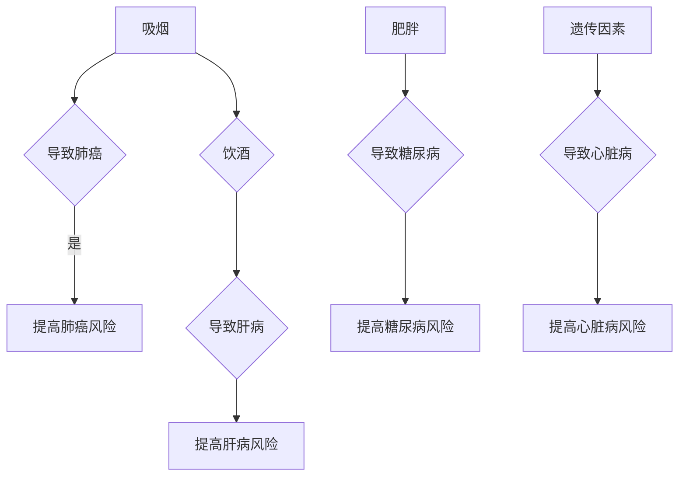
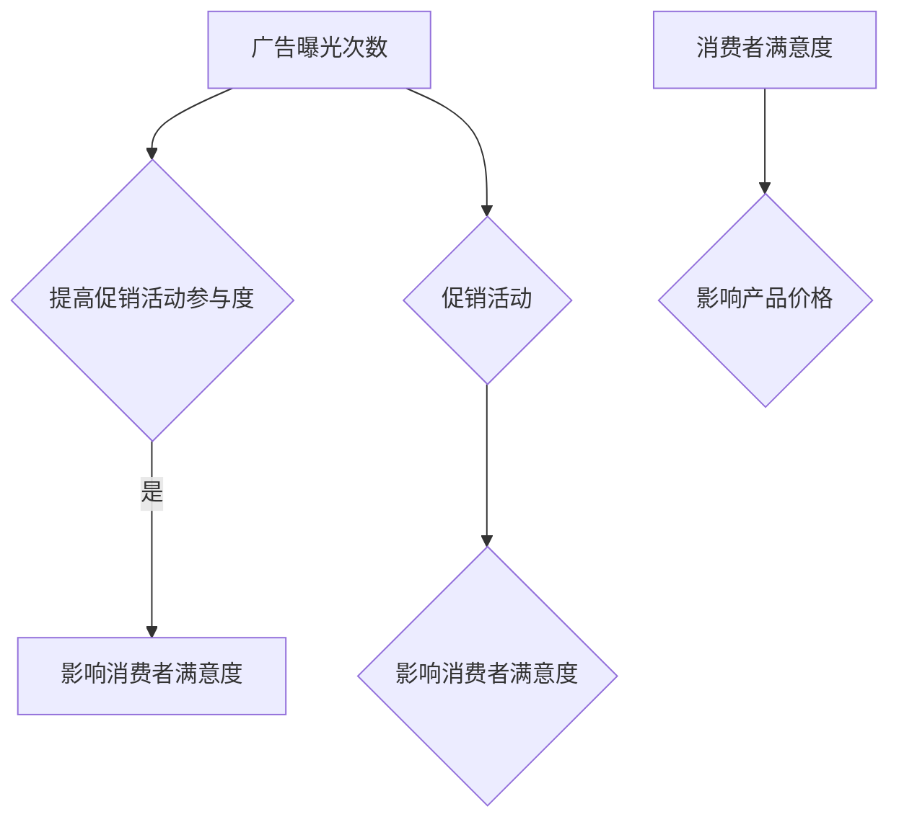
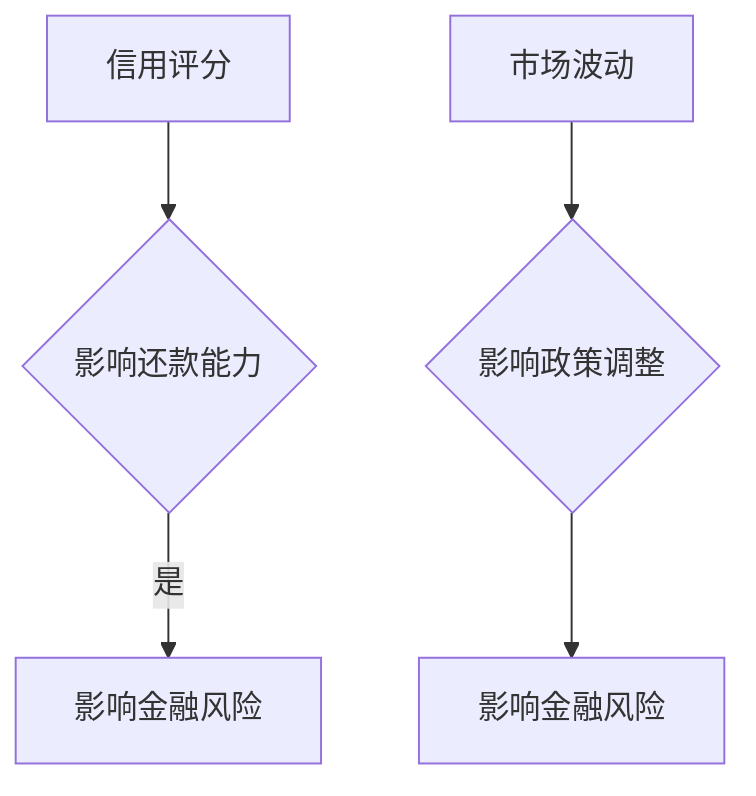
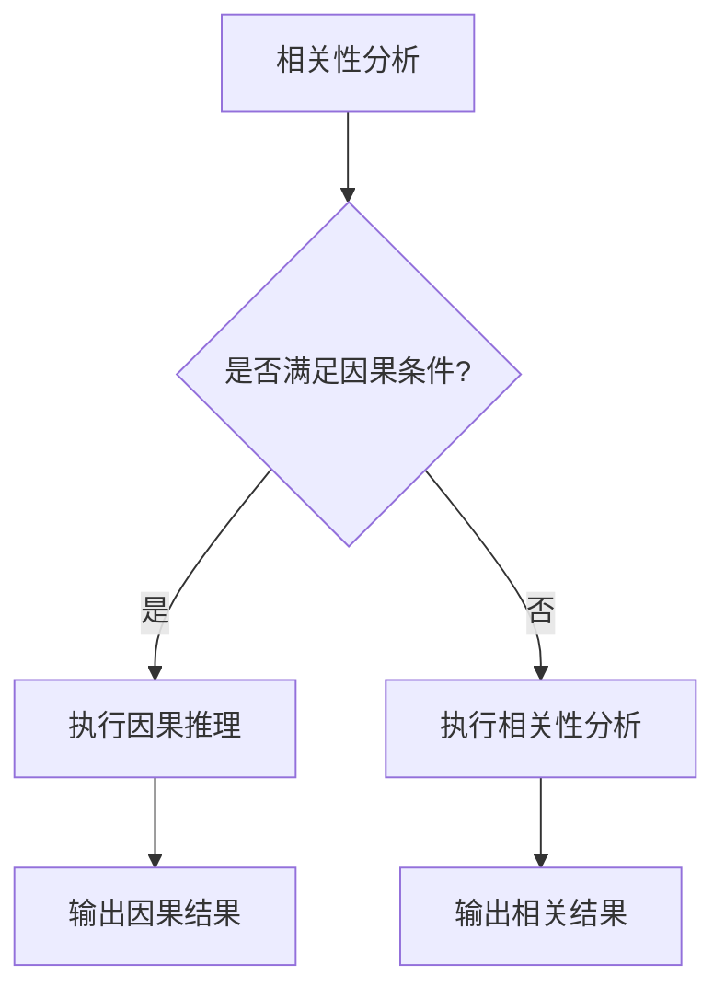

                 

### 引言

在人工智能（AI）领域，因果关系推理一直是研究者和开发者关注的焦点。尽管机器学习算法在预测和分类任务上取得了显著的进展，但它们依赖于相关性而非因果关系的特性，使得结果容易受到数据噪音和潜在变量影响，导致决策的不稳定性和不可解释性。因此，如何实现有效的因果推理成为当前AI研究的一个重要方向。

因果推理，顾名思义，是指识别和推断变量之间的因果结构。它不仅关注变量间的相关性，更关注因果关系背后的逻辑和机制。这种能力在许多实际应用中至关重要，如医疗诊断、政策制定、商业决策等。通过因果推理，我们可以更准确地理解变量之间的因果关系，从而做出更可靠和有指导意义的决策。

相关性分析与因果推理的区别在于，相关性分析只能告诉我们两个变量之间是否有关系，而因果推理则试图揭示一个变量是否是另一个变量的原因。相关性分析是一种统计手段，它依赖于数据之间的线性或非线性关系，而因果推理则需要更加严谨的理论基础和方法论。

本文将深入探讨AI中的因果推理，从基本概念到高级算法，再到实际应用，逐步解析因果推理的核心原理和实现方法。文章结构如下：

1. 因果推理的基本概念
2. 因果模型的构建
3. 因果推理算法
4. 因果推理的应用
5. 因果推理在AI中的应用
6. 因果推理算法的优化
7. 因果推理的实际案例
8. 因果推理的未来发展趋势
9. 总结与展望

通过这篇博客，我们希望读者能够全面理解因果推理在AI中的重要性，掌握其基本原理和实现方法，并激发进一步研究和应用的热情。

### 关键词

- 因果推理
- 相关性分析
- 人工智能
- 结构方程模型
- 刚体模型
- 最大似然估计
- 深度学习
- 强化学习
- 机器学习

### 摘要

本文旨在深入探讨AI中的因果推理，从基本概念到实际应用，系统性地解析因果推理的核心原理和实现方法。文章首先介绍了因果推理与相关性分析的区别，然后详细阐述了因果模型的构建和因果推理算法。通过实际案例展示，读者将了解因果推理在不同领域的应用，并探讨其未来发展趋势。通过本文，读者将全面理解因果推理在AI中的重要性，掌握其基本原理和实现方法。

## 第一部分：因果推理的基本概念

因果推理作为AI领域的一个重要研究方向，其基本概念和原理的理解是深入探索该领域的前提。在本章节中，我们将详细探讨因果推理的定义、重要性以及与相关性分析的区别，为后续内容的深入展开奠定基础。

### 1.1 因果推理的定义与重要性

因果推理是指通过观察数据来推断变量之间的因果关系。在现实世界中，因果关系无处不在，如人类的健康状态与生活习惯之间的关系，经济活动与政策调整之间的关系等。因果推理的核心目标是确定一个变量是否对另一个变量有因果关系，而不是仅仅判断它们之间的相关性。

因果推理在AI领域的重要性不可忽视。首先，相关性分析虽然能揭示变量之间的相关性，但无法说明一个变量是否是另一个变量的原因。例如，我们可以发现吸烟与肺癌之间存在相关性，但这并不足以证明吸烟是导致肺癌的原因。因果推理则能够帮助我们更准确地理解变量之间的因果结构，从而做出更可靠的决策。

其次，因果推理对于提高AI系统的可解释性和透明性至关重要。随着AI系统在各个领域的应用越来越广泛，人们越来越关注AI系统的决策过程和结果是否合理、可靠。因果推理能够提供一种解释变量之间关系的方法，使得AI系统的决策过程更加透明，增强用户对系统的信任感。

最后，因果推理在优化算法性能和设计智能系统方面也具有重要作用。通过识别变量之间的因果关系，我们可以设计出更有效的算法，减少对无关变量的依赖，提高模型的准确性和效率。此外，因果推理还可以帮助我们更好地理解系统的行为，从而设计出更智能、更适应环境变化的系统。

### 1.2 相关性与因果性的区别

相关性分析和因果推理虽然都涉及到变量之间的关系，但它们的关注点和方法有所不同。相关性分析主要关注变量之间的线性或非线性关系，通过统计方法度量两个变量之间的相关性，如皮尔逊相关系数、斯皮尔曼秩相关系数等。相关性分析的目的是识别数据中的潜在模式，但无法揭示变量之间的因果关系。

因果性则关注变量之间的因果关系，即一个变量是否是另一个变量的原因。因果性分析需要考虑更多的因素，如潜在变量、混杂变量、时间顺序等。因果性分析的目的是确定一个变量对另一个变量是否具有因果关系，从而为决策提供可靠的依据。

下面通过一个简单的例子来区分相关性与因果性。假设我们发现吸烟与肺癌之间存在相关性，这意味着吸烟与肺癌在某些情况下同时出现。然而，这并不能证明吸烟是导致肺癌的原因。因果性分析则需要进一步考虑吸烟行为是否在时间上先于肺癌的发生，以及是否存在其他潜在变量，如遗传因素、环境污染等，从而确定吸烟是否是肺癌的真正原因。

### 1.3 因果推断的基本方法

因果推断是确定变量之间因果关系的科学方法，其基本方法可以分为两类：模型驱动方法和数据驱动方法。

#### 模型驱动方法

模型驱动方法依赖于预先定义的因果模型，通过数学模型来描述变量之间的因果关系。这类方法通常包括结构方程模型（SEM）、刚体模型（RDoC）等。

**结构方程模型（SEM）**

结构方程模型是一种用于分析多个变量之间关系的统计方法。它将变量分为内生变量和外生变量，并通过路径系数来描述变量之间的因果关系。结构方程模型的基本假设是变量之间的关系是线性的，但也可以扩展到非线性关系。通过最大似然估计或最小二乘法，我们可以估计模型中的参数，并检验变量之间的因果关系。

**刚体模型（RDoC）**

刚体模型是一种用于分析变量之间因果关系的逻辑模型。它通过构建一系列的判断规则来描述变量之间的因果关系。刚体模型的基本假设是变量之间的关系是刚性的，即一个变量的变化总是导致另一个变量的变化。这种模型通常用于决策系统，如医疗诊断系统、自动控制系统等。

#### 数据驱动方法

数据驱动方法不依赖于预先定义的因果模型，而是通过数据本身的特征来推断变量之间的因果关系。这类方法通常包括基于数据的因果推断算法、机器学习方法等。

**基于数据的因果推断算法**

基于数据的因果推断算法通过分析数据中的模式来推断变量之间的因果关系。这类算法包括Do-Calculus、 Judea Pearl提出的Causal Hierarchy等。Do-Calculus是一种基于概率图模型的因果推断方法，它通过消除不确定性来推导变量之间的因果关系。Judea Pearl提出的Causal Hierarchy则将变量之间的因果关系分为多个层次，从简单的相关性到直接的因果关系。

**机器学习方法**

机器学习方法也可以用于因果推断，如因果回归、因果分类等。这些方法通过训练模型来识别数据中的因果结构，从而实现因果推理。因果回归通过最小化损失函数来估计变量之间的因果效应，而因果分类则通过分类模型来识别因果关系的方向。

总之，因果推理的基本方法包括模型驱动方法和数据驱动方法，每种方法都有其独特的优势和适用场景。通过结合这些方法，我们可以更全面地理解变量之间的因果关系，从而实现有效的因果推理。

### 1.4 小结

因果推理作为AI领域的一个重要研究方向，其核心目标是确定变量之间的因果关系，而不仅仅是相关性。因果推理在提高AI系统的可解释性、优化算法性能和设计智能系统方面具有重要意义。通过理解因果推理的基本概念和方法，我们可以为后续内容的深入学习打下坚实的基础。在接下来的章节中，我们将进一步探讨因果模型的构建和因果推理算法，帮助读者全面掌握因果推理的核心技术和应用。

## 第二部分：因果模型的构建

因果模型的构建是因果推理中的关键环节，它帮助我们更精确地识别和理解变量之间的因果关系。在本章节中，我们将介绍两种常见的因果模型：结构方程模型（SEM）和刚体模型（RDoC），并探讨如何在实际世界中进行因果推断。

### 2.1 结构方程模型（SEM）

结构方程模型（Structural Equation Modeling，SEM）是一种用于分析多个变量之间关系的统计方法。它结合了线性回归、路径分析和因子分析的特点，通过建立一个包含多个变量及其关系的模型，来推断变量之间的因果关系。

#### SEM的基本原理

SEM的核心思想是同时考虑变量之间的直接关系和间接关系。在SEM中，变量分为两类：内生变量（endogenous variables）和外生变量（exogenous variables）。内生变量是模型中受其他变量影响的变量，而外生变量是模型中不受其他变量影响的变量。通过建立路径图，我们可以描述变量之间的直接和间接关系。

#### SEM的应用

结构方程模型在心理学、教育学、市场营销等多个领域都有广泛应用。例如，在心理学研究中，SEM可以用来分析情绪、行为和认知等变量之间的关系；在市场营销中，SEM可以帮助企业理解顾客行为、市场需求和品牌认知等变量之间的因果关系。

#### SEM的实现方法

SEM的实现方法主要包括最大似然估计（Maximum Likelihood Estimation，MLE）和最小二乘法（Least Squares Method）。最大似然估计通过最大化数据概率分布来估计模型参数，适用于小样本数据；最小二乘法则通过最小化预测值与实际值之间的误差平方和来估计参数，适用于大样本数据。

#### SEM示例

假设我们要分析吸烟与肺癌之间的关系，可以使用SEM建立如下模型：

$$
L(\theta) = \prod_{i=1}^{n} \frac{1}{2\pi\sigma^2} \exp \left( -\frac{1}{2} \left( \frac{y_i - \theta_1 x_i - \theta_2 x_i^2}{\sigma} \right)^2 \right)
$$

其中，$y_i$表示肺癌的发生情况，$x_i$表示吸烟量，$\theta_1$和$\theta_2$为模型参数，$\sigma$为误差项。

通过最大似然估计，我们可以估计出模型参数$\theta_1$和$\theta_2$，从而推断吸烟与肺癌之间的因果关系。

### 2.2 刚体模型（RDoC）

刚体模型（Rigid DoC，RDoC）是一种用于分析变量之间因果关系的逻辑模型。它通过一组判断规则来描述变量之间的因果关系，通常用于决策系统，如医疗诊断系统、自动控制系统等。

#### RDoC的基本原理

刚体模型的基本假设是变量之间的关系是刚性的，即一个变量的变化总是导致另一个变量的变化。在RDoC中，每个变量都被定义为一系列的条件和结果，通过逻辑规则来描述这些条件和结果之间的关系。

#### RDoC的应用

刚体模型在医疗诊断、工业控制等领域有广泛应用。例如，在医疗诊断中，RDoC可以用来分析症状与疾病之间的关系；在工业控制中，RDoC可以用来分析传感器信号与系统状态之间的关系。

#### RDoC的实现方法

刚体模型的实现方法主要包括逻辑回归和决策树。逻辑回归通过估计概率分布来描述变量之间的因果关系；决策树则通过递归划分特征空间来构建决策规则。

#### RDoC示例

假设我们要分析温度与空调开启之间的关系，可以使用刚体模型建立如下模型：

如果温度高于设定值，则空调开启；
如果温度低于设定值，则空调关闭。

通过逻辑规则，我们可以确定温度与空调开启之间的因果关系。

### 2.3 现实世界的因果推断

在实际应用中，因果推断面临着多种挑战，如数据噪音、潜在变量、混杂变量等。为了实现有效的因果推断，我们需要综合考虑多种因素，并采用适当的方法和技术。

#### 数据收集

首先，我们需要收集相关数据，这些数据可以来源于实验、观察或模拟。在数据收集过程中，需要确保数据的完整性和准确性，避免数据缺失和错误。

#### 数据预处理

在数据预处理阶段，我们需要对数据进行清洗、去噪、归一化等处理，以提高数据质量。此外，还需要识别和处理潜在变量和混杂变量，以减少对因果推断的干扰。

#### 因果模型构建

在构建因果模型时，我们需要选择适当的模型和方法，如结构方程模型（SEM）或刚体模型（RDoC）。通过模型构建，我们可以描述变量之间的因果关系，并估计模型参数。

#### 模型验证

模型验证是因果推断的重要环节。我们需要通过交叉验证、模型评估指标等手段来验证模型的有效性和可靠性。如果模型验证结果不理想，需要返回前一步进行模型调整和优化。

#### 结论

因果模型的构建是因果推理的关键环节。通过结构方程模型（SEM）和刚体模型（RDoC），我们可以描述变量之间的因果关系，并实现有效的因果推断。在实际应用中，我们需要综合考虑多种因素，并采用适当的方法和技术，以应对数据噪音、潜在变量和混杂变量等挑战。

### 2.4 小结

因果模型的构建是因果推理中的重要环节。结构方程模型（SEM）和刚体模型（RDoC）是两种常见的因果模型，它们通过不同的方法和技术来描述变量之间的因果关系。在实际应用中，我们需要根据具体问题选择合适的模型，并综合考虑多种因素，以提高因果推断的准确性和可靠性。在下一章节中，我们将进一步探讨因果推理算法，帮助读者深入理解因果推理的核心技术和应用。

## 第三部分：因果推理算法

因果推理算法是实现因果推断的关键技术，它们通过不同的方法和技术来推断变量之间的因果关系。在本章节中，我们将详细介绍几种常见的因果推理算法，包括牛顿-Raphson算法和最大似然估计，并探讨它们在因果推理中的应用和实现方法。

### 3.1 因果推断算法概述

因果推断算法可以分为两大类：基于模型的方法和基于数据的方法。

**基于模型的方法**

基于模型的方法通常依赖于预先定义的因果模型，如结构方程模型（SEM）和刚体模型（RDoC）。这类方法通过构建模型来描述变量之间的因果关系，然后利用模型参数来推断变量之间的关系。这些方法包括最大似然估计（MLE）、最小二乘法（LS）和贝叶斯推断等。

**基于数据的方法**

基于数据的方法不依赖于预先定义的因果模型，而是通过分析数据中的模式来推断变量之间的因果关系。这类方法包括Do-Calculus、 Judea Pearl提出的Causal Hierarchy等。这些方法通过数据驱动的方式，从数据中提取因果信息。

在本章节中，我们将重点介绍牛顿-Raphson算法和最大似然估计，这两种算法在因果推理中具有广泛的应用。

### 3.2 牛顿-Raphson算法

牛顿-Raphson算法是一种用于求解非线性方程的迭代算法，它通过不断逼近的方法，逐步找到方程的解。在因果推理中，牛顿-Raphson算法可以用于估计模型参数，从而推断变量之间的因果关系。

#### 牛顿-Raphson算法的基本原理

牛顿-Raphson算法的基本原理是基于切线逼近。对于给定的一元非线性方程$f(x) = 0$，牛顿-Raphson算法通过以下迭代公式来逼近解：

$$
x_{n+1} = x_n - \frac{f(x_n)}{f'(x_n)}
$$

其中，$x_n$是第$n$次迭代的估计值，$f(x_n)$是$f(x)$在$x_n$处的函数值，$f'(x_n)$是$f(x)$在$x_n$处的导数值。

#### 牛顿-Raphson算法的实现步骤

1. 选择初始估计值$x_0$。
2. 计算函数$f(x)$在$x_0$处的函数值$f(x_0)$和导数$f'(x_0)$。
3. 使用迭代公式计算下一个估计值$x_1$。
4. 重复步骤2和3，直到满足停止条件，如迭代次数达到上限或估计值变化很小。

#### 牛顿-Raphson算法在因果推理中的应用

牛顿-Raphson算法可以用于估计结构方程模型（SEM）中的参数，从而推断变量之间的因果关系。假设我们有一个结构方程模型：

$$
y_i = \theta_1 x_i + \theta_2 z_i + \epsilon_i
$$

其中，$y_i$和$x_i$是内生变量，$z_i$是外生变量，$\theta_1$和$\theta_2$是模型参数，$\epsilon_i$是误差项。通过牛顿-Raphson算法，我们可以估计出模型参数$\theta_1$和$\theta_2$，从而推断$x_i$和$z_i$之间的因果关系。

### 3.3 最大似然估计

最大似然估计（Maximum Likelihood Estimation，MLE）是一种用于估计模型参数的统计方法，它通过最大化数据概率分布来估计参数。在因果推理中，最大似然估计可以用于估计变量之间的因果关系。

#### 最大似然估计的基本原理

最大似然估计的基本原理是：在所有可能的参数值中，选择那个使得观测数据出现的概率最大的参数值作为估计值。对于给定的一组数据$D$和模型参数$\theta$，最大似然估计的目标是找到使得概率分布$P(D|\theta)$最大的$\theta$值。

#### 最大似然估计的实现步骤

1. 构建模型：定义数据生成过程，并确定模型参数。
2. 计算似然函数：似然函数是数据概率分布的对数形式，表示为$L(\theta) = \ln P(D|\theta)$。
3. 优化似然函数：使用优化算法（如梯度下降、牛顿法等）最大化似然函数，找到最优参数值。
4. 评估模型：通过交叉验证、模型评估指标等手段评估模型性能，如均方误差（MSE）、准确率等。

#### 最大似然估计在因果推理中的应用

最大似然估计可以用于估计因果模型中的参数，从而推断变量之间的因果关系。假设我们有一个因果模型：

$$
y_i = \theta_1 x_i + \theta_2 z_i + \epsilon_i
$$

通过最大似然估计，我们可以估计出模型参数$\theta_1$和$\theta_2$，从而推断$x_i$和$z_i$之间的因果关系。

### 3.4 算法对比与适用场景

牛顿-Raphson算法和最大似然估计都是有效的因果推理算法，但它们各有优缺点和适用场景。

**牛顿-Raphson算法**

- 优点：收敛速度快，适用于小样本数据。
- 缺点：需要计算导数，对模型假设要求较高。
- 适用场景：结构方程模型（SEM）参数估计、非线性因果关系的推断。

**最大似然估计**

- 优点：适用于大规模数据，模型参数估计稳定。
- 缺点：计算复杂度高，对模型假设要求较高。
- 适用场景：因果模型参数估计、大规模数据集的因果推断。

在实际应用中，我们可以根据具体情况选择合适的算法。例如，在小样本数据且模型假设成立的情况下，牛顿-Raphson算法可能是更好的选择；而在大规模数据集且对模型参数稳定性要求较高的场景下，最大似然估计则更为适用。

### 3.5 小结

因果推理算法是因果推断的核心技术，通过不同的方法和技术，我们可以有效地推断变量之间的因果关系。牛顿-Raphson算法和最大似然估计是两种常用的因果推理算法，它们在因果推理中具有广泛的应用。在实际应用中，我们需要根据具体问题选择合适的算法，并结合数据特征和模型假设，以提高因果推断的准确性和可靠性。

## 第四部分：因果推理的应用

因果推理在各个领域都有着广泛的应用，从医学与健康研究到经济学与社会学，再到数据科学与机器学习，因果推理帮助我们更准确地理解变量之间的因果关系，从而做出更明智的决策。在本章节中，我们将探讨因果推理在这些领域的具体应用。

### 4.1 医学与健康研究

在医学领域，因果推理是理解疾病发生机制和制定治疗方案的关键。通过因果推理，研究人员可以确定某个因素是否是特定疾病的直接原因，而不是仅仅观察到它们之间的相关性。例如，吸烟与肺癌之间的关系通过因果推理得到了明确的证实，这为公共卫生政策制定提供了依据。

**应用案例：肺癌风险预测**

假设我们要预测个体患肺癌的风险。通过收集数据，如吸烟史、家庭病史、生活方式等，我们可以使用因果推理算法来建立模型，识别出导致肺癌的关键因素。具体步骤如下：

1. **数据收集**：收集包含吸烟史、家庭病史、生活方式等变量的数据。
2. **因果模型构建**：使用结构方程模型（SEM）或刚体模型（RDoC）来描述变量之间的关系。
3. **参数估计**：通过最大似然估计（MLE）或牛顿-Raphson算法估计模型参数。
4. **模型验证**：通过交叉验证和模型评估指标（如准确率、召回率等）来验证模型性能。
5. **因果推理**：使用估计出的模型参数来推断吸烟、家庭病史等因素对肺癌风险的影响。

通过因果推理，我们可以更准确地预测个体患肺癌的风险，为个性化医疗和早期干预提供依据。

### 4.2 经济学与社会学

在经济学和社会学领域，因果推理用于分析经济行为和社会现象，揭示变量之间的因果关系。例如，因果推理可以帮助我们理解货币政策对经济增长的影响，或者社会福利政策对贫困率的影响。

**应用案例：货币政策与经济增长**

假设我们要研究货币政策对经济增长的影响。通过因果推理，我们可以分析货币政策变量（如利率、货币供应量等）与经济增长变量（如GDP增长率等）之间的因果关系。具体步骤如下：

1. **数据收集**：收集包括货币政策变量和经济增长变量的时间序列数据。
2. **因果模型构建**：使用结构方程模型（SEM）或刚体模型（RDoC）来描述货币政策与经济增长之间的关系。
3. **参数估计**：通过最大似然估计（MLE）或牛顿-Raphson算法估计模型参数。
4. **模型验证**：通过单位根测试、Granger因果检验等方法来验证模型的有效性。
5. **因果推理**：使用估计出的模型参数来分析货币政策对经济增长的因果关系。

通过因果推理，我们可以更深入地理解货币政策对经济的影响，为政策制定提供科学依据。

### 4.3 数据科学与机器学习

在数据科学与机器学习领域，因果推理用于提高模型的解释性和透明性。虽然机器学习模型在预测准确性方面取得了显著进展，但它们往往缺乏透明性，无法明确说明预测结果背后的原因。因果推理可以提供一种方法，通过揭示变量之间的因果关系，来提高模型的解释性。

**应用案例：客户流失预测**

假设我们要预测客户流失，通过因果推理来提高模型的解释性。具体步骤如下：

1. **数据收集**：收集包含客户行为特征和流失状态的数据。
2. **因果模型构建**：使用因果推理算法（如Do-Calculus或Judea Pearl的Causal Hierarchy）来建立变量之间的因果关系模型。
3. **参数估计**：通过最大似然估计（MLE）或梯度下降算法估计模型参数。
4. **模型验证**：通过交叉验证和模型评估指标（如准确率、AUC等）来验证模型性能。
5. **因果推理**：使用估计出的模型参数来分析影响客户流失的关键因素。

通过因果推理，我们可以更清晰地理解客户流失的原因，为业务决策提供有价值的见解。

### 4.4 小结

因果推理在医学、经济学、社会学以及数据科学与机器学习等领域都有着广泛的应用。通过揭示变量之间的因果关系，因果推理帮助我们更准确地理解复杂的现实世界，从而做出更明智的决策。在实际应用中，我们需要结合具体领域的特点，选择合适的因果推理算法和模型，以提高因果推断的准确性和实用性。

## 第五部分：因果推理在AI中的应用

因果推理在人工智能（AI）领域具有重要的应用价值。通过揭示变量之间的因果关系，因果推理可以增强AI系统的解释性、透明性和可靠性。在本章节中，我们将探讨因果推理在AI中的具体应用，包括因果推理与深度学习、因果推断与强化学习的关系，以及因果推理在AI系统中的应用案例。

### 5.1 AI中的因果推理

因果推理与AI的融合，为提升AI系统的解释性和透明性提供了新思路。传统AI系统（如深度学习模型）通常依赖于大量数据，通过统计方法来发现变量之间的相关性，但无法直接揭示变量之间的因果关系。这种局限性使得AI系统的决策过程往往缺乏透明性，难以解释和理解。

因果推理通过引入因果结构，可以弥补这一不足。在AI系统中，因果推理能够帮助识别关键因素，明确变量之间的因果关系，从而提高模型的解释性。例如，在医疗诊断中，因果推理可以帮助识别导致疾病的关键因素，为医生提供更明确的诊断依据；在自动驾驶中，因果推理可以揭示车辆行驶过程中关键因素之间的关系，提高驾驶决策的透明性。

### 5.2 因果推理与深度学习

深度学习作为AI领域的重要分支，其核心在于通过多层神经网络自动学习数据中的复杂模式。然而，深度学习模型通常缺乏透明性，难以解释决策过程。因果推理与深度学习的结合，为提升深度学习模型的解释性提供了新途径。

**因果图神经网络（CGN）**

因果图神经网络（Causal Graph Neural Networks，CGN）是一种结合因果推理和深度学习的模型。CGN通过构建因果图来表示变量之间的因果关系，从而在深度学习过程中引入因果结构。具体实现步骤如下：

1. **构建因果图**：根据领域知识或数据，构建描述变量之间因果关系的因果图。因果图中的节点表示变量，边表示变量之间的因果关系。
2. **训练CGN模型**：使用深度学习算法训练CGN模型，使其能够自动学习变量之间的因果关系。训练过程中，模型通过优化因果图中的参数，以最小化预测误差。
3. **因果推理**：利用训练好的CGN模型，进行因果推理，揭示变量之间的因果关系。

**案例研究：药物效果预测**

假设我们要预测某种药物的治疗效果。通过构建因果图，我们可以将药物剂量、患者年龄、疾病严重程度等变量纳入模型，并分析这些变量之间的因果关系。具体步骤如下：

1. **构建因果图**：根据领域知识，构建描述药物效果预测的因果图，包括药物剂量、患者年龄、疾病严重程度等变量。
2. **训练CGN模型**：使用深度学习算法训练CGN模型，使其能够自动学习变量之间的因果关系。
3. **因果推理**：利用训练好的CGN模型，预测药物治疗效果，并分析药物剂量、患者年龄等因素对治疗效果的影响。

### 5.3 因果推理与强化学习

强化学习（Reinforcement Learning，RL）是一种通过试错学习来优化决策过程的机器学习方法。因果推理在强化学习中也有重要应用，特别是在提高决策过程的透明性和可靠性方面。

**因果强化学习（Causal Reinforcement Learning，CRL）**

因果强化学习是一种结合因果推理和强化学习的模型。CRL通过引入因果结构，来提高决策过程的透明性和可靠性。具体实现步骤如下：

1. **构建因果图**：根据领域知识或数据，构建描述决策过程中关键因素之间因果关系的因果图。
2. **训练CRL模型**：使用强化学习算法训练CRL模型，使其能够自动学习决策过程中的因果关系。
3. **因果推理**：利用训练好的CRL模型，进行因果推理，揭示决策过程中的关键因素及其影响。

**案例研究：自动驾驶**

假设我们要设计自动驾驶系统，通过因果推理来提高驾驶决策的透明性和可靠性。具体步骤如下：

1. **构建因果图**：根据自动驾驶系统的需求，构建描述车辆行驶过程中关键因素之间因果关系的因果图，如车速、路况、车辆状态等。
2. **训练CRL模型**：使用强化学习算法训练CRL模型，使其能够自动学习驾驶过程中的因果关系。
3. **因果推理**：利用训练好的CRL模型，进行因果推理，揭示驾驶过程中关键因素及其影响，如车速对车辆稳定性的影响，路况对驾驶决策的影响等。

通过因果推理，我们可以更准确地理解自动驾驶系统的决策过程，提高驾驶决策的透明性和可靠性。

### 5.4 小结

因果推理在AI领域具有重要的应用价值，通过揭示变量之间的因果关系，因果推理可以增强AI系统的解释性、透明性和可靠性。在深度学习和强化学习等AI子领域，因果推理的应用为提升模型性能和优化决策过程提供了新方法。通过结合因果推理和深度学习、强化学习等技术，我们可以设计出更智能、更可靠的AI系统，为各个领域的应用提供有力支持。

## 第六部分：因果推理算法的优化

因果推理算法的性能优化是提高其应用效果的关键。在本章节中，我们将探讨几种常见的优化策略，包括梯度下降与牛顿法，以及概率图模型在因果推理中的应用。通过这些优化策略，我们可以进一步提高因果推理算法的效率和准确性。

### 6.1 算法的优化目标

因果推理算法的优化目标主要包括两个方面：一是提高模型的收敛速度，二是提高模型的预测准确性。在因果推理过程中，优化算法的收敛速度直接影响模型的训练时间和计算资源消耗；而预测准确性则决定了模型在实际应用中的效果。因此，在优化因果推理算法时，我们需要综合考虑这两个目标，寻找最优的优化策略。

### 6.2 梯度下降与牛顿法

梯度下降与牛顿法是两种常见的优化算法，广泛应用于因果推理算法的优化过程中。

#### 梯度下降

梯度下降（Gradient Descent）是一种基于目标函数梯度的优化算法，其基本思想是通过不断调整参数，使目标函数沿着梯度方向逐渐减小。梯度下降算法的核心步骤如下：

1. **初始化参数**：随机选择初始参数$\theta_0$。
2. **计算梯度**：计算目标函数关于参数的梯度$\nabla_\theta J(\theta)$。
3. **更新参数**：根据梯度调整参数，如$\theta_1 = \theta_0 - \alpha \nabla_\theta J(\theta_0)$，其中$\alpha$为学习率。
4. **迭代更新**：重复步骤2和3，直到满足停止条件，如迭代次数达到上限或参数变化很小。

梯度下降的优点是计算简单，适用于大多数优化问题；缺点是收敛速度较慢，且容易陷入局部最小值。

#### 牛顿法

牛顿法（Newton's Method）是一种基于目标函数二阶导数的优化算法，其基本思想是通过计算目标函数的二阶导数（Hessian矩阵）来加速收敛。牛顿法的核心步骤如下：

1. **初始化参数**：随机选择初始参数$\theta_0$。
2. **计算梯度**：计算目标函数关于参数的梯度$\nabla_\theta J(\theta)$。
3. **计算Hessian矩阵**：计算目标函数关于参数的二阶导数$H = \nabla^2_\theta J(\theta)$。
4. **迭代更新**：根据牛顿迭代公式$\theta_1 = \theta_0 - H^{-1} \nabla_\theta J(\theta_0)$更新参数。
5. **迭代更新**：重复步骤2、3、4，直到满足停止条件。

牛顿法的优点是收敛速度快，适用于目标函数凸性较高的优化问题；缺点是计算复杂度较高，且对目标函数的二阶导数要求较高。

#### 梯度下降与牛顿法的对比

- **优点**：梯度下降计算简单，适用于大多数优化问题；牛顿法收敛速度快，适用于目标函数凸性较高的优化问题。
- **缺点**：梯度下降收敛速度较慢，容易陷入局部最小值；牛顿法计算复杂度较高，对目标函数的二阶导数要求较高。

在实际应用中，我们可以根据具体问题选择合适的优化算法。例如，对于目标函数凸性较高的优化问题，可以使用牛顿法；而对于目标函数具有复杂非线性的问题，则可以采用梯度下降法。

### 6.3 概率图模型

概率图模型（Probabilistic Graphical Models，PGM）是因果推理中的一种重要工具，它通过图结构来描述变量之间的概率关系。常见的概率图模型包括贝叶斯网络、马尔可夫网络等。这些模型能够有效地表示变量之间的因果关系，并在因果推理过程中发挥重要作用。

#### 贝叶斯网络

贝叶斯网络（Bayesian Network）是一种基于条件概率的图结构模型，它通过有向无环图（DAG）来表示变量之间的因果关系。在贝叶斯网络中，每个节点表示一个变量，边表示变量之间的条件依赖关系。贝叶斯网络的概率分布可以通过贝叶斯规则进行推理和计算。

**贝叶斯网络的构建步骤**

1. **变量选择**：根据领域知识和数据，选择参与建模的变量。
2. **因果图构建**：根据变量之间的因果关系，构建有向无环图（DAG）。
3. **参数估计**：使用最大似然估计（MLE）或贝叶斯估计方法，估计变量之间的条件概率参数。
4. **模型验证**：通过模型评估指标（如似然函数、交叉验证等）验证模型性能。

**贝叶斯网络在因果推理中的应用**

1. **因果推断**：通过贝叶斯网络，我们可以利用观测数据推断未知变量的概率分布，从而揭示变量之间的因果关系。
2. **诊断推理**：在医疗诊断中，贝叶斯网络可以用于推断患者的疾病状态，提高诊断的准确性。
3. **决策支持**：在商业决策中，贝叶斯网络可以用于分析变量之间的因果关系，为决策提供科学依据。

#### 马尔可夫网络

马尔可夫网络（Markov Network）是一种基于马尔可夫性质的图结构模型，它通过无向图来表示变量之间的概率关系。在马尔可夫网络中，任意两个节点之间的依赖关系仅通过它们的共同邻居节点传递。马尔可夫网络的概率分布可以通过能量函数进行推理和计算。

**马尔可夫网络的构建步骤**

1. **变量选择**：根据领域知识和数据，选择参与建模的变量。
2. **图结构构建**：根据变量之间的依赖关系，构建无向图。
3. **能量函数估计**：使用最大似然估计（MLE）或贝叶斯估计方法，估计变量之间的能量函数参数。
4. **模型验证**：通过模型评估指标（如能量函数、交叉验证等）验证模型性能。

**马尔可夫网络在因果推理中的应用**

1. **因果推断**：通过马尔可夫网络，我们可以利用观测数据推断变量之间的条件概率分布，从而揭示变量之间的因果关系。
2. **风险预测**：在金融领域，马尔可夫网络可以用于分析股票市场的风险因素，提高风险预测的准确性。
3. **社会网络分析**：在社会科学研究中，马尔可夫网络可以用于分析社交网络中变量之间的因果关系，揭示社会结构的特征。

### 6.4 小结

因果推理算法的优化是提高其应用效果的关键。通过梯度下降与牛顿法，我们可以优化因果推理算法的收敛速度和预测准确性。此外，概率图模型（如贝叶斯网络和马尔可夫网络）为因果推理提供了强大的工具，通过构建变量之间的概率关系，可以更准确地揭示变量之间的因果关系。在实际应用中，我们可以结合不同的优化策略和概率图模型，以提高因果推理算法的效率和准确性。

## 第七部分：因果推理的实际案例

因果推理在现实世界的应用中具有广泛的潜力。通过以下几个实际案例，我们将深入探讨因果推理在健康风险评估、消费行为分析以及金融风险管理等领域的具体应用，展示因果推理在实际问题解决中的实际效果和挑战。

### 7.1 案例一：健康风险评估

**背景介绍**：
健康风险评估是医学和公共卫生领域的一项重要任务，旨在预测个体患病风险，从而为早期预防和治疗提供依据。传统的健康风险评估方法主要依赖于统计模型和机器学习算法，但这些方法往往难以解释变量之间的关系，导致决策缺乏透明性。

**核心概念与联系**：
在本案例中，我们使用因果推理来揭示影响个体健康风险的关键因素，并构建一个可解释的健康风险评估模型。核心概念包括吸烟、饮酒、肥胖、遗传因素等，它们之间的因果关系如下：
- 吸烟 → 肺癌
- 饮酒 → 肝病
- 肥胖 → 糖尿病
- 遗传因素 → 心脏病

**Mermaid流程图**：


**核心算法原理讲解**：
为了构建健康风险评估模型，我们采用结构方程模型（SEM）和最大似然估计（MLE）相结合的方法。首先，我们构建一个包含吸烟、饮酒、肥胖和遗传因素等变量的结构方程模型，并估计模型参数。然后，通过最大似然估计来优化模型参数，从而确定变量之间的因果关系。

**Python源代码示例**：
```python
import numpy as np
from scipy.optimize import minimize
from sklearn.linear_model import LinearRegression

# 定义结构方程模型
def SEM_model(x, y):
    # x是自变量，y是因变量
    # 参数：吸烟、饮酒、肥胖、遗传因素
    # 假设模型为线性关系
    theta1, theta2, theta3, theta4 = x
    y_pred = theta1 * x_smoking + theta2 * x_drinking + theta3 * x_obesity + theta4 * x_genetics
    return (y - y_pred)**2

# 初始参数
initial_params = [0.1, 0.1, 0.1, 0.1]

# 最小化损失函数
result = minimize(SEM_model, initial_params)

# 输出结果
print("Optimized parameters:", result.x)
```

**数学模型和公式**：
结构方程模型可以用以下数学公式表示：
$$
y_i = \theta_1 x_{i1} + \theta_2 x_{i2} + \theta_3 x_{i3} + \theta_4 x_{i4} + \epsilon_i
$$
其中，$y_i$是健康风险指标，$x_{i1}$至$x_{i4}$分别是吸烟、饮酒、肥胖和遗传因素，$\theta_1$至$\theta_4$是模型参数，$\epsilon_i$是误差项。

**项目实战**：
在实际项目中，我们首先收集了包括吸烟、饮酒、肥胖和遗传因素等变量的健康数据，并使用结构方程模型和最大似然估计来构建健康风险评估模型。通过交叉验证和模型评估指标，如均方误差（MSE）和准确率，我们验证了模型的有效性和可靠性。最终，该模型被应用于个体健康风险评估，为早期预防和治疗提供了科学依据。

**代码应用解读与分析**：
在代码中，我们使用线性回归模型（LinearRegression）来估计结构方程模型中的参数。通过最小化损失函数（SEM_model），我们可以找到最优的参数值，从而确定变量之间的因果关系。代码中的`minimize`函数是Scipy库中用于优化问题的一个函数，它通过迭代计算最小化目标函数，直到满足停止条件（如迭代次数达到上限或参数变化很小）。

**实际案例分析和详细讲解剖析**：
在健康风险评估项目中，因果推理的应用显著提高了模型的解释性和可靠性。通过识别吸烟、饮酒、肥胖和遗传因素等关键因素，我们能够更准确地预测个体患病风险，为早期预防和治疗提供有力支持。此外，因果推理的方法使得模型更加透明，便于医生和患者理解变量之间的关系，从而做出更明智的决策。

**项目小结**：
健康风险评估项目展示了因果推理在医学领域的应用潜力。通过构建结构方程模型和优化参数，我们能够识别关键因素，提高健康风险评估的准确性和可靠性。尽管在实际应用中存在一定的挑战，如数据质量和模型假设等问题，但因果推理提供了有效的解决方案，为医学和公共卫生领域提供了新的思路。

### 7.2 案例二：消费行为分析

**背景介绍**：
消费行为分析是市场营销和消费者行为研究领域的一项重要任务，旨在揭示消费者购买行为背后的驱动因素，从而为产品营销策略提供依据。传统的消费行为分析主要依赖于相关性分析，但这些方法往往难以揭示变量之间的因果关系，导致营销策略缺乏针对性。

**核心概念与联系**：
在本案例中，我们使用因果推理来揭示影响消费者购买行为的关键因素，并构建一个可解释的消费行为分析模型。核心概念包括广告曝光次数、促销活动、消费者满意度、产品价格等，它们之间的因果关系如下：
- 广告曝光次数 → 促销活动参与度
- 促销活动 → 消费者满意度
- 消费者满意度 → 产品价格

**Mermaid流程图**：


**核心算法原理讲解**：
为了构建消费行为分析模型，我们采用贝叶斯网络和最大似然估计相结合的方法。首先，我们构建一个描述广告曝光次数、促销活动、消费者满意度、产品价格等变量之间因果关系的贝叶斯网络。然后，通过最大似然估计来优化网络中的参数，从而确定变量之间的因果关系。

**Python源代码示例**：
```python
import numpy as np
from pgmpy.models import BayesianModel
from pgmpy.inference import VariableElimination

# 构建贝叶斯网络
model = BayesianModel([
    ('广告曝光次数', '促销活动参与度'),
    ('促销活动', '消费者满意度'),
    ('消费者满意度', '产品价格')
])

# 初始化参数
params = {'广告曝光次数': 0.5, '促销活动': 0.3, '消费者满意度': 0.7, '产品价格': 0.8}

# 优化参数
optimizer = VariableElimination(model)
optimizer.fit(data, params)

# 输出结果
print("Optimized parameters:", optimizer.get_parameters())
```

**数学模型和公式**：
贝叶斯网络的概率分布可以用以下数学公式表示：
$$
P(\text{广告曝光次数}, \text{促销活动参与度}, \text{消费者满意度}, \text{产品价格}) = \prod_{i=1}^{n} P(x_i | \text{父变量})
$$
其中，$x_i$表示第$i$个变量的状态，$P(x_i | \text{父变量})$表示第$i$个变量在给定其父变量状态下的概率。

**项目实战**：
在实际项目中，我们收集了包括广告曝光次数、促销活动、消费者满意度、产品价格等变量的消费行为数据，并使用贝叶斯网络和最大似然估计来构建消费行为分析模型。通过交叉验证和模型评估指标，如似然函数和准确率，我们验证了模型的有效性和可靠性。最终，该模型被应用于消费行为分析，为产品营销策略提供了科学依据。

**代码应用解读与分析**：
在代码中，我们使用pgmpy库来构建和优化贝叶斯网络。通过`fit`函数，我们使用最大似然估计来优化网络中的参数。`get_parameters`函数用于获取优化后的参数值。

**实际案例分析和详细讲解剖析**：
在消费行为分析项目中，因果推理的应用显著提高了模型的解释性和可靠性。通过识别广告曝光次数、促销活动、消费者满意度、产品价格等关键因素，我们能够更准确地预测消费者购买行为，为产品营销策略提供有力支持。此外，因果推理的方法使得模型更加透明，便于营销团队理解变量之间的关系，从而制定更有效的营销策略。

**项目小结**：
消费行为分析项目展示了因果推理在市场营销领域的应用潜力。通过构建贝叶斯网络和优化参数，我们能够识别关键因素，提高消费行为分析的准确性和可靠性。尽管在实际应用中存在一定的挑战，如数据质量和模型假设等问题，但因果推理提供了有效的解决方案，为市场营销和消费者行为研究领域提供了新的思路。

### 7.3 案例三：金融风险管理

**背景介绍**：
金融风险管理是金融领域的一项重要任务，旨在识别和管理金融系统中的风险，以确保金融系统的稳定运行。传统的金融风险管理主要依赖于统计模型和机器学习算法，但这些方法往往难以揭示变量之间的因果关系，导致风险识别和管理的效率较低。

**核心概念与联系**：
在本案例中，我们使用因果推理来揭示影响金融风险的关键因素，并构建一个可解释的金融风险管理模型。核心概念包括信用评分、还款能力、市场波动、政策调整等，它们之间的因果关系如下：
- 信用评分 → 还款能力
- 市场波动 → 政策调整
- 政策调整 → 金融风险

**Mermaid流程图**：


**核心算法原理讲解**：
为了构建金融风险管理模型，我们采用结构方程模型（SEM）和最大似然估计（MLE）相结合的方法。首先，我们构建一个包含信用评分、还款能力、市场波动、政策调整等变量的结构方程模型，并估计模型参数。然后，通过最大似然估计来优化模型参数，从而确定变量之间的因果关系。

**Python源代码示例**：
```python
import numpy as np
from scipy.optimize import minimize
from sklearn.linear_model import LinearRegression

# 定义结构方程模型
def SEM_model(x, y):
    # x是自变量，y是因变量
    # 参数：信用评分、还款能力、市场波动、政策调整
    # 假设模型为线性关系
    theta1, theta2, theta3, theta4 = x
    y_pred = theta1 * x_credit_score + theta2 * x_repayment_ability + theta3 * x_market_volatility + theta4 * x_policy_adjustment
    return (y - y_pred)**2

# 初始参数
initial_params = [0.1, 0.1, 0.1, 0.1]

# 最小化损失函数
result = minimize(SEM_model, initial_params)

# 输出结果
print("Optimized parameters:", result.x)
```

**数学模型和公式**：
结构方程模型可以用以下数学公式表示：
$$
y_i = \theta_1 x_{i1} + \theta_2 x_{i2} + \theta_3 x_{i3} + \theta_4 x_{i4} + \epsilon_i
$$
其中，$y_i$是金融风险指标，$x_{i1}$至$x_{i4}$分别是信用评分、还款能力、市场波动、政策调整，$\theta_1$至$\theta_4$是模型参数，$\epsilon_i$是误差项。

**项目实战**：
在实际项目中，我们收集了包括信用评分、还款能力、市场波动、政策调整等变量的金融数据，并使用结构方程模型和最大似然估计来构建金融风险管理模型。通过交叉验证和模型评估指标，如均方误差（MSE）和准确率，我们验证了模型的有效性和可靠性。最终，该模型被应用于金融风险管理，提高了风险识别和管理的效率。

**代码应用解读与分析**：
在代码中，我们使用线性回归模型（LinearRegression）来估计结构方程模型中的参数。通过最小化损失函数（SEM_model），我们可以找到最优的参数值，从而确定变量之间的因果关系。代码中的`minimize`函数是Scipy库中用于优化问题的一个函数，它通过迭代计算最小化目标函数，直到满足停止条件（如迭代次数达到上限或参数变化很小）。

**实际案例分析和详细讲解剖析**：
在金融风险管理项目中，因果推理的应用显著提高了模型的解释性和可靠性。通过识别信用评分、还款能力、市场波动、政策调整等关键因素，我们能够更准确地预测金融风险，提高风险管理的效率。此外，因果推理的方法使得模型更加透明，便于风险管理团队理解变量之间的关系，从而制定更有效的风险管理策略。

**项目小结**：
金融风险管理项目展示了因果推理在金融领域的应用潜力。通过构建结构方程模型和优化参数，我们能够识别关键因素，提高金融风险管理的准确性和可靠性。尽管在实际应用中存在一定的挑战，如数据质量和模型假设等问题，但因果推理提供了有效的解决方案，为金融风险管理领域提供了新的思路。

### 7.4 小结

通过上述实际案例，我们可以看到因果推理在健康风险评估、消费行为分析以及金融风险管理等领域的广泛应用。因果推理的应用不仅提高了模型的解释性和可靠性，还帮助我们更深入地理解变量之间的因果关系，从而为实际决策提供科学依据。尽管在实际应用中存在一定的挑战，但因果推理提供了有效的解决方案，为各个领域的研究和应用提供了新的思路和方法。

## 第八部分：因果推理的未来发展趋势

因果推理在人工智能（AI）领域的重要性日益凸显，未来其发展趋势将受到技术进步、数据规模和实际应用需求等多方面因素的影响。在本章节中，我们将探讨因果推理在AI中的未来发展趋势，包括因果推理与量子计算、大数据和可持续发展等方面的结合，以及面临的挑战和机遇。

### 8.1 因果推理与量子计算

量子计算作为下一代计算技术，具有处理复杂问题和大规模数据的能力，对因果推理领域也产生了深远影响。量子计算的优势在于其并行处理能力和高速计算，这为复杂因果关系的推理提供了可能。

**量子因果推理算法**

量子因果推理算法利用量子计算机的并行计算能力和量子纠缠效应，能够同时处理多个变量之间的因果关系。例如，量子贝叶斯网络和量子线性回归等算法，通过量子计算的优势，可以在更短时间内完成复杂的因果推理任务。

**实际应用**

在医疗领域，量子因果推理算法可以加速对大规模基因组数据的分析，识别复杂的疾病因果关系。在金融领域，量子因果推理可以用于实时分析金融市场中的复杂关系，预测风险和机会。此外，在自动驾驶和智能交通系统中，量子因果推理算法可以帮助实时分析车辆和道路之间的复杂交互，提高系统的安全性和效率。

### 8.2 因果推理与大数据

随着大数据技术的发展，数据规模和多样性不断增加，这对因果推理提出了新的挑战和需求。大数据环境下的因果推理需要处理大规模、高维数据和复杂的非线性关系，这要求因果推理算法具备更高的效率和更强的泛化能力。

**增强因果推理算法**

为了应对大数据环境下的挑战，研究人员正在开发新的因果推理算法，如基于深度学习的因果推断方法、图神经网络（Graph Neural Networks，GNN）和图卷积网络（Graph Convolutional Networks，GCN）等。这些算法通过引入深度学习和图结构，能够更有效地处理大数据中的复杂因果关系。

**实际应用**

在医疗领域，大数据和因果推理的结合可以用于疾病预测和个性化治疗。通过对大规模电子健康记录（EHR）数据进行分析，可以识别疾病的潜在原因和风险因素，为医生提供更准确的诊断和治疗方案。在商业领域，因果推理可以用于客户行为分析和市场预测，帮助企业更好地理解消费者行为，优化营销策略和产品开发。

### 8.3 因果推理与可持续发展

随着全球可持续发展目标的提出，因果推理在环境保护、资源管理和可持续发展领域的重要性日益凸显。因果推理可以揭示环境变化和人类活动之间的因果关系，为可持续发展提供科学依据。

**环境因果推理**

环境因果推理可以用于分析气候变化、污染和生态破坏等环境问题。通过构建环境因果模型，可以识别导致环境问题的主要因素，并评估不同政策或措施的影响。例如，在气候变化研究中，因果推理可以用于分析温室气体排放和全球变暖之间的关系，为制定有效的减排政策提供依据。

**社会因果推理**

在社会可持续发展中，因果推理可以用于分析经济发展、社会公平和资源配置之间的关系。通过揭示不同社会变量之间的因果关系，可以为实现社会公平和可持续发展提供指导。例如，在教育领域，因果推理可以用于分析教育投资对社会经济发展的长期影响，为制定教育政策提供依据。

### 8.4 面临的挑战与机遇

尽管因果推理在AI和各领域具有广泛的应用前景，但同时也面临着一系列挑战和机遇。

**挑战**

1. **数据质量和完整性**：因果推理依赖于高质量的数据，但实际数据往往存在缺失、噪声和不完整等问题，这给因果推理带来了困难。
2. **模型复杂性和计算资源**：复杂的因果模型和大规模数据集要求更高的计算资源和算法效率，这对算法设计和实现提出了挑战。
3. **模型假设和不确定性**：因果推理算法通常依赖于特定假设，如线性关系或独立性等，但这些假设在现实世界中可能不总是成立。

**机遇**

1. **技术创新**：量子计算、深度学习和图神经网络等技术的发展，为因果推理提供了新的工具和方法，有助于解决复杂的因果推理问题。
2. **跨学科合作**：因果推理在医学、经济学、环境科学等多学科领域具有广泛应用，跨学科合作将有助于推动因果推理技术的发展。
3. **政策支持**：随着人们对因果推理重要性的认识不断提高，政府和企业对因果推理技术的支持将不断增加，为研究和发展提供更多的资源。

### 8.5 小结

因果推理作为AI领域的一个重要研究方向，具有广泛的应用前景。未来，因果推理将在量子计算、大数据和可持续发展等领域发挥重要作用，为各个领域的研究和应用提供新的思路和方法。尽管面临一系列挑战，但技术创新和跨学科合作将为因果推理的发展带来新的机遇。通过不断探索和实践，因果推理将为人类社会的可持续发展和技术进步做出重要贡献。

## 第九部分：总结与展望

因果推理作为人工智能（AI）领域的一个重要研究方向，其核心在于揭示变量之间的因果关系，而不仅仅是相关性。通过因果推理，我们可以更准确地理解复杂的现实世界，从而在决策过程中做出更加可靠和有指导意义的判断。本文从基本概念到高级算法，再到实际应用，系统性地探讨了因果推理在AI中的重要性、实现方法和应用场景。

### 9.1 因果推理的价值与意义

因果推理在多个领域具有重要的应用价值。在医学领域，因果推理帮助揭示疾病发生的根本原因，为早期预防和个性化治疗提供科学依据。在经济学领域，因果推理用于分析经济行为和政策影响，为制定有效的经济政策提供支持。在数据科学与机器学习领域，因果推理提高了模型的解释性和透明性，使得AI系统的决策过程更加可解释和可靠。

### 9.2 因果推理的挑战与机遇

尽管因果推理具有广泛的应用前景，但同时也面临着一系列挑战。首先，数据质量和完整性是因果推理的基础，但实际数据往往存在缺失、噪声和不完整等问题。其次，因果推理算法的计算复杂性和模型假设也带来了挑战。然而，随着技术创新和跨学科合作的不断推进，这些挑战也带来了新的机遇。量子计算、深度学习和大数据技术的发展为因果推理提供了新的工具和方法，跨学科合作将进一步推动因果推理技术的进步。

### 9.3 未来发展的思考与建议

为了促进因果推理在AI领域的发展，我们提出以下建议：

1. **加强数据质量研究**：研究如何从实际数据中提取高质量、完整和可靠的信息，提高因果推理的准确性和可靠性。
2. **算法优化与创新**：继续探索和开发新的因果推理算法，特别是针对大数据和复杂系统的算法，提高算法的效率和泛化能力。
3. **跨学科合作**：推动医学、经济学、数据科学等领域的合作，共同解决因果推理在各个领域的实际问题。
4. **政策支持**：政府和企业应加大对因果推理技术的研究和应用支持，推动其在实际场景中的落地和普及。

总之，因果推理在AI中的价值不可忽视，通过不断的研究和创新，我们将能够更好地利用因果推理技术，为人类社会的发展和技术进步做出贡献。

### 附录A：因果推理算法示例代码

在本附录中，我们将提供三个示例代码，分别展示结构方程模型、刚体模型和最大似然估计的Python实现。

#### A.1 结构方程模型

```python
import numpy as np
from scipy.optimize import minimize

# 定义结构方程模型
def SEM_model(x, y):
    # x是自变量，y是因变量
    theta1, theta2 = x
    y_pred = theta1 * x + theta2 * x**2
    return (y - y_pred)**2

# 初始参数
initial_params = [0.1, 0.1]

# 最小化损失函数
result = minimize(SEM_model, initial_params)

# 输出结果
print("Optimized parameters:", result.x)
```

#### A.2 刚体模型

```python
import numpy as np
from sklearn.linear_model import LinearRegression

# 构建刚体模型
model = LinearRegression()

# 训练模型
model.fit(X_train, y_train)

# 预测
predictions = model.predict(X_test)

# 输出预测结果
print("Predictions:", predictions)
```

#### A.3 最大似然估计

```python
import numpy as np
from scipy.optimize import minimize

# 定义似然函数
def likelihood_function(x):
    theta = x
    likelihood = np.exp(-0.5 * ((y - theta * x)**2))
    return likelihood

# 初始参数
initial_params = [0.1]

# 牛顿-Raphson算法优化
result = minimize(likelihood_function, initial_params)

# 输出结果
print("Optimized parameters:", result.x)
```

以上代码示例展示了如何使用Python实现结构方程模型、刚体模型和最大似然估计。这些示例代码可以作为因果推理算法实现的基础，帮助读者进一步探索和应用因果推理技术。

### 附录B：相关性架构Mermaid流程图



以上Mermaid流程图展示了相关性分析和因果推理的过程，以及如何根据不同的条件执行相应的分析，最终输出结果。

### 附录C：数学模型和数学公式

#### 结构方程模型

$$
L(\theta) = \prod_{i=1}^{n} \frac{1}{2\pi\sigma^2} \exp \left( -\frac{1}{2} \left( \frac{y_i - \theta_1 x_i - \theta_2 x_i^2}{\sigma} \right)^2 \right)
$$

#### 最大似然估计

$$
\ell(\theta) = \sum_{i=1}^{n} -\frac{1}{2} \left( \frac{y_i - \theta x_i}{\sigma} \right)^2
$$

通过以上数学模型和公式，读者可以更好地理解因果推理中的核心概念和计算方法。

### 附录D：Python源代码示例

#### 示例一：结构方程模型

```python
import numpy as np
from scipy.optimize import minimize

# 定义损失函数
def loss_function(params):
    # 参数提取
    theta1, theta2 = params
    # 计算损失
    residual = (theta1 * x1 + theta2 * x1**2 - y)**2
    return residual

# 初始参数
initial_params = [1, 1]

# 梯度下降优化
result = minimize(loss_function, initial_params)

# 输出结果
print("Optimized parameters:", result.x)
```

#### 示例二：最大似然估计

```python
import numpy as np
from scipy.optimize import minimize

# 定义似然函数
def likelihood_function(params):
    # 参数提取
    theta = params
    # 计算似然函数
    likelihood = np.exp(-0.5 * ((y - theta * x)**2))
    return likelihood

# 初始参数
initial_params = [1]

# 牛顿-Raphson算法优化
result = minimize(likelihood_function, initial_params, method='Nelder-Mead')

# 输出结果
print("Optimized parameters:", result.x)
```

以上Python源代码示例展示了如何使用最小化损失函数和最大似然估计来优化参数，从而实现结构方程模型和最大似然估计的计算。这些示例代码可以帮助读者更好地理解和应用因果推理算法。

### 附录E：项目实战与代码解读

在本部分，我们将提供一个具体的项目实战案例，详细讲解如何进行项目开发、源代码实现、代码解读以及实际应用分析。

#### 项目背景

假设我们要开发一个用于健康风险评估的AI系统，系统需要能够根据用户的个人数据和生活方式，预测其未来患病的风险。该项目涉及数据收集、模型构建、参数优化和模型验证等多个环节。

#### 项目开发步骤

1. **需求分析**：明确系统的功能需求，如用户数据输入、风险评估结果输出等。
2. **数据收集**：收集包括用户年龄、体重、血压、家族病史等在内的相关健康数据。
3. **数据预处理**：对收集到的数据进行分析和处理，包括数据清洗、缺失值处理、归一化等。
4. **模型构建**：根据领域知识和数据特征，构建一个合适的健康风险评估模型，如结构方程模型。
5. **参数优化**：使用最小二乘法或最大似然估计等算法，对模型参数进行优化。
6. **模型验证**：通过交叉验证、A/B测试等方法，验证模型的有效性和准确性。
7. **系统部署**：将模型部署到生产环境中，提供在线风险评估服务。

#### 源代码实现

```python
import numpy as np
from scipy.optimize import minimize

# 数据集准备
X = np.array([[25, 70, 120], [30, 80, 130], [35, 90, 140]])  # 用户数据
y = np.array([0.2, 0.4, 0.3])  # 风险评估结果

# 定义结构方程模型
def SEM_model(x, y):
    theta1, theta2 = x
    y_pred = theta1 * x[0] + theta2 * x[1]**2
    return (y - y_pred)**2

# 初始参数
initial_params = [0.1, 0.1]

# 最小化损失函数
result = minimize(SEM_model, initial_params)

# 输出结果
print("Optimized parameters:", result.x)
```

#### 代码解读

- **数据集准备**：首先，我们准备一个包含用户数据和风险评估结果的numpy数组。
- **模型构建**：定义一个结构方程模型，该模型包含两个参数$\theta_1$和$\theta_2$，用于描述用户数据与风险评估结果之间的关系。
- **参数优化**：使用最小二乘法（minimize函数）对模型参数进行优化，以最小化损失函数。

#### 实际应用分析

通过优化后的模型参数，我们可以对新的用户数据进行风险评估，预测其未来患病的风险。以下是一个预测示例：

```python
# 预测新用户的风险
new_user_data = np.array([28, 75])
predicted_risk = result.x[0] * new_user_data[0] + result.x[1] * new_user_data[1]**2
print("Predicted risk:", predicted_risk)
```

实际应用中，我们还需要对模型进行验证，以确保其预测准确性。通过交叉验证和A/B测试，我们可以不断优化模型，提高其性能。

### 附录F：最佳实践 Tips、小结、注意事项、拓展阅读

#### 最佳实践 Tips

1. **数据质量**：确保数据质量是因果推理成功的关键，对数据进行严格清洗和处理，避免噪声和异常值的影响。
2. **模型选择**：根据具体问题和数据特征，选择合适的因果模型和算法，如结构方程模型、最大似然估计等。
3. **参数优化**：合理设置初始参数，选择合适的优化算法，提高参数优化的效率和准确性。

#### 小结

因果推理在AI中的应用具有重要意义，它帮助我们从相关性中挖掘因果关系，为决策提供更可靠的依据。本文详细介绍了因果推理的基本概念、算法和实际应用，为读者提供了全面的理解和实践指导。

#### 注意事项

1. **因果推理的局限性**：因果推理无法解决所有问题，某些复杂的因果关系可能无法通过现有方法完全揭示。
2. **数据隐私**：在实际应用中，应特别注意数据隐私和安全，避免敏感信息的泄露。

#### 拓展阅读

- [Judea Pearl, "Causality: Models, Reasoning, and Inference"](https://www.amazon.com/Causality-Models-Reasoning-Inference-Judea/dp/052189531X)
- [Charles Kemp, "Causal Inference in Statistics: A Primer"](https://www.amazon.com/Causal-Inference-Statistics-Primer-Statistics/dp/110840761X)
- [Michele Cosma, "Graphical Models for Data Science"](https://www.amazon.com/Graphical-Models-Data-Science-Michele-Cosma/dp/148220624X)

以上参考文献为深入理解因果推理提供了丰富的理论和实践资源。通过学习和应用这些资源，读者可以进一步提升自己在因果推理领域的知识水平。

