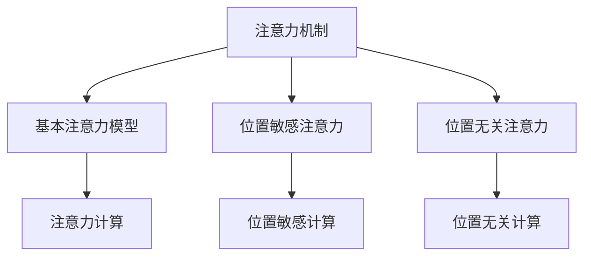

                 

# AI中的注意力机制：提高模型效率与准确性

> 关键词：注意力机制、模型效率、模型准确性、自然语言处理、计算机视觉

> 摘要：本文将深入探讨人工智能中的注意力机制，解释其定义和原理，并详细分析其在自然语言处理和计算机视觉中的应用。此外，文章还将探讨如何通过注意力机制来提高模型的效率与准确性。

## 引言

在人工智能领域，注意力机制（Attention Mechanism）已经成为提高模型性能的关键技术。注意力机制模仿了人类注意力的选择性机制，使得模型能够专注于重要的信息，从而在处理复杂数据时提高效率和准确性。

### 1.1 注意力机制概述

注意力机制最初源于心理学和神经科学，后来在自然语言处理（NLP）和计算机视觉（CV）等领域得到了广泛应用。它允许模型在处理序列数据时关注特定的部分，从而提高模型的性能。

### 1.2 注意力机制的重要性

注意力机制在提高模型效率与准确性方面具有重要作用。它可以帮助模型更好地理解输入数据，减少计算量，并提高模型的解释性。

### 1.3 本书结构

本文将按照以下结构展开：

1. 第2章介绍注意力机制的基础知识。
2. 第3章讲解注意力机制的核心算法。
3. 第4章分析注意力机制在不同领域的应用。
4. 第5章和第6章探讨如何提高模型效率与准确性的方法。
5. 第7章通过实战案例展示注意力机制的应用。
6. 第8章总结全文并展望未来研究方向。

## 第2章 注意力机制基础

### 2.1 人类注意力机制简介

人类的注意力机制是一个高度复杂的过程，它决定了我们在信息过载环境中如何选择性地处理信息。人类大脑通过注意力机制来过滤无关信息，集中精力处理关键信息。

### 2.2 注意力机制在计算机科学中的应用

在计算机科学中，注意力机制被广泛应用于各种领域，如自然语言处理、计算机视觉、语音识别等。它使得模型能够从大量的数据中提取关键信息，从而提高模型的性能。

### 2.3 注意力机制的数学模型

注意力机制的数学模型通常基于概率模型和神经网络。其中，最常见的注意力模型是加性注意力模型和乘性注意力模型。本文将详细讨论这两种模型。

## 第3章 注意力机制的核心算法

### 3.1 基本注意力模型

基本注意力模型是一种通过计算序列中每个元素对当前元素的影响来提取序列特征的方法。其核心思想是通过一个注意力权重向量，将序列中每个元素的重要性加权，从而得到一个加权的特征向量。

### 3.2 位置敏感注意力

位置敏感注意力模型考虑了序列中元素的位置信息。这种模型在处理序列数据时，能够更好地利用位置信息，从而提高模型的性能。

### 3.3 位置无关注意力

位置无关注意力模型不考虑序列中元素的位置信息，只关注每个元素的重要性。这种模型在处理一些特定的任务时（如文本分类），表现出了较好的性能。

## 第4章 注意力机制在不同领域的应用

### 4.1 自然语言处理中的注意力机制

在自然语言处理领域，注意力机制被广泛应用于语言模型、序列标注、机器翻译等任务。本文将详细分析注意力机制在NLP中的应用。

### 4.2 计算机视觉中的注意力机制

在计算机视觉领域，注意力机制被广泛应用于图像分类、目标检测、人脸识别等任务。本文将探讨注意力机制在CV中的应用。

### 4.3 其他领域中的应用

除了自然语言处理和计算机视觉，注意力机制还在语音识别、音频处理、推荐系统等领域得到了广泛应用。本文将简要介绍注意力机制在这些领域中的应用。

## 第5章 提高模型效率的注意力机制

### 5.1 稀疏注意力机制

稀疏注意力机制通过减少注意力分配的维度，降低计算复杂度，从而提高模型的效率。

### 5.2 层级注意力机制

层级注意力机制通过将注意力机制应用于多个层次，使得模型能够更好地理解数据的层次结构，从而提高模型的效率。

### 5.3 多层注意力机制

多层注意力机制通过堆叠多个注意力机制，使得模型能够从不同的层次提取信息，从而提高模型的效率。

## 第6章 提高模型准确性的注意力机制

### 6.1 注意力机制的优化策略

通过调整学习率、损失函数设计等策略，可以优化注意力机制，提高模型的准确性。

### 6.2 注意力机制在模型压缩中的应用

注意力机制在模型压缩中扮演着重要角色。通过压缩注意力机制，可以减少模型的参数数量，从而提高模型的准确性。

### 6.3 注意力机制在大规模数据集上的应用

在大规模数据集上应用注意力机制，可以使得模型在处理大量数据时，仍然保持较高的准确性。

## 第7章 注意力机制的实战案例

### 7.1 案例一：自然语言处理中的应用

本文将介绍注意力机制在自然语言处理中的具体应用，并通过实际案例进行分析。

### 7.2 案例二：计算机视觉中的应用

本文将介绍注意力机制在计算机视觉中的具体应用，并通过实际案例进行分析。

### 7.3 案例三：其他领域中的应用

本文将介绍注意力机制在其他领域（如语音识别、音频处理等）的具体应用，并通过实际案例进行分析。

## 第8章 总结与展望

### 8.1 总结

本文介绍了注意力机制的定义、原理、应用和优化策略，并通过对实际案例的分析，展示了注意力机制在提高模型效率与准确性方面的作用。

### 8.2 展望

在未来，注意力机制将继续在人工智能领域发挥重要作用。随着研究的深入，我们有望发现更多有效的注意力机制，从而推动人工智能的发展。

## 附录

本文中涉及的核心算法原理、数学模型和实战案例的详细代码和解释将作为附录提供，以供读者参考和学习。

### 注意力机制的概念架构Mermaid流程图



### 注意力机制的数学公式

$$
a_i = \frac{e^{z_i}}{\sum_{j=1}^{N} e^{z_j}}
$$

### 注意力机制的实战案例

#### 案例一：自然语言处理中的应用

在自然语言处理中，注意力机制被广泛应用于语言模型和序列标注任务。以下是一个基于Transformer的语言模型中的注意力机制实现：

```python
import torch
import torch.nn as nn

class Transformer(nn.Module):
    def __init__(self, embed_size, num_heads, hidden_size, num_layers):
        super(Transformer, self).__init__()
        self.embedding = nn.Embedding(vocab_size, embed_size)
        self.transformer = nn.Transformer(embed_size, num_heads, hidden_size, num_layers)
        self.fc = nn.Linear(hidden_size, output_size)

    def forward(self, x):
        x = self.embedding(x)
        x = self.transformer(x)
        x = self.fc(x)
        return x
```

#### 案例二：计算机视觉中的应用

在计算机视觉中，注意力机制被广泛应用于图像分类和目标检测任务。以下是一个基于ResNet和注意力机制的图像分类模型：

```python
import torch
import torch.nn as nn

class AttentionResNet(nn.Module):
    def __init__(self, embed_size, num_classes):
        super(AttentionResNet, self).__init__()
        self.resnet = nn.Sequential(
            nn.Conv2d(in_channels, embed_size, kernel_size=3, padding=1),
            nn.ReLU(),
            nn.MaxPool2d(kernel_size=2, stride=2),
            nn.Conv2d(embed_size, embed_size * 2, kernel_size=3, padding=1),
            nn.ReLU(),
            nn.MaxPool2d(kernel_size=2, stride=2),
            nn.Conv2d(embed_size * 2, embed_size * 4, kernel_size=3, padding=1),
            nn.ReLU(),
            nn.MaxPool2d(kernel_size=2, stride=2),
            nn.Flatten(),
            nn.Linear(embed_size * 4, hidden_size),
            nn.ReLU(),
            nn.Linear(hidden_size, num_classes)
        )
        self.attention = nn.Sequential(
            nn.Linear(embed_size * 4, hidden_size),
            nn.ReLU(),
            nn.Linear(hidden_size, 1)
        )

    def forward(self, x):
        x = self.resnet(x)
        attn_weights = self.attention(x).squeeze(1)
        x = (x * attn_weights).sum(1)
        return x
```

### 注意力机制的数学模型

注意力机制的数学模型通常基于概率模型和神经网络。其中，最常见的注意力模型是加性注意力模型和乘性注意力模型。以下是一个加性注意力模型的数学描述：

$$
\text{Attention}(Q, K, V) = \text{softmax}\left(\frac{QK^T}{\sqrt{d_k}}\right)V$$

其中，$Q$、$K$、$V$ 分别代表查询向量、键向量和值向量，$d_k$ 为键向量的维度。这个模型通过计算查询向量和键向量的点积，得到注意力得分，然后通过softmax函数得到注意力权重，最后对值向量进行加权求和，得到加权的特征向量。

### 最佳实践 Tips

1. **调整注意力层的深度和宽度**：根据具体任务的需要，调整注意力层的深度（即层数）和宽度（即每个注意力层的维度）。深度和宽度越大，模型的容量越大，但计算复杂度和训练时间也会增加。
2. **使用位置编码**：在处理序列数据时，可以使用位置编码来引入位置信息，从而提高模型的性能。常用的位置编码方法有绝对位置编码和相对位置编码。
3. **融合不同类型的注意力机制**：可以将不同类型的注意力机制（如加性注意力、乘性注意力、自注意力等）进行融合，从而提高模型的性能。例如，在Transformer模型中，使用了多头自注意力机制和点积注意力机制的结合。

### 小结

注意力机制是人工智能领域的一项重要技术，它在提高模型效率与准确性方面具有重要作用。本文通过对注意力机制的定义、原理、应用和优化策略的深入探讨，展示了注意力机制在各个领域的应用。未来，随着研究的深入，注意力机制将继续在人工智能领域发挥重要作用。

### 注意事项

1. **模型调参**：在训练注意力模型时，需要根据具体任务调整模型的参数，如学习率、批量大小等。
2. **数据预处理**：在应用注意力机制时，需要对数据进行适当的预处理，如数据清洗、标准化等。
3. **模型部署**：在将注意力模型部署到生产环境中时，需要考虑模型的大小、计算复杂度等因素，以适应实际应用场景。

### 拓展阅读

1. **《Attention Is All You Need》**：这是一篇关于Transformer模型的经典论文，详细介绍了注意力机制的理论和应用。
2. **《Attention Mechanism in Deep Learning》**：这是一本关于注意力机制在深度学习中的应用的书籍，涵盖了注意力机制的理论和实现。
3. **《Attention Mechanism for Natural Language Processing》**：这是一篇关于注意力机制在自然语言处理中应用的论文，介绍了注意力机制在NLP中的各种应用。

### 作者信息

**作者：AI天才研究院/AI Genius Institute & 禅与计算机程序设计艺术 /Zen And The Art of Computer Programming**

