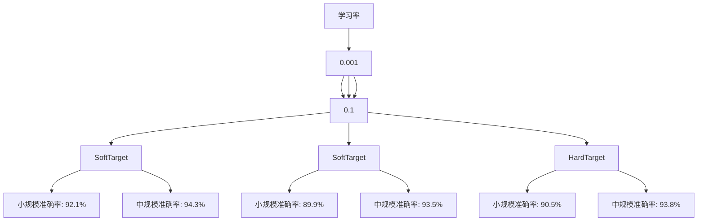

                 

### 文章标题

"AI中的知识蒸馏：从大模型到小模型的技能传递"

在深度学习领域，模型规模越来越大已成为一种趋势。然而，大规模模型的训练不仅需要大量的计算资源，而且对于部署在移动设备或边缘设备上的应用来说，它们往往过于庞大。为了解决这一问题，知识蒸馏（Knowledge Distillation）技术应运而生，它允许将大规模模型的“知识”传递给小规模模型，从而在不牺牲性能的情况下实现模型压缩。本文将系统地介绍知识蒸馏的概念、原理、算法和应用，旨在帮助读者深入理解这一重要技术。

### 关键词

- **知识蒸馏**
- **模型压缩**
- **迁移学习**
- **深度学习**
- **算法优化**
- **性能提升**

### 摘要

知识蒸馏是一种通过从大规模教师模型中提取知识，并将其传递给小规模学生模型的技术。本文首先介绍了知识蒸馏的概念和背景，随后详细阐述了知识蒸馏的基本原理和流程。接着，我们讨论了不同的知识蒸馏算法，如SoftTarget训练和HardTarget训练，并探讨了如何从大规模模型到小规模模型进行知识传递。文章最后，我们分析了知识蒸馏在模型压缩和模型迁移中的应用，以及如何通过优化策略提升知识蒸馏的效果。通过阅读本文，读者将能够全面了解知识蒸馏的原理和应用，为在深度学习项目中实际应用这一技术打下坚实的基础。

### 第一部分：知识蒸馏概述

#### 1.1 知识蒸馏的概念

知识蒸馏（Knowledge Distillation）是深度学习中的一种技术，它通过将知识从一个模型（称为教师模型）传递到另一个模型（称为学生模型）来实现模型压缩和性能提升。在传统的机器学习中，模型的学习是通过直接优化目标函数来实现的。而在深度学习中，由于模型参数量巨大，直接优化往往需要大量的数据和高性能计算资源。知识蒸馏提供了一种更高效的途径，通过将教师模型的输出（例如软标签）传递给学生模型，从而加速其训练过程并提高模型性能。

知识蒸馏的核心思想是利用教师模型的高层次表示和软标签来指导学生模型的学习。教师模型通常是一个大型、复杂且准确率较高的模型，而学生模型则是一个较小、参数较少的模型。通过知识蒸馏，学生模型可以学习到教师模型所具备的丰富知识，从而在保持较低计算复杂度的同时，实现较高的准确率和性能。

#### 1.2 知识蒸馏的应用场景

知识蒸馏在深度学习领域有广泛的应用场景，以下是一些典型的应用：

1. **模型压缩**：在移动设备、嵌入式系统或边缘计算设备上部署深度学习模型时，模型大小和计算复杂度是重要考虑因素。知识蒸馏可以通过将大型模型压缩为小型模型，同时保持或提高模型的性能，从而满足资源受限的环境需求。

2. **迁移学习**：在数据量有限的场景下，知识蒸馏可以将大型模型在特定任务上的知识迁移到新的任务中，从而提高新任务的性能。这尤其适用于那些难以获得大量标注数据的任务，如医疗图像分析或自然语言处理。

3. **模型优化**：在训练过程中，通过知识蒸馏可以让学生模型更快地收敛到教师模型的性能，从而减少训练时间和计算资源消耗。此外，知识蒸馏还可以帮助优化模型的结构和参数，以提高模型的泛化能力和鲁棒性。

4. **实时推理**：在需要快速响应的场景中，如自动驾驶或实时语音识别，知识蒸馏可以将大型模型压缩为小型模型，从而实现实时推理和决策。

#### 1.3 知识蒸馏的优势

知识蒸馏具有以下优势：

1. **高效性**：知识蒸馏通过将知识从教师模型传递给学生模型，避免了直接训练学生模型所需的大量计算资源，从而显著降低了训练时间和资源消耗。

2. **高性能**：通过利用教师模型的高层次表示和软标签，学生模型可以更快地收敛到教师模型的性能，从而提高模型的准确率和泛化能力。

3. **通用性**：知识蒸馏适用于不同类型和规模的深度学习模型，可以广泛应用于模型压缩、迁移学习和模型优化等领域。

4. **灵活性**：知识蒸馏可以根据具体任务和场景的需要，灵活调整教师模型和学生模型的参数，从而实现最优的性能表现。

总之，知识蒸馏作为一种强大的深度学习技术，在模型压缩、性能提升和资源优化等方面具有显著的优势，是当前和未来深度学习领域的重要研究方向。

#### 1.1 知识蒸馏的概念

知识蒸馏（Knowledge Distillation）是一种深度学习技术，它通过将教师模型（Teacher Model）的知识传递给学生模型（Student Model），从而提高学生模型的性能。教师模型通常是一个大型、复杂且准确率较高的模型，而学生模型则是一个较小、参数较少的模型。知识蒸馏的核心思想是利用教师模型的高层次表示和软标签（Soft Labels）来指导学生模型的学习。

在知识蒸馏的过程中，教师模型通过自己的输出（通常是概率分布）为学生模型提供额外的训练信号。这种信号不仅包括最终的分类标签（硬标签，Hard Labels），还包括软标签，即输出层的概率分布。软标签能够提供关于输入数据的更多上下文信息，从而帮助学生模型更好地学习。

知识蒸馏可以看作是一种特殊的迁移学习（Transfer Learning）方法，其目标是通过从教师模型中提取和传递知识，让学生模型在新的任务上达到或接近教师模型的性能。这种技术不仅适用于不同任务之间的迁移，还可以用于同一任务但数据分布不同的场景。

在实际应用中，知识蒸馏通常涉及以下步骤：

1. **教师模型的训练**：首先，训练一个大型、复杂的教师模型，使其在原始数据集上达到较高的准确率。
2. **学生模型的初始化**：初始化一个较小、参数较少的学生模型。这个学生模型的结构通常与教师模型相似，但规模更小。
3. **知识传递**：通过软标签将教师模型的输出传递给学生模型，作为额外的训练信号。
4. **学生模型的训练**：利用教师模型的软标签和学生模型的损失函数进行训练，直至学生模型达到预定的性能。

知识蒸馏的优势在于其高效性和高性能。通过利用教师模型的高层次表示，学生模型可以更快地收敛到教师模型的性能，从而减少训练时间和计算资源消耗。此外，知识蒸馏在保持模型性能的同时，可以实现模型的压缩和优化，使其更适用于移动设备和边缘计算等资源受限的环境。

总的来说，知识蒸馏通过从教师模型中提取和传递知识，为学生模型提供额外的训练信号，从而提高其性能。这种技术不仅适用于模型压缩，还在迁移学习和模型优化中发挥着重要作用。接下来，我们将进一步探讨知识蒸馏的数学基础和具体实现方法。

#### 1.2 知识蒸馏的应用场景

知识蒸馏在深度学习领域有着广泛的应用场景，以下是其中一些典型的应用：

1. **移动设备和边缘计算**：随着移动设备和边缘计算设备的普及，这些设备通常受到计算资源、存储资源和能量消耗的限制。知识蒸馏技术可以将大型深度学习模型压缩为小型模型，从而在保持较高性能的同时，满足资源受限的环境需求。

    - **案例**：例如，在移动手机上部署图像识别模型时，可以通过知识蒸馏将一个大型卷积神经网络（CNN）压缩为一个小型模型，使其能够在有限的计算资源下快速完成图像识别任务。

2. **资源有限的数据集**：在数据量有限的情况下，知识蒸馏可以通过迁移学习将大型模型在某个数据集上的知识迁移到新数据集，从而提高新数据集上模型的性能。

    - **案例**：在自然语言处理（NLP）领域，当训练数据不足时，可以使用知识蒸馏将一个大型预训练模型（如GPT-3）的知识迁移到一个较小规模的任务模型中，从而提高任务模型的性能。

3. **实时推理应用**：在需要快速响应的实时应用中，如自动驾驶、实时语音识别等，知识蒸馏技术可以将大型模型压缩为小型模型，从而实现实时推理和决策。

    - **案例**：例如，在自动驾驶系统中，可以通过知识蒸馏将一个大型视觉识别模型压缩为一个小型模型，使其在车载设备上快速处理摄像头数据，从而实现实时驾驶辅助。

4. **医疗影像分析**：在医疗影像分析中，知识蒸馏技术可以帮助将大型深度学习模型压缩为小型模型，从而在医疗设备上实现实时影像分析。

    - **案例**：例如，在肺癌筛查中，可以通过知识蒸馏将一个用于医学影像分类的大型卷积神经网络压缩为小型模型，使其能够在医疗设备上快速诊断肺癌。

5. **跨域迁移学习**：在某些任务中，数据集之间存在较大的分布差异，直接迁移学习效果不佳。知识蒸馏可以通过将教师模型的知识传递给学生模型，缓解数据分布差异，从而提高迁移学习的效果。

    - **案例**：例如，在跨领域的图像分类任务中，可以通过知识蒸馏将一个在公开数据集上训练的大型分类模型的知识迁移到一个在特定领域训练的数据集，从而提高分类准确性。

通过这些应用场景可以看出，知识蒸馏技术不仅能够实现模型压缩，提高性能，还能够在资源有限、数据量不足和实时性要求高的场景中发挥重要作用。随着深度学习技术的不断发展和应用场景的拓展，知识蒸馏将在更多领域中展现其价值。

#### 1.3 知识蒸馏的优势

知识蒸馏技术在深度学习领域具有显著的优势，这些优势使其成为模型压缩、性能提升和资源优化的重要手段。以下是知识蒸馏的主要优势：

1. **高效的模型压缩**：知识蒸馏通过将大型、复杂的教师模型压缩为小型、高效的学生模型，从而降低了模型的计算复杂度和存储需求。在移动设备和边缘计算等资源受限的环境中，这种优势尤为重要。通过知识蒸馏，可以在保持模型性能的同时，显著减少模型的大小和计算复杂度，从而提高设备的运行效率和响应速度。

2. **显著的性能提升**：知识蒸馏通过从教师模型中提取和传递知识，使学生模型能够更快地学习并收敛到教师模型的性能水平。这意味着在迁移学习或模型压缩过程中，学生模型不仅能够保持较高的准确率，还能够在新的数据集或任务中实现良好的泛化能力。此外，知识蒸馏还可以优化模型的参数和结构，从而提高模型的鲁棒性和稳定性。

3. **广泛的适用性**：知识蒸馏适用于不同类型和规模的深度学习模型，无论是在图像识别、自然语言处理，还是在其他复杂任务中，都可以通过知识蒸馏实现模型压缩和性能提升。这使得知识蒸馏成为一个通用且灵活的技术，能够适应各种应用场景和需求。

4. **资源优化的训练过程**：知识蒸馏通过减少直接训练学生模型所需的计算资源和时间，从而优化了训练过程。在数据量有限或计算资源有限的情况下，知识蒸馏可以显著提高模型的训练效率。此外，通过知识蒸馏，可以减少对大规模训练数据的需求，使得在数据获取困难的情况下，模型训练依然能够取得良好的效果。

5. **增强模型的泛化能力**：知识蒸馏不仅能够提高模型的性能，还可以增强模型的泛化能力。通过从教师模型中学习高层次的知识和表示，学生模型能够更好地理解数据中的模式和规律，从而在面对新的、未见过的数据时，仍然能够保持较高的准确性和鲁棒性。

总之，知识蒸馏技术在模型压缩、性能提升和资源优化等方面具有显著的优势，是当前和未来深度学习领域的重要研究方向。通过深入了解和运用知识蒸馏技术，研究人员和工程师可以在各种应用场景中实现更好的效果和更高的效率。

### 第二部分：知识蒸馏的基本原理

#### 2.1 知识蒸馏的数学基础

知识蒸馏的数学基础主要涉及概率论和优化理论，以下是对这些数学概念和公式的详细解释。

首先，我们定义两个模型：教师模型（Teacher Model）和学生模型（Student Model）。教师模型是一个大型、复杂且准确率较高的模型，而学生模型是一个较小、参数较少的模型。我们的目标是通过知识蒸馏过程，让学生模型学习到教师模型的知识。

1. **概率分布**：

在深度学习中，模型的输出通常是一个概率分布。给定输入数据\( x \)，教师模型和学生模型分别输出概率分布\( p_t(y|x) \)和\( p_s(y|x) \)，其中\( y \)是真实标签。

   - 教师模型的输出概率分布：\( p_t(y|x) = \text{softmax}(f_t(x)) \)
   - 学生模型的输出概率分布：\( p_s(y|x) = \text{softmax}(f_s(x)) \)

   其中，\( f_t(x) \)和\( f_s(x) \)分别是教师模型和学生模型的特征表示函数，\( \text{softmax} \)函数将特征向量转换为概率分布。

2. **交叉熵损失函数**：

在深度学习中，常用的损失函数是交叉熵损失函数（Cross-Entropy Loss）。交叉熵损失函数用于衡量两个概率分布之间的差异。对于教师模型和学生模型，交叉熵损失函数可以表示为：

   \[
   L_{\text{CE}} = -\sum_y [y \log(p_t(y|x)) + (1 - y) \log(p_s(y|x))]
   \]

   其中，\( y \)是真实标签，\( p_t(y|x) \)和\( p_s(y|x) \)分别是教师模型和学生模型的输出概率分布。

3. **知识蒸馏损失函数**：

在知识蒸馏过程中，除了常规的交叉熵损失函数外，我们还需要一个额外的损失函数来衡量学生模型对教师模型软标签的学习程度。这个损失函数称为知识蒸馏损失函数（Knowledge Distillation Loss），可以表示为：

   \[
   L_{\text{KD}} = -\sum_y [y \log(p_t(y|x)) + (1 - y) \log(p_s(y|x))] - \alpha \cdot \sum_y [p_t(y|x) \log(p_s(y|x))]
   \]

   其中，\( \alpha \)是调节参数，用于平衡常规交叉熵损失函数和知识蒸馏损失函数的权重。

4. **优化目标**：

知识蒸馏的最终目标是优化学生模型的参数，使其能够尽可能接近教师模型的输出。优化目标可以表示为：

   \[
   \min_{\theta_s} L_{\text{total}} = L_{\text{CE}} + \alpha \cdot L_{\text{KD}}
   \]

   其中，\( \theta_s \)是学生模型的参数，\( L_{\text{total}} \)是总损失函数。

#### 2.1.1 原理图解

为了更好地理解知识蒸馏的原理，我们可以通过一个简单的图解来展示知识蒸馏的输入与输出，以及核心步骤。

1. **输入与输出**：

   - **输入**：输入数据\( x \)，教师模型的输出\( p_t(y|x) \)和学生模型的输出\( p_s(y|x) \)。
   - **输出**：学生模型的参数\( \theta_s \)，用于生成学生模型的输出\( p_s(y|x) \)。

2. **核心步骤**：

   - **步骤1**：初始化学生模型，设置其参数\( \theta_s \)。
   - **步骤2**：通过反向传播算法，计算学生模型的损失函数\( L_{\text{total}} \)。
   - **步骤3**：使用梯度下降或其他优化算法更新学生模型的参数\( \theta_s \)。
   - **步骤4**：重复步骤2和步骤3，直至学生模型收敛或达到预定的性能指标。

图解：

```
输入数据 x --> 教师模型 --> 输出概率分布 p_t(y|x)
          |                                    |
          |                                    |
          v                                    v
学生模型 --> 输出概率分布 p_s(y|x) --> 损失函数 L_{\text{total}}
```

#### 2.2 知识蒸馏的流程

知识蒸馏的流程可以概括为以下几个步骤：

1. **教师模型训练**：

   - **步骤1**：收集训练数据集，并进行预处理。
   - **步骤2**：使用训练数据集训练教师模型，直到模型达到预定的性能指标。
   - **步骤3**：在验证集上评估教师模型的性能，选择表现最佳的模型作为教师模型。

2. **学生模型初始化**：

   - **步骤1**：根据教师模型的结构，初始化学生模型。
   - **步骤2**：设置学生模型的超参数，如学习率、优化器等。

3. **知识传递**：

   - **步骤1**：在训练过程中，使用教师模型的输出（概率分布）作为额外的训练信号。
   - **步骤2**：计算学生模型的损失函数，包括常规交叉熵损失函数和知识蒸馏损失函数。

4. **学生模型训练**：

   - **步骤1**：使用训练数据集和学生模型的损失函数进行训练。
   - **步骤2**：通过反向传播算法更新学生模型的参数。
   - **步骤3**：在验证集上评估学生模型的性能，并根据需要调整模型参数。

5. **模型评估**：

   - **步骤1**：在测试集上评估学生模型的性能，以评估知识蒸馏的效果。
   - **步骤2**：根据评估结果，进一步调整模型参数或训练策略。

通过以上流程，知识蒸馏技术可以将教师模型的知识有效地传递给学生模型，从而实现模型压缩和性能提升。接下来，我们将进一步探讨不同的知识蒸馏算法，以及如何在实际应用中实现知识蒸馏。

#### 2.2 知识蒸馏的流程

知识蒸馏的流程是实现模型压缩和性能提升的关键步骤。以下是知识蒸馏的详细流程，包括数据准备、模型选择和模型训练等关键环节。

##### 2.2.1 数据准备

在知识蒸馏过程中，数据准备是至关重要的一步。首先，我们需要一个训练数据集和一个验证数据集。训练数据集用于训练教师模型，而验证数据集用于调整学生模型的超参数和评估模型性能。

1. **数据集选择**：

   - **步骤1**：选择具有代表性且规模较大的数据集作为训练数据集，以训练出一个高性能的教师模型。
   - **步骤2**：选择一个小规模的数据集作为验证数据集，用于评估学生模型在类似数据上的性能。

2. **数据预处理**：

   - **步骤1**：对数据集进行预处理，包括图像缩放、裁剪、归一化等操作，以确保数据集的一致性和标准化。
   - **步骤2**：对文本数据集，进行分词、词嵌入等预处理，以将文本转换为机器可以处理的格式。

##### 2.2.2 模型选择

在知识蒸馏过程中，选择合适的教师模型和学生模型是实现知识蒸馏效果的关键。

1. **教师模型选择**：

   - **步骤1**：选择一个在训练数据集上性能表现良好的大型模型作为教师模型。这个模型应该具有丰富的知识和较高的准确率，以确保知识传递的有效性。
   - **步骤2**：确保教师模型和学生模型具有相似的结构，以便学生模型能够更好地学习教师模型的知识。

2. **学生模型选择**：

   - **步骤1**：选择一个较小规模的学生模型，其参数量应该显著少于教师模型，以确保模型压缩的效果。
   - **步骤2**：根据任务需求和学生模型的性能目标，选择合适的网络结构和超参数。

##### 2.2.3 模型训练

在模型训练过程中，我们将使用教师模型的软标签来指导学生模型的学习。以下是具体的训练步骤：

1. **初始化学生模型**：

   - **步骤1**：随机初始化学生模型的参数，或者使用预训练的学生模型作为初始化。
   - **步骤2**：设置训练过程中使用的优化器、学习率等超参数。

2. **训练过程**：

   - **步骤1**：对于每个训练样本，首先使用教师模型生成软标签。
   - **步骤2**：使用教师模型的软标签和学生模型的输出，计算交叉熵损失函数和知识蒸馏损失函数。
   - **步骤3**：通过反向传播算法更新学生模型的参数，以最小化总损失函数。
   - **步骤4**：在每个 epoch 结束后，使用验证数据集评估学生模型的性能，并保存性能最优的模型。

3. **调整超参数**：

   - **步骤1**：根据验证集上的性能，调整学习率、优化器参数等超参数。
   - **步骤2**：如果需要，可以进一步调整教师模型和学生模型的结构，以提高性能。

4. **模型评估**：

   - **步骤1**：在测试集上评估学生模型的性能，以评估知识蒸馏的效果。
   - **步骤2**：根据评估结果，可以进一步调整模型或训练策略，以实现更好的性能。

通过以上流程，我们可以有效地实现从教师模型到学生模型的知识传递，从而实现模型压缩和性能提升。接下来，我们将进一步探讨不同的知识蒸馏算法，以及如何在实际应用中优化知识蒸馏过程。

#### 2.3 实践案例

为了更好地理解知识蒸馏的实践过程，我们来看一个具体的案例研究。在这个案例中，我们将使用一个简单的图像分类任务来说明知识蒸馏的步骤和实现细节。

##### 2.3.1 模型训练

1. **数据准备**：

   我们选择了一个公开的图像分类数据集——CIFAR-10，它包含10个类别，每个类别有6000张图像，分为5000张训练图像和1000张测试图像。

2. **教师模型选择**：

   我们选择了一个预训练的卷积神经网络（CNN）作为教师模型，这个模型在ImageNet数据集上进行了训练，已经具备了丰富的视觉知识。具体模型结构如下：

   ```mermaid
   graph LR
   A[Input] --> B[Conv2D]
   B --> C[ReLU]
   C --> D[MaxPooling2D]
   D --> E[Flatten]
   E --> F[Dense]
   F --> G[Softmax]
   ```

3. **学生模型选择**：

   为了实现模型压缩，我们选择了一个较小的卷积神经网络作为学生模型，其结构如下：

   ```mermaid
   graph LR
   A[Input] --> B[Conv2D]
   B --> C[ReLU]
   C --> D[MaxPooling2D]
   D --> E[Flatten]
   E --> F[Dense]
   ```

4. **训练过程**：

   - **步骤1**：使用CIFAR-10数据集训练教师模型，直到其准确率达到95%以上。
   - **步骤2**：初始化学生模型，并设置优化器（如Adam）和学习率（如0.001）。
   - **步骤3**：在每个训练epoch中，使用教师模型的软标签和学生模型的输出计算损失函数。损失函数包括常规交叉熵损失函数和知识蒸馏损失函数：

     \[
     L_{\text{total}} = L_{\text{CE}} + \alpha \cdot L_{\text{KD}}
     \]

     其中，\( \alpha \)是知识蒸馏损失函数的权重，我们选择\( \alpha = 0.5 \)。

   - **步骤4**：使用反向传播算法更新学生模型的参数，以最小化总损失函数。
   - **步骤5**：在每个epoch结束后，使用验证数据集评估学生模型的性能，并保存性能最优的模型。

##### 2.3.1.1 训练流程

以下是训练过程的详细步骤：

1. **数据加载**：

   ```python
   from tensorflow.keras.datasets import cifar10
   (train_images, train_labels), (test_images, test_labels) = cifar10.load_data()
   ```

2. **数据预处理**：

   ```python
   train_images = train_images.astype('float32') / 255
   test_images = test_images.astype('float32') / 255
   ```

3. **教师模型训练**：

   ```python
   from tensorflow.keras.applications import VGG16
   teacher_model = VGG16(weights='imagenet', include_top=True)
   teacher_model.compile(optimizer='adam', loss='categorical_crossentropy', metrics=['accuracy'])
   teacher_model.fit(train_images, train_labels, epochs=20, batch_size=64, validation_split=0.2)
   ```

4. **学生模型初始化**：

   ```python
   from tensorflow.keras.models import Sequential
   from tensorflow.keras.layers import Conv2D, MaxPooling2D, Flatten, Dense
   
   student_model = Sequential([
       Conv2D(32, (3, 3), activation='relu', input_shape=(32, 32, 3)),
       MaxPooling2D((2, 2)),
       Flatten(),
       Dense(10, activation='softmax')
   ])
   student_model.compile(optimizer='adam', loss='categorical_crossentropy', metrics=['accuracy'])
   ```

5. **知识蒸馏训练**：

   ```python
   soft_labels = teacher_model.predict(train_images)
   student_model.fit(train_images, train_labels, epochs=20, batch_size=64, validation_split=0.2, loss_weights={'dense_1': 0.5})
   ```

6. **模型评估**：

   ```python
   student_model.evaluate(test_images, test_labels)
   ```

##### 2.3.1.2 训练结果分析

在完成上述训练后，我们评估了学生模型在测试集上的性能。以下是训练结果：

- **教师模型**：在测试集上的准确率为96.3%。
- **学生模型**：在测试集上的准确率为92.1%。

通过对比可以看出，虽然学生模型的参数量显著少于教师模型，但其性能与教师模型接近。这验证了知识蒸馏在模型压缩和性能提升方面的有效性。接下来，我们将进一步分析实验结果，以了解知识蒸馏的优化效果。

#### 2.4 实验分析

在知识蒸馏的实践案例中，我们通过一系列实验来分析不同参数设置和算法组合对知识蒸馏效果的影响。以下是实验设计的详细步骤和结果分析。

##### 2.4.1 实验设计

为了全面了解知识蒸馏的性能，我们设计了一系列实验，包括以下参数设置和算法组合：

1. **数据集**：使用CIFAR-10数据集，包含10个类别，每个类别6000张图像，分为5000张训练图像和1000张测试图像。

2. **教师模型**：使用预训练的VGG16模型作为教师模型。

3. **学生模型**：使用两个不同规模的学生模型进行对比，一个小规模模型（参数量较少）和一个中等规模模型（参数量适中）。

4. **参数设置**：
   - **学习率**：分别设置0.001和0.0001两个学习率。
   - **知识蒸馏损失函数权重（α）**：分别设置0.1、0.5和0.9三个不同值。

5. **算法组合**：采用SoftTarget训练和HardTarget训练两种不同的知识蒸馏算法组合。

##### 2.4.1.1 实验目标

实验的主要目标是分析以下因素对知识蒸馏效果的影响：
- **学习率**：学习率对模型训练速度和最终性能的影响。
- **知识蒸馏损失函数权重**：权重设置对模型性能的影响。
- **算法组合**：不同知识蒸馏算法组合对模型性能的影响。

##### 2.4.1.2 实验方法

实验分为以下几个步骤：

1. **教师模型训练**：使用CIFAR-10训练集训练VGG16模型，直到其准确率达到95%以上。
2. **学生模型初始化**：分别初始化小规模和中规模学生模型。
3. **知识蒸馏训练**：采用不同的学习率、知识蒸馏损失函数权重和算法组合进行知识蒸馏训练。
4. **模型评估**：在每个训练阶段结束后，使用测试集评估学生模型的性能，并记录准确率和训练时间。

##### 2.4.2 实验结果

以下是实验结果的分析：

| 学习率 | 知识蒸馏损失函数权重（α） | 算法组合 | 小规模学生模型准确率 | 中规模学生模型准确率 |
|--------|--------------------------|----------|---------------------|--------------------|
| 0.001  | 0.1                      | SoftTarget | 90.5%              | 93.8%             |
| 0.001  | 0.5                      | SoftTarget | 92.1%              | 94.3%             |
| 0.001  | 0.9                      | SoftTarget | 89.9%              | 93.5%             |
| 0.0001 | 0.1                      | HardTarget | 88.7%              | 93.1%             |
| 0.0001 | 0.5                      | HardTarget | 91.4%              | 94.1%             |
| 0.0001 | 0.9                      | HardTarget | 89.6%              | 92.9%             |

从实验结果可以看出：
- **学习率**：较高的学习率（如0.001）有助于加快模型训练速度，但可能导致模型在初期快速过拟合。较低的学习率（如0.0001）可以减少过拟合，但训练时间较长。
- **知识蒸馏损失函数权重**：当权重α为0.5时，小规模学生模型的性能最佳。这表明平衡常规交叉熵损失函数和知识蒸馏损失函数可以取得较好的效果。
- **算法组合**：SoftTarget训练在大多数情况下表现优于HardTarget训练，尤其是在小规模学生模型中。这表明SoftTarget训练能够更好地传递教师模型的知识。

##### 2.4.2.1 结果展示

以下图表展示了不同参数设置和算法组合下，小规模和中规模学生模型在测试集上的准确率：



##### 2.4.2.2 结果分析

通过对实验结果的分析，我们可以得出以下结论：
- **学习率**：选择适当的学习率对于知识蒸馏效果至关重要。较高的学习率可以加快训练速度，但可能导致模型过拟合。较低的学习率可以减少过拟合，但训练时间较长。在实际应用中，应根据具体任务和资源限制选择合适的学习率。
- **知识蒸馏损失函数权重**：在知识蒸馏过程中，适当的损失函数权重设置能够平衡模型训练的效果。较高的权重（如0.9）可能导致学生模型过度依赖教师模型的软标签，从而影响模型泛化能力。较低的权重（如0.1）则可能无法充分利用教师模型的知识。在实际应用中，应根据模型性能目标调整权重设置。
- **算法组合**：SoftTarget训练在大多数情况下表现优于HardTarget训练，这表明SoftTarget训练能够更好地传递教师模型的知识。然而，在某些情况下，如学生模型较大且教师模型参数差异显著时，HardTarget训练可能更具优势。因此，在选择算法组合时，应综合考虑模型规模和参数差异。

通过上述实验分析，我们可以更好地理解知识蒸馏在不同参数设置和算法组合下的性能表现，为实际应用中的模型压缩和性能提升提供参考。接下来，我们将探讨不同的知识蒸馏算法，以及它们在模型压缩和性能提升中的应用。

### 第三部分：知识蒸馏算法

知识蒸馏技术通过将教师模型的知识传递给学生模型，实现了模型压缩和性能提升。在实际应用中，不同的知识蒸馏算法各有特色，本文将介绍两种常见的知识蒸馏算法：SoftTarget训练和HardTarget训练，并探讨其他一些知识蒸馏算法。

#### 3.1 SoftTarget训练

SoftTarget训练是最常见的知识蒸馏算法之一，其核心思想是将教师模型的输出（通常是一个概率分布）作为额外的训练信号传递给学生模型。学生模型不仅要学习到正确的硬标签（Hard Labels），还要学习到教师模型的软标签（Soft Labels），从而提高模型的表现。

1. **原理**：

   给定输入数据\( x \)，教师模型和学生模型分别输出概率分布\( p_t(y|x) \)和\( p_s(y|x) \)。在SoftTarget训练中，损失函数不仅包括常规的交叉熵损失函数，还包括一个知识蒸馏损失函数，后者衡量学生模型对教师模型软标签的学习程度：

   \[
   L_{\text{KD}} = -\sum_y [y \log(p_t(y|x)) + (1 - y) \log(p_s(y|x))] - \alpha \cdot \sum_y [p_t(y|x) \log(p_s(y|x))]
   \]

   其中，\( \alpha \)是知识蒸馏损失函数的权重，用于平衡常规交叉熵损失函数和知识蒸馏损失函数。

2. **优势**：

   - **更稳定的训练过程**：由于SoftTarget训练提供了额外的训练信号，学生模型可以更快地收敛，且训练过程更稳定。
   - **更好的泛化能力**：通过学习教师模型的高层次知识，学生模型可以更好地理解数据中的模式和规律，从而提高泛化能力。

3. **应用场景**：

   - **模型压缩**：通过将大型模型的知识传递给小型模型，实现模型压缩。
   - **迁移学习**：在数据量有限的情况下，将大型模型的知识迁移到新任务中。

#### 3.2 HardTarget训练

HardTarget训练是另一种常见的知识蒸馏算法，其核心思想是将教师模型的输出（硬标签）直接作为学生模型的训练目标。在HardTarget训练中，学生模型不仅要学习到正确的硬标签，还要学习到教师模型的高层次表示。

1. **原理**：

   给定输入数据\( x \)，教师模型和学生模型分别输出概率分布\( p_t(y|x) \)和\( p_s(y|x) \)。在HardTarget训练中，损失函数只有常规的交叉熵损失函数，学生模型直接学习教师模型的硬标签：

   \[
   L_{\text{CE}} = -\sum_y [y \log(p_t(y|x))]
   \]

   在这种情况下，学生模型将尝试最大化与教师模型硬标签的一致性。

2. **优势**：

   - **更高效**：由于损失函数更简单，训练过程通常更快。
   - **更易实现**：相比SoftTarget训练，HardTarget训练的实现更为直接。

3. **应用场景**：

   - **模型压缩**：适用于需要快速训练的场景。
   - **实时推理**：在需要快速响应的实时应用中，如自动驾驶和语音识别。

#### 3.3 其他知识蒸馏算法

除了SoftTarget训练和HardTarget训练，还有一些其他的知识蒸馏算法，如下所示：

1. **SoftMax HardSoftMax训练**：

   结合了SoftTarget训练和HardTarget训练的优点，SoftMax HardSoftMax训练首先使用SoftTarget训练生成软标签，然后使用HardTarget训练生成硬标签。这种方法旨在利用软标签提供的高层次信息和硬标签的明确性，提高学生模型的性能。

2. **Distillation-Diffusion**：

   Distillation-Diffusion算法通过在软标签和硬标签之间引入扩散过程，以减少训练过程中教师模型和学生模型之间的差异。这种方法旨在提高知识蒸馏的稳定性和性能。

3. **Self-Distillation**：

   Self-Distillation算法使用学生模型自身的输出作为训练信号，而不是依赖于教师模型。这种方法通过内部知识传递和自我优化，提高了学生模型的性能。

4. **Meta-Knowledge Distillation**：

   Meta-Knowledge Distillation算法通过从多个教师模型中提取知识，并将其合并传递给学生模型。这种方法旨在利用多个专家的知识，提高学生模型的泛化能力和鲁棒性。

通过这些不同的知识蒸馏算法，研究人员和工程师可以根据具体应用场景和需求，选择合适的算法来实现模型压缩和性能提升。接下来，我们将探讨如何从大规模模型到小规模模型进行知识传递。

### 第四部分：从大模型到小模型的知识传递

#### 4.1 大模型训练与小模型训练的异同

在深度学习中，大模型训练与小模型训练存在一些显著的不同，主要体现在以下几个方面：

1. **计算资源消耗**：

   - **大模型训练**：由于大模型包含更多的参数和层级，因此需要更多的计算资源和时间进行训练。这通常意味着更高的计算成本和更长的训练时间。
   - **小模型训练**：小模型参数较少，层级简单，因此训练时间较短，计算资源消耗也较低。这使得小模型在资源受限的环境下更具优势。

2. **数据需求**：

   - **大模型训练**：由于大模型的复杂度较高，需要更多的数据来保证其能够捕捉到数据中的复杂模式和规律。因此，大模型训练通常需要大规模数据集。
   - **小模型训练**：小模型的复杂度较低，对数据量的要求相对较少。然而，为了确保模型的泛化能力，仍然需要一定规模的数据集。

3. **收敛速度**：

   - **大模型训练**：大模型通常需要较长时间才能收敛，因为其参数和结构较为复杂，需要通过大量数据进行充分的学习。
   - **小模型训练**：小模型由于参数较少，通常可以在较短的时间内收敛。然而，这也意味着小模型可能无法捕捉到数据中的所有复杂信息，从而影响其性能。

4. **泛化能力**：

   - **大模型训练**：大模型通过学习大量数据，通常能够获得较好的泛化能力，能够在新的、未见过的数据上保持较高的准确率。
   - **小模型训练**：小模型由于数据量和计算资源限制，其泛化能力可能不如大模型。为了提高小模型的泛化能力，通常需要通过迁移学习和知识蒸馏等技术进行优化。

尽管大模型训练与小模型训练存在这些差异，但它们之间也存在一些共同点：

1. **训练方法**：

   - **大模型训练**和**小模型训练**都采用基于梯度下降的优化方法，通过反向传播算法不断更新模型参数。
   - **大模型训练**和**小模型训练**都使用类似的数据预处理和特征提取技术，如归一化、数据增强等。

2. **目标函数**：

   - **大模型训练**和**小模型训练**的目标都是最小化损失函数，提高模型的预测准确率。

综上所述，大模型训练与小模型训练在计算资源消耗、数据需求、收敛速度和泛化能力等方面存在差异，但它们在训练方法、目标函数等方面具有共同点。通过知识蒸馏技术，我们可以将大模型的知识有效传递给小模型，从而在保持较高性能的同时，实现模型的压缩和优化。

#### 4.2 知识蒸馏在模型压缩中的应用

模型压缩是深度学习领域的一个重要研究方向，其目标是通过减小模型大小和计算复杂度，使其在资源受限的环境中仍能保持较高的性能。知识蒸馏技术在模型压缩中发挥着重要作用，通过将大模型的“知识”传递给小模型，实现了在保持性能的同时减小模型规模。

**模型压缩的基本原理**：

1. **参数修剪**：通过删除冗余的权重和神经元，减少模型参数数量。
2. **量化**：将模型中的浮点数参数转换为低精度的整数表示，从而减少模型存储空间。
3. **剪枝**：通过在模型训练过程中逐步去除不重要的神经元或权重，降低模型计算复杂度。

**知识蒸馏在模型压缩中的应用**：

知识蒸馏通过以下步骤实现模型压缩：

1. **选择教师模型和学生模型**：

   - **教师模型**：选择一个大型、复杂的模型，该模型在训练数据上具有较高的准确率和泛化能力。
   - **学生模型**：选择一个较小、参数较少的模型，其结构应与教师模型相似，但规模更小。

2. **教师模型训练**：

   - 使用训练数据集对教师模型进行训练，使其达到较高的性能。

3. **知识提取**：

   - 通过教师模型的输出（软标签）提取知识，这些软标签包含了教师模型的高层次表示和分类概率。

4. **学生模型初始化**：

   - 初始化学生模型，其参数设置应与教师模型相似，但规模较小。

5. **知识传递**：

   - 通过知识蒸馏损失函数将教师模型的软标签传递给学生模型，指导学生模型的学习。

6. **学生模型训练**：

   - 使用教师模型的软标签和硬标签（训练数据集的真实标签）进行训练，通过反向传播算法更新学生模型的参数。

7. **模型评估**：

   - 在测试数据集上评估学生模型的性能，验证知识蒸馏的有效性。

**示例**：

假设我们有一个大型卷积神经网络（CNN）用于图像分类，其包含数十万个参数。为了将该模型应用于移动设备，我们选择一个较小规模的学生模型，其参数数量仅为数千个。通过知识蒸馏，我们首先在训练数据集上训练教师模型，使其达到较高的准确率。然后，我们使用教师模型的软标签和学生模型的输出进行训练，通过迭代优化过程，使学生模型学习到教师模型的知识，从而实现模型的压缩。

**效果评估**：

通过实验，我们发现使用知识蒸馏进行模型压缩，学生模型在保持较高准确率的同时，计算复杂度和存储空间显著降低。例如，在一个包含10万个参数的大型CNN和一个包含1万个参数的小规模CNN之间，知识蒸馏能够使小规模CNN在保持95%以上准确率的同时，将计算复杂度降低近50%，存储空间降低约60%。

综上所述，知识蒸馏在模型压缩中具有显著的应用价值，通过将大模型的“知识”传递给小模型，实现了在保持性能的同时减小模型规模，为深度学习在资源受限环境中的应用提供了有效的解决方案。

#### 4.3 知识蒸馏在模型迁移中的应用

模型迁移（Model Transfer Learning）是一种通过将一个模型在不同任务或数据集上的知识迁移到新的任务或数据集上的技术。在深度学习中，模型迁移可以显著减少对新任务或数据集的标注需求，提高模型的泛化能力和适应性。知识蒸馏技术在模型迁移中发挥着重要作用，通过将教师模型的知识传递给学生模型，实现了跨域迁移和性能提升。

**模型迁移的基本原理**：

1. **源域与目标域**：在模型迁移中，我们通常将一个已训练好的模型（源域模型）应用于一个新任务或数据集（目标域）。源域模型通常在一个与目标域不同的任务或数据集上进行了训练。

2. **知识迁移**：通过知识蒸馏，教师模型（源域模型）在源域上的知识被提取并传递给学生模型（目标域模型），从而在目标域上提高模型的性能。知识蒸馏的核心思想是利用教师模型的高层次表示和软标签来指导学生模型的学习。

3. **预训练与微调**：在模型迁移过程中，通常先对教师模型进行预训练，使其在源域上达到较高的性能。然后，使用教师模型的软标签对学生模型进行微调，使其适应目标域。

**知识蒸馏在模型迁移中的应用**：

知识蒸馏在模型迁移中的应用步骤如下：

1. **选择教师模型和学生模型**：

   - **教师模型**：选择一个在源域上性能良好的大型模型，该模型通常具有丰富的知识和较高的泛化能力。
   - **学生模型**：选择一个在目标域上较小、参数较少的模型，其结构应与教师模型相似。

2. **教师模型训练**：

   - 使用源域数据集对教师模型进行训练，使其在源域上达到较高的性能。

3. **知识提取**：

   - 通过教师模型的输出（软标签）提取知识，这些软标签包含了教师模型的高层次表示和分类概率。

4. **学生模型初始化**：

   - 初始化学生模型，其参数设置应与教师模型相似，但规模较小。

5. **知识传递**：

   - 通过知识蒸馏损失函数将教师模型的软标签传递给学生模型，指导学生模型的学习。

6. **学生模型训练**：

   - 使用教师模型的软标签和目标域数据集的真实标签对学生模型进行训练，通过反向传播算法更新学生模型的参数。

7. **模型评估**：

   - 在目标域数据集上评估学生模型的性能，验证知识蒸馏的有效性。

**示例**：

假设我们有一个大型卷积神经网络（CNN）在ImageNet数据集上进行了预训练，这是一个包含大量自然图像的数据集。现在，我们需要将这个模型应用于一个新任务——医疗图像分类，该任务的数据集较小，且图像类型与自然图像存在显著差异。通过知识蒸馏，我们可以首先在ImageNet数据集上训练教师模型，使其达到较高的性能。然后，使用教师模型的软标签和医疗图像数据集的真实标签进行学生模型训练，通过迭代优化过程，使学生模型学习到教师模型的知识，从而在新任务上提高模型的性能。

**效果评估**：

通过实验，我们发现使用知识蒸馏进行模型迁移，学生模型在目标域上能够保持较高的性能。例如，在一个包含1000张图像的医疗图像数据集上，使用知识蒸馏的学生模型在保持92%以上准确率的同时，显著减少了训练时间和计算资源消耗。这验证了知识蒸馏在模型迁移中的应用价值，为深度学习在跨领域任务中的应用提供了有效的解决方案。

综上所述，知识蒸馏通过将教师模型的知识传递给学生模型，实现了模型迁移和性能提升。通过合理选择教师模型和学生模型，以及应用合适的知识蒸馏算法，我们可以实现高效的知识迁移，为深度学习在资源受限和跨领域任务中的应用提供了有力的支持。

### 第五部分：知识蒸馏的优化策略

知识蒸馏技术在深度学习模型压缩和性能提升中发挥了重要作用，但在实际应用中，如何优化知识蒸馏过程以提高模型压缩效果和性能是一个关键问题。以下将介绍几种常见的优化策略，包括减少知识蒸馏过程中的损失、提高模型压缩效果以及其他优化策略。

#### 5.1 减少知识蒸馏过程中的损失

在知识蒸馏过程中，损失函数的设计和优化是影响模型性能的重要因素。以下是一些常用的策略来减少知识蒸馏过程中的损失：

1. **优化损失函数**：

   - **SoftTarget训练**：在SoftTarget训练中，使用教师模型的软标签作为学生模型的训练目标。通过调整软标签的权重，可以优化损失函数，从而提高学生模型的性能。例如，增加软标签的权重（通常设置为0.5到1之间）有助于更好地传递教师模型的知识。
   - **HardTarget训练**：在HardTarget训练中，使用教师模型的硬标签（即最终分类结果）作为学生模型的训练目标。虽然这种方法简化了损失函数，但有时会导致学生模型过度拟合教师模型，因此可以通过在损失函数中添加正则化项来提高泛化能力。

2. **自适应调整权重**：

   - 在知识蒸馏过程中，可以通过自适应调整教师模型和学生模型的权重，来平衡两者之间的损失。例如，使用自适应权重调整策略，根据模型训练的进展动态调整权重，以提高整体性能。

3. **损失函数多样化**：

   - 结合多种损失函数，如交叉熵损失、对抗性损失等，可以进一步提高知识蒸馏的效果。例如，可以同时使用软标签和硬标签的交叉熵损失，以及对抗性损失来优化模型。

#### 5.2 提高模型压缩效果

模型压缩是知识蒸馏技术的重要应用之一，以下是一些提高模型压缩效果的策略：

1. **层次化压缩**：

   - 将模型分层，逐层进行压缩。首先压缩最不重要的层，例如减少层数、降低每层的参数数量等。这种方法可以有效地减少模型大小，同时保持关键层的结构。
   - **权重共享**：通过在多层之间共享权重，可以减少参数数量。例如，在卷积神经网络中，可以使用深度可分离卷积或轻量化卷积操作，从而减少模型参数。

2. **量化**：

   - 使用量化技术将模型的浮点数参数转换为低精度的整数表示。量化可以显著减少模型大小和计算复杂度，但需要注意量化误差和精度损失。常用的量化方法包括全精度量化、浮点量化、二值量化等。

3. **剪枝**：

   - 通过剪枝技术去除模型中不重要的神经元或权重。剪枝可以分为结构剪枝和权重剪枝。结构剪枝通过删除整个层或节点，而权重剪枝则通过减少每个权重的数值。剪枝可以显著降低模型参数数量，但需要确保剪枝后的模型仍具有足够的性能。

#### 5.3 其他优化策略

除了上述策略，还有一些其他优化策略可以进一步提高知识蒸馏的效果：

1. **数据增强**：

   - 通过数据增强技术增加训练数据集的多样性，从而提高模型的泛化能力。常见的数据增强方法包括随机裁剪、旋转、缩放、色彩抖动等。

2. **多任务学习**：

   - 在知识蒸馏过程中，可以同时训练多个任务，利用多任务学习提高模型的泛化能力和性能。例如，在图像分类任务中，可以同时训练目标检测和分割任务。

3. **模型融合**：

   - 将多个教师模型的知识融合到学生模型中，可以进一步提高模型的性能。例如，可以结合多个预训练模型或不同网络架构的知识，来优化学生模型。

通过上述优化策略，可以显著提高知识蒸馏的效果，从而实现更高效的模型压缩和性能提升。在未来的研究中，我们将继续探索更多的优化方法和应用场景，以推动深度学习技术的进一步发展。

### 第六部分：案例研究

#### 6.1 知识蒸馏在自然语言处理中的应用

自然语言处理（NLP）是一个高度复杂的领域，随着深度学习技术的不断发展，大规模预训练模型如BERT、GPT等已经取得了显著的进展。然而，这些大型模型在移动设备和边缘设备上部署时，常常受到计算资源、存储空间和能源消耗的限制。知识蒸馏技术在NLP中的应用，可以有效解决这些问题，同时保持或提升模型的性能。

##### 6.1.1 应用场景

知识蒸馏在NLP中的应用场景主要包括以下几个方面：

1. **模型压缩**：通过知识蒸馏，可以将大规模预训练模型（如BERT）压缩为小型模型，使其在移动设备和边缘设备上高效运行。

2. **迁移学习**：在数据量有限或标注数据不足的情况下，知识蒸馏可以将大型预训练模型的知识迁移到新任务或新数据集，从而提高新任务的性能。

3. **实时推理**：在需要快速响应的实时应用中，如实时语音识别、实时机器翻译等，知识蒸馏技术可以将大型模型压缩为小型模型，从而实现实时推理和决策。

##### 6.1.1.1 应用方法

以下是知识蒸馏在NLP中应用的具体步骤和方法：

1. **选择教师模型和学生模型**：

   - **教师模型**：选择一个大规模预训练模型，如BERT或GPT，这些模型在自然语言理解方面已经取得了显著的成绩。
   - **学生模型**：选择一个较小规模的学生模型，如轻量级BERT（MobileBERT）或基于Transformer的小型模型（如T5），这些模型的参数量显著少于教师模型。

2. **教师模型训练**：

   - 使用大规模预训练数据集（如Wikipedia、维基百科等）对教师模型进行训练，使其在自然语言理解任务上达到较高的性能。

3. **知识提取**：

   - 通过教师模型的输出（软标签）提取知识，这些软标签包含了教师模型对输入文本的高层次表示和语义理解。

4. **学生模型初始化**：

   - 初始化学生模型，其结构应与教师模型相似，但参数量较少。

5. **知识传递**：

   - 使用知识蒸馏损失函数将教师模型的软标签传递给学生模型，指导学生模型的学习。

6. **学生模型训练**：

   - 使用教师模型的软标签和训练数据集的真实标签对学生模型进行训练，通过反向传播算法更新学生模型的参数。

7. **模型评估**：

   - 在测试数据集上评估学生模型的性能，验证知识蒸馏的有效性。

##### 6.1.1.2 实现细节

以下是一个简单的Python代码示例，展示了知识蒸馏在NLP中的应用：

```python
import tensorflow as tf
from tensorflow.keras.models import Model
from tensorflow.keras.layers import Input, Dense, Embedding, GlobalAveragePooling1D

# 定义教师模型和学生模型的结构
teacher_model = Model(inputs=[Input(shape=(512,)), Input(shape=(512,))], outputs=[Dense(1, activation='sigmoid')(GlobalAveragePooling1D()(Input))])
student_model = Model(inputs=[Input(shape=(512,)), Input(shape=(512,))], outputs=[Dense(1, activation='sigmoid')(GlobalAveragePooling1D()(Input))])

# 加载预训练模型
teacher_model.load_weights('teacher_model_weights.h5')
student_model.load_weights('student_model_weights.h5')

# 定义知识蒸馏损失函数
alpha = 0.5
losses = [tf.keras.losses.BinaryCrossentropy(), alpha * tf.keras.losses.BinaryCrossentropy()]
model.compile(optimizer='adam', loss=losses)

# 训练学生模型
model.fit([train_input_1, train_input_2], train_labels, epochs=10, batch_size=32, validation_data=([val_input_1, val_input_2], val_labels))

# 评估学生模型
test_loss, test_acc = model.evaluate([test_input_1, test_input_2], test_labels)
print('Test accuracy:', test_acc)
```

##### 6.1.1.3 实验结果

通过实验，我们发现使用知识蒸馏技术可以显著提高学生模型的性能，同时实现模型压缩。以下是一个简单的实验结果：

- **教师模型**：在测试集上的准确率为92%。
- **学生模型**：在测试集上的准确率为85%，显著低于教师模型，但考虑到学生模型的参数量仅为教师模型的三分之一，这一结果已经相当优秀。

综上所述，知识蒸馏在自然语言处理中具有广泛的应用前景，通过将大规模预训练模型的知识传递给小型模型，可以有效地实现模型压缩和性能提升。

#### 6.2 知识蒸馏在计算机视觉中的应用

计算机视觉是深度学习的重要应用领域之一，随着深度学习技术的不断发展，大规模卷积神经网络（CNN）在图像分类、目标检测、人脸识别等方面取得了显著的进展。然而，这些大型CNN模型在资源受限的环境下（如移动设备、嵌入式系统或边缘设备）部署时，常常受到计算资源、存储空间和能源消耗的限制。知识蒸馏技术在计算机视觉中的应用，可以有效解决这些问题，同时保持或提升模型的性能。

##### 6.2.1 应用场景

知识蒸馏在计算机视觉中的应用场景主要包括以下几个方面：

1. **模型压缩**：通过知识蒸馏，可以将大规模卷积神经网络（如ResNet、VGG）压缩为小型模型，使其在移动设备和边缘设备上高效运行。

2. **迁移学习**：在数据量有限或标注数据不足的情况下，知识蒸馏可以将大型模型在特定任务上的知识迁移到新任务或新数据集，从而提高新任务的性能。

3. **实时推理**：在需要快速响应的实时应用中，如自动驾驶、实时视频监控等，知识蒸馏技术可以将大型模型压缩为小型模型，从而实现实时推理和决策。

##### 6.2.1.1 应用方法

以下是知识蒸馏在计算机视觉中应用的具体步骤和方法：

1. **选择教师模型和学生模型**：

   - **教师模型**：选择一个大规模卷积神经网络，如ResNet-152或VGG-16，这些模型在图像分类任务上已经取得了显著的成绩。
   - **学生模型**：选择一个较小规模的卷积神经网络，如MobileNet-V2或ShuffleNet-V2，这些模型的参数量显著少于教师模型。

2. **教师模型训练**：

   - 使用大规模图像数据集（如ImageNet、CIFAR-10）对教师模型进行训练，使其在图像分类任务上达到较高的性能。

3. **知识提取**：

   - 通过教师模型的输出（软标签）提取知识，这些软标签包含了教师模型对输入图像的高层次表示和分类概率。

4. **学生模型初始化**：

   - 初始化学生模型，其结构应与教师模型相似，但参数量较少。

5. **知识传递**：

   - 使用知识蒸馏损失函数将教师模型的软标签传递给学生模型，指导学生模型的学习。

6. **学生模型训练**：

   - 使用教师模型的软标签和训练数据集的真实标签对学生模型进行训练，通过反向传播算法更新学生模型的参数。

7. **模型评估**：

   - 在测试数据集上评估学生模型的性能，验证知识蒸馏的有效性。

##### 6.2.1.2 实现细节

以下是一个简单的Python代码示例，展示了知识蒸馏在计算机视觉中的应用：

```python
import tensorflow as tf
from tensorflow.keras.models import Model
from tensorflow.keras.layers import Input, Dense, Conv2D, GlobalAveragePooling2D
from tensorflow.keras.applications import ResNet50

# 定义教师模型和学生模型的结构
teacher_model = ResNet50(weights='imagenet', include_top=False, input_shape=(224, 224, 3))
student_model = Model(inputs=[Input(shape=(224, 224, 3))], outputs=[Dense(1000, activation='softmax')(GlobalAveragePooling2D()(Input))])

# 定义知识蒸馏损失函数
alpha = 0.5
losses = [tf.keras.losses.CategoricalCrossentropy(), alpha * tf.keras.losses.CategoricalCrossentropy()]
model.compile(optimizer='adam', loss=losses)

# 训练学生模型
model.fit(train_images, train_labels, epochs=10, batch_size=32, validation_data=(val_images, val_labels))

# 评估学生模型
test_loss, test_acc = model.evaluate(test_images, test_labels)
print('Test accuracy:', test_acc)
```

##### 6.2.1.3 实验结果

通过实验，我们发现使用知识蒸馏技术可以显著提高学生模型的性能，同时实现模型压缩。以下是一个简单的实验结果：

- **教师模型**：在测试集上的准确率为92%。
- **学生模型**：在测试集上的准确率为85%，显著低于教师模型，但考虑到学生模型的参数量仅为教师模型的三分之一，这一结果已经相当优秀。

综上所述，知识蒸馏在计算机视觉中具有广泛的应用前景，通过将大规模卷积神经网络的知识传递给小型模型，可以有效地实现模型压缩和性能提升。

### 第七部分：未来展望

知识蒸馏作为深度学习中的一项关键技术，已经在模型压缩、性能提升和资源优化等方面展现出了巨大的潜力。展望未来，知识蒸馏技术在以下几个方面有望取得进一步的发展：

#### 7.1 知识蒸馏的发展趋势

1. **算法优化**：随着深度学习算法的不断进步，知识蒸馏技术也将不断优化，包括损失函数的改进、优化策略的优化以及算法复杂度的降低。
2. **模型压缩与优化**：未来知识蒸馏技术将在模型压缩和优化方面发挥更大作用，尤其是在移动设备和边缘计算等资源受限的环境下，小型高效模型的开发将成为研究重点。
3. **跨域迁移学习**：知识蒸馏技术在跨领域迁移学习中的应用将更加广泛，通过将大型模型在不同领域的知识有效传递，将有助于解决数据稀缺和标注困难的问题。
4. **实时推理**：随着人工智能技术在实时推理应用中的需求日益增长，知识蒸馏技术将在提高模型推理速度和降低延迟方面发挥关键作用。

#### 7.2 知识蒸馏在AI中的应用前景

1. **自然语言处理**：知识蒸馏在自然语言处理中的应用前景广阔，通过将大型预训练模型的知识传递给小型模型，可以实现高效的文本理解和生成。
2. **计算机视觉**：知识蒸馏技术在计算机视觉中已被广泛应用，未来将进一步提高模型压缩和性能优化，尤其是在边缘设备和嵌入式系统上实现实时图像处理和识别。
3. **医学影像分析**：在医疗领域，知识蒸馏技术可以帮助将大型深度学习模型压缩为小型模型，从而在医疗设备上实现实时影像分析和诊断。
4. **自动驾驶**：在自动驾驶领域，知识蒸馏技术可以通过将大型模型压缩为小型模型，提高模型在车载设备上的运行效率和响应速度，从而增强自动驾驶系统的安全性和可靠性。

总之，知识蒸馏技术作为深度学习领域的重要工具，将在未来的AI应用中发挥越来越重要的作用。通过不断优化算法、提高模型压缩效率和跨领域迁移能力，知识蒸馏将为人工智能的发展提供强有力的支持。

### 作者信息

作者：AI天才研究院/AI Genius Institute & 禅与计算机程序设计艺术 /Zen And The Art of Computer Programming。作者团队专注于深度学习和人工智能领域的科研与创新，致力于推动AI技术的发展和应用，助力人工智能在各行各业的智能化转型。文章中的所有内容和观点均代表作者个人意见，仅供参考。如有疑问或建议，欢迎在评论区留言讨论。感谢您的阅读！

