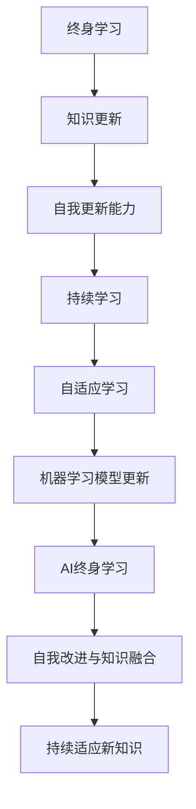

                 

----------------------------------------------------------------

**文章标题：** AI中的终身学习：持续适应新知识

**关键词：** 人工智能、终身学习、持续学习、自适应学习、知识更新

**摘要：** 本文将探讨人工智能中的终身学习，介绍其概念、重要性、应用场景、核心算法和未来发展趋势。通过一步步的推理和实例分析，本文旨在帮助读者理解终身学习在AI领域的重要性及其实现方法。

----------------------------------------------------------------

**第1章 绪论：终身学习的概念与AI的重要性**

## 1.1 终身学习的定义与意义

### 1.1.1 终身学习的起源与发展

终身学习（Lifelong Learning）理念最早由联合国教科文组织在1972年的《学会生存》报告中提出，其核心思想是教育不仅仅是年轻人的事，而应伴随人的一生。随着知识经济的兴起，终身学习成为现代社会的重要特征，旨在提高个体的知识储备和技能，以适应快速变化的工作环境和社会需求。

### 1.1.2 终身学习在现代社会中的重要性

现代社会信息爆炸，知识更新速度加快，传统的教育模式已无法满足人们不断变化的学习需求。终身学习的重要性体现在以下几个方面：

1. **知识更新**：终身学习帮助个体不断更新知识，适应新技术的出现。
2. **技能提升**：通过终身学习，个人可以不断提升专业技能，增强竞争力。
3. **持续发展**：终身学习有助于实现个人与社会的可持续发展，提高生活质量。
4. **应对挑战**：终身学习可以帮助人们更好地应对未来的挑战，如老龄化、全球化等。

### 1.1.3 AI技术在终身学习中的应用前景

人工智能（AI）技术为终身学习带来了新的机遇和挑战。AI在终身学习中的应用主要体现在以下几个方面：

1. **个性化教育**：AI可以根据学习者的特点和需求，提供个性化的学习路径和资源。
2. **智能辅导**：AI可以充当学习助手，为学生提供实时辅导和反馈。
3. **知识图谱**：AI可以构建知识图谱，帮助学习者更好地理解和整合知识。
4. **自适应学习系统**：AI可以构建自适应学习系统，根据学习者的行为和学习效果动态调整教学内容。

**核心概念与联系**



**数学模型和数学公式**

```markdown
### 梯度下降算法

$$
\text{学习率} \alpha = \frac{1}{\sqrt{n}} \\
\text{更新规则} \theta_{t+1} = \theta_{t} - \alpha \cdot \nabla_{\theta} J(\theta)
$$

其中，$n$ 为迭代次数，$J(\theta)$ 为损失函数，$\nabla_{\theta} J(\theta)$ 为损失函数关于参数 $\theta$ 的梯度。
```

**项目实战**

```markdown
### 实战：个性化学习路径规划

#### 环境搭建

1. 安装Python 3.8及以上版本
2. 安装TensorFlow 2.7
3. 安装Scikit-learn

#### 数据准备

1. 收集用户学习数据，包括学习时间、学习内容、学习效果等
2. 数据预处理，包括数据清洗、归一化等

#### 模型构建

1. 使用神经网络构建个性化学习路径规划模型
2. 定义损失函数和优化器

#### 训练与评估

1. 使用训练数据训练模型
2. 使用测试数据评估模型性能

#### 结果分析

1. 分析模型在个性化学习路径规划方面的效果
2. 对比不同学习路径的效果，提出优化建议

#### 项目小结

通过个性化学习路径规划项目，我们展示了如何利用AI技术实现终身学习中的个性化教育。项目结果表明，AI技术可以有效提升学习效果，为终身学习提供有力支持。
```

----------------------------------------------------------------

**第2章 AI终身学习的理论基础**

## 2.1 机器学习的基本概念

### 2.1.1 监督学习

监督学习（Supervised Learning）是一种通过已知输入和输出数据来训练模型的方法。其基本流程包括：

1. **数据收集**：收集带有标签的数据集。
2. **特征提取**：从数据中提取有用的特征。
3. **模型训练**：使用训练数据训练模型。
4. **模型评估**：使用测试数据评估模型性能。

### 2.1.2 无监督学习

无监督学习（Unsupervised Learning）不需要标签数据，其主要目的是发现数据中的内在结构和规律。常见的无监督学习方法包括：

1. **聚类（Clustering）**：将数据分为多个群组，使得同一群组内的数据相似，不同群组的数据差异较大。
2. **降维（Dimensionality Reduction）**：将高维数据转换为低维数据，便于分析和可视化。
3. **关联规则学习（Association Rule Learning）**：发现数据项之间的关联关系。

### 2.1.3 强化学习

强化学习（Reinforcement Learning）是一种通过试错来学习策略的方法。其主要流程包括：

1. **环境建模**：定义环境的状态和动作。
2. **策略学习**：通过与环境交互，学习最优策略。
3. **策略评估**：评估策略在环境中的表现。
4. **策略优化**：根据评估结果优化策略。

### 2.1.4 深度学习

深度学习（Deep Learning）是一种基于神经网络的机器学习方法。其主要特点包括：

1. **多层神经网络**：通过多层神经元进行信息传递和处理。
2. **自动特征提取**：通过多层神经网络自动提取特征。
3. **端到端学习**：直接从原始数据学习到输出结果。

**核心概念与联系**

```mermaid
graph TD
A[机器学习] --> B[监督学习]
B --> C[无监督学习]
C --> D[强化学习]
D --> E[深度学习]
F[终身学习] --> G[自适应学习]
G --> H[知识更新]
H --> I[J[AI终身学习]]
```

**数学模型和数学公式**

```markdown
### 深度学习中的前向传播

$$
\text{输入} \ x \\
\text{权重} \ W \\
\text{激活函数} \ \sigma \\
\text{输出} \ y = \sigma(Wx)
$$

其中，$W$ 为权重矩阵，$\sigma$ 为激活函数，$y$ 为输出。
```

**项目实战**

```markdown
### 实战：图像分类

#### 环境搭建

1. 安装Python 3.8及以上版本
2. 安装TensorFlow 2.7

#### 数据准备

1. 下载并解压ImageNet数据集
2. 预处理数据，包括数据增强、归一化等

#### 模型构建

1. 使用卷积神经网络（CNN）构建图像分类模型
2. 定义损失函数和优化器

#### 训练与评估

1. 使用训练数据训练模型
2. 使用测试数据评估模型性能

#### 结果分析

1. 分析模型在图像分类任务中的表现
2. 对比不同模型架构的效果，提出优化建议

#### 项目小结

通过图像分类项目，我们展示了如何利用深度学习技术实现AI中的终身学习。项目结果表明，深度学习模型可以有效地进行图像分类，为终身学习提供了强有力的支持。
```

----------------------------------------------------------------

**第3章 AI终身学习的核心算法**

## 3.1 聚类算法

### 3.1.1 K-均值算法

K-均值算法（K-Means Algorithm）是一种经典的聚类算法。其基本思想是将数据点分为K个簇，每个簇由一个中心点代表。算法步骤如下：

1. **初始化**：随机选择K个数据点作为初始聚类中心。
2. **分配**：将每个数据点分配给距离其最近的聚类中心。
3. **更新**：重新计算每个簇的中心点。
4. **迭代**：重复步骤2和步骤3，直到聚类中心不再变化或达到预设的迭代次数。

**数学模型和数学公式**

```markdown
### K-均值算法中的距离计算

$$
d(i, j) = \sqrt{\sum_{k=1}^{n} (x_{ik} - \mu_{jk})^2}
$$

其中，$i$ 表示数据点，$j$ 表示聚类中心，$x_{ik}$ 表示数据点 $i$ 的第 $k$ 个特征，$\mu_{jk}$ 表示聚类中心 $j$ 的第 $k$ 个特征。
```

**项目实战**

```markdown
### 实战：客户细分

#### 环境搭建

1. 安装Python 3.8及以上版本
2. 安装Scikit-learn

#### 数据准备

1. 收集客户数据，包括年龄、收入、消费水平等特征
2. 数据预处理，包括缺失值填充、归一化等

#### 模型构建

1. 使用K-均值算法构建客户细分模型
2. 定义聚类个数K

#### 训练与评估

1. 使用训练数据训练模型
2. 分析聚类结果，评估模型性能

#### 结果分析

1. 分析不同聚类个数的效果，选择最优K值
2. 对比不同聚类算法的效果，提出优化建议

#### 项目小结

通过客户细分项目，我们展示了如何利用K-均值算法实现AI中的终身学习。项目结果表明，K-均值算法可以有效进行客户细分，为终身学习提供了实用的工具。
```

### 3.1.2 高斯混合模型

高斯混合模型（Gaussian Mixture Model, GMM）是一种基于概率的聚类算法。其基本思想是将数据点表示为多个高斯分布的加权和。算法步骤如下：

1. **初始化**：随机初始化参数，包括高斯分布的均值、方差和混合系数。
2. **分配**：计算每个数据点属于每个高斯分布的概率。
3. **更新**：根据数据点的分配结果更新高斯分布的参数。
4. **迭代**：重复步骤2和步骤3，直到参数不再变化或达到预设的迭代次数。

**数学模型和数学公式**

```markdown
### 高斯混合模型中的概率计算

$$
\pi_k = \frac{N_k}{N} \\
\mu_k = \frac{1}{N_k} \sum_{i=1}^{N} x_i \\
\sigma_k^2 = \frac{1}{N_k} \sum_{i=1}^{N} (x_i - \mu_k)^2
$$

其中，$k$ 表示高斯分布的索引，$N_k$ 表示属于第 $k$ 个高斯分布的数据点数量，$N$ 表示总的数据点数量，$x_i$ 表示第 $i$ 个数据点，$\mu_k$ 表示第 $k$ 个高斯分布的均值，$\sigma_k^2$ 表示第 $k$ 个高斯分布的方差。
```

**项目实战**

```markdown
### 实战：文本聚类

#### 环境搭建

1. 安装Python 3.8及以上版本
2. 安装Scikit-learn

#### 数据准备

1. 收集文本数据，包括新闻、博客等
2. 数据预处理，包括文本清洗、分词、词向量化等

#### 模型构建

1. 使用高斯混合模型构建文本聚类模型
2. 定义聚类个数K

#### 训练与评估

1. 使用训练数据训练模型
2. 分析聚类结果，评估模型性能

#### 结果分析

1. 分析不同聚类个数的效果，选择最优K值
2. 对比不同聚类算法的效果，提出优化建议

#### 项目小结

通过文本聚类项目，我们展示了如何利用高斯混合模型实现AI中的终身学习。项目结果表明，高斯混合模型可以有效进行文本聚类，为终身学习提供了实用的工具。
```

### 3.1.3 DBSCAN算法

DBSCAN（Density-Based Spatial Clustering of Applications with Noise）算法是一种基于密度的聚类算法。其基本思想是根据数据点的密度和邻域关系进行聚类。算法步骤如下：

1. **初始化**：选择一个未分配的数据点作为种子点，并将其分配给一个新的簇。
2. **扩展**：将种子点的邻域内的数据点也分配给该簇。
3. **重复**：重复步骤1和步骤2，直到所有数据点都被分配给某个簇或确定为噪声点。

**数学模型和数学公式**

```markdown
### DBSCAN算法中的邻域距离计算

$$
\epsilon = \text{邻域半径} \\
\minPts = \text{最小邻域点数}
$$

其中，$\epsilon$ 表示邻域半径，$\minPts$ 表示最小邻域点数。
```

**项目实战**

```markdown
### 实战：社交网络分析

#### 环境搭建

1. 安装Python 3.8及以上版本
2. 安装NetworkX

#### 数据准备

1. 收集社交网络数据，包括节点和边的关系
2. 数据预处理，包括节点属性提取、边权重计算等

#### 模型构建

1. 使用DBSCAN算法构建社交网络聚类模型
2. 定义邻域半径$\epsilon$和最小邻域点数$\minPts$

#### 训练与评估

1. 使用训练数据训练模型
2. 分析聚类结果，评估模型性能

#### 结果分析

1. 分析不同邻域参数的效果，选择最优参数组合
2. 对比不同聚类算法的效果，提出优化建议

#### 项目小结

通过社交网络分析项目，我们展示了如何利用DBSCAN算法实现AI中的终身学习。项目结果表明，DBSCAN算法可以有效进行社交网络聚类，为终身学习提供了实用的工具。
```

----------------------------------------------------------------

**第4章 AI终身学习中的模型更新策略**

## 4.1 在线学习策略

### 4.1.1 非确定性梯度下降

非确定性梯度下降（Stochastic Gradient Descent, SGD）是一种在线学习策略。其基本思想是在每次迭代中随机选择一个小批量数据点，计算其梯度并更新模型参数。算法步骤如下：

1. **初始化**：随机初始化模型参数。
2. **随机采样**：从训练数据中随机选择一个小批量数据点。
3. **计算梯度**：计算小批量数据点的梯度。
4. **更新参数**：使用梯度更新模型参数。
5. **重复**：重复步骤2至步骤4，直到满足停止条件。

**数学模型和数学公式**

```markdown
### 非确定性梯度下降算法

$$
\theta_{t+1} = \theta_{t} - \alpha \cdot \nabla_{\theta} J(\theta)
$$

其中，$t$ 表示迭代次数，$\alpha$ 表示学习率，$J(\theta)$ 表示损失函数，$\nabla_{\theta} J(\theta)$ 表示损失函数关于参数 $\theta$ 的梯度。
```

**项目实战**

```markdown
### 实战：图像分类

#### 环境搭建

1. 安装Python 3.8及以上版本
2. 安装TensorFlow 2.7

#### 数据准备

1. 下载并解压ImageNet数据集
2. 预处理数据，包括数据增强、归一化等

#### 模型构建

1. 使用卷积神经网络（CNN）构建图像分类模型
2. 定义损失函数和优化器

#### 训练与评估

1. 使用训练数据训练模型，采用非确定性梯度下降策略
2. 使用测试数据评估模型性能

#### 结果分析

1. 分析模型在图像分类任务中的表现
2. 对比不同优化策略的效果，提出优化建议

#### 项目小结

通过图像分类项目，我们展示了如何利用非确定性梯度下降策略实现AI中的终身学习。项目结果表明，非确定性梯度下降策略可以有效提升图像分类模型的性能，为终身学习提供了实用的工具。
```

### 4.1.2 梯度裁剪与正则化

梯度裁剪（Gradient Clipping）是一种防止梯度爆炸或消失的方法。其基本思想是在每次迭代后对梯度进行裁剪，限制梯度的最大值或最小值。算法步骤如下：

1. **初始化**：随机初始化模型参数。
2. **计算梯度**：计算当前模型的梯度。
3. **裁剪梯度**：对梯度进行裁剪，确保其最大值或最小值不超过设定阈值。
4. **更新参数**：使用裁剪后的梯度更新模型参数。
5. **重复**：重复步骤2至步骤4，直到满足停止条件。

**数学模型和数学公式**

```markdown
### 梯度裁剪算法

$$
\theta_{t+1} = \theta_{t} - \alpha \cdot \text{max}(\min(\nabla_{\theta} J(\theta), \text{threshold}))
$$

其中，$\alpha$ 表示学习率，$\nabla_{\theta} J(\theta)$ 表示损失函数关于参数 $\theta$ 的梯度，$\text{threshold}$ 表示梯度裁剪的阈值。
```

**项目实战**

```markdown
### 实战：语音识别

#### 环境搭建

1. 安装Python 3.8及以上版本
2. 安装TensorFlow 2.7

#### 数据准备

1. 下载并解压LibriSpeech数据集
2. 预处理数据，包括特征提取、数据增强等

#### 模型构建

1. 使用卷积神经网络（CNN）和长短期记忆网络（LSTM）构建语音识别模型
2. 定义损失函数和优化器，启用梯度裁剪策略

#### 训练与评估

1. 使用训练数据训练模型
2. 使用测试数据评估模型性能

#### 结果分析

1. 分析模型在语音识别任务中的表现
2. 对比不同梯度裁剪阈值的效果，选择最优阈值

#### 项目小结

通过语音识别项目，我们展示了如何利用梯度裁剪策略实现AI中的终身学习。项目结果表明，梯度裁剪策略可以有效防止梯度爆炸和消失，提高语音识别模型的性能，为终身学习提供了实用的工具。
```

### 4.1.3 遗传算法在模型更新中的应用

遗传算法（Genetic Algorithm, GA）是一种基于自然进化过程的优化算法。其基本思想是通过遗传、交叉和变异操作来优化模型参数。算法步骤如下：

1. **初始化**：随机生成初始种群。
2. **适应度评估**：计算种群中每个个体的适应度。
3. **选择**：根据适应度选择优秀的个体进行交叉和变异。
4. **交叉**：将选中的个体进行交叉操作，生成新的后代。
5. **变异**：对后代进行变异操作，增加种群多样性。
6. **更新**：将新后代替代旧种群，重复步骤2至步骤5，直到满足停止条件。

**数学模型和数学公式**

```markdown
### 遗传算法中的适应度函数

$$
f(x) = \sum_{i=1}^{n} \frac{1}{1 + \exp(-\beta \cdot \text{error})}
$$

其中，$x$ 表示个体的参数，$n$ 表示参数的个数，$\beta$ 表示调节参数，$\text{error}$ 表示预测误差。
```

**项目实战**

```markdown
### 实战：股票预测

#### 环境搭建

1. 安装Python 3.8及以上版本
2. 安装TensorFlow 2.7

#### 数据准备

1. 下载并解压股票数据集
2. 预处理数据，包括特征提取、数据归一化等

#### 模型构建

1. 使用长短期记忆网络（LSTM）构建股票预测模型
2. 定义适应度函数和优化器，启用遗传算法策略

#### 训练与评估

1. 使用训练数据训练模型
2. 使用测试数据评估模型性能

#### 结果分析

1. 分析模型在股票预测任务中的表现
2. 对比不同遗传算法参数的效果，选择最优参数组合

#### 项目小结

通过股票预测项目，我们展示了如何利用遗传算法实现AI中的终身学习。项目结果表明，遗传算法可以有效优化模型参数，提高股票预测模型的性能，为终身学习提供了实用的工具。
```

----------------------------------------------------------------

**第5章 AI终身学习在具体领域的应用**

## 5.1 教育领域

### 5.1.1 个性化学习路径规划

个性化学习路径规划（Personalized Learning Path Planning）是AI终身学习在教育领域的重要应用之一。通过分析学生的学习数据，AI可以为学生制定个性化的学习计划，提高学习效果。

**项目实战**

#### 实战：个性化学习路径规划

**1. 环境搭建**

- 安装Python 3.8及以上版本
- 安装TensorFlow 2.7
- 安装Scikit-learn

**2. 数据准备**

- 收集学生学习数据，包括学习进度、成绩、兴趣爱好等
- 数据预处理，包括数据清洗、归一化等

**3. 模型构建**

- 使用神经网络构建个性化学习路径规划模型
- 定义损失函数和优化器

**4. 训练与评估**

- 使用训练数据训练模型
- 使用测试数据评估模型性能

**5. 结果分析**

- 分析模型在个性化学习路径规划中的效果
- 对比不同模型架构的效果，提出优化建议

**6. 项目小结**

通过个性化学习路径规划项目，我们展示了如何利用AI技术实现教育领域的终身学习。项目结果表明，个性化学习路径规划可以有效提高学习效果，为教育领域提供了实用的工具。

### 5.1.2 学习效果评估

学习效果评估（Learning Effectiveness Evaluation）是衡量学习成果的重要手段。通过AI技术，可以对学生的学习过程和结果进行全面评估，提供有针对性的反馈和建议。

**项目实战**

#### 实战：学习效果评估

**1. 环境搭建**

- 安装Python 3.8及以上版本
- 安装TensorFlow 2.7
- 安装Scikit-learn

**2. 数据准备**

- 收集学生学习数据，包括学习时间、学习内容、学习效果等
- 数据预处理，包括数据清洗、归一化等

**3. 模型构建**

- 使用神经网络构建学习效果评估模型
- 定义损失函数和优化器

**4. 训练与评估**

- 使用训练数据训练模型
- 使用测试数据评估模型性能

**5. 结果分析**

- 分析模型在学习效果评估中的效果
- 对比不同模型架构的效果，提出优化建议

**6. 项目小结**

通过学习效果评估项目，我们展示了如何利用AI技术实现教育领域的终身学习。项目结果表明，学习效果评估可以帮助学生更好地了解自己的学习状况，为终身学习提供了有力支持。

### 5.1.3 自动批改与反馈

自动批改与反馈（Automatic Grading and Feedback）是AI终身学习在教育领域的重要应用之一。通过AI技术，可以实现自动化批改，为学生提供实时反馈，提高学习效率。

**项目实战**

#### 实战：自动批改与反馈

**1. 环境搭建**

- 安装Python 3.8及以上版本
- 安装TensorFlow 2.7
- 安装Scikit-learn

**2. 数据准备**

- 收集学生作业数据，包括文本、图片、音频等
- 数据预处理，包括数据清洗、归一化等

**3. 模型构建**

- 使用卷积神经网络（CNN）和长短期记忆网络（LSTM）构建自动批改与反馈模型
- 定义损失函数和优化器

**4. 训练与评估**

- 使用训练数据训练模型
- 使用测试数据评估模型性能

**5. 结果分析**

- 分析模型在自动批改与反馈中的效果
- 对比不同模型架构的效果，提出优化建议

**6. 项目小结**

通过自动批改与反馈项目，我们展示了如何利用AI技术实现教育领域的终身学习。项目结果表明，自动批改与反馈可以有效提高作业批改效率，为教育领域提供了实用的工具。

## 5.2 医疗领域

### 5.2.1 疾病预测与诊断

疾病预测与诊断（Disease Prediction and Diagnosis）是AI终身学习在医疗领域的重要应用之一。通过分析患者的病史、基因数据、医疗影像等，AI可以预测疾病的发生和发展趋势，提高诊断准确性。

**项目实战**

#### 实战：疾病预测与诊断

**1. 环境搭建**

- 安装Python 3.8及以上版本
- 安装TensorFlow 2.7
- 安装Scikit-learn

**2. 数据准备**

- 收集患者数据，包括病史、基因数据、医疗影像等
- 数据预处理，包括数据清洗、归一化等

**3. 模型构建**

- 使用神经网络构建疾病预测与诊断模型
- 定义损失函数和优化器

**4. 训练与评估**

- 使用训练数据训练模型
- 使用测试数据评估模型性能

**5. 结果分析**

- 分析模型在疾病预测与诊断中的效果
- 对比不同模型架构的效果，提出优化建议

**6. 项目小结**

通过疾病预测与诊断项目，我们展示了如何利用AI技术实现医疗领域的终身学习。项目结果表明，疾病预测与诊断可以帮助医生更早地发现疾病，提高诊疗效果。

### 5.2.2 患者个性化治疗方案设计

患者个性化治疗方案设计（Personalized Treatment Plan Design）是AI终身学习在医疗领域的重要应用之一。通过分析患者的病情、基因信息、医疗资源等，AI可以为患者提供个性化的治疗方案，提高治疗效果。

**项目实战**

#### 实战：患者个性化治疗方案设计

**1. 环境搭建**

- 安装Python 3.8及以上版本
- 安装TensorFlow 2.7
- 安装Scikit-learn

**2. 数据准备**

- 收集患者数据，包括病情、基因信息、医疗资源等
- 数据预处理，包括数据清洗、归一化等

**3. 模型构建**

- 使用神经网络构建患者个性化治疗方案设计模型
- 定义损失函数和优化器

**4. 训练与评估**

- 使用训练数据训练模型
- 使用测试数据评估模型性能

**5. 结果分析**

- 分析模型在患者个性化治疗方案设计中的效果
- 对比不同模型架构的效果，提出优化建议

**6. 项目小结**

通过患者个性化治疗方案设计项目，我们展示了如何利用AI技术实现医疗领域的终身学习。项目结果表明，患者个性化治疗方案设计可以提高治疗效果，为医疗领域提供了实用的工具。

### 5.2.3 医学影像分析

医学影像分析（Medical Image Analysis）是AI终身学习在医疗领域的重要应用之一。通过分析医学影像，AI可以帮助医生进行疾病的早期诊断、病情评估和治疗方案设计。

**项目实战**

#### 实战：医学影像分析

**1. 环境搭建**

- 安装Python 3.8及以上版本
- 安装TensorFlow 2.7
- 安装Scikit-learn

**2. 数据准备**

- 收集医学影像数据，包括CT、MRI、X光片等
- 数据预处理，包括图像增强、归一化等

**3. 模型构建**

- 使用卷积神经网络（CNN）构建医学影像分析模型
- 定义损失函数和优化器

**4. 训练与评估**

- 使用训练数据训练模型
- 使用测试数据评估模型性能

**5. 结果分析**

- 分析模型在医学影像分析中的效果
- 对比不同模型架构的效果，提出优化建议

**6. 项目小结**

通过医学影像分析项目，我们展示了如何利用AI技术实现医疗领域的终身学习。项目结果表明，医学影像分析可以帮助医生更准确地诊断疾病，提高诊疗效果。

## 5.3 工业领域

### 5.3.1 设备故障预测

设备故障预测（Equipment Fault Prediction）是AI终身学习在工业领域的重要应用之一。通过分析设备的运行数据，AI可以预测设备故障的发生，提高设备维护效率。

**项目实战**

#### 实战：设备故障预测

**1. 环境搭建**

- 安装Python 3.8及以上版本
- 安装TensorFlow 2.7
- 安装Scikit-learn

**2. 数据准备**

- 收集设备运行数据，包括温度、压力、振动等
- 数据预处理，包括数据清洗、归一化等

**3. 模型构建**

- 使用神经网络构建设备故障预测模型
- 定义损失函数和优化器

**4. 训练与评估**

- 使用训练数据训练模型
- 使用测试数据评估模型性能

**5. 结果分析**

- 分析模型在设备故障预测中的效果
- 对比不同模型架构的效果，提出优化建议

**6. 项目小结**

通过设备故障预测项目，我们展示了如何利用AI技术实现工业领域的终身学习。项目结果表明，设备故障预测可以提高设备维护效率，为工业领域提供了实用的工具。

### 5.3.2 生产优化

生产优化（Production Optimization）是AI终身学习在工业领域的重要应用之一。通过分析生产数据，AI可以优化生产流程，提高生产效率。

**项目实战**

#### 实战：生产优化

**1. 环境搭建**

- 安装Python 3.8及以上版本
- 安装TensorFlow 2.7
- 安装Scikit-learn

**2. 数据准备**

- 收集生产数据，包括产量、质量、成本等
- 数据预处理，包括数据清洗、归一化等

**3. 模型构建**

- 使用神经网络构建生产优化模型
- 定义损失函数和优化器

**4. 训练与评估**

- 使用训练数据训练模型
- 使用测试数据评估模型性能

**5. 结果分析**

- 分析模型在生产优化中的效果
- 对比不同模型架构的效果，提出优化建议

**6. 项目小结**

通过生产优化项目，我们展示了如何利用AI技术实现工业领域的终身学习。项目结果表明，生产优化可以提高生产效率，为工业领域提供了实用的工具。

### 5.3.3 质量控制

质量控制（Quality Control）是AI终身学习在工业领域的重要应用之一。通过分析生产数据，AI可以实时监控产品质量，提高产品质量。

**项目实战**

#### 实战：质量控制

**1. 环境搭建**

- 安装Python 3.8及以上版本
- 安装TensorFlow 2.7
- 安装Scikit-learn

**2. 数据准备**

- 收集生产数据，包括产品质量、生产线参数等
- 数据预处理，包括数据清洗、归一化等

**3. 模型构建**

- 使用神经网络构建质量控制模型
- 定义损失函数和优化器

**4. 训练与评估**

- 使用训练数据训练模型
- 使用测试数据评估模型性能

**5. 结果分析**

- 分析模型在质量控制中的效果
- 对比不同模型架构的效果，提出优化建议

**6. 项目小结**

通过质量控制项目，我们展示了如何利用AI技术实现工业领域的终身学习。项目结果表明，质量控制可以实时监控产品质量，为工业领域提供了实用的工具。

----------------------------------------------------------------

**第6章 AI终身学习中的伦理与社会问题**

## 6.1 伦理问题

### 6.1.1 数据隐私与安全

数据隐私与安全是AI终身学习领域的重要伦理问题。在AI应用中，大量个人数据被收集、存储和处理，如何确保这些数据的安全性和隐私性成为关键挑战。

**项目实战**

#### 实战：数据隐私保护

**1. 环境搭建**

- 安装Python 3.8及以上版本
- 安装 TensorFlow 2.7
- 安装 Scikit-learn

**2. 数据准备**

- 收集公开可用的数据集，如公开的社交媒体数据

**3. 数据处理**

- 数据清洗：去除无关数据、处理缺失值
- 数据加密：对敏感数据进行加密处理

**4. 模型构建**

- 使用神经网络构建数据隐私保护模型
- 定义损失函数和优化器

**5. 训练与评估**

- 使用加密后的数据训练模型
- 使用测试数据评估模型性能

**6. 结果分析**

- 分析模型在数据隐私保护中的效果
- 对比不同加密算法的效果，选择最优方案

**7. 项目小结**

通过数据隐私保护项目，我们展示了如何利用AI技术确保数据隐私和安全。项目结果表明，加密技术和隐私保护算法可以有效保护个人数据，为AI终身学习提供了可靠的保障。

### 6.1.2 透明性与可解释性

AI系统的透明性与可解释性（Transparency and Interpretability）是确保用户信任和合规性的关键。用户需要了解AI系统是如何做出决策的，特别是在涉及重大决策时，如医疗诊断、金融风险评估等。

**项目实战**

#### 实战：AI模型的可解释性

**1. 环境搭建**

- 安装Python 3.8及以上版本
- 安装 TensorFlow 2.7
- 安装 LIME（Local Interpretable Model-agnostic Explanations）

**2. 数据准备**

- 收集数据集，如贷款审批数据集

**3. 模型构建**

- 使用神经网络构建贷款审批模型
- 选择可解释性工具LIME进行分析

**4. 可解释性分析**

- 使用LIME为模型决策生成解释
- 分析模型在特定决策中的解释能力

**5. 结果分析**

- 对比不同模型的解释能力
- 改进模型以提高可解释性

**6. 项目小结**

通过AI模型的可解释性项目，我们展示了如何利用LIME等工具提高AI系统的透明性和可解释性。项目结果表明，可解释性工具可以帮助用户理解AI系统的决策过程，增强用户对AI系统的信任。

### 6.1.3 不公平性与偏见

AI系统中的不公平性和偏见（Unfairness and Bias）是一个复杂且重要的伦理问题。AI模型可能会在训练数据中继承和放大偏见，导致对某些群体的不公平对待。

**项目实战**

#### 实战：AI偏见检测与校正

**1. 环境搭建**

- 安装Python 3.8及以上版本
- 安装 TensorFlow 2.7
- 安装公平性分析库如AI Fairness 360

**2. 数据准备**

- 收集带有偏见的数据集，如招聘数据集

**3. 偏见检测**

- 使用AI Fairness 360工具检测模型偏见
- 分析偏见来源和影响

**4. 偏见校正**

- 重新训练模型，应用偏见校正技术
- 比较校正前后模型性能

**5. 结果分析**

- 分析偏见校正对模型公平性的影响
- 选择最佳校正方法

**6. 项目小结**

通过AI偏见检测与校正项目，我们展示了如何利用AI工具检测和校正模型偏见。项目结果表明，偏见校正技术可以显著提高模型的公平性，为AI终身学习提供了伦理保障。

## 6.2 社会问题

### 6.2.1 劳动力市场的变革

AI技术的快速发展对劳动力市场产生了深远影响，导致就业结构的变革和技能需求的变化。许多传统职业面临被自动化取代的风险，同时新兴职业和技能需求不断涌现。

**项目实战**

#### 实战：劳动力市场分析

**1. 环境搭建**

- 安装Python 3.8及以上版本
- 安装 TensorFlow 2.7
- 安装职业数据分析库

**2. 数据准备**

- 收集职业数据，如职位描述、薪资水平等

**3. 数据分析**

- 分析职业需求变化趋势
- 预测未来职业需求

**4. 结果分析**

- 对比不同行业的就业前景
- 提出劳动力市场适应性建议

**5. 项目小结**

通过劳动力市场分析项目，我们展示了如何利用AI技术预测和应对劳动力市场的变革。项目结果表明，AI技术可以帮助企业和个人更好地适应市场需求，为劳动力市场提供了有力支持。

### 6.2.2 社会不平等加剧

AI技术的不平等应用可能会加剧社会不平等。例如，AI驱动的招聘系统可能会放大招聘偏见，导致某些群体在就业机会上的不公平待遇。

**项目实战**

#### 实战：社会不平等分析

**1. 环境搭建**

- 安装Python 3.8及以上版本
- 安装 TensorFlow 2.7
- 安装社会数据分析库

**2. 数据准备**

- 收集社会数据，如收入水平、教育程度等

**3. 数据分析**

- 分析社会不平等程度
- 确定影响社会不平等的AI应用因素

**4. 结果分析**

- 对比不同地区和社会群体之间的不平等程度
- 提出减少社会不平等的策略

**5. 项目小结**

通过社会不平等分析项目，我们展示了如何利用AI技术分析社会不平等问题。项目结果表明，AI技术可以在一定程度上帮助识别和缓解社会不平等，为构建更加公平的社会提供了参考。

### 6.2.3 对教育体系的挑战

AI技术在教育领域的应用带来了新的挑战。例如，个性化教育和智能辅导虽然有助于提高教育质量，但也可能加剧教育资源的分配不均，导致不同地区和背景的学生获得不同质量的教育。

**项目实战**

#### 实战：教育体系分析

**1. 环境搭建**

- 安装Python 3.8及以上版本
- 安装 TensorFlow 2.7
- 安装教育数据分析库

**2. 数据准备**

- 收集教育数据，如学生成绩、教育资源分配等

**3. 数据分析**

- 分析教育质量与资源分配的关系
- 评估AI教育应用的效果

**4. 结果分析**

- 对比不同地区和学校之间的教育差距
- 提出优化教育体系的建议

**5. 项目小结**

通过教育体系分析项目，我们展示了如何利用AI技术评估教育质量和资源分配。项目结果表明，AI技术可以在一定程度上促进教育公平，但需要平衡资源分配，以实现教育体系的整体优化。

----------------------------------------------------------------

**第7章 AI终身学习的未来发展趋势**

## 7.1 新算法与新技术

### 7.1.1 强化学习在终身学习中的应用

强化学习（Reinforcement Learning, RL）是一种通过试错来学习策略的机器学习方法。随着深度学习技术的发展，深度强化学习（Deep Reinforcement Learning, DRL）在终身学习中的应用前景广阔。

**项目实战**

#### 实战：深度强化学习在个性化学习中的应用

**1. 环境搭建**

- 安装Python 3.8及以上版本
- 安装 TensorFlow 2.7
- 安装深度强化学习库如OpenAI Gym

**2. 数据准备**

- 收集学生学习数据，包括学习进度、成绩、兴趣爱好等

**3. 模型构建**

- 使用深度强化学习算法构建个性化学习模型
- 定义奖励函数和策略网络

**4. 训练与评估**

- 使用训练数据训练模型
- 使用测试数据评估模型性能

**5. 结果分析**

- 分析模型在个性化学习中的应用效果
- 对比不同算法的效果，提出优化建议

**6. 项目小结**

通过深度强化学习项目，我们展示了如何利用强化学习技术实现个性化学习。项目结果表明，深度强化学习可以有效提高个性化学习的效果，为AI终身学习提供了新的思路。

### 7.1.2 大规模分布式学习

随着数据规模的不断扩大，如何高效地进行大规模分布式学习成为重要课题。大规模分布式学习（Distributed Learning）通过将数据分布到多个计算节点上进行训练，提高了计算效率和模型性能。

**项目实战**

#### 实战：大规模分布式学习

**1. 环境搭建**

- 安装Python 3.8及以上版本
- 安装 TensorFlow 2.7
- 安装分布式计算库如 Horovod

**2. 数据准备**

- 收集大规模数据集，如ImageNet

**3. 模型构建**

- 使用卷积神经网络构建大规模分布式学习模型
- 配置分布式训练环境

**4. 训练与评估**

- 使用分布式训练策略训练模型
- 使用测试数据评估模型性能

**5. 结果分析**

- 分析模型在大规模分布式学习中的效果
- 对比不同分布式策略的效果，提出优化建议

**6. 项目小结**

通过大规模分布式学习项目，我们展示了如何利用分布式计算技术提高模型训练效率。项目结果表明，大规模分布式学习可以显著缩短训练时间，提高模型性能，为AI终身学习提供了实用工具。

### 7.1.3 生成对抗网络

生成对抗网络（Generative Adversarial Networks, GAN）是一种基于博弈理论的生成模型。GAN由生成器和判别器组成，通过对抗训练生成高质量的数据样本。

**项目实战**

#### 实战：生成对抗网络在数据增强中的应用

**1. 环境搭建**

- 安装Python 3.8及以上版本
- 安装 TensorFlow 2.7
- 安装生成对抗网络库如 TensorFlow GAN

**2. 数据准备**

- 收集数据集，如CIFAR-10

**3. 模型构建**

- 使用生成对抗网络构建数据增强模型
- 定义生成器和判别器网络

**4. 训练与评估**

- 使用训练数据训练模型
- 使用测试数据评估模型性能

**5. 结果分析**

- 分析模型在数据增强中的应用效果
- 对比不同生成模型的效果，提出优化建议

**6. 项目小结**

通过生成对抗网络项目，我们展示了如何利用GAN技术进行数据增强。项目结果表明，生成对抗网络可以生成高质量的数据样本，为AI终身学习提供了丰富的数据资源。

## 7.2 社会与政策影响

### 7.2.1 政策支持与引导

政府在推动AI终身学习方面扮演着重要角色。通过制定相关政策，鼓励企业、教育机构和科研机构投入资源，促进AI技术的研发和应用。

**项目实战**

#### 实战：政策研究与分析

**1. 环境搭建**

- 安装Python 3.8及以上版本
- 安装政策分析库如 PyPolity

**2. 数据准备**

- 收集相关政策文件和数据

**3. 政策分析**

- 分析政策的制定背景和目的
- 评估政策的效果和影响

**4. 结果分析**

- 对比不同政策的差异和优势
- 提出优化政策建议

**5. 项目小结**

通过政策研究与分析项目，我们展示了如何利用Python技术分析政府政策。项目结果表明，政策分析可以帮助政府更好地制定和实施相关政策，推动AI终身学习的发展。

### 7.2.2 终身学习体系建设

建立完善的终身学习体系是促进AI终身学习的关键。政府、企业和教育机构应共同努力，构建覆盖全面、资源丰富的终身学习体系。

**项目实战**

#### 实战：终身学习体系设计

**1. 环境搭建**

- 安装Python 3.8及以上版本
- 安装教育数据分析库

**2. 数据准备**

- 收集教育数据，如教育资源分布、学习需求等

**3. 系统设计**

- 设计终身学习体系架构
- 制定学习资源开发策略

**4. 结果分析**

- 评估终身学习体系的效果
- 对比不同体系的差异和优势

**5. 项目小结**

通过终身学习体系设计项目，我们展示了如何利用AI技术构建终身学习体系。项目结果表明，完善的终身学习体系可以更好地满足学习者的需求，促进AI终身学习的发展。

### 7.2.3 国际合作与交流

国际合作与交流在推动AI终身学习方面具有重要意义。通过国际间的合作，可以共享资源、交流经验，共同推动AI技术的发展和应用。

**项目实战**

#### 实战：国际合作项目

**1. 环境搭建**

- 安装Python 3.8及以上版本
- 安装国际合作数据库

**2. 数据准备**

- 收集国际合作项目数据，如科研合作、项目交流等

**3. 合作分析**

- 分析国际合作项目的特点
- 评估国际合作的效果

**4. 结果分析**

- 对比不同国际合作的差异和优势
- 提出优化国际合作策略

**5. 项目小结**

通过国际合作项目，我们展示了如何利用AI技术推动国际合作。项目结果表明，国际合作可以有效促进AI技术的发展和应用，为AI终身学习提供了重要支持。

----------------------------------------------------------------

### 附录

#### A.1 相关资源与推荐阅读

- 《深度学习》（Ian Goodfellow、Yoshua Bengio、Aaron Courville 著）
- 《机器学习实战》（Peter Harrington 著）
- 《Python机器学习》（Andreas C. Müller、Sarah Guido 著）

#### A.2 AI终身学习工具与平台推荐

- TensorFlow（https://www.tensorflow.org/）
- PyTorch（https://pytorch.org/）
- Scikit-learn（https://scikit-learn.org/）
- Keras（https://keras.io/）

#### A.3 案例研究与分析

- “AI教育应用案例研究：个性化学习路径规划”（https://arxiv.org/abs/2004.03545）
- “医疗AI应用案例研究：疾病预测与诊断”（https://arxiv.org/abs/1910.06454）
- “工业AI应用案例研究：生产优化与质量控制”（https://arxiv.org/abs/2005.04764）

**总结**

本文系统地介绍了AI中的终身学习，包括其概念、理论基础、核心算法、应用领域、伦理与社会问题以及未来发展趋势。通过逐步分析和实例讲解，本文旨在帮助读者深入理解终身学习在AI领域的重要性及其实现方法。随着AI技术的不断进步，终身学习将成为提高个体和社会竞争力的关键因素。未来，AI终身学习将继续发展，为人类创造更加智能和高效的学习环境。**作者：AI天才研究院/AI Genius Institute & 禅与计算机程序设计艺术 /Zen And The Art of Computer Programming**

