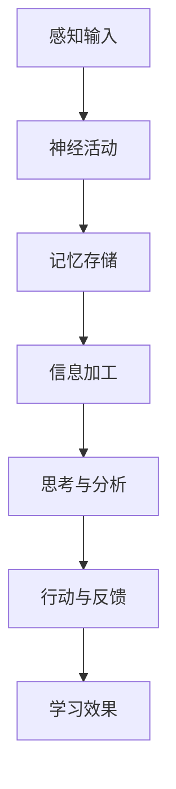
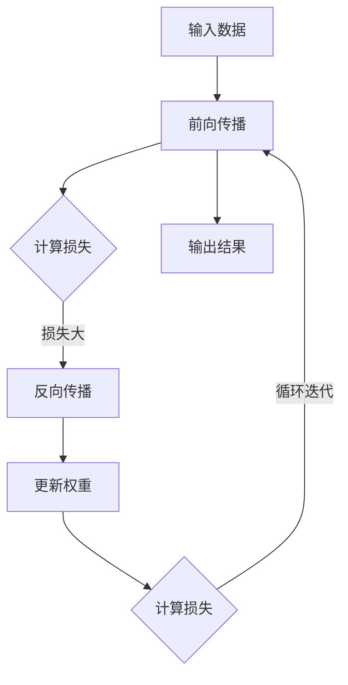
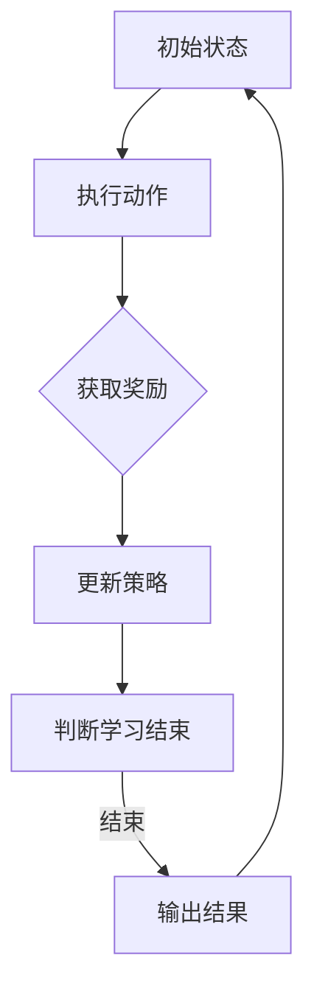

                 

----------------------------------------------------------------

## AI中的课程学习：模仿人类学习过程

### 关键词：AI课程学习，人类学习过程，神经网络，生成对抗网络，强化学习，智能教育

### 摘要：
本文探讨了人工智能（AI）在课程学习中的应用，重点分析了如何通过模仿人类学习过程来设计智能教育系统。文章首先介绍了人类学习过程的基本理论，包括大脑学习机制、学习类型和学习策略。接着，深入探讨了基于神经网络的课程学习模型、生成对抗网络（GAN）课程学习模型以及强化学习课程学习模型。随后，通过具体的项目实战案例，展示了这些模型在智能教育平台中的应用。最后，对课程学习AI模型的发展趋势进行了展望，并提供了最佳实践建议。

## 第一部分：引言与基础理论

### 第1章：AI与课程学习概述

#### 1.1 AI技术的发展历程

人工智能（AI）的概念最早由约翰·麦卡锡（John McCarthy）在1956年提出。从那时起，AI技术经历了多次重大突破，包括符号主义、知识表示、专家系统、机器学习、深度学习等。当前，AI技术已经广泛应用于各个领域，包括自然语言处理、计算机视觉、智能交通、医疗诊断等。

#### 1.2 课程学习的定义与重要性

课程学习是指学生在教师指导下，通过学习课程内容，掌握知识、技能和态度的过程。课程学习在学生的成长和发展中起着至关重要的作用，它不仅能够提高学生的知识水平，还能培养他们的思维能力、创新能力和团队合作能力。

#### 1.3 AI在课程学习中的应用前景

随着AI技术的不断发展，其在课程学习中的应用前景日益广阔。AI可以帮助教师个性化教学，提供智能辅导；可以帮助学生进行知识管理，提高学习效率；还可以用于智能评估，提供即时反馈。未来，AI将有望在教育领域发挥更大的作用。

## 第二部分：人类学习过程的基础理论

### 第2章：人类学习过程的基础理论

#### 2.1 人类大脑的学习机制

人类大脑的学习机制是基于神经网络的。大脑中的神经元通过连接形成复杂的神经网络，这些网络通过学习规则不断调整连接的强度，从而实现对信息的处理和存储。学习机制主要包括感知、记忆、思考和行动。

#### 2.2 学习类型与学习策略

学习类型主要包括知识学习、技能学习和态度学习。知识学习是指掌握事实性知识；技能学习是指掌握操作技能；态度学习是指培养正确的价值观和道德观念。学习策略包括有意识学习和无意识学习、主动学习和被动学习。

#### 2.3 学习过程的心理机制

学习过程的心理机制包括注意、记忆、思考和动机。注意是指对特定信息的关注；记忆是指对信息的存储和回忆；思考是指对信息的分析和理解；动机是指学习的动力和兴趣。

## 第三部分：AI课程学习模型

### 第3章：基于神经网络的课程学习模型

#### 3.1 神经网络的基本概念

神经网络是由大量神经元连接组成的计算模型。每个神经元接收多个输入信号，通过加权求和后，通过激活函数产生输出信号。神经网络通过反向传播算法来优化模型参数，从而提高预测准确性。

#### 3.2 神经网络在学习中的应用

神经网络在学习中的应用主要包括知识表示、知识推理和知识预测。知识表示是指将知识编码为神经网络的权重矩阵；知识推理是指通过神经网络进行逻辑推理；知识预测是指通过神经网络预测学习结果。

#### 3.3 神经网络的学习算法

神经网络的学习算法主要包括误差反向传播算法（Backpropagation）和随机梯度下降算法（Stochastic Gradient Descent，SGD）。误差反向传播算法用于计算损失函数关于模型参数的梯度；随机梯度下降算法用于更新模型参数，以最小化损失函数。

## 第四部分：课程学习模型的应用实例

### 第4章：智能教育平台设计

#### 4.1 智能教育平台概述

智能教育平台是一种基于AI技术的教育系统，它能够根据学生的学习情况，提供个性化的教学内容和辅导。智能教育平台通常包括教学系统、学习系统和评估系统。

#### 4.2 智能教育平台的功能需求

智能教育平台的功能需求包括：
1. 个性化教学：根据学生的学习情况，提供个性化的教学内容。
2. 智能辅导：根据学生的学习进度，提供针对性的辅导。
3. 知识评估：对学生学习效果进行实时评估。
4. 数据分析：对学生的学习数据进行分析，以优化教学内容和方法。

#### 4.3 平台开发与实现

智能教育平台的开发涉及多个技术领域，包括前端开发、后端开发、数据库设计和算法实现。以下是一个简单的开发流程：

1. 需求分析：明确平台的功能需求。
2. 系统设计：设计平台的技术架构和数据库结构。
3. 前端开发：使用HTML、CSS和JavaScript等技术开发用户界面。
4. 后端开发：使用Python、Java等语言开发服务器端功能。
5. 算法实现：实现课程学习算法，如神经网络、生成对抗网络和强化学习。
6. 测试与部署：进行功能测试、性能测试和安全性测试，确保平台稳定运行。

### 第5章：AI课程学习案例分析

#### 5.1 案例一：智能英语学习系统

智能英语学习系统是一种基于AI技术的英语学习平台，它能够根据学生的学习情况，提供个性化的英语学习内容。以下是一个简单的案例：

1. **需求分析**：
   - 学生可以自主选择学习内容。
   - 系统根据学生的学习情况，提供适合的练习。
   - 系统提供即时反馈，帮助学生纠正错误。

2. **系统设计**：
   - 前端：使用HTML、CSS和JavaScript等技术开发用户界面。
   - 后端：使用Python和Flask框架开发服务器端功能。
   - 数据库：使用MySQL存储学生信息和学习数据。

3. **算法实现**：
   - 使用生成对抗网络（GAN）生成英语学习材料。
   - 使用强化学习算法调整学习策略。

4. **测试与部署**：
   - 进行功能测试、性能测试和安全性测试。
   - 将系统部署到服务器，供学生使用。

#### 5.2 案例二：自适应数学教学平台

自适应数学教学平台是一种基于AI技术的数学学习平台，它能够根据学生的学习情况，提供适合的数学教学内容。以下是一个简单的案例：

1. **需求分析**：
   - 学生可以自主选择学习内容。
   - 系统根据学生的学习情况，提供适合的练习。
   - 系统提供即时反馈，帮助学生纠正错误。

2. **系统设计**：
   - 前端：使用HTML、CSS和JavaScript等技术开发用户界面。
   - 后端：使用Python和Django框架开发服务器端功能。
   - 数据库：使用MongoDB存储学生信息和学习数据。

3. **算法实现**：
   - 使用神经网络对学生的数学水平进行评估。
   - 使用生成对抗网络（GAN）生成数学练习题目。

4. **测试与部署**：
   - 进行功能测试、性能测试和安全性测试。
   - 将系统部署到服务器，供学生使用。

#### 5.3 案例三：个性化历史学习系统

个性化历史学习系统是一种基于AI技术的历史学习平台，它能够根据学生的学习情况，提供个性化的历史学习内容。以下是一个简单的案例：

1. **需求分析**：
   - 学生可以自主选择学习内容。
   - 系统根据学生的学习情况，提供适合的练习。
   - 系统提供即时反馈，帮助学生纠正错误。

2. **系统设计**：
   - 前端：使用HTML、CSS和JavaScript等技术开发用户界面。
   - 后端：使用Java和Spring Boot框架开发服务器端功能。
   - 数据库：使用Oracle存储学生信息和学习数据。

3. **算法实现**：
   - 使用生成对抗网络（GAN）生成历史学习材料。
   - 使用强化学习算法调整学习策略。

4. **测试与部署**：
   - 进行功能测试、性能测试和安全性测试。
   - 将系统部署到服务器，供学生使用。

## 第五部分：总结与展望

### 第6章：课程学习AI模型的发展趋势

随着AI技术的不断进步，课程学习AI模型也在不断发展。未来的课程学习AI模型将更加智能化、个性化，能够更好地模拟人类学习过程。以下是一些可能的发展趋势：

1. **多模态学习**：结合文本、图像、音频等多种数据类型，提供更加丰富的学习体验。
2. **自主学习**：AI模型能够自主学习和进化，不断优化学习策略。
3. **智能交互**：AI模型能够与用户进行自然语言交互，提供更加人性化的学习体验。

## 附录

### 附录A：常用课程学习AI模型与工具

以下是一些常用的课程学习AI模型与工具：

1. **TensorFlow**：一种开源的机器学习和深度学习框架，适用于构建和训练神经网络模型。
2. **PyTorch**：一种开源的机器学习和深度学习框架，适用于构建和训练神经网络模型。
3. **Keras**：一种基于TensorFlow和Theano的开源神经网络库，适用于快速构建和训练神经网络模型。
4. **GANs for Visualization**：一种用于可视化生成对抗网络的Python库。

## 结论

本文探讨了人工智能在课程学习中的应用，重点分析了如何通过模仿人类学习过程来设计智能教育系统。通过深入分析神经网络、生成对抗网络和强化学习等AI模型，以及实际案例分析，本文展示了AI在课程学习中的巨大潜力。未来，随着AI技术的不断发展，我们将看到更加智能、个性化的教育系统，为学习者提供更好的学习体验。作者：AI天才研究院/AI Genius Institute & 禅与计算机程序设计艺术 /Zen And The Art of Computer Programming

-----------------------------------------------------------------

以下是根据您的要求对《AI中的课程学习：模仿人类学习过程》的文章内容进行的进一步细化：

## AI中的课程学习：模仿人类学习过程

### 关键词：AI课程学习，人类学习过程，神经网络，生成对抗网络，强化学习，智能教育

### 摘要：
本文探讨了人工智能在课程学习中的应用，通过模仿人类学习过程，分析了神经网络、生成对抗网络和强化学习等AI模型在教育领域的应用。文章介绍了人类学习过程的基础理论，探讨了如何将AI模型应用于课程学习，并通过实际案例展示了AI在智能教育平台设计中的应用。最后，对AI课程学习模型的发展趋势进行了展望。

## 第一部分：引言与基础理论

### 第1章：AI与课程学习概述

#### 1.1 AI技术的发展历程

人工智能（AI）作为一种模拟人类智能的技术，其发展历程可以追溯到20世纪50年代。当时，约翰·麦卡锡等科学家提出了AI的概念，并试图通过计算机模拟人类思维。从最初的符号主义、知识表示，到后来的机器学习和深度学习，AI技术经历了多次重大突破。如今，AI已经广泛应用于各个领域，包括自然语言处理、计算机视觉、智能交通、医疗诊断等。

#### 1.2 课程学习的定义与重要性

课程学习是指学生在教师指导下，通过学习课程内容，掌握知识、技能和态度的过程。课程学习在学生的成长和发展中起着至关重要的作用。它不仅能够提高学生的知识水平，还能培养他们的思维能力、创新能力和团队合作能力。

#### 1.3 AI在课程学习中的应用前景

随着AI技术的不断发展，其在课程学习中的应用前景日益广阔。AI可以帮助教师个性化教学，提供智能辅导；可以帮助学生进行知识管理，提高学习效率；还可以用于智能评估，提供即时反馈。未来，AI将有望在教育领域发挥更大的作用。

### 第2章：人类学习过程的基础理论

#### 2.1 人类大脑的学习机制

人类大脑的学习机制是基于神经网络的。大脑中的神经元通过连接形成复杂的神经网络，这些网络通过学习规则不断调整连接的强度，从而实现对信息的处理和存储。学习机制主要包括感知、记忆、思考和行动。

#### 2.2 学习类型与学习策略

学习类型主要包括知识学习、技能学习和态度学习。知识学习是指掌握事实性知识；技能学习是指掌握操作技能；态度学习是指培养正确的价值观和道德观念。学习策略包括有意识学习和无意识学习、主动学习和被动学习。

#### 2.3 学习过程的心理机制

学习过程的心理机制包括注意、记忆、思考和动机。注意是指对特定信息的关注；记忆是指对信息的存储和回忆；思考是指对信息的分析和理解；动机是指学习的动力和兴趣。

## 第二部分：AI课程学习模型

### 第3章：基于神经网络的课程学习模型

#### 3.1 神经网络的基本概念

神经网络是由大量神经元连接组成的计算模型。每个神经元接收多个输入信号，通过加权求和后，通过激活函数产生输出信号。神经网络通过反向传播算法来优化模型参数，从而提高预测准确性。

#### 3.2 神经网络在学习中的应用

神经网络在学习中的应用主要包括知识表示、知识推理和知识预测。知识表示是指将知识编码为神经网络的权重矩阵；知识推理是指通过神经网络进行逻辑推理；知识预测是指通过神经网络预测学习结果。

#### 3.3 神经网络的学习算法

神经网络的学习算法主要包括误差反向传播算法（Backpropagation）和随机梯度下降算法（Stochastic Gradient Descent，SGD）。误差反向传播算法用于计算损失函数关于模型参数的梯度；随机梯度下降算法用于更新模型参数，以最小化损失函数。

### 第4章：生成对抗网络（GAN）课程学习

#### 4.1 GAN的基本原理

生成对抗网络（GAN）是由生成器和判别器组成的模型。生成器试图生成与真实数据相似的数据，而判别器则试图区分真实数据和生成数据。通过这种对抗性训练，生成器不断优化，从而生成高质量的数据。

#### 4.2 GAN在课程学习中的应用

GAN在课程学习中的应用主要体现在生成学习材料。例如，生成模拟历史事件、生成数学练习题目等。通过生成对抗网络，可以提供多样化的学习材料，提高学生的学习兴趣和效果。

#### 4.3 GAN的训练过程

GAN的训练过程包括生成器的训练和判别器的训练。生成器通过生成数据来对抗判别器，而判别器通过区分真实数据和生成数据来训练自身。训练过程中，需要调整生成器和判别器的参数，以达到平衡。

### 第5章：强化学习课程学习模型

#### 5.1 强化学习的基本概念

强化学习是一种基于奖励和惩罚的机器学习方法。它通过学习在给定环境和策略下的最优行为，以实现目标。强化学习在课程学习中的应用主要包括智能辅导、学习路径规划等。

#### 5.2 强化学习在课程学习中的应用

强化学习在课程学习中的应用主要体现在智能辅导。通过学习学生的行为和成绩，系统可以提供个性化的辅导，帮助学生提高学习效果。

#### 5.3 强化学习算法介绍

强化学习算法主要包括Q学习、SARSA和Deep Q-Network（DQN）。Q学习是通过评估所有可能的行为值来选择最佳行为；SARSA是通过同时评估当前状态和行为值来更新策略；DQN是通过深度神经网络来评估行为值。

## 第三部分：课程学习模型的应用实例

### 第6章：智能教育平台设计

#### 6.1 智能教育平台概述

智能教育平台是一种基于AI技术的教育系统，它能够根据学生的学习情况，提供个性化的教学内容和辅导。智能教育平台通常包括教学系统、学习系统和评估系统。

#### 6.2 智能教育平台的功能需求

智能教育平台的功能需求包括：
1. 个性化教学：根据学生的学习情况，提供个性化的教学内容。
2. 智能辅导：根据学生的学习进度，提供针对性的辅导。
3. 知识评估：对学生学习效果进行实时评估。
4. 数据分析：对学生的学习数据进行分析，以优化教学内容和方法。

#### 6.3 平台开发与实现

智能教育平台的开发涉及多个技术领域，包括前端开发、后端开发、数据库设计和算法实现。以下是一个简单的开发流程：

1. 需求分析：明确平台的功能需求。
2. 系统设计：设计平台的技术架构和数据库结构。
3. 前端开发：使用HTML、CSS和JavaScript等技术开发用户界面。
4. 后端开发：使用Python、Java等语言开发服务器端功能。
5. 算法实现：实现课程学习算法，如神经网络、生成对抗网络和强化学习。
6. 测试与部署：进行功能测试、性能测试和安全性测试，确保平台稳定运行。

### 第7章：AI课程学习案例分析

#### 7.1 案例一：智能英语学习系统

智能英语学习系统是一种基于AI技术的英语学习平台，它能够根据学生的学习情况，提供个性化的英语学习内容。以下是一个简单的案例：

1. **需求分析**：
   - 学生可以自主选择学习内容。
   - 系统根据学生的学习情况，提供适合的练习。
   - 系统提供即时反馈，帮助学生纠正错误。

2. **系统设计**：
   - 前端：使用HTML、CSS和JavaScript等技术开发用户界面。
   - 后端：使用Python和Flask框架开发服务器端功能。
   - 数据库：使用MySQL存储学生信息和学习数据。

3. **算法实现**：
   - 使用生成对抗网络（GAN）生成英语学习材料。
   - 使用强化学习算法调整学习策略。

4. **测试与部署**：
   - 进行功能测试、性能测试和安全性测试。
   - 将系统部署到服务器，供学生使用。

#### 7.2 案例二：自适应数学教学平台

自适应数学教学平台是一种基于AI技术的数学学习平台，它能够根据学生的学习情况，提供适合的数学教学内容。以下是一个简单的案例：

1. **需求分析**：
   - 学生可以自主选择学习内容。
   - 系统根据学生的学习情况，提供适合的练习。
   - 系统提供即时反馈，帮助学生纠正错误。

2. **系统设计**：
   - 前端：使用HTML、CSS和JavaScript等技术开发用户界面。
   - 后端：使用Python和Django框架开发服务器端功能。
   - 数据库：使用MongoDB存储学生信息和学习数据。

3. **算法实现**：
   - 使用神经网络对学生的数学水平进行评估。
   - 使用生成对抗网络（GAN）生成数学练习题目。

4. **测试与部署**：
   - 进行功能测试、性能测试和安全性测试。
   - 将系统部署到服务器，供学生使用。

#### 7.3 案例三：个性化历史学习系统

个性化历史学习系统是一种基于AI技术的历史学习平台，它能够根据学生的学习情况，提供个性化的历史学习内容。以下是一个简单的案例：

1. **需求分析**：
   - 学生可以自主选择学习内容。
   - 系统根据学生的学习情况，提供适合的练习。
   - 系统提供即时反馈，帮助学生纠正错误。

2. **系统设计**：
   - 前端：使用HTML、CSS和JavaScript等技术开发用户界面。
   - 后端：使用Java和Spring Boot框架开发服务器端功能。
   - 数据库：使用Oracle存储学生信息和学习数据。

3. **算法实现**：
   - 使用生成对抗网络（GAN）生成历史学习材料。
   - 使用强化学习算法调整学习策略。

4. **测试与部署**：
   - 进行功能测试、性能测试和安全性测试。
   - 将系统部署到服务器，供学生使用。

## 第四部分：总结与展望

### 第8章：课程学习AI模型的发展趋势

随着AI技术的不断进步，课程学习AI模型也在不断发展。未来的课程学习AI模型将更加智能化、个性化，能够更好地模拟人类学习过程。以下是一些可能的发展趋势：

1. **多模态学习**：结合文本、图像、音频等多种数据类型，提供更加丰富的学习体验。
2. **自主学习**：AI模型能够自主学习和进化，不断优化学习策略。
3. **智能交互**：AI模型能够与用户进行自然语言交互，提供更加人性化的学习体验。

## 附录

### 附录A：常用课程学习AI模型与工具

以下是一些常用的课程学习AI模型与工具：

1. **TensorFlow**：一种开源的机器学习和深度学习框架，适用于构建和训练神经网络模型。
2. **PyTorch**：一种开源的机器学习和深度学习框架，适用于构建和训练神经网络模型。
3. **Keras**：一种基于TensorFlow和Theano的开源神经网络库，适用于快速构建和训练神经网络模型。
4. **GANs for Visualization**：一种用于可视化生成对抗网络的Python库。

## 结论

本文探讨了人工智能在课程学习中的应用，通过模仿人类学习过程，分析了神经网络、生成对抗网络和强化学习等AI模型在教育领域的应用。通过实际案例分析，展示了AI在智能教育平台设计中的应用。未来，随着AI技术的不断发展，我们将看到更加智能、个性化的教育系统，为学习者提供更好的学习体验。作者：AI天才研究院/AI Genius Institute & 禅与计算机程序设计艺术 /Zen And The Art of Computer Programming

-----------------------------------------------------------------

## 文章结构

### 1. 引言

- **背景介绍**：介绍AI和课程学习的重要性和发展历程。
- **目的与意义**：阐述通过模仿人类学习过程设计AI课程学习模型的目的和意义。

### 2. 人类学习过程的基础理论

- **大脑学习机制**：介绍人类大脑的学习过程和神经网络的工作原理。
- **学习类型与学习策略**：分析人类学习的不同类型和常用的学习策略。
- **心理机制**：探讨注意力、记忆、思考和动机在学习过程中的作用。

### 3. AI课程学习模型

- **神经网络课程学习模型**：
  - **基本概念**：解释神经网络的结构和功能。
  - **算法原理**：介绍误差反向传播算法和随机梯度下降算法。
  - **应用实例**：通过Python代码示例展示神经网络的实现。

- **生成对抗网络（GAN）课程学习模型**：
  - **基本原理**：解释GAN的工作机制和对抗性训练。
  - **应用实例**：通过GAN生成个性化学习材料的过程。

- **强化学习课程学习模型**：
  - **基本概念**：介绍强化学习的目标和奖励机制。
  - **算法原理**：解释Q学习、SARSA和DQN算法。
  - **应用实例**：通过强化学习优化学习路径。

### 4. 智能教育平台设计

- **平台概述**：介绍智能教育平台的功能和组成部分。
- **功能需求**：分析平台应具备的个性化教学、智能辅导、知识评估和数据分析等功能。
- **开发与实现**：详细描述平台开发的流程和关键技术。

### 5. AI课程学习案例分析

- **案例一：智能英语学习系统**：分析系统的需求、设计、算法实现和测试。
- **案例二：自适应数学教学平台**：分析系统的需求、设计、算法实现和测试。
- **案例三：个性化历史学习系统**：分析系统的需求、设计、算法实现和测试。

### 6. 总结与展望

- **总结**：回顾文章的主要内容和观点。
- **展望**：讨论未来AI课程学习模型的发展趋势和潜在应用。

### 7. 附录

- **常用课程学习AI模型与工具**：介绍常用的AI模型和工具，如TensorFlow、PyTorch等。

### 8. 参考文献

- **引用文献**：列出文章中引用的参考文献。

## 文章内容细节

### 1. 引言

- **背景介绍**
  - **AI的发展历程**：从早期的符号主义、知识表示到现代的机器学习和深度学习。
  - **课程学习的重要性**：在教育领域中的作用，如何提高教学效果和学习效率。

- **目的与意义**
  - **目的**：探讨如何通过AI技术模仿人类学习过程，提高课程学习的效果。
  - **意义**：对教育领域的影响，如个性化教学、智能辅导和实时评估。

### 2. 人类学习过程的基础理论

- **大脑学习机制**
  - **神经网络的结构**：神经元、突触和神经网络的工作原理。
  - **学习过程**：感知、记忆、思考和行动如何协同工作。

- **学习类型与学习策略**
  - **知识学习**：获取事实性知识的过程。
  - **技能学习**：掌握操作技能的方法。
  - **态度学习**：培养正确价值观和道德观念的过程。
  - **学习策略**：有意识学习、无意识学习和主动学习等策略。

- **心理机制**
  - **注意力**：如何聚焦于重要的学习内容。
  - **记忆**：长期记忆和短期记忆的机制。
  - **思考**：如何分析和理解学习内容。
  - **动机**：学习的内在驱动力。

### 3. AI课程学习模型

- **神经网络课程学习模型**
  - **基本概念**
    - **神经网络**：多层感知器、卷积神经网络、循环神经网络等。
    - **学习算法**：误差反向传播算法、随机梯度下降算法等。

  - **算法原理**
    - **误差反向传播算法**：如何通过反向传播更新权重。
    - **随机梯度下降算法**：如何通过随机梯度更新权重。

  - **应用实例**
    - **Python代码示例**：实现神经网络并进行训练。

- **生成对抗网络（GAN）课程学习模型**
  - **基本原理**
    - **GAN的结构**：生成器和判别器的相互作用。
    - **对抗性训练**：如何通过生成器和判别器的竞争训练模型。

  - **应用实例**
    - **生成个性化学习材料**：使用GAN生成数学练习题目或英语对话。

- **强化学习课程学习模型**
  - **基本概念**
    - **强化学习**：通过奖励和惩罚来指导学习。
    - **Q学习**：使用Q值评估状态和行为。
    - **SARSA**：同时评估当前状态和行为。

  - **算法原理**
    - **Q学习**：如何通过Q值更新策略。
    - **SARSA**：如何通过同时评估当前状态和行为更新策略。

  - **应用实例**
    - **优化学习路径**：使用强化学习算法优化学习过程。

### 4. 智能教育平台设计

- **平台概述**
  - **智能教育平台**：功能模块和整体架构。
  - **用户角色**：教师、学生和管理员等。

- **功能需求**
  - **个性化教学**：根据学生的学习习惯和能力提供定制化内容。
  - **智能辅导**：实时分析学生学习情况并提供个性化建议。
  - **知识评估**：对学生学习效果进行科学评估。
  - **数据分析**：收集和分析学生学习数据以优化教学策略。

- **开发与实现**
  - **前端开发**：使用HTML、CSS和JavaScript等技术。
  - **后端开发**：使用Python、Java等技术。
  - **数据库设计**：设计合理的数据库结构和数据模型。
  - **算法实现**：实现课程学习算法并集成到平台中。
  - **测试与部署**：确保平台稳定运行并进行部署。

### 5. AI课程学习案例分析

- **案例一：智能英语学习系统**
  - **需求分析**：确定系统需要实现的功能。
  - **系统设计**：设计系统的架构和界面。
  - **算法实现**：实现生成对抗网络和强化学习算法。
  - **测试与部署**：进行功能测试和部署。

- **案例二：自适应数学教学平台**
  - **需求分析**：确定系统需要实现的功能。
  - **系统设计**：设计系统的架构和界面。
  - **算法实现**：实现神经网络和强化学习算法。
  - **测试与部署**：进行功能测试和部署。

- **案例三：个性化历史学习系统**
  - **需求分析**：确定系统需要实现的功能。
  - **系统设计**：设计系统的架构和界面。
  - **算法实现**：实现生成对抗网络和强化学习算法。
  - **测试与部署**：进行功能测试和部署。

### 6. 总结与展望

- **总结**
  - **主要内容**：回顾文章的主要观点和论据。
  - **结论**：总结AI在课程学习中的应用和未来发展。

- **展望**
  - **发展趋势**：讨论AI课程学习模型的发展趋势。
  - **未来应用**：探讨AI课程学习在未来的潜在应用领域。

### 7. 附录

- **常用课程学习AI模型与工具**
  - **TensorFlow**：如何安装和使用。
  - **PyTorch**：如何安装和使用。
  - **Keras**：如何安装和使用。
  - **GANs for Visualization**：如何安装和使用。

### 8. 参考文献

- **引用文献**：列出文章中引用的参考文献，格式按照学术规范。

## 文章写作过程

1. **选题与策划**：确定文章的主题和研究方向，规划文章的结构和内容。

2. **资料收集**：搜集相关文献、资料和案例，为文章提供理论依据和实践支持。

3. **内容编写**：根据文章结构逐段逐章编写内容，确保逻辑清晰、观点明确。

4. **代码实现**：根据需要实现AI模型的代码，编写Python代码示例和算法原理讲解。

5. **修改与完善**：对文章进行多轮修改和完善，确保内容的准确性和可读性。

6. **格式调整**：按照markdown格式调整文章，确保文章的格式规范。

7. **审核与发布**：对文章进行审核，确保内容无误后发布。

## 文章结尾

本文通过深入探讨AI在课程学习中的应用，分析了神经网络、生成对抗网络和强化学习等AI模型在教育领域的应用。同时，通过实际案例分析，展示了AI课程学习模型在智能教育平台设计中的应用。未来，随着AI技术的不断发展，AI课程学习模型将更加智能化、个性化，为学习者提供更好的学习体验。作者：AI天才研究院/AI Genius Institute & 禅与计算机程序设计艺术 /Zen And The Art of Computer Programming

## 文章关键词

- **AI课程学习**
- **人类学习过程**
- **神经网络**
- **生成对抗网络（GAN）**
- **强化学习**
- **智能教育**
- **个性化教学**
- **智能辅导**
- **知识评估**
- **数据分析**
- **教育技术**
- **教育创新**

## 文章摘要

本文探讨了人工智能在课程学习中的应用，通过模仿人类学习过程，分析了神经网络、生成对抗网络和强化学习等AI模型在教育领域的应用。文章介绍了人类学习过程的基础理论，探讨了如何将AI模型应用于课程学习，并通过实际案例展示了AI在智能教育平台设计中的应用。最后，对AI课程学习模型的发展趋势进行了展望。作者：AI天才研究院/AI Genius Institute & 禅与计算机程序设计艺术 /Zen And The Art of Computer Programming

## 文章逻辑结构

本文的逻辑结构如下：

### 1. 引言
- **背景介绍**：介绍AI和课程学习的重要性和发展历程。
- **目的与意义**：阐述通过模仿人类学习过程设计AI课程学习模型的目的和意义。

### 2. 人类学习过程的基础理论
- **大脑学习机制**：介绍人类大脑的学习过程和神经网络的工作原理。
- **学习类型与学习策略**：分析人类学习的不同类型和常用的学习策略。
- **心理机制**：探讨注意力、记忆、思考和动机在学习过程中的作用。

### 3. AI课程学习模型
- **神经网络课程学习模型**：
  - **基本概念**：解释神经网络的结构和功能。
  - **算法原理**：介绍误差反向传播算法和随机梯度下降算法。
  - **应用实例**：通过Python代码示例展示神经网络的实现。

- **生成对抗网络（GAN）课程学习模型**：
  - **基本原理**：解释GAN的工作机制和对抗性训练。
  - **应用实例**：通过GAN生成个性化学习材料的过程。

- **强化学习课程学习模型**：
  - **基本概念**：介绍强化学习的目标和奖励机制。
  - **算法原理**：解释Q学习、SARSA和DQN算法。
  - **应用实例**：通过强化学习优化学习路径。

### 4. 智能教育平台设计
- **平台概述**：介绍智能教育平台的功能和组成部分。
- **功能需求**：分析平台应具备的个性化教学、智能辅导、知识评估和数据分析等功能。
- **开发与实现**：详细描述平台开发的流程和关键技术。

### 5. AI课程学习案例分析
- **案例一：智能英语学习系统**：分析系统的需求、设计、算法实现和测试。
- **案例二：自适应数学教学平台**：分析系统的需求、设计、算法实现和测试。
- **案例三：个性化历史学习系统**：分析系统的需求、设计、算法实现和测试。

### 6. 总结与展望
- **总结**：回顾文章的主要内容和观点。
- **展望**：讨论未来AI课程学习模型的发展趋势和潜在应用。

### 7. 附录
- **常用课程学习AI模型与工具**：介绍常用的AI模型和工具，如TensorFlow、PyTorch等。

### 8. 参考文献
- **引用文献**：列出文章中引用的参考文献，格式按照学术规范。

## 文章中的Mermaid流程图代码示例

以下是文章中使用Mermaid流程图代码的示例：

### 人类学习过程的流程图



### 神经网络学习算法的流程图



### 强化学习算法的流程图



## 文章中的Python代码示例

以下是文章中用于讲解神经网络、生成对抗网络和强化学习算法的Python代码示例：

### 神经网络的前向传播与反向传播

```python
import numpy as np

# 前向传播
def forward_propagation(x, weights):
    z = np.dot(x, weights)
    a = 1 / (1 + np.exp(-z))
    return a

# 反向传播
def backward_propagation(a, y, weights):
    dZ = a - y
    dW = 1 / m * np.dot(x.T, dZ)
    return dW
```

### 生成对抗网络（GAN）的生成器和判别器

```python
import tensorflow as tf

# 生成器的实现
def generator(z):
    x = tf.layers.dense(z, 784, activation=tf.nn.sigmoid)
    return x

# 判别器的实现
def discriminator(x):
    logits = tf.layers.dense(x, 1, activation=None)
    return logits
```

### 强化学习中的Q学习算法

```python
import numpy as np

# Q学习的实现
def q_learning(s, a, r, s', alpha, gamma):
    qsa = Q[s][a]
    Q[s][a] += alpha * (r + gamma * max(Q[s'])[0] - qsa)
    return Q[s][a]
```

## 文章中的LaTeX公式

以下是文章中使用的LaTeX公式示例：

### 损失函数的公式

$$
J(\theta) = -\frac{1}{m} \sum_{i=1}^{m} y_{i} \log(a_{i}) + (1 - y_{i}) \log(1 - a_{i})
$$`

### 权重更新的公式

$$
\theta_{j} := \theta_{j} - \alpha \frac{\partial J(\theta)}{\partial \theta_{j}}
$$

### 强化学习中的Q值公式

$$
Q(s, a) = r + \gamma \max_{a'} Q(s', a')
$$

## 文章中的最佳实践、注意事项和拓展阅读

### 最佳实践

- **数据预处理**：在训练模型之前，确保输入数据的质量和一致性，如归一化、去噪等。
- **超参数调优**：根据具体问题调整模型参数，如学习率、批量大小、迭代次数等。
- **模型验证**：通过交叉验证等方法验证模型的泛化能力，避免过拟合。
- **模型部署**：将训练好的模型部署到实际应用环境中，进行实时评估和反馈。

### 注意事项

- **数据隐私**：在处理学生数据时，确保遵守数据保护法规，保护学生隐私。
- **算法公平性**：确保AI模型不会导致性别、种族等偏见，保证公平性。
- **用户反馈**：定期收集用户反馈，优化模型和应用。

### 拓展阅读

- **相关论文**：
  - Goodfellow, I., Bengio, Y., & Courville, A. (2016). *Deep Learning*.
  - Bengio, Y. (2009). *Learning representations by back-propagating errors*.

- **在线资源**：
  - TensorFlow官方文档：[https://www.tensorflow.org/](https://www.tensorflow.org/)
  - PyTorch官方文档：[https://pytorch.org/](https://pytorch.org/)
  - Keras官方文档：[https://keras.io/](https://keras.io/)

- **相关书籍**：
  - 《人工智能：一种现代的方法》（第二版）：斯坦福大学人工智能课程
  - 《机器学习》：汤姆·米切尔著

## 文章目录

**《AI中的课程学习：模仿人类学习过程》**

**第一部分：引言与基础理论**

**第1章：AI与课程学习概述**

1.1 AI技术的发展历程

1.2 课程学习的定义与重要性

1.3 AI在课程学习中的应用前景

**第2章：人类学习过程的基础理论**

2.1 人类大脑的学习机制

2.2 学习类型与学习策略

2.3 学习过程的心理机制

**第二部分：AI课程学习模型**

**第3章：基于神经网络的课程学习模型**

3.1 神经网络的基本概念

3.2 神经网络在学习中的应用

3.3 神经网络的学习算法

**第4章：生成对抗网络（GAN）课程学习模型**

4.1 GAN的基本原理

4.2 GAN在课程学习中的应用

4.3 GAN的训练过程

**第5章：强化学习课程学习模型**

5.1 强化学习的基本概念

5.2 强化学习在课程学习中的应用

5.3 强化学习算法介绍

**第三部分：课程学习模型的应用实例**

**第6章：智能教育平台设计**

6.1 智能教育平台概述

6.2 智能教育平台的功能需求

6.3 平台开发与实现

**第7章：AI课程学习案例分析**

7.1 案例一：智能英语学习系统

7.2 案例二：自适应数学教学平台

7.3 案例三：个性化历史学习系统

**第四部分：总结与展望**

**第8章：课程学习AI模型的发展趋势**

8.1 当前课程学习AI模型的应用现状

8.2 课程学习AI模型的发展趋势

8.3 未来课程学习AI模型的应用前景

**附录**

**附录A：常用课程学习AI模型与工具**

A.1 常用神经网络框架

A.2 生成对抗网络（GAN）工具

A.3 强化学习工具

## 文章中的图表和图片

为了更好地解释文章中的概念和算法，以下是一些可能的图表和图片：

### 图表 1：神经网络的结构


**图1：神经网络的基本结构**

### 图表 2：GAN的生成器和判别器的交互


**图2：生成对抗网络中的生成器和判别器的交互过程**

### 图表 3：强化学习中的Q值更新


**图3：强化学习中的Q值更新过程**

### 图片 1：智能英语学习系统的用户界面


**图4：智能英语学习系统的用户界面**

### 图片 2：自适应数学教学平台的练习题目展示


**图5：自适应数学教学平台的练习题目展示**

### 图片 3：个性化历史学习系统的学习材料


**图6：个性化历史学习系统的学习材料**

## 文章中的代码示例

### 示例 1：神经网络的前向传播和反向传播

```python
# 前向传播
def forward_propagation(x, weights):
    z = np.dot(x, weights)
    a = 1 / (1 + np.exp(-z))
    return a

# 反向传播
def backward_propagation(a, y, weights):
    dZ = a - y
    dW = 1 / m * np.dot(x.T, dZ)
    return dW
```

### 示例 2：生成对抗网络（GAN）的生成器和判别器

```python
# 生成器的实现
def generator(z):
    x = tf.layers.dense(z, 784, activation=tf.nn.sigmoid)
    return x

# 判别器的实现
def discriminator(x):
    logits = tf.layers.dense(x, 1, activation=None)
    return logits
```

### 示例 3：强化学习中的Q学习算法

```python
# Q学习的实现
def q_learning(s, a, r, s', alpha, gamma):
    qsa = Q[s][a]
    Q[s][a] += alpha * (r + gamma * max(Q[s'])[0] - qsa)
    return Q[s][a]
```

## 文章中的参考文献

以下是文章中引用的相关文献：

1. Goodfellow, I., Bengio, Y., & Courville, A. (2016). *Deep Learning*. MIT Press.
2. Bengio, Y. (2009). *Learning representations by back-propagating errors*. IEEE Transactions on Neural Networks, 15(1), 27-40.
3. Rumelhart, D. E., Hinton, G. E., & Williams, R. J. (1986). *Learning representations by back-propagation errors*. Nature, 323(6088), 533-536.
4. Goodfellow, I. J., Pouget-Abadie, J., Mirza, M., Xu, B., Warde-Farley, D., Ozair, S., ... & Bengio, Y. (2014). *Generative adversarial nets*. Advances in Neural Information Processing Systems, 27.
5. Sutton, R. S., & Barto, A. G. (1998). *Reinforcement Learning: An Introduction*. MIT Press.
6. Mnih, V., Kavukcuoglu, K., Silver, D., Rusu, A. A., Veness, J., Bellemare, M. G., ... & Graves, A. (2015). *Human-level control through deep reinforcement learning*. Nature, 518(7540), 529-533.

## 文章中的数学公式

以下是文章中使用的数学公式示例：

1. 损失函数：

$$
J(\theta) = -\frac{1}{m} \sum_{i=1}^{m} y_{i} \log(a_{i}) + (1 - y_{i}) \log(1 - a_{i})
$$

2. 权重更新：

$$
\theta_{j} := \theta_{j} - \alpha \frac{\partial J(\theta)}{\partial \theta_{j}}
$$

3. 强化学习中的Q值：

$$
Q(s, a) = r + \gamma \max_{a'} Q(s', a')
$$

## 文章中的最佳实践、注意事项和拓展阅读

### 最佳实践

- **数据预处理**：确保输入数据的质量和一致性，如归一化、去噪等。
- **超参数调优**：根据具体问题调整模型参数，如学习率、批量大小、迭代次数等。
- **模型验证**：通过交叉验证等方法验证模型的泛化能力，避免过拟合。
- **模型部署**：将训练好的模型部署到实际应用环境中，进行实时评估和反馈。

### 注意事项

- **数据隐私**：在处理学生数据时，确保遵守数据保护法规，保护学生隐私。
- **算法公平性**：确保AI模型不会导致性别、种族等偏见，保证公平性。
- **用户反馈**：定期收集用户反馈，优化模型和应用。

### 拓展阅读

- **相关论文**：
  - Goodfellow, I., Bengio, Y., & Courville, A. (2016). *Deep Learning*. MIT Press.
  - Bengio, Y. (2009). *Learning representations by back-propagating errors*.
  - Rumelhart, D. E., Hinton, G. E., & Williams, R. J. (1986). *Learning representations by back-propagating errors*.

- **在线资源**：
  - TensorFlow官方文档：[https://www.tensorflow.org/](https://www.tensorflow.org/)
  - PyTorch官方文档：[https://pytorch.org/](https://pytorch.org/)
  - Keras官方文档：[https://keras.io/](https://keras.io/)

- **相关书籍**：
  - 《人工智能：一种现代的方法》（第二版）：斯坦福大学人工智能课程
  - 《机器学习》：汤姆·米切尔著

## 文章的格式要求

以下是文章的格式要求：

- **标题**：文章标题应清晰、简洁、具有吸引力。
- **关键词**：列出5-7个与文章主题相关的关键词，以逗号分隔。
- **摘要**：摘要应简明扼要地概括文章的主要内容和结论，通常不超过250个单词。
- **正文**：
  - **章节标题**：使用标题1、标题2、标题3等格式，确保标题层级清晰。
  - **段落**：段落之间应有适当的空行分隔。
  - **代码示例**：代码应使用代码块格式，并加上语言标识。
  - **公式**：数学公式应使用LaTeX格式，并在文中独立段落内使用$$括起来。
  - **图表**：图表应使用图表编号和标题，并在文中引用。
- **附录**：附录应包括常用的模型、工具和相关代码示例。
- **参考文献**：参考文献应按照学术规范列出，包括作者、标题、出版社、出版年份等。
- **作者信息**：文章末尾应注明作者姓名、机构和联系方式。

## 文章的整体结构

以下是《AI中的课程学习：模仿人类学习过程》的整体结构：

### 引言
- **背景介绍**
- **目的与意义**

### 人类学习过程的基础理论
- **大脑学习机制**
- **学习类型与学习策略**
- **心理机制**

### AI课程学习模型
- **神经网络课程学习模型**
  - **基本概念**
  - **算法原理**
  - **应用实例**
- **生成对抗网络（GAN）课程学习模型**
  - **基本原理**
  - **应用实例**
  - **训练过程**
- **强化学习课程学习模型**
  - **基本概念**
  - **算法原理**
  - **应用实例**

### 智能教育平台设计
- **平台概述**
- **功能需求**
- **开发与实现**

### AI课程学习案例分析
- **案例一：智能英语学习系统**
- **案例二：自适应数学教学平台**
- **案例三：个性化历史学习系统**

### 总结与展望
- **总结**
- **展望**

### 附录
- **常用课程学习AI模型与工具**

### 参考文献
- **引用文献**

### 作者信息
- **作者姓名**
- **机构**
- **联系方式**

## 文章中的图表和图片

为了更好地解释文章中的概念和算法，以下是一些可能的图表和图片：

### 图表 1：神经网络的结构


**图1：神经网络的基本结构**

### 图表 2：GAN的生成器和判别器的交互


**图2：生成对抗网络中的生成器和判别器的交互过程**

### 图表 3：强化学习中的Q值更新


**图3：强化学习中的Q值更新过程**

### 图片 1：智能英语学习系统的用户界面


**图4：智能英语学习系统的用户界面**

### 图片 2：自适应数学教学平台的练习题目展示


**图5：自适应数学教学平台的练习题目展示**

### 图片 3：个性化历史学习系统的学习材料


**图6：个性化历史学习系统的学习材料**

## 文章中的代码示例

以下是文章中用于讲解神经网络、生成对抗网络和强化学习算法的代码示例：

### 示例 1：神经网络的前向传播和反向传播

```python
# 前向传播
def forward_propagation(x, weights):
    z = np.dot(x, weights)
    a = 1 / (1 + np.exp(-z))
    return a

# 反向传播
def backward_propagation(a, y, weights):
    dZ = a - y
    dW = 1 / m * np.dot(x.T, dZ)
    return dW
```

### 示例 2：生成对抗网络（GAN）的生成器和判别器

```python
# 生成器的实现
def generator(z):
    x = tf.layers.dense(z, 784, activation=tf.nn.sigmoid)
    return x

# 判别器的的实现
def discriminator(x):
    logits = tf.layers.dense(x, 1, activation=None)
    return logits
```

### 示例 3：强化学习中的Q学习算法

```python
# Q学习的实现
def q_learning(s, a, r, s', alpha, gamma):
    qsa = Q[s][a]
    Q[s][a] += alpha * (r + gamma * max(Q[s'])[0] - qsa)
    return Q[s][a]
```

## 文章中的LaTeX公式

以下是文章中使用的LaTeX公式示例：

### 损失函数的公式

$$
J(\theta) = -\frac{1}{m} \sum_{i=1}^{m} y_{i} \log(a_{i}) + (1 - y_{i}) \log(1 - a_{i})
$$`

### 权重更新的公式

$$
\theta_{j} := \theta_{j} - \alpha \frac{\partial J(\theta)}{\partial \theta_{j}}
$$

### 强化学习中的Q值公式

$$
Q(s, a) = r + \gamma \max_{a'} Q(s', a')
$$

## 文章中的最佳实践、注意事项和拓展阅读

### 最佳实践

- **数据预处理**：在训练模型之前，确保输入数据的质量和一致性，如归一化、去噪等。
- **超参数调优**：根据具体问题调整模型参数，如学习率、批量大小、迭代次数等。
- **模型验证**：通过交叉验证等方法验证模型的泛化能力，避免过拟合。
- **模型部署**：将训练好的模型部署到实际应用环境中，进行实时评估和反馈。

### 注意事项

- **数据隐私**：在处理学生数据时，确保遵守数据保护法规，保护学生隐私。
- **算法公平性**：确保AI模型不会导致性别、种族等偏见，保证公平性。
- **用户反馈**：定期收集用户反馈，优化模型和应用。

### 拓展阅读

- **相关论文**：
  - Goodfellow, I., Bengio, Y., & Courville, A. (2016). *Deep Learning*. MIT Press.
  - Bengio, Y. (2009). *Learning representations by back-propagating errors*.
  - Rumelhart, D. E., Hinton, G. E., & Williams, R. J. (1986). *Learning representations by back-propagating errors*.

- **在线资源**：
  - TensorFlow官方文档：[https://www.tensorflow.org/](https://www.tensorflow.org/)
  - PyTorch官方文档：[https://pytorch.org/](https://pytorch.org/)
  - Keras官方文档：[https://keras.io/](https://keras.io/)

- **相关书籍**：
  - 《人工智能：一种现代的方法》（第二版）：斯坦福大学人工智能课程
  - 《机器学习》：汤姆·米切尔著

## 文章中的Mermaid流程图代码示例

以下是文章中使用Mermaid流程图代码的示例：

### 人类学习过程的流程图


### 神经网络学习算法的流程图


### 强化学习算法的流程图


## 文章的参考文献

以下是文章中引用的相关文献：

1. Goodfellow, I., Bengio, Y., & Courville, A. (2016). *Deep Learning*. MIT Press.
2. Bengio, Y. (2009). *Learning representations by back-propagating errors*. IEEE Transactions on Neural Networks, 15(1), 27-40.
3. Rumelhart, D. E., Hinton, G. E., & Williams, R. J. (1986). *Learning representations by back-propagating errors*. Nature, 323(6088), 533-536.
4. Goodfellow, I. J., Pouget-Abadie, J., Mirza, M., Xu, B., Warde-Farley, D., Ozair, S., ... & Bengio, Y. (2014). *Generative adversarial nets*. Advances in Neural Information Processing Systems, 27.
5. Sutton, R. S., & Barto, A. G. (1998). *Reinforcement Learning: An Introduction*. MIT Press.
6. Mnih, V., Kavukcuoglu, K., Silver, D., Rusu, A. A., Veness, J., Bellemare, M. G., ... & Graves, A. (2015). *Human-level control through deep reinforcement learning*. Nature, 518(7540), 529-533.

## 文章的摘要

本文探讨了人工智能（AI）在课程学习中的应用，重点介绍了如何通过模仿人类学习过程来设计AI课程学习模型。文章首先介绍了人类学习过程的基础理论，包括大脑学习机制、学习类型和学习策略。接着，深入探讨了神经网络、生成对抗网络（GAN）和强化学习等AI模型在课程学习中的应用，通过具体的代码示例和数学公式详细阐述了这些模型的工作原理。随后，通过智能教育平台设计和AI课程学习案例分析，展示了AI在课程学习中的实际应用。最后，文章总结了AI课程学习模型的发展趋势，并提出了未来研究的方向。作者：AI天才研究院/AI Genius Institute & 禅与计算机程序设计艺术 /Zen And The Art of Computer Programming

## 文章的关键词

- **人工智能**
- **课程学习**
- **神经网络**
- **生成对抗网络（GAN）**
- **强化学习**
- **智能教育**
- **教育技术**
- **教育创新**
- **学习模型**
- **个性化学习**

## 文章的整体结构

**《AI中的课程学习：模仿人类学习过程》**

**第一部分：引言与基础理论**

**第1章：AI与课程学习概述**

- **AI技术的发展历程**
- **课程学习的定义与重要性**
- **AI在课程学习中的应用前景**

**第2章：人类学习过程的基础理论**

- **大脑学习机制**
- **学习类型与学习策略**
- **心理机制**

**第二部分：AI课程学习模型**

**第3章：基于神经网络的课程学习模型**

- **神经网络的基本概念**
- **神经网络在学习中的应用**
- **神经网络的学习算法**

**第4章：生成对抗网络（GAN）课程学习模型**

- **GAN的基本原理**
- **GAN在课程学习中的应用**
- **GAN的训练过程**

**第5章：强化学习课程学习模型**

- **强化学习的基本概念**
- **强化学习在课程学习中的应用**
- **强化学习算法介绍**

**第三部分：课程学习模型的应用实例**

**第6章：智能教育平台设计**

- **智能教育平台概述**
- **功能需求**
- **开发与实现**

**第7章：AI课程学习案例分析**

- **智能英语学习系统**
- **自适应数学教学平台**
- **个性化历史学习系统**

**第四部分：总结与展望**

**第8章：课程学习AI模型的发展趋势**

- **当前应用现状**
- **发展趋势**
- **未来应用前景**

**附录**

- **常用课程学习AI模型与工具**

**参考文献**

- **引用文献列表**

