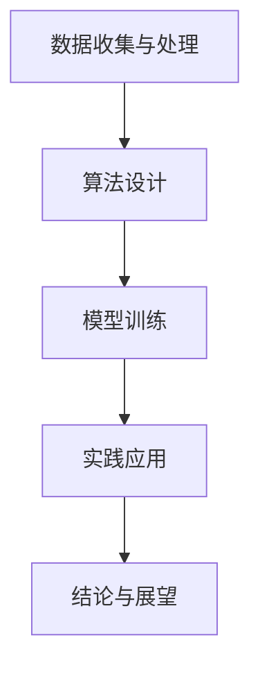

                 

# AI伦理:在模型设计中融入道德考量

> 关键词：人工智能伦理、模型设计、道德考量、数据隐私、公平性、责任归属

> 摘要：本文深入探讨了人工智能（AI）伦理在模型设计中的重要性。通过分析AI伦理的核心概念、原则以及在数据收集、算法设计和模型训练等环节中的应用，本文旨在为AI开发者提供一套完整的伦理框架，以帮助他们在模型设计中融入道德考量，确保AI系统的公平、安全、透明和负责任。

## 《AI伦理:在模型设计中融入道德考量》目录大纲

### 第一部分：引言与背景

1. AI伦理的重要性
    1.1 AI伦理的定义
    1.2 AI伦理的研究背景
    1.3 AI伦理的必要性

2. AI伦理的核心挑战
    2.1 公平性
    2.2 隐私性
    2.3 安全性
    2.4 责任归属

### 第二部分：AI伦理的核心概念与原则

1. AI伦理的理论框架
    1.1 康德伦理学
    1.2 结果伦理学
    1.3 德行伦理学
    1.4 道德责任与道德义务

2. AI伦理的核心原则
    2.1 公平性原则
    2.2 隐私保护原则
    2.3 安全可靠原则
    2.4 责任归属原则
    2.5 可解释性原则

3. AI伦理的核心价值观
    3.1 人类价值观在AI设计中的体现
    3.2 人类价值观与AI伦理的冲突与协调

### 第三部分：AI伦理在模型设计中的应用

1. AI伦理在数据收集与处理中的应用
    1.1 数据隐私保护
    1.2 数据偏见与歧视问题
    1.3 数据使用的透明性

2. AI伦理在算法设计中的应用
    2.1 算法的公平性与公正性
    2.2 算法的安全性与可靠性
    2.3 算法的不透明性问题
    2.4 可解释性与透明性

3. AI伦理在模型训练中的应用
    3.1 模型偏见与歧视的消除
    3.2 模型的公平性与多样性
    3.3 模型的安全性与可靠性
    3.4 模型的可解释性与透明性

### 第四部分：AI伦理在实践中的应用案例

1. 案例一：智能招聘系统的伦理设计
    1.1 案例背景
    1.2 伦理问题分析
    1.3 伦理设计方法与策略

2. 案例二：自动驾驶汽车的伦理挑战
    2.1 案例背景
    2.2 伦理问题分析
    2.3 伦理设计方法与策略

3. 案例三：社交媒体内容审核的伦理考量
    3.1 案例背景
    3.2 伦理问题分析
    3.3 伦理设计方法与策略

### 第五部分：结论与展望

1. AI伦理的现状与趋势
    1.1 AI伦理的现状
    1.2 AI伦理的发展趋势
    1.3 AI伦理的未来挑战

2. 对AI伦理研究与实践的建议
    2.1 政策与法规建议
    2.2 企业实践与伦理教育
    2.3 社会责任与公众参与

### 附录

1. AI伦理相关术语解释
2. AI伦理相关的参考文献
3. AI伦理实践案例清单
4. Mermaid流程图

## 1.1 AI伦理的重要性

随着人工智能技术的迅猛发展，AI伦理问题逐渐成为社会关注的焦点。AI伦理不仅关乎技术的道德合理性，更涉及到社会公正、隐私保护、安全性和责任归属等多个方面。

### 1.1.1 AI伦理的定义

AI伦理是指关于人工智能应用中道德和伦理问题的研究，旨在确保AI系统的设计和应用符合道德规范和社会价值观。它涉及多个学科，如伦理学、计算机科学、社会学、心理学等，旨在解决AI技术带来的伦理挑战。

### 1.1.2 AI伦理的研究背景

随着AI技术的发展，越来越多的应用场景出现，例如自动驾驶汽车、智能招聘系统、社交媒体内容审核等。这些应用不仅提高了效率，也可能带来道德风险，如歧视、隐私侵犯、安全威胁等。因此，研究AI伦理问题，确保AI技术的道德合理性，成为当务之急。

### 1.1.3 AI伦理的必要性

AI伦理的必要性体现在以下几个方面：

1. **确保技术公正性**：AI系统的决策过程可能受到数据偏差的影响，导致不公平的结果。通过AI伦理研究，可以确保技术决策的公正性。
2. **保护隐私**：AI技术通常涉及大量个人数据的收集和处理，保护个人隐私成为伦理研究的重要内容。
3. **增强安全性**：AI系统的安全性是确保其正常运行的基础。通过AI伦理研究，可以识别和防范潜在的安全威胁。
4. **明确责任归属**：在AI系统出现问题时，明确责任归属对于维护社会秩序和公正至关重要。
5. **推动技术进步**：AI伦理研究有助于引导技术发展，确保AI技术符合社会价值观和道德标准。

## 1.2 AI伦理的核心挑战

AI伦理的核心挑战主要包括公平性、隐私性、安全性和责任归属等方面。

### 1.2.1 公平性

公平性是AI伦理的核心挑战之一。AI系统的决策过程可能受到数据偏差的影响，导致某些群体受到不公平对待。例如，如果训练数据中存在性别或种族偏见，AI系统可能在这些群体中表现出歧视行为。为了确保公平性，需要：

1. **数据多样性**：确保训练数据覆盖不同群体，避免数据偏差。
2. **算法公平性**：设计算法时考虑公平性，通过算法优化减少歧视行为。
3. **透明性**：提高算法的透明度，让用户了解决策过程和结果。

### 1.2.2 隐私性

随着AI技术的发展，个人数据的收集和处理变得更加普遍。隐私性成为AI伦理的重要挑战。为了保护隐私，需要：

1. **数据最小化**：仅收集必要的数据，避免过度收集。
2. **数据匿名化**：对数据进行匿名化处理，减少隐私泄露风险。
3. **透明性**：提高数据收集和处理过程的透明度，让用户了解其数据的使用情况。
4. **隐私保护机制**：设计隐私保护机制，如差分隐私，确保数据在使用过程中不被泄露。

### 1.2.3 安全性

AI系统的安全性是确保其正常运行的基础。安全性挑战包括：

1. **数据安全**：确保数据在传输和存储过程中的安全性。
2. **算法安全**：设计安全的算法，防止攻击者利用算法漏洞。
3. **系统稳定性**：确保AI系统在运行过程中的稳定性和可靠性。
4. **应急响应**：建立应急响应机制，应对潜在的安全威胁。

### 1.2.4 责任归属

在AI系统出现问题时，明确责任归属对于维护社会秩序和公正至关重要。责任归属挑战包括：

1. **责任划分**：明确AI系统开发者、用户和其他相关方的责任。
2. **责任追究**：建立责任追究机制，确保违规者受到惩罚。
3. **责任保险**：建立责任保险制度，降低因AI系统故障导致的损失。

## 2.1 AI伦理的理论框架

AI伦理的理论框架为理解AI伦理问题提供了基础。以下是几种常见的伦理理论框架：

### 2.1.1 康德伦理学

康德伦理学强调行为的道德性，认为行为本身是否符合道德规范是判断行为道德性的关键。在AI伦理中，康德伦理学可以指导我们判断AI系统的行为是否符合道德标准，如公正性、尊重他人等。

### 2.1.2 结果伦理学

结果伦理学关注行为的结果，认为行为的结果是判断行为道德性的关键。在AI伦理中，结果伦理学可以帮助我们评估AI系统对人类社会的影响，如公平性、安全性等。

### 2.1.3 德行伦理学

德行伦理学关注行为者的道德品质，认为行为者的道德品质是判断行为道德性的关键。在AI伦理中，德行伦理学可以帮助我们评估AI系统开发者的道德素质，如责任感、公正性等。

### 2.1.4 道德责任与道德义务

道德责任与道德义务是AI伦理的核心概念。道德责任是指行为者因特定行为而产生的道德义务。在AI伦理中，明确道德责任有助于确定责任归属，确保AI系统的道德合理性。

## 2.2 AI伦理的核心原则

AI伦理的核心原则为AI系统设计提供了指导。以下是几种核心原则：

### 2.2.1 公平性原则

公平性原则要求AI系统在设计过程中避免歧视，确保不同群体获得公平的机会。为了实现公平性原则，需要：

1. **数据多样性**：确保训练数据覆盖不同群体，避免数据偏差。
2. **算法公平性**：设计算法时考虑公平性，通过算法优化减少歧视行为。
3. **透明性**：提高算法的透明度，让用户了解决策过程和结果。

### 2.2.2 隐私保护原则

隐私保护原则要求AI系统在设计过程中保护用户隐私。为了实现隐私保护原则，需要：

1. **数据最小化**：仅收集必要的数据，避免过度收集。
2. **数据匿名化**：对数据进行匿名化处理，减少隐私泄露风险。
3. **透明性**：提高数据收集和处理过程的透明度，让用户了解其数据的使用情况。
4. **隐私保护机制**：设计隐私保护机制，如差分隐私，确保数据在使用过程中不被泄露。

### 2.2.3 安全可靠原则

安全可靠原则要求AI系统在设计和应用过程中确保数据安全和系统稳定性。为了实现安全可靠原则，需要：

1. **数据安全**：确保数据在传输和存储过程中的安全性。
2. **算法安全**：设计安全的算法，防止攻击者利用算法漏洞。
3. **系统稳定性**：确保AI系统在运行过程中的稳定性和可靠性。
4. **应急响应**：建立应急响应机制，应对潜在的安全威胁。

### 2.2.4 责任归属原则

责任归属原则要求在AI系统出现问题时明确责任归属。为了实现责任归属原则，需要：

1. **责任划分**：明确AI系统开发者、用户和其他相关方的责任。
2. **责任追究**：建立责任追究机制，确保违规者受到惩罚。
3. **责任保险**：建立责任保险制度，降低因AI系统故障导致的损失。

### 2.2.5 可解释性原则

可解释性原则要求AI系统在设计和应用过程中提高透明度，让用户了解决策过程和结果。为了实现可解释性原则，需要：

1. **算法透明性**：提高算法的透明度，让用户了解决策过程和结果。
2. **可解释性工具**：使用可解释性工具，如决策树、神经网络可视化等，帮助用户理解决策过程。
3. **用户反馈**：鼓励用户反馈，改进算法和系统设计。

## 2.3 AI伦理的核心价值观

AI伦理的核心价值观旨在确保AI系统的道德合理性，以下是一些核心价值观：

### 2.3.1 人类价值观在AI设计中的体现

人类价值观在AI设计中的体现是确保AI系统符合人类道德标准的关键。以下是人类价值观在AI设计中的几个方面：

1. **公正性**：确保AI系统在不同群体中表现出公正性。
2. **尊重**：尊重用户的隐私和权利，确保数据安全。
3. **透明性**：提高AI系统的透明度，让用户了解决策过程和结果。
4. **责任感**：确保AI系统开发者和其他相关方承担道德责任。

### 2.3.2 人类价值观与AI伦理的冲突与协调

人类价值观与AI伦理之间可能存在冲突，如：

1. **效率与公正性**：追求效率可能导致忽视公正性。
2. **透明性与安全性**：提高透明度可能增加安全风险。
3. **个性化与隐私保护**：个性化服务可能侵犯隐私。

为了协调这些冲突，需要：

1. **平衡原则**：在效率、公正性、透明性、安全性等价值观之间寻找平衡。
2. **多元参与**：鼓励不同领域的专家和社会公众参与AI伦理讨论，确保多元化视角。
3. **持续改进**：通过不断的实践和反思，逐步完善AI伦理体系。

## 3.1 AI伦理在数据收集与处理中的应用

在AI模型设计过程中，数据收集与处理是至关重要的环节。这个阶段涉及到诸多伦理问题，如数据隐私保护、数据偏见与歧视问题、数据使用的透明性等。

### 3.1.1 数据隐私保护

数据隐私保护是AI伦理的核心问题之一。在数据收集和处理过程中，需要采取以下措施：

1. **数据最小化**：仅收集必要的数据，避免过度收集。
2. **数据匿名化**：对数据进行匿名化处理，减少隐私泄露风险。
3. **透明性**：提高数据收集和处理过程的透明度，让用户了解其数据的使用情况。
4. **隐私保护机制**：设计隐私保护机制，如差分隐私，确保数据在使用过程中不被泄露。

### 3.1.2 数据偏见与歧视问题

数据偏见与歧视问题是AI伦理的另一个重要挑战。训练数据中存在的偏见可能导致AI系统在不同群体中表现出歧视行为。为了解决这一问题，需要：

1. **数据多样性**：确保训练数据覆盖不同群体，避免数据偏差。
2. **算法公平性**：设计算法时考虑公平性，通过算法优化减少歧视行为。
3. **透明性**：提高算法的透明度，让用户了解决策过程和结果。

### 3.1.3 数据使用的透明性

数据使用的透明性是确保AI系统道德合理性的关键。在数据收集和处理过程中，需要：

1. **数据来源透明**：明确数据来源，让用户了解数据来源的合法性。
2. **数据处理过程透明**：明确数据处理的步骤和方法，让用户了解数据处理的过程。
3. **数据用途透明**：明确数据的使用目的，让用户了解其数据的使用情况。

通过以上措施，可以确保AI系统在数据收集与处理阶段符合伦理要求，为后续的算法设计和模型训练奠定坚实基础。

### 3.2 AI伦理在算法设计中的应用

算法设计是AI模型的核心环节，直接影响到AI系统的性能和应用效果。在算法设计过程中，需要充分考虑伦理问题，以确保算法的公平性、安全性和透明性。

#### 3.2.1 算法的公平性与公正性

算法的公平性与公正性是AI伦理的核心问题。算法公平性指的是算法在不同群体中的表现应保持一致，避免歧视行为。公正性则强调算法决策的结果应符合道德和法律规定。

为了实现算法的公平性与公正性，可以采取以下措施：

1. **数据多样性**：确保训练数据覆盖不同群体，避免数据偏差。
2. **算法优化**：设计算法时考虑公平性，通过算法优化减少歧视行为。
3. **算法透明性**：提高算法的透明度，让用户了解决策过程和结果。

#### 3.2.2 算法的安全性与可靠性

算法的安全性与可靠性是确保AI系统正常运行的关键。算法安全包括防止攻击者利用算法漏洞、保护数据安全和确保系统稳定性等方面。

为了实现算法的安全性与可靠性，可以采取以下措施：

1. **算法安全性**：设计安全的算法，防止攻击者利用算法漏洞。
2. **数据安全**：确保数据在传输和存储过程中的安全性。
3. **系统稳定性**：确保AI系统在运行过程中的稳定性和可靠性。

#### 3.2.3 算法的不透明性问题

算法的不透明性问题是指算法的内部决策过程难以理解，导致用户无法了解决策依据。为了解决不透明性问题，可以采取以下措施：

1. **可解释性工具**：使用可解释性工具，如决策树、神经网络可视化等，帮助用户理解决策过程。
2. **算法透明性**：提高算法的透明度，让用户了解决策过程和结果。
3. **用户反馈**：鼓励用户反馈，改进算法和系统设计。

通过以上措施，可以确保AI系统在算法设计阶段符合伦理要求，为后续的模型训练和应用奠定坚实基础。

### 3.3 AI伦理在模型训练中的应用

在AI模型训练过程中，需要充分考虑伦理问题，以确保模型公平、安全、透明和负责任。

#### 3.3.1 模型偏见与歧视的消除

模型偏见与歧视问题是AI伦理的重要挑战。模型偏见可能源自训练数据中的偏差，导致模型在不同群体中的表现不一致。为了消除模型偏见，可以采取以下措施：

1. **数据多样性**：确保训练数据覆盖不同群体，避免数据偏差。
2. **算法公平性**：设计算法时考虑公平性，通过算法优化减少歧视行为。
3. **模型校验**：定期对模型进行校验，确保其表现符合伦理标准。

#### 3.3.2 模型的公平性与多样性

模型的公平性与多样性是确保AI系统在不同群体中表现一致的关键。为了实现模型的公平性与多样性，可以采取以下措施：

1. **数据多样性**：确保训练数据覆盖不同群体，避免数据偏差。
2. **算法公平性**：设计算法时考虑公平性，通过算法优化减少歧视行为。
3. **模型优化**：针对不同群体，设计不同参数的模型，提高模型适应性。

#### 3.3.3 模型的安全性与可靠性

模型的安全性与可靠性是确保AI系统正常运行的基础。为了实现模型的安全性与可靠性，可以采取以下措施：

1. **模型验证**：使用多种验证方法，确保模型准确性和稳定性。
2. **模型监控**：实时监控模型运行状态，及时发现和解决潜在问题。
3. **模型备份**：定期备份模型，确保模型数据安全。

#### 3.3.4 模型的可解释性与透明性

模型的可解释性与透明性是确保用户了解模型决策过程和结果的重要保障。为了实现模型的可解释性与透明性，可以采取以下措施：

1. **可解释性工具**：使用可解释性工具，如决策树、神经网络可视化等，帮助用户理解决策过程。
2. **算法透明性**：提高算法的透明度，让用户了解决策过程和结果。
3. **用户反馈**：鼓励用户反馈，改进算法和系统设计。

通过以上措施，可以确保AI系统在模型训练阶段符合伦理要求，为后续的应用推广奠定坚实基础。

### 4.1 案例一：智能招聘系统的伦理设计

智能招聘系统在人力资源领域具有广泛应用，通过算法和数据分析，帮助企业筛选合适的候选人。然而，智能招聘系统也可能涉及诸多伦理问题，如数据隐私、算法公平性等。

#### 4.1.1 案例背景

某大型企业使用智能招聘系统，通过分析求职者的简历、社交媒体信息等，筛选合适的候选人。然而，该企业在招聘过程中发现，系统对某些性别和种族的求职者存在歧视现象。

#### 4.1.2 伦理问题分析

1. **数据隐私**：智能招聘系统可能涉及大量求职者的个人信息，如何保护这些数据不被泄露或滥用是一个重要伦理问题。
2. **算法公平性**：系统在筛选候选人时，可能因数据偏差导致某些群体受到不公平对待。
3. **算法透明性**：用户无法了解系统筛选候选人的具体依据和过程，缺乏透明度。

#### 4.1.3 伦理设计方法与策略

为了解决上述伦理问题，智能招聘系统可以采取以下伦理设计方法与策略：

1. **数据隐私保护**：采用数据加密、匿名化等技术手段，确保求职者个人信息安全。
2. **算法公平性**：设计算法时，考虑数据多样性，避免数据偏差，确保算法公平性。
3. **算法透明性**：提高算法的透明度，让用户了解系统筛选候选人的具体依据和过程，增加用户信任度。
4. **用户反馈**：鼓励用户反馈，及时优化算法和系统设计，提高用户体验。

通过以上措施，可以确保智能招聘系统在伦理设计方面符合道德规范，为企业和求职者提供公平、透明、安全的服务。

### 4.2 案例二：自动驾驶汽车的伦理挑战

自动驾驶汽车是人工智能领域的一个重要应用，通过传感器、算法和大数据分析，实现车辆自主驾驶。然而，自动驾驶汽车在面临各种复杂路况时，也可能涉及诸多伦理问题。

#### 4.2.1 案例背景

某自动驾驶汽车在行驶过程中，遇到前方行人突然闯入，系统必须在瞬间做出决策，选择是继续行驶撞行人，还是紧急刹车撞车辆。这一问题引发了社会广泛关注。

#### 4.2.2 伦理问题分析

1. **生命价值**：自动驾驶汽车在面临生命抉择时，如何平衡不同生命价值成为一个伦理问题。
2. **责任归属**：自动驾驶汽车出现事故时，如何确定责任归属，需要明确相关法律法规。
3. **社会影响**：自动驾驶汽车可能影响交通秩序、就业等社会问题，如何评估其社会影响成为一个伦理挑战。

#### 4.2.3 伦理设计方法与策略

为了解决上述伦理问题，自动驾驶汽车可以采取以下伦理设计方法与策略：

1. **生命价值平衡**：在设计自动驾驶系统时，考虑生命价值的平衡，确保在紧急情况下做出合理决策。
2. **责任归属明确**：建立责任归属机制，明确自动驾驶汽车、企业和其他相关方的责任，确保责任追究。
3. **社会影响评估**：在推广自动驾驶汽车时，进行全面的社会影响评估，确保其符合社会价值观和道德规范。
4. **公众参与**：鼓励公众参与自动驾驶汽车伦理讨论，确保多元化视角。

通过以上措施，可以确保自动驾驶汽车在伦理设计方面符合道德规范，为安全、可靠、公平的自动驾驶提供保障。

### 4.3 案例三：社交媒体内容审核的伦理考量

社交媒体平台在信息传播中扮演着重要角色，然而，内容审核问题也引发了诸多伦理争议。如何确保内容审核的公平、透明和负责任成为一个重要课题。

#### 4.3.1 案例背景

某社交媒体平台在内容审核过程中，发现部分内容审核算法对某些观点和群体存在歧视现象。这一问题引发了用户不满和社会关注。

#### 4.3.2 伦理问题分析

1. **内容公平性**：内容审核算法可能因数据偏差导致某些观点和群体受到不公平对待。
2. **透明性**：用户无法了解内容审核的具体依据和过程，缺乏透明度。
3. **责任归属**：在内容审核过程中，如何明确平台、算法开发者和其他相关方的责任成为一个伦理问题。

#### 4.3.3 伦理设计方法与策略

为了解决上述伦理问题，社交媒体平台可以采取以下伦理设计方法与策略：

1. **内容公平性**：在设计内容审核算法时，考虑内容多样性，避免数据偏差，确保内容审核公平性。
2. **透明性**：提高内容审核过程的透明度，让用户了解内容审核的具体依据和过程，增加用户信任度。
3. **责任归属明确**：建立责任归属机制，明确平台、算法开发者和其他相关方的责任，确保责任追究。
4. **用户反馈**：鼓励用户反馈，及时优化算法和系统设计，提高用户体验。

通过以上措施，可以确保社交媒体内容审核在伦理设计方面符合道德规范，为用户和平台提供公平、透明、负责任的服务。

## 5.1 AI伦理的现状与趋势

### 5.1.1 AI伦理的现状

目前，AI伦理研究已取得一定进展，但还存在诸多挑战。在政策层面，许多国家和地区开始出台相关法规，规范AI技术的应用。例如，欧盟颁布的《通用数据保护条例》（GDPR）对数据隐私保护提出了严格要求。在实践层面，一些企业和研究机构也积极推动AI伦理研究，制定伦理准则，确保AI技术的道德合理性。

### 5.1.2 AI伦理的发展趋势

随着AI技术的不断发展，AI伦理研究将呈现以下趋势：

1. **多元化视角**：AI伦理研究将涵盖更多学科，如伦理学、计算机科学、社会学等，形成多元化视角。
2. **国际合作**：全球范围内，各国将加强AI伦理合作，共同应对AI伦理挑战。
3. **技术应用**：AI伦理研究将深入应用于各个领域，如医疗、金融、交通等，确保AI技术的道德合理性。
4. **持续改进**：通过不断的实践和反思，逐步完善AI伦理体系，确保其适应未来发展需求。

### 5.1.3 AI伦理的未来挑战

未来，AI伦理将面临以下挑战：

1. **技术发展**：随着AI技术的快速发展，伦理问题将更加复杂，需要不断更新和完善伦理体系。
2. **社会影响**：AI技术对社会的影响将越来越广泛，如何平衡技术创新与社会责任成为一个重要课题。
3. **公众参与**：公众对AI伦理问题的关注程度不断提高，如何充分发挥公众参与作用，确保AI技术的道德合理性。
4. **跨学科融合**：AI伦理研究需要与其他学科紧密融合，形成综合性研究体系，为解决复杂伦理问题提供有力支持。

## 5.2 对AI伦理研究与实践的建议

### 5.2.1 政策与法规建议

1. **完善法规体系**：制定完善的AI伦理法规，明确AI技术的道德标准和责任归属。
2. **加强监管**：建立AI伦理监管机制，确保AI技术的合规应用。
3. **国际协调**：加强国际合作，推动全球范围内的AI伦理法规制定和执行。

### 5.2.2 企业实践与伦理教育

1. **建立伦理委员会**：企业应设立伦理委员会，负责审查AI项目，确保其道德合理性。
2. **加强伦理培训**：对AI开发者进行伦理培训，提高其伦理意识和素养。
3. **公开伦理准则**：企业应公开AI伦理准则，接受社会监督。

### 5.2.3 社会责任与公众参与

1. **积极履行社会责任**：企业应积极履行社会责任，推动AI技术的道德发展。
2. **鼓励公众参与**：通过多种渠道，鼓励公众参与AI伦理讨论，确保多元化视角。
3. **加强沟通与反馈**：企业与公众之间应建立有效沟通渠道，及时回应公众关切。

通过以上措施，可以推动AI伦理研究与实践的发展，确保AI技术在道德合理性方面的持续进步。

### 附录A：AI伦理相关术语解释

- **公平性**：指AI系统在不同群体中的表现应保持一致，避免歧视行为。
- **隐私性**：指AI系统在设计和应用过程中应保护用户隐私，确保数据安全。
- **安全性**：指AI系统在设计和应用过程中应确保数据安全和系统稳定性。
- **责任归属**：指在AI系统出现问题时，明确相关方（如开发者、用户等）的责任。
- **可解释性**：指AI系统在设计和应用过程中应提高透明度，让用户了解决策过程和结果。

### 附录B：AI伦理相关的参考文献

1. Anderson, M., & Anderson, S. L. (2011). *The ethical Algorithm*. IEEE Technology and Engineering, 36(4), 20-24.
2. Floridi, L., & Taddeo, M. (2010). *On the morality of algorithmic agents: An overview of the debates*. AI & SOCIETY, 25(1), 3-24.
3. Bello, F., & Dignum, F. (2019). *AI Ethics: From Theory to Practice*. Springer.
4. Russell, S., & Norvig, P. (2020). *Artificial Intelligence: A Modern Approach*. Prentice Hall.

### 附录C：AI伦理实践案例清单

1. **智能招聘系统**：企业应确保招聘算法公平、透明，避免歧视行为。
2. **自动驾驶汽车**：企业应制定伦理准则，明确自动驾驶汽车在紧急情况下的决策原则。
3. **社交媒体内容审核**：平台应确保内容审核算法公平、透明，避免歧视行为。
4. **医疗AI系统**：医院应确保医疗AI系统在诊断和治疗过程中符合道德规范。

## Mermaid流程图

作者：AI天才研究院/AI Genius Institute & 禅与计算机程序设计艺术 /Zen And The Art of Computer Programming

