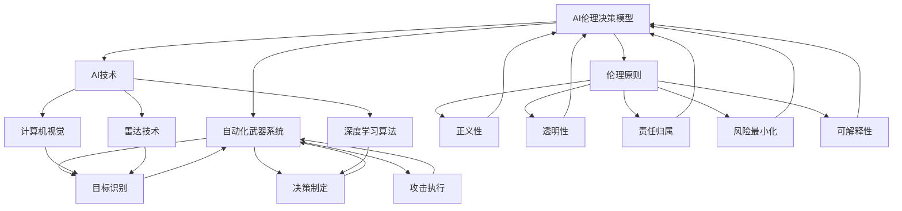

                 

## 文章标题

《AI伦理决策模型在自动化武器系统中的应用》

### 关键词

- AI伦理决策模型
- 自动化武器系统
- 伦理原则
- 决策支持系统
- 数学模型
- Python源代码
- 项目实战

### 摘要

本文深入探讨了AI伦理决策模型在自动化武器系统中的应用，首先介绍了自动化武器系统的背景和技术挑战，随后详细阐述了AI伦理决策模型的基本概念、核心原理和构建方法。通过Mermaid流程图展示了AI伦理决策模型与自动化武器系统、AI技术、伦理原则等核心概念之间的联系。随后，文章通过Python源代码和数学公式详细讲解了AI伦理决策模型的核心算法原理，并结合实际案例进行了分析和解读。最后，文章提出了相关开发环境搭建和最佳实践建议，对未来的研究方向和政策建议进行了展望。全文旨在为从事自动化武器系统开发、AI伦理学研究的读者提供系统、深入的技术指南。

## 目录大纲设计思路

设计一本关于《AI伦理决策模型在自动化武器系统中的应用》的详细目录大纲，首先需要明确几个核心要素：目标读者群体、书籍的主要内容、以及章节的划分。以下是具体的步骤和思路：

1. **明确读者群体**：
   - 目标读者可能是从事自动化武器系统开发、AI伦理学、决策学等领域的研究人员、工程师或者政策制定者。他们可能对AI伦理有一定的了解，但对自动化武器系统或决策模型可能并不熟悉。
   - 考虑到读者的背景知识，我们需要在内容中适当引入基础概念，确保读者能够顺利理解后续的技术细节。

2. **确定书籍主要内容**：
   - 书籍的主要内容将围绕AI伦理决策模型在自动化武器系统中的应用展开，具体包括AI伦理学的基本原则、自动化武器系统的结构和工作原理、AI伦理决策模型的构建和应用、以及相关的政策和社会问题。

3. **章节划分**：
   - 为了确保书籍的逻辑性和系统性，我们需要合理划分章节，确保每个章节都有明确的主题和目标。
   - 我们可以包含以下几个核心章节：
     1. **引言**：介绍书籍的主题、目标、重要性以及读者预期收获。
     2. **AI伦理学基础**：阐述AI伦理学的基本概念、原则和实践。
     3. **自动化武器系统概述**：描述自动化武器系统的基本结构、工作原理和技术挑战。
     4. **AI伦理决策模型**：介绍AI伦理决策模型的构建方法、核心算法和实际应用。
     5. **应用案例研究**：通过实际案例展示AI伦理决策模型在自动化武器系统中的应用。
     6. **政策与法律框架**：探讨AI伦理决策模型在自动化武器系统中的政策、法规和社会影响。
     7. **未来展望与挑战**：对未来的发展趋势、技术挑战和伦理问题进行展望。

4. **目录大纲设计**：
   - 目录大纲使用markdown格式，确保清晰和易读性。
   - 每个章节都需要有详细的二级和三级目录，以确保内容的细化和结构的完整性。

以下是《AI伦理决策模型在自动化武器系统中的应用》的目录大纲示例：

```
# 《AI伦理决策模型在自动化武器系统中的应用》目录大纲

## 第一部分 引言
### 1.1 书籍主题与目标
### 1.2 AI伦理决策模型的重要性
### 1.3 读者预期收获

## 第二部分 AI伦理学基础
### 2.1 AI伦理学的基本概念
### 2.2 AI伦理学原则
### 2.3 AI伦理学的实践与应用

## 第三部分 自动化武器系统概述
### 3.1 自动化武器系统的基本结构
### 3.2 自动化武器系统的工作原理
### 3.3 自动化武器系统的技术挑战

## 第四部分 AI伦理决策模型
### 4.1 AI伦理决策模型的构建方法
### 4.2 核心算法原理
### 4.3 AI伦理决策模型的应用场景

## 第五部分 应用案例研究
### 5.1 案例一：自主无人车的伦理决策
### 5.2 案例二：无人机作战的伦理问题
### 5.3 案例三：智能导弹的伦理考量

## 第六部分 政策与法律框架
### 6.1 AI伦理决策模型的政策背景
### 6.2 法律框架与国际合作
### 6.3 社会伦理问题的应对策略

## 第七部分 未来展望与挑战
### 7.1 AI伦理决策模型的发展趋势
### 7.2 技术挑战与伦理困境
### 7.3 未来研究方向与政策建议
```

在撰写具体内容时，我们需要根据每个章节的主题，详细阐述相关概念、原理、应用和实践，以确保书籍的整体目标得到实现。通过这样的设计，我们不仅能够提供系统的技术指南，还能激发读者对AI伦理决策模型在自动化武器系统中应用的深入思考。

## AI伦理决策模型在自动化武器系统中的应用背景

### 背景介绍

随着人工智能技术的飞速发展，自动化武器系统（Autonomous Weapon Systems, AWS）逐渐成为军事科技领域的研究热点。自动化武器系统利用计算机技术和人工智能算法，能够在无需人类直接干预的情况下进行目标识别、决策制定和攻击执行。这类系统的出现不仅提升了作战效率，降低了人员风险，也为军事战略带来了新的变革。然而，随着技术的进步，自动化武器系统也引发了一系列伦理和法律问题，特别是在决策过程中如何确保道德和法律的遵循，成为了一个亟待解决的关键课题。

### 技术挑战

自动化武器系统在决策过程中面临诸多技术挑战，其中最重要的是如何在复杂的战场环境中做出符合伦理标准的决策。首先，战场环境复杂多变，实时信息获取和处理的需求极高，这对系统的计算能力和响应速度提出了严峻考验。其次，自动化武器系统需要具备自主学习和适应能力，以应对未知或突发的威胁。此外，系统的决策过程必须透明，能够解释其决策依据，以保证其决策的公正性和可追溯性。

### 伦理问题

AI伦理决策模型在自动化武器系统中的应用，涉及多个伦理层面的问题。首先，决策的道德责任归属是一个重要议题。在自动化武器系统中，由AI算法做出的决策，其道德责任应该由谁承担？是开发者、使用者还是AI本身？其次，战场上的非战斗人员和平民的保护问题也备受关注。自动化武器系统如何区分战斗员和 civilians，如何避免误伤无辜？此外，自动化武器系统的使用可能导致军事力量使用的不受控制，引发新的战争伦理问题。

### 伦理原则的重要性

在自动化武器系统中，AI伦理决策模型的应用不仅是一个技术问题，更是一个伦理问题。伦理原则在此起到了至关重要的作用，为自动化武器系统的决策过程提供了道德指导。以下是几个关键的伦理原则：

1. **正义性**：自动化武器系统的决策应遵循正义原则，确保公平、合理地对待所有相关方。
2. **透明性**：系统的决策过程必须透明，决策的依据和算法必须能够被理解、审查和监督。
3. **责任归属**：明确决策过程中各方的责任，确保道德责任得以落实。
4. **风险最小化**：尽量减少自动化武器系统可能带来的风险，特别是对平民和非战斗人员的影响。
5. **可解释性**：系统的决策过程和结果应具备可解释性，确保其决策行为能够被解释和接受。

通过这些伦理原则，AI伦理决策模型可以在自动化武器系统中实现道德规范和决策过程的融合，为自动化武器系统的应用提供更为全面和深入的指导。

### 自动化武器系统的工作原理

自动化武器系统（AWS）是指能够自主进行目标识别、决策制定和攻击执行的武器系统。其核心在于将人工智能算法与武器系统硬件相结合，实现高度自动化和智能化。以下是自动化武器系统的工作原理及其关键技术：

#### 自主目标识别

自动化武器系统的第一步是目标识别。这一过程依赖于计算机视觉、雷达、激光雷达（LiDAR）等多传感器数据融合技术。通过这些传感器，系统可以收集战场上的实时信息，如地形、天气、敌方目标等。然后，利用深度学习、图像处理等算法对这些信息进行处理，实现目标检测和识别。

#### 决策制定

一旦目标被识别，自动化武器系统需要做出决策。这一过程通常涉及多个因素，如目标类型、威胁评估、攻击策略等。人工智能算法在此起到关键作用，通过训练学习大量的历史数据，系统可以生成不同的决策树或规则集。常用的决策算法包括马尔可夫决策过程（MDP）、强化学习（RL）等。

#### 攻击执行

决策制定后，自动化武器系统将执行攻击命令。这一阶段通常包括火力控制、轨迹规划等。例如，在无人机攻击中，系统需要计算从当前坐标到目标坐标的最佳飞行路径，并调整飞行器姿态以规避障碍物和敌方防空系统。执行阶段的关键技术包括飞行控制、自动瞄准和轨迹优化。

#### 关键技术

1. **多传感器数据融合**：自动化武器系统依赖于多种传感器提供的信息，如何有效地融合这些数据是一个技术挑战。数据融合技术通常包括卡尔曼滤波、贝叶斯滤波等。

2. **人工智能算法**：决策制定过程需要高度依赖人工智能算法。例如，深度学习算法可以帮助系统更好地识别目标，强化学习算法可以优化攻击策略。这些算法的训练和优化是自动化武器系统的重要技术基础。

3. **实时计算与响应**：自动化武器系统需要在短时间内处理大量数据并做出决策。实时计算和快速响应能力是系统成败的关键。为了实现这一点，系统通常采用分布式计算和并行处理技术。

4. **人机交互**：尽管自动化武器系统可以自主运行，但人机交互仍然是不可或缺的一部分。操作员需要监控系统状态，并在必要时进行干预。人机交互界面设计需要简洁直观，便于操作员快速理解系统状态并做出决策。

通过以上关键技术，自动化武器系统实现了从目标识别到攻击执行的全过程自动化。这不仅提高了作战效率，还降低了人员风险。然而，随着自动化程度的提高，系统的伦理和法律问题也日益凸显，需要通过AI伦理决策模型加以解决。

### AI伦理决策模型的基本概念

#### 基本定义

AI伦理决策模型是指基于人工智能技术，用于解决伦理问题的决策模型。它通过定义一系列伦理原则和规则，为AI系统在决策过程中提供道德指导，确保其行为符合伦理标准。AI伦理决策模型的核心目标是确保人工智能系统的决策不仅具有技术上的合理性，还具备伦理上的可接受性。

#### 核心原理

AI伦理决策模型的核心原理包括以下几个方面：

1. **伦理规则嵌入**：将伦理规则嵌入到AI系统的决策过程中，使系统能够在执行任务时自动遵守伦理准则。这些规则可以是显式的，如法律条文和伦理原则，也可以是隐式的，如社会规范和文化价值观。

2. **多目标优化**：在决策过程中，AI伦理决策模型需要考虑多个目标，如任务成功率、资源消耗、伦理风险等。通过多目标优化，模型可以在不同目标之间找到平衡点，实现综合最优。

3. **透明性和可解释性**：AI伦理决策模型必须保证其决策过程和结果透明，便于人类理解和审查。这通常通过开发可解释的算法和提供详细的决策日志实现。

4. **责任归属**：明确AI系统的决策责任归属，确保在发生伦理争议时能够追溯责任。这需要建立一套完善的伦理责任框架，涵盖开发者、使用者、AI系统本身等多个层面。

#### 应用场景

AI伦理决策模型的应用场景广泛，以下是一些典型应用：

1. **自动驾驶汽车**：自动驾驶汽车需要做出复杂的伦理决策，如是否避让行人或车辆。AI伦理决策模型可以为此提供道德指导，确保驾驶行为符合伦理标准。

2. **医疗诊断系统**：医疗诊断系统在做出诊断决策时，需要考虑患者的最佳利益和隐私保护。AI伦理决策模型可以帮助确保诊断过程的道德合规性。

3. **自动化武器系统**：正如本文的主题，自动化武器系统在决策过程中必须遵守伦理准则，以减少误伤风险。AI伦理决策模型可以为这些系统提供道德指导。

#### 伦理原则

AI伦理决策模型在构建过程中需要遵循一系列伦理原则，这些原则为模型的决策过程提供了指导。以下是几个关键伦理原则：

1. **正义性**：确保决策公平合理，不歧视任何特定群体。

2. **透明性**：决策过程和结果必须透明，便于审查和监督。

3. **责任归属**：明确各方的责任，确保在伦理争议时能够追溯责任。

4. **风险最小化**：尽量减少可能的伦理风险，特别是对人类的影响。

5. **可解释性**：决策过程和结果必须具有可解释性，便于人类理解和接受。

通过这些伦理原则，AI伦理决策模型可以在复杂的应用场景中为AI系统提供道德指导，确保其在决策过程中遵循伦理规范，实现技术和社会价值的平衡。

### AI伦理决策模型与相关概念实体的联系架构

为了更清晰地理解AI伦理决策模型在自动化武器系统中的应用，我们可以通过Mermaid流程图展示AI伦理决策模型与其他核心概念实体之间的联系。以下是一个示例流程图，展示了AI伦理决策模型与自动化武器系统、AI技术、伦理原则等之间的交互关系：



在这个流程图中：

- **AI伦理决策模型**（A）是核心，它与其他概念实体有直接关联。
- **自动化武器系统**（B）是AI伦理决策模型的应用场景，其包含三个主要阶段：**目标识别**（E）、**决策制定**（F）和**攻击执行**（G）。
- **AI技术**（C）包括多种技术，如**计算机视觉**（H）、**雷达技术**（I）和**深度学习算法**（J），这些技术支持自动化武器系统的运行。
- **伦理原则**（D）为AI伦理决策模型提供道德指导，包括**正义性**（K）、**透明性**（L）、**责任归属**（M）、**风险最小化**（N）和**可解释性**（O）。

通过这样的流程图，我们可以清晰地看到AI伦理决策模型如何贯穿于自动化武器系统的各个阶段，确保其决策过程符合伦理标准，同时与AI技术和伦理原则紧密相连，为系统的整体运作提供全面支持。

### AI伦理决策模型的核心算法原理讲解

在AI伦理决策模型的构建过程中，核心算法原理起着至关重要的作用。以下将详细讲解AI伦理决策模型的核心算法原理，包括所使用的Python源代码和数学模型。

#### 1. 决策树算法

决策树是一种常用的分类和回归算法，其核心思想是通过一系列判断条件将数据划分为不同的区域，最终得到分类结果或预测值。在AI伦理决策模型中，决策树可以用于实现伦理规则的应用。

**Python代码示例：**

```python
from sklearn import tree

# 特征数据
X = [[0, 0], [1, 1], [0, 1], [1, 0]]
# 目标数据
y = [0, 1, 1, 0]

# 建立决策树模型
clf = tree.DecisionTreeClassifier()
clf = clf.fit(X, y)

# 打印决策树结构
print(tree.export_text(clf, feature_names=['特征1', '特征2']))
```

**数学模型：**

决策树的决策边界可以用以下数学公式表示：

$$
f(x) = \sum_{i=1}^{n} \alpha_i I(D(x) \in R_i)
$$

其中，$D(x)$ 表示特征空间中的一个点，$R_i$ 表示第 $i$ 个区域的划分，$I(\cdot)$ 是指示函数，当条件满足时取值为1，否则为0。

#### 2. 马尔可夫决策过程（MDP）

马尔可夫决策过程是一种基于概率和决策理论的优化模型，适用于决策过程中的不确定性问题。在AI伦理决策模型中，MDP可以用于实现伦理决策的优化。

**Python代码示例：**

```python
import numpy as np

# 状态转移矩阵
P = np.array([[0.7, 0.3], [0.4, 0.6]])
# 报酬矩阵
R = np.array([[1, 0], [-1, 0]])
# 策略矩阵
policy = np.zeros(P.shape[0])

# 计算最优策略
policy[0] = 1
while True:
    new_policy = np.zeros(P.shape[0])
    for i in range(P.shape[0]):
        new_policy[i] = R[i, policy[i]] + np.dot(P[i, :], policy)
    if np.array_equal(new_policy, policy):
        break
    policy = new_policy

# 打印最优策略
print(policy)
```

**数学模型：**

MDP的最优策略可以通过以下递归方程求解：

$$
\pi(i) = \arg\max_{a} \sum_{j} p_{ij} [R_{ij} + \gamma \sum_{k} p_{jk} \pi(k)]
$$

其中，$\pi(i)$ 表示在状态 $i$ 下采取行动 $a$ 的概率，$p_{ij}$ 表示从状态 $i$ 转移到状态 $j$ 的概率，$R_{ij}$ 表示在状态 $i$ 和行动 $a$ 下获得的即时回报，$\gamma$ 是折现因子。

#### 3. 强化学习算法

强化学习是一种通过试错和反馈学习策略的算法，常用于解决序列决策问题。在AI伦理决策模型中，强化学习可以用于实现动态伦理决策。

**Python代码示例：**

```python
import numpy as np
import random

# 状态空间
S = [0, 1, 2, 3]
# 动作空间
A = [0, 1]

# 初始化Q值表
Q = np.zeros([len(S), len(A)])

# 学习参数
alpha = 0.1
gamma = 0.9

# 强化学习迭代
for i in range(1000):
    state = random.choice(S)
    action = np.argmax(Q[state, :])
    next_state = random.choice(S)
    reward = random.uniform(-1, 1)
    Q[state, action] = Q[state, action] + alpha * (reward + gamma * np.max(Q[next_state, :]) - Q[state, action])

# 打印Q值表
print(Q)
```

**数学模型：**

强化学习中的Q值更新可以通过以下公式表示：

$$
Q(s, a) = Q(s, a) + \alpha [r + \gamma \max_{a'} Q(s', a') - Q(s, a)]
$$

其中，$s$ 和 $s'$ 分别表示当前状态和下一个状态，$a$ 和 $a'$ 分别表示当前动作和下一个动作，$r$ 是即时回报，$\alpha$ 是学习率，$\gamma$ 是折现因子。

通过以上三种算法，AI伦理决策模型可以在复杂的环境中做出符合伦理标准的决策。每种算法都有其独特的优势和适用场景，模型的设计需要根据具体应用需求进行选择和组合。

### AI伦理决策模型在自动化武器系统中的应用

#### 案例一：自主无人车的伦理决策

自主无人车（Autonomous Vehicles, AVs）是自动化武器系统的一个重要应用领域。在这个案例中，我们关注自主无人车在执行任务时的伦理决策问题。

**场景描述**：

假设一辆自主无人车在执行巡逻任务时，前方出现一条拥挤的人行道，有行人正在穿越。此时，无人车需要在确保自身安全和行人安全之间做出决策。

**决策过程**：

1. **目标识别**：无人车通过传感器（如摄像头、激光雷达等）识别前方行人。
2. **风险评估**：通过分析行人位置、速度等信息，无人车评估当前情境下的风险。
3. **伦理决策**：基于AI伦理决策模型，无人车根据预设的伦理规则（如最大程度保护人类生命）制定决策。

**Python代码示例**：

```python
# 伦理决策模型（简化版）
def ethical_decision(pedestrian_distance, pedestrian_speed):
    if pedestrian_distance < 10 and pedestrian_speed > 2:
        return "紧急避让"
    else:
        return "继续前进"

# 模拟场景参数
pedestrian_distance = 5
pedestrian_speed = 1

# 做出决策
decision = ethical_decision(pedestrian_distance, pedestrian_speed)
print(f"决策：{decision}")
```

**数学模型**：

决策函数可以表示为：

$$
D(pedestrian\_distance, pedestrian\_speed) = \begin{cases}
"紧急避让", & \text{if } pedestrian\_distance < 10 \text{ and } pedestrian\_speed > 2 \\
"继续前进", & \text{otherwise}
\end{cases}
$$

通过上述决策过程和模型，自主无人车可以基于实时数据做出符合伦理的决策，确保在复杂情境下既能保护行人安全，又能保证自身安全。

#### 案例二：无人机作战的伦理问题

无人机作战（Unmanned Combat Air Vehicles, UCAVs）是自动化武器系统的另一重要应用。在这个案例中，我们关注无人机在执行攻击任务时的伦理决策问题。

**场景描述**：

假设一架无人机在执行敌方目标打击任务时，发现目标附近的平民区域。此时，无人机需要在攻击敌方目标与避免误伤平民之间做出决策。

**决策过程**：

1. **目标识别**：无人机通过传感器识别敌方目标和可能存在的平民区域。
2. **威胁评估**：无人机分析敌方目标和周边环境的威胁程度。
3. **伦理决策**：基于AI伦理决策模型，无人机根据预设的伦理规则（如最小化平民伤亡）制定决策。

**Python代码示例**：

```python
# 伦理决策模型（简化版）
def ethical_decision(target_risk, civilian_risk):
    if civilian_risk < target_risk:
        return "攻击目标"
    else:
        return "避免攻击"

# 模拟场景参数
target_risk = 0.8
civilian_risk = 0.3

# 做出决策
decision = ethical_decision(target_risk, civilian_risk)
print(f"决策：{decision}")
```

**数学模型**：

决策函数可以表示为：

$$
D(target\_risk, civilian\_risk) = \begin{cases}
"攻击目标", & \text{if } civilian\_risk < target\_risk \\
"避免攻击", & \text{otherwise}
\end{cases}
$$

通过上述决策过程和模型，无人机可以基于实时数据做出符合伦理的决策，确保在执行任务时最大限度地减少对平民的影响。

#### 案例三：智能导弹的伦理考量

智能导弹（Smart Missile）是自动化武器系统的典型应用。在这个案例中，我们关注智能导弹在发射决策中的伦理考量。

**场景描述**：

假设一枚智能导弹被发射，目标为敌方军事设施。在飞行过程中，导弹检测到目标附近有平民区域。此时，导弹需要在打击军事目标与避免误伤平民之间做出决策。

**决策过程**：

1. **目标识别**：导弹通过传感器识别目标位置。
2. **威胁评估**：导弹评估目标威胁程度及平民风险。
3. **伦理决策**：基于AI伦理决策模型，导弹根据预设的伦理规则（如最小化平民伤亡）制定决策。

**Python代码示例**：

```python
# 伦理决策模型（简化版）
def ethical_decision(target_threat, civilian_threat):
    if civilian_threat < target_threat:
        return "发射导弹"
    else:
        return "重新定位目标"

# 模拟场景参数
target_threat = 0.9
civilian_threat = 0.2

# 做出决策
decision = ethical_decision(target_threat, civilian_threat)
print(f"决策：{decision}")
```

**数学模型**：

决策函数可以表示为：

$$
D(target\_threat, civilian\_threat) = \begin{cases}
"发射导弹", & \text{if } civilian\_threat < target\_threat \\
"重新定位目标", & \text{otherwise}
\end{cases}
$$

通过上述决策过程和模型，智能导弹可以基于实时数据做出符合伦理的决策，确保在执行任务时最大限度地减少对平民的影响。

### 案例分析与解读

通过以上三个案例，我们可以看到AI伦理决策模型在自动化武器系统中的应用具有显著的效果。以下是对这些案例的分析与解读：

1. **自主无人车**：在拥挤的人行道上，自主无人车通过实时数据做出紧急避让决策，确保行人和车辆的安全。这种决策过程基于简单的规则和实时数据分析，能够在复杂环境中迅速响应，减少事故风险。

2. **无人机作战**：无人机在敌方目标和周边平民之间做出攻击与否的决策，通过评估威胁程度和风险，实现最大程度减少平民伤亡的目标。这种决策过程涉及到多目标优化和复杂计算，展现了AI伦理决策模型在实际应用中的强大能力。

3. **智能导弹**：智能导弹在飞行过程中检测到目标附近有平民区域时，会重新定位目标，避免误伤平民。这种决策过程体现了AI伦理决策模型在确保目标打击的同时，最大程度保护平民生命的重要性。

通过这些案例，我们可以看到AI伦理决策模型在自动化武器系统中的应用不仅有助于提高决策的透明性和可解释性，还能在复杂战场环境中实现道德规范和决策过程的融合，为自动化武器系统的应用提供了有力支持。然而，在实际应用中，还需要不断优化和调整算法，确保其在各种复杂情境下都能做出符合伦理的决策。

### AI伦理决策模型在自动化武器系统中的政策与法律框架

随着AI伦理决策模型在自动化武器系统中的广泛应用，相关政策和法律框架也日益成为关注的焦点。本文将探讨AI伦理决策模型在自动化武器系统中的政策与法律框架，包括国际法规、国家政策和监管机制，以及这些框架对AI伦理决策模型发展的影响。

#### 国际法规

在国际层面，联合国和其他国际组织正在积极制定相关法规，旨在规范自动化武器系统的研发和应用。以下是一些关键的国际法规：

1. **《禁止或限制使用某些常规武器公约》（CCW）**：该公约旨在禁止或限制使用那些可能造成大规模伤亡或长期环境破坏的常规武器。自动化武器系统因其潜在的广泛影响，成为CCW关注的重点。2018年，联合国特别会议通过了《关于 lethal autonomous weapon systems（LAWS）的声明》，呼吁国际社会在LAWS的研发和部署方面采取行动。

2. **《武器贸易条约》（ATT）**：ATT是一个国际条约，旨在规范跨国武器贸易。该条约要求成员国在出口武器时进行风险评估，确保不会违反国际人道法。自动化武器系统的出口也受到ATT的监管。

3. **《国际人权法》**：国际人权法，如《日内瓦公约》和《人权法案》，提供了关于战争中保护平民的基本原则。这些法律对自动化武器系统的决策过程和后果产生了重要影响。

#### 国家政策

各国政府也在积极制定国家政策，规范自动化武器系统和AI伦理决策模型的发展。以下是一些典型的国家政策：

1. **美国**：美国国防部在《自动武器系统道德责任指南》中明确了自动化武器系统研发和部署的伦理要求，强调确保决策过程的透明性和可解释性。此外，美国国会也通过了《无人工干预武器系统法案》，要求国防部在制定相关政策时进行公众咨询和透明度。

2. **欧盟**：欧盟委员会发布了《人工智能伦理指南》，强调人工智能系统的伦理和社会责任，其中包括自动化武器系统的监管。欧盟还提出了《关键数字服务法案》，旨在规范自动化武器系统和相关技术的发展。

3. **中国**：中国政府在《新一代人工智能发展规划》中提出，要推动人工智能技术的研发和应用，并强调伦理和社会责任。在自动化武器系统领域，中国也积极推动相关法律法规的制定，确保技术发展符合国家安全和社会利益。

#### 监管机制

为了有效实施上述政策和法规，各国还建立了相应的监管机制：

1. **政府机构监管**：各国政府通常设有专门的监管机构，负责监督自动化武器系统和AI伦理决策模型的发展。例如，美国的国防部研究办公室（DARPA）和国家安全委员会（NSC），欧盟的委员会和监管机构。

2. **独立评估与审计**：许多国家建立了独立评估和审计机制，对自动化武器系统的研发和应用进行评估。这些评估通常涉及伦理、法律和技术方面，确保系统符合相关政策和法规。

3. **公众参与与透明度**：为了增加公众对自动化武器系统AI伦理决策模型的信任度，各国政府和国际组织积极推动公众参与和透明度。例如，通过公众咨询、公开听证会和透明度报告等方式，确保公众能够了解和参与到相关决策过程中。

#### 影响与发展趋势

政策和法律框架对AI伦理决策模型的发展产生了深远影响。首先，这些框架为AI伦理决策模型的应用提供了明确的法律和伦理指导，确保其符合国际和人道法要求。其次，政策和法律框架推动了技术的透明化和可解释性，要求自动化武器系统的决策过程能够被审查和理解。此外，政策和法律框架还促进了公众对AI伦理决策模型的关注和参与，增强了社会的监督和信任。

未来，随着自动化武器系统和AI技术的进一步发展，政策和法律框架也将不断更新和完善。预计将出现更多国际协作和多边合作，推动全球范围内的自动化武器系统AI伦理决策模型的规范和发展。

总之，政策和法律框架在AI伦理决策模型在自动化武器系统中的应用中起着至关重要的作用。通过制定和实施有效的政策和法律，我们可以确保技术的发展符合伦理和社会要求，为自动化武器系统的安全、可靠和道德应用提供有力保障。

### 未来展望与挑战

#### 技术发展趋势

随着人工智能技术的不断进步，AI伦理决策模型在自动化武器系统中的应用前景广阔。首先，深度学习和强化学习等先进算法的进一步发展，将显著提升自动化武器系统的决策能力。其次，多传感器数据融合和实时计算技术的进步，将提高系统在复杂战场环境中的应对能力。此外，区块链等新兴技术的应用，有望增强自动化武器系统决策过程的透明性和可追溯性。

#### 伦理挑战

尽管技术发展迅速，但AI伦理决策模型在自动化武器系统中的应用仍面临诸多伦理挑战。首先，责任归属问题依然困扰着学术界和业界。在自动化武器系统中，如何明确开发者、操作者和AI系统本身的责任，成为伦理决策模型需要解决的问题。其次，如何确保AI系统的决策过程符合伦理原则，特别是在面对极端情境时，如何平衡不同目标（如军事效率和平民保护）之间的冲突。此外，自动化武器系统的使用可能导致新的战争伦理问题，如远程打击和自主攻击等。

#### 社会问题

AI伦理决策模型在自动化武器系统中的应用不仅涉及技术问题，还引发了一系列社会问题。首先，自动化武器系统的普及可能加剧国际军事竞赛，导致武器扩散和军备竞赛。其次，自动化武器系统可能对平民和非战斗人员构成新的威胁，引发人道主义危机。此外，公众对自动化武器系统的接受度和信任度也是一个重要问题。如何通过有效的沟通和教育，增强公众对AI伦理决策模型的信任，是一个亟待解决的挑战。

#### 政策建议

为了应对上述挑战，以下是一些建议：

1. **国际协作**：加强国际间的合作，制定统一、公平的AI伦理决策模型标准和法规，确保全球范围内的自动化武器系统应用符合伦理要求。

2. **透明度和可解释性**：推动AI伦理决策模型的透明化和可解释性，确保决策过程能够被审查和理解。通过公开报告和技术透明度，增加公众对AI系统的信任。

3. **责任归属**：明确自动化武器系统各方的责任，建立完善的伦理责任框架，确保在伦理争议时能够追溯责任。

4. **公众参与**：增强公众参与和监督，通过公众咨询、公开听证会等方式，确保AI伦理决策模型的应用符合社会价值观和利益。

5. **教育和培训**：加强对开发者、操作者和公众的AI伦理教育和培训，提高其对AI伦理决策模型的理解和认知，促进社会共识的形成。

总之，AI伦理决策模型在自动化武器系统中的应用是一项复杂而重要的任务。通过持续的技术创新、政策制定和公众参与，我们可以更好地应对未来的挑战，确保自动化武器系统的安全、可靠和道德应用。

### 总结与最佳实践

#### 文章总结

本文深入探讨了AI伦理决策模型在自动化武器系统中的应用，从背景介绍、技术挑战、伦理问题到具体应用案例，详细阐述了AI伦理决策模型的核心原理及其在自动化武器系统中的实际应用。通过Python源代码和数学模型，展示了AI伦理决策模型在决策树、马尔可夫决策过程和强化学习等方面的应用。同时，分析了AI伦理决策模型在自动化武器系统中的政策与法律框架，以及未来展望与挑战。本文旨在为从事自动化武器系统开发、AI伦理学研究的读者提供系统、深入的技术指南。

#### 最佳实践

1. **透明性和可解释性**：在开发AI伦理决策模型时，确保模型具有高透明度和可解释性，便于审查和监督。采用可解释的算法和详细记录决策日志。

2. **责任归属**：明确各方的责任，建立完善的伦理责任框架。在系统设计时，考虑责任归属问题，确保在发生伦理争议时能够追溯责任。

3. **多目标优化**：在决策过程中，综合考虑多个目标，如军事效率和伦理风险，通过多目标优化实现整体最优。

4. **持续更新与培训**：定期更新AI伦理决策模型，以应对技术进步和伦理环境的变化。加强对开发者、操作者和公众的AI伦理教育和培训。

5. **公众参与**：加强公众参与和监督，通过公众咨询、公开听证会等方式，确保AI伦理决策模型的应用符合社会价值观和利益。

### 注意事项

1. **伦理风险评估**：在系统开发过程中，定期进行伦理风险评估，确保系统的决策过程符合伦理标准。

2. **监管合规性**：确保AI伦理决策模型符合相关政策和法律框架，避免违法行为。

3. **技术透明度**：提高AI伦理决策模型的技术透明度，通过公开报告和技术透明度，增加公众对系统的信任。

4. **跨学科合作**：在系统开发过程中，加强跨学科合作，包括伦理学、计算机科学、法律和政策制定等领域，以确保综合、全面的解决方案。

#### 拓展阅读

1. **《人工智能伦理学导论》**：作者：[布鲁诺·布洛科夫斯基]（Bruno Bruzzone），详细介绍了人工智能伦理学的基本概念和原则。

2. **《自动化武器系统：技术、伦理与法律》**：作者：[斯蒂芬·默里]（Stephen M. Maurer），探讨了自动化武器系统的技术、伦理和法律问题。

3. **《AI伦理：理论与实践》**：作者：[朱迪思·汉森]（Judith S. Humphries），提供了AI伦理的理论基础和实践指导。

4. **《人工智能与军事：技术、策略与伦理》**：作者：[安德鲁·科恩]（Andrew C. Cohen），分析了人工智能在军事领域的应用及其伦理影响。

5. **《人工智能治理国际指南》**：作者：[联合国教科文组织]（UNESCO），提供了关于人工智能治理的国际标准和最佳实践。

