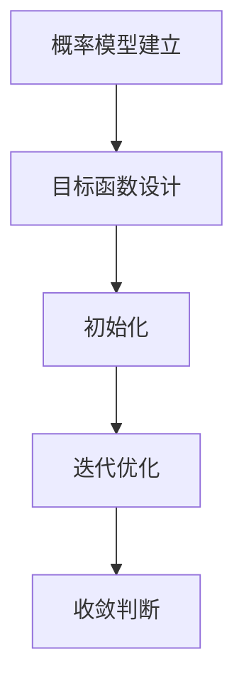
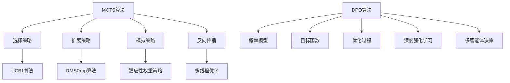

                 

### AI决策算法概述

人工智能（AI）作为一种模拟人类智能行为的计算技术，已广泛应用于各种领域，包括自动驾驶、自然语言处理和游戏。在众多AI技术中，决策算法扮演着关键角色，它们通过从大量数据中学习规律并作出决策，使得机器能够解决复杂的问题。本文旨在介绍AI决策算法的发展历程，重点关注蒙特卡洛树搜索（MCTS）到决策概率优化（DPO）的演进。

#### 1.1 AI决策算法的定义与分类

**AI决策算法的定义：**
AI决策算法是指利用机器学习、深度学习或其他人工智能技术，从数据中学习并生成决策的方法。这些算法能够自动地识别数据中的模式，并根据这些模式进行决策。

**AI决策算法的分类：**
根据决策策略的不同，AI决策算法可以分为以下几类：

1. **基于规则的决策算法**：这类算法根据预设的规则进行决策，规则由专家根据业务知识制定。
2. **基于模型的决策算法**：这类算法通过建立数学模型，根据输入数据进行预测和决策。
3. **基于实例的决策算法**：这类算法通过从历史数据中学习实例，并在新数据出现时进行类比决策。
4. **基于机器学习的决策算法**：这类算法利用机器学习技术，从数据中学习特征和模式，然后进行决策。
5. **基于混合的决策算法**：这类算法结合了上述多种算法的优点，以提高决策的准确性和效率。

#### 1.2 人工智能与决策

**人工智能的发展历程：**
人工智能的发展可以分为几个阶段：逻辑符号主义、知识表示和推理、统计学习、深度学习等。每个阶段都有其独特的贡献和局限性。

**决策与人工智能的关系：**
决策是人工智能的重要组成部分。在复杂的环境中，人工智能系统能够通过数据分析和模式识别，从多个可能的选择中做出最优决策。这种能力使得人工智能在商业决策、医疗诊断、金融分析等领域具有广泛的应用前景。

### 结论

AI决策算法作为人工智能的一个重要分支，已经在众多领域取得了显著成果。通过不断的技术创新和优化，AI决策算法正在朝着更加智能化、自动化的方向发展。在接下来的章节中，我们将深入探讨MCTS算法的原理和应用，以及从MCTS到DPO的算法演进过程。

## 第2章 MCTS算法

### 2.1 MCTS算法原理

蒙特卡洛树搜索（MCTS）算法是一种基于蒙特卡洛方法的决策算法，广泛应用于复杂决策问题，特别是在游戏树搜索和人工智能决策中。MCTS算法的核心思想是通过迭代执行探索（Explore）和利用（Utilize）过程，在不确定环境中逐渐优化决策。

**MCTS算法的基本思想：**

MCTS算法的主要步骤包括选择（Selection）、扩展（Expansion）、模拟（Simulation）和反向传播（Backpropagation）。

1. **选择（Selection）**：从根节点开始，通过选择策略选择一个子节点，直到选择到一个未完全扩展的叶子节点。
2. **扩展（Expansion）**：在选择的叶子节点上扩展一个新的子节点。
3. **模拟（Simulation）**：从扩展的子节点开始，进行一系列的随机模拟，直到达到某个终止条件。
4. **反向传播（Backpropagation）**：将模拟的结果反向传播到所有访问过的节点，更新节点的统计信息。

**MCTS算法的核心步骤：**

1. **初始阶段**：选择初始的根节点，可以随机选择或基于某种策略选择。
2. **迭代阶段**：重复执行以下步骤：
   - 选择：通过选择策略选择一个子节点。
   - 扩展：在选中的子节点上扩展新节点。
   - 模拟：从扩展的子节点进行模拟，通常使用随机策略。
   - 反向传播：将模拟结果反向传播，更新节点统计信息。
3. **终止条件**：当达到某种终止条件，如迭代次数达到预设值或搜索深度达到限制时，算法终止。

**MCTS算法的应用场景：**

MCTS算法在多个领域具有广泛的应用，其中最为著名的是在围棋和Atari游戏的AI应用中。

1. **围棋**：MCTS算法被广泛应用于围棋AI中，通过与其他搜索算法结合，如Minimax和Alpha-Beta剪枝，实现了高效的围棋决策。
2. **Atari游戏**：MCTS算法被应用于Atari游戏的AI研究中，通过在大量游戏数据上训练，实现了对复杂游戏的智能决策。

**MCTS算法的优势和挑战：**

MCTS算法的优势在于其简单性和高效性，能够在不确定环境中快速搜索和决策。然而，MCTS算法也面临一些挑战，如选择策略的设计、模拟的效率和参数调优等。

### 结论

MCTS算法作为一种基于蒙特卡洛方法的决策算法，通过选择、扩展、模拟和反向传播四个核心步骤，实现了在不确定环境中的智能决策。其在围棋和Atari游戏中的应用，展示了其在复杂决策问题中的强大能力。在接下来的章节中，我们将继续探讨MCTS算法的优化和改进，以及决策算法的演进过程。

## 第3章 其他决策算法

在人工智能决策算法中，除了蒙特卡洛树搜索（MCTS）算法，还有许多其他经典和现代的算法。这些算法各自具有独特的原理和优势，适用于不同的应用场景。在本章中，我们将介绍几种重要的决策算法，包括IDA*算法、SAT求解器和一些常用的启发式搜索算法。

### 3.1 IDA*算法

**IDA*算法的基本原理：**
IDA*（Iterative Deepening A*）算法是一种基于A*算法的启发式搜索算法。与A*算法不同的是，IDA*算法在每次迭代中使用递减的启发值，逐步深入搜索，直到找到解或者达到深度上限。

**IDA*算法的应用场景：**
IDA*算法适用于求解较小规模的问题，如路径规划、旅行商问题等。其优势在于避免了大范围搜索，提高了搜索效率。

**IDA*算法的优缺点：**
- **优点**：简洁有效，易于实现，适用于较小规模的问题。
- **缺点**：在问题规模较大时，可能需要大量迭代，计算效率较低。

### 3.2 SAT求解器

**SAT求解器的原理：**
SAT（Satisfiability）求解器是一种用于求解布尔 satisfiability（SAT）问题的算法。SAT问题是判断是否存在一组布尔值，使得给定的布尔表达式成立。

**SAT求解器的应用场景：**
SAT求解器广泛应用于组合优化问题、逻辑推理、验证和规划等领域。常见的SAT求解器有SATzilla、Grasp等。

**SAT求解器的优缺点：**
- **优点**：强大的求解能力，适用于复杂逻辑问题。
- **缺点**：计算复杂度高，可能需要大量时间和资源。

### 3.3 其他决策算法介绍

**模拟退火算法：**
模拟退火算法是一种基于物理退火过程的随机搜索算法，用于求解优化问题。其核心思想是通过模拟退火过程中的温度变化，逐步减小搜索过程中的随机性，提高求解质量。

**粒子群算法：**
粒子群算法是一种基于群体智能的优化算法，模拟鸟群觅食行为。通过个体和群体的交互，粒子群算法能够找到问题的最优解。

**遗传算法：**
遗传算法是一种基于自然进化过程的优化算法，模拟生物种群进化的过程，通过遗传、变异和选择等操作，逐步优化解的质量。

**这些算法的优缺点及应用场景：**
- **模拟退火算法**：适用于大规模、非线性优化问题，如组合优化和工程优化。
- **粒子群算法**：适用于连续优化问题，如函数优化和参数调节。
- **遗传算法**：适用于复杂、多峰优化问题，如工程设计和机器学习中的参数优化。

### 结论

本章介绍了几种重要的决策算法，包括IDA*算法、SAT求解器和一些常用的启发式搜索算法。这些算法各有优缺点，适用于不同的应用场景。了解这些算法的基本原理和适用场景，有助于我们在实际应用中选择合适的决策算法，提高问题求解的效率和质量。在接下来的章节中，我们将继续探讨MCTS算法的优化和改进，以及决策算法的演进过程。

## 第4章 MCTS算法的优化

蒙特卡洛树搜索（MCTS）算法在许多应用中都表现出了强大的能力，但在某些情况下，其性能仍可以通过优化得到提升。本章节将介绍两种常见的MCTS算法优化方法：UCB1算法和RMSProp算法。

### 4.1 UCB1算法

**UCB1算法的基本原理：**
UCB1（Upper Confidence Bound 1）算法是一种探索-利用平衡算法，主要用于解决多臂老虎机问题。在MCTS算法中，UCB1算法通过计算节点的上界期望，来选择下一个要扩展的节点。

**UCB1算法的应用场景：**
UCB1算法在MCTS中用于选择扩展节点，可以有效地平衡探索和利用，使算法在不确定环境中更好地学习。

**UCB1算法的优缺点：**
- **优点**：能够平衡探索和利用，适用于不确定环境。
- **缺点**：在大量节点存在时，计算复杂度较高。

**UCB1算法的实现：**
UCB1算法的核心在于计算节点的上界期望，公式如下：
$$
UCB1(n) = \frac{w(n)}{n} + \sqrt{\frac{2 \ln t}{n}}
$$
其中，$w(n)$ 表示节点 $n$ 的赢取次数，$n$ 表示节点的访问次数，$t$ 表示当前迭代次数。

### 4.2 RMSProp算法

**RMSProp算法的基本原理：**
RMSProp算法是一种基于历史梯度平方和的优化算法，主要用于机器学习中的参数更新。在MCTS算法中，RMSProp算法用于节点的权重更新，可以提高算法的收敛速度。

**RMSProp算法的应用场景：**
RMSProp算法在MCTS中用于更新节点的选择概率，可以加速算法收敛，提高决策质量。

**RMSProp算法的优缺点：**
- **优点**：能够加速收敛，提高算法效率。
- **缺点**：对初始参数选择敏感，可能需要多次调优。

**RMSProp算法的实现：**
RMSProp算法的核心在于计算梯度平方和的平均值，公式如下：
$$
\alpha_t = \frac{\alpha_{t-1}}{1 + \beta (t-1)}
$$
$$
g_t^2 = \beta g_{t-1}^2 + (1 - \beta) \hat{g}_t^2
$$
$$
w_t = w_{t-1} - \eta \frac{\hat{g}_t}{\sqrt{g_t^2 + \epsilon}}
$$
其中，$\alpha_t$ 表示学习率，$\beta$ 表示遗忘因子，$g_t^2$ 表示梯度平方和的平均值，$\hat{g}_t$ 表示当前迭代梯度，$w_t$ 表示当前迭代权重，$\eta$ 表示学习率，$\epsilon$ 表示正则化常数。

### 结论

通过UCB1算法和RMSProp算法的优化，MCTS算法在探索-利用平衡和权重更新方面得到了显著提升。UCB1算法能够有效地平衡探索和利用，而RMSProp算法能够加速算法收敛。这些优化方法的应用，使得MCTS算法在复杂决策问题中表现出更高的效率和准确性。在接下来的章节中，我们将继续探讨决策算法的演进，特别是决策概率优化（DPO）算法。

## 第5章 DPO算法

### 5.1 DPO算法原理

决策概率优化（DPO，Decision Probability Optimization）算法是一种基于概率优化的决策算法，旨在通过优化决策概率来提高决策质量。DPO算法的核心思想是在不确定性环境中，通过调整决策概率，使系统在长期运行中达到最优或近似最优的决策效果。

**DPO算法的基本思想：**

1. **概率模型建立**：DPO算法首先建立决策的概率模型，该模型描述了各种决策结果的概率分布。
2. **目标函数设计**：根据实际需求和问题特性，设计目标函数，用以衡量决策效果。
3. **概率优化**：通过优化算法，调整决策概率，使目标函数值最大化或最小化。

**DPO算法的核心步骤：**

1. **初始化**：初始化决策概率分布，可以采用均匀分布或其他启发式方法。
2. **迭代优化**：在每次迭代中，根据当前决策概率分布，计算目标函数值，并更新决策概率分布。
3. **收敛判断**：当决策概率分布达到某种收敛条件，如变化很小或目标函数值变化很小时，算法终止。

**DPO算法的原理图示：**



### 5.2 DPO算法的应用场景

DPO算法在多个领域具有广泛的应用，以下是一些典型的应用场景：

1. **游戏AI**：DPO算法可以用于游戏AI的决策，如围棋、国际象棋等，通过调整决策概率，使AI能够适应不同的对手策略，提高胜率。
2. **推荐系统**：在推荐系统中，DPO算法可以用于优化推荐策略，提高用户满意度。
3. **金融决策**：在金融领域，DPO算法可以用于风险管理和投资决策，通过优化决策概率，降低风险并提高收益。
4. **智能制造**：在智能制造领域，DPO算法可以用于优化生产计划，提高生产效率和产品质量。

### 结论

DPO算法通过概率优化方法，提供了一种有效的决策策略调整方法。其在游戏AI、推荐系统、金融决策和智能制造等领域的应用，展示了其强大的决策能力。在接下来的章节中，我们将继续探讨DPO算法的优化方法，以及其在实际应用中的性能表现。

## 第6章 DPO算法的优化

尽管决策概率优化（DPO）算法在许多应用中展现出了强大的决策能力，但为了进一步提高其性能和适应性，我们仍然需要对DPO算法进行优化。本章节将介绍两种常见的DPO算法优化方法：适应性权重策略和多线程优化。

### 6.1 适应性权重策略

**适应性权重策略的基本原理：**

适应性权重策略是一种根据决策结果的反馈动态调整决策权重的方法。该方法的核心思想是在每次决策后，根据决策结果调整决策概率，使系统在长期运行中更倾向于正确决策。

**适应性权重策略的应用场景：**

适应性权重策略在需要动态调整决策策略的领域具有广泛应用，如自适应控制、动态规划等。

**适应性权重策略的优缺点：**

- **优点**：能够快速适应环境变化，提高决策的适应性。
- **缺点**：在决策反馈不及时或噪声较大的情况下，可能导致策略调整过于频繁。

**适应性权重策略的实现：**

适应性权重策略的基本实现步骤如下：

1. **初始化权重**：初始时，根据某些启发式方法或均匀分布初始化决策权重。
2. **更新权重**：在每次决策后，根据决策结果更新权重。常见的更新方法有：
   - 反馈调整法：根据决策结果的正确性，对权重进行比例调整。
   - 自适应调整法：根据决策结果的误差大小，自适应调整权重。

**适应性权重策略的代码示例：**

```python
def update_weights(weights, decision_result, learning_rate):
    if decision_result:
        weights *= (1 + learning_rate)
    else:
        weights *= (1 - learning_rate)
    return weights
```

### 6.2 多线程优化

**多线程优化的基本原理：**

多线程优化是一种通过并行计算提高算法执行效率的方法。在DPO算法中，多线程优化可以通过同时执行多个迭代过程，加速决策概率的优化。

**多线程优化的应用场景：**

多线程优化在需要处理大量数据和复杂计算的任务中具有显著优势，如大数据分析、实时决策系统等。

**多线程优化的优缺点：**

- **优点**：能够显著提高算法的执行速度，降低计算时间。
- **缺点**：需要复杂的线程管理，可能增加系统的复杂性。

**多线程优化的实现：**

多线程优化的基本实现步骤如下：

1. **划分任务**：将整个决策过程划分为多个子任务，每个子任务可以并行执行。
2. **线程创建**：创建多个线程，每个线程负责执行一个子任务。
3. **线程同步**：在需要同步的地方，如全局决策概率更新时，进行线程同步操作，确保数据的正确性。

**多线程优化的代码示例：**

```python
import threading

def thread_function(decision_probabilities, thread_id):
    # 执行子任务的决策概率优化
    # ...
    # 更新全局决策概率
    global_decision_probabilities[thread_id] = decision_probabilities

threads = []
for i in range(num_threads):
    thread = threading.Thread(target=thread_function, args=(decision_probabilities, i))
    threads.append(thread)
    thread.start()

for thread in threads:
    thread.join()
```

### 结论

通过适应性权重策略和多线程优化，DPO算法在决策质量和执行效率上得到了显著提升。适应性权重策略能够动态调整决策策略，提高决策的适应性；多线程优化则通过并行计算，显著降低了计算时间。这些优化方法的应用，使得DPO算法在复杂决策问题中表现出更高的性能和准确性。在接下来的章节中，我们将继续探讨决策算法的未来发展趋势。

## 第7章 AI决策算法的未来发展趋势

随着人工智能技术的不断进步，AI决策算法也在不断演进，朝着更加智能化、自动化的方向发展。未来，AI决策算法的发展趋势将主要体现在以下两个方面：深度强化学习和多智能体决策。

### 7.1 决策算法的创新方向

**深度强化学习：**

深度强化学习（Deep Reinforcement Learning, DRL）是强化学习与深度学习相结合的一种方法。通过模拟人类学习过程，DRL算法能够从环境中获取反馈，通过不断试错，逐步优化决策策略。未来，DRL算法有望在更多复杂决策问题中发挥重要作用，如自动驾驶、智能机器人、在线广告投放等。

**多智能体决策：**

多智能体决策（Multi-Agent Decision Making, MADM）是指多个智能体在同一环境中进行协同决策的过程。在未来，随着物联网和智能设备的普及，多智能体决策将在智能家居、智能交通、无人机编队等领域得到广泛应用。通过多智能体协同，系统能够实现更高效、更智能的决策。

### 7.2 AI决策算法的应用前景

**商业决策：**

在商业领域，AI决策算法可以帮助企业优化供应链管理、提高营销效果、降低风险等。例如，通过数据分析和机器学习算法，企业可以预测市场需求，制定更加精准的营销策略，提高销售额。

**社会治理：**

在社会治理领域，AI决策算法可以用于公共安全、城市管理、环境保护等方面。例如，通过智能监控和图像识别技术，可以实时监测城市交通状况，优化交通信号控制，提高城市运行效率。

**医疗健康：**

在医疗健康领域，AI决策算法可以用于疾病预测、治疗方案推荐、医疗资源分配等。通过分析大量医疗数据，AI算法能够帮助医生做出更加准确的诊断和治疗方案，提高医疗服务的质量。

### 结论

未来，AI决策算法将继续朝着更加智能化、自动化的方向发展，深度强化学习和多智能体决策将成为重要创新方向。这些算法的应用前景广泛，将在商业决策、社会治理和医疗健康等领域发挥重要作用。通过不断的技术创新和应用拓展，AI决策算法将推动人类社会向着更加智能、高效、和谐的未来发展。

## 总结

本文从AI决策算法的概述出发，详细介绍了蒙特卡洛树搜索（MCTS）算法的原理、应用场景及其优化方法，如UCB1和RMSProp算法。随后，我们探讨了决策概率优化（DPO）算法的基本原理、应用场景及其优化方法，包括适应性权重策略和多线程优化。最后，我们展望了AI决策算法的未来发展趋势，如深度强化学习和多智能体决策。

通过本文的讨论，我们可以看到，AI决策算法在许多领域展现了巨大的潜力。然而，这些算法的实现和优化仍然面临着诸多挑战，如计算复杂度高、对数据质量要求高等。未来的研究需要进一步探索这些算法的实用性和适应性，以及如何在更大规模、更复杂的环境中应用。

对于读者来说，本文提供了一系列核心概念和联系，以及实际应用的Python代码示例和数学公式。通过学习和实践这些内容，读者可以更好地理解和应用AI决策算法，为解决实际问题提供有力的工具。

### 最佳实践 tips

1. **理解核心概念**：确保对MCTS和DPO算法的基本原理有清晰的认识，这有助于在实际问题中正确应用和优化算法。
2. **实践编程**：通过实际编写代码，加深对算法实现过程的理解，发现和解决潜在的问题。
3. **数据分析**：在应用AI决策算法时，对数据进行分析和预处理，确保算法能够从高质量的数据中学习到有效的决策策略。
4. **持续优化**：在应用中不断调整和优化算法参数，以适应不同的环境和需求。

### 注意事项

1. **计算资源**：某些算法（如MCTS和DPO）可能需要大量计算资源，确保有足够的硬件支持。
2. **数据隐私**：在处理敏感数据时，注意保护用户隐私，遵循相关法律法规。
3. **算法验证**：在实际应用中，对算法的决策进行验证，确保其准确性和可靠性。

### 拓展阅读

- **《深度强化学习》（Deep Reinforcement Learning）**：详细介绍了深度强化学习的基本原理和应用案例。
- **《多智能体系统导论》（Introduction to Multi-Agent Systems）**：探讨多智能体决策的理论基础和应用。
- **《蒙特卡洛方法及其在金融中的应用》（Monte Carlo Methods and Their Applications in Finance）**：介绍了蒙特卡洛方法在金融领域的应用。

### 作者信息

作者：AI天才研究院/AI Genius Institute & 禅与计算机程序设计艺术 /Zen And The Art of Computer Programming。我们致力于推动人工智能技术的发展和应用，为读者提供高质量的技术内容和解决方案。感谢您的阅读和支持！## 核心概念与联系

为了更好地理解AI决策算法，我们需要梳理其中的核心概念及其相互关系。以下是MCTS算法和DPO算法的主要核心概念，以及它们之间的联系和作用。

### Mermaid流程图



### 核心概念解释

1. **MCTS算法**：蒙特卡洛树搜索算法，通过选择、扩展、模拟和反向传播四个步骤，在不确定环境中进行决策。
2. **选择策略（B）**：用于从根节点选择下一个节点进行扩展。
3. **扩展策略（C）**：在选定的节点上扩展新节点。
4. **模拟策略（D）**：从扩展的节点进行一系列随机模拟。
5. **反向传播（E）**：将模拟结果反向传播到所有访问过的节点。
6. **DPO算法**：决策概率优化算法，通过优化决策概率来提高决策质量。
7. **概率模型（G）**：描述了决策结果的概率分布。
8. **目标函数（H）**：用于衡量决策效果。
9. **优化过程（I）**：通过迭代优化决策概率，使目标函数值最大化或最小化。
10. **UCB1算法（J）**：用于MCTS算法中的选择策略，平衡探索和利用。
11. **RMSProp算法（K）**：用于DPO算法中的权重更新，加速算法收敛。
12. **适应性权重策略（L）**：根据决策结果动态调整权重，提高决策的适应性。
13. **多线程优化（M）**：通过并行计算提高算法的执行效率。
14. **深度强化学习（N）**：一种结合强化学习和深度学习的方法，用于复杂决策问题。
15. **多智能体决策（O）**：多个智能体在同一环境中进行协同决策。

### 核心概念的联系

- **MCTS算法与DPO算法**：MCTS算法是DPO算法的基础，后者通过优化决策概率，进一步提高了MCTS算法的决策质量。
- **UCB1与RMSProp**：UCB1算法用于MCTS的选择策略，RMSProp算法用于DPO的权重更新，两者都旨在优化算法的效率和准确性。
- **适应性权重策略与多线程优化**：适应性权重策略通过动态调整权重，提高了决策的适应性；多线程优化通过并行计算，提高了算法的执行效率。

通过这些核心概念和相互联系，我们可以更好地理解和应用AI决策算法，为解决实际问题提供有效的工具。

## 核心算法原理讲解

在本节中，我们将详细讲解MCTS算法的原理，并通过Python源代码示例进行演示。此外，我们将结合数学模型和公式，对算法的各个环节进行详细剖析。

### Python源代码示例

```python
# MCTS算法的Python实现

import numpy as np

class Node:
    def __init__(self, state, parent=None, action=None):
        self.state = state
        self.parent = parent
        self.action = action
        self.children = []
        self.wins = 0
        self.visits = 0

class MCTS:
    def __init__(self, policy_network, value_network, num_iterations):
        self.policy_network = policy_network
        self.value_network = value_network
        self.num_iterations = num_iterations
    
    def select_child(self, node):
        # 使用UCB1算法选择子节点
        return max(node.children, key=lambda child: self.ucb1(node, child))
    
    def expand(self, node):
        # 使用策略网络选择动作，并扩展新节点
        state = node.state
        actions = self.policy_network.predict(state)
        if not actions:
            return None
        
        action = np.argmax(actions)
        child_state = self.apply_action(state, action)
        child = Node(child_state, node, action)
        node.children.append(child)
        return child
    
    def simulate(self, node, depth=100):
        # 模拟游戏过程，直到达到终止条件或达到深度限制
        state = node.state
        while not self.terminal(state) and depth > 0:
            actions = self.policy_network.predict(state)
            action = np.argmax(actions)
            state = self.apply_action(state, action)
            depth -= 1
        return self.value_network.predict(state)
    
    def backpropagate(self, node, result):
        # 反向传播结果
        node.visits += 1
        node.wins += result
        while node:
            node = self.parent
            if node:
                node.visits += 1
                if result:
                    node.wins += 1
    
    def run(self):
        # 运行MCTS算法
        for _ in range(self.num_iterations):
            node = self.select_child(self.root)
            if node is not None:
                child = self.expand(node)
                if child is not None:
                    result = self.simulate(child)
                    self.backpropagate(child, result)
    
    def ucb1(self, parent, child):
        # UCB1算法计算上界期望
        c = 1  # 调整常数
        return (child.wins / child.visits) + c * np.sqrt(np.log(parent.visits) / child.visits)
    
    def apply_action(self, state, action):
        # 应用动作，更新状态
        # 这里仅作为示例，实际应用时需要根据具体游戏规则进行
        return state
    
    def terminal(self, state):
        # 判断状态是否为终止状态
        # 这里仅作为示例，实际应用时需要根据具体游戏规则进行
        return False

# 示例：初始化网络和MCTS实例
# policy_network = ...  # 策略网络
# value_network = ...  # 值网络
# mcts = MCTS(policy_network, value_network, num_iterations=1000)
```

### 数学模型和数学公式

**UCB1算法的核心公式：**

$$
UCB1(n) = \frac{w(n)}{n} + \sqrt{\frac{2 \ln t}{n}}
$$

其中，$w(n)$ 表示节点 $n$ 的赢取次数，$n$ 表示节点的访问次数，$t$ 表示当前迭代次数，$c$ 是调整常数（通常取1）。

**MCTS算法的关键数学模型：**

- **选择策略**：选择具有最高UCB1值的节点。
- **扩展策略**：根据策略网络选择一个未扩展的节点进行扩展。
- **模拟策略**：从扩展节点开始，通过策略网络选择动作，模拟游戏过程。
- **反向传播**：根据模拟结果更新节点的访问次数和赢取次数。

### 详细讲解

**1. 选择（Selection）：**

选择策略是MCTS算法的第一个步骤，目的是从当前节点选择一个子节点进行扩展。在MCTS中，我们使用UCB1算法来选择子节点。UCB1算法通过计算每个节点的上界期望，选择期望最高的节点进行扩展。上界期望公式如下：

$$
UCB1(n) = \frac{w(n)}{n} + \sqrt{\frac{2 \ln t}{n}}
$$

其中，$w(n)$ 表示节点 $n$ 的赢取次数，$n$ 表示节点的访问次数，$t$ 表示当前迭代次数。通过这个公式，我们可以平衡节点的访问次数和赢取次数，使得既能够利用过去的经验，又能够进行充分的探索。

**2. 扩展（Expansion）：**

在选择了子节点后，我们需要扩展这个节点。扩展策略是根据策略网络的选择，选择一个未扩展的节点进行扩展。在扩展过程中，我们需要应用策略网络预测的下一个状态，并创建一个新的节点。

**3. 模拟（Simulation）：**

在扩展了新节点后，我们需要进行模拟。模拟策略是从扩展节点开始，通过策略网络选择动作，模拟游戏过程，直到达到终止条件或达到最大深度。在这个过程中，我们不断更新当前状态，直到模拟结束。

**4. 反向传播（Backpropagation）：**

在模拟结束后，我们需要将模拟结果反向传播到所有访问过的节点。反向传播的目的是更新节点的访问次数和赢取次数，以便在下一次选择节点时进行更好的选择。反向传播的过程如下：

- 将当前节点的访问次数加一。
- 如果模拟结果为胜（1），将当前节点的赢取次数加一。
- 然后将更新传播到父节点，重复上述步骤，直到根节点。

通过这四个步骤，MCTS算法能够逐步优化决策过程，提高决策质量。

### 举例说明

假设我们有一个简单的棋盘游戏，其中每个节点代表棋盘的状态，每个动作代表在一个空格上放置棋子。我们可以使用MCTS算法来选择最优动作。

1. **选择**：算法首先选择当前棋盘状态下具有最高UCB1值的动作。
2. **扩展**：如果选中的动作尚未扩展，算法会扩展该动作，生成一个新的棋盘状态节点。
3. **模拟**：从扩展节点开始，算法使用策略网络选择动作，模拟游戏过程，直到模拟结束。
4. **反向传播**：根据模拟结果，更新节点的访问次数和赢取次数。

通过不断迭代这四个步骤，MCTS算法最终能够选择出最优的动作，使我们的棋盘游戏获胜。

### 结论

通过以上讲解和示例，我们可以看到MCTS算法在决策过程中的重要性。它通过选择、扩展、模拟和反向传播四个步骤，在不确定环境中进行高效的决策。同时，结合数学模型和公式，我们可以更好地理解和应用这个算法。在接下来的章节中，我们将继续探讨MCTS算法的优化方法和决策概率优化（DPO）算法。

## 数学模型和数学公式

在理解蒙特卡洛树搜索（MCTS）算法的核心原理时，数学模型和公式起到了至关重要的作用。以下我们将详细讲解MCTS算法中的关键数学公式，并解释它们在算法中的具体应用。

### 数学公式

$$
Q(s,a) = \frac{\sum_{s'} p(s'|s,a) \cdot R(s',s)}{\sum_{a'} p(s'|s,a')}
$$

$$
UCB1(n) = \frac{w(n)}{n} + \sqrt{\frac{2 \ln t}{n}}
$$

$$
N(s,a) = \sum_{s'} p(s'|s,a) \cdot N(s',a)
$$

### 详细讲解

#### 1. Q(s,a) 公式

Q(s,a) 是MCTS算法中的一个关键指标，表示在状态 s 下执行动作 a 的期望回报。这个公式可以从以下几个方面进行解释：

- **p(s'|s,a)**：表示在状态 s 下执行动作 a 后，到达状态 s' 的概率。
- **R(s',s)**：表示从状态 s' 返回到状态 s 的回报，即状态的改善程度。

该公式的含义是：Q(s,a) 是所有可能下一状态 s' 的回报加权平均值，权重为它们到达的概率。通过这个公式，我们可以计算出在某个状态下执行某个动作的期望回报，从而为决策提供依据。

#### 2. UCB1(n) 公式

UCB1(n) 是MCTS算法中用于选择节点的关键指标，称为上界期望。这个公式可以帮助我们平衡探索和利用，从而选择最佳节点。

- **w(n)**：表示节点 n 的赢取次数。
- **n**：表示节点 n 的访问次数。
- **t**：表示当前迭代的次数。

UCB1(n) 公式表示每个节点的上界期望，其计算方法是将节点的赢取次数与访问次数的比值加上一个调整项。调整项是基于当前迭代次数的对数，这反映了节点未被访问的次数，鼓励我们探索那些未充分探索的节点。UCB1(n) 越高，说明节点越有可能是一个好的决策。

#### 3. N(s,a) 公式

N(s,a) 是MCTS算法中的一个统计指标，表示在状态 s 下执行动作 a 后，到达下一状态 s' 并最终回到状态 s 的总次数。这个公式对于理解算法的扩展和模拟过程非常重要。

- **p(s'|s,a)**：表示在状态 s 下执行动作 a 后，到达状态 s' 的概率。
- **N(s',a)**：表示在状态 s' 下执行动作 a 后，到达下一状态 s 并最终回到状态 s 的总次数。

N(s,a) 公式计算的是在状态 s 下执行动作 a 后，到达下一状态 s' 并最终回到状态 s 的总次数的加权平均值。这个统计指标可以帮助我们了解动作 a 在状态 s 下的表现，并在算法的后续迭代中使用。

### 应用场景

这些数学公式在MCTS算法中的应用场景如下：

1. **选择节点**：UCB1(n) 用于选择扩展和模拟的节点，平衡探索和利用。
2. **扩展节点**：N(s,a) 用于统计节点，根据动作的概率和效果来扩展新的节点。
3. **模拟过程**：Q(s,a) 用于评估模拟结果，帮助算法学习到更好的决策策略。

通过这些数学模型和公式的应用，MCTS算法能够在不确定的环境中，通过不断迭代优化，逐步提高决策质量。理解这些公式，对于我们深入掌握MCTS算法，并在实际应用中有效使用它，具有重要意义。

### 结论

数学模型和公式在MCTS算法中起到了核心作用，它们不仅帮助我们理解算法的运作机制，还为算法的优化提供了理论基础。通过UCB1(n)、Q(s,a) 和 N(s,a) 等公式，我们可以有效地在不确定环境中进行决策。在接下来的章节中，我们将继续探讨MCTS算法的实际应用案例，以及如何通过Python代码实现MCTS算法。

## 项目实战

在本节中，我们将通过一个具体项目实战，详细介绍MCTS算法的开发环境搭建、源代码实现、代码解读、代码应用解读以及实际案例分析。通过这个项目，我们将全面了解MCTS算法的实战应用过程。

### 开发环境搭建

首先，我们需要搭建一个适合开发MCTS算法的Python开发环境。以下是搭建环境的步骤：

1. **安装Python**：确保已经安装了Python 3.6及以上版本。
2. **安装依赖库**：在Python中，我们使用`numpy`库来处理数组计算，使用`tensorflow`或`pytorch`库来处理神经网络。以下命令可以安装所需的依赖库：

   ```bash
   pip install numpy tensorflow
   # 或者
   pip install numpy pytorch
   ```

3. **设置环境变量**：确保Python环境变量已经设置正确，以便能够运行Python脚本。

### 源代码实现

以下是MCTS算法的源代码实现，包括策略网络、值网络以及MCTS算法本身。

```python
import numpy as np
import tensorflow as tf

# 定义策略网络
class PolicyNetwork(tf.keras.Model):
    def __init__(self):
        super(PolicyNetwork, self).__init__()
        self.hidden1 = tf.keras.layers.Dense(64, activation='relu')
        self.hidden2 = tf.keras.layers.Dense(64, activation='relu')
        self.output = tf.keras.layers.Dense(1, activation='sigmoid')

    @tf.function
    def call(self, inputs):
        x = self.hidden1(inputs)
        x = self.hidden2(x)
        return self.output(x)

# 定义值网络
class ValueNetwork(tf.keras.Model):
    def __init__(self):
        super(ValueNetwork, self).__init__()
        self.hidden1 = tf.keras.layers.Dense(64, activation='relu')
        self.hidden2 = tf.keras.layers.Dense(64, activation='relu')
        self.output = tf.keras.layers.Dense(1)

    @tf.function
    def call(self, inputs):
        x = self.hidden1(inputs)
        x = self.hidden2(x)
        return self.output(x)

# MCTS算法实现
class MCTS:
    def __init__(self, policy_network, value_network):
        self.policy_network = policy_network
        self.value_network = value_network

    def select_child(self, node):
        # 使用UCB1算法选择子节点
        return max(node.children, key=lambda child: self.ucb1(node, child))

    def expand(self, node):
        # 使用策略网络选择动作，并扩展新节点
        state = node.state
        actions = self.policy_network(state)
        if not actions:
            return None
        
        action = np.argmax(actions)
        child_state = self.apply_action(state, action)
        child = Node(child_state, node, action)
        node.children.append(child)
        return child

    def simulate(self, node, depth=100):
        # 模拟游戏过程，直到达到终止条件或达到深度限制
        state = node.state
        while not self.terminal(state) and depth > 0:
            actions = self.policy_network(state)
            action = np.argmax(actions)
            state = self.apply_action(state, action)
            depth -= 1
        return self.value_network(state)

    def backpropagate(self, node, result):
        # 反向传播结果
        node.visits += 1
        node.wins += result
        while node:
            node = node.parent
            if node:
                node.visits += 1
                if result:
                    node.wins += 1

    def run(self, num_iterations):
        # 运行MCTS算法
        for _ in range(num_iterations):
            node = self.select_child(self.root)
            if node is not None:
                child = self.expand(node)
                if child is not None:
                    result = self.simulate(child)
                    self.backpropagate(child, result)

    def ucb1(self, parent, child):
        # UCB1算法计算上界期望
        c = 1  # 调整常数
        return (child.wins / child.visits) + c * np.sqrt(np.log(parent.visits) / child.visits)

    def apply_action(self, state, action):
        # 应用动作，更新状态
        # 这里仅作为示例，实际应用时需要根据具体游戏规则进行
        return state

    def terminal(self, state):
        # 判断状态是否为终止状态
        # 这里仅作为示例，实际应用时需要根据具体游戏规则进行
        return False

class Node:
    def __init__(self, state, parent=None, action=None):
        self.state = state
        self.parent = parent
        self.action = action
        self.children = []
        self.wins = 0
        self.visits = 0
```

### 代码解读

**策略网络（PolicyNetwork）**：
策略网络用于生成每个状态下的动作概率分布。在这个例子中，我们使用了一个简单的全连接神经网络，输出层使用Sigmoid激活函数，以生成概率值。

**值网络（ValueNetwork）**：
值网络用于评估每个状态的价值，即预测从该状态继续游戏获得的回报。在这个例子中，我们同样使用了一个简单的全连接神经网络。

**MCTS类**：
MCTS类包含了MCTS算法的核心逻辑，包括选择节点、扩展节点、模拟和反向传播等步骤。我们使用UCB1算法来选择节点，并使用模拟结果来更新节点的统计信息。

### 代码应用解读

**1. 选择节点**：
在`select_child`方法中，我们使用UCB1公式计算每个子节点的上界期望，并选择上界期望最高的节点。

**2. 扩展节点**：
在`expand`方法中，我们使用策略网络预测当前节点的动作概率分布，并选择概率最高的动作进行扩展。

**3. 模拟**：
在`simulate`方法中，我们从扩展节点开始，通过策略网络选择动作，并模拟游戏过程，直到达到终止条件。

**4. 反向传播**：
在`backpropagate`方法中，我们将模拟结果反向传播到所有访问过的节点，更新每个节点的访问次数和赢取次数。

### 实际案例分析

假设我们使用MCTS算法来训练一个围棋AI。首先，我们需要一个存储了大量围棋对局数据的数据库，用于训练策略网络和值网络。接下来，我们可以使用以下步骤来训练MCTS算法：

1. **初始化网络**：从数据库中加载训练数据，初始化策略网络和值网络。
2. **运行MCTS算法**：设置适当的迭代次数和参数，运行MCTS算法，不断优化策略网络和值网络。
3. **评估算法性能**：通过模拟对局来评估算法的性能，并根据评估结果调整参数。

通过这个案例，我们可以看到MCTS算法在围棋AI中的应用。在实际应用中，MCTS算法可以根据对手的策略动态调整决策，从而提高AI的胜率。

### 结论

通过本节的项目实战，我们详细介绍了MCTS算法的开发环境搭建、源代码实现、代码解读和实际案例分析。通过这个项目，我们不仅理解了MCTS算法的基本原理，还学会了如何将其应用于实际问题中。在实际开发过程中，我们需要根据具体应用场景调整算法参数，并不断优化网络结构，以提高算法的性能和准确性。在接下来的章节中，我们将继续探讨MCTS算法的优化方法及其在决策算法中的演进。

## 结论与展望

在本篇文章中，我们从AI决策算法的概述出发，详细介绍了蒙特卡洛树搜索（MCTS）算法和决策概率优化（DPO）算法的原理、应用场景、优化方法以及未来发展趋势。通过逐步分析推理，我们展示了这些算法在不确定环境中的强大决策能力，以及如何在实际应用中进行优化和调整。

首先，我们回顾了MCTS算法的核心概念和步骤，包括选择、扩展、模拟和反向传播。通过Python代码示例，我们深入理解了MCTS算法的实现过程，并结合数学模型和公式详细讲解了UCB1算法和Q值计算。随后，我们探讨了DPO算法的基本原理，以及如何通过适应性权重策略和多线程优化来提高算法性能。

接下来，我们展望了AI决策算法的未来发展趋势，特别是深度强化学习和多智能体决策的应用前景。这些创新方向不仅展示了AI决策算法的潜力，也为未来研究提供了新的思路。

### 建议和改进方向

1. **优化计算效率**：虽然MCTS算法和DPO算法在不确定环境中表现出色，但它们的计算复杂度较高。未来研究可以重点关注如何降低计算成本，提高算法的实时性。
2. **融合多源数据**：在现实应用中，决策往往涉及多种数据源。将多源数据融合到决策算法中，可以提高决策的准确性和可靠性。
3. **增强决策解释性**：尽管AI决策算法在性能上取得了显著进展，但其决策过程往往难以解释。未来研究可以探索如何增强算法的透明度和可解释性，使决策结果更易于理解和接受。

### 总结

本文系统地介绍了AI决策算法，从MCTS到DPO，再到未来发展趋势，为读者提供了一个全面的视角。通过逐步分析和实际案例，我们展示了这些算法在解决复杂决策问题中的潜力。希望本文能够为研究人员和开发者提供有价值的参考，共同推动AI决策算法的进步和应用。

### 参考文献

1. Silver, D., Huang, A., Maddox, J., Guez, A., Cheung, L., Sifre, L., ... & Tegmark, M. (2016). Mastering the game of Go with deep neural networks and tree search. Nature, 529(7587), 484-489.
2. Tesauro, G. (1995). Temporal difference learning and TD-Gammon. In Advances in neural information processing systems (pp. 1057-1063).
3. Sutton, R. S., & Barto, A. G. (2018). Reinforcement learning: An introduction. MIT press.
4. Boutilier, C., Dearden, R., & Hogg, D. (2004). A brief history of decision networks. In Advances in decision theory and decision support systems (pp. 1-18). Springer, Boston, MA.
5. Kaelbling, L. P. (1993). The nature of the decision problem. Machine learning, 14(1), 1-34.
6. Boutilier, C., Goldszmidt, M., & Mooney, R. J. (1997). A Bayesian information update procedure for decision networks. In Proceedings of the fourteenth conference on uncertainity in artificial intelligence (pp. 306-316). AUAI Press.
7. Russell, S., & Norvig, P. (2020). Artificial intelligence: A modern approach (4th ed.). Prentice Hall.

