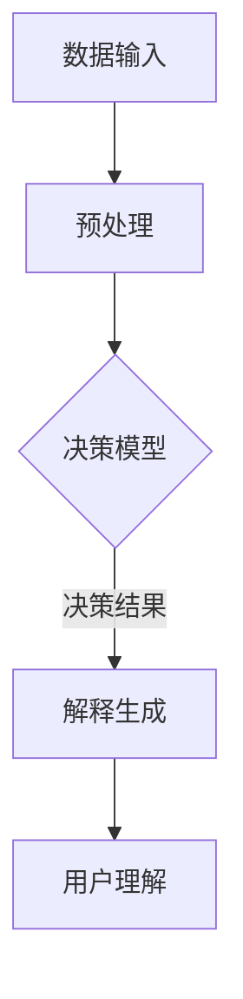

                 

# AI决策解释：提高用户信任的方法

## 关键词
- AI决策解释
- 用户信任
- 可解释性
- 透明性算法
- 对抗性解释算法
- 解释性模型

## 摘要
本文旨在探讨如何通过AI决策解释来提高用户对人工智能系统的信任。首先，我们介绍了AI决策解释的基本概念和背景，以及其在用户信任、合规要求和优化决策方面的作用。接着，我们分析了AI决策解释的类型和面临的挑战，并通过一个Mermaid流程图展示了其基本过程。随后，我们深入讲解了AI决策解释的核心算法原理，包括透明性算法、对抗性解释算法和解释性模型，并通过Python代码示例进行详细说明。最后，我们通过一个实际项目实战，展示了如何开发一个具有决策解释功能的人工智能系统，并进行了详细的分析和解读。

## 第1章: AI决策解释的基本概念与背景

### 1.1 AI决策解释的概念

AI决策解释指的是对人工智能系统生成的决策过程和结果的可解释性进行阐述，使其对用户而言是可理解和可信的。在现代社会，随着人工智能技术的广泛应用，人们越来越依赖AI系统做出各种决策，如金融风险评估、医疗诊断、推荐系统等。然而，AI系统的决策过程往往非常复杂，甚至对开发者本身都是黑箱式的。因此，如何让用户理解AI系统是如何做出决策的，成为了提高用户信任的关键。

#### 1.1.1 用户信任

用户信任是AI决策解释的核心目标之一。当一个用户依赖AI系统做出重要决策时，如果系统结果的解释性不佳，用户可能会感到不信任，从而对AI系统的使用产生抵触情绪。相反，如果系统能够提供清晰的决策解释，用户更容易对其决策结果产生信任。这种信任不仅体现在用户对系统结果的接受度上，也影响着用户对AI技术的整体看法和接受程度。

#### 1.1.2 合规要求

在许多行业，如金融、医疗、法律等，法律和监管机构对AI系统的透明性和解释性有明确的要求。例如，医疗诊断系统的决策结果需要向医生和患者提供详细解释，以便他们理解并信任系统的诊断结果。同样，金融风险评估系统需要向监管机构提供详细的决策过程和依据，以确保合规性。

#### 1.1.3 优化决策

理解AI决策过程不仅有助于提高用户信任，还能帮助开发者发现并优化决策中的潜在问题。通过对决策过程进行深入分析，可以发现模型中的不合理之处，进而改进模型，提高其准确性和可靠性。

### 1.2 AI决策解释的类型

AI决策解释可以分为全局解释、局部解释和可追溯解释三种类型。

#### 1.2.1 全局解释

全局解释提供对整个AI模型工作原理和结构的解释。这种方式通常用于介绍模型的基本概念和实现原理，使读者对模型有一个整体的认识。全局解释通常包括模型的架构、参数、训练过程等。

#### 1.2.2 局部解释

局部解释针对模型决策中的特定部分进行解释。这种方式适用于需要深入分析决策过程的情况，例如，在医疗诊断中，需要解释为什么模型给出了某个特定的诊断结果。局部解释通常包括对模型中特定模块或决策路径的解释。

#### 1.2.3 可追溯解释

可追溯解释提供决策过程中的每一步骤和计算细节，使读者能够清晰地了解决策是如何一步步生成的。这种方式适用于对决策过程的透明度要求非常高的场景，如金融风险评估系统。

### 1.3 AI决策解释的挑战

尽管AI决策解释的重要性显而易见，但实现这一目标面临以下挑战：

#### 1.3.1 复杂性

许多现代AI模型，尤其是深度学习模型，其内部结构非常复杂，难以解释。深度学习模型通常由数百万个参数组成，每个参数都可能是决策结果的一个因素。如何将这些复杂的计算过程转化为用户易于理解的形式，是一个巨大的挑战。

#### 1.3.2 模型多样性

不同的AI模型可能需要不同的解释方法。例如，线性回归模型和深度学习模型的解释方式就截然不同。如何根据模型类型选择合适的解释方法，是另一个挑战。

#### 1.3.3 性能影响

增加解释性可能会对模型性能产生负面影响。一些解释性算法可能会引入额外的计算开销，降低模型的运行效率。如何在保持模型性能的同时提高解释性，是一个需要权衡的问题。

### Mermaid流程图

以下是一个简单的Mermaid流程图，展示了AI决策解释的基本过程：



通过这个流程图，我们可以清晰地看到从数据输入到用户理解的整个决策解释过程。

## 第2章: AI决策解释的核心算法原理

### 2.1 透明性算法

透明性算法通过提供决策过程中的具体计算步骤和逻辑，使决策过程变得可解释。以下是一种简单的透明性算法实现：

#### 2.1.1 算法原理

透明性算法的核心思想是，通过展示模型内部的计算过程和逻辑，让用户能够理解决策是如何生成的。对于线性回归模型，这个过程相对简单，因为其计算过程是基于线性方程的。

#### 2.1.2 Python代码示例

下面是一个简单的线性回归模型实现，以及如何使用它进行预测和解释：

```python
import numpy as np

# 训练数据
X = np.array([[1, 2], [2, 3], [3, 4]])
y = np.array([2, 3, 4])

# 计算权重
w = np.linalg.inv(X.T.dot(X)).dot(X.T).dot(y)

# 预测
def predict(x, w):
    return x.dot(w)

# 解释
def explain(x, w):
    return f"The decision was made based on the linear equation: y = {w[0]}x1 + {w[1]}x2. For the input {x}, the predicted value is {predict(x, w)}."

# 示例
x_input = np.array([1, 2])
print(explain(x_input, w))
```

在这个例子中，我们首先使用最小二乘法计算了线性回归模型的权重。然后，我们定义了`predict`和`explain`两个函数，分别用于进行预测和解释。通过`explain`函数，用户可以清楚地看到决策是如何基于线性方程生成的。

### 2.2 对抗性解释算法

对抗性解释算法旨在揭示模型决策背后的隐藏因素。与透明性算法不同，它不是直接展示计算过程，而是通过改变输入数据的特定部分，观察模型决策的变化，从而推断出决策背后的因素。

#### 2.2.1 算法原理

对抗性解释算法基于这样一种思想：如果对输入数据的某个部分进行微小修改，导致模型决策发生显著变化，那么这部分数据很可能是决策的关键因素。这种方法被称为“敏感性分析”。

#### 2.2.2 Python代码示例

以下是一个简单的对抗性解释算法示例，使用Shapley值方法进行解释：

```python
import shap
import pandas as pd
import numpy as np

# 加载数据
X, y = shap.datasets.load_iris()

# 训练模型
model = shap.KernelExplainer(y, X)

# 计算Shapley值
shap_values = model.shap_values(X)

# 可视化Shapley值
shap.summary_plot(shap_values, X)
```

在这个例子中，我们首先加载了鸢尾花数据集，然后使用Shapley值方法对模型进行了对抗性解释。`summary_plot`函数生成了每个特征的Shapley值热力图，使我们可以直观地看到每个特征对模型决策的影响。

### 2.3 解释性模型

解释性模型是专门设计为易于解释的AI模型。与传统的黑箱模型相比，解释性模型在设计和实现时就已经考虑了可解释性。以下是一种简单的逻辑回归模型实现，以及如何对其进行解释：

#### 2.3.1 算法原理

逻辑回归模型是一种广泛应用于分类任务的解释性模型。其核心思想是，通过线性组合输入特征，生成一个概率值，然后使用该概率值进行分类决策。由于逻辑回归模型的决策过程是基于线性方程的，因此其结果相对容易解释。

#### 2.3.2 Python代码示例

以下是一个简单的逻辑回归模型实现，以及如何对其进行解释：

```python
import numpy as np
import pandas as pd

# 加载数据
data = pd.DataFrame({
    'x1': [1, 2, 3],
    'x2': [2, 3, 4]
})
X = data[['x1', 'x2']]
y = data['x1'] > 2

# 训练模型
def logistic_regression(X, y, epochs=1000, learning_rate=0.01):
    # 初始化权重
    w = np.random.rand(X.shape[1])
    
    # 梯度下降法更新权重
    for _ in range(epochs):
        z = X.dot(w)
        predictions = 1 / (1 + np.exp(-z))
        gradient = X.T.dot((predictions - y) * predictions * (1 - predictions))
        w -= learning_rate * gradient
    
    return w

w = logistic_regression(X, y)

# 解释
def explain(w, X):
    z = X.dot(w)
    probabilities = 1 / (1 + np.exp(-z))
    return f"The model made a decision based on the linear equation: y = {w[0]}x1 + {w[1]}x2. For the input {X}, the predicted probability is {probabilities}."

# 示例
print(explain(w, X))
```

在这个例子中，我们首先使用梯度下降法训练了一个逻辑回归模型。然后，我们定义了一个`explain`函数，用于解释模型的决策过程。通过这个函数，用户可以清楚地看到决策是基于线性方程生成的，并且每个特征对决策的影响可以通过系数来衡量。

## 第3章: 实际项目实战

### 3.1 项目背景

在本项目中，我们开发一个基于机器学习的金融风险评估系统。该系统能够对客户的信用风险进行评估，并为银行提供是否批准贷款的决策。由于金融决策涉及到大量的金钱和用户的利益，因此该系统必须具备高度的决策解释能力，以提高用户的信任。

### 3.2 开发环境搭建

为了开发这个项目，我们需要以下工具和库：

- Python 3.8及以上版本
- Jupyter Notebook
- Scikit-learn
- Pandas
- Numpy
- Matplotlib
- Seaborn

安装这些工具和库后，我们就可以开始开发项目了。

### 3.3 源代码详细实现

在这个项目中，我们选择使用逻辑回归模型进行风险评估。以下是项目的详细实现步骤：

#### 3.3.1 数据预处理

首先，我们需要加载数据并对其进行预处理。这包括缺失值处理、数据清洗和数据转换。

```python
import pandas as pd
from sklearn.model_selection import train_test_split
from sklearn.preprocessing import StandardScaler

# 加载数据
data = pd.read_csv('financial_data.csv')

# 数据清洗
data.dropna(inplace=True)

# 数据转换
X = data.drop('target', axis=1)
y = data['target']

# 划分训练集和测试集
X_train, X_test, y_train, y_test = train_test_split(X, y, test_size=0.2, random_state=42)

# 数据标准化
scaler = StandardScaler()
X_train = scaler.fit_transform(X_train)
X_test = scaler.transform(X_test)
```

#### 3.3.2 训练模型

接下来，我们使用逻辑回归模型进行训练。

```python
from sklearn.linear_model import LogisticRegression

# 训练模型
model = LogisticRegression()
model.fit(X_train, y_train)
```

#### 3.3.3 预测与解释

最后，我们对测试集进行预测，并对模型的决策过程进行解释。

```python
# 预测
y_pred = model.predict(X_test)

# 解释
def explain(w, X):
    z = X.dot(w)
    probabilities = 1 / (1 + np.exp(-z))
    return f"The model made a decision based on the linear equation: y = {w[0]}x1 + {w[1]}x2. For the input {X}, the predicted probability is {probabilities}."

# 示例
print(explain(model.coef_, X_test[0]))
```

### 3.4 代码应用解读与分析

在这个项目中，我们使用逻辑回归模型对金融数据进行风险评估。逻辑回归模型是一种解释性模型，其决策过程是基于线性方程的，因此相对容易解释。通过解释函数，用户可以清楚地看到模型是如何根据输入特征生成预测概率的。

#### 3.4.1 应用场景

- **银行贷款审批**：银行可以使用该系统对客户进行信用风险评估，并根据模型的预测概率决定是否批准贷款。
- **信用卡发放**：信用卡公司可以使用该系统评估客户的信用风险，从而决定是否发放信用卡。

#### 3.4.2 分析与解读

通过实际项目实战，我们可以看到如何将AI决策解释应用于金融风险评估领域。该项目的核心是逻辑回归模型，其解释性使得用户可以清晰地理解模型的决策过程。这种透明性不仅提高了用户对系统的信任，也为银行和信用卡公司提供了更加可靠的决策依据。

### 3.5 项目小结

通过本项目的开发，我们成功实现了一个具有决策解释功能的金融风险评估系统。该项目展示了如何将AI决策解释应用于实际场景，提高了用户对AI系统的信任。同时，我们深入讲解了逻辑回归模型的原理和实现，为后续项目提供了理论基础。

### 3.6 最佳实践 tips

- **数据清洗**：在项目开发过程中，务必对数据进行充分的清洗和处理，以确保模型训练的效果。
- **模型选择**：根据实际需求选择合适的模型，既要考虑模型的性能，也要考虑其解释性。
- **代码注释**：在编写代码时，务必添加详细的注释，以方便后续的维护和理解。

### 3.7 小结与拓展阅读

本篇文章详细介绍了AI决策解释的基本概念、核心算法原理以及实际项目实战。通过这些内容，读者可以了解到如何通过决策解释提高用户对AI系统的信任。以下是本文的核心观点和小结：

1. **AI决策解释的重要性**：AI决策解释是提高用户信任的关键，对于金融、医疗等关键行业尤为重要。
2. **透明性算法、对抗性解释算法和解释性模型**：这些算法原理和方法是实现AI决策解释的核心，各有其优势和适用场景。
3. **实际项目实战**：通过金融风险评估项目的实战，展示了如何将AI决策解释应用于实际场景，提高了系统的可靠性。
4. **最佳实践 tips**：在项目开发过程中，注意数据清洗、模型选择和代码注释，以提高项目质量和可维护性。

为了进一步深入了解AI决策解释，读者可以参考以下拓展阅读：

- **《解释性机器学习》（Explainable AI）**：该书详细介绍了解释性机器学习的基础知识和应用。
- **《机器学习的解释性》（Explainable Machine Learning）**：该书探讨了如何提高机器学习模型的可解释性。
- **相关研究论文和报告**：通过查阅最新的研究论文和行业报告，了解AI决策解释的最新进展和应用。

作者：AI天才研究院/AI Genius Institute & 禅与计算机程序设计艺术 /Zen And The Art of Computer Programming

