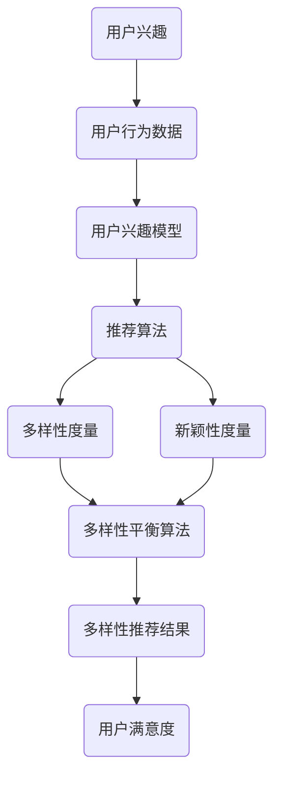

                 

# 《AI在个性化内容推荐系统中的多样性与新颖性平衡应用》

> 关键词：人工智能，个性化推荐，多样性，新颖性，算法，用户模型，物品模型

> 摘要：本文深入探讨了人工智能在个性化内容推荐系统中的多样性与新颖性平衡应用。首先，介绍了AI与个性化推荐系统的关系及其重要性。接着，详细阐述了多样性与新颖性的定义、度量方法及其在个性化推荐系统中的应用。文章随后介绍了实现多样性与新颖性平衡的算法，包括混合推荐算法、新颖性增强的推荐算法和多样性提升的推荐算法。通过实际案例的分析，本文展示了这些算法在实际应用中的效果。最后，对多样性与新颖性平衡算法的发展趋势进行了展望，并给出了应用建议。

---

## 第一部分：引言

### 1.1 AI与个性化内容推荐系统概述

#### AI的核心技术与个性化推荐的关系

人工智能（AI）的核心技术包括机器学习、深度学习、自然语言处理等。这些技术使得计算机能够从大量数据中学习，并做出智能决策。个性化推荐系统是AI技术应用的一个重要领域。通过分析用户的兴趣和行为，推荐系统能够为用户提供个性化的内容推荐。

#### 个性化内容推荐系统的基本原理

个性化推荐系统基于用户模型和物品模型进行推荐。用户模型记录了用户的兴趣和偏好，而物品模型则描述了物品的特征。推荐算法通过分析用户模型和物品模型，为用户推荐与其兴趣相关的物品。

#### 多样性与新颖性在个性化推荐中的重要性

多样性（Diversity）是指推荐系统推荐给用户的物品之间具有不同的特点，避免用户对单一类型的物品感到厌倦。新颖性（Novelty）是指推荐系统能够发现用户尚未接触过的物品，为用户提供新的体验。

### 1.2 书籍结构及目标

本文旨在深入探讨AI在个性化内容推荐系统中的多样性与新颖性平衡应用。文章分为四个部分：

1. **基础理论**：介绍个性化内容推荐系统的基本概念、用户模型、物品模型以及推荐算法。
2. **算法实现**：详细讲解多样性与新颖性平衡算法，包括混合推荐算法、新颖性增强的推荐算法和多样性提升的推荐算法。
3. **案例分析**：通过实际案例，展示多样性与新颖性平衡算法在推荐系统中的应用效果。
4. **应用与展望**：分析多样性与新颖性平衡算法的应用现状，探讨其发展趋势，并提出应用建议。

## 第二部分：基础理论

### 2.1 个性化内容推荐系统

#### 2.1.1 推荐系统的基本概念

推荐系统是一种基于用户行为和物品特征进行信息过滤和预测的系统。根据推荐策略的不同，推荐系统可以分为基于协同过滤（Collaborative Filtering）的推荐算法和基于内容的推荐算法（Content-Based Filtering）。

#### 2.1.2 用户模型与物品模型

用户模型记录了用户的兴趣和偏好，通常使用用户历史行为数据进行分析。物品模型描述了物品的特征，例如新闻的分类、电影的类型、商品的品牌等。

#### 2.1.3 推荐算法简介

基于协同过滤的推荐算法通过分析用户与物品之间的相似度，为用户推荐与其相似的物品。基于内容的推荐算法通过分析物品的特征，为用户推荐与其兴趣相关的物品。

### 2.2 多样性与新颖性理论

#### 2.2.1 多样性的定义与度量

多样性是指推荐系统推荐给用户的物品之间具有不同的特点。度量多样性的方法包括物品之间的相似度、用户对不同物品的兴趣度等。

#### 2.2.2 新颖性的定义与度量

新颖性是指推荐系统能够发现用户尚未接触过的物品。度量新颖性的方法包括物品的未知程度、物品的流行度等。

#### 2.2.3 多样性与新颖性的关系

多样性和新颖性是推荐系统中两个重要的概念，它们之间存在一定的关联。高多样性有助于提高用户体验，而高新颖性则有助于发现新的物品。

## 第三部分：算法实现

### 3.1 多样性与新颖性平衡算法

#### 3.1.1 混合推荐算法

混合推荐算法结合了基于协同过滤和基于内容的推荐算法的优点，通过优化权重系数，实现多样性与新颖性的平衡。

#### 3.1.2 新颖性增强的推荐算法

新颖性增强的推荐算法通过改进基于内容的推荐算法，提高推荐结果的新颖性。

#### 3.1.3 多样性提升的推荐算法

多样性提升的推荐算法通过改进基于协同过滤的推荐算法，提高推荐结果的多样性。

### 3.2 案例分析

#### 3.2.1 案例一：新闻推荐系统

本文通过一个新闻推荐系统的案例，展示了多样性与新颖性平衡算法的应用。

#### 3.2.2 案例二：电商推荐系统

本文通过一个电商推荐系统的案例，进一步分析了多样性与新颖性平衡算法的应用效果。

## 第四部分：应用与展望

### 4.1 多样性与新颖性在推荐系统中的应用现状

本文介绍了多样性与新颖性在推荐系统中的应用现状，分析了现有算法的优缺点。

### 4.2 多样性与新颖性平衡算法的发展趋势

本文探讨了多样性与新颖性平衡算法的发展趋势，提出了未来研究的方向。

### 4.3 结论与展望

本文总结了AI在个性化内容推荐系统中多样性与新颖性平衡应用的研究成果，并对未来的研究提出了展望。

## 附录

### A.1 相关算法源代码

本文提供了相关算法的源代码，以供读者参考。

### A.2 参考文献

本文列出了参考文献，以供进一步阅读。

---

以上是一个大致的框架，具体的内容和实现细节还需要进一步展开。以下是Mermaid流程图的示例：



这个流程图展示了用户兴趣与推荐系统之间的交互过程，以及多样性与新颖性平衡算法的作用。在具体编写时，可以根据需要加入更多的细节和说明。以下是Python源代码的示例：

```python
# 示例：基于内容的推荐算法实现

# 导入必要的库
import numpy as np
from sklearn.metrics.pairwise import cosine_similarity

# 假设用户行为数据为用户-物品评分矩阵
user_item_matrix = np.array([[5, 3, 0, 1],
                             [4, 0, 0, 1],
                             [1, 1, 5, 4],
                             [2, 2, 3, 0]])

# 计算物品之间的相似度矩阵
item_similarity_matrix = cosine_similarity(user_item_matrix)

# 假设用户兴趣模型为用户的兴趣向量
user_interest_vector = np.array([0.4, 0.3, 0.2, 0.1])

# 计算推荐结果
recommendation_scores = np.dot(item_similarity_matrix, user_interest_vector)

# 获取推荐结果
recommended_items = np.argsort(recommendation_scores)[::-1]

# 输出推荐结果
print("推荐结果：", recommended_items)
```

这个示例展示了基于内容的推荐算法的基本实现过程，包括计算物品相似度矩阵、用户兴趣向量以及推荐结果。在具体的应用中，还需要结合多样性与新颖性的度量方法，对推荐结果进行优化。

接下来，我们需要进一步丰富每个部分的内容，确保文章的完整性和专业性。例如，在算法实现部分，需要详细讲解数学模型和公式的推导过程，以及如何将数学模型转化为Python代码。在案例分析部分，需要详细描述案例背景、数据集、算法实现过程以及实验结果。通过这样的方式，我们可以确保文章既有深度又有广度，能够满足读者的需求。在编写过程中，还可以参考一些权威的学术论文和书籍，以确保内容的准确性和权威性。最后，对文章进行反复修改和润色，确保语言表达的准确性和流畅性。

