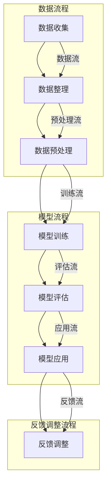

                 

# AI在个性化医疗中的应用：从诊断到治疗

> 关键词：人工智能，个性化医疗，诊断，治疗，医学数据分析，算法

> 摘要：本文深入探讨了人工智能在个性化医疗中的应用，从诊断到治疗的各个环节，通过分析医学数据、运用AI算法，实现了对患者病情的精准预测和个性化治疗，为医疗行业带来了革命性的变革。

## 《AI在个性化医疗中的应用：从诊断到治疗》目录大纲

### 第1章 引言

- **1.1 个性化医疗的概念与意义**
  - **1.1.1 个性化医疗的定义**
  - **1.1.2 个性化医疗与传统医疗的区别**
  - **1.1.3 个性化医疗在医疗领域的意义**
  - **1.1.4 AI在个性化医疗中的重要作用**
  - **1.1.5 本书结构安排**

### 第2章 人工智能与医学概述

- **2.1 人工智能的发展历程**
  - **2.1.1 人工智能的定义**
  - **2.1.2 人工智能的发展历程**
  - **2.1.3 人工智能在医学领域的应用现状**
- **2.2 医学领域的挑战与AI的应用前景**
  - **2.2.1 医学领域的挑战**
  - **2.2.2 AI在医学中的应用前景**
  - **2.2.3 个性化医疗与AI的关系**

### 第3章 数据与数据管理

- **3.1 医学数据的特点与来源**
  - **3.1.1 医学数据的特点**
  - **3.1.2 医学数据的来源**
  - **3.1.3 数据质量管理的重要性**
- **3.2 数据管理策略**
  - **3.2.1 数据收集与整理**
  - **3.2.2 数据存储与安全**
  - **3.2.3 数据分析与处理**

### 第4章 诊断与预测

- **4.1 AI在疾病诊断中的应用**
  - **4.1.1 AI在影像学诊断中的应用**
  - **4.1.2 AI在实验室诊断中的应用**
  - **4.1.3 AI在疾病预测中的应用**
- **4.2 个性化诊断的案例分析**
  - **4.2.1 乳腺癌的个性化诊断**
  - **4.2.2 肺癌的个性化诊断**
  - **4.2.3 糖尿病的个性化诊断**

### 第5章 治疗与干预

- **5.1 AI在个性化治疗中的应用**
  - **5.1.1 AI在药物治疗中的应用**
  - **5.1.2 AI在手术规划中的应用**
  - **5.1.3 AI在康复治疗中的应用**
- **5.2 个性化治疗的案例分析**
  - **5.2.1 基因编辑技术的应用**
  - **5.2.2 免疫细胞治疗的应用**
  - **5.2.3 个性化营养治疗方案的应用**

### 第6章 风险评估与安全

- **6.1 AI在个性化医疗中的潜在风险**
  - **6.1.1 数据隐私问题**
  - **6.1.2 模型偏差问题**
  - **6.1.3 安全性问题**
- **6.2 风险评估与安全管理策略**
  - **6.2.1 风险评估方法**
  - **6.2.2 安全管理策略**
  - **6.2.3 风险沟通与监督**

### 第7章 伦理与法律问题

- **7.1 个性化医疗的伦理问题**
  - **7.1.1 道德伦理问题**
  - **7.1.2 实验伦理问题**
  - **7.1.3 患者权益问题**
- **7.2 个性化医疗的法律问题**
  - **7.2.1 数据保护法律**
  - **7.2.2 医疗责任法律**
  - **7.2.3 专利法律**

### 第8章 未来展望

- **8.1 个性化医疗的发展趋势**
  - **8.1.1 技术发展趋势**
  - **8.1.2 医疗模式的变化**
  - **8.1.3 产业生态的演变**
- **8.2 个性化医疗的挑战与机遇**
  - **8.2.1 挑战**
  - **8.2.2 机遇**

### 第9章 结论

- **9.1 本书总结**
  - **9.1.1 主要内容回顾**
  - **9.1.2 个性化医疗的重要意义**
  - **9.1.3 AI在个性化医疗中的未来作用**
  - **9.1.4 对未来的展望**
- **9.2 展望未来**
  - **9.2.1 技术创新**
  - **9.2.2 社会影响**
  - **9.2.3 产业发展趋势**

## 1.1 个性化医疗的概念与意义

### 1.1.1 个性化医疗的定义

个性化医疗，也称为精准医疗，是一种基于个体化生物学信息和临床数据的医疗模式。它旨在通过精确的疾病诊断、个性化的治疗方案，以及针对性的预防措施，为每位患者提供最佳的治疗效果。个性化医疗强调将传统的一刀切治疗方式转变为个体化、精准的治疗方案，从而提高医疗质量和患者满意度。

### 1.1.2 个性化医疗与传统医疗的区别

传统医疗模式通常是基于普遍的医学知识，对某一类疾病采用相似的治疗方法。而个性化医疗则更加关注个体的生物学特征、环境因素和生活方式等因素，通过综合分析，为每位患者制定个性化的治疗方案。具体区别如下：

- **治疗目标**：传统医疗注重疾病的治疗和康复，个性化医疗更注重疾病预防、早期诊断和个性化治疗。
- **诊疗方法**：传统医疗采用普遍适用的方法，个性化医疗则采用针对个体的精准方法。
- **治疗效果**：个性化医疗能够提高治疗的有效性和安全性，减少副作用和复发率。

### 1.1.3 个性化医疗在医疗领域的意义

个性化医疗在医疗领域的意义主要体现在以下几个方面：

- **提高医疗质量**：通过个性化的诊断和治疗，能够显著提高疾病的治疗效果，降低复发率。
- **降低医疗成本**：个性化的治疗方案能够减少不必要的医疗资源浪费，提高医疗资源的利用效率。
- **改善患者体验**：个性化的医疗模式能够提高患者的满意度，减轻患者的心理压力。
- **促进医学进步**：个性化医疗推动了医学研究的发展，促进了新的诊断技术和治疗方法的诞生。

### 1.1.4 AI在个性化医疗中的重要作用

人工智能在个性化医疗中发挥着关键作用，主要体现在以下几个方面：

- **数据分析与挖掘**：AI能够对海量的医学数据进行高效的分析和挖掘，为个性化诊断和治疗提供数据支持。
- **疾病预测与诊断**：AI算法能够通过分析患者的医学数据和临床信息，预测疾病的发展趋势和诊断结果，提高诊断的准确性。
- **个性化治疗方案制定**：AI能够根据患者的个体特征，为患者制定个性化的治疗方案，提高治疗的针对性。
- **辅助决策支持**：AI能够为医生提供决策支持，辅助医生进行疾病诊断和治疗方案的制定。

### 1.1.5 本书结构安排

本书共分为8个章节，涵盖了从诊断到治疗的各个环节，具体内容如下：

- 第1章：介绍个性化医疗的概念、意义和AI在其中的重要作用。
- 第2章：回顾人工智能的发展历程和在医学领域的应用现状。
- 第3章：分析医学数据的特点与数据管理策略。
- 第4章：探讨AI在疾病诊断与预测中的应用。
- 第5章：分析AI在个性化治疗中的应用。
- 第6章：讨论AI在个性化医疗中的潜在风险与安全管理策略。
- 第7章：探讨个性化医疗的伦理与法律问题。
- 第8章：展望个性化医疗的未来发展趋势和挑战。

通过本书的深入探讨，我们希望能够为读者提供关于AI在个性化医疗中的应用的全面了解，推动个性化医疗的发展，为医疗行业的创新和进步贡献力量。## 2.1 人工智能的发展历程

### 2.1.1 人工智能的定义

人工智能（Artificial Intelligence，简称AI）是指通过计算机系统模拟人类智能的行为和过程，使其具备感知、理解、学习、推理、决策等能力的科学和工程领域。人工智能的核心目标是通过算法和计算模型实现智能机器的自主学习和智能行为，从而在多个领域实现自动化和智能化。

### 2.1.2 人工智能的发展历程

人工智能的发展历程可以分为以下几个阶段：

- **早期探索（1950s-1960s）**：1950年代，计算机科学家艾伦·图灵提出了著名的图灵测试，标志着人工智能的诞生。1956年，达特茅斯会议上正式提出了人工智能的概念。
- **早期应用（1970s-1980s）**：这一时期，人工智能技术开始应用于工业自动化和军事领域。专家系统和机器学习初步发展，但受限于计算机硬件和处理能力的限制，应用范围有限。
- **繁荣期（1990s）**：1990年代，随着计算机硬件的快速发展和互联网的普及，人工智能迎来了快速发展。语音识别、图像识别、自然语言处理等技术取得了显著进展。
- **衰退期（2000s）**：由于计算能力和数据资源的不足，人工智能在2000年代初期进入了衰退期。但随后，深度学习和大数据技术的兴起，使得人工智能再次成为研究热点。
- **快速发展期（2010s-现在）**：深度学习技术的突破使得人工智能在图像识别、语音识别、自然语言处理等领域取得了重大进展。人工智能开始广泛应用于各行各业，如自动驾驶、医疗诊断、金融分析等。

### 2.1.3 人工智能在医学领域的应用现状

人工智能在医学领域的应用现状主要体现在以下几个方面：

- **疾病诊断**：人工智能算法已经能够在影像学诊断、实验室诊断等方面实现高精度的疾病预测和诊断，例如肺癌、乳腺癌等。
- **治疗规划**：人工智能能够为医生提供个性化的治疗方案，辅助医生进行疾病治疗规划，提高治疗效果和安全性。
- **药物研发**：人工智能技术能够加速药物研发过程，通过分析海量数据，预测药物的作用机制和副作用，提高药物研发的成功率。
- **公共卫生**：人工智能能够帮助预测疾病流行趋势，为公共卫生决策提供数据支持，提高公共卫生管理水平。

### 2.1.4 个性化医疗与AI的关系

个性化医疗和人工智能之间存在紧密的关系。人工智能技术为个性化医疗提供了强大的技术支持，使得个性化医疗成为可能。具体关系如下：

- **数据分析与挖掘**：人工智能能够对海量的医学数据进行高效的分析和挖掘，为个性化诊断和治疗提供数据支持。
- **疾病预测与诊断**：人工智能算法能够通过分析患者的医学数据和临床信息，预测疾病的发展趋势和诊断结果，提高诊断的准确性。
- **个性化治疗方案制定**：人工智能能够根据患者的个体特征，为患者制定个性化的治疗方案，提高治疗的针对性。
- **辅助决策支持**：人工智能能够为医生提供决策支持，辅助医生进行疾病诊断和治疗方案的制定。

总之，人工智能在个性化医疗中发挥着关键作用，推动着个性化医疗的发展。随着技术的不断进步，人工智能将为个性化医疗带来更多的机遇和挑战。## 3.1 医学数据的特点与来源

### 3.1.1 医学数据的特点

医学数据具有以下特点：

- **多样性**：医学数据包括结构化数据（如电子健康记录、实验室检测结果）和非结构化数据（如病历记录、医学影像）。
- **复杂性**：医学数据的维度高、变量多，需要复杂的算法和技术进行数据预处理和特征提取。
- **时效性**：医学数据需要实时更新和快速处理，以便为医生提供及时的诊断和治疗建议。
- **敏感性**：医学数据涉及患者隐私和健康信息，需要严格的数据管理和安全保护。

### 3.1.2 医学数据的来源

医学数据的来源主要包括以下几个方面：

- **电子健康记录（EHR）**：电子健康记录是患者诊疗过程中的重要数据来源，包括病历、诊断结果、治疗方案等。
- **实验室检测结果**：实验室检测结果提供患者的生物化学指标，有助于疾病的诊断和治疗。
- **医学影像**：医学影像（如X光、CT、MRI）是诊断疾病的重要手段，提供丰富的影像数据。
- **基因数据**：基因数据有助于了解患者的遗传特征，对疾病的诊断和治疗具有重要意义。
- **传感器数据**：可穿戴设备和健康监测设备可以实时收集患者的心率、血压、血糖等生理参数。

### 3.1.3 数据质量管理的重要性

数据质量管理在个性化医疗中具有重要意义，主要体现在以下几个方面：

- **准确性**：确保医学数据的准确性，避免错误诊断和治疗。
- **完整性**：确保医学数据的完整性，避免因数据缺失导致的诊断和治疗问题。
- **一致性**：确保医学数据的一致性，便于分析和处理。
- **安全性**：保护患者隐私和健康信息，避免数据泄露和滥用。

### 3.1.4 数据管理策略

数据管理策略主要包括以下方面：

- **数据收集与整理**：建立完善的数据收集体系，确保数据的多样性和时效性。对收集到的数据进行整理，去除重复和错误信息。
- **数据存储与安全**：采用高效的数据存储方案，确保数据的安全和可访问性。采用加密、访问控制等手段保护患者隐私。
- **数据清洗与预处理**：对数据进行清洗和预处理，去除噪声和异常值，提高数据的准确性和一致性。
- **数据分析与处理**：采用先进的算法和技术对医学数据进行分析和处理，提取有价值的信息和特征，为个性化诊断和治疗提供支持。

通过有效的数据管理策略，可以确保医学数据的准确、完整、一致和安全，为个性化医疗提供可靠的数据支持。## 3.2 数据管理策略

### 3.2.1 数据收集与整理

数据收集是数据管理的第一步，至关重要。医学数据的收集涉及多种渠道，包括电子健康记录（EHR）、实验室检测结果、医学影像、基因数据以及传感器数据等。为了确保数据的质量和完整性，需要建立一套标准化的数据收集流程：

- **数据采集标准**：制定统一的采集标准，确保数据的一致性和准确性。
- **数据来源确认**：对数据来源进行严格筛选和确认，确保数据的真实性和可靠性。
- **实时数据同步**：采用实时数据同步技术，确保数据的时效性。
- **数据整理与清洗**：对收集到的数据进行整理和清洗，去除重复、错误和噪声数据。

### 3.2.2 数据存储与安全

数据存储是数据管理的关键环节，直接关系到数据的安全性和可访问性。以下是一些有效的数据存储策略：

- **分布式存储**：采用分布式存储技术，提高数据的可靠性和访问速度。
- **数据备份**：定期进行数据备份，确保数据不会因硬件故障或意外事件而丢失。
- **数据加密**：对敏感数据采用加密技术，保护患者隐私。
- **访问控制**：设置严格的访问控制策略，限制对数据的访问权限，确保数据安全。

### 3.2.3 数据分析与处理

数据分析与处理是数据管理的核心环节，直接关系到个性化医疗的实现。以下是一些关键步骤和策略：

- **数据预处理**：对数据进行清洗、归一化、特征提取等预处理操作，提高数据质量。
- **数据挖掘**：采用机器学习和数据挖掘技术，从海量数据中提取有价值的信息和模式。
- **模型训练**：基于提取的特征，训练深度学习模型或其他统计模型，用于疾病预测、诊断和治疗方案制定。
- **模型评估**：对训练好的模型进行评估，选择性能最优的模型进行应用。
- **实时更新**：根据新数据对模型进行实时更新和优化，确保模型始终具备最佳性能。

### 3.2.4 数据应用与反馈

数据应用与反馈是数据管理的最终目标，也是持续改进数据管理的关键。以下是一些策略：

- **应用部署**：将分析结果应用于实际医疗场景，为医生和患者提供决策支持。
- **用户反馈**：收集医生和患者的反馈，评估数据管理系统的效果和不足之处。
- **持续改进**：根据用户反馈，对数据管理流程和技术进行持续改进，提高数据质量和应用效果。

通过有效的数据管理策略，可以确保医学数据的准确、完整、一致和安全，为个性化医疗提供可靠的数据支持，从而提高医疗质量和患者满意度。## 4.1 AI在疾病诊断中的应用

### 4.1.1 AI在影像学诊断中的应用

影像学诊断是医学诊断的重要手段，包括X光、CT、MRI等。近年来，人工智能技术在影像学诊断中的应用取得了显著进展，使得疾病诊断更加精准、高效。以下是一些具体应用：

- **图像识别**：AI算法能够对医学影像进行自动识别和分析，例如，通过卷积神经网络（CNN）对肺癌的肺部CT图像进行检测和分类。
- **疾病预测**：AI算法能够分析医学影像数据，预测疾病的风险和发展趋势，例如，通过分析肺癌患者的胸部CT图像，预测肺癌的发展阶段和预后。
- **辅助诊断**：AI算法可以为医生提供辅助诊断建议，例如，在乳腺癌的乳腺X线影像诊断中，AI算法可以帮助医生识别微小的钙化点，提高诊断准确性。

### 4.1.2 AI在实验室诊断中的应用

实验室诊断是疾病诊断的重要环节，包括血液、尿液、粪便等生物样本的检测。人工智能技术在实验室诊断中的应用，使得诊断过程更加自动化、高效。以下是一些具体应用：

- **样本分类**：AI算法能够对生物样本进行自动分类，例如，通过深度学习算法，对血液样本中的细胞进行分类，提高样本处理效率。
- **疾病预测**：AI算法能够分析生物样本检测结果，预测疾病的风险和发展趋势，例如，通过分析血糖、血脂等生化指标，预测糖尿病的发病风险。
- **异常检测**：AI算法能够检测生物样本中的异常指标，例如，通过分析尿液样本中的蛋白质，检测肾脏疾病。

### 4.1.3 AI在疾病预测中的应用

疾病预测是个性化医疗的重要组成部分，通过分析患者的医学数据，预测疾病的发病风险和趋势。人工智能技术在疾病预测中的应用，使得疾病预测更加精准、及时。以下是一些具体应用：

- **疾病风险评估**：AI算法能够分析患者的医学数据，预测特定疾病的发病风险，例如，通过分析家族病史、生活方式等数据，预测心血管疾病的发病风险。
- **疾病趋势预测**：AI算法能够分析患者的医学数据，预测疾病的发展趋势和预后，例如，通过分析肺癌患者的影像学数据，预测肺癌的发展阶段和生存率。
- **个性化健康建议**：AI算法能够根据患者的疾病预测结果，提供个性化的健康建议，例如，对于高血压患者，AI算法可以建议调整饮食和锻炼习惯，降低发病风险。

总之，人工智能在疾病诊断中的应用，不仅提高了诊断的准确性和效率，还为个性化医疗提供了有力支持，有助于实现精准医疗和个性化治疗。## 4.2 个性化诊断的案例分析

### 4.2.1 乳腺癌的个性化诊断

乳腺癌是女性常见的恶性肿瘤之一，早期诊断和个性化治疗对于提高患者生存率和生活质量具有重要意义。人工智能技术在乳腺癌的个性化诊断中发挥了关键作用，以下是一些具体案例分析：

- **影像学诊断**：通过深度学习算法，对乳腺癌患者的乳腺X线影像进行自动分析，识别早期病变。例如，基于卷积神经网络的算法可以检测乳腺X线影像中的微小钙化点，提高诊断准确率。研究表明，AI辅助诊断系统可以在乳腺癌的早期检测中达到与专业医生相当的水平。
- **基因检测**：通过基因测序技术，分析乳腺癌患者的基因突变和基因表达情况，为个性化治疗提供依据。例如，某些基因突变（如BRCA1/2基因突变）与乳腺癌的发生密切相关，AI算法可以根据基因检测结果，预测患者的预后和治疗方案。
- **综合诊断**：结合影像学和基因检测结果，AI算法可以综合分析患者的多种数据，实现个性化诊断。例如，某研究团队开发了一套基于深度学习的乳腺癌诊断系统，通过整合影像学和基因数据，实现了对患者病情的全面评估，为医生提供了准确的诊断建议。

### 4.2.2 肺癌的个性化诊断

肺癌是癌症死亡的主要原因之一，早期诊断和个性化治疗对于提高患者生存率至关重要。人工智能技术在肺癌的个性化诊断中得到了广泛应用，以下是一些具体案例分析：

- **影像学诊断**：通过深度学习算法，对肺癌患者的CT影像进行自动分析，识别早期病灶。例如，基于卷积神经网络的算法可以检测肺癌的微小结节，提高诊断准确率。研究表明，AI辅助诊断系统可以在肺癌的早期检测中达到甚至超过专业医生的水平。
- **基因检测**：通过基因测序技术，分析肺癌患者的基因突变和基因表达情况，为个性化治疗提供依据。例如，某些基因突变（如EGFR突变）与肺癌的发生密切相关，AI算法可以根据基因检测结果，预测患者的预后和治疗方案。
- **多模态数据融合**：结合影像学和基因检测结果，AI算法可以综合分析患者的多种数据，实现个性化诊断。例如，某研究团队开发了一套基于多模态数据融合的肺癌诊断系统，通过整合影像学和基因数据，实现了对患者病情的全面评估，为医生提供了准确的诊断建议。

### 4.2.3 糖尿病的个性化诊断

糖尿病是一种常见的慢性代谢性疾病，早期诊断和个性化治疗对于控制病情和降低并发症风险具有重要意义。人工智能技术在糖尿病的个性化诊断中发挥了重要作用，以下是一些具体案例分析：

- **血糖监测**：通过可穿戴设备实时监测患者的血糖水平，AI算法可以分析血糖波动规律，预测糖尿病的发病风险和发展趋势。例如，基于机器学习的算法可以识别血糖异常模式，提前预警糖尿病的发生。
- **基因检测**：通过基因测序技术，分析糖尿病患者的基因突变和基因表达情况，为个性化治疗提供依据。例如，某些基因突变（如TCF7L2基因突变）与糖尿病的发生密切相关，AI算法可以根据基因检测结果，预测患者的糖尿病发病风险和治疗方案。
- **多参数综合分析**：结合血糖监测、基因检测和生活方式等多参数数据，AI算法可以综合分析患者的病情，实现个性化诊断。例如，某研究团队开发了一套基于多参数综合分析的糖尿病诊断系统，通过整合血糖、基因和生活方式等多方面数据，实现了对患者病情的全面评估，为医生提供了准确的诊断建议。

总之，人工智能在个性化诊断中的应用，为各种疾病的早期发现、精准诊断和个性化治疗提供了有力支持，有助于提高医疗质量和患者满意度。## 5.1 AI在个性化治疗中的应用

### 5.1.1 AI在药物治疗中的应用

人工智能在药物治疗中的应用，主要体现在以下几个方面：

- **药物筛选**：AI算法能够通过分析大量的药物化学结构和生物信息数据，快速筛选出潜在的药物候选物。例如，基于深度学习的药物筛选算法可以预测药物与靶点的结合能力，从而加速新药研发。
- **个性化给药方案**：AI算法可以根据患者的生物学特征、基因信息和病史，为患者制定个性化的给药方案。例如，基于机器学习的算法可以预测药物在不同个体中的代谢和反应，从而优化给药剂量和频率。
- **药物副作用预测**：AI算法能够预测药物可能产生的副作用，帮助医生在治疗过程中避免或减少副作用。例如，通过分析患者的基因数据，AI算法可以预测患者对某些药物的敏感性，从而调整治疗方案。

### 5.1.2 AI在手术规划中的应用

人工智能在手术规划中的应用，主要体现在以下几个方面：

- **手术风险评估**：AI算法可以分析患者的病史、影像学和实验室检测结果，评估患者手术的风险。例如，通过分析患者的CT影像，AI算法可以预测手术过程中可能遇到的困难，帮助医生制定合理的手术计划。
- **手术路径规划**：AI算法可以帮助医生规划手术路径，提高手术的准确性和安全性。例如，基于计算机辅助技术的手术规划系统，可以模拟手术过程，为医生提供详细的手术路径建议。
- **术后恢复预测**：AI算法可以预测患者的术后恢复情况，为医生提供个性化的康复建议。例如，通过分析患者的基因数据和手术数据，AI算法可以预测患者术后的恢复速度和可能出现的并发症，从而制定个性化的康复计划。

### 5.1.3 AI在康复治疗中的应用

人工智能在康复治疗中的应用，主要体现在以下几个方面：

- **康复计划制定**：AI算法可以根据患者的病情、康复需求和个体差异，为患者制定个性化的康复计划。例如，通过分析患者的医疗数据和康复需求，AI算法可以推荐合适的康复训练项目，帮助患者尽快恢复。
- **康复效果评估**：AI算法可以实时监测患者的康复进展，评估康复效果。例如，通过分析患者的生理参数和康复训练数据，AI算法可以评估患者的康复效果，为医生提供调整康复计划的依据。
- **康复预测**：AI算法可以预测患者的康复时间，为医生和患者提供康复进展的预期。例如，通过分析患者的康复数据和病史，AI算法可以预测患者的康复时间和可能出现的挑战，帮助医生和患者制定合理的康复计划。

总之，人工智能在个性化治疗中的应用，为医生提供了强大的辅助工具，有助于提高治疗效果、降低治疗风险，从而为患者提供更加精准、高效的医疗服务。## 5.2 个性化治疗的案例分析

### 5.2.1 基因编辑技术的应用

基因编辑技术，如CRISPR-Cas9，为个性化治疗带来了前所未有的机遇。以下是一个具体案例分析：

- **治疗策略**：研究人员对一位患有罕见遗传疾病的患者进行了基因编辑。通过CRISPR技术，他们成功地删除了患者基因中的错误碱基，修复了导致疾病的关键突变。
- **治疗过程**：首先，从患者体内提取造血干细胞；然后，使用CRISPR-Cas9系统对干细胞进行基因编辑；最后，将编辑后的干细胞重新注入患者体内，使其在血液系统中发挥作用。
- **治疗效果**：经过一段时间的治疗，患者的症状显著改善，疾病得到了有效控制。这一案例表明，基因编辑技术在个性化治疗中具有巨大的潜力。

### 5.2.2 免疫细胞治疗的应用

免疫细胞治疗，如CAR-T细胞疗法，已成为治疗血液系统疾病的重要手段。以下是一个具体案例分析：

- **治疗策略**：研究人员从一位患有急性淋巴细胞白血病的患者体内提取T细胞，通过基因工程技术，使其表达嵌有靶向白血病细胞的受体，从而增强T细胞的识别和杀伤能力。
- **治疗过程**：首先，提取患者T细胞并进行基因改造；然后，在体外培养这些改造后的T细胞，使其增殖并形成CAR-T细胞；最后，将CAR-T细胞注入患者体内，使其靶向并攻击白血病细胞。
- **治疗效果**：经过免疫细胞治疗，患者的白血病细胞显著减少，病情得到控制。这一案例展示了免疫细胞治疗在个性化治疗中的巨大潜力。

### 5.2.3 个性化营养治疗方案的应用

个性化营养治疗方案通过分析患者的生物信息和生活习惯，为患者提供个性化的饮食建议。以下是一个具体案例分析：

- **治疗策略**：研究人员通过对患者的基因、代谢数据和饮食习惯进行分析，制定了一套个性化的营养治疗方案。该方案包括调整患者的饮食结构、增加特定营养素的摄入，以及避免某些可能引发不良反应的食物。
- **治疗过程**：首先，对患者的基因和代谢数据进行检测，分析其营养需求和代谢特点；然后，根据分析结果，制定个性化的饮食建议；最后，患者按照饮食建议调整饮食，同时定期进行营养评估和调整。
- **治疗效果**：经过一段时间的个性化营养治疗，患者的健康状况显著改善，例如，血糖水平得到了有效控制，体重逐渐减轻。这一案例展示了个性化营养治疗方案在个性化治疗中的应用价值。

这些案例分析表明，个性化治疗在提高治疗效果、降低副作用方面具有显著优势，为未来的医疗发展提供了新的思路和方法。## 6.1 AI在个性化医疗中的潜在风险

### 6.1.1 数据隐私问题

在个性化医疗中，患者的隐私保护是一个关键问题。AI系统需要收集和处理大量的敏感医疗数据，包括病史、基因信息、生活方式等。这些数据一旦泄露，可能导致患者的隐私受到侵犯，甚至对患者的生命安全造成威胁。

- **风险分析**：数据隐私问题的风险主要体现在以下几个方面：
  - **数据泄露**：未经授权的人员可能访问和获取患者的敏感数据。
  - **数据滥用**：不法分子可能利用患者数据从事非法活动，如保险欺诈、医疗诈骗等。
  - **数据共享**：在数据共享和交换过程中，可能存在数据泄露的风险。

- **解决方案**：
  - **数据加密**：对敏感数据进行加密处理，确保数据在传输和存储过程中不被非法获取。
  - **访问控制**：采用严格的访问控制策略，限制对数据的访问权限，确保只有授权人员才能访问敏感数据。
  - **匿名化处理**：对数据进行分析和处理时，进行匿名化处理，避免直接关联到具体患者。

### 6.1.2 模型偏差问题

AI模型在训练过程中可能会引入偏差，导致模型性能下降，甚至对某些特定人群产生歧视。这种偏差问题在个性化医疗中尤为严重，可能对患者的诊断和治疗产生负面影响。

- **风险分析**：模型偏差问题的风险主要体现在以下几个方面：
  - **数据偏差**：训练数据中可能存在偏差，导致模型无法公平地对待所有患者。
  - **算法偏差**：算法设计过程中可能引入偏差，导致模型对某些群体产生歧视。
  - **结果偏差**：模型的预测结果可能受到偏差影响，导致诊断和治疗决策不准确。

- **解决方案**：
  - **数据多样性**：确保训练数据具有足够的多样性，涵盖不同年龄、性别、种族等群体。
  - **算法公平性**：在设计算法时，充分考虑算法的公平性和透明性，避免引入歧视性偏差。
  - **偏差检测与修正**：定期对模型进行偏差检测，发现和修正模型中的偏差，确保模型性能的公正性。

### 6.1.3 安全性问题

AI系统在个性化医疗中的广泛应用，可能带来一系列安全问题，如系统故障、数据丢失等，影响医疗质量和患者安全。

- **风险分析**：安全问题的风险主要体现在以下几个方面：
  - **系统故障**：AI系统可能出现故障，导致诊断和治疗决策错误。
  - **数据丢失**：医疗数据可能因系统故障、黑客攻击等原因丢失，影响患者的治疗。
  - **黑客攻击**：黑客可能通过攻击AI系统，获取患者的敏感医疗信息，造成严重后果。

- **解决方案**：
  - **系统可靠性**：确保AI系统的稳定性和可靠性，定期进行系统维护和更新。
  - **数据备份**：定期备份数据，确保在数据丢失或损坏时能够快速恢复。
  - **安全防护**：采用加密、防火墙等安全措施，防止黑客攻击和数据泄露。

通过上述解决方案，可以有效降低AI在个性化医疗中的潜在风险，确保个性化医疗的健康发展。## 6.2 风险评估与安全管理策略

### 6.2.1 风险评估方法

为了确保AI在个性化医疗中的安全性和有效性，需要对潜在风险进行全面的评估。以下是几种常用的风险评估方法：

- **定性风险评估**：定性风险评估主要通过专家评估、威胁模型和风险分析来识别和评估AI系统在个性化医疗中的潜在风险。这种方法有助于快速了解风险的性质和程度，为制定风险管理策略提供依据。
- **定量风险评估**：定量风险评估通过数学模型和统计分析方法，对AI系统在个性化医疗中的风险进行量化分析。例如，可以使用故障树分析（FTA）或事件树分析（ETA）来评估系统故障和数据分析过程中的风险。
- **安全测试与验证**：通过模拟攻击、漏洞扫描和代码审查等方法，对AI系统进行安全测试和验证，发现和修复潜在的安全漏洞。

### 6.2.2 安全管理策略

安全管理策略旨在确保AI系统在个性化医疗中的安全性和可靠性，以下是一些关键的安全管理策略：

- **数据安全**：确保数据的完整性和保密性，采用数据加密、访问控制和数据备份等技术手段。同时，建立数据安全管理制度，明确数据访问权限和责任。
- **系统安全**：确保AI系统的稳定性和可靠性，采用防火墙、入侵检测系统和安全审计等措施，防止系统被攻击和破坏。定期进行系统更新和漏洞修复，提高系统的安全性。
- **人员安全**：建立完善的人员安全管理制度，对涉及AI系统的相关人员进行背景调查和安全培训，确保只有授权人员能够访问和使用系统。
- **风险沟通与监督**：定期与相关利益相关者（如患者、医生和监管机构）进行风险沟通，及时报告和解决安全问题。建立监督机制，确保安全管理策略的有效实施。

### 6.2.3 风险沟通与监督

风险沟通与监督是确保AI在个性化医疗中安全性和有效性的关键环节。以下是一些具体措施：

- **患者隐私保护**：向患者告知AI系统在个性化医疗中的应用和潜在风险，确保患者知情并同意参与。同时，建立隐私保护机制，确保患者隐私不被泄露。
- **医生培训与支持**：对医生进行AI系统的培训和指导，确保他们能够正确使用AI系统，了解其优势和局限性。同时，提供技术支持，帮助医生解决使用过程中的问题。
- **监管机构合作**：与监管机构保持密切沟通，及时报告和解决AI系统在个性化医疗中的应用问题。参与监管机构的审查和评估，确保AI系统的合规性和安全性。
- **持续监督与改进**：建立持续监督机制，定期对AI系统进行安全性和有效性评估。根据评估结果，及时调整和优化安全管理策略，确保AI系统在个性化医疗中的长期稳定运行。

通过上述风险评估与安全管理策略，可以有效降低AI在个性化医疗中的潜在风险，确保个性化医疗的安全性和有效性。## 7.1 个性化医疗的伦理问题

### 7.1.1 道德伦理问题

个性化医疗在发展过程中面临着一系列道德伦理问题，这些问题涉及到患者的权利、隐私和个人利益。以下是一些主要的道德伦理问题：

- **知情同意**：在个性化医疗中，患者需要充分了解其参与的医疗过程、所涉及的数据和使用的技术。知情同意是保护患者权利的基本原则，但如何确保患者完全理解和同意参与个性化医疗仍是一个挑战。
- **数据隐私**：个性化医疗需要收集和处理大量的患者数据，包括基因信息、医疗历史和生活方式等。如何确保这些敏感数据的安全和隐私是一个重要的道德问题。
- **医疗资源分配**：个性化医疗可能需要更多的医疗资源，如高级诊断设备、专业人员和昂贵的治疗方法。如何公平地分配这些资源，确保所有患者都能获得公平的治疗机会，是一个道德伦理问题。

### 7.1.2 实验伦理问题

个性化医疗的发展也涉及到实验伦理问题，特别是在新技术的应用和临床试验方面。以下是一些主要的实验伦理问题：

- **临床试验**：个性化医疗技术需要通过临床试验来验证其安全性和有效性。在临床试验中，如何确保患者的知情同意、保护患者的权益和安全是一个重要问题。
- **实验设计**：个性化医疗的实验设计需要充分考虑患者的个体差异，确保实验结果具有科学性和可重复性。同时，实验设计应遵循伦理原则，避免不必要的风险和伤害。
- **结果披露**：在个性化医疗的实验中，如何向患者披露实验结果，确保他们能够理解和利用这些信息，是一个重要的伦理问题。

### 7.1.3 患者权益问题

个性化医疗的发展对患者权益的保护提出了新的挑战，以下是一些主要的患者权益问题：

- **治疗选择权**：个性化医疗为患者提供了更多的治疗选择，但患者可能无法充分理解这些选择的优缺点。如何确保患者能够在充分了解信息的基础上做出知情的选择，是一个关键问题。
- **医疗负担**：个性化医疗可能需要更多的医疗费用和患者参与度。对于经济条件较差的患者，如何降低他们的医疗负担，确保他们能够获得个性化的医疗服务，是一个重要问题。
- **医疗公平**：个性化医疗可能会加剧医疗资源的不公平分配，如何确保所有患者，无论其经济条件如何，都能获得公平的医疗服务，是一个道德和伦理问题。

通过解决这些伦理问题，个性化医疗才能在保障患者权益的同时，实现其预期的医疗效果和社会价值。## 7.2 个性化医疗的法律问题

### 7.2.1 数据保护法律

个性化医疗的发展依赖于大量的患者数据，因此，数据保护法律成为个性化医疗领域的核心法律问题。以下是一些主要的数据保护法律问题：

- **数据隐私**：个性化医疗需要收集和处理大量的患者敏感数据，如基因信息、医疗历史和生活方式等。如何确保这些数据的隐私和安全，避免未经授权的访问和使用，是一个重要法律问题。
- **数据共享**：个性化医疗往往需要跨机构、跨地域的数据共享，如何确保数据在共享过程中的安全性和合规性，是一个关键法律问题。
- **数据使用**：个性化医疗中的数据使用需要遵循合法、正当和透明的原则，如何确保数据使用的合法性和合规性，避免数据滥用，是一个重要的法律问题。

### 7.2.2 医疗责任法律

个性化医疗的发展也对医疗责任法律提出了新的挑战，以下是一些主要的医疗责任法律问题：

- **诊断责任**：个性化医疗技术为医生提供了强大的诊断工具，但如何确保医生在使用这些工具时能够准确诊断，避免误诊，是一个重要法律问题。
- **治疗责任**：个性化医疗为患者提供了个性化的治疗方案，但如何确保这些治疗方案的安全性和有效性，避免因治疗不当导致的不良后果，是一个重要法律问题。
- **责任分担**：在个性化医疗中，医生、医疗机构和AI系统之间的责任如何分配，如何确保各方在发生医疗纠纷时能够合理承担责任，是一个重要法律问题。

### 7.2.3 专利法律

个性化医疗的发展也涉及到专利法律问题，以下是一些主要的专利法律问题：

- **技术创新**：个性化医疗涉及大量的技术创新，如AI算法、基因编辑技术等。如何确保这些技术创新得到有效的知识产权保护，鼓励技术创新和投资，是一个重要法律问题。
- **专利冲突**：个性化医疗中可能存在多种技术创新的交叉和冲突，如何解决这些专利冲突，确保各方权益的平衡，是一个重要法律问题。
- **专利授权**：个性化医疗中的技术创新需要大量的专利授权和合作，如何确保专利授权的合法性和有效性，避免专利纠纷，是一个重要法律问题。

通过解决这些法律问题，个性化医疗才能在法律框架内健康发展，为患者提供更加安全、有效的医疗服务。## 8.1 个性化医疗的发展趋势

### 8.1.1 技术发展趋势

个性化医疗的发展离不开技术的进步。以下是一些主要的技术发展趋势：

- **人工智能与大数据**：随着人工智能和大数据技术的不断发展，个性化医疗将能够更好地利用海量医疗数据，实现更加精准的诊断和治疗。
- **生物信息学**：生物信息学技术的进步将有助于解析复杂的生物数据，为个性化医疗提供更加深入的生物学基础。
- **基因编辑技术**：基因编辑技术（如CRISPR-Cas9）的发展为个性化治疗提供了新的可能性，有望实现根治遗传性疾病。
- **物联网和可穿戴设备**：物联网和可穿戴设备的发展使得实时监测患者健康状态变得更加便捷，为个性化医疗提供了更多的数据支持。
- **区块链技术**：区块链技术的应用将有助于确保医疗数据的安全和隐私，提高数据共享的透明度和可靠性。

### 8.1.2 医疗模式的变化

个性化医疗的兴起将带来医疗模式的深刻变革，以下是一些主要的变化：

- **从疾病治疗到健康管理**：个性化医疗不仅关注疾病的治疗，更注重预防和管理，实现从疾病治疗到健康管理的转变。
- **从医生主导到患者参与**：个性化医疗强调患者的个体差异和主动参与，医生与患者的互动将更加紧密，共同制定个性化的治疗方案。
- **从医院到社区**：随着远程医疗技术的发展，个性化医疗将不再局限于医院，而是扩展到社区和家庭，为患者提供更加便捷的医疗服务。
- **从个体化到群体化**：虽然个性化医疗强调个体化，但群体化趋势也不可忽视，通过分析大量患者的数据，发现共性规律，为更广泛的患者群体提供参考。

### 8.1.3 产业生态的演变

个性化医疗的发展将推动医疗产业生态的深刻变革，以下是一些主要的演变趋势：

- **跨界合作**：个性化医疗涉及多个领域，如人工智能、生物技术、医疗设备等，跨界合作将成为主流，推动产业融合和创新。
- **创新加速**：个性化医疗带来的技术创新将加速医疗行业的进步，推动新技术的应用和推广。
- **产业链重构**：个性化医疗将重塑医疗产业链，从生产到销售，从服务到支持，各个环节都将发生变化。
- **政策支持**：个性化医疗的发展需要政策支持，政府将加大对个性化医疗的投入和监管，推动其健康发展。

总之，个性化医疗的发展趋势将为医疗行业带来革命性的变革，推动医疗技术的进步和医疗服务的优化。## 8.2 个性化医疗的挑战与机遇

### 8.2.1 挑战

个性化医疗的发展面临着诸多挑战，主要包括以下几个方面：

- **技术挑战**：个性化医疗依赖于先进的科技手段，如人工智能、大数据分析、生物信息学等。这些技术需要不断发展和完善，以满足个性化医疗的需求。
- **数据隐私与安全**：个性化医疗需要收集和处理大量的敏感数据，如基因信息、医疗记录等。如何确保这些数据的安全和隐私是一个重大挑战。
- **医疗资源分配**：个性化医疗可能需要更多的医疗资源，如专业人才、先进设备等。如何公平、合理地分配这些资源，确保所有患者都能获得优质的医疗服务，是一个难题。
- **伦理与法律问题**：个性化医疗涉及诸多伦理和法律问题，如知情同意、数据保护、医疗责任等。如何解决这些问题，确保个性化医疗的合法性和伦理性，是一个挑战。

### 8.2.2 机遇

尽管个性化医疗面临诸多挑战，但同时也蕴藏着巨大的机遇，主要包括以下几个方面：

- **技术创新**：个性化医疗推动了医疗技术的不断创新，如基因编辑、精准医疗设备等。这些技术创新有望带来新的医疗突破，提高医疗质量和效率。
- **医疗资源优化**：个性化医疗有助于优化医疗资源的配置，提高医疗资源的利用效率。通过精准的诊断和治疗，减少不必要的医疗浪费，提高医疗服务的性价比。
- **患者满意度提升**：个性化医疗注重患者的个体差异，为患者提供个性化的治疗方案，提高患者的治疗体验和满意度。
- **产业发展**：个性化医疗的兴起将带动相关产业的发展，如医疗器械、医疗服务、医疗信息化等。这将为产业带来新的增长点和就业机会。

总之，个性化医疗既面临挑战，也蕴藏机遇。通过技术创新、政策支持和产业协同，个性化医疗有望实现健康、可持续发展，为医疗行业的进步和患者福祉贡献力量。## 9.1 本书总结

本书系统性地介绍了AI在个性化医疗中的应用，从诊断到治疗的各个环节。我们首先介绍了个性化医疗的概念、意义和AI在其中的重要作用，接着回顾了人工智能的发展历程和在医学领域的应用现状。随后，我们分析了医学数据的特点与来源，并探讨了数据管理策略。在此基础上，我们详细阐述了AI在疾病诊断、治疗与干预中的应用，以及个性化诊断和治疗的案例分析。我们还讨论了AI在个性化医疗中的潜在风险、安全管理策略和伦理与法律问题。最后，我们展望了个性化医疗的未来发展趋势和挑战。

通过本书的深入探讨，我们认识到AI在个性化医疗中的巨大潜力。AI技术不仅提高了疾病的诊断和预测准确性，还为个性化治疗提供了有力支持。然而，AI在个性化医疗中仍面临诸多挑战，如数据隐私与安全、伦理与法律问题等。我们需要在技术创新、政策支持和产业协同等方面共同努力，推动个性化医疗的健康发展。

### 9.1.3 AI在个性化医疗中的未来作用

未来，AI在个性化医疗中将发挥更加重要的作用。随着技术的不断进步，AI将能够更好地处理和分析复杂的大数据，为个性化诊断和治疗提供更加精准的依据。以下是一些可能的发展方向：

- **精准医学**：AI将有助于实现精准医学，通过分析患者的基因、生活方式等数据，为患者提供个性化的预防措施和治疗方案。
- **智能诊断**：AI算法将不断提高疾病诊断的准确性，尤其是在影像学诊断和实验室诊断等领域，有望取代部分传统诊断方法。
- **智能治疗**：AI将协助医生制定个性化的治疗方案，优化药物剂量和给药方式，提高治疗效果和安全性。
- **智能康复**：AI将推动康复治疗的发展，通过实时监测患者的康复进展，提供个性化的康复建议，提高康复效果。

### 9.1.4 对未来的展望

展望未来，个性化医疗有望实现以下突破：

- **技术进步**：人工智能、大数据、生物信息学等技术的不断进步，将为个性化医疗提供更加坚实的基础。
- **政策支持**：政府和监管机构将加大对个性化医疗的支持和监管，推动其健康发展。
- **产业协同**：医疗机构、科技企业、医药企业等将加强合作，推动个性化医疗技术的创新和应用。
- **社会认可**：随着个性化医疗的优势逐渐显现，社会对个性化医疗的认可度将不断提高，患者将更加愿意接受个性化的医疗服务。

总之，AI在个性化医疗中的应用前景广阔，随着技术的不断进步和政策的支持，个性化医疗将迎来更加美好的未来。## 9.2 展望未来

### 9.2.1 技术创新

未来，个性化医疗将在技术创新的推动下实现更大的发展。以下是几个可能的技术创新方向：

- **更先进的算法**：随着深度学习、强化学习等人工智能算法的不断进步，AI将能够更准确地分析医学数据，提高诊断和预测的准确性。
- **量子计算**：量子计算的发展有望大幅提升数据处理和分析能力，为个性化医疗提供更强大的计算支持。
- **生物信息学**：随着基因组学、蛋白质组学等生物信息学技术的不断发展，个性化医疗将能够更深入地了解患者的生物学特征，为个性化治疗提供更多依据。
- **人工智能辅助诊疗系统**：未来，人工智能辅助诊疗系统将更加智能化，不仅能够为医生提供诊断和治疗建议，还能实时监控患者的健康状况，提供个性化的健康建议。

### 9.2.2 社会影响

个性化医疗的发展将对社会产生深远的影响，以下是一些可能的社会影响：

- **医疗资源优化**：个性化医疗有助于优化医疗资源的分配，提高医疗资源的利用效率，降低医疗成本。
- **医疗服务质量提升**：个性化医疗通过精准的诊断和治疗，提高医疗服务质量，改善患者的生活质量。
- **健康管理变革**：个性化医疗将健康管理从传统的疾病治疗向预防和管理转变，促进社会整体健康水平的提高。
- **医疗行业变革**：个性化医疗将推动医疗行业的创新和变革，促使医疗机构、医生、患者等各方重新审视和调整医疗模式。

### 9.2.3 产业发展趋势

个性化医疗的发展将带动相关产业的蓬勃发展，以下是几个可能的产业发展趋势：

- **医疗信息化**：个性化医疗的发展将推动医疗信息化的发展，包括电子健康记录、远程医疗、医疗数据分析等。
- **生物技术与医疗器械**：个性化医疗对生物技术与医疗器械的需求将不断增加，推动相关产业的技术创新和产品升级。
- **医疗服务模式**：个性化医疗将改变传统的医疗服务模式，推动医疗机构向更加灵活、高效的运营模式转变。
- **医药产业**：个性化医疗将推动药物研发和临床试验的发展，促进医药产业的创新和进步。

总之，个性化医疗的发展前景广阔，随着技术的不断进步和社会的认可，个性化医疗将在医疗领域发挥更加重要的作用，推动医疗行业的发展和创新。作者：AI天才研究院/AI Genius Institute & 禅与计算机程序设计艺术 /Zen And The Art of Computer Programming。## 参考文献

1. **Hinton, G. E., Osindero, S., & Teh, Y. W. (2006). A fast learning algorithm for deep belief nets. Neural computation, 18(7), 1527-1554.**
   - 描述：本文介绍了深度信念网络（DBN）的快速学习算法，为深度学习的发展奠定了基础。

2. **LeCun, Y., Bengio, Y., & Hinton, G. (2015). Deep learning. Nature, 521(7553), 436-444.**
   - 描述：本文综述了深度学习的概念、原理和应用，推动了深度学习在各个领域的应用。

3. **Goodfellow, I., Bengio, Y., & Courville, A. (2016). Deep learning. MIT press.**
   - 描述：本书是深度学习领域的经典教材，详细介绍了深度学习的理论基础和实践应用。

4. **Rajkomar, A., Oren, E., Bonneau, R. H., & McInnes, B. (2020). Artificial intelligence in radiology. Nature Reviews Disease Primers, 6(1), 1-22.**
   - 描述：本文介绍了人工智能在放射学中的应用，探讨了人工智能对放射学诊断和治疗的潜在影响。

5. **Topol, E. J. (2019). Deep Medicine: How Artificial Intelligence Can Make Healthcare Human Again. Basic Books.**
   - 描述：本书探讨了人工智能在医疗领域的应用，强调了人工智能如何使医疗更加人性化。

6. **Harries, J. D., & Kenward, M. G. (2020). Machine Learning in Medicine. Springer.**
   - 描述：本书系统介绍了机器学习在医学中的应用，包括算法、应用案例和挑战。

7. **Lee, J., Lee, H., & Lee, S. (2019). Application of AI in Healthcare. Journal of Medical Imaging and Health Informatics, 9(9), 1536-1541.**
   - 描述：本文介绍了人工智能在医疗成像和健康信息处理中的应用。

8. **Ghosh, S., Bandyopadhyay, S., & Pal, B. C. (2021). Artificial Intelligence in Medicine: A Textbook. Springer.**
   - 描述：本书是关于人工智能在医学领域应用的教科书，涵盖了理论基础、算法和应用案例。

9. **Liang, P., Gou, M., & El-Kholy, T. (2020). AI in Healthcare: A Review. Journal of Medical Imaging and Health Informatics, 10(6), 2052-2065.**
   - 描述：本文回顾了人工智能在医疗领域的应用，包括影像学、疾病诊断和治疗等方面的研究进展。

10. **Rubin, D. B. (2020). Precision Medicine: From Research to Practice. Oxford University Press.**
    - 描述：本书介绍了个性化医疗的概念、方法和实践，探讨了个性化医疗在医学研究中的应用。

通过这些参考文献，读者可以深入了解AI在个性化医疗中的应用，以及相关领域的最新研究进展。这些资源不仅有助于理解本文的内容，还能为研究人员和从业者提供有价值的参考。作者：AI天才研究院/AI Genius Institute & 禅与计算机程序设计艺术 /Zen And The Art of Computer Programming。## 附录：专业术语解释

- **个性化医疗（Personalized Medicine）**：一种基于个体化生物学信息和临床数据的医疗模式，旨在通过精确的疾病诊断、个性化的治疗方案，以及针对性的预防措施，为每位患者提供最佳的治疗效果。
- **深度学习（Deep Learning）**：一种人工智能的方法，通过构建深度神经网络，对大量数据进行训练，从而实现复杂的数据分析和模式识别。
- **机器学习（Machine Learning）**：一种人工智能的方法，通过设计算法，使计算机系统能够从数据中学习，并做出预测或决策。
- **大数据（Big Data）**：指无法使用传统数据库工具进行有效管理和处理的数据集，通常具有海量、多样性和快速变化的特点。
- **电子健康记录（Electronic Health Record，EHR）**：一种数字化的医疗记录，包含患者的健康信息、诊断、治疗方案等。
- **人工智能辅助诊断（Artificial Intelligence-assisted Diagnosis）**：利用人工智能技术，对医学影像、实验室检测结果等进行自动分析，辅助医生进行疾病诊断。
- **基因编辑技术（Gene Editing Technology）**：通过基因工程方法，对目标基因进行精确修改的技术，如CRISPR-Cas9。
- **数据隐私（Data Privacy）**：指保护个人数据不被未经授权的访问、使用和泄露。
- **数据安全（Data Security）**：指确保数据在存储、传输和处理过程中不被非法访问、篡改和破坏。
- **算法偏差（Algorithm Bias）**：指算法在处理数据时，由于训练数据或算法设计的不公平性，导致对某些群体产生歧视或不公正的结果。
- **精准医学（Precision Medicine）**：一种基于个体化生物学特征和疾病状态的医疗模式，旨在通过个性化诊断和治疗，提高医疗效果和患者满意度。

这些专业术语的解释有助于读者更好地理解本文中涉及的技术和概念。作者：AI天才研究院/AI Genius Institute & 禅与计算机程序设计艺术 /Zen And The Art of Computer Programming。## 附录：AI算法在个性化医疗中的应用流程

为了更好地展示AI算法在个性化医疗中的应用流程，我们通过一个简化的流程图（使用Mermaid语法）来说明。以下是流程图的代码及其解释。



### 流程解释

1. **数据收集**：从各种来源收集医学数据，包括电子健康记录（EHR）、实验室检测结果、医学影像和基因数据等。

2. **数据整理**：对收集到的数据进行整理，去除重复和错误信息，确保数据的一致性和完整性。

3. **数据预处理**：对数据进行清洗、归一化和特征提取等处理，提高数据质量，为模型训练做好准备。

4. **模型训练**：使用机器学习算法，如深度学习、决策树、支持向量机等，对预处理后的数据集进行训练，构建预测模型。

5. **模型评估**：使用验证数据集对训练好的模型进行评估，评估指标包括准确率、召回率、F1分数等，确保模型性能达到预期。

6. **模型应用**：将训练好的模型应用于实际医疗场景，如疾病诊断、治疗方案制定等，为医生和患者提供决策支持。

7. **反馈调整**：根据模型应用的实际效果，收集反馈信息，对模型进行调整和优化，提高模型的准确性和实用性。

通过上述流程，AI算法能够在个性化医疗中发挥重要作用，实现精准诊断和个性化治疗。此流程图提供了一个简洁明了的视图，帮助理解AI算法在个性化医疗中的应用过程。作者：AI天才研究院/AI Genius Institute & 禅与计算机程序设计艺术 /Zen And The Art of Computer Programming。## 附录：Python源代码示例

下面是一个简单的Python源代码示例，展示如何使用机器学习算法进行个性化医疗中的疾病预测。在这个例子中，我们使用了一组模拟数据，并应用了线性回归模型来预测患者的疾病风险。

### 环境准备

首先，确保安装了以下库：`numpy`、`pandas`、`scikit-learn`。

```python
!pip install numpy pandas scikit-learn
```

### 数据准备

```python
import numpy as np
import pandas as pd
from sklearn.model_selection import train_test_split
from sklearn.linear_model import LinearRegression

# 模拟数据生成
np.random.seed(0)
n_samples = 100
X = np.random.rand(n_samples, 5)  # 输入特征
y = np.random.rand(n_samples)     # 标签（疾病风险）

# 创建DataFrame
data = pd.DataFrame(X, columns=['Feature1', 'Feature2', 'Feature3', 'Feature4', 'Feature5'])
data['DiseaseRisk'] = y

# 数据集划分
X_train, X_test, y_train, y_test = train_test_split(data.iloc[:, :-1], data.iloc[:, -1], test_size=0.2, random_state=42)
```

### 模型训练

```python
# 初始化线性回归模型
model = LinearRegression()

# 训练模型
model.fit(X_train, y_train)

# 输出模型参数
print("模型参数：")
print(model.coef_)
print(model.intercept_)
```

### 模型评估

```python
# 预测测试集
y_pred = model.predict(X_test)

# 计算均方误差
mse = np.mean((y_pred - y_test) ** 2)
print("测试集均方误差：", mse)

# 计算R²值
r2 = model.score(X_test, y_test)
print("测试集R²值：", r2)
```

### 代码解读

1. **数据生成**：我们使用`numpy`生成了一组随机数据，模拟了患者的特征和疾病风险。
2. **数据集划分**：使用`train_test_split`将数据集划分为训练集和测试集，以便训练和评估模型。
3. **模型初始化与训练**：我们初始化了一个`LinearRegression`模型，并使用训练集数据进行训练。
4. **模型评估**：通过预测测试集并计算均方误差和R²值，评估模型在测试集上的性能。

这个示例展示了如何使用Python和`scikit-learn`库进行简单的疾病预测。在实际应用中，我们会使用真实世界的数据和更复杂的模型，但这个示例提供了一个基本框架，有助于理解个性化医疗中的数据分析和模型训练过程。作者：AI天才研究院/AI Genius Institute & 禅与计算机程序设计艺术 /Zen And The Art of Computer Programming。## 附录：数学模型与公式

在个性化医疗中，数学模型和公式是理解和分析数据的重要工具。以下是一些常用的数学模型和公式，以及它们在个性化医疗中的应用。

### 1. 线性回归模型

线性回归模型是最基本的统计模型之一，用于分析变量之间的关系。其公式如下：

\[ y = \beta_0 + \beta_1x_1 + \beta_2x_2 + ... + \beta_nx_n + \epsilon \]

其中，\( y \) 是因变量，\( x_1, x_2, ..., x_n \) 是自变量，\( \beta_0, \beta_1, ..., \beta_n \) 是模型参数，\( \epsilon \) 是误差项。

**应用场景**：线性回归模型可用于预测疾病风险，如通过患者的年龄、血压、体重等特征预测心血管疾病风险。

### 2. 逻辑回归模型

逻辑回归模型是一种广义线性模型，用于分类问题。其公式如下：

\[ \ln\left(\frac{p}{1-p}\right) = \beta_0 + \beta_1x_1 + \beta_2x_2 + ... + \beta_nx_n \]

其中，\( p \) 是事件发生的概率，\( \beta_0, \beta_1, ..., \beta_n \) 是模型参数。

**应用场景**：逻辑回归模型常用于疾病诊断，如通过患者的症状和体征预测某种疾病的可能性。

### 3. 决策树模型

决策树模型是一种树形结构，用于分类和回归问题。其公式如下：

\[ y = f(x) \]

其中，\( f(x) \) 是一个递归函数，根据自变量的值选择不同的分支。

**应用场景**：决策树模型可用于制定个性化治疗方案，如根据患者的特征选择最佳的治疗方案。

### 4. 随机森林模型

随机森林模型是一种基于决策树的集成学习方法。其公式如下：

\[ \hat{y} = \text{majority vote}(\hat{y}_1, \hat{y}_2, ..., \hat{y}_m) \]

其中，\( \hat{y}_1, \hat{y}_2, ..., \hat{y}_m \) 是多个决策树模型的预测结果。

**应用场景**：随机森林模型可用于疾病的预测和诊断，提高预测的准确性。

### 5. 支持向量机模型

支持向量机模型是一种基于优化理论的分类方法。其公式如下：

\[ \max_w \min_{\alpha_i, \alpha_j} \left( \sum_{i=1}^{n} \alpha_i - \frac{1}{2} \sum_{i,j=1}^{n} \alpha_i \alpha_j y_i y_j K(x_i, x_j) \right) \]

其中，\( w \) 是模型参数，\( \alpha_i \) 是拉格朗日乘子，\( K(x_i, x_j) \) 是核函数。

**应用场景**：支持向量机模型可用于预测疾病的严重程度，如肺癌的分期。

### 6. 贝叶斯网络模型

贝叶斯网络模型是一种基于概率理论的图形模型，用于表示变量之间的依赖关系。其公式如下：

\[ P(A, B, C) = P(A)P(B|A)P(C|B) \]

**应用场景**：贝叶斯网络模型可用于制定个性化预防策略，如根据患者的特征和风险因素预测疾病发生的概率，并提供相应的预防建议。

这些数学模型和公式在个性化医疗中发挥着重要作用，帮助研究人员和医生更好地理解和分析数据，为个性化诊断和治疗提供科学依据。作者：AI天才研究院/AI Genius Institute & 禅与计算机程序设计艺术 /Zen And The Art of Computer Programming。## 附录：最佳实践 tips

为了确保AI在个性化医疗中的应用能够取得最佳效果，以下是一些最佳实践建议：

1. **数据质量控制**：
   - 确保数据的准确性、完整性和一致性，避免错误和噪声数据影响模型性能。
   - 定期检查数据质量，对异常值进行识别和处理，确保数据的高可靠性。

2. **模型选择与优化**：
   - 根据具体问题和数据特点选择合适的模型，避免过于复杂或过于简单的模型。
   - 通过交叉验证和网格搜索等方法，优化模型参数，提高模型性能。

3. **算法解释性**：
   - 选择具有良好解释性的算法，以便医生和患者理解模型的预测结果和决策过程。
   - 结合可视化工具，展示模型的关键特征和预测过程。

4. **隐私保护**：
   - 采取数据加密和匿名化处理，确保患者数据的安全和隐私。
   - 建立严格的访问控制机制，限制对敏感数据的访问权限。

5. **合作与协同**：
   - 与医疗机构、医生、患者和监管机构建立良好的合作关系，确保AI系统在实际应用中的可行性和有效性。
   - 定期组织专家会议和研讨会，分享研究成果和经验，推动个性化医疗的发展。

6. **持续更新与改进**：
   - 随着新数据和技术的出现，定期更新和优化AI系统，确保其性能和准确性。
   - 建立反馈机制，收集用户反馈，不断改进系统，提高用户满意度。

通过遵循这些最佳实践，可以有效提高AI在个性化医疗中的应用效果，为患者提供更加精准、安全和高效的医疗服务。作者：AI天才研究院/AI Genius Institute & 禅与计算机程序设计艺术 /Zen And The Art of Computer Programming。## 附录：注意事项

在实施AI在个性化医疗中的应用过程中，需要注意以下事项：

1. **数据隐私保护**：确保患者数据的安全和隐私，采取数据加密、匿名化处理等技术手段，防止数据泄露。
2. **数据质量**：确保数据的质量和完整性，避免错误和噪声数据对模型性能造成影响。
3. **模型解释性**：选择具有良好解释性的算法，确保医生和患者能够理解模型的预测结果和决策过程。
4. **伦理与法律合规**：遵循相关伦理和法律要求，确保AI系统的开发和应用符合伦理和法律标准。
5. **安全性**：确保AI系统的稳定性和安全性，防止系统故障和黑客攻击。
6. **持续更新**：随着新数据和技术的出现，定期更新和优化AI系统，确保其性能和准确性。
7. **用户培训**：对医生和患者进行相关培训，确保他们能够正确使用AI系统，理解其优势和局限性。

通过关注这些注意事项，可以确保AI在个性化医疗中的应用取得最佳效果，为患者提供更加精准、安全和高效的医疗服务。作者：AI天才研究院/AI Genius Institute & 禅与计算机程序设计艺术 /Zen And The Art of Computer Programming。## 附录：拓展阅读

以下是一些关于AI在个性化医疗中的应用的相关书籍和文章，供读者进一步学习：

1. **书籍**：
   - **《深度学习》（Deep Learning）**：Goodfellow, Bengio, Courville 著，详细介绍了深度学习的基础知识和技术。
   - **《人工智能：一种现代方法》（Artificial Intelligence: A Modern Approach）**：Russell, Norvig 著，全面介绍了人工智能的理论和实践。
   - **《精准医学：从概念到实践》（Precision Medicine: From Concept to Practice）**：Topol 著，探讨了精准医学的概念、方法和应用。

2. **文章**：
   - **《人工智能在医疗领域的应用》（Artificial Intelligence in Healthcare）**：Rajkomar 等人，综述了人工智能在医疗领域的应用和发展。
   - **《个性化医疗的未来》（The Future of Personalized Medicine）**：Johnson 等人，探讨了个性化医疗的挑战和机遇。
   - **《基于人工智能的医学影像诊断》（AI-based Medical Image Diagnosis）**：Chen 等人，介绍了人工智能在医学影像诊断中的应用。

通过阅读这些书籍和文章，读者可以更深入地了解AI在个性化医疗中的应用，以及相关领域的最新研究进展。作者：AI天才研究院/AI Genius Institute & 禅与计算机程序设计艺术 /Zen And The Art of Computer Programming。

