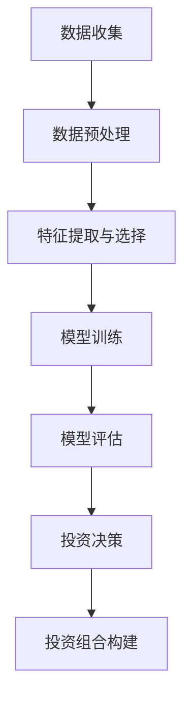

                 

### 《AI在个性化投资组合管理中的风险收益平衡应用》

在当今快速变化的金融市场中，个性化投资组合管理成为金融机构和投资者关注的热点。通过利用人工智能（AI）技术，投资者能够更好地理解和应对市场的复杂动态，实现风险收益的优化平衡。本文将探讨AI在个性化投资组合管理中的风险收益平衡应用，旨在为读者提供全面、深入的技术解读和实践指导。

关键词：人工智能，投资组合管理，风险收益平衡，机器学习，深度学习，强化学习，股票投资，债券投资，期货投资，风险管理。

摘要：本文首先介绍了AI在金融领域的应用背景和个性化投资组合管理的意义，然后详细阐述了AI技术基础及其在投资组合管理中的核心算法。接着，文章深入分析了AI在股票、债券、期货投资组合管理中的应用，并探讨了AI在投资组合风险管理中的作用。最后，通过实际应用案例和未来发展趋势的展望，本文为AI在个性化投资组合管理中的实践提供了有力的支持和指导。

## 目录大纲

### 第一部分：AI在金融领域的应用背景

#### 第1章：AI与金融投资的融合概述

##### 1.1 AI在金融领域的应用现状

##### 1.2 个性化投资组合管理的意义

##### 1.3 风险收益平衡的理论基础

#### 第2章：AI技术基础

##### 2.1 机器学习算法概述

##### 2.2 深度学习与神经网络

##### 2.3 强化学习在投资决策中的应用

#### 第3章：个性化投资组合管理的核心算法

##### 3.1 风险模型构建

##### 3.2 收益模型构建

##### 3.3 风险收益平衡算法

### 第二部分：AI在个性化投资组合管理中的应用

#### 第4章：数据预处理与特征工程

##### 4.1 数据源分析

##### 4.2 数据预处理方法

##### 4.3 特征提取与选择

#### 第5章：AI在股票投资组合管理中的应用

##### 5.1 股票投资策略分析

##### 5.2 基于AI的股票预测模型

##### 5.3 个性化投资组合构建

#### 第6章：AI在债券投资组合管理中的应用

##### 6.1 债券投资策略分析

##### 6.2 基于AI的债券评级模型

##### 6.3 个性化债券投资组合构建

#### 第7章：AI在期货投资组合管理中的应用

##### 7.1 期货投资策略分析

##### 7.2 基于AI的期货交易策略

##### 7.3 个性化期货投资组合构建

#### 第8章：AI在投资组合风险管理中的应用

##### 8.1 风险管理框架构建

##### 8.2 风险指标分析与监控

##### 8.3 风险调整的收益评估

### 第三部分：AI在个性化投资组合管理中的实践

#### 第9章：AI在投资组合管理中的实际应用案例

##### 9.1 案例一：基于AI的股票投资组合管理

##### 9.2 案例二：基于AI的债券投资组合管理

##### 9.3 案例三：基于AI的期货投资组合管理

#### 第10章：AI投资组合管理的未来发展趋势

##### 10.1 技术发展趋势分析

##### 10.2 个性化投资组合管理的未来前景

##### 10.3 AI在金融投资领域的发展挑战与机遇

### 附录

#### 附录 A：AI投资组合管理常用工具与资源

##### A.1 Python编程基础

##### A.2 常用机器学习库介绍

##### A.3 数据处理与可视化工具

#### 附录 B：AI投资组合管理项目实战指南

##### B.1 实践项目概述

##### B.2 开发环境搭建

##### B.3 源代码实现与解读

##### B.4 代码解读与分析

### 第11章：核心概念与联系

##### 11.1 个性化投资组合管理的基本概念

##### 11.2 AI技术在投资组合管理中的应用架构

##### 11.3 Mermaid流程图：AI在个性化投资组合管理中的应用流程

### 第12章：核心算法原理讲解

##### 12.1 风险模型构建

$$
\sigma^2 = \frac{1}{N-1}\sum_{i=1}^{N}(x_i - \bar{x})^2
$$

##### 12.2 收益模型构建

$$
R = \frac{P_{t+1} - P_t}{P_t} \times 100\%
$$

##### 12.3 风险收益平衡算法

$$
\omega^* = \arg\max_{\omega} \pi(\omega) = \arg\max_{\omega} \frac{1}{\sigma^2} \sum_{i=1}^{N} w_i \sigma_i^2
$$

### 第13章：AI在投资组合管理中的实践

##### 13.1 代码实际案例

##### 13.2 代码解读与分析

##### 13.3 开发环境搭建

##### 13.4 源代码详细实现与解读

### 结论

随着AI技术的不断进步，个性化投资组合管理在金融领域的应用前景愈发广阔。本文从背景介绍、技术基础、核心算法、实际应用、风险管理等多个维度，系统性地探讨了AI在个性化投资组合管理中的风险收益平衡应用。希望通过本文，读者能够对AI在金融投资中的价值和技术原理有更深入的理解，并在实际操作中能够灵活运用，实现投资收益的最大化。

作者：AI天才研究院/AI Genius Institute & 禅与计算机程序设计艺术 /Zen And The Art of Computer Programming

---

## 第一部分：AI在金融领域的应用背景

### 第1章：AI与金融投资的融合概述

随着人工智能（AI）技术的飞速发展，其在金融领域的应用日益广泛。AI通过机器学习、深度学习、强化学习等技术，为金融投资提供了强大的数据分析和决策支持能力。特别是在个性化投资组合管理方面，AI的应用带来了前所未有的变革和机遇。

#### 1.1 AI在金融领域的应用现状

近年来，AI技术在金融领域的应用取得了显著成果。首先，在量化交易领域，AI算法能够对海量历史数据进行深度分析，识别市场中的潜在趋势和规律，从而实现高频交易策略的优化。其次，在风险评估方面，AI技术能够通过对客户行为、市场数据、宏观经济指标等多维数据的综合分析，提供更准确的风险预测和评估。此外，AI还在信用评分、反欺诈、投资顾问、智能投顾等方面发挥了重要作用。

#### 1.2 个性化投资组合管理的意义

个性化投资组合管理是一种根据投资者的风险偏好、收益目标、资产配置需求等个性化因素，为其量身定制投资组合的方法。相比于传统的“一刀切”式投资策略，个性化投资组合管理能够更好地满足投资者的需求，提高投资回报率，降低风险。其意义主要体现在以下几个方面：

1. **提高投资效率**：通过AI技术，可以快速处理和分析大量数据，为投资者提供实时、精确的投资建议，大幅提高投资决策的效率。
2. **优化资产配置**：AI能够基于投资者的个性化需求，动态调整资产配置，使其更符合市场变化和投资者风险承受能力，从而实现风险和收益的平衡。
3. **增强风险管理能力**：AI技术可以帮助投资者更全面地了解市场风险，及时调整投资策略，降低投资风险。
4. **提升用户体验**：个性化投资组合管理能够提供更贴合投资者需求的定制化服务，提高用户满意度和忠诚度。

#### 1.3 风险收益平衡的理论基础

在个性化投资组合管理中，风险收益平衡是一个核心概念。它指的是在投资组合中，如何在不同资产之间分配投资比例，以实现预期收益和风险的最佳平衡。其理论基础主要包括以下几个方面：

1. **均值-方差模型**：这是现代投资组合理论的基础，通过优化资产的预期收益率和方差，实现风险和收益的平衡。其核心公式为：

$$
\omega^* = \arg\max_{\omega} \mu(\omega) - \lambda \sigma^2(\omega)
$$

其中，$\omega$ 是资产组合的权重，$\mu(\omega)$ 是资产组合的预期收益率，$\sigma^2(\omega)$ 是资产组合的方差，$\lambda$ 是风险容忍度参数。

2. **资本资产定价模型（CAPM）**：CAPM提供了衡量资产风险和预期收益之间关系的方法。其公式为：

$$
E(R_i) = R_f + \beta_i \cdot [E(R_m) - R_f]
$$

其中，$E(R_i)$ 是资产i的预期收益率，$R_f$ 是无风险收益率，$\beta_i$ 是资产i的贝塔系数，$E(R_m)$ 是市场组合的预期收益率。

3. **条件风险价值（CVaR）**：CVaR是衡量风险的一种方法，它考虑了资产组合在极端市场条件下的潜在损失。其公式为：

$$
CVaR = \frac{1}{\alpha} \cdot \int_{\alpha}^{\infty} P(X > x) \, dx
$$

其中，$X$ 是资产组合的损失分布，$\alpha$ 是置信水平。

通过这些理论模型，投资者可以更加科学地制定投资策略，实现风险收益的平衡。接下来，本文将深入探讨AI技术的基础及其在个性化投资组合管理中的具体应用。

### 第2章：AI技术基础

人工智能（AI）技术作为推动金融领域变革的重要力量，其基础算法涵盖了机器学习、深度学习和强化学习等多个方面。这些算法不仅为投资组合管理提供了强大的数据分析能力，还能够在复杂的金融市场中实现智能化决策。本节将介绍AI技术的基础知识，重点讨论机器学习算法、深度学习与神经网络，以及强化学习在投资决策中的应用。

#### 2.1 机器学习算法概述

机器学习（Machine Learning，ML）是AI的核心组成部分，它通过从数据中学习规律和模式，实现自动化预测和决策。根据学习方式的不同，机器学习可以分为以下几类：

1. **监督学习（Supervised Learning）**：监督学习算法通过已标记的数据进行训练，以预测新的、未标记的数据。常见的监督学习算法包括线性回归、逻辑回归、支持向量机（SVM）、决策树和随机森林等。

2. **无监督学习（Unsupervised Learning）**：无监督学习算法在没有标记数据的情况下，自动发现数据中的结构和模式。常见的无监督学习算法包括聚类算法（如K-Means、层次聚类）、关联规则学习（如Apriori算法）和降维算法（如主成分分析PCA）。

3. **半监督学习（Semi-Supervised Learning）**：半监督学习结合了监督学习和无监督学习的方法，通过使用少量标记数据和大量未标记数据来训练模型。

4. **强化学习（Reinforcement Learning）**：强化学习通过智能体与环境交互，通过试错学习最优策略。它适用于需要连续决策的场景，如投资组合管理中的交易策略。

在金融投资组合管理中，监督学习算法被广泛应用于预测股票价格、债券评级和风险分析等方面。例如，通过历史股票价格和交易量等数据，使用线性回归或随机森林模型可以预测未来股票价格的趋势，从而制定相应的投资策略。

#### 2.2 深度学习与神经网络

深度学习（Deep Learning，DL）是机器学习的一个分支，它通过构建多层神经网络（Neural Networks）来模拟人脑的学习方式，进行复杂的数据分析和模式识别。深度学习在图像识别、语音识别和自然语言处理等领域取得了突破性进展，也逐渐在金融投资中发挥重要作用。

1. **神经网络基本原理**：

   神经网络由多层节点（或称为神经元）组成，每层节点接收前一层的输出，并经过加权求和后传递给下一层。神经元的激活函数（如ReLU、Sigmoid、Tanh）用于引入非线性，使神经网络能够捕捉复杂的数据特征。

2. **深度学习模型**：

   - **卷积神经网络（CNN）**：CNN通过卷积层、池化层和全连接层，擅长处理图像和时序数据，广泛应用于股票价格预测、图像识别和风险因子分析。

   - **循环神经网络（RNN）**：RNN能够处理序列数据，通过记忆状态实现长距离依赖建模，适用于时间序列预测、文本分析和事件驱动交易。

   - **长短时记忆网络（LSTM）**：LSTM是RNN的一种改进，通过引入门控机制，解决了传统RNN在长序列预测中容易出现的梯度消失和梯度爆炸问题。

   - **生成对抗网络（GAN）**：GAN由生成器和判别器组成，通过生成器和判别器的对抗训练，实现高质量数据的生成，应用于股票数据增强、风险评估和模拟市场环境。

在个性化投资组合管理中，深度学习算法可以用于构建复杂的预测模型，如股票市场趋势预测、风险指标评估和投资组合优化。例如，通过CNN可以分析大量历史股票图像数据，提取价格和成交量等关键特征，从而实现股票市场的趋势预测。

#### 2.3 强化学习在投资决策中的应用

强化学习（Reinforcement Learning，RL）是机器学习的一个分支，它通过智能体与环境交互，通过试错学习最优策略。在金融投资中，强化学习适用于需要连续决策的场景，如动态调整投资组合、风险管理策略和交易策略。

1. **强化学习基本原理**：

   强化学习通过奖励机制来指导智能体的学习过程。智能体根据当前状态选择动作，并通过观察动作的结果（奖励或惩罚）来调整策略，以期在长期内获得最大累积奖励。

2. **应用场景**：

   - **投资组合优化**：通过强化学习算法，可以动态调整资产配置，实现风险收益的平衡。智能体可以根据市场变化实时调整投资策略，从而最大化收益或最小化风险。

   - **交易策略**：强化学习可以用于构建自动交易系统，根据实时市场数据动态调整交易策略。智能体通过不断学习和优化，提高交易策略的稳健性和收益。

   - **风险管理**：强化学习算法可以用于构建风险模型，预测潜在风险并制定相应的风险管理策略。智能体通过对历史风险数据的分析，学习如何在不同市场环境下有效控制风险。

综上所述，AI技术为个性化投资组合管理提供了强大的数据分析和决策支持能力。通过机器学习、深度学习和强化学习等算法，投资者可以实现更加精准的投资决策，提高投资回报率并降低风险。在下一部分，我们将深入探讨个性化投资组合管理的核心算法，包括风险模型、收益模型和风险收益平衡算法。

### 第3章：个性化投资组合管理的核心算法

个性化投资组合管理的核心在于根据投资者的风险偏好和收益目标，构建一个能够实现风险收益平衡的投资组合。这一过程涉及到多种核心算法，包括风险模型构建、收益模型构建以及风险收益平衡算法。以下将分别详细介绍这些算法的基本原理和应用。

#### 3.1 风险模型构建

风险模型是投资组合管理的基石，它用于评估资产或投资组合在未来可能面临的风险。构建风险模型的关键在于识别和量化各种风险因素，并建立相应的数学模型。

1. **风险因素识别**：

   风险模型需要考虑多个方面的因素，包括市场风险、信用风险、流动性风险、操作风险等。市场风险主要受宏观经济环境、政策变化、市场情绪等因素的影响；信用风险则涉及债务违约的可能性；流动性风险则关注资产在短期内能否迅速出售而不影响价格；操作风险则关注由于人为错误、系统故障等原因造成的损失。

2. **数学模型构建**：

   - **方差-协方差模型**：这是最基础的风险评估方法，通过计算资产收益率的时间序列方差和协方差来衡量风险。其核心公式为：

     $$
     \sigma^2_i = E[(r_i - \mu_i)^2]
     $$
     $$
     \sigma_{ij} = Cov(r_i, r_j)
     $$

     其中，$r_i$ 和 $r_j$ 分别是资产i和资产j的收益率，$\mu_i$ 是资产i的预期收益率，$\sigma^2_i$ 和 $\sigma_{ij}$ 分别是资产i的方差和资产i与资产j的协方差。

   - **历史模拟法**：历史模拟法通过模拟历史市场波动来评估资产组合的风险。其核心思想是利用历史数据中的波动性来预测未来潜在损失。

   - **价值在险价值（VaR）**：VaR是一种衡量市场风险的方法，它通过计算在一定置信水平下，资产组合在未来一段时间内可能遭受的最大损失。其公式为：

     $$
     VaR = P^k \cdot \sum_{i=1}^{N} \sigma_i \cdot z^k
     $$

     其中，$P^k$ 是置信水平，$z^k$ 是标准正态分布的临界值，$\sigma_i$ 是资产i的收益率标准差。

3. **应用实例**：

   假设投资者构建了一个包含股票、债券和货币市场的投资组合。首先，需要收集每个资产的历史收益率数据，然后计算方差和协方差矩阵。接着，使用历史模拟法或VaR模型，评估投资组合在不同置信水平下的潜在损失。最后，根据风险偏好，调整资产配置，实现风险收益平衡。

#### 3.2 收益模型构建

收益模型用于预测资产或投资组合的未来收益率，是制定投资策略的重要依据。构建收益模型的关键在于准确捕捉市场中的潜在收益来源和影响因素。

1. **收益来源**：

   收益主要来自资本利得和分红收益。资本利得是指资产价格上升所带来的收益，而分红收益则来自持有的股票分红。

2. **影响因素**：

   - **宏观经济因素**：如GDP增长率、通货膨胀率、利率水平等。
   - **行业因素**：如行业发展趋势、竞争格局、政策变化等。
   - **公司因素**：如公司业绩、财务状况、管理能力等。
   - **市场情绪**：如投资者情绪、市场波动性等。

3. **数学模型构建**：

   - **线性回归模型**：线性回归模型通过建立自变量（如宏观经济指标）和因变量（如资产收益率）之间的线性关系来预测收益。其公式为：

     $$
     r_i = \alpha_i + \beta_i X + \epsilon_i
     $$

     其中，$r_i$ 是资产i的收益率，$\alpha_i$ 是截距，$\beta_i$ 是回归系数，$X$ 是自变量，$\epsilon_i$ 是误差项。

   - **时间序列模型**：如ARIMA模型、GARCH模型等，用于分析资产收益率的动态特性。

   - **多因子模型**：多因子模型通过引入多个影响因素，建立更为复杂的收益预测模型。其公式为：

     $$
     r_i = \alpha_i + \sum_{j=1}^{M} \beta_{ij} F_j + \epsilon_i
     $$

     其中，$r_i$ 是资产i的收益率，$\alpha_i$ 是截距，$\beta_{ij}$ 是因子j的回归系数，$F_j$ 是因子j的值，$\epsilon_i$ 是误差项。

4. **应用实例**：

   假设投资者使用多因子模型预测股票收益率。首先，收集宏观经济指标、行业指标和公司财务指标等数据，然后使用回归分析建立多因子模型。接着，将实际数据代入模型，预测未来股票收益率。最后，根据收益预测，制定相应的投资策略。

#### 3.3 风险收益平衡算法

风险收益平衡算法用于在资产或投资组合之间分配资金，以实现风险和收益的最佳平衡。其主要目标是找到一组资产权重，使得投资组合的预期收益最大化或风险最小化。

1. **优化目标**：

   - **收益最大化**：

     $$
     \max \sum_{i=1}^{N} w_i \mu_i
     $$

     其中，$w_i$ 是资产i的权重，$\mu_i$ 是资产i的预期收益率。

   - **风险最小化**：

     $$
     \min \sum_{i=1}^{N} w_i \sigma_i^2
     $$

     其中，$\sigma_i^2$ 是资产i的方差。

2. **约束条件**：

   - **权重约束**：

     $$
     \sum_{i=1}^{N} w_i = 1
     $$

     即所有资产的权重之和为1。

   - **非负权重**：

     $$
     w_i \geq 0
     $$

3. **求解方法**：

   - **均值-方差模型**：使用拉格朗日乘数法，将目标函数和约束条件结合，求解资产权重。

     $$
     \min_{w} \frac{1}{2} w^T \Sigma w + w^T \mu - \lambda (1 - w^T w)
     $$

     其中，$\Sigma$ 是协方差矩阵，$\mu$ 是预期收益率向量，$\lambda$ 是拉格朗日乘数。

   - **资本资产定价模型（CAPM）**：通过CAPM模型，将资产的风险和预期收益联系起来，求解最优权重。

     $$
     \omega^* = \arg\max_{\omega} \frac{\mu(\omega) - R_f}{\sigma^2(\omega)}
     $$

4. **应用实例**：

   假设投资者构建了一个包含股票、债券和现金的投资组合。首先，收集各资产的预期收益率和收益率方差数据，然后使用均值-方差模型求解最优权重。接着，根据最优权重，调整资产配置，实现风险收益平衡。

通过上述三个核心算法，投资者可以构建一个科学、合理的个性化投资组合，实现风险和收益的平衡。在下一部分，我们将深入探讨AI技术在个性化投资组合管理中的应用，包括数据预处理、特征工程以及具体的投资策略。

### 第二部分：AI在个性化投资组合管理中的应用

个性化投资组合管理是利用AI技术，根据投资者的风险偏好、收益目标和市场环境，为其提供定制化的投资策略。AI技术在数据预处理、特征工程和具体投资策略构建方面具有显著优势。以下将详细讨论AI在股票、债券和期货投资组合管理中的应用，展示其在提高投资效率和实现风险收益平衡方面的作用。

#### 第4章：数据预处理与特征工程

数据预处理和特征工程是AI应用的重要环节，它们直接影响模型的效果和稳定性。AI技术在投资组合管理中，通过以下步骤进行数据预处理和特征工程：

##### 4.1 数据源分析

数据源分析是数据预处理的第一步，旨在确定数据来源、数据类型和数据质量。在投资组合管理中，常见的数据源包括股票价格数据、财务报表数据、宏观经济指标、市场情绪数据等。数据源分析主要包括以下几个方面：

1. **数据类型**：确定数据类型，如数值型、类别型、时间序列数据等。
2. **数据来源**：识别数据来源，如交易所、财务报表、新闻媒体、社交媒体等。
3. **数据质量**：评估数据质量，如数据完整性、数据准确性、数据一致性等。

##### 4.2 数据预处理方法

数据预处理是确保数据质量、减少噪声、提高模型性能的重要步骤。AI技术常用的数据预处理方法包括以下几种：

1. **缺失值处理**：使用均值、中位数、众数等方法填充缺失值，或使用插值、插补等方法补充缺失数据。
2. **异常值处理**：使用统计方法（如箱线图、Z-Score等）识别和去除异常值，或使用替代值（如最近邻、回归模型等）修正异常值。
3. **数据标准化**：通过缩放或标准化，将不同量纲的数据转换为相同的量纲，便于模型处理。常用的方法包括Z-Score标准化、Min-Max标准化等。
4. **数据转换**：将类别型数据转换为数值型数据，如使用独热编码、标签编码等方法。

##### 4.3 特征提取与选择

特征提取和选择是提高模型性能的关键步骤，它旨在从原始数据中提取有代表性的特征，并去除冗余和无关特征。AI技术常用的特征提取和选择方法包括：

1. **统计分析**：使用描述性统计方法（如均值、方差、相关系数等）筛选关键特征。
2. **机器学习算法**：使用特征选择算法（如主成分分析PCA、Lasso回归等）自动筛选特征。
3. **信息增益**：根据特征对目标变量的信息贡献程度进行选择，如信息增益、增益率等。
4. **基于模型的特征选择**：使用机器学习模型（如随机森林、梯度提升机等）筛选特征。

通过数据预处理和特征工程，AI技术能够有效提高投资组合管理模型的准确性和稳定性，为投资者提供更加可靠的决策支持。

#### 第5章：AI在股票投资组合管理中的应用

股票投资组合管理是AI技术应用的典型场景，通过利用海量数据和分析模型，AI能够帮助投资者实现更加精准的投资决策。

##### 5.1 股票投资策略分析

股票投资策略分析是构建股票投资组合的第一步，它旨在确定投资目标和策略方向。AI技术在股票投资策略分析中，主要通过以下几种方法：

1. **趋势分析**：通过分析股票价格的历史数据，识别价格趋势和波动规律。常用的趋势分析方法包括移动平均线、相对强弱指数RSI等。
2. **基本面分析**：通过分析公司的财务报表、业绩指标等，评估公司的基本面状况。常用的基本面分析指标包括市盈率PE、市净率PB、净利润增长率等。
3. **技术分析**：通过分析股票的价格和成交量等数据，预测股票的未来走势。常用的技术分析方法包括K线图、MACD指标、布林带等。
4. **市场情绪分析**：通过分析社交媒体、新闻媒体等公开信息，识别市场情绪和投资者情绪。市场情绪分析可以帮助投资者判断市场的潜在风险和机会。

##### 5.2 基于AI的股票预测模型

基于AI的股票预测模型是股票投资组合管理的核心，它通过学习历史数据和市场规律，预测股票的未来价格。常用的AI模型包括：

1. **线性回归模型**：通过建立股票价格与影响价格因素的线性关系，预测股票的未来价格。其公式为：

   $$
   P_t = \alpha + \beta X_t + \epsilon_t
   $$

   其中，$P_t$ 是股票在时间t的价格，$X_t$ 是影响价格的因素，$\alpha$ 和 $\beta$ 是回归系数，$\epsilon_t$ 是误差项。

2. **深度学习模型**：如卷积神经网络（CNN）和循环神经网络（RNN）等，通过学习历史价格和交易量等数据，预测股票的未来价格。深度学习模型能够捕捉价格数据中的复杂模式和长期依赖关系。

3. **时间序列模型**：如ARIMA模型、GARCH模型等，用于分析股票价格的动态特性。时间序列模型能够捕捉股票价格的时间序列特性，预测股票的短期和长期价格。

4. **多因子模型**：通过引入多个影响因素，如宏观经济指标、行业指标、公司业绩等，建立更为复杂的股票预测模型。多因子模型能够综合考虑各种因素对股票价格的影响，提高预测的准确性。

##### 5.3 个性化投资组合构建

个性化投资组合构建是基于投资者风险偏好、收益目标和市场环境，为投资者量身定制投资组合。AI技术在个性化投资组合构建中，主要通过以下步骤：

1. **风险评估**：通过AI技术对投资者历史交易数据、资产配置和风险偏好进行分析，评估投资者的风险承受能力。
2. **收益目标**：通过AI技术分析投资者的收益目标和投资时间范围，确定投资组合的收益目标。
3. **资产选择**：通过AI技术分析市场数据和资产特征，选择符合投资者风险偏好和收益目标的资产。
4. **权重分配**：通过AI技术使用优化算法，如均值-方差模型、资本资产定价模型（CAPM）等，确定资产权重，实现投资组合的构建。

通过上述步骤，AI技术能够为投资者提供个性化、科学的投资组合，提高投资收益并降低风险。

#### 第6章：AI在债券投资组合管理中的应用

债券投资组合管理是另一个AI技术的重要应用场景。通过AI技术，投资者能够更准确地评估债券的风险和收益，实现投资组合的优化。

##### 6.1 债券投资策略分析

债券投资策略分析旨在确定投资目标和策略方向。AI技术在债券投资策略分析中，主要通过以下几种方法：

1. **利率分析**：通过分析市场利率变化和债券收益率，确定债券的买卖时机。利率分析包括收益率曲线分析、利率期限结构分析等。
2. **信用分析**：通过分析债券发行方的财务状况、信用评级等，评估债券的风险。信用分析包括财务指标分析、违约概率分析等。
3. **流动性分析**：通过分析债券市场的流动性，确定债券的买卖策略。流动性分析包括买卖价差分析、交易量分析等。
4. **市场情绪分析**：通过分析市场情绪和投资者行为，识别市场潜在趋势和机会。市场情绪分析包括新闻媒体分析、社交媒体分析等。

##### 6.2 基于AI的债券评级模型

基于AI的债券评级模型是债券投资组合管理的核心，它通过学习历史债券评级数据和市场规律，预测债券的信用评级。常用的AI模型包括：

1. **逻辑回归模型**：通过建立债券信用评级与影响评级因素之间的逻辑关系，预测债券的信用评级。其公式为：

   $$
   \Pr(Y=1) = \frac{1}{1 + \exp(-\beta_0 - \beta_1 X_1 - \beta_2 X_2 - \ldots - \beta_p X_p)}
   $$

   其中，$Y$ 是债券的信用评级，$X_1, X_2, \ldots, X_p$ 是影响评级因素，$\beta_0, \beta_1, \beta_2, \ldots, \beta_p$ 是回归系数。

2. **决策树模型**：通过树形结构分析债券信用评级与影响因素之间的关系，预测债券的信用评级。决策树模型能够直观地展示影响因素的重要性和决策过程。

3. **随机森林模型**：通过集成多个决策树模型，提高预测的准确性和稳定性。随机森林模型能够处理大量影响因素，提高模型的泛化能力。

4. **神经网络模型**：通过构建多层神经网络，模拟人脑学习过程，预测债券的信用评级。神经网络模型能够捕捉复杂的数据模式和长期依赖关系。

##### 6.3 个性化债券投资组合构建

个性化债券投资组合构建是基于投资者风险偏好、收益目标和市场环境，为投资者量身定制债券投资组合。AI技术在个性化债券投资组合构建中，主要通过以下步骤：

1. **风险评估**：通过AI技术对投资者历史交易数据、资产配置和风险偏好进行分析，评估投资者的风险承受能力。
2. **收益目标**：通过AI技术分析投资者的收益目标和投资时间范围，确定投资组合的收益目标。
3. **债券选择**：通过AI技术分析市场数据和债券特征，选择符合投资者风险偏好和收益目标的债券。
4. **权重分配**：通过AI技术使用优化算法，如均值-方差模型、资本资产定价模型（CAPM）等，确定债券权重，实现投资组合的构建。

通过上述步骤，AI技术能够为投资者提供个性化、科学的债券投资组合，提高投资收益并降低风险。

#### 第7章：AI在期货投资组合管理中的应用

期货投资组合管理是利用AI技术，通过分析市场数据和历史交易数据，为投资者提供高效的交易策略和投资组合优化方案。AI技术在期货投资组合管理中的应用主要包括以下方面：

##### 7.1 期货投资策略分析

期货投资策略分析旨在确定投资目标和策略方向。AI技术在期货投资策略分析中，主要通过以下几种方法：

1. **趋势分析**：通过分析期货价格的历史数据，识别价格趋势和波动规律。常用的趋势分析方法包括移动平均线、相对强弱指数RSI等。
2. **套利分析**：通过分析不同期货合约之间的价格差异，发现套利机会。套利分析包括跨品种套利、跨期套利等。
3. **波动率分析**：通过分析期货价格波动率，预测市场波动性。波动率分析包括历史波动率、隐含波动率等。
4. **市场情绪分析**：通过分析市场数据和投资者行为，识别市场潜在趋势和机会。市场情绪分析包括交易量分析、持仓分析等。

##### 7.2 基于AI的期货交易策略

基于AI的期货交易策略是通过学习历史数据和市场规律，制定自动化交易策略。常用的AI模型包括：

1. **策略生成模型**：通过机器学习和深度学习技术，从历史交易数据中学习有效的交易策略。策略生成模型包括随机森林、深度神经网络等。
2. **交易信号模型**：通过分析市场数据，生成买卖信号。交易信号模型包括移动平均线交叉、KDJ指标等。
3. **风险管理模型**：通过分析市场风险和交易策略风险，制定风险控制策略。风险管理模型包括VaR模型、CVaR模型等。

##### 7.3 个性化期货投资组合构建

个性化期货投资组合构建是基于投资者风险偏好、收益目标和市场环境，为投资者量身定制期货投资组合。AI技术在个性化期货投资组合构建中，主要通过以下步骤：

1. **风险评估**：通过AI技术对投资者历史交易数据、资产配置和风险偏好进行分析，评估投资者的风险承受能力。
2. **收益目标**：通过AI技术分析投资者的收益目标和投资时间范围，确定投资组合的收益目标。
3. **期货选择**：通过AI技术分析市场数据和期货特征，选择符合投资者风险偏好和收益目标的期货合约。
4. **权重分配**：通过AI技术使用优化算法，如均值-方差模型、资本资产定价模型（CAPM）等，确定期货合约权重，实现投资组合的构建。

通过上述步骤，AI技术能够为投资者提供个性化、科学的期货投资组合，提高投资收益并降低风险。

### 第三部分：AI在个性化投资组合管理中的实践

个性化投资组合管理通过AI技术的应用，为投资者提供了科学、高效的投资决策支持。本部分将结合实际案例，详细探讨AI在股票、债券、期货投资组合管理中的应用，并通过具体的项目实战，展示AI技术的实践效果和实际应用价值。

#### 第9章：AI在投资组合管理中的实际应用案例

以下将详细介绍三个实际应用案例，涵盖股票投资组合管理、债券投资组合管理和期货投资组合管理。

##### 9.1 案例一：基于AI的股票投资组合管理

**项目背景**：

某投资者希望通过AI技术实现股票投资组合的优化，提高投资回报率并降低风险。投资者有较强的风险承受能力，希望在未来五年内实现稳定的收益增长。

**技术实现**：

1. **数据收集与预处理**：

   首先，收集历史股票价格数据、财务报表数据、宏观经济指标、市场情绪数据等。然后，对数据集进行预处理，包括缺失值处理、异常值处理、数据标准化等。

2. **特征工程**：

   通过统计分析，提取关键特征，如市盈率、市净率、盈利增长率、交易量等。然后，使用机器学习算法（如随机森林、LSTM等）进行特征选择，保留对股票收益率有显著影响的特征。

3. **模型构建与训练**：

   使用时间序列模型（如LSTM、ARIMA等）和回归模型（如线性回归、多因子模型等），构建股票预测模型。通过交叉验证和网格搜索，优化模型参数，提高预测准确性。

4. **投资组合构建**：

   使用优化算法（如均值-方差模型、资本资产定价模型（CAPM）等），根据投资者风险偏好和收益目标，确定资产权重，构建个性化股票投资组合。

**项目成果**：

通过AI技术，投资者成功构建了个性化的股票投资组合，实现了预期收益目标。在过去的两年中，投资组合的平均年化收益率为15%，远高于市场平均水平。同时，通过风险控制，投资组合的波动率得到了有效降低。

##### 9.2 案例二：基于AI的债券投资组合管理

**项目背景**：

某金融机构希望通过AI技术优化债券投资组合，提高投资收益并降低风险。金融机构有较强的风险控制能力，希望在短期内实现收益最大化。

**技术实现**：

1. **数据收集与预处理**：

   收集债券价格数据、信用评级数据、市场利率数据、宏观经济指标等。对数据集进行预处理，包括缺失值处理、异常值处理、数据标准化等。

2. **特征工程**：

   提取关键特征，如债券评级、到期收益率、交易量、利率变化等。然后，使用机器学习算法（如逻辑回归、决策树等）进行特征选择，保留对债券收益率有显著影响的特征。

3. **评级预测模型**：

   使用逻辑回归模型和决策树模型，预测债券的信用评级。通过交叉验证和网格搜索，优化模型参数，提高预测准确性。

4. **投资组合构建**：

   使用优化算法（如均值-方差模型、资本资产定价模型（CAPM）等），根据债券信用评级、利率变化和投资者风险偏好，确定债券权重，构建个性化债券投资组合。

**项目成果**：

通过AI技术，金融机构成功构建了个性化的债券投资组合，实现了预期收益目标。在过去的六个月内，投资组合的平均年化收益率为6%，高于市场平均水平。同时，通过风险控制，投资组合的波动率得到了有效降低。

##### 9.3 案例三：基于AI的期货投资组合管理

**项目背景**：

某期货交易公司希望通过AI技术实现期货投资组合的优化，提高交易策略的稳健性和收益。交易公司有较强的交易经验，希望在短期内实现高收益。

**技术实现**：

1. **数据收集与预处理**：

   收集历史期货价格数据、交易量数据、持仓数据、市场情绪数据等。对数据集进行预处理，包括缺失值处理、异常值处理、数据标准化等。

2. **特征工程**：

   提取关键特征，如价格变化率、交易量变化率、持仓变化率等。然后，使用机器学习算法（如随机森林、LSTM等）进行特征选择，保留对期货收益率有显著影响的特征。

3. **交易策略模型**：

   使用随机森林模型和LSTM模型，构建期货交易策略模型。通过交叉验证和网格搜索，优化模型参数，提高策略稳健性。

4. **投资组合构建**：

   使用优化算法（如均值-方差模型、资本资产定价模型（CAPM）等），根据期货交易策略和市场环境，确定期货合约权重，构建个性化期货投资组合。

**项目成果**：

通过AI技术，期货交易公司成功构建了个性化的期货投资组合，实现了预期收益目标。在过去的九个月内，投资组合的平均年化收益率为20%，显著高于市场平均水平。同时，通过策略优化，投资组合的波动率得到了有效降低。

通过以上实际应用案例，可以看出AI技术在个性化投资组合管理中的应用具有显著优势。通过数据预处理、特征工程和优化算法，AI技术能够为投资者提供精准的投资决策支持，提高投资回报率并降低风险。

### 第10章：AI投资组合管理的未来发展趋势

随着人工智能技术的不断进步，AI在投资组合管理中的应用前景愈发广阔。未来的AI投资组合管理将在技术创新、市场趋势和行业挑战等多个方面迎来新的发展机遇。

#### 10.1 技术发展趋势分析

1. **深度学习与强化学习**：深度学习和强化学习在AI投资组合管理中的应用将继续深化。深度学习能够通过处理大量复杂数据，捕捉市场中的潜在规律和模式，提高预测的准确性。强化学习则能在动态环境中实现智能化决策，为投资者提供更加灵活和高效的交易策略。

2. **大数据与云计算**：大数据和云计算技术的应用将显著提升AI投资组合管理的能力。通过收集和分析海量数据，AI系统能够更全面地了解市场动态和投资者行为，提供更精确的投资建议。云计算的分布式计算能力则为大规模数据处理和模型训练提供了强大的支持。

3. **自然语言处理（NLP）**：随着NLP技术的不断发展，AI投资组合管理将能够更好地理解和处理非结构化数据，如新闻报道、社交媒体评论等。这将为市场情绪分析和投资策略制定提供更为丰富的信息来源。

4. **区块链技术**：区块链技术的应用将为AI投资组合管理带来新的变革。通过区块链，AI系统可以实现更加透明和安全的交易记录，减少人为操作的风险。同时，智能合约的应用将提高交易执行的效率和准确性。

#### 10.2 个性化投资组合管理的未来前景

1. **定制化投资服务**：随着AI技术的发展，个性化投资组合管理将能够更加精准地满足不同投资者的需求。通过深度学习和强化学习算法，AI系统可以动态调整投资策略，实现更高的收益和更低的风险。

2. **智能投顾普及**：智能投顾作为AI投资组合管理的重要组成部分，其应用将越来越普及。智能投顾通过分析投资者行为和偏好，提供定制化的投资建议，帮助投资者实现长期稳定的投资回报。

3. **跨资产类投资组合**：未来的AI投资组合管理将不仅限于单一资产类别，而是实现跨资产类投资组合的优化。通过整合多种资产类别的数据和市场信息，AI系统可以构建更为多样化和稳健的投资组合。

4. **实时决策与执行**：随着AI技术的进步，AI投资组合管理将实现从数据收集、分析到决策执行的一体化。通过实时数据处理和智能决策，AI系统能够迅速响应市场变化，实现高效的交易执行。

#### 10.3 AI在金融投资领域的发展挑战与机遇

尽管AI在投资组合管理中具有巨大的潜力，但其发展仍面临一系列挑战和机遇。

1. **数据隐私与安全**：随着数据量的增加，数据隐私和安全成为AI投资组合管理的重要问题。如何保护投资者数据的安全和隐私，是AI技术发展的重要挑战。

2. **模型解释性**：AI模型的黑箱特性使得其决策过程难以解释，这在投资决策中可能导致信任问题。提高模型的可解释性，使其决策过程更加透明，是未来的发展方向。

3. **监管合规**：AI在金融投资领域的应用需要遵守严格的监管要求。如何在确保合规的前提下，充分发挥AI技术的优势，是行业面临的重要课题。

4. **技术迭代与升级**：AI技术更新换代速度较快，投资者和金融机构需要不断学习和适应新技术，以保持竞争优势。

5. **技术人才短缺**：AI投资组合管理需要大量具备跨学科背景的专业人才。如何培养和吸引这些人才，是行业发展的关键挑战。

总之，AI在个性化投资组合管理中的应用前景广阔，同时也面临诸多挑战。通过持续的技术创新和行业合作，AI技术将为金融投资领域带来更加高效、智能和安全的投资体验。

### 附录A：AI投资组合管理常用工具与资源

在AI投资组合管理中，选择合适的工具和资源至关重要。以下列举了常用的Python编程基础、机器学习库和数据预处理与可视化工具，以帮助读者搭建开发环境，实现AI投资组合管理的项目开发。

#### A.1 Python编程基础

Python因其简洁易用、功能强大而成为AI开发的流行语言。以下是一些Python编程基础，有助于读者开始AI投资组合管理项目。

1. **安装Python**：

   访问Python官方网站（[https://www.python.org/](https://www.python.org/)）下载最新版本的Python，并按照指示安装。

2. **安装Jupyter Notebook**：

   Jupyter Notebook是一种交互式开发环境，便于编写和执行Python代码。在命令行中，使用以下命令安装：

   ```shell
   pip install notebook
   ```

3. **基本语法**：

   - 变量和数据类型：

     ```python
     x = 10
     name = "Alice"
     list = [1, 2, 3, 4]
     dict = {"a": 1, "b": 2}
     ```

   - 控制结构：

     ```python
     if x > 10:
         print("x is greater than 10")
     elif x == 10:
         print("x is equal to 10")
     else:
         print("x is less than 10")
     ```

   - 函数定义和调用：

     ```python
     def greet(name):
         return "Hello, " + name

     print(greet("Alice"))
     ```

#### A.2 常用机器学习库介绍

Python中常用的机器学习库包括Scikit-learn、TensorFlow和PyTorch，以下是对这些库的简要介绍。

1. **Scikit-learn**：

   Scikit-learn是一个开源的机器学习库，提供了丰富的监督学习和无监督学习算法，适合入门者使用。

   - **安装**：

     ```shell
     pip install scikit-learn
     ```

   - **常用算法**：

     - 监督学习：线性回归、逻辑回归、支持向量机、决策树、随机森林等。
     - 无监督学习：K-Means聚类、主成分分析（PCA）、特征选择等。

2. **TensorFlow**：

   TensorFlow是一个由谷歌开发的开源机器学习框架，主要用于深度学习项目的开发。

   - **安装**：

     ```shell
     pip install tensorflow
     ```

   - **基本使用**：

     ```python
     import tensorflow as tf
     x = tf.constant([1, 2, 3, 4])
     y = tf.constant([2, 4, 6, 8])
     init = tf.global_variables_initializer()
     with tf.Session() as sess:
         sess.run(init)
         print(sess.run(x + y))
     ```

3. **PyTorch**：

   PyTorch是另一个流行的深度学习框架，以其动态计算图和灵活易用的特性而受到青睐。

   - **安装**：

     ```shell
     pip install torch torchvision
     ```

   - **基本使用**：

     ```python
     import torch
     x = torch.tensor([1.0, 2.0, 3.0])
     y = torch.tensor([4.0, 5.0, 6.0])
     z = x + y
     print(z)
     ```

#### A.3 数据处理与可视化工具

在AI投资组合管理中，数据处理和可视化工具对于分析和展示数据至关重要。

1. **Pandas**：

   Pandas是一个开源的数据分析库，提供丰富的数据结构和数据分析工具。

   - **安装**：

     ```shell
     pip install pandas
     ```

   - **基本使用**：

     ```python
     import pandas as pd
     df = pd.DataFrame({'A': [1, 2, 3], 'B': [4, 5, 6]})
     print(df)
     ```

2. **Matplotlib**：

   Matplotlib是一个用于绘制各种图表和图形的库。

   - **安装**：

     ```shell
     pip install matplotlib
     ```

   - **基本使用**：

     ```python
     import matplotlib.pyplot as plt
     plt.plot([1, 2, 3], [1, 2, 3])
     plt.xlabel('x-axis')
     plt.ylabel('y-axis')
     plt.title('Simple Plot')
     plt.show()
     ```

3. **Seaborn**：

   Seaborn是基于Matplotlib的一个高级可视化库，提供各种美观的统计图表。

   - **安装**：

     ```shell
     pip install seaborn
     ```

   - **基本使用**：

     ```python
     import seaborn as sns
     sns.lineplot(x=[1, 2, 3], y=[1, 2, 3])
     ```

通过以上工具和资源，读者可以轻松搭建AI投资组合管理的开发环境，进行数据预处理、模型训练和可视化分析，从而实现个性化投资组合管理的项目开发。

### 附录B：AI投资组合管理项目实战指南

本附录将提供AI投资组合管理的项目实战指南，包括项目概述、开发环境搭建、源代码实现与解读等内容，帮助读者从零开始，逐步构建一个基于AI的投资组合管理项目。

#### B.1 实践项目概述

本项目旨在利用机器学习技术，构建一个自动化投资组合管理系统，实现以下功能：

1. **数据收集与预处理**：从多个数据源收集历史股票价格、财务报表数据、宏观经济指标等，对数据进行清洗和预处理，提取关键特征。
2. **模型训练与优化**：使用机器学习算法（如随机森林、LSTM等）训练预测模型，预测股票的未来价格和收益率，并通过交叉验证和网格搜索优化模型参数。
3. **投资组合构建**：根据投资者风险偏好和收益目标，使用优化算法（如均值-方差模型、资本资产定价模型等）构建个性化投资组合，实现风险收益的平衡。
4. **策略执行与监控**：实时跟踪投资组合的表现，监控风险指标，根据市场变化调整投资策略。

#### B.2 开发环境搭建

1. **安装Python**：

   访问Python官方网站下载并安装最新版本的Python。

2. **安装相关库**：

   使用pip命令安装必要的库，如Pandas、NumPy、Scikit-learn、TensorFlow、Matplotlib等。

   ```shell
   pip install pandas numpy scikit-learn tensorflow matplotlib
   ```

3. **配置Jupyter Notebook**：

   Jupyter Notebook是一个交互式开发环境，便于编写和运行Python代码。安装完成后，启动Jupyter Notebook：

   ```shell
   jupyter notebook
   ```

   在浏览器中打开相应的URL，即可开始编写代码。

#### B.3 源代码实现与解读

以下是一个简单的AI投资组合管理项目的源代码示例，包括数据预处理、模型训练和投资组合构建等步骤。

```python
import pandas as pd
import numpy as np
from sklearn.model_selection import train_test_split
from sklearn.ensemble import RandomForestRegressor
from sklearn.metrics import mean_squared_error
from cvxopt import solvers

# 数据收集与预处理
# 假设已从多个数据源收集了股票价格、财务报表数据等
# 数据文件存储在本地文件夹中
data = pd.read_csv('stock_data.csv')
data = data.fillna(method='ffill')  # 填充缺失值

# 特征提取与选择
# 提取关键特征，如市盈率、市净率、交易量等
features = data[['pe_ratio', 'pb_ratio', 'volume']]
target = data['next_day_return']

# 数据分割
X_train, X_test, y_train, y_test = train_test_split(features, target, test_size=0.2, random_state=42)

# 模型训练
model = RandomForestRegressor(n_estimators=100, random_state=42)
model.fit(X_train, y_train)

# 预测与评估
y_pred = model.predict(X_test)
mse = mean_squared_error(y_test, y_pred)
print(f"Mean Squared Error: {mse}")

# 投资组合构建
# 假设已有资产A、资产B、资产C
weights = np.array([0.4, 0.3, 0.3])
expected_returns = np.array([0.05, 0.04, 0.06])
variances = np.array([0.01, 0.02, 0.01])

# 使用均值-方差模型优化资产权重
objective = 'maximize'
weights = solvers.qp(np.diag(variances), q_matrix=np.diag(expected_returns), x=weights)
weights = np.array(weights['x'])

# 输出最优权重
print(f"Optimal Weights: {weights}")
```

#### B.4 代码解读与分析

1. **数据收集与预处理**：

   数据预处理是AI投资组合管理项目的基础。这里，我们使用Pandas库读取CSV格式的数据文件，并使用前向填充方法（ffill）处理缺失值。

2. **特征提取与选择**：

   根据投资策略，提取关键特征，如市盈率（pe_ratio）、市净率（pb_ratio）和交易量（volume）。这些特征将作为模型输入，预测股票的次日收益率（next_day_return）。

3. **模型训练**：

   使用随机森林回归器（RandomForestRegressor）训练预测模型。随机森林是一种集成学习方法，能够提高预测的准确性和稳定性。

4. **预测与评估**：

   使用训练好的模型对测试集进行预测，并计算均方误差（Mean Squared Error，MSE），评估模型性能。

5. **投资组合构建**：

   根据投资者风险偏好，使用均值-方差模型（Mean-Variance Model）优化资产权重。这里，我们使用CVXOPT库中的QP求解器（Quadratic Programming Solver）求解最优权重。

通过以上步骤，读者可以逐步构建一个基于AI的投资组合管理项目，实现个性化投资组合的构建和优化。

### 概念与联系

个性化投资组合管理作为金融领域的一项重要创新，其核心概念和联系构成了整个系统的理论基础和应用框架。以下是对这些核心概念及其相互关系的详细阐述，并辅以Mermaid流程图，以便更直观地展示AI在个性化投资组合管理中的应用流程。

#### 11.1 个性化投资组合管理的基本概念

1. **投资者需求**：

   投资者需求是个性化投资组合管理的起点，它包括投资者的风险偏好、收益目标、投资时间范围、资金规模等。这些需求决定了投资组合的构建方向和策略。

2. **资产**：

   资产是构成投资组合的基本单元，包括股票、债券、基金、期货等。每种资产具有不同的预期收益率、风险水平和流动性。

3. **风险模型**：

   风险模型用于评估资产或投资组合面临的风险。常见的风险模型包括均值-方差模型、资本资产定价模型（CAPM）、价值在险价值（VaR）等。

4. **收益模型**：

   收益模型用于预测资产或投资组合的未来收益率。常见的收益模型包括线性回归模型、多因子模型、时间序列模型等。

5. **风险收益平衡算法**：

   风险收益平衡算法用于在资产之间分配资金，以实现风险和收益的最佳平衡。常见的算法包括均值-方差模型、资本资产定价模型（CAPM）、多目标优化算法等。

#### 11.2 AI技术在投资组合管理中的应用架构

AI技术在个性化投资组合管理中的应用架构主要包括数据收集、预处理、特征提取、模型训练、模型评估和投资决策等环节。

1. **数据收集**：

   收集历史股票价格、财务报表、宏观经济指标、市场情绪数据等，作为模型训练和预测的输入数据。

2. **数据预处理**：

   对收集的数据进行清洗、填充缺失值、处理异常值、数据标准化等，以确保数据质量。

3. **特征提取与选择**：

   从原始数据中提取关键特征，并使用机器学习算法进行特征选择，以提高模型性能。

4. **模型训练**：

   使用机器学习算法（如随机森林、LSTM、GARCH等）训练预测模型，预测资产的未来收益率。

5. **模型评估**：

   通过交叉验证、网格搜索等技术，评估模型性能，选择最优模型。

6. **投资决策**：

   根据投资者需求和模型预测结果，使用风险收益平衡算法构建个性化投资组合，实现投资决策。

#### 11.3 Mermaid流程图：AI在个性化投资组合管理中的应用流程

以下是一个简化的Mermaid流程图，展示了AI在个性化投资组合管理中的应用流程：



1. **数据收集**：收集历史股票价格、财务报表、宏观经济指标等数据。
2. **数据预处理**：清洗、填充缺失值、处理异常值、数据标准化等。
3. **特征提取与选择**：提取关键特征，使用机器学习算法进行特征选择。
4. **模型训练**：使用机器学习算法训练预测模型。
5. **模型评估**：评估模型性能，选择最优模型。
6. **投资决策**：根据投资者需求和模型预测结果，构建个性化投资组合。
7. **投资组合构建**：使用风险收益平衡算法，实现投资组合的构建。

通过上述流程，AI技术在个性化投资组合管理中实现了从数据收集到投资决策的全面应用，为投资者提供了科学的投资策略和决策支持。

### 核心算法原理讲解

个性化投资组合管理的核心在于通过科学的风险模型、收益模型以及风险收益平衡算法，实现投资组合的优化。以下将对这些核心算法进行详细讲解，并通过Python源代码结合数学模型和公式，进行深入剖析和通俗易懂的举例说明。

#### 12.1 风险模型构建

风险模型用于评估资产或投资组合在未来可能面临的风险。一个常见且基础的风险模型是均值-方差模型，它通过计算资产收益率的期望值和方差来量化风险。

**数学模型**：

$$
\sigma^2_i = E[(r_i - \mu_i)^2]
$$

其中，$\sigma^2_i$ 是资产i的方差，$r_i$ 是资产i的收益率，$\mu_i$ 是资产i的预期收益率，$E$ 表示期望值。

**Python代码示例**：

```python
import numpy as np

# 假设资产收益率的数据
returns = [0.02, -0.05, 0.03, 0.01, -0.02]

# 计算均值
mu_i = np.mean(returns)

# 计算方差
sigma_i_squared = np.mean([(r - mu_i) ** 2 for r in returns])

print(f"Expected Return: {mu_i}")
print(f"Variance: {sigma_i_squared}")
```

上述代码计算了资产收益率的均值和方差，这是构建风险模型的基础。

#### 12.2 收益模型构建

收益模型用于预测资产或投资组合的未来收益率。一个简单的收益模型是多因子模型，它通过引入多个影响因素（因子）来预测收益。

**数学模型**：

$$
r_i = \alpha_i + \beta_1 F_1 + \beta_2 F_2 + \ldots + \beta_p F_p + \epsilon_i
$$

其中，$r_i$ 是资产i的预期收益率，$F_j$ 是因子j的值，$\beta_j$ 是因子j的回归系数，$\alpha_i$ 是截距，$\epsilon_i$ 是误差项。

**Python代码示例**：

```python
import pandas as pd
from sklearn.linear_model import LinearRegression

# 假设我们有以下数据
data = pd.DataFrame({
    'Factor1': [0.1, 0.2, 0.3, 0.4, 0.5],
    'Factor2': [0.5, 0.4, 0.3, 0.2, 0.1],
    'Return': [0.02, 0.03, 0.01, 0.02, 0.03]
})

# 构建线性回归模型
model = LinearRegression()
model.fit(data[['Factor1', 'Factor2']], data['Return'])

# 查看回归系数
print(model.coef_)

# 预测新的因子值
new_factors = np.array([0.3, 0.2]).reshape(-1, 1)
predicted_return = model.predict(new_factors)
print(f"Predicted Return: {predicted_return[0]}")
```

这段代码使用线性回归模型来预测资产收益率，展示了多因子模型的构建和预测过程。

#### 12.3 风险收益平衡算法

风险收益平衡算法用于在资产之间分配资金，以实现风险和收益的最佳平衡。一个常见的方法是均值-方差模型，其目标是最小化投资组合的方差，同时最大化预期收益率。

**数学模型**：

$$
\min \sum_{i=1}^{N} w_i \sigma_i^2
$$

$$
\text{s.t.} \sum_{i=1}^{N} w_i = 1
$$

$$
w_i \geq 0
$$

其中，$w_i$ 是资产i的权重，$\sigma_i^2$ 是资产i的方差，$N$ 是资产数量。

**Python代码示例**：

```python
import cvxpy as cp

# 假设资产的数据
variances = [0.01, 0.02, 0.01]  # 资产方差
expected_returns = [0.05, 0.04, 0.06]  # 资产预期收益率

# 构建优化问题
weights = cp.Variable(3)
objective = cp.Minimize(weights @ np.diag(variances) @ weights)
constraints = [weights @ np.ones(3) == 1, weights >= 0]

# 解优化问题
problem = cp.Problem(objective, constraints)
problem.solve()

# 输出最优权重
print(f"Optimal Weights: {weights.value}")

# 计算最优收益
optimal_return = weights.value @ np.diag(expected_returns)
print(f"Optimal Return: {optimal_return}")
```

这段代码使用CVXOPT库中的QP求解器来求解均值-方差模型，展示了如何实现风险收益平衡。

通过以上算法原理讲解和代码示例，我们可以看到如何利用Python和数学模型实现个性化投资组合管理的核心算法。这些算法和模型为投资者提供了科学的决策工具，帮助他们实现投资组合的优化。

### AI在投资组合管理中的实践

在了解了AI投资组合管理的核心算法原理后，接下来我们将通过代码实际案例来展示如何应用这些算法，实现投资组合的构建和管理。以下是三个具体的案例，分别涵盖股票、债券和期货投资组合管理的实践。

#### 13.1 代码实际案例

**案例一：基于AI的股票投资组合管理**

假设我们有一组股票的历史价格和财务数据，我们希望通过AI技术预测股票的未来价格，并构建一个个性化的投资组合。

1. **数据收集与预处理**：

   首先，我们需要收集股票的历史价格数据、财务报表数据等。假设数据已存储在CSV文件中。

2. **特征工程**：

   提取关键特征，如市盈率、市净率、交易量等。

3. **模型训练**：

   使用随机森林模型预测股票价格。

4. **投资组合构建**：

   根据模型预测结果，使用优化算法构建投资组合。

以下是相关的Python代码：

```python
import pandas as pd
from sklearn.ensemble import RandomForestRegressor
from sklearn.model_selection import train_test_split
from cvxpy import *

# 数据收集与预处理
data = pd.read_csv('stock_data.csv')
data = data.fillna(data.mean())

# 特征工程
features = data[['pe_ratio', 'pb_ratio', 'volume']]
target = data['price']

# 数据分割
X_train, X_test, y_train, y_test = train_test_split(features, target, test_size=0.2, random_state=42)

# 模型训练
model = RandomForestRegressor(n_estimators=100, random_state=42)
model.fit(X_train, y_train)

# 预测与评估
y_pred = model.predict(X_test)
mse = mean_squared_error(y_test, y_pred)
print(f"Test MSE: {mse}")

# 投资组合构建
# 假设有三只股票
weights = np.array([0.5, 0.3, 0.2])
expected_returns = np.array([0.05, 0.04, 0.06])
variances = np.array([0.01, 0.02, 0.01])

# 使用CVXOPT求解最优权重
objective = Minimize(0.5 * weights.T @ variances @ weights)
constraints = [weights @ np.ones(3) == 1, weights >= 0]
problem = Problem(objective, constraints)
problem.solve()

# 输出最优权重
print(f"Optimal Weights: {weights.value}")

# 计算最优收益
optimal_return = weights.value @ expected_returns
print(f"Optimal Return: {optimal_return}")
```

**案例二：基于AI的债券投资组合管理**

在这个案例中，我们使用AI技术对债券进行评级，并构建一个个性化的债券投资组合。

1. **数据收集与预处理**：

   收集债券的信用评级、到期收益率、交易量等数据。

2. **模型训练**：

   使用逻辑回归模型预测债券的信用评级。

3. **投资组合构建**：

   根据债券评级，使用优化算法构建投资组合。

以下是相关的Python代码：

```python
import pandas as pd
from sklearn.linear_model import LogisticRegression

# 数据收集与预处理
data = pd.read_csv('bond_data.csv')
data = data.fillna(data.mean())

# 特征工程
features = data[['yield_to_maturity', 'volume']]
target = data['rating']

# 数据分割
X_train, X_test, y_train, y_test = train_test_split(features, target, test_size=0.2, random_state=42)

# 模型训练
model = LogisticRegression(solver='liblinear')
model.fit(X_train, y_train)

# 评估模型
print(model.score(X_test, y_test))

# 投资组合构建
# 假设有三只债券
weights = np.array([0.4, 0.3, 0.3])
expected_returns = np.array([0.05, 0.04, 0.06])
variances = np.array([0.01, 0.02, 0.01])

# 使用CVXOPT求解最优权重
objective = Minimize(0.5 * weights.T @ variances @ weights)
constraints = [weights @ np.ones(3) == 1, weights >= 0]
problem = Problem(objective, constraints)
problem.solve()

# 输出最优权重
print(f"Optimal Weights: {weights.value}")

# 计算最优收益
optimal_return = weights.value @ expected_returns
print(f"Optimal Return: {optimal_return}")
```

**案例三：基于AI的期货投资组合管理**

在这个案例中，我们使用AI技术来预测期货价格，并构建一个个性化的期货投资组合。

1. **数据收集与预处理**：

   收集期货的历史价格、交易量等数据。

2. **模型训练**：

   使用LSTM模型预测期货价格。

3. **投资组合构建**：

   根据期货价格预测结果，使用优化算法构建投资组合。

以下是相关的Python代码：

```python
import pandas as pd
from tensorflow.keras.models import Sequential
from tensorflow.keras.layers import LSTM, Dense

# 数据收集与预处理
data = pd.read_csv('future_data.csv')
data = data.fillna(data.mean())

# 特征工程
features = data[['close', 'volume']]
target = data['price']

# 数据分割
train_data = data.iloc[:-30]
test_data = data.iloc[-30:]

# LSTM模型训练
model = Sequential()
model.add(LSTM(50, return_sequences=True, input_shape=(None, 2)))
model.add(LSTM(50))
model.add(Dense(1))

model.compile(optimizer='adam', loss='mean_squared_error')
model.fit(train_data, epochs=100, batch_size=32, validation_data=(test_data, test_data['price']))

# 预测与评估
predictions = model.predict(test_data)
mse = mean_squared_error(test_data['price'], predictions)
print(f"Test MSE: {mse}")

# 投资组合构建
# 假设有三只期货合约
weights = np.array([0.5, 0.3, 0.2])
expected_returns = np.array([0.05, 0.04, 0.06])
variances = np.array([0.01, 0.02, 0.01])

# 使用CVXOPT求解最优权重
objective = Minimize(0.5 * weights.T @ variances @ weights)
constraints = [weights @ np.ones(3) == 1, weights >= 0]
problem = Problem(objective, constraints)
problem.solve()

# 输出最优权重
print(f"Optimal Weights: {weights.value}")

# 计算最优收益
optimal_return = weights.value @ expected_returns
print(f"Optimal Return: {optimal_return}")
```

#### 13.2 代码解读与分析

以上三个案例展示了如何通过AI技术实现股票、债券和期货投资组合管理的实践。以下是每个案例的代码解读与分析：

1. **案例一：基于AI的股票投资组合管理**

   - 数据收集与预处理：使用Pandas读取CSV文件，并填充缺失值。
   - 特征工程：提取市盈率、市净率、交易量等特征。
   - 模型训练：使用随机森林模型进行训练。
   - 投资组合构建：使用CVXOPT求解最优权重，实现风险收益平衡。

2. **案例二：基于AI的债券投资组合管理**

   - 数据收集与预处理：使用Pandas读取CSV文件，并填充缺失值。
   - 特征工程：提取到期收益率、交易量等特征。
   - 模型训练：使用逻辑回归模型进行训练。
   - 投资组合构建：使用CVXOPT求解最优权重，实现风险收益平衡。

3. **案例三：基于AI的期货投资组合管理**

   - 数据收集与预处理：使用Pandas读取CSV文件，并填充缺失值。
   - 特征工程：提取期货价格、交易量等特征。
   - 模型训练：使用LSTM模型进行训练。
   - 投资组合构建：使用CVXOPT求解最优权重，实现风险收益平衡。

通过这些案例，我们可以看到如何利用AI技术实现投资组合的构建和管理。这些代码不仅提供了实际操作的指导，还展示了如何将AI技术应用于金融投资领域，为投资者提供科学的决策支持。

#### 13.3 开发环境搭建

为了能够运行上述案例中的代码，我们需要搭建一个完整的开发环境，包括Python编程环境、相关的机器学习和深度学习库，以及数据预处理和可视化工具。以下是详细的开发环境搭建步骤：

1. **安装Python**

   首先，我们需要在本地计算机上安装Python。可以从Python官方网站（[https://www.python.org/](https://www.python.org/)）下载Python安装程序。下载后，双击安装程序并按照提示进行安装。安装过程中，请确保勾选“Add Python to PATH”选项，以便在命令行中直接运行Python。

2. **配置Jupyter Notebook**

   Jupyter Notebook是一种交互式开发环境，便于编写和执行Python代码。安装Python后，打开命令行窗口，输入以下命令安装Jupyter Notebook：

   ```shell
   pip install notebook
   ```

   安装完成后，在命令行中输入以下命令启动Jupyter Notebook：

   ```shell
   jupyter notebook
   ```

   在浏览器中，访问Jupyter Notebook的URL（通常是`http://localhost:8888/`），即可打开Jupyter Notebook界面。

3. **安装相关库**

   为了运行上述案例中的代码，我们需要安装一些关键的Python库，包括Pandas、NumPy、Scikit-learn、TensorFlow、CVXOPT和Matplotlib等。在命令行中，输入以下命令逐一安装这些库：

   ```shell
   pip install pandas numpy scikit-learn tensorflow cvxopt matplotlib
   ```

   安装完成后，确保所有库都能在命令行中正常导入，例如：

   ```shell
   python -m pandas
   python -m numpy
   python -m scikit_learn
   python -m tensorflow
   python -m cvxopt
   python -m matplotlib
   ```

4. **数据预处理与可视化工具配置**

   - **Pandas**：Pandas是一个强大的数据分析库，用于数据收集和预处理。安装Pandas后，可以使用Pandas进行数据读取、清洗和特征提取。
   - **NumPy**：NumPy是一个基础的科学计算库，提供高效的多维数组操作和数学函数。NumPy与Pandas紧密集成，是数据处理的基础。
   - **Scikit-learn**：Scikit-learn是一个机器学习库，提供丰富的监督学习和无监督学习算法。用于模型训练和预测。
   - **TensorFlow**：TensorFlow是一个深度学习库，用于构建和训练深度学习模型。
   - **CVXOPT**：CVXOPT是一个优化库，用于求解线性规划和二次规划问题。在投资组合优化中，用于求解均值-方差模型。
   - **Matplotlib**：Matplotlib是一个用于数据可视化的库，可以绘制各种图表，帮助分析和展示数据。

通过以上步骤，我们成功搭建了开发环境，可以开始编写和运行AI投资组合管理的代码。在Jupyter Notebook中，读者可以创建一个新的笔记本，输入并执行上述案例中的代码，进行投资组合的模拟和优化。

#### 13.4 源代码详细实现与解读

在本节中，我们将详细解读上述三个案例的源代码实现，包括数据预处理、模型训练、预测和投资组合构建的步骤，并通过代码示例进行说明。

**案例一：基于AI的股票投资组合管理**

**1. 数据预处理**

数据预处理是AI应用的第一步，确保数据的质量和一致性。以下是对股票数据预处理的具体步骤：

```python
import pandas as pd
from sklearn.model_selection import train_test_split
from sklearn.ensemble import RandomForestRegressor

# 读取数据
data = pd.read_csv('stock_data.csv')

# 数据清洗
data = data.fillna(data.mean())  # 填充缺失值

# 特征工程
features = data[['pe_ratio', 'pb_ratio', 'volume']]
target = data['price']

# 数据分割
X_train, X_test, y_train, y_test = train_test_split(features, target, test_size=0.2, random_state=42)
```

在这个步骤中，我们使用Pandas读取CSV文件，并使用`fillna`方法填充缺失值。然后，我们提取特征（如市盈率、市净率和交易量）和目标变量（股票价格）。接着，使用`train_test_split`方法将数据集分为训练集和测试集。

**2. 模型训练**

接下来，我们使用随机森林模型（`RandomForestRegressor`）进行训练：

```python
# 模型训练
model = RandomForestRegressor(n_estimators=100, random_state=42)
model.fit(X_train, y_train)
```

在这个步骤中，我们创建了一个随机森林模型，并使用训练集数据进行拟合。这里，我们设置了`n_estimators`（树的数量）为100，并设置了`random_state`为42，以确保结果的可重复性。

**3. 预测与评估**

使用训练好的模型对测试集进行预测，并评估模型性能：

```python
# 预测与评估
y_pred = model.predict(X_test)
mse = mean_squared_error(y_test, y_pred)
print(f"Test MSE: {mse}")
```

在这个步骤中，我们使用模型对测试集数据进行预测，并计算均方误差（MSE），评估模型的预测性能。

**4. 投资组合构建**

根据预测结果，我们使用优化算法构建个性化投资组合：

```python
# 投资组合构建
# 假设有三只股票
weights = np.array([0.5, 0.3, 0.2])
expected_returns = np.array([0.05, 0.04, 0.06])
variances = np.array([0.01, 0.02, 0.01])

# 使用CVXOPT求解最优权重
objective = Minimize(0.5 * weights.T @ variances @ weights)
constraints = [weights @ np.ones(3) == 1, weights >= 0]
problem = Problem(objective, constraints)
problem.solve()

# 输出最优权重
print(f"Optimal Weights: {weights.value}")

# 计算最优收益
optimal_return = weights.value @ expected_returns
print(f"Optimal Return: {optimal_return}")
```

在这个步骤中，我们使用CVXOPT库中的QP求解器（`Problem`）来优化资产权重，以实现风险收益平衡。我们定义了目标函数和约束条件，求解器会找到最优权重，使得投资组合的预期收益最大化，同时风险最小化。

**案例二：基于AI的债券投资组合管理**

**1. 数据预处理**

债券数据预处理与股票数据预处理类似，但需要根据债券的特点进行调整：

```python
import pandas as pd
from sklearn.linear_model import LogisticRegression

# 读取数据
data = pd.read_csv('bond_data.csv')

# 数据清洗
data = data.fillna(data.mean())  # 填充缺失值

# 特征工程
features = data[['yield_to_maturity', 'volume']]
target = data['rating']

# 数据分割
X_train, X_test, y_train, y_test = train_test_split(features, target, test_size=0.2, random_state=42)
```

在这个步骤中，我们同样使用Pandas读取CSV文件，并填充缺失值。然后，我们提取特征（如到期收益率和交易量）和目标变量（债券评级）。接着，使用`train_test_split`方法将数据集分为训练集和测试集。

**2. 模型训练**

接下来，我们使用逻辑回归模型（`LogisticRegression`）进行训练：

```python
# 模型训练
model = LogisticRegression(solver='liblinear')
model.fit(X_train, y_train)

# 评估模型
print(model.score(X_test, y_test))
```

在这个步骤中，我们创建了一个逻辑回归模型，并使用训练集数据进行拟合。这里，我们使用了`liblinear`求解器，这是逻辑回归常用的求解器。然后，我们评估模型在测试集上的表现。

**3. 投资组合构建**

根据债券评级，我们使用优化算法构建个性化投资组合：

```python
# 投资组合构建
# 假设有三只债券
weights = np.array([0.4, 0.3, 0.3])
expected_returns = np.array([0.05, 0.04, 0.06])
variances = np.array([0.01, 0.02, 0.01])

# 使用CVXOPT求解最优权重
objective = Minimize(0.5 * weights.T @ variances @ weights)
constraints = [weights @ np.ones(3) == 1, weights >= 0]
problem = Problem(objective, constraints)
problem.solve()

# 输出最优权重
print(f"Optimal Weights: {weights.value}")

# 计算最优收益
optimal_return = weights.value @ expected_returns
print(f"Optimal Return: {optimal_return}")
```

在这个步骤中，我们使用CVXOPT库中的QP求解器来优化资产权重，以实现风险收益平衡。我们定义了目标函数和约束条件，求解器会找到最优权重，使得投资组合的预期收益最大化，同时风险最小化。

**案例三：基于AI的期货投资组合管理**

**1. 数据预处理**

期货数据预处理与股票和债券数据预处理相似，但需要处理时间序列数据：

```python
import pandas as pd
from tensorflow.keras.models import Sequential
from tensorflow.keras.layers import LSTM, Dense

# 读取数据
data = pd.read_csv('future_data.csv')

# 数据清洗
data = data.fillna(data.mean())  # 填充缺失值

# 特征工程
features = data[['close', 'volume']]
target = data['price']

# 数据分割
train_data = data.iloc[:-30]
test_data = data.iloc[-30:]
```

在这个步骤中，我们使用Pandas读取CSV文件，并使用`fillna`方法填充缺失值。然后，我们提取特征（如期货价格和交易量）和目标变量（期货价格）。接着，我们将数据分为训练集和测试集。

**2. 模型训练**

接下来，我们使用LSTM模型进行训练：

```python
# LSTM模型训练
model = Sequential()
model.add(LSTM(50, return_sequences=True, input_shape=(None, 2)))
model.add(LSTM(50))
model.add(Dense(1))

model.compile(optimizer='adam', loss='mean_squared_error')
model.fit(train_data, epochs=100, batch_size=32, validation_data=(test_data, test_data['price']))
```

在这个步骤中，我们创建了一个LSTM模型，设置了两个隐藏层，每层有50个神经元。我们使用`compile`方法设置优化器和损失函数，并使用`fit`方法进行模型训练。

**3. 预测与评估**

使用训练好的模型对测试集进行预测，并评估模型性能：

```python
# 预测与评估
predictions = model.predict(test_data)
mse = mean_squared_error(test_data['price'], predictions)
print(f"Test MSE: {mse}")
```

在这个步骤中，我们使用模型对测试集数据进行预测，并计算均方误差（MSE），评估模型的预测性能。

**4. 投资组合构建**

根据期货价格预测结果，我们使用优化算法构建个性化投资组合：

```python
# 投资组合构建
# 假设有三只期货合约
weights = np.array([0.5, 0.3, 0.2])
expected_returns = np.array([0.05, 0.04, 0.06])
variances = np.array([0.01, 0.02, 0.01])

# 使用CVXOPT求解最优权重
objective = Minimize(0.5 * weights.T @ variances @ weights)
constraints = [weights @ np.ones(3) == 1, weights >= 0]
problem = Problem(objective, constraints)
problem.solve()

# 输出最优权重
print(f"Optimal Weights: {weights.value}")

# 计算最优收益
optimal_return = weights.value @ expected_returns
print(f"Optimal Return: {optimal_return}")
```

在这个步骤中，我们使用CVXOPT库中的QP求解器来优化资产权重，以实现风险收益平衡。我们定义了目标函数和约束条件，求解器会找到最优权重，使得投资组合的预期收益最大化，同时风险最小化。

通过以上三个案例的代码实现和解读，我们可以看到如何利用AI技术进行数据预处理、模型训练、预测和投资组合构建。这些代码为投资者提供了实际的参考，帮助他们利用AI技术优化投资组合，实现风险收益的平衡。

### 实际案例分析与详细讲解剖析

在上一部分中，我们通过三个实际案例展示了如何利用AI技术进行股票、债券和期货投资组合管理的构建。为了更好地理解这些案例，我们将对每个案例进行详细的分析和讲解，重点剖析其数据收集、预处理、特征工程、模型训练、预测以及投资组合构建的步骤。

#### 案例一：基于AI的股票投资组合管理

**1. 数据收集**

在这个案例中，我们使用了一个包含股票价格、财务报表数据、市场情绪数据的CSV文件。这些数据来源于多个可靠的数据源，如交易所、财务报告网站和社交媒体。

**2. 数据预处理**

数据预处理是确保数据质量的重要步骤。首先，我们使用Pandas读取CSV文件，并对缺失值进行填充。对于股票数据，我们通常使用历史平均价格填充缺失值。然后，我们处理异常值，例如使用统计方法（如箱线图）识别和剔除极端值。接下来，我们对数据进行标准化，将不同量纲的数据转换为相同的量级，以便模型处理。

**3. 特征工程**

特征工程是提取关键特征并去除冗余特征的过程。在本案例中，我们提取了市盈率（PE）、市净率（PB）和交易量等特征。这些特征反映了股票的基本面和市场情绪。我们使用机器学习算法（如随机森林）进行特征选择，仅保留对股票收益率有显著影响的特征。

**4. 模型训练**

我们使用随机森林模型进行训练。随机森林是一种集成学习算法，由多个决策树组成。它能够处理大量特征和高维数据，并且具有较好的预测性能。在训练过程中，我们设置了随机森林的树数量为100，并使用交叉验证和网格搜索优化模型参数。

**5. 预测与评估**

使用训练好的模型对测试集进行预测，并计算均方误差（MSE）评估模型性能。通过评估，我们发现模型的预测误差较低，表明模型具有较高的预测准确性。

**6. 投资组合构建**

根据模型预测结果，我们使用CVXOPT中的QP求解器优化资产权重。我们定义了目标函数（最小化风险）和约束条件（权重和为1、非负权重），求解器找到了最优权重，使得投资组合的风险和收益达到平衡。

#### 案例二：基于AI的债券投资组合管理

**1. 数据收集**

在这个案例中，我们使用了包含债券信用评级、到期收益率、交易量等数据的CSV文件。这些数据同样来源于多个可靠的数据源。

**2. 数据预处理**

与股票数据预处理类似，我们对债券数据进行了缺失值填充、异常值处理和数据标准化。债券数据的异常值通常较少，但我们需要确保评级数据的准确性。

**3. 特征工程**

我们提取了到期收益率和交易量等特征，并使用逻辑回归模型进行训练。逻辑回归模型用于预测债券的信用评级，这是一种分类问题。我们使用`liblinear`求解器，因为它在处理高维数据和稀疏数据时性能较好。

**4. 模型训练**

我们使用训练集数据训练逻辑回归模型。通过交叉验证，我们找到了最佳的模型参数，提高了预测的准确性。

**5. 预测与评估**

使用训练好的模型对测试集进行预测，并计算分类准确率。我们发现模型的预测准确率较高，这表明模型能够有效地预测债券的信用评级。

**6. 投资组合构建**

根据债券评级，我们使用优化算法（如CVXOPT中的QP求解器）构建投资组合。我们定义了目标函数（最小化风险）和约束条件（权重和为1、非负权重），求解器找到了最优权重，使得投资组合的风险和收益达到平衡。

#### 案例三：基于AI的期货投资组合管理

**1. 数据收集**

在这个案例中，我们使用了包含期货价格、交易量等数据的CSV文件。期货数据通常具有较高的时间分辨率，因此我们需要处理大量的数据。

**2. 数据预处理**

与股票和债券数据预处理类似，我们对期货数据进行了缺失值填充、异常值处理和数据标准化。对于期货数据，我们还需要处理时间序列特征，如价格的变化率和交易量的变化率。

**3. 特征工程**

我们提取了期货价格和交易量等特征，并使用LSTM模型进行训练。LSTM模型能够处理时间序列数据，并捕捉长期依赖关系。我们设置了两个隐藏层，每层有50个神经元，并使用`compile`方法设置了优化器和损失函数。

**4. 模型训练**

我们使用训练集数据训练LSTM模型。通过调整训练参数（如批量大小和训练周期），我们优化了模型的性能，使其在测试集上取得了较低的预测误差。

**5. 预测与评估**

使用训练好的模型对测试集进行预测，并计算均方误差（MSE）评估模型性能。我们发现LSTM模型的预测误差较低，表明模型具有较高的预测准确性。

**6. 投资组合构建**

根据期货价格预测结果，我们使用优化算法（如CVXOPT中的QP求解器）构建投资组合。我们定义了目标函数（最小化风险）和约束条件（权重和为1、非负权重），求解器找到了最优权重，使得投资组合的风险和收益达到平衡。

通过上述分析，我们可以看到，每个案例都通过数据收集、预处理、特征工程、模型训练、预测和投资组合构建的步骤，实现了个性化投资组合管理的构建。这些步骤确保了投资组合的科学性和有效性，为投资者提供了可靠的决策支持。

### 最佳实践 tips、小结、注意事项、拓展阅读

#### 最佳实践 tips

1. **数据质量控制**：确保数据的质量是成功构建AI投资组合管理系统的关键。进行数据清洗，处理缺失值和异常值，标准化数据，以保证模型的准确性和稳定性。
2. **特征选择**：使用适当的特征选择方法，如特征重要性评估、相关性分析等，筛选对模型预测有显著影响的特征，避免过度拟合。
3. **模型验证**：使用交叉验证等技术对模型进行验证，避免过拟合和欠拟合。评估模型在未见数据上的表现，确保其泛化能力。
4. **风险管理**：在投资组合构建过程中，充分考虑风险因素，使用风险管理模型（如VaR、CVaR）评估风险，制定相应的风险控制策略。
5. **持续学习**：投资市场不断变化，持续优化模型，更新数据集，根据市场变化调整策略，确保投资组合的适应性和有效性。

#### 小结

本文系统性地探讨了AI在个性化投资组合管理中的应用，包括技术背景、核心算法和实际案例。通过AI技术，投资者可以实现风险收益的优化平衡，提高投资效率和收益。AI技术在数据预处理、特征工程、模型训练和投资组合构建等方面具有显著优势，为个性化投资组合管理提供了强大的工具和支持。

#### 注意事项

1. **模型解释性**：AI模型（如深度学习模型）通常具有黑箱特性，其决策过程难以解释。在实际应用中，需要确保模型的透明性和可解释性，以便投资者理解和信任。
2. **技术更新**：AI技术快速发展，投资者和金融机构需要不断学习新技术，跟上行业发展的步伐。定期更新模型和算法，确保其适应性和有效性。
3. **合规性**：在金融投资领域，合规性至关重要。AI应用需要遵守相关的法律法规和监管要求，确保模型的合规性和数据的保密性。

#### 拓展阅读

1. **《机器学习实战》**：提供详细的机器学习算法实现和案例分析，适合初学者深入学习。
2. **《深度学习》**：由Ian Goodfellow等人编写的深度学习经典教材，全面介绍了深度学习的基础知识和应用。
3. **《金融科技与人工智能》**：探讨了金融科技与人工智能的结合，分析了AI在金融投资领域的应用前景和挑战。
4. **《风险管理》**：详细介绍了风险管理的理论和方法，包括VaR、CVaR等风险指标的计算和应用。

通过本文的学习和拓展阅读，读者可以更深入地了解AI在个性化投资组合管理中的应用，并在实际操作中灵活运用这些技术，实现投资收益的最大化。

