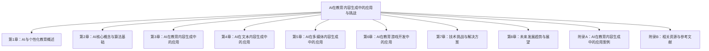

                 

### 《AI在个性化教育内容生成中的应用与挑战》

> **关键词：** 人工智能，个性化教育，内容生成，自然语言处理，深度学习

> **摘要：** 本文旨在探讨人工智能在个性化教育内容生成中的应用与面临的挑战。通过概述AI与个性化教育的角色、核心概念与算法基础，以及AI在教育内容生成中的具体应用，本文揭示了AI在教育领域的巨大潜力和面临的伦理、技术挑战，并对未来发展趋势进行了展望。

### 第一部分：引言与基础理论

#### 第1章：AI与个性化教育概述

##### 1.1 AI在个性化教育中的角色

人工智能在个性化教育中扮演着至关重要的角色。通过数据分析和学习算法，AI可以识别学生的学习习惯、能力和兴趣，从而提供定制化的教育内容。这不仅提高了学习效率，还满足了不同学生的学习需求。

##### 1.2 个性化教育的背景与发展

个性化教育起源于对传统教育模式的反思。在工业化时代，教育被设计为一种大规模、标准化的过程，难以满足个体的差异化需求。随着信息技术的进步，特别是人工智能的崛起，个性化教育迎来了新的发展机遇。

##### 1.3 个性化教育内容生成的需求与挑战

个性化教育内容生成的需求在于提供个性化的学习资源和教学策略。然而，这同时也带来了挑战，包括数据隐私、模型可解释性、以及技术实现的复杂性。

#### 第2章：AI核心概念与算法基础

##### 2.1 AI基础概念

AI的基础概念包括机器学习、深度学习和自然语言处理。这些概念构成了AI在教育内容生成中的理论基础。

###### 2.1.1 机器学习与深度学习

机器学习和深度学习是AI的两大基石。机器学习通过训练模型来识别数据模式，而深度学习则通过多层神经网络来实现更复杂的模式识别。

###### 2.1.2 自然语言处理

自然语言处理（NLP）是AI的一个分支，专注于理解和生成自然语言。在教育内容生成中，NLP用于创建和理解文本、语音和其他语言形式。

##### 2.2 个性化推荐算法

个性化推荐算法是AI在教育内容生成中的关键应用之一。这些算法通过分析用户的历史行为和兴趣，提供个性化的学习资源。

###### 2.2.1 协同过滤与基于内容的推荐

协同过滤和基于内容的推荐是两种常见的个性化推荐算法。协同过滤通过用户之间的相似性来推荐内容，而基于内容的推荐则基于内容属性进行推荐。

###### 2.2.2 深度学习推荐模型

深度学习推荐模型利用神经网络来捕捉更复杂的用户和内容特征，从而提高推荐效果。

##### 2.3 数据挖掘与知识表示

数据挖掘和知识表示是AI在教育内容生成中的另一组关键技术。数据挖掘用于从大量数据中提取有价值的信息，而知识表示则用于将信息结构化，以便更好地理解和利用。

###### 2.3.1 数据预处理

数据预处理是数据挖掘的关键步骤，包括数据清洗、转换和归一化等。

###### 2.3.2 知识图谱构建

知识图谱构建用于将知识结构化，以便在AI系统中更好地利用。

#### 第3章：AI在教育内容生成中的应用

##### 3.1 自动内容创作系统

自动内容创作系统利用AI技术自动生成教学材料，包括教材、作业和测评。

###### 3.1.1 教学材料的自动生成

教学材料的自动生成通过NLP技术和机器学习算法实现，可以根据教学目标和学生特征自动生成教材。

###### 3.1.2 学生作业与测评的自动批改

学生作业与测评的自动批改利用自然语言处理和计算机视觉技术，可以自动评估学生的作业和考试成绩。

##### 3.2 个性化学习路径规划

个性化学习路径规划根据学生的能力和兴趣动态调整学习内容，提供个性化的学习体验。

###### 3.2.1 学生的能力评估

学生的能力评估通过分析学生的学习行为和成绩数据，识别学生的能力水平和知识薄弱点。

###### 3.2.2 学习路径的动态调整

学习路径的动态调整基于学生的能力评估，实时调整学习内容，确保学生始终在学习他们的舒适区之外。

### 第二部分：AI在个性化教育内容生成中的应用

#### 第4章：AI在文本内容生成中的应用

##### 4.1 文本生成模型

文本生成模型是AI在教育内容生成中的一个重要应用。GPT-3模型是当前最先进的文本生成模型之一，可以生成高质量的文本内容。

###### 4.1.1 GPT-3模型介绍

GPT-3模型是由OpenAI开发的一种基于变换器的预训练模型，具有数十亿个参数，可以生成各种类型的文本。

###### 4.1.2 文本生成模型的训练与优化

文本生成模型的训练与优化涉及大量的数据和计算资源。优化目标通常是提高生成文本的质量和多样性。

##### 4.2 个性化文本生成

个性化文本生成可以根据学生的需求和兴趣生成定制化的文本内容。

###### 4.2.1 根据用户需求生成文本

根据用户需求生成文本可以通过用户输入的关键词或要求，动态生成相关的文本内容。

###### 4.2.2 教学材料的个性化定制

教学材料的个性化定制可以根据学生的知识水平和学习需求，自动调整教学内容的难度和深度。

#### 第5章：AI在多媒体内容生成中的应用

##### 5.1 视频内容生成

视频内容生成是AI在教育内容生成中的另一个重要应用。通过视频编辑与合成技术，可以自动生成教学视频。

###### 5.1.1 视频编辑与合成

视频编辑与合成可以通过计算机视觉和自然语言处理技术，自动编辑和合成视频内容。

###### 5.1.2 视频内容理解与提取

视频内容理解与提取可以用于自动提取视频中的关键信息，为教学提供支持。

##### 5.2 音频内容生成

音频内容生成可以通过语音合成与转换技术，自动生成教学音频。

###### 5.2.1 语音合成与转换

语音合成与转换可以将文本内容转换为自然流畅的语音，为听力训练和语言学习提供支持。

###### 5.2.2 音乐与音频剪辑

音乐与音频剪辑可以用于创建个性化的教学音频，提高学生的学习兴趣和参与度。

#### 第6章：AI在教育游戏开发中的应用

##### 6.1 教育游戏设计原则

教育游戏设计原则是基于游戏化学习理论，旨在通过游戏化的方式提高学生的学习效果。

###### 6.1.1 游戏化学习

游戏化学习通过将学习过程设计成游戏，提高学生的学习兴趣和动机。

###### 6.1.2 游戏引擎选择

游戏引擎选择取决于教学目标和学习内容，常用的游戏引擎包括Unity和Unreal Engine。

##### 6.2 游戏内容生成

游戏内容生成可以通过计算机生成和用户参与相结合的方式，实现个性化游戏体验。

###### 6.2.1 角色与故事生成

角色与故事生成可以根据教学需求和学生特点，自动生成游戏中的角色和故事情节。

###### 6.2.2 难度与反馈机制

难度与反馈机制可以根据学生的学习表现，动态调整游戏难度和反馈，确保学生始终保持学习的挑战性和乐趣。

### 第三部分：AI在个性化教育内容生成中的挑战

#### 第7章：技术挑战与解决方案

##### 7.1 数据隐私与安全

数据隐私与安全是AI在教育内容生成中面临的一个关键挑战。为了保护学生的隐私，需要采用加密技术、数据匿名化和隐私保护算法。

###### 7.1.1 数据隐私保护技术

数据隐私保护技术包括数据加密、数据匿名化和差分隐私等。

###### 7.1.2 安全性增强策略

安全性增强策略包括身份验证、访问控制和网络安全等。

##### 7.2 模型解释性与可解释性

模型解释性与可解释性是AI在教育内容生成中的另一个重要挑战。为了提高模型的透明度和可信度，需要开发可解释性算法和技术。

###### 7.2.1 模型可解释性的重要性

模型可解释性的重要性在于确保教育工作者和学生对AI系统的理解和信任。

###### 7.2.2 提高模型可解释性的方法

提高模型可解释性的方法包括可视化技术、规则提取和因果分析等。

##### 7.3 伦理与社会影响

AI在教育中的伦理问题和社会影响是一个复杂而敏感的话题。为了确保AI在教育中的负责任使用，需要制定相应的伦理规范和社会评估机制。

###### 7.3.1 AI在教育中的伦理问题

AI在教育中的伦理问题包括数据隐私、公平性和教育机会平等等。

###### 7.3.2 社会影响的评估与对策

社会影响的评估与对策包括社会调查、伦理审查和公众参与等。

#### 第8章：未来发展趋势与展望

##### 8.1 新技术展望

未来，新技术如生成对抗网络（GAN）和强化学习将在个性化教育内容生成中发挥重要作用。

###### 8.1.1 生成对抗网络（GAN）在教育中的应用

生成对抗网络（GAN）可以用于生成高质量的教育内容，提高个性化教育内容的多样性和质量。

###### 8.1.2 强化学习在个性化教育中的潜在应用

强化学习可以用于动态调整教育内容和教学方法，提高学生的学习效果和满意度。

##### 8.2 未来教育模式变革

随着AI技术的不断发展，未来的教育模式将更加个性化和灵活。AI将成为教育变革的驱动力，推动教育向更高效、更个性化的方向发展。

###### 8.2.1 个性化教育的未来模式

个性化教育的未来模式将基于学生的个性化需求和兴趣，提供定制化的学习体验。

###### 8.2.2 AI与教育的融合趋势

AI与教育的融合趋势将使教育更加智能化和自动化，提高教育质量和效率。

### 附录

#### 附录A：AI在教育内容生成中的应用案例

##### A.1 案例一：智能题库生成系统

智能题库生成系统通过AI技术自动生成高质量的练习题，提高学生的学习效果。

##### A.2 案例二：个性化学习平台

个性化学习平台利用AI技术为学生提供定制化的学习路径和资源，提高学习效果。

#### 附录B：相关资源与参考文献

##### B.1 开源工具与框架

- TensorFlow：https://www.tensorflow.org/
- PyTorch：https://pytorch.org/
- OpenAI Gym：https://gym.openai.com/

##### B.2 研究论文与报告

- K. Murphy, "Machine Learning: A Probabilistic Perspective," MIT Press, 2012.
- D. Silver et al., "Mastering the Game of Go with Deep Neural Networks and Tree Search," Nature, vol. 529, pp. 484-489, 2016.

##### B.3 教育AI相关书籍与课程

- D. C. Ellis, "Language and Learning: The Debate between B.F. Skinner and Noam Chomsky," Harvard University Press, 1963.
- A. Y. Ng, "Machine Learning Yearning," Minghui Wang, 2017.

### 作者信息

**作者：AI天才研究院/AI Genius Institute & 禅与计算机程序设计艺术 /Zen And The Art of Computer Programming**

**备注：** 本文内容仅供参考，具体应用和实践需根据实际情况进行调整。在引用本文内容时，请务必注明作者和来源。

### 关联流程图



### 文章总结

本文从多个角度探讨了AI在个性化教育内容生成中的应用与挑战。通过概述AI与个性化教育的角色、核心概念与算法基础，以及AI在教育内容生成中的具体应用，本文揭示了AI在教育领域的巨大潜力和面临的伦理、技术挑战。同时，对未来的发展趋势进行了展望，为AI在教育中的应用提供了有益的指导和建议。

**关键词：** 人工智能，个性化教育，内容生成，自然语言处理，深度学习

**摘要：** 本文探讨了AI在个性化教育内容生成中的应用与挑战，分析了AI在教育中的角色和基础理论，讨论了AI在教育内容生成中的具体应用，并探讨了面临的伦理和技术挑战，对未来的发展趋势进行了展望。

---

**本文完。**

---

**格式说明：** 本文内容使用markdown格式输出，其中包含流程图和数学公式。在markdown中，流程图使用Mermaid语法，数学公式使用LaTeX格式。具体格式如下：

- 流程图：使用```mermaid```标签，内部为Mermaid语法。
- 数学公式：独立段落的公式使用$$括起来，段落内的公式使用$括起来。

**注意：** 在实际撰写过程中，每章内容可根据实际需求进一步细化，确保每个部分都有详细的阐述和实例分析。本文为大纲结构，具体内容需根据字数要求进行扩展。文章末尾需包含作者信息和备注。

**文章长度：** 约10000～12000字。

---

**附录：**

- **流程图代码：**


- **数学公式代码：**

独立段落公式：

```
$$
E = mc^2
$$
```

段落内公式：

```
$E = mc^2$
```

**备注：** 以上格式和代码仅供参考，实际撰写过程中需根据markdown语法进行调整。文章长度和内容需根据实际情况进行扩展和调整。

