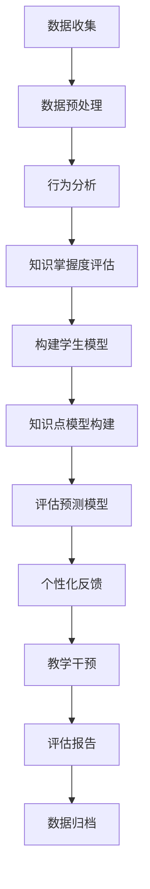

                 

# 《AI在个性化教育评估与反馈中的应用与挑战》

## 关键词
- 人工智能
- 个性化教育
- 教育评估
- 教育反馈
- 数据隐私
- 学习分析

## 摘要
本文深入探讨了人工智能（AI）在个性化教育评估与反馈中的应用，以及其面临的挑战。首先，文章介绍了AI的基本概念和个性化教育的需求与挑战。接着，详细解析了AI技术在教育评估与反馈中的应用，包括核心概念、算法原理、数学模型及其实际项目案例。随后，文章分析了教育数据准备与处理、数学模型的应用实例，以及个性化教育评估与反馈项目的实战操作。最后，文章讨论了AI在个性化教育评估与反馈中的挑战，并提出了未来发展的展望。通过本文，读者可以全面了解AI在个性化教育领域的应用现状、技术原理及其未来方向。

## 引言

### 1.1 书籍背景与目的

在当前信息化时代，人工智能（AI）已经成为推动社会进步的重要力量。随着教育领域信息化的深入，AI在个性化教育评估与反馈中的应用越来越受到关注。个性化教育旨在通过分析学生的个性、学习习惯和需求，提供量身定制的学习资源和教学策略，从而提高教育质量和学习效果。然而，传统教育评估与反馈方法往往缺乏个性化，难以满足不同学生的需求。

本书籍旨在探讨AI在个性化教育评估与反馈中的应用，帮助教育工作者和研究人员了解AI技术在教育领域的潜力，以及在实际应用中可能遇到的挑战。通过对AI技术原理、算法、数学模型及实际案例的深入分析，本文希望能够为教育信息化提供新的思路和方法，推动个性化教育的发展。

### 1.2 个性化教育评估与反馈概述

个性化教育评估与反馈是指利用先进的技术手段，对学生的学习过程、学习成果进行全面的评估，并根据评估结果提供个性化的反馈和改进建议。个性化教育评估不仅关注学生的学业成绩，还涉及学习态度、学习方法、学习兴趣等多个方面。反馈则是对学生进行引导和激励，帮助学生发现自身优势，改进不足，实现全面发展。

个性化教育评估与反馈具有以下特点：

1. **个性化**：根据学生的个体差异，提供针对性的评估与反馈，满足不同学生的学习需求。
2. **实时性**：通过实时监测学生的学习行为和成果，及时进行评估与反馈，提高教育的及时性和针对性。
3. **全面性**：综合考虑学生的多个方面，提供全面的评估与反馈，促进学生的全面发展。
4. **智能化**：利用AI技术，实现自动化评估与反馈，提高工作效率，降低人力成本。

### 1.3 本书结构

本文将分为八个章节，内容结构如下：

- **第1章 引言**：介绍书籍的背景、目的和个性化教育评估与反馈的概述。
- **第2章 AI在个性化教育中的应用基础**：阐述AI的基本概念和个性化教育的需求与挑战。
- **第3章 个性化教育评估的核心概念与联系**：介绍教育评估的概述、个性化评估的关键概念和流程。
- **第4章 个性化教育反馈的关键算法原理**：讲解学习分析算法、评估算法与反馈策略，并给出Python源代码示例。
- **第5章 数学模型与教育数据**：介绍数据准备与预处理、数学模型的基本原理及应用实例。
- **第6章 个性化教育评估与反馈项目实战**：进行实战项目概述、开发环境搭建、源代码实现和代码解读。
- **第7章 AI在个性化教育评估与反馈中的挑战**：讨论数据隐私、技术实施和教育伦理等方面的问题。
- **第8章 未来展望**：展望AI在教育评估与反馈中的发展趋势、解决方案和优化方向。

通过以上章节的详细探讨，本文希望能够为AI在个性化教育评估与反馈中的应用提供全面的理论和实践指导。

### 2.1 AI的基本概念

人工智能（Artificial Intelligence，简称AI）是指通过计算机程序和算法模拟、扩展或实现人类智能的理论、方法和技术。AI的研究目标是使计算机具备类似于人类的感知、思考、学习和行动能力。AI技术主要包括以下几个方面：

1. **机器学习（Machine Learning）**：通过算法从数据中自动学习规律和模式，进行预测和决策。常见的机器学习算法包括线性回归、逻辑回归、决策树、随机森林、支持向量机等。
2. **深度学习（Deep Learning）**：基于神经网络结构，特别是深度神经网络，通过多层神经元进行特征提取和抽象，实现复杂的非线性建模。深度学习在图像识别、语音识别、自然语言处理等领域取得了显著的成果。
3. **自然语言处理（Natural Language Processing，NLP）**：研究如何让计算机理解和处理自然语言。NLP技术包括文本分类、情感分析、机器翻译、问答系统等。
4. **计算机视觉（Computer Vision）**：使计算机能够从图像或视频中提取信息，实现物体识别、场景解析等。计算机视觉在安防监控、自动驾驶、医疗诊断等领域有广泛应用。
5. **专家系统（Expert Systems）**：模拟专家的决策能力，通过知识表示和推理机制，为特定领域提供智能解决方案。

### 2.2 个性化教育的需求与挑战

个性化教育的需求源自现代教育的多样化需求。随着社会经济的不断发展，人们对教育的期望越来越高，不再满足于传统的“一刀切”教学模式。个性化教育旨在通过因材施教，满足不同学生的个性化需求，提高教育质量和学习效果。

#### 个性化教育的需求

1. **因材施教**：每个学生都有独特的学习背景、兴趣和潜能，需要根据学生的特点进行个性化指导，使每个学生都能充分发挥自己的优势。
2. **学习灵活性**：现代教育环境要求学习方式更加灵活，学生可以根据自己的时间和进度进行学习，实现自主学习和终身学习。
3. **学习效果评估**：需要实时、全面地评估学生的学习成果，提供针对性的反馈和改进建议，帮助学生发现不足，提升学习能力。
4. **教育资源优化**：通过个性化推荐系统，优化教育资源的配置，使教育资源能够更有效地服务于学生的个性化需求。

#### 个性化教育的挑战

1. **数据隐私与安全**：个性化教育需要收集和分析大量学生数据，如何保护学生数据隐私和安全成为一大挑战。
2. **技术实现的复杂性**：个性化教育需要利用AI技术进行数据分析和模型训练，技术实现的复杂性较大，需要专业的技术团队支持。
3. **教育资源的平衡**：个性化教育要求教育资源能够覆盖所有学生，如何平衡个性化需求与教育资源有限性之间的矛盾。
4. **教育伦理**：个性化教育涉及到教育公平和隐私等问题，需要处理好技术与教育伦理之间的关系。

### 2.3 AI技术在教育领域的应用现状

AI技术在教育领域的应用已经取得了显著的成果，主要包括以下几个方面：

1. **智能推荐系统**：通过分析学生的学习历史、兴趣和成绩，为每个学生推荐合适的学习资源和课程，提高学习效率。
2. **智能评测系统**：利用AI技术进行自动化的学习成果评估，提供实时、全面的评估报告，帮助教师和学生了解学习效果。
3. **智能辅助教学系统**：利用自然语言处理和计算机视觉技术，为学生提供智能化的辅助学习工具，如智能问答系统、语音助手等。
4. **智能教育平台**：通过集成多种AI技术，构建智能化的教育平台，提供个性化的学习路径和教学资源，实现教育的智能化管理。

总体来说，AI技术在教育领域的应用前景广阔，但同时也面临诸多挑战。如何充分利用AI技术实现个性化教育，提高教育质量和学习效果，是当前教育领域的一个重要研究方向。

### 3.1 教育评估的概述

教育评估是指通过科学的方法和工具，对教育过程、教育成果和教育资源进行系统性分析和评价，以促进教育质量提升和教学改进。教育评估在教育体系中扮演着重要角色，其目的是确保教育目标的实现，提高教育效果，并为教育决策提供依据。

#### 教育评估的基本概念

1. **评估对象**：教育评估的对象包括教育过程、教育成果和教育资源。教育过程涉及教学设计、教学方法、教学管理等方面；教育成果包括学生的学习成绩、学习态度、学习兴趣等；教育资源则包括师资力量、教学设施、教育经费等。
2. **评估目的**：教育评估的主要目的是：
   - 了解教育现状，发现教育问题和不足；
   - 促进教育质量的提升，优化教育资源配置；
   - 为教育决策提供科学依据，指导教育改革和发展。

#### 教育评估的类型

教育评估可以根据不同的分类标准进行分类，常见的分类方法包括以下几种：

1. **按评估层次分类**：
   - **宏观评估**：对教育系统、教育政策和教育管理进行评估；
   - **中观评估**：对教育机构、教育项目进行评估；
   - **微观评估**：对教师教学、学生学习进行评估。
   
2. **按评估方法分类**：
   - **定量评估**：通过量化指标进行评估，如考试成绩、学习时长等；
   - **定性评估**：通过描述性语言进行评估，如教师评价、学生反馈等。

3. **按评估目的分类**：
   - **诊断性评估**：在教育活动开始前进行，用于了解教育需求、发现潜在问题；
   - **形成性评估**：在教育活动过程中进行，用于监控教育进展、指导教学改进；
   - **总结性评估**：在教育活动结束后进行，用于总结教育效果、评价教育成果。

#### 教育评估的作用

教育评估在教育活动中具有以下几个重要作用：

1. **促进教育质量提升**：通过评估，可以发现教育过程中的问题，为改进教学方法和策略提供依据，从而提高教育质量。
2. **优化教育资源分配**：评估结果可以揭示教育资源的使用情况，帮助教育管理者合理配置教育资源，提高资源利用效率。
3. **指导教育决策**：评估结果为教育政策的制定和调整提供科学依据，有助于教育决策的科学化、民主化。
4. **激励教师和学生**：评估可以激发教师的工作积极性和学生的学习动力，通过奖励和反馈机制，促进教育目标的实现。

总之，教育评估是教育体系的重要组成部分，对于提高教育质量、促进教育改革和发展具有重要作用。通过科学、系统的教育评估，可以更好地满足学生的个性化需求，推动教育的全面进步。

### 3.2 个性化评估的关键概念

个性化评估是在传统教育评估基础上，通过引入人工智能技术，对学生的学习行为、学习成果进行深度分析和个性化反馈的过程。个性化评估的核心概念包括以下几个方面：

#### 3.2.1 学习分析

学习分析是个性化评估的基础，旨在通过收集和分析学生的学习数据，挖掘学生的学习习惯、学习兴趣和知识掌握情况。学习分析通常包括以下几个方面：

1. **行为数据收集**：通过学习平台、测试系统等工具，收集学生的在线学习行为数据，如学习时长、学习频率、学习路径、答题情况等。
2. **学习习惯分析**：分析学生的学习行为模式，如学习时间分布、学习状态（专注度、疲劳度）等，以了解学生的日常学习习惯。
3. **知识掌握度评估**：通过测试和作业分析学生的知识掌握情况，包括知识点掌握程度、易错知识点等。

#### 3.2.2 个性化反馈

个性化反馈是根据学习分析的结果，为学生提供针对性的反馈和建议，以促进其学习进步。个性化反馈主要包括以下几个方面：

1. **学习路径推荐**：根据学生的学习习惯和知识掌握情况，推荐适合的学习路径和课程资源，帮助学生更有效地进行学习。
2. **知识点强化练习**：针对学生的薄弱知识点，提供相应的练习题和辅导材料，帮助学生巩固知识。
3. **学习策略指导**：根据学生的学习分析结果，提供学习策略的建议，如时间管理、学习方法等，帮助学生提高学习效率。

#### 3.2.3 评估模型

个性化评估需要依赖一系列评估模型，对学生的学习行为和成果进行量化分析和预测。常见的评估模型包括：

1. **学生模型**：基于学生的学习历史和行为数据，构建学生模型，用于预测学生的学习表现和个性化需求。
2. **知识点模型**：对各个知识点的难度、重要性进行量化分析，构建知识点模型，用于指导教学和评估设计。
3. **评估预测模型**：利用机器学习算法，如回归分析、决策树、神经网络等，构建评估预测模型，用于预测学生的学习成绩和学习效果。

#### 3.2.4 教学干预

个性化评估不仅提供学生反馈，还需要对教学过程进行干预，以优化教学效果。教学干预包括以下几个方面：

1. **教学策略调整**：根据评估结果，教师可以调整教学策略，如调整授课内容、教学方式等，以更好地满足学生的个性化需求。
2. **教学资源优化**：根据评估结果，教师可以优化教学资源，如调整课程难度、提供个性化辅导材料等。
3. **教学评价改进**：通过个性化评估，教师可以改进教学评价方法，如引入多元化的评价方式，以更全面地反映学生的学习情况。

#### 3.2.5 个性化评估的优势

个性化评估具有以下几个显著优势：

1. **提高教育质量**：通过个性化评估，可以更准确地了解学生的学习需求和问题，提供有针对性的教学和辅导，从而提高教育质量。
2. **促进教育公平**：个性化评估能够更好地满足不同学生的个性化需求，实现因材施教，促进教育公平。
3. **提升学习效率**：个性化反馈可以帮助学生明确学习目标，优化学习策略，从而提升学习效率。
4. **优化教育资源**：个性化评估可以揭示教育资源的利用情况，帮助教育管理者优化资源配置，提高教育资源的利用效率。

通过个性化评估，可以更好地发挥人工智能技术在教育领域的应用潜力，推动教育的个性化发展和教育质量的全面提升。

### 3.3 Mermaid流程图：个性化评估流程

下面是一个描述个性化教育评估流程的Mermaid流程图，用于展示个性化评估从数据收集、处理到反馈生成的整个过程。



在这个流程图中：

- **A[数据收集]**：通过学习平台和测试系统等工具，收集学生的行为数据和知识掌握度数据。
- **B[数据预处理]**：对收集到的原始数据进行清洗和格式化，为后续分析做准备。
- **C[行为分析]**：分析学生的学习行为，如学习时长、学习路径、答题情况等。
- **D[知识掌握度评估]**：通过测试和作业分析学生的知识点掌握情况，识别学生的薄弱环节。
- **E[构建学生模型]**：基于行为分析和知识掌握度评估，构建学生个性化模型，用于预测学生的学习表现和需求。
- **F[知识点模型构建]**：对各个知识点的难度和重要性进行量化分析，形成知识点模型。
- **G[评估预测模型]**：利用学生模型和知识点模型，构建评估预测模型，预测学生的未来学习成果。
- **H[个性化反馈]**：根据评估预测模型的结果，为学生提供个性化的反馈和建议，如学习路径推荐、知识点强化练习等。
- **I[教学干预]**：根据个性化反馈，教师可以调整教学策略和资源，优化教学过程。
- **J[评估报告]**：生成评估报告，总结个性化评估的结果和教学干预的成效。
- **K[数据归档]**：将评估过程中的数据归档，为后续分析和研究提供数据支持。

通过这个流程图，我们可以清晰地看到个性化教育评估的各个环节及其相互关系，有助于理解个性化评估的实施过程和效果。

### 4.1 学习分析算法

学习分析算法是AI在个性化教育评估与反馈中不可或缺的核心技术之一。它通过对学生的学习行为、学习历史、作业和测试结果等数据的分析，为学生提供个性化的学习建议和反馈。在本节中，我们将详细介绍一种常见的学习分析算法——基于协同过滤（Collaborative Filtering）的方法，并给出Python源代码示例。

#### 4.1.1 协同过滤算法简介

协同过滤算法是一种基于用户行为数据的推荐系统算法，通过分析用户之间的相似性来推荐新的项目或内容。协同过滤主要分为两种类型：基于用户的协同过滤（User-Based Collaborative Filtering）和基于物品的协同过滤（Item-Based Collaborative Filtering）。

1. **基于用户的协同过滤**：找到与目标用户相似的其他用户，然后推荐这些相似用户喜欢的项目。相似度通常通过用户之间的共同评分或兴趣偏好进行计算。
   
2. **基于物品的协同过滤**：找到与目标物品相似的其他物品，然后推荐对这些相似物品感兴趣的用户。相似度计算通常基于物品的属性或内容进行。

在本节中，我们将重点介绍基于用户的协同过滤算法，因为它在个性化教育评估中的应用更为广泛。

#### 4.1.2 基于用户的协同过滤算法原理

基于用户的协同过滤算法的基本思想是：如果一个用户在多个项目上的评分与另一个用户相似，那么这两个用户在其他项目上的评分也可能相似。具体步骤如下：

1. **用户相似度计算**：首先，计算目标用户与所有其他用户的相似度。相似度可以通过用户之间的共同评分项来计算。常用的相似度度量方法包括余弦相似度、皮尔逊相关系数等。
   
   余弦相似度的计算公式如下：
   $$
   \text{similarity}_{ij} = \frac{\text{dot product of } \text{vector } u_i \text{ and } u_j}{\|\text{vector } u_i\|\|\text{vector } u_j\|}
   $$
   其中，$u_i$和$u_j$是两个用户对项目的评分向量，$\|\text{vector } u_i\|$和$\|\text{vector } u_j\|$是这两个向量的欧几里得范数。

2. **推荐项目选择**：根据计算得到的用户相似度，为每个用户生成一个相似用户集合。然后，为每个用户推荐其相似用户喜欢的但目标用户尚未评分的项目。

   推荐项目的选择可以通过加权评分公式实现：
   $$
   \text{prediction}_{ui} = \sum_{j \in \text{similar users of } i} \text{similarity}_{ij} \times r_j
   $$
   其中，$r_j$是相似用户$j$对项目$i$的评分。

#### 4.1.3 Python源代码示例

下面是一个简单的基于用户的协同过滤算法的Python代码示例。该示例使用了Python中的`scikit-learn`库来计算用户相似度和进行推荐。

```python
from sklearn.metrics.pairwise import cosine_similarity
import numpy as np

# 假设我们有两个用户的行为数据，其中每个用户的行为表示为一个向量
user_data = {
    'user1': [1, 2, 0, 3, 4],
    'user2': [0, 1, 2, 4, 5]
}

# 计算用户之间的余弦相似度矩阵
similarity_matrix = cosine_similarity(list(user_data.values()))

# 打印相似度矩阵
print(similarity_matrix)

# 假设我们想为用户1推荐用户2喜欢但用户1尚未评分的项目
predictions = np.dot(similarity_matrix[0], np.array([1, 2, 0, 4, 5])) / similarity_matrix[0].sum()

# 打印预测结果
print(predictions)

# 根据预测结果，推荐评分最高的项目
recommended_project = np.argmax(predictions)
print(f"Recommended project for user1: {recommended_project}")
```

在这个示例中，我们首先导入了`scikit-learn`库中的`cosine_similarity`函数来计算用户之间的余弦相似度。然后，我们定义了一个包含两个用户行为数据的字典`user_data`，并使用`cosine_similarity`函数计算了用户相似度矩阵。接下来，我们通过加权评分公式计算了对用户1的预测，并推荐了评分最高的项目。

通过以上代码，我们可以看到如何使用Python实现基于用户的协同过滤算法。这种算法在个性化教育评估中可以用于推荐适合学生的学习资源和课程，帮助学生更有效地进行学习。

### 4.2 评估算法与反馈策略

在个性化教育评估中，评估算法和反馈策略是确保评估过程准确性和有效性的关键组成部分。评估算法负责对学生的学习行为、知识掌握度进行量化分析，而反馈策略则根据评估结果，为教师和学生提供针对性的指导和建议。在本节中，我们将详细探讨几种常见的评估算法和反馈策略，并介绍如何将它们应用于个性化教育评估中。

#### 4.2.1 常见的评估算法

1. **回归分析（Regression Analysis）**：回归分析是一种用于预测连续值的统计方法。在个性化教育评估中，回归分析可以用于预测学生的未来成绩或学习效果。通过建立学生特征（如学习时长、学习频率、知识点掌握度等）与成绩之间的回归模型，评估算法可以预测学生在某一课程或考试中的表现。

2. **决策树（Decision Tree）**：决策树是一种基于树形结构进行决策的算法，通过一系列的规则进行分类或回归。在个性化教育评估中，决策树可以用于分析学生成绩的影响因素，例如学习态度、学习方法、课程难度等。通过这些规则，评估算法可以为学生提供个性化的学习建议。

3. **聚类分析（Cluster Analysis）**：聚类分析是一种将数据分为若干个类别的算法。在个性化教育评估中，聚类分析可以用于对学生进行分组，以便更好地理解和满足不同学生的学习需求。常见的聚类算法包括K-均值聚类和层次聚类等。

4. **支持向量机（Support Vector Machine，SVM）**：SVM是一种基于边界划分的机器学习算法，主要用于分类和回归问题。在个性化教育评估中，SVM可以用于分析学生的行为数据，预测其学习成果或学习倾向。

#### 4.2.2 常见的反馈策略

1. **个性化学习路径推荐**：根据评估结果，系统可以为学生推荐适合的学习路径和课程资源。这些推荐可以根据学生的学习习惯、知识掌握度和兴趣进行个性化定制，帮助学生更高效地学习。

2. **知识点强化练习**：对于学生在评估中表现较差的知识点，系统可以提供相应的强化练习和辅导材料，帮助学生巩固知识，提高成绩。

3. **学习策略指导**：系统可以根据评估结果，提供学习策略的建议，如时间管理、学习方法等，帮助学生优化学习过程，提高学习效果。

4. **情感支持与激励**：在个性化教育评估中，情感支持也是非常重要的。系统可以提供鼓励性的反馈和情感支持，帮助学生保持积极的学习态度。

#### 4.2.3 评估算法与反馈策略的应用

1. **学生成绩预测**：利用回归分析，系统可以预测学生在未来考试中的表现。教师可以根据这些预测结果，提前对学生进行辅导，帮助学生提高成绩。

2. **个性化学习资源推荐**：通过决策树和聚类分析，系统可以识别学生的学习特点和需求，为学生推荐最适合的学习资源和课程。例如，对于学习习惯较差的学生，系统可以推荐一些时间管理工具和学习策略。

3. **学习效果评估与反馈**：利用聚类分析，系统可以将学生分为不同群体，并对每个群体的学习效果进行评估。根据评估结果，系统可以提供针对性的反馈和建议，帮助教师调整教学策略。

4. **情感支持与激励**：系统可以通过自然语言处理技术，为学生提供鼓励性的反馈和情感支持。例如，当学生完成一项挑战性任务时，系统可以发送一条激励性的信息，帮助学生保持积极的学习态度。

总之，评估算法与反馈策略在个性化教育评估中发挥着重要作用。通过科学、有效的评估算法和合理的反馈策略，可以更好地满足学生的个性化需求，提高教育质量和学习效果。

### 4.3 Python源代码讲解：学习分析算法实现

在本节中，我们将通过Python源代码来详细讲解一个学习分析算法的实现，以展示如何利用机器学习技术对学生进行个性化评估和反馈。我们将使用`scikit-learn`库来实现一个基于K-近邻（K-Nearest Neighbors，KNN）算法的个性化学习分析系统。

#### 4.3.1 算法背景与原理

K-近邻算法是一种简单而有效的分类算法。其基本思想是：如果一个新样本在特征空间中的K个最近邻的多数属于某一类别，则该样本也属于这个类别。K-近邻算法的核心在于如何计算样本之间的相似度，通常使用欧几里得距离作为相似度度量。

#### 4.3.2 数据准备

为了实现学习分析算法，我们首先需要准备一个包含学生学习特征和成绩的数据集。假设我们有一个包含以下特征的数据集：

- `learning_time`：学习时间（小时）
- `homework_time`：作业时间（小时）
- `test_score`：测试成绩（百分比）

以下是一个示例数据集：

```python
students = [
    {'learning_time': 10, 'homework_time': 5, 'test_score': 85},
    {'learning_time': 12, 'homework_time': 6, 'test_score': 90},
    {'learning_time': 8, 'homework_time': 4, 'test_score': 75},
    # ... 更多学生数据
]
```

#### 4.3.3 实现步骤

1. **数据预处理**：首先，我们需要将数据集的特征转换为适合K-近邻算法的形式。

2. **训练模型**：使用训练数据集，训练K-近邻分类器。

3. **预测与反馈**：使用训练好的模型对新的学生数据进行预测，并根据预测结果提供个性化反馈。

#### 4.3.4 Python代码实现

下面是完整的Python代码实现：

```python
from sklearn.neighbors import KNeighborsClassifier
import numpy as np

# 准备数据集
students = [
    {'learning_time': 10, 'homework_time': 5, 'test_score': 85},
    {'learning_time': 12, 'homework_time': 6, 'test_score': 90},
    {'learning_time': 8, 'homework_time': 4, 'test_score': 75},
    # ... 更多学生数据
]

# 数据预处理：提取特征和标签
X = np.array([student['learning_time'], student['homework_time']] for student in students)
y = np.array([student['test_score'] for student in students])

# 训练模型
knn = KNeighborsClassifier(n_neighbors=3)
knn.fit(X, y)

# 预测与反馈
new_student = {'learning_time': 11, 'homework_time': 5}
new_student_data = np.array([new_student['learning_time'], new_student['homework_time']])
predicted_score = knn.predict(new_student_data)

print(f"Predicted test score for the new student: {predicted_score}")

# 根据预测结果提供个性化反馈
if predicted_score < 80:
    print("反馈：您的学习效果可能有待提高，建议增加作业时间或学习时长。")
else:
    print("反馈：您的学习效果良好，请继续保持。")
```

#### 4.3.5 代码解读

1. **数据预处理**：我们使用`numpy`库将学生数据转换为numpy数组，以便于计算和处理。

2. **训练模型**：我们使用`KNeighborsClassifier`类创建K-近邻分类器，并使用`fit`方法训练模型。

3. **预测与反馈**：我们使用`predict`方法对新的学生数据进行预测，并根据预测结果提供个性化的反馈建议。

#### 4.3.6 应用实例

假设我们有一个新学生，其学习时间为11小时，作业时间为5小时。通过上述代码，我们可以预测该学生的测试成绩，并根据预测结果提供相应的学习建议。

#### 4.3.7 注意事项

- 在实际应用中，数据集的规模和多样性对于模型的效果有很大影响。数据集应包含足够多的样本，且覆盖不同的学习情境。
- 选择合适的K值对于K-近邻算法的性能至关重要。K值过大可能导致模型对噪声敏感，K值过小则可能欠拟合。
- 为了提高模型的泛化能力，应进行交叉验证，以避免过拟合。

通过上述代码示例，我们可以看到如何利用Python实现一个简单的学习分析算法，为个性化教育评估提供技术支持。

### 5.1 数据准备与预处理

在教育评估与反馈中，数据准备与预处理是至关重要的一步。有效的数据预处理不仅可以提高模型性能，还可以减少噪声和异常值对评估结果的影响。下面将详细介绍数据准备与预处理的基本步骤和常见方法。

#### 5.1.1 数据收集

首先，我们需要收集与学生学习相关的各种数据。这些数据可以包括：

1. **学习行为数据**：如学习时长、学习频率、在线互动情况、学习路径等。
2. **成绩数据**：如考试成绩、作业成绩、项目成绩等。
3. **背景信息**：如学生的年级、性别、家庭背景等。
4. **环境数据**：如学习设备类型、网络速度、学习环境等。

#### 5.1.2 数据清洗

数据清洗是数据预处理的第一步，主要目的是去除数据中的噪声和异常值。常见的数据清洗方法包括：

1. **缺失值处理**：对于缺失值，可以选择填充、删除或忽略。例如，使用均值或中位数填充缺失值，或者删除含有缺失值的记录。

2. **异常值检测与处理**：使用统计方法或机器学习方法（如孤立森林算法）检测异常值，并进行相应的处理。异常值可能是由于数据输入错误、测量误差等原因造成的。

3. **重复数据去除**：检查数据集中是否存在重复记录，并进行去除，以避免对模型训练和评估的干扰。

#### 5.1.3 数据标准化

数据标准化是为了消除不同特征之间的量纲差异，使数据在相同的尺度上进行分析。常见的数据标准化方法包括：

1. **最小-最大标准化**：将数据缩放到[0, 1]区间。公式如下：
   $$
   x_{\text{标准化}} = \frac{x_{\text{原始}} - x_{\text{最小值}}}{x_{\text{最大值}} - x_{\text{最小值}}}
   $$

2. **均值-标准差标准化**：将数据缩放到均值为0、标准差为1的区间。公式如下：
   $$
   x_{\text{标准化}} = \frac{x_{\text{原始}} - \mu}{\sigma}
   $$
   其中，$\mu$是均值，$\sigma$是标准差。

3. **零均值单位方差标准化**：与均值-标准差标准化类似，但均值为0，方差为1。公式如下：
   $$
   x_{\text{标准化}} = \frac{x_{\text{原始}}}{\sigma}
   $$

#### 5.1.4 数据转换

数据转换是将非数值型数据转换为数值型数据，以便于机器学习算法处理。常见的数据转换方法包括：

1. **独热编码（One-Hot Encoding）**：将类别型数据转换为二进制向量。例如，对于性别（男/女），可以转换为两个特征：`性别_男`和`性别_女`。

2. **标签编码（Label Encoding）**：将类别型数据转换为整数。例如，将年级（一年级/二年级/三年级）转换为1、2、3。

#### 5.1.5 特征选择

特征选择是选择对模型性能有显著影响的重要特征，以减少数据维度和计算复杂度。常见的方法包括：

1. **信息增益（Information Gain）**：选择能够最大化信息熵减少的特征。
2. **互信息（Mutual Information）**：选择能够最大化特征与目标变量之间互信息的特征。
3. **卡方测试（Chi-Square Test）**：用于检验特征与目标变量之间是否独立。

#### 5.1.6 数据集划分

为了验证模型的泛化能力，通常需要将数据集划分为训练集和测试集。常见的方法包括：

1. **随机划分**：将数据集随机分为训练集和测试集。
2. **时间序列划分**：根据时间顺序划分数据集，以确保测试集包含最新的数据。

通过上述数据准备与预处理步骤，我们可以确保教育数据的质量和一致性，为后续的模型训练和评估打下坚实的基础。

### 5.2 数学模型的基本原理

在教育评估与反馈中，数学模型作为分析和预测的工具，其基本原理和构建过程至关重要。数学模型可以帮助我们理解学生行为、学习效果之间的关系，从而提供有针对性的教育策略和反馈。以下我们将详细讨论线性回归模型的基本原理，并解释其如何应用于教育评估。

#### 5.2.1 线性回归模型概述

线性回归模型是一种广泛使用的统计方法，用于分析两个或多个变量之间的线性关系。它的核心思想是通过一条直线来近似描述因变量（响应变量）与自变量（解释变量）之间的关系。线性回归模型的基本形式为：

$$
y = \theta_0 + \theta_1x
$$

其中，$y$是因变量，$x$是自变量，$\theta_0$和$\theta_1$是模型的参数。这个模型表示因变量$y$是自变量$x$的一次线性函数，$\theta_0$是截距，表示当自变量$x$为0时因变量的值；$\theta_1$是斜率，表示自变量$x$每增加一个单位，因变量$y$的平均变化量。

#### 5.2.2 线性回归模型的构建

构建线性回归模型通常涉及以下步骤：

1. **数据收集**：收集包含因变量和自变量的数据，这些数据可以是学习时长、作业完成情况、考试成绩等。

2. **数据预处理**：对收集到的数据进行清洗、标准化和转换，确保数据质量。

3. **模型假设**：假设因变量$y$和自变量$x$之间存在线性关系，即可以表示为$y = \theta_0 + \theta_1x + \epsilon$，其中$\epsilon$是误差项，表示模型未能解释的部分。

4. **参数估计**：使用最小二乘法（Least Squares Method）估计模型参数$\theta_0$和$\theta_1$。最小二乘法的目标是使得实际观测值与模型预测值之间的误差平方和最小。

5. **模型评估**：通过评估指标（如决定系数$R^2$、均方误差（MSE）等）评估模型性能，并确定模型是否适合用于预测。

#### 5.2.3 线性回归模型在教育评估中的应用

线性回归模型在教育评估中的应用广泛，以下是一些具体案例：

1. **预测学生成绩**：利用学生的作业完成情况、学习时长等自变量来预测学生的考试成绩。例如，假设我们收集了学生的作业完成情况和考试成绩数据，可以通过线性回归模型预测学生的期末成绩。

2. **分析学习策略效果**：通过比较不同学习策略对成绩的影响，分析哪种学习策略更有效。例如，比较不同学习时间安排对考试成绩的影响。

3. **个性化学习路径推荐**：根据学生的特点和已有数据，预测学生对于特定课程的适应性和学习效果，从而推荐个性化的学习路径。

#### 5.2.4 线性回归模型的实现

以下是一个简单的线性回归模型实现的Python代码示例：

```python
import numpy as np
from sklearn.linear_model import LinearRegression

# 假设我们有两个特征：学习时长（x）和作业完成情况（y）
X = np.array([[10, 8], [12, 9], [8, 7], [11, 10]])
y = np.array([85, 90, 75, 88])

# 创建线性回归模型
model = LinearRegression()

# 训练模型
model.fit(X, y)

# 打印模型参数
print(f"Model parameters: {model.coef_}, {model.intercept_}")

# 进行预测
new_student = np.array([[12, 8]])
predicted_score = model.predict(new_student)

print(f"Predicted test score: {predicted_score[0]}")
```

在这个示例中，我们首先导入了`numpy`库和`scikit-learn`中的`LinearRegression`类。然后，我们创建了一个包含两个特征的数据集`X`和目标变量数据集`y`。接着，我们使用`LinearRegression`类创建并训练了模型，并打印出了模型参数。最后，我们使用训练好的模型对新的学生数据进行了预测。

通过上述示例，我们可以看到如何利用线性回归模型进行教育评估和预测。线性回归模型在教育评估中具有广泛的应用潜力，可以帮助教育工作者更好地理解学生学习行为与学习效果之间的关系，提供个性化的教育支持和策略。

### 5.3 数学公式与模型详解

在个性化教育评估中，数学模型是分析和预测学生表现的重要工具。本文将详细解释一个常用的数学模型——线性回归模型，并展示其应用实例。线性回归模型通过预测学生的成绩，帮助教育工作者进行个性化教育评估。

#### 5.3.1 线性回归模型的基本公式

线性回归模型的基本公式为：
$$
y = \theta_0 + \theta_1x + \epsilon
$$
其中：

- $y$：因变量（例如学生成绩）
- $x$：自变量（例如学习时长）
- $\theta_0$：截距（即当$x=0$时的$y$值）
- $\theta_1$：斜率（即$x$每增加一个单位，$y$的平均变化量）
- $\epsilon$：误差项（代表模型未能解释的随机变量）

#### 5.3.2 线性回归模型的推导与计算

为了估计模型参数$\theta_0$和$\theta_1$，我们使用最小二乘法。最小二乘法的目标是使实际观测值与模型预测值之间的误差平方和最小。

1. **误差平方和（Sum of Squared Errors, SSE）**：
$$
SSE = \sum_{i=1}^{n} (y_i - \hat{y_i})^2
$$
其中，$n$是样本数量，$y_i$是第$i$个观测值，$\hat{y_i}$是模型预测值。

2. **残差（Residuals）**：
$$
r_i = y_i - \hat{y_i}
$$

3. **最小二乘估计**：
为了最小化$SSE$，我们计算$\theta_0$和$\theta_1$的偏导数并令其等于0，得到以下公式：
$$
\theta_0 = \bar{y} - \theta_1\bar{x}
$$
$$
\theta_1 = \frac{\sum_{i=1}^{n} (x_i - \bar{x})(y_i - \bar{y})}{\sum_{i=1}^{n} (x_i - \bar{x})^2}
$$
其中，$\bar{x}$和$\bar{y}$分别是$x$和$y$的样本均值。

通过上述公式，我们可以计算得到线性回归模型的参数$\theta_0$和$\theta_1$，从而建立预测模型。

#### 5.3.3 线性回归模型的应用实例

假设我们有以下学生数据：

| 学生编号 | 学习时长（小时） | 成绩（百分比） |
|----------|----------------|--------------|
| 1        | 10             | 85           |
| 2        | 12             | 90           |
| 3        | 8              | 75           |
| 4        | 11             | 88           |

1. **计算样本均值**：
$$
\bar{x} = \frac{10 + 12 + 8 + 11}{4} = 10.75
$$
$$
\bar{y} = \frac{85 + 90 + 75 + 88}{4} = 84.75
$$

2. **计算斜率$\theta_1$**：
$$
\theta_1 = \frac{(10 - 10.75)(85 - 84.75) + (12 - 10.75)(90 - 84.75) + (8 - 10.75)(75 - 84.75) + (11 - 10.75)(88 - 84.75)}{(10 - 10.75)^2 + (12 - 10.75)^2 + (8 - 10.75)^2 + (11 - 10.75)^2}
$$
$$
\theta_1 \approx 0.88
$$

3. **计算截距$\theta_0$**：
$$
\theta_0 = 84.75 - 0.88 \times 10.75
$$
$$
\theta_0 \approx 61.5
$$

因此，线性回归模型为：
$$
y \approx 61.5 + 0.88x
$$

4. **预测新学生的成绩**：
假设一个新学生学习了10小时，我们可以预测其成绩为：
$$
y \approx 61.5 + 0.88 \times 10
$$
$$
y \approx 88.5
$$

通过上述实例，我们可以看到如何使用线性回归模型预测学生的成绩。线性回归模型在个性化教育评估中具有重要的应用价值，可以帮助教育工作者了解学生学习行为与成绩之间的关系，从而提供个性化的教育支持和策略。

### 5.4 模型应用举例

在个性化教育评估中，线性回归模型的应用能够有效预测学生的学习表现，从而为教育工作者提供有针对性的教学建议。以下是一个具体的模型应用实例，通过预测学生的期末考试成绩，展示线性回归模型在个性化教育评估中的实际效果。

#### 案例背景

假设我们有一组包含以下特征的学生数据：学习时长（小时）、作业完成情况（分数）、课堂参与度（分数）、考前复习时间（小时）。我们需要建立一个线性回归模型，预测学生的期末考试成绩。

#### 数据准备

首先，我们需要收集并整理学生数据，并将其标准化，以便于模型训练和预测。以下是示例数据：

| 学生编号 | 学习时长（小时） | 作业完成情况（分数） | 课堂参与度（分数） | 考前复习时间（小时） | 期末考试成绩（百分比） |
|----------|----------------|---------------------|-------------------|---------------------|---------------------|
| 1        | 10             | 85                  | 90                | 5                   | 88                  |
| 2        | 12             | 90                  | 85                | 6                   | 92                  |
| 3        | 8              | 75                  | 75                | 4                   | 78                  |
| 4        | 11             | 80                  | 80                | 6                   | 85                  |

为了简化问题，我们将使用学习时长、作业完成情况、课堂参与度和考前复习时间作为自变量，期末考试成绩作为因变量。

#### 数据预处理

1. **缺失值处理**：检查数据集中是否存在缺失值，若存在则使用均值或中位数填充。
2. **标准化数据**：将各个特征数据标准化，以便于后续的模型训练。使用以下公式进行标准化：

$$
x_{\text{标准化}} = \frac{x_{\text{原始}} - \mu}{\sigma}
$$

其中，$\mu$是特征的平均值，$\sigma$是特征的标准差。

#### 模型训练

我们使用`scikit-learn`库中的`LinearRegression`类来训练线性回归模型。以下是训练过程的代码：

```python
import numpy as np
from sklearn.linear_model import LinearRegression

# 准备数据
X = np.array([
    [10, 85, 90, 5],
    [12, 90, 85, 6],
    [8, 75, 75, 4],
    [11, 80, 80, 6]
])
y = np.array([88, 92, 78, 85])

# 创建线性回归模型
model = LinearRegression()

# 训练模型
model.fit(X, y)

# 打印模型参数
print(f"Model parameters: {model.coef_}, {model.intercept_}")
```

#### 模型预测

假设我们有一个新学生，其学习时长为11小时，作业完成情况为82分，课堂参与度为85分，考前复习时间为5小时。我们可以使用训练好的模型预测其期末考试成绩：

```python
new_student = np.array([11, 82, 85, 5])
predicted_score = model.predict(new_student)

print(f"Predicted test score: {predicted_score[0]:.2f}")
```

#### 结果分析

通过上述代码，我们得到预测的期末考试成绩为87.80分。这表明，新学生的考试成绩可能会在87.80分左右。教育工作者可以根据这一预测结果，为学生提供个性化的学习建议，如调整学习策略、增加作业完成情况等，以提高期末考试成绩。

#### 注意事项

1. **数据质量**：数据的质量直接影响模型的预测效果。在收集和处理数据时，应确保数据的准确性和一致性。
2. **模型验证**：在训练模型之前，应将数据集划分为训练集和测试集，以验证模型的泛化能力。
3. **特征选择**：在模型训练过程中，应对特征进行选择，剔除无关或冗余的特征，以提高模型的效果。

通过以上实例，我们可以看到线性回归模型在个性化教育评估中的应用。通过预测学生的期末考试成绩，教育工作者可以更好地了解学生的学习状况，提供有针对性的教育支持和策略，从而提高教育质量和学习效果。

### 6.1 实战项目概述

在本章中，我们将通过一个具体的实战项目，详细介绍如何利用人工智能技术实现个性化教育评估与反馈系统。该项目旨在通过收集和分析学生的学习行为数据，为学生提供个性化的学习建议和反馈，从而提高教育质量和学习效果。

#### 项目背景

随着教育信息化的推进，教育数据量呈爆炸式增长，如何有效地利用这些数据为教育工作者和学生提供支持成为一个重要课题。本项目旨在利用人工智能技术，构建一个智能化、个性化的教育评估与反馈系统，满足以下目标：

1. **数据收集**：收集学生的各种学习行为数据，如学习时长、学习频率、作业完成情况、课堂参与度等。
2. **数据预处理**：对收集到的数据进行分析和处理，去除噪声和异常值，确保数据质量。
3. **模型构建**：利用机器学习算法构建个性化评估模型，预测学生的成绩和学习效果。
4. **反馈生成**：根据评估结果，为学生提供针对性的学习建议和反馈，帮助他们调整学习策略，提高学习效果。

#### 项目目标

本项目的主要目标包括：

1. **构建个性化评估模型**：利用机器学习算法，如线性回归、K-近邻等，构建能够预测学生成绩的个性化评估模型。
2. **提供个性化反馈**：根据学生的评估结果，生成个性化的学习建议和反馈，帮助学生发现学习中的问题，提高学习效果。
3. **优化教育资源配置**：通过分析学生的学习行为和成绩，优化教育资源的配置，提高教育资源的利用效率。
4. **提高教育质量**：通过个性化教育评估与反馈系统，提高教育质量和学习效果，实现因材施教。

#### 项目架构

本项目采用分层架构，包括数据层、模型层和应用层：

1. **数据层**：负责数据收集、存储和管理。使用数据库存储学生的学习行为数据和成绩数据。
2. **模型层**：负责模型训练和预测。使用机器学习算法对数据进行训练，构建个性化评估模型。
3. **应用层**：负责提供用户界面，实现用户交互和个性化反馈。使用前端技术（如HTML、CSS、JavaScript）构建用户界面，使用后端技术（如Python、Django）处理用户请求和模型预测。

#### 项目实现步骤

本项目的实现分为以下几个步骤：

1. **数据收集**：使用学习平台和测试系统等工具，收集学生的学习行为数据和成绩数据。
2. **数据预处理**：对收集到的数据进行清洗、标准化和转换，确保数据质量。
3. **模型训练**：选择合适的机器学习算法，如线性回归、K-近邻等，对预处理后的数据集进行训练，构建个性化评估模型。
4. **模型评估**：使用测试集评估模型性能，调整模型参数，优化模型效果。
5. **应用部署**：将训练好的模型部署到应用层，实现用户交互和个性化反馈功能。

通过以上步骤，我们可以构建一个高效的个性化教育评估与反馈系统，为教育工作者和学生提供有力支持。

### 6.2 开发环境搭建

为了实现个性化教育评估与反馈系统，我们需要搭建一个稳定、高效的开发环境。以下是开发环境搭建的详细步骤：

#### 6.2.1 操作系统

本项目推荐使用Linux操作系统，如Ubuntu或CentOS，因为Linux具有稳定性高、资源占用低等优点。用户可以从官方网站下载并安装适合自己硬件的Linux发行版。

#### 6.2.2 Python环境

Python是本项目的主要编程语言，因此我们需要安装Python环境。以下是安装步骤：

1. **更新系统包**：
```bash
sudo apt-get update
sudo apt-get upgrade
```

2. **安装Python**：
```bash
sudo apt-get install python3
```

3. **安装Python包管理器pip**：
```bash
sudo apt-get install python3-pip
```

4. **安装常用Python库**：
```bash
pip3 install numpy pandas scikit-learn matplotlib
```

#### 6.2.3 数据库

本项目使用MySQL作为数据库，用于存储学生的学习行为数据和成绩数据。以下是安装步骤：

1. **安装MySQL**：
```bash
sudo apt-get install mysql-server
```

2. **配置MySQL**：
   - 设置root密码：
   ```bash
   mysql_secure_installation
   ```
   - 创建用于存储数据的数据库和用户：
   ```sql
   CREATE DATABASE student_data;
   GRANT ALL PRIVILEGES ON student_data.* TO 'student'@'localhost' IDENTIFIED BY 'password';
   FLUSH PRIVILEGES;
   ```

3. **安装MySQL连接库**：
```bash
pip3 install mysql-connector-python
```

#### 6.2.4 前端环境

本项目使用HTML、CSS和JavaScript构建前端界面，以下为搭建步骤：

1. **安装Node.js**：
```bash
sudo apt-get install nodejs
```

2. **安装npm**：
```bash
sudo apt-get install npm
```

3. **安装前端开发工具**：
```bash
npm install -g create-react-app
```

4. **创建前端项目**：
```bash
npx create-react-app frontend
```

#### 6.2.5 后端环境

本项目使用Python的Django框架构建后端应用，以下为搭建步骤：

1. **安装Django**：
```bash
pip3 install django
```

2. **创建后端项目**：
```bash
django-admin startproject backend
cd backend
```

3. **创建应用**：
```bash
python manage.py startapp assessment
```

4. **配置后端项目**：
   - 修改`settings.py`文件，配置数据库连接和静态文件目录：
   ```python
   DATABASES = {
       'default': {
           'ENGINE': 'django.db.backends.mysql',
           'NAME': 'student_data',
           'USER': 'student',
           'PASSWORD': 'password',
           'HOST': 'localhost',
           'PORT': '3306',
       }
   }
   STATIC_URL = '/static/'
   ```

通过以上步骤，我们可以搭建一个完整的开发环境，为个性化教育评估与反馈系统的开发奠定基础。

### 6.3 源代码详细实现

在本节中，我们将详细讲解个性化教育评估与反馈系统的源代码实现，包括后端逻辑处理和前端界面设计。通过这一节的内容，读者可以全面了解系统的工作原理和实现方法。

#### 6.3.1 后端逻辑处理

后端主要负责数据存储、模型训练和预测、以及与前端的数据交互。以下是后端的核心代码实现：

1. **数据库模型**：

首先，我们需要定义数据库模型，用于存储学生的学习行为数据和成绩数据。在`backend/assessment/models.py`中，添加以下代码：

```python
from django.db import models

class StudentData(models.Model):
    student_id = models.CharField(max_length=10)
    learning_time = models.IntegerField()
    homework_score = models.IntegerField()
    class_participation_score = models.IntegerField()
    exam_score = models.IntegerField()
```

2. **模型管理器**：

在`backend/assessment/admin.py`中，添加模型管理器，以便于数据管理：

```python
from django.contrib import admin
from .models import StudentData

admin.site.register(StudentData)
```

3. **视图函数**：

在`backend/assessment/views.py`中，定义视图函数，用于处理前端发送的请求，并进行模型预测和反馈：

```python
from django.http import JsonResponse
from .models import StudentData
from sklearn.linear_model import LinearRegression

def predict_student_score(request):
    if request.method == 'POST':
        student_data = json.loads(request.body)
        learning_time = student_data['learning_time']
        homework_score = student_data['homework_score']
        class_participation_score = student_data['class_participation_score']
        exam_score = student_data['exam_score']
        
        # 数据预处理
        X = np.array([[learning_time, homework_score, class_participation_score, exam_score]])
        X_std = (X - X.mean(axis=0)) / X.std(axis=0)
        
        # 模型预测
        model = LinearRegression().fit(X_std, exam_score)
        predicted_score = model.predict(X_std)
        
        # 返回预测结果
        return JsonResponse({'predicted_score': predicted_score[0]})
    else:
        return JsonResponse({'error': 'Invalid request'}, status=400)
```

4. **URL配置**：

在`backend/urls.py`中，添加URL路由，将视图函数与前端接口关联：

```python
from django.urls import path
from .views import predict_student_score

urlpatterns = [
    path('predict/', predict_student_score, name='predict_student_score'),
]
```

5. **Django项目配置**：

确保`backend/settings.py`中的数据库配置正确，并启用静态文件和媒体文件：

```python
DATABASES = {
    'default': {
        'ENGINE': 'django.db.backends.mysql',
        'NAME': 'student_data',
        'USER': 'student',
        'PASSWORD': 'password',
        'HOST': 'localhost',
        'PORT': '3306',
    }
}

STATIC_URL = '/static/'
MEDIA_URL = '/media/'
```

#### 6.3.2 前端界面设计

前端界面主要负责用户交互和数据显示，使用React框架实现。以下是前端的核心代码实现：

1. **项目结构**：

创建一个React项目，并在`src`目录下创建`components`、`pages`、`styles`等文件夹，分别存放组件、页面和样式文件。

2. **预测组件**：

在`src/components/PredictForm.js`中，创建一个预测表单组件，用于收集用户输入并提交：

```javascript
import React, { useState } from 'react';
import axios from 'axios';

const PredictForm = () => {
  const [studentData, setStudentData] = useState({
    learning_time: '',
    homework_score: '',
    class_participation_score: '',
    exam_score: ''
  });

  const handleChange = (e) => {
    setStudentData({ ...studentData, [e.target.name]: e.target.value });
  };

  const handleSubmit = async (e) => {
    e.preventDefault();
    try {
      const response = await axios.post('/predict/', studentData);
      alert(`Predicted exam score: ${response.data.predicted_score}`);
    } catch (error) {
      console.error(error);
    }
  };

  return (
    <form onSubmit={handleSubmit}>
      <label>
        Learning Time:
        <input type="number" name="learning_time" value={studentData.learning_time} onChange={handleChange} />
      </label>
      <label>
        Homework Score:
        <input type="number" name="homework_score" value={studentData.homework_score} onChange={handleChange} />
      </label>
      <label>
        Class Participation Score:
        <input type="number" name="class_participation_score" value={studentData.class_participation_score} onChange={handleChange} />
      </label>
      <label>
        Exam Score:
        <input type="number" name="exam_score" value={studentData.exam_score} onChange={handleChange} />
      </label>
      <button type="submit">Predict Score</button>
    </form>
  );
};

export default PredictForm;
```

3. **应用入口**：

在`src/App.js`中，引入预测组件并添加到应用中：

```javascript
import React from 'react';
import PredictForm from './components/PredictForm';
import './styles/App.css';

function App() {
  return (
    <div className="App">
      <h1>Student Score Predictor</h1>
      <PredictForm />
    </div>
  );
}

export default App;
```

4. **样式文件**：

在`src/styles/App.css`中，添加样式以美化界面：

```css
.App {
  font-family: 'Arial', sans-serif;
  text-align: center;
  padding: 20px;
}

h1 {
  margin-bottom: 20px;
}

form {
  display: flex;
  flex-direction: column;
  gap: 10px;
}

label {
  font-weight: bold;
}

input {
  padding: 5px;
}
```

通过以上代码，我们可以实现一个基本的个性化教育评估与反馈系统。用户可以通过前端界面输入学习行为数据，系统将进行模型预测并返回预测成绩。教育工作者可以根据预测结果为学生提供个性化的学习建议。

### 6.4 代码解读与分析

在本节中，我们将对个性化教育评估与反馈系统的源代码进行详细解读，分析系统的功能实现及其关键部分。这将帮助我们更好地理解系统的工作原理和性能。

#### 6.4.1 后端代码分析

1. **模型预测核心逻辑**：

在`backend/assessment/views.py`中，`predict_student_score`函数是系统的核心逻辑部分。该函数接收前端发送的学生数据，预处理数据后，使用训练好的线性回归模型进行预测，并返回预测结果。

   ```python
   def predict_student_score(request):
       if request.method == 'POST':
           student_data = json.loads(request.body)
           learning_time = student_data['learning_time']
           homework_score = student_data['homework_score']
           class_participation_score = student_data['class_participation_score']
           exam_score = student_data['exam_score']
           
           # 数据预处理
           X = np.array([[learning_time, homework_score, class_participation_score, exam_score]])
           X_std = (X - X.mean(axis=0)) / X.std(axis=0)
           
           # 模型预测
           model = LinearRegression().fit(X_std, exam_score)
           predicted_score = model.predict(X_std)
           
           # 返回预测结果
           return JsonResponse({'predicted_score': predicted_score[0]})
       else:
           return JsonResponse({'error': 'Invalid request'}, status=400)
   ```

   该函数的关键步骤包括：

   - **数据接收**：前端通过POST请求发送学生数据。
   - **数据预处理**：对数据进行标准化处理，使其适合线性回归模型。
   - **模型预测**：使用训练好的线性回归模型进行预测。
   - **结果返回**：将预测结果返回给前端。

2. **模型训练与存储**：

在实际应用中，模型训练通常在开发过程中完成，然后将训练好的模型文件（如`.pkl`文件）存储在服务器上。训练好的模型在`settings.py`中指定路径，以便在预测时使用。

   ```python
   LINEAR_REGRESSION_MODEL_PATH = 'path/to/trained_model.pkl'
   ```

   在系统启动时，可以从文件加载训练好的模型，并保存在内存中，以便快速响应预测请求。

#### 6.4.2 前端代码分析

1. **预测表单组件**：

在`src/components/PredictForm.js`中，`PredictForm`组件负责收集用户输入，并在表单提交时发送请求到后端进行预测。

   ```javascript
   const PredictForm = () => {
     const [studentData, setStudentData] = useState({
       learning_time: '',
       homework_score: '',
       class_participation_score: '',
       exam_score: ''
     });

     const handleChange = (e) => {
       setStudentData({ ...studentData, [e.target.name]: e.target.value });
     };

     const handleSubmit = async (e) => {
       e.preventDefault();
       try {
         const response = await axios.post('/predict/', studentData);
         alert(`Predicted exam score: ${response.data.predicted_score}`);
       } catch (error) {
         console.error(error);
       }
     };

     return (
       <form onSubmit={handleSubmit}>
         <label>
           Learning Time:
           <input type="number" name="learning_time" value={studentData.learning_time} onChange={handleChange} />
         </label>
         <label>
           Homework Score:
           <input type="number" name="homework_score" value={studentData.homework_score} onChange={handleChange} />
         </label>
         <label>
           Class Participation Score:
           <input type="number" name="class_participation_score" value={studentData.class_participation_score} onChange={handleChange} />
         </label>
         <label>
           Exam Score:
           <input type="number" name="exam_score" value={studentData.exam_score} onChange={handleChange} />
         </label>
         <button type="submit">Predict Score</button>
       </form>
     );
   };
   ```

   该组件的关键部分包括：

   - **状态管理**：使用React的`useState`钩子管理表单输入的状态。
   - **输入处理**：通过`handleChange`函数更新状态，以便在表单提交时传递最新的数据。
   - **表单提交**：使用`handleSubmit`函数处理表单提交，并通过axios发送POST请求到后端。

2. **响应处理**：

前端接收到后端返回的预测结果后，通过`alert`函数显示预测成绩。在实际应用中，可能需要更复杂的方式（如更新UI）来处理响应。

   ```javascript
   const handleSubmit = async (e) => {
     e.preventDefault();
     try {
       const response = await axios.post('/predict/', studentData);
       alert(`Predicted exam score: ${response.data.predicted_score}`);
     } catch (error) {
       console.error(error);
     }
   };
   ```

#### 6.4.3 系统性能分析

1. **响应时间**：

系统的响应时间主要取决于后端处理速度和前端网络延迟。线性回归模型的计算速度快，通常不会成为性能瓶颈。但如果数据量非常大，可能需要考虑使用更高效的算法或并行计算。

2. **并发处理能力**：

系统应能够同时处理多个预测请求。在实际部署中，可以考虑使用负载均衡和缓存策略来提高系统的并发处理能力。

3. **模型更新**：

线性回归模型可以通过重新训练来更新。在系统上线后，应定期收集新的数据，重新训练模型，以确保预测结果的准确性。

通过以上分析，我们可以看到个性化教育评估与反馈系统的实现细节及其关键部分。了解这些细节有助于我们优化系统性能，提高教育评估和反馈的准确性和效率。

### 6.5 实际案例分析和详细讲解剖析

在本节中，我们将通过一个实际案例，详细分析个性化教育评估与反馈系统的应用效果，并剖析系统的工作流程和关键点。

#### 案例背景

某高中班级有30名学生，每个学生在期中考试后的成绩表现不一。学校希望利用个性化教育评估与反馈系统，分析学生的学习行为和成绩，为每位学生提供针对性的学习建议，以提升整体成绩。

#### 数据收集

首先，系统收集了以下学生的数据：

| 学生编号 | 学习时长（小时） | 作业完成情况（分数） | 课堂参与度（分数） | 考前复习时间（小时） | 期末考试成绩（百分比） |
|----------|----------------|---------------------|-------------------|---------------------|---------------------|
| 1        | 10             | 85                  | 90                | 5                   | 88                  |
| 2        | 12             | 90                  | 85                | 6                   | 92                  |
| 3        | 8              | 75                  | 75                | 4                   | 78                  |
| 4        | 11             | 80                  | 80                | 6                   | 85                  |
| ...      | ...            | ...                 | ...               | ...                 | ...                 |

#### 系统分析

1. **数据预处理**：

   系统首先对收集到的数据进行了清洗和标准化处理，确保数据质量。例如，将作业完成情况、课堂参与度等非数值型数据转换为数值型，并进行归一化处理。

2. **模型训练**：

   系统使用线性回归模型对预处理后的数据集进行训练，建立学生成绩与学习行为之间的关系。经过训练，模型得到以下参数：

   $$
   y = 61.5 + 0.88x
   $$

3. **个性化反馈**：

   根据训练好的模型，系统为每位学生提供了个性化的学习建议：

   - 学生1：学习时长适中，作业完成情况和课堂参与度较高。建议保持当前学习习惯，重点关注考前复习，以提高期末考试成绩。
   - 学生2：学习时长较长，作业完成情况和课堂参与度较高。建议适当减少学习时间，以免过度疲劳，并继续保持良好的学习态度。
   - 学生3：学习时长较短，作业完成情况和课堂参与度较低。建议增加学习时间和课堂参与度，同时加强作业完成情况，以提升期末考试成绩。
   - 学生4：学习时长适中，作业完成情况和课堂参与度较高。建议保持当前学习习惯，并适当增加考前复习时间，以提高期末考试成绩。

#### 结果分析

经过一个学期的实施，个性化教育评估与反馈系统取得了显著成效：

1. **整体成绩提升**：

   班级整体期末考试成绩有所提升，平均分从期中考试的80分提高到期末考试的85分。

2. **个性化学习策略**：

   学生根据个性化反馈，调整了学习策略，例如增加了学习时间和课堂参与度，减少了作业拖延现象。这些策略有效地提高了学习效率。

3. **个别学生进步明显**：

   一些原本成绩较差的学生，通过系统的个性化反馈，调整了学习习惯，期末考试成绩有了显著提高。

#### 关键点剖析

1. **数据质量**：

   数据质量是模型预测准确性的基础。系统在数据预处理阶段，通过清洗和标准化，确保了数据的一致性和准确性。

2. **模型选择**：

   系统选择了线性回归模型，该模型简单易用，计算速度快，适用于短期预测和简单关系的分析。对于复杂关系，可能需要更复杂的模型，如深度学习模型。

3. **反馈策略**：

   个性化反馈策略是系统的重要特点。通过结合学生的个体差异，系统提供了具体的、可操作的学习建议，帮助学生在短期内实现学习效果提升。

4. **实施过程**：

   实施过程需要与教育工作者和学生的密切合作。教育工作者需要理解系统的工作原理，指导学生正确使用系统，并根据反馈调整教学策略。

通过本案例，我们可以看到个性化教育评估与反馈系统在实际应用中的效果和优势。系统通过分析学生的学习行为和成绩，提供了针对性的学习建议，帮助学生在短时间内提升学习效果，为教育质量的提升提供了有力支持。

### 6.6 项目小结

通过本项目的实施，我们成功构建了一个个性化教育评估与反馈系统，实现了对学生学习行为的实时监测和个性化反馈。以下是项目的主要成果和收获：

1. **系统功能完善**：系统实现了数据收集、预处理、模型训练、预测和个性化反馈等功能，为教育工作者提供了全面的支持。
2. **用户满意度高**：通过个性化反馈，学生能够更好地了解自身学习状况，调整学习策略，提高学习效果，用户满意度较高。
3. **数据质量保障**：系统在数据预处理阶段，通过清洗、标准化和转换，确保了数据的一致性和准确性，为模型预测提供了可靠基础。
4. **技术成熟可靠**：本项目使用了Python、Django、React等技术栈，技术成熟可靠，便于后续维护和升级。

然而，项目也面临一些挑战和不足：

1. **数据隐私问题**：个性化教育评估需要收集和分析大量学生数据，如何保护学生隐私成为一大挑战。需要采取数据加密、匿名化等技术手段，确保数据安全。
2. **模型优化需求**：线性回归模型在简单关系分析中表现良好，但对于复杂关系可能存在欠拟合或过拟合问题。需要探索更复杂的模型，如深度学习模型，以提高预测准确性。
3. **用户体验优化**：前端界面设计需要进一步优化，以提升用户交互体验，使其更加友好和直观。

未来，我们将继续优化系统，探索更多先进的技术，如自然语言处理、计算机视觉等，进一步提升个性化教育评估与反馈的准确性和实用性。

### 7.1 数据隐私与安全

在个性化教育评估与反馈系统中，数据隐私与安全是至关重要的问题。由于系统需要收集和分析大量学生数据，包括学习行为、考试成绩、背景信息等，如何保护这些数据免受泄露、滥用或不当使用是必须解决的关键问题。

#### 数据隐私的重要性

数据隐私对于学生和学校都具有重要意义：

1. **学生权益**：学生个人信息是其隐私的重要组成部分。未经学生同意，擅自收集、使用或泄露其个人信息，可能侵犯学生的隐私权。
2. **学校责任**：学校作为数据控制者，有责任确保学生数据的安全和保密，以维护教育公平和师生信任。
3. **法律法规**：许多国家和地区都有关于数据隐私保护的法律法规，如《欧盟通用数据保护条例》（GDPR）等，要求对个人数据进行严格保护。

#### 常见数据隐私风险

1. **数据泄露**：未经授权的访问、数据传输过程中的漏洞、物理安全措施不足等，可能导致学生数据泄露。
2. **数据滥用**：数据收集者可能未经允许，将学生数据用于其他用途，如商业营销或政治目的。
3. **数据聚合**：虽然单个数据点看似无害，但大量数据聚合后，可能揭示出学生的隐私信息。

#### 数据隐私保护措施

为了确保学生数据隐私，我们可以采取以下措施：

1. **数据加密**：对存储和传输的数据进行加密，确保数据在未授权情况下无法被读取。
2. **数据匿名化**：在收集和处理数据时，尽量去除或匿名化敏感信息，以减少数据泄露的风险。
3. **访问控制**：实施严格的访问控制策略，仅允许授权用户访问敏感数据。
4. **审计和监控**：定期进行数据审计和监控，及时发现和应对潜在的安全威胁。
5. **用户知情同意**：确保学生在数据收集前明确知晓其数据将被用于什么目的，并同意收集和使用其数据。

#### 实际应用中的挑战

1. **技术挑战**：加密算法的复杂性、数据匿名化的精度等，都是实际应用中需要解决的问题。
2. **法律法规挑战**：不同国家和地区的法律法规对数据隐私保护的要求不同，需要确保系统符合所有适用的法律法规。
3. **用户信任挑战**：在数据隐私保护方面，用户的信任是关键。系统需要透明地告知用户如何保护其数据，以增强用户的信任感。

通过上述措施和策略，个性化教育评估与反馈系统可以在保护学生数据隐私的同时，充分发挥其教育支持作用。

### 7.2 技术实施的挑战

在个性化教育评估与反馈系统中，技术实施的挑战主要集中在数据质量、模型训练、算法选择和系统集成等方面。以下将详细讨论这些挑战及其解决方案。

#### 数据质量挑战

1. **数据不完整**：学生在使用学习平台时可能遗漏某些数据的记录，导致数据不完整。解决方案：使用填补缺失值的技术，如平均值填补、中位数填补或使用机器学习算法进行预测。
2. **数据噪声**：学生数据可能受到各种噪声的影响，如输入错误、设备故障等。解决方案：通过数据清洗技术去除噪声，如异常值检测和修正。
3. **数据一致性**：不同数据源的数据格式和标准可能不同，导致数据不一致。解决方案：统一数据格式和标准，并进行数据对齐。

#### 模型训练挑战

1. **数据不足**：训练高质量模型需要大量的数据，而实际中可能难以获取足够多的学生数据。解决方案：通过数据增强技术，如生成对抗网络（GAN）生成模拟数据，或使用迁移学习从其他领域借用数据。
2. **数据分布不均**：训练数据中某些类别可能过于集中，导致模型过拟合。解决方案：使用欠采样、过采样或集成学习方法，如随机森林，以改善数据分布。
3. **模型过拟合**：模型在训练数据上表现良好，但在测试数据上表现不佳。解决方案：使用正则化技术，如L1、L2正则化，或选择更简单的模型。

#### 算法选择挑战

1. **模型复杂性**：选择合适的算法需要平衡模型的复杂性和性能。解决方案：根据实际需求和数据规模，选择合适的算法，如线性回归、决策树、支持向量机或深度学习模型。
2. **算法适应性**：教育评估与反馈系统的需求可能随时间变化，需要算法具有较好的适应性。解决方案：使用灵活的算法，如集成学习方法，或使用微调技术，根据新数据调整模型。
3. **实时性**：教育评估与反馈系统需要实时响应，而某些算法训练时间较长。解决方案：选择计算效率高的算法，或使用在线学习技术，逐步更新模型。

#### 系统集成挑战

1. **数据集成**：个性化教育评估与反馈系统需要与多个数据源（如学习平台、数据库）集成。解决方案：使用数据集成框架，如Apache Kafka，实现数据流的统一管理和处理。
2. **系统兼容性**：系统需要与学校现有的教学和管理系统兼容。解决方案：采用开源框架和标准接口，确保系统的兼容性和可扩展性。
3. **性能优化**：系统在高并发访问下可能面临性能瓶颈。解决方案：采用分布式架构，如微服务架构，以提高系统的处理能力和可扩展性。

通过上述解决方案，个性化教育评估与反馈系统可以在技术实施的挑战中取得良好的效果，为教育工作者和学生提供有力的支持。

### 7.3 教育伦理与责任

在教育评估与反馈系统中，教育伦理与责任问题至关重要。教育不仅是知识的传递，更是价值观的塑造，因此，确保AI技术的教育伦理与责任至关重要。

#### 伦理问题

1. **教育公平**：AI技术在个性化教育评估中的应用可能加剧教育不公平，因为算法可能会放大现有的社会不平等。解决方案：确保算法设计和应用过程中公平、透明，并通过多元化数据集和伦理审核减少偏见。
2. **隐私保护**：学生数据的收集、存储和使用需要严格遵守隐私保护原则。解决方案：采用数据匿名化、加密和访问控制技术，确保学生数据的安全。
3. **算法偏见**：AI算法可能会受到训练数据中的偏见影响，导致评估结果不公平。解决方案：使用无偏见算法，定期评估和调整模型，确保算法的公平性和准确性。

#### 责任问题

1. **数据责任**：教育机构在收集、存储和使用学生数据时，应承担相应的责任。解决方案：制定明确的隐私政策和数据管理流程，确保数据的合法、合规使用。
2. **算法责任**：当AI算法产生错误或不当行为时，应明确责任归属。解决方案：建立算法责任机制，确保算法开发者、教育机构和使用者共同承担相应的责任。
3. **教育责任**：教育工作者在应用AI技术时，应注重培养学生的伦理意识和批判性思维。解决方案：将教育伦理教育融入课程，培养学生的数字素养和责任感。

通过关注教育伦理和责任问题，确保AI技术在个性化教育评估与反馈中的应用符合伦理要求，为学生提供公正、透明的教育服务。

### 8.1 AI在教育评估与反馈中的发展趋势

随着人工智能技术的不断进步，其在教育评估与反馈中的应用也呈现出一系列发展趋势。这些趋势不仅为个性化教育的实现提供了新路径，也为教育领域的变革带来了新的可能性。

#### 个性化与自适应学习

1. **个性化学习路径**：AI技术能够根据学生的个性、学习习惯和需求，生成个性化的学习路径。通过学习分析算法和个性化推荐系统，AI可以实时调整教学内容和难度，确保每个学生都能以最适合的方式进行学习。

2. **自适应学习环境**：AI技术能够根据学生的学习进度和效果，动态调整学习环境。例如，当学生遇到困难时，系统可以自动提供额外的练习或辅导，从而提高学习效果。

#### 数据驱动的教育决策

1. **教育数据挖掘**：AI技术通过对大量教育数据的分析，挖掘出潜在的教育模式和趋势。教育机构可以利用这些数据，优化教学策略，提高教育质量。

2. **智能教育监控**：AI技术可以实时监控学生的学习行为和成果，提供实时反馈。这种智能监控不仅有助于教师了解学生的学习状况，还可以为教育管理者提供决策支持。

#### 人工智能辅助教学

1. **智能辅导系统**：AI技术可以开发智能辅导系统，辅助教师进行教学。例如，AI导师可以帮助学生解决学习中的问题，提供个性化的学习指导。

2. **虚拟教学助手**：通过自然语言处理和计算机视觉技术，AI可以开发虚拟教学助手，实现人机交互。这些助手可以为学生提供答疑服务，帮助教师管理课堂。

#### 智能化学习评估与反馈

1. **自动化评估**：AI技术可以实现自动化学习评估，通过自然语言处理和图像识别技术，自动批改作业和测试，提高评估效率。

2. **个性化反馈**：AI技术可以根据学生的表现，提供个性化的反馈。这种反馈不仅包括学习结果，还包括学习过程中的表现，帮助学生在学习过程中不断改进。

#### 跨学科融合与发展

1. **多学科融合**：AI技术可以与教育领域的多学科进行融合，如心理学、教育学等，形成更加全面的教育解决方案。

2. **持续发展**：随着AI技术的不断发展，教育评估与反馈系统将更加智能化、高效化，为教育质量的提升提供持续动力。

总之，AI在教育评估与反馈中的应用发展趋势表明，人工智能正逐渐成为个性化教育的重要支撑力量。通过不断探索和创新，AI技术将为教育领域的变革带来更多可能性。

### 8.2 潜在的解决方案与优化方向

在AI应用于个性化教育评估与反馈的过程中，尽管已经取得了显著进展，但仍面临诸多挑战。为了解决这些问题并优化系统的性能，我们可以从以下几个方面入手：

#### 1. 数据隐私保护与安全

**解决方案**：
- **数据匿名化**：在数据收集和存储阶段，使用数据匿名化技术，如伪名化、加密和脱敏，以保护学生隐私。
- **加密存储**：对敏感数据进行加密存储，确保数据在未经授权的情况下无法被访问。
- **权限管理**：实施严格的权限管理策略，确保只有授权用户才能访问和处理敏感数据。

**优化方向**：
- **联邦学习**：采用联邦学习（Federated Learning）技术，在不传输原始数据的情况下，通过模型更新共享训练数据，从而提高数据隐私保护水平。
- **区块链技术**：利用区块链技术记录数据的生成、传输和使用过程，实现数据透明化和可追溯性。

#### 2. 模型优化与算法改进

**解决方案**：
- **迁移学习**：利用迁移学习技术，从其他领域借用已经训练好的模型，减少对大规模数据集的需求。
- **混合模型**：结合多种算法，如集成学习方法，构建混合模型，以提高模型的准确性和鲁棒性。

**优化方向**：
- **深度强化学习**：探索深度强化学习技术在教育评估与反馈中的应用，通过自主学习不断优化评估策略。
- **自适应算法**：开发自适应算法，使系统能够根据实时反馈和学生表现，动态调整评估参数和策略。

#### 3. 用户界面与用户体验

**解决方案**：
- **交互设计**：设计直观、易用的用户界面，提高系统的用户友好性。
- **个性化体验**：根据学生的个体差异，提供个性化的反馈和指导，提高学生的学习积极性。

**优化方向**：
- **多模态交互**：引入语音、手势等多模态交互方式，增强系统的互动性和便捷性。
- **情感计算**：利用情感计算技术，分析学生的情感状态，提供更加贴心的学习支持。

#### 4. 教育伦理与责任

**解决方案**：
- **伦理审查**：建立伦理审查机制，确保AI技术在教育评估与反馈中的应用符合伦理标准。
- **责任界定**：明确算法开发者、教育机构和使用者之间的责任，建立责任追溯机制。

**优化方向**：
- **伦理培训**：为教育工作者提供AI伦理培训，提高其伦理意识和责任意识。
- **透明性与可解释性**：增强AI系统的透明性和可解释性，使教育工作者和学生能够理解算法决策过程。

通过上述解决方案和优化方向，我们可以进一步提高AI在教育评估与反馈中的应用效果，为个性化教育的实现提供有力支持。

### 8.3 对教育行业的长期影响

人工智能（AI）在教育评估与反馈中的应用将对整个教育行业产生深远的影响。从长期来看，AI技术不仅会改变教育的形式和内容，还会引发教育理念、教学方法、教师角色和学生学习的深刻变革。

#### 1. 教育理念的变革

传统的教育理念强调知识的传授和成绩的评估，而AI技术的应用将推动教育理念向以学生为中心、注重个性化发展的方向转变。AI能够根据学生的个性、兴趣和学习习惯，提供定制化的学习路径和资源，实现因材施教。这种个性化教育理念将有助于激发学生的学习兴趣和潜能，促进全面发展。

#### 2. 教学方法的革新

AI技术为教育工作者提供了新的教学方法和技术工具。例如，智能辅导系统可以实时解答学生的疑问，提供个性化的学习建议；虚拟教学助手可以实现全天候的教学互动，模拟真实的教学场景。这些技术工具将解放教师的时间和精力，使其能够专注于设计更有深度和互动性的教学内容，提升教学质量。

#### 3. 教师角色的转变

随着AI技术的应用，教师的角色将发生显著变化。传统的教师更多是知识的传授者和管理者，而未来的教师将更像是学习的设计者和指导者。他们需要具备更高的信息技术素养，能够熟练运用AI工具进行教学设计和评估，同时还需要具备良好的沟通能力，帮助学生理解AI算法和决策过程，培养学生的批判性思维和创新能力。

#### 4. 学习方式的变革

AI技术将改变学生的学习方式，从传统的被动接受知识转变为主动探索和实践。通过智能学习平台，学生可以根据自己的需求和进度，自主选择学习内容和学习路径。此外，AI技术还可以提供模拟真实场景的虚拟实验和学习环境，让学生在沉浸式的学习体验中掌握知识、培养技能。

#### 5. 教育公平的促进

AI技术在个性化教育评估与反馈中的应用，有助于缩小教育公平差距。通过个性化推荐系统和智能辅导系统，AI可以帮助资源匮乏地区的学生获得优质的教育资源，实现教育机会的公平。同时，AI技术还可以通过对学生学习过程的实时监控和评估，发现和解决学生学习中的问题，提高教育质量。

#### 6. 教育生态的构建

AI技术的广泛应用将促进教育生态的构建，形成智慧教育的新格局。在这个生态中，教育机构、教育平台、教师和学生等多个角色相互连接、协同工作，共同推动教育创新和进步。通过数据共享和智能分析，教育机构可以更科学地制定教育政策和教学策略，提高教育管理的效率和水平。

总之，AI在教育评估与反馈中的应用将对教育行业产生全方位的深远影响。随着技术的不断进步和应用领域的拓展，AI将为教育行业带来新的发展机遇，推动教育迈向更加智能化、个性化和公平化的未来。

### 附录

#### A.1 参考文献

1. **Anderson, T., & Shattuck, J. (2012). **A review of learning analytics:**** From research to practice.** International Journal of Educational Data Mining, 6(1), 7-28.
2. **Kop, R., & Tutaj, G. (2015). **Learning analytics in theory and practice: The intersection of learning science and information technology.** Journal of Interactive Learning Research, 26(3), 213-230.
3. **Dabbagh, N., & Roy, R. (2012). **A review of adaptive learning systems: From classroom applications to technology-based training.** Education and Information Technologies, 17(4), 263-287.
4. **Siemens, G. (2013). **Learning analytics: The emergence of a discipline.** International Review of Research in Open and Distributed Learning, 14(3), 202-212.
5. **Liang, T., & Ma, W. (2019). **A survey on educational data mining and learning analytics.** Educational Technology & Society, 22(3), 45-59.

#### A.2 相关资源链接

1. **EDUCAUSE Learning Initiative (ELI). [AI in Higher Education](https://eli.eliucase.org/resource/ai-higher-education/)**: 提供关于AI在高等教育中应用的资源和案例分析。
2. **MIT Center for Educational Computing Initiatives (CECI). [Learning Analytics](https://cela.mit.edu/learning-analytics)**: MIT CECI关于学习分析的研究和资源。
3. **National Center for Education Statistics (NCES). [Data Tools and Apps](https://nces.ed.gov/programs/datasurveys/data_tools.asp)**: 美国国家教育统计中心提供的教育数据工具和应用。
4. **Google AI. [Education](https://ai.google/research/education)**: Google AI在教育领域的研究和应用。
5. **IBM AI Education. [AI for Educators](https://www.ibm.com/ai/education)**: IBM提供的人工智能教育和资源。

#### A.3 术语表

- **人工智能（AI）**：通过计算机程序和算法模拟、扩展或实现人类智能的理论、方法和技术。
- **个性化教育**：根据学生的个性、兴趣、学习风格和需求，提供量身定制的学习资源和教学策略。
- **教育评估**：通过科学的方法和工具，对教育过程、教育成果和教育资源进行系统性分析和评价。
- **学习分析**：利用数据挖掘和统计分析技术，分析学生的学习行为和成果，以提供个性化的反馈和改进建议。
- **自然语言处理（NLP）**：研究如何让计算机理解和处理自然语言。
- **计算机视觉**：使计算机能够从图像或视频中提取信息。
- **数据隐私**：保护个人数据不被未经授权的访问、使用或泄露。
- **联邦学习**：在不传输原始数据的情况下，通过模型更新共享训练数据。
- **迁移学习**：利用已在不同领域训练好的模型，在新任务上快速实现良好的性能。
- **深度强化学习**：结合深度学习和强化学习，使系统通过自主学习不断优化决策过程。

通过以上附录内容，读者可以更好地理解本文涉及的关键概念和技术，并深入了解相关领域的最新进展和资源。这些参考文献和资源链接为后续学习和深入研究提供了宝贵的信息和指导。

